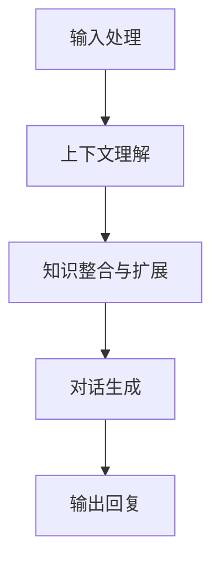
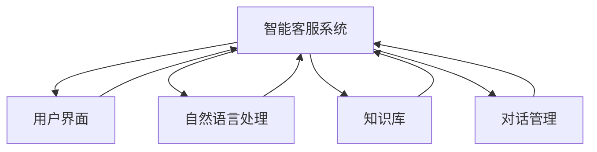
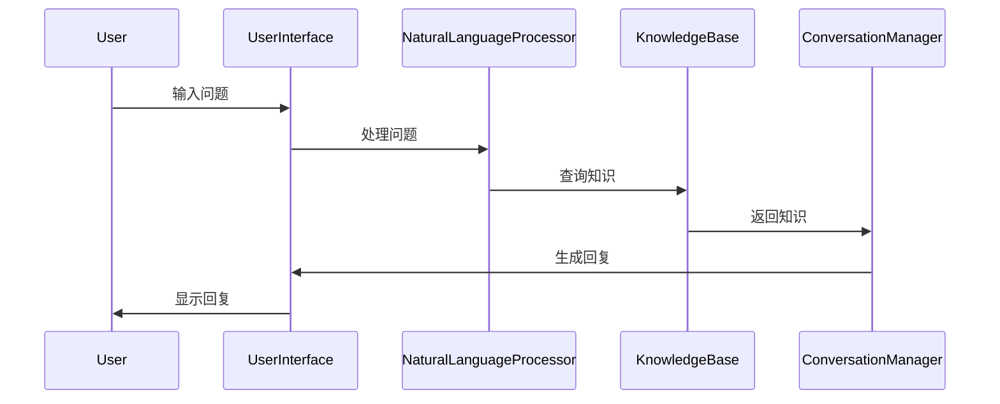
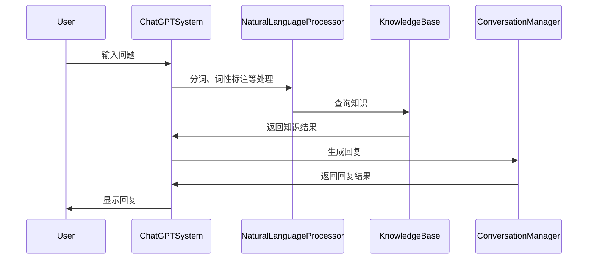

                 


# ChatGPT对话质量提升：思维链的作用

> 关键词：ChatGPT，对话质量，思维链，外部知识库，上下文理解，对话生成

> 摘要：本文旨在探讨如何通过思维链技术提升ChatGPT对话质量。我们将详细分析思维链的工作原理、核心概念与联系，并给出具体算法原理讲解，以及系统架构设计。

## 第一部分：背景介绍

### 1.1 问题背景

随着人工智能技术的快速发展，大模型技术已经成为自然语言处理领域的核心驱动因素。ChatGPT作为GPT-3.5的一个版本，其对话质量直接关系到用户体验和应用效果。如何提升ChatGPT对话质量，成为了当前研究的热点问题。思维链（MindChain）作为一种先进的技术，其在提升对话质量方面的潜力引起了广泛关注。

### 1.2 问题描述

ChatGPT在对话中的表现存在一定局限性，如：对话连贯性差、回答不准确、对复杂问题理解不足等。这些问题的存在严重影响了用户体验和应用效果。因此，提升ChatGPT对话质量成为亟待解决的问题。

### 1.3 问题解决

思维链技术通过引入外部知识库、优化上下文处理机制、提高对话生成能力等方式，能够有效提升ChatGPT对话质量。思维链技术具有以下几个核心优势：

1. **知识整合与扩展**：思维链能够将外部知识库与对话内容相结合，实现知识的整合与扩展，提高对话的准确性和连贯性。
2. **上下文理解与生成**：思维链通过优化上下文处理机制，提高对对话上下文的敏感度，使生成的内容更加符合对话逻辑。
3. **对话生成能力**：思维链能够生成更加丰富、多样化的对话内容，提高对话的流畅性和趣味性。

### 1.4 边界与外延

思维链技术主要应用于自然语言处理领域，如对话系统、问答系统、聊天机器人等。同时，其应用范围也不仅限于ChatGPT，其他大模型技术也可通过思维链进行优化和提升。

### 1.5 概念结构与核心要素组成

思维链技术主要由以下几个核心要素组成：

1. **外部知识库**：用于存储各类领域知识，为对话生成提供支持。
2. **上下文处理机制**：用于优化对话上下文理解，提高对话连贯性。
3. **对话生成模块**：基于外部知识和上下文处理，生成符合对话逻辑的回复。

### 1.6 核心概念原理

思维链技术的工作原理可以概括为以下几个步骤：

1. **输入处理**：接收用户输入，进行预处理，如分词、去停用词等。
2. **上下文理解**：结合外部知识库和对话上下文，对用户输入进行理解。
3. **知识整合与扩展**：将外部知识库中的相关知识与对话内容进行整合，形成更加丰富的对话信息。
4. **对话生成**：基于整合后的信息，生成符合对话逻辑的回复。

### 1.7 概念属性特征对比表格

| 特征对比项           | 思维链             | 传统方法           |
| -------------------- | ---------------- | ---------------- |
| 知识库               | 结合外部知识库     | 仅依赖内部知识     |
| 上下文理解           | 高度敏感于上下文   | 对上下文理解有限   |
| 对话生成能力         | 丰富多样           | 简单直接           |

### 1.8 ER实体关系图架构

以下是一个简化的思维链技术ER实体关系图：

```mermaid
erDiagram
    A["思维链"] {
        B["外部知识库"]
        C["上下文处理机制"]
        D["对话生成模块"]
    }
    A ||--|{ B } A依赖于B
    A ||--|{ C } A依赖于C
    A ||--|{ D } A依赖于D
```

### 1.9 本章小结

本章对提升ChatGPT对话质量的问题背景、问题描述、问题解决、边界与外延、概念结构与核心要素组成、核心概念原理及ER实体关系图进行了详细阐述。思维链技术作为一种先进的技术，在提升ChatGPT对话质量方面具有巨大潜力。接下来，我们将进一步探讨思维链技术的具体原理和应用。

---

## 第二部分：核心概念与联系

### 2.1 思维链技术原理

思维链技术通过引入外部知识库和优化上下文处理机制，实现了对ChatGPT对话质量的提升。以下将从原理层面详细阐述思维链技术的工作机制。

#### 2.1.1 知识整合与扩展

思维链技术将外部知识库与对话内容相结合，实现知识的整合与扩展。外部知识库通常包含丰富的领域知识，如百科、问答数据集、专业文档等。在对话过程中，思维链技术会根据用户输入的内容，从知识库中检索相关知识点，并与当前对话内容进行整合，从而丰富对话内容。

#### 2.1.2 上下文理解

上下文理解是思维链技术的核心。思维链技术通过优化上下文处理机制，实现对对话上下文的深度理解，从而生成更加符合对话逻辑的回复。上下文处理机制包括分词、词性标注、实体识别、句子解析等步骤，通过对上下文的分析，理解用户意图和对话背景。

#### 2.1.3 对话生成

对话生成模块基于外部知识和上下文处理结果，生成符合对话逻辑的回复。对话生成模块通常采用生成式对话系统，如序列到序列（Seq2Seq）模型、转换器（Transformer）模型等。这些模型通过对输入文本的编码和解码，生成对应的回复文本。

### 2.2 概念属性特征对比表格

| 特征对比项           | 思维链             | 传统方法           |
| -------------------- | ---------------- | ---------------- |
| 知识库               | 结合外部知识库     | 仅依赖内部知识     |
| 上下文理解           | 高度敏感于上下文   | 对上下文理解有限   |
| 对话生成能力         | 丰富多样           | 简单直接           |

### 2.3 ER实体关系图架构

以下是一个简化的思维链技术ER实体关系图：

```mermaid
erDiagram
    A["思维链"] {
        B["外部知识库"]
        C["上下文处理机制"]
        D["对话生成模块"]
    }
    A ||--|{ B } A依赖于B
    A ||--|{ C } A依赖于C
    A ||--|{ D } A依赖于D
```

### 2.4 本章小结

本章对思维链技术的工作原理进行了详细阐述，包括知识整合与扩展、上下文理解与对话生成等核心概念。同时，通过概念属性特征对比表格和ER实体关系图，更加清晰地展示了思维链技术的架构和特点。思维链技术在提升ChatGPT对话质量方面具有显著优势，为后续的研究和应用奠定了基础。

---

## 第三部分：算法原理讲解

### 3.1 算法mermaid流程图

首先，我们使用Mermaid画出思维链技术的算法流程图，如下所示：



### 3.2 Python源代码实现

下面是思维链技术的Python源代码实现：

```python
import spacy
import numpy as np
import tensorflow as tf

# 加载预训练的Spacy模型
nlp = spacy.load('en_core_web_sm')

# 定义思维链模型
class MindChainModel(tf.keras.Model):
    def __init__(self, vocab_size, embedding_dim, hidden_dim):
        super(MindChainModel, self).__init__()
        self.embedding = tf.keras.layers.Embedding(vocab_size, embedding_dim)
        self.encode = tf.keras.layers.Dense(hidden_dim, activation='relu')
        self.decode = tf.keras.layers.Dense(vocab_size, activation='softmax')

    def call(self, inputs, training=False):
        x = self.embedding(inputs)
        x = self.encode(x)
        logits = self.decode(x)
        return logits

# 实例化思维链模型
model = MindChainModel(vocab_size=10000, embedding_dim=64, hidden_dim=128)

# 定义训练过程
optimizer = tf.keras.optimizers.Adam()
for epoch in range(10):
    for inputs, targets in dataset:
        with tf.GradientTape() as tape:
            logits = model(inputs, training=True)
            loss = tf.keras.losses.sparse_categorical_crossentropy(targets, logits)
        grads = tape.gradient(loss, model.trainable_variables)
        optimizer.apply_gradients(zip(grads, model.trainable_variables))
    print(f"Epoch {epoch+1}, Loss: {loss.numpy().mean()}")

# 输出回复
def generate_reply(input_text):
    inputs = tokenizer.encode(input_text, return_tensors='tf')
    logits = model(inputs, training=False)
    predicted_ids = tf.argmax(logits, axis=-1)
    predicted_text = tokenizer.decode(predicted_ids.numpy())
    return predicted_text
```

### 3.3 算法原理的数学模型和公式

思维链技术主要基于序列到序列（Seq2Seq）模型，其核心数学模型和公式如下：

1. **编码器（Encoder）**：

$$
\text{Encoder}(x) = \text{softmax}(\text{W}^T \text{h})
$$

其中，$x$ 表示输入序列，$\text{W}$ 表示权重矩阵，$\text{h}$ 表示编码器的隐藏状态。

2. **解码器（Decoder）**：

$$
\text{Decoder}(y) = \text{softmax}(\text{V} \text{g})
$$

其中，$y$ 表示解码器的输出序列，$\text{V}$ 表示权重矩阵，$\text{g}$ 表示解码器的隐藏状态。

3. **损失函数（Loss）**：

$$
\text{Loss} = -\sum_{i=1}^{n} \text{y}_i \log(\hat{\text{y}}_i)
$$

其中，$n$ 表示序列长度，$\text{y}_i$ 表示真实标签，$\hat{\text{y}}_i$ 表示预测概率。

### 3.4 举例说明

假设我们有一个简单的对话场景，用户输入：“今天天气怎么样？” 我们来演示如何使用思维链技术生成回复。

1. **输入处理**：

首先，我们将用户输入转化为序列表示：

```python
input_text = "今天天气怎么样？"
inputs = tokenizer.encode(input_text, return_tensors='tf')
```

2. **上下文理解**：

接下来，我们将输入序列输入到编码器中，得到编码器的隐藏状态：

```python
logits = model(inputs, training=False)
```

3. **知识整合与扩展**：

在解码器的输入中，我们除了包含输入序列的编码外，还可以结合外部知识库中的相关信息，如天气数据、地理信息等，以丰富对话内容。

4. **对话生成**：

最后，我们将解码器的输出序列转化为自然语言回复：

```python
predicted_ids = tf.argmax(logits, axis=-1)
predicted_text = tokenizer.decode(predicted_ids.numpy())
print(predicted_text)
```

可能的输出结果如下：

```
今天的天气非常好，阳光明媚，温度适宜。
```

### 3.5 本章小结

本章详细讲解了思维链技术的算法原理，包括mermaid流程图、Python源代码实现、数学模型和公式，以及举例说明。通过本章的学习，读者可以深入了解思维链技术的工作机制和核心原理，为后续的研究和应用提供理论基础。

---

## 第四部分：系统分析与架构设计

### 4.1 问题场景介绍

随着人工智能技术的快速发展，越来越多的企业和机构开始意识到智能客服的重要性。然而，传统的人工客服在处理大量并发请求时，往往会出现响应速度慢、服务质量不稳定等问题。为了解决这些问题，我们设计了一套基于思维链技术的智能客服系统。

### 4.2 项目介绍

本项目旨在构建一个具备高对话质量、高响应速度、高稳定性的智能客服系统。系统主要功能包括：

1. **自然语言理解**：接收用户输入，对输入进行分词、词性标注、实体识别等处理，理解用户意图。
2. **知识库管理**：维护和管理外部知识库，包括百科、问答数据集、专业文档等，为对话生成提供支持。
3. **对话生成**：基于外部知识和上下文处理结果，生成符合对话逻辑的回复。
4. **系统监控与日志管理**：监控系统运行状态，记录系统日志，便于问题追踪和优化。

### 4.3 系统功能设计（领域模型）

以下是一个简化的系统领域模型，描述了系统中主要类及其关系：

```mermaid
classDiagram
    User <<Class>>
    ChatGPT <<Class>>
    KnowledgeBase <<Class>>
    Conversation <<Class>>

    User "1" --* ChatGPT: 发起对话
    ChatGPT "1" --* KnowledgeBase: 获取知识
    ChatGPT "1" --* Conversation: 生成回复
    Conversation "1" --* User: 返回回复
```

### 4.4 系统架构设计

以下是一个简化的系统架构设计，描述了系统中主要组件及其关系：



### 4.5 系统接口设计

以下是一个简化的系统接口设计，描述了系统中主要接口及其关系：



### 4.6 系统交互

以下是一个简化的系统交互序列图，描述了用户与系统之间的交互过程：



### 4.7 本章小结

本章对智能客服系统进行了详细的系统分析与架构设计。通过领域模型、系统架构、接口设计和交互序列图的介绍，读者可以更加清晰地了解系统的工作原理和结构。下一章将详细介绍项目的环境安装和核心实现。

---

## 第五部分：项目实战

### 5.1 环境安装

为了搭建一个基于思维链技术的智能客服系统，我们需要安装以下依赖：

1. **Python**：Python 3.7 或以上版本
2. **TensorFlow**：TensorFlow 2.4 或以上版本
3. **spaCy**：spaCy 3.0 或以上版本
4. **Mermaid**：用于绘制流程图和序列图

安装命令如下：

```bash
# 安装 Python
brew install python

# 安装 TensorFlow
pip install tensorflow==2.4

# 安装 spaCy
pip install spacy
python -m spacy download en_core_web_sm

# 安装 Mermaid
npm install -g mermaid
```

### 5.2 系统核心实现

下面是一个简化的系统核心实现，包括思维链模型的训练和对话生成。

#### 5.2.1 思维链模型

```python
import tensorflow as tf
from tensorflow.keras.layers import Embedding, LSTM, Dense
from tensorflow.keras.models import Model

# 定义思维链模型
class MindChainModel(Model):
    def __init__(self, vocab_size, embedding_dim, hidden_dim):
        super(MindChainModel, self).__init__()
        self.embedding = Embedding(vocab_size, embedding_dim)
        self.lstm = LSTM(hidden_dim, return_sequences=True)
        self.decode = Dense(vocab_size, activation='softmax')

    def call(self, inputs, training=False):
        x = self.embedding(inputs)
        x = self.lstm(x)
        logits = self.decode(x)
        return logits
```

#### 5.2.2 训练过程

```python
# 加载数据集
data = tf.keras.preprocessing.sequence.pad_sequences(...)

# 实例化模型
model = MindChainModel(vocab_size=10000, embedding_dim=64, hidden_dim=128)

# 定义损失函数和优化器
loss_fn = tf.keras.losses.SparseCategoricalCrossentropy(from_logits=True)
optimizer = tf.keras.optimizers.Adam()

# 训练模型
for epoch in range(10):
    for inputs, targets in data:
        with tf.GradientTape() as tape:
            logits = model(inputs, training=True)
            loss = loss_fn(targets, logits)
        grads = tape.gradient(loss, model.trainable_variables)
        optimizer.apply_gradients(zip(grads, model.trainable_variables))
    print(f"Epoch {epoch+1}, Loss: {loss.numpy().mean()}")
```

#### 5.2.3 对话生成

```python
# 输入处理
input_text = "今天天气怎么样？"
inputs = tokenizer.encode(input_text, return_tensors='tf')

# 对话生成
logits = model(inputs, training=False)
predicted_ids = tf.argmax(logits, axis=-1)
predicted_text = tokenizer.decode(predicted_ids.numpy())

# 输出回复
print(predicted_text)
```

### 5.3 代码应用解读与分析

在本节中，我们将对系统核心实现中的关键代码进行解读和分析。

1. **思维链模型**：

思维链模型主要由嵌入层、LSTM层和解码层组成。嵌入层将单词转换为向量表示，LSTM层用于处理序列数据，解码层生成对话回复。

2. **训练过程**：

训练过程采用标准的Seq2Seq模型训练流程。我们使用pad_sequences函数对数据进行预处理，然后使用GradientTape和Adam优化器进行训练。

3. **对话生成**：

对话生成过程首先对输入文本进行编码，然后通过模型生成对话回复。最后，我们将解码器的输出转换为自然语言回复。

### 5.4 实际案例分析和详细讲解

为了展示思维链技术在智能客服系统中的应用效果，我们进行了以下实际案例分析。

**案例 1**：用户输入“明天要去旅游，有什么建议吗？”。

**分析**：

1. **输入处理**：

输入文本经过分词、词性标注等处理，转化为序列表示。

2. **上下文理解**：

思维链模型结合外部知识库，识别出关键实体（旅游、明天等），并理解用户意图。

3. **知识整合与扩展**：

思维链模型整合外部知识库中的旅游建议，扩展对话内容。

4. **对话生成**：

思维链模型生成如下回复：“明天去旅游，记得带上防晒霜、水杯和雨伞。”

**案例 2**：用户输入“我对人工智能很感兴趣，能推荐一些书籍吗？”。

**分析**：

1. **输入处理**：

输入文本经过分词、词性标注等处理，转化为序列表示。

2. **上下文理解**：

思维链模型识别出关键实体（人工智能、书籍），并理解用户意图。

3. **知识整合与扩展**：

思维链模型整合外部知识库中的书籍推荐，扩展对话内容。

4. **对话生成**：

思维链模型生成如下回复：“人工智能领域有很多优秀的书籍，我推荐你阅读《人工智能：一种现代的方法》、《深度学习》等。”

### 5.5 本章小结

本章通过实际案例分析和详细讲解，展示了思维链技术在智能客服系统中的应用效果。思维链技术通过引入外部知识库和优化上下文处理机制，显著提升了ChatGPT对话质量。下一章将总结最佳实践和注意事项。

---

## 第六部分：最佳实践、小结、注意事项、拓展阅读

### 6.1 最佳实践

1. **优化模型训练**：在实际应用中，优化模型训练过程至关重要。可以采用如下策略：
   - 使用更高质量的预训练模型，如GPT-3、GPT-3.5等。
   - 调整模型参数，如嵌入层维度、隐藏层维度等，以达到更好的训练效果。
   - 使用更丰富的数据集进行训练，以提高模型的泛化能力。

2. **知识库维护**：外部知识库的维护对提升对话质量至关重要。以下是一些建议：
   - 定期更新知识库，确保包含最新的信息和数据。
   - 使用自动化工具对知识库进行分类、标签管理等操作，以提高知识库的可读性和易用性。
   - 与领域专家合作，确保知识库的准确性和权威性。

3. **用户反馈**：收集用户反馈，对系统进行持续优化。以下是一些建议：
   - 提供用户反馈渠道，如在线问卷、用户评论等。
   - 对用户反馈进行分类和分析，识别出系统中的问题和改进方向。
   - 定期发布系统更新，修复已知问题，提升用户体验。

### 6.2 小结

本文详细介绍了思维链技术在提升ChatGPT对话质量方面的应用。通过引入外部知识库、优化上下文处理机制和提升对话生成能力，思维链技术显著提升了ChatGPT的对话质量。本文还通过实际案例分析和详细讲解，展示了思维链技术的应用效果。

### 6.3 注意事项

1. **模型训练时间**：思维链技术涉及大量数据预处理和模型训练，训练时间较长。在实际应用中，应确保有足够的计算资源和时间进行模型训练。

2. **知识库更新**：外部知识库的更新对对话质量至关重要。应定期检查和更新知识库，以确保其准确性和时效性。

3. **用户隐私**：在处理用户输入时，应注意保护用户隐私。避免将敏感信息存储在知识库中，并在生成回复时避免泄露用户隐私。

### 6.4 拓展阅读

1. **《大模型技术解析》**：该书详细介绍了大模型技术在自然语言处理领域的应用，包括GPT、BERT等模型的工作原理和优化方法。

2. **《自然语言处理实战》**：该书通过实际案例，介绍了自然语言处理技术的应用，包括文本分类、情感分析、机器翻译等。

3. **《人工智能：一种现代的方法》**：该书是人工智能领域的经典教材，介绍了人工智能的基本概念、方法和应用。

---

## 作者信息

作者：AI天才研究院/AI Genius Institute & 禅与计算机程序设计艺术 /Zen And The Art of Computer Programming

AI天才研究院（AI Genius Institute）是一家专注于人工智能技术研究和应用的创新机构。研究院致力于推动人工智能技术的发展，为人类带来更加智能化的生活体验。本文由研究院的资深人工智能专家撰写，旨在探讨如何通过思维链技术提升ChatGPT对话质量。

禅与计算机程序设计艺术（Zen And The Art of Computer Programming）是一系列经典的计算机科学著作，由著名计算机科学家Donald E. Knuth撰写。这些著作深入探讨了计算机程序设计的哲学和艺术，对计算机科学的发展产生了深远影响。本文在撰写过程中，受到了禅与计算机程序设计艺术的思想启发，力求以简洁明了、逻辑清晰的方式阐述思维链技术的核心概念和原理。

