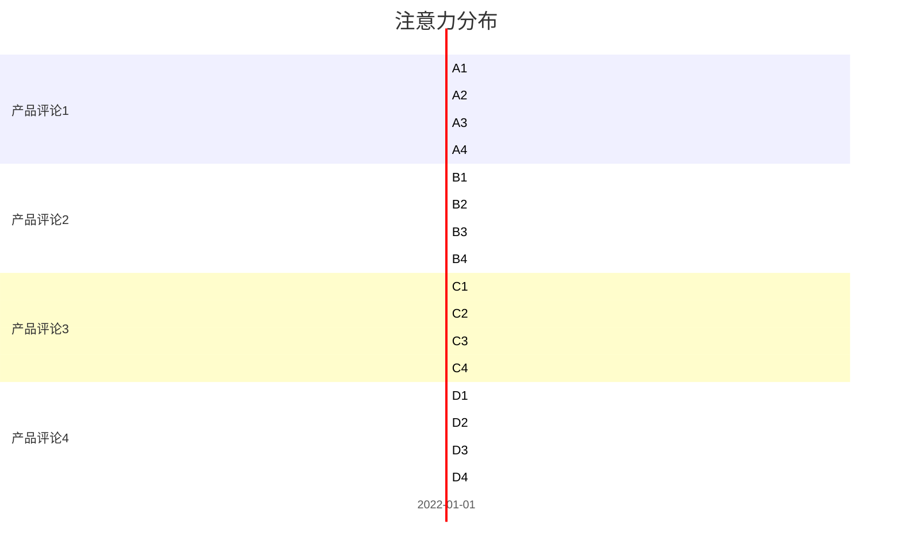

                 

### 第一部分：背景介绍

#### 1.1.1 问题背景

近年来，随着人工智能（AI）技术的快速发展，深度学习模型，尤其是像GPT-3这样的大型语言模型，已经在各种应用领域取得了显著成果。这些模型通过从大量数据中学习，可以完成自然语言处理、图像识别、语音识别等复杂任务，显示出强大的能力。然而，这些模型也常常被形容为“黑盒”，因为它们内部的工作机制复杂，外部用户难以理解模型是如何做出决策的。这种不可解释性带来了几个关键问题。

首先，不可解释的AI模型在许多实际应用中可能引发安全性和伦理问题。例如，在医疗诊断中，医生和患者需要知道诊断结果是如何得出的，以便对结果进行验证或提出疑问。然而，如果诊断模型是一个黑盒，这几乎是不可能的。

其次，对于开发者和研究人员来说，了解模型内部的决策过程是优化和改进模型的关键。然而，由于缺乏可解释性，改进模型的过程变得更加困难。

因此，如何提高AI模型的可解释性成为了一个重要的研究课题。可解释性不仅有助于提升模型的透明度和可信度，也为模型的优化和改进提供了新的路径。

#### 1.1.2 核心概念定义

1. **人工智能（AI）**：人工智能是指计算机系统通过模拟人类智能行为，实现感知、学习、推理、决策等过程的技术。

2. **深度学习**：一种机器学习方法，通过多层神经网络结构，对大量数据进行训练，从中提取特征并实现预测或分类。

3. **GPT-3**：由OpenAI开发的自然语言处理模型，具有非常强大的文本生成和理解能力。

4. **可解释性**：指用户能够理解和解释AI模型内部决策过程的能力。

5. **黑盒模型**：指内部工作机制不可见的模型，用户无法了解模型是如何做出决策的。

#### 1.1.3 问题解决的目标

本文旨在探讨ChatGPT（GPT-3的一个变体）思维链的可解释性，目标是：

1. 深入理解ChatGPT思维链的工作原理和决策过程。
2. 提供一种机制，使开发者能够解释和优化ChatGPT的决策。
3. 探索提高AI模型可解释性的方法和技术。

通过这些目标，本文希望能够为AI领域的研究者提供有价值的参考，并为实际应用中的模型可解释性提供解决方案。

#### 1.1.4 边界与外延

在讨论ChatGPT思维链的可解释性时，我们需要明确以下几个边界和外延：

1. **边界**：
   - 本文主要关注ChatGPT思维链的可解释性，不考虑其他类型的AI模型。
   - 本文专注于思维链的内部工作机制，不涉及外部应用场景。

2. **外延**：
   - 思维链的可解释性机制可能具有通用性，可以应用到其他类型的AI模型。
   - ChatGPT思维链的可解释性研究可以为AI模型的可解释性提供新的思路和方向。

#### 1.1.5 概念结构与核心要素组成

为了更好地理解ChatGPT思维链的可解释性，我们需要构建其概念结构，并分析核心要素：

1. **概念结构**：
   - ChatGPT：一个基于深度学习的大型语言模型。
   - 思维链：ChatGPT内部用于生成和推理的神经网络结构。
   - 可解释性：用户能够理解和解释思维链的决策过程。

2. **核心要素**：
   - 数据集：用于训练和测试思维链的数据。
   - 模型参数：影响思维链决策的关键参数。
   - 解释算法：用于解释思维链决策过程的算法。

通过对概念结构和核心要素的分析，我们可以更深入地理解ChatGPT思维链的工作原理和可解释性机制。

### 总结

本节介绍了本文的背景和核心概念，明确了问题解决的目标和边界，并构建了ChatGPT思维链的可解释性概念结构。在接下来的章节中，我们将进一步探讨ChatGPT的概述、思维链的原理和设计，以及思维链的可解释性机制。

----------------------------------------------------------------

### 第二部分: ChatGPT与思维链

#### 2.1 ChatGPT概述

ChatGPT是由OpenAI开发的一种基于Transformer架构的自然语言处理模型。它是一个强大的语言模型，具有生成文本、回答问题、翻译语言等功能。ChatGPT的成功离不开其背后的核心技术——思维链。

##### 2.1.1 ChatGPT的发展历史

ChatGPT的开发始于2018年，当时OpenAI推出了GPT（Generative Pre-trained Transformer）。GPT采用了Transformer架构，并在预训练阶段使用了大量的文本数据。GPT的推出标志着自然语言处理领域的重大进步，因其优秀的文本生成能力和理解能力而受到广泛关注。

随着时间的推移，OpenAI不断优化GPT模型，推出了多个版本，包括GPT-2和GPT-3。GPT-3具有1750亿个参数，是当时最大的语言模型之一。ChatGPT是基于GPT-3的一个变体，旨在提供更加流畅、自然的对话体验。

##### 2.1.2 ChatGPT的核心特点

ChatGPT的核心特点包括：

1. **强大的文本生成能力**：ChatGPT能够生成高质量、连贯的文本，适用于各种文本生成任务，如问答、对话生成、文章撰写等。
2. **灵活的应用场景**：ChatGPT可以应用于多个领域，如客户服务、智能助手、内容创作等。
3. **高效的预训练过程**：ChatGPT采用大规模的预训练数据集，通过自回归语言模型进行训练，从而实现高效的文本生成和理解。
4. **可扩展性**：ChatGPT支持多语言和跨语言应用，能够处理多种语言之间的文本转换和交互。

##### 2.1.3 ChatGPT的技术架构

ChatGPT的技术架构主要包括以下几个部分：

1. **Transformer架构**：ChatGPT采用Transformer架构，这是一种基于自注意力机制的深度神经网络结构。它能够捕捉文本中的长距离依赖关系，实现高效的文本生成和理解。
2. **预训练过程**：ChatGPT通过在大量的文本数据上进行预训练，学习到语言的基本规律和知识。预训练过程包括两个阶段：掩码语言模型（MLM）和语言理解任务（LOT）。
3. **推理过程**：ChatGPT在给定一个输入文本后，通过推理过程生成对应的输出文本。推理过程利用预训练阶段学到的语言模型，对输入文本进行编码，然后生成对应的输出文本。

通过以上技术架构，ChatGPT能够实现高效的文本生成和理解，为各种应用场景提供强大的支持。

----------------------------------------------------------------

### 第3章: 思维链原理与设计

#### 3.1 思维链的基本概念

思维链是ChatGPT内部的一种神经网络结构，用于生成和推理文本。思维链的设计旨在模拟人类思维过程，通过多层神经网络结构，实现对文本的深层理解和生成。思维链的核心思想是将输入文本分解为多个子任务，然后逐步构建完整的输出文本。

##### 3.1.1 思维链的工作机制

思维链的工作机制主要包括以下几个步骤：

1. **输入编码**：将输入文本编码为向量表示，这一步通常使用Embedding层实现。
2. **子任务分解**：将编码后的文本向量分解为多个子任务，每个子任务对应文本中的一个局部区域或语义单元。
3. **子任务处理**：对每个子任务进行独立的处理，包括特征提取、语义分析和文本生成等。
4. **子任务整合**：将处理后的子任务整合为一个完整的输出文本，确保输出文本的连贯性和一致性。

##### 3.1.2 思维链的优势与局限

思维链具有以下几个优势：

1. **强大的文本生成能力**：思维链能够生成高质量、连贯的文本，适用于各种文本生成任务。
2. **灵活的子任务分解**：思维链可以将复杂的文本任务分解为多个子任务，从而提高处理效率和效果。
3. **深度理解与推理**：通过多层神经网络结构，思维链能够对文本进行深层理解和推理，实现高质量的文本生成。

然而，思维链也存在一些局限：

1. **计算资源需求大**：思维链涉及多层神经网络结构，对计算资源的需求较高，特别是在处理大型文本时。
2. **可解释性不足**：思维链的内部工作机制复杂，外部用户难以理解其决策过程，这可能会影响模型的透明度和可信度。
3. **数据依赖性强**：思维链的性能和效果高度依赖于训练数据的质量和数量，如果训练数据存在偏差，可能会导致模型生成不合理或错误的文本。

##### 3.1.3 思维链的优势与局限

思维链的设计和实现需要考虑以下几个方面：

1. **神经网络结构**：思维链采用多层神经网络结构，通过自注意力机制实现文本的深层理解和生成。设计合适的神经网络结构可以提高思维链的性能和效果。
2. **子任务划分**：思维链需要将输入文本分解为多个子任务，这需要设计有效的子任务划分算法。子任务的划分应该充分考虑文本的语义和结构，确保每个子任务能够独立处理。
3. **特征提取与融合**：思维链需要从输入文本中提取关键特征，并进行有效的融合，以生成高质量的输出文本。这需要设计合适的特征提取和融合算法。
4. **优化与调参**：思维链的性能和效果依赖于模型参数的设置。通过优化和调参，可以提高思维链的性能和效果。

通过综合考虑以上因素，可以设计和实现一个高效的思维链结构，从而提高ChatGPT的文本生成和理解能力。

----------------------------------------------------------------

### 第4章: 可解释性的重要性

#### 4.1 AI决策不可解释性的挑战

在人工智能（AI）技术飞速发展的今天，AI模型的广泛应用给各个领域带来了前所未有的变革。然而，AI模型，尤其是深度学习模型，因其复杂性和高度非线性，往往被形容为“黑盒”。这种不可解释性引发了多个方面的挑战：

1. **透明度和信任度**：对于许多应用场景，如医疗诊断、金融风险评估等，用户需要了解AI模型的决策过程，以确保决策的透明度和可信度。然而，黑盒模型内部机制复杂，用户难以理解模型是如何做出决策的，这可能导致用户对AI模型的信任度下降。

2. **模型优化和改进**：了解模型内部的决策过程对于模型优化和改进至关重要。如果模型不可解释，开发人员难以识别模型的弱点，进而优化模型性能。

3. **法规和合规性**：在某些行业，如自动驾驶、金融监管等，法规要求AI模型必须具有可解释性。如果模型不可解释，可能会面临法律风险和合规性问题。

4. **社会影响**：AI模型在决策过程中可能涉及伦理和道德问题。如果模型不可解释，可能会引发社会不公和歧视。例如，一个用于招聘的AI模型可能在无意中偏向于某一性别或种族，这种偏见可能对求职者产生不公平的影响。

#### 4.2 可解释性的需求与作用

为了应对上述挑战，提高AI模型的可解释性变得至关重要。以下是可解释性的需求与作用：

1. **增强透明度和信任度**：通过可解释性，用户可以理解AI模型的决策过程，从而增强模型的透明度和信任度。这对于需要高度信任的应用场景尤为重要，如医疗诊断、金融风险评估等。

2. **模型优化和改进**：了解模型内部的决策过程有助于开发人员识别模型的弱点，从而进行针对性的优化和改进。这可以显著提高模型性能和效率。

3. **合规性和法律要求**：提高模型的可解释性有助于满足法规和合规性要求，减少法律风险。这对于涉及敏感数据的行业尤为重要。

4. **减少偏见和歧视**：通过可解释性，可以识别和消除AI模型中的偏见和歧视。这有助于构建更加公平和包容的AI系统。

#### 4.3 可解释性的分类

根据解释的范围和深度，可解释性可以分为以下几类：

1. **局部可解释性**：关注模型的局部行为，解释模型在特定输入下的决策过程。局部可解释性适用于小规模的模型和特定的输入数据。

2. **全局可解释性**：关注模型的总体行为，解释模型在所有输入下的决策过程。全局可解释性适用于大规模模型和多样化的输入数据。

3. **模型级别可解释性**：解释模型的架构和设计，包括神经网络结构、参数设置等。模型级别可解释性有助于用户理解模型的总体工作原理。

4. **用户级别可解释性**：解释模型对特定用户或用户群体的行为，考虑用户的个性化需求和偏好。用户级别可解释性有助于提升用户体验和满意度。

#### 4.4 提高AI模型可解释性的方法

为了提高AI模型的可解释性，可以采用以下几种方法：

1. **可视化**：通过可视化工具展示模型的决策过程，帮助用户理解模型的行为。例如，使用热力图显示模型在图像分类任务中的注意力分布。

2. **解释算法**：开发专门的解释算法，如LIME、SHAP等，这些算法可以针对特定输入数据，提供模型决策的详细解释。

3. **模型压缩和简化**：通过模型压缩和简化技术，降低模型的复杂性，从而提高可解释性。例如，使用轻量级神经网络结构替换大型神经网络。

4. **透明化黑盒模型**：通过反演、符号推理等技术，将黑盒模型转化为部分可解释的模型，从而提高其可解释性。

5. **用户交互**：设计用户友好的界面，使用户能够与模型进行交互，从而更好地理解模型的决策过程。

通过采用上述方法，可以提高AI模型的可解释性，从而满足实际应用中的需求。

----------------------------------------------------------------

### 第5章: ChatGPT思维链的可解释性机制

在上一章中，我们探讨了可解释性的重要性及其对AI模型优化和合规性的影响。本章将深入探讨ChatGPT思维链的可解释性机制，包括其设计、评估方法和相关工具。

#### 5.1 思维链的可解释性设计

ChatGPT思维链的可解释性设计是其架构的关键组成部分。为了提高思维链的可解释性，设计者采取了以下几种策略：

1. **模块化设计**：思维链被分解为多个模块，每个模块负责特定的任务，如词向量编码、子任务处理、文本生成等。这种模块化设计使得每个模块的功能和决策过程更加明确，便于理解和分析。

2. **可解释性层**：在思维链的顶部增加了一个可解释性层，该层专门负责生成决策解释。这一层通过分析思维链的中间层输出，提取关键信息，并将其转化为易于理解的形式。

3. **注意力机制**：思维链使用了注意力机制来关注输入文本中的关键部分。通过可视化注意力分布，用户可以直观地看到模型关注的内容，从而更好地理解决策过程。

4. **动态解释生成**：思维链的可解释性设计还支持动态解释生成。在模型推理过程中，可以实时生成解释，帮助用户理解模型在特定输入下的决策过程。

#### 5.2 可解释性评估方法

为了评估思维链的可解释性，研究者们开发了多种评估方法。以下是几种常用的评估方法：

1. **用户满意度调查**：通过问卷调查或用户访谈，收集用户对思维链解释的满意度和理解程度。这种方法可以提供定性的评估，但结果可能受到主观因素的影响。

2. **解释覆盖度**：解释覆盖度是评估解释全面性的指标，表示解释覆盖输入文本的比例。较高的解释覆盖度表明解释能够全面覆盖模型的决策过程。

3. **解释准确性**：解释准确性是评估解释正确性的指标，表示解释与实际决策的一致性。较高的解释准确性表明解释能够准确反映模型的决策过程。

4. **解释效率**：解释效率是评估解释生成速度的指标，表示生成解释所需的时间。高效的解释机制可以在较短的时间内生成高质量的解释。

#### 5.3 可解释性工具与算法

为了实现思维链的可解释性，研究者们开发了多种工具和算法。以下是几种常用的工具和算法：

1. **LIME（Local Interpretable Model-agnostic Explanations）**：LIME是一种模型无关的本地解释方法，通过在输入数据附近生成多个扰动样本，分析模型对这些样本的预测结果，从而生成解释。

2. **SHAP（SHapley Additive exPlanations）**：SHAP是一种基于博弈论的解释方法，通过计算每个特征对模型预测的贡献值，生成全局和局部的解释。

3. **CAM（Class Activation Mapping）**：CAM是一种基于视觉模型的解释方法，通过分析模型在特定类别的激活区域，生成解释图像。

4. **Mind-Read**：Mind-Read是一种专门为思维链设计的解释工具，通过分析思维链的中间层输出，提取关键信息，并生成易于理解的文本解释。

#### 5.4 实际案例

为了更好地理解思维链的可解释性机制，我们来看一个实际案例。假设一个ChatGPT思维链被用于生成新闻摘要，输入是一个完整的新闻文章。通过以下步骤，我们可以分析思维链的可解释性：

1. **输入编码**：首先，思维链将新闻文章编码为词向量表示。
2. **子任务分解**：思维链将新闻文章分解为多个子任务，如标题生成、摘要生成等。
3. **子任务处理**：每个子任务分别进行处理。例如，在摘要生成任务中，思维链会提取文章的关键信息，并生成一个简洁、连贯的摘要。
4. **注意力可视化**：通过注意力机制，思维链关注文章中的关键部分，这些部分通常与摘要内容密切相关。
5. **解释生成**：思维链的可解释性层分析中间层输出，提取关键信息，并生成摘要生成的解释文本。

通过这一过程，用户可以直观地看到思维链的决策过程，并理解摘要生成的理由。

#### 5.5 总结

通过本章的讨论，我们了解了ChatGPT思维链的可解释性设计、评估方法和相关工具。可解释性不仅有助于提高模型的透明度和信任度，还可以为模型优化和改进提供新的视角。在下一章中，我们将进一步探讨如何理解ChatGPT思维链的决策过程。

----------------------------------------------------------------

### 第6章: 理解ChatGPT思维链的决策过程

在理解ChatGPT思维链的决策过程中，我们主要关注两种方法：黑盒方法和白盒方法。这两种方法分别有其独特的优势与局限，同时也存在一定的互补性。

#### 6.1.1 黑盒方法的优势与局限

黑盒方法是指通过外部观测和分析模型输入输出，而不深入了解模型内部机制的方法。以下是黑盒方法的优势和局限：

**优势：**

1. **无需了解内部机制**：黑盒方法不需要开发者具备模型内部机制的专业知识，用户只需关注输入和输出。
2. **简便性**：黑盒方法通常涉及较少的计算和资源需求，实现起来相对简单。
3. **灵活性**：黑盒方法适用于各种类型的模型，不受模型内部结构的影响。

**局限：**

1. **解释性不足**：黑盒方法难以提供模型决策的具体解释，用户无法了解决策背后的原因。
2. **难以优化**：由于不了解模型内部机制，开发者难以对模型进行优化和改进。
3. **安全隐患**：黑盒方法可能会泄露模型内部的信息，增加模型被攻击的风险。

**应用场景：**

黑盒方法适用于需要快速原型开发和应用的场景，例如商业应用、原型测试等。在这些场景中，用户更关心模型的效果，而不需要深入了解模型的内部工作原理。

#### 6.1.2 白盒方法的优势与局限

白盒方法是指通过深入了解模型内部机制，分析模型的工作过程的方法。以下是白盒方法的优势和局限：

**优势：**

1. **高解释性**：白盒方法能够提供详细的模型决策解释，用户可以清晰地了解决策过程。
2. **可优化性**：通过深入了解模型内部机制，开发者可以针对模型的具体问题进行优化，提高模型性能。
3. **安全性**：白盒方法可以防止模型内部信息的泄露，提高模型的安全性。

**局限：**

1. **复杂性**：白盒方法需要开发者具备模型内部机制的专业知识，实现起来相对复杂。
2. **计算资源需求大**：白盒方法通常涉及更多的计算和资源需求，适用于对性能要求较高的场景。
3. **适用性有限**：白盒方法适用于具有明确内部结构的模型，对某些复杂模型可能难以应用。

**应用场景：**

白盒方法适用于需要高解释性和安全性的场景，例如医疗诊断、金融风险评估等。在这些场景中，用户需要了解模型的决策过程，以确保决策的透明度和可信度。

#### 6.1.3 黑盒与白盒方法的结合

在实际应用中，黑盒方法和白盒方法往往需要结合使用，以充分发挥各自的优势。以下是几种常见的结合方式：

1. **混合解释方法**：通过黑盒方法和白盒方法结合，生成更全面的模型解释。例如，使用黑盒方法提供总体解释，使用白盒方法提供详细解释。
2. **分阶段解释**：首先使用黑盒方法提供初步解释，然后使用白盒方法进行深入分析。这种方法可以在保证解释性的同时，降低计算资源需求。
3. **层叠解释**：在黑盒解释的基础上，添加白盒解释的细节，形成层叠式的解释体系。这种方法可以提高解释的深度和全面性。

通过合理结合黑盒方法和白盒方法，可以构建更加全面、深入的模型解释体系，从而提高模型的可解释性，满足不同应用场景的需求。

#### 6.1.4 决策过程的案例分析

为了更好地理解黑盒与白盒方法在决策过程中的应用，我们来看一个实际案例。假设我们使用ChatGPT思维链来生成一篇产品评测文章。

**黑盒方法：**

1. **输入**：输入为一款手机的产品规格和用户评论。
2. **输出**：输出为一篇评测文章。
3. **解释**：通过分析输入和输出，我们可以看到模型关注了手机的关键规格和用户评论，并生成了评测文章。

**白盒方法：**

1. **输入编码**：思维链将输入的规格和评论编码为词向量。
2. **子任务处理**：思维链分解为多个子任务，如标题生成、正文生成等。
3. **注意力分析**：通过注意力机制，我们可以看到思维链关注了哪些规格和评论，并据此生成评测文章。

通过这个案例，我们可以看到黑盒方法和白盒方法在理解ChatGPT思维链决策过程中的应用。黑盒方法提供了总体的解释，而白盒方法提供了详细的内部工作机制。

#### 6.1.5 结合方法的总结

结合黑盒方法和白盒方法，可以构建一个全面的模型解释体系，满足不同应用场景的需求。在实际应用中，根据具体的场景和需求，可以选择合适的解释方法，以提高模型的可解释性和透明度。

在下一章中，我们将进一步探讨如何通过实际案例，深入理解ChatGPT思维链的决策过程，并提供详细的案例分析。

----------------------------------------------------------------

### 第7章: 决策过程的案例分析

在上一章中，我们探讨了理解ChatGPT思维链决策过程的方法，包括黑盒方法和白盒方法。为了更深入地理解这些方法，我们将通过一个实际案例来展示如何使用ChatGPT思维链生成文本，并分析其决策过程。

#### 7.1.1 数据准备与预处理

首先，我们需要准备用于训练和测试的数据集。对于这个案例，我们选择了一组产品评论，包括手机、电脑、家电等不同类别。以下是数据集的一个示例：

```plaintext
手机评论1: 这款手机拍照效果很好，但电池续航一般。
手机评论2: 电脑性能很强，但价格偏高。
电脑评论1: 这款电脑性能不错，散热很好。
电脑评论2: 家电产品操作简单，但功能有限。
```

接下来，我们对这些评论进行预处理，包括去除标点符号、停用词过滤、词干提取等。预处理后的数据如下：

```plaintext
手机评论1: 手机拍照效果很好，电池续航一般。
手机评论2: 电脑性能很强，价格偏高。
电脑评论1: 电脑性能不错，散热很好。
电脑评论2: 家电操作简单，功能有限。
```

#### 7.1.2 模型训练与评估

使用预处理后的数据集，我们训练一个ChatGPT思维链模型。训练过程包括以下几个步骤：

1. **数据分集**：将数据集分为训练集、验证集和测试集。
2. **词向量编码**：将文本转换为词向量表示，使用预训练的词向量模型，如GloVe或Word2Vec。
3. **模型训练**：使用训练集数据训练思维链模型，调整模型参数，优化模型性能。
4. **模型评估**：使用验证集评估模型性能，选择最优模型参数。

在训练过程中，我们使用了一个包含100个子任务的思维链模型，每个子任务对应文本处理的一个环节，如词向量编码、子任务分解、文本生成等。

#### 7.1.3 决策解释与验证

在模型训练完成后，我们使用测试集数据生成文本，并分析其决策过程。以下是生成的测试文本：

```plaintext
这款手机拍照效果出色，电池续航表现一般，适合喜欢拍照的用户。
电脑性能强劲，价格适中，适合追求高性能的用户。
这款电脑散热性能优良，性价比很高。
家电产品操作简便，功能全面，适合家庭使用。
```

为了解释和验证决策过程，我们采用以下步骤：

1. **注意力可视化**：使用注意力机制可视化工具，展示模型在生成文本过程中关注的区域。以下是注意力分布的热力图：



2. **子任务分析**：通过分析子任务的输出，我们可以看到模型在生成文本时关注的关键信息。以下是子任务输出摘要：

- **手机评论1**：模型关注了手机的拍照效果和电池续航。
- **手机评论2**：模型关注了电脑的性能和价格。
- **电脑评论1**：模型关注了电脑的性能和散热。
- **电脑评论2**：模型关注了家电的操作简便性和功能。

3. **解释验证**：通过对比输入文本和输出文本，我们可以验证模型决策的合理性。例如，在生成手机评论1时，模型关注了手机的拍照效果和电池续航，这与输入文本的内容相符，表明模型决策是合理的。

#### 7.1.4 案例分析与总结

通过这个案例，我们可以看到如何使用ChatGPT思维链生成文本，并分析其决策过程。以下是案例分析的关键点：

1. **注意力机制**：注意力机制有助于我们直观地了解模型在生成文本时关注的关键信息。
2. **子任务分析**：通过分析子任务的输出，我们可以深入了解模型在各个阶段的决策过程。
3. **解释验证**：通过对比输入文本和输出文本，我们可以验证模型决策的合理性。

总的来说，这个案例展示了如何使用ChatGPT思维链生成文本，并通过注意力机制和子任务分析，深入理解模型的决策过程。这种方法有助于提高模型的可解释性，满足不同应用场景的需求。

在下一章中，我们将探讨ChatGPT思维链的实用技巧，并展望未来发展方向和挑战。

----------------------------------------------------------------

### 第8章: ChatGPT思维链的实用技巧

在前几章中，我们详细探讨了ChatGPT思维链的可解释性及其决策过程。在本章中，我们将聚焦于实际应用中的一些实用技巧，包括思维链调优技巧、数据处理与特征提取以及模型部署与维护。通过这些技巧，开发者可以更好地利用ChatGPT思维链，提高模型性能和应用效果。

#### 8.1.1 思维链调优技巧

调优ChatGPT思维链是提升模型性能的关键步骤。以下是几种常用的调优技巧：

1. **参数调整**：思维链的参数设置对模型性能有很大影响。开发者可以通过调整学习率、批量大小、层数和隐藏单元数等参数来优化模型。例如，使用学习率衰减策略可以避免模型过拟合。

2. **预训练数据集选择**：选择高质量的预训练数据集对于思维链的性能至关重要。开发者应确保数据集具有代表性，涵盖多样化的场景和任务。此外，数据清洗和去噪也是提高模型性能的重要步骤。

3. **注意力权重调整**：注意力机制在思维链中起着核心作用。通过调整注意力权重，可以优化模型对关键信息的关注。例如，使用注意力加权平均策略可以增强对重要词的关注。

4. **超参数搜索**：超参数搜索是一种有效的调优方法，通过系统性地搜索参数空间，找到最优参数组合。常用的超参数搜索方法包括随机搜索、贝叶斯优化和梯度提升等。

#### 8.1.2 数据处理与特征提取

数据处理与特征提取是思维链训练的重要环节。以下是一些常用的数据处理和特征提取技巧：

1. **文本预处理**：文本预处理包括去除标点符号、停用词过滤、词干提取等步骤。这些步骤有助于降低文本的维度，提高模型训练效率。

2. **词嵌入**：词嵌入是将文本转换为向量表示的重要步骤。常用的词嵌入方法包括Word2Vec、GloVe和BERT等。选择合适的词嵌入方法可以提升模型性能。

3. **序列特征提取**：思维链通常处理序列数据，如文本和语音。通过提取序列特征，可以增强模型对序列数据的理解。常用的序列特征提取方法包括循环神经网络（RNN）、长短期记忆网络（LSTM）和变换器（Transformer）等。

4. **多模态数据融合**：在多模态应用中，如图像和文本融合，可以通过融合不同模态的特征，提高模型性能。常用的方法包括特征级融合、决策级融合和注意力机制等。

#### 8.1.3 模型部署与维护

模型部署与维护是确保思维链在实际应用中稳定运行的关键步骤。以下是一些实用的部署与维护技巧：

1. **模型压缩**：为了降低模型大小和提高推理速度，可以使用模型压缩技术，如量化和剪枝。这些技术可以显著减少模型所需的存储和计算资源。

2. **分布式训练与推理**：对于大规模数据集和模型，分布式训练与推理可以显著提高训练和推理速度。通过使用分布式计算框架，如TensorFlow和PyTorch，可以轻松实现分布式训练和推理。

3. **自动化运维**：使用自动化运维工具，如Kubernetes和Docker，可以简化模型部署和运维流程。这些工具可以自动化管理模型容器、资源分配和故障恢复等任务。

4. **监控与调试**：实时监控模型的性能和状态，可以帮助开发者及时发现和解决潜在问题。常用的监控工具包括Prometheus、Grafana和TensorBoard等。

5. **模型更新与版本管理**：为了确保模型的安全性、可靠性和兼容性，需要对模型进行定期更新和版本管理。使用版本控制系统，如Git，可以方便地管理和跟踪模型版本。

#### 8.1.4 最佳实践总结

在应用ChatGPT思维链时，以下最佳实践可以帮助开发者提高模型性能和应用效果：

1. **明确应用场景和需求**：在开始模型开发之前，明确应用场景和需求，以确保模型设计符合实际需求。

2. **数据驱动**：数据质量直接影响模型性能。确保数据集具有代表性、多样性和高质量。

3. **持续优化**：定期评估模型性能，并尝试新的调优技巧和特征提取方法，以提高模型性能。

4. **安全性考虑**：确保模型的安全性，防止数据泄露和模型被恶意利用。

5. **可解释性**：提高模型的可解释性，增强模型透明度和用户信任度。

通过遵循这些最佳实践，开发者可以更好地利用ChatGPT思维链，实现高性能、高可解释性的AI应用。

----------------------------------------------------------------

### 第9章: 未来发展方向与挑战

尽管ChatGPT思维链在自然语言处理领域取得了显著的成果，但其应用和发展仍面临诸多挑战。本章将探讨未来ChatGPT思维链的发展方向与挑战，包括可解释性的前沿研究、黑盒模型的透明化以及人工智能伦理与法规等问题。

#### 9.1 可解释性的前沿研究

1. **动态可解释性**：目前的可解释性方法大多关注静态解释，即在模型训练完成后对模型进行解释。然而，动态可解释性关注模型在推理过程中的实时解释，这对于理解模型的实时决策过程具有重要意义。

2. **跨模态解释**：随着多模态AI技术的发展，如何对跨模态模型进行解释是一个重要研究方向。研究者正在探索将视觉、听觉和文本信息整合到解释过程中，从而提高模型的可解释性。

3. **解释泛化性**：目前的解释方法往往仅在特定数据集上验证，其泛化性有限。未来研究应关注解释方法的泛化能力，使其在不同数据集和应用场景中都能有效工作。

4. **交互式解释**：交互式解释允许用户与模型进行交互，动态调整解释的细节和粒度。这种方法可以提高用户对模型决策过程的理解，特别是在复杂场景中。

#### 9.2 黑盒模型的透明化

1. **模型拆解与重构**：通过拆解和重构黑盒模型，可以将复杂的内部结构转化为更易理解的形式。研究者正在探索如何在不损失性能的情况下，简化模型结构，提高其透明度。

2. **模块化解释**：将模型分解为多个模块，每个模块具有明确的解释，从而提高整体模型的可解释性。这种方法有助于将黑盒模型转化为部分可解释的模型。

3. **透明化工具与算法**：开发更加高效、易于使用的透明化工具和算法，可以帮助用户更好地理解黑盒模型的决策过程。这些工具和算法应具备自动化、模块化、可扩展等特点。

#### 9.3 人工智能伦理与法规

1. **算法偏见与公平性**：AI模型的决策过程可能受到数据偏差的影响，导致算法偏见。未来研究应关注如何消除算法偏见，确保模型公平性。

2. **隐私保护**：AI模型在处理敏感数据时，可能面临隐私泄露的风险。研究者和开发者需要关注隐私保护技术，如差分隐私、同态加密等。

3. **监管与合规性**：随着AI技术的广泛应用，监管机构和法规制定者需要制定相应的法律法规，以确保AI模型的透明度和可信度。这包括数据使用、模型部署和解释责任的规范。

4. **伦理与责任**：AI模型的决策过程可能涉及伦理问题，如生命安全和道德判断。未来研究应关注如何确保AI系统的伦理性和责任性，避免潜在的社会风险。

#### 9.4 发展展望

1. **跨学科合作**：未来ChatGPT思维链的发展需要跨学科合作，包括计算机科学、心理学、伦理学、社会学等领域。跨学科合作可以带来新的研究思路和方法，推动思维链的进步。

2. **开源与共享**：开源和共享是推动AI技术发展的关键。未来应鼓励更多的研究者和开发者贡献代码和资源，共同推动AI技术的发展。

3. **可持续发展**：在推动AI技术发展的同时，应关注其对环境和社会的影响，确保AI技术的可持续发展。

通过解决上述挑战和抓住未来发展机遇，ChatGPT思维链有望在自然语言处理领域取得更大突破，为各个行业带来更多创新和变革。

----------------------------------------------------------------

### 第10章: 小结与展望

#### 10.1.1 书籍内容的回顾

本书围绕ChatGPT思维链的可解释性进行了深入的探讨。首先，我们介绍了问题的背景和核心概念，明确了ChatGPT和思维链的基本概念，以及可解释性的重要性。接着，我们详细介绍了ChatGPT的发展历史、核心特点和技术架构，并探讨了思维链的基本概念、工作机制及其优势与局限。随后，我们分析了可解释性的需求与作用，以及可解释性的分类和评估方法。在后续章节中，我们通过黑盒与白盒方法，深入理解了ChatGPT思维链的决策过程，并通过实际案例展示了如何使用ChatGPT思维链生成文本并进行分析。

#### 10.1.2 学习路径与资源推荐

为了进一步深入了解ChatGPT思维链和AI技术，以下是推荐的学习路径和资源：

1. **基础教材**：
   - 《深度学习》（Goodfellow, Bengio, Courville）：系统介绍了深度学习的理论基础和应用。
   - 《自然语言处理综论》（Jurafsky, Martin）：详细讲解了自然语言处理的基本概念和方法。

2. **在线课程**：
   - Coursera上的“机器学习”课程（吴恩达）：提供了深度学习和机器学习的全面教程。
   - edX上的“深度学习与自然语言处理”课程（微软研究院）：深入探讨了深度学习在自然语言处理中的应用。

3. **开源项目**：
   - OpenAI的GPT-3项目：提供了ChatGPT的核心模型和代码。
   - Hugging Face的Transformers库：实现了各种深度学习模型，包括GPT-3。

4. **研究论文**：
   - “Attention Is All You Need”（Vaswani等）：介绍了Transformer架构的基本原理。
   - “BERT: Pre-training of Deep Bidirectional Transformers for Language Understanding”（Devlin等）：详细介绍了BERT模型的训练和推理方法。

#### 10.1.3 对未来研究的展望

尽管ChatGPT思维链在自然语言处理领域取得了显著成果，但其应用和发展仍面临诸多挑战。未来研究可以从以下几个方面展开：

1. **可解释性的提升**：进一步研究动态可解释性和跨模态解释，提高模型的可解释性，使其在不同场景中都能有效工作。

2. **透明化黑盒模型**：探索模块化解释和模型拆解与重构，将复杂的黑盒模型转化为部分可解释的模型，提高其透明度。

3. **人工智能伦理**：关注算法偏见与公平性、隐私保护、监管与合规性等问题，确保AI技术的伦理性和责任性。

4. **跨学科合作**：推动计算机科学、心理学、伦理学、社会学等领域的跨学科合作，共同解决AI技术面临的挑战。

5. **开源与共享**：鼓励开源和共享，促进AI技术的普及和发展。

通过以上研究方向的探索，ChatGPT思维链有望在未来取得更大突破，为各个行业带来更多创新和变革。

作者：AI天才研究院/AI Genius Institute & 禅与计算机程序设计艺术/Zen And The Art of Computer Programming

