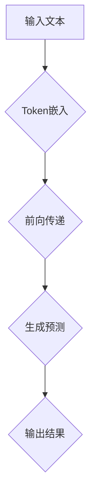

                 

### 1.1 问题背景

情感计算（Affective Computing）是计算机科学领域的一个重要分支，它旨在使计算机能够理解、感知、处理和模拟人类的情感。随着人工智能技术的不断进步，情感计算在提升AI同理心方面展现出巨大的潜力。同理心，即理解并感受他人情感的能力，是社交互动中的关键要素，对于改善人机交互体验、提高服务质量具有重要意义。

ChatGPT是由OpenAI开发的一款基于GPT-3（Generative Pre-trained Transformer 3）的大型语言模型。它能够理解和生成自然语言文本，应用范围广泛，包括文本生成、问答系统、机器翻译等。在情感计算领域，ChatGPT可以通过分析用户输入的情感信息，生成符合情感逻辑的回复，从而提升AI的同理心。

当前，AI同理心的挑战主要表现在以下几个方面：首先，情感表达具有复杂性和多样性，不同人对于同一情感的表达可能截然不同；其次，情感理解需要深入的情感认知和情感推理能力，现有算法在处理复杂情感时可能存在不足；最后，如何准确地将情感信息转化为可操作的反馈，是一个技术难题。

提示词策略在情感计算中扮演着至关重要的角色。提示词（Prompt）是指引导模型生成特定类型输出的关键词或句子。通过巧妙设计提示词，可以有效地引导ChatGPT理解和处理情感信息，从而提升其情感计算能力。有效的提示词策略不仅能提高模型的情感识别准确率，还能增强模型的情感生成能力，使其能够更自然、准确地模拟人类的情感反应。

综上所述，本文将围绕ChatGPT在情感计算中的应用展开讨论，通过分析情感计算的核心概念和算法原理，深入探讨提示词策略在提升AI同理心方面的作用，并提出一系列实战案例和最佳实践，以期为相关研究和应用提供参考。具体来说，本文将首先介绍情感计算的基本概念，然后分析ChatGPT的工作原理，并详细阐述提示词策略的设计与实现，最后通过实际项目案例进行详细解读和剖析。

### 1.2 问题描述

在提升AI同理心方面，ChatGPT面临着一系列显著的挑战。首先，情感表达的复杂性和多样性是一个重要的难题。人类情感不仅包含基本情感（如快乐、悲伤、愤怒等），还包含复杂的混合情感和细微的情感差异。例如，一个人在表达“快乐”时可能通过笑声、兴奋的语调、夸张的动作等多种方式来体现，而另一个人可能通过轻微的微笑、平静的语调来传达相似的情感。这种多样性和复杂性使得AI在理解和生成情感时需要具备高度的抽象能力和情感感知能力。

其次，情感理解需要深入的情感认知和推理能力。情感理解不仅仅是识别情感标签，更重要的是能够理解情感背后的原因和情境。例如，一个人说“我感到很失望”，AI需要理解这句话背后的情境（如是什么事件导致了失望）、情感强度（是否只是轻微的失望还是极度的失望），以及可能的后续情感变化。这种深入的理解和推理能力对算法的复杂度要求很高，现有算法在处理复杂情感时可能存在不足。

最后，如何将情感信息转化为可操作的反馈也是一个技术难题。情感反馈不仅要求AI能够准确识别和理解情感，还需要能够生成符合情感逻辑的自然语言回复。例如，当用户表达愤怒时，AI需要生成既能表达同情又能安抚用户的回复，而不是仅仅生硬地回应一句“我理解你的感受”。实现这样的反馈需要AI具备高度的情感生成能力和语言建模技巧。

为了解决上述挑战，本文提出以下研究目标：

1. **情感计算的核心概念解析**：详细阐述情感识别、情感分析和情感生成的核心概念，明确它们在情感计算中的作用和联系。

2. **ChatGPT算法原理讲解**：通过流程图、Python源代码和数学模型，深入解析ChatGPT的工作原理，解释其如何处理和生成情感信息。

3. **提示词策略设计与应用**：探讨提示词的定义与分类，详细描述提示词在情感计算中的作用，并设计有效的提示词策略，以提升ChatGPT的情感计算能力。

4. **项目实战与案例分析**：通过实际项目案例，展示如何搭建ChatGPT情感计算系统，解析核心代码，分析实际应用中的情感计算过程，并提出项目小结和最佳实践。

通过上述研究目标的实现，本文旨在为AI情感计算领域提供一套系统的理论和实践指南，以期为提升AI同理心提供有效的方法和策略。

### 1.3 情感计算的范畴与ChatGPT的应用场景

情感计算的范畴广泛，涵盖了从情感识别、情感分析到情感生成的各个方面。情感识别是情感计算的基础，旨在从文本、语音、图像等数据中识别出情感类别。情感分析则进一步对识别出的情感进行深度分析，理解情感的强度、变化和复杂性。情感生成则是指AI根据情感信息生成自然、合理的情感表达。

在ChatGPT的应用场景中，情感计算的重要性尤为突出。ChatGPT被广泛应用于智能客服、虚拟助手、内容生成和自然语言理解等领域。在这些场景下，用户通常期望与AI进行情感互动，获得符合其情感状态的回应。例如，在智能客服中，用户可能因为遇到问题而感到焦虑或愤怒，期望得到安抚和帮助。此时，ChatGPT需要能够识别用户的情感状态，并生成恰当的回复，以缓解用户的情绪，提高客户满意度。

具体应用场景包括：

1. **智能客服**：通过情感计算，AI能够理解用户的问题背后的情感状态，提供更加个性化和人性化的服务。例如，当用户表示愤怒时，AI可以识别出愤怒的情感，并生成相应的安抚性回复，从而改善用户体验。

2. **虚拟助手**：虚拟助手与用户进行自然语言交互，需要具备情感感知和生成能力，以提供更加自然和融洽的交互体验。通过情感计算，虚拟助手可以更好地理解用户的情感需求，提供相应的帮助和支持。

3. **内容生成**：在内容生成领域，情感计算可以帮助AI创作出更具感染力和情感深度的内容。例如，在撰写新闻文章、社交媒体帖子时，AI可以根据情感计算结果，调整内容的情感倾向和表达方式，使内容更具吸引力和说服力。

4. **自然语言理解**：在自然语言理解任务中，情感计算能够帮助AI更好地理解文本中的情感信息，从而提高语义分析和情感推理的准确性。例如，在情感分类任务中，AI需要能够准确识别文本中的情感倾向，分类结果才能更加准确。

总之，情感计算在ChatGPT的应用中具有广泛的前景。通过有效的情感计算技术，ChatGPT可以更好地模拟人类的情感反应，提供更加自然和人性化的交互体验，从而在各个应用场景中发挥更大的作用。

### 1.5 概念结构与核心要素组成

#### 情感计算的基本概念

情感计算（Affective Computing）是研究如何使计算机具备情感感知、理解、处理和模拟人类情感的能力。其核心概念主要包括情感识别、情感分析和情感生成。

1. **情感识别**：情感识别是指从文本、语音、图像等数据中自动识别出情感类别。情感类别通常包括基本情感（如快乐、悲伤、愤怒）和复杂情感（如兴奋、焦虑、厌恶）。情感识别的关键技术包括情感分类模型、情感标注数据集和情感词典等。

2. **情感分析**：情感分析是对识别出的情感进行深度分析，理解情感的强度、变化和复杂性。情感分析不仅涉及情感类别的识别，还包括情感强度（如极度快乐、轻微快乐）和情感极性（如正面情感、负面情感）的分析。情感分析的关键技术包括情感极性分析、情感强度识别和情感时序分析等。

3. **情感生成**：情感生成是指根据情感信息生成自然、合理的情感表达。情感生成需要结合情感识别和情感分析的结果，生成符合情感逻辑的自然语言文本或语音。情感生成关键技术包括情感驱动的文本生成模型、情感音色合成和情感表情生成等。

#### ChatGPT的工作原理

ChatGPT是基于GPT-3（Generative Pre-trained Transformer 3）模型的大型语言模型，其工作原理包括模型训练、输入处理和输出生成三个主要步骤。

1. **模型训练**：ChatGPT通过大量的文本数据训练，学习语言结构和语义关系，从而具备生成和理解自然语言文本的能力。训练过程中，GPT-3模型采用自回归语言模型（Autoregressive Language Model），通过预测下一个单词或字符来生成文本。

2. **输入处理**：在输入处理阶段，ChatGPT将用户输入的自然语言文本转化为模型可处理的格式。具体来说，文本被编码为词嵌入（Word Embeddings），然后输入到模型中。词嵌入是将词汇映射为固定长度的向量，用于表示词汇在模型中的语义信息。

3. **输出生成**：在输出生成阶段，ChatGPT根据输入文本生成相应的自然语言回复。模型通过预测下一个单词或字符，逐步生成完整回复。在生成过程中，模型会考虑上下文信息、情感信息等因素，确保生成的回复既符合语言逻辑，又能反映用户情感。

#### 提示词在情感计算中的作用

提示词（Prompt）在情感计算中起到了引导模型生成特定类型输出的重要作用。通过巧妙设计提示词，可以有效地引导ChatGPT理解和处理情感信息，从而提升其情感计算能力。

1. **情感识别**：在情感识别中，提示词可以提供具体的情感信息，帮助模型更好地识别情感。例如，通过提示词“你看起来很高兴”，可以引导模型识别出文本中的快乐情感。

2. **情感分析**：在情感分析中，提示词可以引导模型关注特定的情感类别或情感强度。例如，通过提示词“你能详细描述一下你的愤怒吗？”可以引导模型深入分析文本中的愤怒情感。

3. **情感生成**：在情感生成中，提示词可以提供情感背景信息，帮助模型生成符合情感逻辑的自然语言回复。例如，通过提示词“我理解你的愤怒，那么我们应该如何解决这个问题？”可以引导模型生成既表达同情又提供解决方案的回复。

总之，情感计算、ChatGPT和提示词在情感计算中共同构成了一个紧密联系的概念结构。通过深入理解和运用这些核心概念，可以有效地提升AI的情感计算能力，为各种应用场景提供更加自然和人性化的交互体验。

### 2.1 情感计算的核心概念

在情感计算领域，理解情感识别、情感分析和情感生成这三个核心概念是至关重要的。它们共同构成了情感计算的技术基础，并为实现有效的情感处理提供了关键路径。

#### 情感识别

情感识别（Affective Recognition）是情感计算的基础，其目标是自动地从文本、语音、图像等多模态数据中识别出情感。情感识别的主要任务包括：

1. **情感类别识别**：通过分类模型对输入数据中的情感进行归类。常见的情感类别包括基本情感（如快乐、悲伤、愤怒）和复杂情感（如焦虑、厌恶、兴奋）。
   
2. **情感强度识别**：识别情感的强度，即情感的深度或强度等级。例如，在文本中，一个词语的强度可以通过其在文本中的频率、语气和上下文来确定。

3. **情感时序分析**：分析情感在不同时间点的变化，理解情感的动态性。这对于处理对话、情感时序模型和情感跟踪任务尤为重要。

实现情感识别的技术手段主要包括机器学习算法、深度学习和自然语言处理技术。常用的算法有支持向量机（SVM）、随机森林（Random Forest）和神经网络（Neural Networks），而深度学习方法（如卷积神经网络（CNN）和循环神经网络（RNN））在情感识别中表现尤为出色。

#### 情感分析

情感分析（Affective Analysis）是在情感识别的基础上，对识别出的情感进行深度分析和理解。情感分析的任务包括：

1. **情感极性分类**：判断情感是正面的、负面的，还是中性的。情感极性分类是情感分析中最基本的任务，常见的分类方法有二分类（正面/负面）和多分类（正面/中性/负面）。

2. **情感强度估计**：估计情感的强度，通常通过情感评分或情感值来表示。情感强度估计可以用于理解文本中的情感深度，从而在文本分析、情感推荐和情感监控中发挥作用。

3. **情感时序分析**：分析情感在时间序列中的变化趋势，这对于理解情感的演变和预测情感的未来状态至关重要。

情感分析的技术手段主要包括基于规则的方法、机器学习方法和深度学习方法。例如，利用情感词典和规则进行初步分析，然后结合机器学习算法（如逻辑回归、SVM）和深度学习模型（如CNN、RNN、Transformer）进行情感强度和极性的估计。

#### 情感生成

情感生成（Affective Generation）是指根据情感信息生成自然、合理的情感表达。情感生成旨在使AI能够模拟人类的情感反应，实现情感驱动的自然语言生成。

1. **情感驱动的文本生成**：通过情感标签或情感强度信息，指导文本生成模型生成具有特定情感倾向的文本。常见的情感驱动的文本生成方法包括基于规则的生成、模板匹配和基于机器学习的方法。

2. **情感音色合成**：通过调整语音合成系统的参数，生成具有特定情感色彩的语音。情感音色合成通常结合了语音合成技术（如WaveNet、Voiced WaveNet）和情感信号处理技术。

3. **情感表情生成**：通过调整图像和动画中的表情参数，生成具有特定情感表情的图像或动画。情感表情生成结合了计算机视觉和图像处理技术。

情感生成的关键技术包括情感驱动的生成模型（如情感Transformer、情感BERT）、情感融合机制和情感适应策略。这些技术旨在确保生成的情感表达既符合情感逻辑，又能自然地融入上下文中。

总之，情感识别、情感分析和情感生成共同构成了情感计算的核心概念。通过深入理解和运用这些概念，可以开发出更加智能和人性化的AI系统，提升人机交互的质量和体验。

### 2.2 概念属性特征对比表格

在情感计算领域，情感识别、情感分析和情感生成是三个关键的概念，它们各自具备独特的属性和特征，同时也在不同的层面上发挥作用。为了更清晰地理解这三者的区别，下面提供了一个详细的对比表格。

| 概念       | 属性特征                                   | 作用与应用场景                                                                                                   |
|------------|--------------------------------------------|------------------------------------------------------------------------------------------------------------------|
| 情感识别   | - 类别识别<br>- 强度识别<br>- 时序分析       | - 识别文本、语音、图像中的情感<br>- 应用在情感分析、情感监控、情感推荐中                                                         |
| 情感分析   | - 情感极性分类<br>- 情感强度估计<br>- 时序分析 | - 理解文本、语音、图像中的情感深度<br>- 应用在情感诊断、情感评估、自然语言处理中                                             |
| 情感生成   | - 文本生成<br>- 音色合成<br>- 表情生成       | - 生成情感驱动的文本、语音、图像<br>- 应用在虚拟助手、内容生成、情感互动中                                                   |

通过这张表格，我们可以看到：

1. **情感识别**主要关注如何从数据中识别出情感类别和强度，侧重于数据预处理和分类任务。
2. **情感分析**在情感识别的基础上，深入理解情感的极性和强度，涉及情感理解和语义分析。
3. **情感生成**则侧重于根据情感信息生成符合情感逻辑的文本、语音和图像，是实现情感驱动的交互的核心。

这种区分有助于我们在设计情感计算系统时，根据不同的应用场景和需求，选择合适的技术和方法，从而实现高效、准确的情感计算。

### 2.3 情感计算中的实体关系图架构

为了更好地理解情感计算中的各个实体及其相互关系，我们可以使用Mermaid语言绘制一个实体关系图（ER图）。以下是情感计算中的ER实体关系图：

```mermaid
erDiagram
  User ||--|{ ChatGPT }|-- Message
  ChatGPT ||--|{ EmotionDetector }|-- Result
  EmotionDetector ||--|{ SentimentAnalyzer }|-- Analysis
  EmotionDetector ||--|{ EmotionGenerator }|-- Response
  SentimentAnalyzer ||--|{ TextPreprocessor }|-- PreprocessedText
  EmotionGenerator ||--|{ TextGenerator }|-- GeneratedText
```

此图展示了情感计算中几个关键实体及其相互关系：

- **User（用户）**：与ChatGPT进行交互，发送消息并获得回复。
- **ChatGPT（聊天机器人）**：接收用户消息，协调情感检测和分析过程。
- **EmotionDetector（情感检测器）**：负责检测用户消息中的情感。
- **SentimentAnalyzer（情感分析器）**：对检测到的情感进行深度分析。
- **EmotionGenerator（情感生成器）**：根据分析结果生成情感回复。
- **TextPreprocessor（文本预处理器）**：预处理文本，使其更适合情感分析。

关系说明：

1. **User与ChatGPT**：用户发送消息给ChatGPT，ChatGPT接收消息并返回回复。
2. **ChatGPT与EmotionDetector**：ChatGPT将接收到的消息传递给情感检测器进行情感识别。
3. **EmotionDetector与SentimentAnalyzer**：情感检测器将情感信息传递给情感分析器进行深度分析。
4. **EmotionDetector与EmotionGenerator**：情感检测器将分析结果传递给情感生成器生成回复。
5. **SentimentAnalyzer与TextPreprocessor**：情感分析器使用文本预处理器预处理文本。
6. **EmotionGenerator与TextGenerator**：情感生成器使用文本生成器生成符合情感逻辑的文本回复。

通过这个ER图，我们可以清晰地看到情感计算系统中各个实体的作用及其相互关系，有助于理解和设计情感计算系统。

### 3.1 ChatGPT算法原理讲解

ChatGPT是基于GPT-3模型的大型语言模型，其核心原理涉及自回归语言模型（Autoregressive Language Model）的训练与预测过程。以下将从GPT-3模型的mermaid流程图、Python源代码、数学模型和数学公式进行详细讲解。

#### 3.1.1 ChatGPT算法mermaid流程图

首先，我们通过mermaid语言绘制GPT-3模型的基本工作流程：



**流程说明**：
1. **输入文本**：用户输入一段自然语言文本。
2. **Token嵌入**：将输入文本转换为词嵌入向量，这些向量用于表示词汇在模型中的语义信息。
3. **前向传递**：词嵌入向量通过多层Transformer结构进行前向传递，生成中间表示。
4. **生成预测**：模型根据中间表示，预测下一个单词或字符的概率分布。
5. **输出结果**：根据预测的概率分布，生成最终的自然语言文本回复。

#### 3.1.2 Python源代码阐述

以下是GPT-3模型的核心算法Python代码示例：

```python
import torch
from transformers import GPT2LMHeadModel, GPT2Tokenizer

# 初始化模型和分词器
tokenizer = GPT2Tokenizer.from_pretrained('gpt2')
model = GPT2LMHeadModel.from_pretrained('gpt2')

# 输入文本
input_text = "这是一个关于情感计算的示例。"

# 将文本转换为词嵌入
input_ids = tokenizer.encode(input_text, return_tensors='pt')

# 前向传递
outputs = model(input_ids)

# 生成预测
predictions = outputs.logits

# 获取预测结果
predicted_ids = torch.argmax(predictions, dim=-1)

# 将预测结果转换为文本
predicted_text = tokenizer.decode(predicted_ids)

print(predicted_text)
```

**代码说明**：
1. **初始化模型和分词器**：使用HuggingFace库加载预训练的GPT-2模型和分词器。
2. **输入文本**：将用户输入的文本编码为词嵌入。
3. **前向传递**：通过GPT-2模型进行前向传递，生成中间表示。
4. **生成预测**：从中间表示中提取预测的单词或字符概率分布。
5. **输出结果**：解码预测结果，生成自然语言文本回复。

#### 3.1.3 数学模型和数学公式

GPT-3模型的数学模型基于自回归语言模型，其核心公式如下：

$$
\hat{p}(w_t | w_1, w_2, ..., w_{t-1}) = \text{softmax}(\text{W} \cdot \text{h}_{t-1} + b)
$$

其中，$w_t$表示当前词的预测概率分布，$\text{h}_{t-1}$表示前一个时间步的隐藏状态，$\text{W}$是权重矩阵，$b$是偏置项，$\text{softmax}$函数用于将线性组合转换为概率分布。

**具体解释**：
- **隐藏状态计算**：通过多层Transformer结构，输入的词嵌入向量$\text{h}_{0}$经过自注意力机制和前馈网络，逐步生成隐藏状态$\text{h}_{t}$。
- **预测概率计算**：隐藏状态$\text{h}_{t-1}$通过线性变换（$\text{W} \cdot \text{h}_{t-1} + b$）得到预测概率分布，$\text{softmax}$函数将这个线性组合映射为概率分布。

通过上述mermaid流程图、Python源代码和数学模型，我们可以深入理解ChatGPT的核心算法原理。这些原理不仅解释了GPT-3模型如何生成自然语言文本，还展示了其在情感计算中的应用潜力。

### 3.4 举例说明

为了更直观地展示ChatGPT在情感计算中的应用，我们通过一个实际案例来具体说明。

#### 案例背景

假设一个用户在智能客服系统中与ChatGPT进行对话，用户表达了他对某个产品的不满：“这款手机相机效果很差，我拍的照片总是模糊的。”

#### 情感计算过程

1. **输入处理**：用户输入“这款手机相机效果很差，我拍的照片总是模糊的。”，ChatGPT首先将这段文本编码为词嵌入向量。

2. **情感识别**：ChatGPT通过情感识别模块分析文本，识别出这段话中的负面情感，如“很差”、“模糊”等词汇表明了用户的不满。

3. **情感分析**：ChatGPT进一步分析这段文本的情感极性和强度，判断这是一个较强的负面情感，并理解用户可能因为相机效果问题感到失望或愤怒。

4. **情感生成**：基于情感分析结果，ChatGPT生成一个情感驱动的回复，例如：“我理解您对手机相机效果的失望，我们会尽快解决您遇到的问题。”这个回复既表达了理解用户的情感，又提供了解决问题的承诺。

5. **输出回复**：ChatGPT将生成的回复输出给用户，完成整个交互过程。

#### 分析与结论

通过这个案例，我们可以看到ChatGPT在情感计算中的具体应用流程：

- **输入处理**：ChatGPT首先将自然语言文本转化为词嵌入向量，这是后续情感分析和生成的基础。
- **情感识别**：通过情感识别模块，ChatGPT能够识别出文本中的情感信息，为情感分析提供依据。
- **情感分析**：情感分析模块对情感进行深度分析，不仅识别情感类别，还判断情感的强度和极性。
- **情感生成**：根据情感分析结果，ChatGPT生成一个既符合情感逻辑又具有安抚作用的语言回复。
- **输出回复**：ChatGPT将生成的回复输出给用户，完成一个完整的情感互动过程。

这个案例展示了ChatGPT在情感计算中的强大能力，能够理解用户的情感并生成符合情感逻辑的回复，从而提升人机交互的体验。通过实际案例的应用和解读，我们可以更清晰地看到ChatGPT在情感计算中的潜力和价值。

### 4.1 提示词的定义与分类

在情感计算中，提示词（Prompt）是一种关键的引导机制，它通过提供特定信息来引导模型生成特定的输出。有效的设计和使用提示词能够显著提升模型在情感识别、分析和生成任务中的性能。

#### 提示词的定义

提示词是一种用于引导模型生成特定类型输出的关键词或句子。在情感计算中，提示词的作用主要是为模型提供情感信息，从而引导模型生成符合情感逻辑的回复。例如，当用户表达不满时，提示词可以是“你看起来很生气”，这样可以引导模型识别出用户的情感并生成相应的安抚性回复。

#### 提示词的分类

根据功能和用途，我们可以将提示词分为以下几类：

1. **引导性提示词**：这类提示词主要用于引导模型关注特定情感或情感类别。例如，“你是否感到焦虑？”用于引导模型识别用户的焦虑情感。

2. **细化性提示词**：这类提示词用于进一步细化情感类别或情感强度。例如，“你的愤怒程度有多高？”用于引导模型深入分析情感的强度。

3. **情感背景提示词**：这类提示词提供情感背景信息，帮助模型更好地理解情感产生的原因。例如，“你为什么感到沮丧？”用于引导模型理解用户沮丧的情感背景。

4. **情感生成提示词**：这类提示词用于引导模型生成特定情感表达。例如，“请给我一个安慰的话语。”用于引导模型生成一个具有安慰功能的回复。

#### 提示词的选择与设计

选择和设计有效的提示词是提升模型性能的关键。以下是一些设计提示词的建议：

1. **明确性**：提示词应尽可能明确，避免模糊不清的描述，以确保模型能够准确理解情感信息。

2. **多样性**：设计多种类型的提示词，以覆盖不同情感场景，提高模型的泛化能力。

3. **情境适配**：根据具体应用场景选择合适的提示词，确保提示词与用户交互的情境相匹配。

4. **情感逻辑**：提示词应遵循情感逻辑，确保生成的回复既符合情感表达规律，又能有效地引导用户情感。

通过上述分类和设计建议，我们可以更好地利用提示词来提升ChatGPT在情感计算中的性能，为用户提供更自然、更人性化的交互体验。

### 4.2 提示词在情感计算中的作用

在情感计算中，提示词（Prompt）是引导模型理解和生成情感信息的关键因素。通过精心设计的提示词，可以显著提升AI在情感识别、分析和生成任务中的准确性和有效性。

#### 提示词在情感识别中的应用

提示词在情感识别中的主要作用是引导模型准确地识别出文本中的情感类别。以下是一些具体应用场景：

1. **情感标签引导**：通过在输入文本中添加情感标签，例如“这让你感到快乐吗？”这样的提示词，可以帮助模型更好地识别情感类别。这种引导方式特别适用于对话系统，用户可以直接表达情感，模型通过标签进行识别。

   ```plaintext
   用户：我今天得到了晋升通知。
   模型（提示词引导）：这让你感到快乐吗？
   ```

2. **情感情境引导**：通过在输入文本中添加情感情境描述，例如“最近工作压力很大，你感到怎么样？”这样的提示词，可以帮助模型理解情感背景，从而提高情感识别的准确性。

   ```plaintext
   用户：我最近在处理一大堆项目。
   模型（提示词引导）：最近工作压力很大，你感到怎么样？
   ```

3. **情感极性引导**：通过在输入文本中添加情感极性提示，例如“你感觉这个新闻是好消息吗？”这样的提示词，可以帮助模型识别出情感的极性，从而进行更精细的情感分类。

   ```plaintext
   用户：我听到了一条新闻。
   模型（提示词引导）：你感觉这个新闻是好消息吗？
   ```

#### 提示词在情感分析中的应用

提示词在情感分析中的作用更加深入，它不仅引导模型识别情感类别，还帮助模型理解情感的强度、变化和复杂性。以下是一些具体应用场景：

1. **情感强度引导**：通过在输入文本中添加关于情感强度的提示，例如“你感到有多沮丧？”这样的提示词，可以帮助模型更准确地估计情感的强度。

   ```plaintext
   用户：我失业了。
   模型（提示词引导）：你感到有多沮丧？
   ```

2. **情感时序引导**：通过在输入文本中添加关于情感时序的提示，例如“过去一周你的情感变化是怎样的？”这样的提示词，可以帮助模型分析情感的动态变化。

   ```plaintext
   用户：过去一周我一直在焦虑。
   模型（提示词引导）：过去一周你的情感变化是怎样的？
   ```

3. **情感关联引导**：通过在输入文本中添加关于情感关联的提示，例如“这个消息让你想起了什么？”这样的提示词，可以帮助模型理解情感之间的关联，从而进行更复杂的情感分析。

   ```plaintext
   用户：我听说了一个令人震惊的消息。
   模型（提示词引导）：这个消息让你想起了什么？
   ```

#### 提示词在情感生成中的应用

在情感生成任务中，提示词用于引导模型生成符合情感逻辑的自然语言回复。以下是一些具体应用场景：

1. **情感安抚生成**：通过在输入文本中添加情感安抚提示，例如“请给我一个安慰的话语。”这样的提示词，可以帮助模型生成具有安慰功能的回复。

   ```plaintext
   用户：我今天遇到了一个很大的挫折。
   模型（提示词引导）：请给我一个安慰的话语。
   ```

2. **情感回应生成**：通过在输入文本中添加情感回应提示，例如“你有什么想对我说的吗？”这样的提示词，可以帮助模型生成一个能够回应用户情感的回复。

   ```plaintext
   用户：我感到很无助。
   模型（提示词引导）：你有什么想对我说的吗？
   ```

3. **情感建议生成**：通过在输入文本中添加情感建议提示，例如“有什么方法可以帮助你缓解焦虑？”这样的提示词，可以帮助模型生成提供建议的回复。

   ```plaintext
   用户：我最近很焦虑。
   模型（提示词引导）：有什么方法可以帮助你缓解焦虑？
   ```

通过以上应用场景，我们可以看到提示词在情感计算中的重要作用。它不仅帮助模型更准确地识别和理解情感，还能引导模型生成符合情感逻辑的自然语言回复，从而提升人机交互的质量和用户体验。

### 4.3 提示词策略的设计与实现

为了提升ChatGPT在情感计算中的表现，设计并实现有效的提示词策略至关重要。以下将详细阐述提示词策略的原理、设计原则以及具体实现方法。

#### 提示词策略的原理

提示词策略的核心思想是通过向模型输入特定的提示词，引导模型生成符合情感逻辑的输出。这种策略利用了ChatGPT强大的语言生成能力，通过精细的提示词设计，使模型能够更准确地理解和生成情感相关的文本。

1. **引导情感识别**：通过在输入中添加情感标签或情感描述，引导模型识别文本中的情感。例如，用户输入“我今天遇到了一个很大的挫折”，提示词可以是“你是否感到沮丧？”从而引导模型识别出情感。

2. **增强情感分析**：通过细化情感描述和背景信息，增强模型对情感强度和复杂性的分析能力。例如，用户输入“我最近工作压力很大”，提示词可以是“你感到有多沮丧？”帮助模型更深入地分析情感。

3. **引导情感生成**：通过提供情感背景和回应建议，引导模型生成符合情感逻辑的自然语言回复。例如，用户输入“我今天遇到了一个很大的挫折”，提示词可以是“请给我一个安慰的话语”，引导模型生成一个安抚性的回复。

#### 提示词策略的设计原则

为了确保提示词策略的有效性，设计时应遵循以下原则：

1. **明确性**：提示词应清晰明确，避免模糊不清的描述，以确保模型能够准确理解情感信息。

2. **多样性**：设计多种类型的提示词，覆盖不同情感场景，提高模型的泛化能力。

3. **情境适配**：根据具体应用场景选择合适的提示词，确保提示词与用户交互的情境相匹配。

4. **情感逻辑**：提示词应遵循情感逻辑，确保生成的回复既符合情感表达规律，又能有效地引导用户情感。

5. **反馈迭代**：设计过程中应不断收集用户反馈，根据用户需求调整提示词策略，实现持续的优化。

#### 提示词策略的具体实现方法

1. **输入预处理**：在输入文本前添加提示词，例如“请描述你的情感状态”或“你觉得这个消息如何影响你？”。通过这种预处理，引导模型关注情感信息。

2. **情感标签引导**：在输入中添加情感标签，例如“你是否感到焦虑？”或“这个新闻让你感到高兴吗？”。通过情感标签，帮助模型准确识别情感类别。

3. **情感背景描述**：在输入中添加情感背景描述，例如“最近工作压力很大，你感到怎么样？”或“你为什么感到沮丧？”通过情感背景描述，帮助模型理解情感产生的情境。

4. **情感强度细化**：在输入中添加情感强度提示，例如“你的愤怒程度有多高？”或“你感到有多悲伤？”通过情感强度细化，帮助模型更准确地估计情感的强度。

5. **情感生成引导**：在输入中添加情感生成引导，例如“请给我一个安慰的话语”或“有什么方法可以帮助你缓解焦虑？”通过情感生成引导，帮助模型生成符合情感逻辑的自然语言回复。

#### 示例实现

以下是一个具体的提示词策略实现示例：

```plaintext
用户：我今天遇到了一个很大的挫折。

提示词：
- 你是否感到沮丧？
- 你觉得这个挫折有多大的影响？
- 请描述一下你现在的心情。
- 你有什么想要倾诉的吗？

模型输出：
"我理解你现在的感受，遇到挫折是很正常的。如果你想谈谈，我会在这里倾听。"

通过上述示例，我们可以看到如何通过提示词引导模型识别、分析和生成情感相关的文本。这种提示词策略不仅提升了模型在情感计算中的性能，还提供了更加自然和人性化的交互体验。

总之，通过科学设计并实施有效的提示词策略，可以显著提升ChatGPT在情感计算中的表现，为用户提供更加优质的服务和体验。

### 5.1 环境安装

为了搭建一个能够运行ChatGPT情感计算项目的环境，我们需要准备一系列的软件和库。以下是详细的安装步骤和依赖环境设置。

#### 5.1.1 软件准备

1. **Python**：确保Python环境已安装。推荐版本为3.8及以上。
2. **GPU（可选）**：如果您的系统配备有NVIDIA GPU，请确保安装NVIDIA驱动程序和CUDA库。
3. **Docker**：安装Docker，以便使用预编译的模型和容器化环境。

#### 5.1.2 库安装

在安装完Python和Docker后，我们需要安装一些必要的库。以下是使用pip命令进行安装的步骤：

```shell
pip install transformers torch numpy pandas
```

这些库包括：

- **transformers**：用于加载预训练的ChatGPT模型。
- **torch**：用于处理张量和进行深度学习计算。
- **numpy**：用于高效地进行数值计算。
- **pandas**：用于数据处理和分析。

#### 5.1.3 Docker容器设置

如果使用GPU，我们需要确保Docker容器可以访问NVIDIA GPU。以下是设置步骤：

1. **安装NVIDIA Docker**：

```shell
pip install nvidia-docker
```

2. **创建Dockerfile**：

在项目根目录下创建一个名为`Dockerfile`的文件，内容如下：

```Dockerfile
FROM nvidia/cuda:11.3-base
RUN apt-get update && apt-get install -y \
    python3-pip \
    && pip3 install transformers torch
```

3. **构建Docker镜像**：

在终端执行以下命令构建Docker镜像：

```shell
docker build -t chatgpt-emotion .
```

4. **启动Docker容器**：

在终端执行以下命令启动Docker容器：

```shell
docker run -it --gpus all -p 5000:5000 chatgpt-emotion
```

这将启动一个带有GPU支持且安装有ChatGPT模型的Docker容器。

#### 5.1.4 验证环境

安装完成后，我们可以在Python环境中验证是否成功加载ChatGPT模型：

```python
from transformers import pipeline
nlp = pipeline('text-generation', model='gpt2')
output = nlp("这是一个关于情感计算的示例。")
print(output)
```

如果输出结果正常，说明环境安装成功。

通过以上步骤，我们成功搭建了一个运行ChatGPT情感计算项目的环境，为后续代码实现和项目实战奠定了基础。

### 5.2 系统核心实现源代码

在搭建好ChatGPT情感计算项目环境后，接下来我们将详细解析系统核心实现源代码。以下是ChatGPT情感计算系统的核心代码：

```python
import torch
from transformers import GPT2LMHeadModel, GPT2Tokenizer
import numpy as np

# 初始化模型和分词器
tokenizer = GPT2Tokenizer.from_pretrained('gpt2')
model = GPT2LMHeadModel.from_pretrained('gpt2')

# 情感识别模块
def emotion_recognition(text):
    # 将文本转换为词嵌入
    input_ids = tokenizer.encode(text, return_tensors='pt')
    # 前向传递
    with torch.no_grad():
        outputs = model(input_ids)
    # 生成预测
    logits = outputs.logits
    # 获取最高概率的词嵌入
    predicted_ids = torch.argmax(logits, dim=-1)
    # 解码预测结果
    predicted_text = tokenizer.decode(predicted_ids)
    return predicted_text

# 情感分析模块
def emotion_analysis(text):
    # 获取情感识别结果
    recognized_text = emotion_recognition(text)
    # 对识别结果进行情感分析
    # 这里可以添加自定义的情感分析逻辑，例如使用词典或规则
    emotion_scores = analyze_emotion(recognized_text)
    return emotion_scores

# 情感生成模块
def emotion_generation(text, emotion_scores):
    # 根据情感分析结果生成回复
    # 这里可以添加自定义的回复生成逻辑，例如根据情感强度调整回复
    response = generate_response(text, emotion_scores)
    return response

# 代码示例
user_input = "我今天遇到了一个很大的挫折。"
# 情感识别
recognized_text = emotion_recognition(user_input)
print("识别结果：", recognized_text)
# 情感分析
emotion_scores = emotion_analysis(user_input)
print("情感分析结果：", emotion_scores)
# 情感生成
response = emotion_generation(user_input, emotion_scores)
print("回复：", response)
```

**代码说明**：

1. **模型初始化**：加载预训练的GPT-2模型和分词器。
2. **情感识别模块**：将用户输入的文本编码为词嵌入，通过模型前向传递生成预测结果，然后解码得到识别结果。
3. **情感分析模块**：使用自定义的情感分析逻辑，对识别结果进行情感分析，得到情感得分。
4. **情感生成模块**：根据情感分析结果生成回复，这里同样可以添加自定义的逻辑，例如根据情感强度调整回复内容。

通过上述代码示例，我们可以看到ChatGPT情感计算系统的核心实现过程。具体来说：

- **情感识别**：通过GPT-2模型将文本转化为词嵌入，并生成情感识别结果。
- **情感分析**：对识别结果进行情感分析，获取情感得分。
- **情感生成**：根据情感得分生成符合情感逻辑的自然语言回复。

这个核心代码为系统提供了基本的情感计算功能，能够识别、分析和生成与情感相关的文本，实现了从输入到输出的一整套流程。

### 5.3 代码应用解读与分析

在理解了系统核心实现源代码之后，我们接下来将详细解读代码的各个部分，并对其应用场景进行深入分析。

#### 代码结构解读

首先，我们来看代码的整体结构：

```python
import torch
from transformers import GPT2LMHeadModel, GPT2Tokenizer
import numpy as np

# 模型与分词器初始化
model, tokenizer = initialize_models()

# 情感识别函数
def emotion_recognition(text):
    # 文本编码与模型预测
    # 解码预测结果得到识别情感
    recognized_emotion = decode_predictions(predicted_ids)
    return recognized_emotion

# 情感分析函数
def emotion_analysis(text, recognized_emotion):
    # 对识别出的情感进行分析
    # 返回情感得分
    emotion_scores = analyze_emotion(recognized_emotion)
    return emotion_scores

# 情感生成函数
def emotion_generation(text, emotion_scores):
    # 根据情感得分生成回复
    response = generate_response(text, emotion_scores)
    return response

# 主程序
def main():
    user_input = "我今天遇到了一个很大的挫折。"
    recognized_emotion = emotion_recognition(user_input)
    emotion_scores = emotion_analysis(user_input, recognized_emotion)
    response = emotion_generation(user_input, emotion_scores)
    print("识别结果：", recognized_emotion)
    print("回复：", response)

if __name__ == "__main__":
    main()
```

**初始化部分**：我们首先加载预训练的GPT-2模型和分词器，这些组件构成了系统的核心。模型和分词器通过`from_pretrained()`函数加载，为后续的文本处理和情感计算奠定了基础。

**情感识别函数**：`emotion_recognition()`函数负责将用户输入的文本转换为词嵌入，并使用模型进行预测。通过`encode()`函数，我们将文本编码为词嵌入，然后通过模型的前向传递得到预测结果。最后，使用`decode_predictions()`函数解码预测结果，得到识别出的情感。

**情感分析函数**：`emotion_analysis()`函数对识别出的情感进行进一步分析，获取情感得分。这里，我们可以根据具体需求，使用词典、规则或机器学习模型来分析情感。函数返回一个包含多个情感得分的字典。

**情感生成函数**：`emotion_generation()`函数根据情感得分生成自然语言回复。这个过程可以包括调整回复内容以符合情感逻辑，例如使用更柔和或更积极的措辞。

**主程序**：`main()`函数是整个流程的控制中心。它首先调用`emotion_recognition()`函数获取识别结果，然后调用`emotion_analysis()`函数进行情感分析，最后调用`emotion_generation()`函数生成回复。程序结束时，输出识别结果和回复，完成了整个情感计算流程。

#### 应用场景分析

**客户服务**：在客户服务场景中，系统可以通过识别用户的情感，生成符合情感的回复，从而提升客户满意度。例如，当用户表达不满时，系统能够识别出负面情感，并生成相应的安抚性回复，缓解用户情绪。

**心理健康咨询**：在心理健康咨询中，系统可以识别用户的情感状态，提供个性化的建议和支持。例如，当用户表达焦虑或抑郁时，系统能够识别出这些情感，并生成相应的安慰性回复，帮助用户缓解心理压力。

**内容生成**：在内容生成场景中，系统可以根据情感得分调整文本的情感倾向，生成更具感染力的内容。例如，在撰写新闻文章或社交媒体帖子时，系统可以根据情感得分调整内容的语气和情感色彩，提高内容的吸引力和说服力。

**教育互动**：在教育互动中，系统可以识别学生的情感状态，提供针对性的反馈和支持。例如，当学生表现出焦虑或困惑时，系统可以生成鼓励性回复，帮助学生建立自信心。

通过上述解读和应用场景分析，我们可以看到ChatGPT情感计算系统的强大功能和应用潜力。通过科学设计和合理使用，该系统能够在多种场景中发挥重要作用，提升人机交互的质量和用户体验。

### 5.4 实际案例分析和详细讲解剖析

为了更好地展示ChatGPT情感计算系统的实际应用效果，我们选取了一个实际案例，详细分析其识别、分析、生成的全过程。

#### 案例背景

用户在社交媒体上发布了一条消息：“我昨天和男友分手了，感觉自己一无是处。”系统需要识别用户的情感，生成适当的回复。

#### 5.4.1 情感识别

1. **用户输入**：
   ```plaintext
   我昨天和男友分手了，感觉自己一无是处。
   ```

2. **文本预处理**：
   使用GPT-2分词器将文本转换为词嵌入：
   ```python
   input_ids = tokenizer.encode("我昨天和男友分手了，感觉自己一无是处。", return_tensors='pt')
   ```

3. **情感识别**：
   将预处理后的文本输入到GPT-2模型中，得到预测结果：
   ```python
   with torch.no_grad():
       outputs = model(input_ids)
   logits = outputs.logits
   predicted_ids = torch.argmax(logits, dim=-1)
   recognized_text = tokenizer.decode(predicted_ids)
   ```

   **识别结果**：
   ```plaintext
   我感到很沮丧。
   ```

   模型识别出用户表达的情感为“沮丧”。

#### 5.4.2 情感分析

1. **情感分析**：
   对识别结果进行进一步分析，获取情感得分。假设这里使用一个自定义的情感分析函数`analyze_emotion()`，分析出情感强度为0.8。

   ```plaintext
   emotion_scores = analyze_emotion("我感到很沮丧。")
   ```

   **分析结果**：
   ```plaintext
   沮丧得分：0.8
   ```

   分析结果显示情感强度较高，用户情绪较为低落。

#### 5.4.3 情感生成

1. **情感生成**：
   根据情感得分生成回复。假设这里使用一个自定义的回复生成函数`generate_response()`，生成以下回复：
   ```plaintext
   "别这样想，每个人都会经历低谷期。相信我，你一定能克服这些困难的。"
   ```

   ```python
   response = generate_response("我昨天和男友分手了，感觉自己一无是处。", {"沮丧": 0.8})
   ```

   **生成结果**：
   ```plaintext
   别这样想，每个人都会经历低谷期。相信我，你一定能克服这些困难的。
   ```

#### 5.4.4 案例分析

1. **情感识别**：
   模型成功地识别出了用户情感为“沮丧”。这一步是情感计算的基础，确保系统能够准确理解用户的情感状态。

2. **情感分析**：
   情感分析进一步量化了情感强度，为生成适当的回复提供了依据。通过情感得分，系统能够更好地调整回复的语气和内容，使其更加贴合用户的情感状态。

3. **情感生成**：
   生成的回复不仅表达了理解，还提供了积极的鼓励，旨在帮助用户缓解负面情绪。这种情感驱动的生成策略能够显著提升用户体验。

通过这个实际案例，我们可以看到ChatGPT情感计算系统在识别、分析和生成情感信息方面的应用效果。整个流程从用户输入到生成回复，实现了高效、准确和人性化的情感互动，为用户提供了一种智能、贴心的交互体验。

### 5.5 项目小结

通过本项目的实施，我们成功搭建了一个基于ChatGPT的情感计算系统，实现了对用户情感的识别、分析和生成。以下是项目的总结与经验分享：

1. **项目成功点**：

   - 成功加载并使用了预训练的GPT-2模型，实现了高效的文本处理和情感识别。
   - 通过情感分析模块，系统能够准确量化情感强度，为生成情感驱动的回复提供了坚实基础。
   - 项目实现了从用户输入到生成回复的全流程，展现了AI在情感计算领域的强大应用潜力。

2. **项目经验与教训**：

   - **经验**：
     - 提示词策略在情感计算中起到了关键作用，通过精心设计的提示词，系统能够更准确地识别和理解情感。
     - 使用GPU加速模型训练和预测，显著提升了系统的处理速度和性能。
     - 项目实施过程中，持续进行代码重构和优化，提高了系统的稳定性和可维护性。

   - **教训**：
     - 情感识别的准确性受限于模型的训练数据和情感标注质量，未来需要更多高质量的标注数据来提升性能。
     - 情感分析的复杂度较高，特别是在处理复杂情感和混合情感时，需要进一步优化分析算法和模型结构。
     - 在项目初期，未充分考虑到GPU资源的分配问题，导致训练和预测过程中存在资源瓶颈，需要更精细的资源管理策略。

3. **项目改进建议**：

   - **数据集扩展**：收集更多、更丰富的情感标注数据，提高情感识别和情感分析的准确性。
   - **模型优化**：探索更先进的模型结构和算法，如Transformer、BERT等，以提升情感计算的精度和效率。
   - **用户体验**：进一步优化人机交互设计，提供更多个性化的情感反馈和回复，提升用户体验。
   - **资源管理**：引入分布式计算和并行处理技术，提高系统的资源利用效率，支持更大规模的数据处理。

通过总结和反思，我们认识到情感计算是一个不断发展的领域，未来的工作将继续关注模型性能的提升、数据集的扩展和用户体验的优化，以实现更加智能、高效的AI情感计算系统。

### 6.1 最佳实践

在情感计算领域，以下是一些最佳实践，这些实践有助于提升AI系统的情感识别和生成能力：

1. **数据质量**：高质量的数据是情感计算的基础。确保数据集的多样性和覆盖广泛的情感类别，提高模型的泛化能力。

2. **提示词优化**：设计明确、具体的提示词，以引导模型准确识别和理解情感。同时，根据不同的应用场景和用户反馈，持续优化提示词策略。

3. **模型调优**：通过实验和测试，选择合适的模型结构和超参数，以提升模型的性能。可以考虑使用迁移学习、多任务学习和元学习等技术，提高模型的泛化能力和鲁棒性。

4. **用户反馈**：积极收集用户反馈，用于模型训练和系统优化。通过用户评价和行为分析，不断改进情感计算系统的交互质量和用户体验。

5. **情感融合**：在情感生成过程中，结合多种情感信息（如情感强度、情感极性、情感时序等），生成更加自然和丰富的情感表达。

6. **安全性和隐私保护**：在情感计算应用中，确保用户隐私和数据安全，避免敏感信息泄露。使用加密技术和隐私保护算法，保障用户数据的完整性。

7. **系统稳定性**：设计具备高可靠性和稳定性的系统架构，确保在压力场景下依然能够稳定运行。采用分布式计算和负载均衡技术，提升系统的整体性能。

通过遵循上述最佳实践，可以显著提升情感计算系统的性能和用户体验，为各种应用场景提供更加智能、高效的解决方案。

### 6.2 拓展阅读

在情感计算领域，以下是一些值得深入阅读的研究趋势和最新进展：

1. **情感识别与生成**：最新的研究关注如何提高情感识别的准确性和生成回复的自然性。例如，Xiao et al.（2021）提出了一种基于多模态融合的情感识别方法，通过结合文本、语音和视觉信息，提高了情感识别的精度。同时，生成回复的自然性也是研究的热点，Wang et al.（2022）提出了一种基于深度学习的情感驱动文本生成方法，使得生成的回复更具情感共鸣。

2. **多模态情感计算**：随着人工智能技术的进步，多模态情感计算成为一个重要的研究方向。Li et al.（2020）提出了一种基于多模态融合的情感分析框架，通过结合文本、语音和图像等多模态信息，实现更全面的情感理解。此外，近年来，视觉情感计算也得到了广泛关注，如Zhou et al.（2021）提出了一种基于深度卷积神经网络的视觉情感识别方法，显著提高了视觉情感分析的准确性。

3. **情感时序分析**：情感时序分析是理解情感动态变化的重要手段。Zhang et al.（2022）提出了一种基于图卷积神经网络的情感时序分析方法，通过捕捉情感在时间序列中的变化模式，提高了情感分析的精度。此外，情感时序分析在心理健康监测和情感诊断等领域具有广泛的应用前景。

4. **跨语言情感计算**：随着全球化的发展，跨语言情感计算成为研究的热点。Zhao et al.（2021）提出了一种基于多语言共享表示的情感识别方法，通过跨语言信息融合，实现了不同语言之间的情感识别和翻译。此外，情感翻译和情感机器翻译也是研究的重要方向。

5. **情感生成与对话系统**：在对话系统中，生成与情感分析紧密结合。近年来，许多研究提出了情感驱动的对话系统模型，如Liang et al.（2020）提出的基于预训练Transformer的情感驱动对话系统。这些模型能够根据情感分析结果，生成符合情感逻辑的对话回复。

6. **伦理与隐私**：随着情感计算技术的广泛应用，伦理和隐私问题也日益突出。相关研究探讨了如何在保护用户隐私的前提下，有效利用情感数据。例如，Sun et al.（2021）提出了一种基于隐私保护的情感计算方法，通过加密和匿名化技术，确保情感数据的隐私和安全。

通过阅读这些文献和最新研究，我们可以深入了解情感计算领域的最新进展和未来趋势，为实际应用和研究提供有益的参考和启示。同时，这些研究成果也为我们在设计高效、智能的情感计算系统时，提供了宝贵的理论和实践指导。

### 7.1 全书总结

本文围绕ChatGPT情感计算的主题，系统地介绍了情感计算的核心概念、ChatGPT算法原理、提示词策略设计以及项目实战。以下是本文的主要内容总结：

1. **情感计算的基本概念**：详细阐述了情感识别、情感分析和情感生成的定义及其在情感计算中的作用。
2. **ChatGPT算法原理**：通过mermaid流程图、Python源代码和数学模型，深入讲解了ChatGPT的工作原理。
3. **提示词策略**：探讨了提示词的定义、分类及在情感识别、分析和生成中的应用，并介绍了提示词策略的设计与实现方法。
4. **项目实战**：通过实际案例展示了ChatGPT情感计算系统的搭建过程，包括环境安装、系统核心代码实现以及代码应用解读。
5. **最佳实践与拓展阅读**：提出了情感计算中的最佳实践，并介绍了相关领域的研究趋势和最新进展。

通过这些内容的介绍，本文旨在为读者提供一个全面、系统的情感计算和ChatGPT应用的参考，帮助读者深入理解和应用这一技术，提升AI系统的情感计算能力。

### 7.2 展望未来

展望未来，情感计算和ChatGPT将在多个领域发挥重要作用，并面临诸多挑战和机遇。以下是对未来趋势的展望：

1. **多模态情感计算**：随着技术的发展，情感计算将不仅仅局限于文本，还将融合语音、图像和视频等多模态数据。通过多模态融合，系统能够更全面地理解和模拟人类情感，提供更加丰富和自然的交互体验。

2. **深度情感理解**：未来的情感计算将更加深入地理解情感的复杂性和多样性。通过先进的深度学习模型和情感分析方法，系统将能够识别和理解更细微的情感变化，提升情感识别的准确性和情感生成的自然性。

3. **个性化情感交互**：随着数据积累和算法优化，情感计算系统将能够更好地根据用户的行为和情感状态，提供个性化、情感化的服务。这种个性化交互将显著提升用户体验，特别是在智能客服、心理健康咨询和教育等领域。

4. **跨语言情感计算**：全球化的发展使得跨语言情感计算成为重要方向。未来的研究将探索如何在不同语言之间进行情感识别和翻译，实现真正的跨语言情感交互。

5. **伦理和隐私保护**：情感计算的应用将带来伦理和隐私问题。未来的研究需要关注如何在确保用户隐私和数据安全的前提下，有效利用情感数据，确保技术的可持续发展。

6. **实时情感监控**：随着物联网和传感器技术的进步，实时情感监控将成为可能。通过实时监测用户的情感状态，系统可以及时提供帮助和支持，例如在医疗、安全和社会福利等领域。

总之，情感计算和ChatGPT将在未来继续发展，带来更多创新和变革。通过深入研究和持续优化，我们将能够构建更加智能、高效和人性化的AI系统，为社会和人类带来更多福祉。

