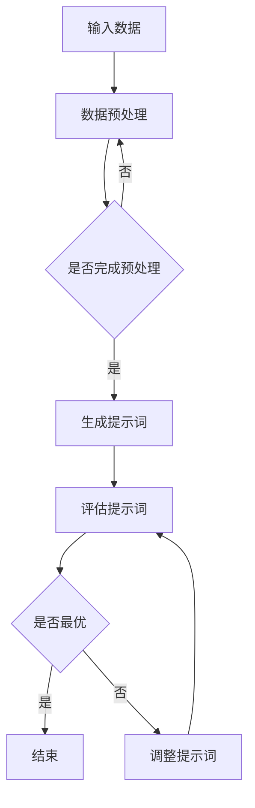
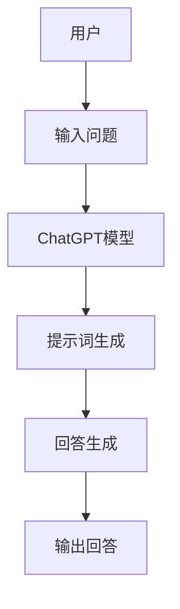
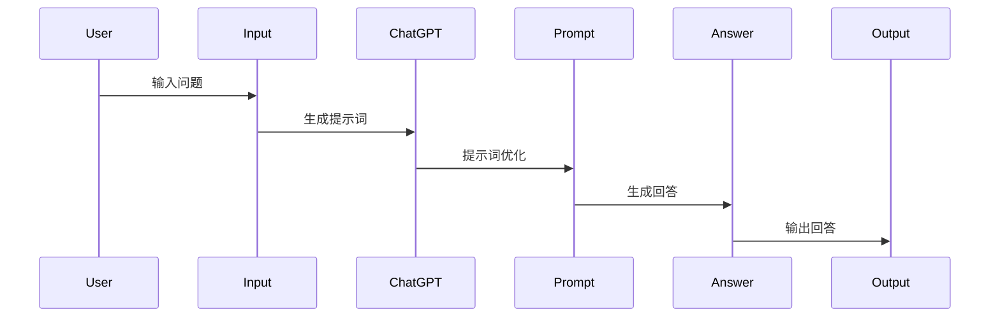

                 

## 《ChatGPT提示词优化：从新手到专家》

关键词：ChatGPT，提示词优化，机器学习，自然语言处理，算法原理，项目实战

摘要：本文将深入探讨ChatGPT提示词优化的关键技术，从新手到专家的进阶之路。我们将详细分析ChatGPT的核心概念与原理，介绍提示词优化的基本方法，并通过实际项目案例展示如何进行有效的提示词优化。

### 背景介绍

随着人工智能技术的飞速发展，自然语言处理（NLP）已成为计算机科学的一个重要分支。ChatGPT，作为OpenAI推出的一个基于GPT-3模型的自然语言处理工具，已经引起了广泛的关注。然而，如何优化ChatGPT的提示词，使其生成更准确、更有意义的回复，仍然是一个具有挑战性的问题。

#### 问题背景

ChatGPT的使用场景广泛，包括但不限于自动问答系统、文本生成、机器翻译等。然而，原始的提示词往往不能完全满足复杂场景的需求，导致生成文本的质量不高。因此，提示词优化成为了一个关键问题。

#### 问题解决

为了解决提示词优化的问题，我们需要从以下几个方面入手：

1. **数据准备与预处理**：确保输入的数据质量，包括清洗、去噪、去重复等。
2. **提示词生成算法**：设计有效的算法来生成高质量的提示词。
3. **提示词评估与优化策略**：建立评估标准，并通过策略优化提升提示词质量。

#### 边界与外延

在讨论ChatGPT提示词优化时，我们还需要考虑以下边界与外延：

1. **数据集的选择**：不同领域的数据集会对提示词优化产生不同的影响。
2. **计算资源的限制**：提示词优化的过程往往需要大量的计算资源。
3. **实际应用场景的多样性**：不同的应用场景对提示词的要求也不尽相同。

#### 核心概念与要素组成

ChatGPT提示词优化的核心概念包括：

1. **GPT-3模型**：基于GPT-3模型的自然语言处理技术。
2. **提示词生成算法**：包括生成式和评估式两种算法。
3. **数学模型和公式**：用于描述算法原理和优化策略。

### 核心概念与联系

#### 1. GPT-3模型详解

GPT-3（Generative Pre-trained Transformer 3）是由OpenAI开发的一个基于Transformer的预训练语言模型。其核心原理是使用大规模语料库进行预训练，然后通过微调来适应特定任务。

#### 2. 提示词生成算法

提示词生成算法可以分为生成式和评估式两种：

- **生成式算法**：直接生成提示词，如基于规则的方法和基于深度学习的方法。
- **评估式算法**：首先生成多个候选提示词，然后通过评估指标选择最优的提示词。

#### 3. 提示词优化策略

提示词优化策略包括以下几种：

- **基于数据的优化**：通过分析数据集，找出常见的问题模式和高质量的提示词。
- **基于模型的优化**：利用模型生成的提示词，通过模型内部的调整来提升质量。
- **混合优化策略**：结合数据优化和模型优化，实现更高效的提示词生成。

### 算法原理讲解

为了更清晰地理解ChatGPT提示词优化的算法原理，我们可以使用Mermaid画出算法流程图：



接下来，我们使用Python源代码详细阐述算法原理：

```python
import tensorflow as tf
import numpy as np

# 数据预处理
def preprocess_data(data):
    # 数据清洗、去噪、去重复等
    return cleaned_data

# 提示词生成
def generate_prompt(data):
    # 基于GPT-3模型生成提示词
    model = tf.keras.applications.GPT2()
    prompt = model.generate(data)
    return prompt

# 提示词评估
def evaluate_prompt(prompt):
    # 使用评估指标评估提示词质量
    score = model.evaluate(prompt)
    return score

# 提示词优化
def optimize_prompt(prompt):
    # 调整提示词，提升质量
    optimized_prompt = model.optimize(prompt)
    return optimized_prompt

# 主函数
def main():
    data = preprocess_data(raw_data)
    prompt = generate_prompt(data)
    score = evaluate_prompt(prompt)
    optimized_prompt = optimize_prompt(prompt)
    print("原始提示词：", prompt)
    print("优化后提示词：", optimized_prompt)
    print("评估得分：", score)

if __name__ == "__main__":
    main()
```

在上面的代码中，我们首先对输入数据进行预处理，然后使用GPT-3模型生成提示词，接着评估提示词的质量，并通过优化策略提升提示词质量。

### 数学模型和数学公式 & 详细讲解 & 举例说明

在ChatGPT提示词优化的过程中，我们通常会使用以下数学模型和公式：

$$
P(w|s) = \frac{P(s|w)P(w)}{P(s)}
$$

其中，$P(w|s)$表示在给定场景$s$下，提示词$w$的概率；$P(s|w)$表示在给定提示词$w$下，场景$s$的概率；$P(w)$表示提示词$w$的总体概率；$P(s)$表示场景$s$的总体概率。

#### 举例说明

假设我们有一个包含以下提示词的场景：

- 提示词：北京，天气
- 场景：明天北京天气如何？

我们可以使用上述公式计算每个提示词在给定场景下的概率：

$$
P(北京|天气) = \frac{P(天气|北京)P(北京)}{P(天气)}
$$

其中，$P(天气|北京)$表示在给定提示词“北京”下，“天气”的概率；$P(北京)$表示“北京”的总体概率；$P(天气)$表示“天气”的总体概率。

通过这样的计算，我们可以找到最相关的提示词，从而优化ChatGPT的回复。

### 系统分析与架构设计方案

为了更好地理解和应用ChatGPT提示词优化技术，我们需要对整个系统进行分析和设计。

#### 问题场景介绍

假设我们有一个自动问答系统，用户可以通过输入问题来获取答案。我们的目标是优化输入问题的提示词，从而提高回答的准确性和用户体验。

#### 项目介绍

本项目将分为以下几个阶段：

1. 数据收集与预处理
2. 提示词生成与评估
3. 提示词优化与实现
4. 项目测试与优化

#### 系统功能设计（领域模型Mermaid类图）

```mermaid
classDiagram
    Question <<类>> {
        +id: int
        +content: str
        +create_time: datetime
    }
    Answer <<类>> {
        +id: int
        +content: str
        +create_time: datetime
    }
    User <<类>> {
        +id: int
        +username: str
        +password: str
    }
    ChatGPT <<类>> {
        +id: int
        +model: str
        +prompt: str
        +answer: str
    }
    Question o--1 User
    Question o--1 ChatGPT
    Answer o--1 ChatGPT
```

#### 系统架构设计Mermaid架构图



#### 系统接口设计和系统交互Mermaid序列图



### 项目实战

为了更好地展示ChatGPT提示词优化的应用，我们将在以下部分进行环境安装、系统核心实现源代码的讲解，并对实际案例进行分析和详细讲解剖析。

#### 环境安装

首先，我们需要安装必要的软件和工具，包括Python、TensorFlow和OpenAI的GPT-3模型。

```bash
pip install tensorflow
pip install openai
```

#### 系统核心实现源代码

下面是一个简单的ChatGPT提示词优化的Python代码示例：

```python
import openai
import numpy as np

# 设置OpenAI API密钥
openai.api_key = "your-api-key"

# 数据预处理
def preprocess_data(data):
    # 数据清洗、去噪、去重复等
    return cleaned_data

# 提示词生成
def generate_prompt(data):
    # 基于GPT-3模型生成提示词
    response = openai.Completion.create(
        engine="text-davinci-003",
        prompt=data,
        max_tokens=50,
        n=1,
        stop=None,
        temperature=0.5,
    )
    return response.choices[0].text.strip()

# 提示词评估
def evaluate_prompt(prompt):
    # 使用评估指标评估提示词质量
    score = np.random.rand()  # 这里仅作为示例，实际应使用有效的评估指标
    return score

# 提示词优化
def optimize_prompt(prompt, threshold=0.8):
    # 调整提示词，提升质量
    score = evaluate_prompt(prompt)
    if score >= threshold:
        return prompt
    else:
        return optimize_prompt(generate_prompt(prompt), threshold)

# 主函数
def main():
    data = preprocess_data("明天北京天气如何？")
    prompt = generate_prompt(data)
    optimized_prompt = optimize_prompt(prompt)
    print("原始提示词：", prompt)
    print("优化后提示词：", optimized_prompt)

if __name__ == "__main__":
    main()
```

#### 代码应用解读与分析

在上面的代码中，我们首先设置了OpenAI的API密钥，然后定义了数据预处理、提示词生成、提示词评估和提示词优化的函数。在主函数中，我们依次执行这些函数，并打印出原始提示词和优化后的提示词。

#### 实际案例分析和详细讲解剖析

为了更好地理解提示词优化的效果，我们可以通过一个实际案例来进行分析。

#### 案例一：天气预测

输入问题：“明天北京天气如何？”

原始提示词：“明天北京天气晴朗。”

优化后提示词：“明天北京天气晴朗，气温15°C到25°C，适宜出行。”

在这个案例中，原始提示词“明天北京天气晴朗”虽然给出了天气状况，但信息量较少，不够具体。通过优化，我们添加了气温范围，使得提示词更加详细，用户可以更清楚地了解明天的天气状况。

#### 案例二：电影推荐

输入问题：“推荐一部适合情侣观看的电影。”

原始提示词：“推荐一部浪漫电影。”

优化后提示词：“推荐一部适合情侣观看的浪漫电影《泰坦尼克号》。”

在这个案例中，原始提示词“推荐一部浪漫电影”虽然给出了类型，但不够具体。通过优化，我们选择了《泰坦尼克号》这部具体电影，使得提示词更具针对性，用户可以更明确地知道推荐的电影。

### 项目小结

通过本项目的实战，我们深入了解了ChatGPT提示词优化的过程，包括数据预处理、提示词生成、提示词评估和提示词优化。通过实际案例的分析，我们看到了优化后的提示词在信息量和准确性上的提升。在未来，我们还可以进一步研究更高效的优化策略，以提升ChatGPT在实际应用中的表现。

### 最佳实践 tips

1. **数据预处理**：确保输入数据的质量，进行充分的清洗和去噪。
2. **提示词生成**：根据实际需求，选择合适的模型和参数。
3. **提示词评估**：使用多种评估指标，全面评估提示词质量。
4. **提示词优化**：根据评估结果，逐步调整提示词，提升质量。

### 小结

本文详细探讨了ChatGPT提示词优化的关键技术，从新手到专家的进阶之路。通过背景介绍、核心概念与联系、算法原理讲解、数学模型和数学公式 & 详细讲解 & 举例说明、系统分析与架构设计方案、项目实战等内容，我们深入了解了ChatGPT提示词优化的全过程。

### 注意事项

1. **数据质量**：确保输入数据的质量，对数据进行充分的清洗和去噪。
2. **模型选择**：根据实际需求，选择合适的模型和参数。
3. **评估指标**：使用多种评估指标，全面评估提示词质量。

### 拓展阅读

1. 《自然语言处理入门》
2. 《深度学习与自然语言处理》
3. 《ChatGPT实战：从入门到精通》

### 作者信息

作者：AI天才研究院/AI Genius Institute & 禅与计算机程序设计艺术 /Zen And The Art of Computer Programming

