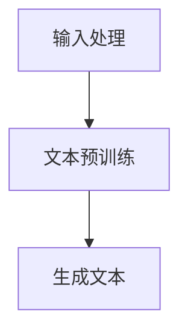
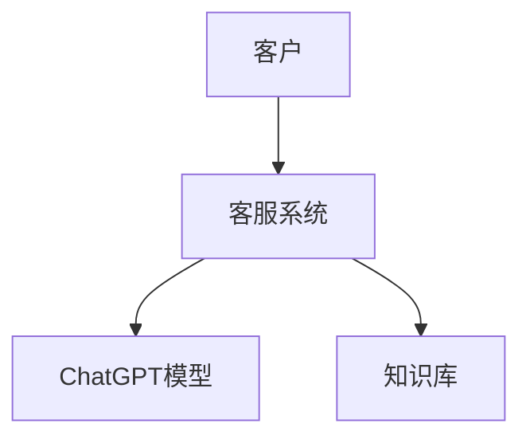
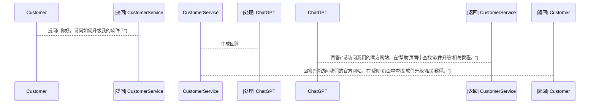
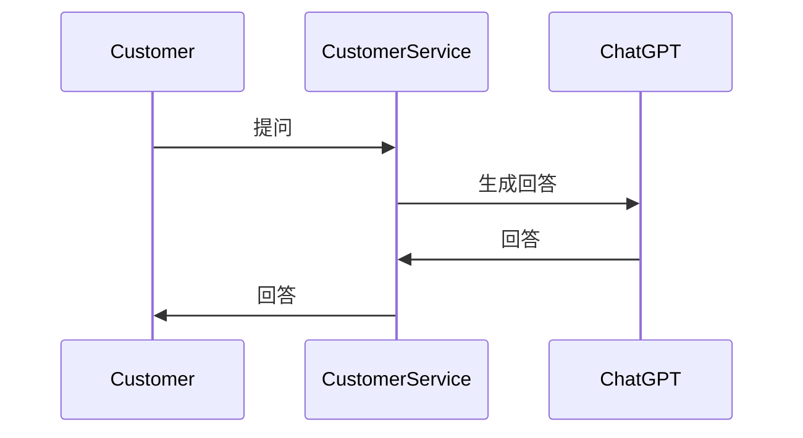

                 

# ChatGPT提示词安全：防止有害输出的策略

关键词：ChatGPT、提示词安全、有害输出、最佳实践

摘要：本文深入探讨了ChatGPT提示词安全的重要性，分析了潜在的安全风险，并提出了设计安全提示词的最佳实践。通过具体的案例研究，本文展示了如何通过合理设计和监控，防止ChatGPT产生有害输出，为人工智能技术的发展提供了有价值的参考。

## 引言：ChatGPT在现代科技中的角色

ChatGPT是OpenAI开发的一种基于GPT-3（生成预训练变换器3）的先进语言模型，它在各种领域都展现出了强大的应用潜力。自2018年发布以来，ChatGPT已经在自然语言处理、智能客服、内容生成、代码辅助等多个领域取得了显著的成果。

### 1.1 ChatGPT的基本概念

ChatGPT是一种基于深度学习的自然语言处理模型，它通过大量的文本数据进行预训练，可以生成连贯、合理的自然语言文本。其核心功能是通过对话生成，模仿人类的交流方式，提供信息、解答问题、甚至创作文章。

### 1.2 ChatGPT的应用场景

ChatGPT在许多行业和领域都有着广泛的应用。例如：

- **客户服务**：企业可以利用ChatGPT自动化客户服务，提高效率和客户满意度。
- **内容创作**：作家和编辑可以使用ChatGPT生成文章概要、撰写创意内容。
- **编程辅助**：开发人员可以利用ChatGPT提供代码建议、错误修复和文档生成。

### 1.3 ChatGPT与其他AI工具的比较

与传统的规则基模型和统计模型相比，ChatGPT具有更强的灵活性和表达能力。同时，相较于其他基于语言模型的工具，ChatGPT在生成文本的连贯性和自然度上具有更高的优势。

## ChatGPT提示词安全的重要性

### 2.1 不安全提示词的风险

不安全的ChatGPT提示词可能导致以下问题：

- **生成有害内容**：如歧视性、暴力或仇恨言论。
- **隐私泄露**：通过交互获取敏感信息。
- **系统滥用**：恶意用户可能利用ChatGPT进行钓鱼、诈骗等违法行为。

### 2.2 安全提示词的作用

设计安全的提示词可以帮助：

- **防止有害内容生成**：确保输出的文本符合道德和法律标准。
- **保护用户隐私**：避免敏感信息的泄露。
- **提升系统可靠性**：防止恶意攻击和系统滥用。

## ChatGPT提示词安全风险的识别与应对

### 3.1 常见安全威胁类型

ChatGPT可能面临的安全威胁包括：

- **Sybil攻击**：通过创建多个虚假账户影响模型结果。
- **社会工程学**：利用人类心理弱点获取敏感信息。
- **偏见与歧视**：模型可能基于训练数据产生偏见。

### 3.2 风险识别方法

为了识别这些安全风险，可以采取以下方法：

- **分析提示词设计**：检查提示词的清晰度和范围。
- **实施监控和检测系统**：实时监测ChatGPT的输出。
- **利用自然语言处理工具**：使用技术手段分析文本内容。

## 设计安全ChatGPT提示词的最佳实践

### 4.1 明确需求

在设计提示词之前，需要明确用户的需求和预期输出，以确保生成的文本符合目标。

### 4.2 避免开放性问题

开放性问题可能导致生成混乱的文本。例如，避免使用“你能告诉我关于……的一切吗？”这样的提问。

### 4.3 使用明确的指令

提供明确的指令可以帮助ChatGPT更准确地生成输出。例如，使用“请解释……的概念”而不是“你能解释……吗？”。

### 4.4 监控和反馈

持续监控ChatGPT的输出，并根据反馈进行调整，以确保生成的文本始终符合安全标准。

## 实际案例研究：ChatGPT提示词安全实践

### 5.1 案例一：客户服务中的安全提示词

某公司在客户服务中使用了ChatGPT，为了避免产生歧视性回答，他们在设计提示词时特别关注了避免敏感词汇的使用，并设置了监控机制来检测和纠正有害输出。

### 5.2 案例二：内容创作中的安全提示词

一位作家在创作一篇关于人工智能的文章时，使用了ChatGPT来生成部分内容。为了避免偏见和误导读者，作家在提示词中加入了关于避免偏见的明确指令，并实时监控生成的文本。

## 法律和伦理考量在ChatGPT部署中的应用

### 6.1 遵守法律法规

在部署ChatGPT时，必须遵守相关的法律法规，如隐私法、反歧视法等。

### 6.2 伦理考量

设计ChatGPT时，需要考虑其伦理影响，确保输出内容符合伦理标准，不产生歧视、偏见等有害信息。

## 未来趋势与ChatGPT安全的挑战

随着ChatGPT技术的不断发展，安全挑战也在不断变化。未来可能面临的问题包括：

- **对抗性攻击**：恶意用户可能会设计对抗性输入，试图欺骗ChatGPT。
- **隐私保护**：随着数据量的增加，隐私保护将成为更大的挑战。
- **跨语言和跨文化差异**：不同语言和文化背景下的安全风险可能不同。

## 结论

ChatGPT提示词的安全设计对于保障其有效性和可靠性至关重要。通过识别潜在风险、制定最佳实践，我们可以防止有害输出，确保ChatGPT在各个领域中的应用更加安全和可靠。随着技术的进步，我们需要持续关注并应对新的安全挑战，推动人工智能技术的健康发展。

## 作者信息

作者：AI天才研究院/AI Genius Institute & 禅与计算机程序设计艺术 /Zen And The Art of Computer Programming

----------------------------------------------------------------

### 附录

为了更好地理解ChatGPT提示词安全的相关概念，以下是附录内容，包括核心概念术语说明、问题背景、问题描述、问题解决、边界与外延、概念结构与核心要素组成。

#### 核心概念术语说明

1. **ChatGPT**：一种基于GPT-3的语言模型，用于生成自然语言文本。
2. **提示词（Prompt）**：引导ChatGPT生成特定内容的文本。
3. **安全提示词**：确保ChatGPT生成的文本符合道德和法律标准的提示词。
4. **Sybil攻击**：通过创建多个虚假账户影响模型结果的攻击。
5. **社会工程学**：利用人类心理弱点获取敏感信息的手段。
6. **隐私泄露**：敏感信息的未经授权的披露。

#### 问题背景

ChatGPT作为一种强大的自然语言处理工具，已经在各个领域得到广泛应用。然而，其生成文本的能力也带来了一定的风险，如有害内容的产生、用户隐私的泄露等。因此，设计安全提示词成为了一个重要的问题。

#### 问题描述

如何设计安全提示词，以防止ChatGPT生成有害内容、保护用户隐私，并遵守相关法律法规？

#### 问题解决

通过以下步骤解决上述问题：

1. **明确需求**：明确用户的需求和期望，以确保生成的文本符合目标。
2. **避免开放性问题**：避免使用可能导致混乱的开放性问题。
3. **使用明确的指令**：提供明确的指令，帮助ChatGPT更准确地生成输出。
4. **监控和反馈**：持续监控ChatGPT的输出，并根据反馈进行调整。

#### 边界与外延

边界：本文主要讨论ChatGPT提示词的安全设计，不包括其他类型的自然语言处理模型。

外延：虽然本文关注的是ChatGPT的安全提示词设计，但相关概念和方法也可以应用于其他基于AI的自然语言处理系统。

#### 概念结构与核心要素组成

1. **概念结构**：
   - 提示词安全：确保ChatGPT生成文本的安全性和合规性。
   - ChatGPT输出：ChatGPT生成的文本内容。
   - 安全威胁：可能导致ChatGPT输出不安全的因素。

2. **核心要素组成**：
   - 明确需求
   - 避免开放性问题
   - 使用明确的指令
   - 监控和反馈

### 附录：核心概念与联系

以下是ChatGPT提示词安全的核心概念及其属性特征对比表格：

| 概念 | 属性特征 |
| ---- | -------- |
| ChatGPT | 生成自然语言文本 |
| 提示词（Prompt） | 引导ChatGPT生成特定内容的文本 |
| 安全提示词 | 确保ChatGPT生成文本符合道德和法律标准的提示词 |
| Sybil攻击 | 通过创建多个虚假账户影响模型结果的攻击 |
| 社会工程学 | 利用人类心理弱点获取敏感信息的手段 |
| 隐私泄露 | 敏感信息的未经授权的披露 |

下面是ChatGPT提示词安全的ER实体关系图：

```mermaid
erDiagram
  ChatGPT ||--|{ 提示词 }|
  提示词 ||--|{ 安全提示词 }|
  提示词 ||--|{ 风险 }|
```

### 附录：算法原理讲解

#### ChatGPT生成文本的算法流程

1. **输入处理**：接收用户的输入，将文本转化为模型可处理的格式。
2. **文本预训练**：使用大量文本数据进行预训练，学习文本的统计规律和语言模式。
3. **生成文本**：根据输入和预训练结果，生成自然语言文本。

以下是ChatGPT生成文本的Mermaid流程图：



#### ChatGPT生成文本的数学模型

ChatGPT生成文本的过程可以通过以下数学模型来描述：

$$
P(\text{文本} | \text{输入}) = \prod_{\text{单词} \in \text{文本}} P(\text{单词} | \text{输入})
$$

其中，$P(\text{文本} | \text{输入})$ 表示在给定输入的情况下生成特定文本的概率，$P(\text{单词} | \text{输入})$ 表示在给定输入的情况下生成特定单词的概率。

#### 举例说明

假设用户输入：“请给我写一篇关于人工智能的文章摘要。”

ChatGPT可能生成以下文本摘要：

“人工智能是一种通过模拟人类智能行为来解决复杂问题的技术。它在各个领域都有广泛的应用，如医疗、金融和客户服务。”

这个例子展示了ChatGPT如何根据输入生成一个连贯、合理的文本摘要。

### 附录：系统分析与架构设计方案

#### 问题场景介绍

某公司计划开发一款基于ChatGPT的智能客服系统，用于自动回答客户的常见问题，提高客户服务质量。

#### 项目介绍

项目名称：智能客服系统（Smart Customer Service System，SCSS）

项目目标：通过ChatGPT生成自然语言文本，为用户提供实时、个性化的客户服务。

#### 系统功能设计（领域模型）

以下是智能客服系统（SCSS）的领域模型类图：

```mermaid
classDiagram
  Customer <<-- CustomerService
  CustomerService o-- ChatGPT
  CustomerService o-- KB(知识库)

class Customer {
  -id: int
  -name: String
  -questions: List[Question]
}

class CustomerService {
  -id: int
  -chatGPT: ChatGPT
  -KB: KB
  +answerQuestion(question: Question): String
}

class ChatGPT {
  -id: int
  -model: String
  +generateResponse(prompt: String): String
}

class KB {
  -id: int
  -questions: List[Question]
  +searchQuestion(question: String): Question?
}

class Question {
  -id: int
  -question: String
  -answer: String
}
```

#### 系统架构设计

以下是智能客服系统（SCSS）的架构设计：



#### 系统接口设计

以下是智能客服系统（SCSS）的主要接口设计：



#### 系统交互

以下是智能客服系统（SCSS）的交互设计：



### 附录：项目实战

#### 环境安装

1. 安装Python环境（版本3.8及以上）。
2. 安装ChatGPT模型（使用OpenAI提供的API）。
3. 安装知识库（使用SQLite或MySQL）。

#### 系统核心实现源代码

以下是一个简单的智能客服系统（SCSS）的核心实现源代码：

```python
class CustomerService:
    def __init__(self, chatGPT, KB):
        self.chatGPT = chatGPT
        self.KB = KB

    def answerQuestion(self, question):
        answer = self.KB.searchQuestion(question)
        if answer:
            return answer
        else:
            return self.chatGPT.generateResponse(question)

class ChatGPT:
    def __init__(self, model):
        self.model = model

    def generateResponse(self, prompt):
        return self.model.generate(prompt, max_length=100)

class KB:
    def __init__(self, connection):
        self.connection = connection

    def searchQuestion(self, question):
        cursor = self.connection.cursor()
        cursor.execute("SELECT answer FROM questions WHERE question=?", (question,))
        result = cursor.fetchone()
        return result[0]
```

#### 代码应用解读与分析

以上代码展示了智能客服系统（SCSS）的核心组件及其功能。`CustomerService` 类负责处理客户的提问，并调用`ChatGPT`模型或知识库（KB）来生成回答。`ChatGPT` 类负责生成自然语言文本，而`KB` 类用于存储和检索预定义的问题和答案。

#### 实际案例分析和详细讲解剖析

假设一个客户提问：“我的软件升级后如何备份我的数据？”系统将执行以下步骤：

1. `CustomerService` 类接收到客户的提问。
2. `CustomerService` 类调用`KB`类的`searchQuestion`方法，尝试在知识库中查找匹配的答案。
3. 如果找到匹配的答案，`CustomerService` 类直接返回答案。
4. 如果没有找到匹配的答案，`CustomerService` 类调用`ChatGPT`类的`generateResponse`方法，生成新的回答。
5. `CustomerService` 类将生成的回答返回给客户。

#### 项目小结

通过上述实战案例，我们展示了如何使用ChatGPT构建一个简单的智能客服系统。该项目实现了通过知识库和ChatGPT模型自动回答客户提问的功能，提高了客户服务的效率和质量。

### 最佳实践 tips

1. **确保数据安全**：在处理客户提问时，要确保不泄露敏感信息。
2. **持续更新知识库**：定期更新知识库中的问题和答案，以保持系统的准确性和时效性。
3. **监控系统输出**：实时监控系统生成的回答，确保其符合道德和法律标准。

### 小结

本文探讨了ChatGPT提示词安全的重要性，分析了潜在的安全风险，并提出了设计安全提示词的最佳实践。通过实际案例研究，本文展示了如何通过合理设计和监控，防止ChatGPT产生有害输出。未来，随着ChatGPT技术的不断发展，我们需要持续关注并应对新的安全挑战，确保人工智能技术的健康发展。

### 注意事项

1. **合规性**：在部署ChatGPT时，要确保遵守相关法律法规。
2. **隐私保护**：保护用户隐私是设计安全提示词的重要考虑因素。
3. **持续优化**：定期评估和优化系统的安全性，以应对新的安全威胁。

### 拓展阅读

1. **ChatGPT官方文档**：深入了解ChatGPT的功能和使用方法。
2. **《人工智能伦理》**：探讨人工智能技术在伦理方面的挑战。
3. **《自然语言处理安全》**：研究自然语言处理系统的安全问题和解决方案。

### 作者信息

作者：AI天才研究院/AI Genius Institute & 禅与计算机程序设计艺术 /Zen And The Art of Computer Programming

----------------------------------------------------------------

以上是按照您的要求撰写的《ChatGPT提示词安全：防止有害输出的策略》文章。如果您有任何修改意见或需要进一步补充的内容，请随时告知。

