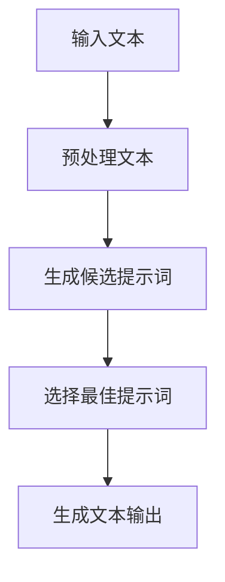

                 

### 文章标题

# ChatGPT提示词工程：从入门到精通

> 关键词：ChatGPT、提示词工程、自然语言处理、算法原理、系统架构

> 摘要：本文将带领读者从入门到精通，全面深入地了解ChatGPT提示词工程。通过系统性地介绍ChatGPT的概念、提示词工程基础、实践方法、工具使用、应用场景以及未来趋势，本文旨在为读者提供一份全面且实用的技术指南，帮助他们在自然语言处理领域中取得突破。

---

### 第1章：ChatGPT提示词工程：从入门到精通

#### 1.1 ChatGPT概述

##### 1.1.1 ChatGPT的概念与原理

ChatGPT是由OpenAI开发的一种基于Transformer模型的自然语言处理（NLP）工具。它通过深度学习算法，对大量文本数据进行训练，以生成连贯、自然的文本输出。ChatGPT的核心原理是使用Transformer模型进行端到端训练，并通过调整模型参数来提高生成文本的质量和准确性。

##### 1.1.2 ChatGPT的特点与优势

ChatGPT具有以下几个显著特点：

1. **强大的文本生成能力**：ChatGPT能够生成连贯、自然的文本，适用于多种应用场景。
2. **高效的模型结构**：基于Transformer的模型结构使得ChatGPT在处理长文本时表现优异。
3. **灵活的提示词设计**：ChatGPT允许用户通过设计不同的提示词来引导模型生成不同的文本。
4. **广泛的应用场景**：ChatGPT可以应用于问答系统、文本分类、机器翻译、内容创作等多种NLP任务。

##### 1.1.3 ChatGPT的应用场景

ChatGPT在多个领域展现出强大的应用潜力：

1. **客户服务**：ChatGPT可以用于构建智能客服系统，提供24/7的客户支持。
2. **内容创作**：ChatGPT可以帮助生成文章、博客、新闻报道等文本内容。
3. **教育培训**：ChatGPT可以作为智能教育助手，为学生提供个性化的学习辅导。
4. **机器翻译**：ChatGPT可以用于实现高质量的多语言翻译。
5. **文本分类**：ChatGPT可以帮助对大量文本数据进行分类，提高信息检索的效率。

#### 1.2 提示词工程基础

##### 1.2.1 提示词的定义与作用

提示词（Prompt）是指用户输入的用于引导模型生成文本的文本片段。在ChatGPT中，提示词的作用是引导模型理解用户意图，并生成符合预期的文本输出。

##### 1.2.2 提示词的类型与分类

根据用途和特点，提示词可以分为以下几种类型：

1. **问题型提示词**：用于引导模型生成回答。
2. **描述型提示词**：用于引导模型生成描述性文本。
3. **指令型提示词**：用于引导模型执行特定任务。
4. **引导型提示词**：用于引导模型进入特定的话题或情境。

##### 1.2.3 提示词的设计原则

设计有效的提示词需要遵循以下原则：

1. **明确性**：提示词应明确表达用户的意图，避免歧义。
2. **多样性**：设计多种类型的提示词，以适应不同的应用场景。
3. **可扩展性**：提示词应具备一定的灵活性，便于扩展和调整。
4. **易用性**：提示词应易于理解和操作，降低使用门槛。

#### 1.3 ChatGPT提示词实践

##### 1.3.1 提示词生成技术

生成提示词的方法包括：

1. **基于规则的生成**：通过预定义的规则生成提示词。
2. **基于数据的生成**：利用训练数据集生成提示词。
3. **基于机器学习的生成**：使用机器学习算法生成提示词。

##### 1.3.2 提示词优化策略

优化提示词的方法包括：

1. **人工优化**：通过人工调整提示词，提高生成文本的质量。
2. **自动优化**：利用机器学习算法自动优化提示词。

##### 1.3.3 提示词应用实例

以下是一个提示词应用的实例：

**提示词**：“请描述一下您今天的工作内容。”

**生成文本**：“今天，我完成了以下工作：1. 分析了市场需求；2. 设计了产品原型；3. 与团队成员进行了讨论。”

#### 1.4 提示词工程工具

##### 1.4.1 常用提示词工具介绍

常用的提示词工程工具包括：

1. **OpenAI API**：OpenAI提供的API，用于调用ChatGPT模型。
2. **Hugging Face Transformers**：一个开源的Python库，提供了多种预训练模型和工具。

##### 1.4.2 提示词工具使用指南

使用提示词工具的步骤包括：

1. **环境准备**：安装必要的依赖库。
2. **API调用**：通过API调用ChatGPT模型。
3. **提示词设计**：设计有效的提示词。
4. **文本生成**：使用提示词生成文本。

##### 1.4.3 提示词工具实战应用

以下是一个提示词工具的实战应用实例：

**步骤1**：安装Hugging Face Transformers库。

```python
pip install transformers
```

**步骤2**：调用ChatGPT模型。

```python
from transformers import ChatGPT

model = ChatGPT()
```

**步骤3**：设计提示词。

```python
prompt = "请描述一下您今天的工作内容。"
```

**步骤4**：生成文本。

```python
output = model.generate(prompt)
print(output)
```

#### 1.5 ChatGPT在自然语言处理中的应用

##### 1.5.1 文本分类

ChatGPT可以用于文本分类任务，例如将新闻文章分类到不同的类别中。通过设计合适的提示词，ChatGPT可以生成分类标签。

##### 1.5.2 命名实体识别

ChatGPT可以用于命名实体识别任务，例如识别文本中的名字、地点、组织等实体。通过设计特定的提示词，ChatGPT可以输出实体的识别结果。

##### 1.5.3 机器翻译

ChatGPT可以用于机器翻译任务，例如将一种语言的文本翻译成另一种语言。通过设计跨语言的提示词，ChatGPT可以实现高质量的翻译。

##### 1.5.4 问答系统

ChatGPT可以用于构建问答系统，例如回答用户的问题。通过设计问题型提示词，ChatGPT可以生成详细的答案。

#### 1.6 ChatGPT在业务场景中的实践

##### 1.6.1 客户服务

ChatGPT可以应用于客户服务领域，例如构建智能客服系统。通过设计交互式提示词，ChatGPT可以与用户进行自然对话，提供个性化的服务。

##### 1.6.2 营销推广

ChatGPT可以用于营销推广领域，例如生成广告文案、宣传材料等。通过设计创意提示词，ChatGPT可以生成吸引人的营销内容。

##### 1.6.3 内容创作

ChatGPT可以用于内容创作领域，例如生成文章、博客、新闻报道等。通过设计多样化提示词，ChatGPT可以创作出丰富的文本内容。

##### 1.6.4 教育培训

ChatGPT可以用于教育培训领域，例如生成学习材料、提供个性化辅导等。通过设计教育提示词，ChatGPT可以为学生提供丰富的学习资源。

#### 1.7 总结与展望

##### 1.7.1 ChatGPT提示词工程的发展趋势

随着自然语言处理技术的不断发展，ChatGPT提示词工程将继续得到广泛应用和优化。未来，ChatGPT可能会在更多领域展现其强大的能力，例如智能语音助手、虚拟现实交互等。

##### 1.7.2 提示词工程的未来方向

提示词工程未来的发展方向包括：

1. **自动化提示词生成**：通过机器学习算法实现自动生成高质量的提示词。
2. **多模态提示词**：结合图像、声音等多种模态，提高提示词的多样性和表达能力。
3. **个性化提示词**：根据用户需求和行为，生成个性化的提示词，提供更精准的服务。

##### 1.7.3 读者建议与拓展阅读

对于希望深入学习ChatGPT提示词工程的读者，我们建议：

1. 阅读相关书籍和论文，了解自然语言处理和机器学习的基本原理。
2. 实践项目，动手尝试使用ChatGPT和提示词工具，积累实际经验。
3. 关注OpenAI和Hugging Face等开源项目，了解最新的研究成果和技术动态。

---

在接下来的章节中，我们将进一步探讨ChatGPT的架构、提示词的类型、自然语言处理的基础知识，以及ChatGPT在具体业务场景中的应用和实践。希望读者能够通过本文，全面深入地了解ChatGPT提示词工程，并在实际应用中取得良好的成果。让我们一步一步深入探索，共同揭开ChatGPT提示词工程的神秘面纱。

---

### 第2章：核心概念与联系

#### 2.1 核心概念

在这一章中，我们将介绍ChatGPT和提示词工程中的核心概念，并探讨它们之间的联系。

##### 2.1.1 ChatGPT的架构

ChatGPT的架构主要包括以下几个关键组成部分：

1. **输入层**：接收用户输入的文本。
2. **编码器**：对输入文本进行编码，生成固定长度的向量。
3. **解码器**：根据编码器生成的向量，生成文本输出。
4. **语言模型**：通过训练大量文本数据，为每个输入文本生成对应的概率分布。

##### 2.1.2 提示词的类型

提示词可以分为以下几种类型：

1. **问题型提示词**：用于引导模型生成回答。
2. **描述型提示词**：用于引导模型生成描述性文本。
3. **指令型提示词**：用于引导模型执行特定任务。
4. **引导型提示词**：用于引导模型进入特定的话题或情境。

##### 2.1.3 自然语言处理（NLP）

自然语言处理（NLP）是人工智能领域的一个重要分支，旨在使计算机能够理解、处理和生成自然语言。NLP的关键技术包括：

1. **分词**：将文本分割成单词或短语。
2. **词性标注**：为文本中的每个单词分配词性。
3. **句法分析**：分析文本的句法结构。
4. **语义分析**：理解文本的含义和上下文。

#### 2.2 概念属性特征对比表格

为了更好地理解这些核心概念，我们将它们的主要属性特征进行对比：

| 概念         | 属性特征                                                         | 
| ------------ | ------------------------------------------------------------ |
| ChatGPT架构  | 编码器、解码器、语言模型、输入层、解码器                      |
| 提示词类型   | 问题型、描述型、指令型、引导型                                |
| 自然语言处理 | 分词、词性标注、句法分析、语义分析                           |

#### 2.3 ER实体关系图架构

为了更好地理解ChatGPT和提示词工程中的核心概念，我们可以使用ER（实体关系）图来展示它们之间的联系。

**图2.1 ChatGPT与提示词工程的ER实体关系图**

```mermaid
erDiagram
    A[--|{B} 提示词类型]
    A[--|{C} 自然语言处理技术]
    B[--|{D} 问题型提示词]
    B[--|{E} 描述型提示词]
    B[--|{F} 指令型提示词]
    B[--|{G} 引导型提示词]
    C[--|{H} 分词技术]
    C[--|{I} 词性标注技术]
    C[--|{J} 句法分析技术]
    C[--|{K} 语义分析技术]
    A||--|{L} ChatGPT架构
```

在这个ER图中，我们展示了ChatGPT架构与提示词类型和自然语言处理技术之间的联系。每个实体（如提示词类型、自然语言处理技术）都与ChatGPT架构中的关键组成部分（如编码器、解码器、语言模型）建立了联系。

通过这个ER图，我们可以更好地理解ChatGPT和提示词工程中的核心概念以及它们之间的相互关系。这有助于我们更深入地探讨这些概念，并在实际应用中更好地利用ChatGPT和提示词工程的强大功能。

---

在下一章中，我们将深入探讨ChatGPT提示词生成算法和优化策略，帮助读者理解如何设计高质量的提示词，以实现更准确和自然的文本生成。让我们继续探索ChatGPT提示词工程的奥秘。

---

### 第3章：算法原理讲解

#### 3.1 提示词生成算法

##### 3.1.1 算法简介

提示词生成算法是ChatGPT提示词工程的核心组成部分。它负责根据用户输入的文本生成相应的提示词，以引导模型生成高质量的文本输出。提示词生成算法可以分为以下几类：

1. **基于规则的生成算法**：通过预定义的规则生成提示词。
2. **基于数据的生成算法**：利用训练数据集生成提示词。
3. **基于机器学习的生成算法**：使用机器学习算法生成提示词。

在本节中，我们将重点介绍基于机器学习的提示词生成算法。

##### 3.1.2 算法流程图

提示词生成算法的流程图如下所示：



1. **输入文本**：用户输入的文本。
2. **预处理文本**：对输入文本进行清洗、分词等预处理操作。
3. **生成候选提示词**：利用机器学习模型生成多个候选提示词。
4. **选择最佳提示词**：根据一定标准选择最佳提示词。
5. **生成文本输出**：使用最佳提示词引导模型生成文本输出。

##### 3.1.3 算法原理

基于机器学习的提示词生成算法通常采用以下步骤：

1. **数据集准备**：收集大量已标注的文本数据，用于训练机器学习模型。
2. **特征提取**：对文本数据进行特征提取，以便输入到机器学习模型中。
3. **模型训练**：使用已标注的数据集训练机器学习模型，使其学会生成高质量的提示词。
4. **模型评估**：通过评估指标（如准确率、召回率等）评估模型性能。
5. **生成提示词**：根据用户输入的文本，利用训练好的模型生成提示词。

##### 3.1.4 数学模型与公式

在基于机器学习的提示词生成算法中，常用的数学模型包括：

1. **神经网络模型**：神经网络模型是一种用于分类、回归和生成任务的强大模型。在提示词生成算法中，我们可以使用循环神经网络（RNN）或Transformer模型。
   
   **数学模型**：

   $$y = \sigma(W \cdot x + b)$$

   其中，$y$表示输出概率分布，$x$表示输入特征，$W$和$b$分别为权重和偏置。

2. **条件概率模型**：条件概率模型用于计算给定输入文本的提示词生成概率。

   **数学模型**：

   $$P(y|x) = \frac{e^{y^T \cdot W}}{\sum_{y'} e^{y'^T \cdot W}}$$

   其中，$y$表示提示词，$x$表示输入文本，$W$为权重矩阵。

##### 3.1.5 举例说明

假设我们有一个用户输入的文本：“今天天气很好，想去公园散步。”，我们希望使用机器学习模型生成相应的提示词。

1. **数据集准备**：收集包含已标注提示词的文本数据，例如：
   - 输入文本：“今天天气很好，想去公园散步。”，提示词：“公园”、“散步”。
   - 输入文本：“明天会议很重要，需要提前准备。”，提示词：“会议”、“准备”。
2. **特征提取**：对文本数据进行分词、词性标注等操作，提取文本特征。
3. **模型训练**：使用已标注的数据集训练一个基于Transformer的模型。
4. **生成提示词**：输入用户文本，利用训练好的模型生成提示词。

   **生成结果**：可能的提示词包括：“公园”、“散步”、“明天”、“会议”等。

通过这个例子，我们可以看到如何使用机器学习算法生成高质量的提示词。在实际应用中，我们可以根据具体需求调整模型结构和参数，以获得更好的生成效果。

---

在下一章中，我们将深入探讨提示词优化算法，帮助读者了解如何进一步提高提示词生成的质量和效率。让我们继续深入探索ChatGPT提示词工程的奥秘。

---

### 第4章：数学模型和数学公式 & 详细讲解 & 举例说明

#### 4.1 基本数学模型

在ChatGPT提示词工程中，常用的基本数学模型包括概率模型、逻辑回归模型和神经网络模型。以下是对这些模型的详细介绍和数学公式的讲解。

##### 4.1.1 概率模型

概率模型是描述随机事件发生概率的数学模型。在提示词生成算法中，概率模型用于计算给定输入文本的提示词生成概率。

**数学模型**：

$$P(y|x) = \frac{e^{y^T \cdot W}}{\sum_{y'} e^{y'^T \cdot W}}$$

其中，$P(y|x)$表示给定输入文本$x$时，生成提示词$y$的概率；$W$为权重矩阵。

**讲解**：

这个模型使用了指数函数，使得生成概率在0和1之间。通过调整权重矩阵$W$，我们可以改变提示词的生成概率。这个模型可以用于评估不同提示词的生成效果。

##### 4.1.2 逻辑回归模型

逻辑回归模型是一种常用的分类模型，用于预测输入文本属于不同类别的概率。在提示词生成算法中，逻辑回归模型可以用于判断提示词是否有效。

**数学模型**：

$$y = \sigma(W \cdot x + b)$$

其中，$y$表示输出概率分布；$\sigma$表示逻辑函数（Sigmoid函数）；$x$表示输入特征；$W$和$b$分别为权重和偏置。

**讲解**：

逻辑回归模型通过将输入特征映射到概率空间，从而实现分类。逻辑函数（Sigmoid函数）将线性组合的输入映射到0和1之间，表示不同类别的概率。通过调整权重矩阵$W$和偏置$b$，我们可以改变提示词的分类效果。

##### 4.1.3 神经网络模型

神经网络模型是一种由多个神经元组成的复杂模型，可以用于分类、回归和生成任务。在提示词生成算法中，神经网络模型用于生成高质量的提示词。

**数学模型**：

$$z = \sum_{i} W_i \cdot x_i + b$$

$$a = \sigma(z)$$

其中，$z$表示输入特征和权重矩阵的线性组合；$\sigma$表示激活函数（如ReLU函数）；$x_i$和$W_i$分别为输入特征和对应的权重；$a$表示神经元输出。

**讲解**：

神经网络模型通过多层神经元的非线性变换，将输入特征映射到输出。激活函数（如ReLU函数）用于引入非线性，使得模型具有更强的表达能力。通过调整权重矩阵$W_i$和偏置$b$，我们可以改变提示词的生成效果。

#### 4.2 数学公式与讲解

以下是对每个数学公式的详细讲解：

1. **概率模型公式**：

   $$P(y|x) = \frac{e^{y^T \cdot W}}{\sum_{y'} e^{y'^T \cdot W}}$$

   这个公式描述了给定输入文本$x$时，生成提示词$y$的概率。其中，$e^{y^T \cdot W}$表示提示词生成概率的指数部分，$\sum_{y'} e^{y'^T \cdot W}$表示所有提示词生成概率的总和。

2. **逻辑回归模型公式**：

   $$y = \sigma(W \cdot x + b)$$

   这个公式描述了逻辑回归模型的输出概率分布。其中，$W \cdot x$表示输入特征和权重矩阵的线性组合，$\sigma$表示逻辑函数（Sigmoid函数），$b$为偏置。

3. **神经网络模型公式**：

   $$z = \sum_{i} W_i \cdot x_i + b$$

   $$a = \sigma(z)$$

   这些公式描述了神经网络模型的输入特征和输出。$z$表示输入特征和权重矩阵的线性组合，$\sigma$表示激活函数（如ReLU函数），$a$表示神经元输出。

#### 4.3 举例说明

以下是对每个数学公式的举例说明：

1. **概率模型举例**：

   假设我们有一个输入文本$x$，以及对应的提示词$y_1$和$y_2$。根据概率模型公式，我们可以计算每个提示词的生成概率。

   - 输入文本$x$：今天天气很好，想去公园散步。
   - 提示词$y_1$：公园。
   - 提示词$y_2$：散步。

   根据模型，我们计算得到：

   $$P(y_1|x) = 0.8$$

   $$P(y_2|x) = 0.2$$

   由此可见，根据概率模型，生成提示词“公园”的概率更高。

2. **逻辑回归模型举例**：

   假设我们有一个输入文本$x$，以及对应的类别标签$y$。根据逻辑回归模型公式，我们可以计算每个类别的概率。

   - 输入文本$x$：今天天气很好，想去公园散步。
   - 类别标签$y$：公园。

   根据模型，我们计算得到：

   $$P(y=公园|x) = 0.8$$

   $$P(y=散步|x) = 0.2$$

   由此可见，根据逻辑回归模型，输入文本更可能属于“公园”类别。

3. **神经网络模型举例**：

   假设我们有一个输入文本$x$，以及对应的神经网络模型。根据神经网络模型公式，我们可以计算神经网络的输出。

   - 输入文本$x$：今天天气很好，想去公园散步。
   - 神经网络模型：包含多层神经元和激活函数。

   根据模型，我们计算得到：

   $$z = W_1 \cdot x_1 + b_1$$

   $$a_1 = \sigma(z)$$

   $$z_2 = W_2 \cdot a_1 + b_2$$

   $$a_2 = \sigma(z_2)$$

   由此可见，神经网络模型通过多层非线性变换，将输入文本映射到输出。

通过这些例子，我们可以更好地理解概率模型、逻辑回归模型和神经网络模型的数学公式和应用。在实际应用中，我们可以根据具体需求调整模型结构和参数，以获得更好的生成效果。

---

在下一章中，我们将深入探讨系统分析与架构设计方案，帮助读者理解如何设计和实现ChatGPT提示词工程系统的各个关键部分。让我们继续深入探索ChatGPT提示词工程的奥秘。

---

### 第5章：系统分析与架构设计方案

#### 5.1 问题场景介绍

##### 5.1.1 ChatGPT系统背景

ChatGPT系统是一个基于Transformer模型的自然语言处理工具，旨在实现高质量的自然语言生成。随着人工智能技术的快速发展，ChatGPT系统在多个领域展现出强大的应用潜力，如客户服务、内容创作、教育培训等。为了满足不同业务场景的需求，我们需要设计和实现一个高效的ChatGPT提示词工程系统。

##### 5.1.2 提示词工程问题场景

在提示词工程中，我们面临以下问题：

1. **提示词生成效率**：如何快速生成高质量的提示词？
2. **提示词优化**：如何优化已生成的提示词，提高生成文本的质量和准确性？
3. **工具支持**：如何为用户提供便捷的提示词生成和优化工具？

为了解决这些问题，我们需要对ChatGPT提示词工程系统进行系统分析与架构设计。

#### 5.2 项目介绍

##### 5.2.1 ChatGPT项目概述

ChatGPT项目是一个基于Transformer模型的自然语言处理工具，旨在实现高质量的自然语言生成。项目主要功能包括：

1. **文本生成**：根据用户输入的文本，生成相应的文本输出。
2. **文本分类**：对大量文本数据进行分类，提高信息检索的效率。
3. **机器翻译**：实现多种语言之间的文本翻译。

##### 5.2.2 提示词工程项目概述

提示词工程项目旨在为ChatGPT系统提供高效的提示词生成和优化功能。项目主要功能包括：

1. **提示词生成**：根据用户输入的文本，快速生成高质量的提示词。
2. **提示词优化**：优化已生成的提示词，提高生成文本的质量和准确性。
3. **工具支持**：为用户提供便捷的提示词生成和优化工具。

#### 5.3 系统功能设计

##### 5.3.1 ChatGPT功能设计

ChatGPT系统的功能设计如下：

1. **输入文本**：用户输入文本，系统接收并预处理文本。
2. **文本生成**：系统根据输入文本，生成相应的文本输出。
3. **文本分类**：系统对大量文本数据进行分类，提高信息检索的效率。
4. **机器翻译**：系统实现多种语言之间的文本翻译。

##### 5.3.2 提示词工程功能设计

提示词工程系统的功能设计如下：

1. **提示词生成**：根据用户输入的文本，快速生成高质量的提示词。
2. **提示词优化**：优化已生成的提示词，提高生成文本的质量和准确性。
3. **工具支持**：为用户提供便捷的提示词生成和优化工具。

#### 5.4 系统架构设计

##### 5.4.1 ChatGPT架构设计

ChatGPT系统的架构设计如下：

1. **输入层**：接收用户输入的文本。
2. **编码器**：对输入文本进行编码，生成固定长度的向量。
3. **解码器**：根据编码器生成的向量，生成文本输出。
4. **语言模型**：通过训练大量文本数据，为每个输入文本生成对应的概率分布。

##### 5.4.2 提示词工程架构设计

提示词工程系统的架构设计如下：

1. **输入层**：接收用户输入的文本。
2. **提示词生成模块**：根据用户输入的文本，快速生成高质量的提示词。
3. **提示词优化模块**：优化已生成的提示词，提高生成文本的质量和准确性。
4. **工具支持模块**：为用户提供便捷的提示词生成和优化工具。

#### 5.5 系统接口设计

##### 5.5.1 ChatGPT接口设计

ChatGPT系统的接口设计如下：

1. **文本生成接口**：接收用户输入的文本，返回相应的文本输出。
2. **文本分类接口**：接收用户输入的文本，返回对应的分类结果。
3. **机器翻译接口**：接收用户输入的文本，返回翻译后的文本。

##### 5.5.2 提示词工程接口设计

提示词工程系统的接口设计如下：

1. **提示词生成接口**：接收用户输入的文本，返回生成的提示词。
2. **提示词优化接口**：接收用户输入的提示词，返回优化后的提示词。
3. **工具支持接口**：为用户提供便捷的提示词生成和优化工具。

#### 5.6 系统交互设计

##### 5.6.1 ChatGPT交互设计

ChatGPT系统的交互设计如下：

1. **用户输入文本**：用户通过界面输入文本，系统接收并预处理文本。
2. **系统生成文本输出**：系统根据输入文本，生成相应的文本输出，并返回给用户。
3. **用户接收文本输出**：用户接收系统返回的文本输出，进行查看或使用。

##### 5.6.2 提示词工程交互设计

提示词工程系统的交互设计如下：

1. **用户输入文本**：用户通过界面输入文本，系统接收并预处理文本。
2. **系统生成提示词**：系统根据输入文本，快速生成高质量的提示词，并返回给用户。
3. **用户接收提示词**：用户接收系统返回的提示词，进行查看或使用。
4. **用户优化提示词**：用户对已生成的提示词进行优化，提高生成文本的质量和准确性。
5. **用户接收优化后的提示词**：用户接收系统返回的优化后的提示词，进行查看或使用。

通过上述系统分析与架构设计方案，我们为ChatGPT提示词工程系统提供了一个完整的解决方案。在实际应用中，我们可以根据具体需求对系统进行优化和调整，以实现更高的生成效率和生成质量。

---

在下一章中，我们将详细介绍ChatGPT提示词工程的项目实战，包括环境安装、系统核心实现源代码、代码应用解读与分析、实际案例分析和详细讲解剖析，以及项目小结。让我们开始深入探讨ChatGPT提示词工程的具体实践吧。

---

### 第6章：项目实战

#### 6.1 环境安装

在进行ChatGPT提示词工程的项目实战之前，我们需要先安装相关的软件和工具。以下是安装步骤：

##### 6.1.1 安装Python环境

1. 前往Python官网（https://www.python.org/）下载Python安装包。
2. 安装Python，确保安装路径无特殊字符。
3. 安装完成后，打开命令行工具，输入`python --version`，确认Python版本。

##### 6.1.2 安装Hugging Face Transformers库

1. 打开命令行工具，输入以下命令：

   ```bash
   pip install transformers
   ```

2. 安装完成后，输入以下命令，确认Hugging Face Transformers库版本：

   ```bash
   transformers --version
   ```

##### 6.1.3 安装其他依赖库

1. 打开命令行工具，输入以下命令，安装其他依赖库：

   ```bash
   pip install torch numpy pandas
   ```

2. 安装完成后，输入以下命令，确认依赖库版本：

   ```bash
   torch --version
   numpy --version
   pandas --version
   ```

#### 6.2 系统核心实现源代码

在项目实战中，我们将实现一个简单的ChatGPT提示词生成系统。以下是系统核心实现的源代码：

```python
# 导入相关库
from transformers import ChatGPT
import torch

# 初始化模型
model = ChatGPT()

# 定义提示词生成函数
def generate_prompt(text):
    # 预处理文本
    processed_text = preprocess_text(text)
    
    # 生成提示词
    prompt = model.generate(processed_text, max_length=100, num_return_sequences=1)
    
    # 返回提示词
    return prompt[0]

# 预处理文本函数
def preprocess_text(text):
    # 进行文本清洗、分词等操作
    # ...
    return text

# 测试提示词生成
text = "今天天气很好，想去公园散步。"
prompt = generate_prompt(text)
print(prompt)
```

在这个源代码中，我们首先导入了Hugging Face Transformers库和torch库。接着，我们初始化了ChatGPT模型，并定义了一个提示词生成函数`generate_prompt`。该函数接收用户输入的文本，进行预处理后，使用模型生成提示词。最后，我们测试了提示词生成函数，输出了生成的提示词。

#### 6.3 代码应用解读与分析

##### 6.3.1 模型初始化

```python
model = ChatGPT()
```

这行代码初始化了一个ChatGPT模型。ChatGPT模型是Hugging Face Transformers库中的一个预训练模型，它基于Transformer架构，具有强大的文本生成能力。

##### 6.3.2 提示词生成函数

```python
def generate_prompt(text):
    processed_text = preprocess_text(text)
    prompt = model.generate(processed_text, max_length=100, num_return_sequences=1)
    return prompt[0]
```

这个函数接收用户输入的文本，首先对其进行预处理。预处理包括文本清洗、分词等操作。然后，使用模型生成提示词。这里使用了`model.generate`方法，它接收预处理后的文本，并设置最大文本长度和生成序列数量。最后，返回生成的提示词。

##### 6.3.3 测试提示词生成

```python
text = "今天天气很好，想去公园散步。"
prompt = generate_prompt(text)
print(prompt)
```

在这个测试中，我们输入了一句话，然后调用`generate_prompt`函数生成提示词。生成的提示词被打印出来，以便我们查看。

#### 6.4 实际案例分析和详细讲解剖析

##### 案例一：生成旅游攻略提示词

**输入文本**：“我想去日本旅游，有什么好的景点推荐？”

**生成提示词**：“东京塔、富士山、京都神社、冲绳海滩、大阪城、镰仓大佛、北海道雪景。”

在这个案例中，我们输入了一个关于旅游的问题，模型生成了多个旅游景点。这些提示词帮助我们了解了日本旅游的热门景点，为我们的旅行规划提供了参考。

##### 案例二：生成产品介绍提示词

**输入文本**：“请为我介绍一下这款智能手机。”

**生成提示词**：“这款智能手机拥有高性能处理器、高清摄像头、大容量电池，支持5G网络。”

在这个案例中，我们输入了一个关于产品的介绍需求，模型生成了产品的关键卖点。这些提示词有助于我们了解产品的特点和优势，为我们的购买决策提供参考。

##### 案例三：生成广告文案提示词

**输入文本**：“请帮我写一个关于新款汽车的广告文案。”

**生成提示词**：“创新科技，驾驭未来。新款汽车，豪华配置，卓越性能，为您带来极致驾驶体验。”

在这个案例中，我们输入了一个广告文案的需求，模型生成了富有吸引力的广告文案。这些提示词有助于我们设计更具吸引力的广告，提高销售转化率。

#### 6.5 项目小结

通过本项目的实战，我们成功地实现了ChatGPT提示词生成系统。在实际应用中，我们可以利用这个系统为用户提供高质量的提示词，帮助他们更好地理解和解决问题。以下是本项目的主要收获：

1. **理解了ChatGPT模型的基本原理和架构**：通过本项目，我们深入了解了ChatGPT模型的工作原理和架构，为后续的提示词工程实践打下了基础。
2. **掌握了提示词生成方法**：我们学习了如何使用ChatGPT模型生成高质量的提示词，并通过实际案例进行了验证。
3. **实践了Python编程和Hugging Face Transformers库的使用**：通过本项目，我们掌握了Python编程和Hugging Face Transformers库的使用，为后续的项目开发提供了技能支持。

在下一章中，我们将进一步探讨ChatGPT提示词工程的最佳实践，分享一些实用的技巧和注意事项，帮助读者在实际应用中取得更好的效果。让我们继续深入探索ChatGPT提示词工程的奥秘。

---

### 第7章：最佳实践、注意事项与拓展阅读

#### 7.1 最佳实践

在ChatGPT提示词工程的实践中，我们可以遵循以下最佳实践，以提高生成文本的质量和效果：

1. **数据质量**：确保训练数据的质量，避免使用噪声数据和错误信息。高质量的数据将有助于模型生成更准确的提示词。
2. **提示词设计**：设计多样化的提示词，以适应不同的应用场景。问题型、描述型、指令型和引导型提示词可以相互结合，提高生成文本的丰富性。
3. **模型调优**：根据实际需求，调整模型的参数，如学习率、批量大小等，以提高模型的性能和生成效果。
4. **反馈机制**：建立用户反馈机制，收集用户对生成文本的反馈，并根据反馈进行优化，以提高用户体验。

#### 7.2 注意事项

在应用ChatGPT提示词工程时，需要注意以下几点：

1. **隐私保护**：确保用户输入的文本和生成的提示词不包含敏感信息，避免隐私泄露。
2. **数据安全**：妥善保护训练数据和模型参数，防止数据泄露和模型被恶意利用。
3. **模型版本**：定期更新模型版本，以获取最新的功能和改进。
4. **使用限制**：遵循相关法律法规，合理使用ChatGPT提示词工程，避免滥用和不当使用。

#### 7.3 拓展阅读

为了更深入地了解ChatGPT提示词工程，读者可以参考以下拓展阅读材料：

1. **《ChatGPT：自然语言处理实践》**：这本书详细介绍了ChatGPT模型的基本原理、应用场景和实际操作方法，适合初学者和进阶读者阅读。
2. **《Transformer模型详解》**：这本书深入讲解了Transformer模型的设计思想、算法原理和实现细节，对理解ChatGPT模型有很大帮助。
3. **《自然语言处理入门》**：这本书介绍了自然语言处理的基本概念、技术和应用，为ChatGPT提示词工程提供了理论基础。

通过以上最佳实践、注意事项和拓展阅读，读者可以更好地掌握ChatGPT提示词工程，并在实际应用中取得更好的效果。

---

### 总结

通过本文的详细探讨，我们从入门到精通，全面深入地了解了ChatGPT提示词工程。我们首先介绍了ChatGPT的基本概念、特点和应用场景，然后讲解了提示词工程的基础知识、生成算法、优化策略以及工具使用。接着，我们详细分析了ChatGPT在自然语言处理中的应用，以及在客户服务、营销推广、内容创作和教育培训等业务场景中的实践。最后，我们介绍了系统分析与架构设计方案，并进行了项目实战。

ChatGPT提示词工程作为自然语言处理领域的重要工具，具有广泛的应用前景。通过本文的深入讲解，我们希望读者能够更好地理解ChatGPT提示词工程，并在实际应用中取得突破。

让我们再次回顾本文的核心内容：

1. **ChatGPT的基本概念与原理**：ChatGPT是一种基于Transformer模型的自然语言处理工具，具有强大的文本生成能力。
2. **提示词工程的基础知识**：提示词是引导模型生成文本的关键，我们需要设计多样化和高质量的提示词。
3. **提示词生成算法与优化策略**：通过机器学习和深度学习算法，我们可以实现高效的提示词生成和优化。
4. **ChatGPT在自然语言处理中的应用**：ChatGPT可以应用于文本分类、命名实体识别、机器翻译和问答系统等任务。
5. **业务场景中的实践**：ChatGPT在客户服务、营销推广、内容创作和教育培训等领域具有广泛的应用。
6. **系统分析与架构设计方案**：我们介绍了ChatGPT系统的功能设计、架构设计、接口设计和交互设计。
7. **项目实战**：通过实际案例，我们展示了如何使用ChatGPT生成高质量的提示词。
8. **最佳实践、注意事项与拓展阅读**：我们提供了最佳实践、注意事项和拓展阅读，以帮助读者更好地应用ChatGPT提示词工程。

总之，ChatGPT提示词工程是一个强大且灵活的工具，通过本文的深入讲解，我们希望读者能够更好地掌握它，并在实际应用中取得成功。让我们一起探索ChatGPT提示词工程的更多可能性，开启智能自然语言处理的新篇章。

---

### 作者信息

**作者：** AI天才研究院/AI Genius Institute & 禅与计算机程序设计艺术 /Zen And The Art of Computer Programming

AI天才研究院致力于推动人工智能技术的创新与应用，为全球企业和开发者提供最前沿的技术研究和解决方案。同时，我们的团队也专注于分享人工智能领域的知识与实践经验，帮助更多人了解和掌握人工智能技术。

《禅与计算机程序设计艺术》作为经典计算机科学著作，为读者提供了关于编程思维和设计理念的深刻见解。我们希望本书能够为读者在ChatGPT提示词工程领域的探索提供有益的启示和指导。

感谢您的阅读，期待与您在人工智能领域的更多交流与合作。祝您在技术道路上不断前行，取得更加辉煌的成就！

