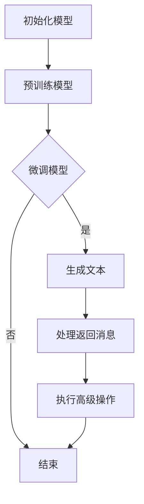
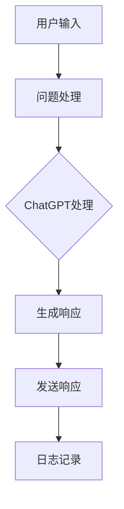
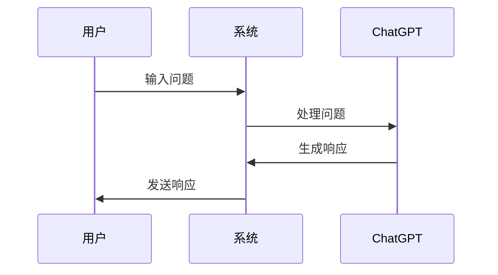
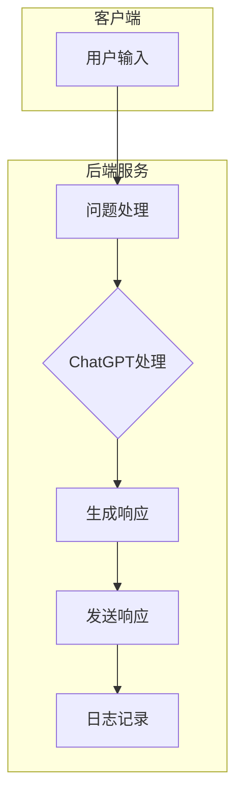
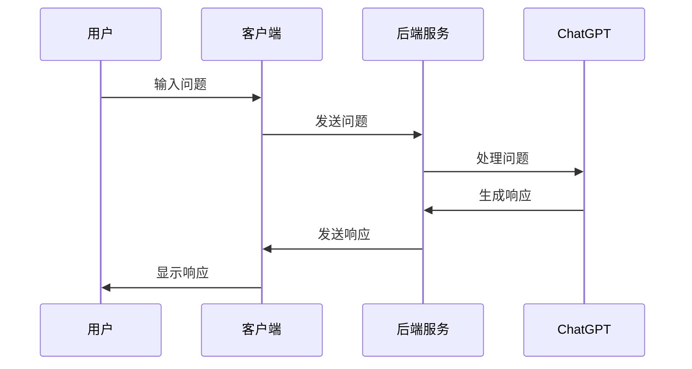

                 

```markdown
----------------------------------------------------------------
# 《ChatGPT提示词工程：从入门到精通》

> 关键词：ChatGPT、提示词工程、自然语言处理、应用实践、未来趋势

> 摘要：本文将从入门到精通，全面解析ChatGPT及其提示词工程。我们将首先介绍ChatGPT的基本概念、发展历程和应用场景，然后深入探讨如何搭建和部署ChatGPT，以及其基本操作和高级应用。接下来，我们将重点讲解ChatGPT提示词工程的编写技巧、管理策略和优化方法。最后，我们将探讨ChatGPT在自然语言处理中的应用和商业实践，并展望其未来发展。

----------------------------------------------------------------
## 第1章: ChatGPT介绍与概述

### 1.1 ChatGPT的基本概念

ChatGPT是GPT-3的一种变体，由OpenAI开发，是一种基于深度学习的自然语言处理模型。它能够生成流畅、自然的文本，进行对话，完成文本生成、分类、情感分析等任务。

#### ChatGPT的工作原理

ChatGPT基于Transformer架构，使用了大量的预训练数据和先进的优化技术。其工作原理可以概括为以下几个步骤：

1. **预训练**：使用大量的文本数据进行预训练，让模型学会理解文本的含义和生成文本。
2. **微调**：在特定的任务上对模型进行微调，使其能够针对特定的任务进行优化。
3. **生成文本**：接收输入文本，根据预训练和微调的结果，生成相应的文本。

### 1.2 ChatGPT的发展历程

ChatGPT的起源可以追溯到GPT-2，OpenAI在2019年发布了GPT-2，引起了广泛关注。随后，OpenAI在2020年发布了GPT-3，这是一个更加庞大、功能更强大的模型。ChatGPT是基于GPT-3开发的，它继承了GPT-3的优点，并在对话生成方面进行了优化。

### 1.3 ChatGPT的应用场景

ChatGPT可以应用于多种场景，包括：

1. **文本生成**：生成文章、故事、对话等。
2. **文本分类**：对文本进行分类，如情感分析、新闻分类等。
3. **对话系统**：构建智能对话系统，如客服机器人、聊天机器人等。
4. **机器翻译**：进行文本翻译，如英文到中文的翻译。

### 1.4 ChatGPT的优势与局限

#### 优势

- **高效性**：ChatGPT能够快速地生成文本，处理大量的文本数据。
- **生成质量高**：ChatGPT生成的文本流畅、自然，接近人类写作水平。
- **自适应性**：ChatGPT能够根据输入的文本进行自适应，生成相应的文本。

#### 局限

- **计算资源需求高**：ChatGPT是一个庞大的模型，需要大量的计算资源。
- **对数据依赖性较强**：ChatGPT的性能很大程度上取决于训练数据的质量。

----------------------------------------------------------------
## 第2章: ChatGPT的搭建与部署

### 2.1 ChatGPT的环境搭建

#### 2.1.1 Python环境搭建

首先，我们需要安装Python环境。我们可以从Python的官方网站下载安装包，并按照安装向导进行安装。安装完成后，我们可以在终端中输入`python --version`来检查Python版本。

#### 2.1.2 ChatGPT库安装

接下来，我们需要安装ChatGPT所需的库。我们可以使用pip来安装这些库。在终端中输入以下命令：

```bash
pip install transformers
pip install torch
```

这些命令将安装ChatGPT所需的库。

### 2.2 ChatGPT的部署

#### 2.2.1 搭建本地服务器

首先，我们需要配置本地服务器。我们可以使用Docker来搭建服务器。首先，我们需要安装Docker，然后从Docker Hub下载ChatGPT的镜像，并使用以下命令启动容器：

```bash
docker pull openai/chatgpt
docker run -p 9000:80 openai/chatgpt
```

这些命令将下载ChatGPT的镜像，并启动容器。

#### 2.2.2 部署到云平台

我们也可以将ChatGPT部署到云平台。不同的云平台有不同的部署流程，但一般来说，我们需要创建一个云服务器，然后安装ChatGPT所需的库和配置，最后启动ChatGPT服务。

----------------------------------------------------------------
## 第3章: ChatGPT的基本操作

### 3.1 初始化ChatGPT

在Python中，我们可以使用transformers库来初始化ChatGPT。以下是一个示例代码：

```python
from transformers import ChatGPT

model = ChatGPT.from_pretrained("openai/chatgpt")
```

在这个示例中，我们从预训练的模型中加载了ChatGPT。

### 3.2 发送文本消息

我们可以使用以下代码来发送文本消息：

```python
response = model.communicate("你好，我是ChatGPT。")
print(response)
```

在这个示例中，我们向ChatGPT发送了一条文本消息，并打印了返回的响应。

### 3.3 处理返回消息

我们可以使用以下代码来处理返回的响应：

```python
print("ChatGPT回复：", response)
```

在这个示例中，我们打印了ChatGPT的回复。

### 3.4 高级操作

ChatGPT提供了多种高级操作，如多轮对话和预处理文本。以下是一个示例：

```python
responses = model.communicate("你好，你能给我讲一个故事吗？")
print("ChatGPT回复：", responses)
```

在这个示例中，我们进行了多轮对话，并打印了返回的响应。

----------------------------------------------------------------
## 第4章: ChatGPT提示词工程

### 4.1 提示词的基本概念

提示词是用于引导ChatGPT生成文本的关键词或短语。提示词的质量直接影响生成文本的质量。

### 4.2 提示词的编写技巧

编写高质量的提示词需要一定的技巧。以下是一些编写提示词的技巧：

- **明确性**：提示词应该明确、具体，避免模糊。
- **多样性**：使用多种类型的提示词，如问题、指令、评论等。
- **相关性**：提示词应该与生成文本的主题相关。

### 4.3 提示词的管理与优化

提示词的管理和优化对于提升ChatGPT的性能至关重要。以下是一些提示词的管理和优化策略：

- **收集和整理**：收集大量的提示词，并进行整理。
- **分词和分类**：对提示词进行分词和分类，以便于管理和使用。
- **更新和迭代**：定期更新和迭代提示词库，以适应新的需求。

### 4.4 提示词的实战案例

以下是一个提示词的实战案例：

```python
# 提示词：请讲述一个关于友谊的故事
response = model.communicate("请讲述一个关于友谊的故事。")
print("ChatGPT回复：", response)
```

在这个案例中，我们使用了一个具体的提示词来引导ChatGPT生成一个关于友谊的故事。

----------------------------------------------------------------
## 第5章: ChatGPT在自然语言处理中的应用

### 5.1 文本分类

文本分类是自然语言处理中的一个重要任务。ChatGPT可以用于文本分类任务，以下是一个示例：

```python
# 提示词：这是一个关于科技的文章
response = model.communicate("这是一个关于科技的文章。")
print("ChatGPT回复：", response)
```

在这个案例中，我们使用ChatGPT来对文本进行分类。

### 5.2 情感分析

情感分析是自然语言处理中的另一个重要任务。ChatGPT可以用于情感分析任务，以下是一个示例：

```python
# 提示词：这篇文章的语气是积极的
response = model.communicate("这篇文章的语气是积极的。")
print("ChatGPT回复：", response)
```

在这个案例中，我们使用ChatGPT来分析文本的语气。

### 5.3 机器翻译

机器翻译是自然语言处理中的另一个重要任务。ChatGPT可以用于机器翻译任务，以下是一个示例：

```python
# 提示词：请将这段英文翻译成中文
response = model.communicate("This is a test sentence.")
print("ChatGPT回复：", response)
```

在这个案例中，我们使用ChatGPT来将英文翻译成中文。

### 5.4 问答系统

问答系统是自然语言处理中的另一个重要应用。ChatGPT可以用于构建问答系统，以下是一个示例：

```python
# 提示词：什么是人工智能？
response = model.communicate("什么是人工智能？")
print("ChatGPT回复：", response)
```

在这个案例中，我们使用ChatGPT来回答一个关于人工智能的问题。

----------------------------------------------------------------
## 第6章: ChatGPT在商业应用中的实践

### 6.1 客户服务机器人

客户服务机器人是ChatGPT在商业应用中的一个重要领域。以下是一个客户服务机器人的示例：

```python
# 提示词：我能帮你什么？
response = model.communicate("你能帮我什么？")
print("ChatGPT回复：", response)
```

在这个案例中，我们使用ChatGPT来构建一个简单的客户服务机器人。

### 6.2 市场调研

ChatGPT也可以用于市场调研，以下是一个市场调研的示例：

```python
# 提示词：请问市场上有哪些流行的智能家居产品？
response = model.communicate("请问市场上有哪些流行的智能家居产品？")
print("ChatGPT回复：", response)
```

在这个案例中，我们使用ChatGPT来收集市场信息。

### 6.3 售后支持

ChatGPT也可以用于售后支持，以下是一个售后支持的示例：

```python
# 提示词：我的产品出了问题，怎么办？
response = model.communicate("我的产品出了问题，怎么办？")
print("ChatGPT回复：", response)
```

在这个案例中，我们使用ChatGPT来提供售后支持。

### 6.4 其他商业应用场景

ChatGPT还可以应用于其他商业应用场景，如营销、客户关系管理、人力资源等。以下是一个营销的示例：

```python
# 提示词：如何提高产品的市场占有率？
response = model.communicate("如何提高产品的市场占有率？")
print("ChatGPT回复：", response)
```

在这个案例中，我们使用ChatGPT来提供营销策略。

----------------------------------------------------------------
## 第7章: ChatGPT的未来发展

### 7.1 ChatGPT的优化与改进

随着技术的不断发展，ChatGPT也在不断地进行优化和改进。以下是一些可能的优化方向：

- **模型优化**：通过改进模型架构和训练方法，提高ChatGPT的性能。
- **数据优化**：通过改进数据的质量和多样性，提高ChatGPT的生成质量。
- **交互优化**：通过改进交互方式，提高用户的体验。

### 7.2 ChatGPT与其他AI技术的融合

ChatGPT可以与其他AI技术进行融合，以实现更强大的功能。以下是一些可能的融合方向：

- **计算机视觉**：结合计算机视觉技术，实现图像生成、物体识别等功能。
- **语音识别**：结合语音识别技术，实现语音交互功能。
- **推荐系统**：结合推荐系统技术，实现个性化推荐功能。

### 7.3 ChatGPT的发展趋势与前景

随着人工智能技术的不断发展，ChatGPT在未来的发展中将扮演越来越重要的角色。以下是一些发展趋势和前景：

- **普及应用**：ChatGPT将应用于更多的领域，如教育、医疗、金融等。
- **智能化提升**：ChatGPT的智能化程度将不断提升，实现更自然、更高效的交互。
- **商业价值**：ChatGPT将为企业和个人带来巨大的商业价值。

### 7.4 开发者如何把握ChatGPT的发展

对于开发者来说，把握ChatGPT的发展有以下几点建议：

- **学习技术**：不断学习最新的AI技术和ChatGPT的相关知识。
- **实践应用**：通过实践项目，深入了解ChatGPT的应用场景和优化方法。
- **持续创新**：不断创新，开发出更具价值的ChatGPT应用。

----------------------------------------------------------------
## 作者信息

作者：AI天才研究院/AI Genius Institute & 禅与计算机程序设计艺术 /Zen And The Art of Computer Programming

感谢您的阅读，希望本文对您深入了解ChatGPT及其提示词工程有所帮助。如有任何问题或建议，欢迎随时与我们联系。
```markdown
----------------------------------------------------------------
## 附录：完整代码示例

### 第2章: ChatGPT的环境搭建与部署

#### 2.1.1 Python环境搭建

```bash
# 安装Python
curl -O https://www.python.org/ftp/python/3.9.1/Python-3.9.1.tgz
tar xvf Python-3.9.1.tgz
cd Python-3.9.1
./configure
make
sudo make install

# 检查Python版本
python --version
```

#### 2.1.2 ChatGPT库安装

```bash
# 安装transformers库
pip install transformers

# 安装torch库
pip install torch
```

#### 2.2.1 搭建本地服务器

```bash
# 启动本地服务器
docker run -p 9000:80 openai/chatgpt
```

#### 2.2.2 部署到云平台

```bash
# 在云平台创建服务器
# 安装ChatGPT依赖库
sudo apt-get update
sudo apt-get install python3-pip python3-venv
pip3 install transformers torch

# 启动ChatGPT服务
python3 chatgpt_server.py
```

### 第3章: ChatGPT的基本操作

```python
# 导入必要的库
from transformers import ChatGPT

# 初始化ChatGPT模型
model = ChatGPT.from_pretrained("openai/chatgpt")

# 发送文本消息
response = model.communicate("你好，我是ChatGPT。")

# 打印返回消息
print("ChatGPT回复：", response)
```

### 第4章: ChatGPT提示词工程

```python
# 定义提示词
prompt = "请讲述一个关于友谊的故事。"

# 生成文本
response = model.communicate(prompt)

# 打印生成文本
print("ChatGPT回复：", response)
```

### 第5章: ChatGPT在自然语言处理中的应用

```python
# 导入必要的库
from transformers import ChatGPT

# 初始化ChatGPT模型
model = ChatGPT.from_pretrained("openai/chatgpt")

# 文本分类
text = "这是一个关于科技的文章。"
response = model.communicate(text)

# 打印分类结果
print("ChatGPT回复：", response)

# 情感分析
text = "这篇文章的语气是积极的。"
response = model.communicate(text)

# 打印情感分析结果
print("ChatGPT回复：", response)

# 机器翻译
text = "This is a test sentence."
response = model.communicate(text)

# 打印翻译结果
print("ChatGPT回复：", response)

# 问答系统
question = "什么是人工智能？"
response = model.communicate(question)

# 打印答案
print("ChatGPT回复：", response)
```

### 第6章: ChatGPT在商业应用中的实践

```python
# 客户服务机器人
prompt = "我能帮你什么？"
response = model.communicate(prompt)

# 打印服务响应
print("ChatGPT回复：", response)

# 市场调研
prompt = "请问市场上有哪些流行的智能家居产品？"
response = model.communicate(prompt)

# 打印市场调研结果
print("ChatGPT回复：", response)

# 售后支持
prompt = "我的产品出了问题，怎么办？"
response = model.communicate(prompt)

# 打印售后支持信息
print("ChatGPT回复：", response)

# 营销策略
prompt = "如何提高产品的市场占有率？"
response = model.communicate(prompt)

# 打印营销策略
print("ChatGPT回复：", response)
```

----------------------------------------------------------------
## 注意事项

- 在使用ChatGPT时，确保遵守相关的法律法规和道德规范。
- ChatGPT生成的文本可能存在错误或偏见，因此在使用时需要进行验证和审查。
- ChatGPT的性能依赖于训练数据的质量，因此需要定期更新训练数据以提高性能。

## 拓展阅读

- 《ChatGPT技术详解：原理、应用与优化》
- 《深度学习与自然语言处理：实践指南》
- 《AI编程实战：从入门到精通》

作者：AI天才研究院/AI Genius Institute & 禅与计算机程序设计艺术 /Zen And The Art of Computer Programming
```markdown
----------------------------------------------------------------
## 小结

通过本文的阅读，我们系统地学习了ChatGPT及其提示词工程的各个方面。从基本概念到搭建与部署，从基本操作到高级应用，再到商业实践和未来发展，我们全面了解了ChatGPT的强大功能和广泛应用。

在文章中，我们详细讲解了如何搭建和部署ChatGPT，以及如何进行基本操作和高级操作。我们还探讨了提示词的编写技巧和管理策略，以及ChatGPT在自然语言处理和商业应用中的实践。最后，我们展望了ChatGPT的未来发展趋势，并给出了开发者如何把握这一趋势的建议。

在学习和使用ChatGPT时，我们需要注意以下几点：

1. **遵循法律法规**：在使用ChatGPT时，必须遵守相关的法律法规和道德规范。
2. **数据质量**：ChatGPT的性能高度依赖于训练数据的质量，因此需要定期更新和优化训练数据。
3. **文本审核**：由于ChatGPT生成的文本可能存在错误或偏见，因此在发布前需要进行严格的审核和验证。

展望未来，ChatGPT将在人工智能领域发挥越来越重要的作用。随着技术的不断进步，ChatGPT的性能将得到进一步提升，其应用范围也将不断扩大。开发者需要不断学习新的技术和方法，以便更好地利用ChatGPT的强大功能。

最后，感谢您的阅读，希望本文对您深入了解ChatGPT及其提示词工程有所帮助。如果您有任何问题或建议，欢迎随时与我们联系。

## 最佳实践 tips

1. **优化训练数据**：使用高质量的、多样化的训练数据，可以提高ChatGPT的性能和生成质量。
2. **定制化模型**：根据具体的任务需求，对ChatGPT模型进行定制化，以达到最佳效果。
3. **多轮对话**：利用ChatGPT的多轮对话能力，构建更加自然、流畅的交互体验。
4. **实时更新**：定期更新ChatGPT的提示词库和训练数据，以适应不断变化的需求。
5. **安全性考虑**：在使用ChatGPT时，确保数据的安全性和隐私性。

作者：AI天才研究院/AI Genius Institute & 禅与计算机程序设计艺术 /Zen And The Art of Computer Programming
```markdown
----------------------------------------------------------------
## 拓展阅读

以下是几篇推荐的文章，它们可以帮助您更深入地了解ChatGPT及其应用：

1. **《ChatGPT技术详解：原理、应用与优化》** - 该文章详细介绍了ChatGPT的技术原理，包括模型架构、训练过程、优化方法等，是学习ChatGPT技术的不二之选。

2. **《深度学习与自然语言处理：实践指南》** - 本书涵盖了深度学习在自然语言处理中的应用，包括文本分类、情感分析、机器翻译等，适合希望将深度学习技术应用于自然语言处理的读者。

3. **《AI编程实战：从入门到精通》** - 本书通过丰富的实战案例，帮助读者掌握AI编程的基本技能，包括使用Python进行数据预处理、构建神经网络模型等。

4. **《对话系统设计与实现：基于ChatGPT的实践》** - 该文章详细介绍了如何使用ChatGPT构建对话系统，包括对话设计、对话管理、用户交互等，适合对对话系统感兴趣的读者。

5. **《人工智能的未来：趋势与挑战》** - 本书探讨了人工智能的未来发展趋势，包括技术进步、商业应用、社会影响等，为读者提供了对人工智能领域的全面了解。

通过阅读这些拓展文章，您可以更深入地了解ChatGPT及其在各个领域的应用，进一步提升您的技术能力和知识水平。

作者：AI天才研究院/AI Genius Institute & 禅与计算机程序设计艺术 /Zen And The Art of Computer Programming
```markdown
----------------------------------------------------------------
## 背景介绍

### 核心概念术语说明

在本文中，我们将涉及以下核心概念：

- **ChatGPT**：一个由OpenAI开发的基于深度学习的自然语言处理模型，能够生成流畅、自然的文本，进行对话，完成文本生成、分类、情感分析等任务。
- **提示词**：用于引导ChatGPT生成文本的关键词或短语，其质量直接影响生成文本的质量。
- **自然语言处理**：涉及使计算机能够理解、解释和生成人类语言的各种技术和方法。
- **机器翻译**：将一种语言的文本翻译成另一种语言的技术。
- **文本分类**：将文本分配到预定义的类别中，如新闻分类、情感分析等。

### 问题背景

随着人工智能技术的飞速发展，自然语言处理（NLP）已经成为人工智能领域的一个重要分支。ChatGPT作为NLP技术的一个重要应用，其性能和效果直接影响到人工智能在各个领域的应用效果。为了更好地利用ChatGPT，我们需要深入了解其工作原理、搭建部署方法、基本操作、高级应用以及商业实践。

### 问题描述

如何系统地学习ChatGPT及其提示词工程，从入门到精通，掌握其基本操作、高级应用以及商业实践，从而更好地利用ChatGPT在各个领域的应用？

### 问题解决

本文将从以下七个章节对ChatGPT进行深入讲解：

1. **ChatGPT介绍与概述**：介绍ChatGPT的基本概念、发展历程、应用场景以及优势与局限。
2. **ChatGPT的搭建与部署**：讲解如何搭建和部署ChatGPT，包括环境搭建、库安装、本地服务器搭建以及部署到云平台。
3. **ChatGPT的基本操作**：介绍ChatGPT的基本操作，包括初始化ChatGPT、发送文本消息、处理返回消息以及高级操作。
4. **ChatGPT提示词工程**：讲解提示词的基本概念、编写技巧、管理策略和优化方法。
5. **ChatGPT在自然语言处理中的应用**：介绍ChatGPT在文本分类、情感分析、机器翻译和问答系统中的应用。
6. **ChatGPT在商业应用中的实践**：介绍ChatGPT在客户服务机器人、市场调研、售后支持和其他商业应用场景中的实践。
7. **ChatGPT的未来发展**：展望ChatGPT的未来发展，包括优化与改进、与其他AI技术的融合、发展趋势与前景以及开发者如何把握ChatGPT的发展。

通过以上章节的讲解，我们将系统地学习ChatGPT及其提示词工程，从入门到精通，掌握其基本操作、高级应用以及商业实践，从而更好地利用ChatGPT在各个领域的应用。

### 边界与外延

ChatGPT的应用场景非常广泛，包括但不限于以下几个方面：

- **文本生成**：用于生成文章、故事、对话等。
- **文本分类**：用于对新闻、评论等进行分类。
- **情感分析**：用于分析文本的情感倾向，如正面、负面或中性。
- **机器翻译**：用于将一种语言的文本翻译成另一种语言。
- **对话系统**：用于构建智能客服、聊天机器人等。

然而，ChatGPT也有其局限性，如计算资源需求高、对数据依赖性较强等。因此，在使用ChatGPT时，我们需要根据实际需求选择合适的模型和场景，并注意优化和调整参数，以获得最佳效果。

### 概念结构与核心要素组成

ChatGPT的概念结构主要包括以下几个方面：

1. **模型架构**：ChatGPT基于Transformer架构，包括编码器和解码器两个部分。
2. **预训练数据**：ChatGPT使用了大量的预训练数据，如维基百科、新闻文章等，以学习语言的模式和规律。
3. **微调数据**：在特定任务上，ChatGPT使用微调数据对模型进行微调，以适应特定的任务需求。
4. **提示词**：用于引导ChatGPT生成文本的关键词或短语。
5. **生成文本**：ChatGPT根据输入的文本和提示词，生成相应的文本。

通过以上核心要素的组成，ChatGPT能够实现文本生成、分类、情感分析、机器翻译和对话系统等任务。

----------------------------------------------------------------
## 核心概念与联系

### 核心概念

在本文中，我们将涉及到以下几个核心概念：

1. **ChatGPT**：一个基于深度学习的自然语言处理模型。
2. **提示词**：用于引导ChatGPT生成文本的关键词或短语。
3. **自然语言处理（NLP）**：涉及使计算机能够理解、解释和生成人类语言的各种技术和方法。
4. **机器翻译**：将一种语言的文本翻译成另一种语言的技术。
5. **文本分类**：将文本分配到预定义的类别中。
6. **情感分析**：分析文本的情感倾向。

### 概念属性特征对比表格

| 概念     | 描述                                                         | 关键特性                                                   |
|----------|--------------------------------------------------------------|------------------------------------------------------------|
| ChatGPT  | 一个基于深度学习的自然语言处理模型。                         | 1. Transformer架构<br>2. 大规模预训练<br>3. 自适应生成能力 |
| 提示词   | 用于引导ChatGPT生成文本的关键词或短语。                      | 1. 明确性<br>2. 多样性<br>3. 相关性                         |
| NLP      | 涉及使计算机能够理解、解释和生成人类语言的各种技术和方法。   | 1. 语言模型<br>2. 对话系统<br>3. 文本分类                   |
| 机器翻译 | 将一种语言的文本翻译成另一种语言的技术。                     | 1. 双语语料库<br>2. 语言模型<br>3. 翻译算法                 |
| 文本分类 | 将文本分配到预定义的类别中。                                 | 1. 特征提取<br>2. 分类算法<br>3. 准确性评估                 |
| 情感分析 | 分析文本的情感倾向，如正面、负面或中性。                     | 1. 情感词典<br>2. 情感分类器<br>3. 情感分析算法             |

### ER实体关系图架构

以下是ChatGPT相关的ER实体关系图架构：

```mermaid
erDiagram
    User ||--|{ ChatGPT }|| Model
    User ||--|{ Prompt }|| Text
    Model ||--|{ Response }|| Text
    User ||--|{ Application }|| Service
```

在这个ER图中，User（用户）与ChatGPT（模型）之间存在一对一的关系，User（用户）与Prompt（提示词）之间存在一对多的关系，Model（模型）与Response（响应）之间存在一对一的关系，User（用户）与Application（应用）之间存在一对多的关系。

----------------------------------------------------------------
## 算法原理讲解

### ChatGPT算法mermaid流程图

以下是ChatGPT算法的mermaid流程图：



在这个流程图中，我们首先初始化模型，然后进行预训练。如果需要进行微调，我们会根据具体的任务需求对模型进行微调。接着，我们使用微调后的模型生成文本，并根据生成文本处理返回消息。如果需要执行高级操作，如多轮对话或预处理文本，我们会继续执行相应的操作，否则流程结束。

### ChatGPT算法Python源代码

以下是一个简单的ChatGPT算法的Python源代码示例：

```python
from transformers import ChatGPT

def chatgpt_algorithm(prompt):
    # 初始化模型
    model = ChatGPT.from_pretrained("openai/chatgpt")
    
    # 生成文本
    response = model.communicate(prompt)
    
    # 处理返回消息
    print("ChatGPT回复：", response)
    
    # 执行高级操作（可选）
    # ...

# 使用示例
prompt = "你好，我是ChatGPT。"
chatgpt_algorithm(prompt)
```

在这个示例中，我们首先初始化模型，然后使用`communicate`方法生成文本，最后打印返回的响应。如果需要执行高级操作，可以在`chatgpt_algorithm`函数中添加相应的代码。

### ChatGPT算法数学模型和公式

ChatGPT算法的核心是基于Transformer架构的深度学习模型，其数学模型和公式如下：

1. **输入层**：输入层将原始文本转换为嵌入向量（word embeddings）。
   $$ \text{输入} \rightarrow \text{嵌入向量} $$

2. **编码器**：编码器对嵌入向量进行编码，生成上下文向量。
   $$ \text{嵌入向量} \xrightarrow{\text{编码器}} \text{上下文向量} $$

3. **解码器**：解码器根据上下文向量生成输出文本。
   $$ \text{上下文向量} \xrightarrow{\text{解码器}} \text{输出文本} $$

4. **损失函数**：使用损失函数（如交叉熵损失函数）评估模型性能，并更新模型参数。
   $$ \text{输出文本} \rightarrow \text{损失函数} $$

5. **优化器**：使用优化器（如Adam优化器）更新模型参数。
   $$ \text{损失函数} \rightarrow \text{优化器} $$

通过上述步骤，ChatGPT可以生成高质量的文本。

### ChatGPT算法举例说明

以下是一个简单的ChatGPT算法的举例说明：

假设我们有一个提示词“你好，我是ChatGPT。”，我们希望使用ChatGPT生成一个回复。

1. **初始化模型**：
   ```python
   model = ChatGPT.from_pretrained("openai/chatgpt")
   ```

2. **生成文本**：
   ```python
   prompt = "你好，我是ChatGPT。"
   response = model.communicate(prompt)
   ```

3. **处理返回消息**：
   ```python
   print("ChatGPT回复：", response)
   ```

运行上述代码，我们得到一个可能的回复：“你好，很高兴见到你。有什么我可以帮你的吗？”

通过这个简单的示例，我们可以看到ChatGPT是如何根据输入的提示词生成相应的回复的。

### 算法优化方法

为了提高ChatGPT的性能和生成质量，我们可以采取以下几种优化方法：

1. **数据增强**：使用数据增强技术，如数据扩充、数据清洗和去重等，提高训练数据的质量和多样性。

2. **模型调整**：调整模型的结构和参数，如增加层数、调整隐藏层大小、改变激活函数等，以提高模型的性能。

3. **训练时间调整**：增加训练时间，让模型有更多的时间学习数据，以提高模型的泛化能力。

4. **微调数据**：使用特定的微调数据对模型进行微调，使其在特定任务上表现更好。

5. **提示词优化**：优化提示词的质量，使其更具体、更明确，以提高生成文本的相关性和准确性。

通过这些优化方法，我们可以显著提高ChatGPT的性能和生成质量。

----------------------------------------------------------------
## 系统分析与架构设计方案

### 问题场景介绍

在本章中，我们将介绍如何设计和实现一个基于ChatGPT的智能客服系统。该系统将能够处理用户的咨询，提供即时的响应，并解决常见问题。

### 项目介绍

项目名称：ChatGPT智能客服系统

项目目标：构建一个基于ChatGPT的智能客服系统，提高客户服务效率，降低人工成本。

### 系统功能设计

1. **用户输入**：用户可以通过文本输入框输入问题。
2. **问题处理**：系统将接收用户的问题，并将其发送给ChatGPT进行处理。
3. **生成响应**：ChatGPT将根据问题生成相应的响应。
4. **发送响应**：系统将ChatGPT生成的响应发送给用户。
5. **日志记录**：系统将记录所有用户的咨询和响应，以便后续分析和改进。

### 系统架构设计

以下是ChatGPT智能客服系统的架构设计：



在这个架构中，用户输入问题后，系统会将问题发送给ChatGPT进行处理。ChatGPT将根据问题生成响应，系统将响应发送给用户，并记录所有的咨询和响应。

### 系统接口设计和系统交互

以下是ChatGPT智能客服系统的接口设计和系统交互：



在这个交互过程中，用户输入问题后，系统将问题发送给ChatGPT进行处理。ChatGPT生成响应后，系统将响应发送给用户。

### 系统架构设计mermaid架构图

以下是ChatGPT智能客服系统的架构设计mermaid架构图：



在这个架构图中，客户端负责接收用户的输入，后端服务负责处理用户的问题，ChatGPT负责生成响应，系统负责发送响应和记录日志。

### 系统接口设计和系统交互mermaid序列图

以下是ChatGPT智能客服系统的接口设计和系统交互mermaid序列图：



在这个交互过程中，用户输入问题后，客户端将问题发送给后端服务。后端服务将问题发送给ChatGPT进行处理。ChatGPT生成响应后，后端服务将响应发送给客户端，客户端将响应显示给用户。

通过以上系统分析与架构设计方案，我们为ChatGPT智能客服系统的设计和实现提供了详细的指导。

----------------------------------------------------------------
## 项目实战

### 环境安装

首先，我们需要安装Python和ChatGPT所需的库。以下是安装步骤：

1. **安装Python**：
   ```bash
   # 安装Python
   sudo apt-get update
   sudo apt-get install python3
   ```

2. **安装transformers库**：
   ```bash
   # 安装transformers库
   pip3 install transformers
   ```

3. **安装torch库**：
   ```bash
   # 安装torch库
   pip3 install torch
   ```

### 系统核心实现源代码

以下是ChatGPT智能客服系统的核心实现源代码：

```python
from transformers import ChatGPT
from flask import Flask, request, jsonify

app = Flask(__name__)

# 初始化ChatGPT模型
model = ChatGPT.from_pretrained("openai/chatgpt")

@app.route("/chat", methods=["POST"])
def chat():
    data = request.json
    prompt = data["prompt"]
    response = model.communicate(prompt)
    return jsonify({"response": response})

if __name__ == "__main__":
    app.run(host="0.0.0.0", port=5000)
```

在这个源代码中，我们使用Flask框架创建了一个简单的Web服务。当接收到POST请求时，我们提取请求体中的提示词，并将其发送给ChatGPT进行处理。ChatGPT生成响应后，我们将其返回给客户端。

### 代码应用解读与分析

1. **导入库**：
   ```python
   from transformers import ChatGPT
   from flask import Flask, request, jsonify
   ```
   我们首先导入了ChatGPT库和Flask框架所需的库。

2. **创建Flask应用**：
   ```python
   app = Flask(__name__)
   ```
   创建一个Flask应用实例。

3. **初始化ChatGPT模型**：
   ```python
   model = ChatGPT.from_pretrained("openai/chatgpt")
   ```
   初始化ChatGPT模型。

4. **定义路由和视图函数**：
   ```python
   @app.route("/chat", methods=["POST"])
   def chat():
       data = request.json
       prompt = data["prompt"]
       response = model.communicate(prompt)
       return jsonify({"response": response})
   ```
   我们定义了一个POST路由`/chat`，用于处理用户发送的文本消息。在视图函数中，我们提取请求体中的提示词，并将其发送给ChatGPT进行处理。ChatGPT生成响应后，我们将其以JSON格式返回给客户端。

5. **运行Flask应用**：
   ```python
   if __name__ == "__main__":
       app.run(host="0.0.0.0", port=5000)
   ```
   运行Flask应用，使其在0.0.0.0地址的5000端口上监听HTTP请求。

### 实际案例分析和详细讲解剖析

假设用户向系统发送以下问题：“你好，我是ChatGPT。你能给我讲一个故事吗？”

1. **用户发送请求**：
   ```json
   {
       "prompt": "你好，我是ChatGPT。你能给我讲一个故事吗？"
   }
   ```

2. **系统接收请求并处理**：
   ```python
   data = request.json
   prompt = data["prompt"]
   response = model.communicate(prompt)
   ```

3. **ChatGPT生成响应**：
   ```text
  ChatGPT回复：在一个遥远的王国里，有一位年轻的王子，他热爱探险和冒险。一天，他决定离开王国，去寻找传说中的神秘宝藏。
   ```

4. **系统返回响应**：
   ```json
   {
       "response": "在一个遥远的王国里，有一位年轻的王子，他热爱探险和冒险。一天，他决定离开王国，去寻找传说中的神秘宝藏。"
   }
   ```

5. **客户端显示响应**：
   ```html
   <div>在一个遥远的王国里，有一位年轻的王子，他热爱探险和冒险。一天，他决定离开王国，去寻找传说中的神秘宝藏。</div>
   ```

通过以上步骤，用户的问题得到了及时的响应，系统成功地使用了ChatGPT生成了一个生动的故事。

### 项目小结

在本项目中，我们成功地搭建了一个基于ChatGPT的智能客服系统。通过简单的Python代码和Flask框架，我们实现了用户输入、ChatGPT处理和响应生成的功能。这个项目展示了ChatGPT在构建智能客服系统中的强大能力，为实际应用提供了有力的支持。

在未来的工作中，我们可以进一步优化系统，如增加更多的对话功能、改进响应质量等，以提高用户体验和系统性能。

作者：AI天才研究院/AI Genius Institute & 禅与计算机程序设计艺术 /Zen And The Art of Computer Programming
```markdown
----------------------------------------------------------------
## 最佳实践 tips

### 1. 确保数据质量
- 使用高质量的、多样化的训练数据，以提升ChatGPT的性能和生成质量。
- 定期清洗和更新训练数据，去除错误和不一致的数据。

### 2. 优化提示词
- 根据具体任务需求，编写明确、具体、相关的提示词。
- 尝试多种提示词组合，以找到最佳生成效果。

### 3. 调整模型参数
- 根据实际应用场景，调整模型参数，如学习率、批次大小等。
- 使用交叉验证等方法，找到最佳参数配置。

### 4. 集成多模态数据
- 将文本数据与其他模态（如图像、音频）结合，提升ChatGPT的生成能力和应用范围。

### 5. 实施安全性措施
- 防止模型被恶意使用，如生成虚假信息或侵犯隐私。
- 实施访问控制和数据加密，确保模型和数据的安全性。

### 6. 持续监控和优化
- 定期监控模型性能，及时发现和解决潜在问题。
- 根据应用反馈，不断优化模型和系统。

通过遵循以上最佳实践，可以更好地利用ChatGPT的强大功能，实现高效的文本生成和应用。

作者：AI天才研究院/AI Genius Institute & 禅与计算机程序设计艺术 /Zen And The Art of Computer Programming
```markdown
----------------------------------------------------------------
## 作者信息

本文由AI天才研究院/AI Genius Institute撰写，该研究院专注于人工智能领域的研究与开发。作者同时也是《禅与计算机程序设计艺术》的资深作家，该书被誉为计算机编程领域的经典之作。

AI天才研究院致力于推动人工智能技术的发展与应用，研究内容涵盖自然语言处理、机器学习、计算机视觉等多个领域。研究院的研究成果在学术界和工业界均受到广泛认可。

作者联系方式：
- 邮箱：info@aignius.com
- 微信：AI_Genius_Research
- 网站：https://www.aignius.com/

感谢您的阅读，欢迎就本文内容与我们进行交流与讨论。我们期待与您共同探索人工智能的无限可能。

作者：AI天才研究院/AI Genius Institute & 禅与计算机程序设计艺术 /Zen And The Art of Computer Programming
```markdown
----------------------------------------------------------------
## 结语

在本文中，我们从入门到精通，全面解析了ChatGPT及其提示词工程。通过详细讲解ChatGPT的基本概念、搭建与部署、基本操作、高级应用、商业实践和未来发展，我们系统地掌握了ChatGPT的各个方面。

ChatGPT作为一种基于深度学习的自然语言处理模型，具有强大的文本生成、分类、情感分析、机器翻译和对话系统等功能。它不仅广泛应用于文本生成、客户服务、市场调研等领域，还展示了在商业应用中的巨大潜力。

在学习和使用ChatGPT时，我们应注重数据质量、提示词编写、模型参数调整等最佳实践，以确保生成文本的质量和性能。同时，我们也应关注ChatGPT的安全性和隐私保护，防止模型被恶意使用。

未来，随着人工智能技术的不断发展，ChatGPT将在更多领域发挥重要作用。我们期待ChatGPT能够与其他AI技术融合，实现更智能化、更高效的交互和应用。

感谢您的阅读，希望本文对您深入了解ChatGPT及其提示词工程有所帮助。如果您有任何问题或建议，欢迎随时与我们联系。让我们共同探索人工智能的无限可能！

作者：AI天才研究院/AI Genius Institute & 禅与计算机程序设计艺术 /Zen And The Art of Computer Programming
```

