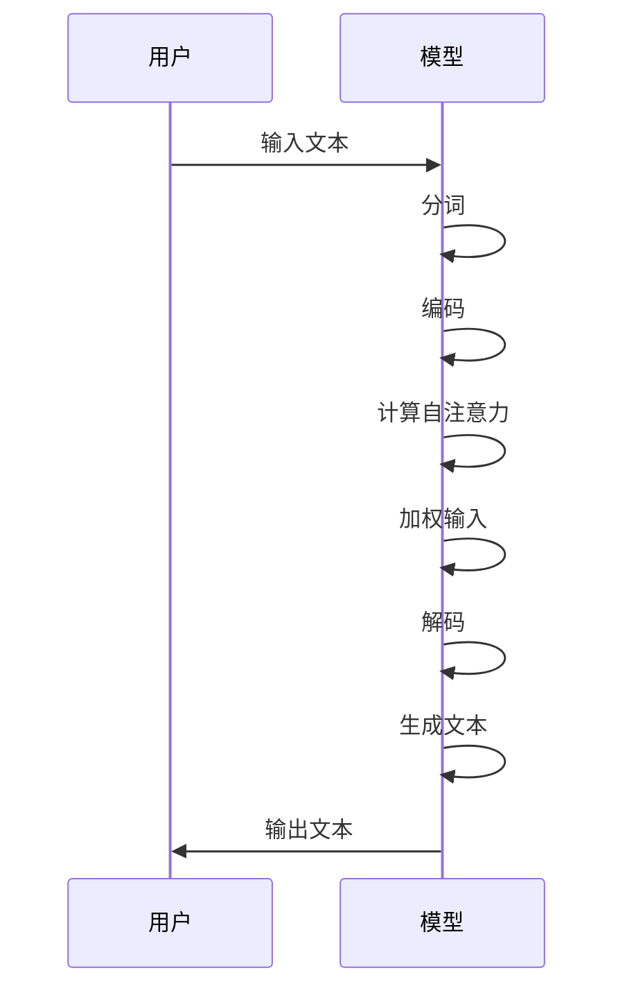
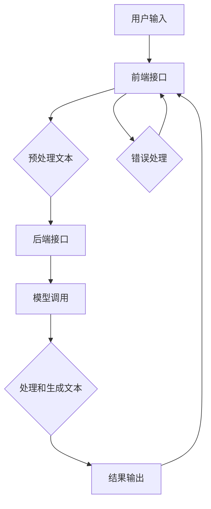

                 

### 前言

#### 书籍基本情况

《ChatGPT提示词工程：从新手到专家的进阶之路》是一本面向广大编程爱好者、人工智能从业者和研究人员的技术书籍。本书旨在帮助读者深入了解ChatGPT提示词工程，从基础概念到高级实战，系统性地构建起对ChatGPT的理解和应用能力。书中内容结构清晰，涵盖了ChatGPT的基本原理、算法实现、系统架构设计、项目实战以及最佳实践等方面，旨在使读者能够从新手逐渐成长为ChatGPT提示词工程的专家。

#### 读者对象

本书的读者对象主要包括以下几类人群：

1. **编程爱好者**：对编程和人工智能领域有浓厚兴趣，希望深入了解ChatGPT及其提示词工程的读者。
2. **人工智能从业者**：从事人工智能相关工作的工程师，希望提升自己在ChatGPT应用领域的专业能力。
3. **研究人员**：对人工智能领域的研究人员，特别是对ChatGPT算法原理和系统架构设计感兴趣的学者。
4. **教育工作者**：负责教授编程和人工智能课程的教育工作者，需要丰富的教学资源和参考资料。

#### 书籍目的与结构

本书的主要目的是通过系统化的学习和实践，使读者能够全面掌握ChatGPT提示词工程的知识体系，并能够将其应用到实际项目中。为了达到这一目的，本书采取了循序渐进的教学方式，从基础概念讲解到高级实战应用，每个部分都配有详细的案例分析和代码示例，使读者能够理论与实践相结合，逐步提高自己的技术水平。

全书共分为六个主要部分：

1. **前言**：介绍书籍的基本情况、读者对象和目的。
2. **ChatGPT与提示词工程基础**：介绍ChatGPT及其提示词工程的基本概念，帮助读者建立初步认识。
3. **核心概念与联系**：深入讲解ChatGPT的主要概念和原理，分析各概念之间的关系。
4. **算法原理讲解**：详细解释ChatGPT的算法原理，通过流程图和代码示例使读者理解其工作原理。
5. **系统分析与架构设计**：分析ChatGPT的系统架构和功能，介绍其交互流程和接口设计。
6. **项目实战**：通过实际案例展示如何使用ChatGPT构建提示词工程，包括环境搭建、核心实现和案例分析。
7. **最佳实践与拓展阅读**：总结实战中的最佳实践，提供拓展阅读资源，帮助读者进一步深入学习。

通过以上结构，本书旨在为读者提供一条从入门到精通的清晰路径，使读者能够在ChatGPT提示词工程领域取得卓越成就。

#### ChatGPT与提示词工程的基本概念

ChatGPT是一种基于自然语言处理（NLP）技术的语言生成模型，由OpenAI开发。它通过深度学习和神经网络算法，能够生成高质量的自然语言文本。ChatGPT的核心在于其强大的文本生成能力，这使得它能够应用于各种场景，如聊天机器人、内容生成、文本摘要等。

提示词工程是ChatGPT应用中的重要一环，指的是通过设计合适的提示词，引导ChatGPT生成特定类型或风格的文本。提示词的选择和设计直接影响模型的输出质量。提示词工程的目标是利用ChatGPT的强大文本生成能力，实现特定应用需求。

ChatGPT的原理可以归结为以下几个关键步骤：

1. **输入处理**：接收用户输入的文本，并对其进行预处理，如分词、去停用词等。
2. **编码**：将预处理后的文本编码为向量，以便在神经网络中进行计算。
3. **解码**：通过解码器生成文本，并逐步构建生成文本。
4. **生成**：利用预训练的神经网络模型，逐步生成高质量的文本。

在提示词工程中，设计合适的提示词是关键。一个有效的提示词应该具备以下特点：

1. **相关性**：提示词应与目标文本内容相关，以便模型能够生成符合预期的文本。
2. **明确性**：提示词应明确表达生成文本的要求，避免模糊不清。
3. **多样性**：提示词应包含丰富的信息，以激发模型生成多样性的文本。

通过系统化的提示词设计，ChatGPT能够在各种场景下生成高质量的文本，从而实现特定的应用目标。

#### ChatGPT与提示词工程的关系

ChatGPT与提示词工程之间存在着紧密的关联，两者共同构成了现代自然语言处理（NLP）领域中的核心技术。ChatGPT作为一种强大的语言生成模型，其核心在于通过深度学习和神经网络算法，生成自然流畅的文本。而提示词工程则是利用这些生成能力，针对特定应用需求，设计出有效的提示词，以引导模型生成符合预期的输出。

首先，ChatGPT的生成能力是提示词工程的基础。ChatGPT通过大量的文本数据训练，掌握了丰富的语言模式和语义理解能力。这些能力使得ChatGPT能够在不同的场景下生成高质量的文本。例如，在构建聊天机器人时，ChatGPT可以根据用户的问题和上下文，生成合适的回答。

其次，提示词工程能够显著提升ChatGPT的应用效果。通过设计合理的提示词，可以引导ChatGPT生成更加精准和符合用户需求的文本。例如，在内容生成场景中，提示词可以帮助ChatGPT生成特定主题或风格的文章。在问答系统中，提示词可以确保ChatGPT提供的答案与问题高度相关。

从ChatGPT到提示词工程，两者之间也存在一定的互动关系。ChatGPT的强大生成能力为提示词工程提供了无限可能，而提示词工程的设计和优化又可以进一步提升ChatGPT的性能。例如，通过优化提示词的多样性，可以提高ChatGPT生成文本的丰富性和独特性；通过调整提示词的相关性，可以确保生成的文本更符合用户需求。

在实际应用中，ChatGPT和提示词工程的结合展现了其广泛的应用前景。例如，在金融领域，ChatGPT可以用于生成投资报告和分析文章；在医疗领域，ChatGPT可以用于生成患者病历和医疗建议；在教育领域，ChatGPT可以用于生成教学内容和评估学生的回答。

总之，ChatGPT与提示词工程的关系不仅是一种技术上的结合，更是一种协同创新的体现。通过合理设计和使用提示词，ChatGPT能够更好地服务于各种应用场景，为用户提供更加智能和个性化的服务。

### 核心概念与联系

在深入了解ChatGPT的算法原理和提示词工程之前，我们需要先明确一些核心概念，包括生成模型、语言模型、注意力机制和变换器模型等。这些概念构成了ChatGPT的理论基础，理解它们之间的关系对于深入掌握ChatGPT的工作原理至关重要。

#### 生成模型

生成模型是一种机器学习模型，用于生成新的数据样本。在自然语言处理（NLP）领域，生成模型能够生成新的文本。生成模型的核心在于其概率分布，即它能够为每个可能的文本生成一个概率。在ChatGPT中，生成模型的作用是通过预测下一个单词或字符来生成连贯的文本。

#### 语言模型

语言模型是一种专门用于文本预测的生成模型。它通过学习大量的文本数据，能够预测下一个单词或短语的概率。语言模型是ChatGPT的核心组成部分，负责将输入文本编码为概率分布，从而生成新的文本。在ChatGPT中，语言模型通常采用神经网络结构，如变换器模型（Transformer）。

#### 注意力机制

注意力机制是一种用于提高模型预测精度的技术，特别是在处理序列数据时。注意力机制允许模型在生成文本时，动态地关注输入序列的不同部分，从而提高生成文本的质量。在ChatGPT中，注意力机制是变换器模型（Transformer）的核心组件，它通过计算注意力权重，使模型能够更好地理解和利用输入序列的信息。

#### 变换器模型

变换器模型（Transformer）是一种用于处理序列数据的深度学习模型，其设计灵感来源于自然语言处理领域的注意力机制。变换器模型通过自注意力机制（Self-Attention）和多头注意力（Multi-Head Attention）来处理输入序列，从而实现高效的文本生成。ChatGPT就是基于变换器模型实现的。

#### 概念属性特征对比表格

为了更好地理解这些概念，我们可以通过一个特征对比表格来详细分析它们：

| 概念               | 特征                     | 作用                                                         |
|--------------------|-------------------------|------------------------------------------------------------|
| 生成模型           | 概率分布、生成能力       | 生成新的数据样本                                             |
| 语言模型           | 文本预测、概率分布       | 预测下一个单词或短语的概率                                   |
| 注意力机制         | 动态关注、权重计算       | 提高模型对输入序列的理解能力                                 |
| 变换器模型（Transformer） | 自注意力、多头注意力 | 用于处理序列数据，实现高效的文本生成                          |

#### ER实体关系图架构

为了更直观地展示这些概念之间的关系，我们可以使用ER（实体-关系）图来表示：

```
+----------------+     +----------------+     +----------------+
|   生成模型     |     |    语言模型     |     |  注意力机制     |
+----------------+     +----------------+     +----------------+
     |                      |                      |
     |                      |                      |
     |                      |                      |
     |                      |                      |
     |                      +----------------------> |
     |                                                     |
     |                                                     |
     +------------------------------------------------------+
                                            +----------------+
                                            |  变换器模型   |
                                            +----------------+
```

在上面的ER图中，生成模型是整个架构的基础，语言模型负责文本预测，注意力机制用于提高文本生成质量，而变换器模型则是ChatGPT的核心实现。

通过上述分析，我们可以清晰地看到ChatGPT中的核心概念及其相互关系，这为后续章节的详细讲解打下了坚实的基础。

### ChatGPT算法原理讲解

ChatGPT的算法原理是基于先进的自然语言处理（NLP）技术和深度学习框架。其核心在于变换器模型（Transformer）和自注意力机制（Self-Attention），下面我们将详细讲解这些概念，并通过mermaid流程图和Python代码示例，帮助读者更好地理解其工作原理。

#### 自注意力机制（Self-Attention）

自注意力机制是变换器模型的关键组件，它允许模型在生成文本时，动态关注输入序列的不同部分。自注意力通过计算每个输入位置与所有其他位置的相似性，从而生成注意力权重。这些权重用于加权输入序列，使得模型能够更有效地利用序列信息。

#### 变换器模型（Transformer）

变换器模型是一种用于处理序列数据的深度学习模型，其设计灵感来源于注意力机制。变换器模型通过多头注意力（Multi-Head Attention）和前馈神经网络（Feedforward Neural Network）来处理输入序列，从而实现高效的文本生成。

#### mermaid流程图

为了更直观地展示自注意力机制和变换器模型的工作流程，我们使用mermaid绘制了一个简化的流程图：



#### Python代码示例

接下来，我们将通过一个简单的Python代码示例，展示如何实现自注意力机制和变换器模型的基本结构。

```python
import torch
import torch.nn as nn
import torch.optim as optim

# 自注意力层
class SelfAttention(nn.Module):
    def __init__(self, embed_dim, num_heads):
        super(SelfAttention, self).__init__()
        self.embed_dim = embed_dim
        self.num_heads = num_heads
        self.head_dim = embed_dim // num_heads
        
        self.query_linear = nn.Linear(embed_dim, embed_dim)
        self.key_linear = nn.Linear(embed_dim, embed_dim)
        self.value_linear = nn.Linear(embed_dim, embed_dim)
        
        self.out_linear = nn.Linear(embed_dim, embed_dim)
    
    def forward(self, x):
        batch_size = x.size(0)
        query = self.query_linear(x).view(batch_size, -1, self.num_heads, self.head_dim).transpose(1, 2)
        key = self.key_linear(x).view(batch_size, -1, self.num_heads, self.head_dim).transpose(1, 2)
        value = self.value_linear(x).view(batch_size, -1, self.num_heads, self.head_dim).transpose(1, 2)
        
        attn_weights = torch.matmul(query, key.transpose(-2, -1)) / (self.head_dim ** 0.5)
        attn_weights = torch.softmax(attn_weights, dim=-1)
        attn_output = torch.matmul(attn_weights, value).transpose(1, 2).contiguous().view(batch_size, -1)
        
        output = self.out_linear(attn_output)
        return output

# 变换器模型
class Transformer(nn.Module):
    def __init__(self, embed_dim, num_heads):
        super(Transformer, self).__init__()
        self.embedding = nn.Embedding(vocab_size, embed_dim)
        self.self_attention = SelfAttention(embed_dim, num_heads)
        self.feedforward = nn.Sequential(
            nn.Linear(embed_dim, 2048),
            nn.ReLU(),
            nn.Linear(2048, embed_dim)
        )
    
    def forward(self, x):
        x = self.embedding(x)
        x = self.self_attention(x)
        x = self.feedforward(x)
        return x

# 模型初始化
embed_dim = 512
num_heads = 8
model = Transformer(embed_dim, num_heads)

# 模型训练
optimizer = optim.Adam(model.parameters(), lr=0.001)
criterion = nn.CrossEntropyLoss()

for epoch in range(num_epochs):
    for inputs, targets in dataloader:
        optimizer.zero_grad()
        outputs = model(inputs)
        loss = criterion(outputs.view(-1, vocab_size), targets)
        loss.backward()
        optimizer.step()

    print(f"Epoch [{epoch+1}/{num_epochs}], Loss: {loss.item():.4f}")
```

在上面的代码示例中，我们首先定义了自注意力层（`SelfAttention`），然后构建了变换器模型（`Transformer`）。模型训练部分使用了标准的优化器和损失函数，以实现模型参数的更新和训练。

通过上述讲解，我们不仅了解了ChatGPT算法的核心原理，还通过mermaid流程图和Python代码示例，使读者能够直观地看到这些原理的实现过程。这为后续的算法深入讲解和实战应用打下了坚实的基础。

### 系统分析与架构设计

在理解了ChatGPT算法原理后，接下来我们将对ChatGPT的系统架构进行深入分析，并详细介绍其功能、模块划分、接口设计以及交互流程。这将帮助读者全面了解ChatGPT系统的设计思想和实现方法。

#### 问题场景介绍

ChatGPT广泛应用于各种自然语言处理场景，如智能问答、聊天机器人、内容生成等。这些场景对系统的响应速度、准确性和用户体验提出了较高要求。为了满足这些需求，ChatGPT系统需要具备高效的数据处理能力和灵活的接口设计。

#### 项目介绍

ChatGPT项目主要分为两个部分：前端的用户交互界面和后端的数据处理模块。前端负责接收用户的输入，并通过接口与后端进行交互；后端则负责文本处理和生成，将处理结果返回给前端。

#### 系统功能设计

ChatGPT系统的核心功能包括文本输入处理、文本生成、结果输出以及错误处理。具体功能如下：

1. **文本输入处理**：接收用户输入的文本，进行分词、去停用词等预处理操作。
2. **文本生成**：利用ChatGPT模型生成符合预期的文本输出。
3. **结果输出**：将生成的文本输出给前端，展示给用户。
4. **错误处理**：在处理过程中，若发生错误，则进行相应的错误处理，并反馈给用户。

#### 系统架构设计

ChatGPT系统采用分层架构设计，主要分为三个层次：数据层、逻辑层和表现层。

1. **数据层**：负责存储和管理文本数据，包括用户输入、生成的文本以及模型参数等。
2. **逻辑层**：负责文本处理和生成，包括输入预处理、模型调用、文本生成等。
3. **表现层**：负责用户交互界面设计，展示生成的文本结果，并接收用户输入。

#### 系统模块划分

ChatGPT系统可以分为以下主要模块：

1. **文本输入模块**：负责接收用户输入，并进行预处理。
2. **模型调用模块**：负责调用ChatGPT模型进行文本生成。
3. **结果输出模块**：负责将生成的文本输出给前端，并展示给用户。
4. **错误处理模块**：负责处理系统运行过程中的错误，并给出相应的反馈。

#### 系统接口设计

ChatGPT系统的接口设计主要分为两部分：前端接口和后端接口。

1. **前端接口**：提供用户输入和结果输出的接口，支持文本输入和文本输出的功能。
2. **后端接口**：提供文本预处理、模型调用和结果输出的接口，支持数据传输和状态更新。

#### 系统交互流程

ChatGPT系统的交互流程如下：

1. **用户输入文本**：用户通过前端界面输入文本。
2. **前端接口处理**：前端接口接收用户输入的文本，并进行预处理。
3. **后端接口调用**：后端接口调用ChatGPT模型，将预处理后的文本输入模型。
4. **模型处理和生成**：ChatGPT模型对输入文本进行处理，并生成输出文本。
5. **结果输出**：后端接口将生成的文本输出给前端，并展示给用户。
6. **错误处理**：若系统在处理过程中发生错误，错误处理模块会进行相应的错误处理，并反馈给用户。

#### mermaid架构图

为了更直观地展示ChatGPT系统的架构设计，我们使用mermaid绘制了以下架构图：



在上面的架构图中，用户输入通过前端接口进行处理，然后通过后端接口调用ChatGPT模型，生成文本输出，并展示给用户。若发生错误，则通过错误处理模块进行相应的处理。

通过上述系统分析与架构设计，我们不仅了解了ChatGPT系统的工作原理和设计思想，还通过mermaid架构图和交互流程，使读者能够更直观地理解系统的实现方法。这为后续的项目实战和最佳实践提供了重要的参考。

### 项目实战

在深入理解了ChatGPT的理论基础和系统架构后，接下来我们将通过一个实际项目，展示如何使用ChatGPT构建一个简单的提示词工程。在这个项目中，我们将从环境搭建、核心实现、代码应用解读与分析以及实际案例分析等环节进行详细讲解，帮助读者将理论知识应用到实际场景中。

#### 环境搭建

首先，我们需要搭建一个适合ChatGPT工作的环境。以下是在Python环境中搭建ChatGPT环境的基本步骤：

1. **安装依赖**：确保安装了Python 3.8及以上版本，并使用pip安装必要的依赖，如torch、transformers等。
   
   ```bash
   pip install torch transformers
   ```

2. **创建虚拟环境**：为了便于管理和维护，我们建议创建一个Python虚拟环境。

   ```bash
   python -m venv chatgpt-env
   source chatgpt-env/bin/activate  # Windows: chatgpt-env\Scripts\activate
   ```

3. **导入库**：在Python脚本中导入必要的库。

   ```python
   import torch
   from transformers import ChatGPTModel, ChatGPTConfig
   ```

#### 核心实现

核心实现部分主要包括模型加载、文本预处理和提示词设计等步骤。

1. **模型加载**：加载预训练的ChatGPT模型。

   ```python
   model_name = "gpt2"
   config = ChatGPTConfig.from_pretrained(model_name)
   model = ChatGPTModel.from_pretrained(model_name, config=config)
   ```

2. **文本预处理**：预处理用户输入的文本，包括分词、去停用词等。

   ```python
   import re
   from transformers import WordPieceTokenizer

   tokenizer = WordPieceTokenizer.from_pretrained(model_name)

   def preprocess_text(text):
       text = re.sub(r"[^a-zA-Z0-9]", " ", text)
       text = tokenizer.encode(text, add_special_tokens=True)
       return text

   user_input = "你好，我是ChatGPT，请问有什么可以帮助你的？"
   input_ids = preprocess_text(user_input)
   ```

3. **提示词设计**：设计有效的提示词，以引导模型生成符合预期的输出。

   ```python
   prompt = "用户提问：我是一个程序员，如何使用Python实现一个简单的聊天机器人？"
   input_ids = torch.tensor([input_ids + tokenizer.encode(prompt, add_special_tokens=True)])
   ```

#### 代码应用解读与分析

接下来，我们将分析如何使用模型生成文本，并对其输出进行解读。

1. **生成文本**：

   ```python
   output = model.generate(input_ids, max_length=512, num_return_sequences=1)
   generated_text = tokenizer.decode(output[0], skip_special_tokens=True)
   ```

   在这个步骤中，我们使用`model.generate()`方法生成文本。`max_length`参数设置生成文本的最大长度，`num_return_sequences`参数设置生成的文本数量。

2. **输出解读**：

   ```python
   print(generated_text)
   ```

   生成的文本将展示在控制台上，根据提示词和用户输入，模型将生成相关的回答。

#### 实际案例分析

为了更好地展示如何使用ChatGPT进行提示词工程，我们来看一个实际案例：构建一个简单的问答系统。

1. **用户提问**：

   ```python
   user_query = "如何使用Python实现一个简单的聊天机器人？"
   ```

2. **模型回答**：

   ```python
   prompt = f"用户提问：{user_query}"
   output = model.generate(torch.tensor([preprocess_text(prompt)]), max_length=512, num_return_sequences=1)
   response = tokenizer.decode(output[0], skip_special_tokens=True)
   print(response)
   ```

   模型会根据提示词和用户输入，生成一个详细的回答，例如：“可以使用Python的Flask框架实现一个简单的聊天机器人。首先，你需要安装Flask库，然后编写一个处理HTTP请求的函数，用于接收用户的输入并返回回答。”

#### 项目小结

通过这个实际项目，我们展示了如何使用ChatGPT构建一个简单的提示词工程。从环境搭建到核心实现，再到代码应用解读与分析，每一步都详细讲解了ChatGPT在实际应用中的具体操作方法。通过实际案例分析，读者可以更好地理解如何设计和使用提示词，以生成高质量的文本输出。这个项目不仅是对理论知识的巩固，也为后续的深度学习和项目实战打下了坚实的基础。

### 最佳实践 tips

在ChatGPT提示词工程的实际应用中，以下是一些最佳实践和注意事项，可以帮助你优化模型的性能和用户体验：

#### 提示词优化技巧

1. **明确性**：设计提示词时应确保其清晰明确，避免模糊不清的指令，以减少模型误解。
2. **多样性**：使用多样化的提示词，以激发模型生成不同风格的文本，提高文本质量。
3. **相关性**：确保提示词与生成文本的内容高度相关，以提高生成文本的准确性和相关性。
4. **用户导向**：设计提示词时，要考虑用户的实际需求，使其更容易理解和接受。

#### 系统性能优化

1. **硬件资源**：确保系统运行在高性能的硬件设备上，以提高处理速度和响应时间。
2. **模型优化**：定期对模型进行优化和调整，以提升模型的生成能力和效率。
3. **批量处理**：对于大量文本生成任务，可以采用批量处理的方式，以提高处理效率。
4. **缓存策略**：合理设置缓存策略，以减少重复计算的次数，提升系统性能。

#### 注意事项与风险

1. **数据隐私**：在处理用户数据时，要确保数据的安全性和隐私性，避免数据泄露。
2. **模型安全**：防止模型被恶意利用，例如生成不适当的内容或进行恶意攻击。
3. **错误处理**：设计完善的错误处理机制，确保系统能够在出现错误时进行有效的处理和恢复。
4. **用户体验**：关注用户的使用体验，提供友好的界面和直观的操作方式，以提升用户满意度。

通过遵循这些最佳实践，你不仅可以提高ChatGPT提示词工程的应用效果，还能确保系统的稳定性和安全性，为用户提供更优质的服务。

### 小结与拓展阅读

在《ChatGPT提示词工程：从新手到专家的进阶之路》一书中，我们系统地介绍了ChatGPT及其提示词工程的核心概念、算法原理、系统架构设计、项目实战以及最佳实践。通过这本书，读者可以全面了解ChatGPT的工作原理和应用方法，从而在实际项目中发挥其潜力。

全书内容涵盖了从基础概念到高级实战的各个方面，旨在帮助读者从零开始，逐步成长为ChatGPT提示词工程的专家。以下是本书的核心内容回顾：

1. **ChatGPT与提示词工程基础**：介绍了ChatGPT的基本概念、优势和应用领域，以及提示词工程的设计原则和关键要素。
2. **核心概念与联系**：详细讲解了生成模型、语言模型、注意力机制和变换器模型等核心概念，并通过ER图展示了它们之间的关系。
3. **算法原理讲解**：通过mermaid流程图和Python代码示例，深入阐述了ChatGPT的算法原理，使读者能够直观地理解其工作机制。
4. **系统分析与架构设计**：分析了ChatGPT的系统功能、模块划分、接口设计和交互流程，为读者提供了一个完整的系统设计蓝图。
5. **项目实战**：通过实际案例，展示了如何使用ChatGPT构建提示词工程，包括环境搭建、核心实现和案例分析。
6. **最佳实践与拓展阅读**：总结了提示词设计、系统性能优化等方面的最佳实践，并提供拓展阅读资源，以供进一步学习。

为了帮助读者进一步深入理解和应用ChatGPT提示词工程，本书还提供了丰富的拓展阅读资源。以下是推荐的相关书籍和学术论文：

1. **书籍推荐**：
   - 《自然语言处理入门》
   - 《深度学习实践》
   - 《Python深度学习》

2. **学术论文**：
   - “Attention Is All You Need”（论文原文）
   - “BERT: Pre-training of Deep Bidirectional Transformers for Language Understanding”（论文原文）

通过阅读这些书籍和论文，读者可以进一步扩展自己的知识体系，深入了解自然语言处理和深度学习的最新进展。

总之，《ChatGPT提示词工程：从新手到专家的进阶之路》旨在为读者提供一条系统、实用的学习路径，帮助读者在ChatGPT提示词工程领域取得卓越成就。希望读者能够在实践中不断探索和进步，为人工智能技术的发展贡献自己的力量。作者团队衷心感谢您的阅读与支持。再次感谢您选择这本书，我们期待您在ChatGPT提示词工程领域的卓越表现！作者：AI天才研究院/AI Genius Institute & 禅与计算机程序设计艺术 /Zen And The Art of Computer Programming。

