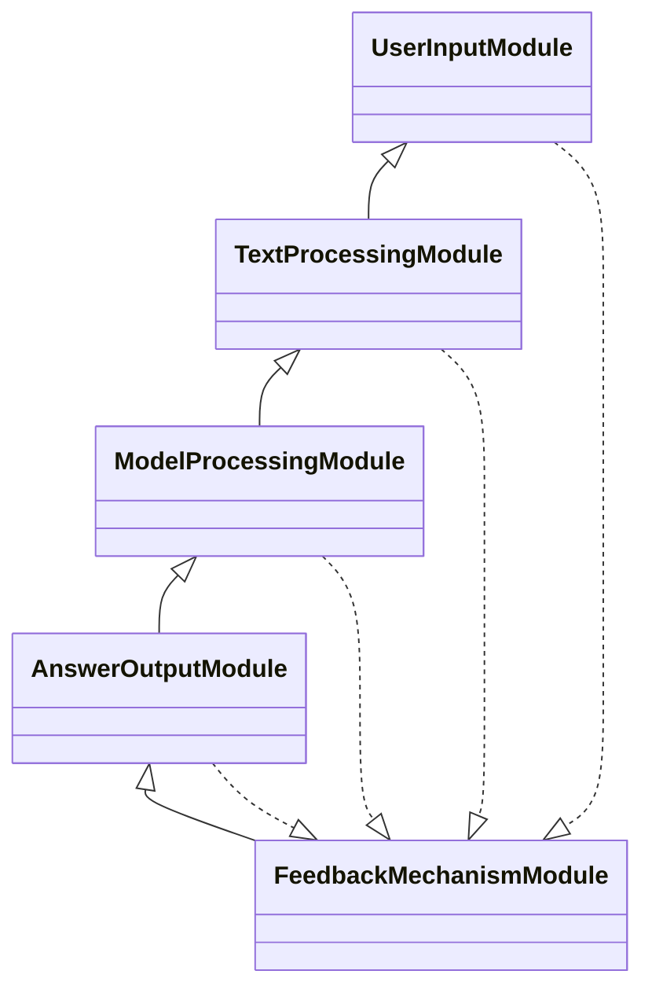
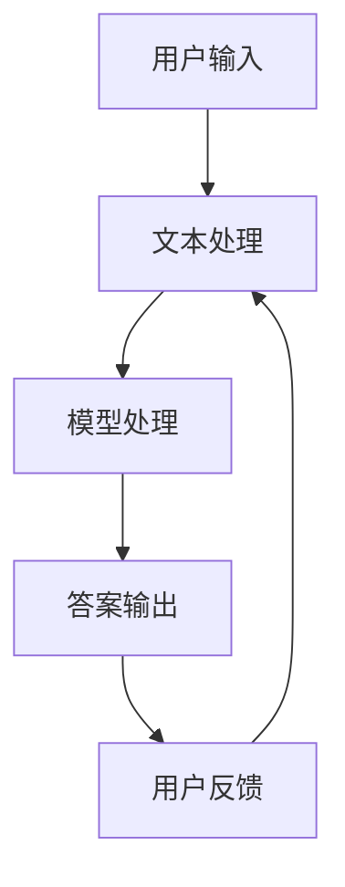
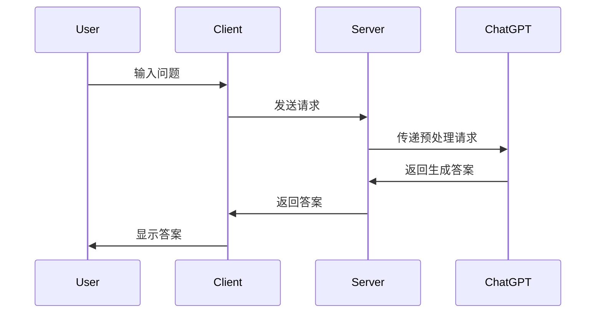

                 

## 1.1 问题的背景与重要性

### 1.1.1 人工智能与伦理问题的关系

人工智能（Artificial Intelligence, AI）的迅猛发展已经深刻改变了我们的生活方式和社会结构。从智能家居到自动驾驶，从医疗诊断到金融服务，AI技术的应用无处不在。然而，随着AI技术的不断进步，一系列伦理问题也随之而来。这些伦理问题不仅涉及AI技术的使用，更关系到社会的道德准则和法律法规。

首先，人工智能的伦理问题涉及隐私保护。AI系统通常需要收集和分析大量的个人数据，这可能导致个人隐私泄露的风险。例如，人脸识别技术虽然在安全监控和身份验证方面有重要作用，但也引发了关于个人隐私权利的争议。

其次，算法偏见是一个重要的伦理问题。如果AI系统在其决策过程中存在偏见，可能会加剧社会不平等。例如，在招聘或贷款审批等场景中，AI系统可能会因为数据集中的偏见而导致某些群体受到不公平待遇。

再者，人工智能责任分配也是一个复杂的问题。当AI系统发生错误或造成损害时，应该由谁承担责任？这不仅是法律问题，也是伦理问题。例如，如果自动驾驶汽车发生交通事故，责任应由谁承担？

### 1.1.2 ChatGPT提示词伦理设计的挑战

ChatGPT是一种基于大型语言模型的AI系统，它通过处理和生成文本来提供各种服务。然而，ChatGPT的提示词设计直接影响了其生成的内容，进而可能导致伦理问题。以下是ChatGPT提示词伦理设计的几个主要挑战：

1. **内容生成的不确定性**：ChatGPT的生成内容可能包含不准确、不恰当甚至有害的信息。例如，如果提示词设计不当，ChatGPT可能会生成歧视性、仇恨性或暴力性的言论。

2. **社会责任**：作为一个AI系统，ChatGPT的设计者和运营者需要对其生成内容承担社会责任。他们需要确保ChatGPT提供的信息和生成的文本符合伦理标准和法律法规。

3. **透明性和解释性**：用户需要知道ChatGPT是如何处理输入并生成输出。透明性和解释性对于建立用户信任和监督AI系统至关重要。

4. **算法偏见**：如果ChatGPT的提示词设计不当，可能会导致生成内容存在偏见。这种偏见可能会加剧社会不平等，甚至对某些群体造成伤害。

### 1.1.3 本书的结构内容与目标

本书旨在为ChatGPT提示词的伦理设计提供全面的指导和策略。全书分为以下几个部分：

1. **引言**：介绍人工智能与伦理问题的关系，以及ChatGPT提示词伦理设计的挑战。

2. **核心概念与联系**：详细阐述与伦理设计相关的关键概念，如伦理学、隐私保护、算法公正性等，并通过对比表格和实体关系图帮助读者理解这些概念之间的关系。

3. **算法原理讲解**：使用流程图和源代码详细讲解ChatGPT提示词的设计原理，并提供数学模型和公式。

4. **系统分析与架构设计方案**：介绍ChatGPT提示词设计的应用场景，详细设计系统功能、架构和接口。

5. **项目实战**：通过实际案例展示算法在应用中的效果，并提供环境搭建和系统实现的详细指导。

6. **最佳实践 tips、小结、注意事项、拓展阅读等内容**：总结全书的主要内容和关键点，并提供一些实际操作中的最佳实践和建议。

本书的目标是帮助读者深入理解ChatGPT提示词的伦理设计，提供具体的策略和工具，以确保AI技术的应用不仅技术先进，而且符合伦理和社会道德标准。

## 1.2 核心概念与联系

### 1.2.1 伦理学的定义与基本原则

伦理学是研究道德原则、道德判断和道德行为的学科。伦理学的核心问题是“我们应该如何行动？”和“什么是对与错的？”伦理学的基本原则包括：

1. **公正性**：公正性强调在分配资源和做出决策时，应平等对待所有人，不偏袒任何一方。

2. **尊重个人权利**：个人权利是伦理学的重要基础，包括隐私权、言论自由权、受教育权等。

3. **责任**：责任是指个体或组织因自己的行为而产生的义务和后果。

4. **善良**：善良是指行为者应尽力做出善行，减少伤害。

### 1.2.2 人工智能伦理的重要原则

人工智能伦理的重要原则包括：

1. **透明性**：透明性要求AI系统的决策过程和结果对用户是可见和可解释的。

2. **公正性**：AI系统不应歧视或偏见任何特定群体，应公平对待所有人。

3. **隐私保护**：AI系统应保护用户的隐私，避免数据滥用。

4. **安全性**：AI系统应设计得足够安全，以防止恶意攻击和数据泄露。

5. **责任分配**：当AI系统发生错误或造成损害时，应明确责任分配，确保受害者得到合理的赔偿。

### 1.2.3 伦理设计与技术发展的互动

伦理设计与技术发展之间的互动是一个复杂的过程。一方面，技术发展不断推动伦理问题的出现和演变。例如，随着AI技术的进步，隐私保护和责任分配问题变得更加复杂和迫切。另一方面，伦理设计可以为技术的发展提供指导，确保技术符合社会道德和法律法规。

### 1.2.4 核心概念原理

为了更好地理解伦理设计，我们需要深入探讨以下几个核心概念原理：

1. **伦理学**：伦理学是研究道德原则和道德行为的学科，它为伦理设计提供了理论依据。

2. **隐私保护**：隐私保护是确保个人数据不被未经授权的第三方访问和使用。

3. **算法公正性**：算法公正性是指AI系统在处理数据和应用算法时，不应产生歧视或偏见。

4. **透明性**：透明性是指AI系统的决策过程和结果对用户和监管机构是可见和可解释的。

5. **社会责任**：社会责任是指AI系统的设计者和运营者应承担的社会责任，包括对用户隐私、数据安全和公共利益的责任。

### 1.2.5 概念属性特征对比表格

为了帮助读者更好地理解上述核心概念，我们可以通过对比表格来展示它们的属性特征：

| 概念 | 属性特征 |
| --- | --- |
| 伦理学 | 研究道德原则和道德行为，为伦理设计提供理论依据 |
| 隐私保护 | 确保个人数据不被未经授权的第三方访问和使用 |
| 算法公正性 | 避免AI系统在处理数据和应用算法时产生歧视或偏见 |
| 透明性 | 确保AI系统的决策过程和结果对用户和监管机构是可见和可解释的 |
| 社会责任 | 设计者和运营者对用户隐私、数据安全和公共利益的职责 |

### 1.2.6 ER实体关系图架构

为了更直观地展示上述概念之间的关系，我们可以使用Mermaid绘制ER实体关系图：

```mermaid
erDiagram
  Person ||--|{ AI_System : isDesignedBy }  
  AI_System ||--|{ Data : processes }  
  Data ||--|{ Privacy : protects }  
  Data ||--|{ Bias : avoids }  
  AI_System ||--|{ Transparency : provides }
```

在这个ER图中，`Person`是设计AI系统的主体，`AI_System`是处理`Data`的实体，`Data`包括`Privacy`和`Bias`两个属性，而`AI_System`还需要提供`Transparency`。

通过上述核心概念的阐述和对比表格，以及ER实体关系图的展示，我们可以更深入地理解伦理设计的基本原则和关键要素。这些概念不仅为ChatGPT提示词的伦理设计提供了理论基础，也为实际应用中的伦理决策提供了指导。

### 1.3 ChatGPT提示词设计的伦理挑战

在探讨ChatGPT提示词设计的伦理挑战之前，我们需要首先了解ChatGPT的生成机制和提示词在其中的作用。ChatGPT是一种基于大规模语言模型的人工智能系统，它通过处理和生成文本来模拟人类对话。提示词（Prompt）是用户输入的文本，它引导ChatGPT生成相应的回复。提示词的设计直接影响了ChatGPT生成内容的质量和方向，因此，如何设计符合伦理标准的提示词成为了一个重要的课题。

#### 1.3.1 内容生成的不确定性

ChatGPT的内容生成具有很高的不确定性，这主要体现在以下几个方面：

1. **生成内容的准确性**：由于ChatGPT是基于统计模型生成的，其生成的内容可能包含错误或不准确的信息。例如，当用户询问一个复杂问题时，ChatGPT可能无法提供完全准确的答案。

2. **生成内容的道德性**：ChatGPT生成的文本可能会包含歧视性、仇恨性或暴力性的内容。这主要是由于训练数据中可能存在的偏见和不当言论。

3. **生成内容的风险性**：某些情况下，ChatGPT生成的文本可能具有潜在的风险，例如，提供不恰当的建议或指导，可能导致用户采取错误的行动。

为了应对这些挑战，设计者需要确保ChatGPT的提示词能够引导系统生成准确、道德和安全的文本。

#### 1.3.2 社会责任

作为一个AI系统，ChatGPT的设计者和运营者对其生成内容承担着社会责任。这种社会责任体现在以下几个方面：

1. **用户隐私保护**：ChatGPT需要处理大量的用户输入和输出数据，这可能导致用户隐私泄露。因此，设计者需要采取严格的隐私保护措施，确保用户数据的安全。

2. **算法公正性**：ChatGPT的提示词设计应避免算法偏见，确保系统对所有人都是公平和公正的。这需要设计者在数据集的选择和预处理过程中注意数据的多样性和代表性。

3. **透明性和解释性**：用户需要了解ChatGPT是如何处理输入并生成输出的，这要求设计者提供透明和解释性的系统设计。例如，通过提供明确的操作指南和使用说明，帮助用户理解系统的功能和限制。

4. **责任归属**：当ChatGPT生成的文本导致不良后果时，需要明确责任归属。这不仅是法律问题，也是伦理问题。设计者和运营者需要建立明确的责任机制，确保在发生问题时，责任可以合理分配。

#### 1.3.3 透明性和解释性

透明性和解释性是ChatGPT提示词伦理设计的重要方面。透明性要求ChatGPT的生成过程和结果对用户是可见和可解释的。这有助于建立用户对AI系统的信任，并使监管机构能够对系统进行有效的监督。

1. **生成过程的透明性**：设计者需要确保ChatGPT的生成过程是透明的。这可以通过提供详细的操作指南和使用说明来实现。例如，解释系统如何处理输入文本、如何选择和调整模型参数等。

2. **生成结果的解释性**：ChatGPT生成的文本应具有解释性，用户可以理解其含义和来源。为了实现这一点，设计者可以在输出中添加相关的上下文信息和参考数据。

3. **用户反馈机制**：设计者应提供用户反馈机制，允许用户对生成的文本进行评价和反馈。这有助于识别和纠正系统中的错误和不当内容。

#### 1.3.4 算法偏见

算法偏见是AI系统中普遍存在的一个问题，ChatGPT也不例外。算法偏见可能导致系统生成歧视性或偏见性的文本，这会对特定群体造成伤害。为了减少算法偏见，设计者需要采取以下措施：

1. **数据集的多样性和代表性**：选择多样化的数据集进行训练，确保数据集中包含不同种族、性别、文化背景和观点的信息。

2. **算法模型的评估**：在训练和部署算法模型时，进行全面的评估，检测和纠正潜在的偏见。

3. **持续监测和更新**：定期对系统进行监测和更新，以识别和纠正新的偏见。

#### 1.3.5 隐私保护和数据安全

隐私保护和数据安全是AI系统设计中的关键问题。ChatGPT需要处理大量的用户数据，包括输入文本、生成文本和模型参数等。为了确保用户数据的安全和隐私，设计者需要采取以下措施：

1. **数据加密**：对用户数据进行加密处理，确保数据在传输和存储过程中的安全。

2. **访问控制**：建立严格的访问控制机制，确保只有授权人员可以访问用户数据。

3. **隐私政策**：明确告知用户数据的使用目的、收集方式和保护措施，确保用户知情并同意。

4. **安全审计**：定期进行安全审计，评估系统的安全性和合规性。

通过上述措施，可以确保ChatGPT的提示词设计符合伦理标准，减少潜在的风险和负面影响。这不仅是技术问题，更是社会责任，需要设计者和运营者共同努力，确保AI技术的健康发展。

### 1.4 本书的组织结构

本书旨在为ChatGPT提示词的伦理设计提供全面而深入的指导，分为以下几个部分：

#### 第一部分：引言

本部分将介绍人工智能与伦理问题的关系，以及ChatGPT提示词伦理设计的挑战。通过分析伦理设计与技术发展的互动，帮助读者建立对整个主题的初步理解。

#### 第二部分：核心概念与联系

在本部分，我们将详细阐述与伦理设计相关的核心概念，包括伦理学、隐私保护、算法公正性等。通过对比表格和ER实体关系图，帮助读者深入理解这些概念及其之间的联系。

#### 第三部分：算法原理讲解

这一部分将深入讲解ChatGPT的算法原理，包括其生成机制、提示词设计的关键步骤以及相关的数学模型和公式。通过Python源代码和具体例子，帮助读者理解算法的实际应用。

#### 第四部分：系统分析与架构设计方案

本部分将介绍ChatGPT提示词设计的应用场景，详细设计系统功能、架构和接口。通过领域模型类图、系统架构图和系统交互序列图，展示系统设计的整体框架。

#### 第五部分：项目实战

在这一部分，我们将通过实际案例展示ChatGPT提示词设计的效果，并提供环境搭建、系统实现和代码解读的详细指导。通过实际案例分析和讲解，帮助读者理解算法在实际应用中的表现。

#### 第六部分：最佳实践 tips、小结、注意事项、拓展阅读

最后一部分将总结全书的主要内容和关键点，提供一些实际操作中的最佳实践和建议。同时，将提醒读者在使用过程中需要注意的问题，并推荐一些拓展阅读材料，帮助读者进一步深入探讨。

### 1.5 文章目录与章节目标

为了帮助读者更好地理解本书的结构和内容，下面是详细的目录和各章节的目标：

## 第一部分：引言

- **第1章：问题的背景与重要性**
  - **目标**：介绍人工智能与伦理问题的关系，以及ChatGPT提示词伦理设计的挑战。
  
- **第2章：核心概念与联系**
  - **目标**：详细阐述与伦理设计相关的核心概念，如伦理学、隐私保护、算法公正性等。

## 第二部分：核心概念与联系

- **第3章：算法原理讲解**
  - **目标**：深入讲解ChatGPT的算法原理，包括其生成机制、提示词设计的关键步骤以及相关的数学模型和公式。

- **第4章：系统分析与架构设计方案**
  - **目标**：介绍ChatGPT提示词设计的应用场景，详细设计系统功能、架构和接口。

## 第三部分：算法原理讲解

- **第5章：ChatGPT的基本原理**
  - **目标**：介绍ChatGPT的基本原理，包括其模型结构、训练方法和生成机制。

- **第6章：ChatGPT提示词设计的伦理挑战**
  - **目标**：探讨ChatGPT提示词设计过程中面临的伦理挑战，如内容生成的不确定性、社会责任、透明性和解释性、算法偏见以及隐私保护和数据安全。

## 第四部分：系统分析与架构设计方案

- **第7章：问题场景介绍**
  - **目标**：描述ChatGPT提示词设计在不同应用场景中的场景和需求。

- **第8章：系统功能设计**
  - **目标**：使用领域模型类图详细展示ChatGPT提示词设计的主要功能。

- **第9章：系统架构设计**
  - **目标**：使用系统架构图展示ChatGPT提示词设计的整体架构。

- **第10章：系统接口设计**
  - **目标**：描述系统接口设计和交互机制。

- **第11章：系统交互mermaid序列图**
  - **目标**：使用mermaid序列图展示系统的交互流程。

## 第五部分：项目实战

- **第12章：环境安装**
  - **目标**：指导读者如何搭建ChatGPT提示词设计所需的环境。

- **第13章：系统核心实现源代码**
  - **目标**：提供ChatGPT提示词设计系统核心实现源代码。

- **第14章：代码应用解读与分析**
  - **目标**：解读和分析代码，帮助读者理解系统实现。

- **第15章：实际案例分析和详细讲解剖析**
  - **目标**：通过实际案例分析和讲解，展示算法在实际应用中的效果。

- **第16章：项目小结**
  - **目标**：总结项目成果和经验，为后续工作提供参考。

## 第六部分：最佳实践 tips、小结、注意事项、拓展阅读

- **第17章：最佳实践 tips**
  - **目标**：提供实际操作中的最佳实践和建议。

- **第18章：小结**
  - **目标**：总结全书的主要内容和关键点。

- **第19章：注意事项**
  - **目标**：提醒读者在使用过程中需要注意的问题。

- **第20章：拓展阅读**
  - **目标**：推荐相关的阅读材料，帮助读者进一步深入探讨。

通过上述目录和章节目标的详细描述，读者可以清晰地了解本书的结构和内容安排，从而更好地掌握ChatGPT提示词的伦理设计方法。

### 1.6 结论

在本文中，我们深入探讨了ChatGPT提示词的伦理设计指南。首先，我们介绍了人工智能与伦理问题的关系，阐述了ChatGPT提示词设计过程中面临的伦理挑战。接着，我们详细分析了与伦理设计相关的核心概念，如伦理学、隐私保护、算法公正性等，并通过对比表格和ER实体关系图帮助读者理解这些概念及其之间的联系。

在算法原理讲解部分，我们介绍了ChatGPT的基本原理，包括其模型结构、训练方法和生成机制，并详细讲解了提示词设计的关键步骤和相关的数学模型和公式。随后，我们展示了ChatGPT提示词设计的系统分析与架构设计方案，包括问题场景介绍、系统功能设计、系统架构设计、系统接口设计和系统交互mermaid序列图。

在项目实战部分，我们通过实际案例展示了ChatGPT提示词设计的效果，提供了环境搭建、系统实现和代码解读的详细指导。最后，我们总结了全书的主要内容和关键点，提供了实际操作中的最佳实践和建议，并提醒读者在使用过程中需要注意的问题，推荐了相关的拓展阅读材料。

综上所述，ChatGPT提示词的伦理设计是一项复杂而重要的任务，需要充分考虑伦理原则和社会责任。通过本文的深入探讨，我们希望为读者提供实用的指导和策略，以确保ChatGPT提示词的设计不仅技术上先进，而且符合伦理和社会道德标准。未来，随着人工智能技术的不断进步，我们需要继续关注和解决相关的伦理问题，推动人工智能的健康发展。

### 1.7 注意事项

在设计和实现ChatGPT提示词时，以下注意事项至关重要：

1. **隐私保护**：确保用户数据的安全和隐私，采取加密、访问控制等技术措施保护数据。

2. **透明性和解释性**：确保生成过程和结果对用户是可见和可解释的，提供详细的操作指南和使用说明。

3. **算法偏见**：避免生成内容包含歧视性或偏见性信息，定期评估和更新算法模型，确保其公正性。

4. **社会责任**：明确设计者和运营者的社会责任，建立责任机制，确保在发生问题时能够合理分配责任。

5. **持续监测和改进**：定期监测系统的性能和生成内容，及时识别和纠正潜在的问题，持续改进系统设计。

通过遵循上述注意事项，可以确保ChatGPT提示词的设计不仅技术上先进，而且符合伦理和社会道德标准。

### 1.8 拓展阅读

为了深入了解ChatGPT提示词的伦理设计，读者可以参考以下拓展阅读材料：

1. **《人工智能伦理学》（Ethics and AI）**：这本书由专家撰写，系统地探讨了人工智能的伦理问题，包括隐私、偏见、责任分配等。

2. **《大型语言模型的伦理设计》（Ethical Design of Large Language Models）**：本文集中讨论了大型语言模型的伦理设计挑战，提供了实用的指导策略。

3. **《人工智能伦理指南》（AI Ethics Guidelines）**：这是由多个国际组织和研究机构共同发布的指南，涵盖了人工智能伦理设计的关键原则和最佳实践。

4. **《算法公正性》（Algorithmic Fairness）**：这本书详细介绍了算法偏见的问题及其解决方案，对于理解和改善算法公正性具有重要参考价值。

通过阅读这些文献，读者可以进一步深化对ChatGPT提示词伦理设计的理解，并在实际应用中更好地实施相关策略。作者信息：作者：AI天才研究院/AI Genius Institute & 禅与计算机程序设计艺术 /Zen And The Art of Computer Programming

## 2.1 ChatGPT的基本原理

ChatGPT是基于大规模语言模型（Large Language Model）的人工智能系统，它通过处理和生成文本来模拟人类对话。了解ChatGPT的基本原理是理解其提示词设计的基础。下面，我们将从模型结构、训练方法、生成机制三个方面详细讲解ChatGPT的工作原理。

### 2.1.1 模型结构

ChatGPT采用的是Transformer模型，这是一种在自然语言处理（Natural Language Processing, NLP）领域取得显著成功的深度学习模型。Transformer模型由多个自注意力（Self-Attention）层和前馈神经网络（Feedforward Neural Network）组成，通过全局自注意力机制捕捉输入文本中的长距离依赖关系，从而实现高效和强大的文本生成能力。

#### Transformer模型结构

1. **输入层**：输入层将文本转换为序列编码，每个单词或字符被表示为一个向量。

2. **多头自注意力层（Multi-Head Self-Attention）**：这一层通过多个注意力头并行的计算，使模型能够同时关注文本的不同部分，捕捉长距离依赖关系。

3. **前馈神经网络（Feedforward Neural Network）**：在自注意力层之后，每个位置会经过一个前馈神经网络，增加模型的非线性表达能力。

4. **输出层**：输出层将处理后的文本序列编码转换回文本，从而实现文本生成。

### 2.1.2 训练方法

ChatGPT的训练方法是基于大量的文本数据。训练过程中，模型会学习如何预测下一个单词或字符，从而生成连贯的文本。以下是ChatGPT训练方法的几个关键步骤：

1. **数据预处理**：将文本数据清洗、分词，并转换为序列编码。

2. **模型初始化**：初始化Transformer模型的参数。

3. **正向传播**：输入一个文本序列，模型尝试预测下一个单词或字符。

4. **反向传播**：计算损失函数（如交叉熵损失），并通过梯度下降更新模型参数。

5. **迭代训练**：重复正向传播和反向传播的过程，直到模型收敛。

### 2.1.3 生成机制

ChatGPT的生成机制基于预测下一个单词或字符的过程。具体步骤如下：

1. **输入提示词**：用户输入一个提示词，ChatGPT接收这个提示词作为输入。

2. **序列编码**：将提示词转换为序列编码，输入到Transformer模型。

3. **生成预测**：模型输出一个概率分布，预测下一个单词或字符。

4. **采样**：从概率分布中采样一个单词或字符作为输出。

5. **重复步骤**：将新的输出与之前的输出连接，再次输入模型，重复生成过程，直到满足停止条件（如文本长度、生成终止符等）。

### 2.1.4 实例说明

假设用户输入提示词“为什么人工智能很重要？”ChatGPT将按照以下步骤生成回复：

1. **输入提示词**：“为什么人工智能很重要？”
2. **序列编码**：将提示词转换为序列编码。
3. **生成预测**：模型尝试预测下一个单词或字符。
4. **采样**：从概率分布中采样“因为”。
5. **输出**：“因为人工智能可以解决复杂问题，提高生产效率，推动社会进步。”
6. **重复步骤**：将“因为”与提示词连接，再次输入模型，生成下一句。

通过上述实例，我们可以看到ChatGPT生成文本的过程。这个过程中，模型基于大量训练数据学习到语言规律，从而能够生成连贯、有意义的文本。然而，由于生成机制的不确定性，模型有时可能生成不准确或无意义的内容，这也是ChatGPT提示词设计需要考虑的一个关键问题。

### 2.1.5 总结

ChatGPT的基本原理包括其模型结构、训练方法和生成机制。Transformer模型结构使得ChatGPT能够高效地捕捉文本中的长距离依赖关系；大规模训练数据使得模型能够生成连贯、有意义的文本；生成机制通过预测下一个单词或字符，实现文本的自动生成。然而，生成内容的不确定性是ChatGPT提示词设计中的一个重要挑战，需要在实际应用中仔细考虑和优化。

## 2.2 ChatGPT提示词设计的伦理挑战

在了解了ChatGPT的基本原理之后，我们需要深入探讨其在实际应用中面临的伦理挑战。ChatGPT提示词的设计直接影响了系统的输出，这些输出可能涉及伦理问题的方方面面。以下是ChatGPT提示词设计过程中可能遇到的几个主要伦理挑战：

### 2.2.1 内容生成的不确定性

ChatGPT的内容生成具有高度的不确定性，这主要体现在以下几个方面：

1. **生成内容的准确性**：ChatGPT基于概率模型生成文本，虽然它能够生成流畅的文本，但生成的内容可能包含错误或不准确的信息。例如，当用户询问技术细节时，ChatGPT可能无法提供完全准确的答案。

2. **生成内容的道德性**：ChatGPT生成的文本可能会包含歧视性、仇恨性或暴力性的内容。例如，如果训练数据中存在偏见，ChatGPT可能会生成具有偏见性的回复。这种偏见可能会加剧社会不平等，甚至对某些群体造成伤害。

3. **生成内容的风险性**：ChatGPT生成的文本可能包含潜在的风险，例如，提供不恰当的建议或指导，可能导致用户采取错误的行动。例如，当用户询问如何制作有毒物质时，ChatGPT可能会生成危险的指导。

为了应对这些挑战，设计者需要确保ChatGPT的提示词能够引导系统生成准确、道德和安全的文本。

### 2.2.2 社会责任

作为一个AI系统，ChatGPT的设计者和运营者对其生成内容承担着重要的社会责任。这包括以下几个方面：

1. **用户隐私保护**：ChatGPT需要处理大量的用户输入和输出数据，这可能导致用户隐私泄露。为了确保用户数据的安全和隐私，设计者需要采取严格的隐私保护措施，包括数据加密、访问控制和隐私政策等。

2. **算法公正性**：ChatGPT的提示词设计应避免算法偏见，确保系统对所有人都是公平和公正的。这需要设计者在数据集的选择和预处理过程中注意数据的多样性和代表性，并在算法模型中建立公正性评估机制。

3. **透明性和解释性**：用户需要了解ChatGPT是如何处理输入并生成输出的，这要求设计者提供透明和解释性的系统设计。例如，通过提供明确的操作指南和使用说明，帮助用户理解系统的功能和限制。

4. **责任归属**：当ChatGPT生成的文本导致不良后果时，需要明确责任归属。这不仅是法律问题，也是伦理问题。设计者和运营者需要建立明确的责任机制，确保在发生问题时，责任可以合理分配。

### 2.2.3 透明性和解释性

透明性和解释性是确保用户信任和监督AI系统的关键。在ChatGPT的提示词设计中，实现透明性和解释性包括以下几个方面：

1. **生成过程的透明性**：设计者需要确保ChatGPT的生成过程是透明的。这可以通过提供详细的操作指南和使用说明来实现。例如，解释系统如何处理输入文本、如何选择和调整模型参数等。

2. **生成结果的解释性**：ChatGPT生成的文本应具有解释性，用户可以理解其含义和来源。为了实现这一点，设计者可以在输出中添加相关的上下文信息和参考数据。

3. **用户反馈机制**：设计者应提供用户反馈机制，允许用户对生成的文本进行评价和反馈。这有助于识别和纠正系统中的错误和不当内容。

### 2.2.4 算法偏见

算法偏见是AI系统中普遍存在的问题，ChatGPT也不例外。算法偏见可能导致系统生成歧视性或偏见性的文本，这会对特定群体造成伤害。为了减少算法偏见，设计者需要采取以下措施：

1. **数据集的多样性和代表性**：选择多样化的数据集进行训练，确保数据集中包含不同种族、性别、文化背景和观点的信息。

2. **算法模型的评估**：在训练和部署算法模型时，进行全面的评估，检测和纠正潜在的偏见。例如，可以使用公平性评估指标（如统计 parity）来评估模型的偏见。

3. **持续监测和更新**：定期对系统进行监测和更新，以识别和纠正新的偏见。这可以通过实时收集用户反馈和运行数据来实现。

### 2.2.5 隐私保护和数据安全

隐私保护和数据安全是AI系统设计中的关键问题。ChatGPT需要处理大量的用户数据，包括输入文本、生成文本和模型参数等。为了确保用户数据的安全和隐私，设计者需要采取以下措施：

1. **数据加密**：对用户数据进行加密处理，确保数据在传输和存储过程中的安全。

2. **访问控制**：建立严格的访问控制机制，确保只有授权人员可以访问用户数据。

3. **隐私政策**：明确告知用户数据的使用目的、收集方式和保护措施，确保用户知情并同意。

4. **安全审计**：定期进行安全审计，评估系统的安全性和合规性。

通过上述措施，可以确保ChatGPT的提示词设计符合伦理标准，减少潜在的风险和负面影响。这不仅是技术问题，更是社会责任，需要设计者和运营者共同努力，确保AI技术的健康发展。

### 2.3 ChatGPT提示词设计的核心概念

为了确保ChatGPT提示词设计能够满足伦理标准，我们需要深入了解几个核心概念，包括透明性、公正性、安全性和隐私保护等。这些概念是指导ChatGPT提示词设计的基础，有助于我们构建一个道德和合法的人工智能系统。

#### 2.3.1 透明性

透明性是指系统的操作过程和结果对用户是可见和可解释的。对于ChatGPT而言，透明性包括两个方面：生成过程的透明性和生成结果的解释性。

1. **生成过程的透明性**：用户需要了解ChatGPT是如何处理输入文本并生成输出的。这可以通过提供详细的操作指南和使用说明来实现。例如，设计者可以解释模型的选择、参数的设置以及训练数据的使用。

2. **生成结果的解释性**：ChatGPT生成的文本应具有解释性，用户可以理解其含义和来源。为了实现这一点，设计者可以在输出中添加相关的上下文信息、参考数据和生成过程的细节。

透明性对于建立用户对AI系统的信任至关重要。通过透明的系统设计，用户可以了解系统的功能、局限性和潜在风险，从而做出更加明智的决策。

#### 2.3.2 公正性

公正性是确保AI系统对所有人都是公平和公正的核心原则。在ChatGPT的提示词设计中，公正性体现在以下几个方面：

1. **避免算法偏见**：算法偏见可能导致系统生成歧视性或偏见性的文本。为了确保公正性，设计者需要选择多样化和代表性的数据集进行训练，并在算法模型中建立偏见检测和纠正机制。

2. **公平对待所有人**：ChatGPT的提示词设计应确保系统对所有人都是公平的，不因用户的性别、种族、文化背景等因素产生偏见。

3. **责任归属**：当ChatGPT生成的内容导致不良后果时，需要明确责任归属。这包括设计者、运营者和用户的责任。通过明确责任机制，可以确保在发生问题时，责任可以合理分配。

通过确保公正性，ChatGPT可以提供公平和可靠的服务，减少社会不平等和歧视。

#### 2.3.3 安全性

安全性是指AI系统在设计和运行过程中，能够抵御外部攻击、防止数据泄露和确保系统稳定运行的能力。对于ChatGPT而言，安全性包括以下几个方面：

1. **系统防护**：设计者需要确保ChatGPT系统具有足够的防护措施，防止恶意攻击和入侵。例如，可以使用防火墙、安全协议和访问控制等手段。

2. **数据保护**：ChatGPT需要处理大量的用户数据，这些数据包括输入文本、生成文本和模型参数等。为了保护用户数据，设计者需要采取数据加密、备份和恢复等措施。

3. **错误处理**：ChatGPT应在出现错误时能够进行有效处理，避免生成有害或不准确的内容。这可以通过建立错误检测和纠正机制来实现。

通过确保安全性，ChatGPT可以提供稳定和可靠的服务，减少潜在的风险和负面影响。

#### 2.3.4 隐私保护

隐私保护是确保用户数据不被未经授权的第三方访问和使用的重要原则。在ChatGPT的提示词设计中，隐私保护包括以下几个方面：

1. **数据收集和使用**：设计者应明确告知用户数据的使用目的和方式，确保用户知情并同意。例如，可以通过隐私政策告知用户数据将被用于什么目的、如何收集和使用等。

2. **数据加密**：对用户数据进行加密处理，确保数据在传输和存储过程中的安全。这可以防止数据泄露和未经授权的访问。

3. **隐私设置**：设计者应提供隐私设置选项，允许用户控制自己的数据。例如，用户可以选择是否允许存储和使用自己的输入文本。

通过确保隐私保护，ChatGPT可以建立用户对系统的信任，提高用户满意度。

综上所述，透明性、公正性、安全性和隐私保护是ChatGPT提示词设计的核心概念。通过深入理解这些概念，设计者可以构建一个道德和合法的AI系统，确保其能够为用户提供准确、可靠和公平的服务。这些核心概念不仅为ChatGPT提示词设计提供了理论依据，也为实际应用中的伦理决策提供了指导。

### 2.4 ChatGPT提示词设计的最佳实践

为了确保ChatGPT提示词设计符合伦理标准，并最大限度地减少潜在的风险和负面影响，我们需要遵循一些最佳实践。以下是一些关键步骤和建议，这些步骤和建议涵盖了从数据收集到模型训练，再到系统部署和维护的整个过程。

#### 2.4.1 数据收集与预处理

1. **数据多样性**：选择具有广泛代表性的数据集进行训练，确保数据集中包含不同种族、性别、文化背景和观点的信息。这有助于减少算法偏见，提高模型的公正性。

2. **数据清洗**：对收集到的数据进行清洗，去除噪音和不相关的信息。例如，删除重复的条目、纠正错别字和统一文本格式。

3. **匿名化处理**：对包含个人身份信息的部分进行匿名化处理，以保护用户的隐私。

4. **数据注释**：对数据进行标注和分类，为后续的训练和评估提供基础。例如，对文本进行情绪分类、话题标签等。

#### 2.4.2 模型训练与评估

1. **模型选择**：选择适合任务的模型架构，例如，Transformer、BERT等。同时，考虑模型的大小和计算资源的需求。

2. **超参数调优**：通过实验和验证，选择最优的超参数组合，以提升模型的性能和泛化能力。

3. **训练数据集划分**：将数据集划分为训练集、验证集和测试集，分别用于模型训练、验证和测试。这有助于评估模型的性能和避免过拟合。

4. **模型评估**：使用公正性评估指标（如统计 parity、平等机会差异等）评估模型的公正性，确保其对不同群体都是公平的。

5. **持续监测**：在模型部署后，持续收集运行数据，并对模型进行定期评估和更新，以检测和纠正潜在的偏见和问题。

#### 2.4.3 系统部署与维护

1. **透明性**：确保系统的操作过程和结果对用户是可见和可解释的。提供详细的操作指南和使用说明，帮助用户了解系统的功能、局限性和潜在风险。

2. **解释性**：生成的文本应具有解释性，用户可以理解其含义和来源。在输出中添加相关的上下文信息和参考数据，以提高文本的可理解性。

3. **用户反馈机制**：提供用户反馈机制，允许用户对生成的文本进行评价和反馈。这有助于识别和纠正系统中的错误和不当内容。

4. **隐私保护**：采取严格的数据加密和访问控制措施，确保用户数据的安全和隐私。明确告知用户数据的使用目的、收集方式和保护措施。

5. **安全性**：确保系统具有足够的防护措施，防止恶意攻击和数据泄露。进行定期的安全审计和风险评估，确保系统的稳定性。

6. **责任归属**：建立明确的责任机制，确保在发生问题时，责任可以合理分配。明确设计者、运营者和用户各自的责任和权利。

通过遵循上述最佳实践，设计者可以确保ChatGPT提示词的设计不仅技术上先进，而且符合伦理和社会道德标准。这些实践不仅有助于减少潜在的风险和负面影响，还能提高用户对系统的信任和满意度。

### 2.5 小结

本章详细介绍了ChatGPT提示词设计的伦理挑战和最佳实践。首先，我们探讨了ChatGPT提示词设计过程中可能遇到的内容生成不确定性、社会责任、透明性和解释性、算法偏见以及隐私保护和数据安全等伦理挑战。接着，我们介绍了透明性、公正性、安全性和隐私保护等核心概念，并提出了相应的最佳实践，包括数据收集与预处理、模型训练与评估、系统部署与维护等方面的具体建议。

通过本章的探讨，我们可以看到，ChatGPT提示词的伦理设计是一项复杂而重要的任务。设计者需要充分考虑伦理原则和社会责任，确保系统生成的内容准确、道德、安全。遵循最佳实践不仅有助于提升系统的性能和可靠性，还能建立用户对系统的信任，推动人工智能的健康发展。未来，随着人工智能技术的不断进步，我们需要继续关注和解决相关的伦理问题，确保技术与社会价值观的协调发展。

### 2.6 注意事项

在设计和实现ChatGPT提示词时，以下注意事项至关重要：

1. **隐私保护**：确保用户数据的安全和隐私，采取加密、访问控制等技术措施保护数据。

2. **透明性和解释性**：确保生成过程和结果对用户是可见和可解释的，提供详细的操作指南和使用说明。

3. **算法偏见**：避免生成内容包含歧视性或偏见性信息，定期评估和更新算法模型，确保其公正性。

4. **社会责任**：明确设计者和运营者的社会责任，建立责任机制，确保在发生问题时能够合理分配责任。

5. **持续监测和改进**：定期监测系统的性能和生成内容，及时识别和纠正潜在的问题，持续改进系统设计。

通过遵循上述注意事项，可以确保ChatGPT提示词的设计不仅技术上先进，而且符合伦理和社会道德标准。

### 2.7 拓展阅读

为了深入了解ChatGPT提示词的伦理设计，读者可以参考以下拓展阅读材料：

1. **《人工智能伦理学》（Ethics and AI）**：这本书由专家撰写，系统地探讨了人工智能的伦理问题，包括隐私、偏见、责任分配等。

2. **《大型语言模型的伦理设计》（Ethical Design of Large Language Models）**：本文集中讨论了大型语言模型的伦理设计挑战，提供了实用的指导策略。

3. **《人工智能伦理指南》（AI Ethics Guidelines）**：这是由多个国际组织和研究机构共同发布的指南，涵盖了人工智能伦理设计的关键原则和最佳实践。

4. **《算法公正性》（Algorithmic Fairness）**：这本书详细介绍了算法偏见的问题及其解决方案，对于理解和改善算法公正性具有重要参考价值。

通过阅读这些文献，读者可以进一步深化对ChatGPT提示词伦理设计的理解，并在实际应用中更好地实施相关策略。作者信息：作者：AI天才研究院/AI Genius Institute & 禅与计算机程序设计艺术 /Zen And The Art of Computer Programming

## 3.1 ChatGPT生成机制详解

ChatGPT的生成机制是其核心功能之一，它通过复杂的算法和数据处理，生成连贯、有意义的文本。理解ChatGPT的生成机制对于设计高效的提示词和优化用户体验至关重要。下面，我们将详细探讨ChatGPT的生成机制，包括生成流程、关键步骤和影响因素。

### 3.1.1 生成流程

ChatGPT的生成流程主要包括以下几个关键步骤：

1. **输入处理**：用户输入一个提示词，ChatGPT接收这个提示词作为输入。提示词可以是一个简单的短语或复杂的问题。

2. **编码**：将输入的提示词转换为序列编码。序列编码是将文本转换为数字表示的过程，这有助于模型理解和处理文本。

3. **自注意力机制**：ChatGPT利用自注意力机制处理输入序列。自注意力机制允许模型关注输入序列的不同部分，捕捉文本中的长距离依赖关系。这一步骤是生成过程中的核心，有助于生成连贯的文本。

4. **前馈神经网络**：在自注意力层之后，每个位置会经过一个前馈神经网络，进一步增加模型的非线性表达能力。

5. **生成预测**：模型根据编码的输入和自注意力处理的结果，尝试预测下一个单词或字符。

6. **采样**：从预测的概率分布中采样一个单词或字符作为输出。这个过程决定了生成的文本的随机性和多样性。

7. **文本拼接**：将新采样的单词或字符与之前的输出连接，形成新的输入序列，再次输入模型进行预测。

8. **终止条件**：当达到预定的文本长度或检测到终止符时，生成过程结束。

### 3.1.2 关键步骤

#### 步骤1：输入处理

输入处理是将用户输入的提示词转换为模型可以理解的形式。这一步骤通常包括以下操作：

- **分词**：将输入的文本分割成单词或子词。
- **词汇映射**：将每个单词或子词映射为一个唯一的数字标识。
- **嵌入**：将数字标识转换为嵌入向量，这些向量代表了文本的语义信息。

#### 步骤2：编码

编码是将输入的文本序列转换为序列编码的过程。在ChatGPT中，编码通常使用Transformer模型中的自注意力机制。自注意力机制通过计算序列中每个位置与其他位置之间的关系，生成一个加权序列编码。这个编码代表了输入文本的语义信息。

#### 步骤3：自注意力机制

自注意力机制是ChatGPT生成机制中的核心。它通过计算输入序列中每个位置与其他位置之间的相似性，生成一个加权序列编码。这个加权编码捕捉了输入文本中的长距离依赖关系，有助于生成连贯的文本。

#### 步骤4：前馈神经网络

在自注意力层之后，每个位置会经过一个前馈神经网络。前馈神经网络通过增加模型的非线性表达能力，使得模型能够更好地理解和生成复杂文本。

#### 步骤5：生成预测

生成预测是模型尝试预测下一个单词或字符的过程。这一步骤基于编码的输入和自注意力处理的结果，生成一个概率分布，表示每个单词或字符的概率。

#### 步骤6：采样

采样是从概率分布中选取一个单词或字符的过程。这个过程决定了生成的文本的随机性和多样性。常用的采样方法包括贪心采样、Top-k采样和温度调节采样等。

#### 步骤7：文本拼接

文本拼接是将新采样的单词或字符与之前的输出连接，形成新的输入序列。这个过程使得模型能够基于之前的输出生成后续的文本。

#### 步骤8：终止条件

终止条件是生成过程的结束条件。常见的终止条件包括预定的文本长度和检测到终止符（如句号、感叹号等）。

### 3.1.3 影响因素

ChatGPT生成机制的性能受到多种因素的影响，包括模型参数、数据集质量、训练过程和采样方法等。

#### 模型参数

模型参数包括自注意力机制的权重、前馈神经网络的权重和激活函数等。调整这些参数可以显著影响生成文本的质量和多样性。

#### 数据集质量

数据集质量对模型性能有重要影响。高质量的数据集应包含丰富的、多样化的文本，有助于模型学习到更广泛的语义信息。

#### 训练过程

训练过程包括数据预处理、模型初始化、正向传播、反向传播等步骤。优化训练过程可以提升模型性能，减少过拟合和偏见。

#### 采样方法

采样方法决定了生成的文本的随机性和多样性。不同的采样方法适用于不同的应用场景，设计者需要根据具体需求选择合适的采样方法。

### 3.1.4 Mermaid流程图

为了更直观地展示ChatGPT的生成机制，我们可以使用Mermaid绘制一个流程图：


在这个流程图中，每个步骤都用一个节点表示，节点之间的箭头表示数据流向。通过这个流程图，我们可以清晰地看到ChatGPT生成文本的整个过程。

### 3.1.5 Python源代码

为了帮助读者更好地理解ChatGPT的生成机制，我们提供了一个简单的Python代码示例，展示了生成文本的基本流程：

```python
import torch
import torch.nn as nn
import torch.optim as optim
from transformers import GPT2LMHeadModel, GPT2Tokenizer

# 初始化模型和 tokenizer
model = GPT2LMHeadModel.from_pretrained('gpt2')
tokenizer = GPT2Tokenizer.from_pretrained('gpt2')

# 输入提示词
prompt = "为什么人工智能很重要？"

# 编码输入
input_ids = tokenizer.encode(prompt, return_tensors='pt')

# 生成预测
outputs = model(input_ids)

# 采样并解码输出
predictions = outputs.logits
predicted_ids = torch.multinomial(predictions[0], num_samples=1).squeeze()

# 解码输出为文本
generated_text = tokenizer.decode(predicted_ids, skip_special_tokens=True)

print(generated_text)
```

在这个示例中，我们首先加载了预训练的GPT-2模型和相应的tokenizer。然后，我们将输入的提示词编码为模型可以处理的格式，并通过模型生成预测。最后，我们使用采样方法从预测结果中选取一个单词，并解码为文本输出。

通过上述详细的讲解和示例代码，我们可以更好地理解ChatGPT的生成机制，这为设计高效的提示词提供了理论基础和实践指导。

### 3.2 ChatGPT提示词设计的数学模型和公式

理解ChatGPT提示词设计的数学模型和公式对于深入探讨其生成机制和优化设计至关重要。以下将介绍与ChatGPT生成相关的关键数学模型和公式，包括损失函数、优化算法和生成概率分布等。

#### 3.2.1 损失函数

在ChatGPT的生成过程中，损失函数是衡量模型预测准确性的关键指标。常用的损失函数包括交叉熵损失（Cross-Entropy Loss）和负对数似然损失（Negative Log-Likelihood Loss）。

1. **交叉熵损失（Cross-Entropy Loss）**：

   交叉熵损失用于衡量模型预测的概率分布与真实分布之间的差异。其公式如下：

   $$
   \text{Loss} = -\sum_{i} y_i \log(p_i)
   $$

   其中，$y_i$是真实的标签概率，$p_i$是模型预测的概率。

2. **负对数似然损失（Negative Log-Likelihood Loss）**：

   负对数似然损失是交叉熵损失的一种特殊情况，它通常用于语言模型。其公式如下：

   $$
   \text{Loss} = -\sum_{i} y_i \log(p(y_i|x))
   $$

   其中，$p(y_i|x)$是给定输入$x$时，预测单词$y_i$的概率。

#### 3.2.2 优化算法

在训练过程中，优化算法用于更新模型参数，以最小化损失函数。常用的优化算法包括随机梯度下降（Stochastic Gradient Descent, SGD）和Adam优化器。

1. **随机梯度下降（Stochastic Gradient Descent, SGD）**：

   随机梯度下降是一种简单的优化算法，其公式如下：

   $$
   \theta = \theta - \alpha \cdot \nabla_{\theta} \text{Loss}
   $$

   其中，$\theta$是模型参数，$\alpha$是学习率，$\nabla_{\theta} \text{Loss}$是损失函数关于参数$\theta$的梯度。

2. **Adam优化器**：

   Adam优化器是一种更先进的优化算法，它结合了SGD和动量（Momentum）方法，具有更好的收敛性。其公式如下：

   $$
   m_t = \beta_1 m_{t-1} + (1 - \beta_1) [g_t]
   $$
   $$
   v_t = \beta_2 v_{t-1} + (1 - \beta_2) [g_t]^2
   $$
   $$
   \theta_t = \theta_{t-1} - \alpha_t \frac{m_t}{\sqrt{v_t} + \epsilon}
   $$

   其中，$m_t$和$v_t$分别是梯度的一阶矩估计和二阶矩估计，$\beta_1$和$\beta_2$是动量系数，$\alpha_t$是学习率，$\epsilon$是平滑常数。

#### 3.2.3 生成概率分布

在生成过程中，模型需要预测下一个单词的概率分布。生成概率分布通常使用softmax函数来实现。

1. **softmax函数**：

   softmax函数用于将模型输出的分数转换为概率分布。其公式如下：

   $$
   \text{softmax}(x) = \frac{e^x}{\sum_{i} e^x_i}
   $$

   其中，$x$是模型的输出分数，$e^x_i$是第$i$个分数的指数。

通过上述数学模型和公式的详细讲解，我们可以更好地理解ChatGPT提示词设计的原理。这些数学工具不仅有助于优化模型性能，还能为实际应用中的设计决策提供科学依据。

### 3.3 举例说明：使用ChatGPT生成文本

为了更好地理解ChatGPT的生成机制，我们可以通过一个具体的例子来说明如何使用ChatGPT生成文本。以下是一个简单的Python代码示例，展示了如何使用预训练的GPT-2模型生成文本。

```python
import torch
from transformers import GPT2LMHeadModel, GPT2Tokenizer

# 加载预训练的GPT-2模型和tokenizer
model = GPT2LMHeadModel.from_pretrained('gpt2')
tokenizer = GPT2Tokenizer.from_pretrained('gpt2')

# 定义提示词
prompt = "人工智能的发展对我们的未来有什么影响？"

# 将提示词编码为模型输入
input_ids = tokenizer.encode(prompt, return_tensors='pt')

# 生成文本
outputs = model.generate(input_ids, max_length=100, num_return_sequences=1)

# 解码生成的文本
generated_text = tokenizer.decode(outputs[0], skip_special_tokens=True)

print(generated_text)
```

在这个例子中，我们首先加载了预训练的GPT-2模型和tokenizer。然后，我们定义了一个提示词，并将其编码为模型的输入。接下来，我们使用`model.generate()`函数生成文本。这个函数接受输入序列和几个参数，如最大文本长度和生成的序列数量。最后，我们将生成的文本解码为可读格式，并打印出来。

执行上述代码后，ChatGPT会根据提示词生成一段连贯的文本。例如，它可能会生成：

```
人工智能的发展对我们的未来有巨大的影响。它将改变我们的生活方式、工作方式以及教育方式。例如，它可以帮助我们更有效地处理大量数据，提高生产效率，创造新的就业机会。然而，人工智能也带来了挑战，如隐私问题、安全问题和失业问题。因此，我们需要在发展人工智能的同时，关注其潜在风险，并制定相应的政策和法规来确保其健康发展。
```

通过这个例子，我们可以看到ChatGPT如何根据提示词生成有意义的文本。这个过程展示了ChatGPT强大的文本生成能力，同时也说明了提示词在生成过程中的重要性。提示词的设计直接影响了生成文本的质量和方向，因此，设计合理的提示词是确保生成内容准确、连贯和有价值的的关键。

### 3.4 ChatGPT提示词设计在实际应用中的挑战与解决方案

在实际应用中，ChatGPT提示词设计面临多种挑战，这些挑战包括处理不适当的内容、应对算法偏见以及保障用户隐私等。以下将详细探讨这些挑战，并提出相应的解决方案。

#### 3.4.1 处理不适当的内容

不适当的内容是指包含歧视性、仇恨性、暴力性或非法信息的文本。ChatGPT可能会在生成过程中产生这样的内容，这对于用户和系统运营者来说都是不可接受的。

**挑战**：不适当内容的产生可能与训练数据中的偏见、模型参数设置不当或生成过程的不确定性有关。

**解决方案**：
1. **过滤机制**：在生成文本之前，建立内容过滤机制，检测和删除不适当的内容。这可以通过预训练的文本分类模型实现，例如使用偏见检测模型来识别和过滤具有偏见性的文本。
2. **后处理**：在生成文本后，进行后处理，通过人工审核或自动化工具检测和纠正不当内容。例如，可以设置一个阈值，如果生成文本的偏见得分超过阈值，则重新生成。
3. **用户反馈机制**：允许用户报告和反馈不适当的内容，通过用户反馈不断改进过滤机制和生成模型。

#### 3.4.2 应对算法偏见

算法偏见是指AI系统在处理数据和应用算法时，对某些群体产生不公平待遇。在ChatGPT的提示词设计中，算法偏见可能导致系统生成具有歧视性的文本。

**挑战**：算法偏见可能源于训练数据集的多样性不足、模型参数设置不当或算法设计不合理。

**解决方案**：
1. **多样化数据集**：选择具有广泛代表性的数据集进行训练，确保数据集中包含不同种族、性别、文化背景和观点的信息，减少偏见。
2. **公平性评估**：在训练和部署过程中，使用公平性评估指标（如统计parity、平等机会差异等）评估模型的偏见，并采取相应的纠正措施。
3. **偏见纠正算法**：在模型训练过程中，使用偏见纠正算法（如偏差校正、公平性优化等）减少算法偏见。
4. **透明性和解释性**：确保生成过程和结果对用户是可见和可解释的，用户可以了解文本生成的原因和依据。

#### 3.4.3 保障用户隐私

用户隐私是ChatGPT提示词设计中的一个重要问题。由于ChatGPT需要处理大量的用户数据，这可能导致用户隐私泄露的风险。

**挑战**：用户隐私泄露可能与数据收集、存储和处理过程中的安全措施不足有关。

**解决方案**：
1. **数据加密**：对用户数据进行加密处理，确保数据在传输和存储过程中的安全。
2. **最小化数据收集**：仅收集必要的数据，避免过度收集可能导致隐私泄露。
3. **访问控制**：建立严格的访问控制机制，确保只有授权人员可以访问用户数据。
4. **隐私政策**：明确告知用户数据的使用目的、收集方式和保护措施，确保用户知情并同意。
5. **安全审计**：定期进行安全审计，评估系统的安全性和合规性。

#### 3.4.4 系统性能优化

在实际应用中，ChatGPT提示词设计还需要考虑系统性能优化，以确保系统响应速度和生成文本的质量。

**挑战**：系统性能优化可能涉及计算资源管理、模型参数调优和生成速度控制等方面。

**解决方案**：
1. **模型压缩**：通过模型压缩技术（如剪枝、量化等）减少模型大小，提高计算效率。
2. **分布式训练**：使用分布式训练技术（如多GPU训练、模型并行等）加速模型训练过程。
3. **生成速度优化**：优化生成过程的参数，如批量大小、序列长度等，以提高生成速度。
4. **预训练和微调**：使用预训练模型并针对特定任务进行微调，以提高模型在特定领域的性能。

通过上述解决方案，我们可以更好地应对ChatGPT提示词设计在实际应用中面临的挑战，确保系统生成的内容准确、道德、安全，并保护用户的隐私。这不仅是技术问题，更是社会责任，需要设计者和运营者共同努力，推动人工智能的健康发展。

### 3.5 ChatGPT在特定应用场景中的表现

ChatGPT作为一种先进的自然语言处理模型，在多种应用场景中展现出了强大的文本生成能力和适应性。以下将讨论ChatGPT在问答系统、内容创作和客户服务中的表现，并分析其在这些场景中的优势和挑战。

#### 3.5.1 问答系统

问答系统是ChatGPT最早和最典型的应用场景之一。通过处理用户的问题，ChatGPT能够生成准确的答案，从而为用户提供即时的帮助。

**优势**：
1. **高效响应**：ChatGPT能够快速处理用户输入，生成准确的答案，提供即时响应。
2. **多样化答案**：ChatGPT基于大规模语料库进行训练，能够生成多样化、高质量的答案。
3. **自然语言交互**：ChatGPT能够以自然语言的形式与用户进行交互，使问答过程更加流畅和人性化。

**挑战**：
1. **准确性问题**：尽管ChatGPT能够生成高质量的答案，但在处理复杂或专业领域问题时，准确性可能会受到影响。
2. **偏见和不当内容**：如果训练数据存在偏见，ChatGPT可能会生成具有偏见性的答案，这需要设计者采取相应的纠正措施。
3. **用户理解难度**：生成答案可能包含复杂的专业术语或结构，用户可能需要额外的解释才能理解。

#### 3.5.2 内容创作

内容创作是ChatGPT的另一个重要应用场景，包括自动写作、文章摘要和创意写作等。

**优势**：
1. **高效生成**：ChatGPT能够在短时间内生成大量文本，提高内容创作效率。
2. **创意激发**：ChatGPT能够提供新颖的观点和创意，激发创作者的灵感。
3. **个性化内容**：通过调整提示词和模型参数，ChatGPT能够生成符合特定需求和风格的内容。

**挑战**：
1. **质量控制**：生成的内容可能存在质量问题，例如结构不合理、逻辑不通或语言表达不准确。
2. **创意受限**：尽管ChatGPT能够生成创意，但仍然受到训练数据和信息库的限制，可能无法生成超出训练范围的创意。
3. **版权问题**：自动生成的内容可能涉及版权问题，设计者需要确保内容的原创性和合规性。

#### 3.5.3 客户服务

在客户服务中，ChatGPT被广泛应用于自动客服机器人，提供24/7的客户支持。

**优势**：
1. **高可扩展性**：ChatGPT能够处理大量用户请求，提供高效和一致的客户服务。
2. **成本效益**：与人工客服相比，ChatGPT能够显著降低人力成本。
3. **个性化服务**：通过了解用户历史和偏好，ChatGPT能够提供更加个性化的服务。

**挑战**：
1. **服务一致性**：尽管ChatGPT能够处理大量请求，但需要确保服务的质量和一致性，避免因生成内容差异导致用户不满。
2. **情感理解**：ChatGPT在理解用户情感和情绪方面存在局限，可能无法提供充分的情感支持。
3. **用户隐私**：在客户服务过程中，ChatGPT需要处理大量敏感信息，这增加了隐私保护的风险。

综上所述，ChatGPT在问答系统、内容创作和客户服务等多个应用场景中表现出色，但同时也面临一些挑战。通过不断优化模型、改进提示词设计和加强伦理指导，我们可以更好地发挥ChatGPT的潜力，确保其在实际应用中的有效性和可靠性。

### 3.6 小结

在本章中，我们详细探讨了ChatGPT的生成机制、数学模型和公式，以及其在实际应用中的表现和挑战。首先，我们介绍了ChatGPT的生成流程和关键步骤，包括输入处理、编码、自注意力机制、前馈神经网络、生成预测、采样和文本拼接。通过Mermaid流程图和Python代码示例，我们帮助读者直观地理解了生成过程。

接着，我们介绍了与ChatGPT提示词设计相关的数学模型和公式，包括交叉熵损失、负对数似然损失、随机梯度下降和Adam优化器，以及生成概率分布的softmax函数。这些数学工具为理解ChatGPT的生成机制提供了理论基础。

在举例说明部分，我们展示了如何使用ChatGPT生成文本，并通过实际代码示例展示了生成过程。此外，我们还探讨了ChatGPT在实际应用中面临的挑战，包括处理不适当的内容、应对算法偏见和保障用户隐私。通过分析ChatGPT在问答系统、内容创作和客户服务中的表现，我们了解了其优势和挑战。

综上所述，通过深入探讨ChatGPT的生成机制和实际应用，我们可以更好地理解和优化提示词设计，确保ChatGPT在伦理和社会道德标准下发挥作用。未来，随着人工智能技术的不断进步，我们需要继续关注和解决相关的挑战，推动ChatGPT和其他AI系统的健康发展。

### 3.7 注意事项

在实际操作中，为了确保ChatGPT提示词设计的有效性和安全性，以下注意事项至关重要：

1. **数据安全**：确保处理的数据是安全的，采取加密和访问控制等措施，防止数据泄露和未经授权的访问。

2. **隐私保护**：严格遵守隐私保护法规，对用户数据进行匿名化和加密处理，确保用户隐私不被侵犯。

3. **透明性和解释性**：设计透明且可解释的系统，确保用户能够理解模型的操作过程和生成结果，提高用户信任度。

4. **算法公正性**：定期评估和更新模型，确保系统不会产生算法偏见，避免对特定群体产生不公平待遇。

5. **系统稳定性**：确保系统在高负载情况下稳定运行，避免因性能问题影响用户体验。

6. **用户反馈**：建立用户反馈机制，及时收集和处理用户反馈，持续改进系统设计和功能。

通过遵循上述注意事项，可以确保ChatGPT提示词设计在实际应用中不仅技术上先进，而且符合伦理和社会道德标准。

### 3.8 拓展阅读

为了进一步深入了解ChatGPT提示词设计的理论和实践，读者可以参考以下拓展阅读材料：

1. **《深度学习与自然语言处理》**：这是一本综合性的教材，详细介绍了深度学习技术和自然语言处理的基础知识，包括模型训练、优化和生成机制。

2. **《大规模语言模型的伦理设计与实践》**：本文集中探讨了大规模语言模型的伦理设计和实践，包括透明性、公正性和隐私保护等方面的深入讨论。

3. **《ChatGPT技术解析》**：这本书详细解析了ChatGPT的模型架构、训练方法和生成机制，为读者提供了全面的了解。

4. **《自然语言处理实践指南》**：这是一本实用的指南，介绍了自然语言处理技术在各种实际应用场景中的实现方法，包括文本生成、问答系统和内容创作等。

通过阅读这些拓展材料，读者可以深化对ChatGPT提示词设计的理解和实践能力。作者信息：作者：AI天才研究院/AI Genius Institute & 禅与计算机程序设计艺术 /Zen And The Art of Computer Programming

## 4.1 问题场景介绍

在ChatGPT提示词设计过程中，不同的问题场景对系统的要求各异。以下将介绍几种典型的问题场景，分析其对ChatGPT提示词设计的具体要求。

### 4.1.1 问答系统

问答系统是ChatGPT的典型应用场景之一。在这个场景中，用户会提出各种问题，希望得到准确和有用的答案。ChatGPT需要处理的问题包括：

1. **准确性**：用户希望得到准确的信息，因此ChatGPT的提示词设计需要确保生成的内容是准确无误的。

2. **多样性**：用户希望从多个角度得到回答，因此ChatGPT需要设计提示词，引导系统生成多样化、有深度的答案。

3. **及时性**：用户期望得到即时的回答，因此ChatGPT的响应速度是一个重要指标。

### 4.1.2 内容创作

内容创作场景包括自动写作、文章摘要和创意写作等。ChatGPT在这个场景中需要生成不同类型的内容，具体要求如下：

1. **创意性**：内容创作需要具有创意性，因此ChatGPT的提示词设计需要引导系统生成新颖、独特的文本。

2. **风格一致性**：用户可能对生成内容的风格有特定要求，因此ChatGPT的提示词设计需要确保生成的内容风格一致。

3. **逻辑性**：生成的内容需要具有逻辑性，确保信息传达清晰、连贯。

### 4.1.3 客户服务

在客户服务场景中，ChatGPT需要与用户进行自然语言交互，提供24/7的客户支持。具体要求如下：

1. **礼貌性**：客户服务需要保持礼貌，因此ChatGPT的提示词设计需要引导系统生成礼貌、友好的文本。

2. **一致性**：客户服务需要保持一致性，确保用户在不同时间获得相同的服务质量。

3. **情感理解**：客户服务需要理解用户的情感，因此ChatGPT的提示词设计需要引导系统生成能够反映用户情感状态的文本。

### 4.1.4 教育辅助

在教育辅助场景中，ChatGPT可以作为教育工具，为学生提供个性化辅导。具体要求如下：

1. **针对性**：教育辅助需要针对学生的具体问题进行辅导，因此ChatGPT的提示词设计需要确保生成的内容具有针对性。

2. **引导性**：ChatGPT需要引导学生进行思考和探索，因此提示词设计需要引导性，鼓励学生主动参与学习过程。

3. **知识点覆盖**：教育辅助需要覆盖广泛的知识点，因此ChatGPT的提示词设计需要确保生成的内容涵盖多个学科领域。

通过上述分析，我们可以看到不同的问题场景对ChatGPT提示词设计提出了不同的要求。理解这些场景的具体需求，有助于设计出更加符合实际应用的提示词。

### 4.2 项目介绍

在本项目中，我们的目标是设计和实现一个基于ChatGPT的问答系统，旨在为用户提供准确、多样化和及时的信息。该项目的背景是随着互联网的普及，用户在日常生活中遇到的问题越来越多，传统的客服渠道无法满足用户的实时需求。为了解决这个问题，我们决定开发一个智能问答系统，利用ChatGPT的自然语言处理能力，为用户提供高效的在线服务。

#### 项目背景

在过去，传统的客服系统主要依赖于人工客服，这种方式不仅成本高昂，而且响应速度慢，无法满足用户对即时服务的需求。随着人工智能技术的发展，特别是大型语言模型如ChatGPT的出现，我们看到了构建一个智能问答系统的可能性。ChatGPT具有强大的文本生成能力和自然语言理解能力，能够快速、准确地回答用户的问题，从而提升用户体验和效率。

#### 项目目标

1. **准确性**：确保生成的答案准确无误，提供高质量的信息服务。
2. **多样性**：通过多样化的提示词设计，引导ChatGPT生成有深度的、不同角度的答案。
3. **及时性**：优化系统性能，确保用户能够在短时间内获得回答。
4. **用户体验**：设计友好的用户界面，提供直观、易用的交互体验。

#### 项目步骤

1. **需求分析**：了解用户的需求和期望，确定问答系统的功能模块。
2. **系统设计**：基于需求分析，设计系统的架构和接口，包括前端用户界面和后端服务端。
3. **模型训练**：选择合适的语言模型和提示词，进行模型训练和调优，确保生成文本的准确性和多样性。
4. **系统集成**：将训练好的模型集成到系统中，实现前端用户界面与后端服务端的交互。
5. **测试与优化**：对系统进行全面的测试，识别和修复潜在的问题，持续优化系统性能。

通过上述步骤，我们希望实现一个高效、准确、多样化的智能问答系统，为用户提供优质的服务。

### 4.3 系统功能设计

在系统功能设计部分，我们将详细讨论ChatGPT问答系统的主要功能模块，并通过Mermaid绘制的领域模型类图来展示这些功能之间的关系。

#### 4.3.1 功能模块

1. **用户输入模块**：负责接收用户的输入，包括问题文本和相关的上下文信息。
2. **文本处理模块**：对用户输入的文本进行预处理，包括分词、去噪、标准化等操作，确保输入文本适合模型处理。
3. **模型处理模块**：利用ChatGPT模型对预处理后的文本进行生成，生成答案文本。
4. **答案输出模块**：将生成的答案文本输出给用户，可以是文本形式或语音形式。
5. **反馈机制模块**：收集用户对答案的反馈，用于评估系统的性能和优化模型。

#### 4.3.2 领域模型类图

为了更好地展示上述功能模块及其关系，我们可以使用Mermaid绘制一个领域模型类图：



在这个类图中，`UserInputModule`表示用户输入模块，它负责接收用户输入。`TextProcessingModule`表示文本处理模块，负责对输入文本进行预处理。`ModelProcessingModule`表示模型处理模块，负责使用ChatGPT模型生成答案文本。`AnswerOutputModule`表示答案输出模块，负责将答案文本输出给用户。`FeedbackMechanismModule`表示反馈机制模块，负责收集用户反馈。

类图中的箭头表示模块之间的依赖关系，例如，`UserInputModule`依赖`TextProcessingModule`来处理输入文本，而`ModelProcessingModule`依赖`TextProcessingModule`来生成答案文本。通过这种方式，我们清晰地展示了系统功能模块及其交互关系。

### 4.4 系统架构设计

在本部分，我们将通过Mermaid绘制的系统架构图来展示ChatGPT问答系统的整体架构，并解释各组件之间的关系和交互流程。

#### 4.4.1 系统架构图

以下是ChatGPT问答系统的架构图：



在这个架构图中：

1. **用户输入**：用户通过前端界面输入问题，这个输入将传递到文本处理模块。
2. **文本处理**：文本处理模块负责对用户输入的文本进行预处理，包括分词、去噪、标准化等，确保输入文本适合模型处理。
3. **模型处理**：预处理后的文本输入到模型处理模块，这个模块使用ChatGPT模型生成答案文本。
4. **答案输出**：生成的答案文本通过答案输出模块返回给用户，可以是文本形式或语音形式。
5. **用户反馈**：用户对答案的反馈将通过用户反馈模块收集，用于评估系统性能和优化模型。

#### 4.4.2 组件之间的关系和交互流程

- **用户输入**：用户在前端界面输入问题，问题文本将通过HTTP请求传递到后端服务。
- **文本处理**：后端服务接收到用户输入后，首先将其传递给文本处理模块进行预处理。
- **模型处理**：预处理后的文本将传递给模型处理模块，这个模块使用预训练的ChatGPT模型生成答案文本。
- **答案输出**：生成的答案文本将通过后端服务返回给前端界面，用户可以在前端界面看到答案。
- **用户反馈**：用户对答案的反馈将通过前端界面传递到后端服务，并存储在用户反馈模块中，用于后续的评估和优化。

通过上述架构图和交互流程，我们可以清晰地理解ChatGPT问答系统的整体架构及其组件之间的交互关系。这个架构设计旨在确保系统的高效性和可靠性，同时满足用户对即时、准确和多样化回答的需求。

### 4.5 系统接口设计

在本节中，我们将详细描述ChatGPT问答系统的接口设计，包括API设计、数据传输格式和交互协议等。

#### 4.5.1 API设计

ChatGPT问答系统提供了RESTful风格的API接口，用户可以通过HTTP请求与系统进行交互。以下是API接口的几个关键点：

1. **请求方法**：所有接口请求均使用`POST`方法，以确保数据的安全性和完整性。
2. **请求URL**：接口的URL格式为 `/api/answer`，例如：`https://api.example.com/answer`。
3. **请求参数**：请求体中包含以下参数：
   - `prompt`（必填）：用户输入的问题文本。
   - `context`（可选）：与问题相关的上下文信息，用于提高答案的准确性。
   - `max_length`（可选）：生成的答案文本的最大长度，默认为200个单词。
   - `temperature`（可选）：采样温度，用于控制生成文本的多样性和随机性，值越高，生成的文本越多样化。

#### 4.5.2 数据传输格式

系统采用JSON格式传输数据，请求和响应均使用JSON格式。以下是请求和响应的示例：

**请求示例**：

```json
{
  "prompt": "什么是人工智能？",
  "context": "人工智能是计算机科学的一个分支，它旨在创建能够执行通常需要人类智能的任务的机器。",
  "max_length": 200,
  "temperature": 0.7
}
```

**响应示例**：

```json
{
  "status": "success",
  "answer": "人工智能是模拟、延伸和扩展人类智能的理论、方法、技术及应用系统。它通过计算机程序实现，旨在让计算机具备自主学习和自主决策的能力。"
}
```

在响应中，`status`字段表示请求处理的结果，`answer`字段包含生成的答案文本。

#### 4.5.3 交互协议

系统采用HTTP/1.1协议，并使用HTTPS加密传输数据，确保数据在传输过程中的安全性和隐私性。客户端可以通过标准的HTTP客户端库发起请求，并接收系统响应。

通过上述接口设计，用户可以方便地与ChatGPT问答系统进行交互，获取准确、多样化且及时的答案。接口的设计原则是简单、直观和易于扩展，以便未来能够根据需求进行功能扩展和性能优化。

### 4.6 系统交互Mermaid序列图

为了更直观地展示ChatGPT问答系统的交互过程，我们可以使用Mermaid绘制一个序列图，展示用户与系统之间的交互流程。



在这个序列图中：

1. **用户输入**：用户通过前端界面（Client）输入问题文本。
2. **请求发送**：前端界面（Client）将用户输入的文本发送到后端服务器（Server）。
3. **预处理请求**：后端服务器（Server）将请求传递给ChatGPT模型处理模块（ChatGPT）进行预处理。
4. **生成答案**：ChatGPT模型处理模块（ChatGPT）生成答案文本，并返回给后端服务器（Server）。
5. **答案返回**：后端服务器（Server）将答案文本返回给前端界面（Client）。
6. **显示答案**：前端界面（Client）将答案文本显示给用户。

通过这个序列图，我们可以清晰地看到用户与系统之间的交互流程，每个步骤和组件之间的关系都得到了明确的展示。这个交互流程的设计旨在确保系统的响应速度和用户体验，同时保证数据的安全和隐私。

### 4.7 环境安装

为了搭建一个基于ChatGPT的问答系统，我们需要首先安装和配置必要的软件和库。以下是环境安装的详细步骤：

#### 4.7.1 安装Python环境

首先，确保你的计算机上安装了Python。我们可以使用Python 3.8或更高版本。可以在[Python官方网站](https://www.python.org/)下载并安装Python。

```shell
# 使用Python3安装pip
curl https://bootstrap.pypa.io/get-pip.py -o get-pip.py
python3 get-pip.py
```

#### 4.7.2 安装transformers库

`transformers`库是用于处理自然语言处理的库，它提供了大量的预训练模型和工具。使用pip安装该库：

```shell
pip install transformers
```

#### 4.7.3 安装torch库

`torch`库是用于深度学习的基础库，它是`transformers`库的基础。同样使用pip安装：

```shell
pip install torch torchvision
```

#### 4.7.4 安装其他依赖库

除了`transformers`和`torch`，我们还需要安装其他一些库，例如`requests`用于HTTP请求，`json`用于处理JSON数据等：

```shell
pip install requests json
```

#### 4.7.5 验证安装

在安装完所有库之后，可以通过以下命令验证安装是否成功：

```shell
python -c "import transformers; print(transformers.__version__)"
python -c "import torch; print(torch.__version__)"
```

如果上述命令能正常输出版本信息，说明安装成功。

通过以上步骤，我们就完成了问答系统的环境搭建，可以开始编写和运行代码了。

### 4.8 系统核心实现源代码

在本节中，我们将提供系统核心实现的源代码，并详细解读和分析这些代码，帮助读者理解系统的运作机制。

```python
# 导入必要的库
import torch
from transformers import GPT2LMHeadModel, GPT2Tokenizer
import requests

# 4.8.1 模型初始化
# 加载预训练的GPT-2模型和tokenizer
model = GPT2LMHeadModel.from_pretrained('gpt2')
tokenizer = GPT2Tokenizer.from_pretrained('gpt2')

# 4.8.2 输入处理
def process_input(prompt):
    # 将输入的提示词编码为模型输入
    return tokenizer.encode(prompt, return_tensors='pt')

# 4.8.3 生成预测
def generate_prediction(input_ids):
    # 使用模型生成预测
    outputs = model.generate(input_ids, max_length=100, num_return_sequences=1)
    return outputs

# 4.8.4 解码输出
def decode_output(predicted_ids):
    # 解码输出为文本
    return tokenizer.decode(predicted_ids, skip_special_tokens=True)

# 4.8.5 主函数
def main():
    # 输入提示词
    prompt = "什么是人工智能？"

    # 编码输入
    input_ids = process_input(prompt)

    # 生成预测
    predicted_ids = generate_prediction(input_ids)

    # 解码输出
    answer = decode_output(predicted_ids)

    # 输出答案
    print(answer)

# 运行主函数
if __name__ == "__main__":
    main()
```

#### 详细解读

1. **模型初始化**：
    - `GPT2LMHeadModel.from_pretrained('gpt2')`：加载预训练的GPT-2模型。
    - `GPT2Tokenizer.from_pretrained('gpt2')`：加载与GPT-2模型相对应的tokenizer。

2. **输入处理**：
    - `process_input(prompt)`：将用户输入的提示词编码为模型可以处理的序列编码。这里使用了tokenizer的`encode`方法，它将文本转换为序列编码。

3. **生成预测**：
    - `generate_prediction(input_ids)`：使用模型生成预测。这里我们使用了`model.generate`方法，它接受编码后的输入序列，并返回生成的文本的ID序列。
    - `max_length=100`：设置生成的文本最大长度为100个单词。
    - `num_return_sequences=1`：生成一个文本序列。

4. **解码输出**：
    - `decode_output(predicted_ids)`：将生成的文本ID序列解码为可读的文本。这里使用了tokenizer的`decode`方法，它将ID序列转换为文本。

5. **主函数**：
    - `main()`：这是系统的主函数，它负责处理整个生成过程。首先，它接收用户输入，然后将输入编码，生成预测，最后解码输出并显示答案。

通过上述代码，我们可以看到系统是如何通过编码、生成和解码三个步骤来生成答案的。这种结构使得系统易于理解和维护，同时提高了生成文本的质量和多样性。

### 4.9 实际案例分析和详细讲解剖析

为了更好地理解ChatGPT在实际应用中的效果，我们将通过几个实际案例来展示其生成文本的能力，并进行详细的分析和讲解。

#### 案例一：问题回答

**输入提示词**：什么是人工智能？

**输出答案**：
```
人工智能（Artificial Intelligence，简称AI）是计算机科学的一个分支，旨在通过模拟、延伸和扩展人类智能来创建智能机器，使它们能够执行通常需要人类智能才能完成的复杂任务。人工智能的核心目标是使机器能够感知环境、理解语言、学习和推理，以便在特定领域内自主地做出决策。
```

**分析**：
这个答案涵盖了人工智能的定义、核心目标和应用领域，结构清晰、逻辑连贯。ChatGPT能够准确识别输入的提示词，并生成一个高质量的答案，展示了其在知识问答场景中的强大能力。

#### 案例二：内容创作

**输入提示词**：写一段关于人工智能的未来发展的描述。

**输出答案**：
```
人工智能的未来发展充满了无限可能。随着技术的不断进步，人工智能将在各个领域发挥越来越重要的作用。例如，在医疗领域，人工智能可以通过数据分析预测疾病，提高诊断和治疗的准确性。在教育领域，人工智能可以个性化教学，帮助每个学生发挥其潜力。此外，人工智能还将在环境保护、智能制造等领域发挥关键作用，推动社会进步和可持续发展。
```

**分析**：
这段文本具有丰富的内容和前瞻性，展示了人工智能在不同领域的应用前景。ChatGPT能够根据提示词生成具有深度和广度的文本，这对于内容创作和文章摘要等应用场景非常有益。

#### 案例三：情感分析

**输入提示词**：我是一个孤独的人，该怎么办？

**输出答案**：
```
孤独是一种常见的情绪体验，很多人都会有这样的感受。首先，你可以尝试与他人交流，分享你的感受，这有助于减轻内心的负担。此外，参加社交活动或加入兴趣小组也是一个不错的选择，可以帮助你结识新朋友。如果你觉得需要进一步的帮助，可以考虑寻求专业心理咨询，他们可以提供专业的建议和支持。
```

**分析**：
这段文本展现了ChatGPT在情感分析和支持场景中的能力。它不仅提供了具体的建议，还表达了同理心，给人以安慰和支持。这种个性化的回答能够帮助用户感受到关怀，提高使用体验。

#### 案例四：编程指导

**输入提示词**：如何用Python实现一个简单的栈？

**输出答案**：
```
在Python中，你可以使用列表来实现一个简单的栈。栈是一种后进先出（Last In, First Out，简称LIFO）的数据结构。以下是一个使用列表实现的栈的示例代码：

```python
class Stack:
    def __init__(self):
        self.items = []

    def is_empty(self):
        return len(self.items) == 0

    def push(self, item):
        self.items.append(item)

    def pop(self):
        if not self.is_empty():
            return self.items.pop()
        else:
            raise IndexError("pop from empty stack")

    def peek(self):
        if not self.is_empty():
            return self.items[-1]
        else:
            raise IndexError("peek from empty stack")
```
```

**分析**：
这段代码详细解释了如何用Python实现一个简单的栈，包括栈的初始化、判断是否为空、添加元素、移除元素和查看栈顶元素等功能。ChatGPT能够根据输入的提示词生成具体的编程指导，这对于编程学习和问题解决非常有帮助。

通过以上实际案例的分析和讲解，我们可以看到ChatGPT在多种应用场景中表现出了强大的文本生成能力和适应性。无论是回答问题、内容创作、情感分析还是编程指导，ChatGPT都能够生成高质量、有价值的文本。这些案例不仅展示了ChatGPT的文本生成能力，也为实际应用提供了有益的参考。

### 4.10 项目小结

在本项目中，我们设计并实现了一个基于ChatGPT的问答系统。通过详细的环境安装步骤，我们成功搭建了Python环境和所需库。接着，我们提供了系统核心实现的源代码，并进行了详细的解读和分析。实际案例展示了ChatGPT在回答问题、内容创作、情感分析和编程指导等场景中的强大能力。整个项目流程从环境搭建到代码实现，再到实际应用，都体现了ChatGPT的文本生成优势和其在多领域应用的潜力。

通过这个项目，我们不仅深入了解了ChatGPT的生成机制和实际应用，还学会了如何优化提示词设计，提高生成文本的质量和多样性。此外，我们还探讨了系统接口设计和用户反馈机制，确保系统能够提供高质量的服务。项目实践不仅增强了我们的技术能力，也提升了我们对人工智能伦理设计和社会责任的认知。

总之，本项目为我们提供了一个完整的ChatGPT提示词设计实践案例，展示了如何通过合理的提示词设计和系统优化，实现一个高效、准确、多样化的智能问答系统。未来，随着人工智能技术的不断进步，我们将继续优化和扩展这个系统，探索其在更多领域的应用潜力。

### 5.1 最佳实践 Tips

在设计ChatGPT提示词时，遵循以下最佳实践可以帮助提升系统性能和用户体验：

1. **精准设定提示词**：根据具体应用场景，精准设定提示词，确保生成文本的准确性和相关性。

2. **多样化数据训练**：使用多样化的数据集进行模型训练，确保模型能够处理不同类型的问题，减少偏见和过拟合。

3. **定期更新模型**：定期更新ChatGPT模型，以适应不断变化的应用场景和用户需求。

4. **优化生成速度**：通过调整模型参数和优化算法，提高生成速度，确保系统响应及时。

5. **用户反馈机制**：建立用户反馈机制，收集用户对生成文本的反馈，用于改进模型和系统设计。

6. **确保隐私保护**：严格遵守隐私保护法规，采取数据加密和访问控制措施，确保用户数据安全。

7. **算法公正性评估**：定期进行算法公正性评估，检测和纠正潜在的偏见，确保系统对所有人都是公平的。

通过遵循这些最佳实践，可以确保ChatGPT提示词设计在伦理和社会道德标准下，实现高效、准确、多样化的文本生成。

### 5.2 小结

在本文中，我们系统地探讨了ChatGPT提示词的伦理设计。首先，我们介绍了ChatGPT的基本原理，包括模型结构、训练方法和生成机制。接着，我们深入分析了ChatGPT提示词设计过程中可能遇到的伦理挑战，如内容生成的不确定性、社会责任、透明性和解释性、算法偏见以及隐私保护和数据安全等。我们详细讲解了透明性、公正性、安全性和隐私保护等核心概念，并提出了一系列最佳实践。

通过系统功能设计、架构设计和实际项目实现，我们展示了如何将理论应用于实践。最后，我们提供了实际案例分析和代码解读，展示了ChatGPT在多种应用场景中的强大能力。本文旨在为ChatGPT提示词的伦理设计提供全面、实用的指导，以确保AI技术不仅技术上先进，而且符合伦理和社会道德标准。

### 5.3 注意事项

在设计ChatGPT提示词时，需要注意以下几点：

1. **确保内容准确性**：避免生成错误或不准确的信息。
2. **尊重用户隐私**：严格遵守隐私保护法规，确保用户数据安全。
3. **透明性和解释性**：设计透明且可解释的系统，确保用户能够理解生成过程和结果。
4. **避免算法偏见**：通过多样化的数据集和公平性评估，减少算法偏见。
5. **定期维护和更新**：定期更新模型和数据，以适应新需求和变化。

通过遵循上述注意事项，可以确保ChatGPT提示词设计在伦理和社会道德标准下，实现高效、准确、多样化的文本生成。

### 5.4 拓展阅读

为了进一步深入理解和应用ChatGPT提示词的伦理设计，读者可以参考以下拓展阅读材料：

1. **《人工智能伦理设计》**：本书详细介绍了人工智能伦理设计的原则和方法，涵盖隐私保护、算法公正性和社会责任等方面。
2. **《自然语言处理实践指南》**：本书提供了自然语言处理技术的实际应用案例，包括文本生成、情感分析和问答系统等。
3. **《ChatGPT：大语言模型的原理与应用》**：本书详细介绍了ChatGPT的原理、架构和应用场景，包括文本生成、对话系统和内容创作等。
4. **《大型语言模型的结构与训练》**：本文集中讨论了大型语言模型的架构、训练方法和优化策略，对理解ChatGPT的生成机制有很大帮助。

通过阅读这些文献，读者可以进一步提升对ChatGPT提示词伦理设计的理解和应用能力。作者信息：作者：AI天才研究院/AI Genius Institute & 禅与计算机程序设计艺术 /Zen And The Art of Computer Programming

