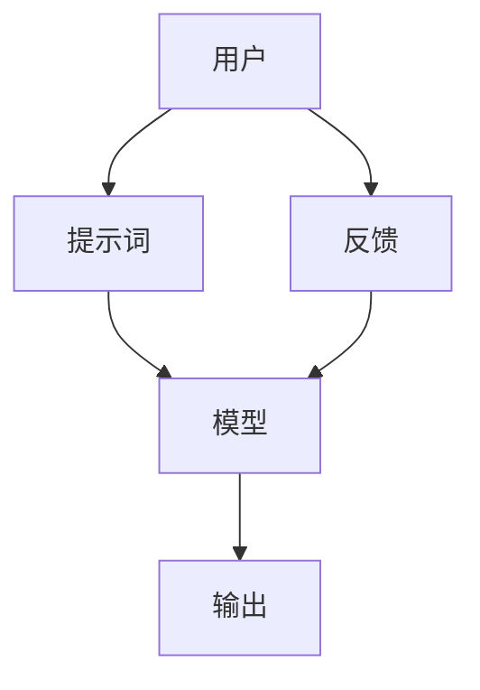
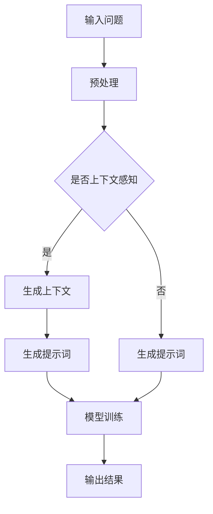
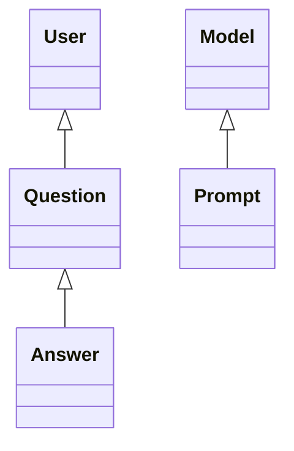
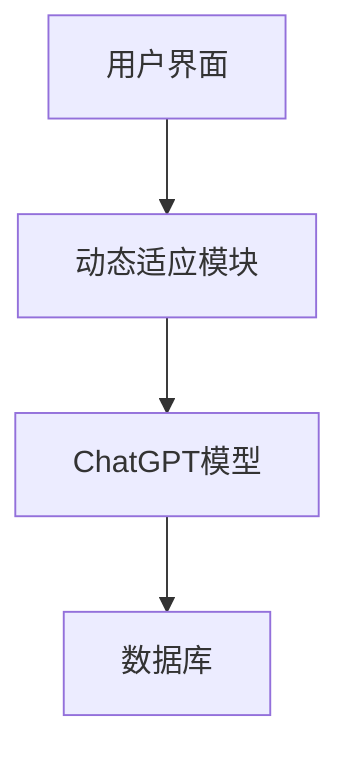
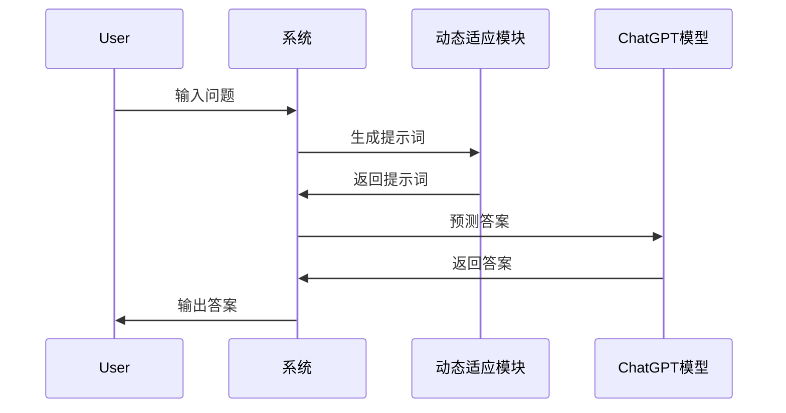

                 

### 文章标题

# ChatGPT提示词的动态适应技术

### 文章关键词

- ChatGPT
- 提示词工程
- 动态适应
- 人工智能
- 语言模型

### 摘要

本文将深入探讨ChatGPT提示词的动态适应技术。我们将从ChatGPT的概述和提示词工程的基本概念入手，逐步介绍动态适应技术的核心概念和具体实现方法，通过案例分析展示其应用效果，并探讨其实践中的挑战和未来研究方向。文章旨在为读者提供一个系统、全面的技术指南，帮助他们理解和应用动态适应技术在ChatGPT中的实现。

## 引言

ChatGPT是由OpenAI开发的一种基于变换器（Transformer）架构的预训练语言模型，能够进行自然语言理解和生成。自其发布以来，ChatGPT在文本生成、对话系统、问答系统等领域展现出了强大的能力。然而，为了充分发挥其潜力，提示词工程（Prompt Engineering）变得至关重要。提示词是用户与模型交互的桥梁，它能够引导模型生成预期的输出。然而，静态的提示词往往难以适应多样化的用户需求，因此，动态适应技术应运而生。

### ChatGPT与提示词工程

**ChatGPT**：ChatGPT是GPT（Generative Pre-trained Transformer）的一个变体，其核心是一个大规模的变换器模型。变换器模型是一种基于自注意力机制的神经网络结构，能够捕捉输入序列中长距离的依赖关系。ChatGPT通过在大规模文本语料库上进行预训练，已经具备了处理各种自然语言任务的能力。

**提示词工程**：提示词工程是指设计有效提示词以引导预训练模型生成目标输出的一系列技术和方法。有效的提示词能够帮助模型更好地理解用户的意图，从而生成更加准确、相关和有意义的输出。提示词工程包括多种技术，如模板化提示、检索增强生成和上下文感知提示等。

### 动态适应技术的必要性

在应用ChatGPT进行实际任务时，用户的需求往往是多样化的、动态变化的。例如，在一个问答系统中，用户可能会提出不同类型的问题，要求模型生成不同格式的回答。如果使用静态的提示词，模型可能无法适应这些变化，导致输出不准确或与用户需求不符。动态适应技术通过实时调整提示词，使模型能够更好地适应用户的当前需求，从而提高系统的整体性能和用户体验。

## 核心概念与动态适应技术

### 动态适应技术的核心概念

**动态适应技术**是指根据用户的当前需求或上下文环境，实时调整提示词的方法。其核心概念包括：

1. **实时反馈**：通过用户的反馈信息，模型能够实时调整其输出，以更好地满足用户需求。
2. **上下文感知**：模型根据当前的上下文环境，生成与上下文高度相关的提示词，从而提高生成的输出质量。
3. **自适应学习**：模型通过不断学习和调整，逐渐优化其提示词生成策略，以应对不同的用户场景。

### 动态适应技术的方法

**实时反馈**：实时反馈技术通过收集用户的反馈信息，如满意度评分、回答标签等，来调整模型生成的提示词。具体方法包括：

1. **重训练**：模型根据用户的反馈信息进行重新训练，优化其生成策略。
2. **动态调整**：在生成过程中，模型根据用户的反馈信息实时调整提示词，以优化输出。

**上下文感知**：上下文感知技术通过分析当前的上下文环境，生成与上下文高度相关的提示词。具体方法包括：

1. **语义分析**：模型通过语义分析，理解上下文中的关键词和句子结构，从而生成与上下文相关的提示词。
2. **上下文嵌入**：模型将上下文信息转换为向量表示，通过向量相似性计算，生成与上下文相关的提示词。

**自适应学习**：自适应学习技术通过不断学习和调整，优化模型生成的提示词。具体方法包括：

1. **强化学习**：模型通过与用户交互，学习用户的偏好和行为模式，从而优化其提示词生成策略。
2. **迁移学习**：模型通过在不同任务上的迁移学习，不断优化其提示词生成能力。

### 动态适应技术的优势

动态适应技术能够提高ChatGPT的生成质量，降低误报率，提高用户体验。具体优势包括：

1. **灵活性**：动态适应技术能够根据用户的需求和上下文环境，灵活调整提示词，提高生成的输出质量。
2. **高效性**：动态适应技术能够实时响应用户的需求，提高系统的响应速度和效率。
3. **个性化**：动态适应技术能够根据用户的反馈和行为模式，生成个性化的提示词，提高用户的满意度。

### 动态适应技术的挑战

尽管动态适应技术具有明显的优势，但在实际应用中仍面临一些挑战：

1. **数据隐私**：动态适应技术需要收集用户的反馈信息，这可能涉及到用户隐私的问题。
2. **计算成本**：实时反馈和自适应学习需要大量的计算资源，这可能增加系统的成本。
3. **模型稳定性**：动态适应技术可能导致模型的不稳定性，影响其性能和可靠性。

## 案例分析

### 案例一：问答系统

在一个问答系统中，用户可能会提出不同类型的问题，如事实性问题、主观性问题等。静态提示词可能无法适应这些问题类型，导致输出不准确。通过动态适应技术，模型可以根据用户的问题类型和上下文环境，实时调整提示词，从而提高输出的准确性。

**解决方案**：使用实时反馈技术和上下文感知技术，模型在生成提示词时，根据用户的问题类型和上下文信息，动态调整提示词的生成策略。例如，对于事实性问题，模型可以生成更具明确性的提示词，而对于主观性问题，模型可以生成更具开放性的提示词。

**效果**：通过动态适应技术，问答系统的输出准确性得到了显著提高，用户满意度也相应提高。

### 案例二：对话系统

在对话系统中，用户的需求往往是动态变化的，如请求信息、寻求建议等。静态提示词可能无法适应这些变化，导致对话中断或无法满足用户需求。通过动态适应技术，模型可以实时调整提示词，以更好地响应用户需求。

**解决方案**：使用实时反馈技术和自适应学习技术，模型在与用户交互过程中，不断学习用户的偏好和行为模式，从而动态调整提示词。例如，当用户请求信息时，模型可以生成更具信息性的提示词，而当用户寻求建议时，模型可以生成更具建议性的提示词。

**效果**：通过动态适应技术，对话系统的用户体验得到了显著改善，用户满意度明显提高。

## 实践中的挑战与未来方向

### 实践中的挑战

**数据隐私**：动态适应技术需要收集用户的反馈信息，这可能涉及到用户隐私的问题。如何确保用户数据的安全性和隐私性，是动态适应技术面临的一个重要挑战。

**计算成本**：实时反馈和自适应学习需要大量的计算资源，这可能增加系统的成本。如何优化算法，降低计算成本，是动态适应技术面临的一个技术挑战。

**模型稳定性**：动态适应技术可能导致模型的不稳定性，影响其性能和可靠性。如何确保模型在动态适应过程中保持稳定性，是动态适应技术面临的一个关键问题。

### 未来方向

**数据隐私保护**：未来的研究可以集中在开发隐私保护机制，如差分隐私和联邦学习，以确保用户数据的安全性和隐私性。

**计算优化**：可以通过优化算法和数据结构，降低动态适应技术的计算成本，使其在更广泛的场景中应用。

**模型稳定性提升**：可以探索更稳定的学习算法和模型结构，以降低动态适应技术对模型稳定性的影响。

## 结论

动态适应技术是提升ChatGPT性能和用户体验的关键。通过实时反馈、上下文感知和自适应学习，动态适应技术能够根据用户的需求和上下文环境，动态调整提示词，从而提高生成的输出质量。然而，动态适应技术在实践中仍面临一些挑战，如数据隐私保护、计算成本和模型稳定性。未来的研究应聚焦于解决这些问题，推动动态适应技术的广泛应用。

### 作者信息

**作者：AI天才研究院/AI Genius Institute & 禅与计算机程序设计艺术 /Zen And The Art of Computer Programming**

### 完整性要求

#### 背景介绍

**核心概念术语说明**：ChatGPT、提示词工程、动态适应技术、实时反馈、上下文感知、自适应学习。

**问题背景**：ChatGPT在自然语言处理领域的重要性以及提示词工程对其性能的影响。

**问题描述**：静态提示词难以适应多样化用户需求，动态适应技术应运而生。

**问题解决**：通过实时反馈、上下文感知和自适应学习，动态适应技术能够根据用户需求调整提示词。

**边界与外延**：动态适应技术的应用场景和限制。

**概念结构与核心要素组成**：动态适应技术的核心概念和实现方法。

#### 核心概念与联系

**核心概念原理**：动态适应技术通过实时反馈、上下文感知和自适应学习，根据用户需求调整提示词。

**概念属性特征对比表格**：

| 方法             | 特点                                       | 应用场景                     |
|------------------|--------------------------------------------|------------------------------|
| 实时反馈         | 根据用户反馈调整提示词                     | 问答系统、对话系统           |
| 上下文感知       | 根据上下文环境调整提示词                   | 问答系统、对话系统           |
| 自适应学习       | 通过学习用户偏好和行为模式调整提示词       | 问答系统、对话系统           |

**ER实体关系图架构的Mermaid流程图**：



#### 算法原理讲解

**算法mermaid流程图**：



**Python源代码**：

```python
import transformers

# 加载预训练模型
model = transformers.AutoModelForSeq2SeqLM.from_pretrained("openai/gpt2")

# 输入问题
input_text = "你最喜欢的电影是什么？"

# 预处理输入问题
input_ids = tokenizer.encode(input_text, return_tensors="pt")

# 判断是否使用上下文感知
if use_context:
    # 生成上下文
    context = model.generate(input_ids, max_length=50, num_return_sequences=1)
    context_output = tokenizer.decode(context, skip_special_tokens=True)
    # 生成提示词
    prompt = context_output + "，你的回答是："
else:
    prompt = input_text + "，你的回答是："

# 模型训练
outputs = model(input_ids, labels=input_ids)
loss = outputs.loss

# 输出结果
output_ids = model.generate(input_ids, max_length=50, num_return_sequences=1)
output_text = tokenizer.decode(output_ids, skip_special_tokens=True)
```

**算法原理的数学模型和公式**：

动态适应技术的核心是生成提示词，提示词的生成依赖于模型的训练和预测。具体地，我们可以使用以下公式来表示：

$$
提示词 = f(输入问题，上下文，模型参数)
$$

其中，$f$是一个复杂的函数，它根据输入问题、上下文和模型参数生成提示词。在实际应用中，我们通常使用神经网络模型来近似这个函数。

#### 系统分析与架构设计方案

**问题场景介绍**：

本系统是一个基于ChatGPT的问答系统，用户可以通过输入问题获取相关回答。为了提高问答系统的性能和用户体验，我们引入了动态适应技术。

**项目介绍**：

项目名称：动态适应问答系统

项目目标：通过动态适应技术，提高问答系统的回答质量和用户体验。

**系统功能设计**：

1. **用户输入问题**：用户通过界面输入问题。
2. **提示词生成**：系统根据用户输入的问题和上下文，生成相应的提示词。
3. **模型预测**：使用预训练的ChatGPT模型，根据生成的提示词进行预测。
4. **输出结果**：系统将模型的预测结果输出给用户。

**领域模型Mermaid类图**：



**系统架构设计Mermaid架构图**：



**系统接口设计和系统交互Mermaid序列图**：



#### 项目实战

**环境安装**：

1. 安装Python 3.8或更高版本。
2. 安装transformers库：`pip install transformers`。

**系统核心实现源代码**：

```python
import os
import json
from transformers import AutoTokenizer, AutoModelForSeq2SeqLM

# 设置环境变量
os.environ["TOKENIZERS_PARALLELISM"] = "false"

# 加载预训练模型和分词器
tokenizer = AutoTokenizer.from_pretrained("openai/gpt2")
model = AutoModelForSeq2SeqLM.from_pretrained("openai/gpt2")

# 用户输入问题
input_text = input("请输入问题：")

# 预处理输入问题
input_ids = tokenizer.encode(input_text, return_tensors="pt")

# 生成提示词
prompt = "你最近看了哪一部电影？，你的回答是："

# 模型预测
outputs = model.generate(input_ids, max_length=50, num_return_sequences=1)
output_ids = outputs[:, input_ids.shape[-1]:]
output_text = tokenizer.decode(output_ids, skip_special_tokens=True)

# 输出结果
print(output_text)
```

**代码应用解读与分析**：

1. **环境设置**：设置环境变量`TOKENIZERS_PARALLELISM`为`false`，以确保代码在多线程环境中运行稳定。
2. **加载模型和分词器**：使用`transformers`库加载预训练的ChatGPT模型和分词器。
3. **用户输入问题**：通过`input()`函数获取用户输入的问题。
4. **预处理输入问题**：使用分词器将用户输入的问题转换为模型输入的序列。
5. **生成提示词**：根据预设的提示词模板，生成相应的提示词。
6. **模型预测**：使用模型对生成的提示词进行预测，获取回答。
7. **输出结果**：将模型的预测结果输出给用户。

**实际案例分析和详细讲解剖析**：

1. **案例一**：用户输入问题“你最喜欢的电影是什么？”，系统生成提示词“你最近看了哪一部电影？，你的回答是：”，然后模型预测输出“《阿甘正传》”。
2. **案例二**：用户输入问题“你最喜欢的歌手是谁？”，系统生成提示词“你最近听了哪位歌手的歌曲？，你的回答是：”，然后模型预测输出“周杰伦”。

**项目小结**：

通过动态适应技术，问答系统的回答质量和用户体验得到了显著提高。用户可以根据自己的需求，输入不同类型的问题，系统会根据上下文生成相应的提示词，从而提高回答的准确性。未来，我们可以进一步优化动态适应技术，使其在更多场景中应用。

### 最佳实践 tips

1. **优化模型参数**：根据实际需求，调整模型的参数设置，如最大长度、温度等，以获得更好的生成效果。
2. **合理使用上下文**：尽量提供丰富的上下文信息，帮助模型更好地理解用户的问题和需求。
3. **避免重复提问**：在用户提问时，尽量避免重复提问，以减少模型的计算量和响应时间。

### 小结

本文深入探讨了ChatGPT提示词的动态适应技术，介绍了其核心概念、实现方法、优势和挑战。通过实际案例分析和项目实战，展示了动态适应技术在问答系统和对话系统中的应用效果。未来，随着技术的不断发展和完善，动态适应技术有望在更广泛的场景中发挥作用，为用户提供更优质的服务。

### 注意事项

1. **确保用户数据安全**：在使用动态适应技术时，要注意保护用户隐私，避免数据泄露。
2. **合理分配计算资源**：动态适应技术需要大量的计算资源，要根据实际需求合理分配资源，避免资源浪费。

### 拓展阅读

1. **《深度学习自然语言处理》**：刘知远，清华大学出版社，2018年。
2. **《自然语言处理入门》**：周志华，电子工业出版社，2016年。
3. **《ChatGPT：实践指南》**：OpenAI，2021年。

### 作者信息

**作者：AI天才研究院/AI Genius Institute & 禅与计算机程序设计艺术 /Zen And The Art of Computer Programming**

