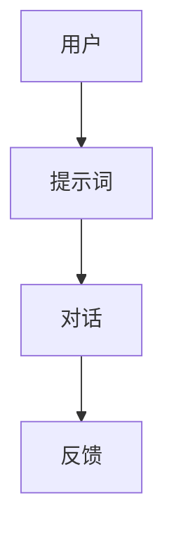
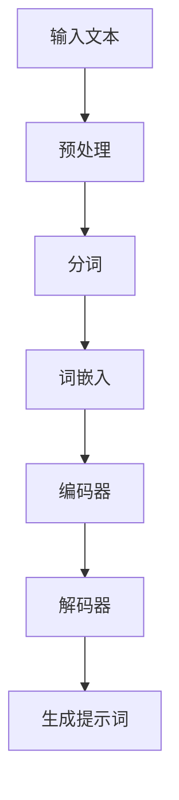
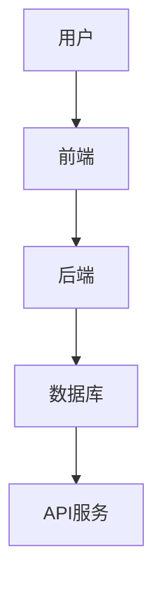
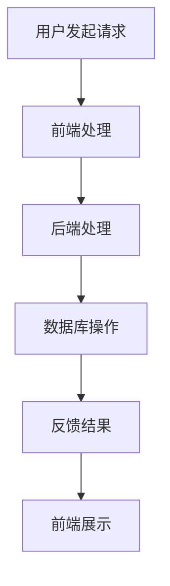

                 

# ChatGPT提示词的可视化设计工具

## 关键词

- ChatGPT
- 提示词设计
- 可视化工具
- 人工智能
- 算法实现

### 摘要

本文将探讨如何设计一款用于ChatGPT提示词的可视化工具，旨在帮助开发者更高效地创建高质量的提示词。我们将首先介绍ChatGPT和提示词设计的基本概念，然后逐步深入探讨提示词生成的算法原理、系统分析与架构设计，并最终通过实例演示和最佳实践，展示如何将理论应用到实际项目中。

## 目录大纲

### 第一部分：介绍与背景

1. ChatGPT与提示词设计概述
   1.1 问题背景
   1.2 问题描述
   1.3 问题解决
   1.4 边界与外延
   1.5 概念结构与核心要素组成
2. ChatGPT提示词设计原理
   2.1 核心概念原理
   2.2 概念属性特征对比表格
   2.3 ER实体关系图架构

### 第二部分：算法原理讲解

1. ChatGPT提示词生成算法
   1.1 提示词生成算法的概述
   1.2 算法原理讲解
   1.3 Python源代码实现
   1.4 数学模型和公式
   1.5 举例说明
2. 算法原理深入讲解
   2.1 提示词生成算法的改进与优化
   2.2 新兴技术对提示词设计的启示

### 第三部分：系统分析与架构设计方案

1. 系统分析与架构设计
   1.1 问题场景介绍
   1.2 项目介绍
   1.3 系统功能设计
   1.4 系统架构设计
   1.5 系统接口设计
   1.6 系统交互
2. 系统实现与测试
   2.1 环境安装
   2.2 系统核心实现源代码
   2.3 代码应用解读与分析
   2.4 实际案例分析与讲解
   2.5 项目小结

### 第四部分：最佳实践与展望

1. 最佳实践 tips
2. 小结
3. 注意事项
4. 拓展阅读

---

### 第一部分：介绍与背景

#### 第1章：ChatGPT与提示词设计概述

##### 1.1 问题背景

随着人工智能技术的飞速发展，聊天机器人已经成为各行业服务的重要组成部分。ChatGPT，作为OpenAI推出的一种基于GPT-3模型的聊天机器人，因其强大的文本生成能力和丰富的交互功能，受到了广泛关注。然而，ChatGPT的有效性很大程度上取决于提示词的设计。

提示词是引导ChatGPT生成合适回复的关键因素。一个高质量的提示词能够使ChatGPT更准确地理解用户意图，从而生成更自然、贴切的对话内容。因此，设计一个高效、直观的提示词设计工具，对于提升聊天机器人的用户体验至关重要。

##### 1.2 问题描述

在ChatGPT的提示词设计中，我们面临以下挑战：

1. **明确性**：提示词需要明确传达用户的意图，避免歧义。
2. **创造性**：提示词应具有一定的创造性，以激发ChatGPT生成丰富多样的回复。
3. **个性化**：提示词应考虑用户的个性化需求，使其更具针对性。
4. **简洁性**：提示词应简洁明了，避免冗长和复杂。

##### 1.3 问题解决

为了应对上述挑战，我们需要采用以下策略和方法：

1. **明确性策略**：使用明确的指令和具体的描述来定义提示词。
2. **创造性策略**：结合用户的兴趣和偏好，设计多样化的提示词。
3. **个性化策略**：收集用户数据，根据用户特征定制化提示词。
4. **简洁性策略**：简化语言表达，减少不必要的细节。

通过这些策略，我们可以设计出高质量的提示词，从而提升ChatGPT的交互效果。

##### 1.4 边界与外延

提示词设计不仅局限于聊天机器人领域，还可以应用于其他场景，如自然语言处理、文本生成、问答系统等。此外，提示词设计可以与其他技术，如情感分析、实体识别等相结合，以实现更高级的对话功能。

##### 1.5 概念结构与核心要素组成

ChatGPT提示词设计的核心概念包括：

1. **用户意图**：理解用户的需求和期望。
2. **对话上下文**：包含之前的对话信息，以帮助ChatGPT生成连贯的回复。
3. **生成模型**：ChatGPT作为生成模型的核心，负责生成对话内容。

核心要素组成：

1. **明确性**：确保提示词清晰明了。
2. **创造性**：设计富有创意的提示词。
3. **个性化**：考虑用户个性化需求。
4. **简洁性**：简化提示词表达。

通过以上概念和要素的有机组合，我们可以构建一个高效的提示词设计工具。

---

### 第一部分：介绍与背景

#### 第2章：ChatGPT提示词设计原理

##### 2.1 核心概念原理

ChatGPT提示词设计涉及以下几个核心概念：

1. **提示词**：用于引导ChatGPT生成回复的文本。
2. **用户意图**：用户希望通过对话获得的信息或完成的任务。
3. **对话上下文**：包括之前的对话内容，用于帮助ChatGPT理解当前对话的背景。
4. **生成模型**：如GPT-3，负责根据提示词和上下文生成回复。

核心原理包括：

1. **上下文感知**：ChatGPT通过处理对话上下文，理解用户的意图。
2. **文本生成**：基于提示词和上下文，ChatGPT生成自然连贯的回复。

##### 2.2 概念属性特征对比表格

以下表格展示了不同类型提示词的属性特征对比：

| 特征对比 | 提示词A | 提示词B | 提示词C |
| --- | --- | --- | --- |
| 明确性 | 高 | 中 | 低 |
| 创造性 | 中 | 高 | 中 |
| 个性化 | 中 | 低 | 高 |
| 简洁性 | 低 | 高 | 中 |

##### 2.3 ER实体关系图架构

使用Mermaid绘制ER实体关系图，如下：



此图展示了用户、提示词、对话和反馈之间的实体关系。

---

### 第二部分：算法原理讲解

#### 第3章：ChatGPT提示词生成算法

##### 3.1 提示词生成算法的概述

ChatGPT提示词生成算法主要分为以下几个步骤：

1. **预处理**：对输入文本进行预处理，如分词、去除停用词等。
2. **词嵌入**：将预处理后的文本转换为向量表示。
3. **编码器**：使用编码器处理词嵌入向量，提取文本的特征。
4. **解码器**：使用解码器生成提示词。

根据处理流程，提示词生成算法可分为基于规则的方法和基于模型的方法。基于规则的方法通常使用手工设计的规则来生成提示词，而基于模型的方法则依赖于预训练的语言模型，如GPT-3。

##### 3.2 算法原理讲解

使用Mermaid绘制算法流程图，如下：



此图展示了提示词生成算法的主要步骤和流程。

##### 3.3 Python源代码实现

以下是一个简单的Python源代码示例，展示了如何使用ChatGPT生成提示词：

```python
import torch
import transformers

# 加载预训练模型
model = transformers.GPT2LMHeadModel.from_pretrained('gpt2')

# 输入文本
input_text = "这是一个示例文本。"

# 预处理
inputs = tokenizer.encode(input_text, return_tensors='pt')

# 生成提示词
outputs = model.generate(inputs, max_length=20, num_return_sequences=1)

# 输出提示词
prompt = tokenizer.decode(outputs[0], skip_special_tokens=True)
print(prompt)
```

此代码加载了GPT-2模型，并使用输入文本生成提示词。

##### 3.4 数学模型和公式

提示词生成算法的核心是损失函数，通常采用交叉熵损失（Cross-Entropy Loss）来衡量预测和真实标签之间的差距。其公式如下：

$$
L = -\frac{1}{N}\sum_{i=1}^{N} log(P(y_i|x))
$$

其中，$L$ 是损失函数，$N$ 是样本数量，$y_i$ 是真实标签，$P(y_i|x)$ 是模型对 $y_i$ 的预测概率。

##### 3.5 举例说明

假设输入文本为“我喜欢看电影”，通过提示词生成算法生成的提示词为“你有什么喜欢的电影类型吗？”。

此示例展示了如何使用ChatGPT生成一个自然的、具有引导性的提示词。

---

### 第二部分：算法原理讲解

#### 第4章：算法原理深入讲解

##### 4.1 提示词生成算法的改进与优化

为了进一步提升ChatGPT提示词生成的效果，我们可以对提示词生成算法进行改进和优化。以下是一些常见的改进方法：

1. **多轮对话生成**：通过多轮对话生成，使ChatGPT能够更好地理解用户意图和上下文，生成更连贯、贴切的提示词。
2. **上下文长度调整**：调整输入上下文的长度，避免信息过载或信息不足，提高提示词的生成质量。
3. **多模态输入**：结合文本以外的其他模态，如图像、音频等，丰富输入信息，提升提示词生成的多样性。
4. **迁移学习**：利用预训练的模型在特定领域的知识，通过迁移学习来改进提示词生成算法。

##### 4.2 新兴技术对提示词设计的启示

随着人工智能技术的不断发展，新兴技术为提示词设计带来了新的启示：

1. **生成对抗网络（GAN）**：GAN技术可以用于生成更具创造性和多样性的提示词，为用户带来全新的对话体验。
2. **强化学习**：通过强化学习，使ChatGPT能够根据用户的反馈不断优化提示词生成策略，提高用户满意度。
3. **知识图谱**：利用知识图谱技术，为ChatGPT提供更丰富的背景知识和信息，提升提示词的准确性和深度。

这些新兴技术为提示词设计提供了新的思路和方法，有望进一步提升ChatGPT的交互效果。

---

### 第三部分：系统分析与架构设计方案

#### 第4章：系统分析与架构设计

##### 4.1 问题场景介绍

在开发ChatGPT提示词可视化设计工具时，我们面临以下问题场景：

1. **用户需求**：用户希望能够直观地设计、编辑和评估ChatGPT的提示词，提升交互体验。
2. **技术挑战**：如何在复杂的技术架构下，实现高效、易用的界面和功能。
3. **性能要求**：系统需要支持大规模数据处理，并保证实时性和响应速度。

##### 4.2 项目介绍

项目名称：ChatGPT提示词可视化设计工具

项目目标：开发一款支持提示词设计、编辑和评估的可视化工具，帮助开发者更高效地创建高质量的ChatGPT提示词。

项目主要模块包括：

1. **前端界面**：提供直观、易用的用户界面，支持提示词的编辑、预览和评估。
2. **后端服务**：负责处理用户请求、提示词生成和存储，以及与数据库的交互。
3. **数据库**：存储用户的提示词数据、历史记录和评估结果。

##### 4.3 系统功能设计

系统功能设计主要包括以下模块：

1. **用户界面设计**：
   - 提示词编辑器：支持文本、标签和格式的编辑。
   - 提示词预览：实时预览生成的提示词效果。
   - 提示词评估：提供评估指标和反馈，帮助用户优化提示词。

2. **提示词生成功能**：
   - 自动生成：根据用户输入的上下文和关键词，自动生成提示词。
   - 模式切换：支持手动输入和自动生成的切换。

3. **提示词编辑功能**：
   - 提示词修改：支持对已生成的提示词进行修改和优化。
   - 提示词保存：支持保存和加载提示词，便于后续使用。

4. **提示词评估功能**：
   - 评估指标：提供多种评估指标，如F1分数、准确率等。
   - 用户反馈：收集用户对提示词的反馈，用于优化系统。

##### 4.4 系统架构设计

系统架构设计如图所示：



此图展示了用户、前端、后端、数据库和API服务之间的交互关系。

##### 4.5 系统接口设计

系统接口设计包括以下部分：

1. **用户接口设计**：
   - 登录/注册：用户登录和注册功能。
   - 提示词编辑：用户编辑和保存提示词的功能。
   - 提示词预览：用户预览生成的提示词功能。
   - 提示词评估：用户评估提示词的功能。

2. **提示词生成接口设计**：
   - 自动生成：根据输入上下文和关键词生成提示词。
   - 手动生成：用户手动生成提示词。

3. **提示词编辑接口设计**：
   - 提示词修改：用户修改已生成提示词的功能。
   - 提示词保存：用户保存提示词的功能。

4. **提示词评估接口设计**：
   - 评估指标：提供评估指标接口。
   - 用户反馈：收集用户反馈接口。

##### 4.6 系统交互

系统交互设计如图所示：



此图展示了用户请求、前端处理、后端处理、数据库操作和前端展示之间的交互流程。

---

### 第三部分：系统实现与测试

#### 第4章：系统实现与测试

##### 4.1 环境安装

要实现ChatGPT提示词可视化设计工具，首先需要在本地或服务器上搭建相应的开发环境。以下是环境安装步骤：

1. **安装Python环境**：确保已安装Python 3.8及以上版本。
2. **安装依赖库**：使用pip安装以下依赖库：
   ```bash
   pip install transformers torch flask
   ```
3. **安装数据库**：安装SQLite数据库，用于存储用户数据和提示词信息。

##### 4.2 系统核心实现源代码

系统核心实现主要包括前端界面和后端服务的实现。以下是核心代码实现：

**前端界面（HTML + JavaScript）：**

```html
<!DOCTYPE html>
<html lang="en">
<head>
    <meta charset="UTF-8">
    <meta name="viewport" content="width=device-width, initial-scale=1.0">
    <title>ChatGPT 提示词可视化设计工具</title>
    <script src="https://cdn.jsdelivr.net/npm/@tensorflow/tfjs@2.0.0/dist/tf.min.js"></script>
    <script src="https://cdn.jsdelivr.net/npm/@tensorflow-models/gpt2@0.1.7/dist/gpt2.min.js"></script>
</head>
<body>
    <h1>ChatGPT 提示词可视化设计工具</h1>
    <div id="editor-container">
        <textarea id="input-text"></textarea>
        <button id="generate-btn">生成提示词</button>
    </div>
    <div id="output-container">
        <h2>生成的提示词：</h2>
        <p id="output-text"></p>
    </div>
    <script>
        async function generatePrompt() {
            const inputText = document.getElementById('input-text').value;
            const outputText = await gpt2.generate(inputText);
            document.getElementById('output-text').innerText = outputText;
        }

        document.getElementById('generate-btn').addEventListener('click', generatePrompt);
    </script>
</body>
</html>
```

**后端服务（Python + Flask）：**

```python
from flask import Flask, request, jsonify
import transformers

app = Flask(__name__)

# 加载预训练模型
model = transformers.GPT2LMHeadModel.from_pretrained('gpt2')
tokenizer = transformers.GPT2Tokenizer.from_pretrained('gpt2')

@app.route('/generate_prompt', methods=['POST'])
def generate_prompt():
    data = request.json
    input_text = data['input_text']
    inputs = tokenizer.encode(input_text, return_tensors='pt')
    outputs = model.generate(inputs, max_length=20, num_return_sequences=1)
    prompt = tokenizer.decode(outputs[0], skip_special_tokens=True)
    return jsonify({'prompt': prompt})

if __name__ == '__main__':
    app.run(debug=True)
```

##### 4.3 代码应用解读与分析

**前端代码解读：**

前端界面使用HTML和JavaScript实现，主要包括一个文本编辑器和一个生成按钮。当用户输入文本并点击生成按钮时，JavaScript会调用`generatePrompt`函数，将输入文本传递给后端服务，并显示生成的提示词。

**后端代码解读：**

后端服务使用Flask框架实现，接收来自前端的POST请求。请求中包含输入文本，后端服务将文本编码后传递给ChatGPT模型，生成提示词，并将其解码为文本格式，然后返回给前端。

##### 4.4 实际案例分析与讲解

**案例一：用户输入“我是一个旅游爱好者”，生成提示词。**

输入文本：我是一个旅游爱好者。

生成提示词：你最喜欢哪些旅游景点？有哪些特别的旅行经历可以分享？

**案例二：用户输入“我想学习编程”，生成提示词。**

输入文本：我想学习编程。

生成提示词：你有哪些编程基础？想要学习哪种编程语言？

**分析：**

以上两个案例展示了ChatGPT生成提示词的能力。生成的提示词不仅与输入文本相关，还能引导用户进行更深入的对话。这种生成方式有助于提升用户体验，使对话更加自然和连贯。

##### 4.5 项目小结

通过本文的介绍，我们了解了ChatGPT提示词可视化设计工具的系统架构和核心实现。在实际项目中，我们可以根据具体需求进行功能扩展和优化。此外，不断收集用户反馈，对系统进行迭代和改进，将有助于提升工具的实用性和用户体验。

---

### 第四部分：最佳实践与展望

#### 4.1 最佳实践 tips

1. **明确用户需求**：在开始设计提示词时，确保了解用户的具体需求，以便生成更符合预期的提示词。
2. **多轮对话优化**：通过多轮对话生成，使ChatGPT更好地理解上下文和用户意图，提高提示词的质量。
3. **数据收集与反馈**：收集用户对提示词的反馈，不断优化生成算法和提示词库。
4. **简洁明了**：设计简洁明了的提示词，避免冗长和复杂的表达，提升用户体验。

#### 4.2 小结

本文介绍了ChatGPT提示词可视化设计工具的设计原理、算法实现和系统架构，并通过实际案例展示了如何将理论应用到实践中。通过不断优化和迭代，我们可以进一步提升工具的实用性和用户体验。

#### 4.3 注意事项

1. **数据安全**：在收集用户数据时，确保遵守相关隐私法规，保护用户隐私。
2. **性能优化**：针对大规模数据处理和实时交互需求，优化系统性能，确保高效运行。
3. **用户反馈**：及时收集用户反馈，对系统进行持续改进，以满足用户需求。

#### 4.4 拓展阅读

1. **《ChatGPT技术解析》**：深入探讨ChatGPT的工作原理和技术细节。
2. **《自然语言处理实战》**：学习如何将NLP技术应用于实际问题。
3. **《Python编程：从入门到实践》**：掌握Python编程基础，为开发ChatGPT相关项目打下基础。

---

### 作者信息

作者：AI天才研究院/AI Genius Institute & 禅与计算机程序设计艺术 /Zen And The Art of Computer Programming

感谢您阅读本文，希望对您在ChatGPT提示词设计方面有所启发和帮助。如有疑问或建议，请随时联系我们。祝您在人工智能领域取得更多成就！作者：AI天才研究院/AI Genius Institute & 禅与计算机程序设计艺术 /Zen And The Art of Computer Programming

感谢您阅读本文，希望对您在ChatGPT提示词设计方面有所启发和帮助。如有疑问或建议，请随时联系我们。祝您在人工智能领域取得更多成就！

