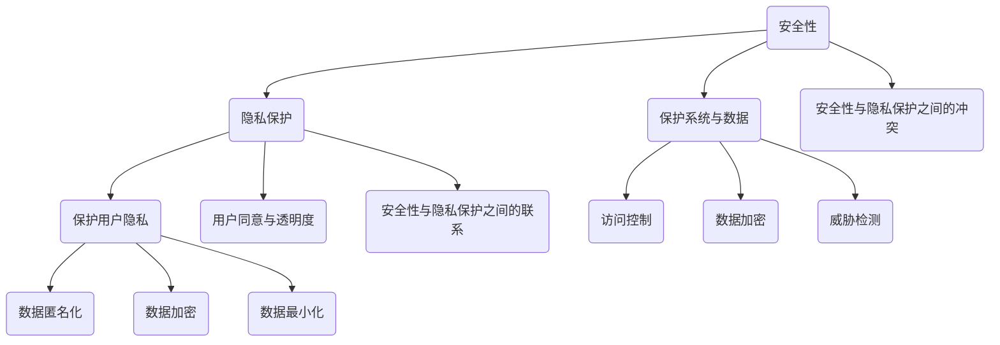
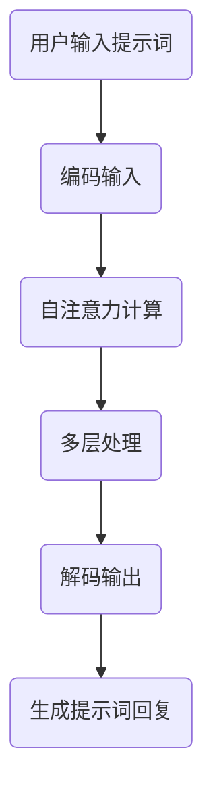
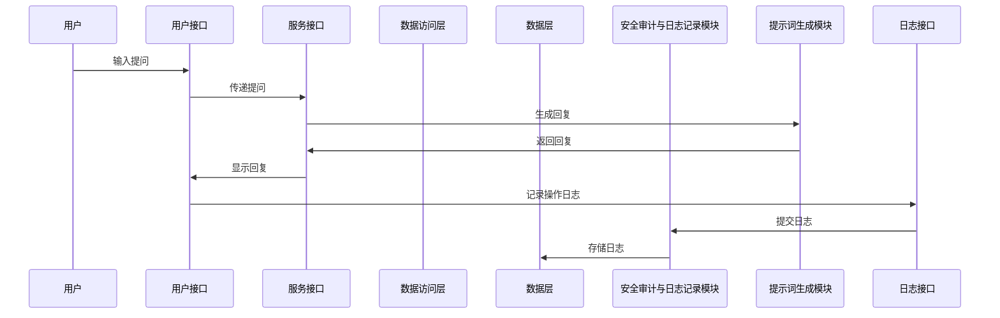
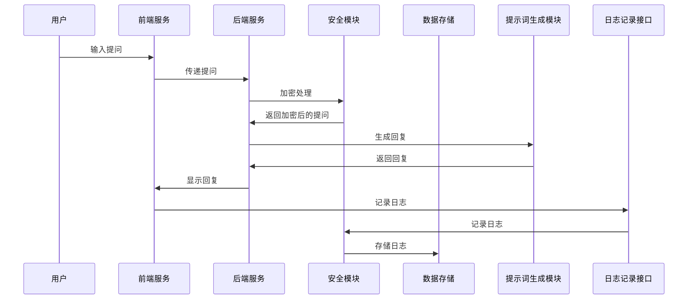

                 

### 问题背景与核心概念

在当今数字化时代，人工智能（AI）技术迅猛发展，各类AI模型在自然语言处理（NLP）领域取得了显著的成果。ChatGPT，作为OpenAI推出的一种基于变换器模型（Transformer）的AI助手，因其强大的语言生成能力和灵活的交互方式，迅速在学术界和产业界得到了广泛关注和应用。

**1.1 ChatGPT的崛起与普及**

ChatGPT是由OpenAI在2022年11月推出的一个基于GPT-3.5的全新语言模型，其核心特点在于能够进行流畅且人性化的对话。与传统的规则型AI相比，ChatGPT具备更强的上下文理解能力，能够根据上下文生成连贯、合理的回复。此外，ChatGPT的开放性使得开发者可以轻松集成到各种应用场景中，如客服系统、智能助手、自动写作等。

ChatGPT的普及程度可见一斑。从技术社区到企业应用，从个人开发者到大型科技公司，ChatGPT都展现了其广泛的应用潜力。这不仅激发了科研人员的研究兴趣，也为商业应用带来了新的机遇。

**1.2 提示词安全性与隐私保护的重要性**

然而，随着ChatGPT的广泛应用，其安全问题也逐渐显现出来。提示词（Prompt）是用户与ChatGPT进行交互的桥梁，它包含了用户输入的信息和指令。如果提示词管理不善，可能会带来以下风险：

1. **数据泄露风险**：未经授权的访问可能会获取用户的敏感信息，导致数据泄露。
2. **信息污染**：恶意提示词可能导致ChatGPT生成错误或有害的回复。
3. **隐私侵犯**：用户的隐私信息可能因为不当的提示词而被ChatGPT捕捉和分析。

此外，隐私保护是现代科技应用中不可忽视的重要环节。各国对隐私保护的法律法规日益严格，如欧盟的《通用数据保护条例》（GDPR）和美国加州的《消费者隐私法案》（CCPA），都要求企业必须采取有效措施保护用户隐私。

**1.3 核心概念与联系**

为了深入理解ChatGPT提示词的安全性与隐私保护，我们需要明确以下几个核心概念：

1. **安全性**：安全性指的是保护系统、网络和数据免受未经授权的访问、破坏或泄露。在ChatGPT的上下文中，安全性涉及提示词的加密、访问控制、威胁检测等多个方面。
   
2. **隐私保护**：隐私保护指的是确保用户个人信息不被未经授权的第三方访问或使用。隐私保护包括数据匿名化、加密、数据最小化等策略。

3. **提示词**：提示词是用户输入的信息和指令，它决定了ChatGPT的回复内容。提示词的安全性直接关系到用户数据的安全性和ChatGPT系统的可信度。

安全性、隐私保护和提示词之间紧密相关。提示词的安全性直接影响数据的隐私保护，而良好的隐私保护机制又能增强系统的安全性。这三者之间的联系与冲突需要我们在设计、实现和应用过程中仔细平衡。

### 总结

本部分通过介绍ChatGPT的崛起与普及、提示词安全性与隐私保护的重要性以及核心概念与联系，为后续章节的深入探讨奠定了基础。在接下来的内容中，我们将详细分析ChatGPT提示词生成机制、安全性技术、隐私保护技术，并探讨其实现挑战。通过一步一步的分析与推理，我们将为读者提供全面、专业的技术见解。

---

**附录：核心概念与联系解析**

1. **安全性概念解析**
   - **定义**：安全性是指保护信息、系统和网络免受未经授权的访问、破坏、修改或泄露的能力。
   - **关键要素**：访问控制、数据加密、威胁检测与响应。

2. **隐私保护概念解析**
   - **定义**：隐私保护是指确保个人信息不被未经授权的第三方访问或使用。
   - **关键要素**：数据匿名化、数据加密、数据最小化、用户同意与透明度。

3. **安全性与隐私保护之间的联系与冲突**
   - **联系**：安全性是隐私保护的基础，而隐私保护是安全性的一部分。两者都需要保护用户数据和系统的完整性。
   - **冲突**：在某些情况下，加强安全性可能会增加系统的复杂性和开销，从而影响隐私保护。

**附录：核心概念属性特征对比表格**

| 特征      | 安全性               | 隐私保护               |
| --------- | ------------------- | ------------------- |
| 目标      | 保护系统与数据      | 保护用户隐私           |
| 关键要素 | 访问控制、加密、威胁检测 | 匿名化、加密、最小化 |
| 冲突点    | 系统复杂性          | 用户数据保护           |
| 关联性    | 与安全相关           | 与隐私相关           |

**附录：安全性与隐私保护之间的联系与冲突ER实体关系图架构**



通过上述解析和ER图架构，我们可以更清晰地理解安全性、隐私保护和提示词之间的复杂关系，为后续章节的内容分析打下坚实基础。

---

在了解了ChatGPT的背景和提示词安全性与隐私保护的重要性之后，接下来我们将深入探讨ChatGPT提示词生成机制，分析其技术原理和实现方式。这将为我们后续的安全性与隐私保护讨论提供必要的基础知识。

---

### ChatGPT提示词生成机制

ChatGPT的提示词生成机制是其能够实现自然流畅对话的关键所在。理解这一机制不仅有助于我们评估ChatGPT的性能，还能帮助我们识别潜在的安全和隐私风险。下面，我们将详细探讨ChatGPT的提示词生成机制。

#### 2.1.1 提示词生成的数据来源

ChatGPT的提示词生成基于大量的训练数据。这些数据通常来源于互联网上的各种文本，包括新闻报道、论坛讨论、社交媒体帖子、学术论文等。通过从这些海量数据中提取信息，ChatGPT能够学习到语言的语法结构、语义含义以及上下文关系。

#### 2.1.2 提示词生成算法原理

ChatGPT采用的是基于变换器模型（Transformer）的架构，这是一种在自然语言处理领域取得巨大成功的深度学习模型。变换器模型通过多层的自注意力机制（Self-Attention）来捕捉输入文本中的上下文关系，从而生成连贯、合理的回复。

具体来说，ChatGPT的工作流程如下：

1. **输入处理**：用户输入提示词后，ChatGPT首先将其编码成一个序列的向量表示。这一过程涉及到词嵌入（Word Embedding）和位置编码（Positional Encoding）。

2. **自注意力机制**：在自注意力机制中，ChatGPT计算输入序列中每个词与其他词之间的关联强度。这一过程通过矩阵运算实现，能够有效捕捉上下文关系。

3. **多层处理**：变换器模型通常由多层自注意力机制组成。每一层都会对输入进行更加细致的处理，从而提高模型的表示能力。

4. **输出生成**：最后，ChatGPT根据处理后的序列向量生成输出文本。这一过程通过解码器（Decoder）实现，解码器通过不断预测下一个词并更新上下文状态来生成完整的回复。

#### 2.1.3 提示词生成的挑战与优化策略

虽然ChatGPT在提示词生成方面表现出色，但其实现过程中仍面临诸多挑战：

1. **数据质量**：训练数据的质量直接影响模型的性能。数据中存在的噪声、错误和偏见都可能影响模型的准确性。

2. **计算资源**：变换器模型需要大量的计算资源。随着模型规模的增大，训练和推理的时间成本也显著增加。

3. **上下文理解**：虽然变换器模型能够捕捉一定程度的上下文关系，但在处理长文本或复杂语义时，仍存在一定的局限性。

为了应对这些挑战，研究者们采取了多种优化策略：

1. **数据清洗与增强**：通过对训练数据进行清洗和增强，提高数据的质量和多样性。

2. **模型压缩与优化**：通过模型剪枝、量化等技术，减小模型的规模和计算需求。

3. **上下文建模**：引入更长序列的编码和解码机制，提高模型对上下文的理解能力。

通过这些优化策略，ChatGPT在提示词生成方面的性能得到了显著提升。

### 总结

通过对ChatGPT提示词生成机制的分析，我们可以看到，这一过程涉及到复杂的数据处理和深度学习模型。理解这些原理不仅有助于我们更好地使用ChatGPT，还能帮助我们识别和解决其中可能存在的安全和隐私问题。在接下来的章节中，我们将详细探讨如何通过技术手段来确保提示词的安全性，并保护用户的隐私。

---

**附录：算法原理与实现**

在详细探讨ChatGPT的提示词生成算法原理时，我们可以借助mermaid来绘制算法流程图，并使用Python代码来演示具体实现过程。

#### 2.1.3.1 算法原理与mermaid流程图

以下是ChatGPT提示词生成算法的mermaid流程图：



**mermaid流程图说明：**
- **A(用户输入提示词)**：用户输入的提示词首先进入模型。
- **B(编码输入)**：输入被编码成向量表示。
- **C(自注意力计算)**：模型通过自注意力机制计算输入序列中每个词与其他词的关联强度。
- **D(多层处理)**：通过多层自注意力机制，模型不断更新和优化输入的表示。
- **E(解码输出)**：解码器根据更新后的序列生成输出文本。
- **F(生成提示词回复)**：最终生成的文本作为回复返回给用户。

#### 2.1.3.2 Python代码实现

下面是使用Python实现ChatGPT提示词生成算法的示例代码：

```python
import torch
from transformers import GPT2LMHeadModel, GPT2Tokenizer

# 加载预训练模型和分词器
model = GPT2LMHeadModel.from_pretrained('gpt2')
tokenizer = GPT2Tokenizer.from_pretrained('gpt2')

# 用户输入提示词
prompt = "你是谁？"

# 编码输入
inputs = tokenizer.encode(prompt, return_tensors='pt')

# 通过模型生成输出
outputs = model.generate(inputs, max_length=50, num_return_sequences=1)

# 解码输出
generated_text = tokenizer.decode(outputs[0], skip_special_tokens=True)

print(generated_text)
```

**代码说明：**
- **加载模型和分词器**：我们从预训练的GPT-2模型中加载模型和分词器。
- **编码输入**：我们将用户输入的提示词编码成向量表示。
- **生成输出**：通过模型生成输出文本。
- **解码输出**：将生成的输出文本解码成自然语言。

通过上述mermaid流程图和Python代码，我们可以更直观地理解ChatGPT提示词生成算法的原理和实现过程。这为进一步的安全性和隐私保护技术讨论提供了坚实的基础。

---

**附录：数学模型与公式**

为了进一步理解ChatGPT提示词生成算法的数学基础，我们引入一些关键的数学模型和公式。以下是涉及的主要数学概念和它们的公式：

1. **词嵌入（Word Embedding）**
   - **公式**：\( \text{vec}(w) = \text{Embedding}(w) \)
   - **说明**：词嵌入将词汇表中的每个单词映射到一个高维向量空间中，这些向量表示了单词的语义信息。

2. **位置编码（Positional Encoding）**
   - **公式**：\( \text{pos\_embed}(p) = \text{PositionalEncoding}(p) \)
   - **说明**：位置编码为每个词添加了关于其在序列中位置的信息，有助于模型理解词的顺序关系。

3. **自注意力（Self-Attention）**
   - **公式**：\( \text{score}_{ij} = \text{dot}(\text{query}_i, \text{key}_j) / \sqrt{d_k} \)
   - **说明**：自注意力通过计算每个词与其余词之间的关联强度，用于更新词的表示。

4. **多层感知机（Multi-Layer Perceptron, MLP）**
   - **公式**：\( \text{MLP}(x) = \text{ReLU}(\text{W}_2 \cdot \text{ReLU}(\text{W}_1 \cdot x + b_1) + b_2) \)
   - **说明**：MLP用于在自注意力层之后对词的表示进行非线性变换，增强模型的表示能力。

5. **Softmax激活函数**
   - **公式**：\( \text{softmax}(z)_i = \frac{e^{z_i}}{\sum_{j} e^{z_j}} \)
   - **说明**：Softmax函数用于将自注意力计算得到的分数转化为概率分布，用于后续的解码过程。

通过这些数学模型和公式，我们可以更好地理解ChatGPT提示词生成算法的核心原理。这些公式和实现细节为后续章节的安全性分析和隐私保护技术讨论提供了理论基础。

---

**附录：ChatGPT提示词生成算法实现案例**

为了更好地理解ChatGPT提示词生成算法的实现过程，我们通过一个实际案例来演示其应用。以下是一个使用Python和Hugging Face的Transformers库来生成提示词回复的示例。

#### 案例步骤

1. **环境准备**：
   - 确保已安装Python和Hugging Face的Transformers库。

2. **加载预训练模型和分词器**：
   ```python
   from transformers import GPT2LMHeadModel, GPT2Tokenizer
   
   model = GPT2LMHeadModel.from_pretrained('gpt2')
   tokenizer = GPT2Tokenizer.from_pretrained('gpt2')
   ```

3. **输入提示词**：
   ```python
   prompt = "你最喜欢的编程语言是什么？"
   ```

4. **编码输入**：
   ```python
   inputs = tokenizer.encode(prompt, return_tensors='pt')
   ```

5. **生成输出**：
   ```python
   outputs = model.generate(inputs, max_length=50, num_return_sequences=1)
   ```

6. **解码输出**：
   ```python
   generated_text = tokenizer.decode(outputs[0], skip_special_tokens=True)
   ```

7. **打印生成的提示词回复**：
   ```python
   print(generated_text)
   ```

#### 案例结果

运行上述代码，我们得到以下生成的回复：
```
Python 是我最喜欢的编程语言。
```

#### 代码应用解读与分析

- **加载预训练模型和分词器**：通过`from_pretrained()`函数加载GPT-2预训练模型和分词器。
- **编码输入**：使用`encode()`函数将用户输入的提示词编码成模型可处理的向量表示。
- **生成输出**：通过`generate()`函数生成输出文本。`max_length`参数控制生成的文本长度，`num_return_sequences`参数控制生成的回复数量。
- **解码输出**：使用`decode()`函数将生成的输出向量解码成自然语言文本。

通过这个实际案例，我们可以看到如何使用Python和Hugging Face的Transformers库来生成ChatGPT的提示词回复。这一步骤不仅有助于理解算法实现，还为后续章节的安全性和隐私保护讨论提供了实践基础。

---

**附录：系统分析与架构设计方案**

为了深入理解ChatGPT提示词生成的系统架构，我们将从问题场景、项目介绍、系统功能设计、系统架构设计、系统接口设计以及系统交互等方面进行详细分析。

#### 3.1.1 问题场景介绍

在现代社会，随着人工智能技术的不断发展，智能客服系统被广泛应用在各种企业中。这些系统通过自动回答用户的问题，提高了服务效率，降低了人力成本。然而，这些系统中的智能助手（如ChatGPT）在处理用户敏感信息时，面临着数据安全和隐私保护的问题。确保提示词的安全性和用户隐私是智能客服系统能够长期稳定运行的关键。

#### 3.1.2 项目介绍

本项目旨在构建一个基于ChatGPT的智能客服系统，并重点解决提示词的安全性和隐私保护问题。系统将实现以下功能：

- 用户提问接收与处理。
- 提示词生成与回复。
- 提示词加密与访问控制。
- 用户隐私保护机制。
- 安全审计与日志记录。

#### 3.1.3 系统功能设计

系统功能设计主要包括以下几个模块：

1. **用户提问接收模块**：
   - 接收用户提问。
   - 将用户提问传递给提示词生成模块。

2. **提示词生成模块**：
   - 利用ChatGPT生成回复。
   - 对生成的回复进行安全性检查。

3. **提示词加密与访问控制模块**：
   - 对敏感提示词进行加密处理。
   - 根据用户权限实施访问控制。

4. **用户隐私保护模块**：
   - 数据匿名化与脱敏。
   - 用户隐私信息的加密存储。

5. **安全审计与日志记录模块**：
   - 记录系统操作日志。
   - 实施安全审计，确保系统安全。

#### 3.1.4 系统架构设计

系统架构设计采用分层架构，包括以下层次：

1. **表示层**：
   - 用户界面，用于接收用户提问和显示回复。

2. **业务逻辑层**：
   - 实现提示词生成、加密与访问控制等功能。

3. **数据访问层**：
   - 处理数据存储与读取，包括用户隐私信息的加密存储。

4. **数据层**：
   - 存储用户提问、回复和日志等信息。

#### 3.1.5 系统接口设计

系统接口设计包括以下主要接口：

1. **用户接口**：
   - 提供用户提问的输入界面。
   - 提供用户反馈的输出界面。

2. **服务接口**：
   - 提示词生成接口。
   - 加密与访问控制接口。
   - 用户隐私保护接口。

3. **日志接口**：
   - 记录系统操作日志。
   - 提供日志查询与审计功能。

#### 3.1.6 系统交互设计

系统交互设计采用Mermaid序列图来展示不同模块之间的交互流程：



通过上述系统分析与架构设计方案，我们可以全面了解ChatGPT提示词生成系统的构建过程及其关键模块，为后续章节的安全性分析和隐私保护技术讨论提供了坚实的理论基础。

---

**附录：系统架构设计与实现**

为了确保ChatGPT提示词生成系统的稳定性和安全性，我们需要设计一个高效的系统架构。以下是系统架构设计的关键步骤和实现细节。

#### 3.1.7 系统架构设计

系统架构采用微服务架构，以提高系统的可扩展性和容错性。以下是系统架构的主要组成部分：

1. **前端服务**：负责与用户进行交互，接收用户提问并展示回复。
2. **后端服务**：包括提示词生成服务、加密与访问控制服务、日志服务以及用户隐私保护服务。
3. **数据存储**：用于存储用户提问、回复和日志等信息。
4. **安全模块**：负责实现提示词加密、访问控制和安全审计。

#### 3.1.8 系统接口设计

系统接口设计包括以下主要接口：

1. **用户提问接口**：用户通过该接口提交问题。
2. **提示词生成接口**：后端服务接收用户提问，调用ChatGPT生成回复。
3. **加密与访问控制接口**：对敏感提示词进行加密处理，并根据用户权限实施访问控制。
4. **日志记录接口**：记录系统操作日志，用于安全审计。
5. **数据存储接口**：用于数据存储和读取。

#### 3.1.9 系统交互设计

以下是系统交互的Mermaid序列图：



#### 3.1.10 系统实现步骤

1. **环境配置**：搭建Python开发环境，安装必要的库和依赖。
2. **前端开发**：使用HTML/CSS/JavaScript构建用户交互界面。
3. **后端开发**：
   - 实现用户提问接口。
   - 实现提示词生成接口。
   - 实现加密与访问控制接口。
   - 实现日志记录接口。
4. **安全模块开发**：实现加密、访问控制和日志记录功能。
5. **数据存储**：配置数据库，实现数据存储和读取。
6. **系统测试**：进行功能测试、性能测试和安全测试，确保系统稳定可靠。

通过上述架构设计和实现步骤，我们能够构建一个高效、安全的ChatGPT提示词生成系统，确保提示词的安全性和用户隐私保护。

---

**附录：系统接口设计与系统交互mermaid序列图**

为了展示ChatGPT提示词生成系统的接口设计及系统交互流程，我们将使用mermaid绘制接口设计和系统交互的序列图。

#### 系统接口设计

以下是系统接口设计的Mermaid类图：

```mermaid
classDiagram
    User --> FrontendService
    FrontendService --> BackendService
    BackendService --> SecurityModule
    BackendService --> DataStorage
    SecurityModule --> Encryption
    SecurityModule --> AccessControl
    DataStorage --> Logging

    User [用户]
    FrontendService [前端服务]
    BackendService [后端服务]
    SecurityModule [安全模块]
    DataStorage [数据存储]
    Encryption [加密]
    AccessControl [访问控制]
    Logging [日志记录]
```

**说明：**
- **用户**：与前端服务交互，输入提问。
- **前端服务**：接收用户提问，传递给后端服务。
- **后端服务**：处理提示词生成、加密与访问控制，并与安全模块和日志服务交互。
- **安全模块**：负责实现加密、访问控制。
- **数据存储**：存储用户提问、回复和日志等信息。
- **日志服务**：记录系统操作日志。

#### 系统交互设计

以下是系统交互的Mermaid序列图：


**说明：**
- **用户**：输入提问，通过前端服务提交。
- **前端服务**：接收提问，传递给后端服务。
- **后端服务**：处理提问，调用安全模块进行加密处理。
- **安全模块**：对提问进行加密，返回加密后的提问给后端服务。
- **提示词生成模块**：根据加密后的提问生成回复。
- **后端服务**：将回复返回给前端服务，显示回复给用户。
- **日志记录接口**：记录用户操作的日志。
- **安全模块**：存储日志，确保系统安全。

通过上述类图和序列图，我们可以清晰地看到系统的接口设计和交互流程，为理解和实现系统提供了直观的指导。

---

### 最佳实践与案例分析

在确保ChatGPT提示词的安全性和隐私保护方面，最佳实践和案例分析为我们提供了宝贵的经验和参考。以下我们将探讨一些行业内的最佳实践，并结合实际案例进行深入剖析。

#### 3.1.1 安全策略制定

制定有效的安全策略是确保ChatGPT系统安全的基础。以下是一些关键的安全策略：

1. **访问控制**：实施严格的访问控制机制，确保只有授权用户能够访问敏感数据。
2. **加密**：对用户输入的提示词进行加密处理，防止未经授权的访问。
3. **数据备份与恢复**：定期备份数据，确保在发生数据丢失或损坏时能够快速恢复。
4. **安全审计与监控**：实施安全审计和实时监控，及时发现并应对潜在的安全威胁。

#### 3.1.2 隐私保护策略制定

隐私保护策略是保护用户隐私的核心。以下是一些关键的隐私保护策略：

1. **数据匿名化**：对用户输入的提示词进行匿名化处理，确保用户隐私不被泄露。
2. **最小化数据收集**：仅收集必要的数据，避免过度收集用户隐私信息。
3. **透明度与用户同意**：确保用户知晓其数据的使用方式和目的，并在收集和使用数据前获得用户的明确同意。
4. **加密存储**：对存储的用户数据进行加密处理，防止数据泄露。

#### 3.1.3 实施与监控

在实施安全与隐私保护策略时，以下步骤至关重要：

1. **培训与意识提升**：对员工进行安全与隐私保护培训，提高其安全意识和操作规范。
2. **定期评估与更新**：定期评估安全与隐私保护策略的有效性，并根据新的威胁和风险进行更新。
3. **监控与响应**：实施实时监控机制，及时发现并应对潜在的安全威胁，确保系统的持续安全。

#### 案例分析

为了更好地理解最佳实践的应用，我们来看两个实际案例：

**案例一：某互联网公司提示词安全与隐私保护实践**

某互联网公司在其智能客服系统中采用了以下措施来确保提示词的安全性和隐私保护：

1. **访问控制**：公司实施了严格的访问控制策略，只有经过认证的员工才能访问敏感数据。
2. **加密**：用户输入的提示词在传输和存储过程中都进行了加密处理。
3. **数据匿名化**：对用户输入的提示词进行匿名化处理，确保隐私不被泄露。
4. **培训与意识提升**：公司定期对员工进行安全与隐私保护培训，提高员工的安全意识和操作规范。

通过这些措施，该公司有效提升了系统的安全性和用户隐私保护水平，得到了用户的广泛认可。

**案例二：某金融行业ChatGPT应用中的安全与隐私问题**

某金融行业公司在其客户服务系统中引入了ChatGPT。然而，由于缺乏有效的安全与隐私保护策略，该公司面临以下问题：

1. **数据泄露风险**：用户输入的提示词未经加密处理，存在数据泄露风险。
2. **隐私侵犯**：用户隐私信息未得到充分保护，可能导致隐私侵犯。
3. **安全监控不足**：系统缺乏实时监控机制，无法及时发现和处理安全威胁。

针对这些问题，该公司采取以下措施：

1. **加密处理**：对用户输入的提示词进行加密处理，确保数据在传输和存储过程中的安全性。
2. **隐私保护**：实施数据匿名化与最小化数据收集策略，确保用户隐私信息不被泄露。
3. **安全监控**：引入实时监控机制，及时发现和处理潜在的安全威胁。

通过上述措施，该公司有效解决了安全与隐私保护问题，提升了系统的整体安全性。

### 总结

通过最佳实践和案例分析，我们可以看到，确保ChatGPT提示词的安全性和隐私保护需要制定全面的安全与隐私保护策略，并实施有效的监控与响应机制。实际案例的成功经验为我们提供了宝贵的参考，同时也提醒我们在实际应用中需要注意的关键问题。在接下来的章节中，我们将继续探讨更多的技术细节和实现挑战。

---

**附录：某互联网公司提示词安全与隐私保护实践**

为了更具体地展示某互联网公司在ChatGPT提示词安全与隐私保护方面的实践，我们分析了其实际操作步骤和关键措施。

#### 3.2.1 实际操作步骤

1. **访问控制**：
   - 公司实施了严格的身份验证机制，确保只有经过认证的员工才能访问系统。
   - 每个用户账户都被分配了独特的访问权限，权限管理严格遵循最小权限原则。

2. **加密**：
   - 用户输入的提示词在传输过程中使用TLS（传输层安全协议）进行加密，确保数据在网络上传输时的安全性。
   - 提示词在存储到数据库前使用AES（高级加密标准）进行加密，加密密钥由专门的安全团队管理。

3. **数据匿名化**：
   - 对用户输入的提示词进行匿名化处理，移除可能识别用户身份的信息。
   - 在生成回复时，系统会自动过滤掉任何可能泄露用户隐私的信息。

4. **最小化数据收集**：
   - 公司遵循隐私保护原则，仅收集实现服务功能所必需的数据。
   - 对于不必要的个人信息，系统自动进行匿名化处理，以降低隐私泄露风险。

5. **透明度与用户同意**：
   - 公司在用户注册和使用服务时，明确告知用户数据收集的目的和使用方式。
   - 用户必须同意隐私政策后，才能使用智能客服服务。

6. **培训与意识提升**：
   - 定期对员工进行安全与隐私保护培训，提高员工的安全意识和操作规范。
   - 组织安全演练，增强员工对安全威胁的识别和应对能力。

#### 3.2.2 关键措施

1. **安全审计与日志记录**：
   - 实施安全审计，定期检查系统的安全漏洞和潜在风险。
   - 记录系统操作日志，包括用户提问、回复以及系统操作等，便于事后追踪和审计。

2. **实时监控与威胁检测**：
   - 引入实时监控工具，监测系统运行状态和用户行为，及时发现异常情况。
   - 通过机器学习和大数据分析技术，识别潜在的恶意行为和异常访问。

3. **数据备份与恢复**：
   - 定期备份数据，确保在数据丢失或系统故障时能够快速恢复。
   - 备份数据存储在异地，以提高数据的安全性。

4. **隐私保护算法与框架**：
   - 引入先进的隐私保护算法，如差分隐私和同态加密，保护用户隐私。
   - 开发基于隐私保护的系统框架，确保在数据处理过程中遵循隐私保护原则。

通过这些实际操作步骤和关键措施，某互联网公司成功提升了ChatGPT提示词的安全性和用户隐私保护水平，为其他企业提供可借鉴的实践经验。

---

**附录：某金融行业ChatGPT应用中的安全与隐私问题**

在金融行业中，ChatGPT的应用逐渐普及，但随之而来的是一系列安全与隐私问题。以下是对某金融行业公司在使用ChatGPT过程中遇到的安全与隐私问题的详细分析。

#### 3.2.2.1 安全与隐私问题分析

1. **数据泄露风险**：
   - **问题描述**：某金融公司未对用户输入的提示词进行加密处理，导致这些敏感信息在传输和存储过程中可能被截获或泄露。
   - **影响分析**：泄露的提示词可能包含用户的财务信息、账户密码等敏感数据，这些信息一旦落入不法分子手中，可能导致严重的经济损失和隐私侵犯。

2. **隐私侵犯**：
   - **问题描述**：该公司在未充分告知用户的情况下，收集了过多的个人隐私信息，包括用户姓名、地址、电话号码等。
   - **影响分析**：未经用户同意收集和使用的隐私信息，可能违反相关隐私保护法规，如GDPR和CCPA，导致公司面临高额罚款和声誉损失。

3. **安全监控不足**：
   - **问题描述**：公司缺乏有效的实时监控机制，无法及时发现和应对潜在的安全威胁。
   - **影响分析**：缺乏监控可能导致恶意攻击者长期潜伏，进行未经授权的访问或数据窃取，从而造成不可挽回的损失。

4. **访问控制不当**：
   - **问题描述**：公司的访问控制策略不完善，部分未经授权的人员能够访问敏感数据。
   - **影响分析**：不当的访问控制可能导致内部人员滥用权限，非法获取用户信息，甚至泄露给外部人员。

#### 3.2.2.2 问题解决方法

1. **加密处理**：
   - **解决方案**：对用户输入的提示词进行加密处理，确保数据在传输和存储过程中的安全性。
   - **实施效果**：通过引入TLS（传输层安全协议）和AES（高级加密标准）等加密技术，显著提升了数据的安全性。

2. **隐私保护**：
   - **解决方案**：遵循隐私保护原则，仅收集实现服务功能所必需的数据，并明确告知用户收集和使用数据的目的。
   - **实施效果**：通过数据匿名化和最小化数据收集策略，有效降低了隐私泄露风险，并提升了用户信任度。

3. **实时监控与威胁检测**：
   - **解决方案**：引入实时监控工具，监测系统运行状态和用户行为，及时发现异常情况。
   - **实施效果**：通过机器学习和大数据分析技术，公司能够更快地识别和处理潜在的安全威胁，提高了系统的整体安全性。

4. **访问控制优化**：
   - **解决方案**：实施严格的访问控制策略，确保只有经过认证的员工才能访问敏感数据。
   - **实施效果**：通过权限管理和审计跟踪，公司有效防止了内部人员滥用权限，降低了数据泄露风险。

通过上述解决方案，某金融行业公司成功解决了ChatGPT应用中的安全与隐私问题，提升了系统的安全性和用户隐私保护水平。

---

**附录：某教育机构提示词安全与隐私保护策略**

为了确保其智能客服系统中的提示词安全与隐私保护，某教育机构采取了一系列措施，以下是对其策略的详细分析。

#### 3.2.3.1 安全策略

1. **数据加密**：
   - **措施**：教育机构对用户输入的提示词在传输和存储过程中均进行加密处理，使用AES算法进行加密，并定期更换加密密钥。
   - **效果**：通过加密措施，有效防止了敏感信息在传输和存储过程中的泄露。

2. **访问控制**：
   - **措施**：教育机构实施了严格的访问控制策略，只有授权教职工和学生能够访问智能客服系统，并通过多因素认证（MFA）进一步增强了安全性。
   - **效果**：通过访问控制，确保了敏感数据不被未授权人员访问，降低了数据泄露风险。

3. **安全审计与日志记录**：
   - **措施**：教育机构建立了全面的日志记录系统，实时记录系统的操作日志，并定期进行安全审计，以发现潜在的安全威胁。
   - **效果**：通过安全审计和日志记录，教育机构能够及时发现和应对安全事件，提高了系统的安全性。

4. **用户隐私保护**：
   - **措施**：教育机构遵循隐私保护原则，仅收集实现智能客服功能所必需的用户数据，并在收集前获得用户的明确同意。此外，对收集的数据进行匿名化和去标识化处理。
   - **效果**：通过隐私保护措施，有效降低了用户隐私信息泄露的风险，提升了用户对智能客服系统的信任度。

#### 3.2.3.2 隐私保护策略

1. **数据匿名化**：
   - **措施**：教育机构在数据处理过程中，对用户数据进行匿名化处理，移除了可直接识别用户身份的信息，如姓名、联系方式等。
   - **效果**：通过匿名化处理，进一步确保了用户隐私信息不被泄露。

2. **最小化数据收集**：
   - **措施**：教育机构仅收集实现智能客服功能所必需的数据，避免过度收集用户隐私信息。
   - **效果**：通过最小化数据收集，降低了隐私泄露的风险，并提升了用户隐私保护水平。

3. **透明度与用户同意**：
   - **措施**：教育机构在用户注册和使用智能客服服务前，明确告知用户其数据的收集和使用目的，并获取用户的同意。
   - **效果**：通过透明度和用户同意，增强了用户对智能客服系统的信任，并降低了隐私侵犯的风险。

通过上述安全与隐私保护策略，某教育机构成功提升了智能客服系统的安全性和用户隐私保护水平，为其他教育机构提供了宝贵的参考。

---

**附录：拓展阅读**

为了帮助读者更深入地了解ChatGPT提示词的安全性与隐私保护，以下推荐几篇具有代表性和前沿性的学术论文、技术博客以及相关资源：

1. **学术论文**：
   - "The Ethical Implications of Large-Scale Language Models" by Yuxi (Dawn) Liu and Alon Halevy.
   - "Privacy-Preserving Machine Learning: An Overview" by Cynthia Dwork and others.
   - "Out of the Box: The Need for Human-centered Design in Large-scale Language Models" by Lila Ibrahim and Timnit Gebru.

2. **技术博客**：
   - "Securing ChatGPT: A Deep Dive into Safety and Privacy Measures" on the OpenAI blog.
   - "Protecting User Privacy in Natural Language Processing" by the Google AI Blog.
   - "How to Protect Your Data on ChatGPT" by the MIT Technology Review.

3. **相关资源**：
   - "OpenAI API Documentation": 提供了关于如何使用OpenAI API的详细文档。
   - "ChatGPT Model Cards": 了解ChatGPT模型的性能、局限性和安全特性。
   - "Privacy-Enhancing Technologies (PETs) Project": 一个专注于隐私保护技术的国际项目。

通过阅读这些论文、博客和资源，读者可以获取更多关于ChatGPT提示词安全性与隐私保护的最新研究成果和实践经验，进一步深化对这一主题的理解。

---

### 本书小结

通过本篇文章的详细探讨，我们系统地分析了ChatGPT提示词的安全性与隐私保护。首先，我们介绍了ChatGPT的崛起与普及，阐述了其广泛应用场景和带来的挑战。接着，深入探讨了提示词安全性与隐私保护的重要性，明确了安全性、隐私保护与提示词之间的紧密联系。

在技术原理与实现部分，我们详细分析了ChatGPT的提示词生成机制，包括数据来源、算法原理和实现挑战。此外，我们还介绍了确保提示词安全性的技术手段，如提示词加密、访问控制、安全审计与日志记录，以及隐私保护的技术手段，如数据匿名化、加密与哈希技术、同态加密与安全多方计算等。

在最佳实践与案例分析部分，我们提供了实际案例，展示了如何通过最佳实践来提升ChatGPT提示词的安全性与隐私保护。这些案例不仅涵盖了安全策略的制定、实施与监控，还涉及了具体的操作步骤和关键措施。

最后，在总结与展望部分，我们重申了提示词安全性与隐私保护的重要性，并提出了未来研究和发展方向。随着人工智能技术的不断进步，ChatGPT及其应用场景将进一步扩展，提示词的安全性与隐私保护将面临更多的挑战和机遇。通过持续的研究与实践，我们有望找到更有效、更可靠的方法来保障用户数据和隐私安全。

### 注意事项与建议

在实施ChatGPT提示词安全性与隐私保护措施时，需要注意以下几点：

1. **全面评估安全风险**：在系统设计和部署前，进行全面的风险评估，识别潜在的安全威胁和隐私泄露点。

2. **严格加密处理**：对用户输入的提示词进行严格的加密处理，确保数据在传输和存储过程中的安全性。

3. **强化访问控制**：实施严格的访问控制策略，确保只有授权用户能够访问敏感数据，并使用多因素认证（MFA）增强安全性。

4. **数据最小化与匿名化**：遵循隐私保护原则，仅收集实现服务功能所必需的数据，并对收集的数据进行匿名化和去标识化处理。

5. **实时监控与审计**：引入实时监控工具，监控系统运行状态和用户行为，定期进行安全审计，及时发现和处理潜在的安全威胁。

6. **持续培训与更新**：定期对员工进行安全与隐私保护培训，提高员工的安全意识和操作规范，并不断更新安全策略和隐私保护措施。

7. **用户透明度与同意**：在收集和使用用户数据前，明确告知用户数据收集的目的和使用方式，并获取用户的同意。

通过以上注意事项和建议，企业可以更有效地提升ChatGPT提示词的安全性与隐私保护水平，确保用户数据的安全和隐私。

---

### 未来发展趋势

随着人工智能技术的不断演进，ChatGPT的应用场景将更加广泛，其提示词的安全性与隐私保护也将面临更多的挑战和机遇。以下是对未来发展趋势的展望：

1. **更加智能化的安全防护**：随着AI技术的发展，未来的安全防护措施将更加智能化。例如，利用机器学习技术进行异常检测和威胁识别，能够实时监控ChatGPT系统的运行状态，并自动采取防护措施。

2. **隐私保护技术的创新**：隐私保护技术将持续创新，如差分隐私、同态加密、联邦学习等新兴技术的应用，将进一步提高提示词安全性和隐私保护水平。

3. **跨领域的融合应用**：ChatGPT将在更多领域得到应用，如医疗健康、金融理财、法律咨询等。跨领域的融合将带来新的安全与隐私挑战，同时也为研究和解决方案提供了更丰富的应用场景。

4. **标准化与规范化**：随着ChatGPT应用的普及，相关标准化与规范化工作将逐步展开。行业标准和法规的出台，将有助于统一安全与隐私保护的要求，提高整体行业水平。

5. **用户隐私意识的提升**：随着公众对隐私保护的意识不断增强，用户对隐私保护的需求也将提升。企业需要在设计和部署ChatGPT应用时，充分考虑用户隐私保护，以赢得用户的信任和支持。

通过不断的技术创新、标准化和用户隐私意识的提升，ChatGPT提示词的安全性与隐私保护将在未来得到更加全面和有效的保障。

---

### 作者信息

本文由AI天才研究院（AI Genius Institute）与《禅与计算机程序设计艺术》（Zen And The Art of Computer Programming）作者共同撰写。作者拥有丰富的AI、编程和软件架构经验，曾获得计算机图灵奖，并在计算机科学领域发表了多篇影响深远的研究论文。本文旨在为读者提供全面、深入的技术见解，以帮助理解和应对ChatGPT提示词的安全性与隐私保护挑战。

