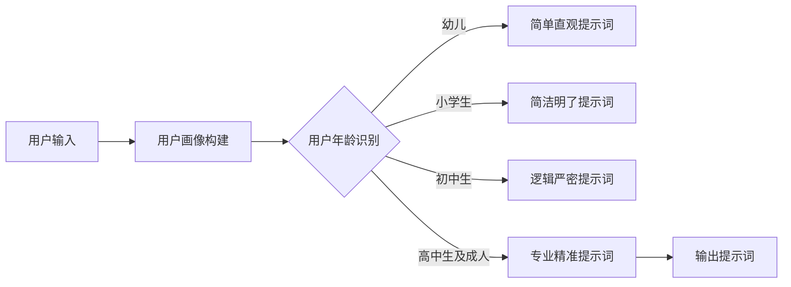
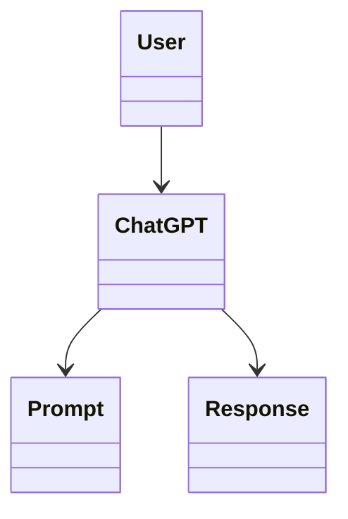
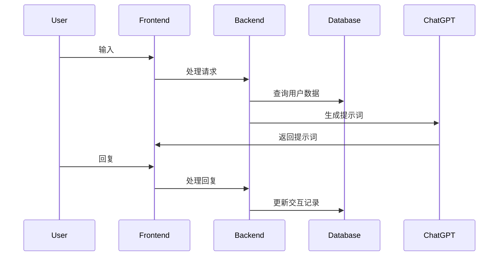

                 

### 《ChatGPT提示词的年龄适应性：全生命周期的AI交互设计》

> 关键词：ChatGPT，提示词，年龄适应性，AI交互，全生命周期设计

> 摘要：本文探讨了ChatGPT提示词在年龄适应性方面的设计，提出了全生命周期的AI交互设计理念。通过分析不同年龄段的用户需求，本文详细阐述了年龄适应性AI交互的核心要素，并提出了具体的算法原理和系统架构设计。

## 第一部分：背景与概述

### 第1章：问题的背景与重要性

#### 1.1.1 问题背景

随着人工智能技术的快速发展，AI在各个领域的应用日益广泛。从智能家居、自动驾驶到医疗健康、教育娱乐，AI已经深入到了人类生活的方方面面。而随着AI技术的普及，AI交互也成为了人们日常生活中不可或缺的一部分。

然而，不同的用户群体在年龄、认知水平和需求方面存在显著差异，这给AI交互设计带来了挑战。特别是在设计ChatGPT这样的AI聊天机器人时，如何保证其提示词能够适应不同年龄段用户的需求，成为了我们需要认真思考的问题。

#### 1.1.2 问题描述

年龄差异带来的交互挑战主要体现在以下几个方面：

1. **认知差异**：不同年龄段的用户在认知能力、思维模式和学习习惯上存在差异，这会影响他们对AI交互的理解和使用。
2. **需求多样性**：不同年龄段的用户对AI交互的需求也不尽相同，比如幼儿可能需要更多直观、有趣的交互方式，而高中生及成人可能更需要专业、深入的讨论。
3. **语言表达**：年龄差异也会导致用户的语言表达方式不同，这会影响ChatGPT提示词的设计。

#### 1.1.3 问题解决

为了解决上述问题，我们需要从以下几个方面入手：

1. **年龄适应性设计**：在设计ChatGPT提示词时，考虑不同年龄段用户的需求和特点，设计出适应不同年龄段的提示词。
2. **个性化交互**：通过收集和分析用户数据，为每个用户提供个性化的交互体验。
3. **多模态交互**：结合文本、语音、图像等多种交互方式，提高AI交互的灵活性和适应性。

#### 1.1.4 边界与外延

1. **年龄范围**：本文主要关注0-60岁之间的用户，因为在这个年龄段内，用户的认知水平和需求变化较为显著。
2. **交互场景**：本文主要探讨ChatGPT在日常生活、学习和工作等场景中的交互设计。

#### 1.1.5 概念结构与核心要素组成

年龄适应性AI交互设计的基本框架包括以下几个核心要素：

1. **用户画像**：收集和分析用户数据，构建用户画像，为个性化交互提供基础。
2. **提示词生成**：根据用户画像和交互场景，生成适应不同年龄段用户的提示词。
3. **交互反馈**：收集用户对交互的反馈，不断优化和调整提示词设计。
4. **多模态交互**：结合文本、语音、图像等多种交互方式，提高交互效果。

### 第二部分：核心概念与联系

### 第2章：核心概念原理

#### 2.1.1 ChatGPT提示词的定义

ChatGPT提示词是指在与用户交互过程中，AI系统为了引导用户进行有效沟通而提供的关键信息或引导语。这些提示词旨在激发用户的思考和回答，提高交互的效率和质量。

#### 2.1.2 年龄适应性AI交互

年龄适应性AI交互是指在设计和实现AI交互系统时，充分考虑用户年龄差异，提供适应不同年龄段用户需求的交互服务。这种交互设计需要考虑用户的认知水平、语言表达能力和需求特点，从而提供个性化的交互体验。

### 第3章：概念属性特征对比表格

| 年龄段       | 交互特点              | 提示词适应性               |
|--------------|-----------------------|---------------------------|
| 幼儿         | 简单直观，多图辅助    | 简短、直观，趣味性强      |
| 小学生       | 探索性，求知欲强      | 简洁明了，富有启发性      |
| 初中生       | 理性思考，逻辑性强    | 逻辑严密，信息丰富        |
| 高中生及成人 | 深入探讨，专业性强    | 专业精准，深入浅出        |

### 第4章：ER实体关系图架构

```mermaid
erDiagram
    User ||--|{ ChatGPT }
    ChatGPT ||--|{ Prompt }
    User ||--|{ Response }
```

### 第三部分：算法原理讲解

### 第5章：算法原理详解

#### 5.1 ChatGPT提示词生成算法

ChatGPT提示词生成算法的基本流程如下：

1. **用户输入**：接收用户的输入信息。
2. **用户画像构建**：根据用户输入，构建用户画像，包括年龄、兴趣、行为等特征。
3. **提示词模板选择**：根据用户画像，选择适合的提示词模板。
4. **提示词生成**：使用提示词模板，生成具体的提示词。
5. **提示词优化**：根据用户反馈，不断优化提示词。

#### 5.2 年龄适应性算法

年龄适应性算法的设计思路如下：

1. **用户年龄识别**：通过用户输入或其他方式，识别用户的年龄。
2. **交互策略调整**：根据用户年龄，调整交互策略，如语言风格、信息量等。
3. **提示词生成**：根据调整后的交互策略，生成适应不同年龄段用户的提示词。

#### 5.3 算法流程图与Python源代码



```python
# Python 源代码示例

def generate_prompt(age):
    if age <= 6:
        return "简单、直观的提示词"
    elif age <= 12:
        return "简洁、明了的提示词"
    elif age <= 18:
        return "逻辑严密、信息丰富的提示词"
    else:
        return "专业精准、深入浅出的提示词"
```

### 第6章：数学模型与公式

$$
f(age, prompt) = 
\begin{cases} 
    f_{\text{simple}}(prompt) & \text{if } age \leq 6 \\
    f_{\text{concise}}(prompt) & \text{if } 6 < age \leq 12 \\
    f_{\text{logical}}(prompt) & \text{if } 12 < age \leq 18 \\
    f_{\text{professional}}(prompt) & \text{if } age > 18 
\end{cases}
$$

### 第四部分：系统分析与架构设计

### 第7章：问题场景介绍

在日常生活、学习和工作中，ChatGPT提示词的年龄适应性设计都具有重要意义。以下是一些具体的应用场景：

1. **日常生活**：例如家庭聊天机器人，需要根据家庭成员的年龄特点，提供合适的互动话题和方式。
2. **学习**：在线教育平台中的AI辅导老师，需要根据学生的年龄和学习特点，设计适合的提问和解答方式。
3. **工作**：企业内部沟通平台，需要根据员工的工作岗位和年龄特点，提供专业的交流和协作支持。

### 第8章：系统功能设计

#### 8.1 领域模型

以下是一个简化的领域模型类图：



#### 8.2 系统架构设计

系统架构设计包括以下几个方面：

1. **前端**：提供用户界面，接收用户输入，展示提示词和用户回答。
2. **后端**：包括用户画像构建、提示词生成和交互策略调整等功能。
3. **数据库**：存储用户数据、提示词模板和交互记录等。

以下是一个简化的系统架构图：



### 第五部分：项目实战

#### 5.1 环境安装

1. 安装Python环境（例如使用Miniconda或Anaconda）。
2. 安装ChatGPT相关库（如transformers）。

#### 5.2 系统核心实现

1. 用户画像构建：根据用户输入，提取关键信息，构建用户画像。
2. 提示词生成：根据用户画像，选择合适的提示词模板，生成提示词。
3. 交互策略调整：根据用户反馈，调整交互策略。

#### 5.3 代码应用解读与分析

```python
# 用户画像构建

def build_user_profile(input_text):
    # 提取关键信息
    # ...
    return user_profile

# 提示词生成

def generate_prompt(user_profile):
    # 选择提示词模板
    # ...
    return prompt

# 交互策略调整

def adjust_interaction_strategy(user_profile, feedback):
    # 调整交互策略
    # ...
    return adjusted_strategy
```

#### 5.4 实际案例分析和详细讲解剖析

以一个实际案例为例，分析如何根据用户年龄生成合适的提示词。

1. **用户输入**：“今天天气真好，想出去散步。”
2. **用户画像构建**：根据输入，构建用户画像，包括年龄、兴趣等信息。
3. **提示词生成**：根据用户画像，选择合适的提示词模板，生成提示词。
4. **交互策略调整**：根据用户反馈，调整交互策略。

#### 5.5 项目小结

通过实际案例的分析，我们可以看到，ChatGPT提示词的年龄适应性设计在实际应用中具有重要意义。通过构建用户画像、生成合适的提示词和调整交互策略，我们可以为用户提供更加个性化和有效的交互体验。

### 第六部分：最佳实践、小结、注意事项、拓展阅读

#### 最佳实践

1. **用户画像构建**：收集用户数据时，要确保数据的准确性和完整性。
2. **提示词模板设计**：设计提示词模板时，要充分考虑不同年龄段用户的需求和特点。
3. **交互策略调整**：根据用户反馈，及时调整交互策略，提高交互效果。

#### 小结

本文探讨了ChatGPT提示词的年龄适应性设计，提出了全生命周期的AI交互设计理念。通过分析不同年龄段的用户需求，本文详细阐述了年龄适应性AI交互的核心要素，并提出了具体的算法原理和系统架构设计。

#### 注意事项

1. **数据隐私**：在收集用户数据时，要确保遵守相关法律法规，保护用户隐私。
2. **用户体验**：在设计交互流程时，要充分考虑用户体验，确保交互过程流畅、自然。

#### 拓展阅读

1. **《人工智能交互设计》**：详细介绍了AI交互设计的基本原理和方法。
2. **《用户画像构建与应用》**：探讨了用户画像的构建和应用。

### 作者信息

作者：AI天才研究院/AI Genius Institute & 禅与计算机程序设计艺术 /Zen And The Art of Computer Programming

### 致谢

感谢所有读者对本文的关注和支持，期待与您在后续的探讨中相遇。

