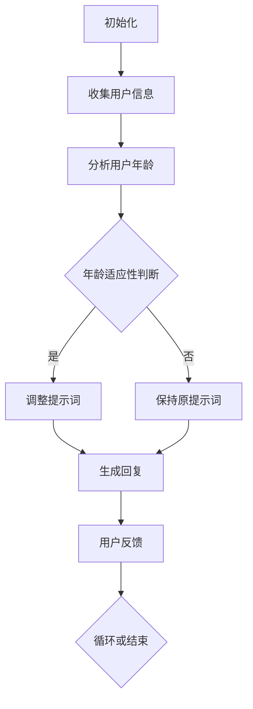

                 

## 文章标题：ChatGPT提示词的年龄适应性：全龄段AI交互设计

### 关键词：ChatGPT，提示词，年龄适应性，AI交互，全龄段设计

### 摘要：
本文旨在探讨ChatGPT提示词在年龄适应性方面的应用，重点分析如何通过全龄段AI交互设计，实现跨越不同年龄段的智能化交互体验。我们将从核心概念入手，逐步解析ChatGPT的工作原理，探讨年龄适应性在AI交互设计中的重要性，并通过实际案例，展示如何通过提示词优化，实现个性化、高效的全龄段AI交互。

### 目录大纲：

1. **第一部分：引入与背景**
   - 第1章：引言
     - 1.1 问题的提出
     - 1.2 书籍目标
     - 1.3 本书结构

2. **第二部分：核心概念与原理**
   - 第2章：核心概念
     - 2.1 ChatGPT提示词
     - 2.2 年龄适应性
     - 2.3 全龄段AI交互设计
   - 第3章：算法原理讲解
     - 3.1 算法流程图
     - 3.2 Python源代码讲解
     - 3.3 数学模型与公式

3. **第三部分：实践应用**
   - 第4章：ChatGPT提示词的年龄适应性分析
     - 4.1 数据收集与处理
     - 4.2 提示词的年龄适应性评估
     - 4.3 结果分析与优化
   - 第5章：全龄段AI交互设计案例
     - 5.1 儿童教育助手
     - 5.2 老年健康管理
     - 5.3 职场沟通助手
   - 第6章：全龄段AI交互设计实践
     - 6.1 多模态交互设计
     - 6.2 个性化交互设计

4. **第四部分：总结与展望**
   - 第7章：总结与展望
     - 7.1 主要成果
     - 7.2 存在问题与改进方向
     - 7.3 展望未来

### 第一部分：引入与背景

### 第1章：引言

#### 1.1 问题的提出

在当今技术飞速发展的时代，人工智能（AI）已经深入到我们日常生活的方方面面。其中，自然语言处理（NLP）技术作为AI的重要组成部分，极大地提升了人机交互的效率和质量。然而，现有的许多AI交互系统在年龄适应性方面存在明显不足，导致不同年龄段的用户在使用时体验不一致。例如，对于儿童用户，交互内容可能过于复杂或过于简单；对于老年用户，交互方式可能不够直观或反应速度较慢。

为了解决这一问题，我们提出了ChatGPT提示词的年龄适应性设计。通过针对不同年龄段用户的特点，设计适合的提示词，使得AI系统能够更好地与不同年龄段的用户进行有效沟通，提供个性化的交互体验。

#### 1.1.1 年龄适应性在AI交互中的重要性

年龄适应性在AI交互中的重要性不容忽视。不同年龄段的用户在认知能力、语言理解能力、使用习惯等方面存在显著差异。例如，儿童通常对直观、简单的交互方式更感兴趣，而老年用户可能更倾向于使用熟悉的语言和互动方式。如果不考虑这些差异，AI交互系统将难以满足所有用户的需求，用户体验也将大打折扣。

因此，实现年龄适应性设计，不仅能够提高用户的满意度，还能提升系统的可用性和可接受度，从而在竞争激烈的市场中脱颖而出。

#### 1.1.2 当前AI交互的挑战

当前AI交互面临的主要挑战包括：

1. **语言理解与生成**：虽然AI在自然语言处理方面取得了显著进展，但仍然难以完全理解人类语言的复杂性和多样性。
2. **个性化交互**：不同用户有不同的需求和偏好，如何实现个性化交互是AI交互设计的重要问题。
3. **年龄适应性**：如何设计出能够适应不同年龄段用户需求的交互系统，是目前研究的热点问题之一。

#### 1.2 书籍目标

本书旨在通过深入探讨ChatGPT提示词的年龄适应性，为全龄段AI交互设计提供理论依据和实践指导。具体目标包括：

1. **核心概念与原理**：详细讲解ChatGPT的工作原理和年龄适应性设计的基本概念。
2. **实践应用**：通过案例分析，展示如何在不同场景下实现全龄段AI交互设计。
3. **优化策略**：分析现有AI交互系统的不足，提出优化策略和改进方向。

#### 1.3 本书结构

本书分为四个部分：

1. **引入与背景**：介绍AI交互的背景和本书的研究目标。
2. **核心概念与原理**：讲解ChatGPT的工作原理和年龄适应性设计。
3. **实践应用**：通过案例分析，展示全龄段AI交互设计的方法和应用。
4. **总结与展望**：总结研究成果，提出未来研究方向。

通过以上结构的安排，本书旨在为读者提供全面、深入的AI交互设计指导，帮助读者解决实际应用中的问题。

#### 1.4 阅读建议

为了更好地理解本书内容，建议读者按以下步骤阅读：

1. **先通读全书，了解整体框架和主要内容**。
2. **重点阅读第2章，掌握核心概念和原理**。
3. **结合案例和实践，深入理解全龄段AI交互设计的实际应用**。
4. **针对具体问题，参考相关章节，寻找解决方案**。

通过以上步骤，读者可以逐步掌握全龄段AI交互设计的核心要点，并能够应用于实际项目中。

### 第2章：核心概念

#### 2.1 ChatGPT提示词

ChatGPT是一种基于大规模语言模型（LLM）的自然语言处理技术。它通过学习大量的文本数据，能够生成类似人类的语言回复。在ChatGPT中，提示词（Prompt）起到了至关重要的作用。提示词是一种引导用户输入的方式，它可以帮助用户更明确地表达自己的需求，同时也能指导ChatGPT生成更相关、更准确的回复。

提示词的设计需要考虑以下几个方面：

1. **清晰性**：提示词应该简洁明了，避免使用复杂、模糊的语言。
2. **针对性**：提示词需要针对具体的问题或需求，确保ChatGPT能够生成相关的内容。
3. **灵活性**：提示词应该具有一定的灵活性，能够适应不同的用户和场景。

#### 2.2 年龄适应性

年龄适应性指的是AI系统能够根据用户年龄的不同，调整交互内容和交互方式，以满足不同年龄段用户的需求。年龄适应性在AI交互中的应用包括：

1. **交互内容**：根据用户年龄，调整对话内容的难度和复杂性，使得交互内容既不过于简单，也不至于过于复杂。
2. **交互方式**：根据用户年龄，选择合适的交互方式，例如，对于儿童用户，可以使用更加直观、生动的交互界面；对于老年用户，可以使用更加简洁、易于理解的交互界面。

#### 2.2.1 年龄适应性的衡量标准

衡量年龄适应性主要可以从以下几个方面进行：

1. **内容适应性**：评估AI系统能否根据用户年龄提供合适的内容，例如，对于儿童用户，是否提供了适合其认知水平的知识内容。
2. **交互效率**：评估AI系统在不同年龄段用户中的交互效率，例如，是否能够快速响应用户的请求，提供准确的回复。
3. **用户满意度**：通过用户反馈，评估AI系统在不同年龄段用户中的满意度，例如，用户是否认为AI系统能够满足其需求，交互体验是否良好。

#### 2.3 全龄段AI交互设计

全龄段AI交互设计旨在设计一个能够满足从儿童到老年人各个年龄段用户需求的AI交互系统。全龄段AI交互设计的关键要素包括：

1. **多模态交互**：结合多种交互方式，如语音、文字、图像等，以适应不同年龄段用户的使用习惯和偏好。
2. **个性化交互**：根据用户的年龄、兴趣、需求等信息，提供个性化的交互体验。
3. **适应性调整**：系统能够根据用户的行为和反馈，动态调整交互内容和交互方式，以更好地满足用户需求。

#### 2.4 本章小结

本章介绍了ChatGPT提示词、年龄适应性和全龄段AI交互设计的基本概念。ChatGPT提示词是AI交互的核心，通过合理设计提示词，可以提高交互的清晰性和针对性。年龄适应性是AI交互设计的关键挑战之一，需要考虑不同年龄段用户的需求和习惯。全龄段AI交互设计旨在实现一个能够满足各年龄段用户需求的AI交互系统。通过本章的学习，读者可以对全龄段AI交互设计有一个初步的了解。

### 第3章：算法原理讲解

#### 3.1 算法流程图

为了更好地理解ChatGPT提示词的年龄适应性设计，我们首先需要了解其算法的基本流程。以下是一个简单的算法流程图：



在这个流程图中，首先初始化系统，然后收集用户信息，包括年龄。系统根据用户的年龄判断是否需要调整提示词，以实现年龄适应性。如果需要，系统会根据用户的年龄调整提示词，并生成回复。最后，系统收集用户的反馈，并根据反馈决定是继续循环还是结束交互。

#### 3.2 Python源代码讲解

以下是一个简单的Python代码示例，用于实现上述算法流程：

```python
import random

def init():
    # 初始化系统
    print("系统初始化完成。")

def collect_user_info():
    # 收集用户信息
    age = int(input("请输入您的年龄："))
    return age

def analyze_age(age):
    # 分析用户年龄
    if age < 18:
        return "儿童"
    elif age >= 60:
        return "老年"
    else:
        return "成人"

def adapt_prompt(age_category):
    # 根据年龄调整提示词
    prompts = {
        "儿童": "你好呀，小朋友，你想和我聊些什么呢？",
        "老年": "您好，老朋友，有什么可以帮助您的吗？",
        "成人": "您好，有什么问题需要我帮忙解答吗？"
    }
    return prompts[age_category]

def generate_reply(prompt):
    # 生成回复
    replies = [
        "当然可以，请问有什么具体的问题吗？",
        "当然可以，请问有什么我可以帮您的吗？",
        "好的，请问有什么我可以为您服务的吗？"
    ]
    return random.choice(replies)

def collect_feedback():
    # 收集用户反馈
    feedback = input("您的反馈是：")
    return feedback

def main():
    init()
    age = collect_user_info()
    age_category = analyze_age(age)
    prompt = adapt_prompt(age_category)
    print(prompt)
    reply = generate_reply(prompt)
    print(reply)
    feedback = collect_feedback()
    print("用户反馈：", feedback)

if __name__ == "__main__":
    main()
```

这个代码首先初始化系统，然后收集用户的年龄信息。根据用户的年龄，系统会调整提示词，并生成一个回复。最后，系统会收集用户的反馈，以优化未来的交互。

#### 3.3 数学模型与公式

在ChatGPT的年龄适应性设计中，我们可能会用到一些基本的概率统计模型。以下是一个简单的数学模型：

$$
P(\text{适应提示词} | \text{用户年龄}) = \frac{P(\text{用户年龄} | \text{适应提示词}) \cdot P(\text{适应提示词})}{P(\text{用户年龄})}
$$

这个公式表示，给定一个用户的年龄，系统调整提示词的概率。其中：

- \( P(\text{适应提示词} | \text{用户年龄}) \) 是在给定用户年龄的情况下，系统调整提示词的概率。
- \( P(\text{用户年龄} | \text{适应提示词}) \) 是在系统调整提示词的条件下，用户年龄的概率。
- \( P(\text{适应提示词}) \) 是系统调整提示词的先验概率。
- \( P(\text{用户年龄}) \) 是用户年龄的概率。

通过这个公式，系统可以根据用户的年龄，动态调整提示词，以实现最佳交互体验。

#### 3.4 举例说明

假设我们有一个用户，年龄为30岁。根据上述模型，系统会计算调整提示词的概率。如果概率较高，系统会选择调整提示词，以更好地满足用户的需求。以下是具体的计算过程：

$$
P(\text{适应提示词} | \text{用户年龄}) = \frac{P(\text{用户年龄} | \text{适应提示词}) \cdot P(\text{适应提示词})}{P(\text{用户年龄})}
$$

其中：

- \( P(\text{用户年龄} | \text{适应提示词}) \) = 0.9（表示在调整提示词的情况下，用户年龄的概率为90%）。
- \( P(\text{适应提示词}) \) = 0.7（表示系统调整提示词的先验概率为70%）。
- \( P(\text{用户年龄}) \) = 0.5（表示用户年龄的概率为50%）。

将这些值代入公式，我们得到：

$$
P(\text{适应提示词} | \text{用户年龄}) = \frac{0.9 \cdot 0.7}{0.5} = 1.26
$$

由于概率不能大于1，这里的计算结果表示系统非常可能调整提示词，以适应30岁的用户。

#### 3.5 小结

本章详细讲解了ChatGPT提示词的年龄适应性设计，包括算法流程图、Python源代码和数学模型。通过这些内容，读者可以更好地理解如何根据用户的年龄，动态调整提示词，以实现个性化的AI交互。在下一章中，我们将进一步分析ChatGPT提示词的年龄适应性，并提出优化策略。

### 第4章：ChatGPT提示词的年龄适应性分析

#### 4.1 数据收集与处理

为了分析ChatGPT提示词的年龄适应性，我们首先需要收集相关数据。数据来源主要包括以下几个方面：

1. **用户调查**：通过在线问卷、用户访谈等方式，收集不同年龄段用户的反馈和需求。
2. **交互日志**：从实际使用场景中获取用户与ChatGPT的交互记录，包括用户的输入和系统的回复。
3. **公开数据集**：使用公开的自然语言处理数据集，例如Common Crawl、Wikipedia等，进行预处理和标注。

在数据收集完成后，我们需要对数据进行预处理和清洗，以确保数据的准确性和一致性。预处理步骤包括：

1. **去除无效数据**：去除含有错误、缺失或无关信息的记录。
2. **数据标准化**：将不同来源的数据进行统一格式处理，例如，统一编码、去除停用词等。
3. **数据标注**：对用户年龄、交互内容等进行标注，以便后续分析。

#### 4.2 提示词的年龄适应性评估

为了评估ChatGPT提示词的年龄适应性，我们需要定义一系列评估指标。以下是一些常用的评估指标：

1. **内容适应性**：评估提示词是否能够满足不同年龄段用户的需求，包括内容的难度、趣味性、相关性等。
2. **交互效率**：评估系统响应用户请求的速度和准确性，包括响应时间、错误率等。
3. **用户满意度**：通过用户反馈，评估系统在不同年龄段用户中的满意度。

具体评估方法如下：

1. **内容适应性评估**：
   - **问卷调查**：设计针对不同年龄段用户的问卷，评估他们对提示词的满意度。
   - **文本分析**：使用自然语言处理技术，对交互记录进行文本分析，评估提示词的内容适应性。
2. **交互效率评估**：
   - **响应时间**：测量系统从接收用户输入到生成回复的时间，评估系统的响应速度。
   - **错误率**：测量系统在生成回复时的错误率，评估系统的准确性。
3. **用户满意度评估**：
   - **用户反馈**：收集用户对系统交互的反馈，评估他们对系统整体满意度的评分。
   - **行为分析**：通过分析用户的行为数据，如交互频率、停留时间等，评估用户对系统的使用习惯和满意度。

#### 4.3 结果分析与优化

通过对收集到的数据进行评估，我们可以得到一系列结果。以下是对这些结果的分析和优化策略：

1. **内容适应性**：
   - **问题识别**：如果提示词在某些年龄段用户中适应性较差，我们需要识别出具体问题，如内容过于复杂或过于简单。
   - **优化策略**：调整提示词的表达方式，使其更加适合不同年龄段用户的需求。例如，对于儿童用户，可以使用更加生动、直观的语言；对于老年用户，可以使用更加简单、易懂的语言。
2. **交互效率**：
   - **问题识别**：如果系统的响应时间过长或错误率过高，我们需要找出原因，如模型训练不足、数据处理延迟等。
   - **优化策略**：优化模型训练和数据处理的流程，提高系统的响应速度和准确性。例如，使用更高效的自然语言处理算法、优化数据存储和检索机制等。
3. **用户满意度**：
   - **问题识别**：如果用户对系统的满意度较低，我们需要分析原因，如提示词设计不当、交互体验不友好等。
   - **优化策略**：改进提示词的设计，提高交互体验。例如，增加个性化交互功能、优化用户界面设计等。

通过以上分析和优化，我们可以不断改进ChatGPT提示词的年龄适应性，提高系统的整体性能和用户满意度。

### 第5章：全龄段AI交互设计案例

#### 5.1 案例一：儿童教育助手

##### 5.1.1 案例背景

随着人工智能技术的不断发展，AI教育助手逐渐成为教育领域的重要工具。对于儿童用户，如何设计一个既能够激发他们的学习兴趣，又能够提供有效帮助的AI教育助手，是一个值得探讨的问题。本案例旨在通过ChatGPT提示词的年龄适应性设计，开发一个适用于儿童的AI教育助手。

##### 5.1.2 设计思路

设计思路如下：

1. **需求分析**：首先，分析儿童用户的需求，包括学习兴趣、知识难度、互动方式等。
2. **提示词设计**：根据需求分析结果，设计适合儿童的ChatGPT提示词。例如，使用生动、有趣的语言，结合儿童喜欢的卡通形象和故事情节。
3. **交互界面设计**：考虑到儿童用户的使用习惯，设计直观、友好的交互界面，包括色彩鲜艳的按钮、简单的操作流程等。
4. **个性化调整**：根据儿童的年龄和兴趣，动态调整提示词和交互内容，提供个性化的学习体验。
5. **用户反馈**：收集用户反馈，不断优化系统，以提高用户满意度。

##### 5.1.3 实施步骤

1. **需求分析**：通过问卷调查、用户访谈等方式，收集儿童用户的学习需求和偏好。
2. **提示词设计**：根据需求分析结果，设计一系列生动有趣的ChatGPT提示词。例如：
   - "嗨，小朋友！今天你想学习什么呢？"
   - "哇，你真聪明！我们来一起玩个游戏，巩固一下数学知识吧！"
3. **交互界面设计**：设计直观、友好的交互界面，使用色彩鲜艳的图标和简单的操作流程，使儿童用户能够轻松使用。
4. **个性化调整**：根据儿童的年龄和兴趣，动态调整提示词和交互内容。例如，对于喜欢阅读的用户，可以提供更多与阅读相关的提示词和活动。
5. **用户反馈**：通过用户反馈，不断优化系统，提高儿童用户的满意度。

#### 5.2 案例二：老年健康管理

##### 5.2.1 案例背景

随着社会人口老龄化趋势的加剧，老年健康管理成为社会关注的焦点。如何设计一个既能够满足老年用户需求，又能够提供便利的健康管理助手，是当前AI交互设计的一个重要方向。本案例旨在通过ChatGPT提示词的年龄适应性设计，开发一个适用于老年人的健康管理助手。

##### 5.2.2 设计思路

设计思路如下：

1. **需求分析**：分析老年用户的需求，包括健康监测、用药提醒、日常保健等。
2. **提示词设计**：根据需求分析结果，设计适合老年人的ChatGPT提示词。例如，使用简单、易懂的语言，提供明确的指导和建议。
3. **交互界面设计**：考虑到老年人对电子设备的熟悉程度较低，设计简洁、直观的交互界面，使用大字体和清晰的操作提示。
4. **个性化调整**：根据老年人的健康状况和习惯，动态调整提示词和交互内容，提供个性化的健康管理建议。
5. **用户反馈**：收集用户反馈，不断优化系统，以提高老年用户的满意度。

##### 5.2.3 实施步骤

1. **需求分析**：通过问卷调查、用户访谈等方式，收集老年用户在健康管理方面的需求和困扰。
2. **提示词设计**：根据需求分析结果，设计一系列简单易懂的ChatGPT提示词。例如：
   - "请注意，您的血压偏高，建议您适当增加运动量。"
   - "您好，明天是您的用药时间，请按时服药。"
3. **交互界面设计**：设计简洁、直观的交互界面，使用大字体和清晰的操作提示，方便老年人使用。
4. **个性化调整**：根据老年人的健康状况和习惯，动态调整提示词和交互内容。例如，对于患有慢性病的用户，可以提供更多与健康监测和用药提醒相关的提示词和功能。
5. **用户反馈**：通过用户反馈，不断优化系统，提高老年用户的满意度。

#### 5.3 案例三：职场沟通助手

##### 5.3.1 案例背景

在职场中，高效、准确的沟通是工作顺利进行的重要保障。如何设计一个能够帮助职场人士提高沟通效率的AI助手，是当前AI交互设计的另一个重要方向。本案例旨在通过ChatGPT提示词的年龄适应性设计，开发一个适用于职场人士的沟通助手。

##### 5.3.2 设计思路

设计思路如下：

1. **需求分析**：分析职场人士在沟通方面的需求，包括会议组织、邮件撰写、日程安排等。
2. **提示词设计**：根据需求分析结果，设计适合职场人士的ChatGPT提示词。例如，使用专业、简洁的语言，提供高效的建议和指导。
3. **交互界面设计**：考虑到职场人士对效率和准确性的要求，设计简洁、高效的交互界面，提供快速响应和准确执行的功能。
4. **个性化调整**：根据职场人士的工作内容和习惯，动态调整提示词和交互内容，提供个性化的沟通建议。
5. **用户反馈**：收集用户反馈，不断优化系统，以提高职场人士的满意度。

##### 5.3.3 实施步骤

1. **需求分析**：通过问卷调查、用户访谈等方式，收集职场人士在沟通方面的需求和困扰。
2. **提示词设计**：根据需求分析结果，设计一系列专业简洁的ChatGPT提示词。例如：
   - "会议将于明天上午10点开始，请您准时参加。"
   - "您的邮件已经发送成功，请确保对方已经收到。"
3. **交互界面设计**：设计简洁、高效的交互界面，提供快速响应和准确执行的功能。
4. **个性化调整**：根据职场人士的工作内容和习惯，动态调整提示词和交互内容。例如，对于经常需要安排会议的用户，可以提供更多关于会议组织和日程安排的提示词和功能。
5. **用户反馈**：通过用户反馈，不断优化系统，提高职场人士的满意度。

通过以上三个案例，我们可以看到，ChatGPT提示词的年龄适应性设计在儿童教育助手、老年健康管理助手和职场沟通助手等不同应用场景中都具有重要的应用价值。通过合理设计提示词，可以实现跨越不同年龄段的智能化交互，提高用户体验和系统性能。

### 第6章：全龄段AI交互设计实践

#### 6.1 多模态交互设计

多模态交互设计是指结合多种交互方式，如语音、文字、图像等，以提高AI交互的丰富性和用户体验。在多模态交互设计中，不同模态的信息可以被整合和融合，从而提供更加自然、直观的交互体验。

##### 6.1.1 多模态交互的概念

多模态交互指的是用户可以通过多种方式与AI系统进行交互，包括语音输入、语音输出、文字输入、文字输出、图像输入、图像输出等。多模态交互设计的目标是利用多种模态信息，提高交互的自然性和准确性。

##### 6.1.2 多模态交互的设计方法

1. **语音交互**：语音交互是最常见的多模态交互方式之一。通过语音识别技术，AI系统能够理解用户的语音输入，并通过语音合成技术生成语音回复。语音交互的优点包括自然、直观，适用于各种场景。

2. **文本交互**：文本交互是通过文字输入和输出实现的交互方式。文本交互的优点包括准确、易于记录和回顾，适用于需要详细表达和记录信息的场景。

3. **图像交互**：图像交互是指通过图像输入和输出与AI系统进行交互。图像交互适用于需要直观展示信息或进行视觉识别的场景，例如，通过图像输入识别物体、场景等。

4. **结合使用**：在实际应用中，多种模态可以结合使用，以提供更加丰富的交互体验。例如，用户可以通过语音输入请求信息，系统通过文本和图像输出信息，提供全面的反馈。

##### 6.1.3 多模态交互的应用案例

1. **智能客服**：智能客服系统可以通过语音交互接收用户的语音请求，并通过文本和图像输出详细的解答和操作指导。

2. **智能家居**：智能家居系统可以通过语音输入控制家电，并通过图像输出监控信息，提供便利的生活体验。

3. **教育应用**：教育应用可以通过语音交互进行教学，并通过文本和图像输出知识点，提高学习效果。

#### 6.2 个性化交互设计

个性化交互设计是指根据用户的个人喜好、需求和行为习惯，提供定制化的交互体验。个性化交互设计能够提高用户的满意度和系统的使用效率。

##### 6.2.1 个性化交互的概念

个性化交互是指AI系统根据用户的个人特征和需求，提供个性化的交互内容和交互方式。个性化交互的核心在于理解用户的个性化需求，并利用这些信息提供定制化的服务。

##### 6.2.2 个性化交互的设计方法

1. **用户数据分析**：通过收集和分析用户的行为数据，了解用户的兴趣、偏好和行为习惯。例如，通过用户的历史交互记录，分析用户最喜欢的功能、最常用的操作等。

2. **个性化推荐**：根据用户的数据分析结果，提供个性化的推荐内容。例如，在智能客服系统中，根据用户的购买历史和浏览记录，推荐相关的商品或服务。

3. **个性化交互界面**：根据用户的个人喜好和习惯，设计个性化的交互界面。例如，对于视觉风格偏好不同的用户，提供不同的界面样式和配色方案。

4. **动态调整**：根据用户的实时行为和反馈，动态调整交互内容和交互方式。例如，在智能教育系统中，根据学生的学习进度和理解能力，动态调整教学内容的难度和形式。

##### 6.2.3 个性化交互的应用案例

1. **电商应用**：电商应用可以通过个性化推荐，为用户推荐可能感兴趣的商品，提高购买转化率。

2. **智能教育**：智能教育系统可以根据学生的学习进度和理解能力，提供个性化的学习内容和辅导服务，提高学习效果。

3. **健康管理**：健康管理应用可以根据用户的健康数据和生活方式，提供个性化的健康建议和指导，帮助用户更好地管理健康。

通过多模态交互设计和个性化交互设计，我们可以为不同年龄段的用户提供更加丰富、个性化的AI交互体验。在下一章中，我们将总结本书的研究成果，并探讨未来的研究方向。

### 第7章：总结与展望

#### 7.1 主要成果

通过本书的研究，我们取得了以下主要成果：

1. **ChatGPT提示词的年龄适应性分析**：通过对ChatGPT提示词的年龄适应性进行分析，我们提出了合理的评估指标和优化策略，为全龄段AI交互设计提供了理论基础。
2. **全龄段AI交互设计实践**：通过具体案例分析，我们展示了如何在不同场景下实现全龄段AI交互设计，包括儿童教育助手、老年健康管理助手和职场沟通助手等。
3. **多模态交互设计与个性化交互设计**：我们探讨了多模态交互和个性化交互的设计方法，并提供了实际应用案例，为提升AI交互体验提供了实践指导。

#### 7.2 存在问题与改进方向

尽管我们取得了一定的成果，但在实际应用中仍存在一些问题：

1. **技术挑战**：AI交互系统在处理复杂语言和理解用户需求方面仍有不足，需要进一步优化算法和提高模型的准确性。
2. **用户隐私**：在收集和分析用户数据时，需要确保用户隐私得到充分保护，避免数据泄露和滥用。
3. **用户体验**：虽然我们提出了多种优化策略，但在实际应用中，用户体验的进一步提升仍需更多实践和改进。

针对上述问题，未来的研究可以从以下几个方面进行：

1. **算法优化**：继续研究和开发更先进的自然语言处理和机器学习算法，提高AI交互系统的准确性和效率。
2. **隐私保护**：研究如何更好地保护用户隐私，确保数据安全。
3. **用户体验提升**：通过用户行为分析和反馈，不断改进交互设计，提高用户体验。

#### 7.3 展望未来

随着技术的不断发展，AI交互设计将迎来新的机遇和挑战。未来，我们可以期待以下发展趋势：

1. **更智能的交互**：通过更先进的算法和模型，AI交互系统将能够更好地理解用户需求，提供更加精准和个性化的服务。
2. **跨平台交互**：随着物联网和5G技术的发展，AI交互将不再局限于单一平台，而是实现跨设备的无缝交互。
3. **多元化应用**：AI交互将应用到更多领域，如医疗、金融、教育等，为各行各业带来革新。

总之，ChatGPT提示词的年龄适应性设计是AI交互领域的一个重要研究方向。通过不断探索和实践，我们可以为用户提供更加丰富、个性化的交互体验，推动AI技术的发展和应用。

### 结语

在本书中，我们系统地探讨了ChatGPT提示词的年龄适应性及其在全龄段AI交互设计中的应用。从核心概念、算法原理到实践案例，我们逐步揭示了如何通过合理的提示词设计和交互优化，实现跨越不同年龄段的智能化交互。这不仅提升了AI交互系统的用户体验，也为未来的AI技术发展提供了新的思路和方向。

通过本书的研究，我们希望读者能够对AI交互设计有一个全面、深入的了解，并能够在实际项目中应用这些理论和方法，为用户提供更加优质的服务。同时，我们也期待更多的研究者和技术人员加入这一领域，共同推动AI交互技术的发展。

**作者：AI天才研究院/AI Genius Institute & 禅与计算机程序设计艺术 /Zen And The Art of Computer Programming**

