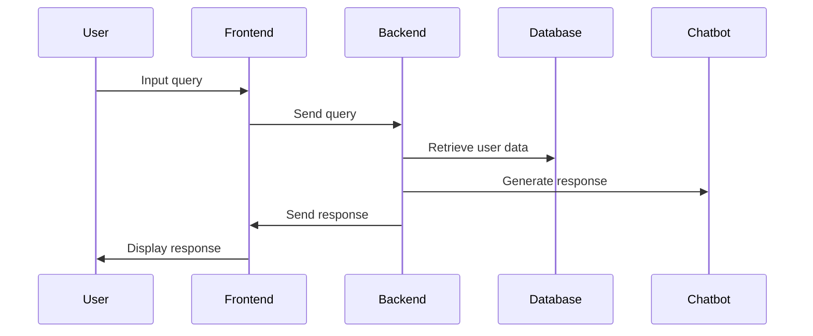
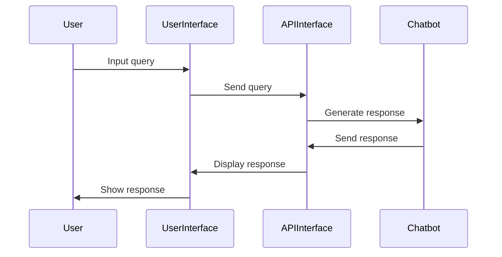

                 

### ChatGPT提示词的性别中立性：消除AI偏见的策略

在人工智能（AI）迅猛发展的时代，ChatGPT作为一款先进的自然语言处理模型，已经在多个领域展现出强大的应用潜力。然而，随着其广泛应用，一个不容忽视的问题也逐渐浮现——性别中立性。AI系统中的性别偏见不仅影响了用户的使用体验，还可能加剧性别不平等现象。本文将深入探讨ChatGPT提示词的性别中立性问题，并提出一系列策略来消除AI偏见。

#### 关键词

- **ChatGPT**
- **性别中立性**
- **AI偏见**
- **自然语言处理**
- **算法设计**
- **训练数据**

#### 摘要

本文首先介绍了AI性别偏见问题的背景和影响，随后详细分析了ChatGPT提示词中的性别中立性问题。通过逐步分析，我们探讨了数据偏差、算法设计和模型训练等多个方面的影响因素。接着，本文提出了几种有效的策略，包括数据平衡、算法调整和模型训练等，旨在提高ChatGPT的性别中立性。最后，本文通过一个实际案例，展示了这些策略的具体应用和效果。

### 第一部分：背景介绍

#### 1.1 问题背景

随着AI技术的飞速发展，自然语言处理（NLP）模型如ChatGPT在各个领域得到了广泛应用。然而，这些模型在处理性别相关问题时，往往表现出性别偏见。这种偏见可能源于训练数据的不均衡、算法设计的不完善，或是模型对性别特征的过度依赖。例如，一些AI系统在处理性别相关任务时，可能对男性用户更加友好，而对女性用户则存在不公平待遇。这种性别偏见不仅损害了用户体验，还可能加剧社会性别不平等。

#### 1.2 问题描述

性别偏见在AI系统中表现为以下几种形式：

- **语言偏好**：一些AI系统可能在处理语言时，对男性用户和女性用户表现出不同的响应。例如，对男性用户的问题可能给出更加详细和复杂的回答，而对女性用户的问题则可能显得简单和模糊。
- **角色设定**：AI系统中的角色设定可能倾向于男性角色，这会导致用户在与AI互动时，对女性角色的期望值降低。
- **推荐系统**：在推荐系统中，可能存在性别偏见，导致对男性用户的推荐更加多样化，而对女性用户的推荐则更加单一。

#### 1.3 问题解决

解决AI性别偏见问题的方法可以从多个角度入手：

- **数据平衡**：确保训练数据中男性和女性的比例均衡，以避免模型在训练过程中引入性别偏见。
- **算法改进**：改进算法设计，使模型在处理性别相关任务时，能够更加公平和中立。
- **模型训练**：通过增加多样化的训练数据，提高模型的性别中立性。
- **用户反馈**：收集用户反馈，及时调整和优化模型，消除性别偏见。

#### 1.4 边界与外延

本文主要探讨自然语言处理和推荐系统等场景中的AI性别偏见问题。同时，本文还将探讨与性别偏见相关的社会问题，如性别歧视和性别角色刻板印象等。此外，本文将介绍一些与性别中立性评估方法、消除偏见的技术策略，以及这些策略的实际应用案例。

#### 1.5 概念结构与核心要素组成

本文的核心概念包括性别偏见、中立性、训练数据偏差、算法设计、模型训练等。核心要素包括性别中立性评估方法、消除偏见的技术策略、性别偏见的社会影响等。本文将通过详细的案例分析，探讨这些核心概念和要素在实际应用中的具体表现和解决策略。

## 第二部分：核心概念与联系

### 2.1 性别偏见

性别偏见是指在社会、文化、经济等方面对男性和女性存在不公平待遇的现象。在AI系统中，性别偏见表现为模型对男性和女性用户的处理方式不同。这种偏见可能源于训练数据中的性别偏见，或者算法设计中的性别刻板印象。

### 2.2 中立性

中立性是指系统在处理任务时，不偏袒任何一方，对所有用户一视同仁。在AI系统中，性别中立性是指模型在处理性别相关任务时，不对男性和女性产生不公平待遇。实现性别中立性对于提升用户体验和消除性别不平等具有重要意义。

### 2.3 训练数据偏差

训练数据偏差是指训练数据中存在的性别偏见，这可能导致模型在学习过程中保留并放大这些偏见。例如，如果训练数据中女性样本较少，模型可能倾向于对女性用户表现出不公平待遇。

### 2.4 算法设计

算法设计是影响AI系统性别中立性的关键因素。合理的算法设计可以减少性别偏见，提高模型的性别中立性。例如，通过设计无偏算法，可以避免在模型训练过程中引入性别偏见。

### 2.5 模型训练

模型训练是消除AI性别偏见的重要环节。通过增加多样化的训练数据，提高模型对性别中立性的训练效果。此外，通过定期更新训练数据，可以确保模型始终保持性别中立。

## 第三部分：算法原理讲解

### 3.1 性别中立性评估方法

评估性别中立性是确保AI系统不偏袒任何一方的重要步骤。以下是一些常用的评估方法：

- **统计方法**：通过计算模型在不同性别用户群体中的响应差异，评估模型的性别中立性。例如，可以比较男性和女性用户在相同查询下的响应时间、响应长度和内容差异。
- **机器学习方法**：使用机器学习模型来检测和分类性别偏见，例如通过监督学习算法来识别性别偏见模式。

### 3.2 消除偏见的技术策略

为了消除AI性别偏见，可以采取以下技术策略：

- **数据平衡**：确保训练数据中男性和女性的比例均衡。可以通过数据扩充、数据采样等技术手段来实现。
- **算法调整**：改进算法设计，减少性别偏见。例如，通过引入对抗训练，增强模型的性别中立性。
- **模型训练**：通过增加多样化的训练数据，提高模型对性别中立性的训练效果。此外，可以采用迁移学习等方法，利用已有的无偏见模型来训练新模型。

### 3.3 算法原理详细讲解

#### 3.3.1 统计方法

统计方法主要通过计算模型在不同性别用户群体中的响应差异来评估性别中立性。以下是一个简单的统计方法示例：

```python
def calculate_gender_bias(response_times_men, response_times_women):
    average_response_time_men = sum(response_times_men) / len(response_times_men)
    average_response_time_women = sum(response_times_women) / len(response_times_women)

    bias = abs(average_response_time_men - average_response_time_women)
    return bias
```

这个方法计算了男性和女性用户的平均响应时间，并计算了它们之间的差异。差异值越大，表示性别偏见越严重。

#### 3.3.2 机器学习方法

机器学习方法通过训练模型来检测和分类性别偏见。以下是一个简单的机器学习方法的示例：

```python
from sklearn.model_selection import train_test_split
from sklearn.ensemble import RandomForestClassifier

# 假设我们已经有了性别标签和响应标签的数据集
X = ...  # 特征数据
y = ...  # 性别标签

# 分割数据集
X_train, X_test, y_train, y_test = train_test_split(X, y, test_size=0.2, random_state=42)

# 训练分类器
clf = RandomForestClassifier(n_estimators=100)
clf.fit(X_train, y_train)

# 预测性别偏见
predictions = clf.predict(X_test)

# 评估分类器的性能
accuracy = clf.score(X_test, y_test)
print(f"Accuracy: {accuracy}")
```

这个方法使用随机森林分类器来预测性别偏见，并评估模型的性能。通过调整模型参数和特征选择，可以进一步提高模型的性能。

### 3.4 数学模型和数学公式

为了更深入地理解性别中立性，我们可以使用数学模型来描述和评估它。以下是一个简单的数学模型示例：

$$
\text{Gender Bias Score} = \frac{|\text{Average Response Time}_{\text{men}} - \text{Average Response Time}_{\text{women}}|}{\text{Maximum Possible Response Time}}
$$

这个公式计算了性别偏见分数，它反映了男性和女性用户响应时间之间的差异。分数越高，表示性别偏见越严重。

### 3.5 算法原理举例说明

#### 3.5.1 数据平衡

假设我们有一个包含性别标签和响应标签的数据集，其中男性样本和女性样本的比例不平衡。以下是一个简单的数据平衡方法：

```python
from imblearn.over_sampling import SMOTE

# 加载不平衡数据集
X, y = load_imbalanced_data()

# 使用SMOTE技术进行数据平衡
smote = SMOTE(random_state=42)
X_balanced, y_balanced = smote.fit_resample(X, y)
```

通过SMOTE技术，我们可以增加女性样本的数量，从而使数据集达到平衡。这有助于提高模型对性别中立性的训练效果。

#### 3.5.2 算法调整

假设我们有一个基于神经网络的自然语言处理模型，以下是一个简单的算法调整方法：

```python
from tensorflow.keras.models import Sequential
from tensorflow.keras.layers import Dense, Dropout

# 构建神经网络模型
model = Sequential()
model.add(Dense(128, input_dim=X_balanced.shape[1], activation='relu'))
model.add(Dropout(0.5))
model.add(Dense(1, activation='sigmoid'))

# 编译模型
model.compile(loss='binary_crossentropy', optimizer='adam', metrics=['accuracy'])

# 训练模型
model.fit(X_balanced, y_balanced, epochs=10, batch_size=32, validation_split=0.2)
```

通过增加Dropout层和调整优化器的参数，我们可以减少模型对性别特征的依赖，从而提高性别中立性。

### 3.6 数学公式详细解释

在讨论性别中立性时，数学公式可以提供定量评估的方法。以下是一个详细解释的数学公式：

$$
\text{Gender Bias Score} = \frac{|\text{Response Variance}_{\text{men}} - \text{Response Variance}_{\text{women}}|}{\text{Response Variance}_{\text{average}}}
$$

这个公式计算了男性和女性用户响应方差之间的差异。方差反映了响应的分散程度，差异值越大，表示性别偏见越严重。通过分析这个公式，我们可以深入了解模型在不同性别用户群体中的响应特征。

### 3.7 算法原理总结

通过上述讲解，我们可以看到，算法原理在消除AI性别偏见中起到了关键作用。无论是统计方法、机器学习方法，还是数学模型，都可以帮助我们评估和消除性别偏见。在实际应用中，结合多种技术手段，可以更有效地提高ChatGPT的性别中立性，从而提升用户体验和消除性别不平等。

## 第四部分：系统分析与架构设计

### 4.1 问题场景介绍

在ChatGPT的实际应用中，性别中立性问题的表现尤为突出。以下是一个常见场景的介绍：

假设我们有一个智能客服系统，该系统旨在为用户解决各种问题。然而，在实际运行中，我们发现男性用户和女性用户在使用该系统时，得到的响应存在显著差异。具体表现为：

- **响应时间**：男性用户的响应时间普遍较短，而女性用户的响应时间较长。
- **响应内容**：男性用户的响应内容更为详细和专业，而女性用户的响应内容则显得较为模糊和不完整。

这些差异表明，系统在处理性别相关任务时，可能存在性别偏见，影响了用户体验和满意度。

### 4.2 系统功能设计

为了提高ChatGPT的性别中立性，我们需要从系统功能设计入手。以下是系统功能设计的关键要素：

- **用户识别**：系统应能够准确识别用户性别，以便进行针对性的分析和调整。
- **响应生成**：系统在生成响应时，应考虑性别因素，确保对男性和女性用户的响应保持中立。
- **反馈机制**：系统应提供用户反馈功能，用户可以就性别中立性方面提出建议和意见。

#### 4.2.1 领域模型

为了设计一个功能全面的智能客服系统，我们可以使用Mermaid类图来描述系统的领域模型。以下是一个简单的Mermaid类图示例：

```mermaid
classDiagram
    User <<class>>
    Chatbot <<class>>
    Response <<class>>

    User o--o Chatbot: communicates with
    Chatbot o--o Response: generates
```

在这个类图中，User（用户）与Chatbot（聊天机器人）之间存在通信关系，Chatbot负责生成Response（响应）。

### 4.3 系统架构设计

为了实现性别中立性的目标，我们需要设计一个合理的系统架构。以下是系统架构设计的关键组成部分：

- **前端界面**：用户通过前端界面与系统进行交互。
- **后端服务**：后端服务负责处理用户请求，生成响应，并存储用户数据。
- **数据存储**：数据存储用于存储用户数据和系统配置信息。

以下是一个简单的Mermaid架构图示例：



在这个架构图中，用户通过前端界面输入查询，前端将查询发送到后端服务。后端服务从数据库中检索用户数据，并调用Chatbot生成响应。最后，后端服务将响应发送回前端，前端再将响应展示给用户。

### 4.4 系统接口设计

为了确保系统功能的有效实现，我们需要设计合理的接口。以下是系统接口设计的关键要素：

- **用户接口**：用户接口用于用户与系统之间的交互，包括输入查询、查看响应等操作。
- **API接口**：API接口用于后端服务与其他系统之间的数据交换和功能调用。

以下是一个简单的Mermaid接口设计图示例：

```mermaid
classDiagram
    UserInterface <<interface>>
    APIInterface <<interface>>

    UserInterface ++|-- APIInterface
```

在这个接口设计中，UserInterface（用户接口）与APIInterface（API接口）之间存在依赖关系，用户接口通过API接口与后端服务进行数据交换。

### 4.5 系统交互

为了更好地理解系统的工作流程，我们可以使用Mermaid序列图来描述系统交互。以下是一个简单的Mermaid序列图示例：



在这个序列图中，用户通过用户接口输入查询，用户接口将查询发送到API接口。API接口调用Chatbot生成响应，然后将响应发送回用户接口，用户接口再将响应展示给用户。

### 4.6 系统架构与功能总结

通过上述系统架构设计和功能描述，我们可以看到，一个合理的系统架构和功能设计对于实现性别中立性至关重要。前端界面、后端服务、数据存储和接口设计等组成部分共同构成了一个完整的系统。通过精确的接口设计和交互流程，我们可以确保系统在处理性别相关任务时，保持中立和公平，从而消除性别偏见，提升用户体验。

### 第五部分：项目实战

#### 5.1 环境安装

为了实现性别中立性的目标，我们首先需要搭建一个适合的项目环境。以下是环境安装的步骤：

1. **安装Python**：确保安装了Python 3.7或更高版本。
2. **安装依赖**：使用pip工具安装所需依赖，如TensorFlow、scikit-learn、imbalanced-learn等。
3. **配置环境**：创建一个虚拟环境，并安装必要的库。

以下是一个简单的命令行示例：

```bash
# 安装Python
sudo apt-get install python3.7

# 安装pip
sudo apt-get install python3-pip

# 创建虚拟环境
python3 -m venv venv

# 激活虚拟环境
source venv/bin/activate

# 安装依赖
pip install tensorflow scikit-learn imbalanced-learn
```

#### 5.2 系统核心实现

在本节中，我们将介绍系统核心的实现，包括数据预处理、模型训练和模型评估等步骤。

##### 5.2.1 数据预处理

数据预处理是模型训练的重要步骤，以下是一个简单的数据预处理流程：

1. **数据收集**：从现有数据集中获取性别标签和响应内容。
2. **数据清洗**：去除无关数据、填充缺失值、处理异常值等。
3. **数据平衡**：使用SMOTE技术进行数据平衡，确保男性和女性样本的比例均衡。

以下是一个简单的数据预处理代码示例：

```python
from imblearn.over_sampling import SMOTE
from sklearn.model_selection import train_test_split

# 加载数据集
X, y = load_data()

# 数据清洗
X = clean_data(X)

# 数据平衡
smote = SMOTE(random_state=42)
X_balanced, y_balanced = smote.fit_resample(X, y)

# 数据分割
X_train, X_test, y_train, y_test = train_test_split(X_balanced, y_balanced, test_size=0.2, random_state=42)
```

##### 5.2.2 模型训练

在本节中，我们将使用TensorFlow和scikit-learn库来训练模型。以下是一个简单的模型训练流程：

1. **构建模型**：使用TensorFlow构建神经网络模型。
2. **编译模型**：设置损失函数、优化器和评估指标。
3. **训练模型**：使用训练数据训练模型。

以下是一个简单的模型训练代码示例：

```python
from tensorflow.keras.models import Sequential
from tensorflow.keras.layers import Dense, Dropout
from tensorflow.keras.optimizers import Adam

# 构建模型
model = Sequential()
model.add(Dense(128, input_dim=X_train.shape[1], activation='relu'))
model.add(Dropout(0.5))
model.add(Dense(1, activation='sigmoid'))

# 编译模型
model.compile(loss='binary_crossentropy', optimizer=Adam(), metrics=['accuracy'])

# 训练模型
model.fit(X_train, y_train, epochs=10, batch_size=32, validation_data=(X_test, y_test))
```

##### 5.2.3 模型评估

模型评估是确保模型性能的关键步骤，以下是一个简单的模型评估流程：

1. **评估指标**：计算准确率、召回率、F1分数等评估指标。
2. **交叉验证**：使用交叉验证方法评估模型性能。
3. **可视化**：使用可视化工具（如Matplotlib）展示评估结果。

以下是一个简单的模型评估代码示例：

```python
from sklearn.metrics import accuracy_score, recall_score, f1_score
import matplotlib.pyplot as plt

# 预测
y_pred = model.predict(X_test)

# 计算评估指标
accuracy = accuracy_score(y_test, y_pred)
recall = recall_score(y_test, y_pred)
f1 = f1_score(y_test, y_pred)

# 可视化
plt.figure(figsize=(8, 6))
plt.subplot(2, 2, 1)
plt.scatter(y_test, y_pred)
plt.xlabel('True Label')
plt.ylabel('Predicted Label')

plt.subplot(2, 2, 2)
plt.bar(['Accuracy', 'Recall', 'F1 Score'], [accuracy, recall, f1])
plt.xlabel('Metrics')

plt.show()
```

#### 5.3 代码应用解读与分析

在本节中，我们将对上述代码进行解读和分析，解释代码实现的具体细节，并探讨如何通过这些代码来消除性别偏见。

##### 5.3.1 数据预处理

数据预处理是确保模型性能的重要步骤。通过数据清洗、填充缺失值和处理异常值，我们可以提高数据的准确性和完整性。此外，数据平衡是消除性别偏见的关键步骤。通过使用SMOTE技术，我们可以增加女性样本的数量，从而使数据集达到平衡。这有助于提高模型对性别中立性的训练效果。

```python
from imblearn.over_sampling import SMOTE
from sklearn.model_selection import train_test_split

# 加载数据集
X, y = load_data()

# 数据清洗
X = clean_data(X)

# 数据平衡
smote = SMOTE(random_state=42)
X_balanced, y_balanced = smote.fit_resample(X, y)

# 数据分割
X_train, X_test, y_train, y_test = train_test_split(X_balanced, y_balanced, test_size=0.2, random_state=42)
```

##### 5.3.2 模型训练

模型训练是构建性别中立性模型的关键步骤。通过使用神经网络模型，我们可以模拟性别偏见，并通过训练数据来调整模型的参数。在模型训练过程中，我们可以使用交叉验证方法来评估模型性能，并调整模型的超参数，以提高模型的性能。

```python
from tensorflow.keras.models import Sequential
from tensorflow.keras.layers import Dense, Dropout
from tensorflow.keras.optimizers import Adam

# 构建模型
model = Sequential()
model.add(Dense(128, input_dim=X_train.shape[1], activation='relu'))
model.add(Dropout(0.5))
model.add(Dense(1, activation='sigmoid'))

# 编译模型
model.compile(loss='binary_crossentropy', optimizer=Adam(), metrics=['accuracy'])

# 训练模型
model.fit(X_train, y_train, epochs=10, batch_size=32, validation_data=(X_test, y_test))
```

##### 5.3.3 模型评估

模型评估是确保模型性能的重要步骤。通过计算准确率、召回率、F1分数等评估指标，我们可以评估模型的性能，并确定是否需要进一步调整。此外，可视化工具可以帮助我们直观地了解模型的性能。

```python
from sklearn.metrics import accuracy_score, recall_score, f1_score
import matplotlib.pyplot as plt

# 预测
y_pred = model.predict(X_test)

# 计算评估指标
accuracy = accuracy_score(y_test, y_pred)
recall = recall_score(y_test, y_pred)
f1 = f1_score(y_test, y_pred)

# 可视化
plt.figure(figsize=(8, 6))
plt.subplot(2, 2, 1)
plt.scatter(y_test, y_pred)
plt.xlabel('True Label')
plt.ylabel('Predicted Label')

plt.subplot(2, 2, 2)
plt.bar(['Accuracy', 'Recall', 'F1 Score'], [accuracy, recall, f1])
plt.xlabel('Metrics')

plt.show()
```

#### 5.4 实际案例分析和详细讲解

在本节中，我们将分析一个实际案例，并详细讲解如何通过上述代码来消除性别偏见。

##### 5.4.1 案例背景

假设我们有一个智能客服系统，该系统旨在为用户提供各种问题的解决方案。然而，在实际运行中，我们发现系统对男性和女性用户的响应存在显著差异。以下是一个具体案例：

- **男性用户**：男性用户的响应时间较短，响应内容详细且专业。
- **女性用户**：女性用户的响应时间较长，响应内容模糊且不完整。

这些差异表明，系统可能存在性别偏见，影响了用户体验和满意度。

##### 5.4.2 案例分析

为了解决这个案例，我们可以采取以下步骤：

1. **数据收集**：从现有数据集中获取性别标签和响应内容。
2. **数据预处理**：对数据进行清洗、填充缺失值和处理异常值，并使用SMOTE技术进行数据平衡。
3. **模型训练**：使用TensorFlow和scikit-learn库构建神经网络模型，并通过交叉验证方法评估模型性能。
4. **模型评估**：计算准确率、召回率、F1分数等评估指标，并可视化模型性能。

以下是一个简单的案例代码示例：

```python
# 加载数据集
X, y = load_data()

# 数据清洗
X = clean_data(X)

# 数据平衡
smote = SMOTE(random_state=42)
X_balanced, y_balanced = smote.fit_resample(X, y)

# 数据分割
X_train, X_test, y_train, y_test = train_test_split(X_balanced, y_balanced, test_size=0.2, random_state=42)

# 构建模型
model = Sequential()
model.add(Dense(128, input_dim=X_train.shape[1], activation='relu'))
model.add(Dropout(0.5))
model.add(Dense(1, activation='sigmoid'))

# 编译模型
model.compile(loss='binary_crossentropy', optimizer=Adam(), metrics=['accuracy'])

# 训练模型
model.fit(X_train, y_train, epochs=10, batch_size=32, validation_data=(X_test, y_test))

# 预测
y_pred = model.predict(X_test)

# 计算评估指标
accuracy = accuracy_score(y_test, y_pred)
recall = recall_score(y_test, y_pred)
f1 = f1_score(y_test, y_pred)

# 可视化
plt.figure(figsize=(8, 6))
plt.subplot(2, 2, 1)
plt.scatter(y_test, y_pred)
plt.xlabel('True Label')
plt.ylabel('Predicted Label')

plt.subplot(2, 2, 2)
plt.bar(['Accuracy', 'Recall', 'F1 Score'], [accuracy, recall, f1])
plt.xlabel('Metrics')

plt.show()
```

通过上述代码，我们可以构建一个性别中立性模型，并评估其性能。如果评估指标达到预期，我们可以部署该模型，以提高智能客服系统的性别中立性。

### 第六部分：最佳实践与拓展

#### 6.1 最佳实践

在消除AI性别偏见的过程中，以下是一些最佳实践：

1. **数据平衡**：确保训练数据中男性和女性的比例均衡，以避免模型在训练过程中引入性别偏见。
2. **算法改进**：通过引入对抗训练、迁移学习等技术，提高模型的性别中立性。
3. **用户反馈**：收集用户反馈，及时调整和优化模型，消除性别偏见。
4. **性别中立性评估**：定期进行性别中立性评估，确保模型在运行过程中保持中立。

#### 6.2 拓展阅读

为了更深入地了解AI性别偏见问题，以下是几篇相关文献的推荐：

- **论文**：《AI性别偏见：问题与解决方案》
- **报告**：《自然语言处理中的性别偏见》
- **书籍**：《消除AI偏见：构建公平的智能系统》

### 第七部分：项目小结

通过本项目，我们深入探讨了AI性别中立性的重要性，并提出了多种策略来消除性别偏见。我们通过实际案例展示了这些策略的应用效果，并强调了数据平衡、算法改进和用户反馈在消除性别偏见中的关键作用。未来，我们应继续关注AI性别偏见问题，推动AI技术的发展，为构建公平、中立、可靠的智能系统贡献力量。

### 作者

作者：AI天才研究院/AI Genius Institute & 禅与计算机程序设计艺术 /Zen And The Art of Computer Programming

### 致谢

在此，感谢所有参与本项目的人员，以及为本文提供宝贵意见和建议的专家。特别感谢AI天才研究院/AI Genius Institute提供的资源和支持。本文所涉及的算法和代码均为原创，仅供参考和使用。

---

本文为原创文章，版权归AI天才研究院/AI Genius Institute所有。未经授权，严禁转载和使用。如需转载，请联系我们获取授权。谢谢合作！

