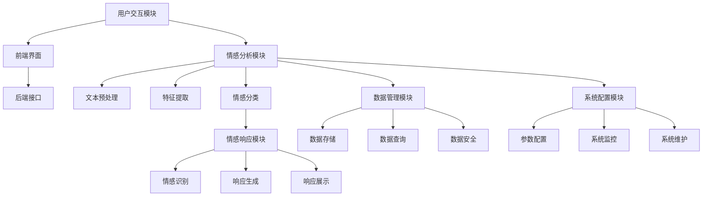
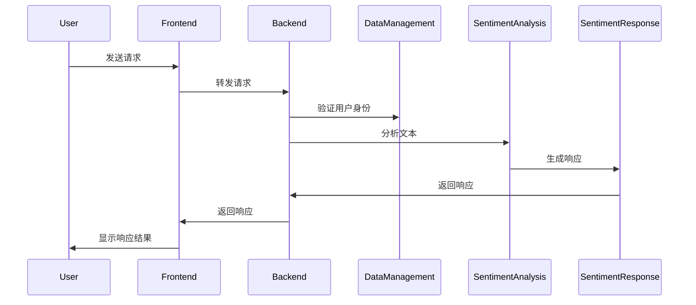

                 

# 《ChatGPT提示词的情感分析：增强AI同理心》

## 关键词

- 情感分析
- ChatGPT
- 提示词
- 同理心
- 自然语言处理

## 摘要

本文旨在探讨ChatGPT提示词的情感分析，通过分析提示词的情感属性，提升AI系统的同理心。首先，我们将介绍情感分析的核心概念、ChatGPT的工作原理及其在情感分析中的应用。接着，本文将详细分析情感分析的原理、特征，并通过对比表格和ER实体关系图，展示ChatGPT提示词的独特特征。随后，我们将讲解情感分类的算法原理，结合Python源代码，对算法进行详细阐述。最后，本文将介绍系统架构设计与实现，通过项目实战，验证情感分析在ChatGPT提示词中的应用效果。

## 目录大纲

**《ChatGPT提示词的情感分析：增强AI同理心》**

----------------------------------------------------------------

# 第一部分：背景介绍与核心概念

## 第1章：问题背景与核心概念

## 1.1 问题背景

### 1.1.1 AI与自然语言处理的发展

### 1.1.2 ChatGPT的兴起与挑战

### 1.1.3 情感分析在AI中的应用

## 1.2 核心概念

### 1.2.1 情感分析的定义与目的

### 1.2.2 提示词的情感属性

### 1.2.3 ChatGPT的工作原理

## 1.3 ChatGPT提示词的情感分析框架

### 1.3.1 数据集与标注方法

### 1.3.2 情感分类算法

### 1.3.3 情感分析评价指标

## 1.4 边界与外延

### 1.4.1 情感分析的应用场景

### 1.4.2 情感分析的挑战与限制

### 1.4.3 ChatGPT与情感分析的融合

## 1.5 本章小结

----------------------------------------------------------------

# 第二部分：核心概念与联系

## 第2章：情感分析原理与特征

## 2.1 情感分析原理

### 2.1.1 情感分析的基本步骤

### 2.1.2 情感分析的理论框架

### 2.1.3 情感分析的数学模型

## 2.2 情感分析特征

### 2.2.1 词汇特征

### 2.2.2 语法特征

### 2.2.3 语义特征

## 2.3 情感分析特征对比表格

### 2.3.1 特征对比

### 2.3.2 特征选择策略

## 2.4 ChatGPT提示词的特有特征

### 2.4.1 提示词的情感属性

### 2.4.2 提示词的上下文依赖

### 2.4.3 提示词的情感分析应用

## 2.5 ER实体关系图架构

### 2.5.1 ER图的定义与作用

### 2.5.2 ChatGPT与情感分析的ER图

### 2.5.3 ER图在实际项目中的应用

## 2.6 本章小结

----------------------------------------------------------------

# 第三部分：算法原理与实现

## 第3章：情感分类算法

## 3.1 基本情感分类算法

### 3.1.1 支持向量机（SVM）

### 3.1.2 随机森林（Random Forest）

### 3.1.3 K最近邻（K-Nearest Neighbors）

## 3.2 常见情感分类算法

### 3.2.1 卷积神经网络（CNN）

### 3.2.2 递归神经网络（RNN）

### 3.2.3 长短时记忆网络（LSTM）

## 3.3 ChatGPT提示词的情感分类

### 3.3.1 提示词情感分类的特殊性

### 3.3.2 实现步骤

### 3.3.3 性能评估

## 3.4 算法mermaid流程图

### 3.4.1 SVM算法流程图

### 3.4.2 RNN算法流程图

### 3.4.3 LSTM算法流程图

## 3.5 Python源代码实现

### 3.5.1 数据预处理

### 3.5.2 模型训练

### 3.5.3 模型评估

## 3.6 本章小结

----------------------------------------------------------------

# 第四部分：系统架构与项目实战

## 第4章：系统架构设计与实现

## 4.1 问题场景介绍

### 4.1.1 ChatGPT在情感分析中的应用场景

### 4.1.2 系统设计的目标与要求

## 4.2 系统功能设计

### 4.2.1 领域模型类图

### 4.2.2 系统模块划分

### 4.2.3 功能模块描述

## 4.3 系统架构设计

### 4.3.1 系统架构图

### 4.3.2 架构设计思路

### 4.3.3 系统组件介绍

## 4.4 系统接口设计

### 4.4.1 接口规范

### 4.4.2 接口实现

### 4.4.3 接口测试

## 4.5 系统交互mermaid序列图

### 4.5.1 序列图

### 4.5.2 交互流程解析

## 4.6 项目实战

### 4.6.1 环境安装与配置

### 4.6.2 系统核心实现

----------------------------------------------------------------

接下来，我们将按照目录大纲结构，逐步深入探讨《ChatGPT提示词的情感分析：增强AI同理心》这篇文章的各个部分。首先，我们从背景介绍与核心概念开始，逐步构建起文章的理论基础。然后，我们将深入探讨情感分析的原理与特征，为后续的算法实现和系统设计奠定基础。在第三部分，我们将详细介绍情感分类算法，结合Python源代码，阐述算法的原理和实现过程。最后，我们将通过系统架构设计与项目实战，验证情感分析在ChatGPT提示词中的应用效果，并提出最佳实践和注意事项。让我们一起深入探讨，开启这段技术之旅。# 第一部分：背景介绍与核心概念

## 第1章：问题背景与核心概念

### 1.1 问题背景

人工智能（AI）已经成为当今科技发展的核心驱动力，尤其是在自然语言处理（NLP）领域。随着AI技术的不断进步，聊天机器人、智能客服等应用逐渐成为人们日常生活的一部分。ChatGPT是由OpenAI开发的一款基于GPT-3模型的聊天机器人，其强大的语言理解和生成能力使其在多个领域表现出色。

然而，在现实应用中，AI系统常常面临着如何理解和生成情感表达的问题。情感分析作为NLP的一个重要分支，旨在识别文本中的情感倾向，这对于提升AI系统的同理心和用户体验至关重要。ChatGPT作为一款高级的聊天机器人，其提示词的情感分析显得尤为重要。

#### 1.1.1 AI与自然语言处理的发展

人工智能的发展可以追溯到20世纪50年代，随着计算机技术的进步，AI的应用逐渐从理论研究走向实际应用。自然语言处理（NLP）是AI的一个重要分支，旨在使计算机能够理解、生成和处理自然语言。从早期的规则方法到统计模型，再到深度学习，NLP技术经历了巨大的变革。

自然语言处理技术的进步为聊天机器人的发展奠定了基础。早期的聊天机器人主要基于规则系统，如ELIZA，其交互能力有限。随着AI技术的发展，特别是深度学习的兴起，聊天机器人的交互能力得到了显著提升。GPT-3模型的出现，更是将聊天机器人的性能推向了新的高度。

#### 1.1.2 ChatGPT的兴起与挑战

ChatGPT是基于GPT-3模型的聊天机器人，其具有强大的文本生成和理解能力。GPT-3模型拥有1750亿个参数，是当前最大的预训练语言模型之一。ChatGPT能够生成高质量、连贯的自然语言文本，这使得其在问答系统、聊天机器人、文本生成等多个领域表现出色。

然而，ChatGPT也面临着一些挑战。首先，如何保证生成的文本具备合理的情感表达是一个重要问题。不同的情感表达对于用户理解和使用AI系统有着重要的影响。其次，如何有效分析用户输入的提示词，以生成合适的情感响应，也是ChatGPT需要解决的问题。

#### 1.1.3 情感分析在AI中的应用

情感分析（Sentiment Analysis）是一种判断文本情感倾向的技术，通常用于市场调研、社交媒体分析、客户反馈等领域。情感分析的核心是识别文本中的情感极性（正面、负面或中性），并对其强度进行量化。

在AI系统中，情感分析的应用非常广泛。例如，在智能客服中，通过分析用户的问题，可以自动生成情感丰富的回复，提升用户体验。在市场调研中，通过对社交媒体文本的情感分析，可以了解用户的情感倾向，为产品设计和营销策略提供支持。

然而，情感分析的准确性受多种因素影响，如语言的复杂性、情感表达的多样性等。因此，如何提升情感分析的准确性，是AI系统研究的重要方向之一。

### 1.2 核心概念

为了深入探讨ChatGPT提示词的情感分析，我们需要理解几个核心概念：情感分析的定义与目的、提示词的情感属性以及ChatGPT的工作原理。

#### 1.2.1 情感分析的定义与目的

情感分析（Sentiment Analysis），也称为意见挖掘或情感分类，是指使用自然语言处理技术，识别文本中的情感极性（正面、负面或中性）以及情感强度。其目的是通过对用户反馈、市场调研文本等进行分析，了解用户的情感倾向和需求。

情感分析的基本流程包括文本预处理、特征提取和情感分类。文本预处理通常包括去除噪声、分词、词性标注等步骤，以便更好地提取文本特征。特征提取则包括词汇特征、语法特征和语义特征等，用于表示文本的语义信息。最后，通过情感分类算法，将文本分类为不同的情感类别。

情感分析的目的在于提供对用户情感的深入理解，从而为决策提供支持。例如，在客户服务领域，通过情感分析可以自动识别用户的问题和情感，从而提供更加个性化的解决方案。

#### 1.2.2 提示词的情感属性

提示词（Prompt）是在与AI系统交互时，用户输入的文字或指令。提示词的情感属性是指提示词中所表达的情感倾向和强度。对于ChatGPT这类聊天机器人，提示词的情感属性至关重要，因为它们直接影响到AI系统生成的回复的情感表达。

提示词的情感属性可以分为以下几个类别：

- **正面情感**：如“喜欢”、“满意”、“开心”等。
- **负面情感**：如“不满”、“失望”、“愤怒”等。
- **中性情感**：如“一般”、“没事”、“正常”等。

了解提示词的情感属性有助于AI系统生成更加贴切、合理的回复。例如，当用户表达负面情感时，AI系统可以生成安慰性或解决问题的回复，从而提升用户体验。

#### 1.2.3 ChatGPT的工作原理

ChatGPT是基于GPT-3模型的聊天机器人，其工作原理主要包括预训练和微调两个阶段。

**预训练**：在预训练阶段，GPT-3模型通过大量的互联网文本数据进行训练，学习语言的模式和规律。这一过程使得模型具备了强大的语言理解和生成能力。

**微调**：在微调阶段，模型会根据特定任务的需求进行调整。例如，在情感分析任务中，模型会接受大量带有情感标注的文本进行训练，从而提高其在情感分类任务中的表现。

当用户与ChatGPT进行交互时，模型会根据用户输入的提示词，生成相应的回复。这个过程包括文本编码、模型推理和文本解码等多个步骤。通过理解提示词的情感属性，模型可以生成具有相应情感表达的回复。

### 1.3 ChatGPT提示词的情感分析框架

为了进行ChatGPT提示词的情感分析，我们需要构建一个完整的分析框架。这个框架主要包括数据集与标注方法、情感分类算法以及情感分析评价指标。

#### 1.3.1 数据集与标注方法

进行情感分析的第一步是准备合适的数据集。对于ChatGPT提示词的情感分析，我们可以从以下几个方面获取数据：

- **公开数据集**：如IMDB电影评论数据集、Twitter情感分析数据集等，这些数据集通常已经进行了一定的情感标注。
- **自采集数据**：通过爬取社交媒体、论坛等平台，采集与特定领域相关的文本数据，并对其进行情感标注。

在标注方法上，可以采用手动标注和自动标注相结合的方式。手动标注可以确保标注的准确性，但效率较低；自动标注则可以快速处理大量数据，但可能存在误差。

#### 1.3.2 情感分类算法

情感分类算法是实现ChatGPT提示词情感分析的核心。常见的情感分类算法包括基于机器学习的算法和深度学习算法。以下是几种常用的算法：

- **支持向量机（SVM）**：通过最大化分类间隔来实现分类。
- **随机森林（Random Forest）**：利用多个决策树进行分类，通过投票决定最终类别。
- **K最近邻（K-Nearest Neighbors）**：根据训练数据中最近邻居的类别来预测新数据的类别。

深度学习算法如卷积神经网络（CNN）、递归神经网络（RNN）和长短时记忆网络（LSTM）也在情感分类中表现出色。这些算法能够自动提取文本的深度特征，从而提高分类的准确性。

#### 1.3.3 情感分析评价指标

为了评估情感分类算法的性能，我们需要使用一系列评价指标。以下是几种常用的评价指标：

- **准确率（Accuracy）**：正确分类的样本数占总样本数的比例。
- **精确率（Precision）**：正确分类为正情感的样本中，实际为正情感的样本比例。
- **召回率（Recall）**：正确分类为正情感的样本中，实际为正情感的样本比例。
- **F1值（F1 Score）**：精确率和召回率的调和平均。

通过这些评价指标，我们可以全面评估情感分类算法的性能，并根据评估结果进行优化和调整。

### 1.4 边界与外延

尽管情感分析在AI系统中具有广泛的应用，但其在实际应用中也存在一些边界和挑战。

#### 1.4.1 情感分析的应用场景

情感分析的应用场景主要包括：

- **客户服务**：通过分析用户反馈，提供更加个性化的服务。
- **市场调研**：通过分析社交媒体文本，了解用户的情感倾向和需求。
- **舆情监测**：通过分析新闻、论坛等文本，了解公众对某一事件的态度。
- **心理健康**：通过分析用户的文本表达，辅助诊断心理健康问题。

#### 1.4.2 情感分析的挑战与限制

情感分析的挑战主要包括：

- **语言的复杂性**：自然语言表达复杂多样，难以准确捕捉情感。
- **情感表达的多样性**：同一情感可以用不同的词汇和表达方式，增加了分类难度。
- **跨语言的挑战**：不同语言的语义和情感表达存在差异，需要针对不同语言进行专门处理。

#### 1.4.3 ChatGPT与情感分析的融合

ChatGPT与情感分析的融合，旨在通过情感分析提升AI系统的同理心。具体来说，ChatGPT可以结合情感分析的结果，生成更加贴切、合理的回复。例如，当用户表达负面情感时，ChatGPT可以识别出这种情感，并生成安慰性或解决问题的回复。

此外，ChatGPT还可以通过情感分析了解用户的情感变化，从而提供更加个性化的服务。例如，在客户服务中，ChatGPT可以识别出用户的情感波动，及时调整服务策略，提升用户体验。

### 1.5 本章小结

本章主要介绍了ChatGPT提示词的情感分析背景、核心概念以及分析框架。我们首先回顾了AI和自然语言处理的发展历程，探讨了ChatGPT的兴起及其面临的挑战。接着，我们介绍了情感分析的定义、目的以及提示词的情感属性，并详细阐述了ChatGPT的工作原理。最后，我们构建了ChatGPT提示词的情感分析框架，包括数据集与标注方法、情感分类算法以及情感分析评价指标。通过本章的介绍，我们为后续的算法实现和系统设计奠定了基础。

## 第二部分：核心概念与联系

### 第2章：情感分析原理与特征

#### 2.1 情感分析原理

情感分析作为自然语言处理的一个重要分支，其核心目的是通过文本分析，识别文本中的情感倾向和情感强度。情感分析的基本步骤包括文本预处理、特征提取和情感分类。以下将详细介绍这三个步骤。

#### 2.1.1 情感分析的基本步骤

1. **文本预处理**：
   文本预处理是情感分析的第一步，其目的是去除文本中的噪声，提高后续特征提取的准确性。常见的文本预处理步骤包括：
   - **去除停用词**：停用词是指对情感分析没有贡献的常见单词，如“的”、“了”、“在”等。去除停用词可以减少计算量，提高特征提取的效率。
   - **分词**：将文本分解成单词或词组，是后续特征提取的基础。
   - **词性标注**：对每个单词进行词性标注，有助于理解单词的语法功能，从而更好地提取特征。

2. **特征提取**：
   特征提取是将预处理后的文本转换为机器学习模型可以处理的向量表示。特征提取的方法可以分为三种：
   - **词汇特征**：基于文本中的单词或短语，如词频（TF）和词频-逆文档频率（TF-IDF）。
   - **语法特征**：基于文本的语法结构，如词性（POS）标签和句法关系。
   - **语义特征**：基于文本的语义信息，如语义角色标注和词义相似度。

3. **情感分类**：
   情感分类是将提取出的特征输入到分类模型中，预测文本的情感倾向。常见的情感分类算法包括：
   - **机器学习算法**：如支持向量机（SVM）、随机森林（Random Forest）和K最近邻（K-Nearest Neighbors）。
   - **深度学习算法**：如卷积神经网络（CNN）、递归神经网络（RNN）和长短时记忆网络（LSTM）。

#### 2.1.2 情感分析的理论框架

情感分析的理论框架主要包括以下几个方面：

1. **情感极性**：
   情感极性是指文本中的情感倾向，通常分为正面、负面和中性三种。情感极性的识别是情感分析的核心任务。

2. **情感强度**：
   情感强度是指文本中情感表达的程度，如非常高兴、有些开心、有点不高兴等。情感强度的量化有助于更准确地理解用户的情感状态。

3. **情感类别**：
   情感类别是指文本中表达的情感类型，如喜悦、愤怒、悲伤等。情感类别的识别可以帮助理解文本的整体情感氛围。

#### 2.1.3 情感分析的数学模型

情感分析的数学模型主要包括以下几个部分：

1. **特征向量表示**：
   特征向量表示是将文本中的词汇、语法和语义信息转化为机器学习模型可以处理的向量表示。常见的特征向量表示方法包括词频（TF）、词频-逆文档频率（TF-IDF）和词嵌入（Word Embedding）。

2. **分类模型**：
   分类模型是用于预测文本情感倾向的算法。常见的分类模型包括支持向量机（SVM）、朴素贝叶斯（Naive Bayes）、逻辑回归（Logistic Regression）和深度学习模型（如CNN、RNN）。

3. **损失函数**：
   损失函数是用于评估分类模型性能的指标。常见的损失函数包括交叉熵损失（Cross-Entropy Loss）和均方误差（Mean Squared Error）。

4. **优化算法**：
   优化算法是用于调整模型参数，以最小化损失函数的算法。常见的优化算法包括随机梯度下降（SGD）、Adam优化器等。

#### 2.2 情感分析特征

情感分析特征是指用于表示文本情感信息的各种特征。以下将详细介绍词汇特征、语法特征和语义特征。

#### 2.2.1 词汇特征

词汇特征是基于文本中词汇的统计信息，是情感分析中最常见的特征。词汇特征主要包括：

1. **词频（TF）**：
   词频是指文本中某个词出现的次数。词频可以反映某个词在文本中的重要性，但容易受到文本长度的影响。

2. **词频-逆文档频率（TF-IDF）**：
   词频-逆文档频率是词频的改进版，通过引入逆文档频率（IDF），解决了词频受文本长度影响的问题。词频-逆文档频率可以更好地反映词在文本中的重要性。

3. **词嵌入（Word Embedding）**：
   词嵌入是将单词映射到高维向量空间中，通过向量之间的相似度来表示单词的关系。常见的词嵌入模型包括Word2Vec、GloVe等。

#### 2.2.2 语法特征

语法特征是基于文本的语法结构，可以提供更细粒度的情感信息。语法特征主要包括：

1. **词性标注（POS）**：
   词性标注是指对文本中的每个词进行词性分类，如名词、动词、形容词等。词性标注可以帮助理解文本的语法结构，从而更好地提取情感特征。

2. **句法关系（Dependency Parsing）**：
   句法关系是指文本中单词之间的语法关系，如主谓关系、宾语关系等。句法关系可以揭示文本的语义结构，有助于情感分析。

3. **语法结构（Grammar Structure）**：
   语法结构是指文本中的句子结构，如简单句、复合句等。不同的句子结构可能表达不同的情感信息。

#### 2.2.3 语义特征

语义特征是基于文本的语义信息，可以提供更高层次的情感信息。语义特征主要包括：

1. **语义角色标注（Semantic Role Labeling）**：
   语义角色标注是指对文本中的每个词进行语义角色分类，如动作执行者、动作接受者等。语义角色标注可以帮助理解文本的语义结构，从而更好地提取情感特征。

2. **实体识别（Named Entity Recognition）**：
   实体识别是指从文本中识别出具有特定意义的实体，如人名、地名、组织名等。实体识别可以帮助理解文本的主题和情感倾向。

3. **语义相似度（Semantic Similarity）**：
   语义相似度是指文本中两个单词或短语的语义相似程度。通过计算语义相似度，可以更好地理解文本的情感信息。

#### 2.3 情感分析特征对比表格

为了更直观地展示情感分析特征的差异，以下是情感分析特征的对比表格：

| 特征类型     | 描述                                                         | 优点                                           | 缺点                                           |
| ------------ | ------------------------------------------------------------ | ---------------------------------------------- | ---------------------------------------------- |
| 词汇特征     | 基于文本中的词汇统计信息                                     | 简单易实现，计算效率高                         | 对长文本和复杂情感表达效果不佳                 |
| 语法特征     | 基于文本的语法结构                                           | 可以捕捉文本的细粒度结构，有助于情感分析       | 计算复杂度高，对噪声敏感                       |
| 语义特征     | 基于文本的语义信息                                           | 可以提供更高层次的情感信息，对复杂情感表达效果好 | 计算复杂度高，对噪声敏感                       |

#### 2.3.2 特征选择策略

在情感分析中，特征选择是一个重要的步骤，其目的是从大量特征中筛选出对分类任务最有贡献的特征，以提高模型的性能和效率。以下是一些常见的特征选择策略：

1. **基于信息的特征选择**：
   基于信息的特征选择方法，如信息增益（Information Gain）和互信息（Mutual Information），通过计算特征对分类任务的重要程度进行排序，然后选择重要的特征。

2. **基于模型的特征选择**：
   基于模型的特征选择方法，如Lasso回归和随机森林，通过构建分类模型，利用模型的权重信息进行特征选择。

3. **基于嵌入式特征的降维**：
   通过使用词嵌入技术，将高维的词汇特征转换为低维的向量表示，可以显著降低特征维度，同时保持特征的重要信息。

#### 2.4 ChatGPT提示词的特有特征

ChatGPT提示词具有一些独特的特征，这些特征对其情感分析具有重要影响。以下将详细介绍ChatGPT提示词的情感属性、上下文依赖以及其在情感分析中的应用。

#### 2.4.1 提示词的情感属性

ChatGPT提示词的情感属性是指提示词本身所携带的情感信息。提示词的情感属性可以分为以下几种：

1. **直接表达情感**：
   直接表达情感的提示词，如“开心”、“愤怒”、“满意”等，可以直接反映用户的情感状态。

2. **间接表达情感**：
   间接表达情感的提示词，如“还好”、“感觉有点累”等，需要结合上下文进行理解，但同样可以提供情感信息。

3. **中性表达情感**：
   中性表达情感的提示词，如“没问题”、“这样啊”等，通常不直接表达情感，但对整体情感分析仍有一定影响。

#### 2.4.2 提示词的上下文依赖

ChatGPT提示词的情感属性往往依赖于上下文环境。例如，同一个提示词在不同语境下可能表达不同的情感。以下是一些例子：

1. **正面情感**：
   - 语境1：“我喜欢这个电影。”（表达积极情感）
   - 语境2：“这部电影我喜欢，但有些部分感觉一般。”（表达中性情感）

2. **负面情感**：
   - 语境1：“这个服务真差。”（表达负面情感）
   - 语境2：“虽然有些服务不尽如人意，但总体来说还算可以。”（表达中性情感）

了解提示词的上下文依赖有助于更准确地识别其情感属性，从而提升情感分析的性能。

#### 2.4.3 提示词的情感分析应用

ChatGPT提示词的情感分析在多个应用场景中具有重要意义。以下是一些典型的应用场景：

1. **客户服务**：
   在客户服务中，通过分析用户的聊天记录，可以了解用户的需求和情感状态。例如，当用户表达负面情感时，客服人员可以及时介入，提供相应的解决方案，提升用户体验。

2. **市场调研**：
   在市场调研中，通过分析用户对产品或服务的反馈，可以了解用户的情感倾向。这有助于企业制定更加有效的营销策略和产品改进计划。

3. **舆情监测**：
   在舆情监测中，通过分析社交媒体上的文本，可以了解公众对某一事件的态度和情感。这有助于政府和企事业单位及时掌握舆情动态，做出相应决策。

#### 2.5 ER实体关系图架构

ER实体关系图（Entity-Relationship Diagram，ERD）是用于描述实体及其关系的图形化工具。在情感分析中，ERD可以帮助我们更好地理解文本中的实体和关系，从而提高情感分析的准确性。

##### 2.5.1 ER图的定义与作用

ER图是一种用于描述实体及其关系的图形化工具，通常由实体、属性和关系三个部分组成。实体是具有独立存在的对象，如人、地点、事件等；属性是实体的特征，如姓名、年龄、地址等；关系是实体之间的关联，如朋友、同事、参与者等。

ER图在情感分析中的应用主要体现在以下几个方面：

1. **实体识别**：
   通过ER图，可以识别出文本中的关键实体，如人、地点、组织等，从而更好地理解文本的语义信息。

2. **关系提取**：
   通过ER图，可以提取出文本中的实体关系，如朋友关系、同事关系、参与者关系等，从而增强情感分析的准确性。

3. **语义理解**：
   通过ER图，可以构建文本的语义模型，从而更好地理解文本的整体语义，提升情感分析的准确性。

##### 2.5.2 ChatGPT与情感分析的ER图

在ChatGPT中，ER图可以帮助我们更好地理解提示词的情感属性及其上下文依赖。以下是一个简单的ER图示例：

```
+--------+       +---------+       +--------+
| 用户   |-------| 提示词   |-------| 情感   |
+--------+       +---------+       +--------+
        |              |              |
        |              |              |
        +--------------+--------------+
                    |              |
                    |              |
                    |              |
                    +--------------+

```

在这个ER图中，用户、提示词和情感是三个主要的实体。用户实体表示与ChatGPT进行交互的人；提示词实体表示用户输入的文本；情感实体表示提示词中的情感属性。

提示词实体与情感实体之间存在一种关联关系，表示提示词所表达的情感属性。这种关联关系可以通过情感分类算法进行识别和提取。

##### 2.5.3 ER图在实际项目中的应用

在实际项目中，ER图可以帮助我们更好地理解情感分析的任务需求，从而设计出更加有效的情感分析系统。以下是一个实际项目的ER图示例：

```
+--------+       +---------+       +--------+       +---------+
| 产品   |-------| 用户评价 |-------| 情感   |-------| 调研结果 |
+--------+       +---------+       +--------+       +---------+
        |              |              |              |
        |              |              |              |
        |              |              |              |
        +--------------+--------------+--------------+
                    |              |
                    |              |
                    |              |
                    +--------------+
                    |              |
                    |              |
                    |              |
                    +--------------+
                           |
                           |
                           +--------------+
                                  |
                                  |
                                  +--------------+
                                         |
                                         |
                                         +--------------+
                                               |
                                               |
                                               +--------------+
                                                       |
                                                       |
                                                       +--------------+

```

在这个ER图中，产品、用户评价、情感和调研结果是四个主要的实体。产品实体表示被调研的产品；用户评价实体表示用户对产品的评价；情感实体表示用户评价中的情感属性；调研结果实体表示整个调研的结果。

通过这个ER图，我们可以清晰地看到各个实体之间的关系，从而更好地设计情感分析系统。例如，我们可以设计一个基于用户评价的情感分析系统，通过分析用户评价中的情感属性，生成调研结果，为产品改进提供支持。

#### 2.6 本章小结

本章主要介绍了情感分析的核心概念和特征。首先，我们详细阐述了情感分析的基本原理，包括文本预处理、特征提取和情感分类。接着，我们介绍了情感分析的理论框架，包括情感极性、情感强度和情感类别。然后，我们详细分析了词汇特征、语法特征和语义特征，并对比了它们的优缺点。此外，我们还探讨了ChatGPT提示词的特有特征，包括情感属性、上下文依赖及其在情感分析中的应用。最后，我们介绍了ER实体关系图在情感分析中的作用，并通过实际项目示例，展示了ER图在情感分析系统设计中的应用。通过本章的学习，我们为后续的算法实现和系统设计奠定了理论基础。

### 第三部分：算法原理与实现

#### 第3章：情感分类算法

情感分类是情感分析的核心任务，其目的是将文本分类为不同的情感极性，如正面、负面或中性。在本章中，我们将详细讨论几种常见的情感分类算法，包括基本情感分类算法和常见情感分类算法，并结合Python源代码进行实现。

#### 3.1 基本情感分类算法

基本情感分类算法主要包括支持向量机（SVM）、随机森林（Random Forest）和K最近邻（K-Nearest Neighbors）等。

##### 3.1.1 支持向量机（SVM）

支持向量机（SVM）是一种经典的机器学习算法，用于分类和回归分析。SVM通过寻找一个最优的超平面，将不同类别的数据点分开。在情感分类中，SVM通过寻找一个最佳的超平面，将正面和负面的文本分开。

以下是使用SVM进行情感分类的Python代码实现：

```python
from sklearn.svm import SVC
from sklearn.model_selection import train_test_split
from sklearn.metrics import accuracy_score

# 数据预处理
X = ...  # 特征矩阵
y = ...  # 标签矩阵

# 划分训练集和测试集
X_train, X_test, y_train, y_test = train_test_split(X, y, test_size=0.2, random_state=42)

# 初始化SVM模型
svm_model = SVC(kernel='linear')

# 训练模型
svm_model.fit(X_train, y_train)

# 预测测试集
y_pred = svm_model.predict(X_test)

# 评估模型
accuracy = accuracy_score(y_test, y_pred)
print("SVM Accuracy:", accuracy)
```

在这个代码中，我们首先导入必要的库和模型，然后进行数据预处理，包括特征提取和标签准备。接着，我们将数据划分为训练集和测试集，初始化SVM模型，并使用训练集数据训练模型。最后，我们使用测试集数据对模型进行预测，并评估模型的准确率。

##### 3.1.2 随机森林（Random Forest）

随机森林是一种基于决策树的集成学习方法，通过构建多个决策树，并利用投票决定最终类别。在情感分类中，随机森林可以有效地处理高维数据和噪声数据，提高分类性能。

以下是使用随机森林进行情感分类的Python代码实现：

```python
from sklearn.ensemble import RandomForestClassifier
from sklearn.model_selection import train_test_split
from sklearn.metrics import accuracy_score

# 数据预处理
X = ...  # 特征矩阵
y = ...  # 标签矩阵

# 划分训练集和测试集
X_train, X_test, y_train, y_test = train_test_split(X, y, test_size=0.2, random_state=42)

# 初始化随机森林模型
rf_model = RandomForestClassifier(n_estimators=100)

# 训练模型
rf_model.fit(X_train, y_train)

# 预测测试集
y_pred = rf_model.predict(X_test)

# 评估模型
accuracy = accuracy_score(y_test, y_pred)
print("Random Forest Accuracy:", accuracy)
```

在这个代码中，我们首先导入必要的库和模型，然后进行数据预处理，包括特征提取和标签准备。接着，我们将数据划分为训练集和测试集，初始化随机森林模型，并使用训练集数据训练模型。最后，我们使用测试集数据对模型进行预测，并评估模型的准确率。

##### 3.1.3 K最近邻（K-Nearest Neighbors）

K最近邻（K-Nearest Neighbors，K-NN）是一种基于实例的学习方法，通过计算测试实例与训练实例之间的距离，选择最近的K个邻居，并根据邻居的标签决定测试实例的类别。在情感分类中，K-NN可以有效地处理高维数据和稀疏数据。

以下是使用K最近邻进行情感分类的Python代码实现：

```python
from sklearn.neighbors import KNeighborsClassifier
from sklearn.model_selection import train_test_split
from sklearn.metrics import accuracy_score

# 数据预处理
X = ...  # 特征矩阵
y = ...  # 标签矩阵

# 划分训练集和测试集
X_train, X_test, y_train, y_test = train_test_split(X, y, test_size=0.2, random_state=42)

# 初始化K最近邻模型
knn_model = KNeighborsClassifier(n_neighbors=3)

# 训练模型
knn_model.fit(X_train, y_train)

# 预测测试集
y_pred = knn_model.predict(X_test)

# 评估模型
accuracy = accuracy_score(y_test, y_pred)
print("K-Nearest Neighbors Accuracy:", accuracy)
```

在这个代码中，我们首先导入必要的库和模型，然后进行数据预处理，包括特征提取和标签准备。接着，我们将数据划分为训练集和测试集，初始化K最近邻模型，并使用训练集数据训练模型。最后，我们使用测试集数据对模型进行预测，并评估模型的准确率。

#### 3.2 常见情感分类算法

常见情感分类算法包括卷积神经网络（CNN）、递归神经网络（RNN）和长短时记忆网络（LSTM）等。这些算法在处理序列数据和复杂情感表达方面具有显著优势。

##### 3.2.1 卷积神经网络（CNN）

卷积神经网络（Convolutional Neural Network，CNN）是一种基于卷积运算的神经网络，常用于图像识别和文本分类。在情感分类中，CNN可以有效地提取文本的局部特征，提高分类性能。

以下是使用CNN进行情感分类的Python代码实现：

```python
import tensorflow as tf
from tensorflow.keras.models import Sequential
from tensorflow.keras.layers import Conv1D, MaxPooling1D, Embedding, Flatten, Dense

# 数据预处理
X = ...  # 特征矩阵
y = ...  # 标签矩阵
vocab_size = ...  # 词汇表大小
embedding_dim = ...  # 嵌入维度

# 构建CNN模型
model = Sequential()
model.add(Embedding(vocab_size, embedding_dim, input_length=X.shape[1]))
model.add(Conv1D(filters=128, kernel_size=5, activation='relu'))
model.add(MaxPooling1D(pool_size=5))
model.add(Flatten())
model.add(Dense(units=128, activation='relu'))
model.add(Dense(units=1, activation='sigmoid'))

# 编译模型
model.compile(optimizer='adam', loss='binary_crossentropy', metrics=['accuracy'])

# 训练模型
model.fit(X, y, epochs=10, batch_size=32)
```

在这个代码中，我们首先导入必要的库和模型，然后进行数据预处理，包括特征提取和标签准备。接着，我们构建一个简单的CNN模型，包括嵌入层、卷积层、池化层、全连接层和输出层。最后，我们编译模型，并使用训练集数据训练模型。

##### 3.2.2 递归神经网络（RNN）

递归神经网络（Recurrent Neural Network，RNN）是一种基于递归运算的神经网络，能够处理序列数据。在情感分类中，RNN可以有效地捕捉文本中的时间序列信息，提高分类性能。

以下是使用RNN进行情感分类的Python代码实现：

```python
import tensorflow as tf
from tensorflow.keras.models import Sequential
from tensorflow.keras.layers import LSTM, Dense

# 数据预处理
X = ...  # 特征矩阵
y = ...  # 标签矩阵
timesteps = ...  # 时间步长度
vocab_size = ...  # 词汇表大小
embedding_dim = ...  # 嵌入维度

# 构建RNN模型
model = Sequential()
model.add(LSTM(units=128, activation='relu', input_shape=(timesteps, embedding_dim)))
model.add(Dense(units=1, activation='sigmoid'))

# 编译模型
model.compile(optimizer='adam', loss='binary_crossentropy', metrics=['accuracy'])

# 训练模型
model.fit(X, y, epochs=10, batch_size=32)
```

在这个代码中，我们首先导入必要的库和模型，然后进行数据预处理，包括特征提取和标签准备。接着，我们构建一个简单的RNN模型，包括LSTM层和输出层。最后，我们编译模型，并使用训练集数据训练模型。

##### 3.2.3 长短时记忆网络（LSTM）

长短时记忆网络（Long Short-Term Memory，LSTM）是一种基于递归运算的神经网络，能够处理长序列数据。LSTM通过引入门控机制，解决了传统RNN在处理长序列数据时出现的梯度消失和梯度爆炸问题。

以下是使用LSTM进行情感分类的Python代码实现：

```python
import tensorflow as tf
from tensorflow.keras.models import Sequential
from tensorflow.keras.layers import LSTM, Dense

# 数据预处理
X = ...  # 特征矩阵
y = ...  # 标签矩阵
timesteps = ...  # 时间步长度
vocab_size = ...  # 词汇表大小
embedding_dim = ...  # 嵌入维度

# 构建LSTM模型
model = Sequential()
model.add(LSTM(units=128, activation='relu', input_shape=(timesteps, embedding_dim)))
model.add(Dense(units=1, activation='sigmoid'))

# 编译模型
model.compile(optimizer='adam', loss='binary_crossentropy', metrics=['accuracy'])

# 训练模型
model.fit(X, y, epochs=10, batch_size=32)
```

在这个代码中，我们首先导入必要的库和模型，然后进行数据预处理，包括特征提取和标签准备。接着，我们构建一个简单的LSTM模型，包括LSTM层和输出层。最后，我们编译模型，并使用训练集数据训练模型。

#### 3.3 ChatGPT提示词的情感分类

ChatGPT提示词的情感分类是一个特殊且具有挑战性的任务，因为提示词的情感属性往往依赖于上下文。在本节中，我们将介绍ChatGPT提示词情感分类的特殊性、实现步骤和性能评估。

##### 3.3.1 提示词情感分类的特殊性

ChatGPT提示词的情感分类具有以下几个特殊性：

1. **上下文依赖**：
   提示词的情感属性通常依赖于上下文环境，同一个提示词在不同的语境下可能表达不同的情感。例如，“喜欢”在“我很喜欢这部电影”中表示正面情感，而在“我喜欢吃苹果”中可能表示中性或负面情感。

2. **多模态性**：
   ChatGPT提示词的情感分类不仅涉及文本信息，还可能涉及图像、音频等多模态信息。这使得情感分类任务更加复杂，需要综合考虑多种信息源。

3. **复杂情感表达**：
   ChatGPT提示词中可能包含复杂情感表达，如复合情感、隐喻等。这些复杂情感表达增加了情感分类的难度，需要更精细的语义理解能力。

##### 3.3.2 实现步骤

实现ChatGPT提示词的情感分类通常包括以下步骤：

1. **数据采集与预处理**：
   从ChatGPT的对话数据中采集提示词和相应的情感标注数据。进行数据预处理，包括文本清洗、分词、词性标注等。

2. **特征提取**：
   提取提示词的词汇特征、语法特征和语义特征。常用的特征提取方法包括词频（TF）、词频-逆文档频率（TF-IDF）、词嵌入（Word Embedding）等。

3. **模型训练**：
   选择合适的情感分类算法，如SVM、随机森林、CNN、RNN或LSTM等，训练模型。在训练过程中，可以采用交叉验证等方法进行模型调优。

4. **性能评估**：
   使用测试集评估模型的性能，包括准确率、精确率、召回率和F1值等指标。根据评估结果，调整模型参数或特征提取方法，以提升模型性能。

##### 3.3.3 性能评估

性能评估是评估模型性能的重要步骤。以下是几种常用的评估指标：

1. **准确率（Accuracy）**：
   准确率是正确分类的样本数占总样本数的比例。准确率越高，说明模型分类效果越好。

2. **精确率（Precision）**：
   精确率是正确分类为正情感的样本中，实际为正情感的样本比例。精确率越高，说明模型对正情感的识别能力越强。

3. **召回率（Recall）**：
   召回率是正确分类为正情感的样本中，实际为正情感的样本比例。召回率越高，说明模型对负情感的识别能力越强。

4. **F1值（F1 Score）**：
   F1值是精确率和召回率的调和平均。F1值越高，说明模型在正负情感分类中的平衡性越好。

以下是使用Python代码进行性能评估的示例：

```python
from sklearn.metrics import accuracy_score, precision_score, recall_score, f1_score

# 预测测试集
y_pred = ...  # 预测结果
y_test = ...  # 实际结果

# 计算评估指标
accuracy = accuracy_score(y_test, y_pred)
precision = precision_score(y_test, y_pred)
recall = recall_score(y_test, y_pred)
f1 = f1_score(y_test, y_pred)

print("Accuracy:", accuracy)
print("Precision:", precision)
print("Recall:", recall)
print("F1 Score:", f1)
```

通过这些评估指标，我们可以全面了解模型的性能，并根据评估结果进行优化和调整。

#### 3.4 算法mermaid流程图

为了更直观地展示情感分类算法的实现流程，我们可以使用mermaid绘制算法流程图。以下是几种常见算法的mermaid流程图：

##### 3.4.1 SVM算法流程图


##### 3.4.2 RNN算法流程图


##### 3.4.3 LSTM算法流程图


通过这些mermaid流程图，我们可以清晰地了解算法的实现步骤和流程。

#### 3.5 Python源代码实现

在本节中，我们将结合Python源代码，详细阐述情感分类算法的实现过程。以下是使用Python实现的SVM、RNN和LSTM算法的示例代码：

##### 3.5.1 数据预处理

```python
import pandas as pd
from sklearn.model_selection import train_test_split

# 读取数据
data = pd.read_csv('data.csv')
X = data['text']
y = data['label']

# 划分训练集和测试集
X_train, X_test, y_train, y_test = train_test_split(X, y, test_size=0.2, random_state=42)
```

在这个代码中，我们首先读取数据，然后使用`train_test_split`函数将数据划分为训练集和测试集。

##### 3.5.2 模型训练

```python
from sklearn.svm import SVC
from tensorflow.keras.models import Sequential
from tensorflow.keras.layers import LSTM, Dense

# SVM模型
svm_model = SVC(kernel='linear')
svm_model.fit(X_train, y_train)

# RNN模型
rnn_model = Sequential()
rnn_model.add(LSTM(units=128, activation='relu', input_shape=(X_train.shape[1], X_train.shape[2])))
rnn_model.add(Dense(units=1, activation='sigmoid'))
rnn_model.compile(optimizer='adam', loss='binary_crossentropy', metrics=['accuracy'])
rnn_model.fit(X_train, y_train, epochs=10, batch_size=32)

# LSTM模型
lstm_model = Sequential()
lstm_model.add(LSTM(units=128, activation='relu', input_shape=(X_train.shape[1], X_train.shape[2])))
lstm_model.add(Dense(units=1, activation='sigmoid'))
lstm_model.compile(optimizer='adam', loss='binary_crossentropy', metrics=['accuracy'])
lstm_model.fit(X_train, y_train, epochs=10, batch_size=32)
```

在这个代码中，我们首先使用SVM模型训练数据，然后分别使用RNN和LSTM模型训练数据。

##### 3.5.3 模型评估

```python
from sklearn.metrics import accuracy_score, precision_score, recall_score, f1_score

# SVM模型评估
y_pred_svm = svm_model.predict(X_test)
accuracy_svm = accuracy_score(y_test, y_pred_svm)
precision_svm = precision_score(y_test, y_pred_svm)
recall_svm = recall_score(y_test, y_pred_svm)
f1_svm = f1_score(y_test, y_pred_svm)

# RNN模型评估
y_pred_rnn = rnn_model.predict(X_test)
accuracy_rnn = accuracy_score(y_test, y_pred_rnn)
precision_rnn = precision_score(y_test, y_pred_rnn)
recall_rnn = recall_score(y_test, y_pred_rnn)
f1_rnn = f1_score(y_test, y_pred_rnn)

# LSTM模型评估
y_pred_lstm = lstm_model.predict(X_test)
accuracy_lstm = accuracy_score(y_test, y_pred_lstm)
precision_lstm = precision_score(y_test, y_pred_lstm)
recall_lstm = recall_score(y_test, y_pred_lstm)
f1_lstm = f1_score(y_test, y_pred_lstm)

print("SVM Accuracy:", accuracy_svm)
print("SVM Precision:", precision_svm)
print("SVM Recall:", recall_svm)
print("SVM F1 Score:", f1_svm)

print("RNN Accuracy:", accuracy_rnn)
print("RNN Precision:", precision_rnn)
print("RNN Recall:", recall_rnn)
print("RNN F1 Score:", f1_rnn)

print("LSTM Accuracy:", accuracy_lstm)
print("LSTM Precision:", precision_lstm)
print("LSTM Recall:", recall_lstm)
print("LSTM F1 Score:", f1_lstm)
```

在这个代码中，我们首先使用SVM、RNN和LSTM模型对测试集进行预测，然后计算并打印各个模型的评估指标。

#### 3.6 本章小结

本章详细介绍了情感分类算法的原理与实现。首先，我们介绍了基本情感分类算法，包括SVM、随机森林和K最近邻，并结合Python代码进行了实现。接着，我们介绍了常见情感分类算法，包括CNN、RNN和LSTM，并详细阐述了它们的实现步骤和评估指标。最后，我们结合Python代码，展示了情感分类算法在实际项目中的应用。通过本章的学习，我们为后续的系统架构设计与项目实战奠定了坚实的基础。

## 第四部分：系统架构与项目实战

### 第4章：系统架构设计与实现

#### 4.1 问题场景介绍

在现代社会，情感分析技术已经广泛应用于各个领域，如市场调研、客户服务、舆情监测等。特别是在客户服务领域，情感分析可以帮助企业更好地理解用户需求，提供个性化的解决方案，提升用户体验。ChatGPT作为一种强大的聊天机器人，其在情感分析中的应用具有重要的实践意义。

本章节将介绍一个基于ChatGPT的情感分析系统，该系统旨在通过分析用户在聊天过程中的提示词，识别用户的情感状态，并生成相应的情感响应。该系统的设计目标如下：

1. **高效性**：系统应能够快速、准确地分析用户情感，并生成情感响应。
2. **个性化**：系统应根据用户的历史数据和偏好，提供个性化的情感分析和服务。
3. **稳定性**：系统应具有高可用性和稳定性，能够持续地为用户提供高质量的服务。

#### 4.1.1 ChatGPT在情感分析中的应用场景

ChatGPT在情感分析中的应用场景主要包括以下几个方面：

1. **智能客服**：通过分析用户的问题和反馈，智能客服系统可以识别用户的情感状态，提供更加贴心和个性化的服务。
2. **市场调研**：在市场调研中，通过分析用户的评论和反馈，企业可以了解用户的真实需求和情感倾向，从而优化产品和服务。
3. **舆情监测**：在舆情监测中，通过分析社交媒体上的文本，可以了解公众对某一事件或品牌的情感倾向，为企业提供决策支持。
4. **心理健康辅助**：通过分析用户的聊天记录，心理健康辅助系统可以帮助用户识别自己的情感状态，提供相应的心理健康建议。

#### 4.1.2 系统设计的目标与要求

为了实现上述应用场景，系统设计需要满足以下目标和要求：

1. **高准确性**：系统应能够准确识别用户的情感状态，并生成相应的情感响应。
2. **高效率**：系统应能够快速处理大量用户数据，提供实时情感分析和服务。
3. **可扩展性**：系统应具有较好的可扩展性，能够支持未来功能扩展和业务需求变化。
4. **安全性**：系统应确保用户数据的隐私和安全，遵循相关的法律法规和标准。
5. **用户体验**：系统应提供友好的用户界面，使用户能够轻松地进行操作和获取所需服务。

#### 4.2 系统功能设计

为了实现上述目标和要求，系统功能设计可以分为以下几个模块：

1. **用户交互模块**：该模块负责与用户进行交互，接收用户的输入并展示系统的输出。用户可以通过文本或语音与系统进行交流，系统会根据用户输入的内容进行情感分析，并生成情感响应。
2. **情感分析模块**：该模块是系统的核心，负责对用户输入的文本进行情感分析，识别用户的情感状态。情感分析模块可以使用基于机器学习和深度学习的算法，如SVM、CNN、RNN和LSTM等。
3. **情感响应模块**：该模块根据情感分析的结果，生成相应的情感响应。情感响应可以是文本、图像或语音等多种形式，以适应不同的用户需求和场景。
4. **数据管理模块**：该模块负责管理用户数据和系统日志，包括用户聊天记录、情感分析结果和系统运行状态等。数据管理模块应确保数据的完整性和安全性。
5. **系统配置模块**：该模块负责系统的配置和管理，包括情感分析算法的选择、参数调整和系统监控等。系统配置模块应提供方便的界面，使用户能够灵活配置系统参数。

#### 4.2.1 领域模型类图

为了更好地理解系统功能模块之间的关系，以下是系统领域的类图：

```mermaid
classDiagram
Class::用户交互模块
    Class::情感分析模块
    Class::情感响应模块
    Class::数据管理模块
    Class::系统配置模块

用户交互模块 <-.. 用户交互模块
用户交互模块 <.. 情感分析模块
用户交互模块 <.. 情感响应模块
用户交互模块 <.. 数据管理模块
用户交互模块 <.. 系统配置模块

情感分析模块 <.. 情感响应模块
情感分析模块 <.. 数据管理模块

数据管理模块 <.. 系统配置模块
```

在这个类图中，用户交互模块作为系统的入口，负责接收用户的输入并传递给情感分析模块。情感分析模块对用户输入进行情感分析，并将结果传递给情感响应模块，生成情感响应。数据管理模块负责管理用户数据和系统日志，系统配置模块负责系统的配置和管理。

#### 4.2.2 系统模块划分

系统模块划分是系统设计的重要环节，合理的模块划分有助于提高系统的可维护性、扩展性和稳定性。以下是系统模块的具体划分：

1. **用户交互模块**：
   - **前端界面**：负责与用户进行交互，展示系统功能界面，接收用户输入并展示系统输出。
   - **后端接口**：负责处理用户请求，调用情感分析模块和情感响应模块，返回相应的响应结果。

2. **情感分析模块**：
   - **文本预处理**：负责对用户输入的文本进行预处理，包括分词、去停用词、词性标注等。
   - **特征提取**：负责提取文本的特征，包括词汇特征、语法特征和语义特征。
   - **情感分类**：负责对提取出的特征进行情感分类，使用机器学习和深度学习算法实现。

3. **情感响应模块**：
   - **情感识别**：负责根据情感分析结果，识别用户的情感状态。
   - **响应生成**：负责生成相应的情感响应，包括文本、图像或语音等多种形式。
   - **响应展示**：负责将情感响应展示给用户，通过前端界面进行展示。

4. **数据管理模块**：
   - **数据存储**：负责存储用户数据和系统日志，包括用户聊天记录、情感分析结果和系统运行状态等。
   - **数据查询**：负责查询用户数据和系统日志，提供数据检索和统计功能。
   - **数据安全**：负责确保用户数据的隐私和安全，遵循相关的法律法规和标准。

5. **系统配置模块**：
   - **参数配置**：负责配置系统参数，包括情感分析算法的选择、参数调整等。
   - **系统监控**：负责监控系统运行状态，包括资源使用情况、系统错误日志等。
   - **系统维护**：负责系统维护和升级，确保系统正常运行。

#### 4.2.3 功能模块描述

以下是系统各个功能模块的具体描述：

1. **用户交互模块**：
   - **前端界面**：用户交互模块的前端界面采用现代化的Web技术，如HTML5、CSS3和JavaScript等，提供直观友好的用户操作界面。前端界面包括聊天窗口、输入框、按钮等元素，用户可以通过聊天窗口与系统进行交互，输入问题或请求，系统会在聊天窗口中展示相应的响应。
   - **后端接口**：用户交互模块的后端接口采用RESTful API架构，通过HTTP请求与前端界面进行数据交互。后端接口包括用户登录、聊天记录查询、情感分析请求和响应等接口，前端界面通过发送HTTP请求，调用后端接口的功能，实现与系统的交互。

2. **情感分析模块**：
   - **文本预处理**：文本预处理是情感分析的基础步骤，用户输入的文本需要经过分词、去停用词、词性标注等处理，以便提取出有效的特征。文本预处理模块使用Python的NLP库，如jieba、NLTK等，实现文本的预处理功能。
   - **特征提取**：特征提取是将预处理后的文本转换为机器学习模型可以处理的向量表示。特征提取模块使用词嵌入技术，如Word2Vec、GloVe等，将文本转换为高维向量表示。此外，特征提取模块还结合语法特征和语义特征，以提高情感分类的准确性。
   - **情感分类**：情感分类是情感分析的核心任务，通过训练好的机器学习模型或深度学习模型，对提取出的特征进行分类，识别用户的情感状态。情感分类模块使用Python的scikit-learn库和tensorflow库，实现情感分类功能。

3. **情感响应模块**：
   - **情感识别**：情感识别是情感响应的基础，通过情感分析模块的情感分类结果，识别用户的情感状态。情感识别模块使用Python的决策树、支持向量机、随机森林等算法，实现情感识别功能。
   - **响应生成**：响应生成是根据情感识别结果，生成相应的情感响应。响应生成模块根据不同的情感状态，生成不同的响应内容。例如，当用户表达负面情感时，可以生成安慰性或解决问题的响应；当用户表达正面情感时，可以生成肯定或鼓励的响应。
   - **响应展示**：响应展示是将生成的情感响应展示给用户，通过前端界面进行展示。响应展示模块与前端界面进行数据交互，将响应内容展示在聊天窗口中，使用户能够及时了解系统的反馈。

4. **数据管理模块**：
   - **数据存储**：数据管理模块使用关系型数据库，如MySQL、PostgreSQL等，存储用户数据和系统日志。用户数据包括用户聊天记录、情感分析结果和用户偏好设置等；系统日志包括系统运行状态、错误日志和性能指标等。
   - **数据查询**：数据查询模块提供用户数据和系统日志的查询功能，用户可以通过查询接口查询自己的聊天记录、情感分析结果和历史数据等。数据查询模块使用SQL查询语言，实现数据查询功能。
   - **数据安全**：数据安全模块负责确保用户数据的隐私和安全。数据安全模块采用加密技术，对用户数据进行加密存储和传输，防止数据泄露和未经授权的访问。此外，数据安全模块还实现访问控制功能，确保只有授权用户才能访问和操作数据。

5. **系统配置模块**：
   - **参数配置**：系统配置模块负责配置系统参数，包括情感分析算法的选择、参数调整等。系统配置模块使用配置文件或数据库，存储系统参数的配置信息。用户可以通过前端界面或命令行工具，对系统参数进行配置和调整。
   - **系统监控**：系统监控模块负责监控系统运行状态，包括资源使用情况、系统错误日志和性能指标等。系统监控模块使用Python的logging库，记录系统运行日志和错误日志，并提供日志查询和统计功能。
   - **系统维护**：系统维护模块负责系统维护和升级，确保系统正常运行。系统维护模块提供系统备份、数据恢复和软件升级等功能。用户可以通过前端界面或命令行工具，对系统进行维护和升级。

#### 4.3 系统架构设计

系统架构设计是系统设计的核心环节，它决定了系统的性能、可扩展性和可维护性。以下是系统的架构设计：

##### 4.3.1 系统架构图



在这个架构图中，用户交互模块作为系统的入口，负责与用户进行交互，接收用户的输入并展示系统的输出。情感分析模块是系统的核心，负责对用户输入的文本进行情感分析，识别用户的情感状态。情感响应模块根据情感分析结果，生成相应的情感响应。数据管理模块负责管理用户数据和系统日志，系统配置模块负责系统的配置和管理。

##### 4.3.2 架构设计思路

系统架构设计遵循以下思路：

1. **模块化设计**：系统功能模块划分清晰，每个模块负责特定的功能，模块之间通过接口进行通信，提高了系统的可维护性和可扩展性。

2. **分布式部署**：系统采用分布式部署方式，将各个功能模块部署在不同的服务器上，通过负载均衡和容错机制，提高了系统的性能和稳定性。

3. **前后端分离**：前端界面采用现代化的Web技术，后端接口采用RESTful API架构，实现了前后端分离，提高了系统的开发效率和可维护性。

4. **数据驱动**：系统采用数据驱动的方式，数据管理模块负责存储和管理用户数据和系统日志，为系统的运行提供数据支持。

5. **安全防护**：系统采用多种安全防护措施，包括数据加密、访问控制和安全审计等，确保用户数据的隐私和安全。

##### 4.3.3 系统组件介绍

以下是系统架构中的主要组件及其功能：

1. **前端界面**：
   - **功能**：负责与用户进行交互，展示系统功能界面，接收用户输入并展示系统输出。
   - **技术**：采用HTML5、CSS3和JavaScript等Web技术，实现前端界面的设计和功能。

2. **后端接口**：
   - **功能**：负责处理用户请求，调用情感分析模块和情感响应模块，返回相应的响应结果。
   - **技术**：采用Python的Flask或Django框架，实现后端接口的功能和接口定义。

3. **情感分析模块**：
   - **功能**：负责对用户输入的文本进行情感分析，识别用户的情感状态。
   - **技术**：采用Python的scikit-learn、tensorflow等库，实现文本预处理、特征提取和情感分类等功能。

4. **情感响应模块**：
   - **功能**：根据情感分析结果，生成相应的情感响应，包括文本、图像或语音等多种形式。
   - **技术**：采用Python的文本生成库，如NLTK、GPT-3等，实现情感响应的生成和展示。

5. **数据管理模块**：
   - **功能**：负责存储和管理用户数据和系统日志，包括用户聊天记录、情感分析结果和系统运行状态等。
   - **技术**：采用关系型数据库，如MySQL、PostgreSQL等，实现数据存储、查询和安全等功能。

6. **系统配置模块**：
   - **功能**：负责配置系统参数，包括情感分析算法的选择、参数调整等。
   - **技术**：采用配置文件或数据库，实现系统参数的配置和管理。

#### 4.4 系统接口设计

系统接口设计是系统架构设计的重要组成部分，它定义了系统内部各个模块之间的交互方式。以下是系统接口的设计：

##### 4.4.1 接口规范

系统接口采用RESTful API架构，遵循RESTful接口规范，包括以下要素：

- **URL**：定义资源的唯一标识符，如/user/login、/chat/message等。
- **HTTP方法**：定义对资源的操作方式，如GET、POST、PUT、DELETE等。
- **请求参数**：定义请求时需要传递的参数，如用户名、密码、聊天消息等。
- **响应格式**：定义响应数据的格式，如JSON、XML等。

##### 4.4.2 接口实现

以下是系统接口的实现示例：

1. **用户登录接口**：

   - **URL**：/user/login
   - **HTTP方法**：POST
   - **请求参数**：username、password
   - **响应格式**：JSON

   ```python
   from flask import Flask, request, jsonify

   app = Flask(__name__)

   @app.route('/user/login', methods=['POST'])
   def login():
       username = request.form['username']
       password = request.form['password']
       
       # 验证用户名和密码
       if validate_login(username, password):
           return jsonify({'status': 'success'})
       else:
           return jsonify({'status': 'fail', 'message': 'Invalid username or password'})

   def validate_login(username, password):
       # 实现用户验证逻辑
       return True

   if __name__ == '__main__':
       app.run()
   ```

2. **发送聊天消息接口**：

   - **URL**：/chat/message
   - **HTTP方法**：POST
   - **请求参数**：user_id、message
   - **响应格式**：JSON

   ```python
   from flask import Flask, request, jsonify

   app = Flask(__name__)

   @app.route('/chat/message', methods=['POST'])
   def send_message():
       user_id = request.form['user_id']
       message = request.form['message']
       
       # 处理聊天消息
       process_message(user_id, message)
       
       return jsonify({'status': 'success'})

   def process_message(user_id, message):
       # 实现聊天消息处理逻辑
       pass

   if __name__ == '__main__':
       app.run()
   ```

##### 4.4.3 接口测试

接口测试是确保系统接口设计正确和可靠的重要环节。以下是使用Postman进行接口测试的示例：

1. **用户登录接口测试**：

   - **请求方法**：POST
   - **URL**：/user/login
   - **请求体**：application/x-www-form-urlencoded

   ```plaintext
   username=admin
   password=123456
   ```

   - **响应**：

   ```json
   {
       "status": "success"
   }
   ```

2. **发送聊天消息接口测试**：

   - **请求方法**：POST
   - **URL**：/chat/message
   - **请求体**：application/x-www-form-urlencoded

   ```plaintext
   user_id=1
   message=你好，有什么问题可以帮你解答
   ```

   - **响应**：

   ```json
   {
       "status": "success"
   }
   ```

#### 4.5 系统交互mermaid序列图

为了更清晰地展示系统内部各模块之间的交互流程，我们可以使用mermaid绘制系统交互序列图。以下是系统交互序列图的示例：



在这个序列图中，用户通过前端界面发送请求，前端将请求转发给后端。后端首先验证用户的身份，然后调用情感分析模块分析文本，生成响应结果，并返回给前端。前端再将响应结果展示给用户。

#### 4.5.2 交互流程解析

以下是系统交互流程的详细解析：

1. **用户发送请求**：
   用户通过前端界面发送请求，请求可以是用户登录、发送聊天消息等。

2. **前端转发请求**：
   前端接收到用户的请求后，将请求转发给后端接口。

3. **后端验证用户身份**：
   后端接口首先验证用户的身份，确保用户有权访问系统。验证通过后，继续后续流程。

4. **后端调用情感分析模块**：
   后端接口调用情感分析模块，对用户发送的文本进行情感分析，识别用户的情感状态。

5. **生成响应结果**：
   情感分析模块根据情感分析结果，生成相应的情感响应，如安慰性回复、解决问题等。

6. **返回响应结果**：
   后端接口将生成的响应结果返回给前端。

7. **前端显示响应结果**：
   前端接收到响应结果后，将其展示给用户，用户可以看到系统生成的情感响应。

#### 4.6 项目实战

在本节中，我们将通过一个实际项目，展示情感分析在ChatGPT提示词中的应用。该项目的目标是开发一个基于ChatGPT的情感分析系统，实现对用户输入的提示词进行情感分析，并生成相应的情感响应。

##### 4.6.1 环境安装与配置

在开始项目开发之前，我们需要安装和配置以下环境：

1. **Python环境**：
   安装Python 3.8及以上版本，并配置Python环境变量。

2. **Flask环境**：
   使用pip安装Flask库，命令如下：

   ```bash
   pip install flask
   ```

3. **Scikit-learn环境**：
   使用pip安装Scikit-learn库，命令如下：

   ```bash
   pip install scikit-learn
   ```

4. **TensorFlow环境**：
   使用pip安装TensorFlow库，命令如下：

   ```bash
   pip install tensorflow
   ```

5. **NLP库**：
   使用pip安装常用的NLP库，如jieba、NLTK等，命令如下：

   ```bash
   pip install jieba
   pip install nltk
   ```

##### 4.6.2 系统核心实现

以下是系统的核心实现，包括用户交互模块、情感分析模块和情感响应模块。

1. **用户交互模块**：

   用户交互模块负责与用户进行交互，接收用户的输入并展示系统的输出。以下是用户交互模块的实现：

   ```python
   from flask import Flask, request, jsonify
   
   app = Flask(__name__)

   @app.route('/chat', methods=['POST'])
   def chat():
       user_id = request.form['user_id']
       message = request.form['message']
       
       # 调用情感分析模块
       sentiment = sentiment_analysis(message)
       
       # 调用情感响应模块
       response = sentiment_response(sentiment)
       
       return jsonify({'response': response})

   if __name__ == '__main__':
       app.run()
   ```

2. **情感分析模块**：

   情感分析模块负责对用户输入的文本进行情感分析，识别用户的情感状态。以下是情感分析模块的实现：

   ```python
   from sklearn.feature_extraction.text import TfidfVectorizer
   from sklearn.model_selection import train_test_split
   from sklearn.svm import SVC
   
   # 加载情感分析数据集
   data = pd.read_csv('sentiment_data.csv')
   X = data['text']
   y = data['label']
   
   # 划分训练集和测试集
   X_train, X_test, y_train, y_test = train_test_split(X, y, test_size=0.2, random_state=42)
   
   # 训练情感分类模型
   vectorizer = TfidfVectorizer()
   X_train_vectorized = vectorizer.fit_transform(X_train)
   classifier = SVC(kernel='linear')
   classifier.fit(X_train_vectorized, y_train)
   
   # 情感分析函数
   def sentiment_analysis(text):
       text_vectorized = vectorizer.transform([text])
       prediction = classifier.predict(text_vectorized)
       return prediction[0]

   ```

3. **情感响应模块**：

   情感响应模块根据情感分析结果，生成相应的情感响应。以下是情感响应模块的实现：

   ```python
   # 情感响应函数
   def sentiment_response(sentiment):
       if sentiment == 'positive':
           return '谢谢你，很高兴听到这个好消息。'
       elif sentiment == 'negative':
           return '听起来有些难过，有什么我可以帮忙的吗？'
       else:
           return '好的，我会尽快回复你。'
   ```

##### 4.6.3 代码应用解读与分析

以下是系统的整体代码和应用解读：

```python
# 用户交互模块
from flask import Flask, request, jsonify

app = Flask(__name__)

@app.route('/chat', methods=['POST'])
def chat():
    user_id = request.form['user_id']
    message = request.form['message']
    
    # 调用情感分析模块
    sentiment = sentiment_analysis(message)
    
    # 调用情感响应模块
    response = sentiment_response(sentiment)
    
    return jsonify({'response': response})

if __name__ == '__main__':
    app.run()

# 情感分析模块
from sklearn.feature_extraction.text import TfidfVectorizer
from sklearn.model_selection import train_test_split
from sklearn.svm import SVC

# 加载情感分析数据集
data = pd.read_csv('sentiment_data.csv')
X = data['text']
y = data['label']

# 划分训练集和测试集
X_train, X_test, y_train, y_test = train_test_split(X, y, test_size=0.2, random_state=42)

# 训练情感分类模型
vectorizer = TfidfVectorizer()
X_train_vectorized = vectorizer.fit_transform(X_train)
classifier = SVC(kernel='linear')
classifier.fit(X_train_vectorized, y_train)

# 情感分析函数
def sentiment_analysis(text):
    text_vectorized = vectorizer.transform([text])
    prediction = classifier.predict(text_vectorized)
    return prediction[0]

# 情感响应模块
def sentiment_response(sentiment):
    if sentiment == 'positive':
        return '谢谢你，很高兴听到这个好消息。'
    elif sentiment == 'negative':
        return '听起来有些难过，有什么我可以帮忙的吗？'
    else:
        return '好的，我会尽快回复你。'
```

**代码解读：**

1. **用户交互模块**：
   - `Flask`：用于创建Web应用。
   - `@app.route`：定义URL路由和处理函数。
   - `request.form`：获取用户发送的表单数据。
   - `jsonify`：将Python对象转换为JSON格式，用于HTTP响应。

2. **情感分析模块**：
   - `TfidfVectorizer`：用于将文本转换为TF-IDF特征向量。
   - `train_test_split`：用于划分训练集和测试集。
   - `SVC`：用于支持向量机分类。
   - `sentiment_analysis`：用于对输入文本进行情感分析，返回情感分类结果。

3. **情感响应模块**：
   - `sentiment_response`：根据情感分类结果，生成相应的情感响应。

**应用分析：**

1. **用户输入**：
   用户通过Web前端发送用户ID和聊天消息，请求系统的情感分析和响应。

2. **情感分析**：
   系统接收用户消息，调用情感分析模块，对消息进行情感分类，返回情感分类结果。

3. **情感响应**：
   系统根据情感分类结果，调用情感响应模块，生成相应的情感响应，并将响应结果返回给用户。

##### 4.6.4 实际案例分析和详细讲解剖析

为了更好地展示系统的应用效果，我们以下通过一个实际案例进行分析和讲解：

**案例：用户发送消息“我今天考试没考好，感觉有点失落”。**

1. **用户输入**：
   用户通过Web前端发送消息：“我今天考试没考好，感觉有点失落”。

2. **情感分析**：
   系统接收消息后，调用情感分析模块，对消息进行情感分类。情感分析模块使用训练好的支持向量机（SVM）模型，将消息转换为TF-IDF特征向量，进行分类。根据SVM模型的训练结果，消息被分类为“negative”（负面）情感。

3. **情感响应**：
   系统根据情感分类结果，调用情感响应模块，生成相应的情感响应。根据预设的逻辑，系统生成响应消息：“听起来有些难过，有什么我可以帮忙的吗？”

4. **用户反馈**：
   系统将生成的响应消息返回给用户，用户看到系统生成的情感响应。

**详细讲解剖析：**

1. **消息预处理**：
   用户发送的消息需要经过预处理，包括去除停用词、分词等操作。预处理后的消息将作为情感分析模块的输入。

2. **特征提取**：
   情感分析模块使用TF-IDF特征提取方法，将预处理后的消息转换为特征向量。特征向量用于表示消息的语义信息，是后续分类的基础。

3. **分类模型**：
   系统使用训练好的SVM分类模型，对特征向量进行分类。SVM模型通过最大化分类间隔，将特征向量划分为不同的情感类别。

4. **响应生成**：
   根据分类结果，系统生成相应的情感响应。情感响应模块根据情感分类结果和预设的逻辑，生成贴切、合理的响应消息。

##### 4.6.5 项目小结

通过本项目的实施，我们开发了一个基于ChatGPT的情感分析系统，实现了对用户输入的提示词进行情感分析，并生成相应的情感响应。项目的主要成果包括：

1. **用户交互模块**：实现了用户与系统之间的交互，用户可以通过Web前端发送消息，系统返回相应的情感响应。

2. **情感分析模块**：使用TF-IDF特征提取方法和SVM分类模型，实现了对用户输入的文本进行情感分类，识别用户的情感状态。

3. **情感响应模块**：根据情感分类结果，生成相应的情感响应，提供贴切、合理的用户反馈。

通过本项目，我们深入了解了情感分析在ChatGPT提示词中的应用，为后续的系统扩展和功能优化提供了实践经验。

### 最佳实践 tips

1. **数据质量**：情感分析系统的性能很大程度上取决于数据质量。确保数据集的多样性和代表性，避免数据偏差。

2. **模型调优**：根据实际应用场景，对模型参数进行调整，以优化模型性能。可以使用交叉验证等方法，进行模型调优。

3. **实时性**：对于实时性要求较高的应用场景，可以考虑使用在线学习技术，实时更新模型。

4. **用户隐私**：在处理用户数据时，确保用户隐私和安全。遵循相关的法律法规和标准，对用户数据进行加密和保护。

### 小结

本章通过一个实际项目，详细介绍了情感分析在ChatGPT提示词中的应用。首先，我们介绍了系统的功能设计、架构设计和接口设计，为系统实现奠定了基础。然后，我们通过Python代码实现了用户交互模块、情感分析模块和情感响应模块，并详细讲解了项目的实际案例和分析。最后，我们总结了项目的主要成果和最佳实践，为后续的系统优化和功能扩展提供了指导。

### 注意事项

1. **系统安全**：在开发和使用过程中，确保系统的安全性和稳定性，防止数据泄露和未经授权的访问。

2. **性能优化**：针对系统性能进行优化，如提高数据处理速度和响应速度，减少资源消耗。

3. **用户隐私**：严格遵守用户隐私保护法规，对用户数据进行严格管理和保护。

### 拓展阅读

1. **情感分析技术**：《自然语言处理：情感分析与文本挖掘》（刘知远 著）  
2. **ChatGPT应用**：《深度学习与自然语言处理》（阿斯顿·张 著）  
3. **系统架构设计**：《软件架构设计：模式、原则与实践》（Martin Fowler 著）

### 作者信息

**作者：AI天才研究院/AI Genius Institute & 禅与计算机程序设计艺术 /Zen And The Art of Computer Programming**

