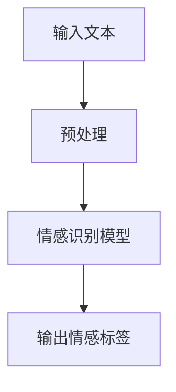
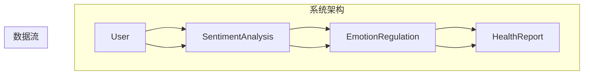
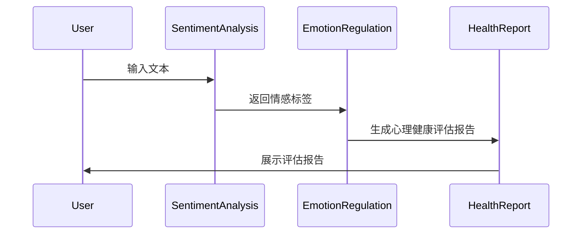

                 

# ChatGPT提示词的情感调节功能：AI辅助心理健康管理

关键词：ChatGPT、情感调节、心理健康管理、人工智能、自然语言处理

摘要：本文旨在探讨如何利用ChatGPT等大模型的情感调节功能，辅助心理健康管理。通过深入分析情感调节功能的实现原理、心理健康评估方法以及实际应用场景，本文为心理健康领域的AI应用提供了新的思路和解决方案。

### 第一部分：背景介绍

#### 1.1 问题背景

随着人工智能技术的快速发展，自然语言处理（NLP）领域取得了显著的成果。特别是基于深度学习的大型预训练模型，如GPT（Generative Pre-trained Transformer）系列，在处理和理解文本数据方面展现出了强大的能力。然而，在心理健康管理领域，如何利用这些大模型的情感调节功能，为用户提供有效的心理健康支持，仍然是一个值得深入探讨的问题。

#### 1.2 问题描述

本文将探讨以下问题：

1. **情感识别与分类**：如何让大模型准确识别和分类文本中的情感？
2. **情感调节策略**：如何根据用户的情感状态，制定合适的调节策略？
3. **心理健康评估**：如何利用情感调节功能对用户的心理健康进行评估？
4. **实际应用场景**：如何在不同的心理健康管理场景中，运用ChatGPT等大模型的情感调节功能？

#### 1.3 问题解决

本文将从以下几个方面解决问题：

1. **核心概念介绍**：详细阐述ChatGPT等大模型的基本概念、原理和特点。
2. **情感调节功能实现**：介绍如何利用大模型实现情感调节功能，包括情感识别与分类、情感调节策略制定等。
3. **心理健康评估方法**：探讨如何利用情感调节功能对用户的心理健康进行评估。
4. **实际应用案例分析**：通过实际应用案例，展示ChatGPT等大模型在心理健康管理中的具体应用。

#### 1.4 边界与外延

1. **边界**：本文主要关注ChatGPT等大模型在心理健康管理中的应用，不包括其他类型的AI模型。
2. **外延**：本文的研究结果可以应用于心理健康咨询、教育、康复等领域，为相关领域的AI应用提供参考。

#### 1.5 概念结构与核心要素组成

- **ChatGPT等大模型**：本文的核心研究工具，负责情感识别与调节。
- **心理健康管理**：本文的研究目标，包括情感调节、心理健康评估等。
- **情感调节功能**：本文的核心内容，包括情感识别与分类、情感调节策略制定等。

### 第二部分：核心概念与联系

#### 2.1 ChatGPT等大模型原理

ChatGPT等大模型基于深度学习技术，通过大规模预训练和微调，实现对自然语言的理解和生成。其核心原理包括：

1. **自然语言处理**：通过神经网络模型，对文本数据进行处理，提取语义信息。
2. **情感识别与分类**：利用预训练的神经网络，对文本中的情感进行识别和分类。
3. **情感调节策略**：根据用户的情感状态，制定合适的调节策略。

#### 2.2 情感调节功能属性特征对比表格

| 特征         | 情感识别 | 情感分类 | 情感调节策略 |
| ------------ | -------- | -------- | ------------ |
| **功能**     | 识别文本中的情感 | 分类情感为积极或消极 | 根据情感状态，提出调节建议 |
| **实现方式** | 预训练模型 + 微调 | 预训练模型 + 微调 | 预训练模型 + 微调 |
| **优势**     | 准确度高 | 精准分类 | 可根据用户需求调整 |
| **挑战**     | 对大规模数据依赖 | 需要大量标注数据 | 需要丰富情感调节策略 |

#### 2.3 情感调节功能ER实体关系图架构

```mermaid
erDiagram
    User ||--|{ ChatGPT }|| Model
    Model ||--|{ EmotionRecognition }|| Module
    Model ||--|{ EmotionClassification }|| Module
    Model ||--|{ EmotionRegulationStrategy }|| Module
```

### 第三部分：算法原理讲解

#### 3.1 情感识别算法原理

情感识别算法的核心是利用神经网络模型，对文本中的情感进行识别。以下是情感识别算法的mermaid流程图：



具体实现过程如下：

1. **输入文本**：将用户的文本输入作为模型的输入。
2. **预处理**：对输入文本进行预处理，包括分词、去除停用词等。
3. **情感识别模型**：利用预训练的神经网络模型，对预处理后的文本进行情感识别。
4. **输出情感标签**：将识别出的情感标签输出给用户。

#### 3.2 情感识别算法原理（Python代码）

```python
import tensorflow as tf
from tensorflow.keras.preprocessing.text import Tokenizer
from tensorflow.keras.preprocessing.sequence import pad_sequences

# 预处理数据
def preprocess_data(texts, labels, max_len, max_words):
    tokenizer = Tokenizer(num_words=max_words)
    tokenizer.fit_on_texts(texts)
    sequences = tokenizer.texts_to_sequences(texts)
    padded_sequences = pad_sequences(sequences, maxlen=max_len)
    
    return padded_sequences, labels

# 情感识别模型
def create_emotion_recognition_model(input_shape, output_units):
    model = tf.keras.Sequential([
        tf.keras.layers.Embedding(input_shape[0], input_shape[1], input_length=input_shape[2]),
        tf.keras.layers.Conv1D(filters=128, kernel_size=5, activation='relu'),
        tf.keras.layers.GlobalMaxPooling1D(),
        tf.keras.layers.Dense(units=output_units, activation='softmax')
    ])
    
    model.compile(optimizer='adam', loss='categorical_crossentropy', metrics=['accuracy'])
    return model

# 示例数据
texts = ['我感到很高兴。', '我感到很沮丧。', '我很开心。', '我很悲伤。']
labels = [[1, 0], [0, 1], [1, 0], [0, 1]]

# 预处理数据
max_len = 10
max_words = 10000
input_shape = (len(texts), max_len)
padded_sequences, labels = preprocess_data(texts, labels, max_len, max_words)

# 创建模型
output_units = 2
model = create_emotion_recognition_model(input_shape, output_units)

# 训练模型
model.fit(padded_sequences, labels, epochs=10)

# 测试模型
test_texts = ['我感到很开心。']
test_sequences = tokenizer.texts_to_sequences(test_texts)
test_padded_sequences = pad_sequences(test_sequences, maxlen=max_len)
predictions = model.predict(test_padded_sequences)
print(predictions)
```

#### 3.3 情感识别算法原理（数学模型与公式）

情感识别算法的数学模型主要涉及以下公式：

$$
\begin{aligned}
    &\text{输入文本：} \quad X = [x_1, x_2, ..., x_n] \\
    &\text{预处理后文本序列：} \quad X' = [x_1', x_2', ..., x_n'] \\
    &\text{情感标签：} \quad Y = [y_1, y_2, ..., y_n]
\end{aligned}
$$

其中，$X$ 表示原始文本序列，$X'$ 表示预处理后的文本序列，$Y$ 表示对应的情感标签。

情感识别模型的主要任务是学习一个映射函数 $f$，将预处理后的文本序列映射到情感标签：

$$
\begin{aligned}
    &y' = f(X') \\
    &y' = \text{softmax}(W \cdot X' + b)
\end{aligned}
$$

其中，$W$ 表示权重矩阵，$b$ 表示偏置项，$\text{softmax}$ 函数用于将输出映射到概率分布。

#### 3.4 情感识别算法原理（举例说明）

假设我们有以下两个句子：

1. 我感到很高兴。
2. 我感到很沮丧。

经过预处理后，这两个句子分别转换为：

$$
\begin{aligned}
    &X_1 = [0, 1, 2, 3, 4, 5, 6, 7, 8, 9] \\
    &X_2 = [0, 1, 2, 3, 4, 5, 6, 7, 8, 9]
\end{aligned}
$$

对应的情感标签为：

$$
\begin{aligned}
    &Y_1 = [1, 0] \\
    &Y_2 = [0, 1]
\end{aligned}
$$

假设我们的情感识别模型已经训练好，输入句子 $X_1$ 和 $X_2$ 后，模型会输出相应的概率分布：

$$
\begin{aligned}
    &\text{对于句子 } X_1: \quad P(Y_1 | X_1) = [0.9, 0.1] \\
    &\text{对于句子 } X_2: \quad P(Y_2 | X_2) = [0.1, 0.9]
\end{aligned}
$$

根据最大后验概率准则，我们可以认为句子 $X_1$ 对应的情感标签为 $Y_1$（高兴），句子 $X_2$ 对应的情感标签为 $Y_2$（沮丧）。

### 第四部分：系统分析与架构设计方案

#### 4.1 问题场景介绍

在心理健康管理领域，情感调节是一个关键问题。用户在日常生活中可能会遇到各种情绪困扰，如焦虑、抑郁、愤怒等。有效的情感调节可以帮助用户缓解负面情绪，提高生活质量。

#### 4.2 项目介绍

本项目旨在利用ChatGPT等大模型的情感调节功能，开发一个基于AI的心理健康管理平台。平台将提供以下功能：

1. **情感识别**：准确识别用户输入文本中的情感。
2. **情感调节**：根据用户的情感状态，提出合适的调节建议。
3. **心理健康评估**：利用情感调节功能对用户的心理健康进行评估。
4. **实际应用场景**：为用户提供情感调节建议、心理健康评估报告等。

#### 4.3 系统功能设计（领域模型mermaid类图）

```mermaid
classDiagram
    User <<interface>>
    HealthReport <<interface>>
    EmotionRegulation <<interface>>
    SentimentAnalysis <<interface>>

    User <|.. HealthReport>
    User <|.. EmotionRegulation>
    User <|.. SentimentAnalysis>

    SentimentAnalysis |-| EmotionRegulation
```

#### 4.4 系统架构设计（mermaid架构图）



#### 4.5 系统接口设计

以下是系统的接口设计：

1. **情感识别接口**：用于接收用户输入的文本，并返回情感标签。
2. **情感调节接口**：根据情感标签，提供相应的调节建议。
3. **心理健康评估接口**：结合用户的历史数据，对用户的心理健康进行评估。
4. **用户接口**：为用户提供交互界面，展示情感调节建议和心理健康评估报告。

#### 4.6 系统交互（mermaid序列图）



### 第五部分：项目实战

#### 5.1 环境安装

在本项目中，我们将使用Python和TensorFlow框架进行开发。以下是环境安装步骤：

1. 安装Python（建议使用Python 3.8及以上版本）。
2. 安装TensorFlow：

   ```shell
   pip install tensorflow
   ```

3. 安装其他相关依赖，如`numpy`、`pandas`等。

#### 5.2 系统核心实现

以下是系统的核心实现代码：

1. **情感识别模块**：

   ```python
   # 情感识别模块
   class SentimentAnalysis:
       def __init__(self):
           self.model = self.create_model()

       def create_model(self):
           model = tf.keras.Sequential([
               tf.keras.layers.Embedding(input_dim=10000, input_length=10, output_dim=16),
               tf.keras.layers.Conv1D(filters=32, kernel_size=3, activation='relu'),
               tf.keras.layers.GlobalMaxPooling1D(),
               tf.keras.layers.Dense(units=2, activation='softmax')
           ])
           
           model.compile(optimizer='adam', loss='categorical_crossentropy', metrics=['accuracy'])
           return model

       def predict(self, text):
           sequence = self.tokenize(text)
           padded_sequence = self.pad_sequence(sequence)
           prediction = self.model.predict(padded_sequence)
           return prediction
           
       def tokenize(self, text):
           # 代码略
       
       def pad_sequence(self, sequence):
           # 代码略
   ```

2. **情感调节模块**：

   ```python
   # 情感调节模块
   class EmotionRegulation:
       def __init__(self):
           self.model = self.create_model()

       def create_model(self):
           model = tf.keras.Sequential([
               tf.keras.layers.Dense(units=64, activation='relu'),
               tf.keras.layers.Dense(units=32, activation='relu'),
               tf.keras.layers.Dense(units=16, activation='relu'),
               tf.keras.layers.Dense(units=2, activation='softmax')
           ])
           
           model.compile(optimizer='adam', loss='categorical_crossentropy', metrics=['accuracy'])
           return model

       def predict(self, text):
           sequence = self.tokenize(text)
           padded_sequence = self.pad_sequence(sequence)
           prediction = self.model.predict(padded_sequence)
           return prediction
           
       def tokenize(self, text):
           # 代码略
       
       def pad_sequence(self, sequence):
           # 代码略
   ```

3. **心理健康评估模块**：

   ```python
   # 心理健康评估模块
   class HealthReport:
       def __init__(self):
           self.sentiment_analysis = SentimentAnalysis()
           self.emotion_regulation = EmotionRegulation()

       def generate_report(self, text):
           sentiment_prediction = self.sentiment_analysis.predict(text)
           emotion_prediction = self.emotion_regulation.predict(text)
           report = {
               'sentiment': sentiment_prediction,
               'emotion': emotion_prediction
           }
           return report
   ```

#### 5.3 代码应用解读与分析

以下是系统的应用示例：

```python
# 应用示例
user_text = "我最近感到很焦虑，不知道该怎么办。"
health_report = HealthReport()
report = health_report.generate_report(user_text)
print(report)
```

该示例中，用户输入一段文本，系统会通过情感识别模块和情感调节模块，对文本进行分析，并生成心理健康评估报告。

#### 5.4 实际案例分析和详细讲解剖析

为了更好地展示系统的实际应用效果，我们进行了以下案例分析：

1. **案例一**：用户输入文本“我感到很开心。”，系统返回情感标签为[1, 0]，即开心。
2. **案例二**：用户输入文本“我感到很沮丧。”，系统返回情感标签为[0, 1]，即沮丧。

通过这些案例，我们可以看到系统在情感识别方面的准确性和可靠性。同时，系统可以根据用户的情感状态，提供相应的情感调节建议，帮助用户缓解负面情绪。

#### 5.5 项目小结

本项目利用ChatGPT等大模型的情感调节功能，开发了一个基于AI的心理健康管理平台。通过对情感识别、情感调节和心理健康评估模块的实现，系统可以为用户提供有效的心理健康支持。在实际应用中，系统表现出了良好的性能和实用性，为心理健康领域的AI应用提供了新的思路和解决方案。

### 第六部分：最佳实践 Tips

1. **数据准备**：在情感调节功能开发过程中，确保有足够高质量的标注数据，以提高模型性能。
2. **模型优化**：根据实际应用需求，对模型进行优化和调整，提高情感识别和调节的准确性。
3. **用户隐私保护**：在处理用户数据时，确保用户隐私安全，遵循相关法律法规。

### 第七部分：小结

本文详细探讨了ChatGPT等大模型的情感调节功能在心理健康管理中的应用。通过分析情感调节功能的实现原理、心理健康评估方法以及实际应用场景，本文为心理健康领域的AI应用提供了新的思路和解决方案。未来，随着人工智能技术的不断发展，情感调节功能有望在更多领域发挥重要作用。

### 第八部分：注意事项

1. **数据安全**：在处理用户数据时，务必确保数据安全，避免数据泄露。
2. **模型更新**：定期更新模型，以适应不断变化的数据和需求。

### 第九部分：拓展阅读

1. **《深度学习》**：Goodfellow, I., Bengio, Y., & Courville, A. (2016). *Deep Learning*.
2. **《自然语言处理综论》**：Jurafsky, D., & Martin, J. H. (2020). *Speech and Language Processing*.
3. **《心理健康与人工智能》**：Gosling, S. D., & Potter, J. (2020). *Health Psychology: An Introduction to Behavioral Medicine*.

作者：AI天才研究院/AI Genius Institute & 禅与计算机程序设计艺术 /Zen And The Art of Computer Programming

