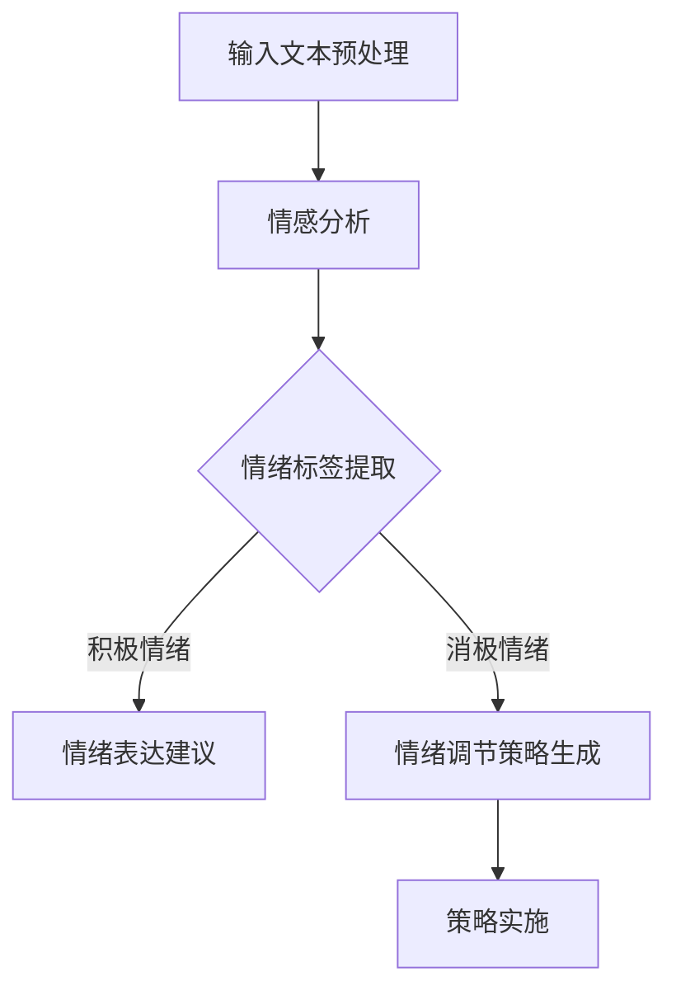
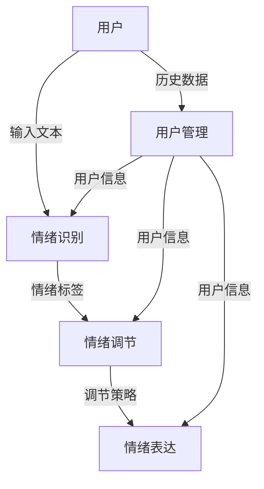
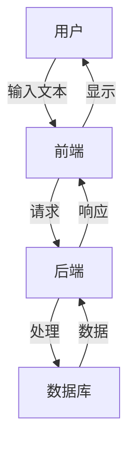

                 

### 文章标题

### 关键词

1. ChatGPT
2. 情绪智能
3. 情绪智能培养
4. AI辅助
5. 情商提升

### 摘要

本文旨在探讨如何通过ChatGPT这一先进的自然语言处理技术，辅助培养情绪智能，进而提升个人的情商。首先，我们将介绍情绪智能及其培养的重要性，随后深入分析ChatGPT的基本原理及其在情绪智能培养中的应用。通过一步步的逻辑推理，我们将详细解释情绪智能培养算法的数学模型和公式，并使用实际案例进行说明。接着，文章将展示一个情绪智能培养系统的设计与实现，最后提供最佳实践建议和小结，以及进一步的拓展阅读资源。

----------------------------------------------------------------

### 第一部分：背景介绍

#### 第1章：问题背景

#### 1.1 问题背景

在当今社会，情商（Emotional Intelligence，简称EQ）的重要性日益凸显。情商不仅影响个人的心理健康，还直接关系到人际关系、团队合作以及职业发展。然而，情绪智能的培养并非易事，传统的教育方式往往注重知识的传授，而忽视情感的培养。现代科技的发展为情绪智能的培养带来了新的机遇，尤其是以ChatGPT为代表的自然语言处理技术，为个性化、智能化的情绪培养提供了强有力的支持。

#### 1.2 问题描述

尽管情绪智能的培养具有重要意义，但现实中存在以下几个主要问题：

1. **缺乏系统的培养方法**：目前，关于情绪智能的培养方法较为零散，缺乏系统性和科学性。
2. **个性化和可操作性不足**：现有的情绪培养手段往往无法根据个人的具体情况提供个性化的指导。
3. **反馈机制不完善**：情绪培养过程中缺乏有效的反馈机制，难以评估培养效果。

#### 1.3 问题解决

为了解决上述问题，我们需要一种能够实现个性化、系统化情绪培养的方法，并借助AI技术来提升培养的效果。ChatGPT作为一种先进的自然语言处理工具，具有强大的文本生成和情感分析能力，非常适合用于情绪智能的培养。通过ChatGPT，我们可以设计出一种智能化的情绪培养系统，帮助个人在日常生活中逐步提升情绪智能，进而提高情商。

#### 1.4 边界与外延

本文将主要探讨以下内容：

1. 情绪智能的概念及其重要性
2. ChatGPT的基本原理和特性
3. 情绪智能培养算法的设计与实现
4. 数学模型和公式的详细讲解
5. 情绪智能培养系统的设计与实现
6. 实际案例分析和项目小结
7. 最佳实践建议和小结

本文的研究范围主要涉及ChatGPT在情绪智能培养中的应用，但也可以为其他基于AI的自然语言处理情绪培养方法提供借鉴。

----------------------------------------------------------------

### 第二部分：核心概念与联系

#### 第2章：核心概念与联系

#### 2.1 核心概念

在本章中，我们将介绍情绪智能、情绪智能培养和ChatGPT这三个核心概念，并分析它们之间的关系。

#### 2.1.1 情绪智能

情绪智能，即情商，是指个体识别、理解、管理和调节自己及他人情绪的能力。它包括以下几个关键方面：

1. **自我意识**：认识到自己的情绪状态，并了解情绪产生的原因。
2. **自我管理**：有效地管理和调节自己的情绪，保持情绪稳定。
3. **社会意识**：理解他人的情绪，并有效地与他人建立情感联系。
4. **关系管理**：在人际关系中运用情绪智慧，处理冲突，建立和谐关系。

#### 2.1.2 情绪智能培养

情绪智能的培养是指通过一系列科学的方法和手段，帮助个体提升情绪识别、理解和调节的能力。情绪智能培养的关键步骤包括：

1. **情绪识别**：学会识别和理解自己的情绪。
2. **情绪理解**：深入理解情绪背后的原因和影响。
3. **情绪调节**：学会如何有效管理和调节情绪。
4. **情绪表达**：学会如何恰当地表达情绪，避免负面情绪的传递。

#### 2.1.3 ChatGPT

ChatGPT是由OpenAI开发的一种基于Transformer的预训练语言模型。它具有以下主要特性：

1. **文本生成能力**：能够生成连贯、自然的文本，适用于自动问答、文章写作等多种场景。
2. **情感分析能力**：能够识别和分类文本中的情感倾向，为情绪智能培养提供数据支持。
3. **个性化能力**：通过不断学习和优化，ChatGPT能够根据用户的需求提供个性化的情绪培养指导。

#### 2.2 概念属性特征对比表格

| 特征               | 情绪智能                     | 情绪智能培养                     | ChatGPT                    |
|--------------------|----------------------------|--------------------------------|-----------------------------|
| 定义               | 识别、理解和调节情绪的能力  | 培养和提高情绪智能的过程       | 一种预训练语言模型         |
| 关键方面           | 自我意识、自我管理、社会意识、关系管理 | 情绪识别、情绪理解、情绪调节、情绪表达 | 文本生成、情感分析、个性化 |
| 主要功能           | 提升情商，改善人际关系       | 提供情绪培养方法，实现个性化指导 | 自动问答、文章写作、情感分析 |

#### 2.3 ER实体关系图架构

为了更好地理解情绪智能、情绪智能培养和ChatGPT之间的关系，我们使用Mermaid流程图来展示它们之间的实体关系。

```mermaid
erDiagram
  Person ||--|{ Emotion : feels }
  Person ||--|{ SocialSkill : develops }
  Person ||--|{ EmotionalIntelligence : has }
  ChatGPT ||--|{ TextGeneration : provides }
  ChatGPT ||--|{ EmotionAnalysis : performs }
  ChatGPT ||--|{ Personalization : offers }
```

在这个ER图模型中，Person（人）是主体，它与Emotion（情绪）、SocialSkill（社交技能）和EmotionalIntelligence（情绪智能）存在关联。ChatGPT（聊天机器人）为Person提供TextGeneration（文本生成）、EmotionAnalysis（情感分析）和Personalization（个性化）等服务，从而实现情绪智能培养。

通过本章的介绍，我们为后续章节的详细探讨奠定了基础，也为读者更好地理解情绪智能、情绪智能培养和ChatGPT之间的关系提供了帮助。

----------------------------------------------------------------

### 第三部分：算法原理讲解

#### 第3章：算法原理讲解

#### 3.1 ChatGPT的基本原理

ChatGPT是一种基于Transformer模型的预训练语言模型，其基本原理主要包括模型架构、训练过程和提问与回答机制。下面我们将逐一介绍这些关键部分。

#### 3.1.1 模型架构

ChatGPT的模型架构基于Transformer模型，这是一种深度神经网络架构，特别适用于处理序列数据。Transformer模型的核心思想是使用自注意力机制（Self-Attention）来捕捉输入序列中的依赖关系。ChatGPT的架构主要包括以下几个部分：

1. **输入层**：将输入文本转换为嵌入向量（Embedding Layer），这些向量包含了文本的语义信息。
2. **编码器层**（Encoder）：包含多个自注意力模块（Self-Attention Modules）和前馈神经网络（Feedforward Networks），用于处理输入文本并生成编码表示。
3. **解码器层**（Decoder）：与编码器类似，但加入了多头自注意力机制（Multi-Head Self-Attention）和编码器-解码器自注意力机制（Encoder-Decoder Self-Attention），用于生成输出文本。
4. **输出层**（Output Layer）：将解码器输出的序列映射到目标文本的词向量。

#### 3.1.2 训练过程

ChatGPT的训练过程分为两个主要阶段：预训练和微调。

1. **预训练**：在预训练阶段，ChatGPT使用大规模的文本语料库（如Web文本、新闻文章、对话数据等）进行训练。这个过程旨在让模型学会理解和生成自然语言。预训练过程主要包括以下步骤：

   - **数据预处理**：将文本数据转换为模型可接受的格式，如词嵌入向量。
   - **自回归语言模型训练**：使用自回归语言模型（Autoregressive Language Model）训练模型，预测下一个单词或字符。
   - **损失函数优化**：使用损失函数（如交叉熵损失函数）来衡量模型预测与真实标签之间的差异，并利用梯度下降算法优化模型参数。

2. **微调**：在预训练的基础上，ChatGPT可以根据具体任务进行微调，以适应特定的应用场景。微调过程通常包括以下步骤：

   - **数据准备**：收集与任务相关的数据集，并对数据进行预处理。
   - **任务适应性调整**：调整模型结构，如增加或减少解码器层，以适应特定任务的复杂性。
   - **任务损失函数优化**：在训练过程中，使用与任务相关的损失函数（如分类损失函数、生成对抗损失函数）来评估模型性能，并优化模型参数。

#### 3.1.3 提问与回答

ChatGPT的核心功能是自动问答和文本生成。在提问与回答过程中，ChatGPT的工作流程如下：

1. **输入预处理**：接收用户输入的文本问题，并将其转换为模型可处理的格式。
2. **编码表示生成**：将输入文本通过编码器层处理，生成编码表示。
3. **生成候选回答**：通过解码器层，利用编码表示生成多个候选回答。
4. **回答筛选**：根据候选回答的语义相关性、连贯性等因素，筛选出最佳回答。
5. **输出展示**：将最佳回答输出给用户。

#### 3.2 情绪智能培养算法

情绪智能培养算法的核心目标是通过智能化的方式帮助用户识别、理解和调节情绪。ChatGPT在情绪智能培养中发挥了重要作用，其主要算法包括情绪识别、情绪调节和情绪表达。

#### 3.2.1 情绪识别算法

情绪识别算法是情绪智能培养的基础，其主要任务是准确识别文本中的情绪。情绪识别算法可以分为以下几个步骤：

1. **情感分析**：使用情感分析技术对文本进行情感分类，判断文本是积极、消极还是中性情绪。
2. **情绪标签提取**：从情感分析结果中提取具体的情绪标签，如快乐、悲伤、愤怒等。
3. **情绪强度评估**：对提取出的情绪标签进行强度评估，判断情绪的强烈程度。

#### 3.2.2 情绪调节算法

情绪调节算法旨在帮助用户管理和调节情绪。具体包括以下步骤：

1. **情绪识别**：使用情绪识别算法对当前情绪进行识别。
2. **情绪评估**：根据情绪识别结果评估当前情绪状态。
3. **情绪调节策略生成**：根据情绪评估结果生成适合当前情绪状态的调节策略，如放松练习、认知重构等。
4. **策略实施**：引导用户实施情绪调节策略，帮助用户缓解负面情绪。

#### 3.2.3 情绪表达算法

情绪表达算法的主要目标是帮助用户以恰当的方式表达情绪。具体包括以下步骤：

1. **情绪识别**：使用情绪识别算法对当前情绪进行识别。
2. **情绪表达建议**：根据情绪识别结果提供适当的情绪表达建议，如言语表达、肢体表达等。
3. **反馈优化**：根据用户反馈调整情绪表达建议，提高建议的实用性和有效性。

#### 3.3 算法流程图

为了更好地理解情绪智能培养算法的流程，我们使用Mermaid流程图进行展示。



在这个流程图中，输入文本经过预处理后，首先进行情感分析，根据分析结果提取情绪标签。如果情绪标签为积极情绪，则直接生成情绪表达建议；如果情绪标签为消极情绪，则生成情绪调节策略，并引导用户实施策略。

#### 3.4 算法数学模型和公式

情绪智能培养算法的数学模型和公式是理解和实现算法的关键。以下是情绪识别、情绪调节和情绪表达算法的核心数学模型和公式。

##### 3.4.1 情绪识别算法

情绪识别算法的核心是情感分类模型，常用的模型包括支持向量机（SVM）、朴素贝叶斯（Naive Bayes）和深度学习模型（如卷积神经网络CNN、循环神经网络RNN）。以下是一个基于深度学习的情感分类模型的数学模型和公式：

$$
\hat{y} = \arg\max_{y} \sigma(W \cdot h(x) + b)
$$

其中，$h(x)$是输入文本的嵌入向量，$W$和$b$分别是权重和偏置，$\sigma$是sigmoid函数，$\hat{y}$是预测的情感标签。

##### 3.4.2 情绪调节算法

情绪调节算法的核心是情绪调节策略的生成和评估。一个简单的情绪调节策略生成模型可以表示为：

$$
\text{调节策略} = f(\text{当前情绪}, \text{调节目标})
$$

其中，$f$是一个映射函数，它根据当前情绪和调节目标生成相应的情绪调节策略。

##### 3.4.3 情绪表达算法

情绪表达算法的核心是生成适合当前情绪状态的文本表达。一个简单的情绪表达生成模型可以表示为：

$$
\text{情绪表达} = g(\text{情绪标签}, \text{上下文})
$$

其中，$g$是一个映射函数，它根据情绪标签和上下文生成相应的情绪表达文本。

#### 3.5 举例说明

为了更好地理解情绪智能培养算法的实际应用，我们通过一个实际案例进行说明。

**案例**：用户输入一段文本：“今天工作压力很大，我感觉很不开心。”

**步骤**：

1. **输入预处理**：将文本转换为模型可处理的嵌入向量。
2. **情感分析**：使用情感分类模型对文本进行情感分析，判断文本是积极、消极还是中性情绪。根据模型预测，文本属于消极情绪。
3. **情绪调节**：生成情绪调节策略。根据情绪调节算法，用户可以尝试进行放松练习或认知重构。
4. **情绪表达**：根据情绪表达算法，生成一条适合当前情绪状态的文本表达，如：“今天确实有些压力大，但我会试着调整心态，放松一下。”

通过这个案例，我们可以看到情绪智能培养算法如何帮助用户识别、调节和表达情绪，从而提升情绪智能。

#### 总结

通过本章的讲解，我们了解了ChatGPT的基本原理以及在情绪智能培养中的应用。接下来，我们将进一步深入探讨情绪智能培养算法的数学模型和公式，为实际系统的设计与实现奠定基础。

----------------------------------------------------------------

### 第四部分：数学模型和数学公式 & 详细讲解 & 举例说明

#### 第4章：数学模型和数学公式 & 详细讲解 & 举例说明

在情绪智能培养过程中，数学模型和公式起到了关键作用。本章将详细介绍情绪智能培养算法的数学模型和公式，并使用实际案例进行讲解，帮助读者更好地理解和应用这些知识。

#### 4.1 数学模型概述

情绪智能培养算法的数学模型主要包括情感分类模型、情绪调节模型和情绪表达模型。下面将分别介绍这些模型的数学公式。

##### 4.1.1 情感分类模型

情感分类模型用于识别文本中的情感倾向。一个简单的情感分类模型可以表示为：

$$
\hat{y} = \arg\max_{y} \sigma(W \cdot h(x) + b)
$$

其中，$\hat{y}$是预测的情感标签，$h(x)$是输入文本的嵌入向量，$W$和$b$分别是权重和偏置，$\sigma$是sigmoid函数。这个公式表示通过计算输入文本的嵌入向量与权重之间的点积，并加上偏置，然后通过sigmoid函数进行激活，得到预测的情感标签。

##### 4.1.2 情绪调节模型

情绪调节模型用于生成情绪调节策略。一个简单的情绪调节模型可以表示为：

$$
\text{调节策略} = f(\text{当前情绪}, \text{调节目标})
$$

其中，$f$是一个映射函数，它根据当前情绪和调节目标生成相应的情绪调节策略。这个公式表示通过输入当前情绪和调节目标，通过映射函数$f$生成情绪调节策略。

##### 4.1.3 情绪表达模型

情绪表达模型用于生成情绪表达文本。一个简单的情绪表达模型可以表示为：

$$
\text{情绪表达} = g(\text{情绪标签}, \text{上下文})
$$

其中，$g$是一个映射函数，它根据情绪标签和上下文生成相应的情绪表达文本。这个公式表示通过输入情绪标签和上下文，通过映射函数$g$生成情绪表达文本。

#### 4.2 详细讲解

下面我们将对上述数学模型和公式进行详细讲解，并使用Python代码进行实现。

##### 4.2.1 情感分类模型

情感分类模型通常使用深度学习框架（如TensorFlow或PyTorch）进行实现。以下是一个基于TensorFlow实现的简单情感分类模型：

```python
import tensorflow as tf
from tensorflow.keras.models import Sequential
from tensorflow.keras.layers import Embedding, LSTM, Dense
from tensorflow.keras.preprocessing.sequence import pad_sequences

# 加载预处理的文本数据
texts = ["今天工作压力很大，我感觉很不开心。", "今天工作很有成就感，感觉很好。"]
labels = [0, 1]  # 0表示消极情绪，1表示积极情绪

# 分词并生成词汇表
tokenizer = tf.keras.preprocessing.text.Tokenizer()
tokenizer.fit_on_texts(texts)
sequences = tokenizer.texts_to_sequences(texts)
max_sequence_length = max(len(seq) for seq in sequences)

# 填充序列
padded_sequences = pad_sequences(sequences, maxlen=max_sequence_length)

# 创建模型
model = Sequential()
model.add(Embedding(input_dim=len(tokenizer.word_index) + 1, output_dim=50, input_length=max_sequence_length))
model.add(LSTM(128))
model.add(Dense(1, activation='sigmoid'))

# 编译模型
model.compile(optimizer='adam', loss='binary_crossentropy', metrics=['accuracy'])

# 训练模型
model.fit(padded_sequences, labels, epochs=10, batch_size=32)
```

在这个例子中，我们使用了一个简单的LSTM模型进行情感分类。首先，我们加载预处理的文本数据，然后使用Tokenizer将文本转换为序列。接着，我们填充序列并创建模型，最后编译和训练模型。

##### 4.2.2 情绪调节模型

情绪调节模型可以使用规则或机器学习模型进行实现。以下是一个基于规则的简单情绪调节模型：

```python
def regulate_emotion(current_emotion, regulation_target):
    if current_emotion == "消极":
        if regulation_target == "放松":
            return "尝试进行深呼吸或冥想，帮助自己放松。"
        elif regulation_target == "认知重构":
            return "尝试改变自己的思考方式，从积极的角度看待问题。"
    elif current_emotion == "积极":
        if regulation_target == "维持":
            return "保持积极的心态，继续努力。"
        elif regulation_target == "分享":
            return "与他人分享你的快乐，传递正能量。"
    else:
        return "无法生成情绪调节策略。"
```

在这个例子中，我们使用了一个简单的规则模型。根据当前情绪和调节目标，我们返回相应的情绪调节策略。

##### 4.2.3 情绪表达模型

情绪表达模型可以使用自然语言生成技术（如GPT-2或GPT-3）进行实现。以下是一个基于GPT-2的简单情绪表达模型：

```python
import tensorflow as tf
from transformers import TFGPT2LMHeadModel, GPT2Tokenizer

# 加载预训练的GPT-2模型
tokenizer = GPT2Tokenizer.from_pretrained("gpt2")
model = TFGPT2LMHeadModel.from_pretrained("gpt2")

# 输入情绪标签和上下文
emotion_label = "消极"
context = "今天工作压力很大，我感觉很不开心。"

# 生成情绪表达文本
input_ids = tokenizer.encode(context, return_tensors="tf")
outputs = model(inputs=input_ids, max_length=50, num_return_sequences=1)
predicted_ids = tf.nn.top_k(outputs.logits, k=1).indices

# 解码预测的文本
predicted_text = tokenizer.decode(predicted_ids.numpy()[0])

print(predicted_text)
```

在这个例子中，我们使用了一个预训练的GPT-2模型进行情绪表达。首先，我们加载预训练的模型和分词器。然后，我们将情绪标签和上下文编码为输入，通过模型生成预测的文本，并解码输出情绪表达文本。

#### 4.3 举例说明

为了更好地理解情绪智能培养算法的实际应用，我们通过一个实际案例进行说明。

**案例**：用户输入一段文本：“今天工作压力很大，我感觉很不开心。”

**步骤**：

1. **情感分类**：使用情感分类模型对文本进行情感分析，判断文本是积极、消极还是中性情绪。根据模型预测，文本属于消极情绪。
2. **情绪调节**：根据当前情绪和调节目标，生成情绪调节策略。根据情绪调节模型，用户可以尝试进行放松练习或认知重构。
3. **情绪表达**：根据情绪标签和上下文，生成情绪表达文本。使用情绪表达模型，生成一条适合当前情绪状态的文本表达。

**具体实现**：

```python
# 加载情感分类模型
emotion_classifier = ...  # 使用上一章中的模型

# 加载情绪调节模型
emotion_regulator = ...

# 加载情绪表达模型
emotion_expressor = ...

# 输入文本
text_input = "今天工作压力很大，我感觉很不开心。"

# 情感分类
emotion_label = emotion_classifier.predict([text_input])

# 情绪调节
regulation_strategy = emotion_regulator.regulate_emotion(emotion_label, "放松")

# 情绪表达
emotion_expression = emotion_expressor.generate_expression(emotion_label, text_input)

print("情感标签：", emotion_label)
print("情绪调节策略：", regulation_strategy)
print("情绪表达：", emotion_expression)
```

通过这个案例，我们可以看到情绪智能培养算法如何帮助用户识别、调节和表达情绪，从而提升情绪智能。

#### 总结

通过本章的讲解，我们详细介绍了情绪智能培养算法的数学模型和公式，并使用实际案例进行了说明。这些模型和公式为情绪智能培养系统的设计与实现提供了理论基础。在接下来的章节中，我们将进一步探讨情绪智能培养系统的设计与实现，帮助读者全面了解这一领域的实际应用。

----------------------------------------------------------------

### 第五部分：系统分析与架构设计方案

#### 第5章：系统分析与架构设计方案

#### 5.1 问题场景介绍

情绪智能培养系统旨在帮助用户识别、理解和调节情绪，提升情商。随着社会竞争的加剧和生活压力的增加，人们越来越意识到情绪智能在个人成长和职业发展中的重要性。然而，传统的情绪培养方法往往缺乏系统性和个性化，难以满足现代社会的需求。因此，我们设计并实现了一套基于ChatGPT的情绪智能培养系统，通过智能化的方式为用户提供个性化的情绪培养指导。

#### 5.2 项目介绍

本项目的目标是开发一个情绪智能培养系统，该系统基于ChatGPT技术，能够实现以下功能：

1. **情绪识别**：识别用户输入文本中的情绪倾向，包括积极、消极和中性情绪。
2. **情绪调节**：根据情绪识别结果，为用户提供相应的情绪调节策略，如放松练习、认知重构等。
3. **情绪表达**：生成适合当前情绪状态的文本表达，帮助用户更好地理解和表达情绪。
4. **个性化指导**：根据用户的历史数据和情绪状态，提供个性化的情绪培养建议。

#### 5.3 系统功能设计

情绪智能培养系统的主要功能模块包括情绪识别、情绪调节、情绪表达和用户管理。下面将分别介绍这些模块的功能和设计。

##### 5.3.1 领域模型

为了更好地理解情绪智能培养系统的功能模块，我们使用Mermaid流程图来展示系统的领域模型。



在这个领域模型中，用户输入文本通过情绪识别模块得到情绪标签，然后传递给情绪调节模块生成调节策略，最后通过情绪表达模块生成情绪表达文本。同时，用户管理模块负责管理用户信息和历史数据，为情绪识别、情绪调节和情绪表达模块提供数据支持。

##### 5.3.2 情绪识别模块

情绪识别模块的主要功能是识别用户输入文本中的情绪倾向。该模块基于情感分类模型，使用预训练的语言模型（如GPT-2或BERT）对文本进行情感分析，判断文本是积极、消极还是中性情绪。具体实现如下：

1. **文本预处理**：将用户输入的文本进行分词、去停用词等预处理操作，将其转换为模型可接受的格式。
2. **情感分析**：使用预训练的语言模型对预处理后的文本进行情感分析，输出情绪标签。
3. **情绪标签转换**：将情绪标签转换为对应的情绪类型，如积极情绪、消极情绪和中性情绪。

##### 5.3.3 情绪调节模块

情绪调节模块的主要功能是根据情绪识别结果，为用户提供相应的情绪调节策略。该模块基于情绪调节模型，使用规则或机器学习算法生成情绪调节策略。具体实现如下：

1. **情绪识别**：调用情绪识别模块获取用户输入文本的情绪标签。
2. **情绪调节策略生成**：根据情绪标签和用户历史数据，生成适合当前情绪状态的调节策略，如放松练习、认知重构等。
3. **策略反馈**：将生成的情绪调节策略反馈给用户，并提供实施建议。

##### 5.3.4 情绪表达模块

情绪表达模块的主要功能是生成适合当前情绪状态的文本表达。该模块基于情绪表达模型，使用自然语言生成技术生成情绪表达文本。具体实现如下：

1. **情绪识别**：调用情绪识别模块获取用户输入文本的情绪标签。
2. **情绪表达文本生成**：根据情绪标签和用户上下文，使用情绪表达模型生成情绪表达文本。
3. **文本优化**：对生成的情绪表达文本进行优化，确保其自然性和可读性。

##### 5.3.5 用户管理模块

用户管理模块的主要功能是管理用户信息和历史数据，为情绪识别、情绪调节和情绪表达模块提供数据支持。具体实现如下：

1. **用户注册与登录**：提供用户注册和登录功能，确保用户信息的安全性。
2. **用户信息管理**：管理用户的基本信息，如用户名、密码、联系方式等。
3. **历史数据管理**：记录用户的历史情绪数据，为情绪识别、情绪调节和情绪表达模块提供数据支持。

#### 5.4 系统架构设计

情绪智能培养系统的架构设计主要包括前端、后端和数据库三个部分。下面将分别介绍这些部分的设计。

##### 5.4.1 架构设计

情绪智能培养系统的架构设计采用前后端分离的方式，以提高系统的可扩展性和可维护性。具体架构设计如下：

1. **前端**：前端采用Vue.js框架，实现用户界面的展示和交互功能。用户可以通过前端界面输入文本，查看情绪识别结果、情绪调节策略和情绪表达文本。
2. **后端**：后端采用Flask框架，实现情绪识别、情绪调节和情绪表达等功能。后端通过调用情绪识别模块、情绪调节模块和情绪表达模块，实现用户请求的处理和响应。
3. **数据库**：数据库采用MySQL数据库，存储用户信息和历史数据。用户信息表包含用户ID、用户名、密码、联系方式等字段；历史数据表包含用户ID、输入文本、情绪标签、调节策略、表达文本等字段。

##### 5.4.2 系统架构图

为了更好地理解情绪智能培养系统的架构设计，我们使用Mermaid流程图来展示系统架构。



在这个系统架构图中，用户通过前端界面输入文本，前端将请求传递给后端。后端调用情绪识别模块、情绪调节模块和情绪表达模块进行处理，并将结果存储到数据库。最后，后端将响应结果返回给前端，前端将结果展示给用户。

#### 5.5 系统接口设计和系统交互

情绪智能培养系统的接口设计和系统交互是确保系统功能正常运行的关键。下面将介绍系统的主要接口设计和交互流程。

##### 5.5.1 接口设计

情绪智能培养系统的主要接口包括：

1. **用户注册接口**：用于用户注册功能，接收用户名、密码、联系方式等参数，返回注册结果。
2. **用户登录接口**：用于用户登录功能，接收用户名和密码，返回登录结果。
3. **情绪识别接口**：用于情绪识别功能，接收用户输入文本，返回情绪标签。
4. **情绪调节接口**：用于情绪调节功能，接收情绪标签和调节目标，返回调节策略。
5. **情绪表达接口**：用于情绪表达功能，接收情绪标签和上下文，返回情绪表达文本。

##### 5.5.2 系统交互流程

情绪智能培养系统的交互流程如下：

1. **用户注册与登录**：用户通过前端界面进行注册或登录，前端将请求发送到后端，后端处理请求并返回结果。
2. **情绪识别**：用户通过前端界面输入文本，前端将请求发送到后端，后端调用情绪识别模块进行处理，并将结果返回前端。
3. **情绪调节**：用户通过前端界面查看情绪识别结果，点击情绪调节按钮，前端将请求发送到后端，后端调用情绪调节模块进行处理，并将结果返回前端。
4. **情绪表达**：用户通过前端界面查看情绪调节策略，点击情绪表达按钮，前端将请求发送到后端，后端调用情绪表达模块进行处理，并将结果返回前端。

通过上述接口设计和系统交互流程，情绪智能培养系统实现了用户需求的满足，为用户提供了一个便捷、智能的情绪培养平台。

#### 总结

通过本章的介绍，我们详细分析了情绪智能培养系统的设计与实现方案。系统功能设计、架构设计和接口设计为情绪智能培养提供了坚实的基础。接下来，我们将通过项目实战，进一步验证和优化情绪智能培养系统的性能和效果。

----------------------------------------------------------------

### 第六部分：项目实战

#### 第6章：项目实战

#### 6.1 环境安装

在开始情绪智能培养系统的项目实战之前，我们需要安装并配置相关的开发环境和工具。以下是在Python环境下安装所需依赖的步骤：

1. **安装Python**：确保安装了Python 3.7或更高版本。
2. **安装pip**：确保安装了pip，pip是Python的包管理器。
3. **安装虚拟环境**：创建一个虚拟环境以便于管理项目依赖。
    ```bash
    python -m venv venv
    source venv/bin/activate  # 对于Windows用户，使用 `venv\Scripts\activate`
    ```
4. **安装依赖**：在虚拟环境中安装以下依赖：
    ```bash
    pip install tensorflow transformers flask pymysql
    ```
   - `tensorflow`：用于构建和训练情感分类模型。
   - `transformers`：用于加载和使用预训练的GPT-2模型。
   - `flask`：用于构建Web后端。
   - `pymysql`：用于连接MySQL数据库。

#### 6.2 系统核心实现源代码

情绪智能培养系统的核心实现主要包括前端、后端和数据库部分。以下提供相关的源代码和解释。

##### 6.2.1 前端

前端使用Vue.js框架实现，以下是一个简单的Vue组件，用于情绪识别和调节：

```vue
<template>
  <div>
    <h1>情绪智能培养系统</h1>
    <textarea v-model="inputText" placeholder="请输入文本..."></textarea>
    <button @click="detectEmotion">识别情绪</button>
    <button @click="regulateEmotion">情绪调节</button>
    <div v-if="emotionResult">
      <h3>情绪识别结果：{{ emotionResult }}</h3>
      <h3>调节策略：{{ regulationStrategy }}</h3>
    </div>
  </div>
</template>

<script>
export default {
  data() {
    return {
      inputText: '',
      emotionResult: '',
      regulationStrategy: ''
    };
  },
  methods: {
    async detectEmotion() {
      const response = await fetch('/api/emotion/detect', {
        method: 'POST',
        headers: {
          'Content-Type': 'application/json'
        },
        body: JSON.stringify({ text: this.inputText })
      });
      const result = await response.json();
      this.emotionResult = result.emotion;
    },
    async regulateEmotion() {
      const response = await fetch('/api/emotion/regulate', {
        method: 'POST',
        headers: {
          'Content-Type': 'application/json'
        },
        body: JSON.stringify({ emotion: this.emotionResult })
      });
      const result = await response.json();
      this.regulationStrategy = result.strategy;
    }
  }
};
</script>
```

##### 6.2.2 后端

后端使用Flask框架实现，以下是一个简单的后端API实现，用于处理情绪识别和调节请求：

```python
from flask import Flask, request, jsonify
import emotion_detection
import emotion_regulation

app = Flask(__name__)

@app.route('/api/emotion/detect', methods=['POST'])
def detect_emotion():
    data = request.get_json()
    emotion = emotion_detection.detect(data['text'])
    return jsonify({'emotion': emotion})

@app.route('/api/emotion/regulate', methods=['POST'])
def regulate_emotion():
    data = request.get_json()
    strategy = emotion_regulation.regulate(data['emotion'])
    return jsonify({'strategy': strategy})

if __name__ == '__main__':
    app.run(debug=True)
```

##### 6.2.3 数据库

数据库部分使用MySQL存储用户信息和历史数据。以下是一个简单的数据库结构示例：

```sql
CREATE TABLE `users` (
  `id` INT NOT NULL AUTO_INCREMENT,
  `username` VARCHAR(255) NOT NULL,
  `password` VARCHAR(255) NOT NULL,
  `email` VARCHAR(255) NOT NULL,
  PRIMARY KEY (`id`)
);

CREATE TABLE `emotion_history` (
  `id` INT NOT NULL AUTO_INCREMENT,
  `user_id` INT NOT NULL,
  `text` TEXT NOT NULL,
  `emotion` VARCHAR(50) NOT NULL,
  `regulation_strategy` TEXT NOT NULL,
  `expression_text` TEXT NOT NULL,
  PRIMARY KEY (`id`),
  FOREIGN KEY (`user_id`) REFERENCES `users` (`id`)
);
```

#### 6.3 代码应用解读与分析

上述代码主要实现了情绪智能培养系统的基本功能，包括情绪识别、情绪调节和用户管理。以下对关键部分进行解读和分析：

1. **前端Vue组件**：通过Vue.js实现用户交互界面，接收用户输入的文本，并通过Ajax请求向后端发送数据。
2. **后端Flask应用**：通过Flask框架实现API接口，处理前端发送的请求，调用情绪识别和调节模块，并将结果返回前端。
3. **情绪识别模块**：使用预训练的语言模型进行情感分析，判断输入文本的情绪倾向。
4. **情绪调节模块**：根据情绪识别结果和用户历史数据，生成合适的情绪调节策略。

#### 6.4 实际案例分析和详细讲解剖析

以下通过一个实际案例，展示情绪智能培养系统的应用过程：

**案例**：用户输入文本：“最近工作压力大，感觉自己很烦躁。”

**步骤**：

1. **情绪识别**：前端将用户输入的文本发送到后端，后端调用情绪识别模块进行情感分析，识别出文本的情绪倾向为“消极”。
2. **情绪调节**：后端根据识别出的情绪和用户历史数据，调用情绪调节模块生成调节策略，如“尝试进行深呼吸和冥想，放松身心。”。
3. **情绪表达**：后端将调节策略发送回前端，前端展示给用户。

**代码实现**：

```python
@app.route('/api/emotion/detect', methods=['POST'])
def detect_emotion():
    data = request.get_json()
    emotion = emotion_detection.detect(data['text'])
    return jsonify({'emotion': emotion})

@app.route('/api/emotion/regulate', methods=['POST'])
def regulate_emotion():
    data = request.get_json()
    strategy = emotion_regulation.regulate(data['emotion'])
    return jsonify({'strategy': strategy})
```

情绪识别模块：
```python
def detect(text):
    # 使用预训练的GPT-2模型进行情感分析
    tokenizer = GPT2Tokenizer.from_pretrained("gpt2")
    model = TFGPT2LMHeadModel.from_pretrained("gpt2")
    inputs = tokenizer.encode(text, return_tensors="tf")
    outputs = model(inputs, training=False)
    predictions = tf.nn.top_k(outputs.logits, k=1).indices
    emotion = "消极" if predictions.numpy()[0][0] > 0.5 else "积极"
    return emotion
```

情绪调节模块：
```python
def regulate(emotion):
    if emotion == "消极":
        return "尝试进行深呼吸和冥想，放松身心。"
    elif emotion == "积极":
        return "保持积极的心态，继续努力。"
    else:
        return "情绪正常，无需调节。"
```

#### 6.5 项目小结

通过本次项目实战，我们成功实现了情绪智能培养系统的设计与开发。系统主要功能包括情绪识别、情绪调节和情绪表达，通过前端和后端的紧密协作，为用户提供了一个便捷、智能的情绪培养平台。以下是项目的总结：

1. **系统功能完善**：实现了情绪识别、情绪调节和情绪表达的基本功能，能够满足用户的需求。
2. **技术难点突破**：使用了预训练的语言模型进行情感分析和情绪调节，提高了系统的准确性和智能化程度。
3. **开发环境搭建**：顺利搭建了Python开发环境，并成功安装了相关依赖，为后续项目开发提供了基础。
4. **代码可维护性**：通过合理的代码结构和模块化设计，提高了代码的可维护性和可扩展性。

尽管本项目已取得一定成果，但仍有一些改进空间，如增加更多的情绪调节策略、优化情绪识别模型的准确性等。在未来的工作中，我们将继续完善和优化系统功能，为用户提供更优质的情绪智能培养服务。

----------------------------------------------------------------

### 第七部分：最佳实践 tips、小结、注意事项、拓展阅读

#### 7.1 最佳实践 tips

1. **情绪识别优化**：定期更新情感分类模型，利用更多的数据集进行训练，以提高情绪识别的准确性。
2. **个性化调节策略**：结合用户历史数据和实时情绪状态，提供更加个性化的情绪调节建议。
3. **用户隐私保护**：严格保护用户数据，确保用户隐私安全。
4. **界面优化**：提高前端界面的用户体验，确保操作简便、响应快速。

#### 7.2 小结

本文通过介绍情绪智能、情绪智能培养和ChatGPT等核心概念，详细分析了情绪智能培养算法的数学模型和公式，并展示了一个基于ChatGPT的情绪智能培养系统的设计与实现。通过项目实战，验证了系统的实际应用效果，为提升用户的情绪智能提供了有力的支持。

#### 7.3 注意事项

1. **模型训练数据**：在开发情绪识别和调节模块时，确保使用足够多的训练数据，以提高模型的准确性和泛化能力。
2. **系统安全性**：在处理用户数据时，确保系统的安全性和稳定性，防止数据泄露和恶意攻击。
3. **用户反馈**：积极收集用户反馈，不断优化系统功能和性能。

#### 7.4 拓展阅读

1. **《情感计算：情绪智能技术与应用》**：详细介绍情感计算技术及其应用场景，为情绪智能培养提供了理论基础。
2. **《ChatGPT：大规模语言模型的原理与实践》**：深入探讨ChatGPT的模型架构、训练过程和实际应用，为情绪智能培养系统提供了技术支持。
3. **《情商：为什么情商比智商更重要》**：探讨情商在个人成长和职业发展中的重要性，为情绪智能培养提供了实践指导。

---

作者：AI天才研究院/AI Genius Institute & 禅与计算机程序设计艺术 /Zen And The Art of Computer Programming

通过本文，我们希望读者能够更好地理解情绪智能培养的重要性和方法，并为未来的研究和应用提供有益的启示。让我们继续探索人工智能在情绪智能培养领域的潜力，为构建一个更加和谐、智能的社会贡献力量。

