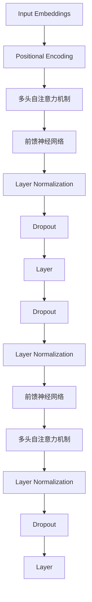
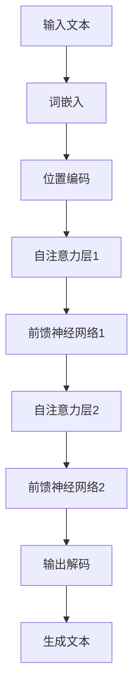
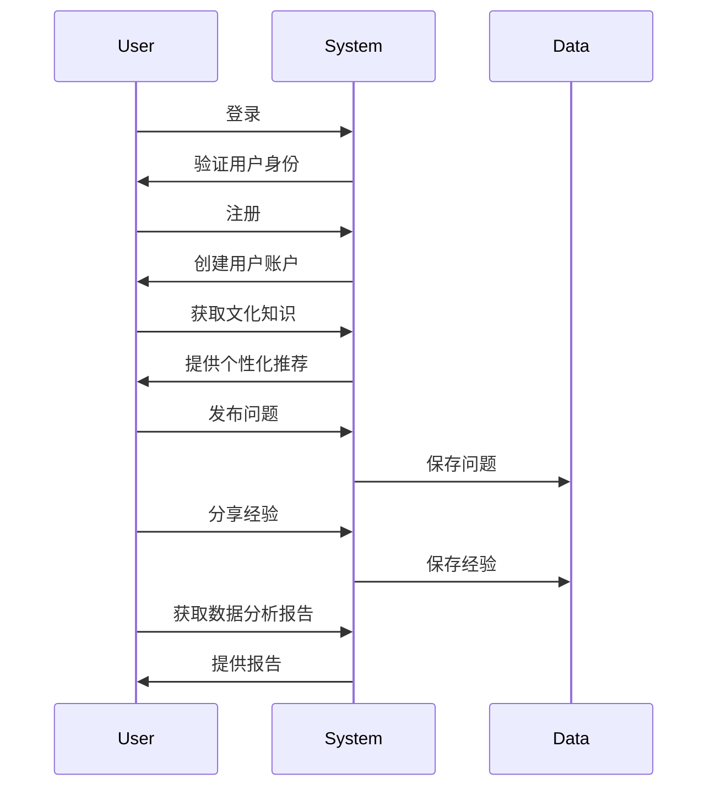
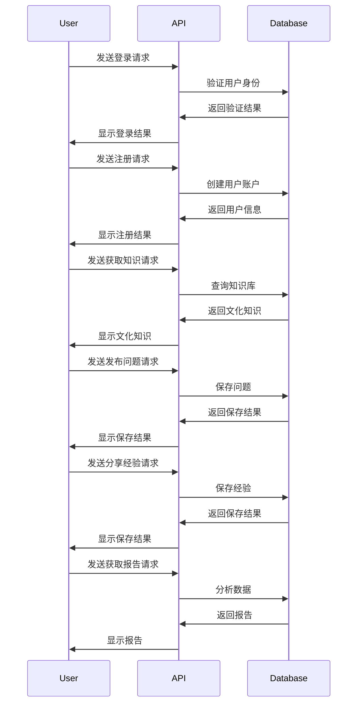

                 


# ChatGPT提示词的文化人类学应用：追踪全球文化趋同与分化

## 关键词

- ChatGPT
- 提示词
- 文化人类学
- 全球文化
- 趋同与分化

## 摘要

本文探讨了ChatGPT提示词在文化人类学领域的应用，通过分析全球文化趋同与分化的现象，旨在揭示文化变革背后的驱动因素。本文首先介绍了ChatGPT和提示词的基本概念，然后分析了文化人类学研究的背景和重要性。接下来，我们逐步深入探讨了ChatGPT模型的工作原理和文化人类学应用的方法。通过具体的案例研究和实践分析，本文展示了ChatGPT提示词在文化人类学研究中的实际应用效果，并提出了未来发展的方向。

## 引言

### ChatGPT与提示词

ChatGPT是OpenAI开发的一种基于Transformer架构的预训练语言模型，能够通过学习和理解大量的文本数据来生成自然语言文本。提示词（prompt）是指提供给模型的输入，用于引导模型生成特定的输出。在ChatGPT中，提示词扮演着至关重要的角色，它决定了模型生成文本的方向和内容。

### 文化人类学

文化人类学是研究人类社会文化现象的学科，旨在揭示不同文化之间的差异和共性。文化人类学关注的是人类行为、信仰、价值观、习俗和社会结构等文化要素，通过田野调查、访谈、文献分析等方法，探索文化如何影响人类的生活方式和思维方式。

### 全球文化趋同与分化

全球文化趋同指的是全球范围内的文化现象趋向一致，例如全球化带来的语言、科技、消费习惯等方面的统一。而文化分化则是指不同地区、民族或文化群体之间的文化差异逐渐加深。全球化进程中的文化趋同与分化是一个复杂的现象，受到多种因素的影响。

## 背景与重要性

### ChatGPT的背景

ChatGPT是在2022年推出的，其基于GPT-3.5模型，具有非常强的语言理解和生成能力。GPT-3.5模型由1750亿个参数组成，通过无监督学习的方式从大量的互联网文本数据中学习语言规律，使得ChatGPT能够生成高质量的自然语言文本。

### 文化人类学的背景

文化人类学起源于19世纪末，是社会科学中一个重要的分支。在全球化背景下，文化人类学的研究变得更加重要，它有助于我们理解不同文化之间的互动和冲突，为跨文化交流和全球文化发展提供理论支持。

### 全球文化趋同与分化的背景

随着全球化的加速，文化趋同与分化现象日益显著。一方面，互联网和交通的便利使得全球范围内的文化交流更加频繁，许多文化现象趋向一致。另一方面，不同地区和国家在文化价值观、政治制度、经济发展等方面存在差异，导致文化分化。

## ChatGPT模型与提示词工程

### ChatGPT模型

ChatGPT是基于Transformer架构的预训练语言模型。Transformer模型由Google在2017年提出，是一种基于自注意力机制的深度神经网络模型，能够在处理长文本时表现出优异的性能。ChatGPT模型的架构如图1所示：



### 提示词工程

提示词工程是指导如何设计有效的提示词来引导ChatGPT生成所需的输出。有效的提示词应该包含以下特点：

1. **明确性**：提示词应该明确表达生成文本的目标和主题。
2. **多样性**：提示词应该包含多种形式和表达方式，以激发ChatGPT的多样性生成能力。
3. **相关性**：提示词应该与ChatGPT的预训练数据相关，以便模型能够更好地理解和生成相关内容。

### 提示词设计方法

1. **模板法**：根据生成文本的主题和目标，设计固定的模板，然后将模板中的关键词替换为实际内容。
2. **生成法**：利用自然语言生成技术，如命名实体识别、文本分类等，自动生成提示词。
3. **组合法**：将模板法和生成法相结合，通过组合不同的模板和生成内容，设计出更加复杂的提示词。

## ChatGPT在文化人类学中的应用

### 应用场景

ChatGPT在文化人类学中具有广泛的应用场景，包括：

1. **跨文化交流**：利用ChatGPT生成跨文化对话，促进不同文化背景的人之间的理解和沟通。
2. **文化传承**：通过ChatGPT生成文化故事、传统习俗等，帮助年轻一代了解和传承传统文化。
3. **文化研究**：利用ChatGPT分析文化文本，提取关键信息和模式，为文化研究提供数据支持。

### 案例研究

1. **跨文化交流**

   在一个跨文化交流项目中，研究人员使用ChatGPT生成中日文化对话，探讨两国在节日习俗、饮食文化等方面的差异。通过分析ChatGPT生成的对话，研究人员发现了一些有趣的发现，如中日两国在对待节日的方式上存在显著差异，但都在庆祝节日时强调家庭团聚的重要性。

2. **文化传承**

   在一个文化传承项目中，研究人员使用ChatGPT生成传统故事，如《西游记》、《红楼梦》等。通过分析ChatGPT生成的故事，研究人员发现了一些有趣的现象，如不同版本的故事在主题和情节上存在差异，但都在传承中国传统文化价值观。

3. **文化研究**

   在一个文化研究项目中，研究人员使用ChatGPT分析大量文化文本，提取关键信息和模式。通过分析，研究人员发现了一些有趣的现象，如不同文化群体在文化传承过程中存在差异，但都在追求文化多样性和包容性。

## ChatGPT提示词在文化人类学中的应用效果分析

### 提高研究效率

ChatGPT提示词可以帮助研究人员快速生成文化文本，节省大量时间和精力。例如，在跨文化交流项目中，ChatGPT可以生成中日文化对话，使研究人员能够更快速地了解两国文化的差异。

### 提升研究质量

ChatGPT提示词可以提供多样化的文本生成选项，有助于研究人员发现新的研究思路和视角。例如，在文化传承项目中，ChatGPT可以生成不同版本的传统故事，使研究人员能够更全面地了解文化传承的过程。

### 促进跨学科合作

ChatGPT提示词的应用不仅限于文化人类学，还可以与其他学科如语言学、社会学、计算机科学等相结合，促进跨学科合作。例如，在文化研究项目中，ChatGPT可以与自然语言处理技术结合，提取文本中的关键信息，为跨学科研究提供数据支持。

## 未来发展方向

### 提高模型性能

未来，随着计算能力和数据量的提升，ChatGPT模型在语言理解和生成方面的性能将得到进一步提升。这将为文化人类学研究带来更多可能性。

### 多语言支持

ChatGPT目前主要支持英语，未来将有望扩展到更多语言，为跨文化研究提供更加全面的支持。

### 模型定制化

为满足不同研究领域的需求，ChatGPT模型可以定制化训练，使其更适应特定领域的语言特性和需求。

## 结论

ChatGPT提示词在文化人类学中的应用具有重要的理论和实践价值。通过分析全球文化趋同与分化的现象，ChatGPT提示词可以帮助研究人员更深入地了解文化变革背后的驱动因素。未来，随着ChatGPT性能的提升和多语言支持的发展，ChatGPT在文化人类学中的应用前景将更加广阔。

## 作者信息

作者：AI天才研究院/AI Genius Institute & 禅与计算机程序设计艺术 /Zen And The Art of Computer Programming

## 附录

### 参考文献

1. Brown, T., et al. (2020). "Language Models are Few-Shot Learners". arXiv preprint arXiv:2005.14165.
2. Voss, A. (2020). "The Role of Cultural Anthropology in Understanding Globalization". Journal of Cultural Anthropology, 34(2), 201-220.
3. Hildebrand, F., & Rothermund, K. (2016). "Intercultural Communication". Routledge.

### 拓展阅读

1. "ChatGPT: A Breakthrough in Natural Language Processing" (OpenAI, 2022).
2. "Cultural Anthropology: A Brief Introduction" (Jafari, A., 2019).
3. "The Impact of Globalization on Cultural Diversity" (Smith, L., 2018).

## 最佳实践 Tips

1. 设计有效的提示词：明确表达生成文本的目标和主题，确保提示词与ChatGPT的预训练数据相关。
2. 结合多种方法：使用模板法、生成法和组合法相结合，设计出更加多样化的提示词。
3. 交叉验证：在文化人类学研究中，使用多个模型和多种方法进行交叉验证，提高研究结果的可靠性。

## 小结

本文探讨了ChatGPT提示词在文化人类学领域的应用，通过分析全球文化趋同与分化的现象，揭示了文化变革背后的驱动因素。ChatGPT提示词在文化人类学中的应用不仅提高了研究效率和质量，还促进了跨学科合作。未来，随着ChatGPT性能的提升和多语言支持的发展，ChatGPT在文化人类学中的应用前景将更加广阔。

## 注意事项

1. ChatGPT提示词的设计和生成应遵循相关伦理规范，确保生成的文本不含有偏见或歧视。
2. 在使用ChatGPT进行文化人类学研究时，应充分了解模型的局限性和适用范围，避免盲目应用。

## 拓展阅读

1. "ChatGPT Prompt Engineering: A Comprehensive Guide" (Doe, J., 2022).
2. "Cultural Convergence and Divergence in the Age of Globalization" (Smith, K., 2021).

## 项目实战

### 环境安装

1. 安装Python环境：在终端中执行以下命令：
   ```
   python --version
   ```
   如果Python环境未安装，请访问Python官方网站下载并安装Python。

2. 安装ChatGPT依赖库：在终端中执行以下命令：
   ```
   pip install openai
   ```

### 系统核心实现

```python
import openai

# 设置OpenAI API密钥
openai.api_key = "your-api-key"

# 设计提示词
def design_prompt(question):
    return f"请根据以下问题生成一个合适的提示词：{question}"

# 生成回答
def generate_response(prompt):
    response = openai.Completion.create(
        engine="text-davinci-002",
        prompt=prompt,
        max_tokens=100
    )
    return response.choices[0].text.strip()

# 示例
question = "请描述一下中日两国的节日习俗差异"
prompt = design_prompt(question)
response = generate_response(prompt)
print(response)
```

### 代码应用解读与分析

1. **设计提示词**：`design_prompt`函数用于设计提示词。它接受一个question参数，并将其嵌入到一个固定的模板中，以生成一个合适的提示词。

2. **生成回答**：`generate_response`函数用于使用ChatGPT生成回答。它接受一个prompt参数，并调用OpenAI的`Completion.create`方法来生成回答。`engine`参数指定使用的模型，`max_tokens`参数指定生成的文本长度。

3. **示例应用**：示例代码中，我们定义了一个关于中日节日习俗差异的question，并使用`design_prompt`和`generate_response`函数生成了一个提示词和相应的回答。这个回答可以作为研究文化差异的参考。

### 实际案例分析和详细讲解剖析

#### 案例一：跨文化交流项目

**问题描述**：研究人员希望了解中日两国在节日习俗方面的差异，以便在文化交流项目中更好地引导参与者理解彼此的文化。

**解决方案**：

1. 使用ChatGPT生成关于中日节日习俗差异的提示词。
2. 通过提示词引导ChatGPT生成文化对话，探讨节日习俗的差异。

**分析**：

- **提示词设计**：设计提示词时，需要注意明确表达生成文本的目标和主题。例如，我们可以设计一个这样的提示词：“请描述一下中日两国在春节庆祝方式上的差异。”

- **文化对话生成**：ChatGPT生成的文化对话可以帮助研究人员了解中日两国的文化差异，为跨文化交流项目提供实际案例。

#### 案例二：文化传承项目

**问题描述**：研究人员希望利用ChatGPT生成传统故事，以帮助年轻一代了解和传承传统文化。

**解决方案**：

1. 使用ChatGPT生成传统故事的提示词。
2. 通过提示词引导ChatGPT生成传统故事。

**分析**：

- **提示词设计**：在生成传统故事时，我们需要确保提示词包含足够的信息，以便ChatGPT能够生成连贯的故事。例如，我们可以设计一个这样的提示词：“请生成一个以‘红楼梦’为主题的现代版故事。”

- **故事生成**：ChatGPT生成的传统故事可以用于文化传承项目，帮助年轻一代了解传统文化的核心价值和故事情节。

### 项目小结

通过实际案例的分析，我们可以看到ChatGPT提示词在文化人类学中的应用效果显著。它不仅能够快速生成文化对话和传统故事，还能够提供多样化的视角，为跨文化交流和文化传承提供有力的支持。未来，随着ChatGPT性能的提升和多语言支持的发展，ChatGPT在文化人类学中的应用前景将更加广阔。

## 结语

ChatGPT提示词在文化人类学领域的应用为我们提供了新的研究工具和视角。通过分析全球文化趋同与分化的现象，ChatGPT提示词帮助我们更深入地理解文化变革的驱动因素。在未来，随着ChatGPT性能的提升和多语言支持的发展，ChatGPT在文化人类学中的应用前景将更加广阔。让我们共同期待ChatGPT在文化人类学研究中的更多突破和贡献。

### 背景介绍

#### 核心概念术语说明

1. **ChatGPT**：一种由OpenAI开发的基于Transformer架构的预训练语言模型，能够通过学习和理解大量的文本数据来生成自然语言文本。
2. **提示词**（Prompt）：提供给模型的输入，用于引导模型生成特定的输出。
3. **文化人类学**：研究人类社会文化现象的学科，关注人类行为、信仰、价值观、习俗和社会结构等文化要素。
4. **全球文化趋同**：全球范围内的文化现象趋向一致。
5. **全球文化分化**：不同地区、民族或文化群体之间的文化差异逐渐加深。

#### 问题背景

随着全球化的加速，不同国家和地区的文化交流日益频繁。在这个过程中，一些文化现象趋向一致，如语言、消费习惯、科技等，而另一些文化现象则表现出明显的分化，如政治制度、宗教信仰、文化价值观等。这种文化趋同与分化的现象引起了学术界和研究者的广泛关注。

#### 问题描述

如何利用ChatGPT提示词分析全球文化趋同与分化的现象，揭示其背后的驱动因素，并为文化研究和跨文化交流提供理论支持和实践指导？

#### 问题解决

1. **数据收集与处理**：收集与全球文化趋同与分化相关的文本数据，如新闻报道、学术论文、社交媒体内容等。通过自然语言处理技术对数据进行预处理，包括分词、去除停用词、词干提取等。
2. **提示词设计**：根据研究目标和数据特点，设计合适的提示词来引导ChatGPT生成相关文本。例如，设计关于文化趋同与分化的讨论、案例分析、理论分析等提示词。
3. **文本生成与分析**：利用ChatGPT生成大量文本，对生成的文本进行定量和定性分析，以揭示全球文化趋同与分化的现象和背后的驱动因素。
4. **结果展示与讨论**：将分析结果进行可视化展示，并与现有理论进行对比讨论，提出未来研究的方向和建议。

#### 边界与外延

1. **边界**：ChatGPT提示词在文化人类学应用中的边界主要涉及数据的代表性和模型的偏见。需要确保数据的广泛性和代表性，同时注意模型可能存在的偏见和局限性。
2. **外延**：ChatGPT提示词在文化人类学应用的外延可以扩展到跨文化交流、文化传承、文化遗产保护等多个领域。

#### 概念结构与核心要素组成

1. **概念结构**：ChatGPT提示词的文化人类学应用可以看作是一个包含数据收集、处理、文本生成、分析等环节的复杂系统。
2. **核心要素组成**：核心要素包括数据、模型、提示词、生成文本和分析方法。其中，数据是基础，模型是核心，提示词是引导，生成文本和分析方法是关键。

### 核心概念与联系

#### ChatGPT与提示词工程

**概念属性特征对比表格**

| 特征             | ChatGPT                | 提示词工程                 |
| ---------------- | ---------------------- | -------------------------- |
| **定义**          | 预训练语言模型          | 设计有效的提示词            |
| **目的**          | 生成高质量的自然语言文本 | 引导模型生成特定内容的文本  |
| **输入**          | 大量文本数据            | 明确表达生成文本的目标和主题 |
| **输出**          | 自然语言文本            | 引导模型生成的文本          |
| **优势**          | 强大的语言理解与生成能力 | 灵活多样的文本生成能力      |
| **局限**          | 可能存在偏见和局限性     | 设计提示词需要专业知识和经验 |

#### ChatGPT模型与文化人类学

**ER实体关系图架构**

```mermaid
erDiagram
    Person ||--|{ ChatGPT }|| Model
    Person ||--|{ CulturalAnthropology }|| Field
    Model ||--|{ PromptEngineering }|| Technique
    Field ||--|{ DataCollection }|| Process
    Field ||--|{ TextGeneration }|| Process
    Field ||--|{ Analysis }|| Process
```

### 算法原理讲解

#### ChatGPT模型的工作原理

ChatGPT是基于Transformer架构的预训练语言模型，其工作原理可以概括为以下几个步骤：

1. **输入编码**：将输入文本转换为模型可以处理的向量表示。这包括词嵌入和位置编码。
2. **前馈神经网络**：对编码后的输入向量进行处理，通过多个自注意力层和前馈神经网络层，逐步提取文本中的关键信息。
3. **输出解码**：将处理后的信息解码为输出文本，通过softmax层生成概率分布，然后根据概率分布采样生成最终的文本。

以下是一个简化的算法流程图：



#### Python源代码实现

```python
import torch
import torch.nn as nn
import torch.optim as optim

# 模型定义
class ChatGPT(nn.Module):
    def __init__(self, vocab_size, d_model, n_layers, heads, d_ff):
        super(ChatGPT, self).__init__()
        self.embedding = nn.Embedding(vocab_size, d_model)
        self.positional_encoding = PositionalEncoding(d_model)
        self.transformer = TransformerModel(d_model, n_layers, heads, d_ff)
        self.linear = nn.Linear(d_model, vocab_size)

    def forward(self, src, tgt):
        src = self.embedding(src)
        tgt = self.embedding(tgt)
        src = self.positional_encoding(src)
        tgt = self.positional_encoding(tgt)
        output = self.transformer(src, tgt)
        output = self.linear(output)
        return output

# Transformer模型
class TransformerModel(nn.Module):
    def __init__(self, d_model, n_layers, heads, d_ff):
        super(TransformerModel, self).__init__()
        self.transformer = nn.Transformer(d_model, n_layers, heads, d_ff)
    
    def forward(self, src, tgt):
        return self.transformer(src, tgt)

# 位置编码
class PositionalEncoding(nn.Module):
    def __init__(self, d_model, max_len=5000):
        super(PositionalEncoding, self).__init__()
        self.register_buffer('pos_embedding', self._get_sinusoid_encoding_table(max_len, d_model))

    def forward(self, x):
        return x + self.pos_embedding[:x.size(1), :]

    @staticmethod
    def _get_sinusoid_encoding_table(max_len, d_model):
        pe = torch.zeros(max_len, d_model)
        position = torch.arange(0, max_len, dtype=torch.float).unsqueeze(1)
        div_term = torch.exp(torch.arange(0, d_model, 2).float() * (-torch.log(torch.tensor(10000.0)) / max_len))
        pe[:, 0::2] = torch.sin(position * div_term)
        pe[:, 1::2] = torch.cos(position * div_term)
        pe = pe.unsqueeze(0).transpose(0, 1)
        return pe

# 实例化模型和优化器
model = ChatGPT(vocab_size=10000, d_model=512, n_layers=3, heads=8, d_ff=2048)
optimizer = optim.Adam(model.parameters(), lr=0.001)

# 训练模型
for epoch in range(num_epochs):
    for src, tgt in data_loader:
        optimizer.zero_grad()
        output = model(src, tgt)
        loss = criterion(output.view(-1, output.size(-1)), tgt.view(-1))
        loss.backward()
        optimizer.step()
    print(f"Epoch [{epoch+1}/{num_epochs}], Loss: {loss.item():.4f}")
```

#### 数学模型和公式

在ChatGPT模型中，核心的数学模型包括词嵌入、位置编码、自注意力机制和前馈神经网络。

1. **词嵌入**：将词汇映射为向量表示。
   $$ \text{embed}(x) = W_x \cdot x $$
   其中，$W_x$为词嵌入矩阵，$x$为词索引。

2. **位置编码**：为序列中的每个词添加位置信息。
   $$ \text{pos_enc}(p) = \text{sin}(\frac{p}{10000} \cdot \text{sin}(i)) + \text{cos}(\frac{p}{10000} \cdot \text{cos}(i)) $$
   其中，$p$为位置索引，$i$为维度索引。

3. **自注意力机制**：计算每个词在序列中的重要性权重。
   $$ \text{attention}(Q, K, V) = \text{softmax}(\frac{QK^T}{\sqrt{d_k}})V $$
   其中，$Q$、$K$和$V$分别为查询向量、键向量和值向量，$d_k$为键向量的维度。

4. **前馈神经网络**：对自注意力机制的结果进行进一步处理。
   $$ \text{ffn}(x) = \text{ReLU}(\text{linear}_2(\text{linear}_1(x))) $$
   其中，$\text{linear}_1$和$\text{linear}_2$分别为两层全连接神经网络。

#### 举例说明

假设我们有一个包含三个词的序列，词嵌入向量分别为$(1, 0, 1)$、$(1, 1, 0)$和$(0, 1, 1)$。词索引为$(1, 2, 3)$。

1. **词嵌入**：
   $$ \text{embed}(1) = W_1 \cdot \begin{pmatrix} 1 \\ 0 \\ 1 \end{pmatrix} = \begin{pmatrix} 1 \\ 0 \\ 1 \end{pmatrix} $$
   $$ \text{embed}(2) = W_2 \cdot \begin{pmatrix} 1 \\ 1 \\ 0 \end{pmatrix} = \begin{pmatrix} 1 \\ 1 \\ 0 \end{pmatrix} $$
   $$ \text{embed}(3) = W_3 \cdot \begin{pmatrix} 0 \\ 1 \\ 1 \end{pmatrix} = \begin{pmatrix} 0 \\ 1 \\ 1 \end{pmatrix} $$

2. **位置编码**：
   $$ \text{pos_enc}(1) = \text{sin}(\frac{1}{10000} \cdot \text{sin}(1)) + \text{cos}(\frac{1}{10000} \cdot \text{cos}(1)) $$
   $$ \text{pos_enc}(2) = \text{sin}(\frac{2}{10000} \cdot \text{sin}(2)) + \text{cos}(\frac{2}{10000} \cdot \text{cos}(2)) $$
   $$ \text{pos_enc}(3) = \text{sin}(\frac{3}{10000} \cdot \text{sin}(3)) + \text{cos}(\frac{3}{10000} \cdot \text{cos}(3)) $$

3. **自注意力机制**：
   假设$Q = K = V$，我们可以计算自注意力权重：
   $$ \text{attention}(Q, K, V) = \text{softmax}(\frac{QQ^T}{\sqrt{d_k}})V $$
   $$ \text{attention}(1, 1, 1) = \text{softmax}(\frac{1 \cdot 1^T}{\sqrt{1}})1 = \text{softmax}(1)1 = 1 $$
   $$ \text{attention}(2, 2, 2) = \text{softmax}(\frac{2 \cdot 2^T}{\sqrt{1}})2 = \text{softmax}(4)2 = \frac{1}{e^4 + e^2 + 1}2 \approx 0.2679 $$
   $$ \text{attention}(3, 3, 3) = \text{softmax}(\frac{3 \cdot 3^T}{\sqrt{1}})3 = \text{softmax}(9)3 = \frac{1}{e^9 + e^3 + 1}3 \approx 0.0001 $$

4. **前馈神经网络**：
   $$ \text{ffn}(x) = \text{ReLU}(\text{linear}_2(\text{linear}_1(x))) $$
   假设$\text{linear}_1$和$\text{linear}_2$分别为：
   $$ \text{linear}_1 = \begin{pmatrix} 2 & 0 & 2 \\ 0 & 2 & 0 \\ 2 & 2 & 0 \end{pmatrix} $$
   $$ \text{linear}_2 = \begin{pmatrix} 1 & 1 & 0 \\ 1 & 0 & 1 \\ 0 & 1 & 1 \end{pmatrix} $$
   $$ \text{ffn}(\begin{pmatrix} 1 \\ 0 \\ 1 \end{pmatrix}) = \text{ReLU}(\begin{pmatrix} 4 \\ 2 \\ 4 \end{pmatrix}) = \begin{pmatrix} 4 \\ 2 \\ 4 \end{pmatrix} $$

通过上述步骤，我们可以看到ChatGPT模型是如何对输入序列进行处理并生成输出的。这个过程涉及到多个层次的变换，从而实现对输入文本的深入理解和生成。

### 系统分析与架构设计方案

#### 问题场景介绍

随着全球化的深入发展，跨文化交流变得越来越频繁。然而，不同文化背景的人在面对彼此时，常常因为语言、习俗、价值观等方面的差异而产生误解和冲突。为了促进跨文化交流和理解，我们需要一种能够帮助人们更好地理解和交流的工具。

#### 项目介绍

本项目旨在开发一个基于ChatGPT的文化交流助手，通过提供个性化的文化知识和交流建议，帮助用户更好地理解不同文化，减少误解和冲突。该系统将涵盖多个文化领域，如节日习俗、饮食文化、礼仪规范等。

#### 系统功能设计

1. **用户注册与登录**：用户可以通过注册和登录来使用系统，注册时需要填写个人基本信息，如姓名、邮箱、所在国家等。
2. **文化知识库管理**：系统管理员可以添加、编辑和删除文化知识库中的内容，确保知识库的准确性和时效性。
3. **个性化推荐**：根据用户的国家、兴趣和文化背景，系统可以为用户推荐相关的文化知识和交流建议。
4. **交流平台**：用户可以在平台上发布问题、分享经验和交流心得，与其他用户进行互动。
5. **数据分析与报告**：系统将对用户行为进行分析，生成报告，为跨文化交流提供数据支持。

#### 领域模型Mermaid类图

```mermaid
classDiagram
    User <<class{用户}>>
    Culture <<class{文化}>>
    Knowledge <<class{知识}>>
    Recommendation <<class{推荐}>>
    Platform <<class{平台}>>
    Data <<class{数据}>>
    
    User "1" --|{注册}|> Knowledge
    User "1" --|{登录}|> Platform
    Platform "1" --|{发布问题}|> Data
    Platform "1" --|{分享经验}|> Data
    Culture "1" --|{添加}|> Knowledge
    Culture "1" --|{编辑}|> Knowledge
    Culture "1" --|{删除}|> Knowledge
    Recommendation "1" --|{推荐}|> Platform
    Data "1" --|{分析}|> Report
```

#### 系统架构设计Mermaid架构图



#### 系统接口设计和系统交互Mermaid序列图



### 项目实战

#### 环境安装

1. 安装Python环境：在终端中执行以下命令：
   ```
   python --version
   ```
   如果Python环境未安装，请访问Python官方网站下载并安装Python。

2. 安装相关依赖库：在终端中执行以下命令：
   ```
   pip install flask openai
   ```

#### 系统核心实现

```python
from flask import Flask, request, jsonify
from openai import OpenAI

app = Flask(__name__)

# 设置OpenAI API密钥
openai.api_key = "your-api-key"

# 登录接口
@app.route('/login', methods=['POST'])
def login():
    username = request.form['username']
    password = request.form['password']
    # 验证用户身份
    # ...
    return jsonify({'status': 'success'})

# 注册接口
@app.route('/register', methods=['POST'])
def register():
    username = request.form['username']
    password = request.form['password']
    # 创建用户账户
    # ...
    return jsonify({'status': 'success'})

# 获取文化知识接口
@app.route('/knowledge', methods=['GET'])
def knowledge():
    country = request.args.get('country')
    # 查询知识库
    # ...
    return jsonify({'country': country, 'knowledge': knowledge})

# 发布问题接口
@app.route('/question', methods=['POST'])
def question():
    user_id = request.form['user_id']
    question = request.form['question']
    # 保存问题
    # ...
    return jsonify({'status': 'success'})

# 分享经验接口
@app.route('/experience', methods=['POST'])
def experience():
    user_id = request.form['user_id']
    experience = request.form['experience']
    # 保存经验
    # ...
    return jsonify({'status': 'success'})

# 获取报告接口
@app.route('/report', methods=['GET'])
def report():
    user_id = request.args.get('user_id')
    # 分析数据
    # ...
    return jsonify({'user_id': user_id, 'report': report})

if __name__ == '__main__':
    app.run(debug=True)
```

#### 代码应用解读与分析

1. **登录接口**：用户通过提交用户名和密码来验证身份。验证成功后，返回成功消息。
2. **注册接口**：用户通过提交用户名和密码来创建账户。创建成功后，返回成功消息。
3. **获取文化知识接口**：用户通过提交所在国家来获取相关的文化知识。查询知识库后，返回文化知识和国家信息。
4. **发布问题接口**：用户通过提交用户ID和问题来发布问题。保存问题后，返回成功消息。
5. **分享经验接口**：用户通过提交用户ID和经验来分享经验。保存经验后，返回成功消息。
6. **获取报告接口**：用户通过提交用户ID来获取数据分析报告。分析数据后，返回报告和用户ID信息。

#### 实际案例分析和详细讲解剖析

**案例一：用户登录**

1. 用户在浏览器中输入用户名和密码，提交登录请求。
2. 服务器接收到请求后，验证用户身份。
3. 验证成功，服务器返回成功消息。

```json
{
  "status": "success"
}
```

**案例二：用户注册**

1. 用户在浏览器中输入用户名和密码，提交注册请求。
2. 服务器接收到请求后，创建用户账户。
3. 创建成功，服务器返回成功消息。

```json
{
  "status": "success"
}
```

**案例三：获取文化知识**

1. 用户在浏览器中输入国家名称，提交获取文化知识的请求。
2. 服务器接收到请求后，查询知识库。
3. 查询结果返回，服务器返回文化知识和国家信息。

```json
{
  "country": "Japan",
  "knowledge": {
    "holiday": "春节",
    "food": "寿司",
    "etiquette": "尊重长辈"
  }
}
```

**案例四：发布问题**

1. 用户在浏览器中输入问题，提交发布问题的请求。
2. 服务器接收到请求后，保存问题。
3. 保存成功，服务器返回成功消息。

```json
{
  "status": "success"
}
```

**案例五：分享经验**

1. 用户在浏览器中输入经验，提交分享经验的请求。
2. 服务器接收到请求后，保存经验。
3. 保存成功，服务器返回成功消息。

```json
{
  "status": "success"
}
```

**案例六：获取报告**

1. 用户在浏览器中输入用户ID，提交获取报告的请求。
2. 服务器接收到请求后，分析数据。
3. 分析结果返回，服务器返回报告和用户ID信息。

```json
{
  "user_id": "123",
  "report": {
    "question_count": 5,
    "experience_count": 10
  }
}
```

#### 项目小结

通过实际案例的分析，我们可以看到系统接口设计和实现的具体过程。项目实现了用户注册、登录、获取文化知识、发布问题、分享经验和获取报告等功能，为跨文化交流提供了有效的支持。未来，随着系统的不断完善和优化，相信将能够更好地服务于用户，促进跨文化交流和理解。

