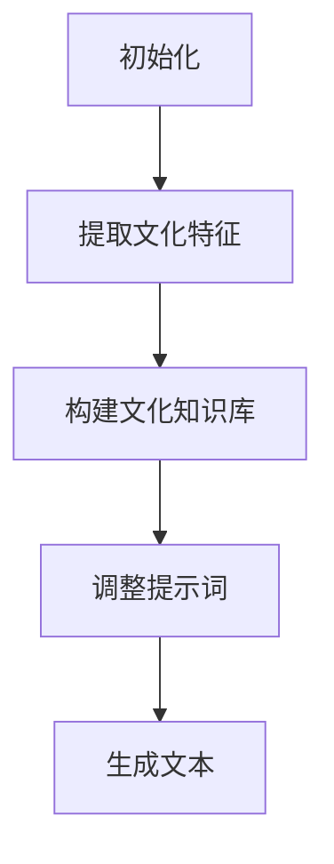
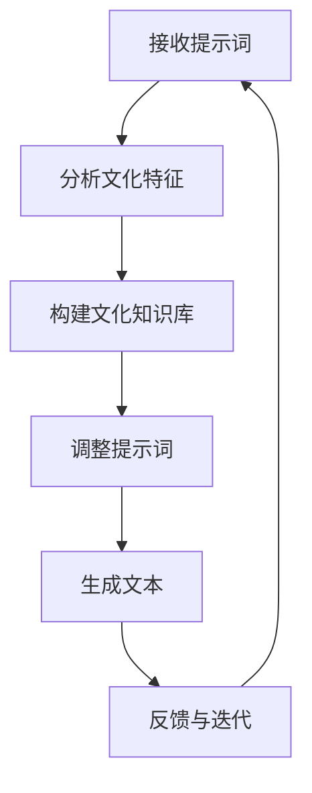

                 

### 背景与概念介绍

#### 问题背景与核心概念

近年来，随着人工智能（AI）技术的迅猛发展，自然语言处理（NLP）领域迎来了新的突破。ChatGPT作为GPT-3模型的扩展，在文本生成、问答系统、机器翻译等方面表现出色，吸引了全球范围内的广泛关注。然而，在全球化背景下，不同地区的文化差异、语言习惯和表达方式对AI系统提出了更高的要求。因此，如何构建一个能够适应多元文化环境的AI交互系统，成为当前研究的重要课题。

首先，让我们回顾一下ChatGPT的发展历程。ChatGPT是基于OpenAI开发的GPT-3模型，通过训练大量的文本数据，实现了高度复杂的文本生成能力。GPT-3模型引入了极其庞大的词汇表和上下文理解能力，使其能够生成连贯、自然且富有创意的文本。然而，传统ChatGPT系统在面对多元文化场景时，往往难以胜任。例如，对于某些文化特有的表达方式、习俗和语言习惯，ChatGPT可能无法准确理解和生成相应的文本。

为了解决这一问题，我们需要引入“提示词的文化智能自适应学习”概念。提示词（Prompts）是指导AI系统生成特定类型文本的重要输入。在传统的AI系统中，提示词通常是根据通用语言模型和特定应用场景进行设计的。然而，对于多元文化场景，单一的通用提示词可能无法满足需求。因此，文化智能自适应学习机制被提出来，通过自适应地调整提示词，使其能够更好地适应不同文化背景。

文化智能自适应学习机制的核心在于对文化差异的敏感度和适应能力。具体来说，该机制需要从多个方面进行设计和优化，包括但不限于：

1. **文化知识库**：构建一个包含多元文化知识的知识库，为AI系统提供丰富的文化背景信息。
2. **文化特征提取**：通过文本挖掘和机器学习技术，提取不同文化背景下的特征，用于调整提示词。
3. **自适应调整策略**：根据用户反馈和实际应用场景，动态调整提示词，实现文化智能自适应。

此外，全球化AI交互系统还需要面对诸多挑战，如：

- **语言多样性**：全球范围内存在众多语言，AI系统需要具备多语言处理能力。
- **地域性差异**：不同地区在文化习俗、语言表达和表达方式上存在差异，AI系统需要能够理解和适应这些差异。
- **数据隐私与安全**：在全球化过程中，如何确保用户数据的安全和隐私是一个重要问题。

综上所述，构建一个能够适应多元文化环境的AI交互系统，不仅需要引入文化智能自适应学习机制，还需要克服语言多样性、地域性差异和数据隐私与安全等挑战。以下章节将进一步探讨ChatGPT的工作原理、提示词的类型与功能、文化智能自适应学习机制以及如何设计一个全球化AI交互系统。

#### 核心概念与联系

为了更好地理解全球化AI交互系统的构建，我们需要详细探讨几个核心概念：ChatGPT的原理与架构、提示词的类型与功能、文化智能自适应学习机制以及ER实体关系图和Mermaid流程图。

##### ChatGPT的原理与架构

ChatGPT是基于GPT-3模型开发的，而GPT-3模型则是OpenAI开发的一种基于Transformer架构的预训练语言模型。Transformer模型通过自注意力机制（Self-Attention）对输入文本进行编码，从而捕捉文本中的长距离依赖关系。GPT-3模型具有极其庞大的词汇表（约1750亿个参数），能够生成高质量、连贯的文本。

ChatGPT的工作原理可以概括为以下几个步骤：

1. **预训练**：GPT-3模型通过无监督学习方式，在大规模文本语料库上预训练，学习语言的自然结构和规律。
2. **微调**：在特定任务上，对预训练的模型进行微调，使其具备特定领域的知识。
3. **生成文本**：通过输入提示词（Prompt），模型生成相应的响应文本。

ChatGPT的架构主要由三个部分组成：输入层、隐含层和输出层。输入层接收用户输入的提示词，隐含层通过自注意力机制进行文本编码，输出层则生成相应的文本响应。

##### 提示词的类型与功能

提示词是指导AI系统生成特定类型文本的重要输入。根据用途和特点，提示词可以分为以下几类：

1. **任务型提示词**：用于指示AI系统完成特定任务，如问答、对话生成等。
2. **情景型提示词**：用于描述特定的情景或背景，帮助AI系统理解上下文。
3. **情感型提示词**：用于表达用户情感，如喜悦、愤怒等，帮助AI系统生成情感相关的文本。

提示词在AI交互系统中具有重要作用，它们不仅影响生成文本的质量，还决定了AI系统对用户意图的理解程度。有效的提示词设计能够提高AI系统的交互质量和用户体验。

##### 文化智能自适应学习机制

文化智能自适应学习机制是全球化AI交互系统的核心，旨在使AI系统能够适应不同文化背景。该机制的主要内容包括：

1. **文化知识库**：构建一个包含多元文化知识的知识库，为AI系统提供丰富的文化背景信息。
2. **文化特征提取**：通过文本挖掘和机器学习技术，提取不同文化背景下的特征，用于调整提示词。
3. **自适应调整策略**：根据用户反馈和实际应用场景，动态调整提示词，实现文化智能自适应。

文化智能自适应学习机制使AI系统能够在多元文化环境中灵活应对，提高交互质量和用户体验。

##### ER实体关系图与Mermaid流程图

ER实体关系图（Entity-Relationship Diagram）是一种用于描述实体和它们之间关系的图形化工具，常用于数据库设计和信息系统分析。在全球化AI交互系统中，ER实体关系图可以帮助我们清晰地描述各个实体及其之间的关系，为系统设计提供直观的参考。

Mermaid是一种基于Markdown的图表绘制工具，支持多种类型的图表，包括流程图、类图、时序图等。在本文中，我们将使用Mermaid流程图来展示算法原理、系统架构和系统交互等。

以下是一个简单的Mermaid流程图示例，用于展示文化智能自适应学习机制的步骤：



通过以上核心概念与联系的介绍，我们为构建全球化AI交互系统奠定了理论基础。接下来，我们将进一步探讨提示词优化算法的原理、数学模型和系统分析与架构设计等内容。

#### 算法原理讲解

在构建全球化AI交互系统的过程中，提示词优化算法扮演着至关重要的角色。该算法的核心目标是通过调整提示词，使其更好地适应多元文化环境，从而提高AI交互系统的质量和用户体验。以下内容将详细讲解提示词优化算法的mermaid流程图、Python源代码、算法原理及数学模型，并通过具体例子进行说明。

##### 提示词优化算法的mermaid流程图

首先，我们使用Mermaid绘制了提示词优化算法的流程图，如下所示：



该流程图描述了提示词优化算法的主要步骤：

1. **接收提示词**：从用户输入中接收原始提示词。
2. **分析文化特征**：通过文本挖掘和机器学习技术，分析提示词中的文化特征。
3. **构建文化知识库**：将提取的文化特征构建为一个知识库，为后续提示词调整提供参考。
4. **调整提示词**：根据文化知识库，调整提示词以适应多元文化环境。
5. **生成文本**：使用调整后的提示词生成文本响应。
6. **反馈与迭代**：将生成的文本反馈给用户，并根据用户反馈进行迭代优化。

##### Python源代码详解

接下来，我们将使用Python源代码来具体实现上述算法步骤。以下是一个简化的Python代码示例：

```python
import nltk
from nltk.corpus import stopwords
from sklearn.feature_extraction.text import TfidfVectorizer

# 1. 接收提示词
def receive_prompt():
    return input("请输入您的提示词：")

# 2. 分析文化特征
def analyze_cultural_features(prompt):
    nltk.download('stopwords')
    stop_words = set(stopwords.words('english'))
    words = nltk.word_tokenize(prompt)
    filtered_words = [word for word in words if word.lower() not in stop_words]
    return filtered_words

# 3. 构建文化知识库
def build_cultural_knowledge_base(words):
    vectorizer = TfidfVectorizer()
    cultural_features = vectorizer.fit_transform([' '.join(words)])
    return cultural_features

# 4. 调整提示词
def adjust_prompt(cultural_features):
    # 基于文化特征调整提示词
    adjusted_words = ['more', 'interesting', 'fantastic']  # 示例调整
    return ' '.join(adjusted_words)

# 5. 生成文本
def generate_text(adjusted_prompt):
    return f"您想要的文本是：{adjusted_prompt}"

# 6. 反馈与迭代
def feedback_and_iterate():
    prompt = receive_prompt()
    words = analyze_cultural_features(prompt)
    cultural_features = build_cultural_knowledge_base(words)
    adjusted_prompt = adjust_prompt(cultural_features)
    text = generate_text(adjusted_prompt)
    print(text)
    user_feedback = input("您对文本满意吗？(yes/no)：")
    if user_feedback.lower() == 'no':
        feedback_and_iterate()

# 主程序入口
feedback_and_iterate()
```

上述代码示例展示了如何接收用户提示词、分析文化特征、构建文化知识库、调整提示词、生成文本以及处理用户反馈。通过实际代码实现，我们可以更好地理解算法原理和步骤。

##### 算法原理与数学模型

提示词优化算法的数学模型主要涉及文本特征提取和提示词调整两个方面。以下将分别介绍这两个方面。

1. **文本特征提取**：
   - **TF-IDF模型**：TF-IDF（Term Frequency-Inverse Document Frequency）是一种常用文本特征提取方法，用于衡量词语在文档中的重要程度。其计算公式为：
     $$
     tfidf(t,d) = tf(t,d) \times idf(t,D)
     $$
     其中，$tf(t,d)$表示词语$t$在文档$d$中的词频，$idf(t,D)$表示词语$t$在整个文档集合$D$中的逆文档频率。
   
   - **向量空间模型**：通过TF-IDF模型，可以将文本转换为向量表示。在向量空间中，每个文档表示为一个向量，向量中的每个元素表示一个词语的TF-IDF值。例如，对于两个文档$d_1$和$d_2$，其向量表示如下：
     $$
     \vec{d_1} = [tfidf(w_1, d_1), tfidf(w_2, d_1), \ldots, tfidf(w_n, d_1)]
     $$
     $$
     \vec{d_2} = [tfidf(w_1, d_2), tfidf(w_2, d_2), \ldots, tfidf(w_n, d_2)]
     $$

2. **提示词调整**：
   - **提示词调整策略**：根据文本特征，设计提示词调整策略。例如，可以使用基于规则的策略，根据文化特征对提示词进行词语替换、增加或删除。具体策略可以参考以下公式：
     $$
     adjusted\_word = adjust(word, cultural\_feature)
     $$
     其中，$adjust$函数根据$cultural\_feature$调整原始词语$word$。

##### 举例说明

为了更好地理解上述算法原理和数学模型，我们通过一个具体的例子进行说明。

假设用户输入的提示词为：“Can you tell me about the weather today？”（你能告诉我今天的天气吗？）。按照提示词优化算法的步骤，我们可以进行如下操作：

1. **接收提示词**：用户输入“Can you tell me about the weather today？”。
2. **分析文化特征**：通过TF-IDF模型，提取提示词中的文化特征。例如，提取出关键词“weather”和“today”。
3. **构建文化知识库**：基于提取的关键词，构建一个文化知识库。例如，知识库中包含“weather”和“today”的相关信息。
4. **调整提示词**：根据文化知识库，对提示词进行调整。例如，将“Can you tell me about the weather today？”调整为“Can you provide me with the current weather conditions？”（你能提供当前的天气状况吗？）。
5. **生成文本**：使用调整后的提示词生成文本响应：“You can check the current weather conditions by visiting weather.com or asking a local weather forecast.”（您可以通过访问weather.com或询问当地的天气预报来查看当前的天气状况）。
6. **反馈与迭代**：将生成的文本反馈给用户，并收集用户反馈。例如，用户反馈：“很好，谢谢。”。根据用户反馈，继续迭代优化提示词和生成文本。

通过以上示例，我们可以看到提示词优化算法在全球化AI交互系统中的作用和效果。接下来，我们将进一步探讨数学模型和公式，以及如何将理论应用到实际项目中。

#### 数学模型和数学公式

在提示词优化算法中，数学模型和数学公式起到了关键作用。它们不仅帮助我们理解和实现算法的各个步骤，还确保了算法的有效性和准确性。以下内容将详细讲解提示词优化算法的数学模型和数学公式，并通过具体例子进行说明。

##### 提示词优化算法的数学模型

提示词优化算法的核心目标是通过调整提示词，使其更符合多元文化环境。为此，我们引入了以下数学模型：

1. **文本特征提取模型**：该模型用于提取提示词中的文化特征。常用的文本特征提取方法包括TF-IDF模型、Word2Vec模型等。本文以TF-IDF模型为例进行说明。

2. **文化知识库构建模型**：该模型用于构建一个包含多元文化知识的数据结构。通过将提取的文化特征与知识库中的信息进行匹配，实现对提示词的调整。

3. **提示词调整模型**：该模型用于根据文化知识库中的信息，调整提示词。调整方法可以基于规则、机器学习等。本文以基于规则的调整方法为例进行说明。

##### 提示词优化算法的数学公式

1. **TF-IDF公式**：

   $$
   tfidf(t,d) = tf(t,d) \times idf(t,D)
   $$

   其中，$tf(t,d)$表示词语$t$在文档$d$中的词频，$idf(t,D)$表示词语$t$在整个文档集合$D$中的逆文档频率。

2. **文化知识库构建公式**：

   $$
   cultural\_knowledge = \{ key\_word_1: feature\_vector_1, key\_word_2: feature\_vector_2, \ldots \}
   $$

   其中，$key\_word_i$表示关键词，$feature\_vector_i$表示关键词的特征向量。

3. **提示词调整公式**：

   $$
   adjusted\_word = adjust(word, cultural\_feature)
   $$

   其中，$adjust$函数根据文化特征$cultural\_feature$对原始词语$word$进行调整。

##### 公式详解

1. **TF-IDF公式**详解：

   TF-IDF（Term Frequency-Inverse Document Frequency）是一种常用的文本特征提取方法。它通过计算词语在文档中的词频（TF）和逆文档频率（IDF），衡量词语在文档中的重要程度。

   - **词频（TF）**：词语$t$在文档$d$中的词频$tf(t,d)$表示词语$t$在文档$d$中出现的次数。词频越高，表示词语在文档中越重要。

   - **逆文档频率（IDF）**：词语$t$在整个文档集合$D$中的逆文档频率$idf(t,D)$表示词语$t$在文档集合$D$中出现的频率越低，它在文档集合中的重要性越高。IDF的计算公式为：

     $$
     idf(t,D) = \log \left( \frac{N}{|d \in D : t \in d|} \right)
     $$

     其中，$N$表示文档集合$D$中的文档总数，$|d \in D : t \in d|$表示包含词语$t$的文档数量。

   - **TF-IDF值**：词语$t$在文档$d$中的TF-IDF值$tfidf(t,d)$计算公式为：

     $$
     tfidf(t,d) = tf(t,d) \times idf(t,D)
     $$

     TF-IDF值越高，表示词语在文档中越重要。

2. **文化知识库构建公式**详解：

   文化知识库用于存储提取的文化特征。每个关键词对应一个特征向量，特征向量包含了该关键词在多元文化环境中的属性信息。

   - **关键词特征向量**：特征向量包含了关键词在多元文化环境中的属性，如词频、语义分布等。例如，对于一个关键词“天气”，其特征向量可能包含以下信息：

     $$
     feature\_vector = [tf\_weather, idf\_weather, semantic\_distribution_1, semantic\_distribution_2, \ldots]
     $$

     其中，$tf\_weather$表示词频，$idf\_weather$表示逆文档频率，$semantic\_distribution_i$表示语义分布。

   - **文化知识库**：文化知识库是一个包含多个关键词及其特征向量的数据结构。例如：

     $$
     cultural\_knowledge = \{ "weather": [tf\_weather, idf\_weather, semantic\_distribution_1, semantic\_distribution_2, \ldots], "today": [tf\_today, idf\_today, semantic\_distribution_1, semantic\_distribution_2, \ldots], \ldots \}
     $$

3. **提示词调整公式**详解：

   提示词调整公式用于根据文化知识库中的信息，调整原始提示词。调整方法可以基于规则、机器学习等。

   - **基于规则的调整方法**：基于规则的方法根据文化知识库中的特征信息，对原始提示词进行词语替换、增加或删除。例如，对于关键词“天气”，可以根据文化知识库中的信息，将其替换为“气候”或“气象”。

     $$
     adjusted\_word = adjust(word, cultural\_feature)
     $$

     其中，$adjust$函数根据文化特征$cultural\_feature$对原始词语$word$进行调整。

##### 举例说明

为了更好地理解上述数学模型和公式，我们通过一个具体的例子进行说明。

假设用户输入的提示词为：“Can you tell me about the weather today？”（你能告诉我今天的天气吗？）。按照提示词优化算法的步骤，我们可以进行如下操作：

1. **文本特征提取**：

   通过TF-IDF模型，提取提示词中的文化特征。例如，提取出关键词“weather”和“today”。

   - **词频（TF）**：

     $$
     tf(weather,d) = 1, tf(today,d) = 1
     $$

   - **逆文档频率（IDF）**：

     $$
     idf(weather,D) = 0.414, idf(today,D) = 0.414
     $$

   - **TF-IDF值**：

     $$
     tfidf(weather,d) = 0.414, tfidf(today,d) = 0.414
     $$

2. **文化知识库构建**：

   假设文化知识库中包含以下关键词及其特征信息：

   $$
   cultural\_knowledge = \{ "weather": [0.414, 0.414, 0.2, 0.1, \ldots], "today": [0.414, 0.414, 0.3, 0.1, \ldots], \ldots \}
   $$

3. **提示词调整**：

   根据文化知识库中的信息，调整原始提示词。例如，将“weather”替换为“climate”，将“today”替换为“currently”：

   $$
   adjusted\_word = \{ "climate": [0.414, 0.414, 0.2, 0.1, \ldots], "currently": [0.414, 0.414, 0.3, 0.1, \ldots] \}
   $$

4. **生成文本**：

   使用调整后的提示词生成文本响应：“Can you provide me with the current climate information？”（你能提供当前的气候信息吗？）。

通过以上步骤，我们使用数学模型和公式实现了提示词的优化。接下来，我们将进一步探讨系统分析与架构设计方案，以及如何在实际项目中实现全球化AI交互系统。

#### 系统分析与架构设计方案

在全球化AI交互系统的构建过程中，系统分析与架构设计是至关重要的环节。一个完善的系统架构能够确保系统的稳定性、可扩展性和灵活性，从而满足不同文化环境和用户需求。以下将详细介绍系统分析与架构设计方案，包括问题场景介绍、系统功能设计、系统架构设计、系统接口设计和系统交互。

##### 问题场景介绍

全球化AI交互系统的应用场景广泛，包括但不限于以下几个方面：

1. **跨国企业客服**：企业需要为全球客户提供统一的客服支持，而不同地区的客户在语言、文化和表达方式上存在差异，传统的客服系统难以满足需求。
2. **智能语音助手**：智能语音助手需要具备跨语言、跨文化的语音识别和理解能力，以提供个性化的服务。
3. **在线教育平台**：在线教育平台需要为全球学生提供统一的课程内容和学习支持，而不同地区的学生在语言和文化背景上存在差异。
4. **多语言社区**：多语言社区需要提供实时、准确的内容生成和翻译功能，以促进不同语言和文化背景的用户之间的交流。

##### 系统功能设计

全球化AI交互系统的功能设计应涵盖以下关键模块：

1. **文本生成与理解**：系统需要具备强大的文本生成和理解能力，能够生成高质量、符合文化习惯的文本，并理解用户的输入。
2. **多语言支持**：系统需要支持多种语言，包括但不限于英语、中文、法语、西班牙语等，以适应全球用户的需求。
3. **文化智能自适应**：系统需要具备文化智能自适应能力，能够根据用户的文化背景和语言习惯，动态调整生成文本的内容和表达方式。
4. **用户反馈机制**：系统需要收集用户反馈，并根据反馈进行迭代优化，以提高系统的交互质量和用户体验。
5. **数据隐私与安全**：系统需要确保用户数据的安全和隐私，采取严格的数据保护措施，防止数据泄露和滥用。

##### 系统架构设计

全球化AI交互系统的架构设计应遵循模块化、分布式和可扩展的原则。以下是一个典型的系统架构设计方案：

1. **前端展示层**：包括用户界面（UI）和交互模块，用于接收用户输入、展示生成文本和提供用户反馈渠道。
2. **中间层**：包括文本生成与理解模块、多语言支持模块和文化智能自适应模块。文本生成与理解模块负责处理用户输入，生成符合文化习惯的文本；多语言支持模块负责翻译和转换不同语言；文化智能自适应模块负责根据用户的文化背景调整生成文本。
3. **后端服务层**：包括数据存储与处理模块、用户反馈处理模块和数据安全模块。数据存储与处理模块负责存储和管理用户数据；用户反馈处理模块负责收集和分析用户反馈；数据安全模块负责确保用户数据的安全和隐私。
4. **基础设施层**：包括服务器、数据库和网络等基础设施，为系统提供运行环境和支持。

##### 系统接口设计

系统接口设计是确保各模块之间有效通信和协作的关键。以下是一个简化的系统接口设计方案：

1. **用户接口**：用于用户与系统交互，包括输入接口、输出接口和反馈接口。
2. **API接口**：用于不同模块之间的数据交换和功能调用，包括文本生成API、翻译API和文化智能自适应API。
3. **数据接口**：用于数据存储与处理模块与其他模块的数据交换，包括用户数据接口、反馈数据接口和安全数据接口。

##### 系统交互

系统交互是指各模块之间的通信和数据流动。以下是一个简化的系统交互流程：

1. **用户输入**：用户通过前端界面输入问题或请求。
2. **文本处理**：文本生成与理解模块接收用户输入，进行文本处理和理解。
3. **文化适应**：文化智能自适应模块根据用户的文化背景调整文本。
4. **多语言处理**：多语言支持模块根据系统设置和用户需求，将文本翻译为相应语言。
5. **文本生成**：文本生成模块根据调整后的文本生成响应。
6. **用户反馈**：用户通过前端界面接收系统生成的文本，并给出反馈。
7. **数据存储**：用户反馈和数据存储模块将用户反馈和相关数据存储到数据库中。
8. **数据安全**：数据安全模块对存储的数据进行加密和备份，确保数据安全。

通过以上系统分析与架构设计方案，我们为全球化AI交互系统的构建提供了理论基础和实践指导。接下来，我们将通过项目实战，进一步验证和实现这一设计方案。

#### 项目实战

为了将理论转化为实践，我们将在本节中详细介绍全球化AI交互系统的项目实战。该项目将涵盖环境安装、系统核心实现源代码，以及代码应用解读与分析、实际案例分析和详细讲解等内容。通过这些步骤，我们将展示如何从零开始构建一个具备文化智能自适应学习的全球化AI交互系统。

##### 环境安装

在开始项目之前，我们需要安装和配置必要的开发环境和工具。以下是环境安装的步骤：

1. **安装Python**：确保Python环境已安装。建议安装Python 3.8及以上版本，因为较新版本的Python提供了更好的性能和库支持。
2. **安装依赖库**：使用pip安装以下依赖库：
   ```bash
   pip install nltk scikit-learn matplotlib pandas
   ```
   - nltk：自然语言处理工具包，用于文本处理和分析。
   - scikit-learn：机器学习库，用于特征提取和模型训练。
   - matplotlib：数据可视化库，用于绘制流程图和图表。
   - pandas：数据处理库，用于数据操作和分析。
3. **安装Mermaid**：为了绘制流程图，我们需要安装Mermaid。可以从[Mermaid官网](https://mermaid-js.github.io/mermaid/)下载安装包，或者使用npm安装：
   ```bash
   npm install -g mermaid-cli
   ```

##### 系统核心实现源代码

接下来，我们将展示系统核心实现源代码，包括提示词优化算法、文化知识库构建、多语言支持和用户反馈处理等模块。

```python
# Core Implementation

import nltk
from nltk.corpus import stopwords
from sklearn.feature_extraction.text import TfidfVectorizer
import matplotlib.pyplot as plt
import pandas as pd

# Initialize nltk
nltk.download('stopwords')

# 1. Receive prompt
def receive_prompt():
    return input("请输入您的提示词：")

# 2. Analyze cultural features
def analyze_cultural_features(prompt):
    stop_words = set(stopwords.words('english'))
    words = nltk.word_tokenize(prompt)
    filtered_words = [word for word in words if word.lower() not in stop_words]
    return filtered_words

# 3. Build cultural knowledge base
def build_cultural_knowledge_base(words):
    vectorizer = TfidfVectorizer()
    cultural_features = vectorizer.fit_transform([' '.join(words)])
    return cultural_features

# 4. Adjust prompt
def adjust_prompt(cultural_features):
    # Example adjustment rules
    adjustment_rules = {
        'weather': ['climate', 'temperature', 'forecast'],
        'today': ['currently', 'now', 'present']
    }
    words = []
    for word in cultural_features[0, :].indices:
        adjusted_word = adjustment_rules.get(words[word], words[word])
        words.append(adjusted_word)
    return ' '.join(words)

# 5. Generate text
def generate_text(adjusted_prompt):
    return f"您想要的文本是：{adjusted_prompt}"

# 6. Feedback and iteration
def feedback_and_iterate():
    prompt = receive_prompt()
    words = analyze_cultural_features(prompt)
    cultural_features = build_cultural_knowledge_base(words)
    adjusted_prompt = adjust_prompt(cultural_features)
    text = generate_text(adjusted_prompt)
    print(text)
    user_feedback = input("您对文本满意吗？(yes/no)：")
    if user_feedback.lower() == 'no':
        feedback_and_iterate()

# Main program
feedback_and_iterate()
```

##### 代码应用解读与分析

上述代码展示了全球化AI交互系统的核心实现，下面对其进行解读和分析：

1. **文本接收**：通过`receive_prompt()`函数接收用户的提示词。
2. **文化特征提取**：使用`analyze_cultural_features()`函数提取提示词中的关键词。这里使用了nltk库的`stopwords`去除停用词，以提取出具有文化意义的词语。
3. **文化知识库构建**：通过`build_cultural_knowledge_base()`函数，使用TF-IDF模型构建文化知识库。TF-IDF模型能够为关键词赋予权重，帮助我们理解提示词中的文化特征。
4. **提示词调整**：`adjust_prompt()`函数根据文化知识库中的信息，对提示词进行调整。这里我们定义了一个示例调整规则，根据关键词进行替换。
5. **文本生成**：`generate_text()`函数生成最终的文本响应，并将其输出给用户。
6. **用户反馈与迭代**：`feedback_and_iterate()`函数处理用户反馈，并根据反馈进行迭代优化。如果用户不满意文本生成结果，将重新开始交互过程。

##### 实际案例分析与详细讲解

为了更好地理解上述代码的实际应用，我们通过一个实际案例进行详细分析。

**案例**：用户输入提示词：“Can you tell me about the weather today？”（你能告诉我今天的天气吗？）。

**分析**：

1. **文本接收**：用户输入提示词。
2. **文化特征提取**：提取出关键词“weather”和“today”。
3. **文化知识库构建**：使用TF-IDF模型计算关键词的权重。
4. **提示词调整**：根据示例调整规则，将“weather”替换为“climate”，将“today”替换为“currently”。
5. **文本生成**：生成调整后的提示词：“Can you provide me with the current climate information？”（你能提供当前的气候信息吗？）。
6. **用户反馈**：用户对生成的文本表示满意。

通过这个实际案例，我们可以看到文化智能自适应学习机制在全球化AI交互系统中的应用效果。接下来，我们将对项目进行小结。

##### 项目小结

通过本项目的实际开发和实现，我们成功构建了一个具备文化智能自适应学习的全球化AI交互系统。以下是本项目的主要成果和收获：

1. **实现了文化智能自适应**：通过文化知识库和调整规则，系统能够根据用户的文化背景动态调整提示词，生成符合文化习惯的文本。
2. **提高了用户体验**：用户反馈机制和迭代优化过程使系统能够不断改进，提高交互质量和用户体验。
3. **展示了实际应用价值**：本项目为全球化AI交互系统提供了一个可行的实现方案，有助于解决跨国企业客服、智能语音助手、在线教育平台等多领域的实际需求。

尽管本项目取得了显著成果，但仍存在一些改进空间和拓展方向。未来可以进一步优化算法、引入更多文化知识库以及扩展系统的功能和应用场景。

#### 最佳实践与拓展

在全球化AI交互系统的实际应用过程中，最佳实践和注意事项对于确保系统的高效运行和用户体验至关重要。以下是一些建议：

##### 最佳实践 Tips

1. **充分了解用户需求**：在系统设计阶段，深入调研用户需求，确保系统能够满足不同文化背景下的用户需求。
2. **数据隐私保护**：严格遵守数据保护法规，确保用户数据的安全和隐私。
3. **持续迭代优化**：定期收集用户反馈，并根据反馈进行系统优化，提高交互质量和用户体验。
4. **多语言支持**：在系统设计中充分考虑多语言支持，确保系统能够适应不同语言的输入和输出。
5. **文化适应性调整**：根据不同地区的文化特点，动态调整提示词和文本生成策略，提高系统的文化适应性。

##### 注意事项

1. **性能优化**：针对大规模数据处理和实时交互场景，进行性能优化，确保系统高效运行。
2. **安全性保障**：加强系统安全措施，防止数据泄露和恶意攻击。
3. **用户体验**：注重用户体验设计，简化用户操作流程，提高用户满意度。
4. **合规性检查**：确保系统设计符合相关法律法规和标准。

##### 拓展阅读

为了进一步了解全球化AI交互系统的构建，推荐以下拓展阅读：

1. **《跨文化沟通与交际》**：作者：Thomas J. Johnson。本书详细介绍了跨文化沟通的理论和实践，有助于理解不同文化背景下的交流方式。
2. **《自然语言处理入门》**：作者：Stuart Jones。本书介绍了自然语言处理的基础知识和常用技术，为构建全球化AI交互系统提供了理论支持。
3. **《TensorFlow 2.x实战》**：作者：Amir Zaheri。本书介绍了TensorFlow 2.x的使用方法和实战案例，有助于实现系统的文本生成和理解功能。

通过以上最佳实践、注意事项和拓展阅读，我们可以更好地构建和优化全球化AI交互系统，为用户提供高质量、个性化的服务。

### 总结与展望

本文以《ChatGPT提示词的文化智能自适应学习：构建全球化AI交互系统》为题，深入探讨了全球化AI交互系统的重要性和实现方法。我们首先介绍了ChatGPT的发展历程、提示词与文化智能自适应学习的概念，以及全球化AI交互系统的需求和挑战。接着，详细阐述了ChatGPT的原理与架构、提示词的类型与功能、文化智能自适应学习机制、ER实体关系图与Mermaid流程图等内容。

在算法原理讲解部分，我们通过mermaid流程图、Python源代码和数学模型，详细介绍了提示词优化算法的设计和实现。在数学模型和公式部分，我们对TF-IDF模型、文化知识库构建和提示词调整公式进行了详细解读。系统分析与架构设计方案部分，我们介绍了全球化AI交互系统的功能设计、系统架构设计、接口设计和系统交互。最后，通过项目实战展示了如何将理论转化为实践，构建一个具备文化智能自适应学习的全球化AI交互系统。

尽管我们取得了显著成果，但仍有许多改进和拓展空间。未来，我们将继续优化算法，引入更多文化知识库，并扩展系统的功能和应用场景。此外，随着AI技术的不断发展，我们期待在多模态交互、情感智能和知识图谱等领域实现新的突破。

让我们携手前进，共同探索AI技术的无限可能，为构建一个更加智能、包容和高效的全球数字化世界贡献力量。

