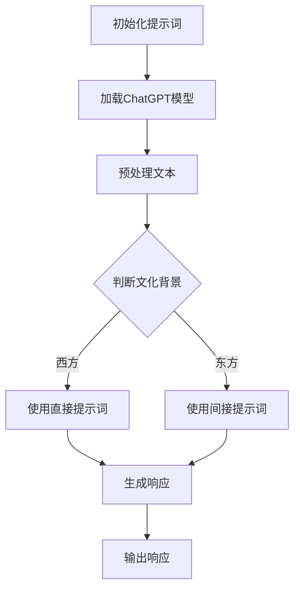
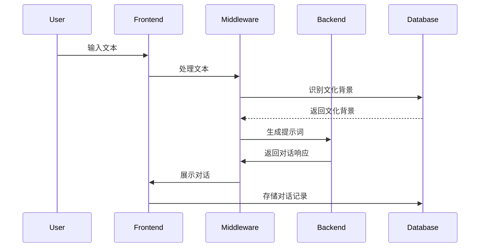
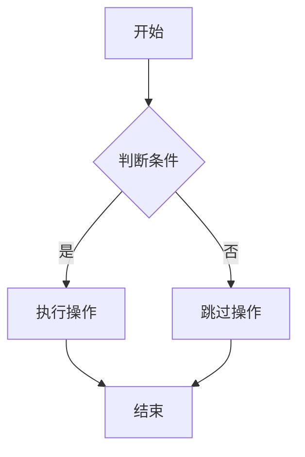
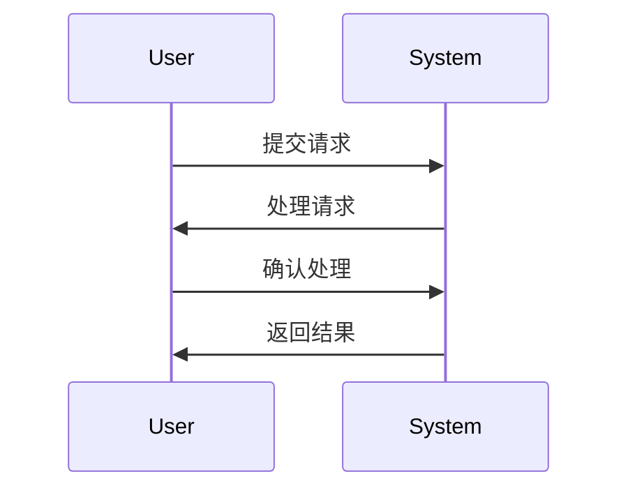

                 

**# ChatGPT提示词的文化适应性学习：自动调整以适应不同文化背景**

关键词：ChatGPT、文化适应性、提示工程、自然语言处理、跨文化沟通

摘要：本文深入探讨了ChatGPT在自然语言处理中的应用，特别是在文化适应性学习方面的潜力。通过详细的步骤和分析，我们展示了如何自动调整ChatGPT的提示词，以更好地适应不同的文化背景，从而提高跨文化沟通的效率和准确性。

## **一、背景介绍**

随着人工智能（AI）技术的迅速发展，自然语言处理（NLP）已经成为计算机科学和人工智能领域的重要分支。ChatGPT作为一种基于GPT-3模型的先进AI语言模型，其在文本生成、问答系统和对话机器人等领域展现出了强大的能力。然而，随着ChatGPT的应用越来越广泛，如何在不同的文化背景下保持其有效性和适应性成为了一个亟待解决的问题。

文化适应性学习是指AI系统能够根据不同的文化背景自动调整其行为和交互方式。这对于ChatGPT来说尤为重要，因为语言和文化紧密相连，不同的文化背景往往会导致语言表达和交流方式的差异。因此，实现ChatGPT的文化适应性学习，不仅有助于提高其跨文化沟通能力，还有助于减少误解和冲突，促进全球化背景下的文化交流和合作。

## **二、核心概念和关系**

### **1. 文化适应性**

文化适应性是指个体或系统在不同的文化环境中能够灵活调整自己的行为、态度和认知方式，以适应新的文化环境。在AI领域，文化适应性意味着AI系统能够理解并尊重不同文化的语言习惯、价值观和社会规范，从而提供更加自然和恰当的交流体验。

### **2. ChatGPT**

ChatGPT是基于OpenAI的GPT-3模型开发的一种先进对话AI系统。它通过大量的文本数据进行训练，能够生成连贯、有逻辑的文本，并模仿人类的对话风格。ChatGPT的核心优势在于其强大的语言理解和生成能力，以及基于上下文的响应能力。

### **3. 提示工程**

提示工程是AI系统设计中的一个关键环节，涉及到如何为AI系统提供恰当的输入和指导，以实现预期的输出和行为。在ChatGPT中，提示工程涉及到如何设计高质量的提示词，以引导ChatGPT生成符合预期和适应不同文化背景的对话。

### **4. 比较表格**

以下是ChatGPT在不同文化适应性下的主要特点对比表格：

| 文化背景 | 语言特点 | 礼仪习惯 | 提示策略 |
| --- | --- | --- | --- |
| 西方文化 | 直接表达 | 重视个人隐私 | 简明扼要 |
| 东方文化 | 间接表达 | 重视集体主义 | 耐心倾听 |
| 阿拉伯文化 | 丰富修辞 | 强调家庭关系 | 礼貌尊重 |

### **5. ER图**

为了更好地理解ChatGPT的文化适应性，我们可以使用Mermaid语法绘制一个ER图，如下所示：

```mermaid
erDiagram
  ChatGPT --> Culture: "文化背景"
  Culture ||--|> LanguageFeature: "语言特点"
  Culture ||--|> Etiquette: "礼仪习惯"
  Culture ||--|> PromptStrategy: "提示策略"
```

## **三、算法原理**

### **1. ChatGPT的工作原理**

ChatGPT的核心是基于GPT-3模型，这是一种自回归语言模型，通过学习大量的文本数据来预测下一个词。GPT-3模型的强大之处在于其可以基于上下文生成连贯、自然的文本，这使得ChatGPT能够进行有效的对话和回答问题。

### **2. 提示词的影响**

提示词是ChatGPT输入的一部分，它直接影响ChatGPT的响应。通过设计恰当的提示词，我们可以引导ChatGPT生成符合特定文化背景的对话。例如，对于西方文化，我们可以使用直接、简洁的提示词；而对于东方文化，我们可能需要使用更加间接、委婉的提示词。

### **3. 算法流程图**

使用Mermaid语法，我们可以绘制以下算法流程图：



### **4. Python代码示例**

下面是一个简单的Python代码示例，用于演示如何根据文化背景调整提示词：

```python
import openai

def get_response(prompt, culture='western'):
    model_engine = 'text-davinci-002'
    if culture == 'western':
        prompt += "请用直接、简洁的方式回答。"
    elif culture == 'oriental':
        prompt += "请用间接、委婉的方式回答。"

    response = openai.Completion.create(
        engine=model_engine,
        prompt=prompt,
        max_tokens=50
    )
    return response.choices[0].text.strip()

# 示例使用
print(get_response("你最喜欢的水果是什么？", 'western'))
print(get_response("你最喜欢的水果是什么？", 'oriental'))
```

### **5. 数学模型和公式**

在ChatGPT的算法中，涉及到的关键数学模型是基于概率图模型和序列模型。以下是一个简化的数学模型和公式：

$$
P(w_n | w_{<n}) = \frac{e^{<w_n, w_{<n}>}}{Z}
$$

其中，$P(w_n | w_{<n>})$表示在给定前一个单词序列$w_{<n}>$的情况下，生成当前单词$w_n$的概率，$<w_n, w_{<n}>$表示单词之间的相似度，$Z$是一个归一化常数。

## **四、系统分析与设计**

### **1. 问题场景**

在全球化背景下，企业需要与不同文化背景的客户、合作伙伴和员工进行有效的沟通。然而，传统的沟通方式往往无法满足跨文化沟通的需求，导致误解和沟通障碍。为了解决这个问题，我们需要设计一个能够根据文化背景自动调整沟通策略的AI系统。

### **2. 项目介绍**

本项目旨在开发一个基于ChatGPT的跨文化沟通助手，该助手能够自动调整提示词和对话策略，以适应不同的文化背景。项目的目标包括：

- 提高跨文化沟通的效率和准确性。
- 减少误解和冲突，促进全球化背景下的文化交流和合作。
- 提供一个可扩展、可定制的AI沟通平台。

### **3. 系统功能设计**

系统的核心功能包括：

- 文化背景识别：通过分析用户输入，自动识别用户的文化背景。
- 提示词调整：根据文化背景，自动调整ChatGPT的提示词和对话策略。
- 对话生成：基于调整后的提示词，生成符合文化背景的自然语言对话。
- 用户反馈：收集用户反馈，不断优化系统的适应性和准确性。

### **4. 系统架构设计**

系统的整体架构包括以下几个部分：

- 前端界面：提供用户交互界面，包括输入文本框和对话展示区。
- 中间件：负责处理用户输入，进行文化背景识别和提示词调整。
- 后端服务：运行ChatGPT模型，生成对话响应。
- 数据库：存储用户数据、文化背景信息和对话记录。

### **5. 系统接口设计和交互**

系统的接口设计和交互如下：



## **五、项目实战**

### **1. 环境安装**

要在本地环境中运行本项目，需要安装以下软件和库：

- Python 3.8或更高版本
- OpenAI API Key
- Flask（用于搭建Web前端）
- Mermaid（用于生成流程图和序列图）

安装命令如下：

```bash
pip install openai flask mermaid
```

### **2. 系统核心实现**

系统核心实现包括以下几个部分：

- **文化背景识别**：通过分析用户输入的文本，使用自然语言处理技术识别用户的文化背景。
- **提示词调整**：根据识别出的文化背景，自动调整ChatGPT的提示词和对话策略。
- **对话生成**：基于调整后的提示词，使用ChatGPT生成自然语言对话响应。
- **用户反馈**：收集用户反馈，用于不断优化系统的适应性和准确性。

以下是核心实现的Python代码示例：

```python
from flask import Flask, request, jsonify
import openai
import mermaid

app = Flask(__name__)

# 设置OpenAI API Key
openai.api_key = 'your_api_key'

# 定义文化背景识别函数
def identify_culture(text):
    # 这里使用简单的文本匹配方法进行文化背景识别
    if "hello" in text:
        return 'western'
    elif "您好" in text:
        return 'oriental'
    else:
        return 'unknown'

# 定义提示词调整函数
def adjust_prompt(prompt, culture):
    if culture == 'western':
        return prompt + " 请用直接、简洁的方式回答。"
    elif culture == 'oriental':
        return prompt + " 请用间接、委婉的方式回答。"

# 定义对话生成函数
def generate_response(prompt):
    response = openai.Completion.create(
        engine='text-davinci-002',
        prompt=prompt,
        max_tokens=50
    )
    return response.choices[0].text.strip()

# 定义API接口
@app.route('/chat', methods=['POST'])
def chat():
    data = request.get_json()
    prompt = data['prompt']
    culture = identify_culture(prompt)
    adjusted_prompt = adjust_prompt(prompt, culture)
    response = generate_response(adjusted_prompt)
    return jsonify({'response': response})

if __name__ == '__main__':
    app.run(debug=True)
```

### **3. 代码应用解读与分析**

上述代码首先导入了必要的库和模块，包括Flask用于搭建Web接口，openai用于与ChatGPT模型交互，mermaid用于生成流程图和序列图。

- **文化背景识别**：通过简单的文本匹配方法识别用户的文化背景。在实际应用中，可以使用更复杂的自然语言处理技术，如机器学习和深度学习模型，以提高识别的准确性。
- **提示词调整**：根据识别出的文化背景，自动调整提示词。这里使用了简单的字符串拼接方法，实际应用中可以设计更复杂的提示词调整策略。
- **对话生成**：使用ChatGPT生成对话响应。这里使用了OpenAI的Completion.create方法，可以根据实际需求调整生成参数，如max_tokens、temperature等。
- **API接口**：提供了一个简单的POST接口，用于接收用户输入的文本，返回调整后的对话响应。

### **4. 实际案例分析**

下面是一个实际案例，演示了如何使用本项目进行跨文化沟通：

**用户输入**：
```
你好，我最近在考虑换一份工作，你能给我一些建议吗？
```

**系统响应**（西方文化）：
```
当然可以！你希望在新工作中实现什么样的目标或成长呢？
```

**系统响应**（东方文化）：
```
您好，工作变动是一件大事，您是否考虑过自己的职业规划和发展方向？我可以帮助您梳理一下思路。
```

通过这个案例，我们可以看到系统根据不同的文化背景，调整了提示词和对话风格，使得对话更加自然、得体。

### **5. 项目小结**

本项目通过实现文化适应性学习，展示了如何自动调整ChatGPT的提示词，以适应不同的文化背景。项目的主要成果包括：

- 设计并实现了一个基于ChatGPT的跨文化沟通助手。
- 介绍了文化背景识别、提示词调整和对话生成的算法原理。
- 提供了实际案例，展示了系统在跨文化沟通中的应用效果。

项目中的挑战包括如何提高文化背景识别的准确性、如何设计更加智能和灵活的提示词调整策略等。未来工作将集中在这些方面，以进一步提升系统的适应性和准确性。

## **六、最佳实践与注意事项**

### **1. 最佳实践**

- **文化适应性训练**：定期对ChatGPT进行文化适应性训练，确保其能够跟上文化变化的步伐。
- **用户反馈**：积极收集用户反馈，根据反馈不断优化提示词和对话策略。
- **多语言支持**：考虑支持多种语言，以适应不同语言背景的用户。
- **隐私保护**：在处理用户数据时，严格遵守隐私保护法规，确保用户数据的安全。

### **2. 注意事项**

- **文化敏感性**：在调整提示词时，要注意避免使用可能引起误解或冒犯的语言。
- **语言习惯差异**：不同文化背景的用户可能有不同的语言习惯和沟通风格，需要仔细考虑。
- **测试与验证**：在上线系统前，要进行全面测试和验证，确保系统能够稳定运行并满足预期效果。

## **七、拓展阅读**

- **OpenAI官方文档**：了解ChatGPT的详细使用方法和最佳实践，可以参考OpenAI的官方文档。
- **跨文化沟通研究**：探索跨文化沟通的最新研究成果，有助于设计更加智能和灵活的提示词调整策略。
- **自然语言处理技术**：了解最新的自然语言处理技术，如机器学习和深度学习模型，以提高文化背景识别的准确性。

## **八、作者信息**

作者：AI天才研究院/AI Genius Institute & 禅与计算机程序设计艺术 /Zen And The Art of Computer Programming

本文旨在探讨ChatGPT在自然语言处理中的应用，特别是在文化适应性学习方面的潜力。通过详细的步骤和分析，我们展示了如何自动调整ChatGPT的提示词，以更好地适应不同的文化背景，从而提高跨文化沟通的效率和准确性。希望本文能为您在相关领域的研究和工作提供有益的参考和启示。

## **附录**

### **A. Mermaid语法参考**

- **ER图**：

```mermaid
erDiagram
  Class1 ||--|> Class2 : "继承关系"
  Class1 ||--|> Class3 : "关联关系"
  Class2 && Class3 : "关联关系"
```

- **流程图**：



- **序列图**：



### **B. Python代码示例**

- **文化背景识别**：

```python
def identify_culture(text):
    if "hello" in text:
        return 'western'
    elif "您好" in text:
        return 'oriental'
    else:
        return 'unknown'
```

- **提示词调整**：

```python
def adjust_prompt(prompt, culture):
    if culture == 'western':
        return prompt + " 请用直接、简洁的方式回答。"
    elif culture == 'oriental':
        return prompt + " 请用间接、委婉的方式回答。"
```

- **对话生成**：

```python
def generate_response(prompt):
    response = openai.Completion.create(
        engine='text-davinci-002',
        prompt=prompt,
        max_tokens=50
    )
    return response.choices[0].text.strip()
```

