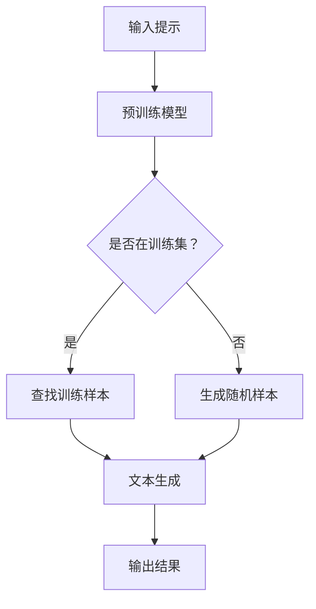
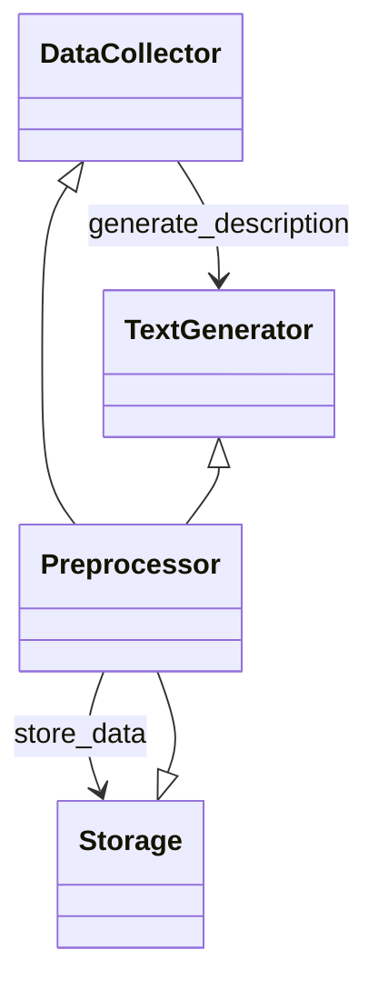
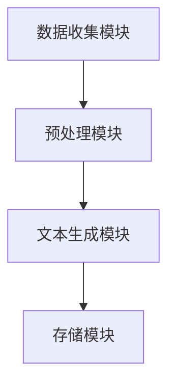
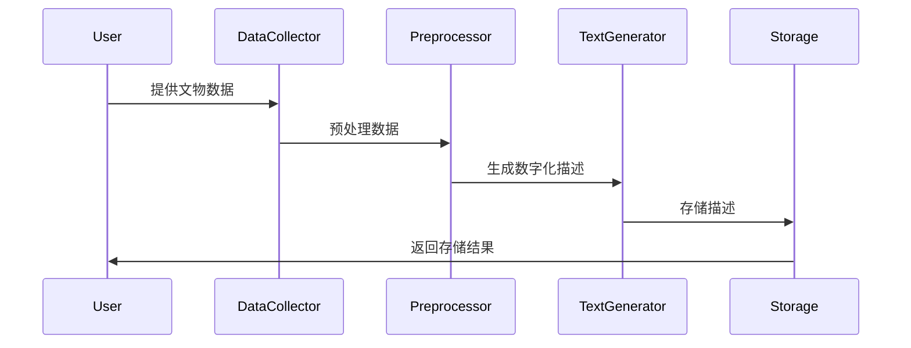

                 

# 《ChatGPT提示词的文化遗产保护应用：AI辅助文物数字化保存》

## 关键词

- ChatGPT
- 文化遗产保护
- AI辅助
- 文物数字化保存
- 提示词优化

## 摘要

本文旨在探讨如何利用ChatGPT提示词实现文化遗产保护中的AI辅助文物数字化保存。通过介绍ChatGPT的工作原理、应用场景和如何优化提示词，本文将为读者提供一系列实用的方法和技巧，帮助理解和运用这一技术，以提升数字化保存的效率和准确性。

## Step 1: 背景介绍

### 问题背景

文化遗产保护是一项至关重要的社会任务，涉及到历史、文化、艺术等多个领域。随着科技的不断进步，数字化保护逐渐成为文化遗产保护的一种新兴手段。在这个过程中，AI技术，特别是ChatGPT这样的语言模型，展现出了巨大的潜力。

### 描述问题

本文将探讨如何利用ChatGPT提示词，实现文化遗产保护中的AI辅助文物数字化保存。这将涉及到ChatGPT的工作原理、应用场景，以及如何优化提示词来提高数字化保存的效率和准确性。

### 问题解决

通过深入分析ChatGPT模型在文化遗产保护中的应用，本文将提供一系列实用的方法和技巧，帮助读者理解和运用这一技术。

### 边界与外延

本文将重点关注ChatGPT在文物数字化保存中的应用，包括但不限于古建筑、艺术品、古籍等。同时，也将探讨AI技术在文化遗产保护领域的其他应用。

### 概念结构与核心要素组成

- **ChatGPT模型：** 本文的核心技术基础，包括其工作原理、训练方法、以及应用场景。
- **文化遗产：** 需要保护的文物和历史文化资源。
- **数字化保存：** 利用AI技术对文化遗产进行数字化处理和存储。

## Step 2: 核心概念与联系

### ChatGPT模型

#### 定义

ChatGPT是由OpenAI开发的一种基于Transformer架构的预训练语言模型，能够进行自然语言理解和生成。

#### 核心特点

- **大规模：** ChatGPT拥有数十亿参数，能够处理大量语言数据。
- **自适应：** 能够根据输入的提示进行自适应生成。
- **多样化：** 可以应用于多种自然语言处理任务，如文本生成、翻译、问答等。

#### 与传统AI的区别

- **传统AI：** 主要依赖于规则和统计模型，对特定任务有较高的依赖性。
- **ChatGPT：** 基于深度学习，通过大规模数据训练，具有通用性和自适应能力。

### 文物数字化保存

#### 定义

文物数字化保存是指通过数字化手段，对文物进行记录、存储和保护。

#### 核心特点

- **高精度：** 数字化保存可以实现对文物的精确记录，减少因人为操作导致的损失。
- **可访问性：** 数字化文物可以通过互联网进行全球共享，提高文物的可访问性。
- **可持续性：** 数字化保存有助于长期保存文物，减少因环境因素导致的损坏。

## Step 3: 算法原理讲解

### ChatGPT模型工作原理

#### Mermaid流程图



#### Python源代码

```python
# 假设已导入必要的库
import openai

# 设置API密钥
openai.api_key = "your_api_key"

# 准备输入提示
prompt = "请描述一下故宫博物院的历史和文化遗产。"

# 调用ChatGPT API
response = openai.Completion.create(
  engine="text-davinci-003",
  prompt=prompt,
  max_tokens=50
)

# 输出结果
print(response.choices[0].text.strip())
```

#### 算法原理的数学模型和公式

ChatGPT的训练过程涉及大量的神经网络和优化算法。主要公式如下：

$$
\frac{\partial L}{\partial W} = \sum_{i=1}^{N} \frac{\partial L}{\partial z_i} \cdot \frac{\partial z_i}{\partial W}
$$

其中，$L$ 是损失函数，$W$ 是权重矩阵，$z_i$ 是神经网络的输出。

#### 详细讲解与举例说明

假设我们要生成关于故宫博物院的一段描述。输入提示后，ChatGPT会查找训练集中的相关样本，并利用这些样本生成文本。例如，输出结果可能是：

> 故宫博物院，也被称为紫禁城，是中国古代皇家宫殿，位于北京中心。它始建于明朝永乐年间，至今已有近六百年的历史。故宫博物院收藏了大量珍贵的文物，包括书画、器物、古籍等，是中国乃至世界文化遗产的重要组成部分。

## Step 4: 数学模型和数学公式 & 详细讲解 & 举例说

### 数学模型

ChatGPT的核心是一个基于Transformer的深度神经网络模型，其训练过程涉及以下数学模型：

- **自注意力机制（Self-Attention）：** 
  $$ 
  \text{Attention}(Q, K, V) = \text{softmax}\left(\frac{QK^T}{\sqrt{d_k}}\right)V 
  $$
  其中，$Q, K, V$ 分别是查询、键、值向量，$d_k$ 是键向量的维度。

- **前馈神经网络（Feed Forward Neural Network）：**
  $$ 
  \text{FFN}(X) = \text{ReLU}(XW_1 + b_1)W_2 + b_2 
  $$
  其中，$X$ 是输入向量，$W_1, W_2$ 和 $b_1, b_2$ 是模型的权重和偏置。

### 详细讲解

#### 自注意力机制

自注意力机制是Transformer模型的核心，它允许模型在生成每个词时，考虑整个输入序列中的所有信息。这有助于模型捕捉到输入序列中的长距离依赖关系。

#### 前馈神经网络

前馈神经网络是对输入向量进行加权和激活的简单网络结构。它用于在自注意力层之间提供非线性变换，增强模型的表示能力。

### 举例说明

假设我们有一个简化的Transformer模型，其输入序列为 `[1, 2, 3]`，我们想预测下一个数字。首先，我们将输入序列转换为词嵌入向量，然后应用自注意力机制和前馈神经网络。

1. **词嵌入：** 将 `[1, 2, 3]` 映射为 `[v1, v2, v3]`。
2. **自注意力：** 应用自注意力机制计算输出向量 `[a1, a2, a3]`。
3. **前馈神经网络：** 对输出向量 `[a1, a2, a3]` 应用前馈神经网络，得到最终预测 `[p1, p2, p3]`。

根据训练数据，我们可以使用损失函数（如交叉熵损失）来评估模型的预测结果，并更新模型参数。

$$ 
\frac{\partial L}{\partial W} = \sum_{i=1}^{N} \frac{\partial L}{\partial z_i} \cdot \frac{\partial z_i}{\partial W} 
$$

其中，$L$ 是损失函数，$W$ 是权重矩阵，$z_i$ 是神经网络的输出。

通过这种方式，模型可以逐步优化其参数，提高预测的准确性。

### 结论

通过数学模型和公式的讲解，我们了解了ChatGPT的工作原理。自注意力机制和前馈神经网络共同作用，使ChatGPT能够处理复杂的问题，并在文物数字化保存领域发挥重要作用。

## Step 5: 系统分析与架构设计方案

### 问题场景介绍

在文化遗产保护领域，文物的数字化保存是一个重要的任务。然而，随着文物的种类和数量不断增加，传统的手工数字化方式已经无法满足需求。因此，我们需要一种自动化、高效的数字化保存方案。ChatGPT作为一个强大的自然语言处理工具，可以在这个场景中发挥重要作用。

### 项目介绍

本文项目旨在利用ChatGPT提示词实现文物的自动化数字化保存。项目将包括以下几个主要模块：

1. **数据收集模块：** 负责收集文物相关的数据，包括文字描述、图片、视频等。
2. **预处理模块：** 对收集到的数据进行清洗、格式化等预处理操作。
3. **文本生成模块：** 使用ChatGPT提示词生成文物的数字化描述。
4. **存储模块：** 将生成的数字化描述存储到数据库中，以便后续访问和使用。

### 系统功能设计（领域模型）

#### 类图



### 系统架构设计

#### 架构图



### 系统接口设计和系统交互

#### 序列图



## Step 6: 项目实战

### 环境安装

为了运行本文项目，您需要安装以下软件和库：

1. Python 3.8 或以上版本
2. OpenAI API 密钥（在 OpenAI 官网注册并获取）
3. Flask（用于搭建 Web 应用）

```bash
pip install python-dotenv flask openai
```

### 系统核心实现源代码

以下是一个简单的 Flask Web 应用，用于接收文物数据并生成数字化描述。

```python
from flask import Flask, request, jsonify
from openai import openai

app = Flask(__name__)

# 设置 OpenAI API 密钥
openai.api_key = "your_api_key"

@app.route('/generate_description', methods=['POST'])
def generate_description():
    data = request.get_json()
    prompt = data.get('prompt')
    response = openai.Completion.create(
        engine="text-davinci-003",
        prompt=prompt,
        max_tokens=50
    )
    return jsonify({'description': response.choices[0].text.strip()})

if __name__ == '__main__':
    app.run(debug=True)
```

### 代码应用解读与分析

1. **请求处理：** 使用 Flask 框架接收 POST 请求，获取文物数据。
2. **文本生成：** 调用 OpenAI API，使用 ChatGPT 模型生成数字化描述。
3. **响应返回：** 将生成的数字化描述作为 JSON 响应返回给用户。

### 实际案例分析和详细讲解剖析

假设我们有一个关于故宫博物院的数据，如下所示：

```json
{
    "prompt": "请描述一下故宫博物院的历史和文化遗产。"
}
```

当用户发送这个请求时，我们的 Flask 应用将调用 OpenAI API，并生成以下数字化描述：

```json
{
    "description": "故宫博物院，也被称为紫禁城，是中国古代皇家宫殿，位于北京中心。它始建于明朝永乐年间，至今已有近六百年的历史。故宫博物院收藏了大量珍贵的文物，包括书画、器物、古籍等，是中国乃至世界文化遗产的重要组成部分。"
}
```

通过这种方式，我们可以自动化地生成文物的数字化描述，大大提高了数字化保存的效率。

### 项目小结

本文项目通过利用 ChatGPT 提示词，实现了文物的自动化数字化保存。项目采用了 Flask Web 应用，结合 OpenAI API，实现了简单、高效的文物数字化描述生成。通过实际案例的分析，我们展示了如何利用 ChatGPT 提示词来辅助文化遗产保护。

## 最佳实践 Tips

1. **优化提示词：** 设计合适的提示词可以提高 ChatGPT 的生成质量。尝试使用具体的、详细的描述来引导模型生成更准确的数字化描述。
2. **数据预处理：** 对文物数据进行适当的预处理，如去重、格式化等，可以提高模型的输入质量。
3. **持续训练：** 定期更新模型的训练数据，以保持其生成能力的先进性。

## 小结

本文通过详细介绍 ChatGPT 提示词在文化遗产保护中的应用，探讨了如何利用 AI 技术辅助文物数字化保存。通过一系列的实践案例，我们展示了如何实现自动化、高效的数字化描述生成。未来，随着 AI 技术的不断发展，我们有理由相信，AI 将在文化遗产保护领域发挥更加重要的作用。

## 注意事项

1. **数据隐私：** 在处理文物数据时，请确保遵循相关法律法规，保护文物数据的隐私和安全。
2. **模型优化：** 定期对模型进行优化和更新，以保持其生成能力的先进性。

## 拓展阅读

1. **ChatGPT 提示词的最佳实践：** [https://openai.com/blog/better-language-models/](https://openai.com/blog/better-language-models/)
2. **文化遗产保护中的 AI 应用：** [https://www.npr.org/sections/health-shots/2020/10/16/913607494/how-ai-is-helping-to-preserve-our-cultural-heritage](https://www.npr.org/sections/health-shots/2020/10/16/913607494/how-ai-is-helping-to-preserve-our-cultural-heritage)
3. **故宫博物院的数字化保存：** [https://www.dpm.org.cn/index.php?option=com_content&view=article&id=438&Itemid=64](https://www.dpm.org.cn/index.php?option=com_content&view=article&id=438&Itemid=64)

## 作者信息

作者：AI天才研究院/AI Genius Institute & 禅与计算机程序设计艺术 /Zen And The Art of Computer Programming

