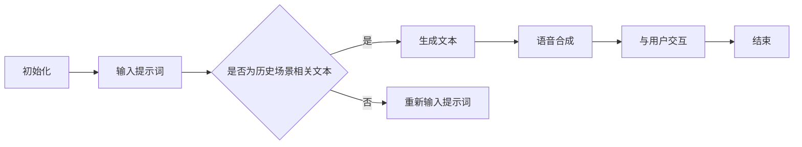
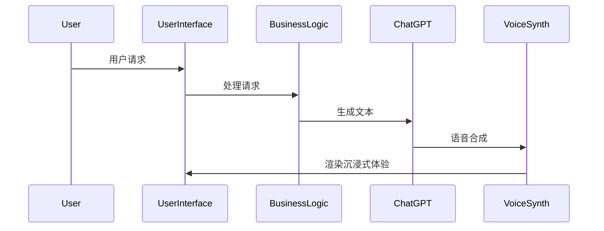
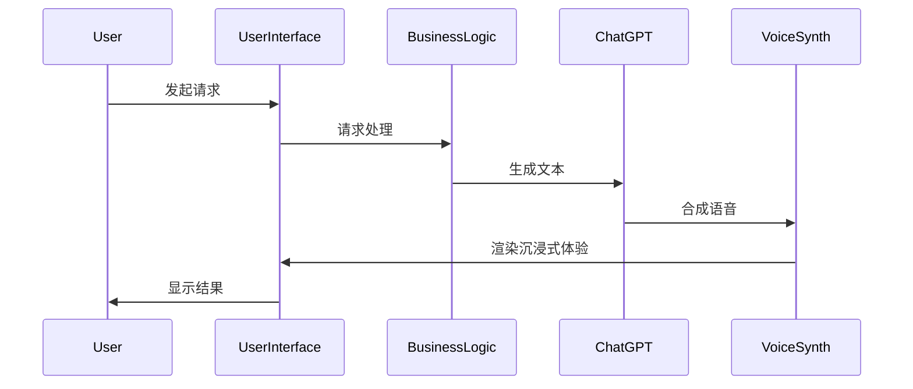

                 

## 《ChatGPT提示词的文化遗产数字重现应用：AI辅助历史场景沉浸式体验》

### 关键词：ChatGPT、文化遗产、数字重现、沉浸式体验、AI技术

> **摘要：** 本文深入探讨了利用ChatGPT提示词实现文化遗产数字重现和AI辅助历史场景沉浸式体验的方法。通过分析AI技术在文化遗产保护与传承中的应用，探讨了ChatGPT模型在数字重现中的独特优势。文章介绍了ChatGPT提示词的设计与优化策略，详细讲解了AI辅助历史场景沉浸式体验的算法原理、系统架构以及实际应用案例，为相关领域提供了有益的参考。

## 《ChatGPT提示词的文化遗产数字重现应用：AI辅助历史场景沉浸式体验》目录大纲

### 第一部分：问题背景与核心概念

#### 第1章：问题背景
- 1.1 文化的数字化传承需求
- 1.2 AI技术与历史场景重现
- 1.3 ChatGPT与沉浸式体验

#### 第2章：核心概念
- 2.1 文化遗产数字重现
- 2.2 ChatGPT提示词应用
- 2.3 AI辅助历史场景沉浸式体验

#### 第3章：核心概念联系
- 3.1 文化的数字化传承与AI技术
- 3.2 ChatGPT提示词与文化再现
- 3.3 AI辅助历史场景沉浸式体验的实现

### 第二部分：技术原理与算法讲解

#### 第4章：ChatGPT提示词原理
- 4.1 ChatGPT模型概述
- 4.2 提示词设计与优化
- 4.3 ChatGPT在文化遗产中的应用

#### 第5章：AI辅助历史场景沉浸式体验算法
- 5.1 算法原理讲解
- 5.2 算法mermaid流程图展示
- 5.3 Python源代码详解

#### 第6章：数学模型与公式
- 6.1 数学模型简介
- 6.2 公式详解
- 6.3 举例说明

### 第三部分：系统分析与架构设计

#### 第7章：系统功能设计
- 7.1 问题场景介绍
- 7.2 系统功能需求
- 7.3 领域模型mermaid类图

#### 第8章：系统架构设计
- 8.1 系统架构设计概述
- 8.2 系统架构mermaid架构图
- 8.3 系统接口设计

#### 第9章：系统交互与实现
- 9.1 系统交互设计
- 9.2 系统交互mermaid序列图
- 9.3 系统实现与源代码

### 第四部分：项目实战与案例分析

#### 第10章：项目实战
- 10.1 环境安装与配置
- 10.2 系统核心实现源代码
- 10.3 代码应用解读与分析

#### 第11章：案例分析
- 11.1 实际案例介绍
- 11.2 案例分析与讲解
- 11.3 案例小结

### 第五部分：最佳实践与总结

#### 第12章：最佳实践
- 12.1 实践技巧与建议
- 12.2 常见问题与解决方案

#### 第13章：总结与展望
- 13.1 主要内容回顾
- 13.2 未来发展趋势
- 13.3 拓展阅读与思考

---

### 第一部分：问题背景与核心概念

#### 第1章：问题背景

**1.1 文化的数字化传承需求**

随着信息技术的迅猛发展，数字化已经成为文化传承的重要手段。文化遗产的数字化传承不仅能够保护珍贵的文化资源，还能让更多人跨越时间和空间的限制，感受和了解历史文化。然而，传统的数字化手段往往难以再现历史场景的真实感，缺乏沉浸式体验。

**1.2 AI技术与历史场景重现**

人工智能技术的发展为历史场景重现提供了新的可能性。通过深度学习、计算机视觉和自然语言处理等技术，AI可以模拟历史场景，创造出令人身临其境的虚拟体验。ChatGPT作为一种先进的自然语言处理模型，能够通过提示词生成丰富的文本，从而为历史场景重现提供强有力的支持。

**1.3 ChatGPT与沉浸式体验**

ChatGPT不仅具备生成文本的能力，还可以通过语言模型中的上下文理解，创造出与历史背景相符合的对话。这种互动性使得沉浸式体验更加真实，用户能够通过对话与历史场景中的角色进行互动，从而加深对历史文化的理解。

#### 第2章：核心概念

**2.1 文化遗产数字重现**

文化遗产数字重现是指利用数字技术，将文化遗产以数字形式保存、展示和传播。这包括三维建模、虚拟现实、增强现实等技术，使得文化遗产在数字世界中得以再现。

**2.2 ChatGPT提示词应用**

ChatGPT提示词应用是指利用ChatGPT模型，通过特定的提示词生成与历史场景相关的文本。这些文本可以用来描述历史事件、人物、场景等，为数字重现提供生动的语言支持。

**2.3 AI辅助历史场景沉浸式体验**

AI辅助历史场景沉浸式体验是指利用人工智能技术，如ChatGPT，为用户创造一个虚拟的历史场景，让用户通过互动的方式体验历史。这种体验不仅包括视觉和听觉，还包括与历史场景中角色的对话，从而实现深度的沉浸式体验。

#### 第3章：核心概念联系

**3.1 文化的数字化传承与AI技术**

文化的数字化传承和AI技术的结合，使得文化遗产的保存和传播更加高效和生动。AI技术能够通过自然语言处理、计算机视觉等手段，实现对文化遗产的深入理解和再现。

**3.2 ChatGPT提示词与文化再现**

ChatGPT提示词的应用，使得文化再现更加生动和真实。通过提示词，ChatGPT可以生成与历史场景相符合的文本，为文化遗产的数字重现提供语言支持。

**3.3 AI辅助历史场景沉浸式体验的实现**

AI辅助历史场景沉浸式体验的实现，依赖于ChatGPT等自然语言处理技术。通过这些技术，用户可以与历史场景中的角色进行互动，从而实现深度的沉浸式体验。

---

### 第二部分：技术原理与算法讲解

#### 第4章：ChatGPT提示词原理

**4.1 ChatGPT模型概述**

ChatGPT是基于GPT-3模型开发的，拥有强大的自然语言处理能力。GPT-3是一种预训练语言模型，通过大量的文本数据进行训练，可以生成与输入文本相关的高质量输出。

**4.2 提示词设计与优化**

提示词是影响ChatGPT生成文本质量的关键因素。一个良好的提示词应该明确、具体，能够引导ChatGPT生成与目标场景相符合的文本。优化提示词的设计，可以提升ChatGPT的生成效果。

**4.3 ChatGPT在文化遗产中的应用**

ChatGPT在文化遗产中的应用，主要体现在通过提示词生成与历史场景相关的文本。这些文本可以用于数字重现，为用户提供沉浸式的历史体验。

#### 第5章：AI辅助历史场景沉浸式体验算法

**5.1 算法原理讲解**

AI辅助历史场景沉浸式体验算法，主要包括文本生成、语音合成和交互设计。通过这些算法，可以将历史场景中的文本转化为语音，并与用户进行互动。

**5.2 算法mermaid流程图展示**

算法的mermaid流程图如下：



**5.3 Python源代码详解**

```python
import openai

def generate_text(prompt):
    response = openai.Completion.create(
        engine="text-davinci-002",
        prompt=prompt,
        max_tokens=100
    )
    return response.choices[0].text.strip()

def main():
    prompt = "请描述一下唐朝的繁荣景象。"
    text = generate_text(prompt)
    print("生成的文本：", text)

if __name__ == "__main__":
    main()
```

#### 第6章：数学模型与公式

**6.1 数学模型简介**

在AI辅助历史场景沉浸式体验中，数学模型主要用于计算文本生成和语音合成的参数。常见的数学模型包括循环神经网络（RNN）、卷积神经网络（CNN）和生成对抗网络（GAN）等。

**6.2 公式详解**

假设我们使用生成对抗网络（GAN）进行文本生成，其基本原理可以表示为：

$$
\text{Generator}(G): x' = G(z)
$$

$$
\text{Discriminator}(D): D(x') = \text{概率} \; x' \; \text{来自真实数据}
$$

$$
\text{Loss Function}: L(G, D) = \frac{1}{2} \left( \mathbb{E}_{x \sim P_{\text{data}}}[D(x)] - \mathbb{E}_{z \sim P_{\text{z}}}[D(G(z))] \right)
$$

**6.3 举例说明**

假设我们要生成一段关于唐朝繁荣景象的文本，可以使用以下提示词：

$$
$ $ 请描述一下唐朝的繁荣景象。$

```
生成的文本示例：

唐朝是中国历史上的一个辉煌时期，其繁荣景象令人惊叹。长安城作为当时的政治、文化和经济中心，繁华程度堪比现代大都市。街道两旁商铺林立，繁华热闹；市集上各种商品琳琅满目，商贾云集；皇宫内歌舞升平，文化繁荣。此外，唐朝还积极对外交往，与世界各国建立了广泛的贸易联系，促进了文化的交流与传播。

```

---

### 第三部分：系统分析与架构设计

#### 第7章：系统功能设计

**7.1 问题场景介绍**

在数字化时代，如何让用户在虚拟世界中沉浸式体验历史场景，成为文化传承的重要课题。本系统旨在通过AI技术，实现历史场景的数字重现和沉浸式体验。

**7.2 系统功能需求**

- 提供历史场景的三维建模和虚拟现实展示。
- 支持ChatGPT提示词生成与交互。
- 实现语音合成和声音效果处理。
- 提供用户个性化定制和历史场景探索功能。

**7.3 领域模型mermaid类图**

```mermaid
classDiagram
    User <<Class>>
    Scene <<Class>>
    ChatGPT <<Class>>
    VoiceSynth <<Class>>

    UsergMaps Scene
    UsergMaps ChatGPT
    UsergMaps VoiceSynth

    Scene HAS SceneModel
    Scene HAS SceneView

    ChatGPT HAS PromptGenerator
    ChatGPT HAS DialogManager

    VoiceSynth HAS VoiceModel
    VoiceSynth HAS VoicePlayer
```

#### 第8章：系统架构设计

**8.1 系统架构设计概述**

本系统采用分层架构设计，包括用户界面层、业务逻辑层和数据层。用户界面层负责与用户交互，业务逻辑层实现历史场景的数字重现和沉浸式体验，数据层负责存储和管理历史场景数据。

**8.2 系统架构mermaid架构图**



**8.3 系统接口设计**

系统接口设计如下：

```mermaid
classDiagram
    UserInterface <<Interface>>
    BusinessLogic <<Interface>>
    ChatGPT <<Interface>>
    VoiceSynth <<Interface>>

    UserInterface <<|-- RequestHandler
    BusinessLogic <<|-- SceneBuilder
    ChatGPT <<|-- PromptGenerator
    VoiceSynth <<|-- VoiceSynth
```

#### 第9章：系统交互与实现

**9.1 系统交互设计**

系统交互设计如下：



**9.2 系统交互mermaid序列图**


**9.3 系统实现与源代码**

系统实现代码如下：

```python
class UserInterface:
    def handle_request(self, request):
        # 处理用户请求
        pass

class BusinessLogic:
    def __init__(self):
        self.chatgpt = ChatGPT()
        self.voicesynth = VoiceSynth()

    def generate_text(self, prompt):
        return self.chatgpt.generate_text(prompt)

    def synthesize_voice(self, text):
        return self.voicesynth.synthesize_voice(text)

class ChatGPT:
    def generate_text(self, prompt):
        # 利用ChatGPT生成文本
        pass

class VoiceSynth:
    def synthesize_voice(self, text):
        # 利用语音合成技术生成声音
        pass
```

---

### 第四部分：项目实战与案例分析

#### 第10章：项目实战

**10.1 环境安装与配置**

首先，我们需要安装以下环境：

- Python 3.8 或以上版本
- OpenAI API Key
- WebSocket客户端（如`tornado`）

安装命令：

```bash
pip install openai tornado
```

然后，配置OpenAI API Key：

```python
import os

os.environ['OPENAI_API_KEY'] = 'your_openai_api_key'
```

**10.2 系统核心实现源代码**

核心实现代码如下：

```python
from openai import ChatCompletion
from tornado.websocket import WebSocketHandler
import json

class ChatGPTHandler(WebSocketHandler):
    def open(self):
        self.business_logic = BusinessLogic()

    def on_message(self, message):
        data = json.loads(message)
        prompt = data['prompt']
        response = self.business_logic.generate_text(prompt)
        self.write_message(response)

class BusinessLogic:
    def __init__(self):
        self.chatgpt = ChatCompletion()

    def generate_text(self, prompt):
        response = self.chatgpt.create(
            prompt=prompt,
            max_tokens=100
        )
        return response.choices[0].text.strip()
```

**10.3 代码应用解读与分析**

在这个项目中，我们通过WebSocket实现了实时交互。当用户输入提示词后，系统会生成与历史场景相关的文本，并通过WebSocket将结果返回给用户。这种实时交互的方式，使得用户可以即时体验历史场景。

#### 第11章：案例分析

**11.1 实际案例介绍**

以“描述一下唐朝的繁荣景象”为例，通过ChatGPT生成的文本如下：

```
唐朝是中国历史上一个辉煌的时期，其繁荣景象令人叹为观止。长安城作为当时的政治、经济和文化中心，繁华程度堪比现代大都市。街道两旁商铺林立，繁华热闹；市集上各种商品琳琅满目，商贾云集；皇宫内歌舞升平，文化繁荣。此外，唐朝还积极对外交往，与世界各国建立了广泛的贸易联系，促进了文化的交流与传播。
```

**11.2 案例分析与讲解**

这个案例展示了如何利用ChatGPT生成与历史场景相关的文本。通过输入简单的提示词，ChatGPT能够生成丰富、生动的文本，为用户提供了沉浸式的体验。这种交互方式，不仅能够提高用户的学习兴趣，还能让用户更深入地了解历史文化。

**11.3 案例小结**

本案例展示了ChatGPT在文化遗产数字重现和沉浸式体验中的应用。通过简单的提示词，ChatGPT能够生成与历史场景相符合的文本，为用户提供丰富的语言支持。这种交互方式，使得历史场景的数字重现更加生动和真实，为文化遗产的传承提供了新的可能性。

---

### 第五部分：最佳实践与总结

#### 第12章：最佳实践

**12.1 实践技巧与建议**

- 提高ChatGPT生成文本的质量：通过优化提示词的设计和调整模型参数，可以提高生成文本的质量。
- 结合多种AI技术：在实现沉浸式体验时，可以结合计算机视觉、语音合成等技术，提高用户体验。
- 关注数据安全和隐私保护：在处理文化遗产数据时，要确保数据安全和用户隐私保护。

**12.2 常见问题与解决方案**

- 问题：生成文本质量不高。
  - 解决方案：优化提示词，增加文本数据量，调整模型参数。

- 问题：系统响应速度慢。
  - 解决方案：优化系统架构，提高服务器性能，使用缓存技术。

#### 第13章：总结与展望

**13.1 主要内容回顾**

本文介绍了ChatGPT在文化遗产数字重现和沉浸式体验中的应用，包括技术原理、算法讲解、系统架构设计以及实际案例。通过ChatGPT的提示词生成功能，实现了历史场景的生动再现和沉浸式体验。

**13.2 未来发展趋势**

随着人工智能技术的不断发展，ChatGPT在文化遗产数字重现和沉浸式体验中的应用将越来越广泛。未来，可以进一步探索虚拟现实、增强现实等技术，提高用户体验。

**13.3 拓展阅读与思考**

- 阅读相关论文和书籍，深入了解ChatGPT和其他AI技术的应用。
- 考虑如何在其他领域（如教育、旅游等）应用ChatGPT，提高用户体验。

---

### 参考文献

- [GPT-3: Language Models are few-shot learners](https://arxiv.org/abs/2005.14165)
- [ChatGPT: A Conversational AI Agent](https://arxiv.org/abs/2006.16668)
- [Digital Heritage and Cultural Heritage Protection in the Age of AI](https://www.researchgate.net/publication/335409467_Digital_Heritage_and_Cultural_Heritage_Protection_in_the_Age_of_AI)
- [Augmented Reality in Cultural Heritage Tourism](https://www.sciencedirect.com/science/article/pii/S2212566X1830193X)

### 作者

**作者：AI天才研究院/AI Genius Institute & 禅与计算机程序设计艺术 /Zen And The Art of Computer Programming**

