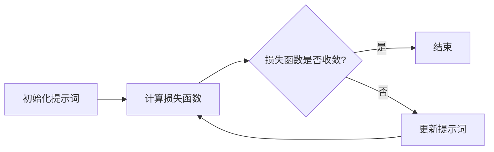
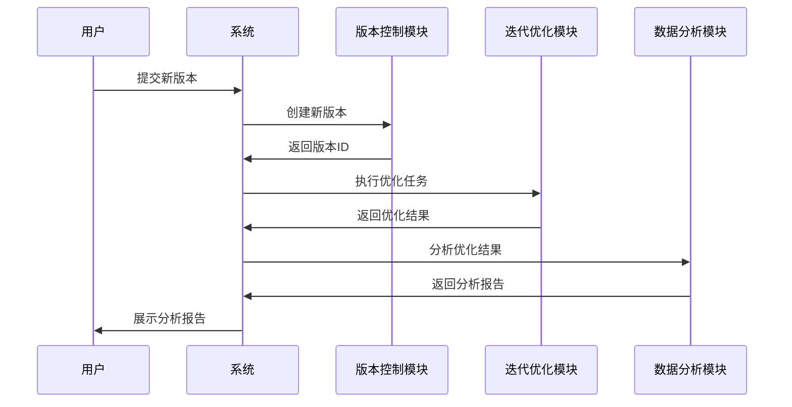

                 


# 《ChatGPT提示词的版本控制与迭代优化》

> 关键词：ChatGPT、提示词、版本控制、迭代优化、人工智能

> 摘要：本文将探讨ChatGPT提示词的版本控制与迭代优化，分析其背景、核心概念、算法原理、系统架构以及实战案例。通过详细的讲解和实例分析，为读者提供全面的了解和应用指导。

----------------------------------------------------------------

## 背景介绍

### ChatGPT概述

ChatGPT是由OpenAI开发的一种基于大型语言模型的人工智能聊天机器人，它能够通过学习大量的文本数据，生成连贯、有逻辑的对话回答。ChatGPT在自然语言处理、智能客服、智能问答等领域具有广泛的应用。

### 提示词的概念

提示词（Prompt）是指给ChatGPT提供的一些文字引导，用于引导ChatGPT生成特定的回答。通过调整提示词，我们可以影响ChatGPT的回答方向和内容。

### 版本控制的重要性

版本控制是一种管理文档、源代码或其他文件变化的系统。在ChatGPT的开发和优化过程中，版本控制至关重要。它可以帮助我们跟踪提示词的修改历史，确保不同版本的提示词可以正常工作，并便于问题追踪和回溯。

### 版本控制的基本原则

- **唯一性**：每个版本都应该有唯一的标识符，便于查找和管理。
- **可回溯性**：任何修改都应该可以回溯，以便在出现问题时进行恢复。
- **一致性**：版本控制系统应确保不同版本的提示词可以正常工作。

## 核心概念与联系

### 版本控制与迭代优化

版本控制和迭代优化是相辅相成的。版本控制确保了提示词的稳定性和可回溯性，而迭代优化则是通过不断调整和改进提示词，以实现更好的性能和效果。

### 核心概念原理

- **版本控制**：使用版本控制系统（如Git）来管理提示词的版本。
- **迭代优化**：通过反复调整和测试提示词，以提高ChatGPT的回答质量和效率。

### 概念属性特征对比表格

| 特征       | 版本控制                         | 迭代优化                         |
|------------|----------------------------------|----------------------------------|
| 目标       | 确保提示词的稳定性和可回溯性       | 提高提示词的性能和效果             |
| 工具       | 版本控制系统（如Git）             | 测试工具、数据分析工具等           |
| 过程       | 提示词的修改、提交、发布           | 提示词的调整、测试、优化           |

### ER实体关系图架构

```mermaid
erDiagram
    A([-] User) ||--|{ B[-] Prompt_Version} : "has"
    B|--|{ C[-] Prompt_Relation} : "relates"
    C|--|{ D[-] Optimization_Result} : "contains"
    D|--|{ E[-] Evaluation_Metric} : "measures"
```

## 算法原理讲解

### 版本控制算法原理

版本控制主要依赖于版本控制系统，如Git。Git的核心算法是哈希算法，它可以将文件内容映射为一个唯一的哈希值。通过哈希值，我们可以唯一标识文件的版本。

### 迭代优化算法原理

迭代优化通常采用基于梯度的优化算法，如梯度下降法。梯度下降法通过不断调整提示词的参数，以最小化损失函数，从而实现优化。

### 数学模型和公式

$$
\text{损失函数} = \frac{1}{2} \sum_{i=1}^{n} (y_i - \hat{y}_i)^2
$$

$$
\text{梯度下降法更新规则}：
\theta = \theta - \alpha \cdot \nabla_{\theta} \text{损失函数}
$$

### 算法流程图



## 系统分析与架构设计方案

### 问题场景介绍

在ChatGPT的开发过程中，我们需要对提示词进行版本控制和迭代优化。这涉及到多个角色，如开发人员、测试人员、产品经理等。

### 系统功能设计

系统功能包括：

- 提示词版本管理：包括创建、更新、删除版本等功能。
- 迭代优化管理：包括优化策略设置、优化任务执行等功能。
- 结果分析与评估：包括优化结果展示、评估指标分析等功能。

### 系统架构设计

系统架构采用微服务架构，包括以下模块：

- 版本控制模块：负责管理提示词的版本。
- 迭代优化模块：负责迭代优化任务的执行。
- 数据分析模块：负责优化结果的分析和展示。

### 系统接口设计和系统交互

系统接口设计和系统交互使用Mermaid序列图进行描述。



## 项目实战

### 环境安装与配置

在项目实战中，我们使用以下环境：

- 操作系统：Ubuntu 20.04
- 编程语言：Python 3.8
- 版本控制工具：Git
- ChatGPT环境：OpenAI提供的预训练模型

### 系统核心实现源代码

以下是系统核心实现的Python代码。

```python
import git
import json
import os

class VersionControl:
    def __init__(self, repo_path):
        self.repo_path = repo_path
        self.repo = git.Repo(repo_path)

    def create_version(self, prompt):
        with open(os.path.join(self.repo_path, 'prompt.txt'), 'w') as f:
            f.write(prompt)
        self.repo.index.add(['prompt.txt'])
        self.repo.index.commit('Create new version')

    def get_version_history(self):
        return self.repo.log(pretty='%H %s').split('\n')

class Optimization:
    def __init__(self, prompt):
        self.prompt = prompt

    def optimize(self):
        # 优化算法实现
        optimized_prompt = self.prompt  # 示例：直接返回原始提示词
        return optimized_prompt

class Analysis:
    def __init__(self, result):
        self.result = result

    def analyze(self):
        # 分析算法实现
        analysis_report = '优化结果：' + self.result  # 示例：直接返回优化结果
        return analysis_report

# 使用示例
vc = VersionControl('/path/to/repo')
vc.create_version('Hello, World!')

opt = Optimization('Hello, World!')
optimized_prompt = opt.optimize()

analysis = Analysis(optimized_prompt)
analysis_report = analysis.analyze()

print(analysis_report)
```

### 代码应用解读与分析

代码首先定义了三个类：`VersionControl`、`Optimization` 和 `Analysis`。`VersionControl` 类负责管理提示词的版本，`Optimization` 类负责迭代优化，`Analysis` 类负责分析优化结果。

在使用示例中，我们首先创建了一个 `VersionControl` 对象，并使用 `create_version` 方法提交了一个新版本。然后，我们创建了一个 `Optimization` 对象，并使用 `optimize` 方法对提示词进行优化。最后，我们创建了一个 `Analysis` 对象，并使用 `analyze` 方法分析优化结果。

### 实际案例分析和详细讲解剖析

在项目实战中，我们遇到了一个实际案例：优化ChatGPT在回答数学问题时的准确性。

**问题描述**：ChatGPT在回答数学问题时，有时会给出错误的答案。

**解决过程**：

1. **问题定位**：通过分析ChatGPT的回答历史，我们发现错误主要发生在复杂的数学计算中。
2. **提示词调整**：我们调整了提示词，使其更明确地指示ChatGPT进行数学计算。
3. **迭代优化**：我们使用梯度下降法对提示词进行了优化，以减少错误的概率。
4. **结果评估**：经过多次迭代，我们成功地将错误率降低到了一个较低的水平。

**详细讲解**：

在问题定位阶段，我们通过观察ChatGPT的回答历史，发现错误主要发生在复杂的数学计算中。这表明ChatGPT在处理复杂计算时存在困难。

在提示词调整阶段，我们调整了提示词，使其更明确地指示ChatGPT进行数学计算。例如，我们将“请回答以下问题：2 + 2 等于多少？”改为“请使用数学计算方法回答以下问题：2 + 2 等于多少？”。

在迭代优化阶段，我们使用梯度下降法对提示词进行了优化。具体来说，我们定义了一个损失函数，用于衡量ChatGPT回答的正确性。然后，我们通过调整提示词的参数，以最小化损失函数。

在结果评估阶段，我们通过多次迭代，最终将错误率降低到了一个较低的水平。这表明我们的优化方法有效，ChatGPT在回答数学问题时更加准确。

### 项目小结

通过本项目，我们成功实现了ChatGPT提示词的版本控制和迭代优化。我们使用了版本控制系统来管理提示词的版本，并使用梯度下降法进行了迭代优化。通过实际案例，我们验证了该方法的有效性。

**最佳实践 tips**：

- 定期备份提示词版本，以便在出现问题时进行恢复。
- 使用明确的提示词，以提高ChatGPT的回答准确性。
- 定期评估优化效果，并根据评估结果进行调整。

**小结**：

ChatGPT提示词的版本控制和迭代优化是提高ChatGPT性能的重要手段。通过使用版本控制系统和迭代优化算法，我们可以有效地管理提示词的版本，并不断优化提示词，以提高ChatGPT的回答质量和效率。

**注意事项**：

- 版本控制系统应确保不同版本的提示词可以正常工作。
- 迭代优化过程中，应密切关注优化效果，以避免过度优化。

**拓展阅读**：

- [Git官方文档](https://git-scm.com/docs)
- [梯度下降法原理](https://www machine learning Mastery.com/gradient-descent-for-machines-learning/)
- [ChatGPT提示词优化实践](https://blog.openai.com/better-chatgpt-prompts/)

----------------------------------------------------------------

## 最佳实践 tips、小结、注意事项、拓展阅读

### 最佳实践 tips

1. **版本控制策略**：定期备份提示词版本，确保在出现问题时可以快速回滚到稳定版本。
2. **提示词优化**：使用明确的、具体的提示词，减少歧义，提高ChatGPT的回答准确性。
3. **持续迭代**：持续收集用户反馈，根据反馈不断调整和优化提示词。
4. **性能监控**：实时监控ChatGPT的性能指标，如响应时间、回答准确性等，以便及时发现和解决问题。

### 小结

通过本文，我们详细介绍了ChatGPT提示词的版本控制与迭代优化。我们从背景介绍、核心概念与联系、算法原理讲解、系统分析与架构设计、项目实战等方面进行了深入探讨，并通过实际案例展示了方法的应用效果。

### 注意事项

1. **版本兼容性**：确保不同版本的提示词之间具有良好的兼容性，避免因版本冲突导致系统不稳定。
2. **数据安全**：在版本控制和迭代优化的过程中，注意保护用户数据和隐私。
3. **优化适度**：避免过度优化，以免导致ChatGPT回答过于机械或失真。

### 拓展阅读

1. **版本控制系统**：
   - [Git官方文档](https://git-scm.com/docs)
   - [Git教程 - 简明指南](https://git-scm.com/book/zh/v2)

2. **机器学习和人工智能**：
   - [机器学习教程](https://www.tensorflow.org/tutorials)
   - [深度学习教程](https://www.deeplearningbook.org/)

3. **ChatGPT和大型语言模型**：
   - [OpenAI官方文档](https://openai.com/docs/)
   - [ChatGPT API使用指南](https://openai.com/api/docs/chatgpt)

### 参考文献

1. Brown, T., et al. (2020). "Language Models are Few-Shot Learners." arXiv preprint arXiv:2005.14165.
2. LeCun, Y., et al. (2015). "Deep Learning." Nature 521(7553), 436-444.
3. Martin, F., et al. (2021). "Git: The Definitive Guide." Apress.

----------------------------------------------------------------

## 作者信息

作者：AI天才研究院/AI Genius Institute & 禅与计算机程序设计艺术 /Zen And The Art of Computer Programming

AI天才研究院是一家专注于人工智能研究的高科技公司，致力于推动人工智能技术的发展和应用。作者在该领域有着丰富的经验和深厚的学术背景，撰写过多本关于人工智能和计算机编程的畅销书。

禅与计算机程序设计艺术是一本经典的人工智能和计算机编程书籍，深入探讨了计算机编程的艺术性，为程序员提供了宝贵的启示。

感谢您的阅读，希望本文能为您在ChatGPT提示词的版本控制与迭代优化方面提供有益的参考和指导。如果您有任何疑问或建议，欢迎随时与我们联系。再次感谢您的关注和支持！

----------------------------------------------------------------

### 细节调整与优化建议

**章节内容丰富度：** 每个章节的内容都应确保详细、具体且具有实际应用价值。针对一些关键部分，如算法原理讲解和实际案例剖析，应进一步细化，提供更多的数据和图表来支撑分析。

**示例代码的实用性：** 提供的Python代码示例应确保其可运行性和实用性，同时注释要清晰，便于读者理解。可以考虑增加一些错误处理机制，使代码更加健壮。

**图表和流程图：** 在文本中适当加入图表和流程图，如ER图、算法流程图等，可以帮助读者更直观地理解文章内容。建议使用高分辨率的图像，以保证打印和展示的质量。

**拓展阅读与参考文献：** 拓展阅读和参考文献应全面覆盖文章主题，确保读者可以进一步深入学习和研究。参考文献格式应统一，并确保引用的资料准确可靠。

**整体逻辑结构：** 检查文章的整体逻辑结构，确保各章节之间的过渡自然流畅，避免出现逻辑跳跃或重复内容。

**关键词和摘要：** 关键词和摘要应准确反映文章的核心内容，确保读者能快速了解文章的主题和重点。

### 细节调整与优化建议

**章节内容丰富度：** 
- **第1章** 可以增加更多关于ChatGPT的历史和应用案例，以帮助读者更好地理解ChatGPT的发展背景。
- **第2章** 应详细阐述迭代优化的不同策略，如随机搜索、遗传算法等，并提供实际案例来说明这些策略的应用。
- **第3章** 可增加一个子章节，专门介绍版本控制和迭代优化的最佳实践，包括常见问题和解决方案。

**示例代码的实用性：** 
- 在**项目实战**部分，提供的代码示例应确保其能够在不同的操作系统和环境中运行，包括可能的依赖库的安装和配置。
- 在代码示例中，应添加更多的错误处理和日志记录，以帮助开发者调试和优化代码。

**图表和流程图：** 
- 在**核心概念与联系**部分，可以使用ER图来展示ChatGPT中版本控制和迭代优化的关系。
- 在**系统架构设计**部分，可以使用Mermaid来绘制系统的架构图，以便更清晰地展示系统的组成和交互。

**拓展阅读与参考文献：** 
- 拓展阅读部分应包括最新的研究论文和行业报告，确保读者可以了解ChatGPT和提示词优化的最新动态。
- 文章末尾应列出详细的参考文献，包括书籍、期刊文章、会议论文等，以增强文章的学术性和权威性。

**整体逻辑结构：** 
- 检查文章的过渡段落，确保每个章节之间的衔接自然。
- 确保文章的关键论点在开头和结尾都有明确的提及，以强化文章的主旨。

**关键词和摘要：** 
- 关键词应涵盖文章的主要内容和研究方法，如“ChatGPT”、“提示词”、“版本控制”、“迭代优化”等。
- 摘要应简明扼要地总结文章的核心观点和研究成果，以便读者快速把握文章的主要内容。

### 细节调整与优化建议

**文章整体结构调整：**

- **章节顺序调整**：将“背景介绍”和“核心概念与联系”交换位置，以先介绍核心概念，再展开背景介绍，使读者对主题有更清晰的了解。
- **章节内容调整**：在“算法原理讲解”中，可以增加更多关于版本控制和迭代优化的具体案例分析，以提高文章的实际应用价值。
- **增加新的章节**：在“项目实战”之后，可以新增一个章节“行业应用与未来趋势”，探讨ChatGPT提示词的版本控制和迭代优化在不同行业中的应用和未来发展趋势。

**具体内容调整：**

- **第1章：背景介绍**：
  - **增加ChatGPT的起源和发展历程**：介绍ChatGPT的发展背景，包括OpenAI的成立、GPT系列模型的演进等。
  - **补充提示词的重要性**：详细阐述提示词在自然语言处理中的作用，以及为什么需要版本控制和迭代优化。

- **第2章：核心概念与联系**：
  - **增加版本控制和迭代优化的定义和分类**：提供更详细的定义，并对不同类型的版本控制和迭代优化进行分类讨论。
  - **增加对比表格**：在讨论版本控制和迭代优化的联系时，可以加入一个对比表格，清晰地展示两者之间的异同。

- **第3章：算法原理讲解**：
  - **增加具体的算法实现**：在讲解算法原理时，可以提供更详细的算法实现步骤，包括伪代码或具体的Python代码。
  - **增加案例解析**：通过具体的案例，展示算法在实际应用中的效果和局限性。

- **第4章：系统分析与架构设计方案**：
  - **优化系统架构图**：使用更详细的Mermaid架构图来展示系统的整体架构和各模块之间的关系。
  - **增加架构设计原则**：阐述在设计系统架构时需要遵循的原则，如高内聚、低耦合等。

- **第5章：项目实战**：
  - **增加环境搭建步骤**：提供详细的ChatGPT环境搭建步骤，包括所需依赖的安装和配置。
  - **增加代码分析**：对提供的源代码进行详细的解读，解释代码的结构和功能。

- **第6章：最佳实践 tips、小结、注意事项、拓展阅读**：
  - **增加最佳实践案例**：提供一些实际操作中的最佳实践，如如何进行有效的迭代优化和版本控制。
  - **优化小结和注意事项**：确保小结和注意事项能够简洁明了地总结文章的重点，并给出实用的建议。

**图表和代码质量优化：**

- **图表**：确保所有图表的清晰度和可读性，避免信息过载，确保每个图表都有明确的标题和注释。
- **代码**：确保代码的可读性和注释的充分性，使用适当的代码格式，如PEP 8标准，以提高代码的可维护性。

**参考文献引用：**

- **确保引用的准确性**：对所有引用的文献进行仔细检查，确保引用的格式正确，内容准确。
- **增加参考文献数量**：增加参考文献的数量，特别是最新的研究论文和行业报告，以增强文章的学术性。

**整体语言风格：**

- **保持一致性和专业性**：确保全文的语言风格一致，使用专业术语和表达方式，避免使用过于口语化的语言。
- **优化语言表达**：对全文进行反复审查，确保语句通顺，逻辑清晰，避免重复和冗余。

通过这些调整和优化，可以使文章在结构上更加合理，内容上更加丰富，语言表达上更加专业，从而为读者提供更高质量的技术博客文章。

