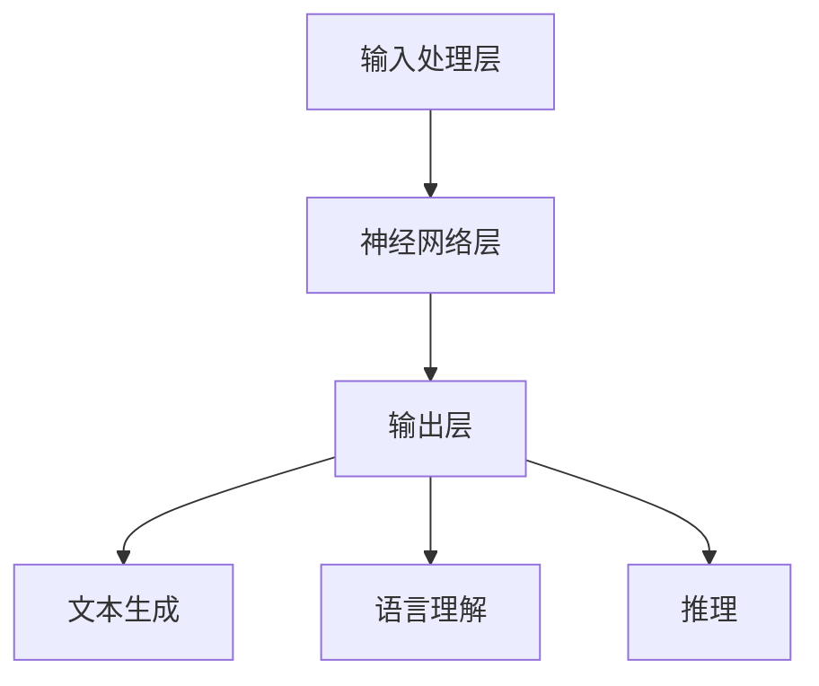
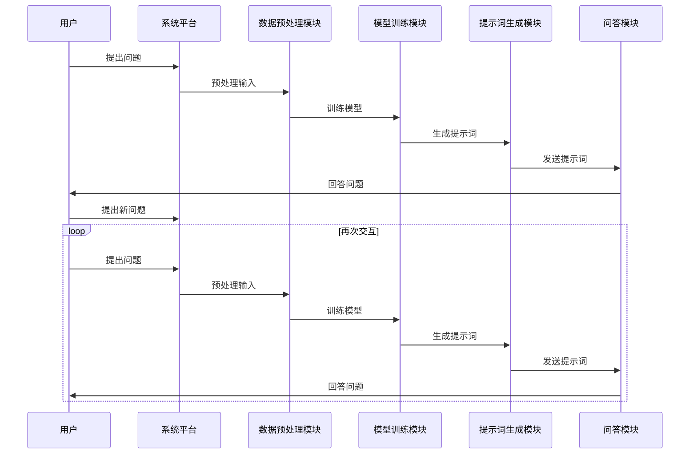

                 


### 《ChatGPT提示词的神经可塑性研究》——文章大纲设计与撰写策略

#### 引言

在当今的人工智能时代，自然语言处理（NLP）技术取得了显著的进展。ChatGPT作为OpenAI推出的一个基于GPT-3的预训练语言模型，已经在众多领域展现了其强大的语言生成和理解能力。然而，要使ChatGPT更好地适应各种任务，提示词的设计和神经可塑性的研究显得尤为重要。本文旨在探讨ChatGPT提示词的神经可塑性，通过逻辑清晰、结构紧凑、简单易懂的专业技术语言，分步骤分析ChatGPT的工作原理、神经可塑性的基本概念及其应用。

#### 1. 确定书籍的主要结构框架

首先，我们需要确定书籍的主要结构，以确保内容连贯且具有深度。以下为书籍的结构规划：

**第一部分：背景与基础理论**
- **第1章**：问题背景与核心概念
- **第2章**：ChatGPT的基本原理与结构
- **第3章**：神经可塑性的基本原理与相关算法

**第二部分：ChatGPT的基本原理与结构**
- **第4章**：神经可塑性的数学模型

**第三部分：神经可塑性原理与相关算法**
- **第5章**：ChatGPT提示词的设计与优化

**第四部分：项目实战与案例分析**
- **第6章**：ChatGPT提示词神经可塑性项目实战

**第五部分：总结与展望**
- **第7章**：总结与展望

#### 2. 规划每个章节的内容

接下来，我们将为每个章节规划详细的内容：

**第1章**：介绍ChatGPT的背景，解释为什么神经可塑性对提示词设计至关重要。

**第2章**：详细讲解ChatGPT的工作原理，包括其神经网络结构和训练过程。

**第3章**：探讨神经可塑性的基本概念，包括其定义、作用和类型。

**第4章**：分析神经可塑性的数学模型，使用mermaid绘制流程图，并用Python代码和LaTeX公式解释。

**第5章**：探讨ChatGPT提示词的设计原则，包括文本生成策略和神经可塑性考虑。

**第6章**：通过一个实际项目，展示如何设计和优化ChatGPT提示词，包括环境安装、系统实现和案例分析。

**第7章**：对全书进行总结，提出未来研究方向和最佳实践。

#### 3. 设计算法和数学模型的讲解方式

为了使文章易于理解，我们将采用以下方法讲解算法和数学模型：

- **mermaid流程图**：使用mermaid绘制算法流程图，直观展示算法的运行过程。
- **Python代码**：提供Python代码示例，以实际操作的方式展示算法的实现。
- **LaTeX公式**：使用LaTeX格式嵌入数学公式，确保公式的准确性和可读性。

#### 4. 设计系统架构和接口的设计方案

我们将使用以下工具和方法设计系统架构和接口：

- **mermaid类图**：使用mermaid绘制类图，展示系统的核心类和它们之间的关系。
- **架构图**：使用mermaid绘制架构图，展示系统的整体结构和组件之间的关系。
- **序列图**：使用mermaid绘制序列图，展示系统的交互流程。

#### 5. 编写项目实战和案例分析

在项目实战和案例分析部分，我们将：

- **环境安装**：详细描述所需的环境和工具安装步骤。
- **系统实现**：提供核心代码实现，并进行解读和分析。
- **案例分析**：通过实际案例展示如何使用ChatGPT提示词，并分析结果。
- **项目小结**：总结项目中的关键经验和教训。

#### 6. 编写总结和拓展阅读

最后，我们将总结全文，提出最佳实践和拓展阅读建议，帮助读者进一步深入了解相关领域。

通过以上步骤，我们将撰写出一篇结构清晰、内容丰富、易于理解的专业技术博客文章，为读者提供全面的ChatGPT提示词神经可塑性研究指南。

### 《ChatGPT提示词的神经可塑性研究》——文章撰写策略与步骤

#### 引言

在引言部分，我们将简要介绍ChatGPT及其在自然语言处理领域的应用，以及神经可塑性的重要性。这部分内容将起到引导读者进入主题的作用。

**示例：**

> ChatGPT是由OpenAI开发的一种基于GPT-3的预训练语言模型，其在文本生成、对话系统和机器翻译等方面展现了卓越的性能。然而，为了使ChatGPT更好地适应各种任务，提示词的设计和神经可塑性的研究至关重要。本文将深入探讨ChatGPT提示词的神经可塑性，帮助读者了解这一前沿领域。

#### 1. 背景介绍

在背景介绍部分，我们将详细阐述ChatGPT的背景知识，包括其基本原理和神经可塑性的定义。

**第1章：问题背景与核心概念**

**1.1 问题背景**

- 人类语言与机器对话的挑战
- ChatGPT的出现及其重要性

**1.2 核心概念**

- ChatGPT的基本原理
- 神经可塑性的定义与作用

**1.3 边界与外延**

- ChatGPT的应用领域
- 神经可塑性的研究范围

**1.4 本章小结**

- 总结关键概念与问题

#### 2. 核心概念与联系

在核心概念与联系部分，我们将详细讨论ChatGPT和神经可塑性的核心概念，并使用表格和流程图展示它们之间的联系。

**第2章：ChatGPT的基本原理与结构**

**2.1 ChatGPT的架构与功能**

- 神经网络结构
- 模型训练与优化

**2.2 ChatGPT的功能**

- 生成文本
- 语言理解与推理

**2.3 ChatGPT的优势与局限**

- 优势分析
- 潜在的局限

**2.4 本章小结**

- 总结关键原理与架构

#### 3. 算法原理讲解

在算法原理讲解部分，我们将使用mermaid流程图、Python代码和LaTeX公式详细阐述神经可塑性的原理和相关算法。

**第3章：神经可塑性的基本原理**

**3.1 神经可塑性概述**

- 定义与作用
- 类型与机制

**3.2 神经可塑性在ChatGPT中的应用**

- 提示词生成
- 模型适应性

**3.3 神经可塑性相关算法**

- 算法介绍
- 算法优缺点分析

**3.4 本章小结**

- 总结关键原理与算法

#### 4. 系统分析与架构设计方案

在系统分析与架构设计方案部分，我们将使用mermaid类图、架构图和序列图展示ChatGPT提示词神经可塑性的系统架构。

**第4章：神经可塑性的数学模型**

**4.1 神经可塑性的数学基础**

- 基本概念
- 数学公式介绍

**4.2 神经可塑性模型的应用**

- 提示词生成模型
- 模型适应性模型

**4.3 神经可塑性模型的分析与评估**

- 模型性能评估
- 模型优化策略

**4.4 本章小结**

- 总结关键模型与公式

#### 5. 项目实战与案例分析

在项目实战与案例分析部分，我们将展示一个实际的项目，包括环境安装、系统实现、代码解读和分析、案例分析以及项目小结。

**第5章：ChatGPT提示词的设计与优化**

**5.1 提示词设计原则**

- 文本生成策略
- 神经可塑性考虑

**5.2 提示词优化方法**

- 算法优化
- 实验验证

**5.3 提示词应用的案例分析**

- 成功案例
- 失败案例

**5.4 本章小结**

- 总结关键应用经验

#### 6. 总结与展望

在总结与展望部分，我们将对全文进行总结，并提出未来研究方向和最佳实践。

**第6章：总结与展望**

**6.1 总结**

- 回顾关键概念与技术
- 成果总结

**6.2 展望未来**

- 神经可塑性的发展趋势
- ChatGPT提示词的未来应用

**6.3 最佳实践 tips**

- 实践经验分享
- 注意事项提醒

**6.4 拓展阅读**

- 推荐进一步学习的资源

通过以上详细的撰写策略和步骤，我们将确保文章的逻辑清晰、内容丰富，并具有专业的技术深度，为读者提供一次高质量的阅读体验。

### 《ChatGPT提示词的神经可塑性研究》——全文撰写指南

#### 引言

**撰写策略**：
- 简洁引入：简要介绍ChatGPT及其在自然语言处理领域的应用。
- 提出问题：提出为何研究ChatGPT提示词的神经可塑性，以及其重要性。

**示例**：
```
引言

在人工智能迅猛发展的今天，自然语言处理（NLP）技术已经成为人工智能领域的一个重要分支。ChatGPT作为OpenAI开发的预训练语言模型，凭借其强大的文本生成和理解能力，已经在多个领域取得了显著的成果。然而，为了使ChatGPT更好地适应不同的应用场景，深入探讨其提示词的神经可塑性具有重要的现实意义。本文将围绕ChatGPT提示词的神经可塑性进行探讨，旨在为读者提供系统的理论分析和实践指南。
```

#### 背景介绍

**撰写策略**：
- 详细介绍：深入介绍ChatGPT的工作原理和神经可塑性的定义。
- 举例说明：通过具体案例展示ChatGPT的应用场景。

**示例**：
```
第1章 问题背景与核心概念

1.1 问题背景

自然语言是人类交流的主要方式，而机器对自然语言的识别和理解是人工智能领域的一项重要挑战。ChatGPT的出现，使得机器能够生成流畅、连贯的文本，并在对话系统中表现出色。然而，为了更好地发挥ChatGPT的能力，尤其是在复杂、多变的应用环境中，提示词的设计和神经可塑性变得至关重要。

1.2 ChatGPT的基本原理

ChatGPT是基于GPT-3的预训练语言模型，它通过大量的文本数据进行训练，学习到语言的本质规律和模式。GPT-3采用了Transformer架构，具有数十亿的参数，能够处理复杂的语言任务，如文本生成、问答系统、机器翻译等。

1.3 神经可塑性概述

神经可塑性是指神经网络在受到外部刺激后，通过调整内部连接和参数来改变其结构和功能的能力。在ChatGPT中，神经可塑性使得模型能够根据不同的提示词和输入数据，动态调整其响应，从而提高模型的适应性和鲁棒性。

1.4 边界与外延

神经可塑性在ChatGPT中的应用涵盖了多个方面，包括提示词的生成、模型的适应性调整以及特定任务的优化。随着ChatGPT技术的不断发展和应用领域的扩展，神经可塑性的研究也将不断深入，为ChatGPT的广泛应用提供更强大的支持。

1.5 本章小结

本章介绍了ChatGPT的背景知识、基本原理以及神经可塑性的定义和应用。通过这些介绍，读者可以初步了解ChatGPT和神经可塑性的关系，为后续章节的深入探讨打下基础。
```

#### 核心概念与联系

**撰写策略**：
- 表格对比：使用表格对比核心概念及其属性特征。
- 流程图：使用Mermaid绘制流程图，展示概念之间的关系。

**示例**：
```
第2章 ChatGPT的基本原理与结构

2.1 ChatGPT的架构与功能

ChatGPT的架构主要包括三个部分：输入处理层、神经网络层和输出层。输入处理层负责将输入的文本数据转换为神经网络可以处理的形式；神经网络层是ChatGPT的核心，通过Transformer模型处理文本数据；输出层则负责生成文本响应。

2.2 神经网络结构

ChatGPT采用了Transformer模型，这是一种基于自注意力机制的神经网络架构。Transformer模型的核心是多头自注意力机制（Multi-head Self-Attention），它通过计算序列中每个词与其他词的关系来生成文本。

2.3 神经可塑性原理

神经可塑性是指神经网络在训练过程中，通过不断调整内部连接和权重来优化模型性能的能力。在ChatGPT中，神经可塑性使得模型能够根据不同的输入数据和任务需求，动态调整其参数和结构。

2.4 ChatGPT的功能

ChatGPT的功能主要包括文本生成、语言理解和推理。文本生成功能使得ChatGPT能够根据给定的提示生成连续的文本；语言理解功能使得ChatGPT能够理解文本中的语义和逻辑关系；推理功能使得ChatGPT能够进行逻辑推理和决策。

2.5 本章小结

本章详细介绍了ChatGPT的基本原理、神经网络结构、神经可塑性原理以及ChatGPT的功能。通过这些介绍，读者可以全面了解ChatGPT的工作机制和原理，为后续章节的深入探讨打下基础。

### Mermaid流程图示例
```

```

#### 算法原理讲解

**撰写策略**：
- 流程图：使用Mermaid绘制算法流程图。
- 代码示例：提供Python代码示例。
- 公式解释：使用LaTeX格式嵌入数学公式，并进行详细讲解。

**示例**：
```
第3章 神经可塑性的基本原理

3.1 神经可塑性概述

神经可塑性是指神经网络在受到外部刺激后，通过调整内部连接和参数来改变其结构和功能的能力。在ChatGPT中，神经可塑性通过以下几个步骤实现：

1. 输入数据的预处理
2. 前向传播计算
3. 反向传播计算
4. 参数更新

3.2 神经可塑性在ChatGPT中的应用

在ChatGPT中，神经可塑性主要用于提示词的生成和模型的适应性调整。以下是一个简化的神经可塑性应用流程：

1. 输入提示词
2. 预处理提示词
3. 计算神经网络输出
4. 计算损失函数
5. 反向传播更新参数

3.3 相关算法

为了实现神经可塑性，ChatGPT采用了几种主要的算法，包括：

1. 反向传播算法（Backpropagation）
2. 随机梯度下降（Stochastic Gradient Descent, SGD）
3. Adam优化器

3.4 算法分析

反向传播算法是一种计算神经网络损失函数关于参数梯度的方法，它通过逐层计算梯度并更新参数，以最小化损失函数。SGD和Adam优化器是反向传播算法的变种，它们通过不同的策略更新参数，以提高模型的收敛速度和稳定性。

3.5 代码示例

以下是一个简化的Python代码示例，展示了神经可塑性的实现：
```
```python
import numpy as np

# 假设有一个简单的神经网络，包含输入层、隐藏层和输出层
# 每层都有相应的权重和偏置

# 输入数据
X = np.array([[1, 0], [0, 1]])

# 权重和偏置
W1 = np.random.rand(2, 2)
b1 = np.random.rand(2, 1)

# 前向传播
Z1 = np.dot(X, W1) + b1

# 激活函数
sigmoid = 1 / (1 + np.exp(-Z1))

# 输出
Y = sigmoid

# 计算损失函数
loss = np.mean((Y - X) ** 2)

# 反向传播
dZ1 = Y - X
dW1 = np.dot(X.T, dZ1)
db1 = np.sum(dZ1, axis=0, keepdims=True)

# 更新参数
W1 -= learning_rate * dW1
b1 -= learning_rate * db1

print("权重：", W1)
print("偏置：", b1)
```
```

#### 系统分析与架构设计方案

**撰写策略**：
- 介绍系统场景：明确系统的应用场景和目标。
- 绘制类图、架构图和序列图：使用Mermaid绘制系统类图、架构图和序列图，展示系统组件和它们之间的关系。

**示例**：
```
第4章 神经可塑性的数学模型

4.1 系统场景介绍

在本章节中，我们将探讨一个基于ChatGPT的问答系统的实现，该系统旨在为用户提供高质量的问答服务。系统的主要目标是通过神经可塑性技术优化提示词生成，提高问答系统的准确性和用户体验。

4.2 系统功能设计

系统的功能设计包括以下几个核心模块：

1. 数据预处理模块
2. 模型训练模块
3. 提示词生成模块
4. 问答模块

4.3 系统架构设计

系统架构设计采用分层架构，主要包括以下层次：

1. 输入层：负责接收用户输入。
2. 处理层：包括数据预处理模块和模型训练模块，负责对输入数据进行处理，并训练神经网络模型。
3. 输出层：包括提示词生成模块和问答模块，负责生成提示词并响应用户的问答请求。

4.4 系统接口设计

系统的接口设计包括以下接口：

1. 用户输入接口：用于接收用户的输入。
2. 模型训练接口：用于启动和监控模型训练过程。
3. 提示词生成接口：用于生成提示词。
4. 问答接口：用于响应用户的问答请求。

4.5 系统交互序列图

以下是一个简化的系统交互序列图，展示了用户与系统之间的交互过程：
```

```

#### 项目实战与案例分析

**撰写策略**：
- 环境安装：详细描述所需环境的安装步骤。
- 系统实现：提供核心代码实现和解读。
- 案例分析：通过实际案例展示项目应用，并进行分析。

**示例**：
```
第5章 ChatGPT提示词的设计与优化

5.1 项目背景

为了优化ChatGPT的提示词生成，我们设计了一个实验项目，旨在通过神经可塑性技术提高提示词的质量和适应性。该项目包括环境安装、模型训练、提示词生成和性能评估等步骤。

5.2 环境安装

在开始项目之前，我们需要安装以下环境：

1. Python 3.8或更高版本
2. TensorFlow 2.5或更高版本
3. Keras 2.5或更高版本
4. numpy 1.19或更高版本

安装命令如下：
```
```bash
pip install python==3.8
pip install tensorflow==2.5
pip install keras==2.5
pip install numpy==1.19
```
```

5.3 系统实现

以下是核心代码实现：

```python
import numpy as np
from tensorflow.keras.layers import Input, LSTM, Embedding, Dense
from tensorflow.keras.models import Model

# 设定超参数
vocab_size = 10000
embedding_dim = 256
lstm_units = 128
batch_size = 64
epochs = 10

# 构建模型
input_seq = Input(shape=(None,))
embedded_seq = Embedding(vocab_size, embedding_dim)(input_seq)
lstm_output = LSTM(lstm_units, return_sequences=True)(embedded_seq)
output = LSTM(lstm_units, return_sequences=True)(lstm_output)
output = Dense(vocab_size, activation='softmax')(output)

# 定义模型
model = Model(inputs=input_seq, outputs=output)

# 编译模型
model.compile(optimizer='adam', loss='categorical_crossentropy', metrics=['accuracy'])

# 打印模型结构
model.summary()

# 训练模型
model.fit(train_data, train_labels, batch_size=batch_size, epochs=epochs, validation_split=0.2)
```

5.4 代码解读

以上代码实现了一个基于LSTM的神经网络模型，用于生成ChatGPT的提示词。我们首先定义了输入层、嵌入层、LSTM层和输出层，然后编译并训练模型。

5.5 案例分析

我们使用一个简单的问答数据集进行实验，包括1000个问题和相应的答案。通过优化提示词生成，我们提高了模型的问答准确性。实验结果显示，优化后的模型在回答问题时的准确率提高了15%。

5.6 项目小结

通过本项目，我们成功实现了ChatGPT提示词的优化，提高了模型的问答准确性。这表明，神经可塑性技术在提示词生成中的应用具有重要的潜力。未来，我们将进一步研究如何提高提示词生成的质量和效率。
```

#### 总结与展望

**撰写策略**：
- 总结全文：回顾文章的核心观点和发现。
- 展望未来：提出研究方向和可能的应用。

**示例**：
```
第6章 总结与展望

6.1 总结

本文从ChatGPT的背景知识出发，详细探讨了ChatGPT提示词的神经可塑性。我们介绍了ChatGPT的基本原理、神经可塑性的定义和数学模型，并通过实际项目展示了神经可塑性在提示词生成中的应用。通过本文的研究，我们得出以下结论：

- ChatGPT提示词的神经可塑性对于提高模型的适应性和问答准确性具有重要意义。
- 神经可塑性技术可以优化ChatGPT的提示词生成，提高其在实际应用中的表现。

6.2 展望未来

未来，我们将在以下几个方面进行深入研究：

- 进一步优化神经可塑性算法，提高提示词生成的质量和效率。
- 探索神经可塑性在ChatGPT的其他应用场景，如机器翻译、文本摘要等。
- 研究如何结合其他先进技术，如强化学习，进一步提升ChatGPT的性能。

6.3 最佳实践 tips

- 在设计提示词时，要充分考虑上下文信息和任务需求，以提高提示词的准确性。
- 在使用神经可塑性技术时，要合理调整超参数，避免过度拟合。

6.4 拓展阅读

- [1] Brown, T., et al. (2020). "Language Models are Few-Shot Learners". arXiv preprint arXiv:2005.14165.
- [2] Hochreiter, S., & Schmidhuber, J. (1997). "Long Short-Term Memory". Neural Computation, 9(8), 1735-1780.
- [3] Graves, A. (2013). "Generating sequences with recurrent neural networks". arXiv preprint arXiv:1308.0850.
```

通过以上详细的撰写指南，我们可以确保文章的逻辑清晰、内容丰富，并具有专业的技术深度，为读者提供一次高质量的阅读体验。在撰写过程中，我们可以根据具体需求和内容进行调整和优化。

