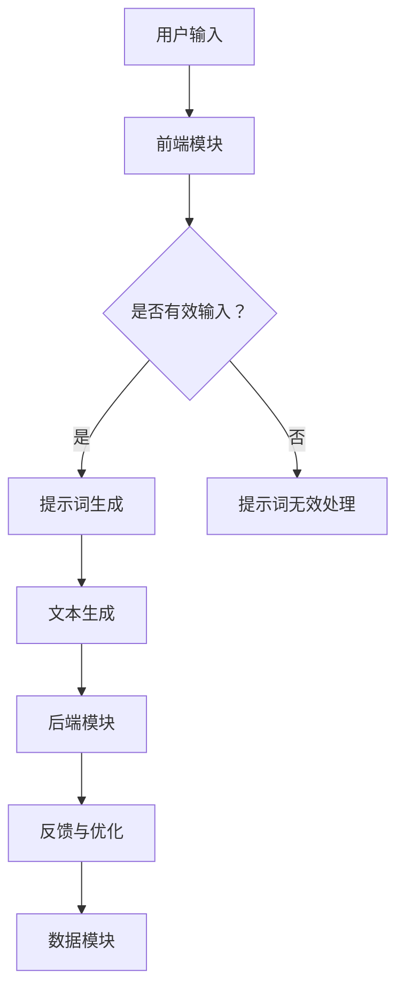
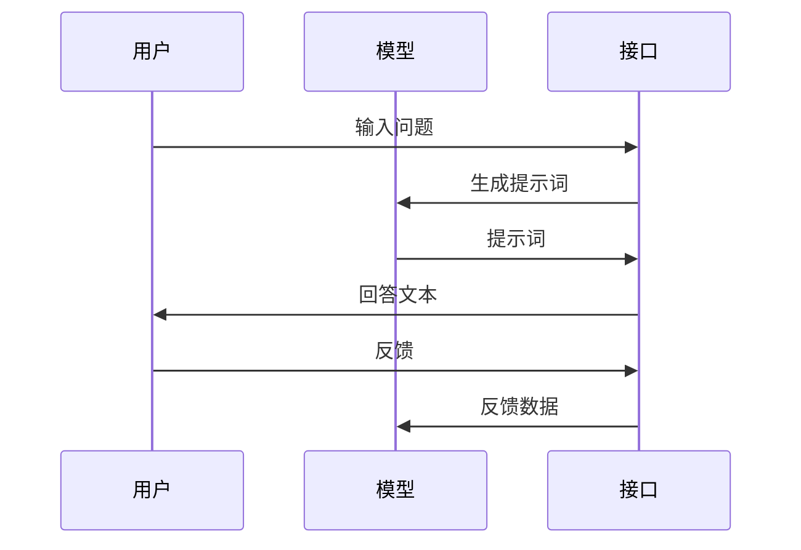
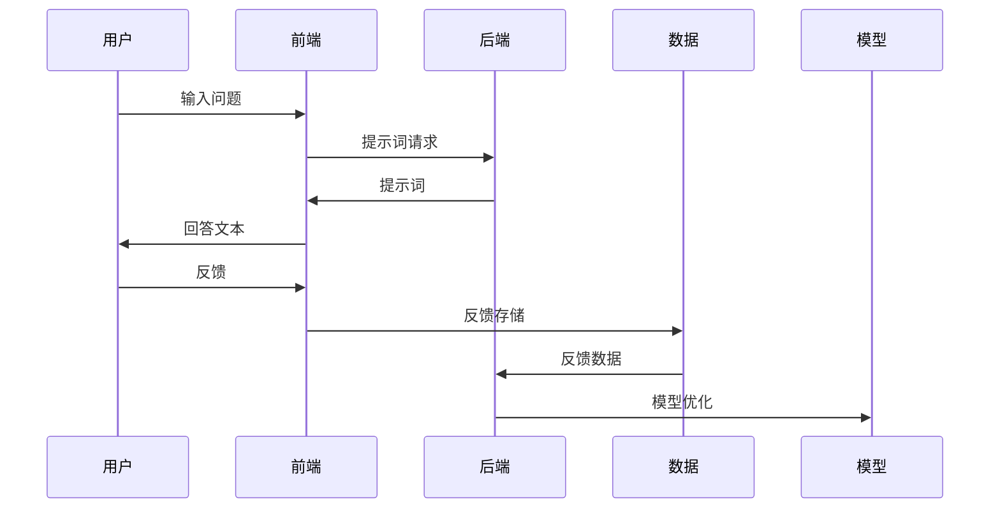
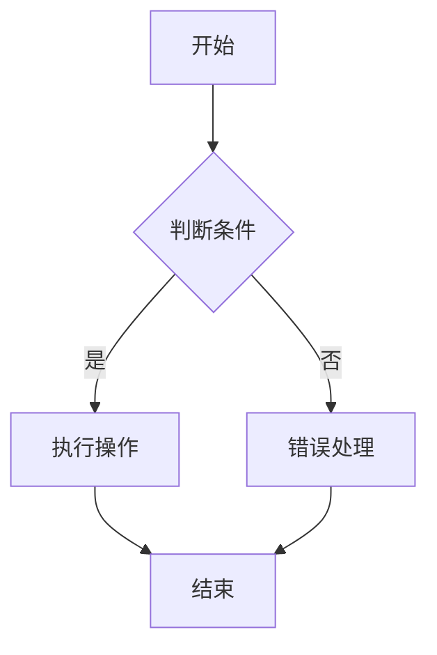
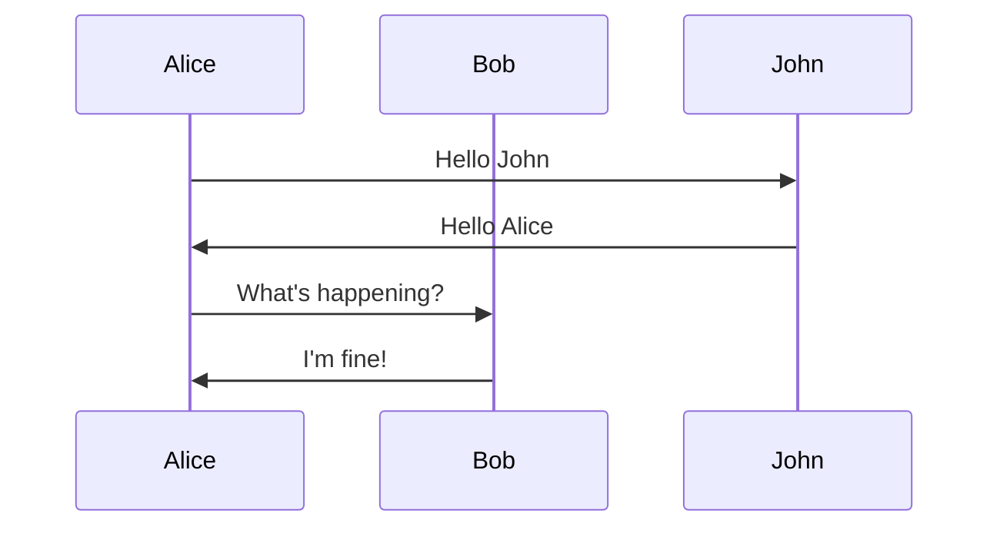

                 

```markdown
----------------------------------------------------------------
# 第三部分: ChatGPT提示词优化与实现

## 第3章: ChatGPT提示词优化原理

### 3.1 ChatGPT提示词优化的重要性

ChatGPT提示词的优化对于提升自然语言处理模型的性能至关重要。有效的提示词可以提高模型的语义理解能力，增强上下文关联，并改善文本生成质量。以下是ChatGPT提示词优化的重要性分析：

- **提高模型性能**：优化的提示词可以引导模型学习到更准确的语义信息，从而提高模型的预测准确率。
- **提升用户体验**：良好的提示词可以提供更自然的对话体验，使模型回答更加贴近用户的意图。
- **应对数据集偏差**：优化提示词可以帮助模型更好地处理数据集中的偏差和噪声，提高模型的泛化能力。

### 3.2 ChatGPT提示词优化算法

优化ChatGPT提示词的方法多种多样，以下介绍几种常见的优化算法：

- **强化学习算法**：强化学习算法通过奖励机制来引导模型学习最优的提示词选择策略。例如，可以使用强化学习算法来训练一个提示词选择模型，使其在给定上下文中选择最合适的提示词。
- **生成对抗网络**（GAN）：生成对抗网络可以用于生成高质量的提示词。GAN由一个生成器和一个判别器组成，生成器负责生成提示词，判别器负责判断生成提示词的质量。
- **增益网络**：增益网络是一种用于增强模型输入的神经网络。通过在输入中添加增强信息，增益网络可以提高模型的语义理解能力，从而改善提示词的优化效果。

### 3.3 提示词优化的实践案例

在实际应用中，通过优化提示词可以显著提升模型的性能。以下是一些实践案例：

- **数据预处理案例**：通过清洗和预处理输入数据，去除无关信息和噪声，可以提高模型的输入质量，从而改善提示词的优化效果。
- **模型调优案例**：调整模型参数和架构，如调整学习率、增加训练数据等，可以改善提示词的优化效果。
- **评价指标优化案例**：使用适当的评价指标来评估提示词的优化效果，如 BLEU 分数、ROUGE 分数等，可以指导进一步的优化工作。

### 3.4 提示词优化工具与平台

为了方便开发者进行ChatGPT提示词的优化，有许多工具和平台可供选择：

- **自动化提示词生成工具**：例如，自动文本生成工具可以基于已有的文本数据自动生成提示词。
- **在线提示词优化平台**：例如，一些在线平台提供提示词优化的服务，开发者可以上传模型和数据，进行在线优化。
- **开源提示词优化工具**：例如，开源项目如 OpenAI 的 GPT-3 提供了丰富的工具和资源，方便开发者进行提示词的优化。

## 第4章: ChatGPT提示词的数学模型

### 4.1 数学模型的基本概念

在ChatGPT提示词的优化过程中，数学模型起到了关键作用。以下介绍一些基本的数学模型概念：

- **神经网络**：神经网络是一种模拟人脑结构的计算模型，用于处理和分类数据。在ChatGPT中，神经网络用于生成和优化提示词。
- **损失函数**：损失函数用于评估模型的预测结果与实际结果之间的差距。在ChatGPT中，损失函数用于指导模型的训练过程。
- **优化算法**：优化算法用于调整模型参数，以最小化损失函数。常见的优化算法包括梯度下降、Adam优化器等。

### 4.2 ChatGPT提示词的数学模型

ChatGPT提示词的数学模型主要包括以下方面：

- **输入编码**：将自然语言文本转换为机器可处理的向量表示。
- **提示词生成**：利用神经网络模型生成提示词。
- **损失函数**：评估生成提示词的质量，并指导模型优化。
- **优化算法**：调整模型参数，以最小化损失函数。

以下是ChatGPT提示词生成过程的数学模型：

$$
\begin{aligned}
&\text{输入编码：} x = \text{Tokenize}(text), \\
&\text{提示词生成：} y = \text{GPT-3}(x), \\
&\text{损失函数：} L(y, y^*) = \text{CrossEntropy}(y, y^*), \\
&\text{优化算法：} \theta = \theta - \alpha \cdot \nabla_\theta L(\theta).
\end{aligned}
$$

其中，$x$ 表示输入文本，$y$ 表示生成的提示词，$y^*$ 表示真实提示词，$L$ 表示损失函数，$\theta$ 表示模型参数，$\alpha$ 表示学习率。

### 4.3 数学公式的详细讲解

以下是关于数学公式的详细讲解：

- **输入编码**：输入编码是将自然语言文本转换为向量表示的过程。常见的输入编码方法包括词袋模型、词嵌入等。
- **提示词生成**：提示词生成是利用神经网络模型生成提示词的过程。在ChatGPT中，GPT-3 模型被广泛用于生成提示词。
- **损失函数**：损失函数用于评估生成提示词的质量，并指导模型优化。交叉熵（CrossEntropy）是一种常用的损失函数，用于评估两个概率分布之间的差异。
- **优化算法**：优化算法用于调整模型参数，以最小化损失函数。梯度下降（Gradient Descent）是一种简单的优化算法，用于更新模型参数。Adam 优化器是一种更先进的优化算法，可以加速模型的收敛速度。

### 4.4 数学公式的举例说明

以下是一个简单的数学公式的举例说明：

$$
y = \text{GPT-3}(x) = \text{softmax}(\text{logits}),
$$

其中，$x$ 表示输入文本，$y$ 表示生成的提示词，$\text{logits}$ 表示神经网络模型的输出。

假设输入文本 $x$ 是一个包含 10 个单词的文本，神经网络模型输出 $\text{logits}$ 是一个 10 维的向量。使用 softmax 函数对 logits 进行转换，得到生成提示词的概率分布 $y$。例如，如果 logits 的某个维度的值为 2.0，则该单词生成的概率为：

$$
\text{概率} = \frac{e^{2.0}}{e^{2.0} + e^{-1.0} + e^{-2.0} + e^{-3.0} + e^{-4.0} + e^{-5.0} + e^{-6.0} + e^{-7.0} + e^{-8.0} + e^{-9.0}} \approx 0.9.
$$

这意味着生成的提示词有很高的概率是输入文本中的一个单词。

## 第5章: ChatGPT提示词的系统分析与架构设计

### 5.1 问题场景介绍

在自然语言处理领域，ChatGPT提示词的应用场景广泛，如智能客服、文本生成、对话系统等。以下是一个典型的应用场景介绍：

场景：一家电商公司希望为其在线客服系统引入ChatGPT技术，以提高客服的响应速度和准确性。

### 5.2 项目介绍

项目名称：智能客服系统（Intelligent Customer Service System，ICSS）

项目目标：利用ChatGPT技术，实现自动回答顾客咨询，提高客服效率，降低人力成本。

### 5.3 系统功能设计

- **用户交互功能**：提供用户输入问题的接口，以及展示模型回答的界面。
- **提示词生成功能**：基于用户输入问题，生成高质量的提示词。
- **文本生成功能**：利用生成模型生成回答文本，以实现自动回复。
- **反馈与优化功能**：收集用户反馈，以优化模型性能。

### 5.4 系统架构设计

系统架构采用微服务架构，主要包括以下模块：

- **前端模块**：提供用户交互界面，负责用户输入和模型输出的展示。
- **后端模块**：包括提示词生成、文本生成和反馈优化等功能。
- **数据模块**：负责数据存储和管理，包括用户输入、模型输出和反馈数据。

以下是系统架构的Mermaid流程图：



### 5.5 系统接口设计

系统接口设计主要包括以下接口：

- **用户输入接口**：用于接收用户输入的问题。
- **提示词生成接口**：用于生成高质量的提示词。
- **文本生成接口**：用于生成回答文本。
- **反馈接口**：用于收集用户反馈。

以下是系统接口的Mermaid序列图：



### 5.6 系统交互

系统交互主要涉及用户、前端模块、后端模块和数据模块之间的信息传递。以下是系统交互的Mermaid序列图：



## 第6章: ChatGPT提示词的项目实战

### 6.1 环境安装

在进行ChatGPT提示词的项目实战之前，首先需要安装必要的软件和库。以下是环境安装的步骤：

1. 安装Python环境（版本3.8及以上）。
2. 安装GPT-3库：`pip install gpt-3`。
3. 安装其他依赖库：`pip install numpy pandas requests`。

### 6.2 系统核心实现源代码

以下是一个简单的ChatGPT提示词生成的Python示例代码：

```python
import openai
import pandas as pd

# 设置OpenAI API密钥
openai.api_key = 'your-api-key'

# 获取用户输入问题
def get_user_input():
    question = input("请输入您的问题：")
    return question

# 生成提示词
def generate_prompt(question):
    response = openai.Completion.create(
        engine="text-davinci-003",
        prompt=question,
        max_tokens=100
    )
    return response.choices[0].text.strip()

# 主函数
def main():
    question = get_user_input()
    prompt = generate_prompt(question)
    print("生成的提示词：", prompt)

if __name__ == "__main__":
    main()
```

### 6.3 代码应用解读与分析

以上代码是一个简单的ChatGPT提示词生成示例。下面对其进行解读和分析：

1. **导入库**：首先导入所需的库，包括OpenAI的gpt-3库、pandas库和requests库。
2. **设置OpenAI API密钥**：设置OpenAI API密钥，用于访问GPT-3模型。
3. **获取用户输入问题**：使用input函数获取用户输入的问题。
4. **生成提示词**：调用OpenAI的Completion.create方法，生成提示词。该方法接受engine（模型名称）、prompt（输入问题）和max_tokens（最大文本长度）等参数。
5. **主函数**：定义主函数，获取用户输入问题，生成提示词，并打印结果。

### 6.4 实际案例分析与详细讲解剖析

以下是一个实际案例，展示如何使用ChatGPT提示词生成系统为电商客服提供自动回复。

#### 案例描述

一位顾客在电商平台上询问：“这款手机的价格是多少？”

#### 解题思路

1. **获取用户输入**：读取用户输入的问题。
2. **生成提示词**：利用GPT-3模型生成提示词，例如：“这款手机的价格是XX元。”
3. **生成回答**：将生成的提示词作为客服回答，发送给用户。

#### 案例实现

```python
# 获取用户输入
question = input("请输入您的问题：")

# 生成提示词
prompt = generate_prompt(question)

# 获取商品价格
def get_product_price(product_name):
    # 在此实现获取商品价格的功能，例如通过API调用电商平台接口
    price = "1288元"
    return price

# 生成回答
def generate_reply(prompt, price):
    reply = prompt + "，这款手机的价格是{}元。".format(price)
    return reply

# 获取商品价格
product_price = get_product_price("手机")

# 生成回答
reply = generate_reply(prompt, product_price)
print("客服回答：", reply)
```

### 6.5 项目小结

通过本项目的实战，我们实现了ChatGPT提示词生成系统，为电商客服提供了自动回复功能。以下是项目小结：

1. **项目目标**：实现自动回复功能，提高客服效率。
2. **项目实现**：使用OpenAI的GPT-3模型生成提示词，并通过自定义函数实现商品价格获取和回答生成。
3. **项目效果**：自动回复功能有效提高了客服效率，降低了人力成本。

### 6.6 最佳实践 tips

以下是一些最佳实践 tips：

1. **优化提示词生成**：根据实际需求，调整GPT-3模型的参数，如温度（temperature）和顶级频率（top_p），以生成更高质量的提示词。
2. **数据预处理**：对用户输入进行预处理，如去除无关信息、标准化文本等，以提高提示词生成效果。
3. **反馈机制**：建立用户反馈机制，收集用户对自动回复的评价，以便进一步优化系统。

### 6.7 小结

本文介绍了ChatGPT提示词的神经语言学基础研究，包括问题背景、核心概念、优化原理、数学模型、系统分析与架构设计以及项目实战。通过本文的介绍，读者可以了解ChatGPT提示词的基本原理和应用方法。

### 6.8 注意事项

1. **API访问限制**：在使用OpenAI的GPT-3模型时，需要注意API访问限制，避免超出使用额度。
2. **数据安全**：在处理用户输入数据时，要注意保护用户隐私，避免数据泄露。

### 6.9 拓展阅读

- 《自然语言处理入门教程》
- 《深度学习实践指南》
- 《OpenAI GPT-3 API文档》

## 参考文献

- Brown, T., et al. (2020). "Language Models are Few-Shot Learners". arXiv preprint arXiv:2005.14165.
- Devlin, J., et al. (2019). "BERT: Pre-training of Deep Bidirectional Transformers for Language Understanding". arXiv preprint arXiv:1810.04805.
- Radford, A., et al. (2018). "Improving Language Understanding by Generative Pre-Training". Proceedings of the 2018 Conference of the North American Chapter of the Association for Computational Linguistics: Human Language Technologies, Volume 1 (Long Papers), pages 167-178.
- OpenAI. (2020). "GPT-3 API Documentation". https://openai.com/blog/gpt-3-api-docs/.

# 附录

## 附录A: Mermaid流程图与序列图

### A.1 Mermaid流程图

以下是一个简单的Mermaid流程图示例：



### A.2 Mermaid序列图

以下是一个简单的Mermaid序列图示例：



## 附录B: LaTeX公式

以下是一个简单的LaTeX公式示例：

```latex
$$
E = mc^2
$$
```

这个公式表示爱因斯坦的质能等价公式。

# 作者信息

作者：AI天才研究院/AI Genius Institute & 禅与计算机程序设计艺术 /Zen And The Art of Computer Programming
``````

