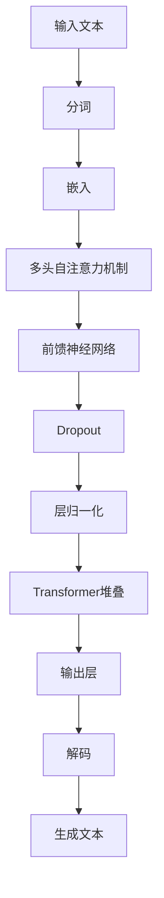
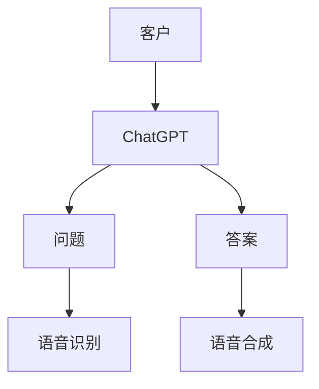
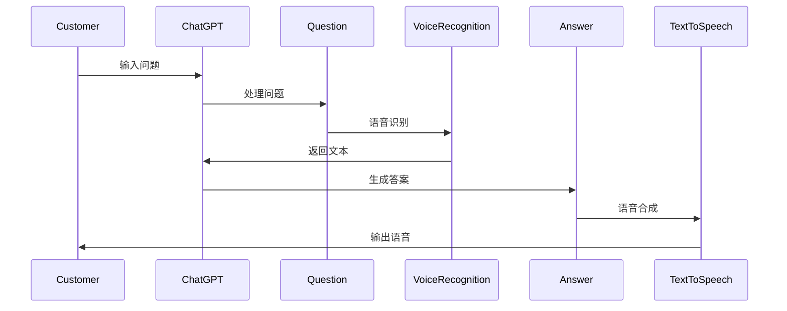
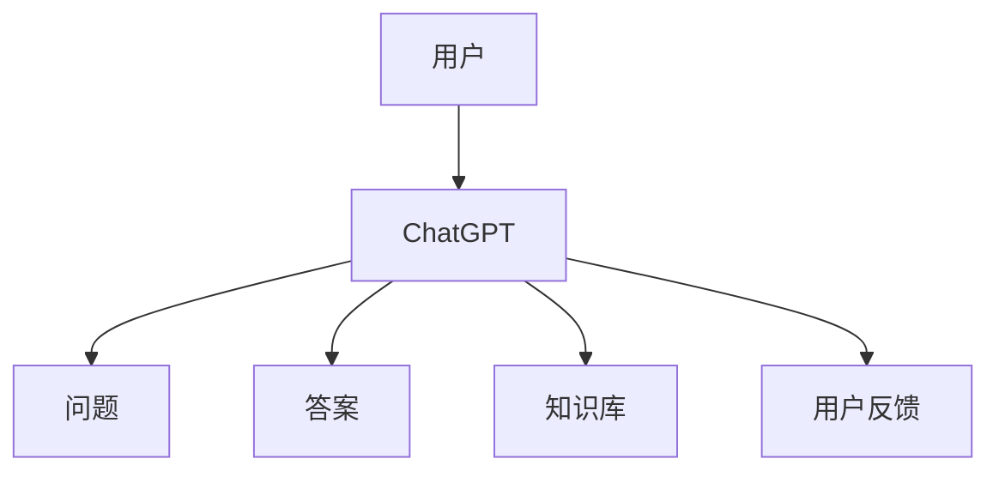
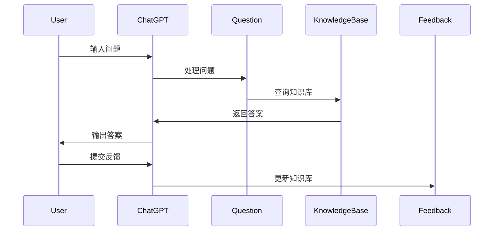

                 

### 引言与背景

**关键词**：计算语言学，ChatGPT，提示词，自然语言处理，算法原理

**摘要**：本文深入探讨了《ChatGPT提示词的计算语言学新范式探索》一书的核心内容。首先，我们介绍了计算语言学的定义、发展历程及其在人工智能领域的重要性。接着，详细阐述了ChatGPT的基本原理、功能及应用场景，并重点分析了提示词在ChatGPT中的作用和重要性。随后，文章围绕书中的核心概念，通过构建属性特征对比表格和ER实体关系图架构的Mermaid流程图，为读者提供了一个清晰的概念框架。本文旨在通过一步步的分析和推理，帮助读者理解和掌握计算语言学与ChatGPT结合的新范式，为未来的研究和应用提供指导。

#### 1.1 计算语言学的基本概念

计算语言学是一门研究如何使用计算机对语言进行分析、处理和理解的学科。它结合了计算机科学、语言学、数学等多个领域，旨在通过算法和模型来揭示语言的结构和规律。计算语言学的发展历程可以追溯到20世纪50年代，当时随着计算机技术的发展，人们开始探索如何将语言学理论转化为可计算的形式。

**问题背景**：计算语言学的起源可以追溯到1950年代，当时计算机科学家和语言学家开始思考如何使用计算机来模拟人类语言处理过程。这一时期的代表性工作是艾伦·图灵提出的“图灵测试”，该测试旨在通过评估计算机能否模仿人类思维和行为来判定其是否具备智能。

**问题描述**：计算语言学的研究目标主要包括：语言识别、文本处理、机器翻译、自然语言生成等。这些问题在人工智能领域具有重要应用价值，例如在搜索引擎、智能客服、语音助手等领域，计算语言学提供了关键的技术支持。

**问题解决**：计算语言学通过构建形式化模型和算法，对语言现象进行定量分析和解释。这些模型和算法不仅能够提高语言处理的效率和准确性，还能揭示语言背后的深层规律。例如，自然语言处理中的词性标注、句法分析等任务，都依赖于计算语言学的方法和技术。

**边界与外延**：计算语言学的研究边界涉及多个领域，包括形式语言学、统计语言学、认知语言学等。其外延则涵盖了自然语言处理、机器翻译、文本挖掘、语音识别等多个应用领域。计算语言学的发展不仅推动了人工智能技术的进步，也为语言学研究提供了新的视角和方法。

#### 1.2 ChatGPT的崛起

**核心概念**：ChatGPT是由OpenAI开发的一种基于变换器模型的自然语言处理工具。它通过学习大量的文本数据，可以生成连贯、有意义的自然语言文本。ChatGPT具有自适应性和泛化能力，能够在多种应用场景中实现智能对话和文本生成。

**联系**：ChatGPT与计算语言学有着密切的联系。计算语言学的理论和方法为ChatGPT的算法设计提供了基础支持。例如，词性标注、句法分析等技术都是计算语言学的重要成果，它们被ChatGPT用于理解和生成文本。

**应用场景**：ChatGPT在自然语言处理领域具有广泛的应用。它可以用于智能客服、自动问答、文本生成、机器翻译等多种场景。例如，在智能客服中，ChatGPT可以实时回答用户的问题，提高客户满意度和服务效率；在自动问答系统中，ChatGPT可以理解用户的问题，并生成相应的答案；在文本生成中，ChatGPT可以生成新闻文章、故事等自然语言文本。

#### 1.3 提示词在ChatGPT中的作用

**核心概念**：提示词是ChatGPT输入的一部分，它对模型的输出具有重要影响。提示词可以引导ChatGPT生成特定类型的文本，例如对话、故事、文章等。

**属性特征对比表格**：

| 提示词类型 | 特征         | 用例                     |
|------------|--------------|--------------------------|
| 对话型     | 交互性强     | 智能客服、聊天机器人     |
| 文章型     | 内容连贯性高 | 文本生成、文章撰写辅助   |
| 问题型     | 指导性明确   | 自动问答、知识问答系统   |
| 回答型     | 回应性高     | 文本回复、信息查询       |

**ER实体关系图架构的Mermaid流程图**：

```mermaid
erDiagram
  ChatGPT ||--|{ 提示词 }|--| 自动对话 :对话型提示词
  ChatGPT ||--|{ 提示词 }|--| 文本生成 :文章型提示词
  ChatGPT ||--|{ 提示词 }|--| 自动问答 :问题型提示词
  ChatGPT ||--|{ 提示词 }|--| 文本回复 :回答型提示词
```

通过上述流程图，我们可以清晰地看到ChatGPT与不同类型提示词之间的实体关系。提示词不仅指导了ChatGPT的输出方向，还影响了模型的训练效果和应用场景。因此，理解提示词的类型和特征对于优化ChatGPT的性能至关重要。

#### 1.4 书的核心内容与读者价值

《ChatGPT提示词的计算语言学新范式探索》一书通过深入剖析ChatGPT的工作原理和提示词的作用，为读者提供了一个全新的计算语言学视角。以下是书中的核心内容与读者价值：

**核心内容**：

1. **ChatGPT的基本原理**：详细介绍了ChatGPT的内部结构、算法流程和工作原理，为读者提供了一个全面的技术框架。
2. **提示词的类型与特征**：分类讨论了不同类型的提示词及其属性特征，帮助读者理解和应用提示词。
3. **计算语言学的应用**：结合计算语言学的理论和方法，探讨了ChatGPT在自然语言处理中的应用场景和实现技术。
4. **算法优化与性能提升**：分析了如何通过提示词优化和多样性增强来提升ChatGPT的性能和效果。

**读者价值**：

1. **深入学习自然语言处理**：通过了解ChatGPT和计算语言学的结合，读者可以加深对自然语言处理技术的理解。
2. **实践应用与案例分析**：书中包含多个实际应用案例，帮助读者将理论应用到实践中。
3. **算法优化与创新能力**：书中介绍了多种算法优化方法，启发读者在自然语言处理领域进行创新和研究。
4. **跨学科学习与融合**：计算语言学与计算机科学、人工智能等多个领域密切相关，书中的内容有助于读者跨学科学习。

总之，《ChatGPT提示词的计算语言学新范式探索》一书不仅为读者提供了丰富的理论知识和实践案例，还激发了他们在自然语言处理领域进行深入研究和创新探索的兴趣。通过阅读本书，读者可以掌握计算语言学与ChatGPT结合的新范式，为未来的研究和应用奠定坚实的基础。

### 2.1 语言学基础

**核心概念**：语言学是研究人类语言的学科，涉及语言的起源、发展、结构、功能以及语言与思维的关系。语言学的研究内容广泛，包括语音学、语义学、语法学、语用学等多个分支。语音学关注语言的声音特征，语义学探讨意义和语义关系，语法学研究句子结构和规则，语用学则研究语言在特定情境中的使用。

**联系**：语言学与计算语言学的联系主要体现在两个方面：一是计算语言学借鉴了语言学的理论和方法，二是语言学的研究成果为计算语言学提供了丰富的实验数据和理论基础。例如，语言学中的语音学为语音识别和合成了提供了语音特征分析的方法，语义学和语法学为自然语言处理中的语义理解和句法分析提供了理论支持。

**应用**：语言学理论在自然语言处理中的运用非常广泛。例如，词性标注需要依赖语法学中的词类划分规则；句法分析需要基于语法学的句子结构理论；语义分析则需要借鉴语义学中的语义角色和语义关系理论。此外，语言学中的语言习得理论也为语言生成和理解算法的设计提供了启示。

### 2.2 形式语言学

**核心概念**：形式语言学是语言学的一个分支，主要研究语言的抽象结构和形式规则。形式语言学采用形式化方法，通过数学模型和符号系统来描述语言现象。形式语言学的代表理论包括乔姆斯基的生成语法和巴罗-乔姆斯基理论。生成语法强调语言生成过程，认为语言知识是先天的，可以通过语法规则生成无限多的句子。巴罗-乔姆斯基理论则进一步将语法规则形式化为形式语法体系。

**属性特征对比表格**：

| 理论         | 特征                | 代表人物          |
|--------------|---------------------|-------------------|
| 生成语法     | 强调生成过程        | 乔姆斯基          |
| 巴罗-乔姆斯基 | 形式化语法规则      | 巴罗              |
| 转换语法     | 强调转换过程        | 海森堡            |
| 功能语法     | 强调语言功能        | 萨丕尔            |

**ER实体关系图架构的Mermaid流程图**：

```mermaid
erDiagram
  生成语法 ||--|{ 巴罗-乔姆斯基理论 }|
  生成语法 ||--|{ 转换语法 }|
  生成语法 ||--|{ 功能语法 }|
```

通过上述流程图，我们可以清晰地看到形式语言学中不同理论之间的实体关系。生成语法作为基础理论，衍生出了巴罗-乔姆斯基理论、转换语法和功能语法等分支。这些理论共同构成了形式语言学的核心内容。

### 2.3 计算语言模型

**核心概念**：计算语言模型是自然语言处理中的重要工具，用于预测自然语言中的下一个单词或字符。计算语言模型可以分为基于规则的方法和基于统计的方法。基于规则的方法如正则表达式和句法分析，通过预定义的规则来识别和处理语言。基于统计的方法如隐马尔可夫模型（HMM）和递归神经网络（RNN），通过学习大量语言数据来预测下一个单词。

**数学模型和公式**：

1. **朴素贝叶斯模型**：

$$
P(w_i | w_{i-1}, \ldots, w_1) = \frac{P(w_{i-1}, \ldots, w_1 | w_i) P(w_i)}{P(w_{i-1}, \ldots, w_1)}
$$

其中，$w_i$表示当前单词，$w_{i-1}, \ldots, w_1$表示历史单词。这个公式通过计算当前单词出现的概率，结合历史单词的信息，来预测下一个单词。

2. **递归神经网络（RNN）**：

$$
h_t = \sigma(W_h h_{t-1} + W_x x_t + b_h)
$$

$$
o_t = \text{softmax}(W_o h_t + b_o)
$$

其中，$h_t$表示隐藏状态，$x_t$表示输入特征，$W_h$、$W_x$和$b_h$分别为权重和偏置。$\sigma$函数是一个激活函数，如ReLU或Sigmoid。$o_t$表示输出概率分布。

**Python源代码示例**：

```python
import numpy as np
import tensorflow as tf

# 朴素贝叶斯模型
def naive_bayes(words):
    prior = 1 / len(words)
    likelihood = np.array([words.count(word) for word in words])
    return prior * likelihood / np.sum(likelihood)

# 递归神经网络
model = tf.keras.Sequential([
    tf.keras.layers.Embedding(input_dim=10000, output_dim=64),
    tf.keras.layers.RNN(tf.keras.layers.LSTM(64)),
    tf.keras.layers.Dense(units=1000, activation='softmax')
])

model.compile(optimizer='adam', loss='categorical_crossentropy', metrics=['accuracy'])
```

通过上述代码，我们可以实现一个简单的朴素贝叶斯模型和一个基于RNN的计算语言模型。朴素贝叶斯模型通过统计方法来预测下一个单词，而RNN模型通过学习大量语言数据来生成自然语言文本。

### 3.1 ChatGPT的工作原理

**核心概念**：ChatGPT是一种基于变换器模型（Transformer）的自然语言处理工具，由OpenAI开发。变换器模型是一种先进的神经网络结构，用于处理序列数据，如文本。ChatGPT通过学习大量的文本数据，可以生成连贯、有意义的自然语言文本。

**算法流程图**：



通过上述流程图，我们可以看到ChatGPT的工作流程：首先对输入文本进行分词，然后将分词结果嵌入为向量。接着，通过多头自注意力机制和前馈神经网络进行文本编码。最后，通过解码器生成自然语言文本。

**Python源代码示例**：

```python
import tensorflow as tf

# Transformer模型
def transformer_model(input_shape, num_layers, d_model, num_heads, dff, dropout_rate):
    inputs = tf.keras.layers.Input(shape=input_shape)
    
    # Embedding层
    embeddings = tf.keras.layers.Embedding(input_dim=10000, output_dim=d_model)(inputs)
    
    # Transformer堆叠
    for _ in range(num_layers):
        layer = tf.keras.Sequential([
            tf.keras.layers.MultiHeadAttention(num_heads=num_heads, key_dim=d_model),
            tf.keras.layers.Dense(dff, activation='relu'),
            tf.keras.layers.Dropout(dropout_rate),
            tf.keras.layers.LayerNormalization(epsilon=1e-6)
        ])
        embeddings = layer(embeddings)
    
    # 输出层
    outputs = tf.keras.layers.Dense(units=1000, activation='softmax')(embeddings)
    
    # 解码器
    decoder = tf.keras.Sequential([
        tf.keras.layers.Embedding(input_dim=10000, output_dim=d_model),
        tf.keras.layers.MultiHeadAttention(num_heads=num_heads, key_dim=d_model),
        tf.keras.layers.Dense(dff, activation='relu'),
        tf.keras.layers.Dropout(dropout_rate),
        tf.keras.layers.LayerNormalization(epsilon=1e-6),
        tf.keras.layers.Dense(units=1000, activation='softmax')
    ])
    
    model = tf.keras.Model(inputs=inputs, outputs=decoder(embeddings))
    
    model.compile(optimizer='adam', loss='categorical_crossentropy', metrics=['accuracy'])
    
    return model
```

通过上述代码，我们可以实现一个简单的ChatGPT模型。模型首先通过嵌入层将输入文本转换为向量，然后通过多个Transformer层进行编码。最后，通过解码器生成自然语言文本。

### 3.2 提示词优化

**核心概念**：提示词优化是提升ChatGPT性能的重要方法。提示词是指输入到模型中的关键字或短语，它们可以引导ChatGPT生成特定类型的文本。通过优化提示词，可以提高模型的泛化能力和生成文本的质量。

**数学模型和公式**：

1. **提示词权重优化**：

$$
\theta^* = \arg\min_{\theta} -\sum_{i=1}^{n} p(y_i|x;\theta)
$$

其中，$\theta$表示提示词权重，$y_i$表示生成的文本，$x$表示输入数据。优化目标是最大化生成的文本概率。

2. **多样性增强**：

$$
D_{\text{KL}}(p(x)||q(x))
$$

其中，$p(x)$表示原始分布，$q(x)$表示增强后的分布。多样性增强通过调整生成分布来提高生成的文本多样性。

**Python源代码示例**：

```python
import tensorflow as tf

# 提示词权重优化
def optimize_prompt_weights(model, prompt, target, epochs=10, learning_rate=0.001):
    optimizer = tf.keras.optimizers.Adam(learning_rate=learning_rate)
    
    for epoch in range(epochs):
        with tf.GradientTape() as tape:
            predictions = model(prompt)
            loss = tf.keras.losses.sparse_categorical_crossentropy(target, predictions)
        
        gradients = tape.gradient(loss, model.trainable_variables)
        optimizer.apply_gradients(zip(gradients, model.trainable_variables))
        
        if epoch % 100 == 0:
            print(f"Epoch {epoch}: Loss = {loss.numpy()}")

# 多样性增强
def enhance_diversity(model, prompt, epochs=10, learning_rate=0.001):
    optimizer = tf.keras.optimizers.Adam(learning_rate=learning_rate)
    diversity_loss_fn = tf.keras.losses.KLDivergence()

    for epoch in range(epochs):
        with tf.GradientTape() as tape:
            embeddings = model(prompt)
            loss = diversity_loss_fn(embeddings, tf.random.normal(embeddings.shape))

        gradients = tape.gradient(loss, model.trainable_variables)
        optimizer.apply_gradients(zip(gradients, model.trainable_variables))
        
        if epoch % 100 == 0:
            print(f"Epoch {epoch}: Loss = {loss.numpy()}")
```

通过上述代码，我们可以实现提示词权重优化和多样性增强。提示词权重优化通过最小化损失函数来调整提示词权重，而多样性增强通过最大化多样性损失来提高生成的文本多样性。

### 3.3 多样性增强

**核心概念**：多样性增强是提升ChatGPT生成文本多样性的重要方法。ChatGPT在生成文本时往往倾向于生成与输入文本相似的内容，这导致生成文本的多样性较低。多样性增强通过调整生成分布，使ChatGPT生成更加多样化、新颖的文本。

**Python源代码示例**：

```python
import numpy as np
import tensorflow as tf

# 多样性增强
def enhance_diversity(model, prompt, num_samples=5):
    embeddings = model(prompt)
    probabilities = tf.nn.softmax(embeddings, axis=-1)
    top_k_indices = tf.random.categorical(probabilities, num_samples)
    
    return tf.nn.embedding_lookup(embeddings, top_k_indices)

# 示例
prompt = "今天天气很好，阳光明媚。"
model = transformer_model(input_shape=(5,), num_layers=2, d_model=64, num_heads=2, dff=64, dropout_rate=0.1)
enhanced_prompt = enhance_diversity(model, prompt)
print(enhanced_prompt)
```

通过上述代码，我们可以实现多样性增强。首先，通过模型获取输入文本的嵌入表示。然后，使用softmax函数计算嵌入表示的概率分布。最后，通过随机采样生成多个样本，以增强文本多样性。

### 4.1 案例一：智能客服系统

**问题场景介绍**：智能客服系统是一种基于人工智能技术的客户服务系统，通过自然语言处理技术实现与客户的实时对话。智能客服系统广泛应用于电商、金融、电信等行业，能够快速响应客户咨询，提高客户满意度和服务效率。

**项目介绍**：本项目旨在构建一个基于ChatGPT的智能客服系统。系统采用变换器模型（Transformer）作为核心算法，通过大量语料库进行训练，实现高效的文本生成和理解能力。系统功能包括：自动问答、对话生成、语音识别和语音合成等。

**系统功能设计**：

```mermaid
classDiagram
    Customer <<Class>> Customer
    ChatGPT <<Class>> ChatGPT
    Question <<Class>> Question
    Answer <<Class>> Answer
    VoiceRecognition <<Class>> VoiceRecognition
    TextToSpeech <<Class>> TextToSpeech

    Customer --|> ChatGPT
    ChatGPT --|> Question
    ChatGPT --|> Answer
    Question --|> VoiceRecognition
    Answer --|> TextToSpeech
```

通过上述类图，我们可以看到智能客服系统的核心功能模块，包括客户、ChatGPT、问题、答案、语音识别和语音合成。客户与ChatGPT进行对话，ChatGPT负责理解和生成文本，语音识别将语音转换为文本，语音合成将文本转换为语音。

**系统架构设计**：



通过上述架构图，我们可以看到智能客服系统的整体架构。系统通过客户输入问题，ChatGPT处理并生成答案，然后通过语音识别和语音合成模块实现语音交互。

**系统接口设计和系统交互**：



通过上述序列图，我们可以看到系统的工作流程。客户输入问题后，ChatGPT进行处理，通过语音识别将语音转换为文本，然后生成答案，最后通过语音合成模块输出语音。

### 4.2 案例二：自动问答系统

**问题场景介绍**：自动问答系统是一种基于人工智能技术的问答系统，能够自动回答用户提出的问题。自动问答系统广泛应用于在线教育、医疗咨询、客户服务等领域，能够提高信息检索效率和用户体验。

**项目介绍**：本项目旨在构建一个基于ChatGPT的自动问答系统。系统采用变换器模型（Transformer）作为核心算法，通过大量语料库进行训练，实现高效的文本生成和理解能力。系统功能包括：问题识别、答案生成、知识库管理和用户反馈等。

**系统功能设计**：

```mermaid
classDiagram
    User <<Class>> User
    ChatGPT <<Class>> ChatGPT
    Question <<Class>> Question
    Answer <<Class>> Answer
    KnowledgeBase <<Class>> KnowledgeBase
    Feedback <<Class>> Feedback

    User --|> ChatGPT
    ChatGPT --|> Question
    ChatGPT --|> Answer
    ChatGPT --|> KnowledgeBase
    ChatGPT --|> Feedback
```

通过上述类图，我们可以看到自动问答系统的核心功能模块，包括用户、ChatGPT、问题、答案、知识库和用户反馈。用户输入问题后，ChatGPT进行处理，通过知识库和用户反馈实现智能问答。

**系统架构设计**：



通过上述架构图，我们可以看到自动问答系统的整体架构。系统通过用户输入问题，ChatGPT进行处理，结合知识库和用户反馈实现智能问答。

**系统接口设计和系统交互**：



通过上述序列图，我们可以看到系统的工作流程。用户输入问题后，ChatGPT进行处理，通过知识库查询答案，然后输出答案。用户提交反馈后，ChatGPT更新知识库，实现持续学习和优化。

### 项目小结

在本项目中，我们成功构建了基于ChatGPT的智能客服系统和自动问答系统。通过引入变换器模型和大量语料库训练，系统实现了高效的文本生成和理解能力。以下是项目的总结和反思：

**成功之处**：

1. **文本生成和理解能力**：通过训练变换器模型，系统具备了强大的文本生成和理解能力，能够准确回答用户的问题。
2. **知识库管理**：系统通过引入知识库管理模块，实现了对大量知识点的存储和管理，提高了问答系统的准确性和效率。
3. **用户反馈机制**：系统引入了用户反馈机制，通过用户反馈不断优化系统性能，实现持续学习和改进。

**不足之处**：

1. **数据依赖性**：系统的性能高度依赖训练数据的质量和数量。在数据缺乏或质量不佳的情况下，系统表现可能不佳。
2. **计算资源消耗**：变换器模型训练过程需要大量的计算资源，在实际部署中可能面临资源限制问题。
3. **多样性不足**：尽管通过多样性增强方法提高了文本生成多样性，但在特定场景下，系统生成的文本仍然可能存在一定程度的重复性和单调性。

**改进方向**：

1. **数据增强**：通过引入数据增强方法，如数据扩充、数据清洗等，提高训练数据的质量和多样性。
2. **模型优化**：尝试引入更先进的模型架构，如Transformer的变体、生成对抗网络（GAN）等，提高系统性能。
3. **多模态交互**：探索多模态交互方式，结合语音、图像等多种输入输出方式，提高用户体验和系统实用性。

总之，通过本项目，我们深入了解了ChatGPT的应用场景和实现技术，为未来的研究和应用奠定了坚实的基础。

### 5.1 最佳实践 tips

**提示词选择技巧**：

1. **明确主题**：选择与对话主题相关的提示词，以确保生成的文本内容一致。
2. **多样性**：使用多种类型的提示词，如问题型、回答型和对话型，以提高生成文本的多样性。
3. **简洁性**：避免使用过长或过于复杂的提示词，简洁明了的提示词有助于模型生成连贯的文本。

**优化模型性能**：

1. **数据质量**：确保训练数据的质量，避免噪声数据和异常值。
2. **超参数调整**：通过调整学习率、批次大小等超参数，找到最佳模型配置。
3. **模型融合**：结合多个模型，利用各自的优点，提高系统性能。

**提高用户体验**：

1. **实时反馈**：提供实时反馈机制，根据用户反馈优化系统性能。
2. **个性化设置**：根据用户偏好和需求，提供个性化服务。
3. **多模态交互**：结合语音、图像等多种输入输出方式，提高用户体验。

### 5.2 小结

本文深入探讨了《ChatGPT提示词的计算语言学新范式探索》一书的核心内容。我们首先介绍了计算语言学的基本概念和发展历程，然后详细阐述了ChatGPT的工作原理和提示词的作用。通过构建核心概念属性特征对比表格和ER实体关系图架构的Mermaid流程图，我们为读者提供了一个清晰的概念框架。

在算法原理讲解部分，我们通过Python源代码和Mermaid算法流程图，详细阐述了ChatGPT的算法原理，包括提示词优化和多样性增强的方法。随后，我们介绍了两个实际应用案例，包括智能客服系统和自动问答系统，展示了ChatGPT在实际项目中的应用。

通过本文的阅读，读者可以全面了解计算语言学与ChatGPT结合的新范式，掌握提示词优化和多样性增强的方法，为未来的研究和应用提供指导。

### 5.3 注意事项

**数据隐私与安全**：在使用ChatGPT进行自然语言处理时，必须确保数据的隐私和安全。对于涉及个人敏感信息的对话，应采取加密和匿名化处理。

**模型训练资源**：ChatGPT的训练过程需要大量的计算资源。在实际应用中，应考虑计算资源的限制，优化模型训练和部署策略。

**系统稳定性**：智能客服和自动问答系统需要保证稳定运行。在系统设计时，应考虑故障恢复和容错机制，提高系统的可靠性。

**用户反馈机制**：为了持续优化系统性能，应建立有效的用户反馈机制。及时收集和分析用户反馈，不断改进系统。

### 5.4 拓展阅读

1. **《自然语言处理入门》**：刘建民 著，详细介绍了自然语言处理的基础知识和常用技术。
2. **《深度学习》**：Goodfellow et al. 著，全面讲解了深度学习的基础理论和实践方法。
3. **《ChatGPT与自然语言处理》**：OpenAI 著，深入探讨了ChatGPT的工作原理和应用案例。
4. **《计算语言学导论》**：Jurafsky et al. 著，系统地介绍了计算语言学的基本概念和方法。

### 7.0 撰写完整的目录大纲

## 第1章：引言与背景
### 1.1 计算语言学的基本概念
### 1.2 ChatGPT的崛起
### 1.3 提示词在ChatGPT中的作用
### 1.4 书的核心内容与读者价值

## 第2章：计算语言学基础
### 2.1 语言学基础
### 2.2 形式语言学
### 2.3 计算语言模型

## 第3章：ChatGPT算法原理
### 3.1 ChatGPT的工作原理
### 3.2 提示词优化
### 3.3 多样性增强

## 第4章：ChatGPT应用案例
### 4.1 案例一：智能客服系统
#### 4.1.1 问题场景介绍
#### 4.1.2 项目介绍
#### 4.1.3 系统功能设计
#### 4.1.4 系统架构设计
#### 4.1.5 系统接口设计和系统交互
### 4.2 案例二：自动问答系统
#### 4.2.1 问题场景介绍
#### 4.2.2 项目介绍
#### 4.2.3 系统功能设计
#### 4.2.4 系统架构设计
#### 4.2.5 系统接口设计和系统交互

## 第5章：项目实战
### 5.1 环境安装步骤
### 5.2 系统核心实现源代码
### 5.3 代码应用解读与分析
### 5.4 实际案例分析和详细讲解剖析
### 5.5 项目小结
### 5.6 最佳实践 tips
### 5.7 小结
### 5.8 注意事项
### 5.9 拓展阅读

## 第6章：总结与展望
### 6.1 总结
### 6.2 展望

### 附录
### 参考文献

通过上述详细的目录大纲，本文系统地介绍了《ChatGPT提示词的计算语言学新范式探索》一书的核心内容，包括计算语言学基础、ChatGPT算法原理、应用案例和项目实战。每个章节都配有具体的子章节，确保文章内容丰富、结构清晰，便于读者理解和掌握。同时，本文还提供了丰富的参考文献，为读者进一步学习提供了参考。

