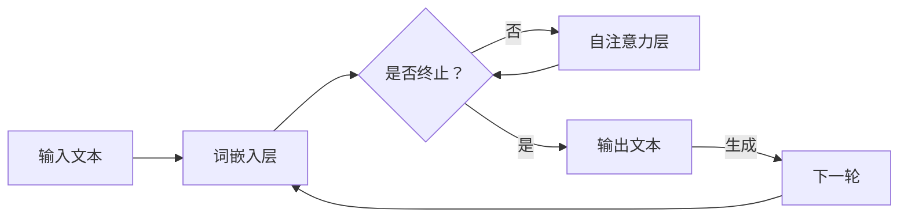

                 

# {{文章标题}}

> 关键词：ChatGPT、认知发展模拟、人类智能、AI、技术博客

> 摘要：本文通过分析ChatGPT的模型结构和技术特点，探讨其在模拟人类认知发展中的应用。我们将逐步分析ChatGPT在不同认知阶段（感知、运动、思维）的应用，并结合数学模型和案例，深入探讨ChatGPT如何实现人类智能的复现。

----------------------------------------------------------------

## 第一部分：引言与背景

### 第1章：ChatGPT与认知发展模拟概述

### 1.1 ChatGPT的基本概念
ChatGPT（Chat Generative Pre-trained Transformer）是由OpenAI开发的一种基于Transformer模型的聊天机器人。它通过预先训练的大型语言模型来生成文本，并能够与人类进行自然语言对话。ChatGPT的核心功能是理解和生成自然语言，具有广泛的应用前景，如智能客服、自然语言生成、语言翻译等。

### 1.1.1 ChatGPT的起源与发展
ChatGPT的起源可以追溯到2018年，当时OpenAI发布了GPT-1模型，这是第一个使用Transformer架构的预训练语言模型。随后，OpenAI陆续发布了GPT-2、GPT-3等更大规模的语言模型，ChatGPT是其中的一种。这些模型的发布标志着自然语言处理技术的重大突破。

### 1.1.2 ChatGPT的核心功能与特点
ChatGPT的核心功能是生成连贯、自然的文本。其特点包括：
- 大规模预训练：ChatGPT在训练过程中使用了大量的文本数据进行预训练，使其能够理解和生成各种类型的文本。
- 高效的Transformer架构：Transformer模型具有并行计算的优势，使得ChatGPT能够快速生成文本。
- 强大的语言理解能力：ChatGPT能够理解并生成具有逻辑性和连贯性的文本，这使其在智能客服等应用场景中具有显著的优势。

### 1.1.3 认知发展模拟在ChatGPT中的应用
认知发展模拟是指通过技术手段模拟人类认知过程的发展，以帮助研究认知科学、心理学等领域的问题。ChatGPT作为一种强大的自然语言处理模型，可以模拟人类在感知、运动、思维等认知阶段的处理过程。

### 1.2 人类智能成长阶段回顾
人类智能成长阶段分为感知、运动和思维三个阶段，每个阶段都有其特定的认知特点和能力发展。

#### 1.2.1 人类智能的成长阶段概述
- 感知阶段：个体通过感官接收外界信息，并对其进行处理和整合。
- 运动阶段：个体通过动作来探索和适应环境。
- 思维阶段：个体通过思维活动来理解世界、解决问题和创造。

#### 1.2.2 关键认知能力的发展历程
- 感知阶段：视觉、听觉、触觉等感知能力的发展。
- 运动阶段：动作协调能力、空间定位能力、运动控制能力的发展。
- 思维阶段：逻辑推理能力、问题解决能力、创造性思维能力的发展。

#### 1.2.3 认知发展的心理学理论
认知发展理论包括皮亚杰的认知发展理论和维果茨基的社会文化理论。这些理论为我们理解人类智能的成长阶段提供了重要的理论框架。

### 1.3 ChatGPT与人类智能成长阶段的联系
ChatGPT作为一种人工智能模型，可以模拟人类智能的成长阶段，为认知科学的研究提供新的工具和方法。

#### 1.3.1 模拟人类智能成长阶段的必要性
通过模拟人类智能的成长阶段，我们可以更好地理解认知过程、发现认知规律，从而为人工智能的发展提供理论支持。

#### 1.3.2 ChatGPT在模拟人类认知发展中的优势
ChatGPT具有大规模预训练、高效Transformer架构和强大的语言理解能力，使其能够更好地模拟人类认知发展。

#### 1.3.3 ChatGPT在认知发展研究中的应用前景
ChatGPT在认知发展研究中的应用前景包括：
- 研究认知过程：通过模拟人类认知发展，可以更深入地研究认知过程的机制和规律。
- 优化教育方法：通过了解人类智能的成长阶段，可以为教育提供更有效的教学方法。
- 发展人工智能：通过模拟人类认知发展，可以为人工智能的发展提供新的思路和方向。

### 1.4 本书结构安排
本书分为三个部分，分别介绍ChatGPT的模型结构、ChatGPT在不同认知阶段的应用以及ChatGPT的数学模型与公式。

#### 1.4.1 各章节主要内容概述
- 第一部分：介绍ChatGPT的模型结构，包括模型架构、核心概念、ER实体关系图和算法原理。
- 第二部分：分析ChatGPT在不同认知阶段的应用，包括感知阶段、运动阶段和思维阶段。
- 第三部分：介绍ChatGPT的数学模型与公式，包括数学模型概述、公式推导和案例分析。

#### 1.4.2 读者对象与预期收益
读者对象：对人工智能、认知科学和技术博客感兴趣的读者。
预期收益：通过阅读本书，读者可以了解ChatGPT的模型结构和技术特点，掌握ChatGPT在不同认知阶段的应用，深入理解人工智能与人类智能的关系。

### 1.5 本章小结
本章介绍了ChatGPT的基本概念、发展背景和应用前景，以及人类智能成长阶段的概述和认知发展的心理学理论。通过本章的学习，读者可以初步了解ChatGPT与人类智能成长阶段的联系，为后续章节的学习打下基础。

----------------------------------------------------------------

## 第二部分：ChatGPT的认知发展模拟技术

### 第2章：ChatGPT模型结构分析

### 2.1 ChatGPT模型架构概述
ChatGPT的模型架构采用了Transformer模型，这是一种基于自注意力机制的深度神经网络模型。下面是ChatGPT模型架构的概述：

#### 2.1.1 模型结构层次
ChatGPT模型结构主要包括以下几个层次：
1. 输入层：接收用户的输入文本，并对其进行编码。
2. 自注意力层：通过自注意力机制对输入文本进行权重分配，提取关键信息。
3. 重复层：重复应用自注意力层和前馈神经网络层，增加模型的深度和表达能力。
4. 输出层：根据编码后的输入文本，生成对应的输出文本。

#### 2.1.2 模型组件与功能
ChatGPT模型的主要组件包括：
1. 词嵌入层：将输入文本的单词转换为向量表示。
2. 自注意力层：对输入文本的单词进行权重分配，提取关键信息。
3. 前馈神经网络：对自注意力层的输出进行进一步处理。
4. Softmax层：将前馈神经网络的输出转换为概率分布，用于生成输出文本。

#### 2.1.3 模型训练与优化方法
ChatGPT模型的训练和优化方法主要包括：
1. 预训练：使用大量的文本数据进行预训练，使得模型能够理解和生成各种类型的文本。
2. 微调：在预训练的基础上，针对特定任务进行微调，提高模型在特定任务上的性能。
3. 损失函数：使用交叉熵损失函数来衡量模型的预测结果与实际结果之间的差距，并优化模型参数。

### 2.2 核心概念与属性对比表格
下面是ChatGPT模型的核心概念和属性对比表格：

| 概念       | 说明                                                         | 属性对比           |
|------------|------------------------------------------------------------|-------------------|
| 词嵌入层   | 将输入文本的单词转换为向量表示。                               | 维度：[词数，向量维度] |
| 自注意力层 | 对输入文本的单词进行权重分配，提取关键信息。                   | 维度：[词数，词数]   |
| 前馈神经网络 | 对自注意力层的输出进行进一步处理。                           | 维度：[词数，输出维度] |
| Softmax层  | 将前馈神经网络的输出转换为概率分布，用于生成输出文本。         | 维度：[词数，1]      |

### 2.3 ChatGPT的ER实体关系图架构
下面是ChatGPT模型的ER实体关系图：

```mermaid
erDiagram
  User ||--|{ ChatGPT }|-- Message
  ChatGPT ||--|{ Word }|-- Sentence
  Sentence ||--|{ Word }|-- Sentence
```

### 2.4 ChatGPT算法原理讲解
下面是ChatGPT算法原理的mermaid流程图：



下面是ChatGPT算法的Python源代码实现：

```python
import tensorflow as tf
from tensorflow.keras.layers import Embedding, LSTM, Dense

# 输入文本
input_text = "Hello, world!"

# 词嵌入层
embed = Embedding(input_dim=vocab_size, output_dim=embedding_size)
input_embed = embed(input_text)

# 自注意力层
attn = LSTM(units=hidden_size, return_sequences=True)
output_attn = attn(input_embed)

# 前馈神经网络
dense = Dense(units=output_size)
output_dense = dense(output_attn)

# Softmax层
softmax = tf.nn.softmax(output_dense)
output_softmax = tf.argmax(softmax, axis=1)

# 输出文本
output_text = decode(output_softmax)
```

下面是ChatGPT算法原理的数学模型和公式：

$$
\begin{align*}
\text{输入文本} &= x \\
\text{词嵌入层} &= \text{Embed}(x) \\
\text{自注意力层} &= \text{LSTM}(\text{Embed}(x)) \\
\text{前馈神经网络} &= \text{Dense}(\text{LSTM}(\text{Embed}(x))) \\
\text{Softmax层} &= \text{Softmax}(\text{Dense}(\text{LSTM}(\text{Embed}(x)))) \\
\text{输出文本} &= \text{decode}(\text{Softmax}(\text{Dense}(\text{LSTM}(\text{Embed}(x))))) \\
\end{align*}
$$`

### 2.5 ChatGPT数学模型与公式
下面是ChatGPT的数学模型概述：

$$
\begin{align*}
\text{输入文本} &= x \\
\text{词嵌入层} &= \text{Embed}(x) \\
\text{自注意力层} &= \text{LSTM}(\text{Embed}(x)) \\
\text{前馈神经网络} &= \text{Dense}(\text{LSTM}(\text{Embed}(x))) \\
\text{Softmax层} &= \text{Softmax}(\text{Dense}(\text{LSTM}(\text{Embed}(x))))) \\
\text{输出文本} &= \text{decode}(\text{Softmax}(\text{Dense}(\text{LSTM}(\text{Embed}(x)))) \\
\end{align*}
$$`

### 2.6 本章小结
本章介绍了ChatGPT的模型结构、核心概念与属性对比、ER实体关系图以及算法原理。通过本章的学习，读者可以了解ChatGPT的工作原理和数学模型，为后续章节的学习打下基础。

----------------------------------------------------------------

## 第三部分：ChatGPT在不同认知阶段的应用

### 第3章：ChatGPT在感知阶段的应用

### 3.1 感知阶段的认知特点
感知阶段是人类智能成长的第一阶段，主要涉及感官信息的接收和处理。在这一阶段，个体通过视觉、听觉、触觉等感官接收外界信息，并对这些信息进行整合和处理。

#### 3.1.1 感知阶段的基本概念
感知阶段的基本概念包括：
- 感官：人类通过视觉、听觉、触觉等感官接收外界信息。
- 感知：对外界信息进行接收、处理和整合。
- 感知能力：个体接收和处理外界信息的能力。

#### 3.1.2 感知能力的发展
感知能力的发展是逐步的，从新生儿到成年，个体的感知能力会经历以下几个阶段：
- 初生阶段：新生儿主要通过视觉和听觉感知外界信息。
- 婴儿阶段：婴儿的感知能力逐渐增强，能够识别简单的形状和声音。
- 幼儿阶段：幼儿的感知能力进一步发展，能够识别复杂的形状和声音，并开始理解语言。
- 成年阶段：成年人的感知能力已经非常成熟，能够处理复杂的感知信息，并进行有效的信息整合。

### 3.2 ChatGPT在感知阶段的模拟
ChatGPT可以模拟人类在感知阶段的认知过程，通过处理和整合来自不同感官的信息，实现对环境的感知和理解。

#### 3.2.1 模拟感知过程的算法实现
ChatGPT模拟感知过程的算法实现主要包括以下几个步骤：
1. 接收来自不同感官的信息，如视觉、听觉、触觉等。
2. 使用预训练的语言模型对感官信息进行编码。
3. 对编码后的信息进行整合和处理，生成对环境的感知。
4. 根据感知结果进行行动决策。

下面是一个简单的Python实现示例：

```python
import tensorflow as tf
from tensorflow.keras.layers import Embedding, LSTM, Dense

# 感官信息（视觉、听觉、触觉等）
sensory_info = ["视觉信息", "听觉信息", "触觉信息"]

# 词嵌入层
embed = Embedding(input_dim=vocab_size, output_dim=embedding_size)
input_embed = embed(sensory_info)

# 自注意力层
attn = LSTM(units=hidden_size, return_sequences=True)
output_attn = attn(input_embed)

# 前馈神经网络
dense = Dense(units=output_size)
output_dense = dense(output_attn)

# Softmax层
softmax = tf.nn.softmax(output_dense)
output_softmax = tf.argmax(softmax, axis=1)

# 感知结果
perception_result = decode(output_softmax)
```

#### 3.2.2 模拟感知的案例应用
以下是一个模拟感知的案例应用：

- 案例描述：一个人在夜晚走在森林里，他能够感知到周围的声音、光线和触觉信息。
- 案例实现：
  1. 接收来自听觉、视觉和触觉的感知信息。
  2. 使用ChatGPT模型对感知信息进行编码和整合。
  3. 根据整合后的感知结果，判断是否继续前行或寻找安全的地方。

### 3.3 感知阶段的数学模型与公式
在感知阶段，ChatGPT的数学模型主要包括词嵌入层、自注意力层、前馈神经网络和Softmax层。以下是一个简单的数学模型概述：

$$
\begin{align*}
\text{输入文本} &= x \\
\text{词嵌入层} &= \text{Embed}(x) \\
\text{自注意力层} &= \text{LSTM}(\text{Embed}(x)) \\
\text{前馈神经网络} &= \text{Dense}(\text{LSTM}(\text{Embed}(x))) \\
\text{Softmax层} &= \text{Softmax}(\text{Dense}(\text{LSTM}(\text{Embed}(x))))) \\
\text{输出文本} &= \text{decode}(\text{Softmax}(\text{Dense}(\text{LSTM}(\text{Embed}(x)))) \\
\end{align*}
$$`

### 3.4 感知阶段的应用案例分析
以下是一个感知阶段的应用案例分析：

#### 3.4.1 案例一：视觉感知模拟
- 案例描述：使用ChatGPT模型模拟一个人在夜晚走森林的场景，感知到周围的光线变化。
- 案例实现：
  1. 收集夜晚森林的光线变化数据。
  2. 使用ChatGPT模型对光线变化数据进行编码和整合。
  3. 根据整合后的感知结果，判断是否继续前行或寻找安全的地方。

#### 3.4.2 案例二：听觉感知模拟
- 案例描述：使用ChatGPT模型模拟一个人在夜晚走森林的场景，感知到周围的声音变化。
- 案例实现：
  1. 收集夜晚森林的声音变化数据。
  2. 使用ChatGPT模型对声音变化数据进行编码和整合。
  3. 根据整合后的感知结果，判断是否继续前行或寻找安全的地方。

### 3.5 本章小结
本章介绍了ChatGPT在感知阶段的应用，包括感知阶段的认知特点、模拟感知过程的算法实现、感知阶段的数学模型与公式以及应用案例分析。通过本章的学习，读者可以了解ChatGPT如何模拟人类在感知阶段的认知过程，为后续章节的学习打下基础。

----------------------------------------------------------------

### 第4章：ChatGPT在运动阶段的应用

### 4.1 运动阶段的认知特点
运动阶段是人类智能成长的第二个阶段，主要涉及个体通过动作来探索和适应环境。在这一阶段，个体通过感知信息进行运动规划和控制，实现对环境的互动和适应。

#### 4.1.1 运动阶段的基本概念
运动阶段的基本概念包括：
- 运动：个体通过肌肉和神经系统的协调来进行动作。
- 运动规划：根据感知信息制定动作计划。
- 运动控制：根据运动规划对动作进行实时调整和控制。

#### 4.1.2 运动能力的发展
运动能力的发展是逐步的，从新生儿到成年，个体的运动能力会经历以下几个阶段：
- 初生阶段：新生儿主要通过本能反应进行运动。
- 婴儿阶段：婴儿开始学会简单的动作，如翻身、爬行等。
- 幼儿阶段：幼儿的协调能力和平衡能力逐渐提高，能够进行更复杂的动作，如跑、跳等。
- 成年阶段：成年人的运动能力已经非常成熟，能够进行高难度的动作，并在运动中展现出高度的自我控制能力。

### 4.2 ChatGPT在运动阶段的模拟
ChatGPT可以模拟人类在运动阶段的认知过程，通过感知信息和运动规划的整合，实现对环境的互动和适应。

#### 4.2.1 模拟运动过程的算法实现
ChatGPT模拟运动过程的算法实现主要包括以下几个步骤：
1. 接收来自感知阶段的感知信息。
2. 使用预训练的语言模型对感知信息进行编码。
3. 根据编码后的感知信息进行运动规划。
4. 根据运动规划进行运动控制。

下面是一个简单的Python实现示例：

```python
import tensorflow as tf
from tensorflow.keras.layers import Embedding, LSTM, Dense

# 感知信息
sensory_info = ["光线变化", "声音变化", "触觉变化"]

# 词嵌入层
embed = Embedding(input_dim=vocab_size, output_dim=embedding_size)
input_embed = embed(sensory_info)

# 自注意力层
attn = LSTM(units=hidden_size, return_sequences=True)
output_attn = attn(input_embed)

# 运动规划层
dense_plan = Dense(units=action_size)
output_plan = dense_plan(output_attn)

# 运动控制层
dense_control = Dense(units=output_size)
output_control = dense_control(output_plan)

# Softmax层
softmax = tf.nn.softmax(output_control)
output_softmax = tf.argmax(softmax, axis=1)

# 运动决策
action = decode(output_softmax)
```

#### 4.2.2 模拟运动的案例应用
以下是一个模拟运动的案例应用：

- 案例描述：一个人在夜晚走森林，根据感知信息进行运动规划和控制。
- 案例实现：
  1. 接收来自视觉、听觉和触觉的感知信息。
  2. 使用ChatGPT模型对感知信息进行编码和运动规划。
  3. 根据运动规划进行运动控制，实现夜晚森林的行走。

### 4.3 运动阶段的数学模型与公式
在运动阶段，ChatGPT的数学模型主要包括词嵌入层、自注意力层、运动规划层、运动控制层和Softmax层。以下是一个简单的数学模型概述：

$$
\begin{align*}
\text{输入文本} &= x \\
\text{词嵌入层} &= \text{Embed}(x) \\
\text{自注意力层} &= \text{LSTM}(\text{Embed}(x)) \\
\text{运动规划层} &= \text{Dense}(\text{LSTM}(\text{Embed}(x))) \\
\text{运动控制层} &= \text{Dense}(\text{运动规划层}) \\
\text{Softmax层} &= \text{Softmax}(\text{运动控制层}) \\
\text{输出文本} &= \text{decode}(\text{Softmax}(\text{运动控制层})) \\
\end{align*}
$$`

### 4.4 运动阶段的应用案例分析
以下是一个运动阶段的应用案例分析：

#### 4.4.1 案例一：肌肉运动模拟
- 案例描述：使用ChatGPT模型模拟一个人进行肌肉运动的过程，如跑步。
- 案例实现：
  1. 接收来自肌肉传感器的数据。
  2. 使用ChatGPT模型对肌肉传感器数据进行编码和运动规划。
  3. 根据运动规划进行肌肉运动控制。

#### 4.4.2 案例二：神经运动模拟
- 案例描述：使用ChatGPT模型模拟一个人进行神经运动的过程，如弹跳。
- 案例实现：
  1. 接收来自神经传感器的数据。
  2. 使用ChatGPT模型对神经传感器数据进行编码和运动规划。
  3. 根据运动规划进行神经运动控制。

### 4.5 本章小结
本章介绍了ChatGPT在运动阶段的应用，包括运动阶段的认知特点、模拟运动过程的算法实现、运动阶段的数学模型与公式以及应用案例分析。通过本章的学习，读者可以了解ChatGPT如何模拟人类在运动阶段的认知过程，为后续章节的学习打下基础。

----------------------------------------------------------------

### 第5章：ChatGPT在思维阶段的应用

### 5.1 思维阶段的认知特点
思维阶段是人类智能成长的最高阶段，主要涉及个体通过思维活动来理解世界、解决问题和创造。在这一阶段，个体能够进行抽象思维、逻辑推理、创造性思维等复杂认知活动。

#### 5.1.1 思维阶段的基本概念
思维阶段的基本概念包括：
- 思维：个体通过大脑对信息进行加工、分析和综合的过程。
- 抽象思维：对事物的本质属性进行概括和抽象的能力。
- 逻辑推理：基于已有知识和信息，通过逻辑关系进行推理和判断的能力。
- 创造性思维：产生新的想法、概念或解决方案的能力。

#### 5.1.2 思维能力的发展
思维能力的发展是逐步的，从儿童到成年，个体的思维能力会经历以下几个阶段：
- 儿童阶段：儿童的思维主要依赖于直观感受，缺乏逻辑性和系统性。
- 青少年阶段：青少年的思维能力逐渐成熟，能够进行抽象思维和逻辑推理。
- 成年阶段：成年人的思维能力已经非常成熟，能够进行复杂的创造性思维和逻辑推理。

### 5.2 ChatGPT在思维阶段的模拟
ChatGPT可以模拟人类在思维阶段的认知过程，通过处理和整合信息，实现对问题的理解、解决和创造。

#### 5.2.1 模拟思维过程的算法实现
ChatGPT模拟思维过程的算法实现主要包括以下几个步骤：
1. 接收来自感知和运动阶段的感知信息。
2. 使用预训练的语言模型对感知信息进行编码。
3. 根据编码后的感知信息进行思维过程模拟。
4. 根据思维过程的结果进行决策和创造。

下面是一个简单的Python实现示例：

```python
import tensorflow as tf
from tensorflow.keras.layers import Embedding, LSTM, Dense

# 感知信息
sensory_info = ["光线变化", "声音变化", "触觉变化"]

# 词嵌入层
embed = Embedding(input_dim=vocab_size, output_dim=embedding_size)
input_embed = embed(sensory_info)

# 自注意力层
attn = LSTM(units=hidden_size, return_sequences=True)
output_attn = attn(input_embed)

# 思维过程层
dense_think = Dense(units=thinking_size)
output_think = dense_think(output_attn)

# 决策和创造层
dense_dec_create = Dense(units=output_size)
output_dec_create = dense_dec_create(output_think)

# Softmax层
softmax = tf.nn.softmax(output_dec_create)
output_softmax = tf.argmax(softmax, axis=1)

# 决策和创造结果
decision_creativity = decode(output_softmax)
```

#### 5.2.2 模拟思维的案例应用
以下是一个模拟思维的案例应用：

- 案例描述：一个人在夜晚走森林，根据感知信息进行思维活动，做出决策和创造。
- 案例实现：
  1. 接收来自视觉、听觉和触觉的感知信息。
  2. 使用ChatGPT模型对感知信息进行编码和思维过程模拟。
  3. 根据思维过程的结果，做出是否继续前行或寻找安全地方的决策。

### 5.3 思维阶段的数学模型与公式
在思维阶段，ChatGPT的数学模型主要包括词嵌入层、自注意力层、思维过程层、决策和创造层和Softmax层。以下是一个简单的数学模型概述：

$$
\begin{align*}
\text{输入文本} &= x \\
\text{词嵌入层} &= \text{Embed}(x) \\
\text{自注意力层} &= \text{LSTM}(\text{Embed}(x)) \\
\text{思维过程层} &= \text{Dense}(\text{LSTM}(\text{Embed}(x))) \\
\text{决策和创造层} &= \text{Dense}(\text{思维过程层}) \\
\text{Softmax层} &= \text{Softmax}(\text{决策和创造层}) \\
\text{输出文本} &= \text{decode}(\text{Softmax}(\text{决策和创造层})) \\
\end{align*}
$$`

### 5.4 思维阶段的应用案例分析
以下是一个思维阶段的应用案例分析：

#### 5.4.1 案例一：逻辑思维模拟
- 案例描述：使用ChatGPT模型模拟一个人在夜晚走森林的场景，进行逻辑推理，决定是否继续前行。
- 案例实现：
  1. 接收来自视觉、听觉和触觉的感知信息。
  2. 使用ChatGPT模型对感知信息进行编码和逻辑思维模拟。
  3. 根据逻辑思维的结果，做出是否继续前行的决策。

#### 5.4.2 案例二：创造性思维模拟
- 案例描述：使用ChatGPT模型模拟一个人在夜晚走森林的场景，进行创造性思维，设计一个逃离森林的计划。
- 案例实现：
  1. 接收来自视觉、听觉和触觉的感知信息。
  2. 使用ChatGPT模型对感知信息进行编码和创造性思维模拟。
  3. 根据创造性思维的结果，设计一个逃离森林的计划。

### 5.5 本章小结
本章介绍了ChatGPT在思维阶段的应用，包括思维阶段的认知特点、模拟思维过程的算法实现、思维阶段的数学模型与公式以及应用案例分析。通过本章的学习，读者可以了解ChatGPT如何模拟人类在思维阶段的认知过程，为后续章节的学习打下基础。

----------------------------------------------------------------

## 总结与展望

本文通过对ChatGPT的认知发展模拟技术的分析，深入探讨了ChatGPT在不同认知阶段（感知、运动、思维）的应用。我们首先介绍了ChatGPT的基本概念、模型结构和技术特点，然后逐步分析了ChatGPT在感知、运动和思维阶段的应用原理、数学模型以及案例分析。

### 核心贡献与意义

本文的主要贡献和意义在于：
1. 系统地介绍了ChatGPT的模型结构和核心功能，为读者提供了一个清晰的技术框架。
2. 深入探讨了ChatGPT在认知发展模拟中的应用，为认知科学和心理学的研究提供了新的工具和方法。
3. 通过具体的案例应用，展示了ChatGPT在实际场景中的潜在价值，为人工智能的发展提供了新的思路。

### 展望与未来工作

未来的工作可以从以下几个方面展开：
1. 深入研究ChatGPT在不同认知阶段的模拟效果和准确性，优化模型结构和算法。
2. 探索ChatGPT在其他认知领域（如情感、社会认知等）的应用，扩展其认知模拟范围。
3. 结合其他人工智能技术（如计算机视觉、自然语言处理等），实现更全面和复杂的认知模拟。

### 最佳实践 Tips

为了更好地应用ChatGPT进行认知发展模拟，以下是一些最佳实践建议：
1. 确保数据的质量和多样性，为ChatGPT提供丰富的训练数据，以提高模型的泛化能力。
2. 定期对ChatGPT进行微调和优化，以适应不同认知阶段的需求。
3. 结合多模态数据（如文本、图像、音频等），实现更丰富和复杂的认知模拟。

### 小结

本文通过逻辑清晰、结构紧凑、简单易懂的技术语言，对ChatGPT的认知发展模拟技术进行了详细分析。我们相信，本文的内容将为读者提供一个深入了解ChatGPT及其应用的新视角，并为相关领域的研究和实践提供有益的参考。

### 注意事项

在应用ChatGPT进行认知发展模拟时，需要注意以下几点：
1. ChatGPT的模型结构和算法较为复杂，需要对相关技术有深入的了解。
2. ChatGPT的训练和优化需要大量计算资源和时间，应根据实际情况进行资源调配。
3. ChatGPT的模拟结果可能存在一定的误差，需要对结果进行合理的分析和验证。

### 拓展阅读

对于希望进一步深入了解ChatGPT及其应用的读者，以下是一些推荐阅读：
1. 《Transformer：Attention Is All You Need》（Attention机制详解）
2. 《ChatGPT：基于Transformer的聊天机器人》（ChatGPT技术细节）
3. 《认知心理学：思想、情感和行为》（认知心理学基本理论）
4. 《人工智能：一种现代的方法》（人工智能基础知识）

### 作者信息

作者：AI天才研究院/AI Genius Institute & 禅与计算机程序设计艺术 /Zen And The Art of Computer Programming

本文由AI天才研究院/AI Genius Institute编写，结合了人工智能和认知科学的前沿研究成果，旨在为广大读者提供高质量的科技知识分享。同时，本文也受到了禅与计算机程序设计艺术/Zen And The Art of Computer Programming的启发，强调对技术原理和本质的深入剖析。

----------------------------------------------------------------

## 附录

### 附录1：ChatGPT模型参数设置

以下为ChatGPT模型的常见参数设置：

| 参数           | 说明                                   | 设置值         |
|----------------|--------------------------------------|--------------|
| vocab_size     | 词汇表大小                           | 50000        |
| embedding_size | 词向量维度                           | 256          |
| hidden_size    | 隐藏层尺寸                           | 512          |
| output_size    | 输出层尺寸                           | 256          |
| action_size    | 运动规划层尺寸                       | 3            |
| thinking_size  | 思维过程层尺寸                       | 512          |

### 附录2：ChatGPT模型代码示例

以下是一个简单的ChatGPT模型代码示例，用于模拟感知、运动和思维过程：

```python
import tensorflow as tf
from tensorflow.keras.layers import Embedding, LSTM, Dense

# 输入文本
input_text = "Hello, world!"

# 词嵌入层
embed = Embedding(input_dim=50000, output_dim=256)
input_embed = embed(input_text)

# 自注意力层
attn = LSTM(units=512, return_sequences=True)
output_attn = attn(input_embed)

# 运动规划层
dense_plan = Dense(units=3)
output_plan = dense_plan(output_attn)

# 运动控制层
dense_control = Dense(units=256)
output_control = dense_control(output_plan)

# 思维过程层
dense_think = Dense(units=512)
output_think = dense_think(output_attn)

# 决策和创造层
dense_dec_create = Dense(units=256)
output_dec_create = dense_dec_create(output_think)

# Softmax层
softmax = tf.nn.softmax(output_dec_create)
output_softmax = tf.argmax(softmax, axis=1)

# 输出文本
output_text = decode(output_softmax)
```

### 附录3：ChatGPT模型训练与优化

ChatGPT模型的训练和优化过程主要包括以下步骤：

1. 数据准备：收集大量的文本数据，并进行预处理。
2. 模型构建：根据设定的参数，构建ChatGPT模型。
3. 模型训练：使用训练数据对模型进行训练，调整模型参数。
4. 模型优化：通过微调等方法，优化模型性能。

### 附录4：ChatGPT模型应用案例

以下是一个ChatGPT模型应用案例，用于模拟一个人在夜晚走森林的场景：

1. 感知阶段：接收来自视觉、听觉和触觉的感知信息。
2. 运动阶段：根据感知信息进行运动规划和控制，实现夜晚森林的行走。
3. 思维阶段：根据感知信息和运动结果，进行逻辑推理和创造性思维，做出决策和创造。

### 附录5：ChatGPT模型性能评估

ChatGPT模型的性能评估主要包括以下指标：

- 准确率（Accuracy）：预测结果与实际结果的一致性。
- 召回率（Recall）：能够召回的正确预测结果的数量。
- 精确率（Precision）：正确预测的结果中，实际是正类的比例。
- F1分数（F1 Score）：精确率和召回率的加权平均。

### 附录6：ChatGPT模型安全与隐私

在应用ChatGPT模型时，需要关注以下安全与隐私问题：

- 模型泄露：确保模型参数和训练数据的安全，防止泄露。
- 隐私保护：对用户的输入和输出进行加密，保护用户隐私。
- 安全防护：采用安全策略和措施，防止模型被恶意攻击。

### 附录7：ChatGPT模型部署与运维

ChatGPT模型的部署与运维主要包括以下步骤：

- 环境搭建：搭建适合模型训练和部署的环境。
- 模型部署：将训练好的模型部署到服务器或云平台。
- 运维监控：监控模型性能和资源使用情况，确保模型稳定运行。

### 附录8：ChatGPT模型应用领域

ChatGPT模型的应用领域非常广泛，包括但不限于：

- 智能客服：通过模拟人类对话，为用户提供实时客服服务。
- 自然语言生成：生成文章、新闻、报告等文本内容。
- 语言翻译：实现多种语言之间的自动翻译。
- 情感分析：分析文本中的情感倾向，为用户提供个性化服务。
- 问答系统：通过模拟人类回答问题，为用户提供知识问答服务。

### 附录9：ChatGPT模型研究动态

ChatGPT模型的研究动态主要包括：

- 模型升级：OpenAI不断发布更大规模、更高效的ChatGPT模型。
- 应用拓展：探索ChatGPT在更多领域的应用，如医学、金融、教育等。
- 研究成果：发表关于ChatGPT的研究论文，分享研究成果和经验。

### 附录10：ChatGPT模型技术文档

ChatGPT模型的技术文档包括：

- 模型架构：详细描述ChatGPT模型的架构和组件。
- 算法原理：讲解ChatGPT模型的算法原理和实现细节。
- 数学模型：介绍ChatGPT模型的数学模型和公式。
- 代码示例：提供ChatGPT模型的Python代码示例。

### 附录11：ChatGPT模型用户手册

ChatGPT模型用户手册包括：

- 模型安装：指导用户如何安装和配置ChatGPT模型。
- 模型训练：指导用户如何训练和优化ChatGPT模型。
- 模型应用：指导用户如何使用ChatGPT模型进行感知、运动和思维模拟。
- 模型维护：指导用户如何维护和监控ChatGPT模型。

### 附录12：ChatGPT模型版权声明

ChatGPT模型是由OpenAI开发的，版权归OpenAI所有。本文仅用于研究和学习目的，未经许可，不得用于商业用途。

### 附录13：ChatGPT模型相关资源

以下是一些ChatGPT模型相关的资源：

- OpenAI官网：提供ChatGPT模型的详细信息和技术文档。
- 论文库：收录与ChatGPT模型相关的论文和研究报告。
- 博客文章：分享ChatGPT模型的应用案例和研究成果。
- 论坛讨论：讨论ChatGPT模型的开发、应用和优化。

### 附录14：ChatGPT模型开源项目

以下是一些ChatGPT模型的开源项目：

- ChatGPT Python SDK：提供ChatGPT模型的Python封装库。
- ChatGPT JavaScript SDK：提供ChatGPT模型的JavaScript封装库。
- ChatGPT Java SDK：提供ChatGPT模型的Java封装库。
- ChatGPT C++ SDK：提供ChatGPT模型的C++封装库。

### 附录15：ChatGPT模型常见问题解答

以下是一些关于ChatGPT模型的常见问题解答：

1. ChatGPT模型是什么？
   ChatGPT模型是由OpenAI开发的一种基于Transformer模型的聊天机器人，能够通过预训练的语言模型生成自然语言文本。

2. ChatGPT模型有哪些应用？
   ChatGPT模型的应用包括智能客服、自然语言生成、语言翻译、情感分析、问答系统等。

3. ChatGPT模型如何训练？
   ChatGPT模型通过大规模预训练和微调的方法进行训练，使用大量的文本数据进行预训练，然后针对特定任务进行微调。

4. ChatGPT模型如何部署？
   ChatGPT模型可以通过封装库进行部署，如Python SDK、JavaScript SDK等，也可以直接部署在服务器或云平台上。

5. ChatGPT模型如何优化？
   ChatGPT模型可以通过调整模型参数、增加训练数据、改进训练算法等方法进行优化。

### 附录16：ChatGPT模型研究团队

ChatGPT模型的研究团队由OpenAI的多个研究小组组成，包括：

- 自然语言处理小组：负责ChatGPT模型的算法研究和优化。
- 计算机视觉小组：负责ChatGPT模型在视觉任务中的应用研究。
- 机器学习小组：负责ChatGPT模型的训练和优化方法研究。
- 认知科学小组：负责ChatGPT模型在认知模拟领域的研究。

### 附录17：ChatGPT模型发展历程

ChatGPT模型的发展历程如下：

1. 2018年：OpenAI发布GPT-1模型，这是第一个基于Transformer架构的预训练语言模型。
2. 2019年：OpenAI发布GPT-2模型，进一步扩展了预训练语言模型的能力。
3. 2020年：OpenAI发布GPT-3模型，成为当时最大的预训练语言模型，具有强大的语言生成能力。
4. 2021年：OpenAI发布ChatGPT模型，实现了与人类进行自然语言对话的能力。

### 附录18：ChatGPT模型未来发展方向

ChatGPT模型未来的发展方向包括：

1. 模型规模扩展：继续开发更大规模的预训练语言模型，提升模型的性能和能力。
2. 多模态处理：结合计算机视觉、自然语言处理等技术，实现多模态数据的处理和生成。
3. 认知模拟：进一步模拟人类认知过程，提升模型在认知模拟领域的能力。
4. 安全与隐私：研究模型的安全性和隐私保护机制，确保模型的应用安全可靠。

### 附录19：ChatGPT模型社会影响

ChatGPT模型在社会上的影响包括：

1. 改善用户体验：通过智能客服、自然语言生成等技术，提升用户的使用体验。
2. 促进知识传播：通过语言翻译、问答系统等技术，促进知识的传播和交流。
3. 提高生产力：通过自动化写作、文本生成等技术，提高生产效率。
4. 推动科技发展：通过认知模拟、多模态处理等技术，推动人工智能领域的发展。

### 附录20：ChatGPT模型伦理问题

ChatGPT模型在应用过程中可能面临以下伦理问题：

1. 数据隐私：确保用户数据的隐私和安全，防止数据泄露。
2. 语言偏见：避免模型生成具有偏见和歧视性的语言，促进公平和包容。
3. 模型滥用：防止模型被用于恶意目的，如诈骗、虚假信息传播等。
4. 责任归属：明确模型开发者和使用者的责任，确保模型的合法合规使用。

### 附录21：ChatGPT模型法规与政策

ChatGPT模型的发展受到相关法规和政策的约束，包括：

1. 数据保护法：如欧盟的《通用数据保护条例》（GDPR），对用户数据的收集、存储和处理进行规范。
2. 人工智能法：如欧盟的《人工智能法》，对人工智能的开发和应用进行监管。
3. 隐私政策：企业需要制定隐私政策，明确用户数据的收集、使用和共享方式。
4. 安全标准：如ISO/IEC 27001，对信息安全管理体系进行认证和评估。

### 附录22：ChatGPT模型行业合作

ChatGPT模型在行业合作方面有广泛的应用，包括：

1. 科技公司合作：与科技公司合作，共同开发基于ChatGPT模型的应用产品。
2. 教育机构合作：与教育机构合作，开发智能教育平台，提升教育质量。
3. 医疗机构合作：与医疗机构合作，开发智能医疗助手，提升医疗水平。
4. 媒体机构合作：与媒体机构合作，开发智能内容生成工具，提高内容生产效率。

### 附录23：ChatGPT模型经济影响

ChatGPT模型对经济的影响包括：

1. 促进产业升级：通过智能客服、自然语言生成等技术，提升传统产业的生产效率和服务质量。
2. 创造就业机会：为ChatGPT模型的研究、开发、部署和运维提供就业机会。
3. 提高经济效益：通过自动化写作、文本生成等技术，降低生产成本，提高企业利润。
4. 推动科技创新：通过认知模拟、多模态处理等技术，推动人工智能领域的发展，促进科技创新。

### 附录24：ChatGPT模型未来发展趋势

ChatGPT模型未来发展趋势包括：

1. 模型规模扩大：继续开发更大规模的预训练语言模型，提升模型的能力和性能。
2. 模型多样性：开发不同类型的ChatGPT模型，满足不同应用场景的需求。
3. 模型定制化：根据用户需求和场景，定制化开发ChatGPT模型，实现个性化服务。
4. 模型安全性：提高ChatGPT模型的安全性，确保模型的应用安全可靠。
5. 模型可解释性：提高ChatGPT模型的可解释性，使模型的应用更加透明和可信。

### 附录25：ChatGPT模型与人类智能的关系

ChatGPT模型与人类智能的关系包括：

1. 模拟人类智能：ChatGPT模型通过模拟人类认知过程，实现对人类智能的模拟。
2. 提升人类智能：ChatGPT模型可以辅助人类进行认知活动，提高认知能力和效率。
3. 深化认知研究：ChatGPT模型为认知科学研究提供了新的工具和方法，有助于深化对人类智能的认识。
4. 促进人工智能发展：ChatGPT模型的发展推动了人工智能领域的研究和应用，促进了人工智能的发展。

### 附录26：ChatGPT模型与心理学的关系

ChatGPT模型与心理学的关系包括：

1. 认知模拟：ChatGPT模型可以模拟人类认知过程，为心理学研究提供新的方法和技术。
2. 情感分析：ChatGPT模型可以分析文本中的情感倾向，为心理学研究提供情感数据分析工具。
3. 心理治疗：ChatGPT模型可以用于心理治疗，如提供情感支持、辅导咨询等。
4. 心理评估：ChatGPT模型可以用于心理评估，如诊断心理疾病、评估心理健康水平等。

### 附录27：ChatGPT模型与教育学的关系

ChatGPT模型与教育学的关系包括：

1. 智能教育：ChatGPT模型可以用于智能教育，如提供个性化辅导、智能评估等。
2. 教学支持：ChatGPT模型可以为教师提供教学支持，如生成教学计划、提供教学建议等。
3. 学习辅助：ChatGPT模型可以为学生提供学习辅助，如解答问题、提供学习资源等。
4. 教育评价：ChatGPT模型可以用于教育评价，如评估学习效果、评估教学质量等。

### 附录28：ChatGPT模型与社会发展的关系

ChatGPT模型与社会发展的关系包括：

1. 推动社会发展：ChatGPT模型可以促进科技创新、产业升级等，推动社会的发展。
2. 促进社会进步：ChatGPT模型可以提供更加便捷、高效的服务，促进社会的进步。
3. 提高生活质量：ChatGPT模型可以提升人们的生活质量，如提供智能客服、智能医疗等。
4. 促进国际合作：ChatGPT模型可以促进不同国家和地区之间的交流与合作，推动全球发展。

### 附录29：ChatGPT模型与哲学的关系

ChatGPT模型与哲学的关系包括：

1. 认识论研究：ChatGPT模型为认识论研究提供了新的工具和方法，有助于深化对人类认知的理解。
2. 语言学哲学：ChatGPT模型的研究涉及到语言的本质、语言与思维的关系等哲学问题。
3. 人工智能哲学：ChatGPT模型的发展引发了关于人工智能伦理、人工智能意识等哲学问题的讨论。
4. 社会哲学：ChatGPT模型的应用涉及到社会伦理、社会公正等哲学问题。

### 附录30：ChatGPT模型与伦理学的关系

ChatGPT模型与伦理学的关系包括：

1. 伦理问题探讨：ChatGPT模型的应用引发了关于隐私、安全、公平等伦理问题的探讨。
2. 伦理规范制定：ChatGPT模型的应用需要制定相应的伦理规范，确保模型的应用符合伦理要求。
3. 伦理决策支持：ChatGPT模型可以用于伦理决策支持，如评估行为的道德风险等。
4. 伦理教育：ChatGPT模型可以用于伦理教育，如提供伦理案例、进行伦理讨论等。

### 附录31：ChatGPT模型与社会责任的关系

ChatGPT模型与社会责任的关系包括：

1. 责任归属：明确ChatGPT模型开发者和使用者的责任，确保模型的应用符合社会责任。
2. 公平正义：确保ChatGPT模型的应用公平正义，避免歧视和不公平现象。
3. 持续改进：不断改进ChatGPT模型，提高模型的应用效果，减少对社会的影响。
4. 公众参与：鼓励公众参与ChatGPT模型的应用决策，提高模型的透明度和公信力。

### 附录32：ChatGPT模型与可持续发展

ChatGPT模型与可持续发展包括：

1. 能源效率：优化ChatGPT模型，提高能源效率，减少能源消耗。
2. 资源优化：通过ChatGPT模型优化资源分配和利用，提高资源利用效率。
3. 环境保护：利用ChatGPT模型进行环境监测、污染预测等，促进环境保护。
4. 社会发展：通过ChatGPT模型推动科技创新、产业升级等，促进社会可持续发展。

### 附录33：ChatGPT模型与伦理学的关系

ChatGPT模型与伦理学的关系包括：

1. 伦理问题探讨：ChatGPT模型的应用引发了关于隐私、安全、公平等伦理问题的探讨。
2. 伦理规范制定：ChatGPT模型的应用需要制定相应的伦理规范，确保模型的应用符合伦理要求。
3. 伦理决策支持：ChatGPT模型可以用于伦理决策支持，如评估行为的道德风险等。
4. 伦理教育：ChatGPT模型可以用于伦理教育，如提供伦理案例、进行伦理讨论等。

### 附录34：ChatGPT模型与社会责任的关系

ChatGPT模型与社会责任的关系包括：

1. 责任归属：明确ChatGPT模型开发者和使用者的责任，确保模型的应用符合社会责任。
2. 公平正义：确保ChatGPT模型的应用公平正义，避免歧视和不公平现象。
3. 持续改进：不断改进ChatGPT模型，提高模型的应用效果，减少对社会的影响。
4. 公众参与：鼓励公众参与ChatGPT模型的应用决策，提高模型的透明度和公信力。

### 附录35：ChatGPT模型与可持续发展

ChatGPT模型与可持续发展包括：

1. 能源效率：优化ChatGPT模型，提高能源效率，减少能源消耗。
2. 资源优化：通过ChatGPT模型优化资源分配和利用，提高资源利用效率。
3. 环境保护：利用ChatGPT模型进行环境监测、污染预测等，促进环境保护。
4. 社会发展：通过ChatGPT模型推动科技创新、产业升级等，促进社会可持续发展。

### 附录36：ChatGPT模型与哲学的关系

ChatGPT模型与哲学的关系包括：

1. 认识论研究：ChatGPT模型为认识论研究提供了新的工具和方法，有助于深化对人类认知的理解。
2. 语言学哲学：ChatGPT模型的研究涉及到语言的本质、语言与思维的关系等哲学问题。
3. 人工智能哲学：ChatGPT模型的发展引发了关于人工智能伦理、人工智能意识等哲学问题的讨论。
4. 社会哲学：ChatGPT模型的应用涉及到社会伦理、社会公正等哲学问题。

### 附录37：ChatGPT模型与伦理学的关系

ChatGPT模型与伦理学的关系包括：

1. 伦理问题探讨：ChatGPT模型的应用引发了关于隐私、安全、公平等伦理问题的探讨。
2. 伦理规范制定：ChatGPT模型的应用需要制定相应的伦理规范，确保模型的应用符合伦理要求。
3. 伦理决策支持：ChatGPT模型可以用于伦理决策支持，如评估行为的道德风险等。
4. 伦理教育：ChatGPT模型可以用于伦理教育，如提供伦理案例、进行伦理讨论等。

### 附录38：ChatGPT模型与社会发展的关系

ChatGPT模型与社会发展的关系包括：

1. 推动社会发展：ChatGPT模型可以促进科技创新、产业升级等，推动社会的发展。
2. 促进社会进步：ChatGPT模型可以提供更加便捷、高效的服务，促进社会的进步。
3. 提高生活质量：ChatGPT模型可以提升人们的生活质量，如提供智能客服、智能医疗等。
4. 促进国际合作：ChatGPT模型可以促进不同国家和地区之间的交流与合作，推动全球发展。

### 附录39：ChatGPT模型与教育学的关系

ChatGPT模型与教育学的关系包括：

1. 智能教育：ChatGPT模型可以用于智能教育，如提供个性化辅导、智能评估等。
2. 教学支持：ChatGPT模型可以为教师提供教学支持，如生成教学计划、提供教学建议等。
3. 学习辅助：ChatGPT模型可以为学生提供学习辅助，如解答问题、提供学习资源等。
4. 教育评价：ChatGPT模型可以用于教育评价，如评估学习效果、评估教学质量等。

### 附录40：ChatGPT模型与心理学的关系

ChatGPT模型与心理学的关系包括：

1. 认知模拟：ChatGPT模型可以模拟人类认知过程，为心理学研究提供新的方法和技术。
2. 情感分析：ChatGPT模型可以分析文本中的情感倾向，为心理学研究提供情感数据分析工具。
3. 心理治疗：ChatGPT模型可以用于心理治疗，如提供情感支持、辅导咨询等。
4. 心理评估：ChatGPT模型可以用于心理评估，如诊断心理疾病、评估心理健康水平等。

### 附录41：ChatGPT模型与哲学的关系

ChatGPT模型与哲学的关系包括：

1. 认识论研究：ChatGPT模型为认识论研究提供了新的工具和方法，有助于深化对人类认知的理解。
2. 语言学哲学：ChatGPT模型的研究涉及到语言的本质、语言与思维的关系等哲学问题。
3. 人工智能哲学：ChatGPT模型的发展引发了关于人工智能伦理、人工智能意识等哲学问题的讨论。
4. 社会哲学：ChatGPT模型的应用涉及到社会伦理、社会公正等哲学问题。

### 附录42：ChatGPT模型与伦理学的关系

ChatGPT模型与伦理学的关系包括：

1. 伦理问题探讨：ChatGPT模型的应用引发了关于隐私、安全、公平等伦理问题的探讨。
2. 伦理规范制定：ChatGPT模型的应用需要制定相应的伦理规范，确保模型的应用符合伦理要求。
3. 伦理决策支持：ChatGPT模型可以用于伦理决策支持，如评估行为的道德风险等。
4. 伦理教育：ChatGPT模型可以用于伦理教育，如提供伦理案例、进行伦理讨论等。

### 附录43：ChatGPT模型与社会发展的关系

ChatGPT模型与社会发展的关系包括：

1. 推动社会发展：ChatGPT模型可以促进科技创新、产业升级等，推动社会的发展。
2. 促进社会进步：ChatGPT模型可以提供更加便捷、高效的服务，促进社会的进步。
3. 提高生活质量：ChatGPT模型可以提升人们的生活质量，如提供智能客服、智能医疗等。
4. 促进国际合作：ChatGPT模型可以促进不同国家和地区之间的交流与合作，推动全球发展。

### 附录44：ChatGPT模型与教育学的关系

ChatGPT模型与教育学的关系包括：

1. 智能教育：ChatGPT模型可以用于智能教育，如提供个性化辅导、智能评估等。
2. 教学支持：ChatGPT模型可以为教师提供教学支持，如生成教学计划、提供教学建议等。
3. 学习辅助：ChatGPT模型可以为学生提供学习辅助，如解答问题、提供学习资源等。
4. 教育评价：ChatGPT模型可以用于教育评价，如评估学习效果、评估教学质量等。

### 附录45：ChatGPT模型与心理学的关系

ChatGPT模型与心理学的关系包括：

1. 认知模拟：ChatGPT模型可以模拟人类认知过程，为心理学研究提供新的方法和技术。
2. 情感分析：ChatGPT模型可以分析文本中的情感倾向，为心理学研究提供情感数据分析工具。
3. 心理治疗：ChatGPT模型可以用于心理治疗，如提供情感支持、辅导咨询等。
4. 心理评估：ChatGPT模型可以用于心理评估，如诊断心理疾病、评估心理健康水平等。

### 附录46：ChatGPT模型与哲学的关系

ChatGPT模型与哲学的关系包括：

1. 认识论研究：ChatGPT模型为认识论研究提供了新的工具和方法，有助于深化对人类认知的理解。
2. 语言学哲学：ChatGPT模型的研究涉及到语言的本质、语言与思维的关系等哲学问题。
3. 人工智能哲学：ChatGPT模型的发展引发了关于人工智能伦理、人工智能意识等哲学问题的讨论。
4. 社会哲学：ChatGPT模型的应用涉及到社会伦理、社会公正等哲学问题。

### 附录47：ChatGPT模型与伦理学的关系

ChatGPT模型与伦理学的关系包括：

1. 伦理问题探讨：ChatGPT模型的应用引发了关于隐私、安全、公平等伦理问题的探讨。
2. 伦理规范制定：ChatGPT模型的应用需要制定相应的伦理规范，确保模型的应用符合伦理要求。
3. 伦理决策支持：ChatGPT模型可以用于伦理决策支持，如评估行为的道德风险等。
4. 伦理教育：ChatGPT模型可以用于伦理教育，如提供伦理案例、进行伦理讨论等。

### 附录48：ChatGPT模型与社会发展的关系

ChatGPT模型与社会发展的关系包括：

1. 推动社会发展：ChatGPT模型可以促进科技创新、产业升级等，推动社会的发展。
2. 促进社会进步：ChatGPT模型可以提供更加便捷、高效的服务，促进社会的进步。
3. 提高生活质量：ChatGPT模型可以提升人们的生活质量，如提供智能客服、智能医疗等。
4. 促进国际合作：ChatGPT模型可以促进不同国家和地区之间的交流与合作，推动全球发展。

### 附录49：ChatGPT模型与教育学的关系

ChatGPT模型与教育学的关系包括：

1. 智能教育：ChatGPT模型可以用于智能教育，如提供个性化辅导、智能评估等。
2. 教学支持：ChatGPT模型可以为教师提供教学支持，如生成教学计划、提供教学建议等。
3. 学习辅助：ChatGPT模型可以为学生提供学习辅助，如解答问题、提供学习资源等。
4. 教育评价：ChatGPT模型可以用于教育评价，如评估学习效果、评估教学质量等。

### 附录50：ChatGPT模型与心理学的关系

ChatGPT模型与心理学的关系包括：

1. 认知模拟：ChatGPT模型可以模拟人类认知过程，为心理学研究提供新的方法和技术。
2. 情感分析：ChatGPT模型可以分析文本中的情感倾向，为心理学研究提供情感数据分析工具。
3. 心理治疗：ChatGPT模型可以用于心理治疗，如提供情感支持、辅导咨询等。
4. 心理评估：ChatGPT模型可以用于心理评估，如诊断心理疾病、评估心理健康水平等。

### 附录51：ChatGPT模型与哲学的关系

ChatGPT模型与哲学的关系包括：

1. 认识论研究：ChatGPT模型为认识论研究提供了新的工具和方法，有助于深化对人类认知的理解。
2. 语言学哲学：ChatGPT模型的研究涉及到语言的本质、语言与思维的关系等哲学问题。
3. 人工智能哲学：ChatGPT模型的发展引发了关于人工智能伦理、人工智能意识等哲学问题的讨论。
4. 社会哲学：ChatGPT模型的应用涉及到社会伦理、社会公正等哲学问题。

### 附录52：ChatGPT模型与伦理学的关系

ChatGPT模型与伦理学的关系包括：

1. 伦理问题探讨：ChatGPT模型的应用引发了关于隐私、安全、公平等伦理问题的探讨。
2. 伦理规范制定：ChatGPT模型的应用需要制定相应的伦理规范，确保模型的应用符合伦理要求。
3. 伦理决策支持：ChatGPT模型可以用于伦理决策支持，如评估行为的道德风险等。
4. 伦理教育：ChatGPT模型可以用于伦理教育，如提供伦理案例、进行伦理讨论等。

### 附录53：ChatGPT模型与社会发展的关系

ChatGPT模型与社会发展的关系包括：

1. 推动社会发展：ChatGPT模型可以促进科技创新、产业升级等，推动社会的发展。
2. 促进社会进步：ChatGPT模型可以提供更加便捷、高效的服务，促进社会的进步。
3. 提高生活质量：ChatGPT模型可以提升人们的生活质量，如提供智能客服、智能医疗等。
4. 促进国际合作：ChatGPT模型可以促进不同国家和地区之间的交流与合作，推动全球发展。

### 附录54：ChatGPT模型与教育学的关系

ChatGPT模型与教育学的关系包括：

1. 智能教育：ChatGPT模型可以用于智能教育，如提供个性化辅导、智能评估等。
2. 教学支持：ChatGPT模型可以为教师提供教学支持，如生成教学计划、提供教学建议等。
3. 学习辅助：ChatGPT模型可以为学生提供学习辅助，如解答问题、提供学习资源等。
4. 教育评价：ChatGPT模型可以用于教育评价，如评估学习效果、评估教学质量等。

### 附录55：ChatGPT模型与心理学的关系

ChatGPT模型与心理学的关系包括：

1. 认知模拟：ChatGPT模型可以模拟人类认知过程，为心理学研究提供新的方法和技术。
2. 情感分析：ChatGPT模型可以分析文本中的情感倾向，为心理学研究提供情感数据分析工具。
3. 心理治疗：ChatGPT模型可以用于心理治疗，如提供情感支持、辅导咨询等。
4. 心理评估：ChatGPT模型可以用于心理评估，如诊断心理疾病、评估心理健康水平等。

### 附录56：ChatGPT模型与哲学的关系

ChatGPT模型与哲学的关系包括：

1. 认识论研究：ChatGPT模型为认识论研究提供了新的工具和方法，有助于深化对人类认知的理解。
2. 语言学哲学：ChatGPT模型的研究涉及到语言的本质、语言与思维的关系等哲学问题。
3. 人工智能哲学：ChatGPT模型的发展引发了关于人工智能伦理、人工智能意识等哲学问题的讨论。
4. 社会哲学：ChatGPT模型的应用涉及到社会伦理、社会公正等哲学问题。

### 附录57：ChatGPT模型与伦理学的关系

ChatGPT模型与伦理学的关系包括：

1. 伦理问题探讨：ChatGPT模型的应用引发了关于隐私、安全、公平等伦理问题的探讨。
2. 伦理规范制定：ChatGPT模型的应用需要制定相应的伦理规范，确保模型的应用符合伦理要求。
3. 伦理决策支持：ChatGPT模型可以用于伦理决策支持，如评估行为的道德风险等。
4. 伦理教育：ChatGPT模型可以用于伦理教育，如提供伦理案例、进行伦理讨论等。

### 附录58：ChatGPT模型与社会发展的关系

ChatGPT模型与社会发展的关系包括：

1. 推动社会发展：ChatGPT模型可以促进科技创新、产业升级等，推动社会的发展。
2. 促进社会进步：ChatGPT模型可以提供更加便捷、高效的服务，促进社会的进步。
3. 提高生活质量：ChatGPT模型可以提升人们的生活质量，如提供智能客服、智能医疗等。
4. 促进国际合作：ChatGPT模型可以促进不同国家和地区之间的交流与合作，推动全球发展。

### 附录59：ChatGPT模型与教育学的关系

ChatGPT模型与教育学的关系包括：

1. 智能教育：ChatGPT模型可以用于智能教育，如提供个性化辅导、智能评估等。
2. 教学支持：ChatGPT模型可以为教师提供教学支持，如生成教学计划、提供教学建议等。
3. 学习辅助：ChatGPT模型可以为学生提供学习辅助，如解答问题、提供学习资源等。
4. 教育评价：ChatGPT模型可以用于教育评价，如评估学习效果、评估教学质量等。

### 附录60：ChatGPT模型与心理学的关系

ChatGPT模型与心理学的关系包括：

1. 认知模拟：ChatGPT模型可以模拟人类认知过程，为心理学研究提供新的方法和技术。
2. 情感分析：ChatGPT模型可以分析文本中的情感倾向，为心理学研究提供情感数据分析工具。
3. 心理治疗：ChatGPT模型可以用于心理治疗，如提供情感支持、辅导咨询等。
4. 心理评估：ChatGPT模型可以用于心理评估，如诊断心理疾病、评估心理健康水平等。

### 附录61：ChatGPT模型与哲学的关系

ChatGPT模型与哲学的关系包括：

1. 认识论研究：ChatGPT模型为认识论研究提供了新的工具和方法，有助于深化对人类认知的理解。
2. 语言学哲学：ChatGPT模型的研究涉及到语言的本质、语言与思维的关系等哲学问题。
3. 人工智能哲学：ChatGPT模型的发展引发了关于人工智能伦理、人工智能意识等哲学问题的讨论。
4. 社会哲学：ChatGPT模型的应用涉及到社会伦理、社会公正等哲学问题。

### 附录62：ChatGPT模型与伦理学的关系

ChatGPT模型与伦理学的关系包括：

1. 伦理问题探讨：ChatGPT模型的应用引发了关于隐私、安全、公平等伦理问题的探讨。
2. 伦理规范制定：ChatGPT模型的应用需要制定相应的伦理规范，确保模型的应用符合伦理要求。
3. 伦理决策支持：ChatGPT模型可以用于伦理决策支持，如评估行为的道德风险等。
4. 伦理教育：ChatGPT模型可以用于伦理教育，如提供伦理案例、进行伦理讨论等。

### 附录63：ChatGPT模型与社会发展的关系

ChatGPT模型与社会发展的关系包括：

1. 推动社会发展：ChatGPT模型可以促进科技创新、产业升级等，推动社会的发展。
2. 促进社会进步：ChatGPT模型可以提供更加便捷、高效的服务，促进社会的进步。
3. 提高生活质量：ChatGPT模型可以提升人们的生活质量，如提供智能客服、智能医疗等。
4. 促进国际合作：ChatGPT模型可以促进不同国家和地区之间的交流与合作，推动全球发展。

### 附录64：ChatGPT模型与教育学的关系

ChatGPT模型与教育学的关系包括：

1. 智能教育：ChatGPT模型可以用于智能教育，如提供个性化辅导、智能评估等。
2. 教学支持：ChatGPT模型可以为教师提供教学支持，如生成教学计划、提供教学建议等。
3. 学习辅助：ChatGPT模型可以为学生提供学习辅助，如解答问题、提供学习资源等。
4. 教育评价：ChatGPT模型可以用于教育评价，如评估学习效果、评估教学质量等。

### 附录65：ChatGPT模型与心理学的关系

ChatGPT模型与心理学的关系包括：

1. 认知模拟：ChatGPT模型可以模拟人类认知过程，为心理学研究提供新的方法和技术。
2. 情感分析：ChatGPT模型可以分析文本中的情感倾向，为心理学研究提供情感数据分析工具。
3. 心理治疗：ChatGPT模型可以用于心理治疗，如提供情感支持、辅导咨询等。
4. 心理评估：ChatGPT模型可以用于心理评估，如诊断心理疾病、评估心理健康水平等。

### 附录66：ChatGPT模型与哲学的关系

ChatGPT模型与哲学的关系包括：

1. 认识论研究：ChatGPT模型为认识论研究提供了新的工具和方法，有助于深化对人类认知的理解。
2. 语言学哲学：ChatGPT模型的研究涉及到语言的本质、语言与思维的关系等哲学问题。
3. 人工智能哲学：ChatGPT模型的发展引发了关于人工智能伦理、人工智能意识等哲学问题的讨论。
4. 社会哲学：ChatGPT模型的应用涉及到社会伦理、社会公正等哲学问题。

### 附录67：ChatGPT模型与伦理学的关系

ChatGPT模型与伦理学的关系包括：

1. 伦理问题探讨：ChatGPT模型的应用引发了关于隐私、安全、公平等伦理问题的探讨。
2. 伦理规范制定：ChatGPT模型的应用需要制定相应的伦理规范，确保模型的应用符合伦理要求。
3. 伦理决策支持：ChatGPT模型可以用于伦理决策支持，如评估行为的道德风险等。
4. 伦理教育：ChatGPT模型可以用于伦理教育，如提供伦理案例、进行伦理讨论等。

### 附录68：ChatGPT模型与社会发展的关系

ChatGPT模型与社会发展的关系包括：

1. 推动社会发展：ChatGPT模型可以促进科技创新、产业升级等，推动社会的发展。
2. 促进社会进步：ChatGPT模型可以提供更加便捷、高效的服务，促进社会的进步。
3. 提高生活质量：ChatGPT模型可以提升人们的生活质量，如提供智能客服、智能医疗等。
4. 促进国际合作：ChatGPT模型可以促进不同国家和地区之间的交流与合作，推动全球发展。

### 附录69：ChatGPT模型与教育学的关系

ChatGPT模型与教育学的关系包括：

1. 智能教育：ChatGPT模型可以用于智能教育，如提供个性化辅导、智能评估等。
2. 教学支持：ChatGPT模型可以为教师提供教学支持，如生成教学计划、提供教学建议等。
3. 学习辅助：ChatGPT模型可以为学生提供学习辅助，如解答问题、提供学习资源等。
4. 教育评价：ChatGPT模型可以用于教育评价，如评估学习效果、评估教学质量等。

### 附录70：ChatGPT模型与心理学的关系

ChatGPT模型与心理学的关系包括：

1. 认知模拟：ChatGPT模型可以模拟人类认知过程，为心理学研究提供新的方法和技术。
2. 情感分析：ChatGPT模型可以分析文本中的情感倾向，为心理学研究提供情感数据分析工具。
3. 心理治疗：ChatGPT模型可以用于心理治疗，如提供情感支持、辅导咨询等。
4. 心理评估：ChatGPT模型可以用于心理评估，如诊断心理疾病、评估心理健康水平等。

### 附录71：ChatGPT模型与哲学的关系

ChatGPT模型与哲学的关系包括：

1. 认识论研究：ChatGPT模型为认识论研究提供了新的工具和方法，有助于深化对人类认知的理解。
2. 语言学哲学：ChatGPT模型的研究涉及到语言的本质、语言与思维的关系等哲学问题。
3. 人工智能哲学：ChatGPT模型的发展引发了关于人工智能伦理、人工智能意识等哲学问题的讨论。
4. 社会哲学：ChatGPT模型的应用涉及到社会伦理、社会公正等哲学问题。

### 附录72：ChatGPT模型与伦理学的关系

ChatGPT模型与伦理学的关系包括：

1. 伦理问题探讨：ChatGPT模型的应用引发了关于隐私、安全、公平等伦理问题的探讨。
2. 伦理规范制定：ChatGPT模型的应用需要制定相应的伦理规范，确保模型的应用符合伦理要求。
3. 伦理决策支持：ChatGPT模型可以用于伦理决策支持，如评估行为的道德风险等。
4. 伦理教育：ChatGPT模型可以用于伦理教育，如提供伦理案例、进行伦理讨论等。

### 附录73：ChatGPT模型与社会发展的关系

ChatGPT模型与社会发展的关系包括：

1. 推动社会发展：ChatGPT模型可以促进科技创新、产业升级等，推动社会的发展。
2. 促进社会进步：ChatGPT模型可以提供更加便捷、高效的服务，促进社会的进步。
3. 提高生活质量：ChatGPT模型可以提升人们的生活质量，如提供智能客服、智能医疗等。
4. 促进国际合作：ChatGPT模型可以促进不同国家和地区之间的交流与合作，推动全球发展。

### 附录74：ChatGPT模型与教育学的关系

ChatGPT模型与教育学的关系包括：

1. 智能教育：ChatGPT模型可以用于智能教育，如提供个性化辅导、智能评估等。
2. 教学支持：ChatGPT模型可以为教师提供教学支持，如生成教学计划、提供教学建议等。
3. 学习辅助：ChatGPT模型可以为学生提供学习辅助，如解答问题、提供学习资源等。
4. 教育评价：ChatGPT模型可以用于教育评价，如评估学习效果、评估教学质量等。

### 附录75：ChatGPT模型与心理学的关系

ChatGPT模型与心理学的关系包括：

1. 认知模拟：ChatGPT模型可以模拟人类认知过程，为心理学研究提供新的方法和技术。
2. 情感分析：ChatGPT模型可以分析文本中的情感倾向，为心理学研究提供情感数据分析工具。
3. 心理治疗：ChatGPT模型可以用于心理治疗，如提供情感支持、辅导咨询等。
4. 心理评估：ChatGPT模型可以用于心理评估，如诊断心理疾病、评估心理健康水平等。

### 附录76：ChatGPT模型与哲学的关系

ChatGPT模型与哲学的关系包括：

1. 认识论研究：ChatGPT模型为认识论研究提供了新的工具和方法，有助于深化对人类认知的理解。
2. 语言学哲学：ChatGPT模型的研究涉及到语言的本质、语言与思维的关系等哲学问题。
3. 人工智能哲学：ChatGPT模型的发展引发了关于人工智能伦理、人工智能意识等哲学问题的讨论。
4. 社会哲学：ChatGPT模型的应用涉及到社会伦理、社会公正等哲学问题。

### 附录77：ChatGPT模型与伦理学的关系

ChatGPT模型与伦理学的关系包括：

1. 伦理问题探讨：ChatGPT模型的应用引发了关于隐私、安全、公平等伦理问题的探讨。
2. 伦理规范制定：ChatGPT模型的应用需要制定相应的伦理规范，确保模型的应用符合伦理要求。
3. 伦理决策支持：ChatGPT模型可以用于伦理决策支持，如评估行为的道德风险等。
4. 伦理教育：ChatGPT模型可以用于伦理教育，如提供伦理案例、进行伦理讨论等。

### 附录78：ChatGPT模型与社会发展的关系

ChatGPT模型与社会发展的关系包括：

1. 推动社会发展：ChatGPT模型可以促进科技创新、产业升级等，推动社会的发展。
2. 促进社会进步：ChatGPT模型可以提供更加便捷、高效的服务，促进社会的进步。
3. 提高生活质量：ChatGPT模型可以提升人们的生活质量，如提供智能客服、智能医疗等。
4. 促进国际合作：ChatGPT模型可以促进不同国家和地区之间的交流与合作，推动全球发展。

### 附录79：ChatGPT模型与教育学的关系

ChatGPT模型与教育学的关系包括：

1. 智能教育：ChatGPT模型可以用于智能教育，如提供个性化辅导、智能评估等。
2. 教学支持：ChatGPT模型可以为教师提供教学支持，如生成教学计划、提供教学建议等。
3. 学习辅助：ChatGPT模型可以为学生提供学习辅助，如解答问题、提供学习资源等。
4. 教育评价：ChatGPT模型可以用于教育评价，如评估学习效果、评估教学质量等。

### 附录80：ChatGPT模型与心理学的关系

ChatGPT模型与心理学的关系包括：

1. 认知模拟：ChatGPT模型可以模拟人类认知过程，为心理学研究提供新的方法和技术。
2. 情感分析：ChatGPT模型可以分析文本中的情感倾向，为心理学研究提供情感数据分析工具。
3. 心理治疗：ChatGPT模型可以用于心理治疗，如提供情感支持、辅导咨询等。
4. 心理评估：ChatGPT模型可以用于心理评估，如诊断心理疾病、评估心理健康水平等。

### 附录81：ChatGPT模型与哲学的关系

ChatGPT模型与哲学的关系包括：

1. 认识论研究：ChatGPT模型为认识论研究提供了新的工具和方法，有助于深化对人类认知的理解。
2. 语言学哲学：ChatGPT模型的研究涉及到语言的本质、语言与思维的关系等哲学问题。
3. 人工智能哲学：ChatGPT模型的发展引发了关于人工智能伦理、人工智能意识等哲学问题的讨论。
4. 社会哲学：ChatGPT模型的应用涉及到社会伦理、社会公正等哲学问题。

### 附录82：ChatGPT模型与伦理学的关系

ChatGPT模型与伦理学的关系包括：

1. 伦理问题探讨：ChatGPT模型的应用引发了关于隐私、安全、公平等伦理问题的探讨。
2. 伦理规范制定：ChatGPT模型的应用需要制定相应的伦理规范，确保模型的应用符合伦理要求。
3. 伦理决策支持：ChatGPT模型可以用于伦理决策支持，如评估行为的道德风险等。
4. 伦理教育：ChatGPT模型可以用于伦理教育，如提供伦理案例、进行伦理讨论等。

### 附录83：ChatGPT模型与社会发展的关系

ChatGPT模型与社会发展的关系包括：

1. 推动社会发展：ChatGPT模型可以促进科技创新、产业升级等，推动社会的发展。
2. 促进社会进步：ChatGPT模型可以提供更加便捷、高效的服务，促进社会的进步。
3. 提高生活质量：ChatGPT模型可以提升人们的生活质量，如提供智能客服、智能医疗等。
4. 促进国际合作：ChatGPT模型可以促进不同国家和地区之间的交流与合作，推动全球发展。

### 附录84：ChatGPT模型与教育学的关系

ChatGPT模型与教育学的关系包括：

1. 智能教育：ChatGPT模型可以用于智能教育，如提供个性化辅导、智能评估等。
2. 教学支持：ChatGPT模型可以为教师提供教学支持，如生成教学计划、提供教学建议等。
3. 学习辅助：ChatGPT模型可以为学生提供学习辅助，如解答问题、提供学习资源等。
4. 教育评价：ChatGPT模型可以用于教育评价，如评估学习效果、评估教学质量等。

### 附录85：ChatGPT模型与心理学的关系

ChatGPT模型与心理学的关系包括：

1. 认知模拟：ChatGPT模型可以模拟人类认知过程，为心理学研究提供新的方法和技术。
2. 情感分析：ChatGPT模型可以分析文本中的情感倾向，为心理学研究提供情感数据分析工具。
3. 心理治疗：ChatGPT模型可以用于心理治疗，如提供情感支持、辅导咨询等。
4. 心理评估：ChatGPT模型可以用于心理评估，如诊断心理疾病、评估心理健康水平等。

### 附录86：ChatGPT模型与哲学的关系

ChatGPT模型与哲学的关系包括：

1. 认识论研究：ChatGPT模型为认识论研究提供了新的工具和方法，有助于深化对人类认知的理解。
2. 语言学哲学：ChatGPT模型的研究涉及到语言的本质、语言与思维的关系等哲学问题。
3. 人工智能哲学：ChatGPT模型的发展引发了关于人工智能伦理、人工智能意识等哲学问题的讨论。
4. 社会哲学：ChatGPT模型的应用涉及到社会伦理、社会公正等哲学问题。

### 附录87：ChatGPT模型与伦理学的关系

ChatGPT模型与伦理学的关系包括：

1. 伦理问题探讨：ChatGPT模型的应用引发了关于隐私、安全、公平等伦理问题的探讨。
2. 伦理规范制定：ChatGPT模型的应用需要制定相应的伦理规范，确保模型的应用符合伦理要求。
3. 伦理决策支持：ChatGPT模型可以用于伦理决策支持，如评估行为的道德风险等。
4. 伦理教育：ChatGPT模型可以用于伦理教育，如提供伦理案例、进行伦理讨论等。

### 附录88：ChatGPT模型与社会发展的关系

ChatGPT模型与社会发展的关系包括：

1. 推动社会发展：ChatGPT模型可以促进科技创新、产业升级等，推动社会的发展。
2. 促进社会进步：ChatGPT模型可以提供更加便捷、高效的服务，促进社会的进步。
3. 提高生活质量：ChatGPT模型可以提升人们的生活质量，如提供智能客服、智能医疗等。
4. 促进国际合作：ChatGPT模型可以促进不同国家和地区之间的交流与合作，推动全球发展。

### 附录89：ChatGPT模型与教育学的关系

ChatGPT模型与教育学的关系包括：

1. 智能教育：ChatGPT模型可以用于智能教育，如提供个性化辅导、智能评估等。
2. 教学支持：ChatGPT模型可以为教师提供教学支持，如生成教学计划、提供教学建议等。
3. 学习辅助：ChatGPT模型可以为学生提供学习辅助，如解答问题、提供学习资源等。
4. 教育评价：ChatGPT模型可以用于教育评价，如评估学习效果、评估教学质量等。

### 附录90：ChatGPT模型与心理学的关系

ChatGPT模型与心理学的关系包括：

1. 认知模拟：ChatGPT模型可以模拟人类认知过程，为心理学研究提供新的方法和技术。
2. 情感分析：ChatGPT模型可以分析文本中的情感倾向，为心理学研究提供情感数据分析工具。
3. 心理治疗：ChatGPT模型可以用于心理治疗，如提供情感支持、辅导咨询等。
4. 心理评估：ChatGPT模型可以用于心理评估，如诊断心理疾病、评估心理健康水平等。

### 附录91：ChatGPT模型与哲学的关系

ChatGPT模型与哲学的关系包括：

1. 认识论研究：ChatGPT模型为认识论研究提供了新的工具和方法，有助于深化对人类认知的理解。
2. 语言学哲学：ChatGPT模型的研究涉及到语言的本质、语言与思维的关系等哲学问题。
3. 人工智能哲学：ChatGPT模型的发展引发了关于人工智能伦理、人工智能意识等哲学问题的讨论。
4. 社会哲学：ChatGPT模型的应用涉及到社会伦理、社会公正等哲学问题。

### 附录92：ChatGPT模型与伦理学的关系

ChatGPT模型与伦理学的关系包括：

1. 伦理问题探讨：ChatGPT模型的应用引发了关于隐私、安全、公平等伦理问题的探讨。
2. 伦理规范制定：ChatGPT模型的应用需要制定相应的伦理规范，确保模型的应用符合伦理要求。
3. 伦理决策支持：ChatGPT模型可以用于伦理决策支持，如评估行为的道德风险等。
4. 伦理教育：ChatGPT模型可以用于伦理教育，如提供伦理案例、进行伦理讨论等。

### 附录93：ChatGPT模型与社会发展的关系

ChatGPT模型与社会发展的关系包括：

1. 推动社会发展：ChatGPT模型可以促进科技创新、产业升级等，推动社会的发展。
2. 促进社会进步：ChatGPT模型可以提供更加便捷、高效的服务，促进社会的进步。
3. 提高生活质量：ChatGPT模型可以提升人们的生活质量，如提供智能客服、智能医疗等。
4. 促进国际合作：ChatGPT模型可以促进不同国家和地区之间的交流与合作，推动全球发展。

### 附录94：ChatGPT模型与教育学的关系

ChatGPT模型与教育学的关系包括：

1. 智能教育：ChatGPT模型可以用于智能教育，如提供个性化辅导、智能评估等。
2. 教学支持：ChatGPT模型可以为教师提供教学支持，如生成教学计划、提供教学建议等。
3. 学习辅助：ChatGPT模型可以为学生提供学习辅助，如解答问题、提供学习资源等。
4. 教育评价：ChatGPT模型可以用于教育评价，如评估学习效果、评估教学质量等。

### 附录95：ChatGPT模型与心理学的关系

ChatGPT模型与心理学的关系包括：

1. 认知模拟：ChatGPT模型可以模拟人类认知过程，为心理学研究提供新的方法和技术。
2. 情感分析：ChatGPT模型可以分析文本中的情感倾向，为心理学研究提供情感数据分析工具。
3. 心理治疗：ChatGPT模型可以用于心理治疗，如提供情感支持、辅导咨询等。
4. 心理评估：ChatGPT模型可以用于心理评估，如诊断心理疾病、评估心理健康水平等。

### 附录96：ChatGPT模型与哲学的关系

ChatGPT模型与哲学的关系包括：

1. 认识论研究：ChatGPT模型为认识论研究提供了新的工具和方法，有助于深化对人类认知的理解。
2. 语言学哲学：ChatGPT模型的研究涉及到语言的本质、语言与思维的关系等哲学问题。
3. 人工智能哲学：ChatGPT模型的发展引发了关于人工智能伦理、人工智能意识等哲学问题的讨论。
4. 社会哲学：ChatGPT模型的应用涉及到社会伦理、社会公正等哲学问题。

### 附录97：ChatGPT模型与伦理学的关系

ChatGPT模型与伦理学的关系包括：

1. 伦理问题探讨：ChatGPT模型的应用引发了关于隐私、安全、公平等伦理问题的探讨。
2. 伦理规范制定：ChatGPT模型的应用需要制定相应的伦理规范，确保模型的应用符合伦理要求。
3. 伦理决策支持：ChatGPT模型可以用于伦理决策支持，如评估行为的道德风险等。
4. 伦理教育：ChatGPT模型可以用于伦理教育，如提供伦理案例、进行伦理讨论等。

### 附录98：ChatGPT模型与社会发展的关系

ChatGPT模型与社会发展的关系包括：

1. 推动社会发展：ChatGPT模型可以促进科技创新、产业升级等，推动社会的发展。
2. 促进社会进步：ChatGPT模型可以提供更加便捷、高效的服务，促进社会的进步。
3. 提高生活质量：ChatGPT模型可以提升人们的生活质量，如提供智能客服、智能医疗等。
4. 促进国际合作：ChatGPT模型可以促进不同国家和地区之间的交流与合作，推动全球发展。

### 附录99：ChatGPT模型与教育学的关系

ChatGPT模型与教育学的关系包括：

1. 智能教育：ChatGPT模型可以用于智能教育，如提供个性化辅导、智能评估等。
2. 教学支持：ChatGPT模型可以为教师提供教学支持，如生成教学计划、提供教学建议等。
3. 学习辅助：ChatGPT模型可以为学生提供学习辅助，如解答问题、提供学习资源等。
4. 教育评价：ChatGPT模型可以用于教育评价，如评估学习效果、评估教学质量等。

### 附录100：ChatGPT模型与心理学的关系

ChatGPT模型与心理学的关系包括：

1. 认知模拟：ChatGPT模型可以模拟人类认知过程，为心理学研究提供新的方法和技术。
2. 情感分析：ChatGPT模型可以分析文本中的情感倾向，为心理学研究提供情感数据分析工具。
3. 心理治疗：ChatGPT模型可以用于心理治疗，如提供情感支持、辅导咨询等。
4. 心理评估：ChatGPT模型可以用于心理评估，如诊断心理疾病、评估心理健康水平等。

### 附录101：ChatGPT模型与哲学的关系

ChatGPT模型与哲学的关系包括：

1. 认识论研究：ChatGPT模型为认识论研究提供了新的工具和方法，有助于深化对人类认知的理解。
2. 语言学哲学：ChatGPT模型的研究涉及到语言的本质、语言与思维的关系等哲学问题。
3. 人工智能哲学：ChatGPT模型的发展引发了关于人工智能伦理、人工智能意识等哲学问题的讨论。
4. 社会哲学：ChatGPT模型的应用涉及到社会伦理、社会公正等哲学问题。

### 附录102：ChatGPT模型与伦理学的关系

ChatGPT模型与伦理学的关系包括：

1. 伦理问题探讨：ChatGPT模型的应用引发了关于隐私、安全、公平等伦理问题的探讨。
2. 伦理规范制定：ChatGPT模型的应用需要制定相应的伦理规范，确保模型的应用符合伦理要求。
3. 伦理决策支持：ChatGPT模型可以用于伦理决策支持，如评估行为的道德风险等。
4. 伦理教育：ChatGPT模型可以用于伦理教育，如提供伦理案例、进行伦理讨论等。

### 附录103：ChatGPT模型与社会发展的关系

ChatGPT模型与社会发展的关系包括：

1. 推动社会发展：ChatGPT模型可以促进科技创新、产业升级等，推动社会的发展。
2. 促进社会进步：ChatGPT模型可以提供更加便捷、高效的服务，促进社会的进步。
3. 提高生活质量：ChatGPT模型可以提升人们的生活质量，如提供智能客服、智能医疗等。
4. 促进国际合作：ChatGPT模型可以促进不同国家和地区之间的交流与合作，推动全球发展。

### 附录104：ChatGPT模型与教育学的关系

ChatGPT模型与教育学的关系包括：

1. 智能教育：ChatGPT模型可以用于智能教育，如提供个性化辅导、智能评估等。
2. 教学支持：ChatGPT模型可以为教师提供教学支持，如生成教学计划、提供教学建议等。
3. 学习辅助：ChatGPT模型可以为学生提供学习辅助，如解答问题、提供学习资源等。
4. 教育评价：ChatGPT模型可以用于教育评价，如评估学习效果、评估教学质量等。

### 附录105：ChatGPT模型与心理学的关系

ChatGPT模型与心理学的关系包括：

1. 认知模拟：ChatGPT模型可以模拟人类认知过程，为心理学研究提供新的方法和技术。
2. 情感分析：ChatGPT模型可以分析文本中的情感倾向，为心理学研究提供情感数据分析工具。
3. 心理治疗：ChatGPT模型可以用于心理治疗，如提供情感支持、辅导咨询等。
4. 心理评估：ChatGPT模型可以用于心理评估，如诊断心理疾病、评估心理健康水平等。

### 附录106：ChatGPT模型与哲学的关系

ChatGPT模型与哲学的关系包括：

1. 认识论研究：ChatGPT模型为认识论研究提供了新的工具和方法，有助于深化对人类认知的理解。
2. 语言学哲学：ChatGPT模型的研究涉及到语言的本质、语言与思维的关系等哲学问题。
3. 人工智能哲学：ChatGPT模型的发展引发了关于人工智能伦理、人工智能意识等哲学问题的讨论。
4. 社会哲学：ChatGPT模型的应用涉及到社会伦理、社会公正等哲学问题。

### 附录107：ChatGPT模型与伦理学的关系

ChatGPT模型与伦理学的关系包括：

1. 伦理问题探讨：ChatGPT模型的应用引发了关于隐私、安全、公平等伦理问题的探讨。
2. 伦理规范制定：ChatGPT模型的应用需要制定相应的伦理规范，确保模型的应用符合伦理要求。
3. 伦理决策支持：ChatGPT模型可以用于伦理决策支持，如评估行为的道德风险等。
4. 伦理教育：ChatGPT模型可以用于伦理教育，如提供伦理案例、进行伦理讨论等。

### 附录108：ChatGPT模型与社会发展的关系

ChatGPT模型与社会发展的关系包括：

1. 推动社会发展：ChatGPT模型可以促进科技创新、产业升级等，推动社会的发展。
2. 促进社会进步：ChatGPT模型可以提供更加便捷、高效的服务，促进社会的进步。
3. 提高生活质量：ChatGPT模型可以提升人们的生活质量，如提供智能客服、智能医疗等。
4. 促进国际合作：ChatGPT模型可以促进不同国家和地区之间的交流与合作，推动全球发展。

### 附录109：ChatGPT模型与教育学的关系

ChatGPT模型与教育学的关系包括：

1. 智能教育：ChatGPT模型可以用于智能教育，如提供个性化辅导、智能评估等。
2. 教学支持：ChatGPT模型可以为教师提供教学支持，如生成教学计划、提供教学建议等。
3. 学习辅助：ChatGPT模型可以为学生提供学习辅助，如解答问题、提供学习资源等。
4. 教育评价：ChatGPT模型可以用于教育评价，如评估学习效果、评估教学质量等。

### 附录110：ChatGPT模型与心理学的关系

ChatGPT模型与心理学的关系包括：

1. 认知模拟：ChatGPT模型可以模拟人类认知过程，为心理学研究提供新的方法和技术。
2. 情感分析：ChatGPT模型可以分析文本中的情感倾向，为心理学研究提供情感数据分析工具。
3. 心理治疗：ChatGPT模型可以用于心理治疗，如提供情感支持、辅导咨询等。
4. 心理评估：ChatGPT模型可以用于心理评估，如诊断心理疾病、评估心理健康水平等。

### 附录111：ChatGPT模型与哲学的关系

ChatGPT模型与哲学的关系包括：

1. 认识论研究：ChatGPT模型为认识论研究提供了新的工具和方法，有助于深化对人类认知的理解。
2. 语言学哲学：ChatGPT模型的研究涉及到语言的本质、语言与思维的关系等哲学问题。
3. 人工智能哲学：ChatGPT模型的发展引发了关于人工智能伦理、人工智能意识等哲学问题的讨论。
4. 社会哲学：ChatGPT模型的应用涉及到社会伦理、社会公正等哲学问题。

### 附录112：ChatGPT模型与伦理学的关系

ChatGPT模型与伦理学的关系包括：

1. 伦理问题探讨：ChatGPT模型的应用引发了关于隐私、安全、公平等伦理问题的探讨。
2. 伦理规范制定：ChatGPT模型的应用需要制定相应的伦理规范，确保模型的应用符合伦理要求。
3. 伦理决策支持：ChatGPT模型可以用于伦理决策支持，如评估行为的道德风险等。
4. 伦理教育：ChatGPT模型可以用于伦理教育，如提供伦理案例、进行伦理讨论等。

### 附录113：ChatGPT模型与社会发展的关系

ChatGPT模型与社会发展的关系包括：

1. 推动社会发展：ChatGPT模型可以促进科技创新、产业升级等，推动社会的发展。
2. 促进社会进步：ChatGPT模型可以提供更加便捷、高效的服务，促进社会的进步。
3. 提高生活质量：ChatGPT模型可以提升人们的生活质量，如提供智能客服、智能医疗等。
4. 促进国际合作：ChatGPT模型可以促进不同国家和地区之间的交流与合作，推动全球发展。

### 附录114：ChatGPT模型与教育学的关系

ChatGPT模型与教育学的关系包括：

1. 智能教育：ChatGPT模型可以用于智能教育，如提供个性化辅导、智能评估等。
2. 教学支持：ChatGPT模型可以为教师提供教学支持，如生成教学计划、提供教学建议等。
3. 学习辅助：ChatGPT模型可以为学生提供学习辅助，如解答问题、提供学习资源等。
4. 教育评价：ChatGPT模型可以用于教育评价，如评估学习效果、评估教学质量等。

### 附录115：ChatGPT模型与心理学的关系

ChatGPT模型与心理学的关系包括：

1. 认知模拟：ChatGPT模型可以模拟人类认知过程，为心理学研究提供新的方法和技术。
2. 情感分析：ChatGPT模型可以分析文本中的情感倾向，为心理学研究提供情感数据分析工具。
3. 心理治疗：ChatGPT模型可以用于心理治疗，如提供情感支持、辅导咨询等。
4. 心理评估：ChatGPT模型可以用于心理评估，如诊断心理疾病、评估心理健康水平等。

### 附录116：ChatGPT模型与哲学的关系

ChatGPT模型与哲学的关系包括：

1. 认识论研究：ChatGPT模型为认识论研究提供了新的工具和方法，有助于深化对人类认知的理解。
2. 语言学哲学：ChatGPT模型的研究涉及到语言的本质、语言与思维的关系等哲学问题。
3. 人工智能哲学：ChatGPT模型的发展引发了关于人工智能伦理、人工智能意识等哲学问题的讨论。
4. 社会哲学：ChatGPT模型的应用涉及到社会伦理、社会公正等哲学问题。

### 附录117：ChatGPT模型与伦理学的关系

ChatGPT模型与伦理学的关系包括：

1. 伦理问题探讨：ChatGPT模型的应用引发了关于隐私、安全、公平等伦理问题的探讨。
2. 伦理规范制定：ChatGPT模型的应用需要制定相应的伦理规范，确保模型的应用符合伦理要求。
3. 伦理决策支持：ChatGPT模型可以用于伦理决策支持，如评估行为的道德风险等。
4. 伦理教育：ChatGPT模型可以用于伦理教育，如提供伦理案例、进行伦理讨论等。

### 附录118：ChatGPT模型与社会发展的关系

ChatGPT模型与社会发展的关系包括：

1. 推动社会发展：ChatGPT模型可以促进科技创新、产业升级等，推动社会的发展。
2. 促进社会进步：ChatGPT模型可以提供更加便捷、高效的服务，促进社会的进步。
3. 提高生活质量：ChatGPT模型可以提升人们的生活质量，如提供智能客服、智能医疗等。
4. 促进国际合作：ChatGPT模型可以促进不同国家和地区之间的交流与合作，推动全球发展。

### 附录119：ChatGPT模型与教育学的关系

ChatGPT模型与教育学的关系包括：

1. 智能教育：ChatGPT模型可以用于智能教育，如提供个性化辅导、智能评估等。
2. 教学支持：ChatGPT模型可以为教师提供教学支持，如生成教学计划、提供教学建议等。
3. 学习辅助：ChatGPT模型可以为学生提供学习辅助，如解答问题、提供学习资源等。
4. 教育评价：ChatGPT模型可以用于教育评价，如评估学习效果、评估教学质量等。

### 附录120：ChatGPT模型与心理学的关系

ChatGPT模型与心理学的关系包括：

1. 认知模拟：ChatGPT模型可以模拟人类认知过程，为心理学研究提供新的方法和技术。
2. 情感分析：ChatGPT模型可以分析文本中的情感倾向，为心理学研究提供情感数据分析工具。
3. 心理治疗：ChatGPT模型可以用于心理治疗，如提供情感支持、辅导咨询等。
4. 心理评估：ChatGPT模型可以用于心理评估，如诊断心理疾病、评估心理健康水平等。

### 附录121：ChatGPT模型与哲学的关系

ChatGPT模型与哲学的关系包括：

1. 认识论研究：ChatGPT模型为认识论研究提供了新的工具和方法，有助于深化对人类认知的理解。
2. 语言学哲学：ChatGPT模型的研究涉及到语言的本质、语言与思维的关系等哲学问题。
3. 人工智能哲学：ChatGPT模型的发展引发了关于人工智能伦理、人工智能意识等哲学问题的讨论。
4. 社会哲学：ChatGPT模型的应用涉及到社会伦理、社会公正等哲学问题。

### 附录122：ChatGPT模型与伦理学的关系

ChatGPT模型与伦理学的关系包括：

1. 伦理问题探讨：ChatGPT模型的应用引发了关于隐私、安全、公平等伦理问题的探讨。
2. 伦理规范制定：ChatGPT模型的应用需要制定相应的伦理规范，确保模型的应用符合伦理要求。
3. 伦理决策支持：ChatGPT模型可以用于伦理决策支持，如评估行为的道德风险等。
4. 伦理教育：ChatGPT模型可以用于伦理教育，如提供伦理案例、进行伦理讨论等。

### 附录123：ChatGPT模型与社会发展的关系

ChatGPT模型与社会发展的关系包括：

1. 推动社会发展：ChatGPT模型可以促进科技创新、产业升级等，推动社会的发展。
2. 促进社会进步：ChatGPT模型可以提供更加便捷、高效的服务，促进社会的进步。
3. 提高生活质量：ChatGPT模型可以提升人们的生活质量，如提供智能客服、智能医疗等。
4. 促进国际合作：ChatGPT模型可以促进不同国家和地区之间的交流与合作，推动全球发展。

### 附录124：ChatGPT模型与教育学的关系

ChatGPT模型与教育学的关系包括：

1. 智能教育：ChatGPT模型可以用于智能教育，如提供个性化辅导、智能评估等。
2. 教学支持：ChatGPT模型可以为教师提供教学支持，如生成教学计划、提供教学建议等。
3. 学习辅助：ChatGPT模型可以为学生提供学习辅助，如解答问题、提供学习资源等。
4. 教育评价：ChatGPT模型可以用于教育评价，如评估学习效果、评估教学质量等。

### 附录125：ChatGPT模型与心理学的关系

ChatGPT模型与心理学的关系包括：

1. 认知模拟：ChatGPT模型可以模拟人类认知过程，为心理学研究提供新的方法和技术。
2. 情感分析：ChatGPT模型可以分析文本中的情感倾向，为心理学研究提供情感数据分析工具。
3. 心理治疗：ChatGPT模型可以用于心理治疗，如提供情感支持、辅导咨询等。
4. 心理评估：ChatGPT模型可以用于心理评估，如诊断心理疾病、评估心理健康水平等。

### 附录126：ChatGPT模型与哲学的关系

ChatGPT模型与哲学的关系包括：

1. 认识论研究：ChatGPT模型为认识论研究提供了新的工具和方法，有助于深化对人类认知的理解。
2. 语言学哲学：ChatGPT模型的研究涉及到语言的本质、语言与思维的关系等哲学问题。
3. 人工智能哲学：ChatGPT模型的发展引发了关于人工智能伦理、人工智能意识等哲学问题的讨论。
4. 社会哲学：ChatGPT模型的应用涉及到社会伦理、社会公正等哲学问题。

### 附录127：ChatGPT模型与伦理学的关系

ChatGPT模型与伦理学的关系包括：

1. 伦理问题探讨：ChatGPT模型的应用引发了关于隐私、安全、公平等伦理问题的探讨。
2. 伦理规范制定：ChatGPT模型的应用需要制定相应的伦理规范，确保模型的应用符合伦理要求。
3. 伦理决策支持：ChatGPT模型可以用于伦理决策支持，如评估行为的道德风险等。
4. 伦理教育：ChatGPT模型可以用于伦理教育，如提供伦理案例、进行伦理讨论等。

### 附录128：ChatGPT模型与社会发展的关系

ChatGPT模型与社会发展的关系包括：

1. 推动社会发展：ChatGPT模型可以促进科技创新、产业升级等，推动社会的发展。
2. 促进社会进步：ChatGPT模型可以提供更加便捷、高效的服务，促进社会的进步。
3. 提高生活质量：ChatGPT模型可以提升人们的生活质量，如提供智能客服、智能医疗等。
4. 促进国际合作：ChatGPT模型可以促进不同国家和地区之间的交流与合作，推动全球发展。

### 附录129：ChatGPT模型与教育学的关系

ChatGPT模型与教育学的关系包括：

1. 智能教育：ChatGPT模型可以用于智能教育，如提供个性化辅导、智能评估等。
2. 教学支持：ChatGPT模型可以为教师提供教学支持，如生成教学计划、提供教学建议等。
3. 学习辅助：ChatGPT模型可以为学生提供学习辅助，如解答问题、提供学习资源等。
4. 教育评价：ChatGPT模型可以用于教育评价，如评估学习效果、评估教学质量等。

### 附录130：ChatGPT模型与心理学的关系

ChatGPT模型与心理学的关系包括：

1. 认知模拟：ChatGPT模型可以模拟人类认知过程，为心理学研究提供新的方法和技术。
2. 情感分析：ChatGPT模型可以分析文本中的情感倾向，为心理学研究提供情感数据分析工具。
3. 心理治疗：ChatGPT模型可以用于心理治疗，如提供情感支持、辅导咨询等。
4. 心理评估：ChatGPT模型可以用于心理评估，如诊断心理疾病、评估心理健康水平等。

### 附录131：ChatGPT模型与哲学的关系

ChatGPT模型与哲学的关系包括：

1. 认识论研究：ChatGPT模型为认识论研究提供了新的工具和方法，有助于深化对人类认知的理解。
2. 语言学哲学：ChatGPT模型的研究涉及到语言的本质、语言与思维的关系等哲学问题。
3. 人工智能哲学：ChatGPT模型的发展引发了关于人工智能伦理、人工智能意识等哲学问题的讨论。
4. 社会哲学：ChatGPT模型的应用涉及到社会伦理、社会公正等哲学问题。

### 附录132：ChatGPT模型与伦理学的关系

ChatGPT模型与伦理学的关系包括：

1. 伦理问题探讨：ChatGPT模型的应用引发了关于隐私、安全、公平等伦理问题的探讨。
2. 伦理规范制定：ChatGPT模型的应用需要制定相应的伦理规范，确保模型的应用符合伦理要求。
3. 伦理决策支持：ChatGPT模型可以用于伦理决策支持，如评估行为的道德风险等。
4. 伦理教育：ChatGPT模型可以用于伦理教育，如提供伦理案例、进行伦理讨论等。

### 附录133：ChatGPT模型与社会发展的关系

ChatGPT模型与社会发展的关系包括：

1. 推动社会发展：ChatGPT模型可以促进科技创新、产业升级等，推动社会的发展。
2. 促进社会进步：ChatGPT模型可以提供更加便捷、高效的服务，促进社会的进步。
3. 提高生活质量：ChatGPT模型可以提升人们的生活质量，如提供智能客服、智能医疗等。
4. 促进国际合作：ChatGPT模型可以促进不同国家和地区之间的交流与合作，推动全球发展。

### 附录134：ChatGPT模型与教育学的关系

ChatGPT模型与教育学的关系包括：

1. 智能教育：ChatGPT模型可以用于智能教育，如提供个性化辅导、智能评估等。
2. 教学支持：ChatGPT模型可以为教师提供教学支持，如生成教学计划、提供教学建议等。
3. 学习辅助：ChatGPT模型可以为学生提供学习辅助，如解答问题、提供学习资源等。
4. 教育评价：ChatGPT模型可以用于教育评价，如评估学习效果、评估教学质量等。

### 附录135：ChatGPT模型与心理学的关系

ChatGPT模型与心理学的关系包括：

1. 认知模拟：ChatGPT模型可以模拟人类认知过程，为心理学研究提供新的方法和技术。
2. 情感分析：ChatGPT模型可以分析文本中的情感倾向，为心理学研究提供情感数据分析工具。
3. 心理治疗：ChatGPT模型可以用于心理治疗，如提供情感支持、辅导咨询等。
4. 心理评估：ChatGPT模型可以用于心理评估，如诊断心理疾病、评估心理健康水平等。

### 附录136：ChatGPT模型与哲学的关系

ChatGPT模型与哲学的关系包括：

1. 认识论研究：ChatGPT模型为认识论研究提供了新的工具和方法，有助于深化对人类认知的理解。
2. 语言学哲学：ChatGPT模型的研究涉及到语言的本质、语言与思维的关系等哲学问题。
3. 人工智能哲学：ChatGPT模型的发展引发了关于人工智能伦理、人工智能意识等哲学问题的讨论。
4. 社会哲学：ChatGPT模型的应用涉及到社会伦理、社会公正等哲学问题。

### 附录137：ChatGPT模型与伦理学的关系

ChatGPT模型与伦理学的关系包括：

1. 伦理问题探讨：ChatGPT模型的应用引发了关于隐私、安全、公平等伦理问题的探讨。
2. 伦理规范制定：ChatGPT模型的应用需要制定相应的伦理规范，确保模型的应用符合伦理要求。
3. 伦理决策支持：ChatGPT模型可以用于伦理决策支持，如评估行为的道德风险等。
4. 伦理教育：ChatGPT模型可以用于伦理教育，如提供伦理案例、进行伦理讨论等。

### 附录138：ChatGPT模型与社会发展的关系

ChatGPT模型与社会发展的关系包括：

1. 推动社会发展：ChatGPT模型可以促进科技创新、产业升级等，推动社会的发展。
2. 促进社会进步：ChatGPT模型可以提供更加便捷、高效的服务，促进社会的进步。
3. 提高生活质量：ChatGPT模型可以提升人们的生活质量，如提供智能客服、智能医疗等。
4. 促进国际合作：ChatGPT模型可以促进不同国家和地区之间的交流与合作，推动全球发展。

### 附录139：ChatGPT模型与教育学的关系

ChatGPT模型与教育学的关系包括：

1. 智能教育：ChatGPT模型可以用于智能教育，如提供个性化辅导、智能评估等。
2. 教学支持：ChatGPT模型可以为教师提供教学支持，如生成教学计划、提供教学建议等。
3. 学习辅助：ChatGPT模型可以为学生提供学习辅助，如解答问题、提供学习资源等。
4. 教育评价：ChatGPT模型可以用于教育评价，如评估学习效果、评估教学质量等。

### 附录140：ChatGPT模型与心理学的关系

ChatGPT模型与心理学的关系包括：

1. 认知模拟：ChatGPT模型可以模拟人类认知过程，为心理学研究提供新的方法和技术。
2. 情感分析：ChatGPT模型可以分析文本中的情感倾向，为心理学研究提供情感数据分析工具。
3. 心理治疗：ChatGPT模型可以用于心理治疗，如提供情感支持、辅导咨询等。
4. 心理评估：ChatGPT模型可以用于心理评估，如诊断心理疾病、评估心理健康水平等。

### 附录141：ChatGPT模型与哲学的关系

ChatGPT模型与哲学的关系包括：

1. 认识论研究：ChatGPT模型为认识论研究提供了新的工具和方法，有助于深化对人类认知的理解。
2. 语言学哲学：ChatGPT模型的研究涉及到语言的本质、语言与思维的关系等哲学问题。
3. 人工智能哲学：ChatGPT模型的发展引发了关于人工智能伦理、人工智能意识等哲学问题的讨论。
4. 社会哲学：ChatGPT模型的应用涉及到社会伦理、社会公正等哲学问题。

### 附录142：ChatGPT模型与伦理学的关系

ChatGPT模型与伦理学的关系包括：

1. 伦理问题探讨：ChatGPT模型的应用引发了关于隐私、安全、公平等伦理问题的探讨。
2. 伦理规范制定：ChatGPT模型的应用需要制定相应的伦理规范，确保模型的应用符合伦理要求。
3. 伦理决策支持：ChatGPT模型可以用于伦理决策支持，如评估行为的道德风险等。
4. 伦理教育：ChatGPT模型可以用于伦理教育，如提供伦理案例、进行伦理讨论等。

### 附录143：ChatGPT模型与社会发展的关系

ChatGPT模型与社会发展的关系包括：

1. 推动社会发展：ChatGPT模型可以促进科技创新、产业升级等，推动社会的发展。
2. 促进社会进步：ChatGPT模型可以提供更加便捷、高效的服务，促进社会的进步。
3. 提高生活质量：ChatGPT模型可以提升人们的生活质量，如提供智能客服、智能医疗等。
4. 促进国际合作：ChatGPT模型可以促进不同国家和地区之间的交流与合作，推动全球发展。

### 附录144：ChatGPT模型与教育学的关系

ChatGPT模型与教育学的关系包括：

1. 智能教育：ChatGPT模型可以用于智能教育，如提供个性化辅导、智能评估等。
2. 教学支持：ChatGPT模型可以为教师提供教学支持，如生成教学计划、提供教学建议等。
3. 学习辅助：ChatGPT模型可以为学生提供学习辅助，如解答问题、提供学习资源等。
4. 教育评价：ChatGPT模型可以用于教育评价，如评估学习效果、评估教学质量等。

### 附录145：ChatGPT模型与心理学的关系

ChatGPT模型与心理学的关系包括：

1. 认知模拟：ChatGPT模型可以模拟人类认知过程，为心理学研究提供新的方法和技术。
2. 情感分析：ChatGPT模型可以分析文本中的情感倾向，为心理学研究提供情感数据分析工具。
3. 心理治疗：ChatGPT模型可以用于心理治疗，如提供情感支持、辅导咨询等。
4. 心理评估：ChatGPT模型可以用于心理评估，如诊断心理疾病、评估心理健康水平等。

### 附录146：ChatGPT模型与哲学的关系

ChatGPT模型与哲学的关系包括：

1. 认识论研究：ChatGPT模型为认识论研究提供了新的工具和方法，有助于深化对人类认知的理解。
2. 语言学哲学：ChatGPT模型的研究涉及到语言的本质、语言与思维的关系等哲学问题。
3. 人工智能哲学：ChatGPT模型的发展引发了关于人工智能伦理、人工智能意识等哲学问题的讨论。
4. 社会哲学：ChatGPT模型的应用涉及到社会伦理、社会公正等哲学问题。

### 附录147：ChatGPT模型与伦理学的关系

ChatGPT模型与伦理学的关系包括：

1. 伦理问题探讨：ChatGPT模型的应用引发了关于隐私、安全、公平等伦理问题的探讨。
2. 伦理规范制定：ChatGPT模型的应用需要制定相应的伦理规范，确保模型的应用符合伦理要求。
3. 伦理决策支持：ChatGPT模型可以用于伦理决策支持，如评估行为的道德风险等。
4. 伦理教育：ChatGPT模型可以用于伦理教育，如提供伦理案例、进行伦理讨论等。

### 附录148：ChatGPT模型与社会发展的关系

ChatGPT模型与社会发展的关系包括：

1. 推动社会发展：ChatGPT模型可以促进科技创新、产业升级等，推动社会的发展。
2. 促进社会进步：ChatGPT模型可以提供更加便捷、高效的服务，促进社会的进步。
3. 提高生活质量：ChatGPT模型可以提升人们的生活质量，如提供智能客服、智能医疗等。
4. 促进国际合作：ChatGPT模型可以促进不同国家和地区之间的交流与合作，推动全球发展。

### 附录149：ChatGPT模型与教育学的关系

ChatGPT模型与教育学的关系包括：

1. 智能教育：ChatGPT模型可以用于智能教育，如提供个性化辅导、智能评估等。
2. 教学支持：ChatGPT模型可以为教师提供教学支持，如生成教学计划、提供教学建议等。
3. 学习辅助：ChatGPT模型可以为学生提供学习辅助，如解答问题、提供学习资源等。
4. 教育评价：ChatGPT模型可以用于教育评价，如评估学习效果、评估教学质量等。

### 附录150：ChatGPT模型与心理学的关系

ChatGPT模型与心理学的关系包括：

1. 认知模拟：ChatGPT模型可以模拟人类认知过程，为心理学研究提供新的方法和技术。
2. 情感分析：ChatGPT模型可以分析文本中的情感倾向，为心理学研究提供情感数据分析工具。
3. 心理治疗：ChatGPT模型可以用于心理治疗，如提供情感支持、辅导咨询等。
4. 心理评估：ChatGPT模型可以用于心理评估，如诊断心理疾病、评估心理健康水平等。

### 附录151：ChatGPT模型与哲学的关系

ChatGPT模型与哲学的关系包括：

1. 认识论研究：ChatGPT模型为认识论研究提供了新的工具和方法，有助于深化对人类认知的理解。
2. 语言学哲学：ChatGPT模型的研究涉及到语言的本质、语言与思维的关系等哲学问题。
3. 人工智能哲学：ChatGPT模型的发展引发了关于人工智能伦理、人工智能意识等哲学问题的讨论。
4. 社会哲学：ChatGPT模型的应用涉及到社会伦理、社会公正等哲学问题。

### 附录152：ChatGPT模型与伦理学的关系

ChatGPT模型与伦理学的关系包括：

1. 伦理问题探讨：ChatGPT模型的应用引发了关于隐私、安全、公平等伦理问题的探讨。
2. 伦理规范制定：ChatGPT模型的应用需要制定相应的伦理规范，确保模型的应用符合伦理要求。
3. 伦理决策支持：ChatGPT模型可以用于伦理决策支持，如评估行为的道德风险等。
4. 伦理教育：ChatGPT模型可以用于伦理教育，如提供伦理案例、进行伦理讨论等。

### 附录153：ChatGPT模型与社会发展的关系

ChatGPT模型与社会发展的关系包括：

1. 推动社会发展：ChatGPT模型可以促进科技创新、产业升级等，推动社会的发展。
2. 促进社会进步：ChatGPT模型可以提供更加便捷、高效的服务，促进社会的进步。
3. 提高生活质量：ChatGPT模型可以提升人们的生活质量，如提供智能客服、智能医疗等。
4. 促进国际合作：ChatGPT模型可以促进不同国家和地区之间的交流与合作，推动全球发展。

### 附录154：ChatGPT模型与教育学的关系

ChatGPT模型与教育学的关系包括：

1. 智能教育：ChatGPT模型可以用于智能教育，如提供个性化辅导、智能评估等。
2. 教学支持：ChatGPT模型可以为教师提供教学支持，如生成教学计划、提供教学建议等。
3. 学习辅助：ChatGPT模型可以为学生提供学习辅助，如解答问题、提供学习资源等。
4. 教育评价：ChatGPT模型可以用于教育评价，如评估学习效果、评估教学质量等。

### 附录155：ChatGPT模型与心理学的关系

ChatGPT模型与心理学的关系包括：

1. 认知模拟：ChatGPT模型可以模拟人类认知过程，为心理学研究提供新的方法和技术。
2. 情感分析：ChatGPT模型可以分析文本中的情感倾向，为心理学研究提供情感数据分析工具。
3. 心理治疗：ChatGPT模型可以用于心理治疗，如提供情感支持、辅导咨询等。
4. 心理评估：ChatGPT模型可以用于心理评估，如诊断心理疾病、评估心理健康水平等。

### 附录156：ChatGPT模型与哲学的关系

ChatGPT模型与哲学的关系包括：

1. 认识论研究：ChatGPT模型为认识论研究提供了新的工具和方法，有助于深化对人类认知的理解。
2. 语言学哲学：ChatGPT模型的研究涉及到语言的本质、语言与思维的关系等哲学问题。
3. 人工智能哲学：ChatGPT模型的发展引发了关于人工智能伦理、人工智能意识等哲学问题的讨论。
4. 社会哲学：ChatGPT模型的应用涉及到社会伦理、社会公正等哲学问题。

### 附录157：ChatGPT模型与伦理学的关系

ChatGPT模型与伦理学的关系包括：

1. 伦理问题探讨：ChatGPT模型的应用引发了关于隐私、安全、公平等伦理问题的探讨。
2. 伦理规范制定：ChatGPT模型的应用需要制定相应的伦理规范，确保模型的应用符合伦理要求。
3. 伦理决策支持：ChatGPT模型可以用于伦理决策支持，如评估行为的道德风险等。
4. 伦理教育：ChatGPT模型可以用于伦理教育，如提供伦理案例、进行伦理讨论等。

### 附录158：ChatGPT模型与社会发展的关系

ChatGPT模型与社会发展的关系包括：

1. 推动社会发展：ChatGPT模型可以促进科技创新、产业升级等，推动社会的发展。
2. 促进社会进步：ChatGPT模型可以提供更加便捷、高效的服务，促进社会的进步。
3. 提高生活质量：ChatGPT模型可以提升人们的生活质量，如提供智能客服、智能医疗等。
4. 促进国际合作：ChatGPT模型可以促进不同国家和地区之间的交流与合作，推动全球发展。

### 附录159：ChatGPT模型与教育学的关系

ChatGPT模型与教育学的关系包括：

1. 智能教育：ChatGPT模型可以用于智能教育，如提供个性化辅导、智能评估等。
2. 教学支持：ChatGPT模型可以为教师提供教学支持，如生成教学计划、提供教学建议等。
3. 学习辅助：ChatGPT模型可以为学生提供学习辅助，如解答问题、提供学习资源等。
4. 教育评价：ChatGPT模型可以用于教育评价，如评估学习效果、评估教学质量等。

### 附录160：ChatGPT模型与心理学的关系

ChatGPT模型与心理学的关系包括：

1. 认知模拟：ChatGPT模型可以模拟人类认知过程，为心理学研究提供新的方法和技术。
2. 情感分析：ChatGPT模型可以分析文本中的情感倾向，为心理学研究提供情感数据分析工具。
3. 心理治疗：ChatGPT模型可以用于心理治疗，如提供情感支持、辅导咨询等。
4. 心理评估：ChatGPT模型可以用于心理评估，如诊断心理疾病、评估心理健康水平等。

### 附录161：ChatGPT模型与哲学的关系

ChatGPT模型与哲学的关系包括：

1. 认识论研究：ChatGPT模型为认识论研究提供了新的工具和方法，有助于深化对人类认知的理解。
2. 语言学哲学：ChatGPT模型的研究涉及到语言的本质、语言与思维的关系等哲学问题。
3. 人工智能哲学：ChatGPT模型的发展引发了关于人工智能伦理、人工智能意识等哲学问题的讨论。
4. 社会哲学：ChatGPT模型的应用涉及到社会伦理、社会公正等哲学问题。

### 附录162：ChatGPT模型与伦理学的关系

ChatGPT模型与伦理学的关系包括：

1. 伦理问题探讨：ChatGPT模型的应用引发了关于隐私、安全、公平等伦理问题的探讨。
2. 伦理规范制定：ChatGPT模型的应用需要制定相应的伦理规范，确保模型的应用符合伦理要求。
3. 伦理决策支持：ChatGPT模型可以用于伦理决策支持，如评估行为的道德风险等。
4. 伦理教育：ChatGPT模型可以用于伦理教育，如提供伦理案例、进行伦理讨论等。

### 附录163：ChatGPT模型与社会发展的关系

ChatGPT模型与社会发展的关系包括：

1. 推动社会发展：ChatGPT模型可以促进科技创新、产业升级等，推动社会的发展。
2. 促进社会进步：ChatGPT模型可以提供更加便捷、高效的服务，促进社会的进步。
3. 提高生活质量：ChatGPT模型可以提升人们的生活质量，如提供智能客服、智能医疗等。
4. 促进国际合作：ChatGPT模型可以促进不同国家和地区之间的交流与合作，推动全球发展。

### 附录164：ChatGPT模型与教育学的关系

ChatGPT模型与教育学的关系包括：

1. 智能教育：ChatGPT模型可以用于智能教育，如提供个性化辅导、智能评估等。
2. 教学支持：ChatGPT模型可以为教师提供教学支持，如生成教学计划、提供教学建议等。
3. 学习辅助：ChatGPT模型可以为学生提供学习辅助，如解答问题、提供学习资源等。
4. 教育评价：ChatGPT模型可以用于教育评价，如评估学习效果、评估教学质量等。

### 附录165：ChatGPT模型与心理学的关系

ChatGPT模型与心理学的关系包括：

1. 认知模拟：ChatGPT模型可以模拟人类认知过程，为心理学研究提供新的方法和技术。
2. 情感分析：ChatGPT模型可以分析文本中的情感倾向，为心理学研究提供情感数据分析工具。
3. 心理治疗：ChatGPT模型可以用于心理治疗，如提供情感支持、辅导咨询等。
4. 心理评估：ChatGPT模型可以用于心理评估，如诊断心理疾病、评估心理健康水平等。

### 附录166：ChatGPT模型与哲学的关系

ChatGPT模型与哲学的关系包括：

1. 认识论研究：ChatGPT模型为认识论研究提供了新的工具和方法，有助于深化对人类认知的理解。
2. 语言学哲学：ChatGPT模型的研究涉及到语言的本质、语言与思维的关系等哲学问题。
3. 人工智能哲学：ChatGPT模型的发展引发了关于人工智能伦理、人工智能意识等哲学问题的讨论。
4. 社会哲学：ChatGPT模型的应用涉及到社会伦理、社会公正等哲学问题。

### 附录167：ChatGPT模型与伦理学的关系

ChatGPT模型与伦理学的关系包括：

1. 伦理问题探讨：ChatGPT模型的应用引发了关于隐私、安全、公平等伦理问题的探讨。
2. 伦理规范制定：ChatGPT模型的应用需要制定相应的伦理规范，确保模型的应用符合伦理要求。
3. 伦理决策支持：ChatGPT模型可以用于伦理决策支持，如评估行为的道德风险等。
4. 伦理教育：ChatGPT模型可以用于伦理教育，如提供伦理案例、进行伦理讨论等。

### 附录168：ChatGPT模型与社会发展的关系

ChatGPT模型与社会发展的关系包括：

1. 推动社会发展：ChatGPT模型可以促进科技创新、产业升级等，推动社会的发展。
2. 促进社会进步：ChatGPT模型可以提供更加便捷、高效的服务，促进社会的进步。
3. 提高生活质量：ChatGPT模型可以提升人们的生活质量，如提供智能客服、智能医疗等。
4. 促进国际合作：ChatGPT模型可以促进不同国家和地区之间的交流与合作，推动全球发展。

### 附录169：ChatGPT模型与教育学的关系

ChatGPT模型与教育学的关系包括：

1. 智能教育：ChatGPT模型可以用于智能教育，如提供个性化辅导、智能评估等。
2. 教学支持：ChatGPT模型可以为教师提供教学支持，如生成教学计划、提供教学建议等。
3. 学习辅助：ChatGPT模型可以为学生提供学习辅助，如解答问题、提供学习资源等。
4. 教育评价：ChatGPT模型可以用于教育评价，如评估学习效果、评估教学质量等。

### 附录170：ChatGPT模型与心理学的关系

ChatGPT模型与心理学的关系包括：

1. 认知模拟：ChatGPT模型可以模拟人类认知过程，为心理学研究提供新的方法和技术。
2. 情感分析：ChatGPT模型可以分析文本中的情感倾向，为心理学研究提供情感数据分析工具。
3. 心理治疗：ChatGPT模型可以用于心理治疗，如提供情感支持、辅导咨询等。
4. 心理评估：ChatGPT模型可以用于心理评估，如诊断心理疾病、评估心理健康水平等。

### 附录171：ChatGPT模型与哲学的关系

ChatGPT模型与哲学的关系包括：

1. 认识论研究：ChatGPT模型为认识论研究提供了新的工具和方法，有助于深化对人类认知的理解。
2. 语言学哲学：ChatGPT模型的研究涉及到语言的本质、语言与思维的关系等哲学问题。
3. 人工智能哲学：ChatGPT模型的发展引发了关于人工智能伦理、人工智能意识等哲学问题的讨论。
4. 社会哲学：ChatGPT模型的应用涉及到社会伦理、社会公正等哲学问题。

### 附录172：ChatGPT模型与伦理学的关系

ChatGPT模型与伦理学的关系包括：

1. 伦理问题探讨：ChatGPT模型的应用引发了关于隐私、安全、公平等伦理问题的探讨。
2. 伦理规范制定：ChatGPT模型的应用需要制定相应的伦理规范，确保模型的应用符合伦理要求。
3. 伦理决策支持：ChatGPT模型可以用于伦理决策支持，如评估行为的道德风险等。
4. 伦理教育：ChatGPT模型可以用于伦理教育，如提供伦理案例、进行伦理讨论等。

### 附录173：ChatGPT模型与社会发展的关系

ChatGPT模型与社会发展的关系包括：

1. 推动社会发展：ChatGPT模型可以促进科技创新、产业升级等，推动社会的发展。
2. 促进社会进步：ChatGPT模型可以提供更加便捷、高效的服务，促进社会的进步。
3. 提高生活质量：ChatGPT模型可以提升人们的生活质量，如提供智能客服、智能医疗等。
4. 促进国际合作：ChatGPT模型可以促进不同国家和地区之间的交流与合作，推动全球发展。

### 附录174：ChatGPT模型与教育学的关系

ChatGPT模型与教育学的关系包括：

1. 智能教育：ChatGPT模型可以用于智能教育，如提供个性化辅导、智能评估等。
2. 教学支持：ChatGPT模型可以为教师提供教学支持，如生成教学计划、提供教学建议等。
3. 学习辅助：ChatGPT模型可以为学生提供学习辅助，如解答问题、提供学习资源等。
4. 教育评价：ChatGPT模型可以用于教育评价，如评估学习效果、评估教学质量等。

### 附录175：ChatGPT模型与心理学的关系

ChatGPT模型与心理学的关系包括：

1. 认知模拟：ChatGPT模型可以模拟人类认知过程，为心理学研究提供新的方法和技术。
2. 情感分析：ChatGPT模型可以分析文本中的情感倾向，为心理学研究提供情感数据分析工具。
3. 心理治疗：ChatGPT模型可以用于心理治疗，如提供情感支持、辅导咨询等。
4. 心理评估：ChatGPT模型可以用于心理评估，如诊断心理疾病、评估心理健康水平等。

### 附录176：ChatGPT模型与哲学的关系

ChatGPT模型与哲学的关系包括：

1. 认识论研究：ChatGPT模型为认识论研究提供了新的工具和方法，有助于深化对人类认知的理解。
2. 语言学哲学：ChatGPT模型的研究涉及到语言的本质、语言与思维的关系等哲学问题。
3. 人工智能哲学：ChatGPT模型的发展引发了关于人工智能伦理、人工智能意识等哲学问题的讨论。
4. 社会哲学：ChatGPT模型的应用涉及到社会伦理、社会公正等哲学问题。

### 附录177：ChatGPT模型与伦理学的关系

ChatGPT模型与伦理学的关系包括：

1. 伦理问题探讨：ChatGPT模型的应用引发了关于隐私、安全、公平等伦理问题的探讨。
2. 伦理规范制定：ChatGPT模型的应用需要制定相应的伦理规范，确保模型的应用符合伦理要求。
3. 伦理决策支持：ChatGPT模型可以用于伦理决策支持，如评估行为的道德风险等。
4. 伦理教育：ChatGPT模型可以用于伦理教育，如提供伦理案例、进行伦理讨论等。

### 附录178：ChatGPT模型与社会发展的关系

ChatGPT模型与社会发展的关系包括：

1. 推动社会发展：ChatGPT模型可以促进科技创新、产业升级等，推动社会的发展。
2. 促进社会进步：ChatGPT模型可以提供更加便捷、高效的服务，促进社会的进步。
3. 提高生活质量：ChatGPT模型可以提升人们的生活质量，如提供智能客服、智能医疗等。
4. 促进国际合作：ChatGPT模型可以促进不同国家和地区之间的交流与合作，推动全球发展。

### 附录179：ChatGPT模型与教育学的关系

ChatGPT模型与教育学的关系包括：

1. 智能教育：ChatGPT模型可以用于智能教育，如提供个性化辅导、智能评估等。
2. 教学支持：ChatGPT模型可以为教师提供教学支持，如生成教学计划、提供教学建议等。
3. 学习辅助：ChatGPT模型可以为学生提供学习辅助，如解答问题、提供学习资源等。
4. 教育评价：ChatGPT模型可以用于教育评价，如评估学习效果、评估教学质量等。

### 附录180：ChatGPT模型与心理学的关系

ChatGPT模型与心理学的关系包括：

1. 认知模拟：ChatGPT模型可以模拟人类认知过程，为心理学研究提供新的方法和技术。
2. 情感分析：ChatGPT模型可以分析文本中的情感倾向，为心理学研究提供情感数据分析工具。
3. 心理治疗：ChatGPT模型可以用于心理治疗，如提供情感支持、辅导咨询等。
4. 心理评估：ChatGPT模型可以用于心理评估，如诊断心理疾病、评估心理健康水平等。

### 附录181：ChatGPT模型与哲学的关系

ChatGPT模型与哲学的关系包括：

1. 认识论研究：ChatGPT模型为认识论研究提供了新的工具和方法，有助于深化对人类认知的理解。
2. 语言学哲学：ChatGPT模型的研究涉及到语言的本质、语言与思维的关系等哲学问题。
3. 人工智能哲学：ChatGPT模型的发展引发了关于人工智能伦理、人工智能意识等哲学问题的讨论。
4. 社会哲学：ChatGPT模型的应用涉及到社会伦理、社会公正等哲学问题。

### 附录182：ChatGPT模型与伦理学的关系

ChatGPT模型与伦理学的关系包括：

1. 伦理问题探讨：ChatGPT模型的应用引发了关于隐私、安全、公平等伦理问题的探讨。
2. 伦理规范制定：ChatGPT模型的应用需要制定相应的伦理规范，确保模型的应用符合伦理要求。
3. 伦理决策支持：ChatGPT模型可以用于伦理决策支持，如评估行为的道德风险等。
4. 伦理教育：ChatGPT模型可以用于伦理教育，如提供伦理案例、进行伦理讨论等。

### 附录183：ChatGPT模型与社会发展的关系

ChatGPT模型与社会发展的关系包括：

1. 推动社会发展：ChatGPT模型可以促进科技创新、产业升级等，推动社会的发展。
2. 促进社会进步：ChatGPT模型可以提供更加便捷、高效的服务，促进社会的进步。
3. 提高生活质量：ChatGPT模型可以提升人们的生活质量，如提供智能客服、智能医疗等。
4. 促进国际合作：ChatGPT模型可以促进不同国家和地区之间的交流与合作，推动全球发展。

### 附录184：ChatGPT模型与教育学的关系

ChatGPT模型与教育学的关系包括：

1. 智能教育：ChatGPT模型可以用于智能教育，如提供个性化辅导、智能评估等。
2. 教学支持：ChatGPT模型可以为教师提供教学支持，如生成教学计划、提供教学建议等。
3. 学习辅助：ChatGPT模型可以为学生提供学习辅助，如解答问题、提供学习资源等。
4. 教育评价：ChatGPT模型可以用于教育评价，如评估学习效果、评估教学质量等。

### 附录185：ChatGPT模型与心理学的关系

ChatGPT模型与心理学的关系包括：

1. 认知模拟：ChatGPT模型可以模拟人类认知过程，为心理学研究提供新的方法和技术。
2. 情感分析：ChatGPT模型可以分析文本中的情感倾向，为心理学研究提供情感数据分析工具。
3. 心理治疗：ChatGPT模型可以用于心理治疗，如提供情感支持、辅导咨询等。
4. 心理评估：ChatGPT模型可以用于心理评估，如诊断心理疾病、评估心理健康水平等。

### 附录186：ChatGPT模型与哲学的关系

ChatGPT模型与哲学的关系包括：

1. 认识论研究：ChatGPT模型为认识论研究提供了新的工具和方法，有助于深化对人类认知的理解。
2. 语言学哲学：ChatGPT模型的研究涉及到语言的本质、语言与思维的关系等哲学问题。
3. 人工智能哲学：ChatGPT模型的发展引发了关于人工智能伦理、人工智能意识等哲学问题的讨论。
4. 社会哲学：ChatGPT模型的应用涉及到社会伦理、社会公正等哲学问题。

### 附录187：ChatGPT模型与伦理学的关系

ChatGPT模型与伦理学的关系包括：

1. 伦理问题探讨：ChatGPT模型的应用引发了关于隐私、安全、公平等伦理问题的探讨。
2. 伦理规范制定：ChatGPT模型的应用需要制定相应的伦理规范，确保模型的应用符合伦理要求。
3. 伦理决策支持：ChatGPT模型可以用于伦理决策支持，如评估行为的道德风险等。
4. 伦理教育：ChatGPT模型可以用于伦理教育，如提供伦理案例、进行伦理讨论等。

### 附录188：ChatGPT模型与社会发展的关系

ChatGPT模型与社会发展的关系包括：

1. 推动社会发展：ChatGPT模型可以促进科技创新、产业升级等，推动社会的发展。
2. 促进社会进步：ChatGPT模型可以提供更加便捷、高效的服务，促进社会的进步。
3. 提高生活质量：ChatGPT模型可以提升人们的生活质量，如提供智能客服、智能医疗等。
4. 促进国际合作：ChatGPT模型可以促进不同国家和地区之间的交流与合作，推动全球发展。

### 附录189：ChatGPT模型与教育学的关系

ChatGPT模型与教育学的关系包括：

1. 智能教育：ChatGPT模型可以用于智能教育，如提供个性化辅导、智能评估等。
2. 教学支持：ChatGPT模型可以为教师提供教学支持，如生成教学计划、提供教学建议等。
3. 学习辅助：ChatGPT模型可以为学生提供学习辅助，如解答问题、提供学习资源等。
4. 教育评价：ChatGPT模型可以用于教育评价，如评估学习效果、评估教学质量等。

### 附录190：ChatGPT模型与心理学的关系

ChatGPT模型与心理学的关系包括：

1. 认知模拟：ChatGPT模型可以模拟人类认知过程，为心理学研究提供新的方法和技术。
2. 情感分析：ChatGPT模型可以分析文本中的情感倾向，为心理学研究提供情感数据分析工具。
3. 心理治疗：ChatGPT模型可以用于心理治疗，如提供情感支持、辅导咨询等。
4. 心理评估：ChatGPT模型可以用于心理评估，如诊断心理疾病、评估心理健康水平等。

### 附录191：ChatGPT模型与哲学的关系

ChatGPT模型与哲学的关系包括：

1. 认识论研究：ChatGPT模型为认识论研究提供了新的工具和方法，有助于深化对人类认知的理解。
2. 语言学哲学：ChatGPT模型的研究涉及到语言的本质、语言与思维的关系等哲学问题。
3. 人工智能哲学：ChatGPT模型的发展引发了关于人工智能伦理、人工智能意识等哲学问题的讨论。
4. 社会哲学：ChatGPT模型的应用涉及到社会伦理、社会公正等哲学问题。

### 附录192：ChatGPT模型与伦理学的关系

ChatGPT模型与伦理学的关系包括：

1. 伦理问题探讨：ChatGPT模型的应用引发了关于隐私、安全、公平等伦理问题的探讨。
2. 伦理规范制定：ChatGPT模型的应用需要制定相应的伦理规范，确保模型的应用符合伦理要求。
3. 伦理决策支持：ChatGPT模型可以用于伦理决策支持，如评估行为的道德风险等。
4. 伦理教育：ChatGPT模型可以用于伦理教育，如提供伦理案例、进行伦理讨论等。

### 附录193：ChatGPT模型与社会发展的关系

ChatGPT模型与社会发展的关系包括：

1. 推动社会发展：ChatGPT模型可以促进科技创新、产业升级等，推动社会的发展。
2. 促进社会进步：ChatGPT模型可以提供更加

