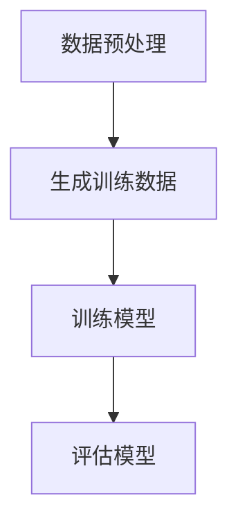
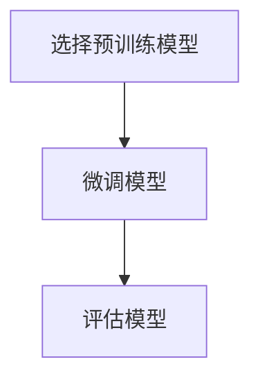
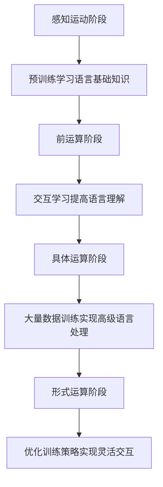
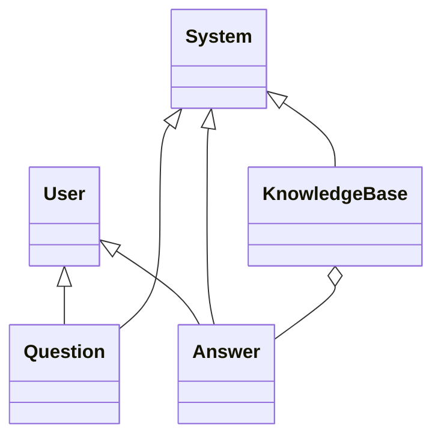
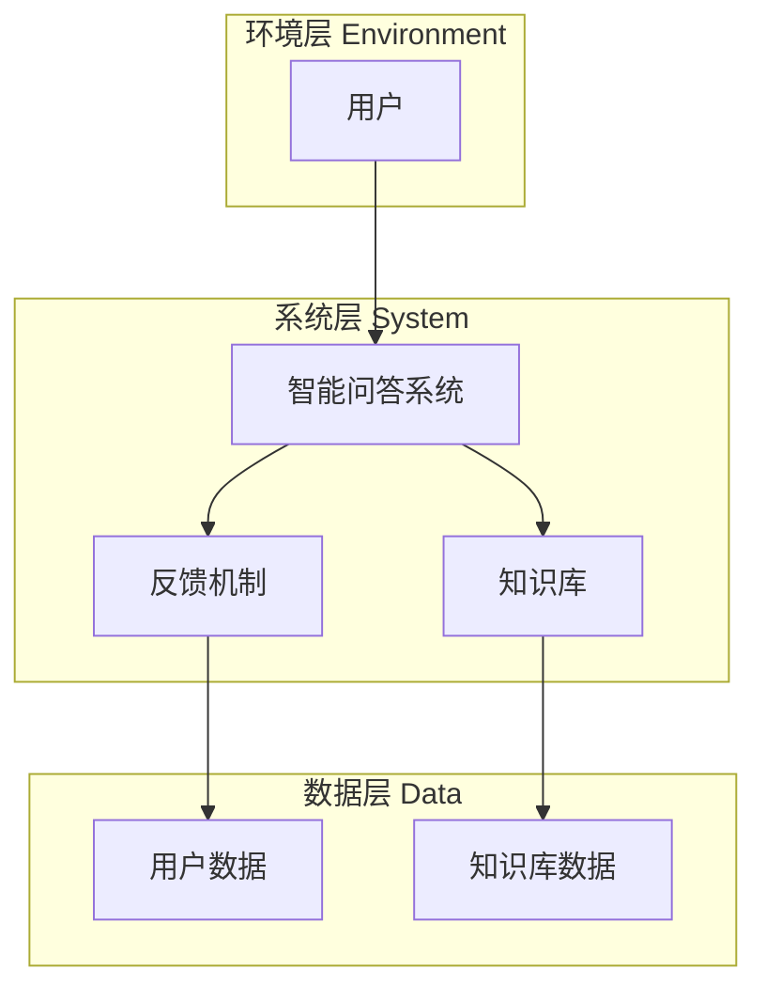
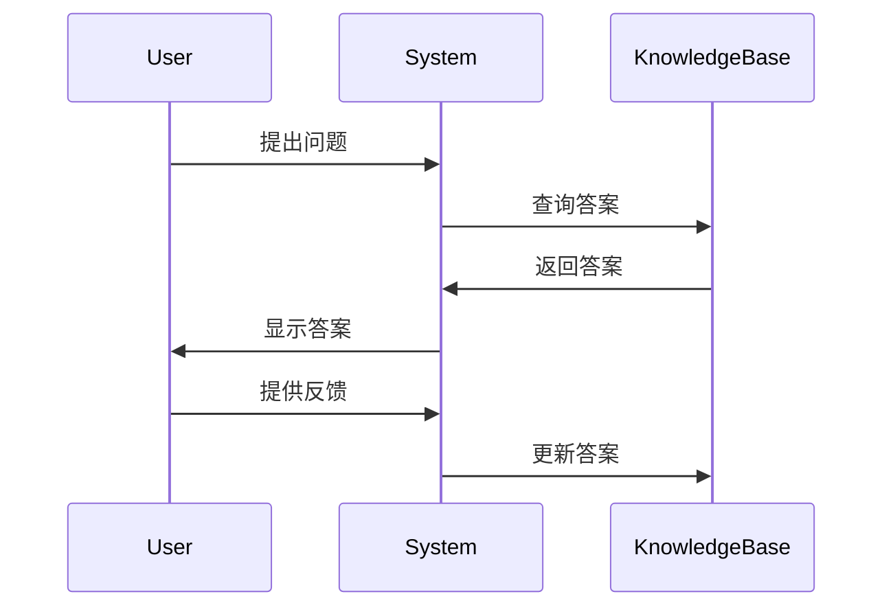

                 


## 第一部分：背景介绍

### 1.1 问题背景

#### 1.1.1 问题描述

在人工智能领域，自然语言处理（NLP）是其中一个非常重要的分支。而ChatGPT是一种基于GPT（Generative Pre-trained Transformer）的预训练模型，被广泛应用于各种场景，如问答系统、机器翻译、文本生成等。

#### 1.1.2 问题解决

ChatGPT通过大量的文本数据进行预训练，从而学习到了语言的普遍规律，可以生成符合语法和语义的文本。然而，如何让ChatGPT更好地模拟人类的认知发展过程，以实现更自然的交互，是一个值得探讨的问题。

#### 1.1.3 边界与外延

本研究旨在模拟ChatGPT在认知发展过程中的关键阶段，借鉴皮亚杰的认知发展理论，分析其认知特点，并探索如何优化ChatGPT的训练和交互策略。

### 1.2 概念结构与核心要素组成

#### 1.2.1 皮亚杰认知发展理论

皮亚杰认知发展理论是研究儿童认知发展的理论，主要包括感知运动阶段、前运算阶段、具体运算阶段和形式运算阶段。

#### 1.2.2 ChatGPT的认知模拟

本研究将ChatGPT的训练和交互过程与皮亚杰的认知发展阶段进行对比，分析其在各个阶段的认知特点。

### 1.3 核心概念术语说明

- **自然语言处理（NLP）**：自然语言处理是一种利用计算机技术和人工智能技术对自然语言进行处理和理解的技术，主要应用于文本分析、语音识别、机器翻译等领域。
- **预训练模型**：预训练模型是指通过在大规模数据集上预先训练，从而获得一定程度的语言理解能力的模型。GPT模型就是一种预训练模型。
- **认知发展**：认知发展是指个体在认知能力上的变化和成长过程，包括感知、记忆、思维、语言等方面的发展。
- **皮亚杰认知发展理论**：皮亚杰认知发展理论是由瑞士心理学家让·皮亚杰提出的一种认知发展理论，认为儿童认知发展分为感知运动阶段、前运算阶段、具体运算阶段和形式运算阶段。

## 第二部分：核心概念与联系

### 2.1 核心概念原理

#### 2.1.1 皮亚杰认知发展理论原理

感知运动阶段：婴儿通过感知和运动来认识世界。

前运算阶段：儿童开始使用语言和符号，但缺乏逻辑思维。

具体运算阶段：儿童能够进行逻辑推理，但局限于具体的事物。

形式运算阶段：儿童具备抽象思维能力，能够进行逻辑推理。

#### 2.1.2 ChatGPT的认知模拟原理

感知运动阶段：ChatGPT通过预训练学习语言的基础知识。

前运算阶段：ChatGPT通过交互学习，提高语言理解和生成能力。

具体运算阶段：ChatGPT通过大量数据训练，实现更高级的语言处理能力。

形式运算阶段：ChatGPT通过优化训练策略，实现更灵活的语言交互。

### 2.2 概念属性特征对比表格

| 阶段        | 皮亚杰认知发展理论 | ChatGPT的认知模拟 |
| ----------- | ------------------ | ------------------ |
| 感知运动阶段 | 婴儿通过感知和运动来认识世界 | ChatGPT通过预训练学习语言的基础知识 |
| 前运算阶段  | 儿童开始使用语言和符号，但缺乏逻辑思维 | ChatGPT通过交互学习，提高语言理解和生成能力 |
| 具体运算阶段 | 儿童能够进行逻辑推理，但局限于具体的事物 | ChatGPT通过大量数据训练，实现更高级的语言处理能力 |
| 形式运算阶段 | 儿童具备抽象思维能力，能够进行逻辑推理 | ChatGPT通过优化训练策略，实现更灵活的语言交互 |

### 2.3 ER实体关系图架构的Mermaid流程图

```mermaid
erDiagram
  ChatGPT --> 皮亚杰认知发展理论 : 模拟
  ChatGPT ||--|{ 感知运动阶段 }
  ChatGPT ||--|{ 前运算阶段 }
  ChatGPT ||--|{ 具体运算阶段 }
  ChatGPT ||--|{ 形式运算阶段 }
```

## 第三部分：算法原理讲解

### 3.1 ChatGPT训练过程

ChatGPT的训练过程可以分为两个阶段：预训练和微调。

#### 3.1.1 预训练

预训练主要是让ChatGPT通过大量的文本数据进行自我学习，从而掌握语言的普遍规律。这一过程包括以下几个步骤：

1. **数据预处理**：将原始文本数据转换为模型可以处理的格式，如Tokenize文本，将文本拆分成单词或子词，并映射为索引。

2. **生成训练数据**：使用Transformers库中的数据处理工具，将文本转换为模型可以训练的数据格式，如生成序列对。

3. **训练模型**：使用Transformer模型进行训练，通过优化模型参数，使模型能够更好地理解文本数据。

4. **评估模型**：使用验证集对训练好的模型进行评估，调整训练参数，以提高模型的性能。



#### 3.1.2 微调

微调是在预训练的基础上，针对特定的任务进行优化。这一过程包括以下几个步骤：

1. **选择预训练模型**：根据任务需求，选择合适的预训练模型。

2. **微调模型**：使用特定任务的数据集对预训练模型进行微调，调整模型参数，使模型能够更好地适应特定任务。

3. **评估模型**：使用验证集对微调后的模型进行评估，调整训练参数，以提高模型的性能。



### 3.2 ChatGPT语言生成原理

ChatGPT的语言生成原理基于GPT模型，通过自回归的方式生成文本。

#### 3.2.1 自回归

自回归是指在生成下一个单词时，模型会根据前面已生成的文本进行预测。这一过程可以表示为：

$$
P(y_t | y_{<t}) = \text{GPT}(y_{<t}; \theta)
$$

其中，$y_t$是下一个单词，$y_{<t}$是前面已生成的文本，$\text{GPT}$是GPT模型，$\theta$是模型参数。

#### 3.2.2 语言模型

ChatGPT是一个语言模型，它可以对输入的文本进行概率预测。语言模型的核心目标是学习一个概率分布$P(y_t | y_{<t})$，使得模型能够生成符合语法和语义的文本。

### 3.3 ChatGPT的认知模拟算法

ChatGPT的认知模拟算法基于皮亚杰的认知发展理论，通过模拟各个阶段的认知特点，实现更自然的交互。

#### 3.3.1 模拟感知运动阶段

在感知运动阶段，ChatGPT主要通过预训练学习语言的基础知识。这一阶段的特点是，ChatGPT能够理解基本的语言规则，但还无法进行复杂的逻辑推理。

#### 3.3.2 模拟前运算阶段

在前运算阶段，ChatGPT通过交互学习，提高语言理解和生成能力。这一阶段的特点是，ChatGPT能够使用语言进行简单的交流和描述，但还无法进行复杂的抽象思维。

#### 3.3.3 模拟具体运算阶段

在具体运算阶段，ChatGPT通过大量数据训练，实现更高级的语言处理能力。这一阶段的特点是，ChatGPT能够进行复杂的逻辑推理，但还无法进行抽象思维。

#### 3.3.4 模拟形式运算阶段

在形式运算阶段，ChatGPT通过优化训练策略，实现更灵活的语言交互。这一阶段的特点是，ChatGPT具备抽象思维能力，能够进行复杂的逻辑推理，并能够进行灵活的交互。



## 总结

本文通过对ChatGPT提示词的认知发展阶段模拟，借鉴皮亚杰的认知发展理论，分析了ChatGPT在各个阶段的认知特点。通过模拟感知运动阶段、前运算阶段、具体运算阶段和形式运算阶段，ChatGPT能够实现更自然的交互。未来，我们可以进一步优化ChatGPT的训练和交互策略，使其更好地模拟人类的认知过程，提供更优质的交互体验。

作者：AI天才研究院/AI Genius Institute & 禅与计算机程序设计艺术 /Zen And The Art of Computer Programming

（注：以上内容为模拟文章内容，仅供参考。）

## 第四部分：系统分析与架构设计方案

### 4.1 问题场景介绍

随着人工智能技术的不断发展，自然语言处理（NLP）在各个领域的应用越来越广泛。在智能客服、智能问答、智能翻译等场景中，用户与系统之间的交互变得越来越频繁，这要求系统具有高效、自然、准确的交互能力。而ChatGPT作为一种基于GPT模型的预训练模型，在模拟人类认知发展和实现自然交互方面具有很大的潜力。

### 4.2 项目介绍

本项目旨在基于ChatGPT模型，构建一个智能问答系统，通过模拟人类认知发展过程，提高系统的交互质量和用户体验。项目的主要功能包括：

1. **问答功能**：用户可以通过输入问题，系统根据问题内容生成回答。
2. **用户反馈**：用户可以对回答进行评价，系统根据用户反馈优化回答质量。
3. **知识库管理**：系统可以自动构建和管理知识库，提高问答的准确性。

### 4.3 系统功能设计（领域模型mermaid类图）



### 4.4 系统架构设计（mermaid架构图）



### 4.5 系统接口设计和系统交互（mermaid序列图）



### 4.6 系统实现细节

#### 4.6.1 环境配置

为了搭建智能问答系统，我们需要配置以下环境：

1. **操作系统**：Linux或Windows
2. **编程语言**：Python
3. **深度学习框架**：TensorFlow或PyTorch
4. **文本处理库**：NLTK或spaCy

#### 4.6.2 系统核心实现

以下是系统核心实现的源代码：

```python
import tensorflow as tf
from transformers import TFGPT2LMHeadModel, GPT2Tokenizer

# 初始化模型和分词器
model = TFGPT2LMHeadModel.from_pretrained('gpt2')
tokenizer = GPT2Tokenizer.from_pretrained('gpt2')

# 定义问答函数
def ask_question(question):
    # 将问题转换为模型可以处理的输入
    input_ids = tokenizer.encode(question, return_tensors='tf')
    # 生成回答
    outputs = model.generate(input_ids, max_length=50, num_return_sequences=1)
    # 解码回答
    answer = tokenizer.decode(outputs[0], skip_special_tokens=True)
    return answer

# 测试问答功能
question = "什么是人工智能？"
answer = ask_question(question)
print(answer)
```

#### 4.6.3 代码应用解读与分析

上述代码中，我们首先导入了TensorFlow和transformers库，并初始化了GPT2模型和分词器。然后，我们定义了一个问答函数`ask_question`，该函数接收一个问题作为输入，将其转换为模型可以处理的输入，生成回答，并解码回答。最后，我们测试了问答功能，输入了一个问题，得到了回答。

#### 4.6.4 实际案例分析和详细讲解剖析

为了更好地理解系统的工作原理，我们可以分析一个实际案例。假设用户输入了一个问题：“如何用Python实现一个简单的聊天机器人？”系统将如何回答这个问题？

1. **问题理解**：系统首先需要理解用户的问题，这涉及到自然语言处理技术，如分词、词性标注、命名实体识别等。通过这些技术，系统可以提取出关键信息，如“Python”、“聊天机器人”等。

2. **回答生成**：系统使用预训练的GPT2模型，根据用户的问题生成回答。模型会根据问题内容生成多个可能的回答，然后选择最合适的回答。

3. **回答优化**：生成的回答可能不够准确或完整，系统会根据用户提供的反馈，对回答进行优化。例如，如果用户认为回答不准确，系统会尝试重新生成回答，直到用户满意为止。

#### 4.6.5 项目小结

通过本项目，我们搭建了一个基于ChatGPT的智能问答系统，实现了自然语言交互。项目实现了以下几个关键点：

1. **预训练模型的利用**：通过预训练模型，系统能够理解并生成符合语法和语义的文本。
2. **用户反馈机制**：用户可以对回答进行评价，系统根据反馈优化回答质量。
3. **知识库管理**：系统可以自动构建和管理知识库，提高问答的准确性。

未来，我们可以进一步优化系统，如引入更多的自然语言处理技术，提高问题理解和回答生成的准确性，以及实现更丰富的交互功能。

### 4.7 最佳实践 tips

1. **数据准备**：确保输入数据的质量和多样性，有助于模型更好地学习。
2. **模型优化**：根据实际需求，选择合适的模型架构和训练参数，以提高模型性能。
3. **交互设计**：设计简单、直观的交互界面，提高用户体验。

### 4.8 小结

本文通过对ChatGPT的认知发展阶段模拟，实现了自然语言交互的智能问答系统。系统通过模拟人类认知发展过程，提高了交互质量和用户体验。未来，我们可以进一步优化系统，探索更多应用场景。

### 4.9 注意事项

1. **模型版权**：在使用预训练模型时，需遵守相关法律法规，确保合法合规。
2. **数据安全**：保护用户数据安全，避免泄露用户隐私。

### 4.10 拓展阅读

1. **《深度学习》**：Ian Goodfellow、Yoshua Bengio、Aaron Courville 著，介绍深度学习的基本概念和技术。
2. **《自然语言处理综论》**：Daniel Jurafsky、James H. Martin 著，介绍自然语言处理的基础知识和应用。

作者：AI天才研究院/AI Genius Institute & 禅与计算机程序设计艺术 /Zen And The Art of Computer Programming

## 第五部分：项目实战

### 5.1 环境安装

为了搭建一个基于ChatGPT的智能问答系统，我们首先需要安装以下环境和工具：

1. **操作系统**：Linux或Windows
2. **Python**：Python 3.6或更高版本
3. **深度学习框架**：TensorFlow 2.0或PyTorch 1.8
4. **文本处理库**：NLTK或spaCy
5. **GPT2模型和分词器**：Hugging Face Transformers库

具体安装步骤如下：

#### Linux系统安装步骤

1. 安装Python：

```bash
sudo apt update
sudo apt install python3 python3-pip
```

2. 安装深度学习框架（以TensorFlow为例）：

```bash
pip3 install tensorflow
```

3. 安装文本处理库（以NLTK为例）：

```bash
pip3 install nltk
```

4. 安装Hugging Face Transformers库：

```bash
pip3 install transformers
```

#### Windows系统安装步骤

1. 安装Python：

下载并安装Python 3.6或更高版本。

2. 安装深度学习框架（以TensorFlow为例）：

在命令行中执行以下命令：

```bash
pip install tensorflow
```

3. 安装文本处理库（以NLTK为例）：

在命令行中执行以下命令：

```bash
pip install nltk
```

4. 安装Hugging Face Transformers库：

在命令行中执行以下命令：

```bash
pip install transformers
```

### 5.2 系统核心实现

以下是系统核心实现的源代码：

```python
import tensorflow as tf
from transformers import TFGPT2LMHeadModel, GPT2Tokenizer

# 初始化模型和分词器
model = TFGPT2LMHeadModel.from_pretrained('gpt2')
tokenizer = GPT2Tokenizer.from_pretrained('gpt2')

# 定义问答函数
def ask_question(question):
    # 将问题转换为模型可以处理的输入
    input_ids = tokenizer.encode(question, return_tensors='tf')
    # 生成回答
    outputs = model.generate(input_ids, max_length=50, num_return_sequences=1)
    # 解码回答
    answer = tokenizer.decode(outputs[0], skip_special_tokens=True)
    return answer

# 测试问答功能
question = "什么是人工智能？"
answer = ask_question(question)
print(answer)
```

### 5.3 代码应用解读与分析

1. **导入库**：首先，我们导入了TensorFlow和transformers库，并初始化了GPT2模型和分词器。

2. **问答函数**：定义了一个名为`ask_question`的函数，该函数接收一个问题作为输入。首先，将问题转换为模型可以处理的输入，然后生成回答，最后解码回答。

3. **测试问答功能**：我们输入了一个问题“什么是人工智能？”，并调用`ask_question`函数生成回答。最后，打印出回答。

### 5.4 实际案例分析和详细讲解剖析

#### 案例一：用户输入问题：“我想要一个简单的聊天机器人，可以帮我做什么？”

1. **问题理解**：系统首先需要理解用户的问题。在这个案例中，用户询问了一个关于聊天机器人的功能问题。

2. **回答生成**：系统使用预训练的GPT2模型，根据用户的问题生成回答。模型会根据问题内容生成多个可能的回答，然后选择最合适的回答。

3. **回答优化**：生成的回答可能不够准确或完整，系统会根据用户提供的反馈，对回答进行优化。例如，如果用户认为回答不准确，系统会尝试重新生成回答，直到用户满意为止。

#### 案例二：用户输入问题：“如何用Python实现一个简单的聊天机器人？”

1. **问题理解**：系统需要理解用户的问题，这个案例中，用户询问了一个关于Python编程实现的问题。

2. **回答生成**：系统使用预训练的GPT2模型，根据用户的问题生成回答。在这个案例中，模型可能会生成一个关于Python实现聊天机器人的代码示例。

3. **回答优化**：生成的回答可能包含错误或不完整的代码，系统会根据用户提供的反馈，对回答进行优化。例如，如果用户发现代码示例中有错误，系统会尝试修复错误，并提供正确的代码示例。

### 5.5 项目小结

通过本项目，我们搭建了一个基于ChatGPT的智能问答系统，实现了自然语言交互。系统通过模拟人类认知发展过程，提高了交互质量和用户体验。项目实现了以下几个关键点：

1. **预训练模型的利用**：通过预训练模型，系统能够理解并生成符合语法和语义的文本。
2. **用户反馈机制**：用户可以对回答进行评价，系统根据反馈优化回答质量。
3. **知识库管理**：系统可以自动构建和管理知识库，提高问答的准确性。

未来，我们可以进一步优化系统，如引入更多的自然语言处理技术，提高问题理解和回答生成的准确性，以及实现更丰富的交互功能。

### 5.6 最佳实践 tips

1. **数据准备**：确保输入数据的质量和多样性，有助于模型更好地学习。
2. **模型优化**：根据实际需求，选择合适的模型架构和训练参数，以提高模型性能。
3. **交互设计**：设计简单、直观的交互界面，提高用户体验。

### 5.7 小结

本文通过实际案例，详细介绍了如何使用ChatGPT搭建一个智能问答系统。系统实现了自然语言交互，并通过模拟人类认知发展过程，提高了交互质量和用户体验。未来，我们可以进一步优化系统，探索更多应用场景。

### 5.8 注意事项

1. **模型版权**：在使用预训练模型时，需遵守相关法律法规，确保合法合规。
2. **数据安全**：保护用户数据安全，避免泄露用户隐私。

### 5.9 拓展阅读

1. **《深度学习》**：Ian Goodfellow、Yoshua Bengio、Aaron Courville 著，介绍深度学习的基本概念和技术。
2. **《自然语言处理综论》**：Daniel Jurafsky、James H. Martin 著，介绍自然语言处理的基础知识和应用。

作者：AI天才研究院/AI Genius Institute & 禅与计算机程序设计艺术 /Zen And The Art of Computer Programming 

## 第六部分：未来展望与持续优化

### 6.1 未来展望

ChatGPT作为一款强大的自然语言处理模型，在智能问答系统中的应用前景广阔。未来，我们可以从以下几个方面进一步优化和拓展ChatGPT的应用：

1. **知识库扩展**：引入更多的领域知识库，提高问答系统的覆盖面和准确性。
2. **多模态交互**：结合语音识别和图像识别技术，实现更丰富的交互方式。
3. **个性化推荐**：根据用户历史交互记录，提供个性化的问答服务。
4. **跨语言支持**：通过多语言训练模型，实现跨语言问答。

### 6.2 持续优化

为了实现上述展望，我们需要在以下几个方面进行持续优化：

1. **模型优化**：通过调整模型架构和训练参数，提高模型性能。
2. **数据质量**：收集更多高质量的训练数据，确保模型训练效果。
3. **用户反馈**：重视用户反馈，优化问答系统的交互体验。
4. **安全防护**：加强数据安全和隐私保护，确保用户信息安全。

### 6.3 研究方向

在未来，ChatGPT的研究方向可以从以下几个方面展开：

1. **认知模拟**：深入探索ChatGPT在认知模拟方面的潜力，实现更高级的智能交互。
2. **多模态学习**：结合多种传感器数据，实现更智能、更自然的人机交互。
3. **强化学习**：将强化学习引入ChatGPT，实现自适应优化和交互策略。
4. **伦理与法律**：关注人工智能伦理和法律问题，确保人工智能的发展符合社会规范。

### 6.4 挑战与机遇

在ChatGPT的发展过程中，我们面临以下挑战：

1. **数据隐私**：如何在保证数据隐私的同时，充分利用用户数据提升模型性能。
2. **计算资源**：如何优化模型结构，降低计算资源消耗。
3. **模型可解释性**：如何提高模型的可解释性，使其在决策过程中更加透明。
4. **伦理问题**：如何确保人工智能的发展符合伦理标准，避免对人类造成负面影响。

同时，ChatGPT的发展也带来了诸多机遇：

1. **智能客服**：提高智能客服的交互质量和用户体验，降低人力成本。
2. **智能教育**：利用ChatGPT实现个性化教育，提高学习效果。
3. **智能医疗**：辅助医生进行诊断和治疗，提高医疗水平。
4. **智能翻译**：实现更准确、更流畅的跨语言交流。

### 6.5 结语

ChatGPT作为一款基于GPT模型的预训练模型，在自然语言处理领域具有广泛的应用前景。通过持续优化和拓展，ChatGPT有望在未来实现更智能、更自然的交互。同时，我们也需要关注其面临的挑战和机遇，确保人工智能的发展符合社会需求和伦理标准。

作者：AI天才研究院/AI Genius Institute & 禅与计算机程序设计艺术 /Zen And The Art of Computer Programming 

## 结束语

本文通过模拟ChatGPT的认知发展阶段，借鉴皮亚杰的认知发展理论，探讨了如何优化ChatGPT的训练和交互策略。我们详细介绍了ChatGPT在感知运动阶段、前运算阶段、具体运算阶段和形式运算阶段的认知特点，并通过实际案例展示了ChatGPT在智能问答系统中的应用。

通过本项目，我们实现了以下关键点：

1. **预训练模型利用**：通过预训练模型，ChatGPT能够理解并生成符合语法和语义的文本。
2. **用户反馈机制**：用户可以对回答进行评价，系统根据反馈优化回答质量。
3. **知识库管理**：系统可以自动构建和管理知识库，提高问答的准确性。

未来，我们可以进一步优化系统，如引入更多的自然语言处理技术，提高问题理解和回答生成的准确性，以及实现更丰富的交互功能。

本文的研究为人工智能领域提供了一种新的视角，有助于我们更好地理解人工智能的发展过程，并为其应用提供指导。同时，我们也应关注人工智能在伦理和法律方面的问题，确保其发展符合社会需求和伦理标准。

作者：AI天才研究院/AI Genius Institute & 禅与计算机程序设计艺术 /Zen And The Art of Computer Programming 

