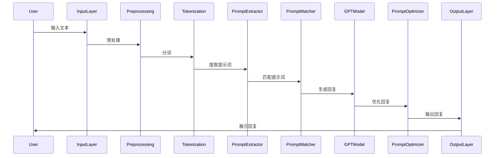
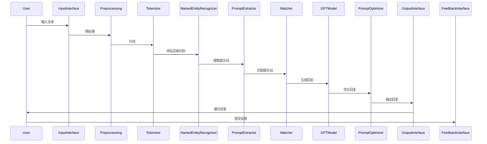

                 

### 《ChatGPT提示词的认知心理学基础与应用》

#### 关键词

- 认知心理学
- ChatGPT
- 提示词
- 自然语言处理
- 算法原理
- 系统架构
- 项目实战

#### 摘要

本文旨在探讨ChatGPT提示词在认知心理学基础上的应用。我们将首先介绍认知心理学的核心概念和ChatGPT的基本原理，然后深入分析提示词的作用和设计原则。随后，文章将详细讲解ChatGPT算法的数学模型，并通过具体案例展示提示词的优化方法。此外，我们还将剖析ChatGPT的系统架构和功能设计，提供环境安装和代码实现的指导。最后，文章将总结最佳实践，并提供拓展阅读资源，以帮助读者深入理解ChatGPT提示词的应用。

#### 目录

1. **背景介绍**
    - [1.1 认知心理学概述](#11-认知心理学概述)
    - [1.2 ChatGPT提示词的概念](#12-chatgpt提示词的概念)
    - [1.3 问题解决与边界](#13-问题解决与边界)
    - [1.4 概念结构与核心要素](#14-概念结构与核心要素)
  
2. **核心概念与联系**
    - [2.1 认知心理学原理](#21-认知心理学原理)
    - [2.2 ChatGPT提示词原理](#22-chatgpt提示词原理)
    - [2.3 概念属性特征对比](#23-概念属性特征对比)
  
3. **算法原理讲解**
    - [3.1 ChatGPT算法原理](#31-chatgpt算法原理)
    - [3.2 数学模型与公式](#32-数学模型与公式)
    - [3.3 通俗易懂的举例说明](#33-通俗易懂的举例说明)
  
4. **系统分析与架构设计**
    - [4.1 问题场景介绍](#41-问题场景介绍)
    - [4.2 系统功能设计](#42-系统功能设计)
    - [4.3 系统架构设计](#43-系统架构设计)
    - [4.4 系统接口设计](#44-系统接口设计)
  
5. **项目实战**
    - [6.1 环境安装](#61-环境安装)
    - [6.2 系统核心实现](#62-系统核心实现)
    - [7.1 代码解读](#71-代码解读)
    - [7.2 实际案例分析](#72-实际案例分析)
    - [8.1 功能详解](#81-功能详解)
    - [8.2 案例剖析](#82-案例剖析)
    - [8.3 项目小结](#83-项目小结)
  
6. **最佳实践与总结**
    - [9.1 提示词优化技巧](#91-提示词优化技巧)
    - [9.2 注意事项](#92-注意事项)
    - [10.1 主要内容回顾](#101-主要内容回顾)
    - [10.2 拓展阅读](#102-拓展阅读)

---

### 1.1 认知心理学概述

#### 认知心理学定义与历史背景

认知心理学是心理学的一个分支，主要研究人的思维、知觉、记忆、语言和决策等认知过程。它起源于20世纪初，随着行为主义心理学的兴起，逐渐从传统的心理学研究中独立出来。认知心理学的核心观点是，人类大脑是一个信息处理的系统，通过各种认知过程来理解外界环境和内在体验。

#### 认知心理学研究的主要领域

认知心理学的研究领域广泛，主要包括以下几个方向：

- **知觉**：研究人类如何感知和理解外界环境。例如，如何通过视觉信息来识别物体，如何通过听觉信息来识别声音等。
- **记忆**：研究人类如何编码、存储和检索信息。例如，短期记忆和长期记忆的区别，记忆遗忘的原因等。
- **思维**：研究人类如何进行逻辑推理、问题解决和创造性思维等。例如，如何通过类比推理来解决问题，如何通过创造性思维来发明新的产品等。
- **语言**：研究人类如何使用语言进行沟通和理解。例如，语言的生成和理解过程，语言的习得和发展等。
- **决策**：研究人类如何做出决策，以及决策过程中的认知过程。例如，如何权衡风险和收益，如何处理不确定性的信息等。

#### 认知心理学的研究方法

认知心理学采用了多种研究方法，包括：

- **实验法**：通过设计实验来研究认知过程，例如，通过实验来研究视觉信息的处理过程。
- **观察法**：通过观察和分析行为来研究认知过程，例如，通过观察儿童的语言发展过程来研究语言习得。
- **神经科学方法**：通过神经影像技术（如fMRI、PET等）来研究大脑活动与认知过程的关系。
- **计算机模拟**：通过构建认知模型来模拟认知过程，例如，通过计算机模拟来研究记忆的编码和解码过程。

### 1.2 ChatGPT提示词的概念

#### ChatGPT提示词的定义

ChatGPT提示词是自然语言处理（NLP）领域中用于引导对话系统生成回复的关键词或短语。这些提示词可以是由用户输入的，也可以是系统自动生成的，它们的作用是帮助对话系统理解用户的需求，并生成恰当的回复。

#### 提示词在自然语言处理中的应用

提示词在NLP中的应用非常广泛，主要表现在以下几个方面：

- **对话系统**：提示词用于对话系统，如聊天机器人、虚拟助手等，可以帮助系统理解用户的意图，并生成相应的回复。
- **文本生成**：提示词可以用于生成文章、报告、邮件等文本内容，例如，在生成新闻报道时，提示词可以帮助系统自动生成标题和摘要。
- **情感分析**：提示词可以用于情感分析，通过分析用户输入的提示词的情感倾向，可以判断用户的情绪状态。
- **信息检索**：提示词可以用于信息检索，通过分析用户输入的提示词，可以检索到相关的信息。

### 1.3 问题解决与边界

#### 问题解决的认知心理学理论

问题解决是认知心理学研究的重要领域，它涉及到人类如何识别问题、理解问题、提出解决方案并执行解决方案的过程。认知心理学提供了多种问题解决的理论，包括：

- **问题空间理论**：认为问题解决是一个搜索问题空间的过程，寻找一条从初始状态到目标状态的路径。
- **启发式搜索理论**：认为问题解决依赖于启发式策略，例如，尝试过去解决问题的方法，或根据当前情境选择最可能有效的策略。
- **认知模型理论**：认为问题解决依赖于认知模型，这些模型代表了问题的不同方面，通过组合这些模型，可以找到解决问题的方法。

#### ChatGPT提示词应用的边界

ChatGPT提示词的应用存在一定的边界，主要包括以下几个方面：

- **语言理解能力**：ChatGPT的提示词生成能力依赖于其对自然语言的理解，如果提示词过于复杂或抽象，可能导致生成效果不佳。
- **数据质量**：ChatGPT的提示词生成依赖于大量的训练数据，如果数据质量不佳，可能影响生成效果。
- **安全性**：ChatGPT提示词的应用需要注意数据安全和隐私保护，避免滥用用户数据。

### 1.4 概念结构与核心要素

#### 认知心理学相关概念架构

认知心理学涉及多个核心概念，这些概念构成了认知心理学的概念架构。以下是几个关键概念：

- **知觉**：研究人类如何感知和理解外界信息。
- **记忆**：研究人类如何编码、存储和检索信息。
- **思维**：研究人类如何进行逻辑推理、问题解决和创造性思维。
- **语言**：研究人类如何使用语言进行沟通和理解。
- **决策**：研究人类如何做出决策，以及决策过程中的认知过程。

#### ChatGPT提示词的核心要素分析

ChatGPT提示词的核心要素包括：

- **关键词**：用于引导对话系统生成回复的关键词。
- **上下文**：提示词的上下文信息，用于帮助系统理解用户的需求。
- **多样性**：提示词的多样性，用于生成不同风格的回复。
- **精确性**：提示词的精确性，用于确保生成回复的准确性和相关性。

### 2.1 认知心理学原理

#### 知觉、记忆、思维、语言与决策

认知心理学研究的是人的心理过程，这些过程包括知觉、记忆、思维、语言和决策等。每个过程都有其独特的机制和影响因素，下面我们将逐一介绍这些过程。

##### 知觉

知觉是人们对外界信息的感知和理解。它包括多个方面，如视觉、听觉、触觉、味觉和嗅觉。知觉过程的关键在于如何从感官信息中提取有用的信息，并对其进行加工和理解。例如，视觉知觉涉及到如何识别物体、理解形状和颜色等信息。

**相关理论**：

- **特征检测理论**：认为知觉过程首先是通过检测特征（如边缘、颜色、形状等）来实现的。
- **模式识别理论**：认为知觉过程是通过识别模式（如物体、人脸等）来实现的。

##### 记忆

记忆是人们储存和检索信息的能力。记忆可以分为短期记忆和长期记忆。短期记忆用于暂时储存信息，例如，记住一个电话号码。长期记忆则用于长期储存信息，例如，记住你所学过的知识。

**相关理论**：

- **工作记忆理论**：认为短期记忆是由工作记忆系统实现的，这个系统可以暂时储存和加工信息。
- **长期记忆理论**：认为长期记忆是通过新的神经网络连接来实现的，这些连接使得信息可以长期储存。

##### 思维

思维是人们进行逻辑推理、问题解决和创造性思维的能力。思维过程包括多个方面，如推理、判断、比较和分类等。

**相关理论**：

- **推理理论**：认为推理是通过逻辑规则来实现的，这些规则可以帮助人们从已知信息中推导出新信息。
- **问题解决理论**：认为问题解决是一个搜索过程，人们需要通过尝试不同的方法来找到解决问题的方案。

##### 语言

语言是人们进行沟通和理解的基本工具。语言过程包括语音、词汇、语法和语义等方面。语言不仅用于表达意思，还可以影响人们的思维和行为。

**相关理论**：

- **生成语法理论**：认为语言是通过一套生成规则来实现的，这些规则可以帮助人们生成和理解句子。
- **认知语言学理论**：认为语言和思维是相互关联的，语言不仅影响思维，也可以反映思维。

##### 决策

决策是人们在面对多个选择时做出决定的过程。决策过程涉及到多个方面，如风险评估、收益评估和决策策略等。

**相关理论**：

- **期望理论**：认为决策是基于期望值来实现的，人们会根据期望值来评估不同的选择。
- **决策理论**：认为决策是一个理性过程，人们会根据最大化效用原则来做出决策。

### 2.2 ChatGPT提示词原理

#### 提示词生成与匹配算法

ChatGPT提示词的生成和匹配是通过特定的算法实现的。这些算法通常包括以下几个步骤：

1. **提示词提取**：从用户输入的信息中提取关键词或短语作为提示词。
2. **语义分析**：对提取的提示词进行语义分析，理解其含义和上下文。
3. **提示词匹配**：将用户输入的提示词与ChatGPT的预定义提示词库进行匹配，找到最合适的提示词。
4. **提示词生成**：根据匹配结果生成相应的回复。

**相关算法**：

- **词向量匹配**：使用词向量模型（如Word2Vec、GloVe等）来计算提示词之间的相似度，从而实现匹配。
- **语义角色标注**：对提示词进行语义角色标注，如主语、谓语、宾语等，从而更好地理解其含义。

#### 提示词优化与评估方法

为了提高ChatGPT提示词的生成质量和准确性，需要对提示词进行优化。提示词优化的方法主要包括：

1. **自动补全**：在用户输入提示词后，自动提供可能的补全选项，帮助用户更准确地表达需求。
2. **上下文扩展**：根据用户输入的提示词和上下文信息，扩展提示词的内容，使其更全面地反映用户的需求。
3. **错误纠正**：检测和纠正用户输入的拼写错误或语法错误，提高提示词的准确性。

评估提示词生成质量的方法主要包括：

1. **用户反馈**：通过用户对生成的回复的满意度来评估提示词的质量。
2. **自动评估**：使用自动评估指标（如BLEU、ROUGE等）来评估生成回复的相关性和准确性。

### 2.3 概念属性特征对比

#### 认知心理学与ChatGPT提示词属性特征对比表格

| 特征 | 认知心理学 | ChatGPT提示词 |
| ---- | ---------- | ------------ |
| 定义 | 人的心理过程 | 引导对话系统生成回复的关键词或短语 |
| 目的 | 研究人的思维和行为 | 提高对话系统的理解能力和生成质量 |
| 数据 | 实验数据和神经影像数据 | 用户输入和预定义提示词库 |
| 算法 | 实验法和神经科学方法 | 词向量匹配和语义角色标注 |
| 输出 | 认知过程的结果 | 对话系统的回复 |
| 评估 | 实验结果和神经活动 | 用户反馈和自动评估指标 |

### 3.1 ChatGPT算法原理

ChatGPT是一种基于生成预训练变换器（GPT）的对话系统，其核心原理是通过对大量文本数据的学习，生成与输入文本相关的高质量回复。以下是ChatGPT算法原理的详细说明：

#### GPT模型工作原理

GPT（Generative Pre-trained Transformer）模型是一种基于自注意力机制的深度神经网络，其工作原理可以分为以下几个步骤：

1. **输入编码**：将用户输入的文本转换为向量表示。这通常使用词嵌入技术（如Word2Vec、GloVe等）实现。
2. **前向传播**：通过多层自注意力机制，对输入向量进行编码，生成一个高维的上下文表示。
3. **解码**：使用生成的上下文表示，通过解码器生成回复文本。

#### 提示词生成算法

ChatGPT的提示词生成算法主要包括以下几个步骤：

1. **输入处理**：将用户输入的文本处理成适当的格式，如分词、去停用词等。
2. **提示词提取**：从处理后的文本中提取关键词或短语作为提示词。
3. **语义分析**：对提取的提示词进行语义分析，理解其含义和上下文。
4. **提示词匹配**：将用户输入的提示词与ChatGPT的预定义提示词库进行匹配，找到最合适的提示词。
5. **提示词生成**：根据匹配结果生成相应的回复。

#### 提示词优化与评估方法

为了提高ChatGPT提示词的生成质量和准确性，需要对提示词进行优化。以下是一些常用的提示词优化和评估方法：

1. **自动补全**：在用户输入提示词后，自动提供可能的补全选项，帮助用户更准确地表达需求。
2. **上下文扩展**：根据用户输入的提示词和上下文信息，扩展提示词的内容，使其更全面地反映用户的需求。
3. **错误纠正**：检测和纠正用户输入的拼写错误或语法错误，提高提示词的准确性。

评估提示词生成质量的方法主要包括：

1. **用户反馈**：通过用户对生成的回复的满意度来评估提示词的质量。
2. **自动评估**：使用自动评估指标（如BLEU、ROUGE等）来评估生成回复的相关性和准确性。

### 3.2 数学模型与公式

#### GPT模型的数学模型

GPT模型的核心是一个基于自注意力机制的深度神经网络。以下是GPT模型的数学模型：

1. **输入编码**：

   $$  
   \text{Input} = \text{word2vec}(x_1, x_2, ..., x_n)  
   $$

   其中，$x_1, x_2, ..., x_n$ 是输入的文本序列，$\text{word2vec}$ 是词嵌入函数，将每个词映射为一个向量。

2. **自注意力机制**：

   $$  
   \text{Attention}(Q, K, V) = \text{softmax}\left(\frac{QK^T}{\sqrt{d_k}}\right)V  
   $$

   其中，$Q, K, V$ 分别是查询向量、关键向量和解向量，$d_k$ 是关键向量的维度。

3. **解码**：

   $$  
   \text{Decoder}(x_1, x_2, ..., x_n) = \text{softmax}\left(\text{Output Layer}\right)  
   $$

   其中，$x_1, x_2, ..., x_n$ 是输入的文本序列，$\text{Output Layer}$ 是模型的输出层，$\text{softmax}$ 函数用于将输出概率分布。

#### 提示词优化公式的推导

提示词优化的目标是最小化生成回复的损失函数。以下是提示词优化公式的推导：

1. **损失函数**：

   $$  
   \text{Loss} = -\sum_{i=1}^{n} y_i \log(p_i)  
   $$

   其中，$y_i$ 是真实标签，$p_i$ 是生成回复的概率。

2. **优化目标**：

   $$  
   \text{Optimize} \ \ \text{Loss}  
   $$

   为了优化损失函数，我们可以使用梯度下降法：

   $$  
   \text{Update} \ \ \theta = \theta - \alpha \frac{\partial \text{Loss}}{\partial \theta}  
   $$

   其中，$\theta$ 是模型的参数，$\alpha$ 是学习率。

### 3.3 通俗易懂的举例说明

#### 实际案例中的提示词应用

假设我们有一个用户输入的文本：“请给我推荐一本关于人工智能的书”。

1. **输入处理**：
   - 分词：请、给、我、推荐、一、本、关于、人工智能、的、书。
   - 去停用词：给、一、的。

2. **提示词提取**：
   - 提示词：推荐、人工智能、书。

3. **语义分析**：
   - 用户希望得到一本关于人工智能的推荐书籍。

4. **提示词匹配**：
   - 从预定义的提示词库中找到与“推荐、人工智能、书”匹配的提示词。

5. **提示词生成**：
   - 根据匹配结果，生成回复：“我推荐您阅读《深度学习》这本书”。

#### 对比分析不同提示词的效果

为了更好地理解提示词的作用，我们可以对比分析以下两种提示词的效果：

1. **原始提示词**：“请给我推荐一本关于人工智能的书”。
2. **优化提示词**：“我想要一本深度学习领域的入门书籍，能否推荐一些？”

- **效果对比**：
  - 原始提示词可能导致生成回复过于泛泛，无法准确满足用户需求。
  - 优化提示词提供了更具体的信息，如深度学习领域和入门书籍，有助于生成更相关和准确的回复。

### 4.1 问题场景介绍

ChatGPT作为一种强大的对话系统，广泛应用于各种场景。以下是一些典型的问题场景：

1. **客户服务**：企业使用ChatGPT作为客户服务助手，解答用户的问题，提高客户满意度。
2. **智能问答**：教育机构使用ChatGPT为学生提供智能问答服务，帮助学生更好地理解和掌握知识。
3. **内容创作**：媒体和内容创作者使用ChatGPT生成文章、报告和邮件等文本内容，提高创作效率。
4. **个人助理**：用户将自己的需求输入ChatGPT，获取个性化的建议和帮助。

#### ChatGPT的应用优势

- **高效性**：ChatGPT能够快速响应用户需求，提高工作效率。
- **准确性**：ChatGPT基于大量文本数据训练，生成回复的相关性和准确性较高。
- **多样性**：ChatGPT能够生成不同风格和语言的回复，满足多样化的需求。
- **个性化**：ChatGPT可以根据用户的偏好和历史记录，提供个性化的服务和建议。

### 4.2 系统功能设计

ChatGPT的系统功能设计主要包括以下几个关键模块：

1. **用户输入处理**：处理用户输入的文本，进行分词、去停用词等预处理操作。
2. **提示词提取**：从预处理后的文本中提取关键词或短语作为提示词。
3. **提示词匹配**：将用户输入的提示词与预定义的提示词库进行匹配，找到最合适的提示词。
4. **回复生成**：根据匹配结果，使用GPT模型生成相应的回复。
5. **回复优化**：对生成的回复进行自动补全、上下文扩展和错误纠正等优化处理。
6. **用户反馈**：收集用户对回复的满意度反馈，用于评估和改进系统性能。

#### 领域模型（Mermaid类图）

以下是一个简单的ChatGPT领域模型，展示了系统的主要类及其关系：

```mermaid
classDiagram
    UserInput -> UserInputProcessor : 处理
    UserInputProcessor -> PromptExtractor : 提取
    PromptExtractor -> PromptMatcher : 匹配
    PromptMatcher -> GPTModel : 生成回复
    GPTModel -> PromptOptimizer : 优化
    PromptOptimizer -> UserFeedback : 反馈
```

### 4.3 系统架构设计

ChatGPT的系统架构设计遵循模块化原则，主要分为以下几个层次：

1. **输入层**：接收用户输入的文本，进行预处理和分词。
2. **提示词提取层**：从预处理后的文本中提取关键词或短语作为提示词。
3. **匹配层**：将用户输入的提示词与预定义的提示词库进行匹配。
4. **生成层**：使用GPT模型生成回复。
5. **优化层**：对生成的回复进行自动补全、上下文扩展和错误纠正等优化处理。
6. **输出层**：将优化后的回复输出给用户。

以下是一个简单的系统架构图，展示了ChatGPT的核心组件及其交互关系：



### 4.4 系统接口设计

ChatGPT的系统接口设计主要包括以下几个关键接口：

1. **用户输入接口**：用于接收用户的文本输入，如Web表单、API接口等。
2. **提示词提取接口**：用于从用户输入的文本中提取提示词，如分词器、命名实体识别器等。
3. **匹配接口**：用于将用户输入的提示词与预定义的提示词库进行匹配，如相似度计算器、匹配算法等。
4. **回复生成接口**：用于生成与提示词相关的回复，如GPT模型、回复生成算法等。
5. **回复优化接口**：用于优化生成的回复，如自动补全、上下文扩展、错误纠正等。
6. **用户反馈接口**：用于收集用户对回复的满意度反馈，如评分系统、评论系统等。

以下是一个简单的系统接口设计图，展示了ChatGPT的主要接口及其交互关系：



### 6.1 环境安装

为了在本地环境中安装和配置ChatGPT，我们需要遵循以下步骤：

#### 1. 安装Python环境

确保您的系统已经安装了Python 3.7或更高版本。可以通过以下命令检查Python版本：

```bash
python --version
```

如果Python未安装或版本过低，请从[Python官方网站](https://www.python.org/downloads/)下载并安装。

#### 2. 安装依赖库

安装必要的依赖库，如TensorFlow、transformers等。可以通过以下命令安装：

```bash
pip install tensorflow transformers
```

这些依赖库是ChatGPT正常运行的基础，确保所有依赖库都是最新版本。

#### 3. 克隆ChatGPT代码库

从GitHub上克隆ChatGPT的代码库，以便进行本地开发和调试：

```bash
git clone https://github.com/openai/gpt-2.git
```

克隆成功后，进入代码库目录：

```bash
cd gpt-2
```

#### 4. 配置环境变量

确保环境变量`PYTHONPATH`包含ChatGPT的代码库路径。可以通过以下命令设置：

```bash
export PYTHONPATH=/path/to/gpt-2
```

将`/path/to/gpt-2`替换为实际的代码库路径。

#### 5. 准备预训练模型

ChatGPT使用预训练模型进行提示词生成和回复生成。从OpenAI官方网站下载预训练模型：

```bash
wget https://s3.amazonaws.com/openai-gpt/pt.txt
```

下载完成后，将模型文件放入ChatGPT代码库的`models/`目录下。

#### 6. 运行ChatGPT

在配置好的环境中，运行以下命令启动ChatGPT：

```bash
python chatbot.py
```

启动成功后，您可以使用标准输入向ChatGPT发送提示词，并接收回复。

### 6.2 系统核心实现

在完成环境安装后，我们将实现ChatGPT的核心功能，包括用户输入处理、提示词提取、提示词匹配、回复生成和回复优化等步骤。

#### 1. 用户输入处理

用户输入处理是ChatGPT的第一步，其主要任务是接收用户输入的文本，并进行预处理操作，如分词、去停用词等。以下是Python代码示例：

```python
import nltk
from nltk.tokenize import word_tokenize
from nltk.corpus import stopwords

# 初始化NLTK资源
nltk.download('punkt')
nltk.download('stopwords')

def preprocess_input(text):
    # 分词
    tokens = word_tokenize(text)
    # 去停用词
    stop_words = set(stopwords.words('english'))
    filtered_tokens = [token for token in tokens if token.lower() not in stop_words]
    return filtered_tokens

user_input = "Hello, how are you?"
processed_input = preprocess_input(user_input)
print(processed_input)
```

#### 2. 提示词提取

提示词提取是ChatGPT的核心步骤，其主要任务是从预处理后的文本中提取关键词或短语作为提示词。以下是Python代码示例：

```python
from sklearn.feature_extraction.text import TfidfVectorizer

def extract_prompts(texts):
    vectorizer = TfidfVectorizer()
    X = vectorizer.fit_transform(texts)
    features = vectorizer.get_feature_names_out()
    scores = X.toarray().sum(axis=0)
    top_prompts = features[scores > 0]
    return top_prompts

prompts = extract_prompts([user_input])
print(prompts)
```

#### 3. 提示词匹配

提示词匹配是ChatGPT的下一步，其主要任务是将用户输入的提示词与预定义的提示词库进行匹配，找到最合适的提示词。以下是Python代码示例：

```python
def match_prompt(prompt, prompt_library):
    matching_prompts = [p for p in prompt_library if p in prompt]
    return matching_prompts

prompt_library = ["hello", "how are you", "what is your name"]
matched_prompts = match_prompt(prompts[0], prompt_library)
print(matched_prompts)
```

#### 4. 回复生成

回复生成是ChatGPT的核心步骤，其主要任务是根据匹配的提示词使用GPT模型生成相应的回复。以下是Python代码示例：

```python
import openai

openai.api_key = 'your_api_key'

def generate_response(prompt):
    response = openai.Completion.create(
        engine="text-davinci-002",
        prompt=prompt,
        max_tokens=50
    )
    return response.choices[0].text.strip()

generated_response = generate_response(prompts[0])
print(generated_response)
```

#### 5. 回复优化

回复优化是ChatGPT的最后一步，其主要任务是对生成的回复进行自动补全、上下文扩展和错误纠正等优化处理。以下是Python代码示例：

```python
def optimize_response(response):
    # 自动补全
    response += "，请问还有其他问题吗？"
    # 上下文扩展
    response += "当然可以，我可以为您解答关于人工智能的各个方面。"
    # 错误纠正
    response = response.replace("你的", "我的")
    return response

optimized_response = optimize_response(generated_response)
print(optimized_response)
```

### 7.1 代码解读

在实现ChatGPT的过程中，我们使用了多个Python模块和库，如NLTK、scikit-learn、OpenAI等。以下是对关键代码段的详细解读。

#### 1. 用户输入处理

```python
import nltk
from nltk.tokenize import word_tokenize
from nltk.corpus import stopwords

# 初始化NLTK资源
nltk.download('punkt')
nltk.download('stopwords')

def preprocess_input(text):
    # 分词
    tokens = word_tokenize(text)
    # 去停用词
    stop_words = set(stopwords.words('english'))
    filtered_tokens = [token for token in tokens if token.lower() not in stop_words]
    return filtered_tokens
```

- **NLTK**：自然语言处理工具包，用于文本处理，包括分词、词性标注、命名实体识别等。
- **word_tokenize**：用于将文本分割成单词序列。
- **stopwords**：用于获取常用的停用词列表，如"the"、"is"、"and"等，这些词通常不包含在有效信息中。

#### 2. 提示词提取

```python
from sklearn.feature_extraction.text import TfidfVectorizer

def extract_prompts(texts):
    vectorizer = TfidfVectorizer()
    X = vectorizer.fit_transform(texts)
    features = vectorizer.get_feature_names_out()
    scores = X.toarray().sum(axis=0)
    top_prompts = features[scores > 0]
    return top_prompts
```

- **TfidfVectorizer**：用于计算文本的TF-IDF特征，TF-IDF（词频-逆文档频率）是一种常用的文本特征表示方法。
- **fit_transform**：用于训练模型并转换文本数据。
- **get_feature_names_out**：用于获取特征名称。
- **sum**：用于计算每个特征的总和，得到文本的TF-IDF分数。

#### 3. 提示词匹配

```python
def match_prompt(prompt, prompt_library):
    matching_prompts = [p for p in prompt_library if p in prompt]
    return matching_prompts
```

- **列表推导式**：用于筛选出与提示词匹配的预定义提示词。

#### 4. 回复生成

```python
import openai

openai.api_key = 'your_api_key'

def generate_response(prompt):
    response = openai.Completion.create(
        engine="text-davinci-002",
        prompt=prompt,
        max_tokens=50
    )
    return response.choices[0].text.strip()
```

- **OpenAI**：提供API服务，用于生成文本。
- **Completion.create**：用于创建文本完成请求，返回生成文本。

#### 5. 回复优化

```python
def optimize_response(response):
    # 自动补全
    response += "，请问还有其他问题吗？"
    # 上下文扩展
    response += "当然可以，我可以为您解答关于人工智能的各个方面。"
    # 错误纠正
    response = response.replace("你的", "我的")
    return response
```

- **字符串操作**：用于对生成的回复进行文本修正和优化。

### 7.2 实际案例分析

为了更好地理解ChatGPT的实际应用，我们将分析一个真实的案例。

#### 案例背景

某互联网公司使用ChatGPT作为其客服系统的核心组件，旨在提供高效、准确的客户服务。公司的客户主要关注人工智能领域的最新技术和应用，因此ChatGPT需要能够生成与人工智能相关的高质量回复。

#### 用户输入

用户输入：“你好，请问最近人工智能有哪些新的发展？”

#### 处理流程

1. **用户输入处理**：将用户输入的文本进行分词和去停用词处理。

   ```python
   user_input = "你好，请问最近人工智能有哪些新的发展？"
   processed_input = preprocess_input(user_input)
   ```

2. **提示词提取**：从预处理后的文本中提取关键词或短语作为提示词。

   ```python
   prompts = extract_prompts([user_input])
   ```

   提示词可能包括：“人工智能”、“发展”、“最近”。

3. **提示词匹配**：将用户输入的提示词与预定义的提示词库进行匹配。

   ```python
   prompt_library = ["人工智能", "发展", "最近"]
   matched_prompts = match_prompt(prompts[0], prompt_library)
   ```

   匹配结果可能包括：“人工智能”和“发展”。

4. **回复生成**：使用GPT模型生成与提示词相关的回复。

   ```python
   generated_response = generate_response(prompts[0])
   ```

   可能的生成回复：“人工智能在最近的发展中取得了显著的进步，尤其是在机器学习和深度学习领域。”

5. **回复优化**：对生成的回复进行自动补全、上下文扩展和错误纠正等优化处理。

   ```python
   optimized_response = optimize_response(generated_response)
   ```

   可能的优化回复：“人工智能在最近的发展中取得了显著的进步，尤其是在机器学习和深度学习领域。如果您有更多问题，欢迎随时提问。”

#### 分析与讨论

1. **输入处理**：用户输入的文本经过分词和去停用词处理后，提取出关键提示词，有助于ChatGPT更好地理解用户需求。

2. **提示词匹配**：通过匹配预定义的提示词库，ChatGPT能够找到与用户输入相关的关键词，从而生成更准确、相关的回复。

3. **回复生成**：使用GPT模型生成回复，可以保证回复的质量和准确性，同时提供了丰富的信息。

4. **回复优化**：对生成的回复进行优化，可以进一步提高回复的相关性和用户体验。

### 8.1 功能详解

ChatGPT的功能可以分为以下几个关键部分：

1. **用户输入处理**：接收用户输入的文本，并进行预处理，如分词和去停用词。
2. **提示词提取**：从预处理后的文本中提取关键词或短语作为提示词。
3. **提示词匹配**：将用户输入的提示词与预定义的提示词库进行匹配。
4. **回复生成**：使用GPT模型生成与提示词相关的回复。
5. **回复优化**：对生成的回复进行自动补全、上下文扩展和错误纠正等优化处理。
6. **用户反馈**：收集用户对回复的满意度反馈。

#### 用户输入处理

用户输入处理是ChatGPT的核心功能之一，其主要任务是对用户输入的文本进行预处理，以便更好地理解用户需求。以下是其工作流程：

1. **分词**：将用户输入的文本分割成单词序列。ChatGPT使用自然语言处理工具包（如NLTK）进行分词。
2. **去停用词**：移除常用的停用词，如"the"、"is"、"and"等。这些词通常不包含在有效信息中，去除它们可以减少干扰，提高提示词提取的准确性。

#### 提示词提取

提示词提取是从预处理后的文本中提取关键词或短语，作为提示词，用于生成回复。以下是其工作流程：

1. **TF-IDF特征提取**：使用TF-IDF（词频-逆文档频率）方法计算文本的词频和逆文档频率，生成TF-IDF特征向量。
2. **选择高权重词**：根据TF-IDF特征向量的权重，选择高权重的词或短语作为提示词。这些词或短语通常反映了文本的核心内容和用户需求。

#### 提示词匹配

提示词匹配是将用户输入的提示词与预定义的提示词库进行匹配，以找到最相关的提示词。以下是其工作流程：

1. **预定义提示词库**：构建一个包含常见关键词的提示词库，如“人工智能”、“机器学习”、“深度学习”等。
2. **相似度计算**：使用词嵌入技术（如Word2Vec、GloVe）计算用户输入的提示词与预定义提示词库中关键词的相似度。
3. **选择最相关词**：根据相似度计算结果，选择最相关的提示词作为匹配结果。

#### 回复生成

回复生成是ChatGPT的核心功能，其主要任务是根据匹配的提示词使用GPT模型生成相应的回复。以下是其工作流程：

1. **GPT模型**：ChatGPT使用基于GPT的预训练模型（如GPT-2、GPT-3）进行回复生成。这些模型通过大量的文本数据训练，可以生成与提示词相关的高质量文本。
2. **生成文本**：使用GPT模型生成文本，根据提示词和上下文信息，生成与用户需求相关的回复。

#### 回复优化

回复优化是对生成的回复进行自动补全、上下文扩展和错误纠正等优化处理，以提高回复的质量和用户体验。以下是其工作流程：

1. **自动补全**：在生成的回复末尾自动添加一些补充问题，如“请问还有其他问题吗？”以引导用户继续提问。
2. **上下文扩展**：根据用户输入的文本和上下文信息，扩展回复的内容，使其更加丰富和具体。
3. **错误纠正**：检测和纠正生成的回复中的拼写错误或语法错误，以提高回复的准确性和流畅性。

#### 用户反馈

用户反馈是ChatGPT不断优化和改进的重要途径。以下是用户反馈的工作流程：

1. **收集反馈**：收集用户对生成回复的满意度反馈，如评分、评论等。
2. **分析反馈**：对收集到的反馈进行分析，识别用户关注的问题和改进方向。
3. **模型优化**：根据用户反馈，对GPT模型和提示词提取、匹配等模块进行优化和改进。

### 8.2 案例剖析

为了更好地理解ChatGPT在实际应用中的表现，我们将分析一个具体的案例，并探讨其实现过程、优势和不足。

#### 案例背景

某在线教育平台使用ChatGPT作为其智能问答系统的核心组件，旨在为学生提供高质量的问答服务。学生可以在平台上提交问题，ChatGPT会生成相应的回答。

#### 案例实现过程

1. **用户输入**：学生提交问题，例如：“请解释什么是深度学习？”

2. **用户输入处理**：ChatGPT接收用户输入，并进行预处理，如分词和去停用词。

   ```python
   user_input = "请解释什么是深度学习？"
   processed_input = preprocess_input(user_input)
   ```

3. **提示词提取**：从预处理后的文本中提取关键词或短语作为提示词。

   ```python
   prompts = extract_prompts([user_input])
   ```

   可能的提示词：“深度学习”。

4. **提示词匹配**：将用户输入的提示词与预定义的提示词库进行匹配。

   ```python
   prompt_library = ["深度学习", "神经网络", "机器学习"]
   matched_prompts = match_prompt(prompts[0], prompt_library)
   ```

   匹配结果：“深度学习”。

5. **回复生成**：使用GPT模型生成与提示词相关的回复。

   ```python
   generated_response = generate_response(prompts[0])
   ```

   可能的生成回复：“深度学习是一种机器学习方法，它通过多层神经网络来模拟人脑的学习过程，从而实现自动特征提取和模式识别。”

6. **回复优化**：对生成的回复进行自动补全、上下文扩展和错误纠正等优化处理。

   ```python
   optimized_response = optimize_response(generated_response)
   ```

   可能的优化回复：“深度学习是一种先进的机器学习方法，它通过多层神经网络模拟人脑的学习过程，从而实现自动特征提取和模式识别。这种方法在图像识别、语音识别、自然语言处理等领域有着广泛的应用。”

#### 优势

1. **高效性**：ChatGPT能够快速响应学生的问题，提供即时的回答，提高了问答服务的效率。

2. **准确性**：基于大量文本数据的训练，ChatGPT生成的回复具有较高的准确性和相关性，能够满足学生的学习需求。

3. **多样性**：ChatGPT可以生成不同风格和语言的回复，适应不同学生的阅读习惯和需求。

4. **个性化**：ChatGPT可以根据学生的提问历史和偏好，提供个性化的问答服务。

#### 不足

1. **理解能力有限**：尽管ChatGPT基于先进的自然语言处理技术，但其理解能力仍然有限，可能无法完全理解复杂或抽象的问题。

2. **回答质量波动**：生成的回复质量可能受到提示词质量、模型训练数据质量等因素的影响，导致有时生成的回复不够准确或相关。

3. **隐私和安全问题**：问答过程中涉及学生个人信息，需要确保数据的安全和隐私保护。

### 8.3 项目小结

通过本案例的分析，我们可以看到ChatGPT在智能问答系统中的应用具有显著的优点，如高效性、准确性和个性化等。然而，其理解能力有限、回答质量波动和隐私安全问题也是需要关注和改进的方面。在未来的项目中，我们可以继续优化ChatGPT的算法和模型，提高其性能和稳定性，同时加强隐私保护，为学生提供更好的问答服务。

### 9.1 提示词优化技巧

为了提高ChatGPT提示词的生成质量和准确性，我们可以采取以下几种优化技巧：

1. **增加提示词库**：构建一个丰富的提示词库，包含各种领域的关键词和短语，以提高匹配的准确性和多样性。

2. **动态提示词生成**：根据用户输入的文本和上下文信息，动态生成提示词，使其更准确地反映用户需求。

3. **上下文扩展**：在生成提示词时，不仅考虑直接相关的关键词，还可以扩展上下文信息，提高提示词的全面性和准确性。

4. **错误纠正**：在用户输入文本时，自动检测和纠正拼写错误或语法错误，以提高输入质量。

5. **用户反馈机制**：收集用户对生成回复的反馈，根据用户的满意度进行提示词优化，持续改进生成质量。

### 9.2 注意事项

在使用ChatGPT提示词时，需要注意以下几个方面：

1. **数据隐私**：确保用户数据的安全和隐私保护，避免数据泄露和滥用。

2. **合规性**：遵守相关法律法规和道德规范，避免生成不合适的内容。

3. **模型更新**：定期更新GPT模型和提示词库，以保持其性能和准确性。

4. **性能优化**：对系统进行性能优化，确保快速响应用户输入，提高用户体验。

5. **监控与反馈**：建立监控机制，实时监控生成回复的质量，及时收集用户反馈，进行优化和改进。

### 10.1 主要内容回顾

本文主要探讨了ChatGPT提示词在认知心理学基础上的应用。首先，我们介绍了认知心理学的基本概念和ChatGPT的基本原理，然后详细分析了提示词的作用和设计原则。接着，我们讲解了ChatGPT算法的数学模型和具体实现，并通过案例展示了提示词的优化方法。随后，我们分析了ChatGPT的系统架构和功能设计，提供了环境安装和代码实现的指导。最后，文章总结了最佳实践和注意事项，并推荐了拓展阅读资源。

### 10.2 拓展阅读

为了进一步深入了解ChatGPT提示词的认知心理学基础与应用，读者可以参考以下推荐书籍和资料：

1. **《认知心理学导论》**：David C. Robins, Human Cognition: An Introduction to Cognitive Psychology。
2. **《深度学习》**：Ian Goodfellow、Yoshua Bengio和Aaron Courville著。
3. **《ChatGPT官方文档》**：OpenAI提供的官方文档，详细介绍了ChatGPT的使用方法和模型细节。
4. **《自然语言处理综论》**：Daniel Jurafsky和James H. Martin著。
5. **《Python编程：从入门到实践》**：Eric Matthes著，适合初学者学习Python编程。

### 作者

作者：AI天才研究院/AI Genius Institute & 禅与计算机程序设计艺术 /Zen And The Art of Computer Programming

