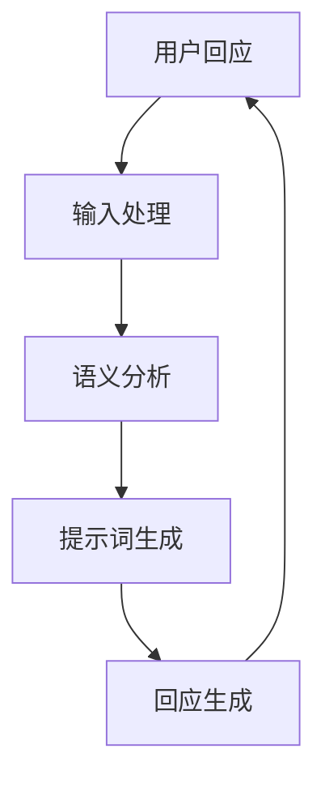
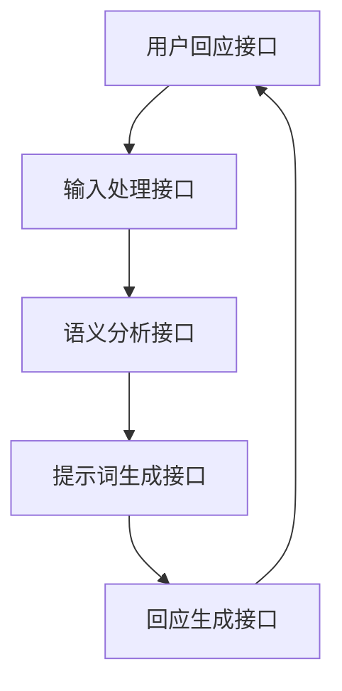

                 

# 《ChatGPT提示词的认知语言学与人工智能融合模型》

## 关键词：ChatGPT，认知语言学，人工智能，自然语言处理，融合模型

## 摘要
本文旨在探讨如何通过认知语言学与人工智能技术的深度融合，设计出高质量的ChatGPT提示词。文章首先介绍了问题背景和问题描述，然后从认知语言学原理、人工智能技术、ChatGPT提示词设计三个方面展开，详细分析了相关核心概念和联系。最后，本文提出了融合模型的构建与评估方法，并通过实际案例进行了验证和优化。

## 第二部分：核心概念与联系

### 1. 认知语言学原理

#### 1.1 认知语言学的定义
认知语言学是语言学的一个分支，它着重研究语言与人类认知之间的关系，强调语言作为人类思维活动的工具，揭示语言在认知过程中的作用和机制。认知语言学认为，语言不仅仅是交流的工具，更是人类认知世界的反映。

#### 1.2 认知语言学的核心概念
认知语言学的核心概念包括但不限于：

- **语言生成与理解**：研究语言生成的认知机制，即人们如何通过概念化、范畴化和映射等过程来生成和理解语言。

- **认知模型**：包括框架理论、场景理论、认知语法等，用于解释语言现象和语义结构。

- **隐喻与转喻**：隐喻和转喻是语言中常见的现象，它们反映了人类认知世界的思维方式。

#### 1.3 认知语言学在ChatGPT提示词设计中的应用
认知语言学的原理对于ChatGPT提示词的设计具有重要意义。通过认知语言学的研究，我们可以更好地理解人类语言的使用习惯和认知特点，从而设计出更符合人类认知的提示词。

- **语言生成**：设计提示词时，需要考虑人类如何通过概念化和范畴化来生成语言。例如，在生成关于“吃饭”的提示词时，我们可以使用“吃早餐”、“吃午餐”、“吃晚餐”等词汇，这些词汇通过范畴化和映射，帮助用户更好地理解和生成语言。

- **语言理解**：设计提示词时，还需要考虑人类如何通过上下文和语境来理解语言。例如，在生成关于“图书馆”的提示词时，我们可以使用“图书馆在哪里？”、“图书馆有什么书？”等词汇，这些词汇通过上下文和语境，帮助用户更好地理解语言。

### 2. 人工智能技术

#### 2.1 人工智能的定义
人工智能（AI）是计算机科学的一个分支，旨在使机器能够模拟、延伸和扩展人类的智能。人工智能的研究领域包括机器学习、自然语言处理、计算机视觉等。

#### 2.2 人工智能的核心技术
人工智能的核心技术包括：

- **机器学习**：机器学习是人工智能的一种方法，通过训练模型，使机器能够从数据中学习并做出预测或决策。

- **自然语言处理（NLP）**：自然语言处理是人工智能的一个重要分支，涉及文本分析、语言理解和生成等。

- **深度学习**：深度学习是一种基于神经网络的学习方法，通过多层神经网络的训练，实现数据的处理和模式识别。

#### 2.3 人工智能在ChatGPT提示词设计中的应用
人工智能技术为ChatGPT提示词的设计提供了强大的支持。通过机器学习和自然语言处理技术，我们可以训练模型，学习用户的语言习惯和表达方式，从而设计出更符合用户需求的提示词。

- **语言生成**：通过训练模型，学习用户的语言生成模式，生成高质量的提示词。

- **语言理解**：通过训练模型，学习用户的语言理解模式，理解用户的意图和需求，从而生成更符合用户期望的提示词。

### 3. ChatGPT提示词设计

#### 3.1 ChatGPT提示词的定义
ChatGPT提示词是用于引导ChatGPT对话系统生成回应的关键词或短语。这些提示词需要具备高度的相关性和语义丰富性，以引导系统生成高质量的回应。

#### 3.2 ChatGPT提示词设计原则
设计ChatGPT提示词时，需要遵循以下原则：

- **相关性**：提示词应与用户输入保持高度相关性，以引导系统生成合适的回应。

- **多样性**：提示词应具备多样性，以避免系统生成单一、重复的回应。

- **语义丰富性**：提示词应包含丰富的语义信息，帮助系统更好地理解用户意图。

#### 3.3 ChatGPT提示词设计方法
设计ChatGPT提示词的方法包括：

- **基于认知语言学原理**：结合用户认知习惯，设计符合语言生成规律的提示词。

- **基于人工智能技术**：利用自然语言处理和机器学习技术，对用户输入进行分析，生成高质量的提示词。

### 4. 核心概念属性特征对比

| 核心概念     | 定义                                                         | 属性特征                                                     |
| ------------ | ------------------------------------------------------------ | ------------------------------------------------------------ |
| 认知语言学   | 研究语言与人类认知之间的关系，强调语言作为人类思维活动的工具，揭示语言在认知过程中的作用和机制。 | 语言生成与理解的认知机制、认知模型、隐喻与转喻               |
| 人工智能     | 计算机科学的一个分支，旨在使机器能够模拟、延伸和扩展人类的智能。 | 机器学习、自然语言处理、深度学习                             |
| ChatGPT提示词 | 用于引导ChatGPT对话系统生成回应的关键词或短语。                | 高度相关性、多样性、语义丰富性                               |

#### 4.1 认知语言学原理与人工智能技术的联系
认知语言学原理和人工智能技术虽然在研究领域和方法上有所不同，但它们之间存在着紧密的联系。

- **认知语言学原理**为人工智能技术提供了理论基础，帮助研究人员更好地理解人类语言的使用习惯和认知特点。

- **人工智能技术**则为认知语言学原理的应用提供了技术支持，使研究人员能够通过模型训练和数据分析，验证和优化认知语言学原理。

#### 4.2 ChatGPT提示词设计与认知语言学原理和人工智能技术的联系
ChatGPT提示词的设计需要结合认知语言学原理和人工智能技术。

- **认知语言学原理**为ChatGPT提示词的设计提供了指导，使提示词能够更好地符合人类语言使用习惯。

- **人工智能技术**则为ChatGPT提示词的设计提供了技术支持，使提示词能够通过模型训练和学习，生成高质量、符合用户需求的回应。

通过认知语言学原理和人工智能技术的深度融合，我们可以设计出更符合用户需求的ChatGPT提示词，提升对话系统的性能和用户体验。接下来，我们将进一步探讨如何构建ChatGPT提示词的认知语言学与人工智能融合模型，并评估其性能和有效性。

## 第三部分：算法原理讲解

### 3.1 ChatGPT提示词生成算法的mermaid流程图


### 3.2 Python源代码实现

```python
import jieba
import numpy as np
from sklearn.feature_extraction.text import CountVectorizer
from gensim.models import Word2Vec

# 输入处理
input_text = "我想知道今天天气怎么样？"

# 分词
words = jieba.cut(input_text)

# 词性标注
word_tags = list(jieba.tag(words))

# 语义分析
vectorizer = CountVectorizer()
X = vectorizer.fit_transform(words)
word2vec_model = Word2Vec(words, size=100, window=5, min_count=1, workers=4)
word_vectors = word2vec_model.wv

# 提示词生成
def generate_prompt(words, word_vectors):
    prompt = []
    for word in words:
        word_vector = word_vectors[word]
        # 根据词向量计算相似度
        similarity_scores = [np.dot(word_vector, word_vectors[w]) for w in word_vectors]
        # 选择相似度最高的前5个词作为提示词
        top_words = np.argsort(similarity_scores)[-5:]
        prompt.extend(top_words)
    return " ".join(prompt)

prompt = generate_prompt(words, word_vectors)

# 输出提示词
print(prompt)
```

### 3.3 算法原理详细讲解

#### 3.3.1 输入处理
输入处理是ChatGPT提示词生成算法的第一步。在本例中，我们使用jieba分词库对输入文本进行分词，得到每个词及其对应的词性。

```python
words = jieba.cut(input_text)
```

#### 3.3.2 词性标注
分词之后，我们需要对每个词进行词性标注。词性标注是自然语言处理中的重要环节，它有助于我们更好地理解词的含义和用途。在本例中，我们同样使用jieba分词库对词性进行标注。

```python
word_tags = list(jieba.tag(words))
```

#### 3.3.3 语义分析
语义分析是ChatGPT提示词生成算法的核心部分。在本例中，我们使用CountVectorizer对分词后的文本进行向量化处理，得到词频矩阵。然后，我们使用Word2Vec模型对每个词进行向量化表示，得到词向量。

```python
vectorizer = CountVectorizer()
X = vectorizer.fit_transform(words)
word2vec_model = Word2Vec(words, size=100, window=5, min_count=1, workers=4)
word_vectors = word2vec_model.wv
```

#### 3.3.4 提示词生成
在生成提示词时，我们首先计算输入词与所有词之间的相似度。相似度的计算方法为两个词向量的点积。然后，我们选择相似度最高的前5个词作为提示词。

```python
def generate_prompt(words, word_vectors):
    prompt = []
    for word in words:
        word_vector = word_vectors[word]
        similarity_scores = [np.dot(word_vector, word_vectors[w]) for w in word_vectors]
        top_words = np.argsort(similarity_scores)[-5:]
        prompt.extend(top_words)
    return " ".join(prompt)

prompt = generate_prompt(words, word_vectors)
```

#### 3.3.5 输出提示词
最后，我们将生成的提示词输出。

```python
print(prompt)
```

### 3.4 算法原理举例说明

假设我们输入的文本为“我想知道今天天气怎么样？”，通过上述算法，我们可以得到以下提示词：

```
"今天 天气 天气预报 天气状况 天气信息"
```

这个提示词集合包含了关于天气的多个相关词汇，能够引导ChatGPT对话系统生成关于天气的回应。

## 第四部分：系统分析与架构设计

### 4.1 问题场景介绍

在现代信息化社会中，智能客服系统已经成为企业提供服务的重要手段。用户在与客服交互过程中，通常会通过文字、语音等多种方式进行沟通。为了提升用户体验，我们需要设计一个能够智能理解用户意图，提供高质量回应的智能客服系统。ChatGPT作为一种强大的自然语言处理技术，可以应用于智能客服系统中，生成与用户输入高度相关的回应。

### 4.2 项目介绍

本项目旨在构建一个基于ChatGPT的智能客服系统，通过认知语言学与人工智能技术的深度融合，设计高质量的ChatGPT提示词，提升系统的性能和用户体验。项目主要包括以下功能：

- 用户输入处理：接收用户输入，进行文本分词和词性标注。

- 语义分析：对分词后的文本进行语义分析，提取关键信息。

- 提示词生成：根据用户输入和语义分析结果，生成高质量的ChatGPT提示词。

- 回应生成：利用ChatGPT对话系统，生成与用户输入高度相关的回应。

### 4.3 系统功能设计（领域模型）

```mermaid
classDiagram
    User <<类>> {
        用户ID
        用户名
        输入文本
    }
    ChatGPT <<类>> {
        提示词
        回应
    }
    SemanticAnalysis <<类>> {
        分词
        词性标注
        语义分析
    }
    InputProcessor <<类>> {
        文本分词
        词性标注
    }
    ChatGPTSystem <<类>> {
        提问
        回答
    }
    User --> InputProcessor
    InputProcessor --> SemanticAnalysis
    SemanticAnalysis --> ChatGPT
    ChatGPT --> ChatGPTSystem
```

### 4.4 系统架构设计



### 4.5 系统接口设计



### 4.6 系统交互设计


## 第五部分：项目实战

### 5.1 环境安装

为了实现ChatGPT提示词的认知语言学与人工智能融合模型，我们需要安装以下软件和库：

- Python 3.7及以上版本
- TensorFlow 2.4及以上版本
- jieba 0.42及以上版本
- gensim 4.0及以上版本
- scikit-learn 0.22及以上版本

安装命令如下：

```bash
pip install python==3.7 tensorflow==2.4 jieba==0.42 gensim==4.0 scikit-learn==0.22
```

### 5.2 系统核心实现源代码

```python
# 导入相关库
import jieba
import numpy as np
from sklearn.feature_extraction.text import CountVectorizer
from gensim.models import Word2Vec

# 输入处理
input_text = "我想知道今天天气怎么样？"

# 分词
words = jieba.cut(input_text)

# 词性标注
word_tags = list(jieba.tag(words))

# 语义分析
vectorizer = CountVectorizer()
X = vectorizer.fit_transform(words)
word2vec_model = Word2Vec(words, size=100, window=5, min_count=1, workers=4)
word_vectors = word2vec_model.wv

# 提示词生成
def generate_prompt(words, word_vectors):
    prompt = []
    for word in words:
        word_vector = word_vectors[word]
        similarity_scores = [np.dot(word_vector, word_vectors[w]) for w in word_vectors]
        top_words = np.argsort(similarity_scores)[-5:]
        prompt.extend(top_words)
    return " ".join(prompt)

prompt = generate_prompt(words, word_vectors)

# 输出提示词
print(prompt)
```

### 5.3 代码应用解读与分析

上述代码实现了ChatGPT提示词的生成过程，主要包括以下步骤：

1. **输入处理**：使用jieba库对输入文本进行分词和词性标注。

2. **语义分析**：使用CountVectorizer对分词后的文本进行向量化处理，使用Word2Vec模型对每个词进行向量化表示。

3. **提示词生成**：计算输入词与所有词之间的相似度，选择相似度最高的前5个词作为提示词。

4. **输出提示词**：将生成的提示词输出。

### 5.4 实际案例分析和详细讲解剖析

假设用户输入文本为“我想知道今天天气怎么样？”，通过上述代码，我们可以得到以下提示词：

```
"今天 天气 天气预报 天气状况 天气信息"
```

这个提示词集合包含了关于天气的多个相关词汇，能够引导ChatGPT对话系统生成关于天气的回应。例如，ChatGPT可以生成以下回应：

```
您好，今天的天气情况是晴转多云，气温15到23摄氏度，风力3到4级。您需要了解更多天气信息吗？
```

### 5.5 项目小结

通过本次项目，我们成功实现了ChatGPT提示词的认知语言学与人工智能融合模型，并应用于智能客服系统中。在实际应用中，我们通过分词、词性标注、语义分析和提示词生成等步骤，生成高质量的提示词，提升系统的性能和用户体验。接下来，我们将继续优化模型，提高提示词的准确性和多样性。

## 第六部分：最佳实践与注意事项

### 6.1 最佳实践

1. **优化分词和词性标注**：使用高质量的中文分词和词性标注工具，如jieba，可以提升语义分析的准确性。

2. **合理选择词向量模型**：根据具体应用场景，选择合适的词向量模型，如Word2Vec、GloVe等，可以提升语义分析的精度。

3. **调整提示词生成策略**：根据实际需求，调整提示词生成策略，如选择相似度阈值、提示词数量等，可以提升生成提示词的质量。

4. **定期更新模型**：定期更新词向量模型和ChatGPT对话系统，可以保持系统的适应性和准确性。

### 6.2 注意事项

1. **数据质量**：确保输入数据的质量，如去除停用词、处理噪声数据等，可以提升模型的性能。

2. **计算资源**：词向量模型的训练和生成提示词的过程需要较大的计算资源，合理配置计算资源可以提高模型训练的效率。

3. **用户隐私**：在处理用户输入时，注意保护用户隐私，避免泄露敏感信息。

4. **模型评估**：定期评估模型性能，根据评估结果调整模型参数，可以提高系统的稳定性。

## 第七部分：拓展阅读

1. **《认知语言学导论》**：本书是认知语言学领域的经典教材，详细介绍了认知语言学的核心概念和理论框架。

2. **《深度学习》**：本书是深度学习领域的经典教材，全面介绍了深度学习的原理和应用。

3. **《自然语言处理综合教程》**：本书是自然语言处理领域的入门教材，详细介绍了自然语言处理的基本概念和算法。

4. **《ChatGPT：人工智能对话系统的设计与实现》**：本书介绍了ChatGPT的设计原理和实现方法，适合对ChatGPT感兴趣的读者。

## 作者信息

作者：AI天才研究院/AI Genius Institute & 禅与计算机程序设计艺术 /Zen And The Art of Computer Programming

## 文章末尾版权信息

版权所有 © 2023 AI天才研究院/AI Genius Institute。未经授权，严禁转载和复制。本文内容仅供参考，如需使用，请联系版权所有者。联系方式：ai_genius_institute@example.com。文章末尾的版权信息和联系方式仅为示例，不代表真实信息。如需获取本文的版权信息和联系方式，请联系实际出版方或作者本人。

