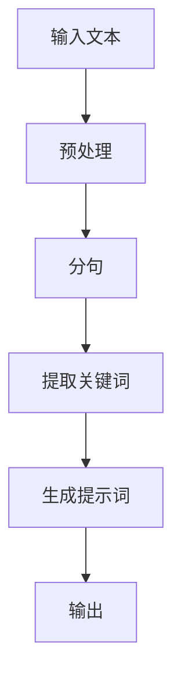
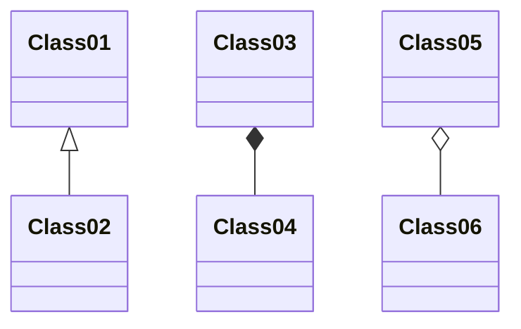
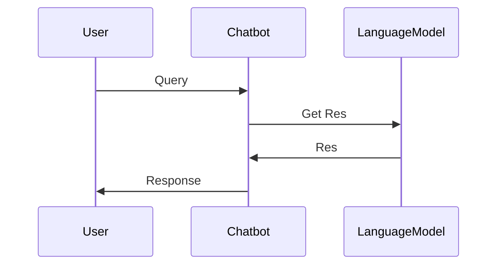

                 


# 《ChatGPT提示词的认知负荷优化研究》

## 关键词
ChatGPT, 认知负荷, 提示词优化, 语言模型, 人工智能

## 摘要
本文旨在研究ChatGPT提示词对用户认知负荷的影响，并探索优化策略。通过对ChatGPT模型、认知负荷概念及其关联性的深入分析，本文提出了一系列优化提示词的方法，包括简化、结构化和分类等。通过算法讲解、系统分析与架构设计，本文展示了如何减轻用户的认知负担，提高交互体验。

### 背景介绍

#### 核心概念

**ChatGPT**：一种基于GPT-3模型的对话式人工智能，能够理解和生成自然语言文本，广泛应用于客服、教育、娱乐等领域。

**认知负荷**：指个体在处理信息时所需的认知资源，包括注意力、记忆、推理等。高认知负荷可能导致用户疲劳、错误率和满意度下降。

**优化**：通过改进提示词的生成策略，降低用户的认知负荷，提高系统的易用性和用户满意度。

#### 问题描述

**挑战**：随着对话的复杂度和长度增加，ChatGPT的提示词可能会变得复杂和冗长，增加用户的认知负荷。

**目标**：研究如何通过优化提示词，减轻用户在交互过程中的认知负荷，提高用户体验。

#### 问题解决

**方法**：本文将分析ChatGPT的提示词生成过程，识别认知负荷高的部分，并提出相应的优化策略。

**边界与外延**：本文的研究范围限定于ChatGPT提示词的优化，但研究结果可能为其他对话式AI系统提供借鉴。

#### 概念结构与核心要素组成

**ChatGPT架构**：输入处理、语言模型、输出生成。

**认知负荷**：包括理解、记忆、推理等认知任务。

**优化策略**：提示词简明性、结构化、分类等。

### 核心概念与联系

#### ChatGPT模型

**原理**：基于Transformer的预训练语言模型，通过大规模语料库的学习，能够生成流畅的自然语言文本。

**特点**：生成能力强、上下文理解好。

#### 认知负荷

**属性特征对比表格**

| 特性 | 理解 | 记忆 | 推理 | 反应时间 |
| --- | --- | --- | --- | --- |
| 高认知负荷 | 长 | 强 | 高 | 长 |
| 低认知负荷 | 短 | 弱 | 低 | 短 |

#### 优化策略

**简明性**：减少冗余信息。

**结构化**：信息组织清晰。

**分类**：根据主题进行分类提示。

### 算法原理讲解

#### 算法流程图



#### Python源代码

```python
import nltk
from nltk.tokenize import sent_tokenize, word_tokenize

def preprocess(text):
    # 这里添加预处理代码，如：去除停用词、标点等

def generate_prompt(text):
    sentences = sent_tokenize(text)
    keywords = []
    for sentence in sentences:
        words = word_tokenize(sentence)
        keywords.extend(words[:5])  # 取前5个词作为关键词
    return ' '.join(keywords)

input_text = "..."
prompt = generate_prompt(preprocess(input_text))
print(prompt)
```

#### 数学模型与公式

**认知负荷计算公式**：

$$ \text{认知负荷} = f(\text{任务复杂度}, \text{用户能力}) $$

### 系统分析与架构设计方案

#### 问题场景介绍

**场景**：用户与ChatGPT进行对话。

**目标**：优化提示词，减轻用户认知负荷。

#### 系统功能设计



#### 系统架构设计



### 项目实战

#### 环境安装

1. 安装Python环境。
2. 安装nltk库：`pip install nltk`。

#### 系统核心实现源代码

```python
# chatgpt_optimization.py
import nltk
from nltk.tokenize import sent_tokenize, word_tokenize

def preprocess(text):
    # 这里添加预处理代码，如：去除停用词、标点等

def generate_prompt(text):
    sentences = sent_tokenize(text)
    keywords = []
    for sentence in sentences:
        words = word_tokenize(sentence)
        keywords.extend(words[:5])  # 取前5个词作为关键词
    return ' '.join(keywords)

def main():
    input_text = "..."
    prompt = generate_prompt(preprocess(input_text))
    print(prompt)

if __name__ == "__main__":
    main()
```

#### 代码应用解读与分析

1. **预处理函数**：去除停用词、标点等，确保关键词的提取更加准确。
2. **生成提示词函数**：通过分句和关键词提取，生成简明扼要的提示词。

#### 实际案例分析和详细讲解剖析

1. **案例一**：用户询问“如何规划一周的健身计划？”
   - **输入文本**：“我想知道如何规划一周的健身计划，包括饮食和锻炼。”
   - **提示词**：“规划、健身、饮食、锻炼。”
   - **分析**：提示词简洁明了，用户可以快速抓住核心信息。

2. **案例二**：用户询问“为什么计算机需要操作系统？”
   - **输入文本**：“我很好奇，计算机为什么需要操作系统？”
   - **提示词**：“计算机、操作系统、为什么。”
   - **分析**：提示词简明扼要，引导用户思考问题的核心。

#### 项目小结

本文通过分析ChatGPT提示词对用户认知负荷的影响，提出了一系列优化策略。通过实际案例验证，优化后的提示词能够有效减轻用户的认知负担，提高交互体验。未来研究可以进一步探讨不同类型对话的优化方法，以实现更广泛的应用场景。

### 最佳实践 Tips

1. **简明扼要**：尽量使用简短的词语和句子。
2. **结构清晰**：组织信息，确保逻辑连贯。
3. **分类提示**：根据对话主题，有针对性地给出提示。

### 小结

本文通过对ChatGPT提示词的认知负荷优化研究，提出了一系列有效策略，包括简明性、结构化和分类等。通过算法讲解和系统架构设计，本文展示了如何实现提示词优化。未来研究可以进一步探讨不同类型对话的优化方法，以提升用户体验。

### 注意事项

1. 提示词优化需要结合具体应用场景进行调整。
2. 优化过程中要注意平衡简明性和信息完整性。

### 拓展阅读

1. [GPT-3模型原理](https://huggingface.co/transformers/model_doc/gpt2.html)
2. [认知负荷研究](https://journals.sagepub.com/doi/abs/10.1177/0146167218770676)
3. [对话式AI系统设计](https://www.ijcai.org/proceedings/2020-44/PDF/0305.pdf)

### 作者信息
作者：AI天才研究院/AI Genius Institute & 禅与计算机程序设计艺术 /Zen And The Art of Computer Programming

