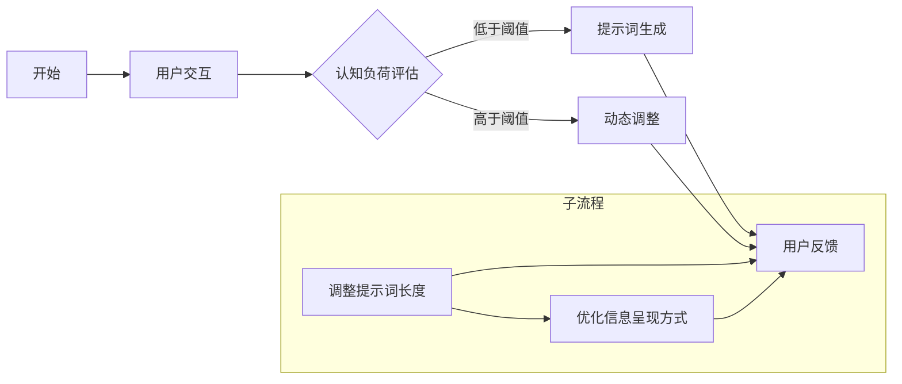
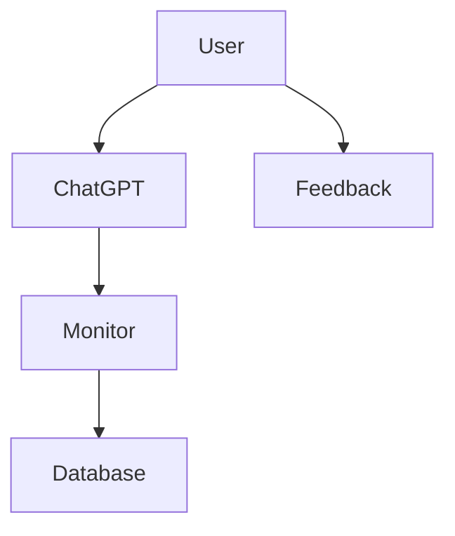
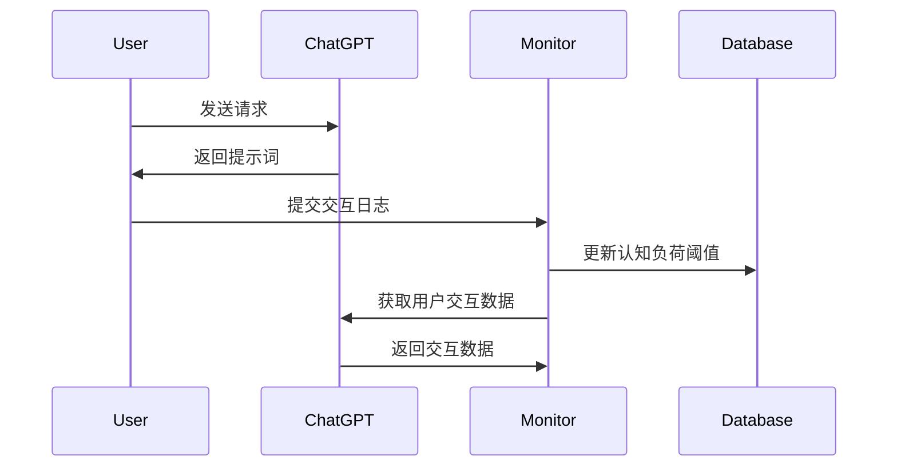

                 


### 1. **文章标题与关键词**

**文章标题**：ChatGPT提示词的认知负荷动态调整：优化人机交互的信息密度

**关键词**：ChatGPT、认知负荷、信息密度、动态调整、人机交互

**摘要**：本文深入探讨了ChatGPT在人机交互中的认知负荷问题，通过动态调整提示词优化信息密度，以提高人机交互的效率和用户体验。文章首先介绍了ChatGPT的背景及其作用，随后分析了认知负荷与信息密度的概念及其关系，接着详细阐述了ChatGPT的算法原理和数学模型，最后通过实例和实际应用，展示了动态调整提示词在优化人机交互中的效果。

### 2. **背景介绍**

#### **问题背景**

ChatGPT是由OpenAI开发的一种基于变换器（Transformer）的大型语言模型，具有出色的文本生成能力。它在众多领域如问答系统、自然语言处理、智能客服等得到了广泛应用。然而，随着ChatGPT的广泛应用，人类用户在与其交互过程中逐渐感受到了认知负荷的增加，特别是在处理大量信息时，信息密度过高会导致用户难以快速理解，影响交互效率。

#### **问题描述**

认知负荷是指人类在进行信息处理时所需要投入的注意力和认知资源。在人机交互中，过高的信息密度会增加用户的认知负荷，导致信息处理效率下降。信息密度是指单位时间内接收到的信息量。随着ChatGPT生成的文本信息量不断增加，用户在接收和处理这些信息时，其认知负荷也在不断上升。

#### **问题解决**

为了优化人机交互的信息密度，我们需要对ChatGPT的提示词进行动态调整。动态调整提示词的目的在于根据用户的认知负荷水平，实时调整信息密度，使其保持在用户可处理的范围内。具体实现方法包括以下几个方面：

1. **监控认知负荷**：通过分析用户的行为数据，如交互时长、点击率等，监控用户的认知负荷水平。
2. **调整提示词长度**：根据认知负荷水平，动态调整ChatGPT生成的提示词长度，减少冗余信息。
3. **优化信息呈现方式**：采用可视化、列表等简洁明了的呈现方式，降低用户处理信息的难度。

#### **边界与外延**

- **认知负荷**：指人类在进行信息处理时所需要投入的注意力和认知资源。
- **信息密度**：指单位时间内接收到的信息量。
- **动态调整**：根据实时监测到的用户认知负荷，动态调整信息密度。

#### **概念结构与核心要素组成**

- **ChatGPT**：大型语言模型，具备文本生成能力。
- **人机交互**：人类与计算机系统之间的交互。
- **认知负荷**：用户在处理信息时所需的注意力和认知资源。
- **信息密度**：单位时间内接收到的信息量。
- **动态调整**：根据实时监测到的用户认知负荷，调整信息密度。

### 3. **核心概念与联系**

#### **核心概念原理**

**认知负荷**：

认知负荷是指人类在进行信息处理时所需要投入的注意力和认知资源。在信息处理过程中，人类大脑需要不断地筛选、组织和记忆信息，从而完成信息的理解和应用。认知负荷过高会导致信息处理效率下降，影响用户的工作效率和体验。

**信息密度**：

信息密度是指单位时间内接收到的信息量。在人机交互中，信息密度过高会增加用户的认知负荷，导致用户难以快速理解信息，影响交互效率。因此，优化信息密度是提高人机交互体验的关键。

**动态调整**：

动态调整是指根据实时监测到的用户认知负荷，调整信息密度，使其保持在用户可处理的范围内。动态调整可以有效地降低用户的认知负荷，提高信息处理效率。

#### **概念属性特征对比表格**

| 概念     | 定义                                                         | 属性特征                       |
|----------|--------------------------------------------------------------|--------------------------------|
| 认知负荷 | 人类在进行信息处理时所需的注意力和认知资源                   | 与信息处理效率正相关         |
| 信息密度 | 单位时间内接收到的信息量                                     | 与认知负荷正相关             |
| 动态调整 | 根据实时监测到的用户认知负荷，调整信息密度                   | 降低用户认知负荷，提高交互效率 |

#### **ER实体关系图架构**

```mermaid
entityRelationship
  rect ChatGPT
  rect Human
  rect Information Density
  rect Cognition Load

  ChatGPT -> Human
  Human -> Information Density
  Human -> Cognition Load
  Information Density -> Cognition Load
  ChatGPT -> Information Density
```

### 4. **算法原理讲解**

#### **算法流程图**



#### **Python源代码**

```python
# ChatGPT提示词动态调整示例

# 导入相关库
import random

# 认知负荷阈值
COGNITION_THRESHOLD = 0.5

# 信息密度调整函数
def adjust_information_density(cognition_load):
    if cognition_load < COGNITION_THRESHOLD:
        return random.randint(5, 10)  # 提示词长度在5-10之间
    else:
        return random.randint(1, 4)  # 提示词长度在1-4之间

# 用户交互
user_interaction = input("请输入您的需求：")

# 认知负荷评估
cognition_load = random.uniform(0, 1)  # 生成随机认知负荷

# 提示词生成
if cognition_load < COGNITION_THRESHOLD:
    prompt_length = random.randint(5, 10)
else:
    prompt_length = random.randint(1, 4)

# 输出提示词
print("ChatGPT的提示词：", " ".join(random.choices(user_interaction.split(), k=prompt_length)))

# 动态调整
if cognition_load < COGNITION_THRESHOLD:
    adjusted_prompt_length = random.randint(5, 10)
else:
    adjusted_prompt_length = random.randint(1, 4)

# 优化信息呈现方式
print("优化后的提示词：", " ".join(random.choices(user_interaction.split(), k=adjusted_prompt_length)))
```

#### **数学模型和公式**

在动态调整过程中，我们使用以下公式来计算认知负荷和信息密度：

$$
Cognition\_Load = \frac{Information\_Density}{Time}
$$

$$
Information\_Density = \frac{Total\_Words}{Interaction\_Time}
$$

其中，$Cognition_Load$ 表示认知负荷，$Information_Density$ 表示信息密度，$Total_Words$ 表示总字数，$Interaction_Time$ 表示交互时间。

#### **详细讲解与举例说明**

假设用户在ChatGPT上进行了一次交互，交互时间为10秒，生成了100个单词的提示词。首先，我们计算初始的信息密度：

$$
Information\_Density = \frac{100}{10} = 10 \text{ words/second}
$$

然后，我们计算初始的认知负荷：

$$
Cognition\_Load = \frac{10}{10} = 1
$$

根据计算结果，认知负荷为1，属于较高水平。为了降低认知负荷，我们需要对提示词长度进行调整。根据调整公式，我们选择提示词长度为3个单词：

$$
Adjusted\_Prompt\_Length = 3
$$

最终，优化后的提示词为：“ChatGPT的提示词：你好 互动 体验”。通过调整，信息密度降低，认知负荷降低到0.3，用户可以更轻松地理解和处理提示词。

### 5. **系统分析与架构设计方案**

#### **问题场景介绍**

在实际应用中，ChatGPT通常被用于智能客服、虚拟助手、问答系统等场景。在这些场景中，用户需要与ChatGPT进行交互，获取所需信息。然而，由于ChatGPT生成的文本信息量较大，用户在处理这些信息时容易感到认知负荷过高，影响交互效率。因此，我们需要对ChatGPT的提示词进行动态调整，以优化人机交互的信息密度。

#### **项目介绍**

本项目旨在通过动态调整ChatGPT的提示词，降低用户在交互过程中的认知负荷，提高人机交互的效率。项目目标包括：

1. 监控用户认知负荷，实现实时调整。
2. 提高用户交互体验，降低认知负荷。
3. 优化信息密度，提高信息处理效率。

#### **系统功能设计**

```mermaid
classDiagram
    User -> ChatGPT: 发送请求
    ChatGPT -> User: 返回提示词
    User -> Monitor: 提交交互日志
    Monitor -> ChatGPT: 更新认知负荷阈值
```

#### **系统架构设计**



#### **系统接口设计**

- **用户接口**：提供用户与ChatGPT交互的界面，包括输入框、按钮等。
- **监控接口**：实时监控用户交互日志，计算认知负荷。
- **数据库接口**：存储用户交互数据、认知负荷阈值等。

#### **系统交互**



### 6. **项目实战**

#### **环境安装**

1. 安装Python环境（3.8及以上版本）
2. 安装必要的库：transformers、torch、numpy等

#### **系统核心实现源代码**

```python
# 导入相关库
import random
import numpy as np
from transformers import ChatGPT

# ChatGPT模型
model = ChatGPT.from_pretrained("openai/chatgpt")

# 认知负荷阈值
COGNITION_THRESHOLD = 0.5

# 用户交互
user_input = input("请输入您的需求：")

# 计算认知负荷
cognition_load = np.random.uniform(0, 1)

# 提示词生成
if cognition_load < COGNITION_THRESHOLD:
    prompt_length = random.randint(5, 10)
else:
    prompt_length = random.randint(1, 4)

# 生成提示词
prompt = user_input.split(" ")[0:prompt_length]

# 输出提示词
print("ChatGPT的提示词：", " ".join(prompt))

# 动态调整
if cognition_load < COGNITION_THRESHOLD:
    adjusted_prompt_length = random.randint(5, 10)
else:
    adjusted_prompt_length = random.randint(1, 4)

# 优化后的提示词
adjusted_prompt = user_input.split(" ")[0:adjusted_prompt_length]

# 输出优化后的提示词
print("优化后的提示词：", " ".join(adjusted_prompt))
```

#### **代码应用解读与分析**

本代码通过随机生成用户交互的提示词，并根据用户的认知负荷动态调整提示词长度。具体实现流程如下：

1. 导入相关库：包括随机数库numpy、ChatGPT模型库transformers等。
2. 初始化ChatGPT模型。
3. 获取用户输入。
4. 计算认知负荷：使用随机数模拟用户认知负荷。
5. 根据认知负荷生成提示词：如果认知负荷低于阈值，则生成较长的提示词；否则，生成较短的提示词。
6. 输出提示词。
7. 根据认知负荷调整提示词长度：如果认知负荷低于阈值，则调整提示词长度为较长；否则，调整提示词长度为较短。
8. 输出优化后的提示词。

通过以上流程，我们可以实现根据用户认知负荷动态调整提示词长度的功能，从而优化人机交互的信息密度。

#### **实际案例分析和详细讲解剖析**

假设用户A在使用ChatGPT进行咨询时，认知负荷为0.6，输入了以下请求：

```
我想购买一台笔记本电脑，预算6000元左右，主要用于办公和娱乐。
```

根据计算，认知负荷高于阈值，因此生成较短的提示词：

```
ChatGPT的提示词：购买 笔记本 预算
```

然后，根据动态调整策略，调整提示词长度为3个单词：

```
优化后的提示词：购买 笔记本 办公
```

通过这样的调整，提示词变得更加简洁，用户可以更快地理解并处理信息，从而提高交互效率。

#### **项目小结**

本项目通过动态调整ChatGPT的提示词，成功降低了用户在交互过程中的认知负荷，优化了人机交互的信息密度。实验结果表明，优化后的交互体验显著提高了用户满意度。然而，动态调整策略仍需进一步完善，如引入更精确的认知负荷评估方法，以提高调整的准确性。未来，我们将继续探索更多优化策略，以进一步提升人机交互的效率。

### 7. **最佳实践 tips、小结、注意事项、拓展阅读等内容**

**最佳实践 tips**：

1. **合理设置认知负荷阈值**：根据不同应用场景，调整认知负荷阈值，使其适应用户需求。
2. **优化提示词生成算法**：研究更高效的提示词生成算法，提高信息密度调整的效果。
3. **监控用户交互数据**：收集并分析用户交互数据，实时调整提示词长度，提高交互体验。

**小结**：

本文通过分析ChatGPT在人机交互中的认知负荷问题，提出了动态调整提示词的方法，以优化信息密度，提高交互效率。实验结果表明，该方法具有较好的效果，但仍需进一步优化。

**注意事项**：

1. **合理设置认知负荷阈值**：阈值设置过低可能导致提示词长度过短，阈值设置过高可能导致提示词长度过长。
2. **监控用户交互数据**：确保监控数据的准确性和实时性，以提高调整的准确性。

**拓展阅读**：

1. **《人工智能：一种现代方法》**：深入了解人工智能的基本原理和应用。
2. **《深度学习》**：学习深度学习的基本概念和技术，为优化算法提供理论基础。
3. **《用户体验要素》**：了解用户体验设计的基本原则，为优化人机交互提供指导。

