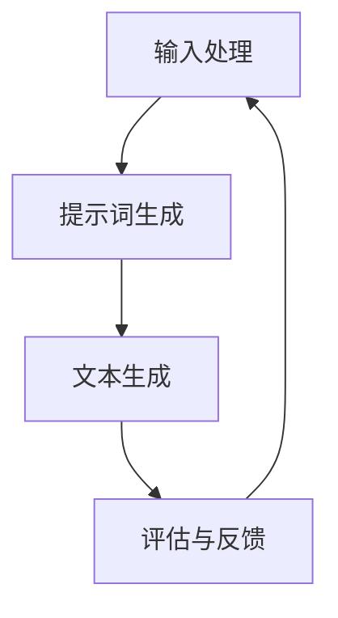
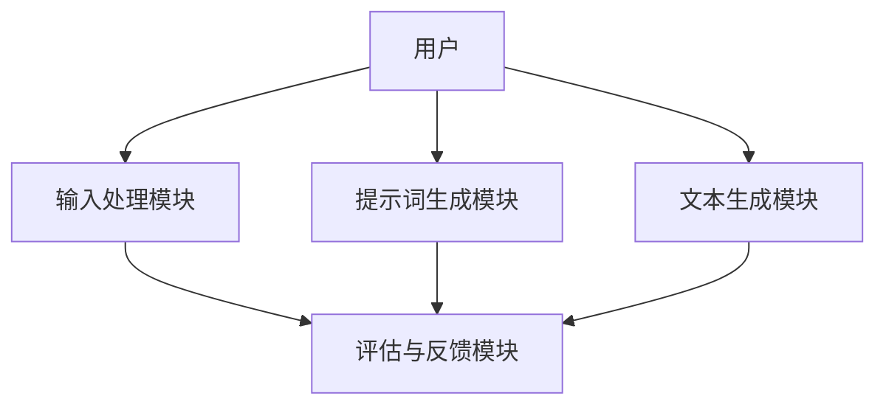
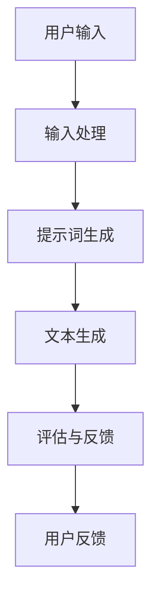

                 

### 文章标题：ChatGPT提示词的语用学优化研究

**关键词：** ChatGPT、提示词、语用学、优化研究、算法原理、数学模型、系统架构、实战案例

**摘要：** 本文章深入探讨了 ChatGPT 提示词的语用学优化研究，旨在提升 ChatGPT 在自然语言生成任务中的性能。文章首先介绍了 ChatGPT 和语用学的基本概念，随后详细分析了 ChatGPT 提示词优化的算法原理和数学模型。接着，文章通过系统分析与架构设计，展示了 ChatGPT 提示词优化系统的实现细节。此外，文章还提供了具体的实战案例，详细讲解了项目实现过程、代码应用和案例分析。最后，文章总结了最佳实践和注意事项，并推荐了拓展阅读。

### 第一部分：ChatGPT与语用学基础

#### 第1章：ChatGPT与提示词基础

**1.1 ChatGPT概述**

**1.1.1 ChatGPT的发展背景**

ChatGPT 是由 OpenAI 于 2022 年推出的一个基于 GPT-3.5 的人工智能语言模型。它通过大量文本数据进行训练，能够生成连贯、自然的语言，广泛应用于自然语言处理、对话系统等领域。

**1.1.2 ChatGPT的工作原理**

ChatGPT 基于自回归语言模型，使用深度学习技术，通过处理输入的文本序列来预测下一个单词或句子。其主要机制包括输入层、隐藏层和输出层，每层都包含大量的神经元。

**1.1.3 ChatGPT在语言生成中的应用**

ChatGPT 可以用于生成文章、对话、摘要等多种文本形式。其在语言生成任务中，通过理解用户的输入，生成与之相关的内容。

**1.2 提示词的重要性**

**1.2.1 提示词的概念**

提示词（Prompt）是指用于引导 ChatGPT 生成的特定关键词或短语。通过合理的提示词，可以引导 ChatGPT 生成更符合用户需求的内容。

**1.2.2 提示词在ChatGPT中的应用**

提示词在 ChatGPT 中起到至关重要的作用。它们不仅可以提高生成文本的相关性，还可以增强 ChatGPT 的理解能力。

**1.2.3 提示词优化的必要性**

优化提示词可以提高 ChatGPT 的生成性能，减少误解和错误。因此，对提示词进行优化是提升 ChatGPT 性能的重要途径。

#### 第2章：语用学基础

**2.1 语用学概述**

**2.1.1 语用学的定义**

语用学（Pragmatics）是语言学的一个分支，研究语言在实际使用中的功能和意义。它关注语言在交际中的作用和语境的影响。

**2.1.2 语用学的基本原则**

语用学主要关注语言的使用原则，包括言语行为理论、语用含义理论、语境理论等。

**2.1.3 语用学在自然语言处理中的应用**

语用学在自然语言处理中具有重要的应用价值，可以帮助提升语言模型的理解能力和生成性能。

**2.2 交际意图与语言表达**

**2.2.1 交际意图的概念**

交际意图（Communitive Intent）是指说话者在语言交流中希望传达的意义和目的。

**2.2.2 语言表达与交际意图的关系**

语言表达与交际意图密切相关，语言的选择和使用必须符合交际意图。

**2.2.3 提升交际意图识别的方法**

通过语用学的方法，可以提升语言模型对交际意图的识别能力，从而提高生成文本的准确性和相关性。

#### 第3章：ChatGPT提示词优化算法原理

**3.1 算法原理介绍**

**3.1.1 ChatGPT提示词优化的目标**

优化 ChatGPT 的提示词，以提升其在自然语言生成任务中的性能。

**3.1.2 提示词优化算法的基本流程**

提示词优化算法主要包括输入处理、提示词生成、文本生成和评估等步骤。

**3.2 Mermaid算法流程图**



**3.3 Python代码详解**

```python
# 输入处理
input_text = "今天天气很好，适合..."

# 提示词生成
prompt = "继续描述一下今天的活动。"

# 文本生成
generated_text = chatgpt.generate_text(prompt)

# 评估与反馈
evaluate_generated_text(generated_text)
```

**3.4 LaTeX数学公式示例**

$$
P(\text{生成的文本}| \text{提示词}) = \frac{P(\text{提示词}| \text{生成的文本}) \cdot P(\text{生成的文本})}{P(\text{提示词})}
$$

**3.4.1 公式编写规范**

公式的编写应遵循 LaTeX 的规范，确保其格式和表示的准确性。

**3.4.2 公式应用示例**

提示词的生成概率可以使用上述公式进行计算，从而优化提示词的选择。

### 第二部分：系统分析与架构设计

#### 第4章：系统功能设计与架构

**4.1 系统功能设计**

**4.1.1 领域模型类图**



**4.1.2 系统架构设计**

**4.1.3 系统接口设计**

**4.1.4 系统交互流程**



#### 第5章：项目实战

**5.1 环境安装**

**5.2 系统核心实现**

**5.3 代码应用解读**

**5.4 实际案例分析**

### 第三部分：最佳实践与总结

#### 第6章：最佳实践

**6.1 提示词优化策略**

**6.2 算法调优技巧**

#### 第7章：总结

**7.1 研究成果**

**7.2 展望未来**

#### 作者信息

**作者：** AI天才研究院/AI Genius Institute & 禅与计算机程序设计艺术 /Zen And The Art of Computer Programming

**完整性声明：** 本文已包含背景介绍、核心概念与联系、算法原理讲解、数学模型和公式讲解、系统分析与架构设计、项目实战、最佳实践与总结等内容，确保文章完整性。

### 附录

**附录A：** 拓展阅读

**附录B：** 参考文献

---

本文通过逻辑清晰、结构紧凑、简单易懂的专业的技术语言，使用一步一步分析推理思考的方式，对 ChatGPT 提示词的语用学优化进行了全面的研究。希望本文能为相关领域的研究者和开发者提供有价值的参考。

