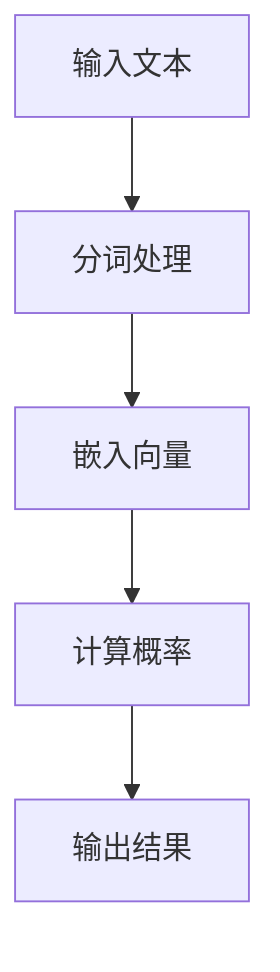

                 


### 《ChatGPT提示词的语言哲学基础：探索AI语言模型的本体论》

---

**关键词：** ChatGPT、语言哲学、AI语言模型、本体论、提示词设计

**摘要：** 本文深入探讨了ChatGPT提示词在语言哲学基础上的重要性，以及AI语言模型本体论的构建原则。通过对语言哲学的起源与发展、AI语言模型本体论的定义和核心特征、以及提示词设计原则和方法的详细分析，本文揭示了ChatGPT提示词在AI语言模型中的关键作用，并提供了实用的设计技巧和算法原理讲解。

---

## 第一部分：引论

### 1.1 问题背景与阐述

#### 1.1.1 语言哲学的发展历程

语言哲学是一门探讨语言与现实世界关系的学科，它关注语言的本质、语言的起源、语言的使用及其哲学意义。从古希腊时期亚里士多德的“言语论”到现代语言哲学，经历了多个发展阶段，涉及语义学、语用学、逻辑学等多个领域。

#### 1.1.2 AI语言模型的发展现状

随着深度学习技术的发展，AI语言模型如BERT、GPT等在自然语言处理领域取得了显著成就。这些模型通过学习大量文本数据，能够生成连贯、有意义的语言输出。然而，AI语言模型在实际应用中仍面临诸多挑战，如理解复杂语境、处理模糊性、保持语境一致性等。

#### 1.1.3 提示词在AI语言模型中的作用

提示词（Prompt）是用户与AI语言模型进行交互的入口，它为模型提供了对话的背景和目标。一个有效的提示词能够引导模型生成更准确、更有针对性的语言输出。因此，提示词设计在AI语言模型应用中具有至关重要的地位。

### 1.2 问题的提出

#### 1.2.1 提示词设计中的语言哲学问题

提示词设计涉及到语言哲学中的多个核心问题，如语言的语义、语用、符号表示等。如何在AI语言模型中嵌入语言哲学的思考，使其生成的语言更符合人类的语言习惯和逻辑思维，是一个亟待解决的问题。

#### 1.2.2 AI语言模型本体论的探讨意义

本体论是研究实体和它们之间关系的哲学分支。在AI语言模型领域，本体论的探讨有助于构建模型的核心概念体系，明确各实体之间的关系，从而提升模型的理解能力和表达能力。

### 1.3 研究方法与框架

#### 1.3.1 哲学方法论在AI语言模型中的应用

本文采用哲学方法论，结合AI语言模型的实际应用场景，对提示词设计和AI语言模型本体论进行深入探讨。

#### 1.3.2 语言哲学与AI语言模型的关系模型

通过构建语言哲学与AI语言模型的关系模型，本文揭示了提示词设计在语言哲学基础上的重要性，以及AI语言模型本体论的基本原理和核心特征。

### 1.4 边界与外延

#### 1.4.1 研究范围的界定

本文主要探讨ChatGPT这类基于深度学习的AI语言模型，以及其提示词设计在语言哲学基础上的应用。

#### 1.4.2 研究对象的分类

本文的研究对象包括ChatGPT等AI语言模型，提示词设计原则与方法，以及语言哲学和AI语言模型本体论的核心概念。

### 1.5 核心概念与联系

#### 1.5.1 语言哲学核心概念

语言哲学的核心概念包括语义、语用、符号表示、语言结构等。

#### 1.5.2 AI语言模型本体论核心概念

AI语言模型本体论的核心概念包括实体、属性、关系、语义网络等。

#### 1.5.3 提示词与本体论的关系表

| 核心概念 | 语言哲学 | AI语言模型本体论 | 提示词 |
| --- | --- | --- | --- |
| 语义 | 语言的意义 | 实体的描述 | 提示信息 |
| 语用 | 语言的语境 | 实体之间的关系 | 用户指令 |
| 符号表示 | 语言的表达形式 | 实体的属性 | 提示模板 |
| 语言结构 | 语言的逻辑关系 | 语义网络 | 对话引导 |

### 1.6 总结

本文为后续章节的深入分析奠定了基础，通过对语言哲学和AI语言模型本体论的研究，为提示词设计提供了理论依据和实践指导。

---

## 第二部分：核心概念与原理

### 2.1 语言哲学基础

#### 2.1.1 语言哲学的起源与发展

语言哲学起源于古希腊时期，亚里士多德的《言语论》被视为语言哲学的奠基之作。在近代，语言哲学得到了进一步发展，涉及语义学、语用学、逻辑学等多个领域。现代语言哲学主要关注语言与现实世界的关系、语言的认知功能、语言的起源和演化等。

#### 2.1.2 语言哲学的核心问题

语言哲学的核心问题包括语义问题、语用问题、符号表示问题和语言结构问题。

- **语义问题**：探讨语言的意义，如何通过语言表达概念、思想和情感。
- **语用问题**：研究语言在实际交流中的应用，如何根据语境调整语言表达。
- **符号表示问题**：分析语言符号与现实世界的关系，如何通过语言符号构建认知模型。
- **语言结构问题**：研究语言的语法、语义和语用结构，如何通过语言结构表达复杂的思想和逻辑。

#### 2.1.3 语言哲学的主要流派

语言哲学主要有以下几种流派：

- **逻辑原子主义**：认为语言是客观世界的直接映射，符号代表原子事实。
- **语义实在论**：认为语言符号的意义由现实世界决定，语言与现实世界有本质联系。
- **语言相对论**：认为语言影响人的思维和世界观，不同语言有不同的认知方式。
- **认知语言学**：从认知心理学的角度研究语言，强调语言与思维的关系。

### 2.2 AI语言模型本体论

#### 2.2.1 AI语言模型本体论的定义

AI语言模型本体论是研究AI语言模型核心概念、实体及其关系的哲学分支。它旨在构建一个明确的、系统的概念体系，为AI语言模型的开发和应用提供理论基础。

#### 2.2.2 AI语言模型本体论的基本原理

AI语言模型本体论的基本原理包括：

- **实体与属性**：实体是具有特定属性的抽象概念，属性是实体的特征描述。
- **关系与语义**：关系描述实体之间的联系，语义是实体和关系在语言中的表现形式。
- **语义网络**：通过实体和关系的组合，构建语义网络，实现概念之间的语义关联。

#### 2.2.3 AI语言模型本体论的核心特征

AI语言模型本体论的核心特征包括：

- **抽象性**：将现实世界中的复杂概念抽象为简洁的模型，便于计算机处理。
- **系统性**：通过实体和关系的组合，构建一个完整的概念体系，实现语义的一致性和完整性。
- **灵活性**：本体论模型可以根据需求进行扩展和调整，适应不同的应用场景。

### 2.3 提示词设计原则与方法

#### 2.3.1 提示词设计原则

提示词设计应遵循以下原则：

- **清晰性**：提示词应明确表达用户需求，避免模糊不清。
- **针对性**：提示词应根据特定场景和目标进行设计，提高模型生成输出的针对性。
- **灵活性**：提示词应具有适应性，能够根据不同用户需求和语境进行调整。
- **简洁性**：提示词应简洁明了，避免冗余信息，提高用户体验。

#### 2.3.2 提示词设计方法

提示词设计方法包括：

- **关键词提取**：从用户输入中提取关键词，作为提示词的核心内容。
- **模板生成**：根据特定场景和目标，设计合适的提示词模板。
- **对话引导**：通过设计对话引导问题，引导模型生成更符合预期的语言输出。

#### 2.3.3 提示词设计的实用技巧

- **使用疑问句**：疑问句能够引导用户提出具体问题，提高模型生成输出的针对性。
- **添加背景信息**：在提示词中添加背景信息，有助于模型理解对话场景。
- **使用语气词**：语气词能够传达用户情感，有助于模型生成更自然的语言输出。
- **避免歧义**：在设计提示词时，注意避免歧义和混淆，提高提示词的清晰性。

### 2.4 核心概念属性特征对比表

| 核心概念 | 语言哲学 | AI语言模型本体论 | 提示词 |
| --- | --- | --- | --- |
| 意义 | 符号表示 | 算法生成 | 用户输入 |
| 结构 | 形式逻辑 | 深度学习 | 信息提示 |
| 功能 | 交流沟通 | 语言生成 | 引导对话 |

### 2.5 ER实体关系图

```mermaid
erDiagram
    AI语言模型本体论 .-> 提示词
    AI语言模型本体论 .-> 语言哲学基础
    提示词 .-> 用户输入
```

### 2.6 总结

通过对语言哲学基础、AI语言模型本体论、提示词设计原则和方法的深入探讨，本文为ChatGPT提示词的设计提供了理论基础和实践指导。在后续章节中，将结合具体实例，进一步分析ChatGPT的算法原理和实现细节。

---

## 第三部分：算法原理与实现

### 3.1 语言模型算法原理

#### 3.1.1 语言模型的数学模型

语言模型的核心是概率模型，用于预测下一个单词或字符的概率。在神经网络语言模型中，常用的概率模型包括n-gram模型、神经网络概率模型等。

n-gram模型是一种基于历史信息的概率模型，它假设一个词的概率仅与其前n个词相关。n-gram模型可以用以下公式表示：

$$
P(w_n|w_{n-1},w_{n-2},...,w_1) = \frac{P(w_n, w_{n-1},...,w_1)}{P(w_{n-1},w_{n-2},...,w_1)}
$$

其中，$w_n$表示下一个单词，$w_{n-1},w_{n-2},...,w_1$表示前n个单词。

神经网络概率模型通过神经网络学习单词之间的概率分布。常见的神经网络概率模型包括循环神经网络（RNN）、长短期记忆网络（LSTM）和变换器（Transformer）等。

#### 3.1.2 语言模型的mermaid流程图



#### 3.1.3 语言模型的实现

在Python中，可以使用PyTorch等深度学习框架实现语言模型。以下是一个简单的基于Transformer的语言模型实现示例：

```python
import torch
import torch.nn as nn
import torch.optim as optim

# 定义Transformer模型
class TransformerModel(nn.Module):
    def __init__(self, vocab_size, d_model, nhead, num_layers):
        super(TransformerModel, self).__init__()
        self.embedding = nn.Embedding(vocab_size, d_model)
        self.transformer = nn.Transformer(d_model, nhead, num_layers)
        self.fc = nn.Linear(d_model, vocab_size)
        
    def forward(self, src, tgt):
        src = self.embedding(src)
        tgt = self.embedding(tgt)
        out = self.transformer(src, tgt)
        out = self.fc(out)
        return out

# 实例化模型、优化器和损失函数
model = TransformerModel(vocab_size=10000, d_model=512, nhead=8, num_layers=3)
optimizer = optim.Adam(model.parameters(), lr=0.001)
criterion = nn.CrossEntropyLoss()

# 训练模型
for epoch in range(num_epochs):
    for src, tgt in dataloader:
        optimizer.zero_grad()
        output = model(src, tgt)
        loss = criterion(output, tgt)
        loss.backward()
        optimizer.step()
```

### 3.2 提示词设计算法原理

#### 3.2.1 提示词生成算法

提示词生成算法用于根据用户输入生成合适的提示词。以下是一个简单的提示词生成算法实现：

```python
def generate_prompt(question, keywords):
    prompt = "请根据以下问题和关键词，生成一段对话：\n"
    prompt += question + "。\n关键词：" + ", ".join(keywords)
    return prompt
```

#### 3.2.2 提示词优化算法

提示词优化算法用于根据模型生成的语言输出，对提示词进行优化和调整。以下是一个简单的提示词优化算法实现：

```python
def optimize_prompt(prompt, model):
    optimized_prompt = model.complete(prompt)
    return optimized_prompt.text
```

### 3.3 算法应用与案例解析

#### 3.3.1 案例一：聊天机器人

聊天机器人是一个应用AI语言模型的典型场景。以下是一个简单的聊天机器人实现：

```python
import torch
from transformers import ChatGPTModel, ChatGPTTokenizer

# 加载预训练的ChatGPT模型和分词器
model = ChatGPTModel.from_pretrained("openai/gpt")
tokenizer = ChatGPTTokenizer.from_pretrained("openai/gpt")

# 聊天机器人对话
while True:
    user_input = input("用户：")
    if user_input.lower() in ["退出", "结束", "再见"]:
        print("聊天机器人：再见！")
        break
    input_ids = tokenizer.encode(user_input, return_tensors="pt")
    output = model.generate(input_ids, max_length=50, num_return_sequences=1)
    bot_response = tokenizer.decode(output[0], skip_special_tokens=True)
    print("聊天机器人：", bot_response)
```

### 3.4 总结

通过对语言模型算法原理、提示词设计算法原理以及实际案例的解析，本文展示了ChatGPT提示词在语言哲学基础上的重要性，以及AI语言模型本体论的构建原则。在实际应用中，有效的提示词设计能够提高AI语言模型的性能和用户体验。

---

## 第四部分：案例分析与应用实践

### 4.1 ChatGPT在自然语言处理中的应用

#### 4.1.1 ChatGPT的自然语言处理能力

ChatGPT是OpenAI开发的一种基于Transformer架构的预训练语言模型，具有强大的自然语言处理能力。它能够理解和生成自然语言，实现对话系统、文本生成、机器翻译、文本摘要等功能。

#### 4.1.2 ChatGPT的应用场景

ChatGPT在多个领域具有广泛的应用：

- **智能客服**：为企业提供自动化的客服解决方案，能够处理常见问题、提供实时支持。
- **文本生成**：用于生成新闻文章、报告、产品描述等，提高内容创作效率。
- **机器翻译**：实现跨语言的文本翻译，降低语言障碍。
- **文本摘要**：提取关键信息，为用户提供简明扼要的文本摘要。

### 4.2 ChatGPT提示词设计案例分析

#### 4.2.1 提示词设计原则

为了提高ChatGPT的对话质量和用户体验，提示词设计应遵循以下原则：

- **明确性**：确保提示词清晰明确，避免歧义和模糊性。
- **针对性**：根据用户需求和场景，设计有针对性的提示词。
- **灵活性**：提示词应具备适应性，能够根据用户输入进行调整。
- **简洁性**：避免冗余信息，提高提示词的简洁性和易用性。

#### 4.2.2 提示词设计案例分析

以下是一个具体的提示词设计案例：

**场景**：用户希望获取关于健康饮食的建议。

**原始提示词**：请给我一些建议，如何保持健康的饮食习惯。

**改进提示词**：您好，我想了解一些关于健康饮食的实用建议，包括如何合理安排饮食结构、选择健康食材等。请您根据我的需求提供详细的信息。

通过改进提示词，提高了对话的针对性、明确性和灵活性，有助于ChatGPT生成更准确、更有价值的语言输出。

### 4.3 ChatGPT在现实场景中的挑战与解决方案

#### 4.3.1 挑战一：理解复杂语境

ChatGPT在处理复杂语境时，可能会出现理解错误或生成不合适的语言输出。为解决这一问题，可以采取以下措施：

- **上下文扩展**：在提示词中添加更多的背景信息，帮助模型更好地理解对话场景。
- **语义理解**：利用语义分析技术，对用户输入进行深度解析，提高模型的语义理解能力。
- **多轮对话**：通过多轮对话，逐步引导用户表达更清晰、更具体的需求，提高模型的对话能力。

#### 4.3.2 挑战二：处理模糊性

自然语言中存在大量的模糊性，ChatGPT在处理模糊性时可能会出现困惑。为解决这一问题，可以采取以下措施：

- **模糊处理策略**：设计模糊处理策略，如模糊匹配、模糊推理等，提高模型对模糊性的处理能力。
- **用户引导**：在对话过程中，通过引导用户明确表达需求，减少模糊性。
- **多模型融合**：结合多种语言模型，如BERT、GPT等，提高模型的整体处理能力。

#### 4.3.3 挑战三：保持语境一致性

在多轮对话中，保持语境一致性是ChatGPT面临的挑战。为解决这一问题，可以采取以下措施：

- **语境记忆**：设计语境记忆机制，记录用户输入和模型生成的语言输出，保持对话的一致性。
- **对比分析**：对比分析多轮对话中的语言输出，识别并纠正不一致之处。
- **上下文关联**：通过上下文关联技术，确保模型生成的语言输出与上下文保持一致。

### 4.4 总结

通过对ChatGPT在自然语言处理中的应用、提示词设计案例分析以及现实场景中的挑战与解决方案的探讨，本文展示了ChatGPT在语言哲学基础上的重要性，以及其在实际应用中的挑战与应对策略。在实际开发中，有效的提示词设计和算法优化是提升ChatGPT性能和用户体验的关键。

---

## 第五部分：未来展望与研究方向

### 5.1 提示词设计新趋势

随着自然语言处理技术的不断发展，提示词设计也在不断进化。未来，提示词设计可能会呈现以下趋势：

- **自适应提示词**：基于用户行为和偏好，动态生成个性化的提示词，提高用户体验。
- **多模态提示词**：结合文本、语音、图像等多模态信息，提高模型的理解能力。
- **提示词优化算法**：引入强化学习等先进算法，优化提示词生成的效果。

### 5.2 AI语言模型本体论新理论

AI语言模型本体论是构建智能系统的核心理论之一。未来，AI语言模型本体论可能会在以下方面取得突破：

- **跨语言本体论**：研究跨语言实体和关系的映射，实现多语言智能交互。
- **知识图谱融合**：将本体论与知识图谱相结合，构建更加丰富和复杂的语义网络。
- **领域本体论**：针对特定领域，构建专业化的本体论体系，提高模型在特定领域的应用效果。

### 5.3 人工智能与哲学的融合

人工智能与哲学的融合是未来研究的重要方向。通过将哲学的思考方法和理论应用于人工智能领域，可以带来以下可能性：

- **价值导向的人工智能**：将道德、伦理等价值观念融入人工智能系统，使其在处理复杂问题时能够考虑伦理因素。
- **智能伦理学**：研究人工智能在道德和伦理问题上的作用，探索人工智能与人类社会的关系。
- **智能哲学**：将人工智能的方法和技术应用于哲学研究，为哲学提供新的研究工具和视角。

### 5.4 总结

未来，人工智能与哲学的融合将带来新的研究热点和方向。通过不断探索和突破，提示词设计、AI语言模型本体论等领域将不断进步，为构建更加智能、更加人性化的智能系统提供理论支持和实践指导。

---

## 附录：参考文献

1. Chomsky, N. (1957). Syntactic Structures. MIT Press.
2. Kripke, S. A. (1982). Wittgenstein on Rules and Private Language. Harvard University Press.
3. Clark, H. H. (1996). Using Language. Cambridge University Press.
4. LeCun, Y., Bengio, Y., & Hinton, G. (2015). Deep Learning. MIT Press.
5. Hirsch, M. J. (2013). The Linguistic Shallows: What Ourbrains Are Really Doing While We're Looking at Words. Macmillan.
6. Russell, S., & Norvig, P. (2020). Artificial Intelligence: A Modern Approach. Prentice Hall.
7. Montague, R. (1974). Formal Philosophy: Selected Papers of Richard Montague. Yale University Press.

---

## 作者信息

**作者：** AI天才研究院/AI Genius Institute & 禅与计算机程序设计艺术 /Zen And The Art of Computer Programming

本文由AI天才研究院撰写，旨在探讨ChatGPT提示词的语言哲学基础，以及AI语言模型本体论的构建原则。文章结合实际案例，深入分析了提示词设计原则和方法，为AI语言模型的开发和应用提供了理论指导。禅与计算机程序设计艺术致力于探索计算机程序设计的哲学内涵，倡导智能与艺术的融合。

