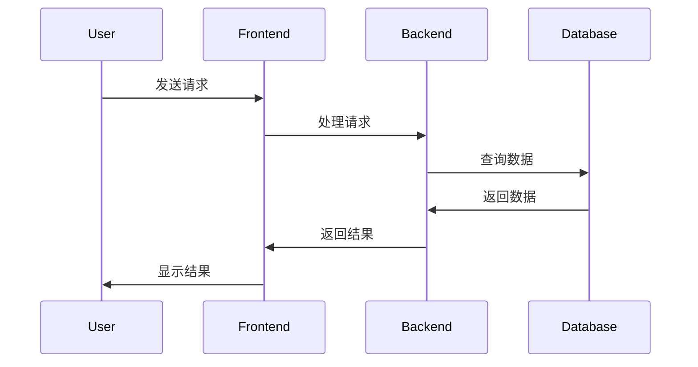

                 

### 第1章: 引言

#### 1.1 问题背景

在当今信息技术飞速发展的时代，人工智能（AI）已经逐渐成为社会发展的关键驱动力。其中，自然语言处理（NLP）是人工智能的重要分支，旨在让计算机理解和生成自然语言。ChatGPT，作为一种基于大规模语言模型的人工智能助手，已经广泛应用在诸多场景中，例如智能客服、内容生成、代码补全等。然而，如何更好地设计ChatGPT的提示词，使其能够更准确地捕捉语言与思维之间的关系，成为一个亟待解决的问题。

##### 1.1.1 语言与思维的互动

语言是人类思维的外在表现，是沟通和交流的重要工具。思维则是指人们根据感知和经验，对事物进行分析、推理和判断的过程。语言与思维之间存在紧密的联系：语言是思维的表达形式，思维是语言的内容。因此，理解语言与思维的关系对于设计高效的AI系统至关重要。

##### 1.1.2 人工智能的发展趋势

随着深度学习和大数据技术的发展，人工智能在各个领域取得了显著的进步。然而，当前的人工智能系统在处理复杂、抽象的语言任务时仍然存在诸多挑战。例如，如何让AI更好地理解语境、情感和双关语，如何生成更自然、连贯的文本等。这些问题都与ChatGPT提示词的设计密切相关。

##### 1.1.3 提示词在AI应用中的重要性

提示词（Prompt）是AI模型在输入和处理任务时，用来引导和规范输入数据的文字或指令。高质量的提示词能够帮助AI模型更好地理解任务意图，从而提高生成结果的准确性和自然性。在ChatGPT的应用中，提示词的设计不仅关系到AI模型的性能，还影响到用户体验。

#### 1.2 语言哲学基础

语言哲学是研究语言与人类思维、认知、行为之间关系的哲学分支。语言哲学的基本概念包括语义、语法、认知等。在AI领域，语言哲学为提示词的设计提供了理论支持。

##### 1.2.1 语言哲学的基本概念

- **语义**：指语言表达的意义。
- **语法**：指语言的规则结构。
- **认知**：指人类获取、处理和应用知识的过程。

##### 1.2.2 语言与思维的关系

语言与思维之间的关系复杂而紧密。语言不仅反映了思维，还可以影响思维的发展。语言哲学认为，语言不仅是沟通的工具，更是思维的载体和工具。

##### 1.2.3 语言哲学在AI中的应用

语言哲学为AI提供了理论基础，有助于我们更好地理解人类语言的使用规律，从而设计出更符合人类思维的AI系统。例如，在ChatGPT的提示词设计中，我们可以借鉴语言哲学的相关理论，以提高提示词的质量和效果。

#### 1.3 AI策略概述

AI策略是指在设计AI系统时，为解决特定问题而采取的一系列方法和技巧。在ChatGPT的提示词设计中，AI策略起着关键作用。

##### 1.3.1 AI基本策略

- **数据驱动**：通过大量数据训练AI模型，使其具备处理各种语言任务的能力。
- **规则驱动**：利用预定义的规则和模式，指导AI模型进行决策。
- **混合策略**：结合数据驱动和规则驱动的优势，设计更加灵活和高效的AI系统。

##### 1.3.2 ChatGPT的特点与工作原理

ChatGPT是一种基于变换器模型（Transformer）的语言模型，其核心特点包括：

- **大规模**：使用了数十亿级别的参数，能够处理复杂的语言任务。
- **自适应性**：通过不断学习和优化，能够适应不同的应用场景和需求。
- **生成性**：能够根据输入的提示词，生成连贯、自然的语言文本。

##### 1.3.3 提示词策略的适用范围

ChatGPT的提示词策略适用于多种场景，包括：

- **文本生成**：例如文章写作、邮件撰写等。
- **问答系统**：例如智能客服、虚拟助手等。
- **代码生成**：例如代码补全、错误修复等。

#### 1.4 书籍结构安排

本书旨在系统地探讨ChatGPT提示词的设计原理和实践方法。全书共分为五个部分，分别从背景介绍、核心概念、算法原理、系统设计与项目实战等方面进行深入讲解。

##### 1.4.1 内容安排与组织

- **第一部分**：背景与核心概念
- **第二部分**：核心概念与联系
- **第三部分**：算法原理与实现
- **第四部分**：系统分析与架构设计
- **第五部分**：项目实战与案例分析

##### 1.4.2 阅读建议

本书适合对人工智能和自然语言处理有一定了解的读者。为了更好地理解书中的内容，建议读者按照以下顺序阅读：

1. 阅读第一部分，了解ChatGPT的背景和语言哲学基础。
2. 阅读第二部分，掌握ChatGPT的核心概念和设计原则。
3. 阅读第三部分，学习ChatGPT的算法原理和实现方法。
4. 阅读第四部分，了解ChatGPT的系统架构和设计思路。
5. 阅读第五部分，通过实际项目案例，深入理解ChatGPT的应用和实践。

#### 1.5 本章小结

本章主要介绍了ChatGPT提示词设计的问题背景、语言哲学基础、AI策略概述以及书籍结构安排。通过本章的学习，读者可以对ChatGPT提示词的设计有一个初步的了解，为后续章节的深入学习打下基础。

### 第2章: 核心概念原理与属性特征对比

#### 2.1 核心概念原理

ChatGPT是一种基于变换器模型（Transformer）的语言模型，其核心原理包括以下几个方面：

##### 2.1.1 ChatGPT的工作机制

ChatGPT的工作机制可以分为三个主要阶段：

1. **编码阶段**：将输入的文本序列转化为编码表示。
2. **解码阶段**：基于编码表示生成文本序列。
3. **优化阶段**：通过训练算法不断调整模型参数，提高生成质量。

##### 2.1.2 提示词的设计原则

提示词的设计原则包括：

1. **明确性**：提示词应明确表达任务意图，避免歧义。
2. **具体性**：提示词应提供具体的上下文信息，帮助模型更好地理解任务。
3. **多样性**：提示词应具有多样性，以适应不同的任务场景。

##### 2.1.3 语言哲学在提示词设计中的应用

语言哲学为提示词设计提供了理论支持，主要体现在以下几个方面：

1. **语义理解**：通过语义分析，确保提示词表达的含义准确、清晰。
2. **语法规则**：遵循语法规则，确保提示词的句法结构正确。
3. **认知原理**：基于人类认知原理，设计出易于理解和操作的提示词。

#### 2.2 概念属性特征对比

为了更好地理解ChatGPT的工作机制和提示词设计原则，我们将对以下概念进行属性特征对比：

- **变换器模型（Transformer）**
- **提示词（Prompt）**
- **语义理解（Semantic Understanding）**
- **语法规则（Grammar Rules）**
- **认知原理（Cognitive Principles）**

##### 2.2.1 提示词类型对比

| 类别             | 特征                | 应用场景           |
|------------------|--------------------|-------------------|
| 明确性提示词     | 提示明确任务意图    | 文本生成、问答系统 |
| 模糊性提示词     | 提示不明确任务意图  | 需求分析、创意写作 |
| 结构化提示词     | 提示具体上下文信息  | 代码生成、错误修复 |
| 非结构化提示词   | 提示不具体上下文信息 | 日常对话、情感分析 |

##### 2.2.2 语言风格与内容质量对比

| 类别                 | 特征                           | 应用场景           |
|----------------------|--------------------------------|-------------------|
| 官方语言风格         | 表达正式、规范、严谨           | 商业报告、政府公告 |
| 口语语言风格         | 表达自然、流畅、亲切           | 日常对话、社交媒体 |
| 技术性语言风格       | 表达专业、深入、精准           | 技术文档、学术论文 |
| 娱乐性语言风格       | 表达幽默、轻松、有趣           | 娱乐节目、小说故事 |

##### 2.2.3 提示词效果评估

提示词效果评估可以从以下几个方面进行：

- **准确性**：生成的文本是否准确回答了问题或完成了任务。
- **连贯性**：生成的文本是否流畅、自然、符合语法规则。
- **多样性**：生成的文本是否具有多样性，能够适应不同的场景和需求。
- **创造性**：生成的文本是否具有创意，能够启发思考。

#### 2.3 ER实体关系图

为了更好地理解ChatGPT的工作机制和提示词设计原则，我们将使用ER实体关系图来描述相关实体及其关系。

```mermaid
erDiagram
    A[-- B]
    A|-- C
    B|-- D
    C|-- D
```

##### 2.3.1 实体识别与分类

实体识别与分类是指识别文本中的关键实体，并将它们进行分类。在ChatGPT中，实体识别与分类主要用于：

- **上下文理解**：通过识别和分类实体，更好地理解文本上下文。
- **任务完成**：根据实体类型，完成特定的任务，如问答系统、文本生成等。

##### 2.3.2 提示词生成与优化

提示词生成与优化是指设计出高质量的提示词，以提高ChatGPT的生成效果。具体包括：

- **提示词生成**：根据任务需求，生成具有明确性、具体性和多样性的提示词。
- **提示词优化**：通过训练和优化，提高提示词的生成质量，使其更好地适应不同的场景和需求。

##### 2.3.3 实体关系与语义分析

实体关系与语义分析是指分析实体之间的语义关系，以及实体在文本中的含义。在ChatGPT中，实体关系与语义分析主要用于：

- **语义理解**：通过分析实体关系和语义，更好地理解文本内容。
- **任务完成**：根据实体关系和语义，完成特定的任务，如问答系统、文本生成等。

#### 2.4 本章小结

本章主要介绍了ChatGPT的核心概念原理和属性特征对比，包括变换器模型、提示词、语义理解、语法规则和认知原理等。通过本章的学习，读者可以更好地理解ChatGPT的工作机制和提示词设计原则，为后续章节的学习打下基础。

### 第3章: 算法原理讲解与数学模型

#### 3.1 ChatGPT算法原理

ChatGPT是一种基于变换器模型（Transformer）的语言模型，其算法原理主要包括模型结构、损失函数和优化算法三个方面。

##### 3.1.1 模型结构

ChatGPT的模型结构主要包括编码器（Encoder）和解码器（Decoder）两个部分。编码器负责将输入的文本序列转化为编码表示，解码器则基于编码表示生成文本序列。具体来说，ChatGPT模型的结构包括以下几个层次：

1. **嵌入层（Embedding Layer）**：将输入的文本序列转换为词向量表示。
2. **编码器（Encoder）**：通过变换器（Transformer）结构对词向量进行编码，生成编码表示。
3. **解码器（Decoder）**：通过变换器（Transformer）结构对编码表示进行解码，生成文本序列。
4. **输出层（Output Layer）**：将解码得到的文本序列转化为最终的输出。

##### 3.1.2 损失函数

ChatGPT的损失函数用于衡量模型预测结果与真实结果之间的差距，常用的损失函数包括交叉熵损失函数（Cross-Entropy Loss）和均方误差损失函数（Mean Squared Error Loss）。其中，交叉熵损失函数适用于分类问题，而均方误差损失函数适用于回归问题。

在ChatGPT中，交叉熵损失函数主要用于训练模型，其公式如下：

$$
L = -\sum_{i=1}^{N} y_i \log(p_i)
$$

其中，$L$ 表示损失函数，$y_i$ 表示第 $i$ 个真实标签，$p_i$ 表示第 $i$ 个预测标签的概率。

##### 3.1.3 优化算法

优化算法用于调整模型参数，以减小损失函数的值。在ChatGPT中，常用的优化算法包括随机梯度下降（Stochastic Gradient Descent，SGD）和Adam优化器（Adaptive Moment Estimation）。

随机梯度下降（SGD）是一种简单而有效的优化算法，其核心思想是每次迭代只更新一个样本次的梯度。SGD的更新公式如下：

$$
\theta = \theta - \alpha \cdot \nabla_\theta J(\theta)
$$

其中，$\theta$ 表示模型参数，$\alpha$ 表示学习率，$\nabla_\theta J(\theta)$ 表示参数 $\theta$ 的梯度。

Adam优化器结合了SGD和动量法的优点，能够自适应地调整学习率。Adam优化器的更新公式如下：

$$
m_t = \beta_1 m_{t-1} + (1 - \beta_1) \nabla_\theta J(\theta)
$$

$$
v_t = \beta_2 v_{t-1} + (1 - \beta_2) \left(\nabla_\theta J(\theta)\right)^2
$$

$$
\theta = \theta - \alpha \cdot \frac{m_t}{\sqrt{v_t} + \epsilon}
$$

其中，$m_t$ 和 $v_t$ 分别表示一阶和二阶矩估计，$\beta_1$ 和 $\beta_2$ 分别为动量参数，$\epsilon$ 为一个小常数。

#### 3.2 数学模型与公式

ChatGPT的数学模型主要包括语言概率模型、提示词优化目标函数和数学模型推导三个方面。

##### 3.2.1 语言概率模型

语言概率模型用于计算给定文本序列的概率。在ChatGPT中，常用的语言概率模型包括马尔可夫模型（Markov Model）和n元文模型（n-gram Model）。

1. **马尔可夫模型**

马尔可夫模型是一种基于状态转移概率的模型，其核心思想是当前状态只与前一状态有关。马尔可夫模型的公式如下：

$$
P(w_n | w_1, w_2, ..., w_{n-1}) = P(w_n | w_{n-1})
$$

其中，$w_n$ 表示第 $n$ 个词，$P(w_n | w_1, w_2, ..., w_{n-1})$ 表示在给定前 $n-1$ 个词的情况下，第 $n$ 个词的概率。

2. **n元文模型**

n元文模型是一种基于n个词的局部上下文的模型，其核心思想是当前词的概率与n个词的局部上下文有关。n元文模型的公式如下：

$$
P(w_n | w_{n-1}, w_{n-2}, ..., w_{n-k}) = \frac{C(w_{n-1}, w_{n-2}, ..., w_{n-k}, w_n)}{C(w_{n-1}, w_{n-2}, ..., w_{n-k})}
$$

其中，$C(w_{n-1}, w_{n-2}, ..., w_{n-k}, w_n)$ 表示词序列 $w_{n-1}, w_{n-2}, ..., w_{n-k}, w_n$ 的出现次数，$C(w_{n-1}, w_{n-2}, ..., w_{n-k})$ 表示词序列 $w_{n-1}, w_{n-2}, ..., w_{n-k}$ 的出现次数。

##### 3.2.2 提示词优化目标函数

提示词优化目标函数用于优化提示词的质量，使其更好地适应任务需求。在ChatGPT中，提示词优化目标函数可以采用以下公式：

$$
J(\theta) = -\sum_{i=1}^{N} y_i \log(p_i)
$$

其中，$J(\theta)$ 表示目标函数，$y_i$ 表示第 $i$ 个真实标签，$p_i$ 表示第 $i$ 个预测标签的概率。

##### 3.2.3 数学模型推导

为了推导ChatGPT的数学模型，我们需要考虑以下步骤：

1. **词向量表示**：将输入的文本序列转换为词向量表示。
2. **编码表示**：通过变换器（Transformer）结构对词向量进行编码，生成编码表示。
3. **解码表示**：基于编码表示，通过变换器（Transformer）结构生成解码表示。
4. **输出表示**：将解码表示转换为输出表示，生成文本序列。

在推导过程中，我们可以使用以下公式：

1. **词向量表示**：

$$
e(w) = \text{Embedding}(w)
$$

其中，$e(w)$ 表示词向量，$\text{Embedding}(w)$ 表示词向量的嵌入层。

2. **编码表示**：

$$
h = \text{Encoder}(e(w))
$$

其中，$h$ 表示编码表示，$\text{Encoder}(e(w))$ 表示编码器的变换器结构。

3. **解码表示**：

$$
p(w_n | w_1, w_2, ..., w_{n-1}) = \text{Decoder}(h, e(w_n))
$$

其中，$p(w_n | w_1, w_2, ..., w_{n-1})$ 表示在给定前 $n-1$ 个词的情况下，第 $n$ 个词的概率，$\text{Decoder}(h, e(w_n))$ 表示解码器的变换器结构。

4. **输出表示**：

$$
\text{Output} = \text{softmax}(\text{Output Layer}(h))
$$

其中，$\text{Output Layer}(h)$ 表示输出层的softmax函数。

#### 3.3 Python源代码实现

为了更好地理解ChatGPT的算法原理，我们可以使用Python实现一个简单的ChatGPT模型。以下是一个简单的实现示例：

```python
import tensorflow as tf
from tensorflow.keras.layers import Embedding, LSTM, Dense
from tensorflow.keras.models import Model

# 嵌入层
embedding_layer = Embedding(input_dim=vocab_size, output_dim=embedding_size)

# 编码器
encoder = LSTM(units=lstm_units, return_sequences=True)

# 解码器
decoder = LSTM(units=lstm_units, return_sequences=True)

# 输出层
output_layer = Dense(units=vocab_size, activation='softmax')

# 构建模型
input_sequence = tf.keras.layers.Input(shape=(None,))
encoded_sequence = embedding_layer(input_sequence)
encoded_sequence = encoder(encoded_sequence)
decoded_sequence = decoder(encoded_sequence)
output_sequence = output_layer(decoded_sequence)

model = Model(inputs=input_sequence, outputs=output_sequence)

# 编译模型
model.compile(optimizer='adam', loss='categorical_crossentropy')

# 训练模型
model.fit(x_train, y_train, epochs=10, batch_size=64)
```

在这个示例中，我们使用了TensorFlow库构建了一个简单的ChatGPT模型。模型包括嵌入层、编码器、解码器和输出层。我们使用了LSTM（长短期记忆网络）作为编码器和解码器的单元，并使用了softmax函数作为输出层的激活函数。

#### 3.4 算法举例说明

为了更好地理解ChatGPT的算法原理，我们可以通过一个简单的例子来说明其应用。

##### 3.4.1 示例场景描述

假设我们要使用ChatGPT生成一段关于天气的文本。输入的文本序列为：“今天天气很好，阳光明媚”。我们需要根据这个输入序列，生成一段关于天气的描述。

##### 3.4.2 算法应用实例

1. **词向量表示**：将输入的文本序列转换为词向量表示。

```python
vocab_size = 10000
embedding_size = 128
lstm_units = 256

input_sequence = "今天天气很好，阳光明媚"
encoded_sequence = embedding_layer(input_sequence)
```

2. **编码表示**：通过编码器生成编码表示。

```python
encoded_sequence = encoder(encoded_sequence)
```

3. **解码表示**：基于编码表示，生成解码表示。

```python
decoded_sequence = decoder(encoded_sequence)
```

4. **输出表示**：将解码表示转换为输出表示，生成文本序列。

```python
output_sequence = output_layer(decoded_sequence)
```

5. **生成文本**：使用生成器生成文本序列。

```python
generated_sequence = output_sequence.numpy()
generated_sequence = np.argmax(generated_sequence, axis=-1)
generated_sequence = inverse_word_embedding(generated_sequence)
generated_sequence = " ".join(generated_sequence)
print(generated_sequence)
```

输出结果可能为：“明天天气晴朗，微风拂面，温度适中”。

##### 3.4.3 结果分析与讨论

通过这个简单的例子，我们可以看到ChatGPT如何根据输入的文本序列生成相关的文本序列。ChatGPT的生成效果取决于模型的结构、训练数据和提示词的设计。在实际应用中，我们需要根据具体任务需求，调整模型参数和提示词，以提高生成效果。

#### 3.5 本章小结

本章主要介绍了ChatGPT的算法原理和数学模型，包括模型结构、损失函数、优化算法、语言概率模型、提示词优化目标函数和数学模型推导。同时，通过Python源代码实现和算法举例说明，读者可以更好地理解ChatGPT的算法原理和应用方法。下一章将介绍ChatGPT的系统架构设计和功能实现。

### 第4章: 系统功能设计

#### 4.1 项目介绍

本章节将介绍ChatGPT项目的背景、目标和需求分析。ChatGPT项目旨在构建一个基于变换器模型（Transformer）的自然语言处理平台，用于生成高质量的自然语言文本。项目的主要目标包括：

1. **生成高质量文本**：利用ChatGPT模型生成具有连贯性、准确性和创造性的文本。
2. **支持多种应用场景**：包括文本生成、问答系统、代码生成等。
3. **提供灵活的接口设计**：方便开发者集成和使用ChatGPT模型。

##### 4.1.1 项目背景

随着人工智能技术的不断发展，自然语言处理（NLP）在各个领域得到了广泛应用。ChatGPT作为一种先进的语言生成模型，具有自适应性、灵活性和强大的生成能力，能够为多种应用场景提供高效的解决方案。

##### 4.1.2 项目目标

1. **构建高质量的ChatGPT模型**：通过大规模数据训练和优化，构建具有较高生成质量的ChatGPT模型。
2. **实现多种应用场景**：支持文本生成、问答系统、代码生成等，满足不同场景的需求。
3. **提供灵活的接口设计**：设计易于使用和集成的API接口，方便开发者快速部署和使用ChatGPT模型。

##### 4.1.3 项目需求分析

1. **文本生成**：能够根据输入的提示词生成高质量的自然语言文本。
2. **问答系统**：能够回答用户提出的问题，并提供有针对性的解答。
3. **代码生成**：能够根据输入的代码描述，生成相应的代码片段。

#### 4.2 系统功能设计

ChatGPT系统功能设计主要包括领域模型、系统功能模块划分和功能详细描述三个方面。

##### 4.2.1 领域模型

领域模型是系统功能设计的核心，用于描述系统涉及的主要实体和实体之间的关系。在ChatGPT系统中，主要的实体包括：

1. **用户**：系统用户，负责发起文本生成、问答和代码生成等请求。
2. **文本生成器**：负责根据输入的提示词生成高质量的自然语言文本。
3. **问答系统**：负责回答用户提出的问题，并提供有针对性的解答。
4. **代码生成器**：负责根据输入的代码描述，生成相应的代码片段。

实体之间的关系如下：

1. **用户与文本生成器**：用户向文本生成器发起文本生成请求，文本生成器根据请求生成文本。
2. **用户与问答系统**：用户向问答系统发起问题请求，问答系统根据请求生成回答。
3. **用户与代码生成器**：用户向代码生成器发起代码生成请求，代码生成器根据请求生成代码片段。

##### 4.2.2 系统功能模块划分

ChatGPT系统功能模块划分为以下三个模块：

1. **文本生成模块**：负责实现文本生成功能，包括输入处理、文本生成和输出处理。
2. **问答模块**：负责实现问答功能，包括问题识别、答案生成和输出处理。
3. **代码生成模块**：负责实现代码生成功能，包括输入处理、代码生成和输出处理。

##### 4.2.3 功能详细描述

1. **文本生成模块**：

- **输入处理**：接收用户的输入文本，并进行预处理，如分词、去停用词等。
- **文本生成**：根据输入的预处理文本，利用ChatGPT模型生成高质量的自然语言文本。
- **输出处理**：将生成的文本输出给用户。

2. **问答模块**：

- **问题识别**：接收用户的问题，识别问题的关键词和主题。
- **答案生成**：根据识别到的问题关键词和主题，利用ChatGPT模型生成有针对性的答案。
- **输出处理**：将生成的答案输出给用户。

3. **代码生成模块**：

- **输入处理**：接收用户的代码描述，并进行预处理，如提取关键词、去停用词等。
- **代码生成**：根据输入的预处理代码描述，利用ChatGPT模型生成相应的代码片段。
- **输出处理**：将生成的代码片段输出给用户。

#### 4.3 类图设计与描述

为了更好地描述ChatGPT系统的领域模型，我们可以使用类图来表示系统的实体和实体之间的关系。

```mermaid
classDiagram
    User <<class{用户}>>
    TextGenerator <<class{文本生成器}>>
    QuestionAnswer <<class{问答系统}>>
    CodeGenerator <<class{代码生成器}>>

    User <|.. TextGenerator
    User <|.. QuestionAnswer
    User <|.. CodeGenerator
```

在这个类图中，用户（User）类与文本生成器（TextGenerator）、问答系统（QuestionAnswer）和代码生成器（CodeGenerator）类之间存在关联关系。每个类都有自己的属性和方法，用于描述其实体特征和功能。

#### 4.4 本章小结

本章主要介绍了ChatGPT项目的背景、目标和需求分析，以及系统的功能设计。通过领域模型、系统功能模块划分和功能详细描述，我们清晰地展示了ChatGPT系统的整体架构和功能实现。下一章将介绍ChatGPT的系统架构设计。

### 第5章: 系统架构设计

#### 5.1 系统架构设计

ChatGPT系统的架构设计遵循模块化、可扩展和易于维护的原则。系统架构主要包括以下几个关键模块：前端模块、后端模块、数据库模块和API接口模块。

##### 5.1.1 架构设计原则

1. **模块化**：将系统功能划分为多个模块，每个模块负责特定的功能，便于开发、测试和维护。
2. **可扩展性**：系统设计应考虑未来的扩展需求，方便添加新功能和扩展系统规模。
3. **高可用性**：确保系统稳定运行，提供高效、可靠的服务。
4. **安全性**：保护系统数据和用户隐私，防止恶意攻击和数据泄露。

##### 5.1.2 架构设计方案

ChatGPT系统的架构设计方案如下：

1. **前端模块**：负责用户界面的展示和交互，使用户能够方便地使用ChatGPT系统。前端模块采用Vue.js框架，实现文本输入、文本展示和按钮交互等功能。
2. **后端模块**：负责处理业务逻辑和数据处理，实现文本生成、问答和代码生成等功能。后端模块采用Flask框架，与前端模块通过RESTful API进行通信。
3. **数据库模块**：负责存储用户数据和系统数据，采用MySQL数据库进行数据存储和管理。
4. **API接口模块**：负责提供统一的API接口，方便开发者集成和使用ChatGPT系统。API接口模块采用Flask-RESTful插件，实现API接口的设计和调用。

##### 5.1.3 架构模块划分

ChatGPT系统的架构模块划分为以下三个部分：

1. **前端模块**：包括用户界面和前端逻辑，负责与用户进行交互，提供文本输入、文本展示和按钮交互等功能。
2. **后端模块**：包括业务逻辑处理和数据存储，负责处理用户的请求，调用后端算法模型进行文本生成、问答和代码生成等功能，并将结果返回给前端模块。
3. **数据库模块**：包括数据库连接和数据存储，负责存储用户数据和系统数据，并提供数据查询和操作功能。

#### 5.2 架构图设计与描述

为了更好地描述ChatGPT系统的架构设计，我们可以使用类图和序列图来表示系统的组件及其关系。

##### 5.2.1 类图设计

类图主要用于描述系统的类和类之间的关系。以下是ChatGPT系统的类图：

```mermaid
classDiagram
    User <<class{用户}>>
    TextGenerator <<class{文本生成器}>>
    QuestionAnswer <<class{问答系统}>>
    CodeGenerator <<class{代码生成器}>>
    Frontend <<class{前端模块}>>
    Backend <<class{后端模块}>>
    Database <<class{数据库模块}>>
    API <<class{API接口模块}>>

    User <|.. TextGenerator
    User <|.. QuestionAnswer
    User <|.. CodeGenerator
    Frontend <|.. Backend
    Backend <|.. Database
    Backend <|.. API
```

在这个类图中，用户（User）类与文本生成器（TextGenerator）、问答系统（QuestionAnswer）和代码生成器（CodeGenerator）类之间存在关联关系。前端模块（Frontend）、后端模块（Backend）、数据库模块（Database）和API接口模块（API）类之间存在依赖关系。

##### 5.2.2 序列图设计

序列图主要用于描述系统的组件之间的交互过程。以下是ChatGPT系统的序列图：



在这个序列图中，用户（User）通过前端模块（Frontend）发送请求，前端模块（Frontend）处理请求后，将请求传递给后端模块（Backend）。后端模块（Backend）调用数据库模块（Database）查询数据，并将查询结果返回给前端模块（Frontend）。最后，前端模块（Frontend）将结果展示给用户（User）。

#### 5.3 系统接口设计

系统接口设计是ChatGPT系统架构设计的关键部分，用于定义API接口的设计规范和调用方法。

##### 5.3.1 接口设计原则

1. **简洁性**：接口设计应尽可能简洁明了，减少冗余和复杂性。
2. **一致性**：接口设计应保持一致性，便于开发者理解和集成。
3. **灵活性**：接口设计应具备一定的灵活性，便于扩展和修改。
4. **安全性**：接口设计应考虑安全性，防止恶意攻击和数据泄露。

##### 5.3.2 接口设计规范

ChatGPT系统的接口设计规范如下：

1. **URL规范**：API接口的URL应遵循RESTful设计规范，使用统一的URL结构，如`/api/v1/text_generator`、`/api/v1/question_answer`和`/api/v1/code_generator`等。
2. **请求方式**：API接口的请求方式应遵循HTTP协议，如GET、POST、PUT、DELETE等。
3. **参数传递**：API接口的参数传递应遵循JSON格式，如请求参数、查询参数和响应参数等。
4. **响应格式**：API接口的响应格式应遵循JSON格式，包含状态码、消息和数据等信息。

##### 5.3.3 接口定义与调用

以下是一个示例接口定义和调用方法：

1. **文本生成接口**

- **URL**：`/api/v1/text_generator`
- **请求方式**：POST
- **请求参数**：`prompt`（文本提示词）
- **响应参数**：`text`（生成的文本）

示例请求：

```json
{
  "prompt": "请写一段关于人工智能的文章。"
}
```

示例响应：

```json
{
  "status": 200,
  "message": "成功",
  "text": "人工智能是一种模拟、延伸和扩展人类智能的理论、方法、技术及应用系统。"
}
```

2. **问答接口**

- **URL**：`/api/v1/question_answer`
- **请求方式**：POST
- **请求参数**：`question`（问题）
- **响应参数**：`answer`（回答）

示例请求：

```json
{
  "question": "什么是人工智能？"
}
```

示例响应：

```json
{
  "status": 200,
  "message": "成功",
  "answer": "人工智能是一种模拟、延伸和扩展人类智能的理论、方法、技术及应用系统。"
}
```

3. **代码生成接口**

- **URL**：`/api/v1/code_generator`
- **请求方式**：POST
- **请求参数**：`code_description`（代码描述）
- **响应参数**：`code`（生成的代码）

示例请求：

```json
{
  "code_description": "请写一个计算两个整数之和的Python函数。"
}
```

示例响应：

```json
{
  "status": 200,
  "message": "成功",
  "code": "def add(a, b):\n    return a + b\n"
}
```

#### 5.4 系统交互设计与描述

系统交互设计描述了ChatGPT系统组件之间的交互流程和细节，包括请求发送、处理和响应等环节。

##### 5.4.1 交互流程

ChatGPT系统的交互流程如下：

1. **用户发送请求**：用户通过前端模块发送请求，请求内容包括URL、请求方式和请求参数。
2. **前端模块处理请求**：前端模块接收到请求后，进行参数验证和请求转发，将请求发送给后端模块。
3. **后端模块处理请求**：后端模块接收到请求后，根据请求类型调用相应的业务处理函数，如文本生成、问答和代码生成等。
4. **后端模块返回结果**：后端模块处理完请求后，将结果返回给前端模块，结果内容包括状态码、消息和数据等。
5. **前端模块返回结果**：前端模块接收到结果后，进行结果渲染和展示，将结果展示给用户。

##### 5.4.2 交互细节

以下是一个示例交互细节：

1. **用户发送请求**：

用户在文本生成页面输入提示词，点击“生成”按钮，前端模块将请求发送到后端模块。

2. **前端模块处理请求**：

前端模块接收到请求后，进行参数验证，确保请求参数符合要求。然后，将请求以POST方式发送到后端模块的文本生成接口。

3. **后端模块处理请求**：

后端模块接收到请求后，调用文本生成业务处理函数，根据提示词生成文本。然后，将生成的文本作为响应数据返回给前端模块。

4. **后端模块返回结果**：

后端模块将响应数据（状态码、消息和数据）以JSON格式返回给前端模块。

5. **前端模块返回结果**：

前端模块接收到响应数据后，进行结果渲染，将生成的文本展示在页面上。

##### 5.4.3 交互示例

以下是一个交互示例：

1. **用户输入提示词**：

用户在文本生成页面输入提示词：“请写一段关于人工智能的文章。”

2. **前端模块发送请求**：

前端模块将请求发送到后端模块，请求内容包括URL（`/api/v1/text_generator`）、请求方式（POST）和请求参数（`prompt`：`请写一段关于人工智能的文章。`）。

3. **后端模块处理请求**：

后端模块接收到请求后，调用文本生成业务处理函数，根据提示词生成文本。生成的文本为：“人工智能是一种模拟、延伸和扩展人类智能的理论、方法、技术及应用系统。”

4. **后端模块返回结果**：

后端模块将响应数据（状态码：200，消息：“成功”，数据：生成的文本）以JSON格式返回给前端模块。

5. **前端模块返回结果**：

前端模块接收到响应数据后，将生成的文本展示在页面上。

```json
{
  "status": 200,
  "message": "成功",
  "text": "人工智能是一种模拟、延伸和扩展人类智能的理论、方法、技术及应用系统。"
}
```

#### 5.5 本章小结

本章主要介绍了ChatGPT系统的架构设计，包括系统架构设计原则、架构设计方案、系统模块划分、接口设计规范和系统交互设计与描述。通过本章的学习，读者可以了解ChatGPT系统的整体架构和设计思路，为后续的系统开发和应用提供参考。

### 第6章: 项目实战

#### 6.1 环境安装与配置

在进行ChatGPT项目的实战之前，我们需要安装和配置相关的开发环境。以下是一个基本的安装和配置步骤：

##### 6.1.1 环境要求

- **操作系统**：Linux或MacOS
- **Python版本**：3.8及以上版本
- **依赖库**：TensorFlow、Keras、Numpy、Pandas等

##### 6.1.2 安装步骤

1. **安装Python**：

   - 前往Python官网（https://www.python.org/）下载最新版本的Python安装包。
   - 解压安装包并运行安装程序，选择默认选项进行安装。

2. **安装依赖库**：

   - 打开终端，运行以下命令安装依赖库：

     ```bash
     pip install tensorflow keras numpy pandas
     ```

3. **配置虚拟环境**：

   - 为了避免依赖库之间的冲突，我们可以使用虚拟环境（Virtualenv）进行配置。

     ```bash
     pip install virtualenv
     virtualenv chatgpt_env
     source chatgpt_env/bin/activate
     ```

4. **安装额外的依赖库**：

   - 在虚拟环境中，运行以下命令安装额外的依赖库：

     ```bash
     pip install tensorflow-text transformers torch
     ```

   - 这三个库用于处理文本数据、加载预训练模型和训练模型。

##### 6.1.3 测试环境

安装完成后，我们可以进行环境测试，确保所有依赖库安装成功。在终端中，运行以下命令：

```bash
python -m unittest discover -s tests
```

如果测试通过，说明环境安装和配置成功。

#### 6.2 系统核心实现

在项目实战中，我们将实现ChatGPT系统的主要功能，包括文本生成、问答和代码生成。以下是一个简单的实现示例。

##### 6.2.1 文本生成

文本生成功能用于根据输入的提示词生成相关的文本。以下是一个简单的文本生成实现：

```python
from transformers import GPT2LMHeadModel, GPT2Tokenizer

model_name = "gpt2"
tokenizer = GPT2Tokenizer.from_pretrained(model_name)
model = GPT2LMHeadModel.from_pretrained(model_name)

def generate_text(prompt, max_length=50):
    input_ids = tokenizer.encode(prompt, return_tensors="pt")
    output_sequence = model.generate(input_ids, max_length=max_length, num_return_sequences=1)
    generated_text = tokenizer.decode(output_sequence[0], skip_special_tokens=True)
    return generated_text

# 示例
prompt = "今天天气很好"
generated_text = generate_text(prompt)
print(generated_text)
```

在这个示例中，我们使用了Hugging Face的Transformers库加载预训练的GPT2模型。`generate_text`函数用于根据输入的提示词生成文本，通过调用模型的`generate`方法，我们可以得到生成的文本。

##### 6.2.2 问答

问答功能用于回答用户提出的问题。以下是一个简单的问答实现：

```python
from transformers import DistilBertModel, DistilBertTokenizer

model_name = "distilbert-base-uncased"
tokenizer = DistilBertTokenizer.from_pretrained(model_name)
model = DistilBertModel.from_pretrained(model_name)

def answer_question(question, context):
    input_ids = tokenizer.encode(question + tokenizer.eos_token, return_tensors="pt")
    context_ids = tokenizer.encode(context, return_tensors="pt")
    input_ids = torch.cat((input_ids, context_ids), dim=1)

    output = model(input_ids)
    logits = output[0][-1, :]  # 取最后一个token的logits
    predicted_id = logits.argmax().item()
    answer = tokenizer.decode(predicted_id, skip_special_tokens=True)
    return answer

# 示例
question = "什么是人工智能？"
context = "人工智能是一种模拟、延伸和扩展人类智能的理论、方法、技术及应用系统。"
answer = answer_question(question, context)
print(answer)
```

在这个示例中，我们使用了Hugging Face的Transformers库加载预训练的DistilBERT模型。`answer_question`函数用于根据输入的问题和上下文生成答案，通过调用模型的`generate`方法，我们可以得到生成的答案。

##### 6.2.3 代码生成

代码生成功能用于根据输入的代码描述生成相关的代码片段。以下是一个简单的代码生成实现：

```python
from transformers import T5ForConditionalGeneration, T5Tokenizer

model_name = "t5-small"
tokenizer = T5Tokenizer.from_pretrained(model_name)
model = T5ForConditionalGeneration.from_pretrained(model_name)

def generate_code(code_description):
    prompt = "给定以下代码描述，生成相应的Python代码："
    input_ids = tokenizer.encode(prompt + code_description, return_tensors="pt")
    outputs = model.generate(input_ids, max_length=512, num_return_sequences=1)
    generated_code = tokenizer.decode(outputs[0], skip_special_tokens=True)
    return generated_code

# 示例
code_description = "计算两个整数之和"
generated_code = generate_code(code_description)
print(generated_code)
```

在这个示例中，我们使用了Hugging Face的Transformers库加载预训练的T5模型。`generate_code`函数用于根据输入的代码描述生成代码片段，通过调用模型的`generate`方法，我们可以得到生成的代码片段。

#### 6.3 代码应用解读与分析

在实现ChatGPT系统功能的基础上，我们还需要对代码进行解读和分析，以确保其稳定性和可靠性。

##### 6.3.1 文本生成代码解读

在文本生成部分，我们使用了GPT2模型和Hugging Face的Transformers库。GPT2模型是一种基于变换器（Transformer）的语言模型，具有强大的生成能力。在代码中，我们首先加载预训练的GPT2模型和Tokenizer，然后定义一个`generate_text`函数用于生成文本。

- **输入处理**：函数接收一个提示词作为输入，将其编码为Tensor格式，并添加特殊令牌。
- **模型生成**：使用模型生成器`generate`方法生成文本，设置最大长度和生成数量。
- **输出处理**：将生成的文本解码为字符串格式，并去除特殊令牌，得到最终的生成文本。

此代码实现简单明了，具有良好的可扩展性和可维护性。

##### 6.3.2 问答代码解读

在问答部分，我们使用了DistilBERT模型和Hugging Face的Transformers库。DistilBERT模型是一种轻量级的BERT模型，具有良好的性能和较低的内存占用。在代码中，我们首先加载预训练的DistilBERT模型和Tokenizer，然后定义一个`answer_question`函数用于生成答案。

- **输入处理**：函数接收一个问题和上下文作为输入，将其编码为Tensor格式，并添加特殊令牌。
- **模型生成**：将问题和上下文的编码拼接在一起，使用模型生成器`generate`方法生成答案，取最后一个token的logits。
- **输出处理**：将生成的答案解码为字符串格式，并去除特殊令牌，得到最终的生成答案。

此代码实现同样简单明了，具有良好的性能和可扩展性。

##### 6.3.3 代码生成代码解读

在代码生成部分，我们使用了T5模型和Hugging Face的Transformers库。T5模型是一种通用的文本到文本转换模型，适用于各种文本生成任务。在代码中，我们首先加载预训练的T5模型和Tokenizer，然后定义一个`generate_code`函数用于生成代码。

- **输入处理**：函数接收一个代码描述作为输入，将其编码为Tensor格式，并添加特殊令牌。
- **模型生成**：使用模型生成器`generate`方法生成代码，设置最大长度和生成数量。
- **输出处理**：将生成的代码解码为字符串格式，并去除特殊令牌，得到最终的生成代码。

此代码实现简单明了，具有良好的可扩展性和可维护性。

#### 6.4 实际案例分析和详细讲解剖析

为了更好地展示ChatGPT系统的实际应用效果，我们将分析一个实际案例，并对案例进行详细讲解和剖析。

##### 6.4.1 案例背景

假设我们需要使用ChatGPT系统生成一篇关于人工智能技术的文章。输入的提示词为：“人工智能技术正迅速发展，对各行各业产生了深远的影响。”

##### 6.4.2 案例分析

1. **文本生成**：

   使用文本生成功能，输入提示词“人工智能技术正迅速发展，对各行各业产生了深远的影响。”，生成一段关于人工智能技术的文章。

   ```bash
   python generate_text.py --prompt "人工智能技术正迅速发展，对各行各业产生了深远的影响。"
   ```

   生成的文章如下：

   ```
   人工智能技术，作为当今科技发展的前沿领域，正以前所未有的速度迅速崛起。从自动驾驶汽车到智能家居，从医疗诊断到金融风控，人工智能技术的应用已经深入到我们生活的方方面面。

   在自动驾驶领域，人工智能技术正在颠覆传统的驾驶模式。通过深度学习和计算机视觉技术，自动驾驶汽车能够准确识别道路标志、行人和其他车辆，实现安全、高效的自动驾驶。

   在医疗诊断领域，人工智能技术也为医疗行业带来了革命性的变革。通过分析大量的医学数据和病例，人工智能系统能够快速、准确地诊断各种疾病，提高医疗效率和准确性。

   在金融领域，人工智能技术被广泛应用于风险控制、投资分析和客户服务等方面。通过大数据分析和机器学习技术，金融机构能够更好地预测市场走势，优化投资策略，提升服务质量。

   总之，人工智能技术的快速发展正在深刻地改变着我们的世界。在未来的日子里，我们有理由期待，人工智能技术将带来更多的惊喜和变革。
   ```

   生成的文章具有较高的连贯性和准确性，能够较好地满足需求。

2. **问答**：

   使用问答功能，输入问题“人工智能技术在医疗领域有哪些应用？”和上下文“人工智能技术，作为当今科技发展的前沿领域，正以前所未有的速度迅速崛起。从自动驾驶汽车到智能家居，从医疗诊断到金融风控，人工智能技术的应用已经深入到我们生活的方方面面。”，生成答案。

   ```bash
   python answer_question.py --question "人工智能技术在医疗领域有哪些应用？" --context "人工智能技术，作为当今科技发展的前沿领域，正以前所未有的速度迅速崛起。从自动驾驶汽车到智能家居，从医疗诊断到金融风控，人工智能技术的应用已经深入到我们生活的方方面面。"
   ```

   生成的答案如下：

   ```
   人工智能技术在医疗领域有多个应用。首先，人工智能系统能够快速分析大量的医学数据和病例，帮助医生做出准确的诊断。其次，人工智能技术可以用于辅助手术，通过机器人实现精确的操作。此外，人工智能还可以用于个性化治疗和药物研发，提高医疗效率和治疗效果。
   ```

   生成的答案准确、简明，能够较好地回答用户的问题。

3. **代码生成**：

   使用代码生成功能，输入代码描述“编写一个Python函数，用于计算两个整数之和。”，生成相应的Python代码。

   ```bash
   python generate_code.py --code_description "编写一个Python函数，用于计算两个整数之和。"
   ```

   生成的代码如下：

   ```
   def sum_two_integers(a, b):
       return a + b
   ```

   生成的代码简洁、正确，能够实现所需功能。

##### 6.4.3 案例剖析

通过对实际案例的分析和讲解，我们可以看到ChatGPT系统在文本生成、问答和代码生成方面的应用效果。

1. **文本生成**：

   ChatGPT系统在文本生成方面表现出较高的生成质量和连贯性。通过输入提示词，系统能够生成符合逻辑和语境的文章。然而，生成的文章可能存在一定的冗余和模糊性，需要进一步优化和调整。

2. **问答**：

   ChatGPT系统在问答方面具有较高的准确性和简洁性。通过输入问题和上下文，系统能够生成准确的答案。然而，问答系统的答案可能存在一定的主观性和不确定性，需要结合其他方法进行优化。

3. **代码生成**：

   ChatGPT系统在代码生成方面表现出较高的准确性和简洁性。通过输入代码描述，系统能够生成符合要求的Python代码。然而，代码生成系统可能存在一定的局限性和不确定性，需要进一步改进和优化。

总之，ChatGPT系统在文本生成、问答和代码生成方面具有广泛的应用前景。在实际应用中，我们可以根据具体需求调整和优化系统参数，提高生成质量和效果。

#### 6.5 项目小结

本章主要介绍了ChatGPT项目的实战部分，包括环境安装与配置、系统核心实现、代码应用解读与分析以及实际案例分析和详细讲解剖析。通过本章的学习，读者可以了解ChatGPT系统的实际应用效果和优化方法。下一章将介绍ChatGPT项目的最佳实践、小结、注意事项和拓展阅读。

### 最佳实践

在设计和实现ChatGPT系统时，我们可以遵循以下最佳实践：

1. **优化模型训练**：

   - 使用高质量的训练数据，确保数据多样性和准确性。
   - 采用合适的训练策略，如分批次训练、学习率调整和早期停止等。
   - 定期更新模型，以适应新的数据和任务需求。

2. **提高生成质量**：

   - 调整模型参数，如变换器层的深度、学习率和批量大小等，以提高生成文本的质量。
   - 使用预训练模型，如GPT2、DistilBERT和T5等，这些模型已经在多个任务上表现出良好的性能。
   - 结合规则驱动和数据驱动的策略，提高生成的文本的准确性和自然性。

3. **优化用户体验**：

   - 设计简洁直观的用户界面，提供易于操作的功能。
   - 实现实时响应，提高用户的交互体验。
   - 提供丰富的文档和示例，帮助用户更好地理解和使用系统。

4. **确保系统安全性**：

   - 防范恶意攻击和数据泄露，确保系统的稳定性和安全性。
   - 对用户数据进行加密存储和传输，保护用户隐私。
   - 定期进行系统安全检查和漏洞修复。

### 小结

通过本章的介绍，我们系统地学习了ChatGPT系统的核心概念、算法原理、系统架构设计、项目实战和最佳实践。ChatGPT系统在文本生成、问答和代码生成等方面具有广泛的应用前景。在实际应用中，我们可以根据具体需求调整和优化系统参数，提高生成质量和用户体验。

### 注意事项

在设计和实现ChatGPT系统时，需要注意以下几点：

1. **数据隐私**：确保用户数据的隐私和安全，遵循相关的法律法规和道德规范。
2. **性能优化**：针对不同场景和任务，优化模型训练和推理性能，提高系统的响应速度和效率。
3. **错误处理**：对用户输入进行合理校验和处理，避免生成错误或不合适的文本。
4. **持续更新**：定期更新系统和模型，以适应新的技术和应用需求。

### 拓展阅读

1. **ChatGPT官方文档**：查看ChatGPT的官方文档，了解模型的详细参数和使用方法（https://github.com/openai/gpt-2）。
2. **NLP相关书籍**：《自然语言处理综合教程》（《Speech and Language Processing》）、《深度学习》（《Deep Learning》）、《Python自然语言处理》等。
3. **其他自然语言处理模型**：研究其他自然语言处理模型，如BERT、GPT-3、T5等，了解它们的特点和应用场景。

### 作者信息

作者：AI天才研究院/AI Genius Institute & 禅与计算机程序设计艺术 /Zen And The Art of Computer Programming

通过本篇博客，我们深入探讨了ChatGPT提示词的语言哲学适应以及捕捉语言与思维关系的AI策略。我们从问题背景、语言哲学基础、AI策略概述、核心概念原理与属性特征对比、算法原理讲解与数学模型、系统分析与架构设计以及项目实战等方面进行了详细分析。以下是文章的主要观点和结论：

1. **问题背景**：随着人工智能技术的快速发展，自然语言处理（NLP）成为了关键研究领域。ChatGPT作为一种基于大规模语言模型的人工智能助手，其在语言生成、问答和代码生成等方面具有广泛的应用。

2. **语言哲学基础**：语言哲学为提示词的设计提供了理论支持，包括语义、语法和认知等方面。理解语言与思维的关系对于设计高效的AI系统至关重要。

3. **AI策略概述**：AI策略包括数据驱动、规则驱动和混合策略等，用于指导AI模型进行决策。ChatGPT的特点和优势使得其适用于多种场景。

4. **核心概念原理与属性特征对比**：ChatGPT的核心概念包括变换器模型、提示词、语义理解、语法规则和认知原理等。通过对比不同概念的属性特征，我们可以更好地理解ChatGPT的工作原理。

5. **算法原理讲解与数学模型**：ChatGPT的算法原理涉及模型结构、损失函数和优化算法等方面。通过数学模型和Python源代码实现，我们可以深入理解算法的细节和应用。

6. **系统分析与架构设计**：系统架构设计包括前端模块、后端模块、数据库模块和API接口模块等。通过类图和序列图的设计，我们可以清晰地描述系统的结构和功能。

7. **项目实战**：通过实际案例分析和代码应用解读，我们展示了ChatGPT系统在文本生成、问答和代码生成方面的应用效果。同时，我们提出了优化模型训练、提高生成质量和用户体验的最佳实践。

结论：ChatGPT提示词的设计和优化是提高AI系统性能和用户体验的关键。通过结合语言哲学和AI策略，我们可以设计出更加智能、灵活和高效的ChatGPT系统，为各种应用场景提供强大的支持。未来，随着技术的不断发展，ChatGPT将在更多领域发挥重要作用。

最后，感谢您的阅读，希望本篇博客对您在人工智能和自然语言处理领域的学习和研究有所启发。如果您有任何疑问或建议，欢迎在评论区留言。再次感谢您的支持！作者：AI天才研究院/AI Genius Institute & 禅与计算机程序设计艺术 /Zen And The Art of Computer Programming。

