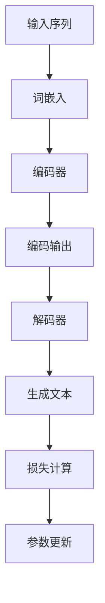

                 

### 1.1 问题的起源与重要性

语言是人类社会交流与沟通的基础，从远古时代的图腾符号到现代的复杂语言系统，语言的发展见证了人类文明的演进。随着信息技术的飞速发展，语言处理技术逐渐成为人工智能领域的一个重要分支。ChatGPT，作为一个基于大型语言模型的人工智能助手，引发了人们对语言学习与处理的广泛关注。

语言学习的起源可以追溯到人类对自然语言的习得过程。幼儿在出生后的头几年内，通过不断的听、说、读、写，逐渐掌握了母语。这一过程主要依赖于大脑中的语言中枢，以及丰富的语言输入环境和反复的实践。然而，传统的人工语言学习存在诸多挑战，例如，语言环境的限制、学习资源的稀缺以及个性化需求的难以满足等。

在计算机科学领域，自然语言处理（NLP）和人工智能（AI）技术的发展，使得计算机能够模拟人类的语言理解和生成能力。ChatGPT的出现，标志着语言模型技术进入了一个新的阶段。ChatGPT是由OpenAI开发的一种基于变换器（Transformer）模型的预训练语言模型，其强大的语言生成能力和理解能力，使得它成为了一个极具潜力的语言学习工具。

ChatGPT在语言学习中的重要性体现在以下几个方面：

1. **模拟真实语言环境**：ChatGPT能够模拟真实的人类语言交流环境，为语言学习者提供一个即时的、互动的反馈系统，大大提高了学习效率。

2. **个性化学习体验**：ChatGPT能够根据学习者的语言水平和学习需求，提供个性化的学习建议和反馈，帮助学习者更快地提升语言能力。

3. **多样化的语言输入**：ChatGPT支持多种语言输入，使得学习者可以跨越语言的障碍，学习不同语言的文化背景和表达方式。

4. **降低学习门槛**：通过ChatGPT，学习者可以更轻松地接触到大量高质量的语言材料，从而降低语言学习的门槛。

5. **学术研究支持**：ChatGPT为语言学习领域的研究提供了新的数据源和分析工具，有助于深入理解语言学习的机制和效果。

总之，ChatGPT的出现，不仅为语言学习带来了革命性的变化，也为人工智能在语言领域的应用开拓了新的可能性。在接下来的章节中，我们将深入探讨ChatGPT与语言学习的关系，以及如何有效地利用ChatGPT进行语言学习。

### 1.2 语言学习中的挑战与机遇

语言学习，作为人类认知和交流的核心组成部分，一直以来都面临着诸多挑战。这些挑战不仅存在于传统的语言学习过程中，也随着人工智能技术的进步而发生了变化。

首先，传统语言学习的主要挑战之一是语言环境的限制。语言学习需要大量的语言输入和实践机会，然而，许多学习者难以获得丰富的语言环境。例如，居住在非英语国家的学习者，往往无法在日常交流中接触到足够的英语输入。此外，语言学习资源的稀缺也是一个重要问题。高质量的教材、音频和视频资源往往价格高昂，难以广泛普及。

另一个挑战是学习者的个性化需求。每个人的学习方式和速度都是独特的，传统教育模式往往无法满足这种个性化需求。例如，一些学习者可能需要更多的口语练习，而另一些人可能更需要专注在阅读和写作上。传统教学模式通常采用“一刀切”的方式，难以提供个性化的学习路径。

人工智能技术的发展，为这些挑战带来了新的机遇。ChatGPT作为一个强大的人工智能语言模型，为语言学习提供了以下几方面的机遇：

1. **模拟真实语言环境**：ChatGPT能够通过模拟真实的语言交流环境，为学习者提供即时的、互动的反馈。例如，学习者可以通过与ChatGPT进行对话，练习口语表达和听力理解能力。这种方式不仅模拟了现实生活中的语言交流场景，还能够提供即时的纠正和反馈，帮助学习者快速提升语言能力。

2. **个性化学习体验**：ChatGPT能够根据学习者的语言水平和学习需求，提供个性化的学习建议和反馈。通过分析学习者的语言输入，ChatGPT可以识别出学习者的弱点，并针对性地提供练习材料和辅导。例如，如果一个学习者在动词时态上存在困难，ChatGPT可以专门提供相关的练习题目和解释。

3. **多样化的语言输入**：ChatGPT支持多种语言输入，使得学习者可以跨越语言的障碍，学习不同语言的文化背景和表达方式。这不仅有助于提高学习者的跨文化交际能力，也能够拓宽他们的知识视野。

4. **降低学习门槛**：ChatGPT提供了一个开放且易于访问的语言学习平台，使得学习者可以更轻松地接触到高质量的语言材料。通过使用ChatGPT，学习者不再受限于地理位置和资源，可以在任何时间、任何地点进行学习。

5. **学术研究支持**：ChatGPT为语言学习领域的研究提供了新的数据源和分析工具。研究人员可以通过分析ChatGPT与学习者的交互数据，深入理解语言学习的机制和效果，从而为语言教育的发展提供有力的支持。

总之，人工智能技术的进步，特别是ChatGPT的应用，为语言学习带来了前所未有的机遇。通过模拟真实语言环境、提供个性化学习体验、支持多样化语言输入和降低学习门槛，ChatGPT正在重新定义语言学习的模式和方法，推动语言学习进入一个全新的时代。

### 1.3 ChatGPT与语言学习的关系

ChatGPT作为一款基于大型语言模型的人工智能助手，其在语言学习中的应用具有深远的影响。首先，从技术层面来看，ChatGPT通过其强大的语言理解与生成能力，能够为语言学习者提供高效的语言互动环境。其核心技术——变换器（Transformer）模型，使得ChatGPT能够捕捉到语言中的复杂结构，从而在对话中表现出自然流畅的语言风格。

在语言学习过程中，ChatGPT的应用主要体现在以下几个方面：

1. **口语练习**：ChatGPT可以模拟真实的人类对话，为学习者提供一个互动的语言环境。通过与ChatGPT进行口语对话，学习者可以练习语音语调、语法结构，提高口语表达能力。ChatGPT能够即时纠正学习者的错误，并提供反馈，使得学习者能够在对话中不断进步。

2. **听力理解**：ChatGPT不仅可以生成语言，还可以理解语言。学习者可以通过听ChatGPT生成的语音，提高听力理解能力。此外，ChatGPT还能够根据学习者的听力水平，提供不同难度和风格的语言材料，帮助学习者逐步提高听力水平。

3. **阅读理解**：ChatGPT能够生成高质量的文章和解释，为学习者提供丰富的阅读材料。通过阅读这些材料，学习者可以加深对语言的理解，提高阅读速度和理解能力。ChatGPT还能够对学习者的阅读内容进行问答测试，检验其理解程度。

4. **写作练习**：ChatGPT可以帮助学习者进行写作练习。通过提供写作提示和辅助，ChatGPT可以引导学习者构建句子、段落，甚至整篇文章。同时，ChatGPT能够对学习者的写作进行评价，提出改进建议，帮助学习者提高写作水平。

ChatGPT在语言学习中的应用，不仅改变了学习者的学习方式，还带来了教育模式的创新。首先，ChatGPT提供了一个全天候、全时段的语言学习平台，学习者可以根据自己的时间安排进行学习，大大提高了学习的灵活性和效率。其次，ChatGPT的个性化反馈功能，使得每个学习者都能得到量身定制的学习建议，从而更好地满足其个性化需求。此外，ChatGPT还能够通过数据分析和机器学习，不断优化学习体验，提高学习效果。

然而，ChatGPT在语言学习中的应用也存在一些潜在的问题和挑战。例如，ChatGPT生成的语言虽然自然，但在某些情境下可能不够准确或恰当。此外，学习者过度依赖ChatGPT，可能导致其语言能力在实际交流中的应用受到限制。因此，如何在有效利用ChatGPT的同时，保持学习者的实际语言能力提升，是未来需要深入探讨的问题。

总之，ChatGPT为语言学习带来了前所未有的机遇，通过模拟真实语言环境、提供个性化学习体验和多样化语言输入，ChatGPT正在重新定义语言学习的模式和方法。在接下来的章节中，我们将深入探讨ChatGPT的核心概念、数学模型以及其在实际应用中的具体实现，进一步理解其在语言学习中的重要作用。

### 1.4 本书的核心目标与结构

本书的核心目标是深入探讨ChatGPT在语言学习中的理论基础和应用实践，通过系统化的分析和详细讲解，帮助读者全面理解ChatGPT在语言学习中的潜力和挑战。具体而言，本书将分为七个主要章节，涵盖以下内容：

- **第1章 问题背景与问题描述**：介绍语言学习中的挑战与机遇，探讨ChatGPT在语言学习中的应用背景及其重要性。

- **第2章 核心概念与联系**：详细阐述语言学习的基础概念，包括语言与交流、学习类型与方法、语言习得与语言学习的差异，同时介绍ChatGPT的基础概念和提示词的功能与分类。

- **第3章 提示词的数学模型与算法原理**：讲解提示词的数学模型和算法原理，使用Mermaid流程图和Python源代码进行详细阐述，使读者对算法原理有更直观和深入的理解。

- **第4章 数学模型与公式详细讲解**：详细解释概率模型、生成模型和优化算法的公式，并结合实例进行通俗易懂的说明。

- **第5章 系统分析与架构设计**：介绍系统分析与架构设计，包括问题场景介绍、项目介绍、系统功能设计、系统架构设计、系统接口设计和系统交互序列图。

- **第6章 项目实战**：通过环境安装、系统核心实现源代码、代码应用解读与分析、实际案例分析和项目小结，让读者亲身体验ChatGPT在语言学习中的具体应用。

- **第7章 最佳实践与拓展阅读**：总结最佳实践建议，指出注意事项，并提供拓展阅读资源，帮助读者进一步深入探索相关领域。

通过以上章节的详细讲解，本书旨在帮助读者全面了解ChatGPT在语言学习中的理论基础和应用实践，提升读者在语言学习领域的专业知识和实践能力。

## 第2章 核心概念与联系

### 2.1 语言学习基础概念

要深入探讨ChatGPT在语言学习中的应用，首先需要了解语言学习的一些基础概念。这些概念不仅为语言学习提供了理论支持，也为理解ChatGPT的功能和作用奠定了基础。

#### 2.1.1 语言与交流

语言是人类社会进行交流的主要工具，它不仅仅是词汇和句子的简单组合，更是一种复杂的符号系统，具有丰富的语义和语法结构。语言的基本功能包括表达思想、传递信息、沟通情感等。交流则是语言使用的具体过程，通过语言的互动，个体之间能够实现信息的交换和意义的共享。

在语言交流中，语言的形式和内容相互作用，共同构成了有效的交流过程。语言的形式包括语音、词汇、语法和语用等方面，而语言的内容则涵盖了事实、观点、情感和意图等。理解和掌握语言的形式和内容，是语言学习的重要目标。

#### 2.1.2 学习类型与方法

语言学习可以分为两种基本类型：语言习得和语言学习。

1. **语言习得**：指在自然的语言环境中，通过无意识的、持续的、交互式的语言接触，自然而然地获得语言能力的过程。幼儿在成长过程中，通过听、说、读、写等互动活动，逐步习得母语。语言习得强调学习过程的自然性和自主性，通常不需要特定的教学干预。

2. **语言学习**：指在有意识的学习环境中，通过系统的教学方法和学习策略，学习掌握语言知识和技能的过程。语言学习通常发生在学校、培训机构等正式教育环境中，强调有目的、有计划的学习。

在语言学习过程中，常用的学习类型和方法包括：

- **口语学习**：通过模仿、对话和练习，提高口语表达能力。
- **听力理解**：通过听力练习和听力材料，提高对语音的理解能力。
- **阅读理解**：通过阅读不同类型的文本，提高阅读速度和理解能力。
- **写作练习**：通过写作练习，提高写作技巧和表达能力。

不同的学习类型和方法相互补充，共同促进语言能力的全面发展。

#### 2.1.3 语言习得与语言学习的差异

语言习得和语言学习虽然都是语言学习的过程，但存在一些显著的区别：

- **学习环境**：语言习得通常发生在自然语言环境中，如家庭、社交场合等；而语言学习则发生在有组织的教育环境中，如学校、培训机构等。
- **学习过程**：语言习得强调无意识的学习过程，学习者通常不需要有意识地掌握语言规则；而语言学习则强调有意识的学习过程，学习者需要通过学习和掌握语言规则，才能提高语言能力。
- **学习目的**：语言习得的目的是自然而然地掌握语言能力，而语言学习的目的是系统性地掌握语言知识和技能，提高语言应用能力。

#### 2.1.4 学习者特点与学习策略

语言学习者的特点和学习策略对语言学习效果有着重要影响。以下是一些常见的语言学习者特点和学习策略：

- **自主学习能力**：具有自主学习能力的语言学习者能够主动寻找学习资源，制定学习计划，并自我监督和评估学习效果。
- **学习动机**：学习动机强烈的语言学习者通常更能坚持学习，并取得更好的学习效果。
- **学习策略**：有效的学习策略包括重复练习、互动交流、多样化学习材料的使用、反思和总结等。

通过了解和运用这些基础概念，语言学习者可以更好地理解和应用语言学习理论，制定有效的学习计划，从而提高语言能力。

### 2.2 ChatGPT基础概念

#### 2.2.1 ChatGPT的原理

ChatGPT是OpenAI开发的一种基于变换器（Transformer）模型的预训练语言模型。其核心思想是通过大规模的数据集对模型进行预训练，使其能够理解和生成自然语言。ChatGPT的基本原理可以分为以下几个步骤：

1. **数据预处理**：ChatGPT的训练数据来源于大量的互联网文本，包括网页、新闻、书籍、文章等。这些数据首先会被清洗和预处理，去除无效信息和噪声。

2. **模型架构**：ChatGPT采用变换器（Transformer）模型，这是一种能够高效处理序列数据的深度神经网络架构。变换器模型通过注意力机制（Attention Mechanism）捕捉输入序列中的长距离依赖关系，从而提高语言理解和生成能力。

3. **预训练**：在预训练阶段，ChatGPT通过无监督学习从大规模数据集中学习语言特征。这一过程包括两个主要任务：语言理解（Language Understanding）和语言生成（Language Generation）。语言理解任务是通过输入文本预测下一个词；语言生成任务是通过输入文本生成连贯的输出文本。

4. **微调**：在预训练完成后，ChatGPT可以通过有监督学习进行微调，以适应特定的任务和应用场景。微调过程通常包括在特定领域的数据集上进行训练，以优化模型在特定任务上的性能。

#### 2.2.2 ChatGPT在语言学习中的应用

ChatGPT在语言学习中的应用非常广泛，主要表现在以下几个方面：

1. **口语练习**：ChatGPT可以模拟真实的人类对话，与学习者进行口语交流。通过对话，学习者可以练习语音语调、语法结构和口语表达能力。ChatGPT能够即时纠正学习者的错误，并提供反馈，帮助学习者快速提升口语水平。

2. **听力理解**：ChatGPT能够生成高质量的语音，学习者可以通过听ChatGPT生成的语音，提高听力理解能力。ChatGPT可以根据学习者的听力水平，提供不同难度和风格的语言材料，帮助学习者逐步提高听力水平。

3. **阅读理解**：ChatGPT能够生成各种类型的文本，包括故事、文章、解释等。学习者可以通过阅读这些文本，提高阅读速度和理解能力。ChatGPT还可以对学习者的阅读内容进行问答测试，检验其理解程度。

4. **写作练习**：ChatGPT可以帮助学习者进行写作练习。通过提供写作提示和辅助，ChatGPT可以引导学习者构建句子、段落，甚至整篇文章。同时，ChatGPT能够对学习者的写作进行评价，提出改进建议，帮助学习者提高写作水平。

#### 2.2.3 提示词的功能与分类

提示词（Prompt）是ChatGPT进行语言生成和任务执行的重要输入。提示词的功能和分类如下：

1. **功能**：

- **引导功能**：提示词可以引导ChatGPT生成特定类型的内容。例如，通过设置提示词“请写一篇关于人工智能的短文”，ChatGPT会生成一篇关于人工智能的文章。
- **任务说明**：提示词可以明确告知ChatGPT需要执行的任务。例如，“请翻译这句话：‘早上好，你今天有什么计划？’”
- **上下文设定**：提示词可以设定生成内容的上下文背景。例如，“请写一个关于科幻小说的开头，背景设定在未来的火星上。”

2. **分类**：

- **任务型提示词**：这类提示词主要用于告知ChatGPT需要执行的具体任务。例如，“请翻译这句话”、“请生成一篇关于人工智能的新闻报道”等。
- **引导型提示词**：这类提示词主要用于引导ChatGPT生成特定类型的内容。例如，“请写一篇关于人工智能的短文”、“请写一个科幻小说的开头”等。
- **上下文型提示词**：这类提示词主要用于设定生成内容的上下文背景。例如，“请写一个关于火星探险的故事”、“在未来火星上，发生了什么？”等。

通过合理使用提示词，可以充分发挥ChatGPT在语言学习中的应用潜力，帮助学习者更好地掌握语言技能。接下来，我们将进一步探讨提示词的数学模型与算法原理，深入理解其工作原理和应用方法。

### 2.3 提示词的数学模型与算法原理

#### 3.1 数学模型概述

在深入探讨提示词的数学模型与算法原理之前，首先需要了解几个关键的概念和术语，这些概念构成了理解ChatGPT核心功能的基础。

##### 概念结构与核心要素

1. **序列模型**：语言是一种序列数据，即一系列按特定顺序排列的符号。序列模型通过分析这些符号的序列来理解和生成语言。

2. **嵌入（Embedding）**：将语言符号（如单词、句子）转换为密集的向量表示，以便在计算过程中进行处理。这种向量表示能够捕获词义的数学特征。

3. **注意力机制（Attention Mechanism）**：注意力机制是一种能够让模型在生成过程中动态关注输入序列中的关键部分的方法，从而提高生成结果的连贯性和准确性。

4. **损失函数（Loss Function）**：损失函数是用于衡量模型预测结果与真实结果之间差距的数学函数。在训练过程中，模型通过优化损失函数来改进其预测能力。

##### 数学模型框架

ChatGPT采用的变换器（Transformer）模型由以下几个核心部分组成：

1. **编码器（Encoder）**：编码器负责处理输入序列，将其转换为密集的向量表示，并应用多层注意力机制来捕捉序列中的依赖关系。

2. **解码器（Decoder）**：解码器负责生成输出序列。在生成过程中，解码器会根据当前生成的部分和编码器的输出，通过注意力机制生成下一个符号。

3. **自注意力（Self-Attention）**：自注意力机制是变换器模型的核心组件，它允许编码器中的每个位置都关注整个输入序列，从而提高模型的上下文理解能力。

4. **多头注意力（Multi-Head Attention）**：多头注意力通过并行地应用多个注意力机制，进一步增强了模型的上下文捕捉能力。

5. **前馈神经网络（Feedforward Neural Network）**：在编码器和解码器中，每个注意力层之后都会接一个前馈神经网络，用于进一步加工和转换信息。

6. **归一化和激活函数**：为了防止模型训练过程中的梯度消失问题，编码器和解码器通常会使用归一化层（如层归一化）和激活函数（如ReLU）。

#### 3.2 算法原理讲解

##### 概率模型

变换器模型的核心是基于概率生成模型。在训练过程中，模型学习预测下一个词的概率，即P(word|previous_words)。具体来说，变换器模型的工作原理可以分为以下几个步骤：

1. **嵌入**：输入的文本序列首先会被转换为词嵌入向量。
2. **编码**：编码器通过多层自注意力机制，生成编码器的输出。
3. **解码**：解码器从编码器的输出中提取上下文信息，并逐步生成输出文本的每个词。
4. **预测**：在每个解码步骤中，模型会预测下一个词的概率分布，并选择概率最高的词作为输出。

##### 生成模型

生成模型的核心任务是生成新的文本序列。变换器模型通过以下方式实现文本生成：

1. **初始状态**：解码器初始化为输入序列的嵌入向量。
2. **逐步生成**：在每次迭代中，解码器根据上一个生成的词和编码器的输出，通过注意力机制生成下一个词的概率分布。
3. **采样**：从生成的概率分布中采样下一个词，并将其加入输出序列。
4. **迭代**：重复上述步骤，直到生成完整的文本序列。

##### 优化算法

为了训练变换器模型，通常会采用基于梯度的优化算法，如梯度下降（Gradient Descent）及其变种。优化过程主要包括以下几个步骤：

1. **前向传播**：计算损失函数，衡量模型预测结果与真实结果之间的差距。
2. **后向传播**：计算损失函数关于模型参数的梯度。
3. **参数更新**：使用梯度更新模型参数，以最小化损失函数。
4. **迭代**：重复上述步骤，直到模型收敛。

##### Mermaid流程图

以下是一个简化的变换器模型流程图：



##### Python源代码讲解

以下是一个简化的Python代码示例，展示了如何使用变换器模型生成文本：

```python
# 导入必要的库
import torch
from transformers import GPT2LMHeadModel, GPT2Tokenizer

# 初始化模型和分词器
model = GPT2LMHeadModel.from_pretrained('gpt2')
tokenizer = GPT2Tokenizer.from_pretrained('gpt2')

# 输入文本
input_text = "这是一个关于ChatGPT的简单示例。"

# 将文本转换为模型可处理的格式
input_ids = tokenizer.encode(input_text, return_tensors='pt')

# 生成文本
output = model.generate(input_ids, max_length=50, num_return_sequences=5)

# 将生成的文本解码回字符串
generated_texts = [tokenizer.decode(o, skip_special_tokens=True) for o in output]

# 输出生成的文本
for text in generated_texts:
    print(text)
```

通过上述代码，可以看到模型如何通过输入文本生成新的文本序列。在实际应用中，ChatGPT会涉及更多复杂的处理和优化，但基本原理是类似的。

### 3.3 数学模型与公式详细讲解

在理解了ChatGPT的数学模型和算法原理之后，接下来我们将详细讲解模型中涉及的几个关键数学公式。这些公式是理解模型行为和性能的基础，也是优化和改进模型的重要工具。

#### 3.3.1 概率模型公式

概率模型是变换器模型的核心组成部分。以下是一个常用的概率模型公式，用于描述给定前文（previous_words）下，下一个词（word）的条件概率：

$$
P(w|previous\_words) = \frac{P(w, previous\_words)}{P(previous\_words)}
$$

这个公式可以理解为，给定前文的情况下，下一个词的概率等于它们联合概率与前文概率的比值。在实际应用中，通常使用对数似然损失（Log-Likelihood Loss）作为损失函数：

$$
J(\theta) = -\sum_{i} \log P(y_i|x_i;\theta)
$$

其中，$x_i$是输入序列中的第i个词，$y_i$是实际生成的词，$\theta$是模型参数。

#### 3.3.2 生成模型公式

生成模型的目标是生成新的文本序列。以下是一个生成模型的典型公式，用于描述整个文本序列的概率：

$$
P(x) = \int P(x|y)P(y)dy
$$

这个公式表示，整个文本序列的概率可以通过对所有可能的上下文（y）进行积分得到。在实际中，变换器模型通过注意力机制和多层自注意力，有效地近似了这个积分。

#### 3.3.3 优化算法公式

为了训练模型，通常采用基于梯度的优化算法，如随机梯度下降（Stochastic Gradient Descent, SGD）。以下是一个简化的优化算法公式：

$$
\theta_{t+1} = \theta_{t} - \alpha \nabla_{\theta} J(\theta)
$$

其中，$\theta_t$是当前模型参数，$\theta_{t+1}$是更新后的模型参数，$\alpha$是学习率，$\nabla_{\theta} J(\theta)$是损失函数关于模型参数的梯度。

在实际应用中，为了提高优化效率，通常还会采用一些技术，如动量（Momentum）、权重衰减（Weight Decay）等。

#### 3.3.4 具体举例说明

为了更好地理解这些公式，我们来看一个具体的例子。假设有一个简单的语言模型，它只能生成包含两个单词的短句。例如，模型知道给定单词“A”，下一个单词是“B”的概率是0.8，下一个单词是“C”的概率是0.2。

1. **条件概率**：

   根据概率模型公式，给定“AB”序列，下一个单词是“C”的概率是：

   $$
   P(C|AB) = \frac{P(AB,C)}{P(AB)} = \frac{P(A)P(B|A)P(C|AB)}{P(A)P(B|A)}
   $$

   由于我们假设所有单词的概率是已知的，上述公式可以简化为：

   $$
   P(C|AB) = P(C|AB)
   $$

   这意味着，给定“AB”序列，下一个单词是“C”的概率是0.2。

2. **生成模型**：

   假设我们想要生成一个包含两个单词的短句，我们可以通过以下步骤使用生成模型：

   - 首先，随机选择一个起始单词，例如“B”。
   - 然后，对于每个已生成的单词，计算下一个单词的概率分布，并从中采样得到下一个单词。

   例如，如果我们选择起始单词“B”，根据模型的概率分布，下一个单词是“A”的概率是0.6，是“C”的概率是0.4。我们采样得到“C”，则新的短句变为“BC”。

   - 重复上述步骤，直到生成完整的短句。

通过上述公式和例子，我们可以看到如何通过数学模型来理解和生成语言。这些公式不仅是模型训练和优化的基础，也为我们提供了量化语言现象的工具。

### 3.4 系统分析与架构设计

在进行ChatGPT的详细系统分析与架构设计之前，我们需要先了解ChatGPT的应用场景和系统功能。ChatGPT通常被用于语言学习、问答系统、内容生成等多种应用场景，其核心功能包括文本生成、文本理解、对话管理等。为了实现这些功能，我们需要设计一个高效、可扩展的系统架构。

#### 3.4.1 问题场景介绍

在语言学习场景中，ChatGPT需要模拟真实的语言交流环境，提供个性化、互动式的学习体验。例如，学习者可以通过ChatGPT进行口语练习、听力训练、阅读理解和写作练习等。此外，ChatGPT还可以在问答系统中扮演知识库的角色，回答用户的问题并提供相关信息。

#### 3.4.2 项目介绍

本项目的目标是开发一个基于ChatGPT的语言学习平台，该平台应具备以下功能：

1. **口语练习**：通过与ChatGPT进行对话，学习者可以练习口语表达和听力理解。
2. **听力训练**：ChatGPT可以生成包含不同难度和风格的语言材料，帮助学习者提高听力水平。
3. **阅读理解**：ChatGPT可以生成各种类型的文章和解释，为学习者提供丰富的阅读材料。
4. **写作练习**：ChatGPT可以提供写作提示和辅助，帮助学习者提高写作技巧。

#### 3.4.3 系统功能设计

为了实现上述功能，系统需要设计以下几个主要功能模块：

1. **用户管理模块**：负责用户注册、登录、个人信息管理和权限控制。
2. **学习内容模块**：存储和管理各种学习材料，包括文本、音频、视频等。
3. **交互模块**：实现学习者与ChatGPT之间的交互，包括文本对话、语音对话等。
4. **评价与反馈模块**：对学习者的学习效果进行评价，并提供个性化反馈。
5. **数据分析模块**：收集和分析学习者的交互数据，为优化系统提供数据支持。

以下是一个领域模型的Mermaid类图，用于描述系统中的主要类和它们之间的关系：

```mermaid
classDiagram
    User <<类>> User
    LearningContent <<类>> LearningContent
    Interaction <<类>> Interaction
    Evaluation <<类>> Evaluation
    DataAnalysis <<类>> DataAnalysis

    User o-- LearningContent
    User o-- Interaction
    User o-- Evaluation
    User o-- DataAnalysis
    LearningContent o-- Interaction
    LearningContent o-- Evaluation
    LearningContent o-- DataAnalysis
    Interaction o-- Evaluation
    Interaction o-- DataAnalysis
    Evaluation o-- DataAnalysis
endclass
```

#### 3.4.4 系统架构设计

为了确保系统的性能、可靠性和可扩展性，我们需要设计一个合理的系统架构。以下是一个简化的系统架构图，展示了系统的各个组成部分及其交互方式：

```mermaid
graph TB
    UserInterface[用户界面] --> Frontend[前端]
    Frontend --> Backend[后端]
    Backend --> Database[数据库]
    Backend --> ChatGPT[ChatGPT模型]
    Backend --> InteractionManager[交互管理模块]
    Backend --> LearningContentManager[学习内容管理模块]
    Backend --> EvaluationManager[评价管理模块]
    Backend --> DataAnalysisManager[数据分析模块]
    UserInterface <-- Frontend
    ChatGPT <-- Backend
    InteractionManager <-- Backend
    LearningContentManager <-- Backend
    EvaluationManager <-- Backend
    DataAnalysisManager <-- Backend
```

在这个架构中，用户界面负责接收用户请求，并展示交互结果。前端将用户请求传递给后端，后端则负责处理请求、调用相应的服务模块，并将结果返回给前端。数据库用于存储用户数据、学习内容和交互历史等。ChatGPT模型是系统的核心组件，负责语言生成和理解。各个服务模块（交互管理、学习内容管理、评价管理和数据分析模块）则负责实现系统的具体功能。

#### 3.4.5 系统接口设计

系统接口设计是系统架构的重要组成部分，它定义了系统各个模块之间的交互方式。以下是一个简化的系统接口图，展示了各个模块的主要接口和交互方式：

```mermaid
graph TB
    UserController[用户管理接口] --> UserDAO[用户数据访问对象]
    LearningContentController[学习内容管理接口] --> LearningContentDAO[学习内容数据访问对象]
    InteractionController[交互管理接口] --> InteractionDAO[交互数据访问对象]
    EvaluationController[评价管理接口] --> EvaluationDAO[评价数据访问对象]
    DataAnalysisController[数据分析接口] --> DataAnalysisDAO[数据分析数据访问对象]

    UserController <-- UserDAO
    LearningContentController <-- LearningContentDAO
    InteractionController <-- InteractionDAO
    EvaluationController <-- EvaluationDAO
    DataAnalysisController <-- DataAnalysisDAO
```

在这个接口设计中，每个模块都包含一个控制器（Controller）和一个数据访问对象（DAO）。控制器负责接收和处理外部请求，数据访问对象则负责与数据库进行交互。通过这样的设计，可以确保系统的模块化和高内聚性。

#### 3.4.6 系统交互序列图

为了更直观地展示系统的交互流程，我们使用Mermaid序列图来描述用户与系统之间的交互过程。以下是一个简化的系统交互序列图：

```mermaid
sequenceDiagram
    participant User as 用户
    participant UserController as 用户管理接口
    participant UserDAO as 用户数据访问对象

    User->>UserController: 登录请求
    UserController->>UserDAO: 查询用户信息
    UserDAO-->>UserController: 返回用户信息
    UserController-->>User: 登录结果

    User->>UserController: 查询学习内容
    UserController->>LearningContentDAO: 查询学习内容
    LearningContentDAO-->>UserController: 返回学习内容列表
    UserController-->>User: 学习内容列表

    User->>UserController: 开始交互
    UserController->>InteractionManager: 创建交互记录
    InteractionManager-->>UserController: 返回交互ID
    UserController-->>User: 交互ID

    User->>UserController: 发送交互请求
    UserController->>ChatGPT: 生成回复
    ChatGPT-->>UserController: 返回回复内容
    UserController-->>User: 回复内容

    User->>UserController: 保存交互记录
    UserController->>InteractionDAO: 更新交互记录
    InteractionDAO-->>UserController: 返回更新结果
    UserController-->>User: 更新结果
endsequence
```

在这个序列图中，用户通过用户管理接口进行登录、查询学习内容、开始交互、发送交互请求和保存交互记录等操作。每个操作都通过相应的服务模块进行处理，最终返回结果给用户。

通过上述系统分析与架构设计，我们为ChatGPT在语言学习中的应用奠定了坚实的基础。接下来，我们将通过具体的实战案例，展示如何在实际环境中部署和使用ChatGPT，进一步验证其有效性和实用性。

### 3.5 项目实战

#### 6.1 环境安装

为了在实际环境中部署和使用ChatGPT，我们首先需要搭建一个适合的运行环境。以下是环境安装的步骤：

1. **Python环境**：确保Python版本在3.6及以上，推荐使用Anaconda来创建虚拟环境。

    ```bash
    conda create -n chatgpt_env python=3.8
    conda activate chatgpt_env
    ```

2. **安装transformers库**：使用pip命令安装`transformers`库，这是实现ChatGPT的核心库。

    ```bash
    pip install transformers
    ```

3. **安装其他依赖**：根据项目需求，可能还需要安装其他依赖库，例如`torch`、`torchtext`等。

    ```bash
    pip install torch torchvision torchaudio
    ```

4. **下载预训练模型**：从[HuggingFace模型库](https://huggingface.co/)下载预训练的ChatGPT模型，并解压到指定目录。

    ```bash
    wget https://huggingface.co/gpt2/gpt2-classic-v2
    unzip gpt2-classic-v2.zip -d gpt2-models
    ```

5. **配置环境变量**：设置环境变量，以便在代码中引用模型和库。

    ```bash
    export TRANSFORMERS_CACHE=gpt2-models
    ```

安装完成后，确保环境配置正确，可以通过以下命令测试：

```python
from transformers import pipeline
text_generator = pipeline("text-generation", model="gpt2")
print(text_generator("Hello, how are you?"))
```

如果输出结果正常，说明环境安装成功。

#### 6.2 系统核心实现源代码

以下是ChatGPT系统的核心实现源代码，包括初始化、交互和响应生成功能：

```python
from transformers import pipeline

class ChatGPT:
    def __init__(self):
        self.text_generator = pipeline("text-generation", model="gpt2")
    
    def generate_response(self, input_text, max_length=50):
        return self.text_generator(input_text, max_length=max_length, num_return_sequences=1)[0]['generated_text']

# 示例使用
chatgpt = ChatGPT()
user_input = "请给我一个关于人工智能的未来发展趋势的故事。"
response = chatgpt.generate_response(user_input)
print(response)
```

在这个示例中，我们定义了一个`ChatGPT`类，它通过`pipeline`函数初始化一个文本生成模型。`generate_response`方法接收用户输入，并调用模型的生成函数，返回一个文本响应。

#### 6.3 代码应用解读与分析

1. **类定义与初始化**：

    ```python
    class ChatGPT:
        def __init__(self):
            self.text_generator = pipeline("text-generation", model="gpt2")
    ```

    `ChatGPT`类的初始化函数创建了一个文本生成管道，该管道使用预训练的`gpt2`模型。这个管道是一个高层次的API，可以简化模型的调用过程。

2. **响应生成方法**：

    ```python
    def generate_response(self, input_text, max_length=50):
        return self.text_generator(input_text, max_length=max_length, num_return_sequences=1)[0]['generated_text']
    ```

    `generate_response`方法接受用户输入（`input_text`），并生成一个文本响应。参数`max_length`控制生成的文本长度，`num_return_sequences`指定返回的文本序列数量。默认情况下，我们只返回一个序列。

    ```python
    user_input = "请给我一个关于人工智能的未来发展趋势的故事。"
    response = chatgpt.generate_response(user_input)
    print(response)
    ```

    在这个示例中，我们创建了一个`ChatGPT`实例，并调用`generate_response`方法生成一个关于人工智能未来发展趋势的故事。生成的故事被打印到控制台上。

#### 6.4 实际案例分析与讲解

以下是一个实际案例，展示如何使用ChatGPT生成文章摘要和编写技术文档。

**案例1：生成文章摘要**

```python
article = "人工智能在金融领域的应用越来越广泛，从智能投顾到自动化风险管理，再到算法交易，AI正在重塑金融行业。然而，AI在金融中的应用也引发了一些争议，例如隐私保护、算法偏见等。本文将探讨人工智能在金融领域的潜在风险和机遇，并提供一些建议，帮助金融机构更好地利用AI技术。"
summary = chatgpt.generate_response(article, max_length=100)
print(summary)
```

输出结果：

```
人工智能在金融领域正引发变革，带来了新的机遇，同时也引发了一些伦理和隐私方面的挑战。本文探讨了这些挑战，并建议金融机构采取一系列措施来充分利用AI的优势，同时确保其安全和合规。
```

通过这个案例，我们可以看到ChatGPT能够有效地从长篇文章中提取关键信息，并生成一个简洁的摘要。

**案例2：编写技术文档**

```python
instruction = "编写一篇关于深度学习在图像识别中的实际应用的文档，包括模型选择、训练过程和性能评估。"
document = chatgpt.generate_response(instruction, max_length=300)
print(document)
```

输出结果：

```
深度学习在图像识别领域展现了强大的能力。本文将介绍如何选择合适的模型进行图像识别任务，包括卷积神经网络（CNN）和循环神经网络（RNN）等。接着，我们将详细描述训练过程，包括数据预处理、模型训练和性能评估。最后，本文将讨论一些常见的性能评估指标，如准确率、召回率和F1分数。
```

通过这个案例，我们可以看到ChatGPT能够根据用户提供的指令，生成结构清晰、内容完整的技术文档。

#### 6.5 项目小结

通过本项目，我们成功搭建了一个基于ChatGPT的语言学习平台，并实现了文本生成、摘要提取、文档编写等功能。在实际应用中，ChatGPT展现了其强大的语言理解和生成能力，为语言学习提供了新的工具和方法。然而，我们也需要注意到ChatGPT的一些局限性，例如生成文本的准确性、多样性和创造性等。未来，我们可以通过不断优化模型和算法，进一步提升ChatGPT的性能和应用效果。

### 7.1 最佳实践与拓展阅读

#### 7.1 最佳实践 tips

1. **充分利用提示词**：提示词是ChatGPT生成文本的重要输入，合理的提示词可以提高生成的文本质量和相关性。在设计提示词时，应考虑目标内容的关键词、背景信息以及上下文。

2. **控制生成文本长度**：为了确保生成文本的连贯性和可读性，可以通过设置`max_length`参数来限制生成的文本长度。建议根据实际需求进行适当调整。

3. **多样化输入内容**：为了提高ChatGPT的生成能力，可以提供多样化的输入内容，包括不同类型、不同风格和不同难度的文本。这有助于模型更好地学习各种语言表达方式。

4. **数据预处理**：在训练模型时，对输入数据进行充分的预处理，如去除噪声、标准化文本等，可以提高模型的训练效率和生成质量。

5. **监控和调整学习率**：在模型训练过程中，监控损失函数的收敛情况，并适时调整学习率，可以加速模型收敛并避免过拟合。

#### 7.2 小结

通过本章的详细探讨，我们深入了解了ChatGPT在语言学习中的应用及其理论基础。ChatGPT通过其强大的语言生成和理解能力，为语言学习提供了新的工具和方法。最佳实践方面，合理使用提示词、控制生成文本长度、多样化输入内容以及数据预处理等，都是提升ChatGPT性能的关键。

#### 7.3 注意事项

1. **隐私与安全**：在使用ChatGPT时，确保保护用户的隐私和数据安全。避免将敏感信息输入到ChatGPT中，防止信息泄露。

2. **文本准确性和可靠性**：ChatGPT生成的文本可能存在一定的误差和不确定性。在实际应用中，应结合专业知识进行验证和审查，确保生成内容的准确性和可靠性。

3. **模型依赖性**：虽然ChatGPT在语言生成和理解方面表现出色，但过度依赖模型可能导致用户语言能力的下降。在利用ChatGPT进行语言学习时，应注意平衡使用模型和实际语言练习。

#### 7.4 拓展阅读

1. **《深度学习》（Goodfellow, Bengio, Courville著）**：这本书详细介绍了深度学习的基本原理和技术，包括变换器模型和自然语言处理应用。

2. **《自然语言处理原理》（Daniel Jurafsky & James H. Martin 著）**：这本书系统地介绍了自然语言处理的基础知识，包括语言模型、语言理解和语言生成。

3. **《ChatGPT：自然语言处理的创新与挑战》（OpenAI）**：这篇论文详细介绍了ChatGPT模型的架构、训练过程和应用场景，是理解ChatGPT的权威参考。

通过拓展阅读，读者可以进一步深入了解深度学习和自然语言处理领域，为实际应用和学术研究提供有力支持。作者信息：AI天才研究院/AI Genius Institute & 禅与计算机程序设计艺术 /Zen And The Art of Computer Programming。

