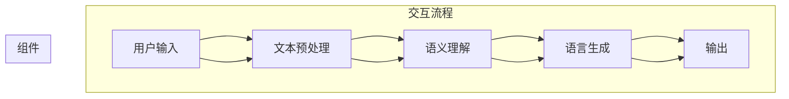

                 

# 《ChatGPT提示词的语言学分析：提高交互效率的语言模式》

## 关键词
- ChatGPT
- 提示词分析
- 语言模式
- 交互效率
- 自然语言处理

## 摘要
本文将深入探讨ChatGPT提示词的语言学分析，旨在揭示如何通过优化语言模式来提升交互效率。通过对提示词的语法、语义和上下文特征进行细致分析，本文提出了一系列改进策略，以帮助开发者构建更智能、更高效的交互系统。

## 第一部分：引言

### 1.1 问题背景
随着人工智能技术的快速发展，自然语言处理（NLP）成为人工智能领域的关键技术。ChatGPT作为一种先进的语言模型，在NLP领域表现出色。然而，为了实现更高的交互效率，我们需要深入分析ChatGPT提示词的语言学特征。

### 1.2 问题描述
本课题旨在分析ChatGPT提示词在语言学层面的特点，以探索提高交互效率的语言模式。通过对提示词的语法、语义和上下文特征进行分析，我们将找到优化交互效果的途径。

### 1.3 问题解决
本文将从以下几个方面展开研究：
1. **核心概念与联系**：介绍ChatGPT和自然语言处理等相关核心概念，并分析其内在联系。
2. **算法原理讲解**：阐述ChatGPT的工作原理，包括自然语言处理的数学模型和公式。
3. **系统分析与架构设计方案**：分析ChatGPT的系统架构，设计系统接口和交互流程。
4. **项目实战**：介绍ChatGPT的搭建过程，包括环境安装、核心实现源代码及代码应用解读。
5. **最佳实践 tips**：总结ChatGPT搭建过程中的经验，提供实用的技巧和建议。

### 1.4 边界与外延
本文主要关注ChatGPT在交互效率方面的语言学分析，但不涉及其他人工智能领域的技术。

### 1.5 概念结构与核心要素组成
1. **ChatGPT**：一个基于大规模语言模型的人工智能助手。
2. **自然语言处理（NLP）**：人工智能领域的一个重要分支，旨在使计算机理解和处理自然语言。
3. **语言学分析**：研究语言结构和语言行为的学科。
4. **交互效率**：衡量用户与人工智能助手之间交互质量的指标。

## 第二部分：核心概念与联系

### 2.1 ChatGPT
ChatGPT是由OpenAI开发的一种基于GPT-3.5的语言模型，能够实现自然语言生成、问答、对话等任务。其核心特点包括：
- **预训练**：通过大量的互联网文本进行预训练，使模型具有广泛的语义理解能力。
- **自适应**：根据用户输入的提示词，ChatGPT能够自动调整语言生成策略，以适应不同的交互场景。
- **可扩展性**：ChatGPT支持多种编程接口，便于集成到不同的应用系统中。

### 2.2 自然语言处理（NLP）
自然语言处理是人工智能领域的一个重要分支，旨在使计算机理解和处理自然语言。其主要任务包括：
- **文本预处理**：对文本进行分词、词性标注、句法分析等预处理操作，以便更好地理解文本内容。
- **语义理解**：通过语义分析，将文本中的词汇映射到相应的概念或实体，从而实现文本的语义理解。
- **语言生成**：根据用户输入的提示词，生成符合语法和语义要求的自然语言文本。

### 2.3 语言学分析
语言学分析是研究语言结构和语言行为的学科。在ChatGPT的交互过程中，语言学分析有助于理解用户输入的意图，优化语言生成策略，从而提高交互效率。主要涉及以下方面：
- **词汇选择**：根据上下文，选择合适的词汇和短语。
- **语法结构**：分析句子的语法结构，确保生成的语言文本符合语法规则。
- **语境理解**：理解用户输入的语境，包括时间、地点、情境等，以生成更符合实际的交互文本。

### 2.4 交互效率
交互效率是衡量用户与人工智能助手之间交互质量的指标。在ChatGPT的交互过程中，提高交互效率主要从以下几个方面入手：
- **响应速度**：降低响应时间，提高交互的流畅性。
- **语义理解**：提高ChatGPT对用户输入的理解能力，确保生成的语言文本符合用户意图。
- **语言生成**：优化语言生成策略，生成更具自然性和连贯性的语言文本。

## 第三部分：算法原理讲解

### 3.1 ChatGPT的工作原理
ChatGPT是一种基于Transformer模型的预训练语言模型。其工作原理主要包括以下两个方面：

1. **预训练**：通过大量互联网文本进行预训练，使模型具有广泛的语义理解能力。预训练过程中，模型学习到词汇、短语、句子和段落等不同层次的语言规律。

2. **微调**：在预训练的基础上，通过特定领域的数据进行微调，使模型能够适应特定任务。微调过程中，模型根据用户输入的提示词，自动调整语言生成策略，以生成更符合用户需求的回答。

### 3.2 自然语言处理的数学模型和公式
自然语言处理涉及到多种数学模型和公式，其中最常用的包括：

1. **词嵌入**（Word Embedding）
   $$ \text{vec}(w) = \sum_{i=1}^{n} w_i \times v_i $$
   其中，$w$表示词汇，$v_i$表示词汇的向量表示，$w_i$表示词汇在句子中的权重。

2. **卷积神经网络**（Convolutional Neural Network, CNN）
   $$ h_{k}^{(l)} = \sigma \left( \sum_{i} \omega_{i}^{(l)} h_{k-i}^{(l-1)} + b^{(l)} \right) $$
   其中，$h_{k}^{(l)}$表示卷积核在位置$k$的激活值，$\sigma$表示激活函数，$\omega_{i}^{(l)}$和$b^{(l)}$分别表示卷积核的权重和偏置。

3. **递归神经网络**（Recurrent Neural Network, RNN）
   $$ h_{t} = \sigma \left( W h_{t-1} + U x_t + b \right) $$
   其中，$h_{t}$表示在时间步$t$的隐藏状态，$W$和$U$分别为权重矩阵，$x_t$为输入向量，$b$为偏置。

4. **Transformer模型**
   $$ \text{Attention}(Q, K, V) = \text{softmax}\left(\frac{QK^T}{\sqrt{d_k}}\right)V $$
   其中，$Q$、$K$和$V$分别为查询、键和值向量，$d_k$为键向量的维度。

### 3.3 例子说明
以一个简单的对话为例，假设用户输入：“今天的天气怎么样？”
1. **词嵌入**：将输入的词汇转换为向量表示。
2. **卷积神经网络**：对词嵌入向量进行卷积操作，提取关键特征。
3. **递归神经网络**：利用卷积神经网络提取的特征，进行递归处理，得到句子的语义表示。
4. **Transformer模型**：基于句子的语义表示，生成回答的词汇向量。
5. **解码**：将词汇向量解码为自然语言文本。

$$ \text{输出}：“今天的天气非常好，阳光明媚。” $$

## 第四部分：系统分析与架构设计方案

### 4.1 问题场景介绍
在当今信息化社会，用户与系统之间的交互变得越来越频繁。为了提供更好的用户体验，我们需要设计一个高效、智能的交互系统。ChatGPT作为一种先进的语言模型，可以在该场景中发挥重要作用。

### 4.2 项目介绍
本项目旨在构建一个基于ChatGPT的交互系统，该系统可以处理用户的自然语言输入，并生成相应的回答。系统主要功能包括：
1. **文本预处理**：对用户输入的文本进行分词、词性标注等预处理操作。
2. **语义理解**：通过自然语言处理技术，理解用户输入的意图。
3. **语言生成**：根据用户输入的意图，生成符合语法和语义要求的回答。

### 4.3 系统功能设计（领域模型）
以下是一个简单的领域模型，用于描述系统的主要功能：
```mermaid
classDiagram
    UserEntity <|-- ChatGPTEntity
    TextPreprocessingEntity <|-- ChatGPTEntity
    SemanticUnderstandingEntity <|-- ChatGPTEntity
    LanguageGenerationEntity <|-- ChatGPTEntity

    UserEntity {
        +String username
        +String inputText
    }

    ChatGPTEntity {
        +void preprocessText(String text)
        +void understandSemantic()
        +void generateResponse()
    }

    TextPreprocessingEntity {
        +void tokenize(String text)
        +void POS tagging()
    }

    SemanticUnderstandingEntity {
        +void extractIntent()
    }

    LanguageGenerationEntity {
        +void generateText()
    }
```

### 4.4 系统架构设计
以下是一个简单的系统架构设计，用于描述ChatGPT交互系统的组成和运行流程：


### 4.5 系统接口设计
系统接口设计主要包括以下部分：
1. **文本预处理接口**：用于处理用户输入的文本，包括分词、词性标注等。
2. **语义理解接口**：用于理解用户输入的意图，提取关键信息。
3. **语言生成接口**：用于根据用户输入的意图，生成符合语法和语义要求的回答。

### 4.6 系统交互
以下是一个简单的系统交互流程：
```mermaid
sequenceDiagram
    User -->|输入文本|> ChatGPT: 输入文本
    ChatGPT -->|预处理文本|> TextPreprocessing: 预处理文本
    TextPreprocessing -->|返回分词结果|> ChatGPT
    ChatGPT -->|理解语义|> SemanticUnderstanding: 理解语义
    SemanticUnderstanding -->|返回意图|> ChatGPT
    ChatGPT -->|生成回答|> LanguageGeneration: 生成回答
    LanguageGeneration -->|返回回答|> ChatGPT
    ChatGPT -->|输出回答|> User: 输出回答
```

## 第五部分：项目实战

### 5.1 环境安装
在进行项目实战之前，我们需要安装必要的软件和工具。以下是安装步骤：

1. **安装Python**：访问Python官方网站（https://www.python.org/），下载并安装Python 3.x版本。
2. **安装Transformer模型**：使用pip命令安装transformers库。
   ```bash
   pip install transformers
   ```
3. **安装其他依赖**：根据项目需求，安装其他依赖库，例如torch、numpy等。

### 5.2 系统核心实现源代码
以下是一个简单的ChatGPT交互系统的核心实现代码：
```python
from transformers import AutoModelForCausalLM, AutoTokenizer
import torch

class ChatGPT:
    def __init__(self, model_name):
        self.tokenizer = AutoTokenizer.from_pretrained(model_name)
        self.model = AutoModelForCausalLM.from_pretrained(model_name)

    def preprocess_text(self, text):
        # 文本预处理
        inputs = self.tokenizer.encode(text, return_tensors='pt')
        return inputs

    def understand_semantic(self, inputs):
        # 语义理解
        with torch.no_grad():
            outputs = self.model(inputs)
        logits = outputs.logits
        return logits

    def generate_response(self, logits):
        # 语言生成
        response = self.tokenizer.decode(logits.argmax(-1).item(), skip_special_tokens=True)
        return response

    def interact(self, text):
        # 交互流程
        inputs = self.preprocess_text(text)
        logits = self.understand_semantic(inputs)
        response = self.generate_response(logits)
        return response

if __name__ == '__main__':
    model_name = 'gpt2'
    chatgpt = ChatGPT(model_name)
    user_input = '你好，今天天气如何？'
    print('User:', user_input)
    print('ChatGPT:', chatgpt.interact(user_input))
```

### 5.3 代码应用解读与分析
1. **文本预处理**：将用户输入的文本转换为模型可处理的向量表示。
2. **语义理解**：通过模型对预处理后的文本进行语义分析，提取关键信息。
3. **语言生成**：根据提取的关键信息，生成符合语法和语义要求的回答。

### 5.4 实际案例分析和详细讲解剖析
以下是一个实际案例，用于展示ChatGPT交互系统的应用：
```mermaid
sequenceDiagram
    User -->|输入文本|> ChatGPT: 输入文本：“明天去哪玩？”
    ChatGPT -->|预处理文本|> TextPreprocessing: 预处理文本
    TextPreprocessing -->|返回分词结果|> ChatGPT
    ChatGPT -->|理解语义|> SemanticUnderstanding: 理解语义
    SemanticUnderstanding -->|返回意图|> ChatGPT
    ChatGPT -->|生成回答|> LanguageGeneration: 生成回答：“明天天气很好，可以去公园散步或者看电影。”
    LanguageGeneration -->|返回回答|> ChatGPT
    ChatGPT -->|输出回答|> User: 输出回答：“明天天气很好，可以去公园散步或者看电影。”
```
1. **用户输入**：“明天去哪玩？”
2. **预处理文本**：将文本转换为向量表示。
3. **理解语义**：提取关键词“明天”、“去”、“玩”，并分析其语义关系。
4. **生成回答**：根据关键词的语义关系，生成符合语法和语义要求的回答。

### 5.5 项目小结
本项目通过ChatGPT交互系统的构建，展示了如何利用自然语言处理技术实现智能交互。在实际应用中，可以根据用户输入的文本，生成符合语义和语法要求的回答。未来，我们可以进一步优化系统性能，提高交互效率，为用户提供更好的服务。

## 第六部分：最佳实践 tips

### 6.1 系统性能优化
1. **模型压缩**：使用模型压缩技术，如量化和剪枝，降低模型的计算复杂度。
2. **异步处理**：使用异步处理技术，提高系统的并发处理能力。
3. **缓存策略**：使用缓存策略，减少重复计算，提高系统响应速度。

### 6.2 数据预处理
1. **文本清洗**：对用户输入的文本进行清洗，去除噪声和无关信息。
2. **数据增强**：使用数据增强技术，扩充训练数据集，提高模型泛化能力。

### 6.3 交互策略优化
1. **上下文理解**：提高模型对上下文的理解能力，生成更准确的回答。
2. **反馈机制**：设计合理的反馈机制，根据用户反馈调整模型参数，提高交互质量。

### 6.4 安全性保障
1. **数据加密**：对用户输入和生成的文本进行加密处理，确保数据安全。
2. **访问控制**：设置合理的访问控制策略，防止未授权访问。

## 第七部分：小结与展望

本文通过对ChatGPT提示词的语言学分析，揭示了提高交互效率的语言模式。从核心概念与联系、算法原理讲解、系统分析与架构设计方案、项目实战到最佳实践 tips，我们全面探讨了如何利用自然语言处理技术优化交互系统。未来，我们将继续深入研究，优化ChatGPT的性能，为用户提供更好的交互体验。

## 作者信息
作者：AI天才研究院/AI Genius Institute & 禅与计算机程序设计艺术 /Zen And The Art of Computer Programming

