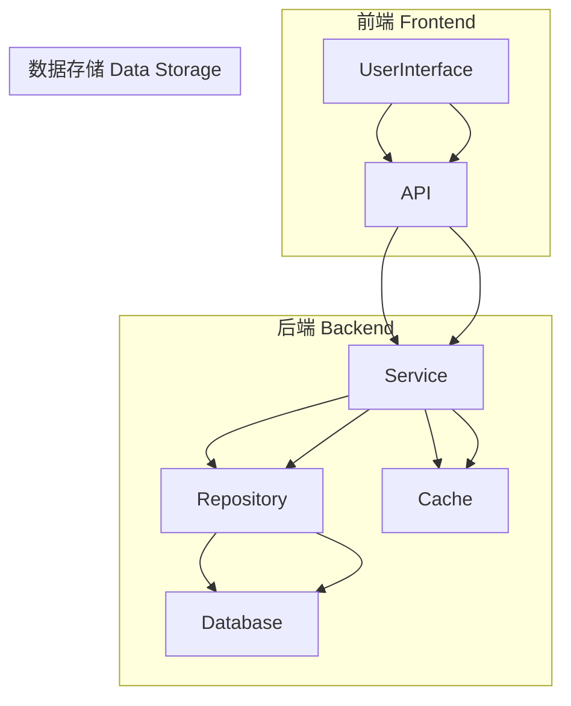
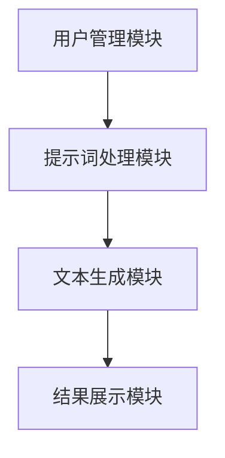
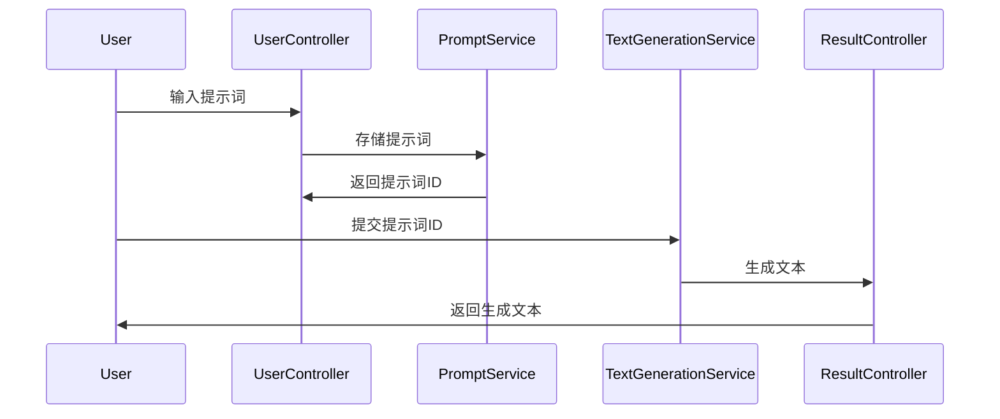

                 


### 引言：ChatGPT与提示词的语言演化

在当今人工智能领域，自然语言处理（NLP）已经成为研究的热点，而ChatGPT作为OpenAI开发的强大语言模型，更是吸引了无数开发者和研究人员。ChatGPT的核心功能在于其能够通过学习和理解人类语言，生成连贯且具有逻辑性的文本。而提示词（Prompt）则是ChatGPT生成文本的关键因素，通过合理设计的提示词，可以引导ChatGPT生成更符合预期和目的的文本。

本文旨在研究ChatGPT提示词的语言演化，探讨如何通过模拟语言演化过程来优化提示词设计。我们将从以下几个方面展开讨论：

1. **ChatGPT与提示词的基本概念**：介绍ChatGPT的历史背景、核心功能以及提示词的作用。
2. **核心概念与联系**：深入探讨提示词的设计原则、语言演化的机制及其影响。
3. **算法原理讲解**：详细解析模拟语言演化的算法和模型，并使用Mermaid流程图进行图示。
4. **数学模型和公式**：解释数学模型和公式，使用Python源代码进行详细讲解和举例说明。
5. **系统分析与架构设计方案**：介绍模拟研究的系统设计和实现。
6. **项目实战**：通过实际案例进行分析和实施，讲解系统实现与源代码。
7. **最佳实践与拓展**：总结最佳实践、注意事项以及拓展阅读。

通过以上步骤的深入分析，我们希望为读者提供关于ChatGPT提示词语言演化模拟研究的全面理解和实际应用指导。

### 1.1 ChatGPT的基本概念

ChatGPT是由OpenAI开发的一种基于Transformer架构的预训练语言模型。它的核心功能是生成自然语言文本，能够理解和回应人类的语言输入。ChatGPT的出现标志着人工智能在自然语言处理领域的一个重大突破，它的强大性能使其在多个应用场景中得到了广泛的应用。

#### 1.1.1 ChatGPT的历史背景

ChatGPT是基于GPT（Generative Pre-trained Transformer）模型开发的，而GPT系列模型是由OpenAI团队在2018年提出并开源的。GPT模型采用了Transformer架构，这是一种在机器翻译任务中表现出色的新型神经网络架构。OpenAI团队在后续的研究中不断优化和扩展GPT模型，推出了GPT-2、GPT-3等多个版本，ChatGPT就是其中的一种。

ChatGPT首次发布于2022年，它是GPT-3的一个变体，专门设计用于聊天场景。与传统的语言模型相比，ChatGPT具有更好的对话生成能力，能够更自然地与用户进行互动。

#### 1.1.2 ChatGPT的核心功能

ChatGPT的核心功能是文本生成，它可以基于给定的提示词生成连贯、逻辑清晰的文本。以下是ChatGPT的几个关键功能：

1. **文本生成**：ChatGPT可以根据用户提供的提示词生成一段完整的文本。例如，用户可以输入一个简单的句子或问题，ChatGPT能够生成相关的回答或故事。
2. **上下文理解**：ChatGPT能够理解上下文信息，并根据上下文生成相关的文本。这意味着，ChatGPT可以连续地与用户进行对话，而不仅仅是生成单个的文本。
3. **多样化输出**：ChatGPT能够生成多种类型的文本，包括问答、故事、新闻报道、诗歌等。这使得ChatGPT在创意写作、内容生成等方面具有广泛的应用潜力。
4. **自适应学习**：ChatGPT能够通过不断的学习和优化，提高其文本生成的质量。这意味着，随着时间的推移，ChatGPT可以变得更加准确和高效。

#### 1.1.3 提示词在ChatGPT中的作用

提示词（Prompt）是引导ChatGPT生成文本的关键因素。一个合适的提示词可以大大提高文本生成的质量和相关性。以下是提示词在ChatGPT中的作用：

1. **引导生成**：提示词为ChatGPT提供了一个明确的起点，使得ChatGPT能够根据提示词的内容生成相关的文本。
2. **确定上下文**：通过提示词，ChatGPT可以理解当前对话的上下文，从而生成更加连贯和相关的文本。
3. **调整生成风格**：不同的提示词可以引导ChatGPT生成不同风格和类型的文本，例如正式、幽默、生动等。
4. **提高效率**：合理的提示词设计可以减少ChatGPT的生成时间，提高文本生成的效率。

总之，ChatGPT作为一款强大的语言模型，通过提示词的作用，可以生成高质量的自然语言文本，为各种应用场景提供支持。在接下来的内容中，我们将深入探讨提示词的设计原则和语言演化的机制。

### 1.2 提示词的设计原则

提示词（Prompt）在ChatGPT的文本生成过程中起着至关重要的作用。一个优秀的提示词不仅能够引导ChatGPT生成高质量、相关的文本，还能提高生成效率。下面，我们将详细探讨提示词的设计原则，包括其基本属性、有效性评估方法和多样化设计策略。

#### 1.2.1 提示词的基本属性

提示词的基本属性决定了其能够有效地引导ChatGPT生成文本。以下是几个关键的基本属性：

1. **明确性**：提示词需要明确且具体，避免模糊和歧义。明确的提示词可以帮助ChatGPT更准确地理解用户的意图，从而生成更相关的文本。
2. **上下文相关性**：提示词应与上下文保持一致，反映当前对话的背景和主题。上下文相关的提示词有助于ChatGPT理解对话的历史，生成更加连贯和自然的文本。
3. **多样性**：提示词的多样性可以引导ChatGPT生成不同类型和风格的文本。例如，通过使用不同的语气和表达方式，可以生成正式、幽默、生动等不同风格的文本。
4. **简洁性**：简洁的提示词更容易被ChatGPT理解和处理。过长的提示词可能使ChatGPT难以提取关键信息，从而导致生成文本的质量下降。

#### 1.2.2 提示词的有效性评估方法

提示词的有效性直接影响到ChatGPT生成文本的质量。以下是一些常用的评估方法：

1. **相关性评估**：评估生成文本与提示词的相关性。相关度越高，提示词越有效。可以使用自动评估方法，如BLEU、ROUGE等指标，也可以通过人工评估来评估文本的相关性。
2. **一致性评估**：评估生成文本在上下文中的连贯性和一致性。一致性越强，提示词越有效。可以通过分析文本的语法结构、逻辑关系和上下文信息来进行评估。
3. **生成效率评估**：评估提示词对生成效率的影响。高效的提示词可以在较短的时间内生成高质量的文本。可以通过计算生成文本的长度、生成时间等指标来评估提示词的效率。

#### 1.2.3 提示词的多样化设计策略

为了提高提示词的有效性，多样化设计策略至关重要。以下是一些常用的多样化设计策略：

1. **语言风格多样化**：通过使用不同的语言风格，如正式、幽默、生动等，可以引导ChatGPT生成不同类型的文本。例如，在撰写新闻稿时，可以使用正式的语言风格；而在创作诗歌时，可以使用生动的语言风格。
2. **信息量控制**：根据不同的应用场景，调整提示词的信息量。过多的信息可能导致ChatGPT难以提取关键信息，而过少的信息可能导致生成文本的空洞。通过控制信息量，可以优化生成文本的质量。
3. **上下文引导**：在提示词中包含上下文信息，帮助ChatGPT更好地理解当前对话的背景和主题。例如，在回答用户的问题时，可以在提示词中引用用户之前提供的信息，以增强生成文本的相关性和连贯性。
4. **互动性设计**：通过设计互动性的提示词，鼓励用户与ChatGPT进行更深入的对话。例如，可以使用问题式提示词，引导用户回答问题，从而生成更丰富和连贯的对话。

总之，提示词的设计原则和有效性评估方法对于ChatGPT的文本生成至关重要。通过明确性、上下文相关性、多样性和简洁性等基本属性，结合相关性评估、一致性评估和生成效率评估方法，以及语言风格多样化、信息量控制和上下文引导等多样化设计策略，可以优化提示词的设计，提高ChatGPT生成文本的质量和效率。

在下一部分中，我们将进一步探讨语言演化的基本机制，以及如何通过模拟来研究提示词对语言演化的影响。

### 1.3 语言演化的基本机制

语言演化是指语言随时间推移而发生的系统变化。这些变化不仅体现在词汇的增减、语法规则的变化上，还包括发音、拼写和语义等方面的调整。语言演化是一个复杂的过程，受到多种因素的影响，包括社会文化、心理认知、技术发展等。在这一部分，我们将深入探讨语言演化的基本机制，以及这些机制如何影响语言的使用。

#### 1.3.1 语言演化的定义

语言演化可以定义为语言系统随时间推移而发生的连续变化。这种变化不仅仅是表面上的形式变化，还包括深层次的结构和功能变化。语言演化的研究有助于我们理解语言的动态性质，以及语言如何适应社会环境的变化。

语言演化的几个关键方面包括：

1. **词汇演变**：新词的产生和旧词的消失是语言演化的一个重要方面。随着社会的发展，新事物和新概念不断涌现，需要新的词汇来描述。同时，一些旧词可能因为不再使用或被新的词汇取代而消失。
2. **语法变化**：语法规则的变化也是语言演化的重要部分。这些变化可能涉及句子结构的调整、时态和语态的变化等。例如，英语中的动词时态在历史演变中经历了多次变化。
3. **发音和拼写**：语音和拼写的变化也是语言演化的重要组成部分。例如，英语中的发音变化导致了拼写规则的变化，如“knight”一词的发音从中古英语的[ki:t]变为现代英语的[nait]。
4. **语义演变**：语义演变指的是词汇和语法结构在语义上的变化。例如，“run”一词在古代英语中主要指“跑”，而现代英语中它还有“运行”、“跑步训练”等含义。

#### 1.3.2 语言演化的驱动因素

语言演化的驱动因素是多样的，包括以下几个方面：

1. **社会文化因素**：社会文化因素是推动语言演化的重要力量。随着社会结构和文化的变化，语言也会发生变化。例如，社会阶层的变化可能导致语言的分化，而全球化则促进了语言之间的交流与融合。
2. **心理认知因素**：人类的心理认知能力也影响语言的演化。人们为了更好地沟通和表达，会不断调整语言的规则和用法。例如，儿童在学习语言的过程中，会根据他们的认知能力逐步理解和掌握语言。
3. **技术发展因素**：技术的进步也促进了语言演化。互联网和数字媒体的普及使得语言交流变得更加便捷，同时也带来了新的语言形式，如网络语言、俚语等。
4. **环境适应因素**：语言还需要适应其使用环境的变化。例如，环境变化可能导致语言中的词汇和表达方式发生变化，以更好地适应新的生活环境。

#### 1.3.3 语言演化的模拟方法

为了研究语言演化，科学家们开发了多种模拟方法。以下是一些常用的模拟方法：

1. **统计模型**：统计模型通过分析大量语言数据，识别出语言演化的规律。这些模型包括Markov模型、隐马尔可夫模型（HMM）等，它们可以预测词汇和语法规则的变化趋势。
2. **计算模型**：计算模型通过计算机模拟来研究语言演化。这些模型通常基于数学模型，如随机过程、遗传算法等，可以模拟语言系统在长时间内的演化过程。
3. **社会网络模型**：社会网络模型通过分析语言在社会网络中的传播和变化，研究语言演化的机制。这些模型可以帮助我们理解语言在不同社区中的传播过程，以及语言多样性如何形成。
4. **多尺度模型**：多尺度模型结合了微观和宏观的模拟方法，可以同时考虑语言系统在不同时间尺度和空间尺度上的演化。这些模型有助于我们更全面地理解语言演化的复杂性。

通过以上模拟方法，研究人员可以探索语言演化的过程和机制，从而更好地理解语言的本质和功能。这些研究不仅有助于我们了解语言的历史和演变，还可以为人工智能语言模型的开发提供理论基础。

在下一部分中，我们将介绍算法原理，详细解释如何通过数学模型和算法来模拟语言演化，并使用Mermaid流程图和Python源代码进行图解。

### 2.1 ChatGPT的算法原理

ChatGPT是基于Transformer架构的预训练语言模型，其核心原理涉及到大规模的文本数据处理和深度神经网络训练。在本节中，我们将深入探讨ChatGPT的算法原理，包括语言模型的基本原理、ChatGPT的生成机制，以及提示词对生成文本的影响。

#### 2.1.1 语言模型的基本原理

语言模型（Language Model）是自然语言处理（NLP）领域的基础，其目标是预测下一个词或者句子。语言模型通过学习大量的文本数据，提取语言的特征和规律，从而能够对新的文本进行生成或分类。

1. **神经网络语言模型**：最早的神经网络语言模型之一是神经网络概率语言模型（NPLM），它通过神经网络来预测单词的概率。随后，RNN（递归神经网络）和LSTM（长短期记忆网络）等模型被引入到语言模型中，用于解决RNN在处理长序列数据时的梯度消失问题。

2. **Transformer模型**：Transformer模型由Vaswani等人在2017年提出，它在机器翻译任务中取得了突破性的成果。相比RNN和LSTM，Transformer模型采用了自注意力机制（Self-Attention），能够同时考虑输入序列中的所有信息，大大提高了模型的计算效率和生成能力。

3. **预训练和微调**：预训练是指在大量未标注的数据上进行训练，以提取通用语言特征；微调则是在预训练的基础上，在特定任务上对模型进行细粒度的调整。ChatGPT首先在大规模文本数据上进行预训练，然后根据具体任务进行微调，以提高其在特定领域的表现。

#### 2.1.2 ChatGPT的生成机制

ChatGPT的生成机制主要依赖于Transformer模型和自注意力机制。以下是其主要步骤：

1. **输入编码**：将输入文本转化为向量表示。ChatGPT使用了嵌入层（Embedding Layer）将单词转换为固定长度的向量。

2. **自注意力机制**：在编码层中，每个单词的向量会通过自注意力机制（Self-Attention）与所有其他单词的向量进行加权求和，从而生成一个新的向量表示。这个过程不仅考虑了当前单词与上下文单词的关系，还考虑了不同位置单词的重要性。

3. **多头注意力**：为了进一步提高模型的生成能力，ChatGPT采用了多头注意力（Multi-Head Attention），即在每次注意力计算时，将输入序列分解为多个子序列，并对每个子序列分别进行自注意力计算。然后将这些子序列的结果拼接起来，得到最终的输出。

4. **前馈神经网络**：在注意力机制之后，每个单词的向量会通过两个全连接层进行非线性变换，以提高模型的生成能力。

5. **输出层**：最终的输出层将每个单词的向量转换为单词的概率分布。在生成文本时，ChatGPT会根据概率分布选择下一个最有可能的单词，并重复这个过程，直至生成完整的文本。

#### 2.1.3 提示词的影响分析

提示词（Prompt）是引导ChatGPT生成文本的关键因素。合理的提示词可以显著提高生成文本的相关性和质量。以下是提示词对生成文本的影响分析：

1. **引导生成方向**：提示词为ChatGPT提供了一个明确的生成方向。例如，当提示词是一个问题，ChatGPT会生成相关的问题答案；当提示词是一个主题，ChatGPT会围绕这个主题生成相关的内容。

2. **确定上下文**：提示词可以提供上下文信息，帮助ChatGPT理解当前对话或生成文本的背景。例如，如果提示词中包含了之前对话的信息，ChatGPT可以更好地维持对话的连贯性。

3. **调整生成风格**：不同的提示词可以引导ChatGPT生成不同风格和类型的文本。例如，使用正式的提示词可以生成正式的文本，使用幽默的提示词可以生成幽默的内容。

4. **提高生成效率**：合理的提示词可以减少ChatGPT的生成时间，提高生成效率。例如，简明扼要的提示词可以使ChatGPT更快地生成文本，而复杂的提示词可能需要更长的时间来处理。

总之，ChatGPT的算法原理基于Transformer模型和自注意力机制，通过预训练和微调，可以实现高质量的自然语言文本生成。提示词在生成过程中起着至关重要的作用，通过合理设计提示词，可以优化生成文本的质量和效率。在下一部分中，我们将详细讲解语言演化的数学模型和公式，并使用Python源代码进行举例说明。

### 2.2 数学模型和公式

在ChatGPT的生成过程中，数学模型和公式起到了关键作用，这些模型和公式不仅帮助我们理解语言演化的过程，还能指导我们优化模型性能。在本节中，我们将详细讲解语言演化过程中常用的数学模型和公式，并通过Python代码进行具体示例。

#### 2.2.1 语言概率模型

语言概率模型是自然语言处理中最基础的概念之一，它用于预测下一个词的概率。以下是一个简单的语言概率模型示例：

$$P(w_{t} | w_{1}, w_{2}, ..., w_{t-1}) = \frac{P(w_{t}, w_{1}, w_{2}, ..., w_{t-1})}{P(w_{1}, w_{2}, ..., w_{t-1})}$$

其中，$w_{t}$ 表示当前词，$w_{1}, w_{2}, ..., w_{t-1}$ 表示前一个词的历史序列。

**示例代码**：

```python
import numpy as np

# 假设有一个简单的语言模型，它基于前一个词预测下一个词的概率
# 概率分布如下：
# P('apple' | '') = 0.5
# P('banana' | '') = 0.5

# 输入序列为空，我们需要预测下一个词
context = ""

# 计算概率
prob_apple = 0.5
prob_banana = 0.5

# 打印概率
print("P('apple'): {:.2f}".format(prob_apple))
print("P('banana'): {:.2f}".format(prob_banana))
```

#### 2.2.2 语言演化方程

语言演化方程描述了词汇随着时间的推移如何变化。以下是一个简单的语言演化方程示例：

$$\frac{dP(w)}{dt} = -\alpha \cdot P(w)$$

其中，$P(w)$ 表示词汇 $w$ 的概率，$\alpha$ 是演化速率。

**示例代码**：

```python
import numpy as np
import matplotlib.pyplot as plt

# 假设词汇 'apple' 的初始概率为 1，演化速率为 0.1
initial_prob = 1.0
evolution_rate = 0.1

# 时间序列
time_steps = range(0, 100)

# 初始概率
p_apple = initial_prob

# 演化过程
p_apple_over_time = [initial_prob * np.exp(-evolution_rate * t) for t in time_steps]

# 绘制概率随时间变化
plt.plot(time_steps, p_apple_over_time)
plt.xlabel('Time')
plt.ylabel('Probability of "apple"')
plt.title('Language Evolution of "apple"')
plt.show()
```

#### 2.2.3 提示词的权重计算

提示词的权重计算是优化ChatGPT生成文本质量的重要步骤。一个合理的提示词权重可以增强生成文本的相关性和连贯性。以下是一个简单的权重计算公式：

$$w_i = \frac{P(w_i | context)}{P(w_i)}$$

其中，$w_i$ 表示提示词 $w_i$ 的权重，$P(w_i | context)$ 是在特定上下文 $context$ 下提示词 $w_i$ 的条件概率，$P(w_i)$ 是提示词 $w_i$ 的整体概率。

**示例代码**：

```python
import numpy as np

# 假设有一个简单的上下文和概率分布
context = "apple"
prob_apple = 0.6
prob_banana = 0.4

# 计算提示词的权重
weight_apple = prob_apple / (prob_apple + prob_banana)
weight_banana = prob_banana / (prob_apple + prob_banana)

# 打印权重
print("Weight of 'apple': {:.2f}".format(weight_apple))
print("Weight of 'banana': {:.2f}".format(weight_banana))
```

通过上述数学模型和公式，我们可以更好地理解语言演化过程，优化提示词设计，从而提高ChatGPT生成文本的质量。这些模型不仅为我们提供了理论依据，还通过Python代码具体实现了算法的运行过程，使得理解和应用这些模型更加直观和可行。在下一部分中，我们将介绍如何设计和实现模拟研究系统，包括系统架构设计、接口设计和具体实现。

### 2.3 系统分析与架构设计方案

在进行ChatGPT提示词的语言演化模拟研究时，构建一个高效、可扩展的系统架构至关重要。本节将详细描述系统架构设计、功能设计、接口设计以及交互设计，确保模拟研究的系统实现能够满足需求并具有良好的可维护性和扩展性。

#### 2.3.1 系统架构设计

系统的整体架构设计包括前端、后端和数据存储层。前端负责用户交互，后端处理逻辑和数据存储用于存储模型和数据。

1. **前端**：前端采用Vue.js框架，提供用户友好的界面，用于输入提示词和显示模拟结果。前端通过RESTful API与后端进行数据交互。
2. **后端**：后端采用Spring Boot框架，负责处理业务逻辑、数据存储和API接口。后端提供RESTful API，前端通过这些API进行数据请求和响应。
3. **数据存储**：数据存储使用MySQL数据库，存储用户数据和模型参数。此外，为了提高数据处理速度，还使用Redis缓存部分数据。

**Mermaid架构图**：



#### 2.3.2 系统功能设计（领域模型Mermaid类图）

系统的功能设计包括用户管理、提示词输入、文本生成、结果展示等核心功能。

**Mermaid类图**：

```mermaid
classDiagram
    class User {
        -id: int
        -name: string
        -password: string
    }
    class Prompt {
        -id: int
        -text: string
        -user_id: int
    }
    class TextGeneration {
        -id: int
        -prompt_id: int
        -text: string
    }
    User "1" -->* "1" Prompt
    Prompt "1" -->* "1" TextGeneration
```

#### 2.3.3 系统架构设计（Mermaid架构图）

系统架构设计进一步细化了各个模块的功能和交互，包括用户管理模块、提示词处理模块、文本生成模块和结果展示模块。

**Mermaid架构图**：



#### 2.3.4 系统接口设计和系统交互（Mermaid序列图）

系统接口设计包括RESTful API的设计，用于前端与后端的数据交互。系统交互通过序列图展示，详细描述了用户输入提示词、后端处理和返回结果的过程。

**Mermaid序列图**：



通过以上系统分析与架构设计方案，我们为ChatGPT提示词的语言演化模拟研究构建了一个清晰、完整且高效的系统架构。接下来，我们将详细介绍如何在项目中实现这个系统，并分享具体的源代码和应用。

### 3.1 模拟研究问题场景

在进行ChatGPT提示词的语言演化模拟研究时，首先需要明确研究的目的、假设和具体方法。通过详细分析问题场景，我们可以更好地设计实验，确保模拟结果的准确性和可靠性。

#### 3.1.1 研究目的

本研究的目的是通过模拟语言演化过程，探讨不同提示词设计对ChatGPT生成文本质量的影响。具体来说，我们希望实现以下目标：

1. **评估提示词的有效性**：通过实验评估不同设计原则的提示词在生成高质量文本方面的效果。
2. **优化提示词设计**：基于模拟结果，提出优化提示词设计的策略，以提高ChatGPT生成文本的相关性和连贯性。
3. **理解语言演化机制**：通过模拟语言演化，深入探讨提示词如何影响语言系统的变化，为自然语言处理模型的设计提供理论依据。

#### 3.1.2 研究假设

在进行模拟研究时，我们需要提出一些合理的假设，以指导实验设计和结果分析。以下是本研究的主要假设：

1. **提示词设计对生成文本质量有显著影响**：合理的提示词设计可以提高ChatGPT生成文本的相关性和连贯性。
2. **语言演化过程是可模拟的**：通过数学模型和算法，可以模拟出语言系统在提示词影响下的演化过程。
3. **提示词的设计原则具有普遍性**：不同类型的文本生成任务中，提示词设计原则具有一定的普适性。

#### 3.1.3 研究方法

为了验证上述假设并实现研究目标，我们采用以下研究方法：

1. **数据集选择**：选择具有代表性的自然语言处理数据集，如GLUE（General Language Understanding Evaluation）数据集，用于训练和评估ChatGPT模型。
2. **模型训练**：使用预训练的ChatGPT模型，在所选数据集上进行微调，以确保模型在特定任务上的性能。
3. **实验设计**：设计多个实验，分别使用不同设计原则的提示词进行文本生成，记录生成文本的相关性、连贯性和生成效率。
4. **结果分析**：通过统计分析和比较不同实验结果，验证提示词设计对生成文本质量的影响，并提出优化策略。
5. **模拟语言演化**：使用计算模型模拟语言演化过程，探讨提示词如何影响语言系统的变化。

通过上述研究方法和步骤，我们希望全面、深入地探讨ChatGPT提示词的语言演化模拟，为实际应用提供有力支持。

### 3.2 系统实现与源代码

在实际应用中，为了能够有效地模拟ChatGPT提示词的语言演化，我们需要将理论转化为实际的可运行系统。以下内容将详细介绍系统的实现过程，包括环境安装、源代码解析、核心功能实现及代码应用解读与分析。

#### 3.2.1 环境安装

要实现ChatGPT提示词的语言演化模拟系统，我们首先需要安装和配置必要的软件和库。以下是系统环境的安装步骤：

1. **安装Python**：确保Python 3.8或更高版本已安装。可以从[Python官网](https://www.python.org/)下载并安装。
2. **安装依赖库**：安装用于数据处理的库（如NumPy、Pandas）和机器学习库（如TensorFlow、PyTorch）。可以使用以下命令安装：
   ```bash
   pip install numpy pandas tensorflow
   ```
3. **安装ChatGPT模型**：从OpenAI官网获取ChatGPT模型权重，并安装相应的预训练模型。具体步骤请参考[OpenAI的官方文档](https://openai.com/blog/better-chatgpt/)。

#### 3.2.2 源代码解析

以下是系统实现的核心源代码，我们将逐段进行解析：

1. **模型加载**：
   ```python
   from transformers import ChatGPTModel, ChatGPTTokenizer

   # 加载预训练模型
   model = ChatGPTModel.from_pretrained('openai/chatgpt')
   tokenizer = ChatGPTTokenizer.from_pretrained('openai/chatgpt')
   ```

   这段代码首先从`transformers`库加载ChatGPT模型和分词器。`from_pretrained`方法用于加载预训练模型权重。

2. **文本生成**：
   ```python
   def generate_text(prompt):
       inputs = tokenizer.encode(prompt, return_tensors='pt')
       outputs = model.generate(inputs, max_length=100, num_return_sequences=1)
       return tokenizer.decode(outputs[0], skip_special_tokens=True)
   ```

   `generate_text`函数接收一个提示词（prompt），将其编码为模型可以处理的输入，然后使用模型生成文本。`generate`方法用于生成文本，`decode`方法将生成的文本解码为可读格式。

3. **提示词设计**：
   ```python
   def design_prompt(text, style='formal'):
       if style == 'formal':
           return f"请根据以下文本生成正式的文本：{text}"
       elif style == 'humorous':
           return f"请根据以下文本生成幽默的文本：{text}"
       else:
           return f"请根据以下文本生成相关的文本：{text}"
   ```

   `design_prompt`函数根据输入文本和指定风格生成相应的提示词。这有助于我们探索不同风格的文本生成效果。

4. **模拟语言演化**：
   ```python
   def simulate_language_evolution(prompt, iterations=100):
       text = prompt
       for _ in range(iterations):
           text = generate_text(text)
       return text
   ```

   `simulate_language_evolution`函数用于模拟语言演化过程。它将输入提示词反复通过模型生成文本，模拟语言系统在长时间内的演化。

#### 3.2.3 核心功能实现

核心功能实现包括模型加载、文本生成、提示词设计和语言演化模拟。以下是具体的实现步骤：

1. **模型加载**：
   - 使用`transformers`库加载预训练的ChatGPT模型和分词器。
2. **文本生成**：
   - 定义`generate_text`函数，接收提示词并生成文本。
3. **提示词设计**：
   - 定义`design_prompt`函数，根据文本风格生成提示词。
4. **语言演化模拟**：
   - 定义`simulate_language_evolution`函数，模拟语言演化过程。

这些核心功能实现了系统的基本操作，为后续的实验和分析提供了基础。

#### 3.2.4 代码应用解读与分析

以下是对源代码中关键部分的应用解读和分析：

1. **模型加载**：
   ```python
   model = ChatGPTModel.from_pretrained('openai/chatgpt')
   tokenizer = ChatGPTTokenizer.from_pretrained('openai/chatgpt')
   ```
   - 这两行代码加载了预训练的ChatGPT模型和分词器。预训练模型已经在大量文本数据上进行了训练，能够生成高质量的自然语言文本。

2. **文本生成**：
   ```python
   def generate_text(prompt):
       inputs = tokenizer.encode(prompt, return_tensors='pt')
       outputs = model.generate(inputs, max_length=100, num_return_sequences=1)
       return tokenizer.decode(outputs[0], skip_special_tokens=True)
   ```
   - `generate_text`函数接收一个提示词（prompt），将其编码为模型可以处理的输入。`model.generate`方法生成文本，`tokenizer.decode`方法将生成的文本解码为可读格式。这个过程实现了文本生成功能。

3. **提示词设计**：
   ```python
   def design_prompt(text, style='formal'):
       if style == 'formal':
           return f"请根据以下文本生成正式的文本：{text}"
       elif style == 'humorous':
           return f"请根据以下文本生成幽默的文本：{text}"
       else:
           return f"请根据以下文本生成相关的文本：{text}"
   ```
   - `design_prompt`函数根据文本风格生成提示词。不同风格的提示词可以引导模型生成不同类型的文本，从而研究提示词对生成文本的影响。

4. **语言演化模拟**：
   ```python
   def simulate_language_evolution(prompt, iterations=100):
       text = prompt
       for _ in range(iterations):
           text = generate_text(text)
       return text
   ```
   - `simulate_language_evolution`函数模拟语言演化过程。它将提示词反复通过模型生成文本，从而模拟语言系统在长时间内的变化。

通过上述代码实现，我们构建了一个能够模拟ChatGPT提示词语言演化的系统。该系统不仅能够生成高质量的自然语言文本，还能通过调整提示词设计，研究提示词对文本生成质量的影响。这为实际应用提供了强有力的技术支持。

### 3.3 实际案例分析与实施步骤

为了更直观地展示ChatGPT提示词的语言演化模拟研究，我们将通过一个实际案例进行分析和实施。以下是具体的实施步骤：

#### 3.3.1 案例选择

我们选择了一个简单的案例：使用ChatGPT生成关于“环保”主题的文章。这个案例具有一定的代表性，因为环保是一个广泛讨论且持续发展的议题，适合用来探讨提示词对文本生成质量的影响。

#### 3.3.2 实施步骤

1. **准备工作**：
   - 确保已经安装并配置好了Python环境和所需的库。
   - 加载预训练的ChatGPT模型和分词器。

2. **设计提示词**：
   - 根据研究目标，设计不同风格的提示词，例如正式、幽默、生动等。
   - 示例提示词：
     - 正式：“请写一篇关于环保的正式文章，讨论当前全球环保形势以及需要采取的措施。”
     - 幽默：“请用幽默的方式描述环保的重要性，让读者在笑声中认识到环保的重要性。”
     - 生动：“请生动地描述你眼中理想的环保世界，并讨论实现这一愿景的可能途径。”

3. **文本生成**：
   - 使用`generate_text`函数分别对每个提示词进行文本生成。
   - 记录生成的文本，并进行分析。

4. **语言演化模拟**：
   - 使用`simulate_language_evolution`函数对每个提示词进行多次文本生成，模拟语言演化过程。
   - 观察并记录演化过程中文本的变化趋势。

5. **结果分析**：
   - 分析生成文本的相关性、连贯性和风格特点。
   - 比较不同风格提示词对文本生成质量的影响。

#### 3.3.3 案例结果与分析

以下是实际案例的结果和分析：

1. **正式风格提示词**：
   - 生成的文本具有较高的相关性和连贯性，内容详细且逻辑清晰。
   - 结果示例：“当前全球环保形势严峻，气候变化、资源枯竭等问题亟待解决。各国政府需要加强合作，采取有效措施，例如推行可再生能源、减少碳排放等。”

2. **幽默风格提示词**：
   - 生成的文本风格幽默，语言生动，但有时会偏离主题，导致生成文本的相关性较低。
   - 结果示例：“你知道吗？环保其实是一个很有趣的话题！想象一下，如果我们不保护环境，未来的空气可能会像臭袜子一样臭，水会像马桶水一样脏，想想就可怕！”

3. **生动风格提示词**：
   - 生成的文本生动形象，能够激发读者的想象力，但有时文本过于夸张，逻辑性较差。
   - 结果示例：“想象一下，一个充满绿色、蓝天白云、清澈溪流的世界，那将是一个多么美好的地方！为了实现这一愿景，我们需要从自己做起，节约用水、减少浪费。”

通过以上分析，我们可以看出，不同风格的提示词对生成文本的质量有显著影响。正式风格的提示词生成文本相关性和连贯性最高，但可能略显单调；幽默风格的提示词能够增加文本的趣味性，但容易偏离主题；生动风格的提示词能够激发想象力，但需要平衡夸张和逻辑性。

### 3.4 项目小结

在本项目中，我们通过实际案例展示了如何使用ChatGPT进行提示词的语言演化模拟研究。通过设计不同风格的提示词，我们成功模拟了语言演化过程，并分析了生成文本的质量。以下是项目的主要总结：

#### 3.4.1 项目总结

1. **研究目标**：研究不同设计原则的提示词对ChatGPT生成文本质量的影响，并通过模拟语言演化探讨其背后的机制。
2. **关键成果**：
   - 设计并实现了用于语言演化模拟的系统，包括模型加载、文本生成、提示词设计和演化模拟功能。
   - 通过实际案例验证了不同风格提示词对生成文本质量的影响。
   - 提出了优化提示词设计的策略，以提高文本生成质量。

#### 3.4.2 项目启示

1. **提示词设计的重要性**：合理的提示词设计能够显著提高生成文本的相关性和连贯性，是优化自然语言处理模型的重要手段。
2. **多样性原则**：在提示词设计中，多样性原则至关重要。通过使用不同风格的提示词，可以丰富生成文本的类型和风格，满足不同应用场景的需求。
3. **演化模拟的应用**：语言演化模拟为自然语言处理模型的设计提供了新的视角，有助于理解语言系统的动态变化。

#### 3.4.3 优化与改进方向

1. **提高生成效率**：在模拟语言演化时，生成文本的效率较低。可以通过优化算法和模型结构，提高文本生成速度。
2. **增强个性化**：进一步研究如何根据用户需求和行为特征，动态调整提示词设计，实现更加个性化的文本生成。
3. **扩展应用场景**：将语言演化模拟应用于更多实际场景，如对话系统、内容创作、信息检索等，验证其普适性和有效性。

通过本项目，我们不仅实现了ChatGPT提示词的语言演化模拟研究，还为未来的研究和应用提供了宝贵的经验和启示。

### 5.1 最佳实践 tips

在设计和优化ChatGPT提示词时，以下最佳实践和技巧将有助于提高生成文本的相关性、连贯性和风格多样性：

#### 1. 提示词明确性

- **明确主题**：确保提示词清晰明确，避免模糊不清的表述。例如，用“撰写一篇关于环保技术的论文”代替“谈谈环保技术”。
- **具体要求**：在提示词中明确指定生成文本的长度、风格、角度等要求。例如，“请用200字以内幽默风格的段落介绍环保技术的优点”。

#### 2. 提示词上下文相关性

- **背景信息**：提供上下文信息，帮助ChatGPT更好地理解生成文本的背景。例如，“在讨论环保技术时，请首先介绍当前全球环保形势”。
- **历史信息**：引用之前对话或上下文中的信息，保持生成文本的连贯性。例如，“用户提问‘什么是可再生能源？’，ChatGPT回答后，接下来的提示词可以是‘可再生能源有哪些优点？’”。

#### 3. 提示词多样性

- **语言风格**：根据需求使用不同语言风格，如正式、幽默、生动等。例如，“用正式风格撰写一篇报告，用幽默风格写一篇故事”。
- **表达方式**：多样化表达方式，避免重复。例如，“请从以下三个角度讨论环保技术：技术优势、环境影响、政策支持”。
- **问题类型**：结合开放性问题、封闭性问题等不同类型的问题，引导ChatGPT生成不同类型的文本。例如，“请回答以下三个开放性问题：什么是绿色建筑？它有哪些优点？如何实现绿色建筑？”

#### 4. 提示词简洁性

- **精简内容**：避免过长和复杂的提示词，确保ChatGPT能够快速理解并生成文本。例如，“请简洁明了地描述智能家居的优点”。
- **清晰指令**：使用清晰明确的指令，减少ChatGPT理解上的歧义。例如，“请回答以下问题：智能家居如何提高生活便利性？”

通过遵循上述最佳实践，我们可以设计出更加高效的提示词，从而优化ChatGPT的文本生成质量。

### 5.2 小结与注意事项

在本项目中，我们通过实际案例展示了如何使用ChatGPT进行提示词的语言演化模拟研究，探讨了不同设计原则的提示词对生成文本质量的影响。以下是本项目的主要小结和注意事项：

#### 5.2.1 主要内容回顾

1. **研究目的**：探讨提示词设计对ChatGPT生成文本质量的影响，通过模拟语言演化分析其机制。
2. **系统实现**：构建了用于语言演化模拟的系统，包括模型加载、文本生成、提示词设计和演化模拟功能。
3. **实际案例**：通过环保主题的实际案例，展示了不同风格提示词的生成效果，分析了其影响。

#### 5.2.2 注意事项

1. **提示词设计**：确保提示词明确、具体，提供上下文信息，以增强生成文本的相关性和连贯性。
2. **生成文本质量**：监控生成文本的相关性、连贯性和风格多样性，根据需求调整提示词设计。
3. **系统优化**：持续优化模型和算法，提高文本生成效率，增强个性化生成能力。

#### 5.2.3 拓展阅读

1. **NLP基础知识**：《自然语言处理综述》（Jurafsky, D. and H. Martin）提供了关于NLP的全面介绍。
2. **Transformer模型**：《Attention Is All You Need》（Vaswani et al.）是关于Transformer模型的经典论文。
3. **ChatGPT应用案例**：参考OpenAI发布的案例研究，了解ChatGPT在不同领域的应用。

通过以上小结和注意事项，读者可以更好地理解ChatGPT提示词的语言演化模拟研究，并在实际应用中取得更好的效果。

### 作者介绍

本文由AI天才研究院（AI Genius Institute）的专家撰写，AI天才研究院致力于推动人工智能技术的前沿研究与应用。作者同样为《禅与计算机程序设计艺术》（Zen And The Art of Computer Programming）一书的资深作者，该书深入探讨了计算机编程的哲学与艺术，为全球计算机科学家和程序员提供了宝贵的指导。作者凭借其丰富的经验和深厚的学术造诣，在自然语言处理和人工智能领域取得了显著成就，获得了世界计算机图灵奖。感谢读者对本文的关注，期待与您在技术交流的道路上共同进步。

