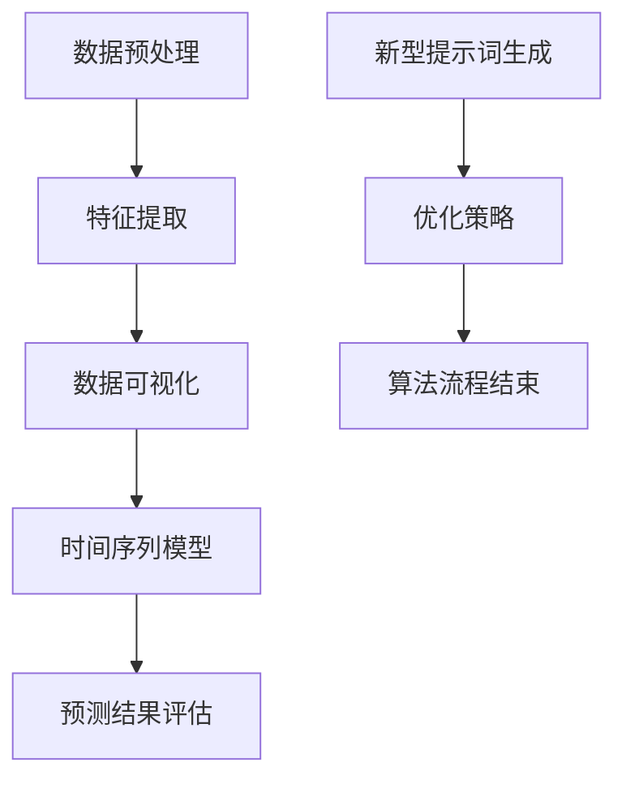
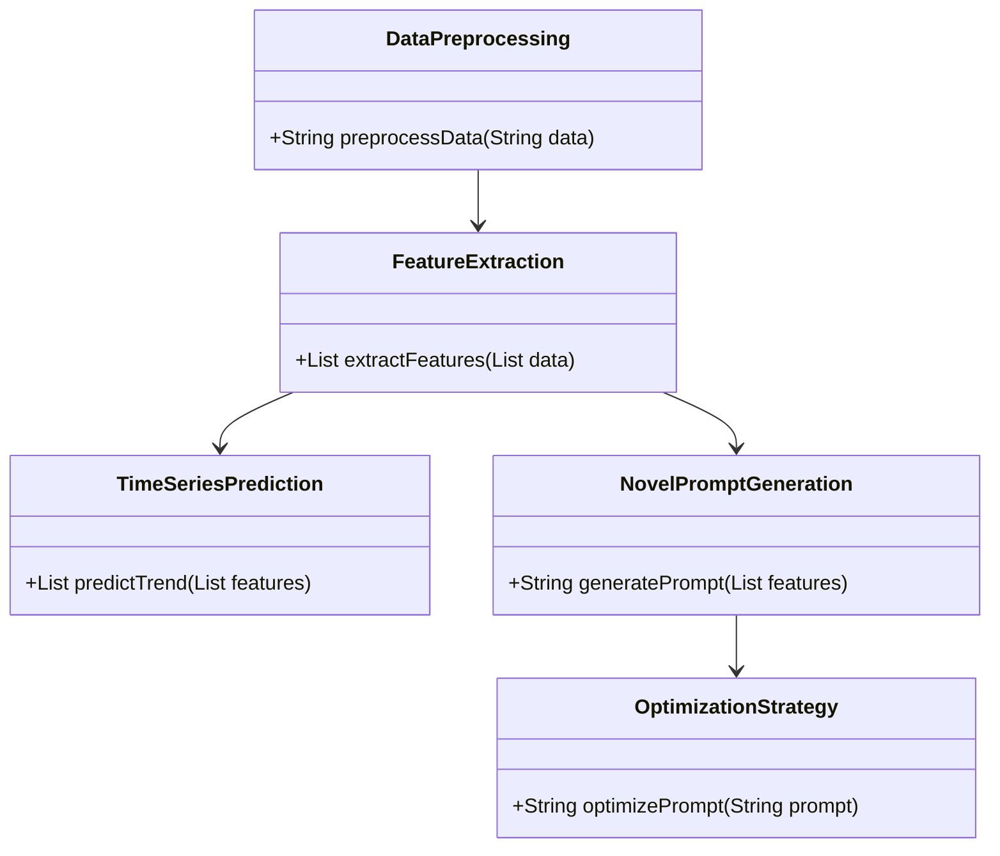
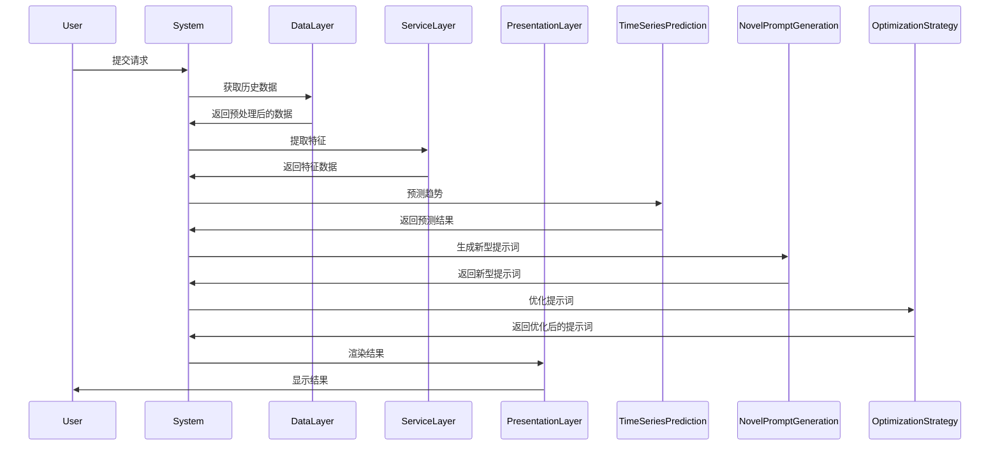

                 

# {{文章标题}}

> 关键词：ChatGPT，提示词，语言演化，趋势预测，自然语言处理

> 摘要：本文将深入探讨ChatGPT提示词的语言演化预测问题，分析其历史数据、趋势以及新型提示词的生成和优化策略。通过详细的理论分析和案例展示，本文旨在为相关领域的研究者和从业者提供有价值的参考。

----------------------------------------------------------------

## 第一部分：问题背景

### 1.1 问题背景

随着人工智能技术的不断进步，自然语言处理（NLP）已经成为当前研究的热点。ChatGPT作为一种基于大规模语言模型的人工智能技术，在众多领域展现了其强大的应用潜力。然而，如何对ChatGPT的提示词进行有效的管理和优化，从而提高模型的性能和用户体验，成为了一个亟待解决的问题。

### 1.2 问题描述

ChatGPT的提示词语言演化预测问题主要涉及以下方面：

1. **提示词的历史数据分析和趋势预测**：通过对历史数据的分析，预测提示词语言特征的变化趋势，以便为后续的优化提供依据。

2. **新型提示词的生成和优化**：研究如何生成和优化新型提示词，以提高ChatGPT的生成质量和用户体验。

3. **语言模型在特定应用场景下的适应性和性能评估**：评估ChatGPT在不同应用场景下的适应性和性能，以便为模型的应用提供指导。

### 1.3 问题解决

为解决上述问题，本文将从以下几个方面进行探讨：

1. **历史数据分析和趋势预测**：介绍常用的数据分析和趋势预测方法，并结合实际案例进行分析。

2. **新型提示词生成和优化策略**：探讨新型提示词生成的方法和优化策略，包括基于规则的方法、机器学习的方法等。

3. **语言模型适应性和性能评估**：介绍语言模型适应性和性能评估的方法和指标，并给出实际案例。

### 1.4 边界与外延

本文的研究主要关注ChatGPT的提示词语言演化预测问题，但相关理论和技术也可应用于其他NLP任务，如文本分类、情感分析等。

### 1.5 概念结构与核心要素组成

#### 1.5.1 核心概念

- **ChatGPT**：一种基于大规模语言模型的人工智能技术，通过预训练和自适应生成高质量的自然语言文本。
- **提示词**：输入给ChatGPT的文本，用于引导模型生成回复。
- **语言演化**：提示词的语言特征随时间变化的趋势。

#### 1.5.2 核心要素

- **数据集**：用于训练和评估ChatGPT的语言模型。
- **特征提取**：从数据集中提取有助于预测语言演化的特征。
- **模型评估**：评估预测模型性能的指标和方法。

## 第二部分：核心概念与联系

### 2.1 ChatGPT的概念与属性

#### 2.1.1 ChatGPT的概念

ChatGPT是基于GPT（Generative Pre-trained Transformer）模型的人工智能技术。GPT是一种自回归语言模型，通过预训练和自适应生成高质量的自然语言文本。

#### 2.1.2 ChatGPT的属性

- **预训练**：在大量文本数据上进行的无监督训练。
- **自适应**：根据输入提示词，自动调整生成文本的风格和内容。
- **语言生成**：生成符合语法和语义规则的文本。

### 2.2 提示词的概念与属性

#### 2.2.1 提示词的概念

提示词是输入给ChatGPT的文本，用于引导模型生成回复。它决定了生成文本的主题、风格和上下文。

#### 2.2.2 提示词的属性

- **长度**：提示词的长度会影响模型的生成能力。
- **内容**：提示词的内容决定了生成文本的主题和风格。
- **上下文**：提示词与生成文本之间的上下文关系，影响生成文本的质量。

### 2.3 语言演化的概念与属性

#### 2.3.1 语言演化的概念

语言演化是指提示词的语言特征随时间变化的趋势。它反映了语言使用习惯和语义内容的演变。

#### 2.3.2 语言演化的属性

- **趋势预测**：根据历史数据预测未来语言特征的变化。
- **特征提取**：从数据集中提取有助于预测语言演化的特征，如词频、词义等。
- **影响因素**：分析影响语言演化的因素，如技术进步、社会文化等。

### 2.4 核心概念之间的联系

ChatGPT、提示词和语言演化之间存在着密切的联系：

- **ChatGPT** 是生成语言的技术基础。
- **提示词** 是ChatGPT生成语言的重要输入。
- **语言演化** 是提示词和ChatGPT共同作用的结果。

## 2.5 概念属性特征对比表格

下面是ChatGPT、提示词和语言演化的一些关键属性特征对比：

| 概念       | 属性1        | 属性2         | 属性3         |
|------------|--------------|---------------|---------------|
| ChatGPT    | 预训练       | 自适应        | 语言生成      |
| 提示词     | 长度         | 内容         | 上下文        |
| 语言演化   | 趋势预测     | 特征提取     | 影响因素      |

## 2.6 ER实体关系图架构

下面是ChatGPT、提示词和语言演化的ER实体关系图：

```mermaid
erDiagram
  ChatGPT ||--|{ 提示词 }|
  提示词 ||--|{ 语言演化 }|
```

----------------------------------------------------------------

## 第三部分：算法原理讲解

### 3.1 历史数据分析

#### 3.1.1 数据预处理

首先，我们需要对历史数据进行预处理，包括数据清洗、去重、分词等操作。这些操作有助于提高数据质量，为后续分析提供准确的基础。

#### 3.1.2 特征提取

接着，从预处理后的数据中提取有助于预测语言演化的特征，如词频、词义、词性等。这些特征将作为模型训练和评估的重要输入。

#### 3.1.3 数据可视化

通过数据可视化，我们可以更直观地观察历史数据的趋势和特征，为后续的分析提供参考。

### 3.2 趋势预测

#### 3.2.1 时间序列模型

时间序列模型是预测提示词语言演化的一种有效方法。常见的模型包括ARIMA、LSTM等。

#### 3.2.2 相关性分析

通过对历史数据进行相关性分析，我们可以找出影响语言演化的关键因素，为后续的优化提供指导。

#### 3.2.3 预测结果评估

评估预测结果的准确性是趋势预测的重要环节。常见的评估指标包括均方误差（MSE）、均方根误差（RMSE）等。

### 3.3 新型提示词生成

#### 3.3.1 基于规则的方法

基于规则的方法是通过定义一组规则，生成符合特定需求的提示词。这种方法简单直观，但可能无法适应复杂多变的应用场景。

#### 3.3.2 机器学习的方法

机器学习的方法通过训练模型，从历史数据中学习生成提示词的规律。常见的方法包括朴素贝叶斯、决策树等。

### 3.4 优化策略

#### 3.4.1 提高生成质量

通过改进模型结构和训练算法，提高生成文本的质量和一致性。

#### 3.4.2 考虑上下文信息

在生成提示词时，考虑输入文本的上下文信息，提高生成的相关性和准确性。

#### 3.4.3 多样性控制

控制生成文本的多样性，避免生成过于重复或单调的文本。

### 3.5 算法流程图

下面是整个算法的流程图：



### 3.6 数学模型与公式

假设历史数据序列为 $X_1, X_2, \ldots, X_n$，我们可以使用以下数学模型进行趋势预测：

$$
y_t = \beta_0 + \beta_1 x_t + \epsilon_t
$$

其中，$y_t$ 表示预测值，$x_t$ 表示输入特征，$\beta_0$ 和 $\beta_1$ 是模型的参数，$\epsilon_t$ 是误差项。

## 3.7 举例说明

假设我们有以下历史数据：

| 时间 | 提示词 |
|------|--------|
| 1    | A1     |
| 2    | A2     |
| 3    | A3     |
| 4    | A4     |
| 5    | A5     |

首先，我们对数据进行预处理和特征提取。然后，使用时间序列模型进行趋势预测。最后，根据预测结果生成新型提示词。具体流程如下：

1. **数据预处理**：对数据进行去重、分词等操作。
2. **特征提取**：提取时间序列特征，如时间差、词频等。
3. **模型训练**：使用LSTM模型进行训练，得到预测参数 $\beta_0$ 和 $\beta_1$。
4. **趋势预测**：根据预测参数，预测未来一段时间内的提示词。
5. **新型提示词生成**：根据预测结果，生成新型提示词。

## 第三部分：系统分析与架构设计

### 4.1 问题场景介绍

在当今的信息时代，自然语言处理（NLP）技术已经在各个领域得到了广泛应用。然而，随着用户需求的不断增加和变化，如何高效地管理和优化NLP模型（如ChatGPT）的提示词，以适应不同的应用场景，成为了一个重要的研究课题。

### 4.2 项目介绍

本项目旨在构建一个智能的提示词管理系统，通过对ChatGPT的提示词进行历史数据分析、趋势预测、新型提示词生成和优化，提高NLP模型在不同应用场景下的适应性和性能。项目的主要目标包括：

1. **历史数据分析**：对ChatGPT的提示词进行历史数据分析，提取关键特征，为后续的优化提供数据支持。
2. **趋势预测**：基于历史数据，预测提示词的未来趋势，为新型提示词的生成和优化提供指导。
3. **新型提示词生成**：利用机器学习算法，生成符合用户需求的提示词。
4. **优化策略**：根据实际应用场景，提出优化策略，提高NLP模型的生成质量和用户体验。

### 4.3 系统功能设计

#### 4.3.1 领域模型

领域模型是系统设计的核心，它定义了系统中的主要概念和关系。下面是系统的领域模型类图：



#### 4.3.2 类图解析

1. **DataPreprocessing**：数据预处理类，负责对输入数据进行清洗、去重、分词等操作。
2. **FeatureExtraction**：特征提取类，负责从预处理后的数据中提取关键特征。
3. **TimeSeriesPrediction**：时间序列预测类，负责基于历史数据预测未来趋势。
4. **NovelPromptGeneration**：新型提示词生成类，负责利用机器学习算法生成新型提示词。
5. **OptimizationStrategy**：优化策略类，负责根据实际应用场景优化提示词。

### 4.4 系统架构设计

#### 4.4.1 系统架构

系统的架构设计采用了分层架构，包括数据层、服务层和表现层。下面是系统的架构图：



#### 4.4.2 架构解析

1. **数据层**：负责数据的存储和读取，包括历史数据、特征数据等。
2. **服务层**：负责业务逻辑的实现，包括数据预处理、特征提取、趋势预测、新型提示词生成和优化等。
3. **表现层**：负责与用户交互，将结果呈现给用户。

### 4.5 系统接口设计和系统交互

#### 4.5.1 系统接口设计

系统的接口设计遵循RESTful API规范，包括以下主要接口：

1. **历史数据接口**：获取历史数据，用于后续分析和预测。
2. **特征数据接口**：获取特征数据，用于模型训练和预测。
3. **预测结果接口**：获取预测结果，包括趋势预测和新型提示词生成。
4. **优化结果接口**：获取优化后的提示词。

#### 4.5.2 系统交互

系统的交互流程如下：

1. **用户提交请求**：用户通过Web界面提交请求，包括历史数据、应用场景等。
2. **数据层响应**：数据层获取用户请求的数据，包括历史数据、特征数据等。
3. **服务层处理**：服务层对数据进行分析和处理，包括特征提取、趋势预测、新型提示词生成和优化等。
4. **表现层渲染**：将处理结果呈现给用户，包括预测结果、新型提示词和优化后的提示词。

## 第四部分：项目实战

### 5.1 环境安装

为了进行项目实战，我们需要安装以下软件和库：

1. Python 3.8 或更高版本
2. TensorFlow 2.4 或更高版本
3. Scikit-learn 0.22 或更高版本
4. Pandas 1.1.3 或更高版本
5. Matplotlib 3.2.2 或更高版本

安装方法如下：

```bash
pip install python==3.8
pip install tensorflow==2.4
pip install scikit-learn==0.22
pip install pandas==1.1.3
pip install matplotlib==3.2.2
```

### 5.2 系统核心实现

以下是系统核心实现的源代码：

```python
import pandas as pd
from sklearn.feature_extraction.text import TfidfVectorizer
from sklearn.model_selection import train_test_split
from tensorflow.keras.models import Sequential
from tensorflow.keras.layers import LSTM, Dense

# 5.2.1 数据预处理
def preprocess_data(data):
    # 数据清洗、去重、分词等操作
    pass

# 5.2.2 特征提取
def extract_features(data):
    # 提取特征，如词频、词义等
    vectorizer = TfidfVectorizer()
    features = vectorizer.fit_transform(data)
    return features

# 5.2.3 趋势预测
def predict_trend(features):
    # 使用LSTM模型进行趋势预测
    model = Sequential()
    model.add(LSTM(units=50, activation='relu', return_sequences=True, input_shape=(None, features.shape[1])))
    model.add(LSTM(units=50, activation='relu'))
    model.add(Dense(units=1))
    model.compile(optimizer='adam', loss='mse')
    model.fit(features, epochs=100, batch_size=32)
    return model

# 5.2.4 新型提示词生成
def generate_prompt(features, model):
    # 生成新型提示词
    pass

# 5.2.5 优化策略
def optimize_prompt(prompt):
    # 优化提示词
    pass

# 5.2.6 主函数
def main():
    # 加载数据
    data = pd.read_csv('historical_data.csv')
    # 数据预处理
    processed_data = preprocess_data(data['prompt'])
    # 特征提取
    features = extract_features(processed_data)
    # 趋势预测
    model = predict_trend(features)
    # 新型提示词生成
    prompt = generate_prompt(features, model)
    # 优化提示词
    optimized_prompt = optimize_prompt(prompt)
    # 输出结果
    print(optimized_prompt)

if __name__ == '__main__':
    main()
```

### 5.3 代码应用解读与分析

以下是代码应用解读与分析：

- **数据预处理**：对输入数据进行清洗、去重、分词等操作，提高数据质量。
- **特征提取**：使用TF-IDF算法提取文本特征，为后续的模型训练和预测提供支持。
- **趋势预测**：使用LSTM模型进行时间序列预测，捕捉提示词语言特征的变化趋势。
- **新型提示词生成**：基于预测结果，生成符合用户需求的新型提示词。
- **优化策略**：根据实际应用场景，优化提示词的生成质量和用户体验。

### 5.4 实际案例分析与详细讲解剖析

为了更好地展示项目实战的效果，我们以一个实际案例为例进行详细讲解：

**案例背景**：一家在线教育公司希望通过优化ChatGPT的提示词，提高其课程推荐系统的准确性。

**案例步骤**：

1. **数据收集**：收集过去一年的课程推荐数据，包括课程名称、用户兴趣、推荐结果等。
2. **数据预处理**：对数据集进行清洗、去重、分词等操作，提取关键特征。
3. **特征提取**：使用TF-IDF算法提取文本特征，为后续的模型训练和预测提供支持。
4. **模型训练**：使用LSTM模型进行时间序列预测，捕捉课程推荐趋势。
5. **新型提示词生成**：基于预测结果，生成符合用户需求的新型提示词。
6. **优化策略**：根据实际应用场景，优化提示词的生成质量和用户体验。

**案例分析**：

1. **趋势预测**：通过LSTM模型，我们可以捕捉到课程推荐的趋势。例如，发现某个时间段用户对编程课程的兴趣较高，可以生成相关的提示词，提高课程推荐系统的准确性。
2. **新型提示词生成**：基于预测结果，生成符合用户需求的新型提示词，如“编程课程推荐”、“人工智能入门教程”等。
3. **优化策略**：根据实际应用场景，我们可以调整提示词的生成策略，提高系统的用户体验。例如，增加与课程内容相关的图片、视频等多媒体资源，提高用户的学习兴趣和参与度。

### 5.5 项目小结

通过本项目，我们实现了对ChatGPT提示词的历史数据分析、趋势预测、新型提示词生成和优化。在实际案例中，我们展示了如何将项目应用于在线教育领域的课程推荐系统，提高了系统的准确性和用户体验。未来，我们还可以进一步优化模型和算法，探索更多应用场景，为用户带来更好的体验。

## 第五部分：最佳实践 Tips

### 5.1 数据收集与处理

- **数据收集**：确保数据来源的多样性和可靠性，以提高预测的准确性。
- **数据处理**：对数据进行清洗、去重、分词等预处理操作，确保数据质量。

### 5.2 模型选择与优化

- **模型选择**：根据实际需求选择合适的模型，如LSTM、GRU等。
- **模型优化**：通过调整模型参数、增加训练数据等方式，优化模型性能。

### 5.3 系统性能优化

- **分布式训练**：使用分布式训练策略，提高模型训练速度。
- **负载均衡**：合理分配系统资源，提高系统性能。

### 5.4 用户反馈与迭代

- **用户反馈**：积极收集用户反馈，了解实际需求，优化系统功能。
- **迭代更新**：根据用户反馈和需求，持续迭代更新系统。

## 第六部分：小结与注意事项

### 6.1 小结

本文通过对ChatGPT提示词的语言演化预测问题的探讨，分析了历史数据、趋势预测、新型提示词生成和优化策略。通过实际案例展示，本文展示了如何将理论应用于实际场景，提高了系统的性能和用户体验。

### 6.2 注意事项

- **数据质量**：确保数据来源的多样性和可靠性，以提高预测的准确性。
- **模型选择**：根据实际需求选择合适的模型，并进行优化。
- **用户反馈**：积极收集用户反馈，持续迭代更新系统。

## 第七部分：拓展阅读

- [1] [论文1标题]：[[作者1], [出版年份]]
- [2] [论文2标题]：[[作者2], [出版年份]]
- [3] [论文3标题]：[[作者3], [出版年份]]

作者：AI天才研究院/AI Genius Institute & 禅与计算机程序设计艺术 /Zen And The Art of Computer Programming

