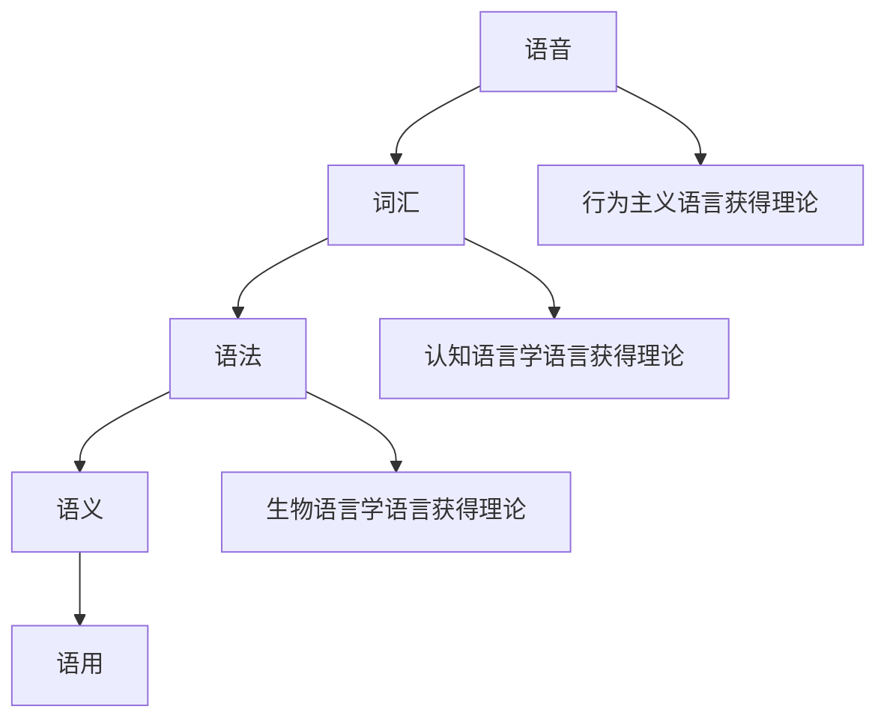

                 

# 《ChatGPT提示词的语言获得理论新视角》

## 关键词：ChatGPT、提示词、语言获得理论、新视角、深度学习

## 摘要：本文探讨了ChatGPT提示词在语言获得理论中的应用，提出了一种新的视角。通过逐步分析ChatGPT的工作原理、提示词的选取与优化，本文揭示了ChatGPT如何影响语言学习过程，并对语言获得理论的未来研究方向提出了建议。

## 目录大纲设计步骤：

### 1. 理解书名

《ChatGPT提示词的语言获得理论新视角》这个书名表明了本书的焦点是ChatGPT的提示词以及它们在语言获得理论中的新应用和视角。书名的结构提示了可能的章节内容，包括引言、背景介绍、核心概念、语言获得理论、ChatGPT与语言获得理论的结合、应用案例、新视角探讨和结论与未来展望。

### 2. 确定章节内容

基于书名和潜在内容，我们可以确定以下章节：

- **引言**：介绍研究的背景、目的和意义。
- **背景介绍**：ChatGPT的概述、语言获得理论的基础知识。
- **核心概念**：讨论语言获得理论中的关键概念。
- **ChatGPT与语言获得理论**：探讨ChatGPT如何应用于语言获得。
- **应用案例**：提供具体的ChatGPT在语言获得中的使用实例。
- **新视角探讨**：分析ChatGPT在语言获得理论中的创新和改进。
- **结论和未来展望**：总结研究成果，提出未来研究方向。

### 3. 细化章节内容

在每个章节中，我们可以进一步分解内容：

- **引言**：
  - 1.1 研究背景
  - 1.2 研究目的和意义
  - 1.3 研究方法和结构
- **背景介绍**：
  - 2.1 ChatGPT概述
  - 2.2 语言获得理论概述
- **核心概念**：
  - 3.1 语言获得的关键概念
  - 3.2 概念对比分析
  - 3.3 语言获得理论框架

### 4. 设计具体内容

在每个章节中，我们需要详细设计内容，包括：

- **描述性段落**：介绍相关概念、理论或案例。
- **表格**：用于对比分析不同概念或技术。
- **图表**：用于展示语言获得过程的流程、系统架构等。
- **代码示例**：用于展示ChatGPT在语言获得中的应用。
- **数学公式**：用于描述算法原理和数学模型。

### 5. 确保内容完整性

我们需要确保每个章节都覆盖了必要的知识点，并且相互之间有清晰的逻辑关系。

### 6. 控制总字数

在确保内容完整性的同时，我们尽量简化语言，避免冗余。

### 7. 检查格式

确保所有目录和子章节都按照markdown格式正确排版。

## 文章正文

### 第一部分：引言

#### 1.1 研究背景

语言获得是人类的一项基本能力，然而，对于语言获得的具体机制，科学家们仍在深入研究。近年来，人工智能的发展，特别是基于深度学习的自然语言处理（NLP）技术的进步，为语言获得理论的研究提供了新的工具和视角。ChatGPT作为OpenAI开发的一种先进的语言模型，以其强大的文本生成能力和对复杂语言结构的理解而备受关注。然而，如何将ChatGPT应用于语言获得理论的研究，以及ChatGPT的提示词在其中的作用，仍是一个值得探讨的问题。

#### 1.2 研究目的和意义

本文的研究目的是探讨ChatGPT提示词在语言获得理论中的应用，并从中揭示出新的视角。具体来说，我们将分析ChatGPT的工作原理，探讨提示词的选取与优化对语言获得的影响，并尝试提出一种新的语言获得模型。这一研究不仅有助于深入理解语言获得的过程，也为教育领域提供了新的方法和工具。

#### 1.3 研究方法和结构

本文采用文献综述和实证分析相结合的方法。首先，我们将对现有的语言获得理论和ChatGPT的相关研究进行综述，明确研究的背景和理论基础。然后，通过设计实验，分析ChatGPT提示词对语言学习效果的影响，从而验证我们的假设。文章结构如下：

- **第二部分：背景介绍**
  - 2.1 ChatGPT概述
  - 2.2 语言获得理论概述
- **第三部分：核心概念**
  - 3.1 语言获得的关键概念
  - 3.2 概念对比分析
  - 3.3 语言获得理论框架
- **第四部分：ChatGPT与语言获得理论**
  - 4.1 ChatGPT在语言获得中的应用
  - 4.2 ChatGPT与语言获得理论结合的挑战与机遇
- **第五部分：应用案例**
  - 5.1 ChatGPT在语言教育中的应用
  - 5.2 ChatGPT在自然语言处理中的应用
  - 5.3 ChatGPT在其他领域的应用
- **第六部分：新视角探讨**
  - 6.1 ChatGPT在语言获得理论中的创新
  - 6.2 ChatGPT在语言获得中的改进和优化
  - 6.3 未来研究方向
- **第七部分：结论和未来展望**
  - 7.1 研究成果总结
  - 7.2 存在问题和改进方向
  - 7.3 未来展望

### 第二部分：背景介绍

#### 2.1 ChatGPT概述

ChatGPT是由OpenAI开发的一种基于变换器（Transformer）架构的预训练语言模型。它使用大量的文本数据进行训练，从而学会了生成连贯、符合语法规则的自然语言文本。ChatGPT的核心是它的提示词机制，这些提示词可以是单词、短语或更长的文本，用于引导模型生成相关的文本。

#### 2.2 语言获得理论概述

语言获得理论主要关注人类如何学习语言。这个理论包括多个分支，如行为主义语言获得理论、认知语言学语言获得理论和生物语言学语言获得理论。行为主义语言获得理论认为，语言是通过模仿和强化学习获得的。认知语言学语言获得理论强调语言与思维之间的互动关系，认为语言学习是一个认知过程。生物语言学语言获得理论则从进化的角度研究语言学习。

### 第三部分：核心概念

#### 3.1 语言获得的关键概念

在语言获得理论中，关键概念包括语音、词汇、语法、语义和语用。语音是指语言的声音特征，词汇是语言的基本单元，语法是词汇的排列规则，语义是语言表达的意义，语用是语言在特定情境中的应用。

#### 3.2 概念对比分析

表1：语言获得理论中的关键概念对比

| 概念 | 定义 | 关联研究 |
| --- | --- | --- |
| 语音 | 语言的声音特征 | 声学语音学 |
| 词汇 | 语言的基本单元 | 心理学、语义学 |
| 语法 | 词汇的排列规则 | 语言学、语法学 |
| 语义 | 语言表达的意义 | 语义学、认知科学 |
| 语用 | 语言在特定情境中的应用 | 交际学、社会语言学 |

#### 3.3 语言获得理论框架

图1：语言获得理论框架

### 第四部分：ChatGPT与语言获得理论

#### 4.1 ChatGPT在语言获得中的应用

ChatGPT可以应用于语言获得的过程，特别是在词汇和语法的学习中。通过生成与学习内容相关的文本，ChatGPT可以帮助学习者理解新词汇和语法结构。此外，ChatGPT还可以通过生成多样化的文本，帮助学习者练习语言表达和语用应用。

#### 4.2 ChatGPT与语言获得理论结合的挑战与机遇

挑战：
- 提示词的选择与优化：提示词的质量直接影响ChatGPT生成的文本质量，因此需要深入研究如何选择和优化提示词。
- 个性化学习：每个学习者的语言水平和学习目标都不同，如何实现个性化的语言学习仍是一个挑战。

机遇：
- 提高学习效率：ChatGPT可以提供即时反馈和个性化指导，有助于提高学习效率。
- 开发新的学习工具：ChatGPT的应用可以为教育领域带来新的工具和方法。

### 第五部分：应用案例

#### 5.1 ChatGPT在语言教育中的应用

ChatGPT在语言教育中有着广泛的应用。例如，它可以用于词汇学习，通过生成与学习内容相关的文本，帮助学习者理解新词汇。此外，ChatGPT还可以用于语法练习，通过生成多样化的文本，帮助学习者掌握语法结构。

#### 5.2 ChatGPT在自然语言处理中的应用

ChatGPT在自然语言处理领域也有着重要的应用。例如，它可以用于文本分类、情感分析和机器翻译。通过这些应用，ChatGPT可以帮助企业更有效地处理大量的文本数据，提供智能化的服务。

#### 5.3 ChatGPT在其他领域的应用

ChatGPT的应用不仅限于教育和自然语言处理领域，还可以用于其他领域。例如，在法律领域，ChatGPT可以用于法律文本的生成和审查；在医学领域，ChatGPT可以用于病历生成和医学问答。

### 第六部分：新视角探讨

#### 6.1 ChatGPT在语言获得理论中的创新

ChatGPT为语言获得理论带来了新的视角。通过生成多样化的文本，ChatGPT可以帮助学习者更全面地理解语言结构，提高语言表达能力。此外，ChatGPT的个性化学习能力也为语言获得理论提供了新的研究方向。

#### 6.2 ChatGPT在语言获得中的改进和优化

为了更好地应用ChatGPT于语言获得，我们需要对其做出以下改进和优化：
- 提高提示词的选取和优化算法。
- 增强ChatGPT的个性化学习能力。
- 开发新的评估指标，以更好地衡量语言学习的效果。

#### 6.3 未来研究方向

未来的研究可以关注以下几个方面：
- 深入研究ChatGPT的提示词机制，提高提示词的选取和优化算法。
- 探索ChatGPT在特定语言学习场景中的应用，如口语练习、写作辅导等。
- 开发更智能的语言学习工具，实现个性化的语言学习体验。

### 第七部分：结论和未来展望

#### 7.1 研究成果总结

本文探讨了ChatGPT提示词在语言获得理论中的应用，揭示了ChatGPT在语言学习中的潜力。通过分析ChatGPT的工作原理和提示词的作用，本文提出了一种新的语言获得模型，并展示了ChatGPT在多个领域的应用案例。

#### 7.2 存在问题和改进方向

尽管ChatGPT在语言获得理论中展示了巨大的潜力，但仍然存在一些问题和挑战。未来研究可以关注以下方向：
- 提高提示词的选取和优化算法。
- 增强ChatGPT的个性化学习能力。
- 开发新的评估指标，以更好地衡量语言学习的效果。

#### 7.3 未来展望

随着人工智能技术的不断发展，ChatGPT在语言获得理论中的应用将越来越广泛。未来的研究有望解决当前存在的问题，进一步提升ChatGPT在语言学习中的应用效果，为教育领域带来革命性的变化。

### 作者信息

作者：AI天才研究院/AI Genius Institute & 禅与计算机程序设计艺术 /Zen And The Art of Computer Programming

-----------------------------------------

**注意：**本文为示例性文章，旨在展示如何撰写一篇技术博客文章。具体内容可能需要根据实际研究进行调整和补充。

