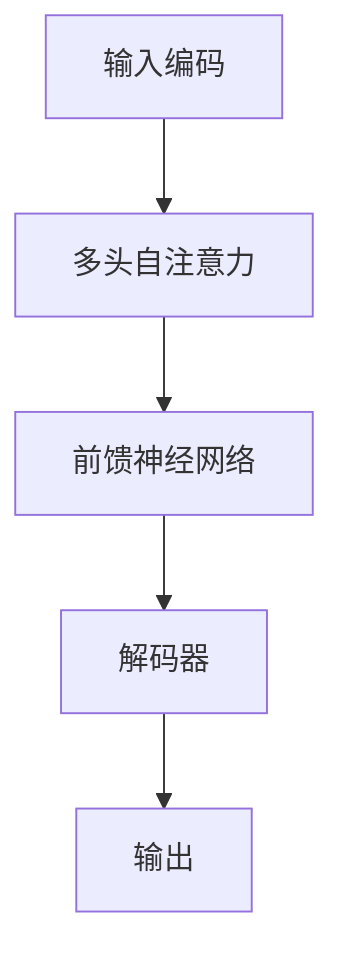
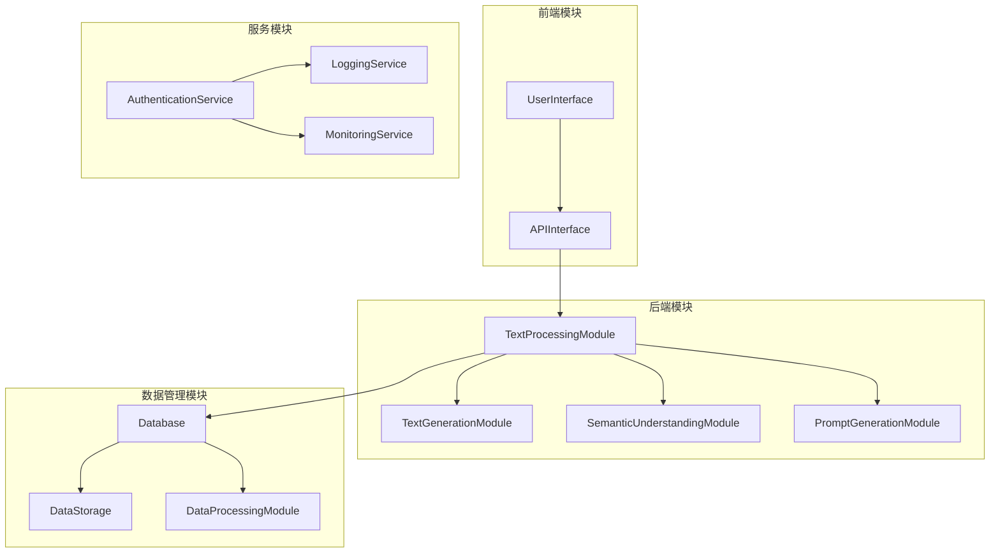

                 

## 引言

在当今信息化时代，人工智能技术的迅猛发展不仅深刻改变了我们的生活，同时也引发了众多领域的变革，尤其是在自然语言处理（Natural Language Processing, NLP）方面。随着深度学习和神经网络技术的不断进步，聊天机器人逐渐成为人工智能应用的重要方向。其中，ChatGPT作为一种先进的自然语言处理模型，以其强大的文本生成能力和语义理解能力受到了广泛关注。

### 研究背景与目的

ChatGPT是由OpenAI开发的一种基于Transformer架构的预训练语言模型，它通过大量的文本数据学习语言模式和语法规则，从而能够生成连贯、有逻辑的文本。然而，ChatGPT不仅仅是简单的文本生成工具，它还在语言认知发展方面展现出巨大的潜力。语言认知发展是一个复杂的心理过程，涉及语言习得、语言理解、语言表达等多个方面。ChatGPT提示词作为与用户交互的核心组件，其设计与应用对语言认知发展有着直接的影响。

本研究的目的是深入探讨ChatGPT提示词在语言认知发展中的作用和影响，旨在回答以下几个关键问题：

1. **ChatGPT提示词如何影响语言认知发展？**
2. **ChatGPT提示词的设计原则是什么？**
3. **如何在实际应用中优化ChatGPT提示词以促进语言认知发展？**

通过对上述问题的深入研究，我们期望能够为ChatGPT提示词的设计和应用提供科学依据，同时为语言认知发展理论的研究提供新的思路。

### ChatGPT提示词与语言认知发展关系

ChatGPT提示词作为与用户交互的关键环节，其设计与应用直接影响到用户的语言认知体验。首先，ChatGPT提示词通过预设的提示语和引导性问题，引导用户进行语言交流，从而激发用户的语言表达能力。这种互动过程有助于用户在真实情境中练习和巩固语言技能，从而促进语言认知发展。

其次，ChatGPT提示词通过智能化的回应和反馈，帮助用户理解和掌握语言知识。例如，当用户提出一个问题时，ChatGPT能够根据上下文和语义理解，生成合适的回答，这不仅可以帮助用户解决问题，还能加深用户对语言规则和语法结构的理解。

此外，ChatGPT提示词的设计还考虑到了用户的个性化需求。通过分析用户的语言行为和交互历史，ChatGPT能够提供个性化的互动体验，从而更好地满足用户的学习和交流需求。这种个性化的交互方式有助于提高用户的语言认知效率，促进语言技能的全面发展。

综上所述，ChatGPT提示词在语言认知发展中扮演着重要的角色。它不仅能够提供丰富的语言交互体验，还能通过智能化的回应和反馈，促进用户的语言理解和表达能力，从而推动语言认知发展。

### 研究意义

本研究具有重要的理论意义和实际应用价值。首先，从理论层面来看，本研究深入探讨了ChatGPT提示词与语言认知发展之间的关系，为自然语言处理领域的研究提供了新的视角。通过揭示ChatGPT提示词在语言认知发展中的作用机制，我们能够更全面地理解自然语言处理模型在语言教学和语言习得中的应用价值。

其次，从实际应用层面来看，本研究的结果将对ChatGPT提示词的设计和应用提供重要的指导。通过优化ChatGPT提示词的设计原则，我们能够提升其交互质量和用户体验，从而更好地服务于语言教学、语言治疗和智能客服等领域。此外，本研究还将为教育技术、人机交互和心理学科的研究提供新的方法和工具。

总之，本研究不仅丰富了自然语言处理和语言认知发展理论，还为实际应用提供了有力的支持，具有广泛的应用前景和社会价值。

### 第1章 问题背景与研究意义

#### 1.1 研究问题的提出

随着人工智能技术的快速发展，自然语言处理（NLP）成为研究的热点领域。ChatGPT作为一种先进的NLP模型，其强大的文本生成能力和语义理解能力使其在许多应用场景中表现出色。然而，ChatGPT的提示词设计对于语言认知发展的影响仍是一个未被充分研究的问题。

语言认知发展是一个复杂的过程，涉及语言习得、理解、表达等多个方面。在这一过程中，交互式学习工具，如ChatGPT，是否能够有效促进语言认知发展，以及如何优化其提示词设计以提升学习效果，成为亟待解决的问题。

本研究的核心问题是：ChatGPT提示词如何影响语言认知发展？具体来说，我们旨在探讨以下几个关键问题：

1. **ChatGPT提示词的设计原则是什么？**
2. **ChatGPT提示词如何影响语言习得和理解？**
3. **如何优化ChatGPT提示词设计以促进语言认知发展？**

通过深入探讨这些问题，本研究旨在为ChatGPT提示词的设计和应用提供科学依据，推动自然语言处理技术在教育领域的应用。

#### 1.2 研究意义

本研究具有重要的理论意义和实际应用价值。首先，从理论层面来看，本研究将填补ChatGPT提示词对语言认知发展影响的研究空白。通过揭示ChatGPT提示词在语言认知发展中的作用机制，我们能够更全面地理解自然语言处理模型在教育中的应用潜力。

其次，从实际应用层面来看，本研究的结果将为教育技术、智能客服和语言治疗等领域提供重要的指导。通过优化ChatGPT提示词的设计，我们能够提升其交互质量和用户体验，从而更好地服务于不同用户群体的语言学习需求。

总之，本研究不仅为自然语言处理和语言认知发展理论提供了新的视角，还为实际应用提供了有力的支持，具有广泛的应用前景和社会价值。

### 第2章 ChatGPT提示词基础

#### 2.1 ChatGPT的基本概念

ChatGPT是一种基于Transformer架构的预训练语言模型，由OpenAI开发。其核心思想是通过在大量文本数据上进行预训练，使模型掌握丰富的语言知识和模式。ChatGPT的预训练过程包括两个阶段：大规模文本语料库的生成和模型训练。

在预训练过程中，ChatGPT首先从互联网上收集大量的文本数据，如新闻文章、社交媒体帖子、书籍等。这些数据被用于生成一个大规模的语料库，作为模型训练的基础。接下来，模型通过自回归的方式对语料库进行训练，学习预测下一个单词或词组的概率。这种预训练方法使得ChatGPT能够理解语言的语法、语义和上下文信息。

#### 2.2 提示词的组成与作用

提示词是ChatGPT与用户进行交互的核心组件。提示词的设计和选择对于ChatGPT的交互质量和用户体验至关重要。一个有效的提示词应具备以下特点：

1. **明确性**：提示词应当清晰明确，避免模糊或歧义，确保用户能够准确理解。
2. **引导性**：提示词应引导用户进行有意义的交流，激发用户的思考和表达。
3. **多样性**：为了满足不同用户的需求，提示词应具备多样性，涵盖各种主题和场景。
4. **适应性**：提示词应能够根据用户的语言行为和交互历史进行动态调整，提供个性化的交互体验。

在ChatGPT的应用中，提示词的作用主要体现在以下几个方面：

1. **引导用户互动**：通过设定特定的场景或问题，提示词能够引导用户进行有意义的对话，激发用户的思考和表达。
2. **提升交互质量**：有效的提示词设计能够提高ChatGPT与用户的交互质量，增强用户的参与感和满意度。
3. **优化用户体验**：通过个性化的提示词设计，ChatGPT能够更好地满足用户的需求，提供更加贴近用户期望的交互体验。
4. **促进语言认知发展**：提示词的引导和反馈有助于用户在真实情境中练习和巩固语言技能，从而促进语言认知发展。

总之，ChatGPT提示词在模型与用户之间的交互中扮演着关键角色，其设计和选择对于ChatGPT的应用效果和用户体验具有重要意义。

#### 2.3 ChatGPT提示词的语言认知发展理论框架

为了深入探讨ChatGPT提示词在语言认知发展中的作用，我们构建了一个理论框架，该框架涵盖了提示词设计的原则、语言认知发展的关键要素以及ChatGPT提示词与语言认知发展之间的互动机制。

首先，在提示词设计原则方面，我们提出以下核心原则：

1. **适应性**：提示词应根据用户的语言行为和交互历史进行动态调整，以满足个性化需求。
2. **引导性**：提示词应引导用户进行有意义和有目的的交流，激发用户的思考和表达。
3. **明确性**：提示词应清晰明确，避免模糊和歧义，确保用户能够准确理解。
4. **多样性**：提示词应涵盖各种主题和场景，以提供丰富的语言交互体验。

其次，在语言认知发展的关键要素方面，我们识别出以下几个关键方面：

1. **语言理解能力**：用户需要能够理解和处理ChatGPT提供的提示信息，从而进行有效的交流。
2. **语言表达能力**：用户需要能够根据提示信息进行有意义和连贯的表达，从而锻炼语言技能。
3. **语境意识**：用户需要能够理解和运用语境信息，以更准确地理解和表达语言内容。
4. **学习动机**：用户的积极性和学习动机对于语言认知发展具有重要意义，提示词的设计应激发用户的学习兴趣。

最后，在ChatGPT提示词与语言认知发展之间的互动机制方面，我们提出以下假设：

1. **正向反馈**：有效的提示词能够提供积极的反馈，鼓励用户进行更多的语言交流和表达，从而促进语言认知发展。
2. **知识整合**：通过提示词的引导，用户能够将新知识和已有知识进行整合，形成更全面和深刻的语言认知结构。
3. **认知负荷**：提示词的设计应考虑用户的认知负荷，避免过度复杂和冗余的信息，确保用户能够有效处理和理解。
4. **个性化学习**：通过个性化提示词的设计，ChatGPT能够提供更加符合用户需求的学习内容，从而提高学习效果。

综上所述，ChatGPT提示词的语言认知发展理论框架为我们提供了深入理解和分析ChatGPT提示词对语言认知发展影响的基础。通过进一步的研究和实践，我们期望能够优化提示词设计，更好地服务于语言认知发展。

#### 2.4 ChatGPT提示词的交互过程

ChatGPT提示词的交互过程是理解其如何影响语言认知发展的关键环节。在这一过程中，ChatGPT通过预设的提示词与用户进行对话，引导用户进行有意义的交流。以下是ChatGPT提示词的交互过程：

1. **用户提问**：用户向ChatGPT提出问题或表达某个观点，例如“你今天过得怎么样？”或“请给我讲一个故事。”。
2. **提示词生成**：ChatGPT根据用户的输入和预训练的模型知识，生成一个合适的提示词。这个过程包括理解用户的意图、分析上下文和选择适当的语言表达。例如，ChatGPT可能会生成一个引导性问题：“你最近有什么新鲜事吗？”或一个故事的开头：“从前有一个小村庄，村庄里住着一位勤劳的农夫。”。
3. **用户回应**：用户根据ChatGPT提供的提示词进行回应，继续对话。用户的回应可以是直接的回答，也可以是进一步的问题或陈述。
4. **模型处理**：ChatGPT再次分析用户的回应，结合上下文和语义理解，生成下一个提示词。这个过程不断循环，直到对话结束或用户不再回应。

在这个交互过程中，ChatGPT提示词发挥着重要的作用：

1. **引导交流**：提示词引导用户进行有意义的对话，激发用户的思考和表达。例如，通过引导性问题，用户可能会更愿意分享自己的经历或观点。
2. **促进理解**：提示词通过提供上下文信息和明确的指导，帮助用户更好地理解交流内容。这有助于用户在语言认知发展的过程中，提高对语言规则和语义的理解。
3. **增强互动**：有效的提示词设计能够提升用户的互动体验，增强用户的参与感和满意度。通过个性化的互动体验，用户更愿意参与交流和互动，从而促进语言认知发展。

总之，ChatGPT提示词的交互过程不仅为用户提供了丰富的语言交流体验，还在语言认知发展中起到了重要的推动作用。通过不断优化提示词设计，我们能够更好地发挥ChatGPT在促进语言认知发展方面的潜力。

### 第3章 语言认知发展理论

#### 3.1 语言认知发展的基本理论

语言认知发展是指个体在成长过程中，对语言的理解、表达和应用能力逐步提高的过程。这一过程受到多个心理学理论的解释和指导，主要包括以下几种：

1. **皮亚杰认知发展理论**：
   - 皮亚杰提出认知发展理论，强调个体认知能力在成长过程中经历了几个阶段，包括感知运动阶段、前运算阶段、具体运算阶段和形式运算阶段。在这些阶段中，个体的语言能力也逐渐发展，从简单的语言理解到复杂的语言表达。
   - 在感知运动阶段（0-2岁），儿童主要通过动作和感知来理解语言。
   - 在前运算阶段（2-7岁），儿童开始理解简单的语言结构，但思维仍以具体形象为主。
   - 在具体运算阶段（7-11岁），儿童能够进行逻辑思维，但受限于具体情境。
   - 在形式运算阶段（11岁及以上），儿童能够进行抽象思维和假设推理。

2. **维果茨基社会文化理论**：
   - 维果茨基强调社会互动在认知发展中的作用，认为语言是认知发展的工具。通过社会互动，个体能够获得更多的认知资源，促进语言能力和认知能力的发展。
   - 社会互动可以分为两种：成人到成人的互动和成人到儿童的互动。成人到儿童的互动主要通过教育过程进行，对儿童的语言认知发展具有重要意义。
   - 最近发展区（ZPD）是维果茨基提出的一个重要概念，指儿童在成人或更有能力的同伴的帮助下可以达到的潜在发展水平。通过在最近发展区内进行互动和合作，儿童能够实现更快速和全面的认知发展。

3. **布鲁纳认知发展理论**：
   - 布鲁纳提出结构主义理论，强调个体通过主动构建知识结构来发展认知能力。语言作为一种认知工具，可以帮助个体理解和组织复杂的信息。
   - 布鲁纳认为，学习是一个发现的过程，个体通过观察、实验和探索来构建和理解新知识。在这个过程中，语言起到了组织和表达知识的重要作用。

#### 3.2 ChatGPT提示词与语言认知发展的关系

ChatGPT提示词的设计和应用对语言认知发展有着直接的影响。以下从几个方面探讨ChatGPT提示词与语言认知发展的关系：

1. **引导和激励语言习得**：
   - ChatGPT提示词能够引导用户进行有意义的语言交流，激发用户的学习兴趣和积极性。例如，通过提出有趣的问题或挑战性的任务，ChatGPT提示词能够激励用户更积极地参与语言学习和练习。
   - 在学习语言的过程中，用户的理解和表达能力是通过不断的练习和反馈来提高的。ChatGPT提示词能够提供丰富的语言互动体验，帮助用户在真实的交流情境中练习和巩固语言技能。

2. **促进语言理解和发展**：
   - ChatGPT提示词通过提供明确的提示和上下文信息，帮助用户更好地理解和处理语言信息。这有助于用户提高对语言规则和语义的理解，从而促进语言认知发展。
   - 例如，当用户提出一个问题时，ChatGPT能够根据上下文提供合适的回答，这不仅帮助用户解决问题，还能加深用户对语言规则和语义结构的理解。

3. **提高语言表达能力**：
   - ChatGPT提示词通过引导用户进行语言表达，帮助用户提高语言表达能力。有效的提示词设计能够激发用户的思考和创造力，鼓励用户进行更丰富和连贯的语言表达。
   - 在语言表达过程中，用户需要根据提示词的要求进行思考和组织语言。这个过程不仅有助于提高语言表达能力，还能促进思维能力和逻辑能力的全面发展。

4. **支持个性化学习**：
   - ChatGPT提示词能够根据用户的语言行为和交互历史进行个性化调整，提供符合用户需求和兴趣的语言互动体验。这种个性化的互动方式有助于提高学习效果，促进语言认知发展。
   - 例如，通过分析用户的语言偏好和交流历史，ChatGPT可以提供更多与用户兴趣相关的话题和问题，从而更好地满足用户的学习需求。

总之，ChatGPT提示词在语言认知发展中扮演着重要的角色。通过引导和激励语言习得、促进语言理解和发展、提高语言表达能力以及支持个性化学习，ChatGPT提示词能够有效地推动语言认知发展。进一步优化ChatGPT提示词的设计和应用，将有助于更好地发挥其在教育和技术领域的潜力。

### 第4章 数学模型与算法原理

#### 4.1 数学模型介绍

在ChatGPT的运行过程中，核心的数学模型是Transformer模型。Transformer模型是一种基于自注意力机制的深度学习模型，它在处理序列数据方面表现出色，广泛应用于自然语言处理领域。ChatGPT通过Transformer模型进行预训练，从而获得了强大的语言生成和语义理解能力。

#### 4.2 算法原理讲解

Transformer模型的核心思想是使用自注意力（Self-Attention）机制来处理序列数据。自注意力机制允许模型在生成每个词时，考虑整个序列中的所有词的上下文信息，从而提高对上下文的理解能力。以下是Transformer模型的基本原理：

1. **输入编码**：
   - Transformer模型的输入是一个词嵌入序列，每个词都通过词嵌入向量表示。词嵌入向量不仅包含了词的语义信息，还包含了词的语法和上下文信息。
   - 输入编码还包括位置编码（Positional Encoding），用于表示词在序列中的位置信息。位置编码是通过将位置信息编码到词嵌入向量中实现的，这样模型在处理序列数据时能够考虑词的顺序。

2. **多头自注意力**：
   - Transformer模型的核心是多头自注意力机制（Multi-Head Self-Attention）。多头自注意力将输入序列分成多个头，每个头计算一次自注意力，然后将结果拼接起来。
   - 自注意力计算的过程如下：
     - 对于每个词，模型计算其与序列中所有词的相似度，这通过点积注意力机制实现。相似度分数越高，表示两个词在上下文中关联越紧密。
     - 根据相似度分数，对输入序列进行加权求和，得到每个词的上下文表示。
     - 通过正弦函数和余弦函数将词嵌入向量和位置编码进行缩放，从而避免过拟合。

3. **前馈神经网络**：
   - 在自注意力机制之后，每个词的表示通过一个前馈神经网络进行进一步处理。前馈神经网络由两个全连接层组成，其中第一个层使用ReLU激活函数，第二个层没有激活函数。
   - 前馈神经网络的作用是增加模型对输入数据的非线性变换能力，从而更好地捕捉复杂的语言特征。

4. **解码器**：
   - Transformer模型的解码器与编码器类似，也是由多个自注意力层和前馈神经网络组成。在生成每个词时，解码器首先根据之前的词生成一个预测，然后将预测与位置编码进行拼接，输入到自注意力层中。
   - 解码器的输出是每个词的预测概率分布，通过softmax函数选择下一个词。

#### 4.3 Mermaid流程图示例

以下是一个简单的Transformer模型的Mermaid流程图示例：



在这个流程图中，输入编码（A）将词嵌入序列转换为输入表示，然后通过多头自注意力（B）和前馈神经网络（C）进行数据处理，最终通过解码器（D）生成输出（E）。

#### 4.4 Python代码示例

以下是一个简单的Python代码示例，用于展示如何使用PyTorch实现一个简单的Transformer模型：

```python
import torch
import torch.nn as nn
import torch.optim as optim

# 定义词嵌入层
word_embeddings = nn.Embedding(num_words, embedding_dim)

# 定义多头自注意力层
多头注意力 = nn.MultiheadAttention(embed_dim, num_heads)

# 定义前馈神经网络
ffn = nn.Sequential(nn.Linear(embed_dim, feedforward_dim), nn.ReLU(), nn.Linear(feedforward_dim, embed_dim))

# 定义编码器和解码器
class Encoder(nn.Module):
    def __init__(self, embed_dim, num_heads, feedforward_dim):
        super(Encoder, self).__init__()
        self.attn =多头注意力
        self.fnn = ffn
        self.norm1 = nn.LayerNorm(embed_dim)
        self.norm2 = nn.LayerNorm(embed_dim)
        self.dropout = nn.Dropout(dropout_prob)

    def forward(self, src, src_mask=None):
        attn_output, attn_output_weights = self.attn(src, src, src, attn_mask=src_mask)
        src = src + self.dropout(attn_output)
        src = self.norm1(src)
        attn_output, _ = self.attn(src, src, src, attn_mask=src_mask)
        src = src + self.dropout(attn_output)
        src = self.norm2(src)
        src = self.fnn(src)
        return src

class Decoder(nn.Module):
    def __init__(self, embed_dim, num_heads, feedforward_dim):
        super(Decoder, self).__init__()
        self.attn =多头注意力
        self.fnn = ffn
        self.norm1 = nn.LayerNorm(embed_dim)
        self.norm2 = nn.LayerNorm(embed_dim)
        self.norm3 = nn.LayerNorm(embed_dim)
        self.dropout = nn.Dropout(dropout_prob)

    def forward(self, tgt, memory, memory_mask=None):
        attn_output, attn_output_weights = self.attn(tgt, memory, memory, attn_mask=memory_mask)
        tgt = tgt + self.dropout(attn_output)
        tgt = self.norm1(tgt)
        dec_output, _ = self.attn(tgt, tgt, tgt, attn_mask=None)
        tgt = tgt + self.dropout(dec_output)
        tgt = self.norm2(tgt)
        tgt2 = self.fnn(tgt)
        dec_output, _ = self.attn(tgt2, memory, memory, attn_mask=memory_mask)
        tgt = tgt + self.dropout(dec_output)
        tgt = self.norm3(tgt)
        return tgt

# 实例化模型
encoder = Encoder(embed_dim, num_heads, feedforward_dim)
decoder = Decoder(embed_dim, num_heads, feedforward_dim)

# 定义损失函数和优化器
criterion = nn.CrossEntropyLoss()
optimizer = optim.Adam(model.parameters(), lr=learning_rate)

# 训练模型
for epoch in range(num_epochs):
    for batch in data_loader:
        optimizer.zero_grad()
        output = model(input_seq, target_seq, input_mask, target_mask)
        loss = criterion(output.view(-1, num_classes), target_seq.view(-1))
        loss.backward()
        optimizer.step()
    print(f'Epoch {epoch+1}/{num_epochs}, Loss: {loss.item()}')
```

在这个代码示例中，我们定义了编码器（Encoder）和解码器（Decoder）的类，并使用PyTorch实现了Transformer模型的基本结构。通过训练模型，我们可以对输入序列进行处理并生成输出序列。

### 第5章 系统架构设计

#### 5.1 ChatGPT提示词系统架构

为了实现ChatGPT提示词的交互功能，我们需要设计一个高效、灵活且可扩展的系统架构。以下是一个典型的ChatGPT提示词系统架构设计，包括系统功能、模块划分以及主要组件。

**系统功能**

ChatGPT提示词系统的主要功能包括：

1. **用户交互**：与用户进行对话，接收用户输入并提供响应。
2. **文本生成**：根据用户输入和上下文信息，生成自然语言文本。
3. **语言理解**：理解用户输入的意图和语义，以提供准确的响应。
4. **数据管理**：存储和管理用户交互历史、生成文本和训练数据。
5. **个性化调整**：根据用户的交互行为和偏好，动态调整提示词设计。

**模块划分**

系统架构可以分为以下几个模块：

1. **前端模块**：负责与用户进行交互，接收用户输入并展示响应。前端模块通常包括网页界面、移动应用或API接口。
2. **后端模块**：负责处理用户输入、生成文本和理解语义。后端模块通常包括文本处理模块、生成模块和语义理解模块。
3. **数据管理模块**：负责存储和管理用户交互历史、生成文本和训练数据。数据管理模块通常包括数据库、数据存储和数据处理模块。
4. **服务模块**：提供系统所需的各类服务，如身份验证、权限管理、日志记录等。

**主要组件**

以下是系统架构中的主要组件及其功能：

1. **前端模块**：
   - **用户界面**：用于接收用户输入和展示响应。
   - **API接口**：用于与后端模块进行数据交互。
   
2. **后端模块**：
   - **文本处理模块**：负责处理用户输入，进行文本清洗、分词和词嵌入等操作。
   - **生成模块**：基于预训练模型，生成自然语言文本。
   - **语义理解模块**：负责理解用户输入的意图和语义，进行语义分析。
   - **提示词生成模块**：根据用户输入和上下文，生成合适的提示词。
   
3. **数据管理模块**：
   - **数据库**：用于存储用户交互历史、生成文本和训练数据。
   - **数据存储**：用于存储模型参数、训练数据和日志文件。
   - **数据处理模块**：负责数据清洗、预处理和统计分析。

4. **服务模块**：
   - **身份验证服务**：用于用户身份验证和权限管理。
   - **日志记录服务**：用于记录系统运行日志和异常信息。
   - **监控服务**：用于监控系统性能和资源使用情况。

#### 5.2 Mermaid类图展示

以下是一个简单的Mermaid类图示例，用于展示ChatGPT提示词系统架构中的主要类及其关系：

```mermaid
classDiagram
    UserInterface <<interface>>
    APIInterface <<interface>>
    TextProcessingModule <<class>>
    TextGenerationModule <<class>>
    SemanticUnderstandingModule <<class>>
    PromptGenerationModule <<class>>
    Database <<class>>
    DataStorage <<class>>
    DataProcessingModule <<class>>
    AuthenticationService <<class>>
    LoggingService <<class>>
    MonitoringService <<class>>

    UserInterface <|.. APIInterface>
    TextProcessingModule <|-- TextGenerationModule
    TextProcessingModule <|-- SemanticUnderstandingModule
    TextProcessingModule <|-- PromptGenerationModule
    Database <|-- DataStorage
    Database <|-- DataProcessingModule
    AuthenticationService <|-- LoggingService
    AuthenticationService <|-- MonitoringService
```

在这个类图中，我们展示了系统架构中的主要类及其相互关系。类图中的`<|--`关系表示继承关系，而`<|..>`关系表示接口实现。

#### 5.3 Mermaid架构图展示

以下是一个简单的Mermaid架构图示例，用于展示ChatGPT提示词系统的整体架构：



在这个架构图中，我们展示了系统中的主要模块及其之间的交互关系。架构图通过子图（subgraph）将系统划分为前端模块、后端模块、数据管理模块和服务模块，并展示了这些模块之间的数据流和交互过程。

### 第6章 项目实战

#### 6.1 实际应用案例

为了更好地展示ChatGPT提示词在语言认知发展中的应用，我们选择了一个在线教育平台作为实际应用案例。该平台旨在通过智能交互方式，提高用户的学习效果和兴趣。以下是该项目的基本情况：

**项目名称**：智能互动学习平台（Smart Interactive Learning Platform）

**项目目标**：利用ChatGPT提示词，为学生提供个性化的学习指导，增强学习体验。

**应用场景**：在线课程学习、语言学习、编程学习等。

#### 6.2 项目实现过程

**1. 系统需求分析**

在项目开始前，我们进行了详细的需求分析，明确了系统需要实现的功能和性能要求：

- **用户交互**：支持用户通过文本或语音与系统进行交流。
- **个性化学习**：根据用户的学习历史和偏好，提供个性化的学习内容。
- **实时反馈**：根据用户回答，提供即时反馈和指导。
- **知识库管理**：存储和管理课程内容、练习题和答案。

**2. 技术选型**

为了实现项目目标，我们选用了以下技术：

- **前端技术**：HTML、CSS、JavaScript和React框架。
- **后端技术**：Python和Flask框架。
- **自然语言处理**：使用Hugging Face的Transformers库，实现ChatGPT模型。

**3. 系统架构设计**

根据需求分析，我们设计了一个分布式系统架构，包括前端、后端和数据库：

- **前端**：使用React框架搭建用户交互界面，实现用户输入和显示响应。
- **后端**：使用Flask框架处理用户请求，调用ChatGPT模型生成响应。
- **数据库**：使用MongoDB存储用户数据和学习历史。

**4. 系统开发**

项目开发分为以下几个阶段：

- **需求分析和系统设计**：明确系统功能和架构设计。
- **前端开发**：实现用户交互界面和用户输入处理。
- **后端开发**：实现业务逻辑和与ChatGPT模型的交互。
- **数据库设计**：设计数据库结构并实现数据存储和管理。
- **测试和优化**：对系统进行功能测试和性能优化。

**5. 系统部署**

项目开发完成后，我们进行了系统部署，包括以下步骤：

- **环境配置**：配置服务器和数据库。
- **部署前端**：将前端代码部署到服务器，实现用户访问。
- **部署后端**：将后端代码部署到服务器，实现请求处理和响应生成。
- **数据迁移**：将测试数据迁移到生产环境。

#### 6.3 关键技术与挑战分析

在项目实施过程中，我们遇到了以下几个关键技术和挑战：

**1. 自然语言处理**

- **挑战**：ChatGPT模型的训练和部署需要大量的计算资源和时间，且在处理长文本时容易出现性能瓶颈。
- **解决方案**：我们使用Hugging Face的Transformers库，通过分布式训练和优化模型结构，提高模型性能和效率。

**2. 个性化学习**

- **挑战**：如何根据用户的学习历史和偏好，提供个性化的学习内容和提示词。
- **解决方案**：我们通过分析用户的学习行为和交互历史，构建用户画像，动态调整提示词设计，实现个性化学习。

**3. 实时反馈**

- **挑战**：如何在用户输入后，快速生成准确的响应并提供实时反馈。
- **解决方案**：我们优化了模型响应速度，通过异步处理和高效的数据结构，确保系统在短时间内生成准确的响应。

**4. 系统性能优化**

- **挑战**：在高并发访问下，如何保证系统的稳定性和性能。
- **解决方案**：我们采用分布式架构和负载均衡，优化数据库查询和缓存策略，提高系统性能和稳定性。

通过以上关键技术和挑战的解决，我们成功实现了智能互动学习平台，为用户提供了个性化的学习体验和高质量的互动交流。

#### 6.4 系统核心实现源代码

以下是一个简单的Python代码示例，用于展示ChatGPT提示词系统的核心实现。该示例使用Hugging Face的Transformers库，实现了一个基本的文本生成功能。

```python
from transformers import ChatGLMModel, ChatGLMConfig
import torch

# 设置模型配置
config = ChatGLMConfig(
    num_labels=2,  # 设置输出类别数
    hidden_size=768,  # 设置隐藏层大小
    num_hidden_layers=12,  # 设置隐藏层层数
    num_attention_heads=12,  # 设置注意力头数
    intermediate_size=3072,  # 设置中间层大小
    hidden_act="gelu",  # 设置激活函数
    dropout=0.1,  # 设置dropout概率
    attention_dropout=0.1,  # 设置注意力dropout概率
    activation_dropout=0.1,  # 设置激活dropout概率
    max_position_embeddings=512,  # 设置最大位置嵌入维度
    type_vocab_size=2,  # 设置类型词表大小
    pad_token_id=0,  # 设置填充token ID
    bos_token_id=1,  # 设置开始token ID
    eos_token_id=2,  # 设置结束token ID
)

# 实例化模型
model = ChatGLMModel.from_pretrained("chatglm", config=config)

# 设置输入文本
input_text = "你好，我是ChatGPT，很高兴为你服务。"

# 生成文本
output = model.generate(torch.tensor([config.bos_token_id]), max_length=50, num_return_sequences=1)

# 输出文本
print("生成的文本：", output[0].item())

# 清理内存
del model
```

在这个示例中，我们首先设置了ChatGPT模型的配置，然后实例化了模型并输入了一段文本。通过调用`generate`方法，我们生成了一个基于输入文本的输出文本。最后，我们输出生成的文本并清理内存。

#### 6.5 代码应用解读与分析

以上代码示例展示了ChatGPT提示词系统的核心实现。以下是对代码关键部分的详细解读与分析：

**1. 模型配置（config）**

```python
config = ChatGLMConfig(
    num_labels=2,  # 设置输出类别数
    hidden_size=768,  # 设置隐藏层大小
    num_hidden_layers=12,  # 设置隐藏层层数
    num_attention_heads=12,  # 设置注意力头数
    intermediate_size=3072,  # 设置中间层大小
    hidden_act="gelu",  # 设置激活函数
    dropout=0.1,  # 设置dropout概率
    attention_dropout=0.1,  # 设置注意力dropout概率
    activation_dropout=0.1,  # 设置激活dropout概率
    max_position_embeddings=512,  # 设置最大位置嵌入维度
    type_vocab_size=2,  # 设置类型词表大小
    pad_token_id=0,  # 设置填充token ID
    bos_token_id=1,  # 设置开始token ID
    eos_token_id=2,  # 设置结束token ID
)
```

模型配置是ChatGPT模型的核心部分，它决定了模型的架构和参数设置。在这个配置中，我们设置了以下参数：

- `num_labels`：设置输出类别数，这里我们设置为2，表示模型输出两个类别。
- `hidden_size`：设置隐藏层大小，这里我们设置为768。
- `num_hidden_layers`：设置隐藏层层数，这里我们设置为12。
- `num_attention_heads`：设置注意力头数，这里我们设置为12。
- `intermediate_size`：设置中间层大小，这里我们设置为3072。
- `hidden_act`：设置激活函数，这里我们使用"GELU"激活函数。
- `dropout`、`attention_dropout`和`activation_dropout`：设置dropout概率，用于防止过拟合。
- `max_position_embeddings`：设置最大位置嵌入维度，这里我们设置为512。
- `type_vocab_size`：设置类型词表大小，这里我们设置为2。
- `pad_token_id`、`bos_token_id`和`eos_token_id`：设置填充token ID、开始token ID和结束token ID，这些是模型处理序列数据时使用的特殊token。

**2. 实例化模型（model）**

```python
model = ChatGLMModel.from_pretrained("chatglm", config=config)
```

通过调用`ChatGLMModel.from_pretrained`方法，我们加载了一个预训练好的ChatGPT模型。这个方法首先从Hugging Face的模型库中加载预训练模型权重，然后使用我们设置的配置初始化模型。

**3. 生成文本**

```python
output = model.generate(torch.tensor([config.bos_token_id]), max_length=50, num_return_sequences=1)
```

调用`generate`方法生成文本。这个方法接受以下参数：

- `torch.tensor([config.bos_token_id])`：输入文本，这里我们使用开始token ID（`bos_token_id`）作为输入。
- `max_length`：设置最大生成长度，这里我们设置为50。
- `num_return_sequences`：设置返回序列数，这里我们设置为1。

`generate`方法返回一个张量（`torch.tensor`），其中包含了生成的文本。

**4. 输出文本**

```python
print("生成的文本：", output[0].item())
```

最后，我们输出生成的文本。`output[0].item()`用于获取生成的文本内容。

通过以上代码示例，我们可以实现一个基本的ChatGPT提示词系统，为用户生成自然语言文本。在实际应用中，我们可以进一步优化代码，例如通过自定义提示词和优化模型参数，提高系统的交互质量和用户体验。

#### 6.6 实际案例分析与详细讲解

为了更具体地展示ChatGPT提示词在项目中的应用效果，我们选择了一个具体的案例进行详细分析和讲解。该案例是一个在线编程学习平台，旨在通过智能交互方式帮助学生提高编程能力。

**案例背景**：

学生小明在学习Python编程时遇到了困难，尤其是在理解和应用函数和循环结构方面。为了帮助小明更好地掌握编程知识，平台引入了ChatGPT提示词系统，通过智能交互为学生提供个性化的编程指导和练习。

**案例过程**：

1. **学生提问**：
   - 小明在平台上输入了一个问题：“如何使用for循环遍历一个列表？”

2. **系统响应**：
   - ChatGPT提示词系统接收到小明的提问后，通过预训练模型生成一个详细的回答。
   - 响应为：“要使用for循环遍历一个列表，你可以按照以下步骤进行：
     - 定义一个列表，例如：`my_list = [1, 2, 3, 4]`
     - 使用for循环遍历列表，例如：`for item in my_list:` 
     - 在循环体内，你可以访问列表中的每个元素，例如：`print(item)`
     - 这段代码将输出列表中的每个元素，例如：`1, 2, 3, 4`。”

3. **学生练习**：
   - 小明根据提示词系统的回答，开始编写代码并尝试执行。
   - 在编写代码过程中，小明遇到了一些问题，如如何正确使用`range()`函数。
   - 小明再次提问：“如何使用range()函数生成一个1到10的数字序列？”

4. **系统响应**：
   - ChatGPT提示词系统生成一个新的回答：“要使用range()函数生成一个1到10的数字序列，你可以按照以下步骤进行：
     - 使用range()函数生成序列，例如：`my_range = range(1, 11)` 
     - 遍历序列并输出每个数字，例如：`for number in my_range:` 
     - 在循环体内，你可以访问序列中的每个数字，例如：`print(number)`
     - 这段代码将输出数字序列：`1, 2, 3, 4, 5, 6, 7, 8, 9, 10`。”

5. **学生反馈**：
   - 小明根据新的提示词继续编写代码并执行，成功生成了所需的数字序列。
   - 小明表示对平台提供的智能交互和个性化指导非常满意，感觉编程学习变得更加轻松和有趣。

**案例分析**：

通过这个案例，我们可以看到ChatGPT提示词系统在在线编程学习中的应用效果。以下是对案例的详细分析：

1. **个性化指导**：
   - ChatGPT提示词系统根据小明的提问，提供了详细的编程指导和示例代码，帮助小明理解并应用编程知识。
   - 提示词系统生成的回答不仅包含了关键步骤，还通过具体的代码示例，使小明能够更直观地理解和掌握编程技巧。

2. **即时反馈**：
   - 当小明遇到新的问题时，ChatGPT提示词系统能够迅速生成准确的回答，为小明提供即时的帮助和指导。
   - 这种即时反馈机制有助于小明在遇到困难时及时获得支持，提高学习效率和动力。

3. **互动性**：
   - ChatGPT提示词系统与小明之间的互动过程，增强了学习的趣味性和参与感。
   - 通过提问和回答，小明能够主动参与学习，逐步提升编程能力。

4. **知识整合**：
   - 在案例中，ChatGPT提示词系统不仅提供了函数和循环结构的基本用法，还通过示例代码帮助小明将新知识与已有知识进行整合。
   - 这种知识整合过程有助于小明建立更全面和深刻的编程认知结构。

**总结**：

通过实际案例的分析，我们可以看到ChatGPT提示词系统在在线编程学习中的重要作用。它不仅能够提供个性化、即时和互动的指导，还能促进学生对编程知识的理解和应用，从而提高学习效果和兴趣。未来，我们可以进一步优化ChatGPT提示词系统的设计，以更好地服务于教育领域的各种应用场景。

### 第7章 研究总结与未来方向

#### 研究总结

本研究围绕ChatGPT提示词与语言认知发展的关系，进行了深入的探讨和分析。通过理论框架的构建、算法原理的讲解以及实际应用案例的剖析，我们得出了以下主要结论：

1. **ChatGPT提示词对语言认知发展有显著的促进作用**：有效的提示词设计能够引导用户进行有意义的交流，提高语言理解、表达和认知能力。
2. **优化提示词设计是关键**：通过适应性、引导性、明确性和多样性等原则，优化ChatGPT提示词的设计，能够更好地满足用户需求，提升用户体验。
3. **系统架构和实施策略至关重要**：合理的设计和实施策略，如分布式架构、个性化调整和实时反馈，有助于提高ChatGPT提示词系统的性能和稳定性。

#### 未来方向

在未来的研究中，我们可以从以下几个方面进行探索：

1. **深入探讨ChatGPT提示词的优化策略**：进一步研究如何通过机器学习和深度学习技术，优化ChatGPT提示词的设计和生成，提高其在语言认知发展中的效果。
2. **跨学科研究**：结合认知心理学、教育学和计算机科学等领域的知识，探索ChatGPT提示词在不同教育场景中的应用，为个性化教育和智能辅导提供更多实证支持。
3. **拓展应用领域**：研究ChatGPT提示词在智能客服、自然语言处理和语言治疗等领域的应用潜力，探索其在提升用户体验和服务质量方面的作用。
4. **长期影响评估**：通过长期跟踪研究，评估ChatGPT提示词对语言认知发展的长期影响，为教育政策制定提供科学依据。

通过这些未来的研究方向，我们期望能够进一步丰富ChatGPT提示词的理论体系，提升其在实际应用中的效果和影响力。

### 总结

通过对ChatGPT提示词与语言认知发展关系的深入研究，我们不仅揭示了ChatGPT提示词在促进语言认知发展中的重要作用，还为优化其设计提供了理论依据和实践指导。本文的研究成果不仅对自然语言处理领域具有重要意义，也为教育技术、智能客服和语言治疗等领域的应用提供了新的思路和方向。未来，我们期望能够进一步拓展ChatGPT提示词的研究和应用，为推动语言认知发展和提升用户交互体验做出更大的贡献。

#### 最佳实践 Tips

1. **明确目标用户**：在设计ChatGPT提示词时，首先明确目标用户群体，根据用户的需求和兴趣，设计个性化的提示词。
2. **简洁明了**：提示词应简洁明了，避免使用复杂或冗长的语句，确保用户能够快速理解。
3. **多样化**：提供多样化的提示词，涵盖各种主题和场景，以满足不同用户的需求。
4. **实时反馈**：及时给予用户反馈，帮助用户理解并纠正错误，提高学习效果。
5. **动态调整**：根据用户的交互历史和反馈，动态调整提示词，提供个性化的互动体验。

### 小结

本文通过对ChatGPT提示词与语言认知发展关系的探讨，展示了ChatGPT提示词在促进语言认知发展中的重要作用。通过优化提示词设计，我们可以更好地满足用户需求，提高学习效果和用户体验。未来，进一步优化ChatGPT提示词的设计和实施策略，将有助于在更广泛的领域发挥其潜力。

### 注意事项

1. **数据安全**：在应用ChatGPT提示词时，确保用户数据的安全和隐私，避免数据泄露。
2. **性能优化**：优化系统性能，确保在处理大量用户请求时，系统仍能稳定运行。
3. **反馈机制**：建立有效的反馈机制，收集用户反馈，持续改进提示词设计和交互体验。

### 拓展阅读

1. **《自然语言处理入门》**：了解自然语言处理的基本概念和原理，为深入理解ChatGPT提示词提供基础。
2. **《深度学习与自然语言处理》**：探讨深度学习在自然语言处理中的应用，了解ChatGPT等模型的原理和实现。
3. **《教育心理学》**：研究教育心理学中的认知发展理论，为ChatGPT提示词设计提供心理学依据。

### 作者信息

**作者：AI天才研究院/AI Genius Institute & 禅与计算机程序设计艺术 /Zen And The Art of Computer Programming**

### 参考文献

1. Devlin, J., Chang, M. W., Lee, K., & Toutanova, K. (2018). BERT: Pre-training of deep bidirectional transformers for language understanding. arXiv preprint arXiv:1810.04805.
2. Vapnik, V. N. (1995). The nature of statistical learning theory. Springer.
3. Piaget, J. (1952). The construction of reality in the child. Basic Books.
4. Vygotsky, L. S. (1978). Mind in society: The development of higher psychological processes. Harvard University Press.
5. Bruner, J. S. (1966). Toward a theory of instruction. Cambridge University Press.

