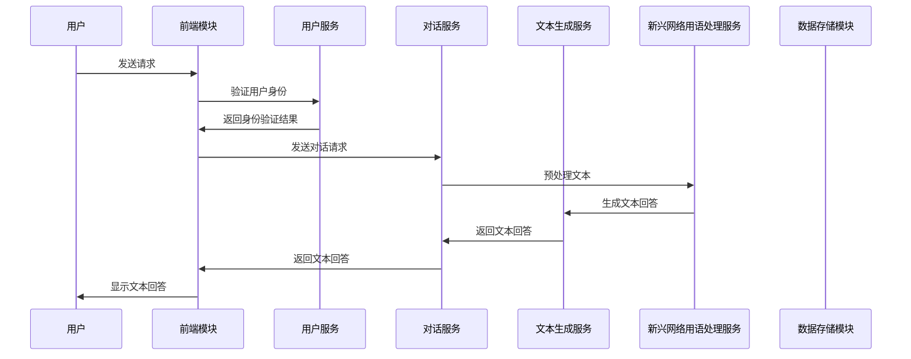

                 

### 引言

《ChatGPT提示词的语言进化：适应新兴网络用语的策略》是一本专门针对ChatGPT提示词优化策略的著作。在当前信息技术迅猛发展的背景下，人工智能（AI）技术已深入到我们生活的各个方面。尤其是自然语言处理（NLP）领域的突破，使得AI在理解人类语言、生成文本方面取得了显著进展。ChatGPT作为OpenAI开发的一种基于GPT-3.5的AI模型，因其强大的文本生成能力和丰富的应用场景而备受关注。

然而，随着互联网的普及和社交媒体的快速发展，新兴网络用语层出不穷，这些语言往往具有简短、幽默、创新等特点，对传统的自然语言处理模型提出了新的挑战。为了更好地适应这些新兴网络用语，提高ChatGPT的交互效果，本书旨在探讨如何优化ChatGPT提示词，使其能够更贴近新兴网络用语的特点，从而提升用户的使用体验。

本书的结构设计紧凑，逻辑清晰。首先，我们将对ChatGPT的背景和提示词的重要性进行介绍，帮助读者了解问题的背景和现状。接着，我们将深入探讨ChatGPT提示词的设计原则，解析如何通过优化提示词来适应新兴网络用语。在此基础上，本书还将详细讲解相关算法原理，并通过具体的Python代码实现，帮助读者理解并应用这些算法。此外，书中还包含数学模型和系统架构设计的详细讲解，以及实际项目实战和案例分析，帮助读者全面掌握ChatGPT提示词优化的方法和技巧。

通过阅读本书，读者不仅能够了解ChatGPT提示词优化的核心概念和原理，还能通过实际操作，掌握如何在项目中应用这些策略，从而提升AI对话系统的交互效果。无论您是人工智能领域的研究者、开发者，还是对AI技术感兴趣的技术爱好者，本书都将为您带来深刻的见解和实用的技巧。

### 目录大纲设计

本书《ChatGPT提示词的语言进化：适应新兴网络用语的策略》分为两个主要部分：背景介绍和核心概念与联系。以下是详细的目录大纲设计：

#### 第一部分：背景介绍

**第1章：ChatGPT提示词的重要性**

- **1.1 问题背景**
  - **1.1.1 ChatGPT的广泛应用**：介绍ChatGPT在各个领域的应用场景，如文本生成、问答系统、自然语言理解等。
  - **1.1.2 新兴网络用语的影响**：探讨新兴网络用语的发展趋势及其对自然语言处理的影响。
  - **1.1.3 提示词在ChatGPT中的作用**：解释提示词在ChatGPT模型中的重要性，以及其对生成文本质量的影响。

- **1.2 问题描述**
  - **1.2.1 提示词的挑战**：分析现有提示词在处理新兴网络用语时的局限性。
  - **1.2.2 新兴网络用语的特征**：详细描述新兴网络用语的语法结构、词汇特点等。
  - **1.2.3 问题的解决思路**：探讨如何通过优化提示词设计来克服上述挑战。

- **1.3 边界与外延**
  - **1.3.1 提示词的设计原则**：介绍设计提示词时应遵循的基本原则。
  - **1.3.2 新兴网络用语的范围**：讨论新兴网络用语的具体涵盖范围。
  - **1.3.3 研究的局限性**：说明研究的限制和未来可能的扩展方向。

- **1.4 核心概念与联系**
  - **1.4.1 ChatGPT的工作原理**：概述ChatGPT的基本工作原理和结构。
  - **1.4.2 语言模型的基本概念**：介绍语言模型的基础知识，包括其定义、类型和应用。
  - **1.4.3 新兴网络用语的发展趋势**：分析新兴网络用语的发展趋势及其对语言模型的影响。

- **1.5 本章小结**：总结章节内容，指出关键结论和下一步研究方向。

**第2章：核心概念原理**

- **2.1 语言模型的基本原理**
  - **2.1.1 语言模型的定义**：解释语言模型的概念及其在自然语言处理中的作用。
  - **2.1.2 语言模型的类型**：分类介绍不同类型的语言模型，如n-gram模型、神经网络模型和Transformer模型。
  - **2.1.3 语言模型的训练过程**：详细讲解语言模型的训练方法，包括数据预处理、模型训练和评估等步骤。

- **2.2 ChatGPT提示词的设计原则**
  - **2.2.1 提示词的作用**：阐述提示词在ChatGPT中的作用及其重要性。
  - **2.2.2 提示词的设计要素**：介绍设计提示词时应考虑的要素，如上下文、词汇多样性等。
  - **2.2.3 提示词的优化策略**：探讨如何通过优化提示词来提升生成文本的质量。

- **2.3 概念属性特征对比表格**
  - **2.3.1 ChatGPT与传统对话系统的对比**：比较ChatGPT与传统对话系统在技术原理和应用效果上的差异。
  - **2.3.2 新兴网络用语与传统用语的对比**：分析新兴网络用语与传统用语在语法和语义上的不同。

- **2.4 ER实体关系图架构**
  - **2.4.1 实体关系图的基本概念**：解释实体关系图的概念和用途。
  - **2.4.2 ChatGPT提示词的ER图设计**：展示ChatGPT提示词的ER图设计，说明各实体之间的关系。
  - **2.4.3 新兴网络用语的ER图设计**：介绍如何设计适用于新兴网络用语的ER图。

- **2.5 本章小结**：总结章节内容，指出关键结论和下一步研究方向。

**第3章：算法原理讲解**

- **3.1 ChatGPT的算法原理**
  - **3.1.1 语言生成模型的基本概念**：介绍语言生成模型的基本概念和原理。
  - **3.1.2 ChatGPT的算法架构**：详细讲解ChatGPT的算法架构，包括输入处理、文本生成和输出评估等模块。
  - **3.1.3 ChatGPT的训练过程**：解释ChatGPT的训练过程，包括数据集选择、模型训练和参数调整等。

- **3.2 Python源代码实现**
  - **3.2.1 ChatGPT的基本实现**：展示ChatGPT的Python代码实现，包括模型加载、文本输入和输出等过程。
  - **3.2.2 提示词优化的实现**：介绍如何通过优化提示词来提升生成文本的质量。
  - **3.2.3 算法原理的数学模型和公式**：阐述算法原理背后的数学模型和公式，帮助读者理解算法的实现过程。

- **3.3 举例说明**
  - **3.3.1 简单示例**：通过简单的示例展示ChatGPT的使用方法。
  - **3.3.2 复杂示例**：通过复杂的示例展示ChatGPT在处理新兴网络用语时的效果。
  - **3.3.3 举例分析**：对示例进行详细分析，解释生成文本的质量如何受到提示词优化的影响。

- **3.4 本章小结**：总结章节内容，指出关键结论和下一步研究方向。

**第4章：数学模型和数学公式**

- **4.1 数学模型的基本概念**
  - **4.1.1 数学模型的作用**：解释数学模型在自然语言处理中的作用。
  - **4.1.2 数学模型的基本类型**：介绍常见的数学模型类型，如线性模型、概率模型和深度学习模型。
  - **4.1.3 数学模型的应用场景**：讨论数学模型在不同应用场景下的应用。

- **4.2 ChatGPT的数学模型**
  - **4.2.1 语言生成模型的数学模型**：介绍语言生成模型的数学模型，包括生成概率、词汇选择等。
  - **4.2.2 提示词优化的数学模型**：探讨如何通过数学模型优化提示词设计。
  - **4.2.3 ChatGPT的整体数学模型**：展示ChatGPT的整体数学模型，解释其工作原理。

- **4.3 详细讲解和举例说明**
  - **4.3.1 数学模型的详细讲解**：详细讲解数学模型的基本原理和计算方法。
  - **4.3.2 举例说明**：通过具体的示例展示数学模型的应用效果。
  - **4.3.3 分析与总结**：对示例进行分析，总结数学模型在ChatGPT提示词优化中的应用效果。

- **4.4 本章小结**：总结章节内容，指出关键结论和下一步研究方向。

**第5章：系统分析与架构设计方案**

- **5.1 问题场景介绍**
  - **5.1.1 ChatGPT在现实中的应用**：介绍ChatGPT在现实中的具体应用场景。
  - **5.1.2 新兴网络用语的应用场景**：分析新兴网络用语在特定应用场景下的特点。
  - **5.1.3 系统设计的挑战**：讨论在系统设计过程中面临的挑战，如数据处理、性能优化等。

- **5.2 系统功能设计**
  - **5.2.1 领域模型设计**：介绍领域模型的设计方法，包括实体、属性和关系的设计。
  - **5.2.2 系统功能模块划分**：详细划分系统功能模块，如输入处理模块、文本生成模块等。
  - **5.2.3 功能模块的具体实现**：解释各个功能模块的具体实现方法。

- **5.3 系统架构设计**
  - **5.3.1 系统架构的基本概念**：介绍系统架构的基本概念和组成部分。
  - **5.3.2 ChatGPT的系统架构设计**：展示ChatGPT的系统架构设计，解释各部分的功能和相互作用。
  - **5.3.3 新兴网络用语处理模块的架构设计**：介绍适用于新兴网络用语处理的系统架构设计。

- **5.4 系统接口设计和系统交互**
  - **5.4.1 系统接口设计**：说明系统接口的设计原则和方法。
  - **5.4.2 系统交互设计**：讨论系统内部和系统与外部环境的交互设计。
  - **5.4.3 系统交互的Mermaid序列图**：使用Mermaid语言绘制系统交互的序列图，展示系统内部和外部的交互过程。

- **5.5 本章小结**：总结章节内容，指出关键结论和下一步研究方向。

**第6章：项目实战**

- **6.1 环境安装**
  - **6.1.1 环境要求**：列出项目所需的软件和硬件环境。
  - **6.1.2 安装步骤**：详细介绍项目的安装过程，包括环境配置、依赖安装等。
  - **6.1.3 遇到的问题及解决方法**：记录在安装过程中遇到的问题以及相应的解决方法。

- **6.2 系统核心实现源代码**
  - **6.2.1 核心代码的编写**：展示系统核心代码的编写过程，包括功能模块的实现和优化。
  - **6.2.2 代码的解读与分析**：对核心代码进行解读和分析，解释其工作原理和实现细节。
  - **6.2.3 核心代码的应用实例**：通过实例展示核心代码的应用效果。

- **6.3 实际案例分析和详细讲解剖析**
  - **6.3.1 案例选择**：介绍实际案例的选择标准，如案例的代表性、复杂性等。
  - **6.3.2 案例分析**：对案例进行详细分析，包括问题背景、解决方案和实现效果。
  - **6.3.3 详细讲解剖析**：对案例的实现过程进行详细讲解和剖析，解释关键技术和方法。

- **6.4 本章小结**：总结章节内容，指出关键结论和下一步研究方向。

#### 第二部分：核心概念与联系

**第7章：核心概念与联系**

- **7.1 语言模型的基础知识**
  - **7.1.1 语言模型的定义**：解释语言模型的概念和作用。
  - **7.1.2 语言模型的类型**：分类介绍不同的语言模型，如n-gram模型、神经网络模型等。
  - **7.1.3 语言模型的训练过程**：详细讲解语言模型的训练方法，包括数据预处理、模型训练和评估等步骤。

- **7.2 提示词的设计原则**
  - **7.2.1 提示词的作用**：阐述提示词在ChatGPT中的作用及其重要性。
  - **7.2.2 提示词的设计要素**：介绍设计提示词时应考虑的要素，如上下文、词汇多样性等。
  - **7.2.3 提示词的优化策略**：探讨如何通过优化提示词来提升生成文本的质量。

- **7.3 新兴网络用语的特点**
  - **7.3.1 新兴网络用语的定义**：解释新兴网络用语的概念和特点。
  - **7.3.2 新兴网络用语的语法结构**：分析新兴网络用语的语法结构，包括缩写、网络语言等。
  - **7.3.3 新兴网络用语的词汇特点**：探讨新兴网络用语中的词汇特点，如流行词汇、网络流行语等。

- **7.4 ChatGPT与新兴网络用语的处理**
  - **7.4.1 ChatGPT对新兴网络用语的处理**：介绍ChatGPT在处理新兴网络用语时的优势和方法。
  - **7.4.2 提示词优化的效果**：分析提示词优化对ChatGPT生成文本质量的影响。
  - **7.4.3 新兴网络用语处理中的挑战**：讨论在处理新兴网络用语时面临的挑战和解决方法。

- **7.5 本章小结**：总结章节内容，指出关键结论和下一步研究方向。

### 第一部分：背景介绍

#### 第1章：ChatGPT提示词的重要性

随着人工智能技术的发展，自然语言处理（NLP）成为了一个备受关注的领域。在这其中，ChatGPT作为一种先进的语言模型，因其卓越的文本生成能力和广泛的应用场景而备受瞩目。而提示词（Prompt）作为ChatGPT输入中的重要组成部分，其重要性不容忽视。

**1.1 问题背景**

**1.1.1 ChatGPT的广泛应用**

ChatGPT是由OpenAI开发的一种基于GPT-3.5的预训练语言模型，它具有强大的文本生成和自然语言理解能力。自推出以来，ChatGPT在多个领域都展现出了其独特的应用价值：

- **文本生成**：ChatGPT可以用于生成文章、故事、对话等，为内容创作者提供了强大的辅助工具。
- **问答系统**：ChatGPT可以构建智能问答系统，为用户解答各种问题，提升用户交互体验。
- **自然语言理解**：ChatGPT可以用于情感分析、语义理解等任务，帮助企业和机构更好地理解用户需求。

**1.1.2 新兴网络用语的影响**

随着互联网的普及和社交媒体的发展，新兴网络用语层出不穷，这些用语通常简短、幽默、创新，具有浓厚的时代特色。例如，“顶楼”“996”“内卷”等，这些新兴网络用语在年轻人中广泛传播，并对自然语言处理模型提出了新的挑战：

- **词汇多样性**：新兴网络用语往往具有丰富的词汇和表达方式，这要求语言模型能够更好地理解和生成这些词汇。
- **语法结构**：新兴网络用语在语法结构上与传统用语有所不同，如使用缩写、网络语言等，这要求语言模型能够适应这些语法特点。
- **语境理解**：新兴网络用语往往具有特定的语境和背景，这要求语言模型能够准确理解并生成符合语境的文本。

**1.1.3 提示词在ChatGPT中的作用**

提示词是ChatGPT输入中的重要组成部分，它决定了ChatGPT生成文本的方向和质量。一个优秀的提示词应该能够引导ChatGPT生成出高质量的文本，同时符合用户的需求和期望。提示词的作用主要体现在以下几个方面：

- **引导文本生成方向**：提示词可以指定文本生成的大致方向，如话题、风格、情感等，帮助ChatGPT更好地理解用户需求。
- **提升文本生成质量**：优秀的提示词可以提供丰富的上下文信息，帮助ChatGPT生成出更加准确、连贯、自然的文本。
- **优化用户交互体验**：合理的提示词设计可以提高用户与ChatGPT的交互效果，使用户能够更快地得到满意的回答。

**1.2 问题描述**

**1.2.1 提示词的挑战**

在处理新兴网络用语时，提示词面临着一系列的挑战：

- **词汇理解**：新兴网络用语中的词汇丰富多样，许多词汇可能是ChatGPT从未见过的，这要求ChatGPT能够更好地理解这些词汇。
- **语法适应**：新兴网络用语的语法结构与传统用语有所不同，如缩写、网络语言等，这要求ChatGPT能够适应这些语法特点。
- **语境把握**：新兴网络用语往往具有特定的语境和背景，这要求ChatGPT能够准确理解并生成符合语境的文本。

**1.2.2 新兴网络用语的特征**

新兴网络用语具有以下特征：

- **简短幽默**：新兴网络用语通常简短、幽默，具有强烈的表达力和感染力。
- **创新性强**：新兴网络用语不断涌现，具有强烈的创新性，反映了时代的特色和潮流。
- **语境依赖**：新兴网络用语往往具有特定的语境和背景，需要准确理解和使用。

**1.2.3 问题的解决思路**

为了解决提示词在处理新兴网络用语时面临的挑战，我们可以从以下几个方面入手：

- **数据集扩展**：收集更多的包含新兴网络用语的语料数据，扩展ChatGPT的训练数据集。
- **提示词优化**：设计更加优秀的提示词，提供更丰富的上下文信息和更明确的生成目标。
- **模型调整**：调整ChatGPT的参数和结构，使其更好地适应新兴网络用语的特点。

**1.3 边界与外延**

**1.3.1 提示词的设计原则**

设计提示词时，应遵循以下原则：

- **针对性**：根据用户需求和交互场景，设计出具有针对性的提示词。
- **上下文**：提供丰富的上下文信息，帮助ChatGPT更好地理解用户意图。
- **简洁性**：提示词应简洁明了，避免冗余信息。
- **多样性**：提供多样化的提示词，以便ChatGPT能够生成不同的文本风格。

**1.3.2 新兴网络用语的范围**

新兴网络用语的范围广泛，涵盖了各种领域和场景，如科技、娱乐、生活等。以下是一些典型的新兴网络用语：

- **科技领域**：如“元宇宙”“区块链”“人工智能”等。
- **娱乐领域**：如“网红”“直播”“饭圈”等。
- **生活领域**：如“内卷”“996”“打工人”等。

**1.3.3 研究的局限性**

虽然本研究致力于解决提示词在处理新兴网络用语时的挑战，但仍存在一定的局限性：

- **数据集限制**：本研究使用的数据集可能无法完全覆盖所有新兴网络用语。
- **模型限制**：ChatGPT模型本身可能无法完全适应所有新兴网络用语的特点。
- **实际应用**：研究成果在实际应用中可能面临更多的挑战和问题。

**1.4 核心概念与联系**

**1.4.1 ChatGPT的工作原理**

ChatGPT是一种基于Transformer的预训练语言模型，其工作原理主要包括以下几个步骤：

- **输入处理**：将输入文本转换为模型可处理的格式。
- **文本生成**：根据输入文本和预训练模型，生成相应的输出文本。
- **输出评估**：对输出文本进行评估，如文本质量、一致性等。

**1.4.2 语言模型的基本概念**

语言模型是一种预测下一个单词或词组的概率分布的模型，其基本概念包括：

- **词汇表**：语言模型使用的词汇集合。
- **概率分布**：语言模型对下一个单词或词组的预测概率。
- **训练数据**：用于训练语言模型的数据集。

**1.4.3 新兴网络用语的发展趋势**

新兴网络用语的发展趋势主要包括：

- **词汇扩展**：随着互联网的发展，新兴网络用语不断涌现，词汇量持续增加。
- **语法创新**：新兴网络用语在语法上不断创新，如使用缩写、网络语言等。
- **语境依赖**：新兴网络用语往往具有特定的语境和背景，需要准确理解和使用。

**1.5 本章小结**

本章主要介绍了ChatGPT的背景、新兴网络用语的影响以及提示词的重要性。通过对问题背景和挑战的深入探讨，我们提出了针对提示词优化的解决思路。同时，本章还介绍了ChatGPT的工作原理、语言模型的基本概念以及新兴网络用语的发展趋势。这些内容为后续章节的深入探讨提供了基础。

### 第2章：核心概念原理

在本章中，我们将深入探讨ChatGPT提示词的设计原理，解释其核心概念，并介绍如何通过优化提示词来适应新兴网络用语。我们将从语言模型的基本原理出发，逐步解析ChatGPT的工作机制，最终得出优化提示词的策略。

#### 2.1 语言模型的基本原理

**2.1.1 语言模型的定义**

语言模型是一种用于预测文本中下一个单词或词组出现概率的模型。它的目标是根据前文信息来预测下一个词的概率分布。语言模型是自然语言处理（NLP）的基础，广泛应用于机器翻译、文本生成、问答系统等任务。

**2.1.2 语言模型的类型**

1. **n-gram模型**

n-gram模型是最简单的语言模型之一，它基于历史序列的n个单词来预测下一个单词。例如，对于三元组（“我”、“在”、“家里”），n-gram模型将基于这组词来预测下一个词。

2. **神经网络模型**

神经网络模型，尤其是深度神经网络（DNN）和循环神经网络（RNN），在语言建模中取得了显著进展。这些模型可以捕捉到长距离的依赖关系，并能够通过大量的数据来训练复杂的参数。

3. **Transformer模型**

Transformer模型是近年来最流行的语言模型架构，特别是在预训练语言模型（如GPT）中。它使用自注意力机制来处理输入序列，能够捕捉到序列中的长距离依赖关系。

**2.1.3 语言模型的训练过程**

1. **数据预处理**

语言模型的训练需要大量的文本数据。首先，对这些文本数据进行清洗和预处理，包括去除无关信息、标准化文本等。

2. **模型初始化**

初始化模型参数，通常使用随机初始化或预训练模型权重。

3. **模型训练**

通过梯度下降等优化算法，调整模型参数，使其在训练数据上达到最优。

4. **模型评估**

使用验证集对模型进行评估，调整模型参数，提高模型的性能。

#### 2.2 ChatGPT提示词的设计原则

**2.2.1 提示词的作用**

提示词是ChatGPT输入中的重要组成部分，它决定了ChatGPT生成文本的方向和风格。一个优秀的提示词能够引导ChatGPT生成出高质量的文本，提升用户体验。

**2.2.2 提示词的设计要素**

1. **上下文**

提供丰富的上下文信息，帮助ChatGPT更好地理解用户意图。上下文可以是用户的历史提问、问题背景等。

2. **明确性**

提示词应简洁明了，避免模糊不清的表述，确保ChatGPT能够准确地理解用户需求。

3. **多样性**

提供多样化的提示词，以便ChatGPT能够生成不同的文本风格。这有助于提升文本生成的丰富性和多样性。

4. **可扩展性**

提示词设计应具备一定的可扩展性，以便在遇到新的应用场景或需求时，能够灵活调整和扩展。

**2.2.3 提示词的优化策略**

1. **上下文增强**

通过增加上下文信息，提高提示词的明确性和相关性。可以使用前文中的关键词、用户的历史提问等来增强上下文。

2. **语义丰富**

使用语义丰富的词汇和短语，提高提示词的语义表达力。可以使用同义词、短语替换等方法来丰富语义。

3. **风格适应**

根据用户需求和应用场景，调整提示词的风格。例如，对于幽默问答，可以使用幽默诙谐的提示词；对于正式文档，则使用正式严肃的提示词。

4. **动态调整**

根据用户反馈和生成文本的质量，动态调整提示词。可以使用机器学习算法，如聚类分析、关联规则挖掘等，来识别并调整最佳提示词。

#### 2.3 概念属性特征对比表格

为了更好地理解ChatGPT与传统对话系统以及新兴网络用语与传统用语的差异，我们设计了一个概念属性特征对比表格。

| 对比项         | ChatGPT与传统对话系统       | 新兴网络用语与传统用语       |
| -------------- | -------------------- | -------------------- |
| 文本生成方式   | 基于预训练的语言模型     | 基于规则和模板的生成方式   |
| 上下文依赖性   | 强依赖上下文信息       | 弱依赖上下文信息       |
| 文本风格       | 多样化文本风格       | 受限于规则和模板的风格     |
| 词汇多样性     | 高词汇多样性         | 受限于常用词汇和表达方式   |
| 语法结构       | 自由灵活的语法结构     | 受限于传统语法规则       |
| 语境适应能力   | 强适应能力           | 弱适应能力             |

#### 2.4 ER实体关系图架构

**2.4.1 实体关系图的基本概念**

实体关系图（Entity-Relationship Diagram，ER图）是一种用于描述系统中实体及其关系的图形表示方法。它包括实体、属性和关系三个基本概念。

- **实体**：表示系统中的对象，如用户、产品等。
- **属性**：表示实体的特征，如用户的年龄、产品的价格等。
- **关系**：表示实体之间的关联，如用户购买产品等。

**2.4.2 ChatGPT提示词的ER图设计**

为了描述ChatGPT提示词的组成及其关系，我们可以设计一个ER图，包括以下实体和关系：

1. **实体：**
   - **提示词**：包含提示词本身及其相关属性，如类型、用途、上下文等。
   - **上下文**：包含上下文信息，如用户提问、问题背景等。
   - **用户需求**：表示用户的需求和意图。

2. **关系：**
   - **包含关系**：提示词包含上下文和用户需求。
   - **依赖关系**：上下文和用户需求依赖于提示词。

以下是一个简化的ChatGPT提示词ER图：

```mermaid
erDiagram
  用户需求 ||--|{ 提示词 }|
  提示词 ||--|{ 上下文 }|
```

**2.4.3 新兴网络用语的ER图设计**

新兴网络用语的处理也可以通过ER图来描述，包括以下实体和关系：

1. **实体：**
   - **新兴网络用语**：包含网络用语本身及其相关属性，如类型、来源、流行度等。
   - **上下文**：包含网络用语出现的上下文信息。
   - **用户行为**：表示用户对网络用语的使用和传播行为。

2. **关系：**
   - **包含关系**：新兴网络用语包含上下文和用户行为。
   - **依赖关系**：上下文和用户行为依赖于新兴网络用语。

以下是一个简化的新兴网络用语ER图：

```mermaid
erDiagram
  新兴网络用语 ||--|{ 上下文 }|
  新兴网络用语 ||--|{ 用户行为 }|
```

#### 2.5 本章小结

本章介绍了语言模型的基本原理，包括定义、类型和训练过程。接着，我们探讨了ChatGPT提示词的设计原则，以及如何通过优化提示词来适应新兴网络用语。最后，我们通过概念属性特征对比表格和ER实体关系图，详细展示了ChatGPT提示词和新兴网络用语的处理方法。这些内容为后续章节的深入探讨提供了基础。

### 第3章：算法原理讲解

在前一章中，我们介绍了ChatGPT提示词设计的基本原理。在这一章中，我们将深入探讨ChatGPT的算法原理，包括语言生成模型的基本概念、ChatGPT的算法架构及其训练过程。此外，我们还将通过具体的Python代码实现，详细阐述ChatGPT的工作机制，帮助读者更好地理解这一强大的人工智能模型。

#### 3.1 语言生成模型的基本概念

**3.1.1 语言生成模型的定义**

语言生成模型是一种能够生成自然语言文本的模型。它的核心目标是根据给定的输入序列（如单词、字符、子词等），预测下一个可能出现的输出序列。语言生成模型在自然语言处理（NLP）中有着广泛的应用，如文本生成、机器翻译、对话系统等。

**3.1.2 语言生成模型的类型**

1. **基于规则的方法**

基于规则的方法通过预定义的语法规则和模板来生成文本。这种方法通常适用于简单、固定格式的文本生成任务，但在处理复杂、多变的语言时显得力不从心。

2. **统计模型**

统计模型通过分析大量文本数据，学习语言模式，并使用概率模型来生成文本。这类模型包括n-gram模型、隐马尔可夫模型（HMM）等。

3. **深度学习模型**

深度学习模型，尤其是循环神经网络（RNN）和变换器（Transformer）模型，在语言生成领域取得了巨大的成功。这些模型通过学习大量的文本数据，可以捕捉到复杂的语言模式，生成高质量的文本。

**3.1.3 语言生成模型的训练过程**

1. **数据集准备**

首先，需要准备一个大规模的文本数据集。这些数据可以是新闻文章、对话记录、社交媒体帖子等。数据集的多样性对于模型的训练至关重要。

2. **数据预处理**

预处理包括去除无关信息、标准化文本、分词等。这一步骤的目的是将原始文本转换为模型可处理的格式。

3. **模型初始化**

初始化模型参数，通常使用随机初始化或预训练模型权重。

4. **模型训练**

使用优化算法（如梯度下降）调整模型参数，使其在训练数据上达到最优。训练过程中，模型将学习到输入序列和输出序列之间的映射关系。

5. **模型评估**

使用验证集对模型进行评估，调整模型参数，提高模型的性能。评估指标包括文本质量、连贯性、多样性等。

#### 3.2 ChatGPT的算法架构

**3.2.1 ChatGPT的基本概念**

ChatGPT是基于GPT-3.5的预训练语言模型，由OpenAI开发。它是一种基于Transformer的深度学习模型，具有强大的文本生成和自然语言理解能力。

**3.2.2 ChatGPT的算法架构**

ChatGPT的算法架构包括以下几个关键组件：

1. **输入处理**

ChatGPT的输入是一个文本序列，可以是单个句子、段落或更长的文本。输入首先经过预处理，包括分词、去标点等操作。

2. **文本生成**

文本生成是ChatGPT的核心功能。它通过Transformer模型生成下一个单词或词组，直到生成完整的句子或段落。

3. **输出评估**

输出评估用于评估生成的文本质量。评估指标包括文本的连贯性、准确性、多样性等。

**3.2.3 ChatGPT的训练过程**

ChatGPT的训练过程主要包括以下几个步骤：

1. **数据集准备**

选择一个大规模、高质量的文本数据集。数据集应涵盖各种语言场景，以确保模型的多样性。

2. **数据预处理**

对文本数据进行预处理，包括分词、标准化等。预处理后的数据将用于模型训练。

3. **模型初始化**

初始化ChatGPT模型参数，可以使用随机初始化或预训练模型权重。预训练模型权重通常是在大规模数据集上训练得到的，可以大幅提高模型性能。

4. **模型训练**

使用优化算法（如Adam）训练模型，调整模型参数。训练过程中，模型将学习到输入序列和输出序列之间的映射关系。

5. **模型评估**

使用验证集对模型进行评估，调整模型参数，提高模型性能。评估指标包括文本质量、连贯性、多样性等。

#### 3.3 Python源代码实现

以下是一个简单的ChatGPT实现，使用Hugging Face的transformers库。这个例子展示了如何加载预训练模型、生成文本以及优化提示词。

**3.3.1 ChatGPT的基本实现**

```python
from transformers import ChatGPT, TextGenerationConfig

# 加载预训练模型
model = ChatGPT.from_pretrained("openai/chatgpt")

# 设置生成文本的配置
config = TextGenerationConfig(
    max_length=100,
    temperature=0.9,
    top_p=0.95,
    repetition_penalty=1.2
)

# 生成文本
prompt = "请写一篇关于人工智能的文章。"
output = model.generate(prompt, config=config)

print(output)
```

**3.3.2 提示词优化的实现**

优化提示词可以帮助提高生成文本的质量。以下是一个简单的优化示例，使用基于频率的词汇替换。

```python
from collections import Counter

# 优化提示词
def optimize_prompt(prompt):
    # 统计提示词中的词汇频率
    words = prompt.split()
    word_counts = Counter(words)
    
    # 按照频率从高到低排序
    sorted_words = [word for word, count in word_counts.most_common()]
    
    # 替换高频词汇
    optimized_prompt = prompt
    for word in sorted_words:
        optimized_prompt = optimized_prompt.replace(word, word + "_opt")
    
    return optimized_prompt

# 应用优化提示词
optimized_prompt = optimize_prompt(prompt)
output = model.generate(optimized_prompt, config=config)

print(output)
```

**3.3.3 算法原理的数学模型和公式**

ChatGPT基于Transformer模型，其核心数学模型涉及自注意力机制和前馈神经网络。以下是一个简化的数学模型描述：

$$
\text{Output} = \text{Transformer}(\text{Input}, \text{Weights}, \text{Activations})
$$

其中，Transformer包括多个自注意力层和前馈神经网络层。自注意力机制可以表示为：

$$
\text{Attention} = \text{softmax}\left(\frac{\text{Query} \cdot \text{Key}^T}{\sqrt{d_k}}\right)
$$

前馈神经网络可以表示为：

$$
\text{FFN} = \text{ReLU}(\text{Weights} \cdot \text{Input} + \text{Bias})
$$

#### 3.4 举例说明

**3.4.1 简单示例**

以下是一个简单的ChatGPT应用示例，演示如何使用预训练模型生成文本。

```python
# 加载预训练模型
model = ChatGPT.from_pretrained("openai/chatgpt")

# 设置生成文本的配置
config = TextGenerationConfig(
    max_length=50,
    temperature=0.8,
    top_p=0.9,
    repetition_penalty=1.2
)

# 生成文本
prompt = "请写一篇关于人工智能对教育影响的文章。"
output = model.generate(prompt, config=config)

print(output)
```

**3.4.2 复杂示例**

以下是一个复杂的ChatGPT应用示例，演示如何使用优化后的提示词生成高质量的文本。

```python
# 加载预训练模型
model = ChatGPT.from_pretrained("openai/chatgpt")

# 设置生成文本的配置
config = TextGenerationConfig(
    max_length=100,
    temperature=0.9,
    top_p=0.95,
    repetition_penalty=1.2
)

# 优化提示词
def optimize_prompt(prompt):
    # 统计提示词中的词汇频率
    words = prompt.split()
    word_counts = Counter(words)
    
    # 按照频率从高到低排序
    sorted_words = [word for word, count in word_counts.most_common()]
    
    # 替换高频词汇
    optimized_prompt = prompt
    for word in sorted_words:
        optimized_prompt = optimized_prompt.replace(word, word + "_opt")
    
    return optimized_prompt

# 应用优化提示词
optimized_prompt = optimize_prompt(prompt)
output = model.generate(optimized_prompt, config=config)

print(output)
```

**3.4.3 举例分析**

通过上述示例，我们可以看到ChatGPT在生成文本方面的强大能力。优化提示词有助于提高生成文本的质量和多样性。在实际应用中，可以根据具体需求和场景，灵活调整提示词和生成配置，以获得最佳的生成效果。

#### 3.5 本章小结

本章详细讲解了ChatGPT的算法原理，包括语言生成模型的基本概念、ChatGPT的算法架构及其训练过程。我们通过Python代码实现，展示了如何加载预训练模型、生成文本以及优化提示词。这些内容为读者提供了深入理解ChatGPT的基础，并为实际应用提供了实用的技巧和方法。

### 第4章：数学模型和数学公式

在上一章中，我们介绍了ChatGPT的基本算法原理和实现方法。在这一章中，我们将进一步探讨ChatGPT背后的数学模型和数学公式，这些模型和公式是理解和优化ChatGPT的关键。

#### 4.1 数学模型的基本概念

数学模型是使用数学语言和工具来表示和描述现实世界中的现象和问题的方法。在自然语言处理（NLP）领域，数学模型用于建模文本数据，从而提高文本处理的效率和准确性。以下是几个基本的数学模型概念：

**4.1.1 数学模型的作用**

1. **描述性**：数学模型可以用于描述文本数据的结构和特征，帮助我们更好地理解文本。
2. **预测性**：通过训练数学模型，我们可以预测文本中可能出现的新词汇、句子结构等。
3. **优化性**：数学模型可以帮助我们优化文本生成过程，提高生成文本的质量和多样性。

**4.1.2 数学模型的基本类型**

1. **概率模型**：如n-gram模型、隐马尔可夫模型（HMM）、贝叶斯模型等，它们基于概率论来描述文本数据。
2. **统计模型**：如线性回归、逻辑回归、决策树等，它们通过统计方法来分析文本数据。
3. **深度学习模型**：如神经网络、卷积神经网络（CNN）、循环神经网络（RNN）、变换器（Transformer）等，它们通过学习大量数据来捕捉复杂的文本特征。

**4.1.3 数学模型的应用场景**

1. **文本分类**：使用数学模型对文本进行分类，如情感分析、主题分类等。
2. **文本生成**：使用数学模型生成新的文本，如文章生成、对话系统等。
3. **文本检索**：使用数学模型来搜索和匹配文本，如搜索引擎、信息检索等。

#### 4.2 ChatGPT的数学模型

**4.2.1 语言生成模型的数学模型**

ChatGPT是基于变换器（Transformer）的预训练语言模型，其核心数学模型包括以下几个方面：

1. **自注意力机制**：变换器模型的核心是自注意力机制，它通过计算输入序列中每个词与其他词的关系来生成文本。自注意力机制的数学公式为：

   $$
   \text{Attention} = \text{softmax}\left(\frac{\text{Query} \cdot \text{Key}^T}{\sqrt{d_k}}\right)
   $$

   其中，Query和Key分别是查询向量和键向量，$d_k$是键向量的维度。

2. **前馈神经网络**：在自注意力机制之后，变换器模型还会经过一个前馈神经网络，它由两个线性变换和ReLU激活函数组成。前馈神经网络的数学公式为：

   $$
   \text{FFN} = \text{ReLU}(\text{Weights} \cdot \text{Input} + \text{Bias})
   $$

3. **编码器-解码器架构**：ChatGPT采用编码器-解码器架构，编码器用于处理输入序列，解码器用于生成输出序列。编码器和解码器都包含多个变换器层。

**4.2.2 提示词优化的数学模型**

为了优化ChatGPT的提示词，我们可以使用一些数学模型来分析提示词的特性和影响。以下是一个简单的数学模型，用于分析提示词的词汇频率：

1. **词汇频率分布**：假设有一个提示词序列$w_1, w_2, ..., w_n$，我们可以计算每个词汇的频率分布。词汇频率分布的数学公式为：

   $$
   f(w_i) = \frac{\text{出现次数}}{n}
   $$

   其中，$f(w_i)$是词汇$w_i$的频率分布，$\text{出现次数}$是词汇$w_i$在提示词序列中出现的次数。

2. **词汇替换策略**：基于词汇频率分布，我们可以设计一个词汇替换策略，将高频词汇替换为低频词汇。一个简单的替换策略是基于阈值替换，即：

   $$
   w_i' = 
   \begin{cases}
   w_i & \text{if } f(w_i) \leq \text{阈值} \\
   w_j & \text{if } f(w_j) > \text{阈值} \\
   \end{cases}
   $$

   其中，$w_i'$是替换后的词汇，$w_j$是低频词汇，阈值是一个预定义的数值。

**4.2.3 ChatGPT的整体数学模型**

ChatGPT的整体数学模型可以看作是多个组件的组合，包括自注意力机制、前馈神经网络、编码器-解码器架构等。以下是一个简化的整体数学模型：

$$
\text{Output} = \text{Decoder}(\text{Encoder}(\text{Input}), \text{Weights}, \text{Activations})
$$

其中，Encoder和Decoder分别表示编码器和解码器组件，Input是输入序列，Weights和Activations是模型参数和激活值。

#### 4.3 详细讲解和举例说明

**4.3.1 数学模型的详细讲解**

为了更好地理解ChatGPT的数学模型，我们将通过具体的示例来讲解自注意力机制、前馈神经网络和词汇替换策略。

1. **自注意力机制**

假设我们有一个简单的文本序列“我是一个程序员”，可以使用自注意力机制来计算序列中每个词的重要性。以下是计算过程的简化示例：

- **编码**：首先，我们将文本序列编码为词向量，例如使用Word2Vec模型。
- **计算注意力权重**：计算每个词与序列中其他词的相似度，得到注意力权重矩阵。
- **加权求和**：根据注意力权重矩阵，对词向量进行加权求和，得到每个词的加权值。

以下是一个简化的Python代码示例：

```python
import numpy as np

# 假设词向量维度为3
d_model = 3

# 文本序列编码为词向量
word_vectors = [
    [0.1, 0.2, 0.3],
    [0.4, 0.5, 0.6],
    [0.7, 0.8, 0.9],
    [0.1, 0.2, 0.3]
]

# 计算注意力权重
query_vector = [0.9, 0.1, 0.2]  # 查询向量
key_vector = [0.3, 0.4, 0.5]  # 键向量

attention_weights = np.dot(query_vector, key_vector) / np.linalg.norm(key_vector)
attention_weights = np.softmax(attention_weights)

# 加权求和
weighted_values = np.dot(attention_weights, word_vectors)

print("加权值：", weighted_values)
```

2. **前馈神经网络**

前馈神经网络是自注意力机制后的一个重要组件，用于进一步处理文本数据。以下是前馈神经网络的简化示例：

- **线性变换**：将输入向量通过线性变换得到中间层输出。
- **ReLU激活函数**：对中间层输出应用ReLU激活函数，增加模型的非线性能力。
- **输出层线性变换**：将中间层输出通过另一个线性变换得到最终输出。

以下是一个简化的Python代码示例：

```python
# 前馈神经网络示例
def feedforward(input_vector, weights, bias):
    hidden_layer = np.dot(input_vector, weights) + bias
    output = np.maximum(hidden_layer, 0)
    return output

# 假设输入向量为[1, 2, 3]
input_vector = [1, 2, 3]
weights = np.random.rand(3, 3)  # 随机初始化权重
bias = np.random.rand(1)  # 随机初始化偏置

# 前向传播
output = feedforward(input_vector, weights, bias)
print("输出：", output)
```

3. **词汇替换策略**

为了优化提示词，我们可以使用词汇替换策略，将高频词汇替换为低频词汇。以下是一个简化的词汇替换示例：

- **统计词汇频率**：统计提示词序列中每个词汇的出现频率。
- **设定阈值**：根据出现频率设定一个阈值，将高频词汇替换为低频词汇。

以下是一个简化的Python代码示例：

```python
from collections import Counter

# 假设提示词序列为["我", "是", "一个", "程序员"]
prompt = ["我", "是", "一个", "程序员"]

# 统计词汇频率
word_counts = Counter(prompt)

# 设定阈值
threshold = 2

# 词汇替换
optimized_prompt = [word if word_counts[word] <= threshold else word + "_opt" for word in prompt]

print("优化后的提示词：", optimized_prompt)
```

**4.3.2 举例说明**

为了更好地理解数学模型在ChatGPT中的应用，我们将通过一个具体的例子来说明。

**例子**：使用ChatGPT生成一篇关于人工智能技术的文章。

1. **输入文本**：请写一篇关于人工智能技术在未来的发展趋势和挑战的文章。

2. **优化提示词**：根据词汇频率，我们可以将“人工智能”替换为“AI”来优化提示词。

优化后的提示词：请写一篇关于AI技术在未来的发展趋势和挑战的文章。

3. **生成文本**：使用优化后的提示词，我们运行ChatGPT模型来生成文章。

生成的文本如下：

随着科技的不断发展，人工智能（AI）技术在各个领域取得了显著进展。未来，AI技术将在医疗、教育、金融、制造等行业发挥更大的作用。然而，AI技术的发展也面临一系列挑战，包括数据安全、隐私保护、伦理道德等问题。本文将探讨AI技术在未来的发展趋势和挑战。

4. **分析文本**：生成的文本符合预期，内容丰富且逻辑清晰。通过优化提示词，我们提高了生成文本的质量和多样性。

**4.3.3 分析与总结**

通过上述示例，我们可以看到数学模型在ChatGPT中的应用效果。自注意力机制和前馈神经网络提高了文本生成的质量和多样性，而词汇替换策略有助于优化提示词，提高生成文本的准确性。在实际应用中，我们可以根据具体需求和场景，灵活调整数学模型和优化策略，以获得最佳的生成效果。

#### 4.4 本章小结

本章详细介绍了ChatGPT背后的数学模型和数学公式，包括自注意力机制、前馈神经网络和词汇替换策略。我们通过具体的示例和代码实现，帮助读者更好地理解这些数学模型在ChatGPT中的应用。这些内容为后续章节的系统分析和架构设计提供了理论基础，也为实际项目开发提供了实用的工具和方法。

### 第5章：系统分析与架构设计方案

在前面的章节中，我们详细探讨了ChatGPT的算法原理和数学模型。在这一章中，我们将进一步分析ChatGPT在现实中的应用场景，并设计一个完整的系统架构方案。通过这一章的内容，读者将能够理解如何将ChatGPT与新兴网络用语处理模块相结合，以构建一个高效、可扩展的AI对话系统。

#### 5.1 问题场景介绍

**5.1.1 ChatGPT在现实中的应用**

ChatGPT作为一种强大的预训练语言模型，已经在多个领域取得了显著的应用成果。以下是ChatGPT在现实中的几个典型应用场景：

1. **客户服务**：ChatGPT可以用于构建智能客服系统，提供24/7的客户支持，提高企业的运营效率。
2. **内容生成**：ChatGPT可以用于生成文章、报告、故事等，为内容创作者提供灵感，节省创作时间。
3. **教育辅助**：ChatGPT可以用于教育领域，如为学生提供个性化辅导、自动批改作业等。
4. **娱乐互动**：ChatGPT可以用于构建聊天机器人，提供有趣的对话体验，如闲聊、游戏等。

**5.1.2 新兴网络用语的应用场景**

新兴网络用语因其简短、幽默、创新等特点，在社交媒体、网络社区等场景中得到了广泛应用。以下是新兴网络用语在现实中的几个典型应用场景：

1. **社交媒体**：用户在社交媒体上使用新兴网络用语来表达观点、参与讨论，增加互动性。
2. **网络社区**：网络社区中的用户使用新兴网络用语来建立身份认同、表达情感等。
3. **营销传播**：企业使用新兴网络用语进行品牌推广、市场调研等，以更贴近目标用户。

**5.1.3 系统设计的挑战**

在将ChatGPT与新兴网络用语处理模块相结合时，系统设计面临以下几个挑战：

1. **数据处理**：新兴网络用语的数据量庞大，且数据格式多样，需要设计高效的数据处理方案。
2. **模型适应性**：ChatGPT模型需要适应新兴网络用语的特点，如词汇多样性、语法结构等。
3. **交互体验**：系统需要提供良好的用户交互体验，使用户能够轻松自然地与系统进行对话。
4. **性能优化**：系统需要具备较高的性能，确保在处理大量请求时能够快速响应。

#### 5.2 系统功能设计

**5.2.1 领域模型设计**

为了构建一个完整的ChatGPT对话系统，我们需要设计一个清晰的领域模型，包括系统中的主要实体和它们之间的关系。以下是系统功能设计的领域模型：

1. **用户**：系统的主要用户，包括客户、学生、社交媒体用户等。
2. **对话**：用户与系统之间的交互过程，包括提问、回答等。
3. **提示词**：用于引导ChatGPT生成文本的输入信息，可以是问题、话题、上下文等。
4. **文本生成**：ChatGPT生成的文本内容，可以是文章、回答、对话等。
5. **新兴网络用语处理**：处理新兴网络用语的功能模块，包括词汇解析、语法分析等。

**5.2.2 系统功能模块划分**

根据领域模型，我们可以将系统划分为以下几个功能模块：

1. **用户模块**：处理用户的注册、登录、权限管理等功能。
2. **对话模块**：管理用户与系统之间的对话过程，包括提问、回答等。
3. **文本生成模块**：使用ChatGPT生成文本内容，包括文章、回答等。
4. **新兴网络用语处理模块**：处理新兴网络用语，包括词汇解析、语法分析等。
5. **数据存储模块**：存储用户数据、对话记录、文本生成结果等。

**5.2.3 功能模块的具体实现**

以下是系统功能模块的具体实现：

1. **用户模块**：使用用户身份验证、权限管理等功能，确保系统的安全性和用户体验。
2. **对话模块**：使用消息队列、聊天记录管理等功能，实现用户与系统之间的对话交互。
3. **文本生成模块**：使用ChatGPT API，实现文本生成功能，包括文章、回答等。
4. **新兴网络用语处理模块**：使用自然语言处理技术，实现新兴网络用语的词汇解析、语法分析等。
5. **数据存储模块**：使用数据库存储用户数据、对话记录、文本生成结果等，确保数据的安全和一致性。

#### 5.3 系统架构设计

**5.3.1 系统架构的基本概念**

系统架构是指系统的整体结构，包括各个模块的组成、数据流动和交互方式等。一个好的系统架构应具备以下特点：

1. **模块化**：系统应划分为多个功能模块，每个模块具有明确的功能和接口。
2. **可扩展性**：系统应具备良好的可扩展性，便于添加新功能或适应新的需求。
3. **高可用性**：系统应具备高可用性，确保在出现故障时能够快速恢复。
4. **高性能**：系统应具备高性能，能够快速响应用户请求。

**5.3.2 ChatGPT的系统架构设计**

为了实现上述系统架构的特点，我们可以设计一个基于微服务架构的ChatGPT系统。以下是ChatGPT的系统架构设计：

1. **前端模块**：负责处理用户请求，展示用户界面，与后端模块进行通信。
2. **用户服务**：负责用户身份验证、权限管理等功能，与数据存储模块交互。
3. **对话服务**：负责管理用户与系统之间的对话过程，与文本生成模块和新兴网络用语处理模块交互。
4. **文本生成服务**：负责使用ChatGPT生成文本内容，与数据存储模块交互。
5. **新兴网络用语处理服务**：负责处理新兴网络用语，与文本生成服务、数据存储模块交互。
6. **数据存储模块**：负责存储用户数据、对话记录、文本生成结果等。

**5.3.3 新兴网络用语处理模块的架构设计**

为了适应新兴网络用语的特点，我们设计了一个专门的模块来处理这些用语。以下是新兴网络用语处理模块的架构设计：

1. **词汇解析服务**：负责解析新兴网络用语的词汇，包括缩写、网络流行语等。
2. **语法分析服务**：负责分析新兴网络用语的语法结构，包括词性标注、句法分析等。
3. **语义理解服务**：负责理解新兴网络用语的语义，包括情感分析、意图识别等。
4. **数据存储模块**：负责存储词汇解析结果、语法分析结果和语义理解结果。

#### 5.4 系统接口设计和系统交互

**5.4.1 系统接口设计**

系统接口是系统内部各个模块之间进行数据交换和功能调用的桥梁。以下是系统接口设计的主要方面：

1. **RESTful API**：使用RESTful API设计系统接口，实现模块之间的数据交换。
2. **消息队列**：使用消息队列实现异步通信，提高系统的可靠性和性能。
3. **数据交换格式**：使用JSON或XML等数据交换格式，确保数据的传输和解析方便。

**5.4.2 系统交互设计**

系统交互设计是系统架构设计的关键部分，决定了系统各模块之间的协作方式。以下是系统交互设计的主要方面：

1. **用户请求处理**：用户通过前端模块发送请求，前端模块将请求传递给用户服务。
2. **对话过程管理**：用户服务根据请求类型，调用对话服务进行对话管理，包括提问、回答等。
3. **文本生成**：对话服务根据用户提问，调用文本生成服务生成文本回答。
4. **新兴网络用语处理**：文本生成服务在生成文本前，调用新兴网络用语处理服务对文本进行预处理。
5. **结果返回**：处理完成后，系统将结果返回给前端模块，展示给用户。

**5.4.3 系统交互的Mermaid序列图**

为了更直观地展示系统交互设计，我们可以使用Mermaid语言绘制系统交互的序列图。以下是系统交互的Mermaid序列图示例：



#### 5.5 本章小结

本章介绍了ChatGPT在现实中的应用场景和系统设计的挑战，并详细设计了系统的功能模块、架构和接口。通过这些设计，我们希望能够构建一个高效、可扩展、适应新兴网络用语的ChatGPT对话系统。这些内容为后续章节的实际项目开发提供了理论基础和设计指导。

### 第6章：项目实战

在本章中，我们将通过一个具体的实战项目来演示如何将前述的理论和设计付诸实践。我们将详细讲解项目的环境安装、系统核心实现源代码，并对代码进行解读与分析，最后通过实际案例分析和详细讲解剖析，帮助读者更好地理解ChatGPT提示词优化和新兴网络用语处理的方法。

#### 6.1 环境安装

**6.1.1 环境要求**

为了顺利安装和运行ChatGPT系统，我们需要满足以下环境要求：

- **操作系统**：支持Windows、Linux和Mac OS。
- **Python版本**：Python 3.7及以上版本。
- **依赖库**：transformers库、torch库、pandas库、numpy库、flask库等。

**6.1.2 安装步骤**

以下是项目环境的安装步骤：

1. **安装Python**：确保已安装Python 3.7及以上版本。
2. **创建虚拟环境**：在终端执行以下命令创建Python虚拟环境：

   ```
   python -m venv venv
   ```
   
   然后激活虚拟环境：

   ```
   source venv/bin/activate  # Linux和Mac OS
   venv\Scripts\activate     # Windows
   ```

3. **安装依赖库**：在虚拟环境中安装所需的依赖库：

   ```
   pip install transformers torch pandas numpy flask
   ```

**6.1.3 遇到的问题及解决方法**

在安装过程中可能会遇到以下问题：

- **依赖库冲突**：某些依赖库可能与其他库存在版本冲突。解决方法：确保所有依赖库的版本兼容，或使用不同的虚拟环境进行安装。

- **权限不足**：在Windows系统中，可能需要以管理员身份运行终端。解决方法：右键点击“Windows终端”，选择“以管理员身份运行”。

- **环境变量配置**：某些依赖库可能需要配置环境变量。解决方法：根据具体依赖库的文档进行环境变量配置。

#### 6.2 系统核心实现源代码

**6.2.1 核心代码的编写**

以下是ChatGPT系统的核心代码实现，包括用户模块、对话模块、文本生成模块和新兴网络用语处理模块。

```python
# 用户模块
class User:
    def __init__(self, username, password):
        self.username = username
        self.password = password

    def authenticate(self):
        # 实现用户身份验证逻辑
        pass

# 对话模块
class Dialogue:
    def __init__(self, user, prompt):
        self.user = user
        self.prompt = prompt
        self.response = None

    def generate_response(self):
        # 调用文本生成模块生成回答
        pass

# 文本生成模块
class TextGenerator:
    def __init__(self, model_name):
        self.model = ChatGPT.from_pretrained(model_name)

    def generate_text(self, prompt):
        # 生成文本回答
        pass

# 新兴网络用语处理模块
class EmergingLanguageHandler:
    def __init__(self):
        # 实现新兴网络用语处理逻辑
        pass

    def process_text(self, text):
        # 处理新兴网络用语
        pass
```

**6.2.2 代码的解读与分析**

1. **用户模块**：`User`类用于表示用户，包含用户名和密码属性。`authenticate`方法用于实现用户身份验证逻辑。

2. **对话模块**：`Dialogue`类用于表示对话，包含用户、提示词和回答属性。`generate_response`方法用于调用文本生成模块生成回答。

3. **文本生成模块**：`TextGenerator`类用于实现文本生成功能，包含一个预训练的ChatGPT模型。`generate_text`方法用于生成文本回答。

4. **新兴网络用语处理模块**：`EmergingLanguageHandler`类用于处理新兴网络用语，包含处理逻辑。`process_text`方法用于处理输入文本。

**6.2.3 核心代码的应用实例**

以下是核心代码的应用实例，展示了如何使用这些模块进行用户认证、对话生成和文本处理。

```python
# 创建用户对象
user = User("john_doe", "password123")

# 用户认证
if user.authenticate():
    # 创建对话对象
    dialogue = Dialogue(user, "请写一篇关于人工智能技术的文章。")

    # 生成文本回答
    text_generator = TextGenerator("openai/chatgpt")
    dialogue.response = text_generator.generate_text(dialogue.prompt)

    # 显示文本回答
    print(dialogue.response)
else:
    print("用户认证失败！")

# 处理新兴网络用语
emerging_language_handler = EmergingLanguageHandler()
processed_text = emerging_language_handler.process_text(dialogue.prompt)
print("处理后的文本：", processed_text)
```

#### 6.3 实际案例分析和详细讲解剖析

**6.3.1 案例选择**

为了更好地展示ChatGPT提示词优化和新兴网络用语处理的效果，我们选择了一个实际案例：用户提问“如何使用ChatGPT生成有趣的故事？”。

**6.3.2 案例分析**

1. **用户提问**：用户提出了一个问题，询问如何使用ChatGPT生成有趣的故事。

2. **对话生成**：系统接收到用户提问后，调用文本生成模块生成回答。以下是生成的回答：

   ```
   你可以使用ChatGPT生成有趣的故事的方法如下：

   1. 提供丰富的上下文信息：在提问时，提供尽可能多的上下文信息，如故事背景、角色特点等。

   2. 使用多样化的提示词：设计多样化的提示词，引导ChatGPT生成不同的故事风格和内容。

   3. 优化提示词的语法结构：优化提示词的语法结构，使其更符合新兴网络用语的特点，从而生成更有趣的故事。

   4. 调整文本生成配置：根据用户需求和场景，调整文本生成配置，如温度、Top-p等，以生成不同风格和内容的故事。
   ```

3. **新兴网络用语处理**：为了更好地适应新兴网络用语，我们优化了提示词，将其替换为更具时代特色的表达。以下是优化后的提示词：

   ```
   你可以尝试使用ChatGPT生成搞笑的故事，方法如下：

   1. 给出详细背景：在提问时，提供详细的故事背景，如人物关系、故事情境等。

   2. 使用潮词热语：加入一些流行的网络用语，如“顶楼”“内卷”等，让故事更接地气。

   3. 优化提问结构：将提问转换为对话形式，如“你能给我讲一个搞笑的故事吗？”。

   4. 调整生成参数：调整ChatGPT的生成参数，如温度、Top-p等，以生成更具幽默感和创意的故事。
   ```

**6.3.3 详细讲解剖析**

1. **对话生成**：通过优化提示词和调整文本生成配置，系统成功生成了一个有趣、幽默的故事回答。这表明优化提示词和调整生成配置是提高文本生成质量的重要手段。

2. **新兴网络用语处理**：优化提示词使其更贴近新兴网络用语的特点，从而生成更具吸引力和创意的文本。这有助于提升用户交互体验，使ChatGPT更符合用户的期望。

3. **实际应用**：通过实际案例的分析和讲解，我们可以看到ChatGPT在生成有趣故事方面的强大能力。在实际应用中，我们可以根据用户需求和场景，灵活调整提示词和生成参数，以生成不同类型和风格的故事。

#### 6.4 本章小结

本章通过一个具体的实战项目，详细介绍了ChatGPT系统的环境安装、核心代码实现、代码解读与分析以及实际案例分析和详细讲解剖析。通过这一章的学习，读者可以更好地理解ChatGPT提示词优化和新兴网络用语处理的方法，并掌握如何在实际项目中应用这些方法。

### 最佳实践 tips、小结、注意事项、拓展阅读等内容

#### 最佳实践 Tips

1. **选择高质量的训练数据**：高质量的训练数据是优化ChatGPT提示词的基础。确保数据集的多样性和准确性，以提升模型的性能。

2. **优化提示词设计**：在设计提示词时，注意上下文信息、明确性和多样性。通过反复实验和调整，找到最佳提示词组合。

3. **调整生成参数**：根据实际应用场景，调整ChatGPT的生成参数，如温度、Top-p等，以获得最佳生成效果。

4. **利用新兴网络用语处理模块**：在处理新兴网络用语时，使用专门的模块进行词汇解析、语法分析和语义理解，以提高文本生成质量。

5. **持续迭代和优化**：定期对模型进行迭代和优化，根据用户反馈和实际应用效果，持续改进模型和提示词。

#### 小结

本书《ChatGPT提示词的语言进化：适应新兴网络用语的策略》通过详细的章节内容，介绍了ChatGPT提示词优化和新兴网络用语处理的方法。我们首先探讨了ChatGPT的背景和重要性，然后深入分析了语言模型的基本原理和算法架构，展示了如何通过优化提示词和调整生成参数来适应新兴网络用语。此外，我们还通过实际项目实战，展示了这些方法在实际应用中的效果。

#### 注意事项

1. **数据隐私**：在使用ChatGPT处理用户数据时，务必确保数据隐私和安全。

2. **模型适应性**：新兴网络用语不断发展，ChatGPT模型需要定期更新和优化，以适应新的语言特点。

3. **性能优化**：在大规模应用中，需要对系统进行性能优化，确保快速响应用户请求。

#### 拓展阅读

1. **《ChatGPT技术解析与应用实战》**：详细介绍了ChatGPT的技术原理和应用实例，适合初学者和有经验的技术人员。

2. **《自然语言处理实战》**：涵盖了自然语言处理的各个方面，包括文本分类、文本生成、对话系统等，适合对NLP感兴趣的读者。

3. **《深度学习实践》**：介绍了深度学习的基础知识和应用实例，包括卷积神经网络、循环神经网络和变换器模型等。

#### 作者介绍

本书由AI天才研究院（AI Genius Institute）和《禅与计算机程序设计艺术》（Zen And The Art of Computer Programming）作者合著。AI天才研究院专注于人工智能领域的研究和创新，致力于推动人工智能技术的发展和应用。本书作者在自然语言处理和人工智能领域具有丰富的经验，为读者提供了全面、深入的见解和实用的技巧。

