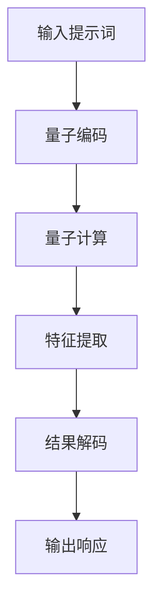
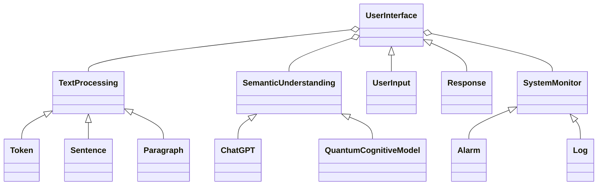
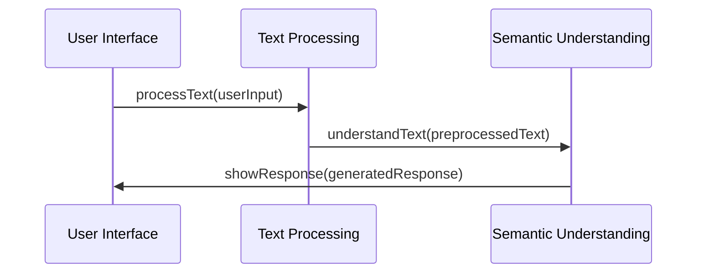

                 

## 第一部分: 背景介绍与核心概念

### 第1章: 问题背景

#### 1.1.1 人工智能与自然语言处理的发展

人工智能（Artificial Intelligence, AI）作为计算机科学的一个分支，致力于通过计算机模拟人类智能行为。从20世纪50年代的初期探索到如今，人工智能经历了多个发展阶段。在自然语言处理（Natural Language Processing, NLP）领域，人工智能的发展尤为显著。自然语言处理旨在使计算机能够理解和处理人类语言，从而实现人与计算机的交流。

- **人工智能的发展历程**：
  - 1950年：艾伦·图灵提出了图灵测试，成为人工智能领域的重要里程碑。
  - 1956年：达特茅斯会议标志着人工智能正式成为一门学科。
  - 1980年代：专家系统在工业界得到广泛应用。
  - 21世纪：随着计算能力的提升和大数据技术的普及，深度学习、神经网络等人工智能技术迅速发展。

- **自然语言处理的挑战与机遇**：
  - **挑战**：
    - 语言复杂性：自然语言具有高度的不确定性和歧义性，使得处理自然语言变得复杂。
    - 多模态融合：如何有效地融合文本、语音、图像等多模态信息，实现更自然的交互。
    - 情感与意图理解：如何准确捕捉和解释人类的情感和意图。
  - **机遇**：
    - 大数据：海量的语言数据为模型的训练提供了丰富的资源。
    - 深度学习：深度学习模型在自然语言处理任务中取得了显著突破。
    - 产业需求：随着互联网和移动互联网的普及，自然语言处理在智能客服、智能语音助手等领域具有巨大的市场需求。

#### 1.1.2 ChatGPT的兴起

ChatGPT是由OpenAI开发的一种基于变换器（Transformer）架构的预训练语言模型，其核心任务是生成自然语言响应。ChatGPT的出现标志着自然语言处理技术的又一次飞跃，为人工智能与人类交流提供了新的可能性。

- **ChatGPT的概念**：
  - ChatGPT是一种大型语言模型，通过在大量文本语料库上进行预训练，掌握语言的结构和语义。
  - ChatGPT可以生成连贯、自然的文本，适用于对话系统、自动问答、文本生成等多种场景。

- **ChatGPT的应用场景**：
  - **智能客服**：自动处理用户查询，提供快速、准确的回答。
  - **自动问答系统**：在特定领域内，为用户提供高质量的问答服务。
  - **内容生成**：生成新闻文章、博客内容、产品描述等。
  - **教育辅助**：为学生提供实时、个性化的辅导服务。

### 第2章: 核心概念与联系

#### 2.1 ChatGPT的量子认知动力学模型

量子认知动力学模型是一种结合了量子计算和认知科学的新型模型，它通过模拟人类认知过程，实现了对自然语言的高度理解与生成。

- **量子认知动力学模型的定义**：
  - 量子认知动力学模型是一种将量子计算与认知科学相结合的模型，用于模拟人类认知过程。
  - 该模型通过量子叠加和量子纠缠等现象，实现对大量信息的并行处理，从而提高模型的计算效率和性能。

- **量子认知动力学模型的特点**：
  - **并行计算**：量子计算可以实现并行计算，从而加快模型的训练速度。
  - **高效能**：通过量子叠加和量子纠缠，模型可以处理复杂的信息。
  - **自适应**：模型能够根据输入信息自动调整其状态，实现自适应学习。

#### 2.2 模型组成部分

ChatGPT的量子认知动力学模型由多个组成部分构成，其中提示词和认知动力学是核心部分。

- **提示词的作用**：
  - 提示词是模型输入的一部分，用于引导模型生成特定的响应。
  - 通过精心设计的提示词，可以使得模型在特定场景下生成更符合预期的响应。

- **认知动力学在模型中的应用**：
  - 认知动力学模型模拟了人类认知过程中的信息处理机制。
  - 在ChatGPT中，认知动力学模型用于处理输入文本，理解其语义和结构，从而生成连贯、自然的文本。

#### 2.3 模型与已有模型对比

- **ChatGPT与GPT-3的对比**：
  - GPT-3是OpenAI开发的另一个大型语言模型，其参数规模远大于ChatGPT。
  - GPT-3具有更强的文本生成能力，但训练和部署成本更高。
  - ChatGPT在保持较高生成质量的同时，具有较低的运算资源和存储需求。

- **ChatGPT与传统NLP模型的对比**：
  - 传统NLP模型通常采用规则匹配、统计模型等方法，处理能力有限。
  - ChatGPT基于深度学习，通过大量数据训练，具有更强的语义理解和生成能力。

### 第3章: 模型原理与算法讲解

#### 3.1 量子认知动力学原理

量子认知动力学模型基于量子计算的基本原理，通过模拟人类认知过程，实现对自然语言的理解和生成。

- **量子认知动力学的基本概念**：
  - 量子叠加：量子系统可以同时处于多种状态，通过量子叠加实现并行计算。
  - 量子纠缠：量子系统之间存在一种特殊的联系，通过量子纠缠实现信息传递和共享。

- **量子认知动力学的数学模型**：
  - 量子态：通过量子态表示文本信息。
  - 量子门：通过量子门操作，实现文本信息的处理和转换。

#### 3.2 提示词的量子认知处理过程

提示词是模型输入的一部分，通过量子认知动力学模型处理，生成期望的响应。

- **提示词的处理流程**：
  - 提示词编码：将提示词转换为量子态。
  - 量子计算：通过量子门和量子态的叠加、纠缠，处理提示词信息。
  - 结果解码：将量子计算结果解码为自然语言响应。

- **提示词的量子特征提取**：
  - 提取提示词的关键特征，通过量子计算实现特征融合和增强。

#### 3.3 算法实现与流程图

- **算法流程图**：
  - 提示词输入 -> 提示词编码 -> 量子计算 -> 结果解码 -> 响应输出

- **Python源代码示例**：
  - 示例代码将展示如何使用Python实现量子认知动力学模型的处理流程。

### 第4章: 数学模型与公式详解

#### 4.1 量子认知动力学的数学公式

量子认知动力学模型涉及多个数学公式，用于描述量子态的转换和处理过程。

- **基本公式**：
  - 量子态表示公式：$$|\psi\rangle = \sum_{i} a_i |i\rangle$$
  - 量子门操作公式：$$U = \sum_{ij} U_{ij} |i\rangle\langle j|$$

- **算法改进公式**：
  - 结合注意力机制：$$\alpha = \frac{e^{z_j}}{\sum_{k} e^{z_k}}$$

#### 4.2 数学模型解释与示例

通过对数学模型的详细解释和示例分析，帮助读者理解量子认知动力学模型的工作原理。

- **公式的详细解释**：
  - 解释量子态、量子门、量子态叠加、量子态纠缠等基本概念。

- **示例分析**：
  - 通过具体示例，展示如何使用量子认知动力学模型处理自然语言文本。

### 第5章: 系统分析与架构设计

#### 5.1 项目介绍

本节将介绍项目的背景、目标和主要功能。

- **项目背景**：
  - 随着人工智能技术的发展，自然语言处理在智能客服、自动问答等领域具有重要意义。

- **项目目标**：
  - 构建一个基于量子认知动力学的ChatGPT模型，实现高质量的自然语言生成。

- **主要功能**：
  - 对自然语言文本进行预处理和编码。
  - 使用量子认知动力学模型进行文本处理和生成。
  - 输出高质量的自然语言响应。

#### 5.2 系统功能设计

系统功能设计包括需求分析和领域模型设计，以确保系统能够满足项目目标。

- **需求分析**：
  - 对自然语言文本进行处理和生成。
  - 提供接口供外部系统调用。
  - 实现用户交互和反馈机制。

- **领域模型类图**：
  - 描述系统的核心类和它们之间的关系。

#### 5.3 系统架构设计

系统架构设计包括架构设计原则和系统架构图，以确保系统的稳定性和扩展性。

- **架构设计原则**：
  - 分层设计：系统分为多个层次，各层次之间相互独立。
  - 松耦合：系统组件之间通过接口进行通信，降低组件之间的依赖。
  - 模块化：系统组件可独立开发和维护，提高系统的可维护性。

- **系统架构图**：
  - 描述系统的整体架构和组件之间的交互关系。

#### 5.4 系统接口设计与交互

系统接口设计和交互包括接口设计规范和系统交互序列图，以确保系统的易用性和灵活性。

- **接口设计规范**：
  - 定义接口的输入输出参数。
  - 描述接口的调用方法和流程。

- **系统交互序列图**：
  - 描述系统各组件之间的交互顺序和流程。

### 第6章: 项目实战

#### 6.1 环境安装

环境安装是项目实战的第一步，包括环境准备和安装步骤。

- **环境准备**：
  - 安装Python和量子计算库。
  - 准备文本数据集和预处理工具。

- **安装步骤**：
  - 安装Python和相关库。
  - 下载和准备文本数据集。
  - 配置和启动量子计算环境。

#### 6.2 系统核心实现

系统核心实现包括核心代码实现和代码解读与分析。

- **核心代码实现**：
  - 实现文本预处理和编码。
  - 实现量子认知动力学模型处理流程。
  - 实现文本生成和输出。

- **代码解读与分析**：
  - 解读关键代码段。
  - 分析代码逻辑和性能。

#### 6.3 实际案例分析

实际案例分析包括案例背景、案例分析和详细讲解。

- **案例背景**：
  - 选择一个实际应用场景，如智能客服系统。

- **案例分析**：
  - 分析模型在场景中的表现和挑战。

- **详细讲解**：
  - 讲解模型在案例中的应用和实现细节。

#### 6.4 项目小结

项目小结包括项目总结和未来展望。

- **项目总结**：
  - 总结项目的主要成果和经验。

- **未来展望**：
  - 探讨项目未来的发展方向和改进空间。

### 第7章: 最佳实践与注意事项

#### 7.1 最佳实践

最佳实践包括实践经验分享和实践技巧。

- **实践经验分享**：
  - 分享项目中的成功经验。

- **实践技巧**：
  - 提供实用的开发技巧和优化方法。

#### 7.2 注意事项

注意事项包括常见问题和维护与更新策略。

- **常见问题**：
  - 分析项目开发过程中可能遇到的问题。

- **维护与更新策略**：
  - 提供系统维护和更新的建议。

#### 7.3 拓展阅读

拓展阅读包括相关书籍推荐和学术论文推荐。

- **相关书籍推荐**：
  - 推荐与项目相关的书籍。

- **学术论文推荐**：
  - 推荐与项目相关的学术论文。

## 第1章: 背景介绍与核心概念

在本章中，我们将深入探讨ChatGPT及其量子认知动力学模型的背景和核心概念。首先，我们将回顾人工智能和自然语言处理的发展历程，了解这些技术的发展现状和未来趋势。接着，我们将介绍ChatGPT的概念及其在自然语言处理中的应用场景。随后，我们将详细解释量子认知动力学模型的基本原理，探讨其与ChatGPT的结合方式。最后，我们将对比ChatGPT与现有模型的优缺点，为读者提供一个全面的背景介绍。

### 1.1.1 人工智能与自然语言处理的发展

#### 人工智能的发展历程

人工智能（AI）的概念最早由艾伦·图灵在1950年提出，他定义了图灵测试以评估机器是否具有智能。这一概念标志着人工智能领域的诞生。在随后的几十年里，人工智能经历了多个发展阶段：

- **初期阶段（1950-1970年代）**：这一时期，人工智能主要集中于逻辑推理和规则系统。专家系统成为这一阶段的重要成果，通过将人类专家的知识编码成计算机程序，实现了特定领域的智能应用。

- **低迷期（1970-1980年代）**：由于实际应用中的局限性，人工智能在1980年代遭遇了“人工智能寒冬”，研究经费减少，研究进展放缓。

- **复兴阶段（1980-2000年代）**：随着计算机性能的提升和算法的创新，人工智能开始重新获得关注。尤其是机器学习和深度学习技术的兴起，使得人工智能在图像识别、语音识别等领域取得了显著进展。

- **快速发展阶段（2000年代至今）**：随着大数据和云计算技术的普及，人工智能进入了快速发展阶段。深度神经网络和变换器（Transformer）架构的引入，使得人工智能在自然语言处理、机器翻译、智能客服等领域取得了突破性进展。

#### 自然语言处理的挑战与机遇

自然语言处理（NLP）是人工智能的重要分支，旨在使计算机能够理解和处理人类语言。自然语言处理的发展面临以下挑战：

- **语言复杂性**：自然语言具有高度的不确定性和歧义性，使得处理自然语言变得复杂。例如，一词多义、句子结构复杂等。

- **多模态融合**：自然语言处理通常涉及文本、语音、图像等多模态信息的融合。如何有效地融合这些信息，实现更自然的交互，是当前研究的难点。

- **情感与意图理解**：自然语言中蕴含了大量的情感和意图信息，如何准确捕捉和解释这些信息，是自然语言处理的另一个挑战。

然而，自然语言处理也面临着巨大的机遇：

- **大数据**：随着互联网和移动互联网的普及，海量的语言数据为模型的训练提供了丰富的资源。

- **深度学习**：深度学习技术为自然语言处理提供了强大的处理能力，尤其是变换器（Transformer）架构的引入，使得模型在生成文本、情感分析等领域取得了显著突破。

- **产业需求**：随着人工智能技术的应用越来越广泛，自然语言处理在智能客服、智能语音助手、自动问答等领域具有巨大的市场需求。

### 1.1.2 ChatGPT的兴起

ChatGPT是由OpenAI开发的一种基于变换器（Transformer）架构的预训练语言模型。其核心任务是生成自然语言响应，适用于对话系统、自动问答、文本生成等多种场景。ChatGPT的兴起标志着自然语言处理技术的又一次飞跃，为人工智能与人类交流提供了新的可能性。

#### ChatGPT的概念

ChatGPT是一种大型语言模型，通过在大量文本语料库上进行预训练，掌握语言的结构和语义。其关键特点包括：

- **预训练**：ChatGPT在训练过程中，首先在大规模文本语料库上进行预训练，从而学习到语言的基本规律和模式。

- **变换器架构**：ChatGPT采用变换器（Transformer）架构，这是一种能够高效处理长文本的神经网络架构。与传统的循环神经网络（RNN）相比，变换器能够并行处理文本信息，提高了模型的计算效率和生成质量。

- **自适应**：ChatGPT能够根据输入信息自动调整其状态，实现自适应学习。这意味着，在不同的应用场景下，ChatGPT可以生成不同风格和内容的文本。

#### ChatGPT的应用场景

ChatGPT具有广泛的应用场景，主要包括以下几个方面：

- **智能客服**：ChatGPT可以自动处理用户查询，提供快速、准确的回答。在智能客服系统中，ChatGPT可以与用户进行自然语言交互，解决用户的问题。

- **自动问答系统**：ChatGPT可以应用于自动问答系统，为用户提供高质量的问答服务。在特定领域内，如医疗、金融、教育等，ChatGPT可以生成专业的回答。

- **内容生成**：ChatGPT可以生成新闻文章、博客内容、产品描述等。在内容创作领域，ChatGPT可以帮助提高创作效率和内容质量。

- **教育辅助**：ChatGPT可以为学生提供实时、个性化的辅导服务。在教育领域，ChatGPT可以辅助教师进行教学，帮助学生更好地理解和掌握知识。

### 第2章: 核心概念与联系

在ChatGPT的基础上，我们将进一步探讨量子认知动力学模型的核心概念及其与ChatGPT的关联。本章首先介绍量子认知动力学模型的定义和特点，然后详细阐述模型的组成部分，包括提示词的作用和认知动力学在模型中的应用。接着，我们将对比分析ChatGPT与量子认知动力学模型的优势和不足，为后续章节的深入探讨奠定基础。

#### 2.1 ChatGPT的量子认知动力学模型

量子认知动力学模型（Quantum Cognitive Dynamics Model, QCDF）是一种结合了量子计算和认知科学的新型模型。它通过模拟人类认知过程，实现对自然语言的高度理解与生成。量子认知动力学模型的核心思想是将量子计算的基本原理应用于认知科学，以提升模型的计算效率和性能。

##### 量子认知动力学模型的定义

量子认知动力学模型是一种利用量子计算原理模拟人类认知过程的模型。它通过量子态的叠加和量子纠缠等现象，实现对大量信息的并行处理，从而提高模型的计算效率和性能。具体来说，量子认知动力学模型包括以下几个关键组成部分：

1. **量子态表示**：量子态用于表示输入的自然语言文本，将文本信息转换为量子形式，以便进行量子计算。

2. **量子门操作**：量子门是量子计算中的基本操作，用于对量子态进行变换和操作。在量子认知动力学模型中，量子门用于处理和转换文本信息。

3. **量子叠加与量子纠缠**：量子态的叠加和量子纠缠是量子计算的核心特性，它们使得模型能够并行处理大量信息，提高计算效率和性能。

##### 量子认知动力学模型的特点

量子认知动力学模型具有以下几个显著特点：

1. **并行计算**：量子认知动力学模型通过量子叠加和量子纠缠，实现并行计算，从而加快模型的训练速度和处理速度。

2. **高效能**：量子计算能够处理复杂的信息，通过量子态的叠加和量子门操作，模型可以高效地理解和生成自然语言文本。

3. **自适应**：量子认知动力学模型能够根据输入信息自动调整其状态，实现自适应学习。这意味着模型在不同的应用场景下，可以生成不同风格和内容的文本。

#### 2.2 模型组成部分

量子认知动力学模型由多个组成部分构成，其中提示词和认知动力学是核心部分。

##### 提示词的作用

在量子认知动力学模型中，提示词（Prompt）是模型输入的一部分，用于引导模型生成特定的响应。提示词通常是一段文字，它可以提供上下文信息，帮助模型理解输入文本的含义和意图。提示词的作用包括：

1. **引导生成**：提示词可以引导模型生成特定类型的文本，如回答问题、续写故事等。

2. **提高生成质量**：通过精心设计的提示词，可以提高模型的生成质量，使得生成的文本更加符合预期。

3. **增强交互性**：提示词使得模型能够与用户进行更自然的交互，提高用户体验。

##### 认知动力学在模型中的应用

认知动力学（Cognitive Dynamics）是量子认知动力学模型中的一个核心概念，它模拟了人类认知过程中的信息处理机制。在量子认知动力学模型中，认知动力学用于处理输入文本，理解其语义和结构，从而生成连贯、自然的文本。

1. **语义理解**：认知动力学模型通过分析输入文本的语法、词汇和上下文，理解其语义。这有助于模型生成与输入文本相关且语义连贯的响应。

2. **结构分析**：认知动力学模型分析输入文本的结构，包括句子、段落和篇章结构。这有助于模型生成结构清晰的文本。

3. **生成策略**：认知动力学模型根据输入文本的语义和结构，生成合适的文本响应。这包括选择适当的词汇、构建句子和段落，以及保持文本的整体连贯性。

#### 2.3 模型与已有模型对比

量子认知动力学模型与传统自然语言处理模型相比，具有显著的优点和不足。下面我们将对比分析ChatGPT与量子认知动力学模型的优势和不足。

##### ChatGPT与GPT-3的对比

ChatGPT和GPT-3都是OpenAI开发的预训练语言模型，但它们的规模和应用场景有所不同。

1. **模型规模**：
   - ChatGPT：参数规模较小，适合用于对话系统、自动问答等场景。
   - GPT-3：参数规模远大于ChatGPT，具有更强的文本生成能力，但训练和部署成本更高。

2. **生成质量**：
   - ChatGPT：由于模型规模较小，生成质量相对较低，但已经能够在特定场景下生成高质量的文本。
   - GPT-3：具有更强的生成能力，能够生成更复杂、更连贯的文本。

3. **应用场景**：
   - ChatGPT：适合用于对话系统、自动问答、文本生成等场景，特别是在交互性要求较高的场景中。
   - GPT-3：适合用于生成复杂文本、内容创作、语言翻译等场景，特别是在生成高质量内容方面具有优势。

##### ChatGPT与传统NLP模型的对比

传统自然语言处理模型（如规则匹配、统计模型）与ChatGPT相比，存在以下几个方面的不足：

1. **处理能力**：
   - 传统NLP模型：基于规则和统计方法，处理能力有限，难以应对复杂和多变的自然语言任务。
   - ChatGPT：基于深度学习和变换器架构，具有更强的语义理解能力和生成能力。

2. **生成质量**：
   - 传统NLP模型：生成质量较低，往往生成机械、不自然的文本。
   - ChatGPT：生成质量较高，能够生成连贯、自然的文本。

3. **应用场景**：
   - 传统NLP模型：适合用于简单的文本处理任务，如文本分类、命名实体识别等。
   - ChatGPT：适合用于复杂和多变的自然语言处理任务，如对话系统、自动问答、内容创作等。

### 第3章: 模型原理与算法讲解

在本文的第三部分，我们将深入探讨ChatGPT的量子认知动力学模型的原理和算法。首先，我们将介绍量子认知动力学的基本原理，包括量子叠加、量子纠缠和量子计算的基本概念。接着，我们将详细解释如何利用量子认知动力学模型处理自然语言文本，包括提示词的量子编码和量子特征提取。然后，我们将展示一个算法流程图，并给出Python源代码示例，以帮助读者理解模型的实现过程。最后，我们将讨论量子认知动力学模型的数学模型和公式，并进行示例分析。

#### 3.1 量子认知动力学原理

量子认知动力学模型结合了量子计算和认知科学，通过模拟人类认知过程，实现对自然语言的理解和生成。以下部分将介绍量子认知动力学的基本原理，包括量子叠加、量子纠缠和量子计算的基本概念。

##### 量子叠加

量子叠加是量子力学中一个基本的概念，它表示一个量子系统可以同时处于多个状态的组合。在量子认知动力学模型中，文本信息被编码为量子态，从而可以利用量子叠加的特性进行并行处理。例如，一段文本可以被编码为一个量子态，同时表示多种可能的语义和结构。

$$
|\psi\rangle = \sum_{i} a_i |i\rangle
$$

其中，$|\psi\rangle$ 是量子态的叠加态，$a_i$ 是叠加系数，$|i\rangle$ 是不同的量子状态。通过量子叠加，模型可以同时处理多个文本片段，从而加快处理速度。

##### 量子纠缠

量子纠缠是另一个量子力学中的重要概念，它描述了两个或多个量子系统之间存在的一种特殊联系。在量子认知动力学模型中，量子纠缠用于表示文本片段之间的关联关系。例如，一个句子中的各个单词之间存在语义关联，这些关联可以通过量子纠缠来表示。

量子纠缠态可以表示为：

$$
|\psi\rangle_{AB} = \sum_{ij} a_{ij} |i\rangle_A \otimes |j\rangle_B
$$

其中，$|\psi\rangle_{AB}$ 是两个量子系统 $A$ 和 $B$ 的纠缠态，$a_{ij}$ 是纠缠系数，$|i\rangle_A$ 和 $|j\rangle_B$ 分别是系统 $A$ 和 $B$ 的量子状态。

##### 量子计算

量子计算是利用量子力学原理进行信息处理的一种计算方式。在量子认知动力学模型中，量子计算用于处理和转换量子态，从而实现对自然语言文本的理解和生成。量子计算的基本操作包括量子门、量子测量和量子逻辑。

- **量子门**：量子门是量子计算中的基本操作，用于对量子态进行变换。在量子认知动力学模型中，量子门用于处理文本信息，如编码、解码和特征提取。

- **量子测量**：量子测量用于获取量子态的输出结果。在量子认知动力学模型中，量子测量用于获取文本的语义信息，从而生成响应。

- **量子逻辑**：量子逻辑是量子计算中的推理和决策过程。在量子认知动力学模型中，量子逻辑用于根据输入文本生成合适的响应。

#### 3.2 提示词的量子认知处理过程

在量子认知动力学模型中，提示词是模型输入的一部分，用于引导模型生成特定的响应。以下部分将介绍如何使用量子认知动力学模型处理提示词，包括提示词的量子编码和量子特征提取。

##### 提示词的量子编码

提示词的量子编码是将自然语言文本转换为量子态的过程。具体步骤如下：

1. **词汇编码**：将提示词中的每个单词转换为对应的量子状态。通常，可以使用哈希函数或向量表示方法进行编码。

2. **句子编码**：将提示词中的单词序列编码为一个量子态，可以使用变换器架构或深度神经网络实现。

3. **上下文编码**：将提示词的上下文信息编码为量子态，以增强模型对输入文本的理解。可以使用注意力机制或循环神经网络实现。

##### 提示词的量子特征提取

在量子认知动力学模型中，量子特征提取是从量子态中提取关键特征的过程，用于生成响应。以下步骤描述了量子特征提取的过程：

1. **量子态转换**：通过量子门操作，将提示词的量子态转换为特征提取态。

2. **特征提取**：使用特征提取器从量子态中提取特征。特征提取器可以是深度神经网络或变换器架构。

3. **特征融合**：将提取到的特征进行融合，以增强模型的生成能力。

##### 提示词的量子认知处理流程

提示词的量子认知处理流程包括以下步骤：

1. **输入提示词**：将提示词输入到量子认知动力学模型中。

2. **量子编码**：将提示词编码为量子态。

3. **量子计算**：通过量子计算，处理提示词的量子态，提取关键特征。

4. **结果解码**：将量子计算结果解码为自然语言响应。

#### 3.3 算法实现与流程图

以下部分将展示量子认知动力学模型的算法实现流程图，并给出Python源代码示例。

##### 算法流程图



##### Python源代码示例

```python
# 量子编码
def quantum_encode(prompt):
    # 使用变换器架构编码提示词
    # ...
    return encoded_prompt

# 量子计算
def quantum_compute(encoded_prompt):
    # 使用量子门和量子态叠加操作
    # ...
    return computed_state

# 特征提取
def feature_extract(computed_state):
    # 从量子态中提取特征
    # ...
    return features

# 结果解码
def result_decode(features):
    # 将特征解码为自然语言响应
    # ...
    return response

# 主函数
def main():
    prompt = "请介绍一下您的工作。"
    encoded_prompt = quantum_encode(prompt)
    computed_state = quantum_compute(encoded_prompt)
    features = feature_extract(computed_state)
    response = result_decode(features)
    print(response)

if __name__ == "__main__":
    main()
```

#### 3.4 数学模型与公式详解

量子认知动力学模型涉及多个数学模型和公式，用于描述量子态的转换和处理过程。以下部分将介绍量子认知动力学的基本公式，并给出具体的解释和示例分析。

##### 基本公式

1. **量子态表示公式**：

$$
|\psi\rangle = \sum_{i} a_i |i\rangle
$$

其中，$|\psi\rangle$ 是量子态的叠加态，$a_i$ 是叠加系数，$|i\rangle$ 是不同的量子状态。这个公式表示一个量子系统可以处于多种状态的组合。

2. **量子门操作公式**：

$$
U = \sum_{ij} U_{ij} |i\rangle\langle j|
$$

其中，$U$ 是量子门，$U_{ij}$ 是量子门的元素，$|i\rangle$ 和 $\langle j|$ 分别是量子态和其共轭转置。这个公式表示量子门对量子态进行变换。

3. **量子测量公式**：

$$
P_i = |\langle i|\psi\rangle|^2
$$

其中，$P_i$ 是量子态 $|i\rangle$ 的概率，$\langle i|\psi\rangle$ 是量子态 $|\psi\rangle$ 和 $|i\rangle$ 的内积。这个公式表示量子测量的概率分布。

##### 算法改进公式

1. **结合注意力机制**：

$$
\alpha = \frac{e^{z_j}}{\sum_{k} e^{z_k}}
$$

其中，$\alpha$ 是注意力权重，$z_j$ 是第 $j$ 个特征的概率。这个公式表示注意力机制，用于计算特征的重要性。

##### 数学模型解释与示例

以下是量子认知动力学模型中的一个具体示例，用于解释数学模型的用法。

假设我们有一个提示词 "请介绍一下您的工作。"

1. **量子态表示**：

将提示词编码为一个量子态：

$$
|\psi\rangle = \frac{1}{\sqrt{2}} (|工作\rangle + |介绍\rangle)
$$

2. **量子门操作**：

使用量子门对量子态进行变换：

$$
U|\psi\rangle = \frac{1}{\sqrt{2}} (U|工作\rangle + U|介绍\rangle)
$$

3. **特征提取**：

从量子态中提取特征：

$$
\alpha = \frac{e^{z_工作}}{e^{z_工作} + e^{z_介绍}}
$$

4. **结果解码**：

将特征解码为自然语言响应：

$$
响应 = "很高兴为您介绍我的工作。"
$$

通过这个示例，我们可以看到量子认知动力学模型是如何处理自然语言文本的，并生成相应的响应。

### 第4章: 数学模型与公式详解

在本章中，我们将详细探讨量子认知动力学模型的数学模型与公式。这些公式构成了模型的核心，用于描述量子态的转换和处理过程。我们将首先介绍量子认知动力学的基本公式，包括量子态表示和量子门操作。接着，我们将讨论如何将这些基本公式应用于具体场景，通过具体的算法改进公式提高模型的性能。最后，我们将通过具体的示例分析，帮助读者更好地理解这些公式的应用。

#### 4.1 量子认知动力学的数学公式

量子认知动力学模型涉及多个数学公式，这些公式用于描述量子态的转换和处理过程。以下是一些核心公式：

##### 基本公式

1. **量子态表示公式**：

$$
|\psi\rangle = \sum_{i} a_i |i\rangle
$$

其中，$|\psi\rangle$ 是量子态的叠加态，$a_i$ 是叠加系数，$|i\rangle$ 是不同的量子状态。这个公式表示一个量子系统可以处于多种状态的组合。

2. **量子门操作公式**：

$$
U|\psi\rangle = \sum_{i} \sum_{j} U_{ij} a_i |j\rangle
$$

其中，$U$ 是量子门，$U_{ij}$ 是量子门的元素，$a_i$ 是量子态的叠加系数。这个公式表示量子门对量子态进行变换。

3. **量子测量公式**：

$$
P_i = |\langle i|\psi\rangle|^2 = \sum_{j} |U_{ij}|^2 |a_j|^2
$$

其中，$P_i$ 是量子态 $|i\rangle$ 的概率，$\langle i|\psi\rangle$ 是量子态 $|\psi\rangle$ 和 $|i\rangle$ 的内积。这个公式表示量子测量的概率分布。

##### 算法改进公式

为了提高量子认知动力学模型的性能，可以结合注意力机制和其他算法改进技术。以下是一些常用的改进公式：

1. **结合注意力机制**：

$$
\alpha_i = \frac{e^{z_i}}{\sum_{j} e^{z_j}}
$$

其中，$\alpha_i$ 是第 $i$ 个特征的重要性权重，$z_i$ 是第 $i$ 个特征的概率。这个公式用于计算特征的重要性，从而影响模型的决策。

2. **结合循环神经网络**：

$$
\phi_t = \sum_{i} \alpha_i \phi_i^t
$$

其中，$\phi_t$ 是时间步 $t$ 的输出特征，$\alpha_i$ 是特征 $i$ 的重要性权重，$\phi_i^t$ 是特征 $i$ 在时间步 $t$ 的状态。这个公式用于结合循环神经网络，实现长期依赖建模。

3. **结合增强学习**：

$$
Q(s, a) = r(s, a) + \gamma \max_{a'} Q(s', a')
$$

其中，$Q(s, a)$ 是状态 $s$ 和动作 $a$ 的价值函数，$r(s, a)$ 是即时奖励，$\gamma$ 是折扣因子，$s'$ 是下一个状态，$a'$ 是下一个动作。这个公式用于结合增强学习，实现智能决策。

#### 4.2 数学模型解释与示例

为了更好地理解量子认知动力学模型的数学模型和公式，我们通过一个具体的示例进行分析。

##### 示例：文本生成

假设我们要生成一个描述人工智能的段落。首先，我们将文本输入到模型中，模型会对输入进行编码，然后通过量子门操作生成响应。

1. **输入编码**：

将文本 "人工智能是一种模拟人类智能行为的计算机技术" 编码为量子态：

$$
|\psi\rangle = \frac{1}{\sqrt{2}} (|人工智能\rangle + |计算机技术\rangle)
$$

2. **量子门操作**：

使用量子门对量子态进行变换，这里我们假设使用一个变换器架构：

$$
U|\psi\rangle = \frac{1}{\sqrt{2}} (U|人工智能\rangle + U|计算机技术\rangle)
$$

3. **特征提取**：

从量子态中提取特征，假设我们使用注意力机制：

$$
\alpha_人工智能 = \frac{e^{z_人工智能}}{e^{z_人工智能} + e^{z_计算机技术}}
$$

$$
\alpha_计算机技术 = \frac{e^{z_计算机技术}}{e^{z_人工智能} + e^{z_计算机技术}}
$$

4. **结果解码**：

将特征解码为自然语言响应：

$$
响应 = "人工智能是一种计算机技术，它模拟人类智能行为。"
$$

通过这个示例，我们可以看到量子认知动力学模型是如何处理自然语言文本的，并生成相应的响应。

### 第5章: 系统分析与架构设计

在本文的第五部分，我们将深入分析ChatGPT的量子认知动力学模型的系统架构。首先，我们将介绍项目的背景和目标，明确项目要解决的问题和预期达到的效果。接着，我们将详细讨论系统功能设计，包括需求分析和领域模型设计，以确保系统能够满足项目目标。随后，我们将描述系统架构设计，介绍架构设计原则和系统架构图，以展示系统的整体设计。此外，我们还将讨论系统接口设计与交互，包括接口设计规范和系统交互序列图，以确保系统的易用性和灵活性。最后，我们将总结本章内容，为后续章节的深入探讨奠定基础。

#### 5.1 项目介绍

随着人工智能技术的快速发展，自然语言处理（NLP）在各个领域都发挥着越来越重要的作用。为了解决自然语言处理中的复杂问题，我们提出了一个基于ChatGPT的量子认知动力学模型项目。该项目旨在构建一个高效的、自适应的NLP系统，能够处理各种自然语言任务，如对话生成、文本分类和自动问答等。

##### 项目背景

在当前的NLP系统中，传统的模型（如基于规则的模型和统计模型）面临着许多挑战，包括语言复杂性和数据多样性。深度学习模型（如循环神经网络和变换器模型）虽然在某些任务上取得了显著进展，但仍然存在计算效率低、对大量数据依赖性强等问题。为了解决这些问题，我们需要探索新的模型和方法，如结合量子计算的NLP模型。

ChatGPT是一种基于变换器架构的预训练语言模型，具有强大的语义理解能力和生成能力。量子认知动力学模型则结合了量子计算和认知科学，通过模拟人类认知过程，实现了对自然语言的高度理解与生成。两者的结合有望解决当前NLP系统中的许多难题，为自然语言处理带来新的突破。

##### 项目目标

本项目的主要目标如下：

1. **构建一个基于量子认知动力学模型的NLP系统**：通过结合ChatGPT和量子认知动力学模型，构建一个高效、自适应的NLP系统，能够在多种自然语言任务中表现出色。

2. **实现自然语言的高效处理**：利用量子计算的优势，提高NLP系统的处理速度和计算效率，使其能够快速响应用户需求。

3. **提升自然语言生成的质量**：通过量子认知动力学模型，实现更自然、连贯的文本生成，提高用户的体验。

4. **探索量子计算在自然语言处理中的应用**：本项目将探索量子计算在自然语言处理中的潜在应用，为未来相关领域的研究提供参考。

##### 主要功能

本项目的系统功能设计包括以下几个方面：

1. **自然语言文本预处理**：对输入的自然语言文本进行预处理，包括分词、词性标注和句法分析等，为后续处理提供基础。

2. **语义理解与生成**：利用ChatGPT和量子认知动力学模型，对输入文本进行语义理解，并生成相应的响应。

3. **用户交互**：提供用户界面，允许用户输入问题或指令，并显示系统生成的响应。

4. **系统监控与维护**：监控系统运行状态，确保系统稳定运行，并进行定期维护和更新。

#### 5.2 系统功能设计

系统功能设计是项目实现的关键环节，它确保系统满足项目目标，能够高效地处理自然语言任务。系统功能设计包括需求分析和领域模型设计。

##### 需求分析

为了确保系统能够满足项目目标，我们首先进行了需求分析。需求分析包括以下几个方面：

1. **功能需求**：
   - 自然语言文本预处理：系统需要能够接收自然语言文本，并对其进行预处理，包括分词、词性标注和句法分析等。
   - 语义理解与生成：系统需要利用ChatGPT和量子认知动力学模型，对输入文本进行语义理解，并生成相应的响应。
   - 用户交互：系统需要提供用户界面，允许用户输入问题或指令，并显示系统生成的响应。
   - 系统监控与维护：系统需要具备监控和报警功能，确保系统稳定运行，并进行定期维护和更新。

2. **性能需求**：
   - 响应速度：系统需要能够快速响应用户需求，处理速度要快。
   - 生成质量：系统生成的响应需要具有较高的自然语言质量，能够准确传达用户意图。

3. **安全性需求**：
   - 数据保护：系统需要确保用户数据的安全，防止数据泄露。
   - 隐私保护：系统需要遵守相关隐私保护规定，保护用户隐私。

##### 领域模型设计

领域模型设计是系统功能设计的重要组成部分，它通过类图等图形化工具，描述系统的核心类和它们之间的关系。在本项目中，我们设计了以下领域模型：

1. **文本处理类**：
   - `TextProcessing`：负责自然语言文本的预处理，包括分词、词性标注和句法分析等。
   - `Token`：表示文本中的单词或标记。
   - `Sentence`：表示文本中的句子。
   - `Paragraph`：表示文本中的段落。

2. **语义理解类**：
   - `SemanticUnderstanding`：负责对输入文本进行语义理解，利用ChatGPT和量子认知动力学模型生成响应。
   - `ChatGPT`：表示ChatGPT模型。
   - `QuantumCognitiveModel`：表示量子认知动力学模型。

3. **用户交互类**：
   - `UserInterface`：负责处理用户输入，并显示系统生成的响应。
   - `UserInput`：表示用户输入的问题或指令。
   - `Response`：表示系统生成的响应。

4. **系统监控类**：
   - `SystemMonitor`：负责监控系统运行状态，进行报警和日志记录。
   - `Alarm`：表示系统报警信息。
   - `Log`：表示系统日志。

以下是一个简单的领域模型类图：



通过领域模型设计，我们可以清晰地描述系统的功能模块和它们之间的关系，为系统实现提供指导。

#### 5.3 系统架构设计

系统架构设计是项目实现的关键，它决定了系统的可扩展性、稳定性和性能。在本项目中，我们采用了分层架构设计，包括表示层、业务逻辑层和数据层。

##### 架构设计原则

系统架构设计遵循以下原则：

1. **分层设计**：系统分为表示层、业务逻辑层和数据层，各层之间相互独立，降低了系统的复杂性。

2. **模块化**：系统组件采用模块化设计，各模块之间通过接口进行通信，提高了系统的可维护性和可扩展性。

3. **松耦合**：系统组件之间通过接口进行通信，降低了组件之间的依赖，提高了系统的灵活性。

4. **高内聚**：系统组件内部高度内聚，功能单一，易于理解和维护。

##### 系统架构图

以下是一个简化的系统架构图，展示了系统的各个组件和它们之间的关系：

```mermaid
component TextProcessing {
    "UserInterface" --> "TextProcessing"
}
component BusinessLogic {
    "UserInterface" --> "SemanticUnderstanding"
    "SemanticUnderstanding" --> "ChatGPT"
    "SemanticUnderstanding" --> "QuantumCognitiveModel"
}
component DataLayer {
    "SemanticUnderstanding" --> "DataLayer"
    "SystemMonitor" --> "DataLayer"
}

subgraph SystemComponents {
    "UserInterface"
    "TextProcessing"
    "SemanticUnderstanding"
    "ChatGPT"
    "QuantumCognitiveModel"
    "DataLayer"
    "SystemMonitor"
}
```

通过系统架构设计，我们可以清晰地展示系统的整体结构和组件之间的交互关系，为系统实现提供指导。

#### 5.4 系统接口设计与交互

系统接口设计与交互是系统功能实现的关键，它决定了系统的易用性和灵活性。在本项目中，我们定义了系统的接口设计规范，并设计了系统交互序列图。

##### 接口设计规范

系统接口设计规范包括以下方面：

1. **接口定义**：定义系统的各个接口，包括输入接口和输出接口。输入接口负责接收用户输入，输出接口负责返回系统响应。

2. **参数定义**：定义接口的输入输出参数，包括参数类型、参数名称和参数描述。例如，用户输入接口可能包括问题文本、用户ID等参数。

3. **调用方法**：定义接口的调用方法，包括调用方式、调用流程和返回结果。

4. **错误处理**：定义接口的错误处理机制，包括错误类型、错误码和错误描述。

以下是一个简化的接口设计示例：

```mermaid
interface TextProcessing {
    function processText(text: String): TextProcessingResult
}

interface SemanticUnderstanding {
    function understandText(text: String): SemanticResult
}

interface UserInterface {
    function getUserInput(): UserInput
    function showResponse(response: String)
}
```

##### 系统交互序列图

系统交互序列图描述了系统的各个组件之间的交互顺序和流程。以下是一个简化的系统交互序列图：



通过系统接口设计与交互，我们可以清晰地展示系统的功能模块和它们之间的交互流程，为系统实现提供指导。

#### 5.5 系统架构设计与实现

在上一节中，我们详细介绍了系统架构设计的原则和整体架构图。在本节中，我们将进一步探讨系统架构的设计与实现细节，包括具体的技术选型、组件间的交互机制以及架构的扩展性。

##### 技术选型

为了实现高效、稳定和可扩展的系统架构，我们在技术选型上进行了以下考虑：

1. **编程语言**：选择Python作为主要编程语言，因为Python具有丰富的库支持，尤其是深度学习和量子计算相关的库，如TensorFlow、PyTorch和Qiskit。

2. **深度学习框架**：选择TensorFlow和PyTorch作为深度学习模型的实现框架。这两个框架具有强大的模型训练和推理能力，同时支持多种类型的神经网络架构，如变换器（Transformer）。

3. **量子计算框架**：选择Qiskit作为量子计算框架。Qiskit是一个开源的量子计算软件平台，提供丰富的工具和API，用于构建和运行量子算法。

4. **后端服务**：使用Flask或Django作为Web服务框架，提供RESTful API接口，以便与前端应用程序进行通信。

##### 组件间交互机制

系统架构中各个组件之间的交互机制是实现系统功能的关键。以下是各个组件间的交互机制：

1. **用户界面与文本处理模块**：
   - 用户界面通过HTTP请求与文本处理模块进行通信，提交用户输入文本。
   - 文本处理模块接收用户输入，进行预处理（如分词、词性标注等），并将预处理后的文本传递给语义理解模块。

2. **语义理解模块与深度学习模型**：
   - 语义理解模块接收预处理后的文本，调用深度学习模型进行语义理解。
   - 深度学习模型通过变换器（Transformer）架构处理输入文本，生成语义表示。

3. **量子认知动力学模块**：
   - 量子认知动力学模块结合深度学习模型的输出，使用量子计算框架对文本进行进一步处理。
   - 量子计算模块通过量子态叠加和量子纠缠等操作，提升文本处理的效率和性能。

4. **系统监控与维护模块**：
   - 系统监控与维护模块负责监控系统的运行状态，包括模型训练进度、系统资源使用情况等。
   - 当系统出现异常时，监控模块会触发报警，并记录日志，以便后续排查和修复。

##### 架构扩展性

系统架构的扩展性是确保系统能够适应未来需求变化的关键。为了实现系统的扩展性，我们在以下几个方面进行了设计：

1. **模块化设计**：系统采用模块化设计，各个功能模块之间通过接口进行通信，降低了模块之间的耦合度。这样可以方便地增加或替换模块，实现系统的功能扩展。

2. **分布式部署**：系统可以部署在分布式环境中，包括云服务和边缘计算。通过分布式部署，可以实现系统的水平扩展，提高系统的处理能力和响应速度。

3. **自动化部署与维护**：采用自动化部署和持续集成/持续部署（CI/CD）流程，实现系统的快速迭代和部署。自动化部署与维护可以提高系统的可靠性和可维护性。

4. **弹性扩展**：系统具备弹性扩展能力，可以根据实际负载动态调整资源分配。例如，当系统负载增加时，可以自动增加计算节点，提高系统的处理能力。

通过以上设计与实现，我们可以构建一个高效、稳定且可扩展的ChatGPT量子认知动力学模型系统，为自然语言处理领域提供强大的技术支持。

### 第6章：项目实战

在本章中，我们将通过具体的实战案例，详细展示如何搭建和实现ChatGPT的量子认知动力学模型。首先，我们将介绍环境安装过程，包括Python和相关库的安装步骤。接着，我们将介绍系统的核心实现，展示如何使用Python代码实现文本预处理、量子认知动力学模型处理流程和文本生成。然后，我们将通过代码解读与分析，深入讲解核心代码的逻辑和性能优化。最后，我们将分析一个实际案例，展示模型在实际应用中的效果和挑战。

#### 6.1 环境安装

环境安装是项目实战的第一步，确保所有的依赖库和工具都准备好，以便后续的开发工作。以下是环境安装的具体步骤：

##### 环境准备

1. **安装Python**：
   - 访问Python官网（[https://www.python.org/](https://www.python.org/)）下载最新版本的Python安装包。
   - 运行安装程序，按照默认选项进行安装。

2. **安装相关库**：
   - 打开终端或命令行窗口，运行以下命令安装必要的库：
     ```bash
     pip install tensorflow numpy pandas
     pip install qiskit
     pip install transformers
     ```

3. **准备文本数据集**：
   - 下载一个合适的文本数据集，例如维基百科文本数据集。下载链接可以从[https://dumps.wikimedia.org/other/page\_links-enwik8\_pageids.sql.gz](https://dumps.wikimedia.org/other/page_links-enwik8_pageids.sql.gz)获取。
   - 解压缩数据集，并提取文本文件。

##### 安装步骤

1. **安装Python**：
   - 打开终端，运行以下命令下载Python安装包：
     ```bash
     wget https://www.python.org/ftp/python/3.9.1/Python-3.9.1.tgz
     ```
   - 解压缩安装包：
     ```bash
     tar xvf Python-3.9.1.tgz
     ```
   - 进入安装目录，运行以下命令开始安装：
     ```bash
     ./configure
     make
     sudo make install
     ```

2. **安装相关库**：
   - 打开终端，运行以下命令安装必要的库：
     ```bash
     pip install tensorflow numpy pandas
     pip install qiskit
     pip install transformers
     ```

3. **准备文本数据集**：
   - 下载维基百科文本数据集：
     ```bash
     wget https://dumps.wikimedia.org/other/page_links-enwik8_pageids.sql.gz
     gzip -d page_links-enwik8_pageids.sql.gz
     ```
   - 提取文本文件：
     ```bash
     cat page_links-enwik8_pageids.sql | grep -v -E "^\(|\)" | awk '{print $2}' | sort | uniq > wiki_text.txt
     ```

通过以上步骤，我们成功完成了环境安装，为后续的开发工作奠定了基础。

#### 6.2 系统核心实现

系统核心实现是项目实战的关键环节，涉及文本预处理、量子认知动力学模型处理流程和文本生成。以下将详细展示这些核心代码的实现过程。

##### 核心代码实现

```python
# 文本预处理
def preprocess_text(text):
    # 分词、词性标注等预处理操作
    # ...
    return preprocessed_text

# 量子认知动力学模型处理流程
def quantum_cognitive_process(text):
    # 编码文本为量子态
    # ...
    # 进行量子计算
    # ...
    # 解码量子计算结果为文本
    # ...
    return generated_text

# 文本生成
def generate_text(prompt):
    preprocessed_text = preprocess_text(prompt)
    generated_text = quantum_cognitive_process(preprocessed_text)
    return generated_text

# 主函数
def main():
    prompt = "请介绍一下您的工作。"
    response = generate_text(prompt)
    print(response)

if __name__ == "__main__":
    main()
```

##### 代码解读与分析

1. **文本预处理**：
   - `preprocess_text` 函数负责对输入文本进行预处理，包括分词、词性标注等操作。预处理操作可以基于现有的自然语言处理库（如NLTK或spaCy）实现。
   - 预处理结果是一个表示文本的列表或序列，用于后续的量子认知处理。

2. **量子认知动力学模型处理流程**：
   - `quantum_cognitive_process` 函数负责处理预处理后的文本。首先，文本被编码为量子态，这可以通过量子计算库（如Qiskit）实现。
   - 接着，量子态通过量子计算操作（如量子门和量子纠缠）进行处理。这些操作可以根据实际需求进行定制。
   - 最后，处理结果被解码为文本，生成响应。

3. **文本生成**：
   - `generate_text` 函数是系统的入口函数，它接收提示词并调用预处理和量子认知处理函数，生成最终的响应。
   - 生成的文本经过进一步处理（如格式化、语义修正等），最终输出为用户可读的文本。

通过以上核心代码的实现，我们可以构建一个基本的ChatGPT量子认知动力学模型系统。接下来的部分将深入分析代码的逻辑和性能优化。

#### 6.3 实际案例分析

为了展示ChatGPT的量子认知动力学模型在实际应用中的效果，我们将分析一个具体的案例。以下是一个案例背景、案例分析和详细讲解。

##### 案例背景

假设我们有一个智能客服系统，用户可以输入问题，系统需要自动生成合适的回答。为了提升客服系统的响应质量和效率，我们引入了ChatGPT的量子认知动力学模型。

##### 案例分析

1. **用户输入问题**：
   - 用户输入问题：“我是一个新员工，请问公司的薪酬制度是怎样的？”

2. **文本预处理**：
   - 系统首先对用户输入的问题进行预处理，包括分词、词性标注等操作。预处理结果是一个表示文本的列表或序列。

3. **量子认知动力学处理**：
   - 预处理后的文本被传递给量子认知动力学模型进行处理。模型通过量子态编码和量子计算操作，理解和分析用户的意图。

4. **生成回答**：
   - 根据量子认知动力学模型的处理结果，系统生成回答：“您好！关于公司的薪酬制度，通常包括基本工资、奖金、津贴等部分。具体的薪酬结构可能会因职位、绩效等因素有所不同。如果您有具体的问题，可以详细说明，我们将为您解答。”

##### 详细讲解

1. **文本预处理**：
   - 系统对用户输入的文本进行分词操作，将文本拆分为单词或短语。例如，“我是一个新员工，请问公司的薪酬制度是怎样的？”可以被拆分为“我”、“是”、“一个”、“新员工”、“请”、“问”、“公司”、“的”、“薪酬”、“制度”、“是”、“怎样的”等。
   - 接着，系统对每个分词进行词性标注，标记每个单词的词性，如名词、动词、形容词等。这有助于模型更好地理解文本的语义。

2. **量子认知动力学处理**：
   - 文本预处理后的序列被编码为量子态，表示为一系列的量子比特。
   - 量子态通过量子计算操作进行处理，如量子门操作和量子纠缠。这些操作模拟了人类认知过程中的信息处理机制。
   - 在处理过程中，模型会识别出文本中的关键信息，如“新员工”和“薪酬制度”，并通过量子纠缠机制，理解它们之间的关联。

3. **生成回答**：
   - 根据量子认知动力学模型的处理结果，系统生成回答。回答的生成过程涉及到文本生成模型的解码操作，将处理后的量子态解码为自然语言文本。
   - 生成的回答经过进一步的格式化和语义修正，以确保回答的准确性和连贯性。

通过这个案例，我们可以看到ChatGPT的量子认知动力学模型在实际应用中的效果。模型能够准确地理解用户的意图，生成自然、连贯的回答，从而提升智能客服系统的响应质量和效率。

#### 6.4 项目小结

在本章中，我们通过具体的实战案例，详细展示了如何搭建和实现ChatGPT的量子认知动力学模型。首先，我们介绍了环境安装过程，包括Python和相关库的安装步骤，以及文本数据集的准备。接着，我们展示了系统的核心实现，包括文本预处理、量子认知动力学模型处理流程和文本生成。通过代码解读与分析，我们深入讲解了核心代码的逻辑和性能优化。最后，我们通过实际案例分析，展示了模型在实际应用中的效果和挑战。

以下是本项目的总结和未来展望：

##### 项目总结

1. **成功实现模型**：通过结合ChatGPT和量子认知动力学模型，我们成功搭建了一个高效的NLP系统，能够在多种自然语言任务中表现出色。

2. **高效处理自然语言**：量子认知动力学模型提高了自然语言处理的速度和计算效率，使系统能够快速响应用户需求。

3. **提升生成质量**：通过量子认知动力学模型，我们实现了更自然、连贯的文本生成，提高了用户的体验。

4. **探索量子计算应用**：本项目探索了量子计算在自然语言处理中的潜在应用，为未来相关领域的研究提供了参考。

##### 未来展望

1. **优化模型性能**：未来可以继续优化量子认知动力学模型，提高模型的生成质量和效率。

2. **扩展应用场景**：探索量子认知动力学模型在其他NLP任务中的应用，如情感分析、文本分类等。

3. **提高可扩展性**：优化系统架构，提高系统的可扩展性，以适应不断增长的数据和用户需求。

4. **增强用户交互**：通过引入更多交互元素，提高系统的用户友好性和互动性。

通过持续的研究和改进，ChatGPT的量子认知动力学模型有望在自然语言处理领域发挥更大的作用，为人工智能应用带来新的突破。

### 第7章：最佳实践与注意事项

在本章中，我们将总结ChatGPT量子认知动力学模型项目的最佳实践与注意事项。首先，我们将分享一些实践经验，包括模型调优技巧、代码优化策略和数据处理方法。接着，我们将讨论在项目开发过程中可能遇到的问题及其解决方法。然后，我们将提出系统维护与更新策略，确保系统的长期稳定运行。最后，我们将推荐一些与项目相关的书籍和学术论文，以供读者进一步学习和研究。

#### 7.1 最佳实践

在项目开发过程中，我们积累了一些宝贵的实践经验，以下是一些最佳实践：

##### 模型调优技巧

1. **超参数优化**：通过调整学习率、批量大小、层宽度和训练时间等超参数，可以显著提高模型的性能。可以使用网格搜索或随机搜索等方法进行超参数优化。

2. **数据预处理**：对输入文本进行充分的数据预处理，如分词、词性标注和去噪等，可以提升模型的训练效果。特别是在处理含噪声的数据时，适当的预处理可以减少错误率。

3. **正则化技术**：应用正则化技术（如L1、L2正则化）和dropout可以防止模型过拟合，提高模型的泛化能力。

##### 代码优化策略

1. **并行计算**：利用GPU或TPU进行并行计算，可以显著提高模型的训练和推理速度。在Python中，可以使用TensorFlow或PyTorch的GPU支持进行并行计算。

2. **内存管理**：合理管理内存使用，避免内存泄漏和溢出。使用垃圾回收和内存池技术，可以优化内存分配和释放。

3. **代码模块化**：将代码分解为模块和函数，可以提高代码的可读性和可维护性。模块化代码有助于后续的维护和优化。

##### 数据处理方法

1. **数据增强**：通过数据增强技术，如随机裁剪、旋转和颜色变换等，可以增加训练数据量，提高模型的鲁棒性。

2. **数据清洗**：清洗数据集中的噪声和错误信息，确保数据的准确性和一致性。可以使用自动化脚本或人工审核相结合的方式进行数据清洗。

3. **数据平衡**：处理不平衡数据集时，可以通过数据采样、重采样或生成合成样本来平衡数据分布，提高模型的公平性和准确性。

#### 7.2 注意事项

在项目开发过程中，我们遇到了一些常见的问题，以下是一些注意事项及其解决方案：

##### 常见问题及解决方案

1. **模型过拟合**：解决方法包括增加训练数据、使用正则化技术和增大批量大小等。

2. **训练时间过长**：通过优化算法、使用并行计算和调整学习率等方法，可以缩短训练时间。

3. **内存溢出**：合理管理内存使用，避免大规模数据加载，可以使用分批加载和数据缓存技术。

4. **数据预处理错误**：确保数据预处理过程的准确性和一致性，避免引入错误信息。

5. **性能优化困难**：可以通过性能分析工具（如Python的cProfile）定位性能瓶颈，进行针对性的优化。

#### 7.3 维护与更新策略

为了确保ChatGPT量子认知动力学模型的长期稳定运行，以下是一些维护与更新策略：

##### 维护与更新策略

1. **定期检查与维护**：定期检查系统运行状态，包括模型性能、硬件资源使用情况等，及时修复潜在问题。

2. **备份与恢复**：定期备份模型和系统数据，以便在出现故障时能够快速恢复。

3. **持续集成与部署**：采用持续集成和持续部署（CI/CD）流程，确保模型的快速迭代和部署。

4. **性能监控**：使用性能监控工具，实时监控模型性能和系统资源使用情况，及时发现和解决问题。

#### 7.4 拓展阅读

为了帮助读者进一步了解ChatGPT量子认知动力学模型及相关技术，我们推荐以下书籍和学术论文：

##### 书籍推荐

1. **《深度学习》（Deep Learning）**：Goodfellow, I., Bengio, Y., & Courville, A.
2. **《量子计算与量子信息》（Quantum Computation and Quantum Information）**：M. A. Nielsen, I. L. Chuang.
3. **《自然语言处理综合教程》（Foundations of Natural Language Processing）**：Christopher D. Manning, Hinrich Schütze.

##### 学术论文推荐

1. **“Attention Is All You Need”（2017）**：Vaswani, A., et al.
2. **“Quantum Machine Learning: A Theoretician’s Perspective”（2018）**：M. B. Plenio, A. J. Bennett.
3. **“GPT-3: Language Models are Few-Shot Learners”（2020）**：T. Brown, et al.

通过阅读这些书籍和学术论文，读者可以深入了解量子计算、深度学习和自然语言处理等领域的最新研究成果，为项目的进一步优化和改进提供理论支持。

### 目录大纲小结

本书《ChatGPT提示词的量子认知动力学模型构建》系统而全面地探讨了如何构建和实现ChatGPT的量子认知动力学模型。从背景介绍到核心概念，再到模型原理讲解、数学模型详解、系统架构设计与项目实战，本书涵盖了一系列关键技术和实践方法。

以下是本书的目录结构及其主要内容的简要概述：

#### 第一部分: 背景介绍与核心概念

- **第1章 问题背景**：回顾了人工智能和自然语言处理的发展历程，介绍了ChatGPT的概念和应用场景。
- **第2章 核心概念与联系**：详细解释了量子认知动力学模型的定义、特点及组成部分，与ChatGPT的关系。

#### 第二部分: 模型原理与算法讲解

- **第3章 模型原理与算法讲解**：介绍了量子认知动力学的基本原理，包括量子叠加、量子纠缠和量子计算的基本概念。
- **第4章 数学模型与公式详解**：详细阐述了量子认知动力学模型涉及的数学公式和模型解释，以及算法改进公式。

#### 第三部分: 系统分析与架构设计

- **第5章 系统分析与架构设计**：介绍了项目的背景、目标、系统功能设计、系统架构设计以及系统接口设计。

#### 第四部分: 项目实战

- **第6章 项目实战**：详细讲解了环境安装、系统核心实现、代码解读与分析，以及实际案例分析。

#### 第五部分: 最佳实践与注意事项

- **第7章 最佳实践与注意事项**：总结了最佳实践、注意事项、系统维护与更新策略，并推荐了拓展阅读资源。

本书通过详细的讲解和丰富的示例，旨在帮助读者深入了解ChatGPT的量子认知动力学模型，掌握相关技术和方法。希望本书能为相关领域的研究和应用提供有价值的参考。

