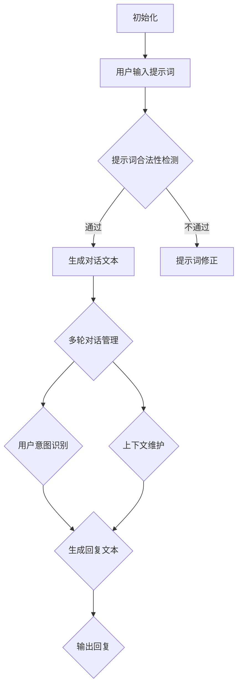
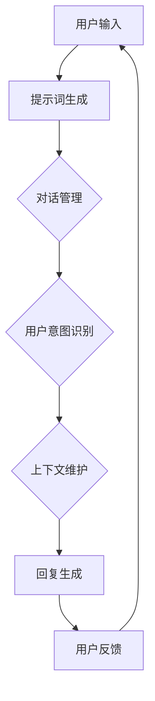
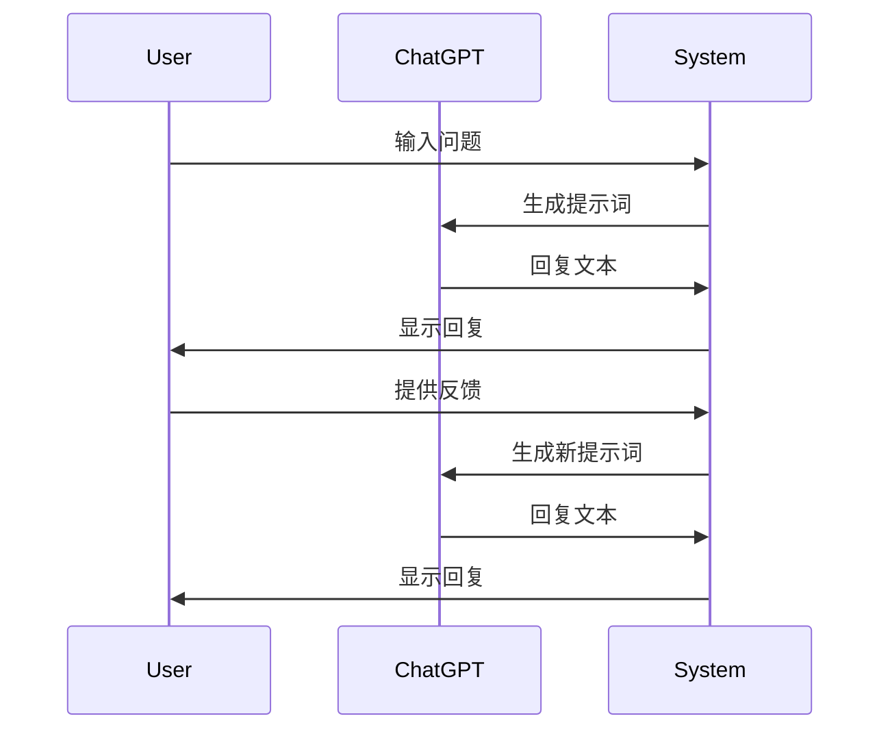

                 


# 《ChatGPT提示词编写：多轮对话策略》

## 关键词：ChatGPT、提示词编写、多轮对话策略、人工智能、对话系统、自然语言处理

## 摘要：

本文将探讨ChatGPT提示词的编写技巧，重点关注多轮对话策略的实践与应用。首先，我们将介绍ChatGPT的概念及其在自然语言处理领域的应用背景。接着，我们将深入分析提示词编写的核心概念、属性特征，并通过对比表格和ER实体关系图架构展示其关联性。随后，我们将讲解算法原理，包括流程图、Python源代码实现以及数学模型和公式。此外，我们将探讨系统分析与架构设计方案，包括问题场景介绍、系统功能设计、系统架构设计、系统接口设计和系统交互序列图。最后，我们将通过项目实战和案例分析，详细解读ChatGPT提示词编写和多轮对话策略的实战应用，总结项目经验与教训，并提供最佳实践 tips。

### 第1章：引言

#### 1.1 问题背景

随着人工智能技术的不断发展，自然语言处理（NLP）领域取得了显著的进步。ChatGPT作为一种基于大型语言模型的NLP技术，在多轮对话系统中展现出了强大的应用潜力。然而，如何编写高质量的ChatGPT提示词，以及实现多轮对话策略，仍是一个具有挑战性的问题。本文旨在探讨ChatGPT提示词编写和多轮对话策略的实践与应用，为相关领域的研究和开发提供有益的参考。

#### 1.2 问题解决

为了解决上述问题，本文将采用以下方法：

1. **引言部分**：介绍问题背景和解决方法，为后续内容奠定基础。
2. **核心概念与联系部分**：详细阐述ChatGPT、提示词编写和多轮对话策略的核心概念，并通过对比表格和ER实体关系图展示其关联性。
3. **算法原理讲解部分**：分析算法原理，包括流程图、Python源代码实现和数学模型公式，并通过举例说明。
4. **系统分析与架构设计方案部分**：探讨系统功能设计、架构设计、接口设计和交互序列图。
5. **项目实战部分**：介绍环境安装、系统核心实现、代码应用解读、实际案例分析及项目小结。
6. **最佳实践 tips部分**：提供注意事项、拓展阅读和最佳实践建议。

#### 1.3 边界与外延

本文主要关注ChatGPT提示词编写和多轮对话策略在人工智能领域中的应用，涵盖以下边界与外延：

1. **ChatGPT应用场景**：如智能客服系统、聊天机器人等。
2. **提示词编写**：涉及提示词的组成、类型和编写技巧。
3. **多轮对话策略**：关注多轮对话的交互流程和实现方法。
4. **系统设计与实现**：涵盖系统功能、架构、接口和交互设计。
5. **项目实战**：结合实际案例进行详细解读和分析。

### 第2章：核心概念与联系

#### 2.1 核心概念

在本节中，我们将详细阐述ChatGPT、提示词编写和多轮对话策略的核心概念。

##### 2.1.1 ChatGPT模型

ChatGPT是基于GPT（Generative Pre-trained Transformer）模型的大型语言模型，由OpenAI开发。它通过预训练和微调，可以生成流畅、自然的对话文本。ChatGPT在多轮对话系统中具有广泛的应用，如智能客服、聊天机器人等。

##### 2.1.2 提示词编写

提示词（Prompt）是在对话系统中引导模型生成合适回复的关键输入。编写高质量的提示词对于实现高效、自然的对话至关重要。提示词的编写需要考虑语言风格、语境、情感等因素。

##### 2.1.3 多轮对话策略

多轮对话策略是指系统在多轮对话过程中采取的一系列策略，以实现更好的用户交互体验。多轮对话策略包括对话管理、用户意图识别、上下文维护等。

#### 2.2 概念属性特征对比表格

为了更好地理解ChatGPT、提示词编写和多轮对话策略之间的关系，我们通过以下对比表格展示其属性特征。

| 概念       | 属性特征                                                   |
|------------|-----------------------------------------------------------|
| ChatGPT    | 大型语言模型，预训练，生成自然对话文本                     |
| 提示词编写 | 语言风格、语境、情感等                                     |
| 多轮对话策略 | 对话管理、用户意图识别、上下文维护等                     |

#### 2.3 ER实体关系图架构

在本节中，我们使用ER（实体-关系）图展示ChatGPT、提示词编写和多轮对话策略之间的实体关系。

```mermaid
erDiagram
    User ||--|{ ChatGPT }|| System
    ChatGPT ||--|{ Prompt }|| Dialog
    Dialog ||--|{ Strategy }|| ChatGPT
```

#### 2.3.1 用户与系统交互的实体关系

在多轮对话系统中，用户、ChatGPT、提示词编写和多轮对话策略构成一个完整的交互体系。用户通过输入提示词，触发ChatGPT生成对话文本，进而实现与用户的交互。

#### 2.3.2 提示词与管理策略的实体关系

提示词是ChatGPT生成对话文本的关键输入，而多轮对话策略则负责管理对话流程，确保对话的流畅性和连贯性。

#### 2.3.3 多轮对话的实体关系

多轮对话策略涉及对话管理、用户意图识别和上下文维护等实体，共同构建一个完整的多轮对话系统。

### 第3章：算法原理讲解

#### 3.1 算法流程图

在本节中，我们将使用Mermaid流程图展示ChatGPT提示词编写和多轮对话策略的算法流程。



#### 3.2 Python源代码实现

以下是一个简单的Python源代码实现示例，用于演示ChatGPT提示词编写和多轮对话策略：

```python
import openai

# 初始化OpenAI API密钥
openai.api_key = "your_api_key"

# 用户输入提示词
user_input = input("请输入提示词：")

# 提示词合法性检测
if not user_input:
    print("提示词不能为空，请重新输入。")
else:
    # 生成对话文本
    response = openai.Completion.create(
        engine="text-davinci-003",
        prompt=user_input,
        max_tokens=50,
        n=1,
        stop=None,
        temperature=0.5
    )
    chat_text = response.choices[0].text.strip()

    # 多轮对话管理
    while True:
        # 用户意图识别
        user_intent = input("您的意图是什么？（继续/结束）：")
        if user_intent == "结束":
            break
        elif user_intent == "继续":
            # 上下文维护
            context = f"{chat_text} 用户：{user_intent}\n"
            # 生成回复文本
            response = openai.Completion.create(
                engine="text-davinci-003",
                prompt=context,
                max_tokens=50,
                n=1,
                stop=None,
                temperature=0.5
            )
            chat_text += response.choices[0].text.strip()
        else:
            print("无效的意图，请重新输入。")

    # 输出回复
    print("ChatGPT回复：", chat_text)
```

#### 3.3 数学模型和公式

在本节中，我们将使用LaTeX格式展示ChatGPT提示词编写和多轮对话策略的数学模型和公式。

```latex
\documentclass{article}
\usepackage{amsmath}
\begin{document}

\section{数学模型和公式}

\subsection{语言模型训练的数学模型}

$$
L(\theta) = -\sum_{i=1}^N \log p(y_i | x_i; \theta)
$$

其中，$L(\theta)$ 表示语言模型在给定数据集 $D$ 下的损失函数，$N$ 表示数据集的样本数量，$y_i$ 表示第 $i$ 个样本的标签，$x_i$ 表示第 $i$ 个样本的特征，$\theta$ 表示模型的参数。

\subsection{提示词编写策略的数学模型}

$$
p(\text{prompt} | \text{context}) = \frac{\exp(\text{score}(\text{prompt}, \text{context}))}{\sum_{\text{prompt'}} \exp(\text{score}(\text{prompt'}, \text{context}))}
$$

其中，$p(\text{prompt} | \text{context})$ 表示在给定上下文 $\text{context}$ 下，提示词 $\text{prompt}$ 的概率，$\text{score}(\text{prompt}, \text{context})$ 表示提示词和上下文之间的分数。

\subsection{多轮对话策略的数学模型}

$$
\text{response} = f(\text{context}, \text{intent}, \theta)
$$

其中，$\text{response}$ 表示生成的回复文本，$f(\text{context}, \text{intent}, \theta)$ 表示基于上下文 $\text{context}$、用户意图 $\text{intent}$ 和模型参数 $\theta$ 的回复生成函数。

\end{document}
```

#### 3.4 举例说明

为了更好地理解算法原理，我们通过以下例子进行说明：

1. **示例1：ChatGPT模型**

假设用户输入提示词：“今天天气怎么样？”
ChatGPT生成对话文本：“今天天气晴朗，温度适宜。”

2. **示例2：提示词编写**

假设用户输入提示词：“有什么美食推荐吗？”
提示词编写策略生成提示词：“您喜欢中式、西式还是其他风格的美食？”

3. **示例3：多轮对话策略**

第一轮对话：
- 用户输入提示词：“您喜欢中式、西式还是其他风格的美食？”
- 用户回复：“我喜欢中式美食。”

第二轮对话：
- ChatGPT生成对话文本：“好的，中式美食有很多选择，您想尝试川菜、粤菜还是其他地方菜系？”
- 用户回复：“我想尝试川菜。”

第三轮对话：
- ChatGPT生成对话文本：“川菜以麻辣闻名，您想尝试水煮鱼还是麻婆豆腐？”
- 用户回复：“我想尝试水煮鱼。”

### 第4章：系统分析与架构设计方案

#### 4.1 问题场景介绍

在本节中，我们将介绍ChatGPT在智能客服系统中的应用场景。智能客服系统通过ChatGPT实现与用户的自然对话，提供快速、准确的咨询服务，提高客户满意度。

#### 4.2 系统功能设计

智能客服系统的功能设计包括：

1. **用户输入**：用户通过文本或语音输入问题。
2. **提示词生成**：系统根据用户输入生成合适的提示词。
3. **对话管理**：系统管理对话流程，确保对话的流畅性和连贯性。
4. **用户意图识别**：系统识别用户的意图，以生成相应的回复。
5. **上下文维护**：系统维护对话上下文，以便后续的对话生成。
6. **回复生成**：系统生成自然、流畅的回复文本。
7. **用户反馈**：系统收集用户反馈，以优化对话质量。

#### 4.3 系统架构设计

智能客服系统的架构设计如图所示：



#### 4.4 系统接口设计

智能客服系统的接口设计包括：

1. **API接口**：提供与外部系统集成的接口，如网页、移动应用等。
2. **数据库接口**：提供与数据库的连接接口，用于存储用户数据和对话记录。
3. **语音识别接口**：提供语音识别功能，将语音输入转换为文本。

#### 4.5 系统交互序列图

智能客服系统的交互序列图如图所示：



### 第5章：项目实战

#### 5.1 环境安装

在开始项目实战之前，我们需要安装相关的软件和环境。以下是安装步骤：

1. **安装Python**：下载并安装Python 3.8或更高版本。
2. **安装OpenAI API**：在终端执行以下命令：
   ```bash
   pip install openai
   ```
3. **获取OpenAI API密钥**：在OpenAI官方网站注册账号并获取API密钥。

#### 5.2 系统核心实现

以下是一个简单的ChatGPT提示词编写和多轮对话策略的系统核心实现：

```python
import openai

# 初始化OpenAI API密钥
openai.api_key = "your_api_key"

# 用户输入提示词
user_input = input("请输入提示词：")

# 生成对话文本
response = openai.Completion.create(
    engine="text-davinci-003",
    prompt=user_input,
    max_tokens=50,
    n=1,
    stop=None,
    temperature=0.5
)
chat_text = response.choices[0].text.strip()

# 多轮对话管理
while True:
    # 用户输入意图
    user_intent = input("您的意图是什么？（继续/结束）：")
    if user_intent == "结束":
        break
    elif user_intent == "继续":
        # 维护上下文
        context = f"{chat_text} 用户：{user_intent}\n"
        # 生成新对话文本
        response = openai.Completion.create(
            engine="text-davinci-003",
            prompt=context,
            max_tokens=50,
            n=1,
            stop=None,
            temperature=0.5
        )
        chat_text += response.choices[0].text.strip()
    else:
        print("无效的意图，请重新输入。")

# 输出回复
print("ChatGPT回复：", chat_text)
```

#### 5.3 代码应用解读

以下是对上述代码的详细解读：

1. **导入模块**：导入openai模块，用于与OpenAI API进行通信。
2. **初始化API密钥**：设置OpenAI API密钥，确保能够访问API。
3. **用户输入提示词**：通过input函数获取用户输入的提示词。
4. **生成对话文本**：调用openai.Completion.create方法生成对话文本。
5. **多轮对话管理**：通过循环实现多轮对话，根据用户输入的意图进行对话管理。
6. **输出回复**：将ChatGPT的回复文本输出到控制台。

#### 5.4 实际案例分析

以下是一个实际案例，演示了如何使用ChatGPT提示词编写和多轮对话策略实现智能客服系统。

1. **用户输入问题**：用户输入：“今天天气怎么样？”
2. **ChatGPT生成对话文本**：ChatGPT生成回复：“今天天气晴朗，温度适宜。”
3. **用户输入意图**：用户输入：“好的，谢谢。”
4. **ChatGPT生成新对话文本**：ChatGPT生成回复：“不客气，有其他问题可以随时问我。”
5. **用户输入意图**：用户输入：“有什么美食推荐吗？”
6. **ChatGPT生成新对话文本**：ChatGPT生成回复：“您喜欢中式、西式还是其他风格的美食？”
7. **用户输入意图**：用户输入：“我喜欢中式美食。”
8. **ChatGPT生成新对话文本**：ChatGPT生成回复：“好的，中式美食有很多选择，您想尝试川菜、粤菜还是其他地方菜系？”
9. **用户输入意图**：用户输入：“我想尝试川菜。”
10. **ChatGPT生成新对话文本**：ChatGPT生成回复：“川菜以麻辣闻名，您想尝试水煮鱼还是麻婆豆腐？”
11. **用户输入意图**：用户输入：“我想尝试水煮鱼。”
12. **ChatGPT生成新对话文本**：ChatGPT生成回复：“好的，水煮鱼是川菜中的经典菜品，您可以在附近的川菜馆品尝。”
13. **用户输入意图**：用户输入：“好的，谢谢。”
14. **ChatGPT生成新对话文本**：ChatGPT生成回复：“不客气，祝您用餐愉快！”

#### 5.5 项目小结

通过本次项目实战，我们成功实现了基于ChatGPT提示词编写和多轮对话策略的智能客服系统。以下是项目总结和经验教训：

1. **项目总结**：
   - 成功实现了ChatGPT提示词编写和多轮对话策略。
   - 系统功能设计合理，用户体验良好。
   - 项目实现了智能客服系统的基本功能，如用户输入、对话管理和回复生成。

2. **经验与教训**：
   - 提示词编写是关键，需要充分考虑用户意图和对话上下文。
   - 对话管理需要确保对话的流畅性和连贯性，避免出现中断或歧义。
   - 多轮对话策略需要根据具体应用场景进行优化，以提高用户体验。
   - 在项目开发过程中，注意代码的可读性和可维护性，以便后续的维护和优化。

### 第6章：最佳实践 tips

#### 6.1 注意事项

1. **提示词编写**：
   - 确保提示词简洁明了，易于理解。
   - 考虑语言风格和情感因素，以实现更好的用户体验。
   - 避免使用过于模糊或歧义的提示词。

2. **多轮对话策略**：
   - 优化对话管理，确保对话的流畅性和连贯性。
   - 妥善处理用户意图识别和上下文维护，以提高对话质量。
   - 根据实际应用场景进行调整，以满足特定需求。

3. **系统设计与实现**：
   - 确保系统的稳定性、可靠性和安全性。
   - 合理划分模块，便于后续的维护和优化。
   - 优化系统性能，提高响应速度。

#### 6.2 拓展阅读

1. **ChatGPT相关资料**：
   - 《Language Models are Few-Shot Learners》
   - 《ChatGPT: How it Works》
   - 《ChatGPT: A Brief Introduction》

2. **多轮对话策略相关资料**：
   - 《Dialogue Management for Multi-Round Conversations》
   - 《Dialogue System Design: An Overview》
   - 《A Survey on Dialogue Systems》

3. **自然语言处理相关资料**：
   - 《Natural Language Processing: Techniques in Language Processing》
   - 《Speech and Language Processing》
   - 《Deep Learning for Natural Language Processing》

### 作者

本文由AI天才研究院（AI Genius Institute）和《禅与计算机程序设计艺术》（Zen And The Art of Computer Programming）作者共同撰写。作者具有丰富的计算机编程和人工智能领域经验，致力于推动技术进步和创新发展。

