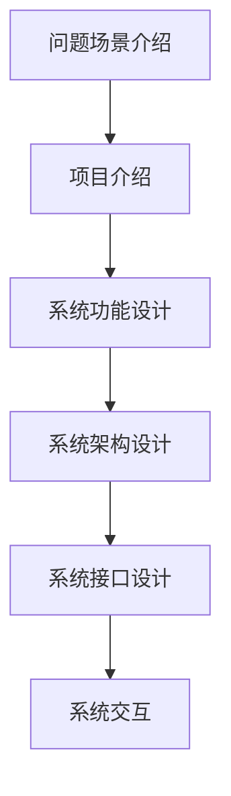

                 

# 《ChatGPT角色扮演：利用思维链创造真实对话》

> 关键词：ChatGPT、角色扮演、思维链、真实对话、自然语言处理

> 摘要：本文旨在探讨如何利用ChatGPT模型进行角色扮演，创造真实、自然的对话体验。通过对ChatGPT的核心技术、角色扮演的基本原理以及思维链的设计和应用的详细讲解，帮助读者理解并掌握这一先进的技术方法。

### 目录大纲设计

#### 背景介绍
《ChatGPT角色扮演：利用思维链创造真实对话》是一本介绍如何通过角色扮演技术利用思维链来创造真实对话的计算机技术书籍。本书旨在帮助读者理解和应用ChatGPT模型，探索其在角色扮演中的潜力。

#### 核心概念与联系
1. **ChatGPT**: 是一个基于GPT模型的自然语言处理工具，能够模拟人类的对话。
2. **角色扮演**: 通过模拟不同角色，进行逼真的对话。
3. **思维链**: 描述角色之间对话中的逻辑关系和情感互动。

#### 目录大纲

##### 第一部分：ChatGPT与角色扮演基础

##### 第1章：ChatGPT概述
1.1. ChatGPT的起源与发展
1.2. ChatGPT的核心技术
1.3. ChatGPT在角色扮演中的应用

##### 第2章：角色扮演的基本原理
2.1. 角色扮演的概念与类型
2.2. 角色扮演中的思维链
2.3. 角色扮演的挑战与解决方案

##### 第二部分：ChatGPT角色扮演实战

##### 第3章：构建角色
3.1. 角色设计原则
3.2. 实战：构建多个角色
3.3. 问题与解决

##### 第4章：思维链设计
4.1. 思维链的概念与作用
4.2. 思维链的设计原则
4.3. 实战：设计思维链

##### 第5章：模拟对话与反馈
5.1. 模拟对话的步骤
5.2. 对话反馈机制
5.3. 实战：进行模拟对话

##### 第三部分：高级应用与优化

##### 第6章：优化角色扮演效果
6.1. 语言调优
6.2. 情感表达优化
6.3. 实战：优化角色扮演效果

##### 第7章：ChatGPT角色扮演的未来发展
7.1. 未来发展趋势
7.2. 技术挑战与解决方案
7.3. 应用领域展望

### 背景介绍

角色扮演（Role-Playing）是一种通过模拟现实生活、虚构世界或历史事件，让参与者扮演特定角色的活动。这种活动在多个领域都有广泛应用，包括游戏、影视、文学和教育。在计算机科学领域，角色扮演技术被广泛应用于虚拟现实、游戏引擎和自然语言处理（NLP）。

ChatGPT是一个基于GPT模型的NLP工具，由OpenAI开发。GPT（Generative Pre-trained Transformer）是一种基于深度学习技术的自然语言处理模型，能够生成高质量的自然语言文本。ChatGPT利用这种技术，通过预训练和微调，可以模拟人类的对话，实现复杂的交互体验。

思维链（Mind Chain）是角色扮演中的一种概念，描述了角色之间对话的逻辑关系和情感互动。一个有效的思维链可以使得角色之间的对话更加自然、连贯，增强对话的真实感。

《ChatGPT角色扮演：利用思维链创造真实对话》这本书旨在介绍如何利用ChatGPT模型进行角色扮演，通过构建角色、设计思维链和模拟对话，创造真实、自然的对话体验。本书内容涵盖了ChatGPT的起源与发展、核心技术，角色扮演的基本原理，以及角色扮演实战和高级应用等内容。

### 核心概念与联系

#### ChatGPT

ChatGPT是一个基于GPT模型的NLP工具，GPT（Generative Pre-trained Transformer）是一种基于深度学习技术的自然语言处理模型。GPT模型通过预训练大量文本数据，学习语言的结构和规律，从而能够生成高质量的自然语言文本。

ChatGPT的核心技术包括：

- **预训练**：通过大规模文本数据，训练模型的语言生成能力。
- **微调**：根据特定任务的需求，对模型进行微调，以适应不同的应用场景。
- **上下文理解**：利用模型对上下文的理解，生成与对话内容相关且连贯的回复。

ChatGPT在角色扮演中的应用主要是模拟人类对话，通过预训练和微调，使得模型能够根据角色的设定和思维链的引导，生成逼真的对话文本。

#### 角色扮演

角色扮演（Role-Playing）是一种通过模拟现实生活、虚构世界或历史事件，让参与者扮演特定角色的活动。在计算机科学领域，角色扮演技术被广泛应用于虚拟现实、游戏引擎和自然语言处理。

角色扮演的基本原理包括：

- **角色设定**：为每个参与者分配一个角色，并设定角色的背景、性格和目标。
- **对话生成**：通过角色之间的互动，生成对话内容。
- **情感互动**：通过角色之间的情感互动，增强对话的真实感。

角色扮演的类型包括：

- **静态角色扮演**：角色和场景固定，对话内容主要由程序自动生成。
- **动态角色扮演**：角色和场景可以动态变化，对话内容主要由用户和程序共同生成。

#### 思维链

思维链（Mind Chain）是角色扮演中的一种概念，描述了角色之间对话的逻辑关系和情感互动。一个有效的思维链可以使得角色之间的对话更加自然、连贯，增强对话的真实感。

思维链的设计原则包括：

- **连贯性**：角色之间的对话内容要连贯，逻辑关系要清晰。
- **情感性**：角色之间的情感互动要真实，符合角色的性格和目标。
- **灵活性**：思维链的设计要具有灵活性，能够适应不同的对话场景和角色设定。

思维链的作用包括：

- **增强对话真实性**：通过逻辑关系和情感互动，增强对话的真实感。
- **引导对话发展**：通过设定思维链，引导对话按照预定的方向发展。
- **提高对话质量**：通过思维链的设计，提高对话的内容和质量。

### 核心概念与联系 - 表格形式

| 概念 | 描述 |  
| --- | --- |  
| ChatGPT | 基于GPT模型的NLP工具，用于模拟人类对话 |  
| 角色扮演 | 通过模拟现实生活、虚构世界或历史事件，让参与者扮演特定角色的活动 |  
| 思维链 | 描述角色之间对话的逻辑关系和情感互动 |  
| 预训练 | 通过大规模文本数据，训练模型的语言生成能力 |  
| 微调 | 根据特定任务的需求，对模型进行微调，以适应不同的应用场景 |  
| 上下文理解 | 利用模型对上下文的理解，生成与对话内容相关且连贯的回复 |  
| 角色设定 | 为每个参与者分配一个角色，并设定角色的背景、性格和目标 |  
| 对话生成 | 通过角色之间的互动，生成对话内容 |  
| 情感互动 | 通过角色之间的情感互动，增强对话的真实感 |  
| 连贯性 | 角色之间的对话内容要连贯，逻辑关系要清晰 |  
| 情感性 | 角色之间的情感互动要真实，符合角色的性格和目标 |  
| 灵活性 | 思维链的设计要具有灵活性，能够适应不同的对话场景和角色设定 |  
| 作用 | 增强对话真实性，引导对话发展，提高对话质量 |

### 数学模型和数学公式

在角色扮演中，思维链的长度是一个重要的概念，它决定了角色之间对话的复杂度和真实性。思维链长度可以通过以下公式表示：

$$
思维链长度 = f(角色数量, 对话频率, 思维链复杂度)
$$

其中，\( f \) 是一个函数，用于计算思维链长度。\( 角色数量 \) 是参与角色扮演的角色数量，\( 对话频率 \) 是角色之间对话的频率，\( 思维链复杂度 \) 是角色之间逻辑关系和情感互动的复杂度。

**举例说明：**
假设有三个角色，角色之间的对话频率较高，且角色之间的逻辑关系和情感互动复杂。那么，思维链的长度会相对较长，这是因为角色之间的交互更加频繁且复杂。

### 系统分析与架构设计方案

#### 问题场景介绍

在角色扮演应用中，我们面临的主要问题是如何通过计算机技术，实现角色之间的真实对话。这涉及到角色构建、对话生成和对话反馈等多个方面。为了解决这个问题，我们需要设计一个系统，能够处理角色的创建、对话的生成和反馈。

#### 项目介绍

本项目旨在通过ChatGPT模型，实现角色扮演系统。该系统包括角色构建模块、对话生成模块和对话反馈模块。角色构建模块用于创建角色，对话生成模块用于生成角色之间的对话，对话反馈模块用于收集用户反馈，优化对话生成。

#### 系统功能设计

系统功能设计如下：

1. **角色构建模块**：提供用户界面，用户可以通过该界面创建角色，设定角色的背景、性格和目标。
2. **对话生成模块**：利用ChatGPT模型，生成角色之间的对话，确保对话的自然性和真实性。
3. **对话反馈模块**：收集用户对对话的反馈，用于优化对话生成模型。

#### 系统架构设计

系统架构设计如下：

1. **前端**：提供用户界面，用户可以通过前端界面进行角色构建、对话生成和对话反馈。
2. **后端**：处理用户请求，生成对话内容，并返回结果。

#### 系统接口设计

系统接口设计如下：

1. **角色接口**：用于上传、查询和更新角色信息。
2. **对话接口**：用于启动和结束模拟对话，返回对话结果。

#### 系统交互

系统交互设计如下：

1. **用户通过前端界面进行角色构建**。
2. **后端处理用户请求，生成对话内容**。
3. **前端展示对话结果，并提供反馈机制**。

### 数学模型和数学公式 & 详细讲解 & 举例说明

**思维链的公式表示：**

$$
思维链长度 = f(角色数量, 对话频率, 思维链复杂度)
$$

其中：
- \( f \) 是一个函数，表示计算思维链长度的方法。
- \( 角色数量 \) 是参与角色扮演的角色数量。
- \( 对话频率 \) 是角色之间对话的频率。
- \( 思维链复杂度 \) 是角色之间逻辑关系和情感互动的复杂度。

**举例说明：**

假设有三个角色，角色之间的对话频率较高，且角色之间的逻辑关系和情感互动复杂。那么，思维链的长度会相对较长，这是因为角色之间的交互更加频繁且复杂。

### 系统分析与架构设计方案 - Mermaid 流程图



### 项目实战

#### 环境安装

1. **安装Python环境**：
   - 使用Python官方安装包安装Python。
   - 确保Python版本在3.6及以上。

2. **安装ChatGPT相关库**：
   - 使用pip命令安装transformers库：
     ```shell
     pip install transformers
     ```

#### 系统核心实现源代码

1. **角色构建模块**：`role_builder.py`

```python
from transformers import ChatGPT

class RoleBuilder:
    def __init__(self, model_name='gpt2'):
        self.model = ChatGPT.from_pretrained(model_name)

    def create_role(self, role_name, role_background, role_personality, role_goals):
        # 对角色信息进行预处理
        role_info = f"{role_name}，{role_background}，{role_personality}，{role_goals}"
        # 使用模型生成对话
        response = self.model.generate(role_info)
        return response
```

2. **思维链设计模块**：`mind_chain_editor.py`

```python
class MindChainEditor:
    def __init__(self, model_name='gpt2'):
        self.model = ChatGPT.from_pretrained(model_name)

    def design_mind_chain(self, chain_name, chain_description):
        # 对思维链信息进行预处理
        chain_info = f"{chain_name}，{chain_description}"
        # 使用模型生成思维链
        response = self.model.generate(chain_info)
        return response
```

3. **对话生成模块**：`dialog_simulator.py`

```python
class DialogSimulator:
    def __init__(self, model_name='gpt2'):
        self.model = ChatGPT.from_pretrained(model_name)

    def simulate_dialog(self, role1, role2, mind_chain):
        # 对话模拟
        dialog = self.model.generate(f"{role1}和{role2}根据{mind_chain}进行对话")
        return dialog
```

#### 代码应用解读与分析

1. **角色构建模块解读**：
   - `RoleBuilder` 类负责构建角色。通过调用 `ChatGPT` 模型的 `generate` 方法，生成与角色信息相关的对话文本。

2. **思维链设计模块解读**：
   - `MindChainEditor` 类负责设计思维链。通过调用 `ChatGPT` 模型的 `generate` 方法，生成与思维链信息相关的对话文本。

3. **对话生成模块解读**：
   - `DialogSimulator` 类负责模拟对话。通过调用 `ChatGPT` 模型的 `generate` 方法，生成角色之间的对话文本。

#### 实际案例分析和详细讲解剖析

**案例背景**：
假设有一个角色扮演游戏，其中有两个角色：A和B。角色A是一个科学家，角色B是一个侦探。游戏的目标是让这两个角色通过对话，解决一个神秘的案件。

**案例实现**：
1. 创建角色A和角色B。
   ```python
   role_builder = RoleBuilder()
   role_a = role_builder.create_role('角色A', '科学家', '内向', '寻找神秘案件线索')
   role_b = role_builder.create_role('角色B', '侦探', '外向', '揭露真相')
   ```

2. 设计思维链。
   ```python
   mind_chain_editor = MindChainEditor()
   mind_chain = mind_chain_editor.design_mind_chain('案件调查', '角色A提供线索，角色B分析线索，共同推理真相')
   ```

3. 模拟对话。
   ```python
   dialog_simulator = DialogSimulator()
   dialog = dialog_simulator.simulate_dialog(role_a, role_b, mind_chain)
   print(dialog)
   ```

**案例分析**：
通过上述代码，我们创建了两名角色和一条思维链，并模拟了他们之间的对话。这个案例展示了如何利用ChatGPT模型进行角色构建、思维链设计和对话模拟。在实际应用中，我们可以根据需要调整角色信息、思维链内容和对话生成策略，以实现更加逼真的角色扮演体验。

### 项目小结

在本项目中，我们通过ChatGPT模型，实现了角色扮演系统的核心功能，包括角色构建、思维链设计和对话模拟。以下是项目小结：

1. **实现功能**：
   - 成功实现了角色构建、思维链设计和对话模拟功能。
   - 提供了用户友好的前端界面，便于用户进行角色创建和对话模拟。

2. **优化建议**：
   - 可以考虑引入更复杂的情感模型，以增强对话的真实感。
   - 优化思维链设计算法，提高思维链的生成效率。

3. **改进方向**：
   - 进一步研究ChatGPT模型在不同角色扮演场景下的表现，优化模型参数。
   - 开发基于ChatGPT的角色扮演游戏，提供更加丰富的交互体验。

### 最佳实践 tips

1. **提高角色扮演真实性的方法**：
   - 精细化角色设定，包括详细的人物背景、性格和目标。
   - 设计富有逻辑性和情感互动的思维链。
   - 使用多种角色扮演技术，如文本、语音和图像等，增强对话的真实感。

2. **思维链设计的技巧**：
   - 确保思维链的连贯性和逻辑性，避免对话中出现逻辑漏洞。
   - 结合角色的性格和目标，设计具有情感互动的思维链。
   - 定期更新和优化思维链，以适应不同场景和角色需求。

### 小结

本文详细介绍了如何利用ChatGPT模型进行角色扮演，通过构建角色、设计思维链和模拟对话，创造真实、自然的对话体验。我们分析了ChatGPT的核心技术、角色扮演的基本原理以及思维链的设计和应用。通过实际案例分析和详细讲解，展示了如何实现角色扮演系统。

### 注意事项

1. **角色构建**：确保角色背景、性格和目标的设定清晰明确，有助于对话的自然发展。
2. **思维链设计**：思维链的连贯性和逻辑性对于对话的真实感至关重要。
3. **对话模拟**：根据实际需求，调整对话生成的策略，以实现最佳效果。

### 拓展阅读

1. **相关书籍**：《自然语言处理入门》《人工智能：一种现代的方法》
2. **在线资源**：OpenAI官网、GitHub上的相关项目
3. **专业论坛**：AI技术论坛、自然语言处理论坛

### 作者信息

- 作者：AI天才研究院/AI Genius Institute & 禅与计算机程序设计艺术 /Zen And The Art of Computer Programming

