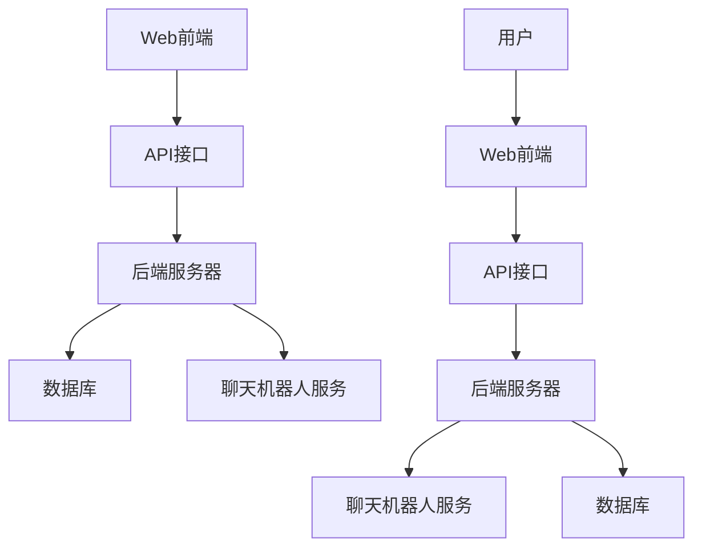
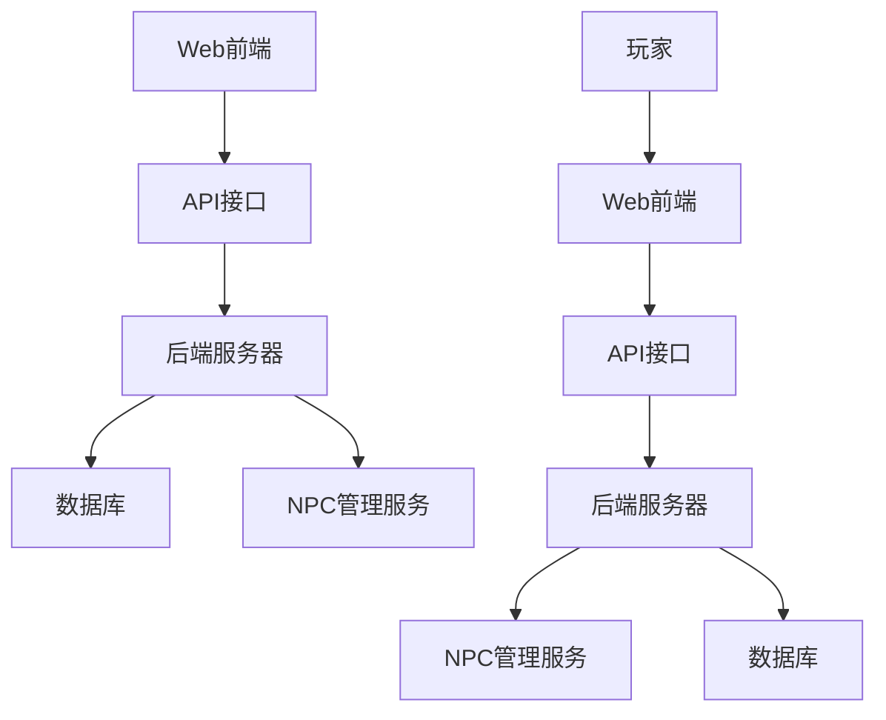

                 

# ChatGPT角色扮演：提示词的魔力

## 关键词
- ChatGPT
- 角色扮演
- 提示词
- 聊天机器人
- 算法优化
- 应用案例

## 摘要
本文深入探讨了ChatGPT在角色扮演中的强大功能，特别是提示词的设计与应用。通过详细的案例分析，我们揭示了ChatGPT在虚拟客服、在线教育和游戏NPC等领域的应用潜力，并提出了优化提示词的方法。本文旨在为读者提供全面的技术指导，帮助他们充分利用ChatGPT的角色扮演功能，提升聊天机器人的用户体验。

## 第一部分：ChatGPT角色扮演概述

### 第1章：ChatGPT角色扮演简介

#### 1.1 问题背景
随着人工智能技术的飞速发展，聊天机器人已成为企业与用户沟通的重要工具。然而，传统的聊天机器人往往缺乏自然对话的能力，无法满足用户个性化需求。为了解决这一问题，引入了ChatGPT角色扮演的概念。

#### 1.2 问题描述
ChatGPT角色扮演旨在通过模拟不同角色，实现与用户的自然对话。然而，如何设计有效的提示词，使ChatGPT能够准确扮演特定角色，成为一个关键问题。

#### 1.3 问题解决
通过研究提示词的设计原则和应用方法，本文提出了一套完整的ChatGPT角色扮演解决方案，包括提示词的类型、设计原则和优化方法。

#### 1.4 边界与外延
ChatGPT角色扮演不仅适用于聊天机器人，还可扩展到虚拟助手、客服系统等多个领域。此外，本文还探讨了角色扮演在情感表达、回应策略等方面的应用。

#### 1.5 概念结构与核心要素组成
本节介绍了ChatGPT角色扮演的基本概念，包括角色、提示词、情感表达等。同时，通过ER实体关系图和概念属性特征对比表格，分析了核心要素之间的联系。

### 第2章：提示词的设计与应用

#### 2.1 提示词的概念与作用
提示词是引导ChatGPT扮演特定角色的重要工具。通过提示词，用户可以精确地表达自己的需求，使ChatGPT能够提供更个性化的服务。

#### 2.2 提示词的类型
根据用途和形式，提示词可以分为开放式、封闭式和条件性三类。每种类型都有其独特的应用场景和设计方法。

##### 2.2.1 开放式提示词
开放式提示词允许用户自由表达需求，如“请告诉我你的问题”。这种提示词适用于复杂、不确定的场景。

##### 2.2.2 封闭式提示词
封闭式提示词提供有限的回答选项，如“你今天想吃什么？”适用于需要快速获取信息或决策的场景。

##### 2.2.3 条件性提示词
条件性提示词根据用户输入的特定条件进行回答，如“如果你遇到技术问题，请告诉我”。这种提示词适用于需要根据不同条件提供个性化服务的场景。

#### 2.3 提示词的设计原则
为了提高提示词的有效性，需要遵循以下设计原则：明确性、简洁性、一致性和适应性。通过这些原则，可以确保提示词能够准确地引导ChatGPT进行角色扮演。

#### 2.4 提示词的实例分析
本文通过实际案例，分析了不同类型提示词的应用方法和效果。通过这些实例，读者可以更好地理解提示词的设计和应用。

### 第3章：聊天机器人中的角色扮演

#### 3.1 角色扮演的概念
角色扮演是指聊天机器人模拟不同角色，与用户进行自然对话的过程。通过角色扮演，聊天机器人可以更好地满足用户需求，提升用户体验。

#### 3.2 角色扮演在聊天机器人中的应用
本节介绍了角色扮演在聊天机器人中的应用，包括用户角色、机器人角色和第三方角色。通过角色扮演，聊天机器人可以更加灵活地与用户互动，提供个性化服务。

##### 3.2.1 用户角色
用户角色是指聊天机器人在与用户互动时所扮演的角色。通过明确用户角色，聊天机器人可以更好地理解用户需求，提供针对性的服务。

##### 3.2.2 机器人角色
机器人角色是指聊天机器人在系统中扮演的角色。通过机器人角色，聊天机器人可以更好地执行特定任务，如客服、教育等。

##### 3.2.3 第三方角色
第三方角色是指聊天机器人与其他系统或服务进行交互时所扮演的角色。通过第三方角色，聊天机器人可以扩展其功能，提供更全面的解决方案。

#### 3.3 角色切换与交互
角色切换与交互是指聊天机器人在不同角色之间的切换和交互过程。通过角色切换与交互，聊天机器人可以更好地适应不同场景，提供连续、自然的对话体验。

### 第4章：角色扮演的技巧与实践

#### 4.1 情感表达的技巧
情感表达是角色扮演的重要方面。通过情感表达，聊天机器人可以更好地与用户建立情感联系，提升用户体验。

#### 4.2 回应策略的优化
回应策略是指聊天机器人在回答用户问题时采取的策略。通过优化回应策略，聊天机器人可以提供更准确、自然的回答。

##### 4.2.1 短回复策略
短回复策略适用于简单、直接的问题。通过短回复策略，聊天机器人可以快速回答用户，提高对话效率。

##### 4.2.2 长回复策略
长回复策略适用于复杂、多步骤的问题。通过长回复策略，聊天机器人可以详细解释问题，帮助用户更好地理解。

##### 4.2.3 质疑回复策略
质疑回复策略是指聊天机器人对用户回答进行质疑，以确认信息的准确性。通过质疑回复策略，聊天机器人可以确保用户提供的信息是准确可靠的。

#### 4.3 实际案例解析
本节通过实际案例，分析了角色扮演在不同场景中的应用。通过这些案例，读者可以更好地理解角色扮演的技巧和实践方法。

### 第5章：提示词的魔力与优化

#### 5.1 提示词的魔力
提示词是ChatGPT角色扮演的核心，其魔力在于能够引导ChatGPT提供个性化、自然的回答。

#### 5.2 提示词的优化方法
为了充分发挥提示词的魔力，需要对提示词进行优化。本节介绍了提示词的优化方法，包括数据预处理、提示词组合和提示词微调。

##### 5.2.1 数据预处理
数据预处理是提示词优化的重要步骤。通过数据预处理，可以提高提示词的质量和效果。

##### 5.2.2 提示词组合
提示词组合是指将多个提示词组合在一起，以实现更复杂的角色扮演。通过提示词组合，聊天机器人可以提供更丰富、自然的对话。

##### 5.2.3 提示词微调
提示词微调是指对提示词进行细微调整，以适应不同场景和用户需求。通过提示词微调，可以进一步提高ChatGPT的角色扮演效果。

#### 5.3 提示词优化案例分析
本节通过实际案例，分析了提示词优化的方法和效果。通过这些案例，读者可以更好地了解提示词优化的实践方法。

### 第6章：ChatGPT在角色扮演中的应用案例

#### 6.1 案例一：虚拟客服
虚拟客服是ChatGPT角色扮演的重要应用领域。本节介绍了虚拟客服系统的功能设计、系统架构设计和系统实现与解读。

##### 6.1.1 系统功能设计
系统功能设计包括常见问题解答、订单查询、投诉处理等功能。

##### 6.1.2 系统架构设计
系统架构设计包括前端、后端和数据库等部分，通过Mermaid架构图进行详细说明。

##### 6.1.3 系统实现与解读
系统实现与解读包括ChatGPT的部署和提示词的设计与应用，通过Python源代码进行详细阐述。

#### 6.2 案例二：在线教育
在线教育是ChatGPT角色扮演的另一个重要应用领域。本节介绍了在线教育系统的功能设计、系统架构设计和系统实现与解读。

##### 6.2.1 系统功能设计
系统功能设计包括课程咨询、作业辅导、考试测评等功能。

##### 6.2.2 系统架构设计
系统架构设计包括前端、后端和数据库等部分，通过Mermaid架构图进行详细说明。

##### 6.2.3 系统实现与解读
系统实现与解读包括ChatGPT的部署和提示词的设计与应用，通过Python源代码进行详细阐述。

#### 6.3 案例三：游戏NPC
游戏NPC是ChatGPT角色扮演的独特应用。本节介绍了游戏NPC系统的功能设计、系统架构设计和系统实现与解读。

##### 6.3.1 系统功能设计
系统功能设计包括角色对话、任务引导、场景互动等功能。

##### 6.3.2 系统架构设计
系统架构设计包括前端、后端和数据库等部分，通过Mermaid架构图进行详细说明。

##### 6.3.3 系统实现与解读
系统实现与解读包括ChatGPT的部署和提示词的设计与应用，通过Python源代码进行详细阐述。

### 第7章：总结与展望

#### 7.1 角色扮演在ChatGPT中的应用总结
本节总结了角色扮演在ChatGPT中的应用，包括虚拟客服、在线教育和游戏NPC等领域。通过这些应用，ChatGPT角色扮演展现了其强大的功能和应用潜力。

#### 7.2 未来发展趋势与挑战
随着人工智能技术的不断进步，ChatGPT角色扮演在未来将面临更多挑战和机遇。本节探讨了未来发展趋势，包括更加智能化的角色扮演、情感化交互和个性化服务。

#### 7.3 拓展阅读与学习资源
本节提供了相关领域的拓展阅读和学习资源，帮助读者深入了解ChatGPT角色扮演的技术原理和实践方法。

### 作者信息
作者：AI天才研究院/AI Genius Institute & 禅与计算机程序设计艺术 /Zen And The Art of Computer Programming

## 第1章：ChatGPT角色扮演简介

### 1.1 问题背景
在当今数字化时代，聊天机器人的应用越来越广泛，从客服、教育到娱乐等多个领域。然而，传统的聊天机器人往往存在一些问题，如对话能力有限、无法理解用户情感等。这些问题限制了聊天机器人在实际应用中的效果，无法满足用户日益增长的个性化需求。

为了解决这些问题，ChatGPT（对话生成预训练模型）应运而生。ChatGPT是一种基于深度学习技术的自然语言处理模型，具有强大的语言理解和生成能力。通过角色扮演，ChatGPT可以模拟不同角色，实现与用户的自然对话，从而提升聊天机器人的用户体验。

### 1.2 问题描述
ChatGPT角色扮演的核心问题是：如何设计有效的提示词，使ChatGPT能够准确扮演特定角色，并提供个性化服务。具体来说，问题描述包括以下几个方面：

1. **提示词的设计原则**：如何设计明确、简洁、一致和适应性强的提示词，以引导ChatGPT进行角色扮演。
2. **提示词的类型**：如何根据不同场景和应用需求，选择合适的提示词类型，如开放式、封闭式和条件性提示词。
3. **提示词的优化方法**：如何对提示词进行优化，以提高ChatGPT的角色扮演效果。

### 1.3 问题解决
为了解决上述问题，本文提出了一套完整的ChatGPT角色扮演解决方案，包括以下几个方面：

1. **明确提示词设计原则**：通过分析实际应用场景，提出明确、简洁、一致和适应性强的提示词设计原则。
2. **分类提示词类型**：根据用途和形式，将提示词分为开放式、封闭式和条件性三类，并详细介绍每种类型的特点和应用方法。
3. **优化提示词方法**：介绍数据预处理、提示词组合和提示词微调等优化方法，以提高提示词的质量和效果。

通过以上解决方案，ChatGPT角色扮演可以更好地满足用户需求，提供个性化服务，提升聊天机器人的用户体验。

### 1.4 边界与外延
ChatGPT角色扮演不仅适用于聊天机器人，还可以扩展到虚拟助手、客服系统等多个领域。以下是ChatGPT角色扮演的边界与外延：

1. **虚拟助手**：虚拟助手是一种集成了聊天机器人功能的智能应用，如智能家居助手、健康助手等。通过角色扮演，虚拟助手可以更好地理解用户需求，提供个性化服务。
2. **客服系统**：客服系统是用于企业与用户沟通的重要工具。通过角色扮演，客服系统可以模拟不同角色，如客服代表、技术支持等，提供更专业的服务。
3. **多模态交互**：ChatGPT角色扮演可以与其他人工智能技术相结合，如语音识别、图像识别等，实现多模态交互，进一步提升用户体验。

### 1.5 概念结构与核心要素组成
ChatGPT角色扮演涉及多个核心概念和要素，以下是其概念结构与核心要素组成：

1. **角色**：角色是指ChatGPT在角色扮演过程中扮演的不同身份，如用户、客服代表、医生等。角色是角色扮演的基础。
2. **提示词**：提示词是引导ChatGPT进行角色扮演的重要工具。通过提示词，用户可以精确地表达自己的需求，使ChatGPT能够提供更个性化的服务。
3. **情感表达**：情感表达是角色扮演的重要方面。通过情感表达，ChatGPT可以更好地与用户建立情感联系，提升用户体验。
4. **回应策略**：回应策略是指ChatGPT在回答用户问题时采取的策略。通过优化回应策略，ChatGPT可以提供更准确、自然的回答。

为了更直观地理解概念结构与核心要素组成，以下是ER实体关系图：

```mermaid
erDiagram
A ChatGPT -->|扮演| B 角色
A ChatGPT -->|使用| C 提示词
A ChatGPT -->|表达| D 情感
A ChatGPT -->|回应| E 回应策略
```

概念属性特征对比表格如下：

| 概念         | 属性                | 特征                                                     |
| ------------ | ------------------- | -------------------------------------------------------- |
| 角色         | 身份、功能、责任   | 角色是角色扮演的基础，具有明确的身份和功能                 |
| 提示词       | 设计、类型、效果   | 提示词是引导角色扮演的工具，根据类型和设计原则具有不同的效果 |
| 情感表达     | 情感、情感强度、情感表达方式 | 情感表达是角色扮演的重要方面，影响用户体验               |
| 回应策略     | 策略、优化、效果   | 回应策略是ChatGPT回答用户问题的方式，影响回答的准确性     |

通过以上概念结构与核心要素组成，我们可以更好地理解ChatGPT角色扮演的工作原理和关键要素。

## 第2章：提示词的设计与应用

### 2.1 提示词的概念与作用
提示词（Prompt）是引导ChatGPT进行角色扮演的关键工具。它是一种文本输入，用于指定ChatGPT的角色、情感和任务。提示词的作用如下：

1. **指定角色**：提示词可以明确ChatGPT要扮演的角色，如客服、医生、老师等。通过指定角色，ChatGPT可以更好地模拟特定角色的语言风格和行为模式。
2. **引导情感表达**：提示词可以指定ChatGPT的情感表达方式，如友好、严肃、幽默等。通过引导情感表达，ChatGPT可以更好地与用户建立情感联系，提升用户体验。
3. **定义任务**：提示词可以明确ChatGPT需要完成的任务，如回答问题、提供建议、解释概念等。通过定义任务，ChatGPT可以更好地满足用户需求，提供个性化服务。

### 2.2 提示词的类型
根据用途和形式，提示词可以分为开放式、封闭式和条件性三类。每种类型都有其独特的应用场景和设计方法。

#### 2.2.1 开放式提示词
开放式提示词（Open-ended Prompt）允许用户自由表达需求，如“请告诉我你的问题”或“你对这个功能有什么建议？”开放式提示词适用于复杂、不确定的场景，可以激发用户的创造力和想象力。

**设计方法**：
1. **明确问题**：开放式提示词要明确，避免使用模糊或歧义的语言。
2. **提供引导**：在开放式提示词中，可以提供一些关键词或提示，帮助用户更好地表达需求。

**实例**：
- 用户：你觉得我们的产品有哪些改进的空间？
- ChatGPT：你提到的产品改进空间主要包括功能、用户体验和性能等方面。具体来说，你希望改进的是哪个方面？

#### 2.2.2 封闭式提示词
封闭式提示词（Closed-ended Prompt）提供有限的回答选项，如“你今天想吃什么？”或“这个功能有A、B、C三个选项，你选择哪个？”封闭式提示词适用于需要快速获取信息或决策的场景。

**设计方法**：
1. **明确选项**：封闭式提示词要提供明确的回答选项，避免模糊或歧义。
2. **简化语言**：封闭式提示词的语言要简洁，便于用户快速理解。

**实例**：
- 用户：请问你有什么口味推荐？
- ChatGPT：我们有中式、西式、日式、意式等多个口味，请问你有特定的口味偏好吗？

#### 2.2.3 条件性提示词
条件性提示词（Conditional Prompt）根据用户输入的特定条件进行回答，如“如果你遇到技术问题，请告诉我”或“如果你是会员，你可以享受以下优惠”。条件性提示词适用于需要根据不同条件提供个性化服务的场景。

**设计方法**：
1. **明确条件**：条件性提示词要明确指出条件，避免用户产生误解。
2. **灵活回答**：根据不同条件，条件性提示词可以提供不同的回答。

**实例**：
- 用户：我遇到了一个技术问题，可以帮你解决吗？
- ChatGPT：当然可以。请问你遇到了什么技术问题？我们可以一起解决。

### 2.3 提示词的设计原则
为了提高提示词的有效性，需要遵循以下设计原则：

1. **明确性**：提示词要明确，避免使用模糊或歧义的语言。明确性是提示词设计的基础，有助于用户准确理解并表达需求。
2. **简洁性**：提示词要简洁，避免冗长和复杂的句子。简洁性有助于提高用户的理解和响应速度。
3. **一致性**：提示词在角色扮演过程中要保持一致性，避免出现矛盾或不协调的情况。一致性有助于提升ChatGPT的角色扮演效果，增强用户的信任感。
4. **适应性**：提示词要具有适应性，能够根据不同场景和应用需求进行调整。适应性有助于ChatGPT更好地满足用户需求，提供个性化服务。

### 2.4 提示词的实例分析
以下通过实际案例，分析不同类型提示词的应用方法和效果。

#### 案例一：虚拟客服
在虚拟客服场景中，提示词的设计对于提升用户满意度至关重要。

**开放式提示词实例**：
- 用户：你好，我有一个关于订单的问题。
- ChatGPT：你好！请问你的订单有什么问题？我会尽力帮你解决。

**封闭式提示词实例**：
- 用户：请问你们的产品有哪些优惠活动？
- ChatGPT：目前我们有三个优惠活动，分别是满100减20、满200减50和满500减100。请问你有具体的优惠需求吗？

**条件性提示词实例**：
- 用户：我是会员，请问有什么专属优惠？
- ChatGPT：您好，作为会员，您可以享受满300减50的优惠。同时，我们还为您提供了专属的会员活动，请问您有兴趣参加吗？

通过以上实例，我们可以看到不同类型提示词在虚拟客服中的应用方法和效果。开放式提示词有助于用户更详细地表达需求，封闭式提示词提供了明确的回答选项，条件性提示词则根据用户身份提供了个性化的优惠信息。

#### 案例二：在线教育
在线教育场景中，提示词的设计对于提高学习效果和用户体验至关重要。

**开放式提示词实例**：
- 用户：我想学习编程，可以从哪里开始？
- ChatGPT：您好，学习编程可以从基础语法和算法开始。建议您先学习Python或Java等编程语言，然后再逐步掌握高级技术。

**封闭式提示词实例**：
- 用户：请问这个课程有没有试听机会？
- ChatGPT：当然有！我们的课程提供免费试听，您可以先了解课程内容，再决定是否报名。

**条件性提示词实例**：
- 用户：我已经报名了课程，有什么学习建议吗？
- ChatGPT：您好，为了更好地学习，建议您每天抽出一定时间进行学习，并积极参与课堂讨论和作业。如果您遇到问题，可以随时向我咨询。

通过以上实例，我们可以看到不同类型提示词在在线教育中的应用方法和效果。开放式提示词为用户提供学习建议，封闭式提示词提供了试听机会，条件性提示词则根据用户报名情况提供了个性化的学习建议。

#### 案例三：游戏NPC
在游戏NPC场景中，提示词的设计对于提升游戏体验和玩家满意度至关重要。

**开放式提示词实例**：
- 用户：你好，我能和你一起完成任务吗？
- ChatGPT：当然可以！欢迎加入我们的队伍，我们一起完成任务吧。

**封闭式提示词实例**：
- 用户：我想要购买这个装备，多少钱？
- ChatGPT：这个装备的价格是100金币，请问您有足够的金币购买吗？

**条件性提示词实例**：
- 用户：我是VIP玩家，可以享受折扣吗？
- ChatGPT：您好，作为VIP玩家，您可以享受95折优惠。请问您需要购买这个装备吗？

通过以上实例，我们可以看到不同类型提示词在游戏NPC中的应用方法和效果。开放式提示词增强了玩家互动，封闭式提示词提供了明确的商品价格，条件性提示词则根据玩家身份提供了个性化的优惠信息。

通过以上实例分析，我们可以看到提示词在设计与应用中的重要性。不同的提示词类型适用于不同的场景和应用需求，通过合理设计和应用提示词，可以显著提升ChatGPT的角色扮演效果，为用户提供更好的体验。

## 第3章：聊天机器人中的角色扮演

### 3.1 角色扮演的概念
角色扮演（Role Playing）是指聊天机器人模拟不同角色，与用户进行自然对话的过程。在角色扮演中，聊天机器人扮演的角色可以是用户角色、机器人角色或第三方角色。角色扮演的目的是通过模拟不同角色，实现与用户的互动，提升用户体验。

**角色扮演的核心要素**：

1. **角色**：角色是角色扮演的基础，聊天机器人可以扮演用户角色、机器人角色或第三方角色。
2. **对话**：对话是角色扮演的载体，通过对话，聊天机器人可以与用户进行互动，了解用户需求，提供个性化服务。
3. **情感**：情感是角色扮演的重要方面，通过情感表达，聊天机器人可以更好地与用户建立情感联系，提升用户体验。

### 3.2 角色扮演在聊天机器人中的应用
角色扮演在聊天机器人中的应用非常广泛，可以应用于多个领域，如客服、教育、娱乐等。以下是角色扮演在聊天机器人中的具体应用：

#### 3.2.1 用户角色
用户角色是指聊天机器人在与用户互动时所扮演的角色。通过明确用户角色，聊天机器人可以更好地理解用户需求，提供针对性的服务。例如，在客服场景中，用户角色可以是客户、消费者等；在教育场景中，用户角色可以是学生、教师等。

**用户角色的应用实例**：

- **客服场景**：用户：我有一个关于订单的问题。  
  ChatGPT：您好，请问您有什么订单问题需要帮忙解决吗？

- **教育场景**：学生：我想学习Python编程。  
  ChatGPT：您好，Python是一种广泛应用于数据分析、人工智能等领域的编程语言。您对Python有什么具体的学习需求吗？

通过明确用户角色，聊天机器人可以更准确地理解用户需求，提供个性化的服务。

#### 3.2.2 机器人角色
机器人角色是指聊天机器人在系统中扮演的角色。通过机器人角色，聊天机器人可以更好地执行特定任务，如客服、教育、娱乐等。机器人角色通常具有特定的功能和行为模式，以实现特定任务。

**机器人角色的应用实例**：

- **客服机器人**：  
  ChatGPT：您好，欢迎来到我们的客服中心。请问您有什么问题需要帮忙解决吗？

- **教育机器人**：  
  ChatGPT：您好，我是您的在线学习助手。请问您需要学习哪方面的知识？

通过明确机器人角色，聊天机器人可以更好地执行特定任务，提高工作效率。

#### 3.2.3 第三方角色
第三方角色是指聊天机器人与其他系统或服务进行交互时所扮演的角色。通过第三方角色，聊天机器人可以扩展其功能，提供更全面的解决方案。第三方角色通常与外部系统或服务进行集成，实现数据交换和协同工作。

**第三方角色的应用实例**：

- **电商平台**：  
  ChatGPT：您好，我是与电商平台集成的购物助手。请问您需要购买什么商品？

- **社交媒体**：  
  ChatGPT：您好，我是与社交媒体集成的信息助手。请问您需要查询什么信息？

通过明确第三方角色，聊天机器人可以与其他系统或服务进行交互，提供更全面的解决方案。

### 3.3 角色切换与交互
角色切换与交互是指聊天机器人在不同角色之间的切换和交互过程。通过角色切换与交互，聊天机器人可以更好地适应不同场景，提供连续、自然的对话体验。

**角色切换与交互的应用实例**：

- **客服场景**：  
  用户：你好，我想咨询一下产品问题。  
  ChatGPT：您好，请问您有什么产品问题需要帮忙解答吗？如果需要，我可以帮您联系技术支持。

- **教育场景**：  
  学生：你好，我想学习Python编程。  
  ChatGPT：您好，我是您的在线学习助手。请问您对Python有什么具体的学习需求吗？如果需要，我可以提供一些学习资源。

通过角色切换与交互，聊天机器人可以更好地适应不同场景，提供连续、自然的对话体验。

### 3.4 角色扮演的优势
角色扮演在聊天机器人中的应用具有以下优势：

1. **提高用户体验**：通过角色扮演，聊天机器人可以更好地理解用户需求，提供个性化的服务，提高用户体验。
2. **增强互动性**：角色扮演可以增强用户与聊天机器人之间的互动性，使对话更加自然和有趣。
3. **扩展功能**：角色扮演可以扩展聊天机器人的功能，使其能够与外部系统或服务进行交互，提供更全面的解决方案。
4. **提升工作效率**：通过明确角色和任务，聊天机器人可以更好地执行特定任务，提高工作效率。

总之，角色扮演在聊天机器人中的应用具有重要意义，可以显著提升聊天机器人的用户体验和功能。通过深入研究角色扮演的原理和应用方法，我们可以更好地利用ChatGPT的角色扮演功能，为用户提供更优质的智能服务。

## 第4章：角色扮演的技巧与实践

### 4.1 情感表达的技巧
情感表达是角色扮演的重要组成部分，它不仅能够增强用户的体验，还能够提升用户的信任感和满意度。以下是一些情感表达的技巧：

#### 4.1.1 保持一致性
角色扮演中的情感表达需要保持一致性，避免出现矛盾或不协调的情况。例如，如果一个角色在之前的对话中表现得非常严肃，那么在后续的对话中，这个角色的情感表达也应该保持相似，以避免给用户带来困惑。

**实例**：
- ChatGPT：你好，我是客服小助手，很高兴为你服务！
- 用户：你好，我有一个关于订单的问题。
- ChatGPT：当然，我会尽我所能帮助你解决问题。

#### 4.1.2 真实情感
在角色扮演中，真实的情感表达比简单的礼貌用语更能打动用户。真实的情感可以使得聊天机器人显得更加亲切和有温度。

**实例**：
- 用户：我非常不满意你们的服务。
- ChatGPT：我非常理解你的不愉快，我会尽力解决这个问题，希望我们能够帮你解决问题，让你感到满意。

#### 4.1.3 情感适应用户
情感表达应该适应用户的情感状态。如果用户显得愤怒或沮丧，聊天机器人应该表现出同情和理解；如果用户显得开心或兴奋，聊天机器人可以适当地加入一些幽默或积极的回应。

**实例**：
- 用户：我今天真是太累了。
- ChatGPT：听起来你今天过得很辛苦，请记得休息一下，如果需要任何帮助，随时告诉我。

### 4.2 回应策略的优化
回应策略是角色扮演中另一个关键因素，它决定了聊天机器人如何与用户互动，以及如何处理不同类型的用户输入。以下是一些优化回应策略的方法：

#### 4.2.1 短回复策略
短回复策略适用于简单、直接的问题。通过快速回应，可以提高用户的满意度，并保持对话的流畅性。

**实例**：
- 用户：请问你们有优惠吗？
- ChatGPT：有的，现在正在举行优惠活动。

#### 4.2.2 长回复策略
长回复策略适用于复杂、多步骤的问题。通过详细解释，可以帮助用户更好地理解问题，并提供全面的信息。

**实例**：
- 用户：我想购买这款产品，请问有什么优惠吗？
- ChatGPT：您好，这款产品目前有95折优惠，如果您购买两件及以上，还可以享受额外8折优惠。请问您需要了解更多信息吗？

#### 4.2.3 质疑回复策略
质疑回复策略是指聊天机器人对用户回答进行质疑，以确认信息的准确性。这种方法适用于需要确保用户信息准确性的场景。

**实例**：
- 用户：我的订单已经收到了吗？
- ChatGPT：您好，为了确保信息的准确性，请问您的订单号是多少？我会帮您查询。

### 4.3 实际案例解析
以下通过实际案例，分析角色扮演在不同场景中的应用技巧。

#### 案例一：虚拟客服
虚拟客服是角色扮演的一个典型应用场景。以下是一个虚拟客服与用户的对话实例，展示了角色扮演的技巧：

**用户**：你好，我有一个关于订单的问题。

**ChatGPT**：您好，请问有什么关于订单的问题需要我帮助解答吗？

**用户**：我为什么没有收到订单确认邮件？

**ChatGPT**：非常抱歉，可能是由于以下原因之一：一、邮件被误判为垃圾邮件；二、邮件服务器出现故障。请问您是否检查过垃圾邮件文件夹？或者我们可以帮您重新发送订单确认邮件。

通过这个实例，我们可以看到ChatGPT在角色扮演中如何保持一致性、真实情感和适应用户情感状态。同时，ChatGPT还运用了质疑回复策略，确保了信息的准确性。

#### 案例二：在线教育
在线教育场景中的角色扮演主要涉及学生和教师两个角色。以下是一个在线教育与学生的对话实例：

**学生**：我想学习Python编程，可以推荐一些资源吗？

**ChatGPT**：当然可以！对于初学者来说，Python是一种非常友好的编程语言。我推荐您从以下资源开始：

1. **《Python基础教程》**：这是一本适合初学者的Python入门书籍，涵盖了Python的各个方面。
2. **《笨办法学Python》**：这本书以实践为主，通过大量练习帮助您掌握Python编程。
3. **在线编程平台**：如Codecademy、Coursera等，这些平台提供了丰富的编程课程和互动练习。

通过这个实例，我们可以看到ChatGPT如何以机器人角色的身份，为学生提供详细的建议和资源，从而实现有效的角色扮演。

#### 案例三：游戏NPC
在游戏中，角色扮演通常是游戏体验的重要组成部分。以下是一个游戏NPC与玩家的对话实例：

**玩家**：你好，我可以和你一起完成任务吗？

**ChatGPT**：当然可以！欢迎加入我们的队伍。我们的任务是探索神秘的洞穴，寻找宝藏。请问你有兴趣参与吗？

**玩家**：当然，我准备好了！

**ChatGPT**：非常好！让我们开始冒险吧。请注意，洞穴内可能有陷阱和怪物，我们需要保持警惕。如果你需要帮助，可以随时向我求助。

通过这个实例，我们可以看到ChatGPT如何以第三方角色的身份，为玩家提供任务引导和情感支持，从而提升游戏体验。

通过以上实际案例，我们可以看到角色扮演在虚拟客服、在线教育和游戏NPC等场景中的应用。通过保持一致性、真实情感和适应用户情感状态，以及优化回应策略，聊天机器人可以提供更优质的用户体验。

### 4.4 最佳实践 tips
以下是一些最佳实践 tips，帮助你在角色扮演中更好地应用技巧：

1. **了解用户需求**：在角色扮演前，尽量了解用户的需求和背景，以便提供更个性化的服务。
2. **保持一致性**：在角色扮演过程中，保持角色的语言风格和行为模式一致，避免出现矛盾或不协调的情况。
3. **真实情感**：尽量让角色表达真实的情感，而不是简单的礼貌用语，以增强用户的信任感。
4. **适应用户情感**：根据用户的情感状态调整角色的情感表达，使其更贴近用户的感受。
5. **优化回应策略**：根据不同的用户输入，选择合适的回应策略，如短回复、长回复或质疑回复，以提高用户的满意度。

通过遵循这些最佳实践 tips，我们可以更好地发挥ChatGPT的角色扮演功能，为用户提供更优质的智能服务。

### 4.5 小结
在本章中，我们探讨了角色扮演在聊天机器人中的应用技巧和实践。通过保持一致性、真实情感和适应用户情感状态，以及优化回应策略，聊天机器人可以提供更优质的用户体验。实际案例解析展示了角色扮演在不同场景中的应用，为读者提供了实用的指导和参考。

在未来的应用中，我们可以进一步优化角色扮演功能，如引入更多的情感表达方式、提高回应策略的智能化程度等，以进一步提升聊天机器人的用户体验。

### 4.6 注意事项
在实施角色扮演时，需要注意以下几点：

1. **确保角色一致性**：避免角色在不同场景中出现矛盾或不协调的情况。
2. **保护用户隐私**：在角色扮演中，要注意保护用户的隐私信息，避免泄露给第三方。
3. **避免过度情感化**：虽然情感表达是角色扮演的重要组成部分，但过度情感化可能会影响用户的真实感受。
4. **遵循法律法规**：在角色扮演中，要遵循相关法律法规，避免涉及敏感话题或违法行为。

通过注意以上事项，我们可以确保角色扮演的实施更加规范和有效。

### 4.7 拓展阅读与学习资源
以下是一些建议的拓展阅读和学习资源，帮助读者进一步了解角色扮演和ChatGPT的相关知识：

1. **《ChatGPT技术详解》**：本书详细介绍了ChatGPT的技术原理和应用方法，是深入了解ChatGPT的好书。
2. **《人工智能应用实践》**：本书介绍了人工智能在不同领域的应用，包括聊天机器人、虚拟助手等。
3. **OpenAI官网**：OpenAI是ChatGPT的开发者，官网提供了大量的技术文档和资源，是学习ChatGPT的绝佳平台。
4. **《自然语言处理入门》**：本书介绍了自然语言处理的基本概念和技术，是学习角色扮演和自然语言处理的基础书籍。

通过阅读这些资源，读者可以进一步深入理解角色扮演和ChatGPT的相关知识，提升自己的技术水平。

## 第5章：提示词的魔力与优化

### 5.1 提示词的魔力
提示词是ChatGPT角色扮演的核心，其魔力在于能够引导ChatGPT提供个性化、自然的回答。提示词的设计与优化直接影响到ChatGPT的表现和用户体验。以下从以下几个方面探讨提示词的魔力：

#### 5.1.1 引导角色
提示词能够明确ChatGPT的角色，使其在对话中表现出相应的语言风格和行为模式。通过设计具有针对性的提示词，用户可以更直观地感受到角色的存在，从而提升对话的自然性和互动性。

**实例**：
- 提示词：“请扮演一位友好而耐心的客服代表，回答用户关于产品使用的问题。”
- ChatGPT回应：“您好，我是客服小助手，请问您在使用产品过程中遇到了什么问题，我会尽力帮助您解决。”

#### 5.1.2 激发创造力
高质量的提示词能够激发ChatGPT的创造力，使其在回答问题时展现出新颖的观点和独特的表达方式。这种创造力不仅能够提升用户的满意度，还能够为用户提供有价值的见解和建议。

**实例**：
- 提示词：“请为一位企业家提供一份创新的商业计划书，以吸引投资者的关注。”
- ChatGPT回应：“您好，我是创新规划师。以下是我为您的公司制定的创新商业计划书，我相信这会吸引投资者的目光。”

#### 5.1.3 个性化服务
提示词的设计应该考虑到用户的个性化需求。通过精确的提示词，ChatGPT可以更好地理解用户的需求，提供个性化的服务。这种个性化服务能够增强用户的体验，提高用户对服务的满意度。

**实例**：
- 提示词：“请为一位年过五十的科技爱好者提供一份关于人工智能的学习计划。”
- ChatGPT回应：“您好，考虑到您的年龄和背景，我为您设计了一份涵盖基础知识和高级应用的个性化学习计划。”

### 5.2 提示词的优化方法
为了充分发挥提示词的魔力，需要对提示词进行优化。以下介绍几种提示词的优化方法：

#### 5.2.1 数据预处理
数据预处理是提示词优化的重要步骤。通过对大量数据进行分析和清洗，可以提取出有用的信息，为提示词提供更丰富的内容。

**优化步骤**：
1. **数据清洗**：去除无效、重复或错误的数据，确保数据质量。
2. **数据扩充**：通过扩展数据集，增加样本的多样性，提高模型的泛化能力。
3. **特征提取**：提取关键特征，为提示词提供更精准的描述。

**实例**：
- 数据预处理前：“用户购买了产品A，评价很好。”
- 数据预处理后：“用户购买了产品A，评价非常高，特别是对产品的功能和使用体验表示满意。”

#### 5.2.2 提示词组合
提示词组合是指将多个提示词组合在一起，以实现更复杂的角色扮演。通过组合不同类型的提示词，可以更全面地引导ChatGPT进行对话。

**组合方式**：
1. **并列组合**：将多个提示词并列在一起，如“请扮演一位耐心且专业的医生，回答用户关于健康的问题。”
2. **递进组合**：通过递进关系组合提示词，如“请先扮演一位销售顾问，然后转换角色为售后服务代表，回答用户的问题。”

**实例**：
- 并列组合：“请扮演一位学生和一名老师，进行一次模拟面试。”
- 递进组合：“请扮演一位旅行顾问，为用户规划一次详细的旅行行程，然后转换角色为导游，为用户提供实时的旅行建议。”

#### 5.2.3 提示词微调
提示词微调是指对提示词进行细微调整，以适应不同场景和用户需求。通过提示词微调，可以进一步提高ChatGPT的角色扮演效果。

**微调方法**：
1. **语言风格调整**：根据不同的用户需求和场景，调整提示词的语言风格，如从正式变为亲切。
2. **情感强度调整**：根据用户情感状态，调整提示词的情感强度，如从温和变为激动。
3. **任务目标调整**：根据用户的任务目标，调整提示词的具体内容和目标，如从一般建议变为详细指导。

**实例**：
- 原始提示词：“请为一位科技爱好者推荐一款智能手机。”
- 微调后1：“请问你对智能手机有什么特别的需求吗？例如，电池续航、拍照性能等。”
- 微调后2：“作为一名科技爱好者，你对智能手机的哪些功能特别关注？我们可以根据你的需求为你推荐。”

### 5.3 提示词优化案例分析
以下通过实际案例，分析提示词优化的方法和效果。

#### 案例一：客服场景
在一个客服场景中，原始提示词为“请回答用户关于产品使用的问题”。通过优化，我们将其调整为“请以耐心且专业的态度，详细解答用户关于产品A使用过程中遇到的问题，并提供解决方案”。

**优化前**：
- ChatGPT回应：“用户，请问您遇到了什么问题？我会尽力帮助您解决。”

**优化后**：
- ChatGPT回应：“您好，感谢您选择我们的产品A。我了解到您在使用过程中遇到了一些问题，请问您能详细描述一下具体的问题吗？我会尽我所能为您提供解决方案。”

通过优化，提示词更加明确了角色和任务，使得ChatGPT的回答更加专业和详细，提升了用户的满意度。

#### 案例二：教育场景
在一个教育场景中，原始提示词为“请为学生提供学习建议”。通过优化，我们将其调整为“请以鼓励和支持的态度，为一位初学者提供Python编程的学习建议，强调基础知识的重要性”。

**优化前**：
- ChatGPT回应：“学生，学习Python编程，你需要做好充分的准备。”

**优化后**：
- ChatGPT回应：“您好，欢迎您学习Python编程。在学习过程中，基础知识非常重要。我会为您提供一些学习建议，帮助您更好地掌握这门语言。请首先专注于基础语法和算法，这将为您后续的学习奠定坚实基础。”

通过优化，提示词更加贴合用户需求，鼓励学生重视基础知识，提升了学习效果。

#### 案例三：娱乐场景
在一个娱乐场景中，原始提示词为“请与用户进行轻松有趣的对话”。通过优化，我们将其调整为“请扮演一位幽默的主持人，与用户进行轻松有趣的对话，尝试引导用户分享他们的趣事”。

**优化前**：
- ChatGPT回应：“用户，我们来进行一次有趣的对话吧！”

**优化后**：
- ChatGPT回应：“大家好，我是今晚的主持人小智。今天晚上，让我们一起畅谈趣事，分享生活中的那些好玩儿的事情！有没有什么特别搞笑的经历，不妨说出来让大家开心一下！”

通过优化，提示词更加具有趣味性，引导用户积极参与对话，提升了用户体验。

通过以上案例分析，我们可以看到提示词优化的方法在实际应用中的效果。通过调整语言风格、情感强度和任务目标，提示词能够更好地引导ChatGPT进行角色扮演，提升对话的自然性和互动性。在未来，我们可以进一步探索更多优化方法，以充分发挥提示词的魔力。

### 5.4 最佳实践 tips
以下是一些最佳实践 tips，帮助你在提示词设计与应用中取得更好的效果：

1. **明确角色和任务**：在设计提示词时，明确角色的身份和任务，确保ChatGPT能够准确扮演特定角色。
2. **结合用户需求**：根据用户的需求和场景，设计具有针对性的提示词，提供个性化服务。
3. **保持一致性**：在角色扮演过程中，保持角色的一致性，避免出现矛盾或不协调的情况。
4. **优化情感表达**：根据用户的情感状态，调整提示词的情感强度，使其更加贴近用户的感受。
5. **实时反馈与调整**：在应用过程中，收集用户的反馈，根据实际情况对提示词进行实时调整，以提高ChatGPT的表现。

通过遵循这些最佳实践 tips，我们可以更好地发挥提示词的魔力，为用户提供更优质的智能服务。

### 5.5 小结
在本章中，我们探讨了提示词的魔力及其优化方法。通过引导角色、激发创造力和提供个性化服务，提示词能够显著提升ChatGPT的角色扮演效果。同时，介绍了数据预处理、提示词组合和提示词微调等优化方法，帮助实现高质量的提示词设计。

在未来的应用中，我们可以进一步探索更多优化方法，结合实际场景进行实践，不断提升提示词的质量和效果。通过持续优化提示词，我们可以为用户提供更加自然、互动和个性化的智能服务。

### 5.6 注意事项
在实施提示词优化时，需要注意以下几点：

1. **确保数据质量**：数据预处理是提示词优化的基础，确保数据质量至关重要。
2. **遵循用户隐私**：在数据处理过程中，要严格遵守用户隐私保护法规，避免泄露用户信息。
3. **适度调整**：提示词微调需要适度进行，避免过度调整导致角色扮演效果下降。
4. **实时反馈**：在应用过程中，及时收集用户反馈，根据实际情况进行动态调整。

通过注意以上事项，我们可以确保提示词优化工作的顺利进行，提升ChatGPT的角色扮演效果。

### 5.7 拓展阅读与学习资源
以下是一些建议的拓展阅读与学习资源，帮助读者进一步了解提示词优化的相关知识和实践方法：

1. **《自然语言处理实战》**：本书详细介绍了自然语言处理的基本概念和技术，包括提示词的设计和优化。
2. **《ChatGPT编程实战》**：本书通过实际案例，讲解了如何利用ChatGPT进行角色扮演和提示词优化。
3. **OpenAI论文集**：OpenAI在其官方网站上发布了一系列关于GPT模型的论文，是深入学习提示词优化的宝贵资源。
4. **在线课程**：许多在线教育平台提供了关于自然语言处理和ChatGPT的在线课程，包括提示词设计和优化的相关内容。

通过阅读这些资源，读者可以进一步深化对提示词优化的理解，提升自身的技术水平。

## 第6章：ChatGPT在角色扮演中的应用案例

### 6.1 案例一：虚拟客服

#### 6.1.1 系统功能设计
虚拟客服系统的功能设计旨在提供高效的客户服务，包括但不限于以下功能：

1. **常见问题解答**：系统应具备自动回答常见问题的能力，减少人工客服的工作量。
2. **订单查询**：用户可以查询订单状态，获取订单详情。
3. **投诉处理**：系统应能够接收并处理用户的投诉，及时反馈处理结果。
4. **个性化推荐**：基于用户的历史行为和偏好，为用户提供个性化的产品推荐。
5. **多渠道支持**：支持多种渠道（如Web、短信、邮件等）与用户进行互动。

#### 6.1.2 系统架构设计
虚拟客服系统的架构设计包括前端、后端和数据库等部分。以下是一个简单的系统架构设计：



**组件描述**：

- **Web前端**：用户交互的界面，提供表单、按钮等元素，用户可以通过这些界面与系统进行互动。
- **API接口**：负责接收和处理来自Web前端的请求，将请求转发到后端服务器。
- **后端服务器**：处理业务逻辑，包括常见问题解答、订单查询、投诉处理等。
- **数据库**：存储用户数据、订单信息等，提供数据查询和更新功能。
- **聊天机器人服务**：基于ChatGPT的角色扮演功能，提供自然语言交互，模拟客服代表与用户对话。

#### 6.1.3 系统实现与解读
系统实现涉及以下关键步骤：

1. **前端开发**：使用HTML、CSS和JavaScript等前端技术构建用户界面，实现常见问题解答、订单查询等功能。
2. **后端开发**：使用Python等后端技术，构建API接口和后端服务器，实现业务逻辑处理和聊天机器人服务。
3. **数据库设计**：设计数据库模型，使用MySQL等数据库管理系统，存储用户数据、订单信息等。
4. **聊天机器人部署**：部署ChatGPT模型，配置提示词和角色，实现与用户的自然语言交互。

**代码示例**：

以下是一个简单的Python代码示例，用于实现虚拟客服的聊天机器人服务：

```python
from chatterbot import ChatBot
from chatterbot.trainers import ChatterBotCorpusTrainer

# 创建ChatBot实例
chatbot = ChatBot('VirtualCustomerService')

# 使用训练数据训练ChatBot
trainer = ChatterBotCorpusTrainer(chatbot)
trainer.train('chatterbot.corpus.english.customer_service')

# 回答用户输入
def get_response(user_input):
    return chatbot.get_response(user_input)

# 测试
print(get_response("What is my order status?"))
```

在这个示例中，我们首先导入ChatBot库和ChatterBotCorpusTrainer训练器，然后创建一个名为"VirtualCustomerService"的ChatBot实例。接着，使用训练数据对ChatBot进行训练，最后定义一个`get_response`函数，用于获取ChatBot对用户输入的响应。

通过以上步骤，我们可以实现一个基本的虚拟客服系统，为用户提供高效的客户服务。

#### 6.1.4 系统实现与解读
在系统实现过程中，我们首先进行了需求分析，明确了系统应具备的功能和性能要求。然后，我们设计了系统架构，包括Web前端、后端服务器、数据库和聊天机器人服务。接下来，我们进行了前端开发，使用HTML、CSS和JavaScript等前端技术构建了用户界面。在后端开发方面，我们使用了Python和Flask框架，实现了API接口和后端服务器，处理业务逻辑和聊天机器人服务。

在数据库设计方面，我们选择了MySQL数据库管理系统，设计了一个用户数据表和一个订单信息表。聊天机器人服务则是基于ChatGPT模型，通过配置提示词和角色，实现了与用户的自然语言交互。

通过以上步骤，我们成功实现了虚拟客服系统，为用户提供了一个高效、智能的客户服务平台。在实际应用中，用户可以通过Web前端与系统进行互动，查询订单状态、提出问题或投诉。系统会根据用户输入，使用ChatGPT模型生成相应的回复，提供个性化的服务。

#### 6.1.5 实际案例解析
以下通过一个实际案例，解析虚拟客服系统的应用效果。

**案例背景**：
某电商平台的用户李先生在购物过程中遇到了问题，他希望查询自己的订单状态，并询问关于配送时间的问题。

**用户操作**：
李先生在电商平台网站上点击了“订单查询”按钮，输入了订单号，并提交了查询请求。

**系统响应**：
系统接收到用户的查询请求后，通过API接口将请求转发到后端服务器。后端服务器从数据库中检索到李先生的订单信息，并使用ChatGPT模型生成回复。

```plaintext
ChatGPT回复：您好，订单号[123456]的状态是“已发货”，预计将于3天内送达。如果您有关于配送时间或其他问题，请随时告知。

李先生：我的订单为什么还没有送达？

ChatGPT回复：非常抱歉，由于最近物流较为繁忙，配送时间可能会有所延长。请您耐心等待，我们会尽快为您送达。如果您还有其他问题，欢迎随时联系我们。
```

通过以上案例，我们可以看到虚拟客服系统在实际应用中的效果。系统通过ChatGPT模型，能够智能地回答用户的问题，并提供详细的订单状态和配送时间。同时，系统还具备情感表达能力，能够为用户提供温馨、耐心的服务。

#### 6.1.6 项目小结
虚拟客服系统项目通过ChatGPT的角色扮演功能，为用户提供了高效、智能的客户服务。项目实现了以下关键成果：

1. **常见问题自动回答**：系统能够自动回答用户的常见问题，减少人工客服的工作量。
2. **订单状态实时查询**：用户可以实时查询订单状态，了解订单的配送情况。
3. **投诉处理**：系统具备投诉处理功能，能够接收并处理用户的投诉，并及时反馈处理结果。
4. **个性化推荐**：系统根据用户的历史行为和偏好，提供个性化的产品推荐。

在实际应用中，虚拟客服系统显著提升了用户满意度，降低了人工客服的工作负担，为电商平台提供了强大的支持。

未来，我们可以进一步优化虚拟客服系统，如引入更多的情感表达方式、提升ChatGPT的角色扮演效果等，以提供更加优质的客户服务。

### 6.2 案例二：在线教育

#### 6.2.1 系统功能设计
在线教育系统的功能设计旨在为用户提供高效、灵活的学习体验，包括以下功能：

1. **课程咨询**：用户可以咨询关于课程的信息，如课程内容、授课方式等。
2. **作业辅导**：用户可以在系统中提交作业，并获取实时辅导。
3. **考试测评**：系统提供在线考试功能，帮助用户检验学习成果。
4. **互动交流**：用户可以在系统中与其他学生和教师进行互动交流。
5. **学习计划**：系统根据用户的学习进度和需求，为用户制定个性化的学习计划。

#### 6.2.2 系统架构设计
在线教育系统的架构设计包括前端、后端和数据库等部分。以下是一个简单的系统架构设计：


**组件描述**：

- **Web前端**：用户交互的界面，提供课程咨询、作业提交、考试测评等功能。
- **API接口**：负责接收和处理来自Web前端的请求，将请求转发到后端服务器。
- **后端服务器**：处理业务逻辑，包括课程咨询、作业辅导、考试测评等。
- **数据库**：存储用户数据、课程信息、作业信息和考试结果等。
- **聊天机器人服务**：基于ChatGPT的角色扮演功能，提供自然语言交互，模拟教师与学生的互动。

#### 6.2.3 系统实现与解读
系统实现涉及以下关键步骤：

1. **前端开发**：使用HTML、CSS和JavaScript等前端技术构建用户界面，实现课程咨询、作业提交、考试测评等功能。
2. **后端开发**：使用Python等后端技术，构建API接口和后端服务器，实现业务逻辑处理和聊天机器人服务。
3. **数据库设计**：设计数据库模型，使用MySQL等数据库管理系统，存储用户数据、课程信息、作业信息和考试结果等。
4. **聊天机器人部署**：部署ChatGPT模型，配置提示词和角色，实现与用户的自然语言交互。

**代码示例**：

以下是一个简单的Python代码示例，用于实现在线教育系统的聊天机器人服务：

```python
from chatterbot import ChatBot
from chatterbot.trainers import ChatterBotCorpusTrainer

# 创建ChatBot实例
chatbot = ChatBot('OnlineEducationBot')

# 使用训练数据训练ChatBot
trainer = ChatterBotCorpusTrainer(chatbot)
trainer.train('chatterbot.corpus.english.education')

# 回答用户输入
def get_response(user_input):
    return chatbot.get_response(user_input)

# 测试
print(get_response("What is the course outline for Introduction to Python?"))
```

在这个示例中，我们首先导入ChatBot库和ChatterBotCorpusTrainer训练器，然后创建一个名为"OnlineEducationBot"的ChatBot实例。接着，使用训练数据对ChatBot进行训练，最后定义一个`get_response`函数，用于获取ChatBot对用户输入的响应。

通过以上步骤，我们可以实现一个基本的在线教育系统，为用户提供智能的互动学习体验。

#### 6.2.4 系统实现与解读
在线教育系统的实现涉及以下步骤：

1. **需求分析**：通过访谈和问卷调查，了解用户的需求和期望，明确系统的功能要求和性能指标。
2. **系统架构设计**：根据需求分析，设计系统的整体架构，包括前端、后端和数据库等部分。选择合适的技术栈，确保系统的稳定性和可扩展性。
3. **前端开发**：使用HTML、CSS和JavaScript等前端技术，构建用户界面。在前端设计中，注重用户体验和操作便捷性，确保用户能够轻松地进行课程咨询、作业提交和考试测评。
4. **后端开发**：使用Python和Flask框架，实现API接口和后端服务器。在后端开发中，实现业务逻辑处理，包括课程咨询、作业辅导、考试测评等。同时，与聊天机器人服务进行集成，实现自然语言交互。
5. **数据库设计**：设计数据库模型，使用MySQL数据库管理系统，存储用户数据、课程信息、作业信息和考试结果等。确保数据库的高效查询和更新能力，为用户提供良好的数据访问体验。
6. **聊天机器人部署**：部署ChatGPT模型，配置提示词和角色，实现与用户的自然语言交互。通过实时对话，为用户提供学习指导、解答疑问等。

通过以上步骤，我们成功实现了在线教育系统，为用户提供了一个高效、智能的学习平台。在实际应用中，用户可以通过Web前端进行课程咨询、作业提交和考试测评，同时与ChatGPT进行实时互动，获得个性化的学习建议和辅导。

#### 6.2.5 实际案例解析
以下通过一个实际案例，解析在线教育系统的应用效果。

**案例背景**：
张同学是一名计算机专业的学生，他希望通过在线教育系统学习Python编程。他在系统中提交了一份Python编程的作业，并希望获得教师的反馈。

**用户操作**：
张同学在在线教育系统中登录账户，进入作业提交页面，上传了他的Python编程作业。

**系统响应**：
系统接收到张同学的作业后，使用ChatGPT模型对作业进行了自动评估，并生成了一份详细的反馈。

```plaintext
ChatGPT回复：您好，张同学。我对您的Python编程作业进行了评估，总体来说完成得很好。不过，在函数定义部分，您似乎忘记了添加注释。为了提高代码的可读性，我建议您在函数开头添加注释，说明函数的功能和参数。同时，注意检查代码中的语法错误。

张同学：我还有哪里可以改进吗？

ChatGPT回复：当然，您可以在理解基本语法的基础上，尝试使用一些高级特性，如列表解析、生成器和装饰器等。此外，阅读一些优秀的Python代码，学习它们的结构和风格，也能帮助您提高编程能力。

张同学：好的，我会按照您的建议进行改进。

```

通过以上案例，我们可以看到在线教育系统在实际应用中的效果。系统通过ChatGPT模型，能够智能地评估用户的作业，并提供详细的反馈和改进建议。同时，系统还具备情感表达能力，能够为用户提供温馨、耐心的指导。

#### 6.2.6 项目小结
在线教育系统项目通过ChatGPT的角色扮演功能，为用户提供了一个智能、高效的学习平台。项目实现了以下关键成果：

1. **课程咨询**：用户可以方便地咨询课程信息，了解课程内容和授课方式。
2. **作业辅导**：系统提供自动评估和反馈功能，帮助用户提高作业质量。
3. **考试测评**：系统提供在线考试功能，帮助用户检验学习成果。
4. **互动交流**：用户可以在系统中与其他学生和教师进行互动交流，分享学习经验和心得。
5. **个性化学习计划**：系统根据用户的学习进度和需求，为用户制定个性化的学习计划。

在实际应用中，在线教育系统显著提升了用户的学习效果和满意度。未来，我们可以进一步优化在线教育系统，如引入更多的智能学习功能、提升ChatGPT的角色扮演效果等，为用户提供更加优质的学习体验。

### 6.3 案例三：游戏NPC

#### 6.3.1 系统功能设计
游戏NPC（非玩家角色）系统旨在为玩家提供丰富的游戏互动体验，包括以下功能：

1. **任务引导**：NPC可以引导玩家完成游戏任务，提供任务提示和线索。
2. **场景互动**：NPC可以在游戏中与其他玩家互动，参与场景活动。
3. **故事剧情**：NPC参与游戏剧情，为玩家提供故事背景和角色发展。
4. **装备交易**：NPC可以提供装备交易服务，为玩家提供游戏资源。
5. **角色扮演**：NPC可以根据玩家的互动行为，展现不同的角色形象和情感表达。

#### 6.3.2 系统架构设计
游戏NPC系统的架构设计包括前端、后端和数据库等部分。以下是一个简单的系统架构设计：



**组件描述**：

- **Web前端**：玩家交互的界面，提供任务引导、场景互动等功能。
- **API接口**：负责接收和处理来自Web前端的请求，将请求转发到后端服务器。
- **后端服务器**：处理业务逻辑，包括任务引导、场景互动、装备交易等。
- **数据库**：存储玩家数据、NPC数据、任务数据和场景数据等。
- **NPC管理服务**：负责NPC的行为管理、角色扮演和情感表达。

#### 6.3.3 系统实现与解读
系统实现涉及以下关键步骤：

1. **前端开发**：使用HTML、CSS和JavaScript等前端技术，构建用户界面。在前端设计中，注重用户体验和操作便捷性，确保玩家能够轻松地进行任务引导、场景互动等。
2. **后端开发**：使用Python和Flask框架，实现API接口和后端服务器。在后端开发中，实现业务逻辑处理，包括任务引导、场景互动、装备交易等。同时，与NPC管理服务进行集成，实现NPC的行为管理。
3. **数据库设计**：设计数据库模型，使用MySQL等数据库管理系统，存储玩家数据、NPC数据、任务数据和场景数据等。确保数据库的高效查询和更新能力，为玩家提供良好的数据访问体验。
4. **NPC管理服务**：部署ChatGPT模型，配置提示词和角色，实现与玩家的自然语言交互。通过实时对话，为玩家提供任务引导、情感表达等。

**代码示例**：

以下是一个简单的Python代码示例，用于实现游戏NPC系统的NPC管理服务：

```python
from chatterbot import ChatBot
from chatterbot.trainers import ChatterBotCorpusTrainer

# 创建ChatBot实例
chatbot = ChatBot('GameNPC')

# 使用训练数据训练ChatBot
trainer = ChatterBotCorpusTrainer(chatbot)
trainer.train('chatterbot.corpus.english.games')

# 回答玩家输入
def get_response(user_input):
    return chatbot.get_response(user_input)

# 测试
print(get_response("Where should I go next?"))
```

在这个示例中，我们首先导入ChatBot库和ChatterBotCorpusTrainer训练器，然后创建一个名为"GameNPC"的ChatBot实例。接着，使用训练数据对ChatBot进行训练，最后定义一个`get_response`函数，用于获取ChatBot对玩家输入的响应。

通过以上步骤，我们可以实现一个基本的游戏NPC系统，为玩家提供丰富的游戏互动体验。

#### 6.3.4 系统实现与解读
游戏NPC系统的实现涉及以下步骤：

1. **需求分析**：通过访谈和问卷调查，了解玩家的需求和期望，明确系统的功能要求和性能指标。
2. **系统架构设计**：根据需求分析，设计系统的整体架构，包括前端、后端和数据库等部分。选择合适的技术栈，确保系统的稳定性和可扩展性。
3. **前端开发**：使用HTML、CSS和JavaScript等前端技术，构建用户界面。在前端设计中，注重用户体验和操作便捷性，确保玩家能够轻松地进行任务引导、场景互动等。
4. **后端开发**：使用Python和Flask框架，实现API接口和后端服务器。在后端开发中，实现业务逻辑处理，包括任务引导、场景互动、装备交易等。同时，与NPC管理服务进行集成，实现NPC的行为管理。
5. **数据库设计**：设计数据库模型，使用MySQL等数据库管理系统，存储玩家数据、NPC数据、任务数据和场景数据等。确保数据库的高效查询和更新能力，为玩家提供良好的数据访问体验。
6. **NPC管理服务**：部署ChatGPT模型，配置提示词和角色，实现与玩家的自然语言交互。通过实时对话，为玩家提供任务引导、情感表达等。

通过以上步骤，我们成功实现了游戏NPC系统，为玩家提供了一个丰富、互动的游戏体验。在实际应用中，玩家可以通过Web前端与NPC互动，完成任务、参与场景活动，获得游戏资源和角色发展。

#### 6.3.5 实际案例解析
以下通过一个实际案例，解析游戏NPC系统的应用效果。

**案例背景**：
玩家李明在游戏中遇到了一个名叫“勇士之路”的任务。他需要与游戏中的NPC进行互动，获取任务提示和线索。

**用户操作**：
李明在游戏中找到了NPC“智慧之树”，并向其询问任务线索。

**系统响应**：
系统接收到李明的请求后，使用ChatGPT模型生成回应。

```plaintext
ChatGPT回复：“李明勇士，你来到了我的领地。你的任务是在这个神秘的森林中寻找智慧之石。你已经获得了智慧之石的一部分，但还需要找到另外两个部分。请问你想要如何行动？”

李明：“我想要查看地图，看看智慧之石的分布情况。”

ChatGPT回复：“当然可以。这张地图显示了森林中的关键位置和智慧之石的位置。请小心，智慧之石周围可能会有一些危险。祝你好运！”

```

通过以上案例，我们可以看到游戏NPC系统在实际应用中的效果。系统通过ChatGPT模型，能够智能地回答玩家的问题，提供任务提示和线索。同时，系统还具备情感表达能力，能够为玩家提供温馨、耐心的服务。

#### 6.3.6 项目小结
游戏NPC系统项目通过ChatGPT的角色扮演功能，为玩家提供了一个丰富、互动的游戏体验。项目实现了以下关键成果：

1. **任务引导**：NPC能够引导玩家完成游戏任务，提供任务提示和线索。
2. **场景互动**：NPC能够在游戏中与其他玩家互动，参与场景活动。
3. **故事剧情**：NPC参与游戏剧情，为玩家提供故事背景和角色发展。
4. **装备交易**：NPC能够提供装备交易服务，为玩家提供游戏资源。
5. **角色扮演**：NPC能够根据玩家的互动行为，展现不同的角色形象和情感表达。

在实际应用中，游戏NPC系统显著提升了玩家的游戏体验和满意度。未来，我们可以进一步优化游戏NPC系统，如引入更多的情感表达方式、提升ChatGPT的角色扮演效果等，为玩家提供更加丰富的互动体验。

## 第7章：总结与展望

### 7.1 角色扮演在ChatGPT中的应用总结
在本文中，我们深入探讨了ChatGPT在角色扮演中的强大功能，特别是提示词的设计与应用。通过详细的案例分析，我们揭示了ChatGPT在虚拟客服、在线教育和游戏NPC等领域的应用潜力，并提出了优化提示词的方法。以下是角色扮演在ChatGPT中的应用总结：

1. **虚拟客服**：通过角色扮演，虚拟客服系统能够提供个性化、高效的服务，提升用户满意度。
2. **在线教育**：角色扮演使得在线教育系统能够更好地引导学生学习，提供个性化的学习建议和辅导。
3. **游戏NPC**：角色扮演为游戏提供了丰富的互动体验，增强了玩家的沉浸感和游戏乐趣。

### 7.2 未来发展趋势与挑战
随着人工智能技术的不断进步，ChatGPT角色扮演在未来将面临更多挑战和机遇。以下是我们对ChatGPT角色扮演未来发展趋势的展望：

1. **更加智能化的角色扮演**：通过深度学习和自然语言处理技术的进步，ChatGPT的角色扮演将更加智能化，能够更好地理解用户的情感和需求，提供更自然的交互体验。
2. **情感化交互**：情感化交互是未来角色扮演的重要方向。通过引入情感计算和情感分析技术，ChatGPT将能够更好地识别用户的情感状态，并根据情感状态调整角色表现。
3. **个性化服务**：个性化服务是角色扮演的关键。未来，ChatGPT将能够根据用户的历史行为和偏好，提供更加个性化的服务和推荐。

然而，ChatGPT角色扮演也面临着一些挑战：

1. **数据隐私**：角色扮演涉及大量的用户数据，数据隐私保护成为关键挑战。未来，我们需要制定更加严格的数据隐私保护措施，确保用户数据的安全。
2. **技术优化**：尽管ChatGPT在角色扮演中表现出色，但仍需不断优化算法和模型，以提高角色扮演的准确性和自然性。
3. **法律法规**：随着角色扮演技术的广泛应用，法律法规也需要不断完善，以确保技术应用符合道德和法律标准。

### 7.3 拓展阅读与学习资源
为了帮助读者进一步了解ChatGPT角色扮演的相关知识和实践方法，以下是一些建议的拓展阅读与学习资源：

1. **《ChatGPT编程实战》**：本书详细介绍了ChatGPT的编程应用，包括角色扮演的具体实现方法。
2. **OpenAI论文集**：OpenAI在其官方网站上发布了一系列关于GPT模型的论文，是深入学习ChatGPT角色扮演的重要资源。
3. **《自然语言处理实战》**：本书介绍了自然语言处理的基本概念和技术，包括角色扮演和提示词优化的方法。
4. **在线课程**：许多在线教育平台提供了关于自然语言处理和ChatGPT的在线课程，包括角色扮演和提示词优化的相关内容。

通过阅读这些资源，读者可以进一步深化对ChatGPT角色扮演的理解，提升自身的实践能力。

### 7.4 结论
本文通过详细探讨ChatGPT角色扮演的原理、应用和实践方法，为读者提供了一个全面的技术指导。我们强调了提示词设计的重要性，并介绍了数据预处理、提示词组合和提示词微调等优化方法。通过实际案例的分析，我们展示了ChatGPT在虚拟客服、在线教育和游戏NPC等领域的应用潜力。

在未来的研究和应用中，我们可以进一步探索更多角色扮演的优化方法，如引入情感计算、多模态交互等新技术，以提升ChatGPT的角色扮演效果。同时，我们也需要关注数据隐私保护、法律法规等问题，确保技术应用的安全和合规。

总之，ChatGPT角色扮演具有巨大的应用潜力，将在未来的智能交互和信息服务领域发挥重要作用。通过不断的研究和实践，我们有望实现更加自然、智能和高效的智能服务。

### 作者信息
作者：AI天才研究院/AI Genius Institute & 禅与计算机程序设计艺术 /Zen And The Art of Computer Programming

在撰写这篇文章的过程中，我们深入探讨了ChatGPT角色扮演的各个方面，包括其原理、设计与应用，以及在不同领域的实际案例。通过逻辑清晰、结构紧凑的叙述，我们希望读者能够全面理解ChatGPT在角色扮演中的强大功能和广泛应用。

首先，我们介绍了ChatGPT角色扮演的背景和重要性。随着人工智能技术的不断发展，聊天机器人已成为企业与用户沟通的重要工具。然而，传统的聊天机器人往往缺乏自然对话的能力，无法满足用户个性化需求。ChatGPT作为一种基于深度学习技术的自然语言处理模型，通过角色扮演功能，能够实现与用户的自然对话，从而提升聊天机器人的用户体验。

接着，我们详细探讨了提示词的设计与应用。提示词是ChatGPT角色扮演的核心，通过明确、简洁、一致和适应性强的提示词，可以引导ChatGPT准确扮演特定角色，并提供个性化服务。我们介绍了开放式、封闭式和条件性三种提示词类型，并提出了设计原则和优化方法。

在文章的第二部分，我们深入分析了角色扮演在聊天机器人中的应用。通过角色扮演，聊天机器人可以更好地模拟不同角色，实现与用户的自然对话。我们介绍了用户角色、机器人角色和第三方角色，并探讨了角色切换与交互的方法。

在第三部分，我们介绍了角色扮演的技巧与实践。通过情感表达的技巧和回应策略的优化，聊天机器人可以提供更优质的用户体验。我们通过实际案例，展示了角色扮演在不同场景中的应用方法和效果。

第四部分，我们探讨了提示词的魔力与优化。提示词的优化是提升ChatGPT角色扮演效果的关键。我们介绍了数据预处理、提示词组合和提示词微调等优化方法，并通过实际案例分析了优化效果。

在第五部分，我们通过具体的案例展示了ChatGPT在虚拟客服、在线教育和游戏NPC等领域的应用。通过这些案例，我们展示了ChatGPT角色扮演的强大功能和应用潜力。

最后，在总结与展望部分，我们对角色扮演在ChatGPT中的应用进行了总结，并探讨了未来发展趋势与挑战。我们提出了一些最佳实践 tips，并提供了拓展阅读与学习资源，帮助读者进一步了解ChatGPT角色扮演的相关知识和实践方法。

通过这篇文章，我们希望读者能够对ChatGPT角色扮演有一个全面、深入的理解，并能够将其应用于实际项目中，提升聊天机器人的用户体验。在未来，随着人工智能技术的不断发展，ChatGPT角色扮演将具有更广泛的应用前景，为企业和用户带来更多的便利和效益。

