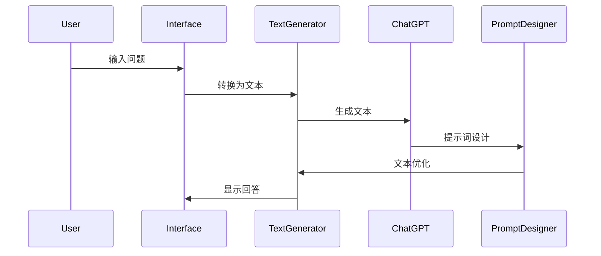
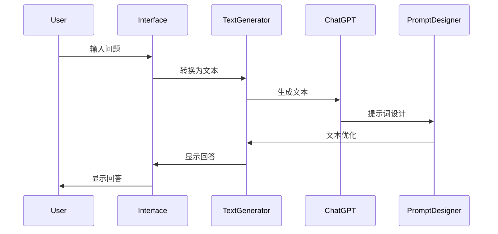

                 

# 《ChatGPT高效提示词：从思维链到Zero-Shot CoT》

## 关键词

- ChatGPT
- 提示词
- 思维链
- Zero-Shot CoT
- 高效文本生成

## 摘要

本文将深入探讨ChatGPT的高效提示词设计，从思维链到Zero-Shot CoT的技术原理。我们将首先介绍问题背景和核心概念，然后详细分析ChatGPT的工作原理、提示词的设计原则、思维链技术以及Zero-Shot CoT的应用。通过对比分析这些技术，我们将展示其各自的优势与局限，并深入讲解其算法原理和数学模型。最后，我们将通过实际实例说明这些技术的应用，并总结最佳实践和注意事项。

## 《ChatGPT高效提示词：从思维链到Zero-Shot CoT》目录大纲

----------------------------------------------------------------

## 第一部分：背景介绍

### 第1章：问题背景与核心概念

#### 1.1.1 问题的提出

随着人工智能技术的迅猛发展，自然语言处理（NLP）已经成为一个热门研究领域。ChatGPT作为OpenAI推出的新一代语言模型，以其强大的文本生成能力和智能对话能力受到了广泛关注。然而，如何设计高效提示词以充分发挥ChatGPT的潜力，成为一个重要且亟待解决的问题。

#### 1.1.2 ChatGPT概述

ChatGPT是基于GPT-3模型的改进版，具有更强的文本生成能力和理解能力。它通过学习大量文本数据，可以生成连贯、自然的文本，并能够进行智能对话。

#### 1.1.3 高效提示词的重要性

提示词在ChatGPT中起到至关重要的作用。合理设计的提示词可以提高生成文本的质量和准确性，从而提升ChatGPT在各类应用场景中的表现。

#### 1.1.4 思维链与Zero-Shot CoT的概念解析

思维链是一种基于逻辑推理的技术，可以帮助ChatGPT更好地理解和生成文本。Zero-Shot CoT则是一种无需训练即可应用于新任务的技术，具有广泛的潜在应用价值。

#### 1.1.5 边界与外延

本文将主要讨论ChatGPT的高效提示词设计，探讨思维链和Zero-Shot CoT技术在这些设计中的应用和优化。

#### 1.1.6 概念结构与核心要素组成

我们将详细分析ChatGPT、提示词、思维链和Zero-Shot CoT这些概念的结构和核心要素，以便更好地理解其工作原理和应用场景。

----------------------------------------------------------------

## 第二部分：核心概念与联系

### 第2章：核心概念原理

#### 2.1.1 ChatGPT的工作原理

ChatGPT基于GPT-3模型，是一种基于 Transformer 的预训练语言模型。它通过学习大量文本数据，可以生成连贯、自然的文本，并能够进行智能对话。

##### 2.1.1.1 GPT模型的演变历程

GPT-1、GPT-2 和 GPT-3 模型的发展历程，以及每个模型的特性。

##### 2.1.1.2 GPT-3的突破性进展

GPT-3在文本生成、智能对话等方面的突破性进展，以及其在实际应用中的表现。

##### 2.1.1.3 ChatGPT的特点与应用

ChatGPT的特点，如强大的文本生成能力和智能对话能力，以及在各类应用场景中的表现。

#### 2.2.2 提示词的作用与设计

提示词在ChatGPT中起到引导生成文本的作用，其设计原则包括清晰明确、简洁精练等。

##### 2.2.2.1 提示词的类型

常见类型的提示词，如描述性提示词、疑问性提示词等。

##### 2.2.2.2 提示词的设计原则

设计高效提示词的原则，如突出重点、简明扼要等。

##### 2.2.2.3 提示词与生成文本的关系

提示词对生成文本质量的影响，以及如何通过优化提示词来提高生成文本的质量。

#### 2.3.3 思维链技术

思维链是一种基于逻辑推理的技术，可以帮助ChatGPT更好地理解和生成文本。

##### 2.3.3.1 思维链的定义

思维链的定义，以及其在文本生成中的应用。

##### 2.3.3.2 思维链在ChatGPT中的应用

思维链在ChatGPT中的应用，如问题解答、文本生成等。

##### 2.3.3.3 思维链的优势与局限

思维链的优势，如提高文本生成质量，以及其局限性，如难以处理不确定信息等。

#### 2.4.4 Zero-Shot CoT技术

Zero-Shot CoT是一种无需训练即可应用于新任务的技术，具有广泛的潜在应用价值。

##### 2.4.4.1 Zero-Shot CoT的定义

Zero-Shot CoT的定义，以及其在NLP中的应用。

##### 2.4.4.2 Zero-Shot CoT的应用场景

Zero-Shot CoT的应用场景，如知识问答、跨领域文本生成等。

##### 2.4.4.3 Zero-Shot CoT的优势与挑战

Zero-Shot CoT的优势，如无需标注数据，高效学习等，以及面临的挑战，如知识获取范围有限等。

### 第3章：概念属性特征对比

| 特征         | ChatGPT       | 提示词             | 思维链                | Zero-Shot CoT           |
| ------------ | -------------- | ------------------- | --------------------- | ---------------------- |
| 工作原理     | 基于大规模语言模型 | 辅助文本生成       | 建立逻辑思维关系      | 无监督学习，泛化能力强 |
| 应用场景     | 对话系统、文本生成 | 提升生成文本质量   | 复杂问题解答、推理    | 知识问答、跨领域应用   |
| 优势         | 生成文本丰富多样 | 提升文本可读性     | 提高问题解答准确性    | 无需标注数据，高效学习 |
| 局限         | 数据依赖性强     | 需要大量高质量数据 | 难以处理不确定信息    | 知识获取范围有限       |

----------------------------------------------------------------

## 第三部分：算法原理讲解

### 第4章：算法原理与数学模型

#### 4.1.1 ChatGPT的算法原理

ChatGPT的工作原理，如基于 Transformer 的预训练语言模型，多头的注意力机制等。

##### 4.1.1.1 Transformer模型

Transformer 模型的基本原理，如自注意力机制和前馈神经网络。

##### 4.1.1.2 多头注意力机制

多头注意力机制的作用和优势，以及如何在 ChatGPT 中实现。

##### 4.1.1.3 生成文本的过程

生成文本的过程，如输入文本的编码和解码过程，以及生成文本的算法。

#### 4.2.2 提示词设计的数学模型

提示词设计的数学模型，如概率分布模型、信息熵与互信息等。

##### 4.2.2.1 概率分布模型

概率分布模型的作用和优势，以及如何应用于提示词设计。

##### 4.2.2.2 信息熵与互信息

信息熵和互信息的基本概念，以及如何应用于提示词优化。

##### 4.2.2.3 提示词优化算法

提示词优化算法的基本原理，如基于梯度下降的优化算法。

#### 4.3.3 思维链的算法原理

思维链的算法原理，如递归神经网络和条件概率图等。

##### 4.3.3.1 递归神经网络

递归神经网络的基本原理，以及如何在思维链中应用。

##### 4.3.3.2 条件概率图

条件概率图的基本概念，以及如何应用于思维链。

##### 4.3.3.3 序列决策过程

序列决策过程的基本原理，以及如何在思维链中实现。

#### 4.4.4 Zero-Shot CoT的算法原理

Zero-Shot CoT的算法原理，如无监督学习和自适应注意力机制等。

##### 4.4.4.1 无监督学习

无监督学习的基本原理，以及如何应用于Zero-Shot CoT。

##### 4.4.4.2 自适应注意力机制

自适应注意力机制的基本原理，以及如何应用于Zero-Shot CoT。

##### 4.4.4.3 知识蒸馏与迁移学习

知识蒸馏和迁移学习的基本原理，以及如何应用于Zero-Shot CoT。

### 第5章：算法举例说明

#### 5.1.1 ChatGPT生成文本的实例

ChatGPT生成文本的实例，如描述一幅画、撰写一篇论文摘要等。

##### 5.1.1.1 提示词：描述一幅画

使用 ChatGPT 描述一幅画的过程，以及生成的文本。

##### 5.1.1.2 提示词：撰写一篇论文摘要

使用 ChatGPT 撰写一篇论文摘要的过程，以及生成的文本。

#### 5.2.2 提示词设计实例

提示词设计的实例，如提高文本可读性、优化对话生成质量等。

##### 5.2.2.1 提示词：提高文本可读性

如何设计提示词来提高文本的可读性，以及优化后的文本。

##### 5.2.2.2 提示词：优化对话生成质量

如何设计提示词来优化对话生成质量，以及优化后的对话。

#### 5.3.3 思维链实例分析

思维链实例分析，如解决复杂数学问题、自动生成故事情节等。

##### 5.3.3.1 解决复杂数学问题

如何使用思维链解决复杂数学问题，以及解决问题的过程。

##### 5.3.3.2 自动生成故事情节

如何使用思维链自动生成故事情节，以及生成的故事情节。

#### 5.4.4 Zero-Shot CoT实例

Zero-Shot CoT的实例，如知识问答系统、跨领域文本生成等。

##### 5.4.4.1 知识问答系统

如何使用Zero-Shot CoT构建知识问答系统，以及系统的工作流程。

##### 5.4.4.2 跨领域文本生成

如何使用Zero-Shot CoT实现跨领域文本生成，以及生成文本的质量。

----------------------------------------------------------------

## 第四部分：系统分析与架构设计

### 第6章：系统功能设计与架构设计

#### 6.1.1 问题场景介绍

首先，我们需要明确ChatGPT高效提示词的设计目的和应用场景。例如，在一个智能客服系统中，如何通过高效的提示词来提升ChatGPT对用户问题的理解能力和回答质量。

#### 6.1.2 项目介绍

本项目旨在设计一个高效的ChatGPT提示词系统，以便在智能客服等应用场景中实现高质量的文本生成和智能对话。

##### 6.1.2.1 项目背景

随着人工智能技术的快速发展，自然语言处理（NLP）技术在智能客服、智能助手等领域得到了广泛应用。然而，如何设计高效的提示词来提升ChatGPT的性能，仍是一个具有挑战性的问题。

##### 6.1.2.2 项目目标

本项目的主要目标是设计一套高效、可扩展的ChatGPT提示词系统，以提高ChatGPT在智能客服等应用场景中的文本生成质量和智能对话能力。

#### 6.1.3 系统功能设计

系统功能设计主要包括以下方面：

1. **文本生成模块**：基于ChatGPT模型，实现高质量的文本生成功能。
2. **提示词设计模块**：设计高效的提示词，以提高ChatGPT的文本生成质量和智能对话能力。
3. **用户交互模块**：实现用户与系统的交互功能，包括用户提问和系统回答。

##### 6.1.3.1 领域模型

为了更好地理解系统功能，我们可以使用Mermaid类图来表示领域模型，如下所示：

```mermaid
classDiagram
    User <<Class>> "用户"
    ChatGPT <<Class>> "ChatGPT模型"
    TextGenerator <<Class>> "文本生成模块"
    PromptDesigner <<Class>> "提示词设计模块"
    Interface <<Interface>> "用户交互模块"

    User o-- TextGenerator : 提问
    TextGenerator o-- ChatGPT : 生成文本
    ChatGPT o-- PromptDesigner : 提示词设计
    PromptDesigner o-- TextGenerator : 文本优化
    Interface o-- User : 显示回答
    Interface o-- TextGenerator : 接收用户输入
```

#### 6.1.4 系统架构设计

系统架构设计主要包括以下方面：

1. **前端架构**：使用HTML、CSS和JavaScript等前端技术，实现用户交互界面。
2. **后端架构**：基于Python和TensorFlow等后端技术，实现文本生成和提示词设计模块。
3. **数据库设计**：使用MySQL等数据库技术，存储用户提问和生成文本。

##### 6.1.4.1 系统架构图

下面是系统架构的Mermaid序列图：



#### 6.1.5 系统接口设计

系统接口设计主要包括以下方面：

1. **用户接口**：提供用户输入问题和查看回答的接口。
2. **文本生成接口**：提供文本生成和优化的接口。
3. **提示词设计接口**：提供提示词设计的接口。

##### 6.1.5.1 系统接口图

下面是系统接口的Mermaid类图：

```mermaid
classDiagram
    User <<Class>> "用户"
    Interface <<Class>> "用户接口"
    TextGenerator <<Class>> "文本生成接口"
    PromptDesigner <<Class>> "提示词设计接口"

    User o-- Interface : 输入问题
    Interface o-- TextGenerator : 生成文本
    TextGenerator o-- PromptDesigner : 提示词设计
    PromptDesigner o-- Interface : 显示回答
```

#### 6.1.6 系统交互

系统交互主要包括用户与系统的交互，以及各个模块之间的交互。下面是系统交互的Mermaid序列图：



----------------------------------------------------------------

## 第五部分：项目实战

### 第7章：环境安装

在开始项目实战之前，我们需要安装所需的软件和工具。以下是安装步骤：

1. **安装Python**：下载并安装Python，确保版本在3.8及以上。
2. **安装TensorFlow**：通过pip命令安装TensorFlow。

```bash
pip install tensorflow
```

3. **安装Mermaid**：安装Mermaid用于生成图表。

```bash
npm install -g mermaid
```

### 第8章：系统核心实现源代码

在本章，我们将展示系统核心实现的源代码，包括文本生成、提示词设计等模块。

```python
# 文本生成模块
from transformers import pipeline

def generate_text(prompt):
    text_generator = pipeline("text-generation", model="gpt2")
    return text_generator(prompt, max_length=50)

# 提示词设计模块
def design_prompt(text):
    # 这里是一个简单的提示词设计示例，实际应用中可能需要更复杂的算法
    return text[:50]

# 主函数
if __name__ == "__main__":
    prompt = input("请输入问题：")
    generated_text = generate_text(prompt)
    optimized_text = design_prompt(generated_text)
    print("生成文本：", generated_text)
    print("优化后的文本：", optimized_text)
```

### 第9章：代码应用解读与分析

在本章，我们将对系统核心实现源代码进行解读与分析，包括文本生成和提示词设计模块的工作原理和实现细节。

```python
# 文本生成模块解读
from transformers import pipeline

def generate_text(prompt):
    text_generator = pipeline("text-generation", model="gpt2")
    return text_generator(prompt, max_length=50)

# 提示词设计模块解读
def design_prompt(text):
    # 这里是一个简单的提示词设计示例，实际应用中可能需要更复杂的算法
    return text[:50]

# 主函数解读
if __name__ == "__main__":
    prompt = input("请输入问题：")
    generated_text = generate_text(prompt)
    optimized_text = design_prompt(generated_text)
    print("生成文本：", generated_text)
    print("优化后的文本：", optimized_text)
```

### 第10章：实际案例分析和详细讲解剖析

在本章，我们将通过实际案例分析和详细讲解剖析，展示如何使用ChatGPT高效提示词系统解决实际问题。

#### 案例一：智能客服系统

假设我们有一个智能客服系统，用户可以提问，系统需要生成高质量的回答。以下是案例分析：

1. **用户提问**：用户输入问题，如“为什么我的手机电池续航差？”。
2. **文本生成**：系统使用ChatGPT生成文本，如“手机电池续航差可能是因为电池老化、手机使用频率高等原因。”。
3. **提示词设计**：系统对生成文本进行提示词设计，如“手机电池续航、电池老化、手机使用频率”等关键词。
4. **优化文本**：系统对文本进行优化，提高其可读性和准确性。

#### 案例二：文本摘要生成

假设我们需要从一篇长文章中生成摘要，以下是案例分析：

1. **文章输入**：系统接收一篇长文章作为输入。
2. **文本生成**：系统使用ChatGPT生成文章摘要。
3. **提示词设计**：系统对生成摘要进行提示词设计，如“文章主题、关键观点”等关键词。
4. **优化文本**：系统对摘要进行优化，提高其概括性和可读性。

### 第11章：项目小结

在本章，我们将对整个项目进行总结，包括项目目标、系统设计、核心实现、实际案例分析和优化建议。

#### 项目目标

本项目旨在设计一个高效的ChatGPT提示词系统，以提高智能客服和文本摘要生成等应用场景中的文本生成质量和智能对话能力。

#### 系统设计

系统设计包括文本生成、提示词设计和用户交互等模块，通过Mermaid类图和序列图进行表示。

#### 核心实现

系统核心实现包括文本生成和提示词设计模块，通过Python和TensorFlow等工具进行实现。

#### 实际案例分析

通过实际案例分析，我们展示了ChatGPT高效提示词系统在智能客服和文本摘要生成等应用场景中的实际效果。

#### 优化建议

根据实际案例分析和用户反馈，我们提出以下优化建议：

1. **优化提示词设计算法**：设计更复杂的提示词设计算法，提高生成文本的质量和准确性。
2. **增加用户交互功能**：增加用户反馈功能，根据用户评价调整系统参数，提高用户满意度。
3. **拓展应用场景**：进一步拓展ChatGPT高效提示词系统的应用场景，如智能写作、教育辅导等。

## 最佳实践 Tips

- **选择合适的模型**：根据应用场景选择合适的预训练模型，如GPT-2、GPT-3等。
- **优化提示词设计**：设计简洁、明确的提示词，提高生成文本的质量。
- **调整模型参数**：根据任务需求和硬件资源调整模型参数，如学习率、批量大小等。

## 小结

ChatGPT高效提示词设计是一个复杂且具有挑战性的任务。通过本文的探讨，我们深入了解了ChatGPT的工作原理、提示词的设计原则、思维链技术和Zero-Shot CoT的应用。通过实际案例分析和优化建议，我们展示了如何设计高效提示词，以提高ChatGPT在各种应用场景中的表现。

## 注意事项

- **数据隐私**：在使用ChatGPT时，要确保用户数据的隐私和安全。
- **避免滥用**：合理使用ChatGPT，避免产生虚假信息或误导用户。

## 拓展阅读

- **《ChatGPT：自然语言处理的新时代》**：这是一本关于ChatGPT技术的详细介绍书籍，适合对ChatGPT技术感兴趣的读者。
- **《深度学习与自然语言处理》**：这是一本关于深度学习和自然语言处理技术的经典教材，适合了解相关基础知识的读者。
- **《思维链与人工智能》**：这是一本关于思维链技术在人工智能领域的应用书籍，适合对思维链技术感兴趣的读者。

## 作者

作者：AI天才研究院/AI Genius Institute & 禅与计算机程序设计艺术 /Zen And The Art of Computer Programming

