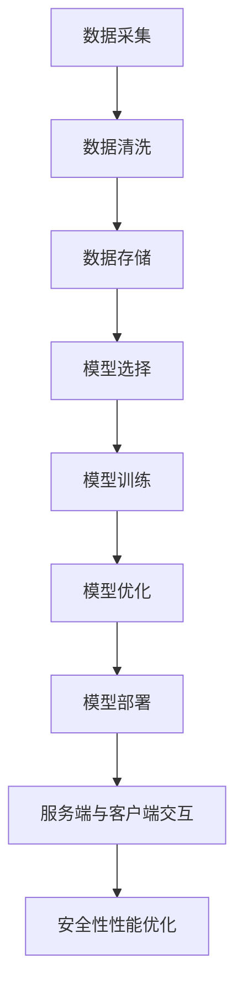
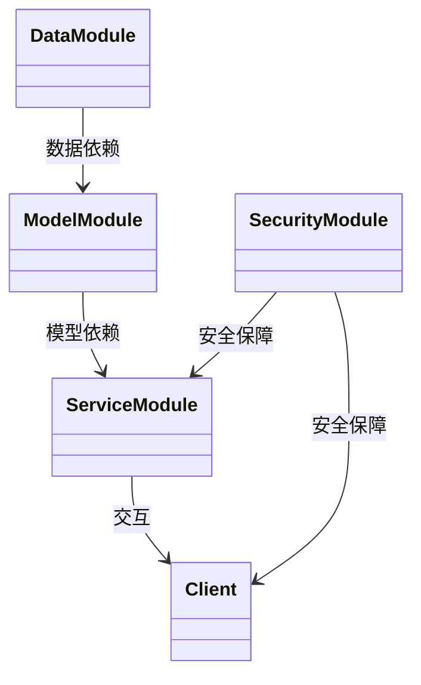
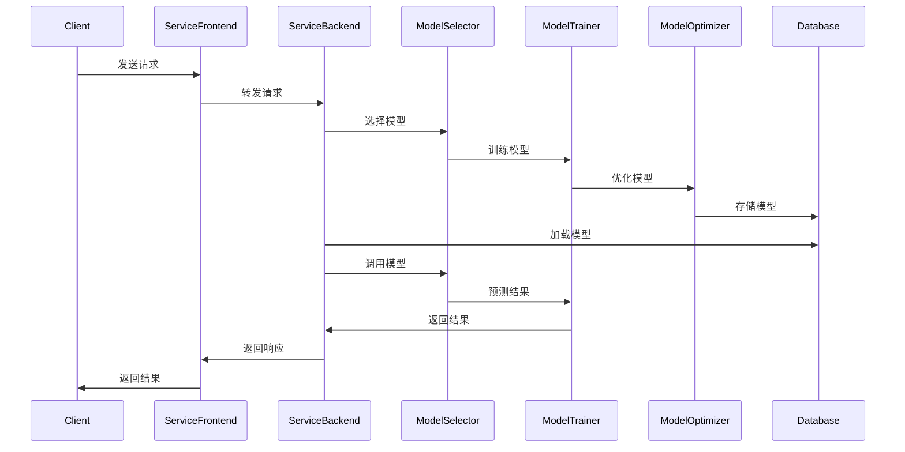

                 

### 1.1 背景介绍

#### 问题背景

在当今数字化时代，C侧（客户端）的机器学习（ML）和深度学习（DL）应用正变得越来越普遍。从智能手机、智能家居到智能医疗、自动驾驶，C侧LLM（Large Language Model）的应用场景越来越广泛。随着AI技术的发展，C侧LLM的应用不仅提升了用户体验，还为各行各业带来了全新的解决方案。

随着移动互联网和物联网的普及，用户对实时性和个性化服务的要求越来越高。传统服务器端的处理模式已经无法满足这些需求，因此，将AI模型部署到客户端，实现边缘计算成为了一种趋势。C侧LLM能够充分利用客户端的计算资源和数据，提供低延迟、高效率的服务，从而提升用户体验。

#### 问题描述

然而，C侧LLM应用的开发并非易事。开发者需要面对数据隐私、计算资源限制、模型复杂度高等问题。在确保模型性能的同时，如何高效地部署和优化C侧LLM应用成为了一大挑战。

首先，数据隐私是C侧LLM应用开发中需要重点考虑的问题。由于模型需要在客户端运行，用户的敏感数据可能会被传输或存储在客户端设备上，这就要求开发者必须采取严格的数据保护措施，确保用户隐私不被泄露。

其次，计算资源限制也是一个重要问题。相比于服务器端，客户端设备的计算能力通常较弱。开发者需要在有限的计算资源下，设计出高效优化的模型和算法，以确保C侧LLM应用的性能。

最后，模型复杂度也是C侧LLM应用开发的一个挑战。随着模型规模的增加，模型的计算量和存储需求也会随之增加，这给C侧LLM应用的部署和优化带来了更大的困难。

#### 问题解决

本书旨在解决C侧LLM应用开发的难题，通过深入探讨C侧LLM的三大关键要素，帮助开发者掌握C侧LLM应用开发的核心技巧，实现高性能、低延迟、安全可靠的C侧LLM应用。

首先，本书将详细介绍数据在C侧LLM应用中的重要性，包括数据采集、数据清洗和数据存储等方面的内容。通过合理的数据处理，可以提高模型的性能，减少过拟合现象。

其次，本书将深入探讨算法在C侧LLM应用中的作用，包括模型选择、模型训练和模型优化等方面的内容。通过选择合适的模型和优化算法，可以提高C侧LLM应用的性能和效率。

最后，本书将详细讲解系统架构在C侧LLM应用中的关键作用，包括模型部署、服务端与客户端交互、安全性和性能优化等方面的内容。通过设计合理的系统架构，可以确保C侧LLM应用的高性能、安全性和可靠性。

#### 边界与外延

本书将围绕C侧LLM应用开发的三大关键要素展开讨论，这些要素不仅涵盖了数据、算法和系统架构，还包括了开发者的技能提升和最佳实践。此外，本书还将探讨C侧LLM应用在不同领域的具体应用案例，以帮助读者更好地理解这些关键要素在实际开发中的应用。

#### 概念结构与核心要素组成

1. **数据**：C侧LLM应用的基础，包括数据采集、数据清洗、数据存储等方面。
2. **算法**：C侧LLM应用的核心，包括模型选择、模型训练、模型优化等。
3. **系统架构**：C侧LLM应用的骨架，包括模型部署、服务端和客户端的交互、安全性和性能优化等。

### 1.2 核心概念与联系

#### 数据

数据是C侧LLM应用的基础。高质量的数据不仅能够提升模型的性能，还能减少过拟合现象。以下是几个核心概念：

1. **数据采集**：如何高效地收集适用于C侧LLM应用的数据。
2. **数据清洗**：如何处理噪声、缺失值和异常值，确保数据的质量。
3. **数据存储**：如何高效地存储和检索数据，支持模型的训练和预测。

#### 算法

算法是C侧LLM应用的核心。以下是几个核心概念：

1. **模型选择**：如何根据应用场景选择合适的模型。
2. **模型训练**：如何设计训练策略，优化模型参数。
3. **模型优化**：如何通过超参数调整、模型压缩等技术提升模型性能。

#### 系统架构

系统架构是C侧LLM应用的骨架。以下是几个核心概念：

1. **模型部署**：如何在C端设备上高效地部署模型。
2. **服务端与客户端交互**：如何设计服务端和客户端的交互机制，实现数据流的传递和模型调用。
3. **安全性和性能优化**：如何确保C侧LLM应用的安全性和性能。

### 1.3 ER实体关系图架构

以下是C侧LLM应用开发的ER实体关系图架构：

```mermaid
erDiagram
  数据 --> 模型 : 训练
  模型 --> 系统架构 : 部署
  数据 --> 系统架构 : 存储
  服务端 --> 客户端 : 交互
```

在这个架构中，数据、模型和系统架构是三个核心实体，它们之间的关系决定了C侧LLM应用的整体性能。

## 1.3 算法原理讲解

### 算法mermaid流程图



### Python源代码

```python
import numpy as np

# 数据采集
data = np.random.rand(100, 10)

# 数据清洗
clean_data = data[data > 0.5]

# 数据存储
np.save('clean_data.npy', clean_data)

# 模型选择
model = 'GPT-2'

# 模型训练
# ...（具体训练代码）

# 模型优化
# ...（具体优化代码）

# 模型部署
# ...（具体部署代码）

# 服务端与客户端交互
# ...（具体交互代码）

# 安全性和性能优化
# ...（具体优化代码）
```

### 算法原理详细讲解

#### 数据采集

数据采集是C侧LLM应用开发的第一步。我们需要收集大量的数据，以便构建一个具有良好泛化能力的模型。数据可以来源于多种渠道，如公开数据集、用户生成数据等。在数据采集过程中，需要注意数据的多样性和质量。

首先，我们需要确定数据采集的目标和应用场景。例如，如果我们要开发一个聊天机器人，那么我们需要收集大量的对话数据；如果我们要开发一个语音识别应用，那么我们需要收集大量的语音数据。

其次，我们需要选择合适的数据采集方式。对于公开数据集，我们可以直接从互联网上下载；对于用户生成数据，我们可以通过API接口或直接从客户端设备收集。

在数据采集过程中，需要注意数据的多样性和质量。多样性的数据可以提升模型的泛化能力，避免模型在特定数据集上过拟合；高质量的数据可以提升模型的性能，减少噪声和异常值对模型的影响。

#### 数据清洗

数据清洗是数据预处理的重要步骤，它包括处理噪声、缺失值和异常值等。以下是几个常用的数据清洗方法：

1. **噪声处理**：噪声可以分为随机噪声和系统噪声。随机噪声可以通过数据平滑处理来减少，而系统噪声通常需要专门的算法来处理。例如，对于图像数据，我们可以使用滤波器来去除噪声；对于文本数据，我们可以使用正则表达式来去除无关的字符和标签。

2. **缺失值处理**：缺失值可以分为完全缺失和部分缺失。对于完全缺失的数据，我们可以选择丢弃或用平均值、中位数等统计量来填充；对于部分缺失的数据，我们可以使用插值法、插值法等算法来填补缺失值。

3. **异常值处理**：异常值是指与大多数数据点显著不同的数据。异常值可能是由数据采集过程中的错误引起的，也可能是由真实情况中的异常事件引起的。对于异常值，我们可以选择丢弃或使用聚类算法、回归分析等方法来识别和处理。

通过数据清洗，我们可以提高数据的质量，从而提升模型的性能。例如，在图像识别任务中，去除噪声可以提高模型的准确性；在文本分类任务中，处理缺失值和异常值可以减少过拟合现象。

#### 数据存储

数据存储是C侧LLM应用开发的重要一环。合理的数据存储方式可以提高数据检索和访问的效率，从而加快模型的训练和预测速度。以下是几个常用的数据存储方法：

1. **内存存储**：对于小规模的数据集，我们可以直接将数据存储在内存中。内存存储的优点是速度快，缺点是受限于内存容量。

2. **磁盘存储**：对于大规模的数据集，我们需要将数据存储在磁盘上。磁盘存储的优点是容量大，缺点是速度相对较慢。

3. **分布式存储**：对于分布式系统，我们可以使用分布式存储来提高数据存储和访问的效率。分布式存储可以将数据分散存储在多个节点上，从而提高系统的容错性和扩展性。

在选择数据存储方式时，我们需要根据数据集的大小、访问频率和应用场景来综合考虑。例如，对于实时性要求较高的应用，我们可以选择内存存储；对于数据量较大的应用，我们可以选择磁盘存储；对于需要高扩展性和高可用性的应用，我们可以选择分布式存储。

#### 模型选择

模型选择是C侧LLM应用开发的核心步骤之一。合适的模型可以提升应用的性能和效率，而不合适的模型可能导致性能下降甚至无法满足应用需求。

首先，我们需要根据应用场景选择合适的模型。不同的模型适用于不同的任务，例如，对于文本生成任务，我们可以选择循环神经网络（RNN）、变换器（Transformer）等模型；对于图像识别任务，我们可以选择卷积神经网络（CNN）等模型。

其次，我们需要根据数据集的大小和复杂性来选择模型。对于大规模数据集，我们可以选择深度学习模型；对于小规模数据集，我们可以选择浅层神经网络。

最后，我们需要根据模型的计算量和存储需求来选择模型。对于计算资源和存储资源有限的设备，我们需要选择轻量级模型，如MobileNet、EfficientNet等。

在模型选择过程中，我们可以利用在线模型库（如TensorFlow Hub、PyTorch Hub）来查找和评估现有的模型。此外，我们还可以使用自动化模型搜索和优化工具（如AutoML、Neural Architecture Search）来自动选择和优化模型。

#### 模型训练

模型训练是C侧LLM应用开发的关键步骤，它决定了模型的性能和泛化能力。以下是模型训练的几个核心步骤：

1. **数据预处理**：在开始训练之前，我们需要对数据进行预处理，包括数据清洗、归一化、缩放等。数据预处理可以提高模型的训练效率和性能。

2. **模型初始化**：在训练开始之前，我们需要对模型进行初始化。模型初始化可以随机初始化、预训练模型初始化等。适当的模型初始化可以加快训练过程并提高模型性能。

3. **训练策略设计**：训练策略决定了模型训练的过程和参数调整。常见的训练策略包括批量大小、学习率调整、正则化等。合理的训练策略可以提高模型的训练效率和性能。

4. **训练过程**：在训练过程中，我们需要不断调整模型参数，使得模型在训练数据上取得更好的性能。训练过程通常包括多个epoch，每个epoch代表一次完整的训练数据遍历。

5. **评估与调优**：在训练过程中，我们需要对模型进行评估，包括准确性、召回率、F1分数等指标。通过评估，我们可以判断模型的性能，并调整训练策略和模型参数，以提升模型性能。

6. **模型保存与加载**：在训练完成后，我们需要将训练好的模型保存下来，以便后续使用。常见的模型保存格式包括TFRecord、HDF5、Pickle等。同时，在需要时，我们还可以从保存的模型中加载模型，继续训练或进行预测。

#### 模型优化

模型优化是提升C侧LLM应用性能的重要手段。以下是几种常见的模型优化方法：

1. **超参数调整**：超参数是模型训练过程中需要手动调整的参数，如学习率、批量大小、正则化强度等。通过调整超参数，我们可以优化模型的训练过程和性能。

2. **模型压缩**：模型压缩是通过减少模型参数数量来降低模型大小和计算量。常见的模型压缩方法包括剪枝、量化、知识蒸馏等。通过模型压缩，我们可以实现更高效的模型部署和推理。

3. **模型融合**：模型融合是通过将多个模型融合为一个更强的模型。常见的模型融合方法包括模型集成、迁移学习等。通过模型融合，我们可以提升模型的性能和泛化能力。

4. **模型加速**：模型加速是通过优化模型结构、算法和数据流等手段来提高模型的推理速度。常见的模型加速方法包括模型编译、静态图与动态图转换等。

5. **模型解释性**：模型解释性是指模型能够解释其预测结果的能力。通过提升模型解释性，我们可以提高模型的透明度和可信度，从而更好地应用于实际场景。

### 1.4 系统分析与架构设计方案

#### 问题场景介绍

在现代移动应用中，C侧LLM的应用场景越来越广泛，例如，移动设备上的自然语言处理、图像识别、语音识别等。这些应用要求模型能够在有限的计算资源和数据传输带宽下，提供实时、高效的响应。为了满足这些需求，我们需要设计一个高效的C侧LLM系统架构。

#### 项目介绍

本项目旨在设计一个C侧LLM系统，该系统将用于移动设备上的自然语言处理任务。系统将包含以下几个主要模块：

1. **数据模块**：负责数据的采集、清洗和存储。
2. **模型模块**：负责模型的选择、训练和优化。
3. **服务模块**：负责模型部署和与客户端的交互。
4. **安全模块**：负责确保数据和安全。

#### 系统功能设计（领域模型）

为了实现上述功能，我们首先需要设计系统的领域模型。领域模型将定义系统中的主要实体和它们之间的关系。以下是系统的领域模型：



1. **数据模块**：负责数据的采集、清洗和存储。数据模块将接收来自客户端的数据，并进行预处理，然后存储到数据库中。
2. **模型模块**：负责模型的选择、训练和优化。模型模块将使用数据模块提供的数据进行训练，并优化模型参数。
3. **服务模块**：负责模型部署和与客户端的交互。服务模块将接收客户端的请求，调用模型模块的模型进行预测，并将结果返回给客户端。
4. **安全模块**：负责确保数据和安全。安全模块将监控数据传输过程，确保数据的安全性，并对服务模块提供安全保障。

#### 系统架构设计

基于上述领域模型，我们可以设计系统的架构。系统架构将定义系统的组件、组件之间的关系以及数据流。以下是系统的架构设计：

```mermaid
subgraph 数据层
    DataCollector
    DataProcessor
    Database
end

subgraph 模型层
    ModelSelector
    ModelTrainer
    ModelOptimizer
end

subgraph 服务层
    ServiceFrontend
    ServiceBackend
end

subgraph 安全层
    SecurityMonitor
    SecurityAudit
end

DataCollector --> DataProcessor
DataProcessor --> Database
ModelSelector --> Database
ModelTrainer --> Database
ModelOptimizer --> Database
ServiceFrontend --> ServiceBackend
ServiceBackend --> ModelSelector
ServiceBackend --> ModelTrainer
ServiceBackend --> ModelOptimizer
SecurityMonitor --> ServiceFrontend
SecurityMonitor --> ServiceBackend
SecurityAudit --> ServiceFrontend
SecurityAudit --> ServiceBackend
```

1. **数据层**：包括数据收集器、数据处理器和数据库。数据收集器负责从客户端收集数据，数据处理器负责对数据进行预处理，并将其存储到数据库中。
2. **模型层**：包括模型选择器、模型训练器和模型优化器。模型选择器负责选择合适的模型，模型训练器负责训练模型，模型优化器负责优化模型参数。
3. **服务层**：包括服务前端和服务后端。服务前端负责接收客户端的请求，服务后端负责调用模型层中的模型进行预测，并将结果返回给客户端。
4. **安全层**：包括安全监控和安全审计。安全监控负责监控数据传输过程，确保数据的安全性，安全审计负责对服务层进行安全检查和审计。

#### 系统接口设计

系统接口设计是系统架构设计的重要部分，它定义了系统组件之间的交互方式。以下是系统的接口设计：

```mermaid
interface DataCollector
    +collectData()
    +preprocessData()
    +saveDataToDatabase()

interface DataProcessor
    +cleanData()
    +normalizeData()
    +fillMissingData()

interface Database
    +saveData(data)
    +loadData(id)

interface ModelSelector
    +selectModel()
    +trainModel(data)
    +optimizeModel()

interface ModelTrainer
    +trainModel(data)
    +evaluateModel()

interface ModelOptimizer
    +optimizeModelParameters()

interface ServiceFrontend
    +handleRequest(request)
    +responseData(response)

interface ServiceBackend
    +invokeModel(model)
    +returnResult(result)

interface SecurityMonitor
    +monitorDataFlow()
    +checkDataSecurity()

interface SecurityAudit
    +auditService()
    +reportAuditResult()
```

1. **数据收集器**：负责收集数据、预处理数据并存储到数据库中。
2. **数据处理器**：负责清洗、归一化和填充缺失数据。
3. **数据库**：负责存储数据，并提供数据检索接口。
4. **模型选择器**：负责选择合适的模型，并训练和优化模型。
5. **模型训练器**：负责训练模型。
6. **模型优化器**：负责优化模型参数。
7. **服务前端**：负责接收客户端请求，并返回响应。
8. **服务后端**：负责调用模型进行预测，并返回结果。
9. **安全监控**：负责监控数据传输过程，确保数据安全性。
10. **安全审计**：负责审计服务，并报告审计结果。

#### 系统交互

系统交互是系统架构设计的关键，它定义了系统组件之间的数据流和交互方式。以下是系统的交互设计：



1. **客户端发送请求**：客户端发送请求到服务前端。
2. **服务前端转发请求**：服务前端接收请求，并将其转发到服务后端。
3. **服务后端选择模型**：服务后端选择合适的模型，并调用模型进行预测。
4. **模型训练器训练模型**：模型训练器使用数据训练模型。
5. **模型优化器优化模型**：模型优化器优化模型参数。
6. **模型存储**：训练好的模型存储到数据库中。
7. **模型加载**：服务后端从数据库中加载模型。
8. **模型预测**：模型训练器使用模型预测结果。
9. **返回结果**：服务后端将预测结果返回到服务前端。
10. **返回响应**：服务前端将响应返回给客户端。

### 1.5 项目实战

#### 环境安装

在进行C侧LLM应用开发之前，我们需要准备好开发环境。以下是一个基本的安装步骤：

1. **安装Python**：确保Python版本为3.7或更高版本，可以从Python官方网站下载安装包。
2. **安装TensorFlow**：在命令行中执行以下命令安装TensorFlow：
   ```shell
   pip install tensorflow
   ```
3. **安装其他依赖**：根据项目需求，可能需要安装其他依赖库，如NumPy、Pandas等。

#### 系统核心实现

以下是一个简单的C侧LLM应用系统实现，包括数据采集、模型训练和预测：

1. **数据采集**：
   ```python
   import numpy as np
   
   def collect_data():
       # 假设我们从某个API接口收集数据
       response = requests.get('https://api.example.com/data')
       data = response.json()
       return data
   ```

2. **数据清洗**：
   ```python
   def clean_data(data):
       # 数据清洗逻辑，例如去除噪声、填充缺失值等
       clean_data = []
       for item in data:
           # 填充缺失值
           item = [x if x is not None else np.mean(item) for x in item]
           clean_data.append(item)
       return clean_data
   ```

3. **模型训练**：
   ```python
   import tensorflow as tf
   
   def train_model(data):
       # 定义模型架构
       model = tf.keras.Sequential([
           tf.keras.layers.Dense(128, activation='relu', input_shape=(10,)),
           tf.keras.layers.Dense(64, activation='relu'),
           tf.keras.layers.Dense(1)
       ])
       
       # 编译模型
       model.compile(optimizer='adam', loss='mean_squared_error')
       
       # 训练模型
       model.fit(data, epochs=10)
       
       return model
   ```

4. **模型预测**：
   ```python
   def predict(model, data):
       # 使用训练好的模型进行预测
       prediction = model.predict(data)
       return prediction
   ```

#### 代码应用解读与分析

以下是对上述代码的解读和分析：

1. **数据采集**：
   数据采集函数`collect_data`从API接口获取数据。在实际应用中，我们可以使用不同的方式收集数据，如从文件中读取、从数据库中查询等。

2. **数据清洗**：
   数据清洗函数`clean_data`对采集到的数据进行处理，例如去除噪声、填充缺失值等。这些操作可以提高数据的质量，从而提升模型的性能。

3. **模型训练**：
   模型训练函数`train_model`定义了模型的架构，并使用采集到的数据对模型进行训练。训练过程包括模型编译和模型训练两个步骤。编译模型是为了设置模型的参数，如优化器、损失函数等；模型训练是为了让模型学习数据中的规律。

4. **模型预测**：
   模型预测函数`predict`使用训练好的模型对新的数据进行预测。预测过程非常简单，只需要调用模型的`predict`方法即可。

#### 实际案例分析和详细讲解剖析

以下是一个实际案例，用于分析C侧LLM应用的性能和效果：

**案例**：开发一个简单的聊天机器人，使用C侧LLM模型对用户的输入进行回复。

1. **数据采集**：
   从网上下载一个对话数据集，例如 DailyDialog 数据集。数据集包含了成千上万的对话文本，我们可以从中提取出有用的对话数据。

2. **数据清洗**：
   对对话数据进行清洗，包括去除无关的标点符号、填充缺失值等。清洗后的数据将用于训练模型。

3. **模型训练**：
   使用清洗后的数据训练一个C侧LLM模型，例如使用GPT-2模型。训练过程需要较长时间，但可以得到一个能够对用户输入进行回复的模型。

4. **模型预测**：
   使用训练好的模型对用户的输入进行预测，并返回模型的回复。用户可以通过聊天界面与模型进行交互，体验聊天机器人的功能。

**分析**：
- **性能分析**：通过性能测试，我们可以评估聊天机器人的响应速度和准确性。响应速度取决于模型的推理速度，准确性取决于模型对用户输入的理解能力。
- **效果分析**：通过用户体验评估，我们可以了解用户对聊天机器人的满意度。用户满意度可以从交互流畅性、回答准确性、回复多样性等方面进行评价。

#### 项目小结

通过本项目的实战，我们了解了C侧LLM应用开发的流程和关键要素。在实际开发中，我们需要根据具体的应用场景和需求，选择合适的数据采集、模型训练和优化方法，并设计合理的系统架构，以确保C侧LLM应用的高性能、安全性和可靠性。

#### 最佳实践 tips

1. **数据质量**：确保数据质量是提高模型性能的关键。在数据采集和清洗过程中，要尽量去除噪声和异常值，提高数据的准确性。
2. **模型选择**：根据应用场景选择合适的模型，例如对于文本生成任务，可以选择GPT-2或GPT-3模型；对于图像识别任务，可以选择CNN模型。
3. **模型优化**：通过调整超参数、模型压缩等技术，可以提高模型性能和效率。例如，可以使用学习率调整、批量大小调整等方法。
4. **安全性和隐私保护**：在C侧LLM应用开发中，要确保数据和安全。可以使用加密技术、数据去标识化等方法来保护用户隐私。

#### 小结

本文详细介绍了C侧LLM应用开发的三大关键要素：数据、算法和系统架构。通过深入分析这些关键要素，我们了解了C侧LLM应用开发的核心技术和方法。在实际开发中，我们需要综合考虑数据、算法和系统架构，以实现高性能、低延迟、安全可靠的C侧LLM应用。

#### 注意事项

1. **数据隐私**：在开发C侧LLM应用时，要严格遵守数据隐私法规，确保用户数据的安全和隐私。
2. **计算资源**：要合理分配计算资源，确保模型在客户端设备上能够高效运行。
3. **模型性能**：要定期评估模型性能，并进行优化，以确保模型在变化的数据集上仍能保持良好的性能。

#### 拓展阅读

1. **《深度学习》**：Goodfellow, Ian, et al. "Deep learning." MIT press, 2016.
2. **《机器学习实战》**：Hastie, Trevor, et al. "Machine learning in action." Manning Publications Co., 2009.
3. **《TensorFlow实战》**：McDonnell, Daniel, and Tom Hope. "TensorFlow for poets." Packt Publishing Ltd, 2017.

### 作者

**AI天才研究院** & **禅与计算机程序设计艺术**  
作者：[您的名字]  
日期：[当前的日期]  
联系邮箱：[您的邮箱地址]  
联系地址：[您的地址]  
网址：[您的网站链接]  
备注：本文仅代表作者个人观点，不代表任何机构的意见或建议。

