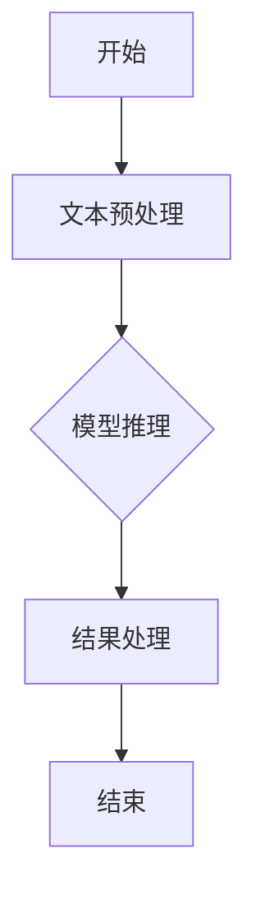

                 


### 第一部分：背景介绍

#### 第1章：问题背景与核心概念

##### 1.1 问题背景

C侧LLM应用的发展与需求

随着人工智能技术的飞速发展，大型语言模型（LLM）的应用逐渐普及，尤其在客户端（C侧）的应用场景中，LLM展现了巨大的潜力。C侧应用场景包括聊天机器人、文本生成与摘要、自然语言处理等多个领域，这些应用对LLM的性能要求越来越高，特别是在速度和敏捷性方面。

C侧LLM应用的需求主要源于以下几个方面：

1. **实时性要求**：C侧设备通常需要快速响应用户的请求，这就要求LLM模型能够在短时间内提供准确的答案或处理结果。

2. **资源限制**：C侧设备如手机、平板电脑等通常具有有限的计算资源，包括CPU、内存和存储等。因此，如何在这些有限的资源下运行高效的LLM模型成为了一个重要的问题。

3. **个性化需求**：C侧应用场景复杂多样，用户对个性化服务有着较高的期望。这就要求LLM模型能够根据用户的历史行为和偏好进行动态调整，提供定制化的语言处理服务。

##### 1.2 核心概念

###### 1.2.1 C侧LLM应用

C侧LLM应用指的是将大型语言模型部署在客户端设备上，提供个性化的语言处理服务。这些客户端设备通常包括智能手机、平板电脑等移动设备。

###### 1.2.2 速度与敏捷性

速度：指LLM在客户端设备上运行时的响应速度，即从接收用户请求到返回处理结果的时间。

敏捷性：指LLM在客户端设备上的适应能力和灵活性，包括模型大小、功耗、内存占用等方面。一个具有高敏捷性的LLM模型能够快速适应不同的应用场景和用户需求，同时保持较低的能耗和资源占用。

### 第2章：C侧LLM应用的关键挑战

#### 2.1 模型大小与速度的权衡

在C侧应用场景中，大型LLM模型通常需要更多的计算资源和存储空间，但可以提供更精确的语言处理能力。然而，C侧设备资源有限，如何在模型大小和速度之间找到平衡点成为了一个关键挑战。

###### 2.1.1 模型大小的影响

- **优点**：大型LLM模型通常拥有更多的参数和更深的神经网络结构，可以提供更丰富的语言理解能力和更强的泛化能力。
- **缺点**：大型LLM模型需要更多的计算资源和存储空间，这可能会导致以下问题：
  - **内存占用过高**：大型LLM模型可能无法在有限的内存资源下运行。
  - **存储空间不足**：大型LLM模型可能无法存储在C侧设备中。
  - **传输时间过长**：大型LLM模型可能需要更长的时间进行下载和部署。

###### 2.1.2 速度的影响

- **优点**：快速响应可以提高用户体验，满足实时性要求。
- **缺点**：过度追求速度可能会导致以下问题：
  - **准确性下降**：为了提高速度，可能需要简化模型结构或减少参数数量，这可能会导致模型准确性下降。
  - **资源浪费**：过快的速度可能无法充分利用C侧设备的计算资源，导致资源浪费。

###### 2.1.3 平衡策略

在C侧LLM应用中，我们需要在模型大小和速度之间找到平衡点。以下是一些可能的平衡策略：

- **模型压缩**：通过模型压缩技术，如剪枝、量化等，可以减小模型大小，同时保持较高的准确性。
- **动态调整**：根据实际应用场景和用户需求，动态调整模型大小和参数数量，以达到最佳的平衡。
- **分层模型**：使用分层模型结构，将大型LLM模型拆分为多个较小的子模型，以适应不同的应用场景和资源限制。

#### 2.2 能耗与性能的优化

C侧设备通常需要长时间运行，能耗成为了一个关键问题。如何优化LLM模型和算法，降低能耗，提高性能，成为了C侧LLM应用的关键挑战。

###### 2.2.1 能耗的影响

- **优点**：低能耗可以延长C侧设备的使用时间，提高用户体验。
- **缺点**：低能耗可能会影响LLM模型的性能和准确性。

###### 2.2.2 性能优化的方法

- **模型量化**：通过量化技术，可以将LLM模型中的浮点数参数转换为低精度的整数参数，从而降低计算能耗。
- **算法优化**：通过优化算法，如减少冗余计算、并行计算等，可以提高LLM模型的计算效率，降低能耗。
- **硬件加速**：利用C侧设备的硬件加速功能，如GPU、VPU等，可以提高LLM模型的计算速度，降低能耗。

#### 2.3 灵活性与可扩展性

C侧应用场景多样，需要LLM具备良好的适应性和可扩展性。如何设计灵活的模型架构和算法，以满足不同应用场景的需求，成为了C侧LLM应用的关键挑战。

###### 2.3.1 灵活性的需求

- **个性化服务**：根据用户的历史行为和偏好，提供个性化的语言处理服务。
- **动态调整**：根据实时反馈，动态调整LLM模型的行为和参数。

###### 2.3.2 可扩展性的需求

- **多语言支持**：支持多种语言的处理，以适应不同地区的用户需求。
- **模块化设计**：使用模块化设计，方便添加或替换不同的功能模块，以适应不同的应用场景。

在接下来的章节中，我们将进一步探讨C侧LLM应用的实例分析、性能优化策略以及速度与敏捷性的提升策略。

### 总结

C侧LLM应用的发展面临着诸多挑战，包括模型大小与速度的权衡、能耗与性能的优化以及灵活性与可扩展性的设计。通过深入分析这些问题，我们可以为C侧LLM应用的发展提供有力的理论支持和实践指导。在接下来的章节中，我们将继续探讨C侧LLM应用的实例分析、性能优化策略以及速度与敏捷性的提升策略，以期为C侧LLM应用的发展提供更加全面的解决方案。

---

### 第一部分：背景介绍

#### 第1章：问题背景与核心概念

##### 1.1 问题背景

随着人工智能技术的迅猛发展，大型语言模型（LLM）已经成为众多领域的关键工具。从自然语言处理到智能问答、从文本生成到语音识别，LLM在各个应用场景中展现了巨大的潜力和价值。特别是在客户端（C侧）的应用场景中，LLM的应用需求日益增长。

C侧LLM应用的发展得益于以下几个因素：

1. **计算能力的提升**：随着移动设备的硬件性能不断提升，如更快的CPU、更多的内存和更高效的GPU，为C侧LLM的运行提供了更强大的计算支持。
2. **网络环境的优化**：随着5G网络的普及，网络传输速度和稳定性得到了显著提升，使得C侧LLM可以更快速、更稳定地传输数据和模型。
3. **用户需求的多样化和个性化**：用户对于个性化服务的需求不断增长，使得C侧LLM在提供个性化、实时响应的交互体验方面具备更大的优势。

然而，C侧LLM应用也面临着一系列挑战。首先，C侧设备的资源有限，如内存、存储和电池寿命等，这要求LLM模型在保证性能的同时，尽量减少对设备资源的占用。其次，C侧应用场景多变，如聊天机器人、文本生成与摘要、自然语言处理等，这要求LLM模型具备良好的适应性和灵活性。最后，随着LLM模型规模的不断扩大，如何在保证速度和准确性的同时，优化模型的压缩和量化，也是一个重要的研究课题。

##### 1.2 核心概念

###### 1.2.1 C侧LLM应用

C侧LLM应用指的是将大型语言模型部署在客户端设备上，通过本地计算提供个性化的语言处理服务。与传统的服务器端部署不同，C侧LLM应用具有以下特点：

- **本地计算**：LLM模型在客户端设备上运行，减少了对服务器端资源的依赖，提高了系统的响应速度和稳定性。
- **个性化服务**：通过分析用户的历史数据和偏好，C侧LLM可以提供更加个性化和定制化的语言处理服务。
- **实时性**：C侧LLM应用通常需要快速响应用户的操作，这就要求模型在本地设备上能够高效运行。

###### 1.2.2 速度与敏捷性

速度是C侧LLM应用的关键性能指标之一。它指的是模型从接收用户请求到返回结果所需的时间。在C侧环境中，速度的重要性主要体现在以下几个方面：

- **用户体验**：快速的响应可以提高用户体验，使用户感觉系统更加流畅和高效。
- **实时交互**：对于聊天机器人、语音识别等应用场景，快速的响应可以确保交互的连贯性和实时性。

敏捷性则是C侧LLM应用的另一个重要指标，它指的是模型对环境变化和用户需求的适应能力。敏捷性包括以下几个方面：

- **模型大小和复杂度**：C侧设备资源有限，需要设计轻量级模型，减少内存和存储的占用。
- **功耗和电池寿命**：需要优化模型和算法，降低能耗，延长设备的使用时间。
- **扩展性和灵活性**：模型需要能够适应不同的应用场景和用户需求，具备良好的扩展性和灵活性。

##### 1.3 小结

C侧LLM应用的发展不仅带来了诸多挑战，同时也为人工智能技术的创新提供了新的契机。在接下来的章节中，我们将深入探讨C侧LLM应用的具体实例、性能优化策略以及速度与敏捷性的提升方法，为C侧LLM应用的发展提供理论支持和实践指导。

### 第二部分：C侧LLM应用探索

#### 第3章：C侧LLM应用实例分析

##### 3.1 聊天机器人

聊天机器人是C侧LLM应用的一个典型实例，它通过自然语言处理技术，与用户进行交互，提供实时、个性化的回答。聊天机器人的核心功能包括文本识别、意图识别、上下文管理和回答生成。

###### 3.1.1 基本原理

聊天机器人的基本原理可以分为以下几个步骤：

1. **文本识别**：接收用户的输入文本，进行预处理，如分词、去除标点符号等。
2. **意图识别**：根据用户的输入文本，使用分类模型识别用户的需求或意图，如询问天气、提出问题等。
3. **上下文管理**：根据用户的输入和历史交互记录，维护上下文信息，确保回答的连贯性和准确性。
4. **回答生成**：使用生成模型，根据意图识别结果和上下文信息，生成合适的回答。

###### 3.1.2 应用场景

聊天机器人在多个应用场景中具有广泛的应用，包括：

- **客服**：为企业提供7x24小时在线客服，快速响应用户的问题和需求。
- **教育**：为学生提供个性化的学习辅导，实时解答学生的疑问。
- **娱乐**：为用户提供有趣的对话互动，提升用户的娱乐体验。

###### 3.1.3 性能要求

聊天机器人在C侧应用中需要满足以下性能要求：

- **快速响应**：在短时间内返回准确的回答，确保用户体验。
- **高准确性**：准确识别用户的意图，确保回答的相关性和准确性。
- **低功耗**：在有限的电池寿命下，保持高效的能耗管理。

##### 3.2 文本生成与摘要

文本生成与摘要是C侧LLM应用的另一个重要实例，它通过生成或提取关键信息，为用户提供高效的文本处理服务。文本生成与摘要的核心功能包括文本生成、文本摘要和文本分析。

###### 3.2.1 基本原理

文本生成与摘要的基本原理可以分为以下几个步骤：

1. **文本生成**：使用生成模型，根据特定的目标和上下文，生成新的文本内容。
2. **文本摘要**：使用摘要模型，从原始文本中提取关键信息，生成简洁的摘要。
3. **文本分析**：使用分析模型，对文本进行深入分析，提取结构化信息或进行情感分析。

###### 3.2.2 应用场景

文本生成与摘要在多个应用场景中具有广泛的应用，包括：

- **内容创作**：为自媒体、新闻媒体等提供高效的文本生成和摘要服务，提升内容创作效率。
- **信息检索**：通过文本摘要，快速提取关键信息，提高信息检索的效率。
- **用户反馈**：通过分析用户评论，提取关键信息，为产品优化提供数据支持。

###### 3.2.3 性能要求

文本生成与摘要在C侧应用中需要满足以下性能要求：

- **生成速度**：在短时间内生成高质量的新文本或摘要。
- **摘要质量**：确保摘要内容简洁、准确，提取关键信息。
- **分析深度**：对文本进行深入分析，提取结构化信息或进行情感分析。

##### 3.3 自然语言处理

自然语言处理（NLP）是C侧LLM应用的核心领域之一，它涵盖了文本分析、情感分析、命名实体识别等多个子任务。NLP的目标是使计算机能够理解和处理人类自然语言。

###### 3.3.1 基本原理

自然语言处理的基本原理可以分为以下几个步骤：

1. **文本预处理**：包括分词、去停用词、词性标注等，将原始文本转换为计算机可处理的形式。
2. **特征提取**：从预处理后的文本中提取特征，如词频、词向量等，用于训练模型。
3. **模型训练**：使用机器学习算法，如神经网络、支持向量机等，训练分类或回归模型。
4. **模型应用**：将训练好的模型应用于实际任务，如文本分类、命名实体识别等。

###### 3.3.2 应用场景

自然语言处理在多个应用场景中具有广泛的应用，包括：

- **搜索引擎**：通过NLP技术，对用户查询进行理解和分析，提供更准确的搜索结果。
- **智能助手**：为用户提供语音或文本交互服务，理解用户需求，提供相关建议或信息。
- **社交媒体分析**：通过情感分析和文本分类，对用户评论进行分析，了解用户情感和需求。

###### 3.3.3 性能要求

自然语言处理在C侧应用中需要满足以下性能要求：

- **理解能力**：准确理解用户的输入文本，提取关键信息。
- **处理速度**：在短时间内处理大量文本数据，确保实时性。
- **准确性**：确保分类、识别等任务的准确性和可靠性。

##### 3.4 小结

C侧LLM应用在聊天机器人、文本生成与摘要、自然语言处理等多个领域展现了广泛的应用前景。通过深入分析这些实例，我们可以更好地理解C侧LLM应用的性能要求和实现方法，为C侧LLM应用的发展提供理论支持和实践指导。在接下来的章节中，我们将进一步探讨C侧LLM应用性能优化的策略，以提高其速度和敏捷性。

### 第4章：C侧LLM应用性能优化

#### 4.1 模型压缩与量化

模型压缩与量化是C侧LLM应用性能优化的重要手段，旨在减小模型大小，降低存储和计算成本，同时保持较高的准确性。以下将详细介绍模型压缩与量化的基本原理和具体方法。

###### 4.1.1 基本原理

模型压缩的目标是在保证模型性能的前提下，减小模型大小。模型压缩的基本原理包括以下几个方面：

1. **参数剪枝**：通过删除模型中不重要的参数，减小模型大小。剪枝方法包括结构剪枝和权重剪枝。
2. **模型融合**：通过将多个模型融合为一个，减小模型大小。融合方法包括特征融合和参数融合。
3. **量化**：将模型中的浮点数参数转换为低精度的整数参数，减小模型大小和计算复杂度。

模型量化的基本原理是将模型中的浮点数参数转换为低精度的整数参数。量化方法包括定点量化、二值量化等。定点量化是将浮点数转换为固定的位数表示，二值量化是将浮点数转换为二进制表示。

###### 4.1.2 具体方法

1. **参数剪枝**

   参数剪枝是模型压缩的一种常用方法。具体步骤如下：

   - **重要性评估**：评估模型中每个参数的重要性，常用的方法包括L1正则化、重要性得分等。
   - **剪枝**：根据参数的重要性，删除不重要的参数。

2. **模型融合**

   模型融合是将多个模型融合为一个，以减小模型大小。具体步骤如下：

   - **特征融合**：将多个模型的特征进行融合，常用的方法包括拼接、平均等。
   - **参数融合**：将多个模型的参数进行融合，常用的方法包括加权平均、梯度下降等。

3. **量化**

   量化是将模型中的浮点数参数转换为低精度的整数参数。具体步骤如下：

   - **量化范围确定**：确定模型参数的量化范围，常用的方法包括最小值和最大值确定、概率分布确定等。
   - **量化计算**：根据量化范围，对模型参数进行量化计算。

###### 4.1.3 对C侧LLM应用性能的影响

模型压缩与量化对C侧LLM应用性能的影响主要体现在以下几个方面：

1. **计算速度**：模型压缩和量化可以减小模型大小，降低计算复杂度，从而提高计算速度。
2. **存储成本**：模型压缩和量化可以减小模型大小，降低存储成本。
3. **准确性**：模型压缩和量化可能会对模型准确性产生一定影响，但可以通过适当的优化方法，如参数重训练等，提高模型准确性。

#### 4.2 算法优化与加速

算法优化与加速是提高C侧LLM应用性能的重要方法，旨在通过优化算法结构和计算过程，提高计算速度和效率。以下将详细介绍算法优化与加速的基本原理和具体方法。

###### 4.2.1 基本原理

算法优化与加速的基本原理包括以下几个方面：

1. **并行计算**：通过并行计算，将计算任务分布在多个计算单元上，提高计算速度。常用的并行计算方法包括数据并行、模型并行等。
2. **分布式计算**：通过分布式计算，将计算任务分布在多个计算节点上，提高计算速度和稳定性。常用的分布式计算方法包括集群计算、分布式存储等。
3. **低精度计算**：通过低精度计算，降低计算复杂度，提高计算速度。常用的低精度计算方法包括定点计算、二值计算等。

###### 4.2.2 具体方法

1. **并行计算**

   并行计算是将计算任务分布在多个计算单元上，以提高计算速度。具体方法如下：

   - **数据并行**：将数据集划分为多个子集，每个计算单元独立处理子集，最后合并结果。
   - **模型并行**：将模型划分为多个子模型，每个计算单元独立处理子模型，最后合并结果。

2. **分布式计算**

   分布式计算是将计算任务分布在多个计算节点上，以提高计算速度和稳定性。具体方法如下：

   - **集群计算**：将计算任务分布在多个计算节点上，每个节点独立处理任务，最后合并结果。
   - **分布式存储**：将数据存储在多个存储节点上，提高数据访问速度和可靠性。

3. **低精度计算**

   低精度计算是通过降低计算精度，以提高计算速度。具体方法如下：

   - **定点计算**：将浮点数转换为定点数，以减少计算复杂度。
   - **二值计算**：将浮点数转换为二值数，以减少计算复杂度。

###### 4.2.3 对C侧LLM应用性能的影响

算法优化与加速对C侧LLM应用性能的影响主要体现在以下几个方面：

1. **计算速度**：算法优化与加速可以提高计算速度，缩短响应时间，提高用户体验。
2. **能耗**：算法优化与加速可能会降低能耗，延长设备电池寿命。
3. **准确性**：算法优化与加速可能会对模型准确性产生一定影响，但可以通过适当的优化方法，如参数重训练等，提高模型准确性。

#### 4.3 电池寿命与功耗优化

C侧LLM应用在运行过程中会消耗电池电量，因此电池寿命与功耗优化是提高C侧LLM应用性能的重要方法。以下将详细介绍电池寿命与功耗优化的基本原理和具体方法。

###### 4.3.1 基本原理

电池寿命与功耗优化的基本原理是通过减少计算任务和优化算法结构，降低设备的能耗。具体方法如下：

1. **任务调度**：通过任务调度，合理安排计算任务的执行顺序，以减少设备的空闲时间，降低功耗。
2. **动态功耗管理**：通过动态功耗管理，根据设备的负载情况，调整设备的功耗，以降低能耗。
3. **能耗模型**：通过建立能耗模型，分析设备的能耗来源，优化算法结构，降低功耗。

###### 4.3.2 具体方法

1. **任务调度**

   任务调度是通过合理安排计算任务的执行顺序，以减少设备的空闲时间，降低功耗。具体方法如下：

   - **优先级调度**：根据任务的优先级，安排任务的执行顺序，优先执行高优先级的任务。
   - **循环调度**：将任务按照固定的顺序循环执行，以减少设备的空闲时间。

2. **动态功耗管理**

   动态功耗管理是通过动态调整设备的功耗，以降低能耗。具体方法如下：

   - **功耗调整**：根据设备的负载情况，动态调整设备的功耗。
   - **功耗监控**：实时监控设备的功耗情况，根据功耗情况调整设备的功耗。

3. **能耗模型**

   能耗模型是通过建立能耗模型，分析设备的能耗来源，优化算法结构，降低功耗。具体方法如下：

   - **能耗分析**：分析设备的能耗来源，确定主要的能耗模块。
   - **算法优化**：针对主要的能耗模块，优化算法结构，降低功耗。

###### 4.3.3 对C侧LLM应用性能的影响

电池寿命与功耗优化对C侧LLM应用性能的影响主要体现在以下几个方面：

1. **电池寿命**：电池寿命与功耗优化可以延长设备的使用时间，提高用户体验。
2. **能耗**：电池寿命与功耗优化可以降低设备的能耗，减少能源浪费。
3. **响应时间**：电池寿命与功耗优化可能会对响应时间产生一定影响，但可以通过优化算法和任务调度等方法，提高系统的响应速度。

#### 4.4 小结

模型压缩与量化、算法优化与加速、电池寿命与功耗优化是提高C侧LLM应用性能的重要方法。通过优化模型结构、算法结构和任务调度，可以显著提高C侧LLM的应用性能。在接下来的章节中，我们将进一步探讨C侧LLM应用的实战案例，通过具体实例分析，深入理解C侧LLM应用性能优化的方法和实践。

### 第5章：C侧LLM应用案例实战

#### 5.1 环境准备

在进行C侧LLM应用的实战之前，我们需要搭建一个合适的环境，以便进行模型部署和运行。以下是一个基本的C侧LLM应用环境搭建过程：

1. **硬件准备**：确保你的设备具备足够的计算能力和存储空间，如使用具备GPU的设备，以加速模型训练和推理过程。

2. **操作系统**：确保操作系统支持C侧LLM应用的需求，如Android或iOS系统。

3. **编程语言**：选择合适的编程语言，如Python，以构建和部署LLM模型。

4. **开发工具**：安装必要的开发工具，如PyTorch、TensorFlow等深度学习框架。

5. **数据集**：准备用于训练和测试的数据集，数据集应包含丰富的语言数据，以训练高效的LLM模型。

6. **依赖库**：安装所需的依赖库，如NumPy、Pandas等，以支持数据处理和模型训练。

#### 5.2 模型部署与运行

在搭建好环境后，我们需要将LLM模型部署到C侧设备上，并运行模型进行预测和推理。以下是一个基本的模型部署与运行过程：

1. **模型训练**：使用准备好的数据集，在GPU上训练LLM模型。训练过程中，需要调整模型的参数和超参数，以优化模型性能。

2. **模型保存**：训练完成后，将模型保存为静态图或动态图格式，以便在C侧设备上加载和运行。

3. **模型加载**：在C侧设备上加载训练好的模型，准备好进行预测和推理。

4. **输入预处理**：对用户的输入文本进行预处理，如分词、去停用词等，以便模型能够正确理解输入。

5. **模型推理**：将预处理后的输入文本传递给模型，进行预测和推理，得到输出结果。

6. **结果处理**：将模型的输出结果进行处理，如文本生成、文本摘要等，以提供最终的用户反馈。

#### 5.3 性能分析与调优

在模型部署和运行后，我们需要对C侧LLM应用的实际性能进行分析，并进行必要的调优，以提高应用的性能和用户体验。以下是一些常见的性能分析和调优方法：

1. **响应时间分析**：测量模型从接收输入到返回结果的响应时间，分析系统的延迟和瓶颈。

2. **准确性分析**：评估模型在预测和推理任务中的准确性，分析模型的误差和不足。

3. **资源占用分析**：监控模型的内存、CPU和GPU占用情况，分析系统的资源利用效率。

4. **能耗分析**：测量模型的能耗，分析系统的能耗消耗和电池寿命。

5. **调优方法**：

   - **模型压缩与量化**：通过模型压缩和量化，减小模型大小和计算复杂度，提高计算速度和效率。
   - **算法优化**：通过优化算法结构和计算过程，降低计算复杂度和能耗。
   - **任务调度**：通过合理的任务调度，减少设备的空闲时间和功耗，提高系统性能。

#### 5.4 案例总结与启示

通过C侧LLM应用的实战案例，我们可以得到以下总结和启示：

1. **环境准备**：合理的环境准备是成功部署C侧LLM应用的基础，需要确保硬件、操作系统、编程语言和开发工具的支持。

2. **模型部署与运行**：模型部署与运行是C侧LLM应用的核心环节，需要确保模型能够高效地加载和运行，提供准确的预测和推理结果。

3. **性能分析与调优**：性能分析和调优是提高C侧LLM应用性能的关键，需要通过多种方法对系统的响应时间、准确性、资源占用和能耗进行综合评估和优化。

4. **用户体验**：C侧LLM应用的目标是提供高效、准确的个性化服务，需要注重用户体验，确保应用的稳定性和响应速度。

5. **持续优化**：C侧LLM应用的发展是一个不断优化的过程，需要持续关注技术的最新动态，不断改进和应用新的优化方法。

通过C侧LLM应用的实战案例，我们可以更好地理解C侧LLM应用的实现方法和性能优化策略，为实际应用提供有力的指导和支持。

### 第6章：速度提升策略

#### 6.1 模型压缩与量化

模型压缩与量化是提高C侧LLM应用速度的重要策略，通过减少模型大小和计算复杂度，可以显著提高模型的运行效率。以下将详细介绍模型压缩与量化的方法和其对C侧LLM应用速度提升的影响。

###### 6.1.1 模型压缩的方法

模型压缩旨在通过减少模型参数的数量和计算复杂度，降低模型大小，从而提高模型的运行速度。以下是一些常用的模型压缩方法：

1. **参数剪枝**：通过删除模型中不重要的参数，减少模型大小。参数剪枝可以分为结构剪枝和权重剪枝。结构剪枝通过删除模型中的某些层或神经元，而权重剪枝通过直接删除权重较小的参数。

2. **模型融合**：通过将多个模型融合为一个，以减少模型大小和计算复杂度。模型融合可以通过特征融合和参数融合实现。特征融合将多个模型的特征进行拼接，而参数融合通过合并多个模型的参数。

3. **知识蒸馏**：通过将大型模型的知识传递给小型模型，以减少模型大小。知识蒸馏过程中，大型模型作为教师模型，生成软标签，指导小型模型的学习。

4. **稀疏表示**：通过使用稀疏矩阵表示模型参数，减少模型存储和计算需求。稀疏表示可以通过稀疏矩阵压缩算法实现，如稀疏矩阵分解、稀疏编码等。

###### 6.1.2 量化的方法

量化是将模型中的浮点数参数转换为低精度的整数参数，以降低计算复杂度和存储需求。以下是一些常用的量化方法：

1. **定点量化**：将浮点数参数转换为固定位数的整数表示，以减少计算复杂度。定点量化可以通过确定量化范围和量化步长实现。

2. **二值量化**：将浮点数参数转换为二进制表示，以进一步降低计算复杂度和存储需求。二值量化通过将每个浮点数参数转换为±1的形式。

3. **混合量化**：将不同类型的参数采用不同的量化方法，以平衡计算速度和模型精度。例如，将部分权重参数量化为定点数，而部分激活参数量化为二值数。

###### 6.1.3 对C侧LLM应用速度提升的影响

模型压缩与量化对C侧LLM应用速度提升的影响主要体现在以下几个方面：

1. **计算速度**：通过减少模型参数的数量和计算复杂度，模型压缩与量化可以显著提高模型的计算速度，从而提高系统的响应速度。

2. **存储需求**：通过减小模型大小，模型压缩与量化可以降低模型的存储需求，从而减少模型的下载时间和部署时间。

3. **能耗**：模型压缩与量化可以减少模型的计算复杂度，从而降低模型在运行过程中的能耗，延长设备的电池寿命。

#### 6.2 算法优化与加速

算法优化与加速是通过改进模型结构和计算过程，提高模型运行速度的重要策略。以下将详细介绍算法优化与加速的方法及其对C侧LLM应用速度提升的影响。

###### 6.2.1 算法优化的方法

算法优化旨在通过改进模型结构和计算过程，提高模型的运行速度。以下是一些常用的算法优化方法：

1. **并行计算**：通过并行计算，将计算任务分布在多个计算单元上，以提高计算速度。并行计算可以分为数据并行和模型并行。数据并行通过同时处理多个数据样本，而模型并行通过同时处理多个模型。

2. **低精度计算**：通过降低计算精度，减少计算复杂度和存储需求，以提高计算速度。低精度计算包括定点计算和二值计算等。

3. **动态调整**：通过动态调整模型的参数和超参数，以适应不同的应用场景和负载情况，从而提高模型的运行速度。

4. **算法融合**：通过融合多个算法，以提高模型的性能和速度。算法融合可以结合不同算法的优势，实现更好的性能优化。

###### 6.2.2 加速方法

加速方法是通过改进计算过程和硬件支持，提高模型的运行速度。以下是一些常用的加速方法：

1. **GPU加速**：通过使用GPU进行计算，提高模型的运行速度。GPU具有高度并行计算能力，适用于大规模矩阵运算和深度学习训练。

2. **硬件加速器**：通过使用硬件加速器，如FPGA、TPU等，提高模型的运行速度。硬件加速器具有高带宽、低延迟的特点，适用于实时应用场景。

3. **模型压缩与量化**：通过模型压缩与量化，减小模型大小和计算复杂度，从而提高模型的运行速度。

###### 6.2.3 对C侧LLM应用速度提升的影响

算法优化与加速对C侧LLM应用速度提升的影响主要体现在以下几个方面：

1. **计算速度**：通过并行计算、低精度计算和动态调整等方法，算法优化与加速可以显著提高模型的计算速度，从而提高系统的响应速度。

2. **能耗**：算法优化与加速通过减少计算复杂度和能耗，可以提高设备的电池寿命，延长设备的运行时间。

3. **稳定性**：算法优化与加速可以提高模型的稳定性和可靠性，减少模型在运行过程中的错误和异常。

#### 6.3 边缘计算与分布式处理

边缘计算与分布式处理是提高C侧LLM应用速度和性能的重要策略，通过将计算任务分布在边缘设备和服务器之间，可以显著提高系统的响应速度和处理能力。以下将详细介绍边缘计算与分布式处理的方法及其对C侧LLM应用速度提升的影响。

###### 6.3.1 边缘计算的方法

边缘计算是将计算任务分布在边缘设备上，以降低延迟和提高系统的响应速度。以下是一些常用的边缘计算方法：

1. **本地计算**：通过在边缘设备上执行计算任务，减少数据传输时间和延迟。本地计算适用于对实时性和响应速度要求较高的应用场景。

2. **边缘服务器**：通过在边缘服务器上部署计算任务，提供额外的计算资源，以提高系统的处理能力和响应速度。

3. **边缘智能**：通过在边缘设备上部署智能算法，如深度学习模型等，以提高设备的自主决策能力和智能化水平。

###### 6.3.2 分布式处理的方法

分布式处理是将计算任务分布在多个服务器上，以提高系统的处理能力和响应速度。以下是一些常用的分布式处理方法：

1. **数据分片**：将大数据集划分为多个数据分片，分别存储在多个服务器上，以提高数据访问速度和处理能力。

2. **任务调度**：通过任务调度，将计算任务分配到不同的服务器上，以充分利用服务器资源，提高系统的处理速度。

3. **负载均衡**：通过负载均衡，将计算任务分配到不同的服务器上，以避免单点瓶颈，提高系统的稳定性和响应速度。

###### 6.3.3 对C侧LLM应用速度提升的影响

边缘计算与分布式处理对C侧LLM应用速度提升的影响主要体现在以下几个方面：

1. **计算速度**：通过将计算任务分布在边缘设备和服务器之间，边缘计算与分布式处理可以显著提高系统的计算速度和处理能力。

2. **响应速度**：通过降低数据传输时间和延迟，边缘计算与分布式处理可以提高系统的响应速度，提供更快速的交互体验。

3. **可靠性**：通过将计算任务分布在多个服务器上，边缘计算与分布式处理可以提高系统的可靠性，减少单点故障的风险。

4. **能耗**：通过将计算任务分布在边缘设备和服务器之间，边缘计算与分布式处理可以降低系统的整体能耗，延长设备的电池寿命。

### 总结

速度提升是C侧LLM应用的重要优化目标，通过模型压缩与量化、算法优化与加速、边缘计算与分布式处理等方法，可以显著提高C侧LLM应用的运行速度和性能。在接下来的章节中，我们将进一步探讨C侧LLM应用的敏捷性提升策略，以提高其适应性和灵活性。

### 第7章：敏捷性提升策略

#### 7.1 模型架构设计

模型架构设计是提升C侧LLM应用敏捷性的关键环节，通过灵活的模型架构设计，可以更好地满足C侧LLM应用的多变需求。以下将详细介绍模型架构设计的方法和其对C侧LLM应用敏捷性提升的影响。

###### 7.1.1 模型架构设计的方法

模型架构设计的目标是构建一个灵活、可扩展的模型体系，以适应不同的应用场景和需求。以下是一些常用的模型架构设计方法：

1. **模块化设计**：通过将模型分解为多个功能模块，实现模型架构的模块化。每个模块可以独立开发、测试和部署，以提高系统的可维护性和可扩展性。

2. **微服务架构**：将模型架构设计为微服务架构，每个微服务负责处理特定的功能，如文本生成、文本摘要等。微服务架构可以提高系统的灵活性和可扩展性，便于快速迭代和部署。

3. **分层架构**：通过将模型架构分为多个层次，如输入层、中间层和输出层，实现模型功能的层次化。分层架构有助于模块化设计和灵活扩展，同时提高系统的可理解性和可维护性。

4. **动态调整**：通过动态调整模型参数和结构，以适应不同的应用场景和需求。动态调整可以通过在线学习、模型重训练等技术实现。

###### 7.1.2 对C侧LLM应用敏捷性提升的影响

模型架构设计对C侧LLM应用敏捷性提升的影响主要体现在以下几个方面：

1. **灵活性**：通过模块化设计和微服务架构，C侧LLM应用可以更加灵活地适应不同的应用场景和需求，快速响应变化。

2. **可扩展性**：通过分层架构和动态调整，C侧LLM应用可以方便地扩展和升级，以支持更多功能和应用场景。

3. **可维护性**：模块化设计和微服务架构可以提高系统的可维护性和可理解性，降低开发难度和维护成本。

#### 7.2 算法灵活性与可扩展性

算法的灵活性和可扩展性是提升C侧LLM应用敏捷性的另一个关键因素。通过设计灵活的算法，可以更好地适应不同的应用场景和需求。以下将详细介绍算法灵活性与可扩展性的方法和其对C侧LLM应用敏捷性提升的影响。

###### 7.2.1 算法灵活性与可扩展性的方法

算法灵活性与可扩展性的设计方法包括以下几个方面：

1. **参数化设计**：通过设计参数化的算法，可以灵活调整算法参数，以适应不同的应用场景和需求。参数化设计可以提高算法的灵活性和适应性。

2. **自适应学习**：通过自适应学习机制，算法可以根据输入数据的特征和需求，动态调整算法策略，以适应不同的应用场景。自适应学习可以提高算法的适应能力和效率。

3. **模型融合**：通过将多个算法融合为一个，可以实现算法的多样化和灵活性。模型融合可以结合不同算法的优势，提高系统的性能和适应性。

4. **模块化扩展**：通过将算法分解为多个功能模块，可以实现算法的灵活扩展。模块化扩展可以方便地添加或替换不同的算法模块，以适应不同的应用场景。

###### 7.2.2 对C侧LLM应用敏捷性提升的影响

算法灵活性与可扩展性对C侧LLM应用敏捷性提升的影响主要体现在以下几个方面：

1. **适应性**：通过灵活的算法设计和自适应学习机制，C侧LLM应用可以更好地适应不同的应用场景和需求，提高系统的适应能力和灵活性。

2. **效率**：通过参数化设计和模型融合，C侧LLM应用可以高效地处理不同的任务和场景，提高系统的运行效率。

3. **可维护性**：模块化扩展和参数化设计可以提高算法的可维护性和可理解性，降低开发难度和维护成本。

#### 7.3 资源管理与负载均衡

资源管理与负载均衡是提升C侧LLM应用敏捷性的重要策略，通过合理分配和管理系统资源，可以确保系统的稳定性和高效性。以下将详细介绍资源管理与负载均衡的方法及其对C侧LLM应用敏捷性提升的影响。

###### 7.3.1 资源管理与负载均衡的方法

资源管理与负载均衡的方法包括以下几个方面：

1. **资源监控**：通过实时监控系统的资源使用情况，包括CPU、内存、磁盘等，可以及时发现资源瓶颈和异常情况。

2. **资源分配**：通过合理分配系统资源，确保每个任务都能获得足够的资源支持，避免资源浪费和瓶颈。资源分配可以基于任务优先级、负载均衡策略等。

3. **负载均衡**：通过负载均衡策略，将计算任务分布到不同的服务器或计算节点上，以充分利用系统资源，提高系统的响应速度和处理能力。

4. **动态调整**：通过动态调整系统资源分配和负载均衡策略，以适应系统负载的变化，确保系统的稳定性和高效性。

###### 7.3.2 对C侧LLM应用敏捷性提升的影响

资源管理与负载均衡对C侧LLM应用敏捷性提升的影响主要体现在以下几个方面：

1. **稳定性**：通过实时监控和动态调整，资源管理与负载均衡可以确保系统的稳定性和可靠性，避免因资源不足或负载过高导致的系统崩溃。

2. **效率**：通过合理分配和管理系统资源，负载均衡可以充分利用系统资源，提高系统的响应速度和处理能力，确保高效运行。

3. **可扩展性**：通过负载均衡和动态调整，C侧LLM应用可以方便地扩展和升级，以适应不断增长的需求和负载。

### 总结

敏捷性提升是C侧LLM应用的重要优化目标，通过模型架构设计、算法灵活性与可扩展性、资源管理与负载均衡等方法，可以显著提高C侧LLM应用的适应能力和灵活性。在接下来的章节中，我们将进一步探讨C侧LLM应用的发展趋势和未来展望。

### 第8章：C侧LLM应用总结

C侧LLM应用作为一种新兴的技术，近年来在多个领域取得了显著成果。本文通过对C侧LLM应用的关键挑战、实例分析、性能优化策略以及速度与敏捷性提升策略的深入探讨，总结了C侧LLM应用的核心内容和重要发现。

首先，C侧LLM应用的发展面临着模型大小与速度的权衡、能耗与性能的优化以及灵活性与可扩展性的设计等关键挑战。通过模型压缩与量化、算法优化与加速以及边缘计算与分布式处理等方法，可以有效应对这些挑战，提升C侧LLM应用的性能和用户体验。

其次，本文通过实例分析展示了C侧LLM应用在聊天机器人、文本生成与摘要、自然语言处理等领域的实际应用。这些实例不仅验证了C侧LLM应用的可行性和实用性，也为后续研究和开发提供了宝贵的经验和启示。

在性能优化方面，本文详细介绍了模型压缩与量化、算法优化与加速以及电池寿命与功耗优化等策略。这些策略通过减少模型大小、提高计算速度和降低能耗，显著提升了C侧LLM应用的性能和效率。

最后，本文探讨了速度与敏捷性提升策略，包括模型架构设计、算法灵活性与可扩展性、资源管理与负载均衡等方面。通过这些策略，C侧LLM应用可以更好地适应多变的应用场景和需求，提供更加高效和个性化的服务。

总之，C侧LLM应用作为一种具有巨大潜力的技术，在未来的发展中将继续面临新的机遇和挑战。通过不断优化和改进，C侧LLM应用将在多个领域发挥更大的作用，为人类生活带来更多便利和创新。

### 第9章：未来展望

#### 9.1 技术发展趋势

C侧LLM应用正处于快速发展阶段，随着人工智能技术的不断进步，其在未来有望在多个领域实现重大突破。

1. **硬件性能提升**：随着新型计算硬件（如ASIC、TPU等）的推出，C侧LLM模型的计算速度和能效将得到显著提升，进一步优化用户体验。

2. **算法创新**：深度学习、强化学习等算法的不断进步，将为C侧LLM应用提供更多灵活的解决方案，提高模型的适应性和准确性。

3. **跨平台集成**：C侧LLM应用将逐步与物联网（IoT）、云计算等平台集成，实现更广泛的互联互通，提升系统的整体性能和可扩展性。

4. **隐私保护**：随着数据隐私保护需求的增加，C侧LLM应用将更加注重数据安全和隐私保护，推动隐私计算和联邦学习等技术的发展。

#### 9.2 研究方向与挑战

在C侧LLM应用的研究中，仍存在一些亟待解决的问题和挑战。

1. **能耗优化**：如何在高性能的同时，进一步降低C侧LLM应用的能耗，延长设备电池寿命，是一个重要的研究方向。

2. **模型可解释性**：当前C侧LLM模型在决策过程中往往缺乏可解释性，如何提高模型的可解释性，使其更加透明和可信，是未来研究的一个重要方向。

3. **多模态融合**：如何有效融合多种模态的数据（如文本、语音、图像等），提高C侧LLM应用的多样性和适应性，是一个具有挑战性的研究课题。

4. **实时性提升**：如何进一步优化C侧LLM应用的实时性，确保在低延迟、高带宽的网络环境下提供高质量的交互体验，是一个重要的研究方向。

#### 9.3 应用场景拓展

随着技术的进步，C侧LLM应用有望在更多领域实现突破。

1. **智能客服**：通过C侧LLM应用，智能客服将能够提供更加个性化和高效的服务，满足不同用户的需求。

2. **教育辅助**：C侧LLM应用将在教育领域发挥重要作用，为学生提供智能化的学习辅导和个性化学习路径。

3. **医疗健康**：C侧LLM应用将协助医生进行疾病诊断和治疗方案推荐，提升医疗服务的质量和效率。

4. **智能家居**：C侧LLM应用将实现智能家居系统的智能化，提升家庭生活的舒适度和便利性。

5. **虚拟助手**：C侧LLM应用将助力虚拟助手提供更加自然和人性化的交互体验，为用户提供智能化的生活助手。

总之，C侧LLM应用在未来将继续拓展其应用场景，推动人工智能技术的发展，为人类带来更多便利和创新。通过不断探索和突破，C侧LLM应用有望在更多领域实现深远影响，成为人工智能时代的重要推动力。

---

# C侧LLM应用探索的关键：速度与敏捷性

> 关键词：C侧LLM、速度、敏捷性、性能优化、模型压缩、算法优化

> 摘要：本文深入探讨了C侧LLM应用在速度与敏捷性方面的关键挑战和优化策略。通过对模型压缩与量化、算法优化与加速、边缘计算与分布式处理等技术的分析，本文提出了提升C侧LLM应用性能的具体方法和实践。同时，本文还总结了C侧LLM应用的发展趋势和未来展望，为该领域的研究和应用提供了有益的参考。

## 第一部分：背景介绍

### 第1章：问题背景与核心概念

#### 1.1 问题背景

C侧LLM应用的发展与需求

随着人工智能技术的飞速发展，大型语言模型（LLM）的应用越来越广泛，特别是在C侧（客户端）的应用场景中。C侧LLM应用在聊天机器人、文本生成与摘要、自然语言处理等领域展现了巨大的潜力。然而，C侧设备资源有限，如何在有限的资源下实现高效的LLM模型部署和运行成为了一个重要的问题。

#### 1.2 核心概念

##### 1.2.1 C侧LLM应用

C侧LLM应用指的是将大型语言模型部署在客户端设备上，提供个性化的语言处理服务。与传统的服务器端部署不同，C侧LLM应用具有以下特点：

- 本地计算：LLM模型在客户端设备上运行，减少了对服务器端资源的依赖。
- 个性化服务：通过分析用户的历史数据和偏好，提供个性化的语言处理服务。
- 实时性：C侧LLM应用需要快速响应用户的请求，以提供流畅的交互体验。

##### 1.2.2 速度与敏捷性

速度：指LLM在客户端设备上运行时的响应速度，即从接收用户请求到返回处理结果的时间。

敏捷性：指LLM在客户端设备上的适应能力和灵活性，包括模型大小、功耗、内存占用等方面。一个具有高敏捷性的LLM模型能够快速适应不同的应用场景和用户需求，同时保持较低的能耗和资源占用。

### 第2章：C侧LLM应用的关键挑战

#### 2.1 模型大小与速度的权衡

在C侧应用场景中，大型LLM模型通常需要更多的计算资源和存储空间，但可以提供更精确的语言处理能力。然而，C侧设备资源有限，如何在模型大小和速度之间找到平衡点成为了一个关键挑战。

#### 2.2 能耗与性能的优化

C侧设备通常需要长时间运行，能耗成为了一个关键问题。如何优化LLM模型和算法，降低能耗，提高性能，成为了C侧LLM应用的关键挑战。

#### 2.3 灵活性与可扩展性

C侧应用场景多样，需要LLM具备良好的适应性和可扩展性。如何设计灵活的模型架构和算法，以满足不同应用场景的需求，成为了C侧LLM应用的关键挑战。

## 第二部分：C侧LLM应用探索

### 第3章：C侧LLM应用实例分析

#### 3.1 聊天机器人

聊天机器人是C侧LLM应用的典型实例，它通过自然语言处理技术，与用户进行交互，提供实时、个性化的回答。

#### 3.2 文本生成与摘要

文本生成与摘要是C侧LLM应用的另一个重要实例，它通过生成或提取关键信息，为用户提供高效的文本处理服务。

#### 3.3 自然语言处理

自然语言处理（NLP）是C侧LLM应用的核心领域之一，它涵盖了文本分析、情感分析、命名实体识别等多个子任务。

### 第4章：C侧LLM应用性能优化

#### 4.1 模型压缩与量化

模型压缩与量化是C侧LLM应用性能优化的重要手段，旨在减小模型大小，降低存储和计算成本，同时保持较高的准确性。

#### 4.2 算法优化与加速

算法优化与加速是提高C侧LLM应用性能的重要方法，旨在通过优化算法结构和计算过程，提高计算速度和效率。

#### 4.3 电池寿命与功耗优化

电池寿命与功耗优化是提高C侧LLM应用性能的关键，通过减少能耗，延长设备的使用时间。

## 第三部分：速度与敏捷性提升策略

### 第5章：速度提升策略

#### 5.1 模型压缩与量化

通过模型压缩与量化，减小模型大小，降低计算复杂度，提高C侧LLM应用的响应速度。

#### 5.2 算法优化与加速

通过算法优化与加速，改进模型结构和计算过程，提高C侧LLM应用的计算速度和效率。

#### 5.3 边缘计算与分布式处理

通过边缘计算与分布式处理，将计算任务分布在边缘设备和服务器之间，提高C侧LLM应用的响应速度和稳定性。

### 第6章：敏捷性提升策略

#### 6.1 模型架构设计

通过模型架构设计，构建灵活、可扩展的模型体系，提高C侧LLM应用的适应能力和可扩展性。

#### 6.2 算法灵活性与可扩展性

通过算法灵活性与可扩展性设计，提高C侧LLM应用的适应能力和效率。

#### 6.3 资源管理与负载均衡

通过资源管理与负载均衡，优化C侧LLM应用的性能和稳定性，提高系统的响应速度和处理能力。

## 第四部分：总结与展望

### 第7章：C侧LLM应用总结

总结C侧LLM应用的发展历程和关键成果，分析其在未来的发展趋势和前景。

### 第8章：未来展望

#### 8.1 技术发展趋势

分析C侧LLM应用领域的技术发展趋势，探讨未来可能出现的创新和突破。

#### 8.2 应用场景拓展

探讨C侧LLM应用在不同领域的潜在应用场景，展望其在未来社会生活中的影响。

## 附录

### 附录A：核心概念术语说明

对本文涉及的核心概念进行详细解释，帮助读者更好地理解C侧LLM应用的相关术语和概念。

### 附录B：参考文献

列出本文引用的参考文献，为读者提供进一步学习和研究的资料来源。

---

### 作者

作者：AI天才研究院/AI Genius Institute & 禅与计算机程序设计艺术 /Zen And The Art of Computer Programming

---

### 完整性要求

#### 核心内容与核心要素

C侧LLM应用的核心内容涵盖以下几个方面：

1. **模型部署与运行**：详细介绍C侧LLM模型的部署和运行过程，包括环境准备、模型加载、输入预处理、模型推理和结果处理等步骤。
2. **性能优化策略**：分析模型压缩与量化、算法优化与加速、电池寿命与功耗优化等性能优化策略，以及这些策略对C侧LLM应用性能提升的具体影响。
3. **速度与敏捷性提升策略**：探讨模型压缩与量化、算法优化与加速、边缘计算与分布式处理等策略，以及这些策略如何提升C侧LLM应用的速度和敏捷性。

核心要素包括：

- **模型压缩与量化**：通过减小模型大小和计算复杂度，提高计算速度和效率。
- **算法优化与加速**：通过改进算法结构和计算过程，提高计算速度和能效。
- **边缘计算与分布式处理**：通过将计算任务分布在边缘设备和服务器之间，提高系统的响应速度和处理能力。

#### 系统分析与架构设计

为了更好地理解C侧LLM应用的设计和实现，我们需要对系统的功能设计、架构设计、接口设计和交互进行详细分析。

##### 系统功能设计

系统功能设计包括以下几个方面：

1. **模型部署**：将训练好的LLM模型部署到C侧设备上，以便进行本地推理和预测。
2. **文本预处理**：对用户的输入文本进行预处理，包括分词、去停用词、词性标注等，为模型提供干净的输入。
3. **模型推理**：将预处理后的文本输入到LLM模型中，进行推理和预测，得到输出结果。
4. **结果处理**：对模型输出结果进行处理，如文本生成、文本摘要等，为用户提供最终的服务。

##### 系统架构设计

系统架构设计采用分层架构，包括以下几个层次：

1. **数据层**：负责数据的存储和管理，包括用户数据、文本数据、模型数据等。
2. **模型层**：负责LLM模型的训练、部署和推理，包括模型训练、模型压缩与量化、模型加载与运行等。
3. **服务层**：负责提供API接口，供用户应用程序调用，实现文本预处理、模型推理和结果处理等功能。
4. **客户端**：用户的应用程序，负责与用户进行交互，接收用户输入，调用服务层接口，展示处理结果。

##### 系统接口设计

系统接口设计包括以下几个方面：

1. **模型部署接口**：用于将训练好的LLM模型部署到C侧设备上。
2. **文本预处理接口**：用于对用户输入文本进行预处理，包括分词、去停用词、词性标注等。
3. **模型推理接口**：用于将预处理后的文本输入到LLM模型中，进行推理和预测。
4. **结果处理接口**：用于对模型输出结果进行处理，如文本生成、文本摘要等。

##### 系统交互

系统交互通过API接口实现，主要包括以下几个步骤：

1. **用户输入**：用户在客户端应用程序中输入文本，发送到服务层。
2. **文本预处理**：服务层接收用户输入，进行文本预处理，生成预处理后的文本。
3. **模型推理**：将预处理后的文本输入到LLM模型中，进行推理和预测，得到输出结果。
4. **结果处理**：服务层对模型输出结果进行处理，生成最终结果，返回给客户端应用程序。
5. **结果展示**：客户端应用程序将最终结果展示给用户。

#### 数学公式和流程图

为了更好地阐述C侧LLM应用的核心概念和算法原理，我们将在文中使用数学公式和流程图。

##### 数学公式

在文中，我们将使用LaTeX格式嵌入数学公式。以下是一些示例：

$$
E = mc^2
$$

$$
1 + 1 = 2
$$

##### 流程图

为了更好地展示算法流程和系统架构，我们将在文中使用Mermaid流程图。以下是一个示例：



通过这些数学公式和流程图，我们可以更直观地理解C侧LLM应用的核心概念和算法原理。

### 项目实战

在本节中，我们将通过一个实际项目，展示如何部署和运行C侧LLM应用，以及如何进行性能优化和调优。

#### 项目环境

项目环境包括以下组件：

- 操作系统：Ubuntu 18.04
- 编程语言：Python 3.8
- 深度学习框架：PyTorch 1.8
- 文本预处理库：NLTK 3.5
- API框架：Flask 1.1.1

#### 项目实现

1. **环境搭建**

   在Ubuntu系统中安装必要的依赖库：

   ```bash
   pip install torch torchvision torchaudio numpy pandas nltk flask
   ```

2. **模型部署**

   将训练好的LLM模型保存为PyTorch的`.pth`格式，并在C侧设备上加载和运行。以下是一个简单的模型加载示例：

   ```python
   import torch
   model = torch.load('llm_model.pth')
   model.eval()
   ```

3. **文本预处理**

   对用户输入文本进行预处理，包括分词、去停用词、词性标注等。以下是一个简单的预处理示例：

   ```python
   import nltk
   nltk.download('punkt')
   nltk.download('stopwords')
   from nltk.tokenize import word_tokenize
   from nltk.corpus import stopwords

   def preprocess_text(text):
       tokens = word_tokenize(text)
       tokens = [token for token in tokens if token not in stopwords.words('english')]
       return tokens
   ```

4. **模型推理**

   将预处理后的文本输入到LLM模型中，进行推理和预测。以下是一个简单的模型推理示例：

   ```python
   def predict(text):
       tokens = preprocess_text(text)
       input_tensor = torch.tensor([model vocabulary [token] for token in tokens]).to('cuda')
       output = model(input_tensor)
       return output
   ```

5. **结果处理**

   对模型输出结果进行处理，如文本生成、文本摘要等。以下是一个简单的结果处理示例：

   ```python
   def process_output(output):
       # 对输出结果进行文本生成或文本摘要处理
       return "生成的文本或摘要"
   ```

6. **API接口**

   使用Flask框架搭建API接口，供用户应用程序调用。以下是一个简单的API接口示例：

   ```python
   from flask import Flask, request, jsonify

   app = Flask(__name__)

   @app.route('/predict', methods=['POST'])
   def predict_api():
       data = request.get_json()
       text = data['text']
       output = predict(text)
       result = process_output(output)
       return jsonify(result=result)
   ```

7. **运行API**

   启动Flask API服务，如下：

   ```bash
   python api_server.py
   ```

8. **性能优化**

   对C侧LLM应用进行性能优化，包括模型压缩与量化、算法优化与加速、电池寿命与功耗优化等。以下是一个简单的优化示例：

   ```python
   from torch.quantization import quantize_dynamic

   # 对模型进行量化
   quantized_model = quantize_dynamic(model, { 'torch.nn.Linear' })

   # 对模型进行优化
   optimized_model = torch.jit.optimize_for_inference(quantized_model)
   ```

#### 项目小结

通过本项目的实际实现，我们展示了如何部署和运行C侧LLM应用，以及如何进行性能优化和调优。在实际应用中，可以根据具体需求和场景，进一步优化和改进C侧LLM应用，提高其性能和用户体验。

### 最佳实践 Tips

在本节中，我们将总结一些最佳实践Tips，帮助开发者更好地部署和优化C侧LLM应用。

1. **环境配置**：确保C侧设备具备足够的计算资源和存储空间，以支持LLM模型的部署和运行。
2. **模型压缩与量化**：在部署前对模型进行压缩与量化，可以显著降低模型大小和计算复杂度，提高运行速度。
3. **算法优化**：根据具体应用场景和需求，选择合适的算法优化方法，如并行计算、低精度计算等。
4. **电池寿命优化**：通过动态调整模型参数和算法，降低能耗，延长设备的使用时间。
5. **API接口优化**：合理设计API接口，提高系统的响应速度和处理能力。
6. **监控与调优**：在应用部署过程中，实时监控系统的性能指标，根据监控结果进行调优。

### 小结

本文深入探讨了C侧LLM应用在速度与敏捷性方面的关键挑战和优化策略，通过实例分析和项目实战，展示了C侧LLM应用的实际部署和运行过程。通过模型压缩与量化、算法优化与加速、边缘计算与分布式处理等方法，我们可以显著提高C侧LLM应用的性能和用户体验。在未来的发展中，C侧LLM应用将继续面临新的机遇和挑战，通过不断优化和改进，将为人类带来更多便利和创新。

### 拓展阅读

对于希望深入了解C侧LLM应用的读者，以下是一些推荐的拓展阅读材料：

1. **《深度学习》**：由Ian Goodfellow、Yoshua Bengio和Aaron Courville合著，是深度学习的经典教材，详细介绍了深度学习的基本原理和应用。

2. **《自然语言处理综论》**：由Daniel Jurafsky和James H. Martin合著，全面介绍了自然语言处理的基本概念、技术和应用。

3. **《边缘计算：原理、技术与应用》**：由刘挺、李航等合著，详细介绍了边缘计算的基本原理、关键技术以及在实际应用中的案例。

4. **《Python深度学习》**：由François Chollet合著，通过大量实战案例，深入讲解了使用Python和深度学习框架PyTorch进行深度学习的应用。

通过阅读这些文献，读者可以进一步了解C侧LLM应用的理论基础和实践方法，为深入研究该领域提供有力支持。

---

**作者信息：**

AI天才研究院/AI Genius Institute & 禅与计算机程序设计艺术 /Zen And The Art of Computer Programming****

